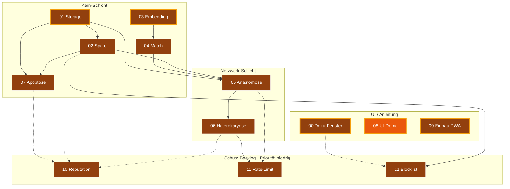

# Architektur

Diese Datei beschreibt das Gesamtbild. Sie ändert sich selten. Wenn du an
ihr etwas änderst, hat das wahrscheinlich Auswirkungen auf mehrere Module
und gehört in die Hauptsitzung.

---

## 0. Bau-DAG (Modul-Abhängigkeiten + Status)

Der Modul-Abhängigkeitsgraph mit Status-Farben. Goldene Outline =
**next-up** (alle Vorbedingungen erfüllt, selbst noch nicht fertig).
Farb-Mapping siehe [`INTERFACES.md` §5](INTERFACES.md). Quelle der
Status-Werte: [`../status.json`](../status.json).



Lesart: 🟫 = Schablone, 🟧 = In Werkstatt, 🟨 = Spec fertig, 🟦 = Code-Stub,
🟩 = Fertig. Goldene Outline ✨ = bereit zum Anpacken (alle
Abhängigkeiten fertig). Gestrichelte Pfeile = lockere Abhängigkeiten
(Schutz-Backlog setzt auf bestehende Module auf, ist aber selbst
optional).

Stand 2026-05-10: 00, 01, 03, 09 sind als Schablonen ohne
Abhängigkeiten **strukturell next-up** — eine Spec-Sitzung kann sie
sofort anpacken. 08 (UI-Demo) ist bereits in Werkstatt.

---

## 1. Das Gesamtbild

```
                  ┌──────────────────────────────┐
                  │   Sage-Protokol (dieses Repo)│
                  │                              │
                  │  Spezifikations- und Bau-Hub │
                  │                              │
                  │  - Module entwickeln/testen  │
                  │  - Specs pflegen             │
                  │  - Glossar / Doku            │
                  └──────────────┬───────────────┘
                                 │ Copy-Paste / Snippet-Übernahme
                  ┌──────────────┴───────────────┐
                  ▼                              ▼
        ┌─────────────────┐            ┌─────────────────┐
        │   Rezeptbuch    │            │    Mixarium     │
        │   (PWA)         │            │    (PWA)        │
        │                 │            │                 │
        │ Domäne:         │            │ Domäne:         │
        │ Kochrezepte     │            │ Cocktails       │
        │                 │            │                 │
        │ SBKIM-Knoten:   │            │ SBKIM-Knoten:   │
        │ Typ "hybrid"    │◄──────────►│ Typ "hybrid"    │
        └─────────────────┘  Anastomose└─────────────────┘
                  ▲                              ▲
                  │                              │
                  │     Heterokaryose (späterer  │
                  │     Modus, optional)         │
                  │                              │
                  ▼                              ▼
          (weitere Knoten anderer Betreiber, sobald sie
           SBKIM integriert haben — bisher keiner)
```

Die Endknoten (Rezeptbuch, Mixarium) liegen in **eigenen Repos** des
Betreibers und sind hier nicht enthalten. Dieses Repo liefert ihnen die
Module und die Anleitung zum Einbau.

Die Beschriftung „Domäne: Kochrezepte" bzw. „Domäne: Cocktails" ist
die **Stamm-Kategorie** des jeweiligen Knotens. Knoten dürfen
zusätzlich thematisch verbundene **Gast-Kategorien** führen
(z.B. Mixarium hat Knabbereien zum Drink, Rezeptbuch hat
Begleitgetränke zur Speise). Konzept und Konsequenzen für die
Module siehe [§ 8 unten](#8-stamm--und-gast-kategorien-domänen-schichtung).

---

## 2. Schichten innerhalb eines Knotens

Ein Endknoten (z.B. Rezeptbuch) wird beim Einbau um folgende Schichten
ergänzt, ohne dass die bestehende Anwendungsfunktion verändert wird:

```
┌────────────────────────────────────────────────────────────┐
│  Bestehende PWA (Rezeptbuch / Mixarium)                    │
│                                                            │
│  - Inhaltsdaten (Rezepte / Cocktails)                      │
│  - Lokale Suchfunktion (Volltext, Tags, Zutaten)           │
│  - UI                                                      │
└──────────────────────────┬─────────────────────────────────┘
                           │ smartSearch() greift erst hier,
                           │ wenn lokale Suche schwach
                           ▼
┌────────────────────────────────────────────────────────────┐
│  SBKIM-Schicht (per Modul-Einbau aus diesem Repo)          │
│                                                            │
│   ┌────────────┐   ┌────────────┐   ┌────────────┐         │
│   │ 00 Doku-   │   │ 08 UI-     │   │ 09 Einbau  │         │
│   │ Fenster    │   │ Demo       │   │ in PWA     │         │
│   └────────────┘   └────────────┘   └────────────┘         │
│                                                            │
│   ┌────────────┐   ┌────────────┐   ┌────────────┐         │
│   │ 05 Anasto- │◄─►│ 06 Hetero- │   │ 07 Apop-   │         │
│   │ mose       │   │ karyose    │   │ tose       │         │
│   └─────┬──────┘   └────────────┘   └─────┬──────┘         │
│         │                                 │                │
│         ▼                                 ▼                │
│   ┌────────────┐   ┌────────────┐   ┌────────────┐         │
│   │ 02 Spore   │   │ 04 Match   │   │ 03 Embed-  │         │
│   │ (Identität)│   │ (Vergleich)│   │ ding       │         │
│   └─────┬──────┘   └─────┬──────┘   └─────┬──────┘         │
│         │                │                │                │
│         └────────┬───────┴────────────────┘                │
│                  ▼                                         │
│            ┌────────────┐                                  │
│            │ 01 Storage │ (IndexedDB-Wrapper)              │
│            └────────────┘                                  │
└────────────────────────────────────────────────────────────┘
```

Pfeile sind Lese-/Schreib-Abhängigkeiten. Wer was darf, steht in
`INTERFACES.md`.

---

## 3. Kritischer Pfad (was zuerst funktionieren muss)

Damit ein Knoten überhaupt "leben" kann, müssen 01, 02, 03, 04 stehen.
Damit zwei Knoten sich finden können, kommt 05 dazu. Alles andere ist
Komfort und Reife.

Build-Reihenfolge:

1. **01 Storage** — ohne IndexedDB läuft nichts persistent
2. **03 Embedding** — unabhängig von 01, kann parallel gebaut werden
3. **02 Spore** — braucht 01 (Schlüsselablage)
4. **04 Match** — braucht 03 (Vektorvergleich)
5. **05 Anastomose** — braucht 02 und 04
6. **06 Heterokaryose** — braucht 05
7. **07 Apoptose** — braucht 02 und 01
8. **00 Doku-Fenster** — braucht nichts, kann jederzeit gebaut werden
9. **08 UI-Demo** — braucht alle anderen, ist Sichtprüfung
10. **09 Einbau-PWA** — Anleitung, entsteht parallel zu allem anderen

Module **01 + 03 + 00** können gleichzeitig in drei Sitzungen entstehen.

---

## 4. Multi-Sitzungs-Workflow

Drei Rollen:

- **Hauptsitzung**: liest `PULS.md`, entscheidet, was als nächstes ansteht,
  startet Bau- oder Spec-Sitzungen, integriert Ergebnisse, aktualisiert
  `INTERFACES.md` bei Querschnittsänderungen.
- **Spec-Sitzung**: füllt eine leere Komponenten-Karte mit der
  Detailspezifikation aus. Schreibt **keinen** Code. Liefert: gefüllte
  `docs/components/<NN>_<name>.md` + Eintrag in `INTERFACES.md`.
- **Bau-Sitzung**: implementiert ein Modul auf Basis seiner
  Komponenten-Karte und der `INTERFACES.md`. Liefert: Code in
  `src/modules/<nn>_<name>.js` + ggf. Test-Knopf in `tests/manual_check.html`
  + Aktualisierung der Karte um den Build-Status.

Eine Sitzung wird gestartet, indem der Betreiber das Briefing aus
`docs/sessions/BRIEFING_TEMPLATE.md` ausfüllt und in die neue Sitzung
einklebt.

---

## 5. Token-Sparmechanik

Eine Bau-Sitzung liest:

- `CLAUDE.md` (~150 Zeilen)
- `docs/PULS.md` (~80–400 Zeilen)
- `docs/ARCHITEKTUR.md` (diese Datei, ~150 Zeilen)
- `docs/INTERFACES.md` (~200 Zeilen, wenn voll)
- **eine** Komponenten-Karte (~80 Zeilen)
- ggf. **ein** Modul-Quellfile (~150 Zeilen)

Summe ~1000 Zeilen statt 5000+. Das ist die Ersparnis.

---

## 6. Was außerhalb der Module liegt

- **`sbkim_paper.pdf`** (theoretisches Papier, sofern vom Betreiber
  hinzugefügt) — Referenz, kein Code. Wird nur konsultiert, wenn eine
  Spec-Sitzung Begründungen braucht. Nicht in jeder Sitzung lesen.
- **`sbkim_integration.md`** — der Praxis-Leitfaden, der die Grundlage für
  dieses Repo war. Hilfreich beim Spec-Schreiben.
- **`docs/GLOSSAR.md`** — kompaktes Vokabular. Bei Begriffen unklar:
  zuerst dort nachschauen.

---

## 7. Konfigurationswerte (referenziert von INTERFACES.md)

```
PROTOCOL_VERSION       = "0.1"
NODE_TYPE              = "hybrid"
EMBEDDING_MODEL        = "Xenova/multilingual-e5-small"
EMBEDDING_DIM          = 384
PROVIDER_MIN_MATCH     = 0.80
LOCAL_RESULT_THRESHOLD = 3
QUERY_TIMEOUT_MS       = 4000
SBKIM_STORE_PREFIX     = "sbkim_"
DOKU_REVEAL_CLICKS     = 5     # Modul 00: 5 Klicks auf Such-Symbol
```

Änderungen hier sind **immer** Querschnittsänderungen → Hauptsitzung.

---

## 8. Stamm- und Gast-Kategorien (Domänen-Schichtung)

**Status:** Konzept, festgelegt 2026-05-15 in der Sitzung *Live Andock
Iteration 2 — Eruda + Stamm/Gast* (Übergabeprotokoll:
`docs/sessions/archiv/2026-05-15_live-andock-eruda-stamm-gast.md`).
Verbindliche Spec-Sitzung *„Stamm/Gast-Felder in Spore-JSON"* steht
noch aus — die Spore-Felder in `INTERFACES.md` §2 sind dann additiv,
ohne Hauptversions-Sprung, weil sie als **optional** geführt werden.

### Worum es geht

Die ursprüngliche Vorstellung war, dass jeder Endknoten eine
**scharf umrissene Domäne** hat: Rezeptbuch = Kochrezepte, Mixarium
= Cocktails. Die Praxis aus den ersten Daten-Sichtungen (Mixarium
hatte 6 Sushi-Einträge mit verwaister Kategorie-ID; Rezeptbuch hat
schon Getränke zu Speisen drin) zeigt, dass die Knoten in
Wirklichkeit **gewichtete** Domänen haben, nicht scharfe.

Das Konzept ist **kein** Bruch der Domänen-Schärfe — es macht die
Schichtung explizit und maschinenlesbar:

- **Stamm-Kategorien** sind das Kerngebiet, das der Knoten primär
  ausstrahlt. Beispiel Mixarium: `Cocktails`, `Mocktails`,
  `Limonaden`, `Smoothies & Shakes`, später `Wein`.
  Beispiel Rezeptbuch: `Vorspeisen`, `Fleisch`, `Fisch`,
  `Vegetarisch`, `Suppen`.
- **Gast-Kategorien** sind thematisch verbundene Begleit-Items,
  Klaus nennt es UI-seitig „Überraschungs-Plus". Beispiel Mixarium:
  `Knabbereien`, `Fingerfood`. Beispiel Rezeptbuch:
  `Begleitgetränke`, später `Weinkarte`.

Die **thematische Bindung** ist die Grenze: ein Würth-Shop verkauft
Schrauben (Stamm) und Werkzeug (Gast), aber **kein** Spielzeug.
Mixarium hat Drinks (Stamm) und Knabbereien dazu (Gast), aber **kein**
komplettes Hauptgerichte-Repertoire — dafür gibt es das Rezeptbuch.

### Konsequenz für die Module

| Modul | Konsequenz |
|---|---|
| **02 Spore** | Spore-JSON bekommt zwei **optionale** Felder: `stammCategories: string[]` und `guestCategories: string[]` (Namen final in Spec-Sitzung; siehe Offene Frage 1). Verbindlichkeit: signaturpflichtig, wenn vorhanden — wie die übrigen Optionalen aus §2 Spore-JSON. **Kein** Hauptversions-Sprung. |
| **03 Embedding** | Stamm und Gast werden **getrennt** vektorisiert; ein Knoten kann sowohl `domainVector` (Default, alle Kategorien) als auch `stammVector` / `guestVector` mitliefern. Wie genau gewichtet wird, ist Sache der Spec-Sitzung (siehe Offene Frage 2). |
| **04 Match** | Wirt-Treffer (Stamm ↔ Stamm zwischen zwei Knoten) bekommen den vollen Cosinus-Score. Gast-Treffer (Stamm ↔ Gast, also „Drink-Frage an Rezeptbuch") werden mit einem **Dämpfungsfaktor** zurückgereicht (Default-Vorschlag: `0.5`, finale Zahl in Spec-Sitzung). Damit bleibt `PROVIDER_MIN_MATCH=0.80` als Schwelle stabil — ein guter Gast-Treffer ist seltener so präzise wie ein guter Stamm-Treffer, das spiegelt sich im Score. |
| **05 Anastomose** | Handshake-Pfad ändert sich **nicht**. Zwei Knoten dürfen sich verbinden, auch wenn der Match nur über Gast-Kategorien zustande kommt — sie sind dann „Stamm-Nachbarn" bzw. „Gast-Nachbarn", ohne dass die Verbindung selbst zwei Klassen kennt. Klassifizierung passiert in Modul 04. |
| **00 / 08 / 09** | UI-seitig: Endknoten zeigt Stamm-Kategorien prominent (Hauptfilter oben), Gast-Kategorien sichtbar aber sekundär (z.B. eigener Tab „+ überraschend dazu"). Karte 09 Schritt 6 (`smartSearch`-Verdrahtung) bekommt einen Hinweis: bei lokal nur Gast-Treffern darf der Schwellwert für SBKIM-Anfrage anders sein als bei Stamm-Treffern (Detail in Spec-Sitzung). |

### Konsequenz für andere Knoten (Diffusion / Heterokaryose / Apoptose)

- **06 Heterokaryose** (Pull): Ein Knoten holt sich Anker von einem
  Geschwister — wenn der Geschwister Stamm/Gast unterscheidet,
  können die Anker in zwei Listen kommen. Nicht zwingend für die
  erste Heterokaryose-Iteration; additive Erweiterung möglich.
- **07 Apoptose** (Vermächtnis): unverändert. Vermächtnis sagt
  „Knoten X ist tot" — die Schichtung der Domäne ist nicht Teil
  der Sterbenachricht.
- **14 Diffusion** (Empfehlung beim Handshake): `recommendedPeers`
  könnte zukünftig nach Stamm/Gast-Bezug filtern („empfehle mir
  einen Peer, der mein Gast-Thema als Stamm hat"). Stub-Block; in
  Modul 14 erstmal nur als offene Frage notieren.

### Offene Fragen (für eine Folge-Spec-Sitzung)

1. **Feld-Benennung in Spore-JSON:** `stammCategories` /
   `guestCategories` (deutsch, im Stil von `domainKeywords`) oder
   englischer `coreCategories` / `guestCategories`? Deutsche
   Variante ist konsistent mit „Wirt" → „Stamm" als
   Übersetzungs-Erkenntnis aus dieser Sitzung; englische Variante
   wäre konsistent mit dem Rest des Schemas (`createdAt`,
   `nodeType`, `domainVector`). Kein Show-Stopper, Spec-Sitzung
   entscheidet.
2. **Gewichtung in Match:** Dämpfungsfaktor für Stamm↔Gast-Matches
   verbindlich festlegen. Default-Vorschlag `0.5` (also Score wird
   halbiert, bevor er gegen `PROVIDER_MIN_MATCH=0.80` geprüft
   wird) ist plausibel, aber empirisch zu prüfen wenn die ersten
   echten Stamm/Gast-Vektoren vorliegen.
3. **`domainVector` als Gesamt-Vektor vs. zwei separate Vektoren:**
   reicht ein einziger `domainVector` (über alle Kategorien
   gemittelt) plus die zwei String-Listen für UI-Logik, oder
   braucht es separate `stammVector` / `guestVector`? Match-
   Modul-Performance-Frage.
4. **UI-Label:** Klaus' Begriff „Überraschungs-Plus" bleibt
   verbindlich für die App-UI (Mixarium / Rezeptbuch), oder weicht
   beim Live-Einbau für etwas Knapperes („Plus"), sobald die UI-
   Werkstatt das tatsächlich zeichnet?

### UI-Begriff vs. technischer Begriff

```
technisch (Spore-JSON, Manifest)         →  stamm / gast
in UI-Karten (Endknoten-PWA)              →  Stamm-Kategorie /
                                              „Überraschungs-Plus"
im Sage-Protokol-Dokumenten               →  Stamm / Gast (groß)
```

Der **UI-Begriff** ist menschlich-charmant („Überraschungs-Plus"),
der **technische Begriff** ist maschinen-lesbar (`gast`). Beide
beschreiben dieselbe Klasse — die Trennung gilt nur in der
Sichtbarkeit, nicht in der Datenstruktur.
