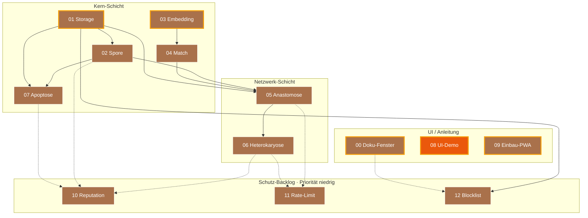

# Architektur

Diese Datei beschreibt das Gesamtbild. Sie ändert sich selten. Wenn du an
ihr etwas änderst, hat das wahrscheinlich Auswirkungen auf mehrere Module
und gehört in die Hauptsitzung.

---

## 0. Bau-DAG (Modul-Abhängigkeiten + Status)

Der Modul-Abhängigkeitsgraph mit Status-Farben. Goldene Outline =
**next-up** (alle Vorbedingungen erfüllt, selbst noch nicht fertig).
Farb-Mapping siehe [`INTERFACES.md` §5](INTERFACES.md). Quelle der
Status-Werte: [`../status.json`](../status.json).



Lesart: 🟫 = Schablone, 🟧 = In Werkstatt, 🟨 = Spec fertig, 🟦 = Code-Stub,
🟩 = Fertig. Goldene Outline ✨ = bereit zum Anpacken (alle
Abhängigkeiten fertig). Gestrichelte Pfeile = lockere Abhängigkeiten
(Schutz-Backlog setzt auf bestehende Module auf, ist aber selbst
optional).

Stand 2026-05-10: 00, 01, 03, 09 sind als Schablonen ohne
Abhängigkeiten **strukturell next-up** — eine Spec-Sitzung kann sie
sofort anpacken. 08 (UI-Demo) ist bereits in Werkstatt.

---

## 1. Das Gesamtbild

```
                  ┌──────────────────────────────┐
                  │   Sage-Protokol (dieses Repo)│
                  │                              │
                  │  Spezifikations- und Bau-Hub │
                  │                              │
                  │  - Module entwickeln/testen  │
                  │  - Specs pflegen             │
                  │  - Glossar / Doku            │
                  └──────────────┬───────────────┘
                                 │ Copy-Paste / Snippet-Übernahme
                  ┌──────────────┴───────────────┐
                  ▼                              ▼
        ┌─────────────────┐            ┌─────────────────┐
        │   Rezeptbuch    │            │    Mixarium     │
        │   (PWA)         │            │    (PWA)        │
        │                 │            │                 │
        │ Domäne:         │            │ Domäne:         │
        │ Kochrezepte     │            │ Cocktails       │
        │                 │            │                 │
        │ SBKIM-Knoten:   │            │ SBKIM-Knoten:   │
        │ Typ "hybrid"    │◄──────────►│ Typ "hybrid"    │
        └─────────────────┘  Anastomose└─────────────────┘
                  ▲                              ▲
                  │                              │
                  │     Heterokaryose (späterer  │
                  │     Modus, optional)         │
                  │                              │
                  ▼                              ▼
          (weitere Knoten anderer Betreiber, sobald sie
           SBKIM integriert haben — bisher keiner)
```

Die Endknoten (Rezeptbuch, Mixarium) liegen in **eigenen Repos** des
Betreibers und sind hier nicht enthalten. Dieses Repo liefert ihnen die
Module und die Anleitung zum Einbau.

Die Beschriftung „Domäne: Kochrezepte" bzw. „Domäne: Cocktails" ist
die **Stamm-Kategorie** des jeweiligen Knotens. Knoten dürfen
zusätzlich thematisch verbundene **Gast-Kategorien** führen
(z.B. Mixarium hat Knabbereien zum Drink, Rezeptbuch hat
Begleitgetränke zur Speise). Konzept und Konsequenzen für die
Module siehe [§ 8 unten](#8-stamm--und-gast-kategorien-domänen-schichtung).

---

## 2. Schichten innerhalb eines Knotens

Ein Endknoten (z.B. Rezeptbuch) wird beim Einbau um folgende Schichten
ergänzt, ohne dass die bestehende Anwendungsfunktion verändert wird:

```
┌────────────────────────────────────────────────────────────┐
│  Bestehende PWA (Rezeptbuch / Mixarium)                    │
│                                                            │
│  - Inhaltsdaten (Rezepte / Cocktails)                      │
│  - Lokale Suchfunktion (Volltext, Tags, Zutaten)           │
│  - UI                                                      │
└──────────────────────────┬─────────────────────────────────┘
                           │ smartSearch() greift erst hier,
                           │ wenn lokale Suche schwach
                           ▼
┌────────────────────────────────────────────────────────────┐
│  SBKIM-Schicht (per Modul-Einbau aus diesem Repo)          │
│                                                            │
│   ┌────────────┐   ┌────────────┐   ┌────────────┐         │
│   │ 00 Doku-   │   │ 08 UI-     │   │ 09 Einbau  │         │
│   │ Fenster    │   │ Demo       │   │ in PWA     │         │
│   └────────────┘   └────────────┘   └────────────┘         │
│                                                            │
│   ┌────────────┐   ┌────────────┐   ┌────────────┐         │
│   │ 05 Anasto- │◄─►│ 06 Hetero- │   │ 07 Apop-   │         │
│   │ mose       │   │ karyose    │   │ tose       │         │
│   └─────┬──────┘   └────────────┘   └─────┬──────┘         │
│         │                                 │                │
│         ▼                                 ▼                │
│   ┌────────────┐   ┌────────────┐   ┌────────────┐         │
│   │ 02 Spore   │   │ 04 Match   │   │ 03 Embed-  │         │
│   │ (Identität)│   │ (Vergleich)│   │ ding       │         │
│   └─────┬──────┘   └─────┬──────┘   └─────┬──────┘         │
│         │                │                │                │
│         └────────┬───────┴────────────────┘                │
│                  ▼                                         │
│            ┌────────────┐                                  │
│            │ 01 Storage │ (IndexedDB-Wrapper)              │
│            └────────────┘                                  │
└────────────────────────────────────────────────────────────┘
```

Pfeile sind Lese-/Schreib-Abhängigkeiten. Wer was darf, steht in
`INTERFACES.md`.

---

## 3. Kritischer Pfad (was zuerst funktionieren muss)

Damit ein Knoten überhaupt "leben" kann, müssen 01, 02, 03, 04 stehen.
Damit zwei Knoten sich finden können, kommt 05 dazu. Alles andere ist
Komfort und Reife.

Build-Reihenfolge:

1. **01 Storage** — ohne IndexedDB läuft nichts persistent
2. **03 Embedding** — unabhängig von 01, kann parallel gebaut werden
3. **02 Spore** — braucht 01 (Schlüsselablage)
4. **04 Match** — braucht 03 (Vektorvergleich)
5. **05 Anastomose** — braucht 02 und 04
6. **06 Heterokaryose** — braucht 05
7. **07 Apoptose** — braucht 02 und 01
8. **00 Doku-Fenster** — braucht nichts, kann jederzeit gebaut werden
9. **08 UI-Demo** — braucht alle anderen, ist Sichtprüfung
10. **09 Einbau-PWA** — Anleitung, entsteht parallel zu allem anderen

Module **01 + 03 + 00** können gleichzeitig in drei Sitzungen entstehen.

---

## 4. Multi-Sitzungs-Workflow

Drei Rollen:

- **Hauptsitzung**: liest `PULS.md`, entscheidet, was als nächstes ansteht,
  startet Bau- oder Spec-Sitzungen, integriert Ergebnisse, aktualisiert
  `INTERFACES.md` bei Querschnittsänderungen.
- **Spec-Sitzung**: füllt eine leere Komponenten-Karte mit der
  Detailspezifikation aus. Schreibt **keinen** Code. Liefert: gefüllte
  `docs/components/<NN>_<name>.md` + Eintrag in `INTERFACES.md`.
- **Bau-Sitzung**: implementiert ein Modul auf Basis seiner
  Komponenten-Karte und der `INTERFACES.md`. Liefert: Code in
  `src/modules/<nn>_<name>.js` + ggf. Test-Knopf in `tests/manual_check.html`
  + Aktualisierung der Karte um den Build-Status.

Eine Sitzung wird gestartet, indem der Betreiber das Briefing aus
`docs/sessions/BRIEFING_TEMPLATE.md` ausfüllt und in die neue Sitzung
einklebt.

---

## 5. Token-Sparmechanik

Eine Bau-Sitzung liest:

- `CLAUDE.md` (~150 Zeilen)
- `docs/PULS.md` (~80–400 Zeilen)
- `docs/ARCHITEKTUR.md` (diese Datei, ~150 Zeilen)
- `docs/INTERFACES.md` (~200 Zeilen, wenn voll)
- **eine** Komponenten-Karte (~80 Zeilen)
- ggf. **ein** Modul-Quellfile (~150 Zeilen)

Summe ~1000 Zeilen statt 5000+. Das ist die Ersparnis.

---

## 6. Was außerhalb der Module liegt

- **`sbkim_paper.pdf`** (theoretisches Papier, sofern vom Betreiber
  hinzugefügt) — Referenz, kein Code. Wird nur konsultiert, wenn eine
  Spec-Sitzung Begründungen braucht. Nicht in jeder Sitzung lesen.
- **`sbkim_integration.md`** — der Praxis-Leitfaden, der die Grundlage für
  dieses Repo war. Hilfreich beim Spec-Schreiben.
- **`docs/GLOSSAR.md`** — kompaktes Vokabular. Bei Begriffen unklar:
  zuerst dort nachschauen.

---

## 7. Konfigurationswerte (referenziert von INTERFACES.md)

```
PROTOCOL_VERSION       = "0.1"
NODE_TYPE              = "hybrid"
EMBEDDING_MODEL        = "Xenova/multilingual-e5-small"
EMBEDDING_DIM          = 384
PROVIDER_MIN_MATCH     = 0.80
LOCAL_RESULT_THRESHOLD = 3
QUERY_TIMEOUT_MS       = 4000
SBKIM_STORE_PREFIX     = "sbkim_"
DOKU_REVEAL_CLICKS     = 5     # Modul 00: 5 Klicks auf Such-Symbol
```

Änderungen hier sind **immer** Querschnittsänderungen → Hauptsitzung.

---

## 8. Stamm- und Gast-Kategorien (Domänen-Schichtung)

**Status:** Konzept festgelegt 2026-05-15 in der Sitzung *Live Andock
Iteration 2 — Eruda + Stamm/Gast* (Übergabeprotokoll:
`docs/sessions/archiv/2026-05-15_live-andock-eruda-stamm-gast.md`).
**Spec festgelegt 2026-05-15 in der Spec-Sitzung „Stamm/Gast-Felder
in Spore-JSON"** (Übergabeprotokoll:
`docs/sessions/archiv/2026-05-15_spec-stamm-gast-spore-felder.md`) —
INTERFACES.md §2 Spore-JSON um zwei optionale Felder
(`stammCategories: string[]`, `guestCategories: string[]`) erweitert,
additiv, ohne Hauptversions-Sprung. Karte 02 nachgezogen; Karte 04
mit dem Hinweis ergänzt, dass Stamm/Gast Modul 04 nicht berührt
(keine Match-Dämpfung, keine zweite Schwelle).

### Worum es geht

Die ursprüngliche Vorstellung war, dass jeder Endknoten eine
**scharf umrissene Domäne** hat: Rezeptbuch = Kochrezepte, Mixarium
= Cocktails. Die Praxis aus den ersten Daten-Sichtungen (Mixarium
hatte 6 Sushi-Einträge mit verwaister Kategorie-ID; Rezeptbuch hat
schon Getränke zu Speisen drin) zeigt, dass die Knoten in
Wirklichkeit **gewichtete** Domänen haben, nicht scharfe.

Das Konzept ist **kein** Bruch der Domänen-Schärfe — es macht die
Schichtung explizit und maschinenlesbar:

- **Stamm-Kategorien** sind das Kerngebiet, das der Knoten primär
  ausstrahlt. Beispiel Mixarium: `Cocktails`, `Mocktails`,
  `Limonaden`, `Smoothies & Shakes`, später `Wein`.
  Beispiel Rezeptbuch: `Vorspeisen`, `Fleisch`, `Fisch`,
  `Vegetarisch`, `Suppen`.
- **Gast-Kategorien** sind thematisch verbundene Begleit-Items,
  Klaus nennt es UI-seitig „Überraschungs-Plus". Beispiel Mixarium:
  `Knabbereien`, `Fingerfood`. Beispiel Rezeptbuch:
  `Begleitgetränke`, später `Weinkarte`.

Die **thematische Bindung** ist die Grenze: ein Würth-Shop verkauft
Schrauben (Stamm) und Werkzeug (Gast), aber **kein** Spielzeug.
Mixarium hat Drinks (Stamm) und Knabbereien dazu (Gast), aber **kein**
komplettes Hauptgerichte-Repertoire — dafür gibt es das Rezeptbuch.

### Konsequenz für die Module (nach Spec-Sitzung 2026-05-15)

| Modul | Konsequenz |
|---|---|
| **02 Spore** | Spore-JSON bekommt zwei **optionale** Felder: `stammCategories: string[]` und `guestCategories: string[]`. Verbindlichkeit: signaturpflichtig, wenn vorhanden — wie die übrigen Optionalen aus §2 Spore-JSON. **Kein** Hauptversions-Sprung. **Disjunktheit** (kein Element in beiden Listen) ist Hosting-Pflicht des Knotens, **kein** Verify-Abbruch-Grund. Karte 02 nachgezogen 2026-05-15. |
| **03 Embedding** | **Erst-Iteration unverändert** — ein einziger `domainVector` (Default, gemittelt über alle Kategorien) reicht. Separate `stammVector` / `guestVector` sind eine Folge-Pflege-Sitzung, sobald empirisch nachgewiesen ist, dass getrennte Vektoren den Match-Score erkennbar verbessern. |
| **04 Match** | **Unverändert.** `match()` bleibt reine Cosinus-Mathematik, `isAboveProviderThreshold()` bleibt eine einzige Schwelle. Stamm/Gast ist Klassifikations-Schicht (UI, Modul 08/09), nicht Vektor-Math. Karte 04 mit explizitem Hinweis dazu ergänzt 2026-05-15 (verhindert, dass eine spätere Bau-Sitzung einen Dämpfungsfaktor einbaut „weil er hier mal stand"). |
| **05 Anastomose** | Handshake-Pfad **unverändert**. Zwei Knoten verbinden sich anhand der Vektor-Ähnlichkeit ihrer Domäne als Ganzes — die Schicht-Zugehörigkeit ist nicht Teil des Handshakes. |
| **00 / 08 / 09** | UI-seitig: Endknoten zeigt Stamm-Kategorien prominent (Hauptfilter oben), Gast-Kategorien sichtbar als „Überraschungs-Plus"-Sub-Tab oder analog. Konkrete UI-Verdrahtung in Karte 09 Schritt 6 (`smartSearch`-Wrapper): bei Treffern in `guestCategories` Label `[+]` voranstellen oder analoge UI-Markierung. Spec für die UI-Verdrahtung steht in einer Folge-Pflege-Sitzung (UI ist nicht Sache dieser Spec-Sitzung). |

### Konsequenz für andere Knoten (Diffusion / Heterokaryose / Apoptose)

- **06 Heterokaryose** (Pull): Ein Knoten holt sich Anker von einem
  Geschwister — wenn der Geschwister Stamm/Gast unterscheidet,
  können die Anker in zwei Listen kommen. Nicht zwingend für die
  erste Heterokaryose-Iteration; additive Erweiterung möglich.
- **07 Apoptose** (Vermächtnis): unverändert. Vermächtnis sagt
  „Knoten X ist tot" — die Schichtung der Domäne ist nicht Teil
  der Sterbenachricht.
- **14 Diffusion** (Empfehlung beim Handshake): `recommendedPeers`
  könnte zukünftig nach Stamm/Gast-Bezug filtern („empfehle mir
  einen Peer, der mein Gast-Thema als Stamm hat"). Stub-Block; in
  Modul 14 erstmal nur als offene Frage notieren.

### Offene Fragen (gelöst in der Spec-Sitzung 2026-05-15)

1. ~~**Feld-Benennung in Spore-JSON:**~~ — **gelöst:**
   `stammCategories` / `guestCategories`. Mixed-Convention konsistent
   mit dem Rest des Sage-Vokabulars: die SBKIM-Fachbegriffe (Spore,
   Anastomose, Heterokaryose, Apoptose) sind deutsch und werden nicht
   anglisiert; das umgebende Schema bleibt englisch (`createdAt`,
   `nodeType`, `domainVector`). „Stamm" und „Gast" sind feststehende
   Sage-Begriffe, also gehen sie in den Feldnamen mit ein.
2. ~~**Gewichtung in Match:**~~ — **gelöst durch Entscheidung
   „kein Match-Eingriff":** Stamm/Gast ist eine Klassifikations-
   Schicht auf Daten-Ebene, nicht Vektor-Math. Modul 04 bleibt
   modus-frei mit einer Schwelle (`PROVIDER_MIN_MATCH=0.80`). Begründung
   in Karte 04 § „Stamm/Gast-Klassifikation berührt Modul 04 nicht".
   Sollte spätere Empirik einen Match-Eingriff motivieren, ist das
   Anlass für eine eigene Pflege-Sitzung.
3. ~~**`domainVector` als Gesamt-Vektor vs. zwei separate Vektoren:**~~
   — **gelöst für Erst-Iteration:** ein einziger `domainVector` (über
   alle Kategorien gemittelt) bleibt der Default. Separate
   `stammVector` / `guestVector` werden additiv in einer Folge-
   Pflege-Sitzung aufgenommen, sobald Klaus' Live-Andock die
   Match-Verteilung empirisch zeigt.
4. ~~**UI-Label:**~~ — **gelöst:** Klaus' Begriff **„Überraschungs-Plus"**
   bleibt verbindlich für die Endknoten-App-UI (Mixarium / Rezeptbuch).
   Sage-Page-Doku und Sage-Protokol-Spec verwenden den technischen
   Begriff „Gast-Kategorie".

### UI-Begriff vs. technischer Begriff

```
technisch (Spore-JSON, Manifest)         →  stamm / gast
in UI-Karten (Endknoten-PWA)              →  Stamm-Kategorie /
                                              „Überraschungs-Plus"
im Sage-Protokol-Dokumenten               →  Stamm / Gast (groß)
```

Der **UI-Begriff** ist menschlich-charmant („Überraschungs-Plus"),
der **technische Begriff** ist maschinen-lesbar (`gast`). Beide
beschreiben dieselbe Klasse — die Trennung gilt nur in der
Sichtbarkeit, nicht in der Datenstruktur.
