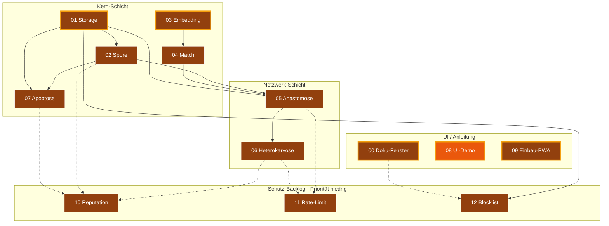

# Architektur

Diese Datei beschreibt das Gesamtbild. Sie ändert sich selten. Wenn du an
ihr etwas änderst, hat das wahrscheinlich Auswirkungen auf mehrere Module
und gehört in die Hauptsitzung.

---

## 0. Bau-DAG (Modul-Abhängigkeiten + Status)

Der Modul-Abhängigkeitsgraph mit Status-Farben. Goldene Outline =
**next-up** (alle Vorbedingungen erfüllt, selbst noch nicht fertig).
Farb-Mapping siehe [`INTERFACES.md` §5](INTERFACES.md). Quelle der
Status-Werte: [`../status.json`](../status.json).



Lesart: 🟫 = Schablone, 🟧 = In Werkstatt, 🟨 = Spec fertig, 🟦 = Code-Stub,
🟩 = Fertig. Goldene Outline ✨ = bereit zum Anpacken (alle
Abhängigkeiten fertig). Gestrichelte Pfeile = lockere Abhängigkeiten
(Schutz-Backlog setzt auf bestehende Module auf, ist aber selbst
optional).

Stand 2026-05-10: 00, 01, 03, 09 sind als Schablonen ohne
Abhängigkeiten **strukturell next-up** — eine Spec-Sitzung kann sie
sofort anpacken. 08 (UI-Demo) ist bereits in Werkstatt.

---

## 1. Das Gesamtbild

```
                  ┌──────────────────────────────┐
                  │   Sage-Protokol (dieses Repo)│
                  │                              │
                  │  Spezifikations- und Bau-Hub │
                  │                              │
                  │  - Module entwickeln/testen  │
                  │  - Specs pflegen             │
                  │  - Glossar / Doku            │
                  └──────────────┬───────────────┘
                                 │ Copy-Paste / Snippet-Übernahme
                  ┌──────────────┴───────────────┐
                  ▼                              ▼
        ┌─────────────────┐            ┌─────────────────┐
        │   Rezeptbuch    │            │    Mixarium     │
        │   (PWA)         │            │    (PWA)        │
        │                 │            │                 │
        │ Domäne:         │            │ Domäne:         │
        │ Kochrezepte     │            │ Cocktails       │
        │                 │            │                 │
        │ SBKIM-Knoten:   │            │ SBKIM-Knoten:   │
        │ Typ "hybrid"    │◄──────────►│ Typ "hybrid"    │
        └─────────────────┘  Anastomose└─────────────────┘
                  ▲                              ▲
                  │                              │
                  │     Heterokaryose (späterer  │
                  │     Modus, optional)         │
                  │                              │
                  ▼                              ▼
          (weitere Knoten anderer Betreiber, sobald sie
           SBKIM integriert haben — bisher keiner)
```

Die Endknoten (Rezeptbuch, Mixarium) liegen in **eigenen Repos** des
Betreibers und sind hier nicht enthalten. Dieses Repo liefert ihnen die
Module und die Anleitung zum Einbau.

---

## 2. Schichten innerhalb eines Knotens

Ein Endknoten (z.B. Rezeptbuch) wird beim Einbau um folgende Schichten
ergänzt, ohne dass die bestehende Anwendungsfunktion verändert wird:

```
┌────────────────────────────────────────────────────────────┐
│  Bestehende PWA (Rezeptbuch / Mixarium)                    │
│                                                            │
│  - Inhaltsdaten (Rezepte / Cocktails)                      │
│  - Lokale Suchfunktion (Volltext, Tags, Zutaten)           │
│  - UI                                                      │
└──────────────────────────┬─────────────────────────────────┘
                           │ smartSearch() greift erst hier,
                           │ wenn lokale Suche schwach
                           ▼
┌────────────────────────────────────────────────────────────┐
│  SBKIM-Schicht (per Modul-Einbau aus diesem Repo)          │
│                                                            │
│   ┌────────────┐   ┌────────────┐   ┌────────────┐         │
│   │ 00 Doku-   │   │ 08 UI-     │   │ 09 Einbau  │         │
│   │ Fenster    │   │ Demo       │   │ in PWA     │         │
│   └────────────┘   └────────────┘   └────────────┘         │
│                                                            │
│   ┌────────────┐   ┌────────────┐   ┌────────────┐         │
│   │ 05 Anasto- │◄─►│ 06 Hetero- │   │ 07 Apop-   │         │
│   │ mose       │   │ karyose    │   │ tose       │         │
│   └─────┬──────┘   └────────────┘   └─────┬──────┘         │
│         │                                 │                │
│         ▼                                 ▼                │
│   ┌────────────┐   ┌────────────┐   ┌────────────┐         │
│   │ 02 Spore   │   │ 04 Match   │   │ 03 Embed-  │         │
│   │ (Identität)│   │ (Vergleich)│   │ ding       │         │
│   └─────┬──────┘   └─────┬──────┘   └─────┬──────┘         │
│         │                │                │                │
│         └────────┬───────┴────────────────┘                │
│                  ▼                                         │
│            ┌────────────┐                                  │
│            │ 01 Storage │ (IndexedDB-Wrapper)              │
│            └────────────┘                                  │
└────────────────────────────────────────────────────────────┘
```

Pfeile sind Lese-/Schreib-Abhängigkeiten. Wer was darf, steht in
`INTERFACES.md`.

---

## 3. Kritischer Pfad (was zuerst funktionieren muss)

Damit ein Knoten überhaupt "leben" kann, müssen 01, 02, 03, 04 stehen.
Damit zwei Knoten sich finden können, kommt 05 dazu. Alles andere ist
Komfort und Reife.

Build-Reihenfolge:

1. **01 Storage** — ohne IndexedDB läuft nichts persistent
2. **03 Embedding** — unabhängig von 01, kann parallel gebaut werden
3. **02 Spore** — braucht 01 (Schlüsselablage)
4. **04 Match** — braucht 03 (Vektorvergleich)
5. **05 Anastomose** — braucht 02 und 04
6. **06 Heterokaryose** — braucht 05
7. **07 Apoptose** — braucht 02 und 01
8. **00 Doku-Fenster** — braucht nichts, kann jederzeit gebaut werden
9. **08 UI-Demo** — braucht alle anderen, ist Sichtprüfung
10. **09 Einbau-PWA** — Anleitung, entsteht parallel zu allem anderen

Module **01 + 03 + 00** können gleichzeitig in drei Sitzungen entstehen.

---

## 4. Multi-Sitzungs-Workflow

Drei Rollen:

- **Hauptsitzung**: liest `PULS.md`, entscheidet, was als nächstes ansteht,
  startet Bau- oder Spec-Sitzungen, integriert Ergebnisse, aktualisiert
  `INTERFACES.md` bei Querschnittsänderungen.
- **Spec-Sitzung**: füllt eine leere Komponenten-Karte mit der
  Detailspezifikation aus. Schreibt **keinen** Code. Liefert: gefüllte
  `docs/components/<NN>_<name>.md` + Eintrag in `INTERFACES.md`.
- **Bau-Sitzung**: implementiert ein Modul auf Basis seiner
  Komponenten-Karte und der `INTERFACES.md`. Liefert: Code in
  `src/modules/<nn>_<name>.js` + ggf. Test-Knopf in `tests/manual_check.html`
  + Aktualisierung der Karte um den Build-Status.

Eine Sitzung wird gestartet, indem der Betreiber das Briefing aus
`docs/sessions/BRIEFING_TEMPLATE.md` ausfüllt und in die neue Sitzung
einklebt.

---

## 5. Token-Sparmechanik

Eine Bau-Sitzung liest:

- `CLAUDE.md` (~150 Zeilen)
- `docs/PULS.md` (~80–400 Zeilen)
- `docs/ARCHITEKTUR.md` (diese Datei, ~150 Zeilen)
- `docs/INTERFACES.md` (~200 Zeilen, wenn voll)
- **eine** Komponenten-Karte (~80 Zeilen)
- ggf. **ein** Modul-Quellfile (~150 Zeilen)

Summe ~1000 Zeilen statt 5000+. Das ist die Ersparnis.

---

## 6. Was außerhalb der Module liegt

- **`sbkim_paper.pdf`** (theoretisches Papier, sofern vom Betreiber
  hinzugefügt) — Referenz, kein Code. Wird nur konsultiert, wenn eine
  Spec-Sitzung Begründungen braucht. Nicht in jeder Sitzung lesen.
- **`sbkim_integration.md`** — der Praxis-Leitfaden, der die Grundlage für
  dieses Repo war. Hilfreich beim Spec-Schreiben.
- **`docs/GLOSSAR.md`** — kompaktes Vokabular. Bei Begriffen unklar:
  zuerst dort nachschauen.

---

## 7. Konfigurationswerte (referenziert von INTERFACES.md)

```
PROTOCOL_VERSION       = "0.1"
NODE_TYPE              = "hybrid"
EMBEDDING_MODEL        = "Xenova/multilingual-e5-small"
EMBEDDING_DIM          = 384
PROVIDER_MIN_MATCH     = 0.80
LOCAL_RESULT_THRESHOLD = 3
QUERY_TIMEOUT_MS       = 4000
SBKIM_STORE_PREFIX     = "sbkim_"
DOKU_REVEAL_CLICKS     = 5     # Modul 00: 5 Klicks auf Such-Symbol
```

Änderungen hier sind **immer** Querschnittsänderungen → Hauptsitzung.
