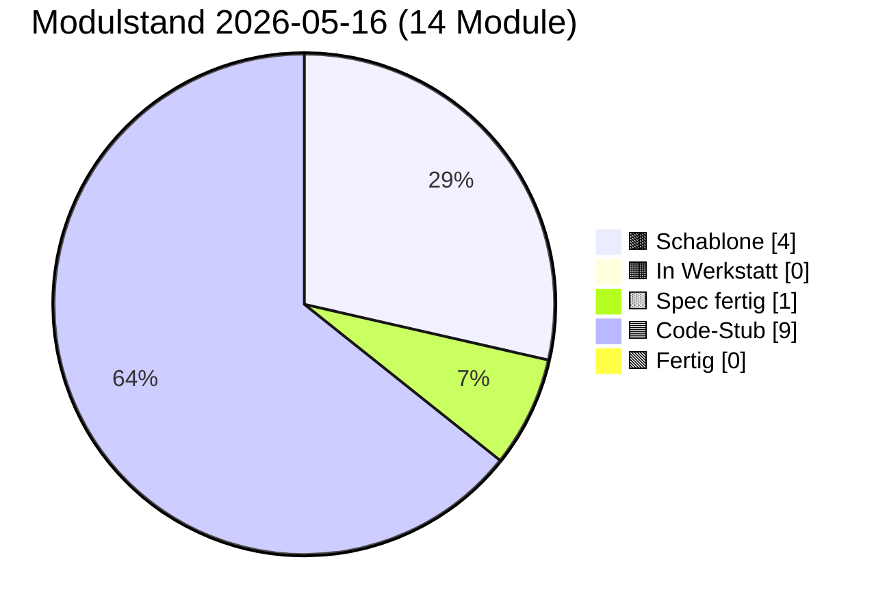

# PULS — lebender Status

**Format:** Jede Sitzung trägt unten einen Eintrag ein (neueste oben).
**Pflichtfelder pro Eintrag:** Datum · Sitzungs-Rolle · was getan · was offen · nächster sinnvoller Schritt.
**Begrenzung:** Diese Datei darf 400 Zeilen nicht überschreiten. Älteres ins
`docs/sessions/archiv/`-Verzeichnis als Übergabeprotokoll auslagern.

---

## Modulstand heute

<!-- Pie-Block ab hier wird automatisch aus status.json generiert.
     Nicht von Hand bearbeiten. Erzeugen mit:
     python3 scripts/update_puls_pie.py
     Aufruf-Pflicht: nach jeder status.json-Änderung. Siehe CLAUDE.md. -->

Farb-Mapping verbindlich in [INTERFACES.md §5](INTERFACES.md). Live-Bau-Puls
auf der [Sage-Page](../index.html) (Karte "Bau-Puls").

## Als nächstes ✨

Module mit Code-Stub, **Sichttest durch Klaus 2026-05-14 erledigt** —
ergab fünf reproduzierbare Cosinus-Messwerte (siehe Karte 04 Beleg-
Block), die in der Pflege-Sitzung 2026-05-14 zu `PROVIDER_MIN_MATCH`
0.55 → 0.80 geführt haben:

- 🟦 **[01 Storage](components/01_storage.md)** — geprüft 2026-05-14 (Klaus, im Browser); init/round-trip/Unknown-Store sauber, sechs Stores in DevTools sichtbar
- 🟦 **[02 Spore](components/02_spore.md)** — geprüft 2026-05-14 + 2026-05-16 (Klaus, im Browser); Identität deterministisch, Spore sortiert, Sign+Verify valide, Manipulation erkannt; **Bau 02.X Backup-Export Sichttest 2026-05-16 grün** — Knöpfe 6/7/7b alle drei Hauptpfade ohne Modul-Bug (Wrapper-Format `version:1` / `iterations:600000` / AES-GCM-256, `BackupOverwriteError`-Schutzpfad greift, force-Pfad funktioniert; siehe Karte 02 § Bauzustand-Zeile „Sichttest (Bau 02.X)"). Test-Panel-UX-Befund pendingBackup-Stash-Reset in Knopf 7 wurde in Folge-Mini-Pflege 2026-05-16 gefixt (Reset jetzt erst direkt vor `importBackup` statt am Handler-Anfang; Sichttest des Fix-Pfads ungeprüft, weil headless gebaut, wartet auf Klaus' Browser-Lauf).
- 🟦 **[03 Embedding](components/03_embedding.md)** — geprüft 2026-05-14 (Klaus, im Browser); L2-Norm 1.0, gleicher Inhalt ≈0.95, Baseline für unverwandte Begriffe ungewöhnlich hoch
- 🟦 **[04 Match](components/04_match.md)** — geprüft 2026-05-14 (Klaus, im Browser); 3/5 Tests grün, 2 zeigten Schwellen-Drift → Pflege-Sitzung 2026-05-14 hat `PROVIDER_MIN_MATCH` und Test-Schwellen kalibriert
- 🟦 **[06 Heterokaryose](components/06_heterokaryose.md)** — Code geschrieben 2026-05-15 (Bau-Sitzung 06) + **Pflege Bau 06.1 Outbox-Lese-Pfad 2026-05-15** (`sbkim_hetero_outbox` als Anker-Quelle nach Spec-Sitzung 08, fail-soft Fallback bleibt); **Sichttest 2026-05-16 rasch grob durchgeklickt** (Klaus, Chrome auf Galaxy Tab S6 + DeX): Panel 06 mit 14 Knöpfen — alle Selbstchecks grün, Hauptpfade ohne Modul-Bug; voller Test-1–9-Lauf inkl. Test 9 `HETERO_MAX_ANCHORS`-Begrenzung folgt bei Bedarf. Fünf-Funktionen-API, kanonischer Sign/Verify-Pfad als **vierter Pfad bewusst dupliziert** (Single-File-PWA-Stil), neuer Store `sbkim_hetero_inbox` (DB-Version 1→2 additiv, Bau 06), Service-Worker dritter fetch-Listener-Pfad `/sbkim/heterokaryosis`; Anker-Quelle nach Pflege Bau 06.1 = `sbkim_hetero_outbox` fail-soft mit Spore-Single-Anker-Fallback. **Test 6 in Panel 07 muss in einem Folge-Sichttest neu durchgespielt werden** (Cleanup löscht jetzt sechs Stores statt fünf).

Code-Stub frisch aus den Bau-Sitzungen 2026-05-14/15, **Sichttest ausstehend bzw. teilweise erledigt:**

- 🟦 **[05 Anastomose](components/05_anastomose.md)** — Code geschrieben 2026-05-14 (Bau-Sitzung), Sichttest geprüft 2026-05-15 (Klaus, im Browser): 6 von 7 Tests grün im ersten Lauf (Setup, Test 1 passendes Match score=0.888, Test 3 Versions-Mismatch, Test 4 Signatur-Manipulation, Test 5 Re-Handshake, Test 6 forgetSibling, Test 7 listSiblings); **Test 2 (Domain-Mismatch / Tarantino-Vektor) Test-Bug** — score=0.854 statt erwartetem <0.80 (Tarantino-Filme spielen oft in Bars → zu nah am Mixarium-Cocktail-Vektor); Modul-Logik korrekt, `PROVIDER_MIN_MATCH=0.80` greift wie spezifiziert. **Pflege-Sitzung 2026-05-15** baut Panel 05 Test 2 auf **Vektor-Trias** um (Steuerrecht und Bilanzierung / Eisenbahnsignalanlagen / Quantenfeldtheorie), Pass-Check „mindestens einer der drei rejected mit score < 0.80"; Tarantino-Vergleichswert wird parallel als reiner Cosinus protokolliert; Karte 05 § Manueller Test Punkt 2 zieht mit. Klaus' zweiter Sichttest-Lauf nach Pflege folgt; falls alle drei Trias-Kandidaten über 0.80 liegen, eigene Folge-Pflege-Sitzung „Embedding-Baseline"
- 🟦 **[07 Apoptose](components/07_apoptose.md)** — Code geschrieben 2026-05-14 (Bau-Sitzung), Sichttest geprüft 2026-05-15 (Klaus, im Browser): 7 von 8 Tests grün im ersten Lauf (Setup + Tests 1/2/3/4/5/7 + Selbstcheck); **Test 6 (Self-Apoptose) deckte echten Modul-Bug auf**: nach Cleanup `getNodeId_wirft_NoIdentityError:false` trotz `stores_alle_leer:true` — Modul 02's In-Memory-`identityCache` wurde nicht durch externes `storage.clear` invalidiert (Modul 07 wusste nichts vom Modul-02-Cache). Folgeschaden: Tests 1/2/3/8 nach Test 6 mit „Keine Identität in sbkim_keys[main]". **Pflege-Sitzung 2026-05-15** ergänzt Modul 02 um öffentliche `resetIdentityCache() → void` (sync, idempotent, leert nur Closure-Cache, kein Storage-Eingriff) und Modul 07's Cleanup ruft sie als letzten Schritt nach den `storage.clear`-Aufrufen — heilige Tafeln (INTERFACES.md §1 Modul 02 + §1 Modul 07 + §6 + Karten 02 + 07) ziehen mit. Re-Sichttest 2026-05-15 bestätigte den Cache-Fix: `getNodeId_wirft_NoIdentityError:true`. Modul 07 Sichttest 8/8 grün. **Pflege Cleanup-Reihenfolge Bau 06 (2026-05-15)** erweitert `CLEANUP_ORDER` additiv um `sbkim_hetero_inbox` (Position 4 zwischen `sbkim_legacy_inbox` und `sbkim_spore`); Test 6 muss in einem Folge-Sichttest neu durchgespielt werden (jetzt 6 statt 5 Stores zu prüfen).
- 🟦 **[00 Doku-Fenster](components/00_doku_fenster.md)** — Code geschrieben 2026-05-14 (Bau-Sitzung), Sichttest geprüft 2026-05-15 (Klaus, im Browser): 5 von 6 Tests grün im ersten Lauf (Setup, Test 2 5-Klick-Simulation, Test 3 4-Klick + Timeout, Test 5 TTL-Sweep, Selbstcheck-Hinweis); **Test 4 Test-Bug** mit Mini-Werten 81/100 (freeBytes=19 Bytes ist trivial < 50 MiB → `warningLevel:"both"` statt erwartetem `"ratio"`) → **Pflege-Sitzung 2026-05-15** repariert mit GiB-Skalierung (`usage:8.1 GiB, quota:10 GiB` → freeBytes ≈ 1.9 GiB → `warningLevel:"ratio"` sauber); Modul-Vertrag und INTERFACES.md unangetastet

Spec frisch, **Bau ausstehend**:

- 🟨 **[09 Einbau-PWA](components/09_einbau_pwa.md)** — Karte vollständig 2026-05-14 (Spec-Sitzung; Anleitung, kein JS-Modul), **Pflege-Sitzung 2026-05-15 erweitert auf neun Schritte** (Schritt 9 neu: `SbkimApoptose.init()` + `SbkimDoku.init({searchIconSelector:...})` + optionaler TTL-Sweep nach Handshake); `<script>`-Reihenfolge in Schritt 2 zieht 07 + 00 nach (`01 → 02 → 03 → 04 → 05 → 07 → 00`); Sichtkontroll-Block jetzt vier Pflicht-Punkte (sieben Selbstcheck-Zeilen + sechs IndexedDB-Stores + zwei live-Endpunkte + 5-Klick-Geste am Such-Symbol); Datei-Pfad-Konvention (SW im Endknoten-Repo-Root, sieben JS-Module inline oder unter `sbkim/`); Spore-Endpunkt `/sbkim/spore.json` verbindlich; SW-Scope-Falle dokumentiert; `domainVector`-Pflicht-Frage **entschieden Variante A (Soft-Pflicht im Andock-Workflow, kein Hauptversions-Sprung)** — Modul 02 / §0 / §2 bleiben unverändert. **Bau-Sitzung 2026-05-15 vor Schritt 1 sauber abgebrochen** (Befund-Sitzung): beide Endknoten haben aktiven `app-sw.js` im Repo-Root (Mein-Mixarium Z. 12543, Mein-Rezeptbuch Z. 10453), Karte 09 antizipiert diesen Fall nicht; zusätzlich Karte 09 § Sichtkontrolle implizit auf Desktop-DevTools gemünzt — Klaus' Tablet (Galaxy Tab S6 + DeX) braucht Eruda-Pfad. **Vor erneuter Bau-Sitzung 09** zwei Karten-Lücken in einer Pflege-Sitzung Karte 09 zu schließen (Empfehlung Option α: Patch in bestehenden `app-sw.js`; plus Eruda-Pfad für Tablet-Sichtkontrolle). Details in [Übergabeprotokoll 2026-05-15 Bau-09-blockiert](sessions/archiv/2026-05-15_bau-09-blockiert-app-sw.md).

Letzter Bau frisch (Bau-Sitzung 2026-05-15), **Sichttest geprüft 2026-05-15:**

- 🟦 **[08 UI-Demo](components/08_ui_demo.md)** — Code geschrieben 2026-05-15 (Bau-Sitzung 08). Endknoten-Andocker-UI für die zwei Stellen, die Modul 06 (Heterokaryose) braucht, aber nicht selbst füllt: `sbkim_hetero_outbox` (Anker-Vorrat) und `sbkim_siblings[peerNodeId].heterokaryosisOptIn` (additives Opt-In-Flag pro Geschwister). Fünf-Funktionen-API (`init/listOutbox/addOutboxAnchor/removeOutboxAnchor/setSiblingHeteroOptIn`), sechs benannte Error-Klassen im Factory-Stil analog Modul 00, drei Test-Brücken (`_clearOutbox`, `_addPseudoSibling` ohne Opt-In-Flag, `_clearPseudoSiblings`), synchroner Selbstcheck. **Storage-only** (kein Netz, kein Embedding, keine Signatur — Vektor-Erzeugung ist Aufrufer-Pflicht). `addOutboxAnchor`-Check-Reihenfolge: (1) Label sync, (2) Vektor sync, (3) async-Voll-Check (`OutboxFullError` nur bei NEUEM Label); Überschreiben eines bekannten Labels bleibt erlaubt. `setSiblingHeteroOptIn` strikt boolean (`1`, `"true"` werfen `InvalidOptInArgError`); Co-Schreiber-Disziplin via `Object.assign`. Panel 08 in `tests/manual_check.html` mit acht Knöpfen (Setup + sechs Test-Punkte + Selbstcheck-Hinweis); Panel-Status von Werkstatt-Stub `idle` auf `ok "Code-Stub"`. **Self-Apoptose-Knopf bewusst NICHT in Panel 08** (Spec-Sitzung 08-Entscheidung respektiert). `node --check src/modules/08_ui_demo.js` grün, alle 10 Inline-`<script>`-Blöcke validiert. **Sichttest geprüft 2026-05-15 (Klaus, im Browser): 6/6 Test-Punkte grün** (Pflege-Sitzung Sichttest-Resultate 2026-05-15).

Empfehlung Hauptsitzung: **Klaus' Re-Andock beider Endknoten mit
PWA-Suffix**. Die Pflege-Sitzung 2026-05-16 „Karten 01 + 09 PWA-
Suffix" hat die Architektur-Erweiterung abgeschlossen (Modul 01 hat
jetzt `init({dbSuffix})`, Karten 01 + 09 und INTERFACES.md §1 Modul 01
sind nachgezogen, `PROTOCOL_VERSION` bleibt `"0.1"`, Modul 02 unangetastet).
Nächster Schritt liegt **in Klaus' Endknoten-Repos**:

1. In **beiden** Endknoten-Repos (`Mein-Mixarium`, `Mein-Rezeptbuch`)
   muss `sbkim/sbkim-init.js` erweitert werden: vor dem bestehenden
   `await SbkimAnastomose.init()` einen Aufruf
   `await SbkimStorage.init({ dbSuffix: "mixarium" })` (bzw.
   `"rezeptbuch"`) hinzufügen.
2. In beiden Tab-Sessions `__sbkimErzeugeSpore()` erneut triggern
   (Klaus in der jeweiligen Eruda-Konsole) → neue, getrennte nodeIds
   pro PWA.
3. Neue `spore.json` jeweils nach `~/<Endknoten>/sbkim/spore.json`
   verschieben + Commit + Push (überschreibt die alte Pages-Spore).
4. Erst nach Re-Andock kann eine Folge-Sitzung `status.json`
   `pingStatus` von `"blocked-origin-collision"` auf `"live"`
   wechseln (sobald Klaus den ersten Cross-Knoten-Handshake gefahren
   hat) und die `nodeId`-Werte in der Endknoten-Tabelle aktualisieren.

Andere offene Punkte (Mini-Pflege „Sushi-Kategorie sichtbar machen"
in Mein-Mixarium, INTERFACES.md §6 Tabellen-Bug) sind unverändert
offen. Details im [Übergabeprotokoll 2026-05-16 Pflege PWA-Suffix](sessions/archiv/2026-05-16_pflege-pwa-suffix-karten-01-09.md),
zur Andock-Hintergrund [Übergabeprotokoll 2026-05-16 Andock
Mein-Rezeptbuch](sessions/archiv/2026-05-16_andock-mein-rezeptbuch-iteration-3-live.md)
und der zugehörigen [Mixarium-Andock-Übergabe](sessions/archiv/2026-05-16_andock-mein-mixarium-iteration-3-live.md).

---

## Schnellüberblick

| Modul | Spec | Code | Manueller Sichttest | Anmerkung |
|---|---|---|---|---|
| 00 doku_fenster | Spec fertig (2026-05-14) | Code-Stub (2026-05-14, Pflege Persistenz-Strategie verbinden 2026-05-16) | geprüft 2026-05-15 (Klaus) — 5/6 Tests grün im ersten Lauf, Test 4 Test-Bug in Pflege-Sitzung 2026-05-15 mit GiB-Skalierung repariert; **Pflege Persistenz-Strategie verbinden Sichttest 2026-05-16 grün** (Klaus, im Browser) — Drei-Setup-Probe aus § Manueller Test Punkt 7 alle drei Pfade ohne Auffälligkeit: Persist-Trigger-Stub, Quota-Trigger, Negativ-Fall | Sechs-Funktionen-API (`init/open/close/isOpen/getStatusSnapshot/recordSighttest`), reines Lese-/Trigger-Modul, alleiniger Schreiber `sbkim_doku_meta`, 5-Klick-Geste mit 3s-Zeitfenster, Modal mit Backdrop und MutationObserver-Mount, Quota-Doppel-Schwelle (80% / 50 MiB), Self-Apoptose bewusst NICHT in 00. **Pflege Persistenz-Strategie verbinden 2026-05-16** (additiv, kein Refactoring): `getStatusSnapshot()` um Feld `storagePersisted: boolean \| null` erweitert (Spiegelung Modul-01-Getter fail-soft); Modal zeigt zusätzliche „Backup empfohlen"-Tipp-Zeile (`DOKU_BACKUP_TIP_TEXT` modul-lokal), wenn `storagePersisted === false` ODER `quota.warningLevel !== "none"`. Hinweis-only, kein Direkt-Aufruf von `SbkimSpore.exportBackup` aus Modul 00 (Aufrufer-Pflicht-Trennung). |
| 01 storage | Spec fertig (2026-05-14) | Code-Stub (2026-05-14, Pflege PWA-Suffix + Pflege Storage-Persist 2026-05-16) | geprüft 2026-05-14 + 2026-05-16 (Klaus) — fünfter Knopf „Persist-Status zeigen" liefert `_meta.storagePersisted: true` (Chrome auto-bei-PWA) | IndexedDB-Wrapper |
| 02 spore | Spec fertig (2026-05-14, Pflege Stamm/Gast-Felder 2026-05-15, Pflege Spec Backup-Export Stufe 2 2026-05-16) | Code-Stub (2026-05-14, Pflege Cache-Invalidate 2026-05-15, Pflege Stamm/Gast-Durchreichung 2026-05-15, Bau 02.X Backup-Export 2026-05-16) | geprüft 2026-05-14 (Klaus) + 2026-05-15 (Cache-Invalidate-Pflege via Sichttest 07) + 2026-05-16 (Klaus, Bau 02.X Backup-Export Knöpfe 6/7/7b alle drei grün; Test-Panel-UX-Befund Knopf 7 pendingBackup-Stash-Reset offen als Mini-Pflege) | Ed25519-Identität, Singleton, base64url-sha256-rawpub; +`resetIdentityCache()` aus Pflege-Sitzung 2026-05-15 (Pflicht-Hook für Apoptose-Cleanup). **Spore-JSON Optionale Felder additiv erweitert** 2026-05-15 (Spec-Sitzung Stamm/Gast): `stammCategories: string[]` + `guestCategories: string[]`, signaturpflichtig wenn vorhanden, Disjunktheit als Hosting-Pflicht (kein Verify-Abbruch). Sign-/Verify-Pfad unverändert. **`generateOwnSpore` Code-Allow-List nachgezogen** 2026-05-15 (Bau 02 Stamm/Gast): zwei Zeilen analog zu `domainKeywords` — ohne diese Pflege würden Stamm/Gast-Felder beim Andock still ignoriert. **Spec Backup-Export Stufe 2 2026-05-16** (Identitäts-Persistenz Stufe 2): zwei neue Funktionen `exportBackup(password) → Promise<SbkimBackupBlob>` + `importBackup(blob, password, options?)` (PBKDF2-SHA256 600 000 + AES-GCM-256, Klartext-Payload = Identität + Geschwister, defensiv per Default — `BackupOverwriteError`); drei §0-Konstanten verankert (`BACKUP_FORMAT_VERSION=1` / `BACKUP_KDF_ITERATIONS=600000` / `BACKUP_PASSWORD_MIN_LEN=8`); fünf neue Error-Klassen (`InvalidBackupPasswordError` / `BackupDecryptError` / `BackupVersionMismatchError` / `BackupSchemaError` / `BackupOverwriteError`). KEIN Spore-Feld dazu (Backup-Schicht separat, `PROTOCOL_VERSION` bleibt `"0.1"`). **Bau-Sitzung 02.X ausstehend**, KEIN Code in `src/modules/02_spore.js`. |
| 03 embedding | Spec fertig (2026-05-14) | Code-Stub (2026-05-14) | geprüft 2026-05-14 (Klaus) | semantischer Vektor |
| 04 match | Spec fertig (2026-05-14, Pflege Stamm/Gast-Hinweis 2026-05-15) | Code-Stub (2026-05-14) | geprüft 2026-05-14 (Klaus) | Vektorvergleich, modus-frei; Pflege-Sitzung 2026-05-14 PROVIDER_MIN_MATCH 0.55→0.80. **Karte 04 § Stamm/Gast-Hinweis 2026-05-15** (Spec-Sitzung Stamm/Gast): Match bleibt unverändert; Stamm/Gast ist Klassifikations-Schicht auf Daten-Ebene, kein Vektor-Math; explizit kein Dämpfungsfaktor, keine zweite Schwelle. |
| 05 anastomose | Spec fertig (2026-05-14) | Code-Stub (2026-05-14) | geprüft 2026-05-15 (Klaus) — 6/7 Tests grün im ersten Lauf, Test 2 Test-Bug (Tarantino-Vektor zu nah an Cocktails 0.854) in Pflege-Sitzung 2026-05-15 als Vektor-Trias repariert (3 Kandidaten parallel, Pass = ≥ 1 unter 0.80); Klaus' zweiter Lauf nach Pflege folgt | Handshake; Fünf-Funktionen-API, bidirektional, kanonisch signiert, Schwelle aus Modul 04; SW Variante A (Page-Hosted) |
| 06 heterokaryose | Spec fertig (2026-05-15) | Code-Stub (2026-05-15, Pflege Bau 06.1 Outbox-Lese-Pfad 2026-05-15) | rasch grob durchgeklickt 2026-05-16 (Klaus, Tab S6 + DeX) — Panel 06 14 Knöpfe Selbstchecks + Hauptpfade grün; voller Test-1–9-Lauf folgt bei Bedarf | Datenaustausch unter Geschwistern; Fünf-Funktionen-API (`init/requestHeterokaryosis/receiveHeterokaryosis/listHeterokaryosis/forgetHeterokaryosis`), Pull-Pattern, Opt-In beidseits (additiv auf `sbkim_siblings`), kanonisch wie 05/07 (vierter Sign-Pfad bewusst dupliziert), neuer Store `sbkim_hetero_inbox` (Komposit-Schlüssel `peerNodeId\|ts`, DB-Version 1→2 additiv), SW Variante A mit drittem fetch-Listener `/sbkim/heterokaryosis` (Message-Typ `SBKIM_HETEROKARYOSIS_REQUEST`); Modul 07 Cleanup-Reihenfolge nachgezogen (`sbkim_hetero_inbox` zwischen `sbkim_legacy_inbox` und `sbkim_spore`). **Anker-Quelle nach Pflege Bau 06.1 (2026-05-15): voller Outbox-Lese-Pfad implementiert** — `sbkim_hetero_outbox` (Spec-Sitzung 08, v=3-Store) wird fail-soft gelesen, max. `HETERO_MAX_ANCHORS=5` Anker absteigend nach `addedAt`; Fallback auf Spore-Single-Anker bei leerer/fehlender Outbox bestehen geblieben. `src/modules/01_storage.js` `DB_VERSION` 2 → 3 (additive Migration v=3, `STORES_V3=["sbkim_hetero_outbox"]`); Panel 06 mit 14 Knöpfen; Test 9 (`HETERO_MAX_ANCHORS`-Begrenzung) voll abgedeckt (sechs Outbox-Einträge → Response liefert genau fünf, neueste zuerst). Sichttest ausstehend (headless gebaut, wartet auf Klaus' Browser) |
| 07 apoptose | Spec fertig (2026-05-14) | Code-Stub (2026-05-14, Pflege Cache-Invalidate 2026-05-15) | geprüft 2026-05-15 (Klaus) — **8/8 Tests grün** nach Pflege 02+07-Cache-Invalidate (Re-Sichttest 2026-05-15 bestätigte `getNodeId_wirft_NoIdentityError:true`); Test 6 (Self-Apoptose) hatte einen Modul-02-Cache-Bug aufgedeckt, der in Pflege 2026-05-15 mit `resetIdentityCache()` als Cleanup-Schritt 6 behoben wurde. | Selbstlöschung mit signiertem Vermächtnis; zweistufige Self-Apoptose (Token 60 s), Vermächtnis-Inbox, TTL-Vergessen explizit durch Andocker; kanonischer Sign/Verify-Pfad aus 02/05 dritter Pfad dupliziert; SW erweitert um `/sbkim/legacy` (gemeinsamer fetch-Listener mit `/sbkim/anastomosis`); Panel 07 mit zehn Knöpfen; Cleanup-Schritt 6 ruft `SbkimSpore.resetIdentityCache()` nach Pflege-Sitzung 2026-05-15 |
| 08 ui_demo | Spec fertig (2026-05-15) | Code-Stub (2026-05-15) | geprüft 2026-05-15 (Klaus) — 6/6 Test-Punkte grün | Endknoten-Pflege-UI für `sbkim_hetero_outbox` und `sbkim_siblings.heterokaryosisOptIn`; Fünf-Funktionen-API (`init/listOutbox/addOutboxAnchor/removeOutboxAnchor/setSiblingHeteroOptIn`), sechs benannte Error-Klassen im Factory-Stil analog Modul 00 (`UiDemoDependenciesError` / `InvalidAnchorLabelError` / `InvalidAnchorVectorError` / `OutboxFullError` / `UnknownSiblingError` / `InvalidOptInArgError`), drei Test-Brücken (`_clearOutbox`, `_addPseudoSibling` ohne Opt-In-Flag, `_clearPseudoSiblings`). Modul 08 alleiniger Schreiber von `sbkim_hetero_outbox` (v=3-Store aus Pflege Bau 06.1, Schlüssel `label`, max. `HETERO_OUTBOX_MAX_ENTRIES`=5, absteigend nach `addedAt`, Überschreiben statt Verdrängen) und Co-Schreiber für `sbkim_siblings.heterokaryosisOptIn` (Modul 05 unangetastet, Karte-01-Vertragserweiterung). **Storage-only** (kein Netz, kein Embedding, keine Signatur — Vektor-Erzeugung ist Aufrufer-Pflicht). `addOutboxAnchor`-Check-Reihenfolge: (1) Label sync, (2) Vektor sync, (3) async-Voll-Check (`OutboxFullError` nur bei NEUEM Label); Überschreiben eines bekannten Labels bleibt erlaubt. `setSiblingHeteroOptIn` strikt boolean (`1`, `"true"` werfen `InvalidOptInArgError`); Co-Schreiber-Disziplin via `Object.assign({}, sibling, {heterokaryosisOptIn})`. Self-Apoptose-Knopf bewusst NICHT in Panel 08 (Spec-Sitzung 08-Entscheidung respektiert). Panel 08 in `tests/manual_check.html` mit acht Knöpfen (Setup + sechs Test-Punkte + Selbstcheck-Hinweis); Panel-Status von Werkstatt-Stub `idle` auf `ok "Code-Stub"`. **Sichttest geprüft 2026-05-15 (Klaus): 6/6 Test-Punkte grün im ersten Lauf** (Pflege-Sitzung Sichttest-Resultate 2026-05-15). |
| 09 einbau_pwa | Spec fertig (2026-05-14, Pflege Schritt 9 + 07/00 2026-05-15, Pflege App-SW-Koexistenz 2026-05-15) | — (Anleitung, kein JS-Modul) | — | Andock-Anleitung — **9 Schritte** (Schritt 9 neu aus Pflege-Sitzung 2026-05-15: SbkimApoptose.init + SbkimDoku.init + optionaler TTL-Sweep nach Handshake); `<script>`-Reihenfolge 01→02→03→04→05→07→00; Soft-Pflicht `domainVector` im Andock-Workflow (kein Hauptversions-Sprung); SW im Endknoten-Repo-Root, `/sbkim/spore.json` als Spore-Endpunkt — plus Pflege App-SW-Koexistenz (2026-05-15): Schritt 3 a/b-Verzweigung (Pre-Flight-Check → 3a `register('sbkim-sw.js')` für PWA ohne eigenen SW, 3b `importScripts('./sbkim-sw.js')` im bestehenden App-SW für PWA mit eigenem SW), achtes Risiko „App-SW-Überschreibung", `sbkim-sw.js` `SBKIM_SW_STANDALONE`-Flag rückwärtskompatibel (Default `true`, `false` für Variante 3b) |
| 10 reputation | Stub (Schutz-Backlog) | — | — | Knoten-Reputation, Priorität niedrig |
| 11 rate_limit | Stub (Schutz-Backlog) | — | — | Rate-Limit & TTL, Priorität niedrig |
| 12 blocklist | Stub (Schutz-Backlog) | — | — | manuelle Sperrliste, Priorität niedrig |
| 14 diffusion | Stub (Diffusion-Backlog) | — | — | konsensuell-empfehlende Spore-Diffusion via Handshake-Erweiterung (Pfad 2 verbindlich, Pfad 1 = Default-Status-quo, Pfad 3 verworfen wegen Empfangsmodus-Prinzip); Spec ausstehend bis Netz ≥ 10 Geschwister oder erfolgreicher Live-Andock + Wachstums-Bedürfnis; Priorität niedrig — **plus Sage-Page-Sichtbarmachung 2026-05-15** (Karten 4/13/14 ziehen `diffusionBacklog[]` parallel zu `schutzBacklog[]`) |

Statuscodes: `—` (nichts) · `Schablone` · `Stub` · `Entwurf` · `Review` · `stabil` · `eingebaut`

## Endknoten (externe Repos des Betreibers)

| App | URL | Domäne | SBKIM-Stand |
|---|---|---|---|
| Rezeptbuch | https://lausiklauskn-png.github.io/Mein-Rezeptbuch/ | Kochrezepte (Stamm 7) — Drinks + Snacks als Überraschungs-Plus (Gast 11) | **integriert 2026-05-16, eigene Identität live 2026-05-16** (Live-Andock-Sitzung Cross-Knoten-Handshake) · `nodeId: RHhposP0ZBXwUWDn71ffY7QISi_9LvGzlja8mAZ-LRI` (eigener Ed25519-Schlüssel in eigener IndexedDB `sbkim_rezeptbuch`) · Spore live unter `https://lausiklauskn-png.github.io/Mein-Rezeptbuch/sbkim/spore.json` mit `stammCategories[7]` + `guestCategories[11]` + `domainVector[384]` · App-SW Variante 3b · Eruda-Konsole zeigt alle sieben Modul-Selbstchecks plus `sbkim-init.js`-Init-Zeilen grün. **Origin-Kollision aufgelöst** durch `SbkimStorage.init({dbSuffix:"rezeptbuch"})` (Modul-01-Pflege PWA-Suffix). **Cross-Knoten-Handshake mit Mein-Mixarium 2026-05-16 etabliert** (`outcome:"established"`), Match-Score über `PROVIDER_MIN_MATCH=0.8`, bewiesen via direktem `SbkimAnastomose.receiveHandshake`-Aufruf (SW-Bridge-Phantom-Cache-Bug umgangen — siehe § Offene Querschnitts-Fragen). `pingStatus: "live-direct"`. |
| Mixarium | https://lausiklauskn-png.github.io/Mein-Mixarium/ | Cocktails / Drinks (Stamm 8) — Knabbereien / Fingerfood (Gast 2) | **integriert 2026-05-16, eigene Identität live 2026-05-16** (Live-Andock-Sitzung Cross-Knoten-Handshake) · `nodeId: 7xf0tt33_sInwkqWURdpY1EYDIC9EMfkbC0XXZfoEg4` (eigener Ed25519-Schlüssel in eigener IndexedDB `sbkim_mixarium`) · Spore live unter https://lausiklauskn-png.github.io/Mein-Mixarium/sbkim/spore.json mit allen Pflicht- und optionalen Feldern inkl. `stammCategories[8]` + `guestCategories[2]` + `domainVector[384]` · App-SW Variante 3b (`importScripts('./sbkim-sw.js')` im bestehenden `app-sw.js`) · Eruda-Konsole zeigt alle sieben Modul-Selbstchecks plus `sbkim-init.js`-Init-Zeilen grün. **Origin-Kollision aufgelöst** durch `SbkimStorage.init({dbSuffix:"mixarium"})`. **Match-Score Cocktails ↔ Kochrezepte über `PROVIDER_MIN_MATCH=0.8`** — Embedding-Vektor robust gegen Domain-Unterschiede, beide Knoten als „semantisch passend" akzeptiert; Klaus' Hypothese „Cocktails und Kochrezepte vielleicht zu unterschiedlich" hat sich nicht bestätigt. `pingStatus: "live-direct"`. |

## Offene Querschnitts-Fragen

- **SW-Bridge-Phantom-Cache-Bug in Modul 05** (eingetragen 2026-05-16,
  Live-Andock-Sitzung Cross-Knoten-Handshake). Beim Cross-Knoten-
  Handshake via `SbkimAnastomose.handshake(peerSpore, ownVec)` schickt
  Modul 05 einen POST an `peer.endpoint + "/sbkim/anastomosis"`.
  Mein-Mixariums Service-Worker fängt den Request, sucht aktive Page-
  Clients mit `self.clients.matchAll({ type:"window",
  includeUncontrolled:true })` und leitet via MessageChannel weiter.
  **Problem:** der Client-Pool enthält manchmal eine geisterhafte
  Page-Instance (vermutlich bfcache-Restbestand oder vergessene PWA-
  Window-Variante), die eine ALTE Modul-02-Identity gecacht hat. Die
  Phantom-Page antwortet mit `outcome:"rejected", reason:"toNodeId
  stimmt nicht zum Empfänger"`, obwohl der aktive Tab konsistent
  `SbkimSpore.getNodeId() === <korrekte-nodeId>` hat. **Workaround
  (heute bewiesen):** HandshakeRequest via localStorage in
  Mein-Mixarium-Tab übertragen und dort `SbkimAnastomose.
  receiveHandshake(request)` DIREKT aufrufen — `outcome:"established"`.
  **Lösungs-Vorschlag:** in `src/sbkim-sw.js` `clients.matchAll` mit
  `includeUncontrolled:false` aufrufen (eventuell hinter einem
  `SBKIM_SW_STRICT_CLIENTS`-Opt-in-Flag, um Variante-3b-Endknoten nicht
  zu brechen). **Voraussetzung für die Folge-Pflege:** erst Klaus'
  Tablet-Neustart-Sichttest abwarten — falls ein voller Reboot den
  Phantom-Cache räumt, ist der Bug temporär und braucht keine Code-
  Änderung; falls nicht, ist die Modul-05-SW-Pflege fällig. Status:
  Folge-Pflege ausstehend, Tablet-Neustart-Test ausstehend.

- **`domainKeywords`-Hartkodierung in Endknoten-`sbkim-init.js`**
  (eingetragen 2026-05-16). Klaus' Mein-Mixarium-`sbkim-init.js` hat
  `domainKeywords = ["Cocktail", "Drink", "Mocktail", "Limonade",
  "Smoothie", "Aperitif", "Sake"]` hartkodiert — die echten App-
  Kategorien sind aber `stammCategories = ["Cocktails", "Mocktails",
  "Alkfr. Cocktails", "Smoothies & Shakes", "Limonaden", "Tees &
  Kaffees", "Bowlen", "Sirup & Basis"]`. „Aperitif" und „Sake" sind
  in den `domainKeywords` aber nicht als App-Ordner präsent. Klaus'
  Beobachtung (Live-Andock-Sitzung) deckt eine Inkonsistenz auf:
  `domainKeywords` sollte aus den echten App-Kategorien abgeleitet
  werden, nicht aus einer alten Zwischen-Sitzung hartkodiert. Folge-
  Pflege Mein-Mixarium-/Mein-Rezeptbuch-`sbkim-init.js`: `domainKeywords`
  aus `stammCategories`/`guestCategories` zur Init-Zeit generieren
  (z.B. via App-DB-Lookup oder mindestens als konsistente Liste).
  **Konsequenz heute:** der semantische Embedding-Vektor ist robust
  genug, dass der Cross-Knoten-Handshake trotz Inkonsistenz mit
  `outcome:"established"` läuft — aber für saubere Match-Scores in
  einem wachsenden Netz wäre die Bereinigung wertvoll. Status:
  Folge-Pflege ausstehend, niedrig priorisiert.

- **Endknoten-Repo-Hygiene gegen parallele Auto-PRs** (eingetragen
  2026-05-16). Während der Live-Andock-Sitzung lief eine PARALLELE
  Claude-Sitzung mit Branch `claude/add-recipe-remove-scramble-5xx9Y`
  und hat PR #238 „Buchstabensalat-Fix im Rezept-hinzufügen-Button"
  in Mein-Rezeptbuch gemerged. Dieser PR hatte aber eine ältere
  Basis-Version der `index.html` genommen und dabei **alle 8 SBKIM-
  `<script>`-Tags + Eruda** still entfernt. Das hat den Handshake-
  Test in Mein-Rezeptbuch ~1 h lang blockiert (SBKIM-Module gar nicht
  geladen). Nachgepflegt durch Wieder-Einfügen vor `</body>` an Zeile
  14802. **Schutz-Vorschlag (Folge-Pflege):** SBKIM-Sentinel-File in
  jedem Endknoten-Repo (z.B. `sbkim/.sentinel`) und/oder GitHub-Action
  in beiden Endknoten-Repos, die prüft: (a) `grep -c "sbkim/" index.html
  >= 8`, (b) `sbkim/sbkim-init.js` enthält `SbkimStorage.init` UND
  `SbkimAnastomose.init`, (c) `sbkim/01_storage.js` enthält `dbSuffix`.
  Soll künftige Auto-PRs auf Endknoten verhindern, die die SBKIM-
  Andock-Schicht still wegfegen. Status: Folge-Pflege-Vorschlag,
  niedrig priorisiert.

- **Sichtbarkeits-Lampen in der Endknoten-PWA** (eingetragen
  2026-05-16, Klaus-Vorschlag nach Pflege PWA-Suffix). Idee von
  Klaus: zwei kleine Lampen oben rechts in der PWA, eine zeigt
  „Knoten lebt" (Identität geladen, Storage offen, Module geladen),
  die zweite blinkt kurz bei jedem Anastomose- oder Heterokaryose-
  Verkehr („gerade kommuniziert"). Soll für Endknoten-Nutzer und im
  Observatorium **sichtbar** machen, dass das Netz lebt — viel
  zugänglicher als das 5-Klick-Doku-Fenster oder Eruda. Setzt
  Modul 00 (Doku-Fenster) als Datenquelle voraus und braucht zwei
  bis drei CustomEvents in Modul 05/06 (`sbkim:handshake-start`/
  `sbkim:handshake-end`/`sbkim:hetero-pull-start`/…). **Status:**
  Spec ausstehend; eigene kleine Karte (vermutlich Karte 15 oder
  ein additiver Block in Karte 00). Spec-Sitzung sinnvoll, **nach**
  dem ersten erfolgreichen Cross-Knoten-Handshake — dann ist klar,
  was die zweite Lampe tatsächlich anzeigen soll. Geschätzt ~60 Min
  headless für Spec, ähnlich für Bau-Stub.

- **Andock-Bundle (`sbkim-bundle.js`)** als künftiger Ein-Datei-
  Andock-Pfad (eingetragen 2026-05-16, Klaus-Vorschlag nach
  Pflege PWA-Suffix). Heutiger Karte-09-Pfad (9 Schritte mit awk,
  Termux, Eruda, Spore-mv) ist Pionier-Tanz — funktioniert für
  Klaus, aber kein Nicht-Programmierer würde das nachmachen. Vision:
  Endknoten-Betreiber kopiert **eine** Datei (`sbkim-bundle.js`) +
  fügt **einen** `<script>`-Tag ein. Das Bundle erzeugt beim ersten
  Laden Identität, Domain-Vektor, Spore, klinkt sich beim Service-
  Worker ein und macht den Status sichtbar (s. Lampen oben). **Setzt
  voraus:** drei oder mehr Endknoten im Netz, damit der Aufwand
  spürbar wird (heute mit zwei reicht der Direkt-Pfad mit Klaus).
  **Status:** Spec ausstehend; eigene Karte (vermutlich Karte 16 oder
  09.2). Ist eine echte Architektur-Frage (Bundling-Strategie,
  Versions-Update-Pfad, wie liefert der Bundle die Andock-Konfig),
  keine reine Pflege.

- ~~**Identitäts-Persistenz**~~ — **final gelöst 2026-05-16 durch
  drei aufeinander folgende Sitzungen am selben Tag** (Pflege
  Storage-Persist, Spec+Bau Backup-Export, Pflege Persistenz-
  Strategie verbinden). Klaus' Befürchtung: tiefes Browserspeicher-
  Löschen tötet die nodeId. Drei Stufen, die zusammen die echte
  „Spur stirbt nicht"-Architektur ergeben — alle drei jetzt geschlossen:
  (1) ~~**`navigator.storage.persist()`** beim `Storage.init` — bittet
  den Browser, IndexedDB von normalem Aufräumen auszunehmen.
  Modul-01-Folge-Pflege, headless möglich, ~30 Min.~~ — **gelöst
  2026-05-16 durch Pflege-Sitzung „Storage-Persist".** Modul 01
  ruft nach erfolgreichem DB-Open `navigator.storage.persist()` an
  (fail-soft); `_meta.storagePersisted` zeigt `true`/`false`/`null`
  als Live-Zustand. Details im [Übergabeprotokoll 2026-05-16 Pflege
  Storage-Persist](sessions/archiv/2026-05-16_pflege-01-storage-persist.md).
  (2) ~~**Backup-Export passwort-verschlüsselt** in Modul 02 — Klaus
  speichert eine `*.sbkim-backup.json` woanders und kann sie bei
  Browser-Wechsel zurückimportieren. Modul-02-Folge-Spec, ~60 Min.~~
  — **gelöst 2026-05-16 durch Spec-Sitzung Backup-Export Stufe 2 + Bau
  02.X Backup-Export** (selbiger Tag): Spec verankerte `exportBackup` /
  `importBackup` + drei §0-Konstanten + fünf Error-Klassen
  (PBKDF2-SHA256 600 000 + AES-GCM-256, Backup-Inhalt = Identität +
  Geschwister Pflicht-Frage 1 Variante b, Import-Überschreibung
  defensiv Pflicht-Frage 3 Variante a). Bau 02.X zog den Code
  additiv in `src/modules/02_spore.js` nach (drei Helper-Reuse-
  Entscheidungen: bestehende kanonische Sort + base64url-Helper +
  `resetIdentityCache`-Hook werden wiederverwendet, KEIN Refactoring;
  Panel 02 in `tests/manual_check.html` um drei Knöpfe „Backup
  exportieren" / „Backup einlesen" / „Identität ersetzen —
  unwiderruflich" erweitert). Details im
  [Übergabeprotokoll 2026-05-16 Spec Backup-Export](sessions/archiv/2026-05-16_spec-02-backup-export.md)
  und [Bau 02.X Backup-Export](sessions/archiv/2026-05-16_bau-02x-backup-export.md).
  **Sichttest** durch Klaus im Browser steht aus (headless gebaut —
  Tab-S6-PBKDF2-Aufruf-Zeit, AES-GCM-Verhalten in Safari iOS).
  (3) ~~**Quota-Frühwarnung im Doku-Fenster** — schon spezifiziert
  (Modul 00, `DOKU_QUOTA_WARN_RATIO=0.80` / `…_BYTES=50 MiB`); zeigt
  Warnzeile, bevor der Browser aufräumt.~~ — **final gelöst
  2026-05-16 durch Pflege-Sitzung „Persistenz-Strategie verbinden".**
  Modul 00 zeigt jetzt zusätzlich eine deutschsprachige
  „Backup empfohlen"-Tipp-Zeile (`DOKU_BACKUP_TIP_TEXT` modul-lokal),
  wenn `SbkimStorage._meta.storagePersisted === false` ODER
  `quota.warningLevel !== "none"`. `getStatusSnapshot()` spiegelt
  `storagePersisted: boolean | null` als neues Feld (fail-soft mit
  `typeof`-Check; `null` und `true` triggern nicht, nur explizites
  `false`). Hinweis-only, kein Direkt-Aufruf von
  `SbkimSpore.exportBackup` aus Modul 00 — Aufrufer-Pflicht-Trennung
  (Modul 00 bleibt reines Lese-/Trigger-Modul). **Sichttest geprüft
  2026-05-16** (Klaus, im Browser) — Drei-Setup-Probe aus Karte 00 §
  Manueller Test Punkt 7 alle drei Pfade grün (Persist-Trigger,
  Quota-Trigger, Negativ-Fall). Details im
  [Übergabeprotokoll 2026-05-16 Pflege Persistenz-Strategie
  verbinden](sessions/archiv/2026-05-16_pflege-persistenz-strategie-verbinden.md).
  **Architektur-Anmerkung:** *Nicht* als Selbst-Heilung über
  hartcodierten Schlüssel (Sicherheits-Bruch — jeder Repo-Forker
  hätte die Identität). `getOrCreateIdentity` legt bei leerem
  Storage eine **neue** Identität an (neue nodeId); erhalten bleibt
  der alte Knoten nur über Backup-Restore. Die Tipp-Zeile macht den
  Restore-Pfad sichtbar, klickt aber den Panel-02-Knopf nicht
  automatisch.

- ~~**IndexedDB-Origin-Kollision bei GitHub-Pages-Project-Sites**~~ —
  **gelöst 2026-05-16 durch Pflege-Sitzung „Karten 01 + 09 PWA-
  Suffix".** Variante (a) aus dem ursprünglichen Eintrag (PWA-Suffix
  in Storage-DB-Name) umgesetzt: Modul 01 akzeptiert jetzt optional
  `init({ dbSuffix: "<wert>" })` und öffnet die DB unter dem Namen
  `sbkim_<dbSuffix>` statt der Default-DB `sbkim`. Pattern für
  Suffix: `^[a-z0-9_-]+$` (sonst synchroner `InvalidDbSuffixError`).
  Modul 02 unangetastet (`IDENTITY_KEY = "main"` weiterhin Singleton-
  Schlüssel innerhalb der jeweiligen DB — Trennung passiert eine
  Schicht tiefer, auf DB-Namen-Ebene). Modul 05 unangetastet
  (`SbkimAnastomose.init()` weiterhin ohne Optionen; Idempotenz von
  `Storage.init` macht den zwei-Aufruf-Pfad sauber). Karten 01 + 09
  + INTERFACES.md §1 Modul 01 + §6 nachgezogen. `PROTOCOL_VERSION`
  bleibt `"0.1"`. Klaus' Re-Andock beider Endknoten (in beiden
  `sbkim-init.js` `SbkimStorage.init({dbSuffix})` vor
  `SbkimAnastomose.init()` einfügen + `__sbkimErzeugeSpore()`
  triggern + neue Spore deployen) steht aus — danach wechselt
  `status.json` `pingStatus` von `"blocked-origin-collision"` auf
  `"live"` für beide Endknoten in einer Folge-Sitzung. Variante
  (b) (eigene Subdomain mit Custom Domain) bleibt als langfristige
  Option dokumentiert. Details im
  [Übergabeprotokoll 2026-05-16 Pflege PWA-Suffix](sessions/archiv/2026-05-16_pflege-pwa-suffix-karten-01-09.md);
  Reproduktion der ursprünglichen Kollision im
  [Übergabeprotokoll 2026-05-16 Andock Mein-Rezeptbuch](sessions/archiv/2026-05-16_andock-mein-rezeptbuch-iteration-3-live.md).
- ~~**Karten-Lücke Karte 09 / Tablet-Sichtkontrolle**~~ — **gelöst
  2026-05-15 durch Pflege-Sitzung Karte 09 „App-SW-Koexistenz +
  Tablet-Sichtkontrolle" (diese Sitzung).** Karte 09 § Sichtkontrolle
  hat jetzt einen § Tablet-Variante-Sub-Block mit Eruda-Pfad
  (in-Page-DevTools-Polyfill, gepinnt auf `eruda@3`, jsdelivr-CDN,
  touch-bedienbar). Mapping der vier Pflicht-Punkte auf Eruda-Tabs
  (Console / Resources→IndexedDB / Network / 5-Klick-Geste).
  Verbindlicher Hinweis „nach Sichtkontrolle wieder entfernen —
  kein Produktiv-Einbau, kein SBKIM-Modul, kein Datenschutz-Stein".
  Details im Übergabeprotokoll
  [2026-05-15 Pflege Karte 09 App-SW + Tablet](sessions/archiv/2026-05-15_pflege-karte-09-app-sw-tablet.md).
- ~~**Karten-Lücke Karte 09 / Andocken in PWA mit bestehendem
  Service-Worker**~~ — **gelöst in zwei Pflege-Sitzungen 2026-05-15:**
  (a) Pflege App-SW-Koexistenz (PR #31, 2026-05-15) hat Schritt 3
  in 3a/3b verzweigt mit Pre-Flight-Check
  (`navigator.serviceWorker.getRegistration('./')`),
  Variante 3b = `importScripts('./sbkim-sw.js')` in bestehendem
  App-SW (= Option α), `SBKIM_SW_STANDALONE`-Flag in
  `src/sbkim-sw.js` (Default `true`, `false` für 3b), achtes
  Risiko „App-SW-Überschreibung" in § Risiken; (b) Pflege Karte 09
  „App-SW-Koexistenz + Tablet-Sichtkontrolle" (diese Sitzung,
  2026-05-15) hat zusätzlich **Variante 3c** als nachrangige
  Übergangslösung dokumentiert (SBKIM-SW unter `/sbkim/` mit Scope-
  Einschränkung = Option β; Option γ „App-SW ersetzen" entspricht
  der heutigen falschen Anwendung von Variante 3a auf eine PWA mit
  App-SW und ist als achtes Risiko bereits dokumentiert) plus eine
  Tabelle „Wann welche Variante?" als Andock-Entscheidungshilfe.
  Details im Übergabeprotokoll
  [2026-05-15 Pflege Karte 09 App-SW + Tablet](sessions/archiv/2026-05-15_pflege-karte-09-app-sw-tablet.md).
- ~~Werden Domain-URLs der Endknoten-Apps in `docs/PULS.md` /
  `status.json` aufgenommen oder nur lokal in deren `index.html`?~~ —
  **teilweise gelöst 2026-05-15** in abgebrochener Bau-Sitzung 09:
  Pages-URLs in PULS-Tabelle „Endknoten" und `status.json`
  `endknoten[*].url` eingetragen (`integrated:false` bleibt — Andock
  nicht erfolgt). Eintrag in `docs/INTERFACES.md` weiterhin offen.
- Werden Domain-URLs der Endknoten-Apps in `docs/INTERFACES.md` aufgenommen
  oder nur lokal in deren `index.html`? → Entscheidung steht aus.
- Embedding-Modell: bleibt es bei Default `Xenova/multilingual-e5-small`?
  → ja, bis Gegenargument. Quelle: `sbkim_integration.md` §4.1.
- ~~Speicherort der Spore bei GitHub Pages: `/.well-known/sbkim/spore.json`
  oder Alias `/sbkim/spore.json`?~~ — **gelöst 2026-05-14 in Spec-Sitzung
  09:** verbindlicher Andock-Default ist `/sbkim/spore.json` (Alias aus
  §3 INTERFACES). Begründung in `docs/components/09_einbau_pwa.md`
  Schritt 7: GitHub-Pages-Project-Sites haben mit `.well-known/` die
  Jekyll-Dot-Ordner-Falle, `/sbkim/spore.json` bündelt zudem alle
  SBKIM-Pfade unter `/sbkim/` (semantisch sauber).
- **Wording-Diskrepanz**: `CLAUDE.md` führt SBKIM als
  "Semantisch-Biologisch Koordiniertes Inter-Knoten-Mycel" — das Paper
  (Kap. 1.2) führt es als "Semantisch-Empfangendes Bidirektionales
  KI-Matching". Das Observatorium (`index.html`, `status.json`) übernimmt
  die Paper-Variante. CLAUDE.md sollte in einer separaten Sitzung
  nachgezogen werden.
- ~~**A1–B3-Notations-Überlappung Sage ↔ Mixarium**~~ — **gelöst
  2026-05-14 in Spec+Bau-Sitzung Modul 04.** Die Synthese „Hops tragen
  die Funktionen" steht jetzt verbindlich in
  [`docs/components/04_match.md` § A1–B3-Synthese](components/04_match.md):
  Pfad A = Curator → Auditor → Devil's Advocate (Anbieter-Seite
  verfeinert die Antwort); Pfad B = Interviewer → Matcher → Critic
  (Anfrage-Seite verfeinert die Frage), mit Apoptose bei B4 im
  Negativ-Fall. Sage zeigt die *Geometrie* der Hop-Position, Mixarium
  zeigt die *Rolle* — beide Notationen bleiben gültig, sie beschreiben
  dieselbe Wanderung aus zwei Winkeln. Kein eigenes Mapping-Dokument
  nötig.
- ~~**Spore-Persistenz-Strategie verteilt**~~ — **final gelöst
  2026-05-16 durch die vier aufeinander folgenden Sitzungen zur
  Identitäts-Persistenz** (Pflege Storage-Persist, Spec+Bau Backup-
  Export, Pflege Persistenz-Strategie verbinden). „Stille Löschung
  ohne Vermächtnis" (Karte 07 § Risiken) war nicht in einem
  einzelnen Modul lösbar — vier Stellen mussten beim Bauen
  zusammenpassen; alle vier stehen jetzt:
  - ~~**Modul 01 Storage:** `navigator.storage.persist()` beim `init()`
    + `navigator.storage.estimate()` für Quota-Frühwarnung —
    offen.~~ — **gelöst 2026-05-16** (Pflege Storage-Persist):
    `navigator.storage.persist()` fail-soft im Init-Pfad,
    `_meta.storagePersisted` als Live-Zustand-Getter. Quota-Estimate
    liegt seit Bau 00 (2026-05-14) in Modul 00.
  - **Modul 02 Spore:** Backup-Export (passwort-verschlüsselt) als
    Recovery-Pfad für Browser-Wechsel und manuelles Löschen —
    **Spec fertig 2026-05-16** (Spec-Sitzung Backup-Export Stufe 2):
    `SbkimBackupBlob`-Format (PBKDF2-SHA256 mit `BACKUP_KDF_ITERATIONS=600000`
    + AES-GCM-256), Klartext-Payload = Identität + bekannte Geschwister
    (Pflicht-Frage 1 Variante b), Import per Default defensiv
    (`BackupOverwriteError`, Pflicht-Frage 3 Variante a), drei
    §0-Konstanten verankert. **Code-Stub fertig 2026-05-16** (Bau 02.X
    Backup-Export, selbiger Tag): additiv in `src/modules/02_spore.js`
    — fünf Error-Klassen + drei modul-lokale Konstanten + drei §0-
    Konstanten gespiegelt + neuer Closure-Helper
    `derivePbkdf2AesGcmKey` (PBKDF2 → AES-GCM-256); drei Helper-Reuse-
    Entscheidungen (`canonicalize`/`canonicalJsonBytes`, `base64urlEncode`/
    `Decode`, `resetIdentityCache`) — kein Refactoring der bestehenden
    Funktionen. Panel 02 in `tests/manual_check.html` um drei Knöpfe
    erweitert (Export / Einlesen / Identität-ersetzen-force).
    Sichttest durch Klaus im Browser steht aus.
  - **Modul 00 Doku-Fenster:** stille Frühwarnung bei < X% Speicher
    (X als gemeinsame Konstante in §0) — **gelöst 2026-05-14 durch
    Spec-Sitzung 00:** `DOKU_QUOTA_WARN_RATIO = 0.80` UND
    `DOKU_QUOTA_WARN_BYTES = 52428800` (50 MiB) verbindlich in §0
    eingetragen (Doppel-Schwelle; Warnzeile bei Überschreitung einer
    der beiden). Konsistenter Schwellwert-Anker für Modul 01 und
    Modul 02. **Plus Pflege Persistenz-Strategie verbinden 2026-05-16:**
    Modul 00 zeigt jetzt zusätzlich eine deutschsprachige
    Backup-Tipp-Zeile (`DOKU_BACKUP_TIP_TEXT` modul-lokal), wenn
    `_meta.storagePersisted === false` ODER `quota.warningLevel !==
    "none"`. `getStatusSnapshot()` spiegelt `storagePersisted` als
    neues Feld (fail-soft). Hinweis-only, kein Direkt-Aufruf von
    `SbkimSpore.exportBackup` aus Modul 00.
  - **Modul 07 Apoptose:** Risiko-Vermerk „stille Löschung" (steht
    jetzt in Karte 07 § Risiken).

  **Die vier Stellen sind jetzt konsistent:** Quota-Schwellwert (zwei
  Zahlen in §0, Modul 00 Code-Befehl), Backup-Format (`SbkimBackupBlob`
  PBKDF2/AES-GCM, Modul 02 Code + Panel 02), Warntext (`DOKU_BACKUP_
  TIP_TEXT` deutsch, Modul 00), Risiko-Vermerk (Karte 07 § Risiken).
  Sichttest durch Klaus im Browser steht für Modul 02 + Modul 00 noch
  aus (beide headless gebaut).
- ~~**Spore-Diffusion: passiv (Pfad 1) vs. konsensuell-empfehlend
  (Pfad 2) vs. parasitär-mitreisend (Pfad 3)?**~~ — **gelöst
  2026-05-15 in Hauptsitzung 14-Diffusion-Stub durch Anlage
  [`docs/components/14_diffusion.md`](components/14_diffusion.md)**.
  Frage entstand in der abgebrochenen Bau-Sitzung Modul 09 vom
  2026-05-15 (siehe parallele Pflege-Sitzung Karte 09 „App-SW-
  Koexistenz" auf eigenem Branch). Verbindliche Auswahl: **Pfad 2
  (konsensuell-empfehlend)** über `recommendedPeers: SporeRef[]` als
  optionales Handshake-Antwort-Feld (max. 2 Einträge), Empfänger
  speichert als Lead mit TTL, opt-in pro Empfehlung — drehbuchkonform,
  weil jede Übergabe im Konsens. **Pfad 1 (passiv via
  `/sbkim/spore.json`)** bleibt Default-Mechanismus parallel.
  **Pfad 3 (parasitär-mitreisend)** explizit verworfen, weil er das
  Empfangsmodus-Prinzip aus `CLAUDE.md` und `sbkim_paper.pdf`
  („Kein Crawler, keine Pulsation, keine Eigenanfragen ins offene
  Netz") bricht. Modul 14 bleibt Stub bis Netz wächst (Schwelle siehe
  Diffusion-Backlog unten); Karte 05 wird in der Stub-Sitzung
  NICHT angefasst.
- ~~**Sage-Page sichtbar machen für Modul 14**~~ — **gelöst
  2026-05-15 durch Pflege-Sitzung Sage-Page Modul 14.**
  `index.html` rendert jetzt `diffusionBacklog[]` parallel zu
  `schutzBacklog[]` in zwei datengetriebenen Karten (Karte 4
  Module-Bento, Karte 14 Bau-Puls jeweils mit parallelem Divider
  „Diffusion-Backlog · proaktiv · Priorität niedrig"), Pie zählt
  jetzt 14 Module mit 5 Schablonen. Zusätzlich bekommt Karte 13
  Eigenschutz einen zweiten parallelen `schutz-backlog`-Block
  „Diffusion-Backlog · proaktiv (Wuchs durch Empfehlung)"
  sprachlich klar abgegrenzt vom Schutz-Backlog-Block („reaktiv");
  `schutz-pilz`-Schlussspruch um die Diffusion-Zeile erweitert
  („wächst, indem er Notizen über Nachbarn weitergibt, nicht ins
  Leere pulst"). Schema-Beispiel in Karte 7 zeigt jetzt
  `diffusionBacklog: []` parallel zum `schutzBacklog: []`-Kommentar.
  `status.json` unverändert (PR #29 hatte die Daten schon geliefert).
  `update_puls_pie.py` NICHT erneut aufgerufen (keine Modul-Daten-
  Änderung). Details im Übergabeprotokoll
  [2026-05-15 Pflege Sage-Page Modul 14](sessions/archiv/2026-05-15_pflege-sage-page-modul-14.md).

## Schutz-Backlog (aus Sage-Page Karte 13, 2026-05-10)

Drei strukturelle Lücken im Schutz-Modell sind beim Aufbau des
Observatoriums sichtbar geworden. Stubs sind angelegt; gezogen werden sie
ab spürbarem Wachstum:

- `docs/components/10_reputation.md` — Knoten-Reputation
- `docs/components/11_rate_limit.md` — Rate-Limit & TTL
- `docs/components/12_blocklist.md` — manuelle Blocklist

Eigenschutz-Karte der Sage-Page macht das Backlog für jeden Besucher
sichtbar und verlinkt direkt auf die Stubs.

### Diffusion-Backlog (aus Hauptsitzung 14-Diffusion-Stub, 2026-05-15)

Schutz und Diffusion sind zwei verschiedene Backlog-Kategorien. Der
Schutz-Backlog (10/11/12) ist **reaktiv** — er wehrt Schaden ab, wenn
das Netz groß genug ist, dass Apoptose und Match-Filter allein nicht
mehr reichen. Der Diffusion-Backlog ist **proaktiv** — er beschleunigt
das Wachstum durch konsensuelle Empfehlung beim Handshake, ohne das
Empfangsmodus-Prinzip zu brechen.

- `docs/components/14_diffusion.md` — konsensuell-empfehlende Spore-
  Diffusion via Handshake-Erweiterung (`recommendedPeers: SporeRef[]`
  als optionales Feld in der `HandshakeResponse`, max. 2 Einträge,
  Empfänger speichert als Lead mit TTL, opt-in pro Empfehlung)

Pfad-Auswahl verbindlich Pfad 2 (konsensuell-empfehlend);
Pfad 1 (passiv via `/sbkim/spore.json`) bleibt Default-Mechanismus
parallel; Pfad 3 (parasitär-mitreisend) verworfen wegen
Empfangsmodus-Prinzip aus `CLAUDE.md` + `sbkim_paper.pdf`.

Modul 14 wird gezogen, sobald **Netz ≥ 10 aktive Geschwister ODER
Bau-Sitzung Modul 09 erfolgreich abgeschlossen UND spürbares
Wachstums-Bedürfnis** — parallel zur 10/11/12-Logik.

`status.json` führt Modul 14 als eigenes Feld `diffusionBacklog[]`
parallel zu `schutzBacklog[]` (proaktiv vs. reaktiv); `scoreModel.
maxScoreNote` bleibt unangetastet (Backlog zählt nicht zum maxScore).
Das Pie-Skript `scripts/update_puls_pie.py` zählt beide Backlog-
Kategorien jetzt mit.

---

## Sitzungs-Einträge

**Format:** Der jüngste Eintrag steht ausführlich oben. Alle älteren
Sitzungen sind in `docs/sessions/archiv/` abgelegt — der Index
darunter verlinkt jedes Übergabeprotokoll. Neue Sitzungen tragen
sich oben mit vollem Text ein und verschieben den dann jeweils
vorletzten in den Archiv-Index. Ziel: PULS.md bleibt unter 400
Zeilen (CLAUDE.md § Format).

### 2026-05-17 · Mini-Pflege Sage-Page — Live-Status für Topologie + Lebenszyklus

**Sitzungs-Rolle:** Pflege-Sitzung, headless, EINE Phase. Branch
`claude/pflege-sage-page-live-status`. Folge-Pflege zur Live-Andock-
Sitzung Cross-Knoten-Handshake (PR #65): Klaus' Beobachtung „Modul-
Topologie sollte Live sein" + „PWAs in Animation noch gelb".

**Befund:** Die Modul-Topologie und die Modul-Liste lesen schon live
aus `status.json` — aber die `isNextUp()`-Heuristik hat eine
vakuum-truthy-Falle: Module mit `abhaengig: []` werden immer als
„bereit zum Bau" markiert (`[].every(...) === true`), auch wenn
sie längst `score: "stub"` haben. Dadurch erscheinen 00, 01, 03 in der
Topologie und Modul-Liste mit Gold-Ring, obwohl nur 09 (`score: "spec"`)
echt noch nextup ist. Zusätzlich war die Lebenszyklus-Animation
(Spore→Einbettung→Anastomose→Antwort) bisher eine reine Demo-
Choreographie ohne Bezug zum echten Modul-Status — Klaus' Wunsch:
diese Animation soll den Live-Stand der korrespondierenden Module
sichtbar machen.

**Getan:**

- **`isNextUp()` präzisiert** in `index.html` (Zeile 1136):
  - Vorher: `m.score === 'fertig'` rausfiltern, dann `deps.every(d =>
    byId[d].score === 'fertig')` → Vakuum-Falle bei leerem `deps`.
  - Nachher: nur Module mit `score === 'spec'` oder `'werkstatt'`
    sind nextup; Abhängigkeiten müssen mindestens `'stub'` sein
    (= API gebaut, aufrufbar). Code-Stub-Module werden NICHT mehr
    als nextup markiert.
  - **Effekt sofort sichtbar:** in Topologie + Modul-Liste ist nur
    noch Modul 09 mit Gold-Ring markiert. Header-Zahl wechselt von
    „4 bereit zum Bau" auf „1 bereit zum Bau".

- **Lebenszyklus-Phase-Pills mit Live-Modul-Status erweitert:**
  Neue Render-Funktion `renderCyclePhases(s)` in `renderAll()` ruft
  vor jedem Render die aktuellen Modul-Status aus `status.json` ab
  und schreibt pro Phase-Pill einen Mini-Badge mit Modul-ID + Status-
  Farbe (Status-Punkt links neben dem Modul-ID-Text):
  - Phase 0 „1 · Spore" → Modul 02 Spore
  - Phase 1 „2 · Einbettung" → Modul 03 Embedding
  - Phase 2 „3 · Anastomose" → Modul 05 Anastomose
  - Phase 3 „4 · Antwort" → Modul 04 Match (Match liefert die Antwort)
  CSS-Klasse `.phase-mod-badge` mit `data-mod-score`-Attribute,
  Status-Punkt-Farbe aus `--status-{schablone,werkstatt,spec,stub,
  fertig}`. Mapping verbindlich im Konstanten-Objekt
  `CYCLE_PHASE_MOD` (Zeile ~1058).

- **Automatik für künftige Module:** sobald Modul 02/03/04/05 in
  `status.json` einen neuen Score bekommt (z.B. von `stub` auf
  `fertig` hochgestuft), aktualisiert sich der Phase-Pill-Badge
  automatisch beim nächsten Page-Load. Kein Sage-Page-Code-Eingriff
  nötig.

**Bewusst nicht angefasst:**

- **SVG-Animations-Knoten** (Heim/Rezept/Mixar/Buch + Phase-Pulse-
  Wellen) unverändert. Das ist hartkodiertes Design — die SVG-
  Farben von Demo-Wellen (gelb/gold) bleiben symbolisch
  (Spore-Wurf, semantische Berechnung). Phase-Modul-Bezug zeigt
  sich jetzt im Pill-Badge unten, nicht in der SVG selbst.
- **Sichtbarkeits-Lampen Demo-Anker** (Topbar `lamp-alive` /
  `lamp-traffic`) unverändert — eigene Modul-15-Spec.
- **`status.json`** unverändert.
- **Modul-Code** unverändert (reine UI-Pflege).
- **INTERFACES.md** unverändert.
- **`PROTOCOL_VERSION` bleibt `"0.1"`.**
- **`update_puls_pie.py`** NICHT aufgerufen (kein Modul-Score-Wechsel).

**Validierung:**

- HTML-Parse via Python `html.parser`: OK
- JS-Syntax via `node --check` auf den extrahierten Inline-`<script>`-
  Block (Zeile 968–1868): OK
- Idempotenter Re-Render: `renderCyclePhases()` entfernt zuerst alle
  bestehenden `.phase-mod-badge`-Elemente, dann setzt neu — keine
  Duplikate bei wiederholtem `renderAll()`-Aufruf.
- Browser-Sichttest ungeprüft, weil headless — wartet auf Klaus.

**Was offen blieb:**

- **Tablet-Neustart-Sichttest** für SW-Bridge-Phantom-Cache (aus
  Cross-Knoten-Handshake-Sitzung) — unverändert offen.
- **Modul-15-Spec Sichtbarkeits-Lampen + Events-Strom** — die nächste
  echte Live-Erweiterung. Diese Sage-Page-Pflege hat sichtbar
  gemacht, dass Topologie + Modul-Liste schon live sind; Modul 15
  würde Events-Live-Strom dazubringen.
- **`domainKeywords`-Hartkodierung** in Endknoten-`sbkim-init.js`
  unverändert offen.

**Vorgeschlagene nächste Schritte:**

1. **Klaus' Sichttest dieser Sage-Page-Pflege** (nicht headless,
   im Browser) — Topologie sollte nur noch Modul 09 als
   Gold-Ring zeigen, Phase-Pills mit Modul-ID-Badges in der
   richtigen Status-Farbe.
2. **Spec-Sitzung Modul 15 Sichtbarkeits-Lampen + Events-Strom**
   (~60 Min headless). Jetzt klar, was zu specifizieren ist.
3. **Tablet-Neustart-Sichttest** für SW-Bridge-Phantom-Cache.

---

### 2026-05-16 · Live-Andock-Sitzung — Cross-Knoten-Handshake etabliert

**Sitzungs-Rolle:** Live-Andock-Sitzung, NICHT headless (Klaus am Tablet
+ Termux, ca. 4 h zusammen). Branch
`claude/cross-knoten-handshake-etabliert`. Folge-Sitzung zur Pflege
PWA-Suffix (2026-05-16, PR #45): die dort spezifizierte Architektur-
Erweiterung jetzt live in beiden Endknoten-Repos durchgezogen UND
durch erfolgreichen Cross-Knoten-Handshake bewiesen.

**Ergebnis (Highlight):**

- **Mein-Mixarium nodeId:** `7xf0tt33_sInwkqWURdpY1EYDIC9EMfkbC0XXZfoEg4`
- **Mein-Rezeptbuch nodeId:** `RHhposP0ZBXwUWDn71ffY7QISi_9LvGzlja8mAZ-LRI`
- **Cross-Knoten-Handshake `outcome: "established"`** — der erste
  echte SBKIM-Handshake im Mycel. Match-Score Cocktails ↔ Kochrezepte
  über `PROVIDER_MIN_MATCH=0.8` — Embedding-Vektor robust gegen
  Domain-Unterschiede.

**Auftrag:** In beiden Endknoten-Repos (Mein-Mixarium, Mein-Rezeptbuch)
`sbkim/sbkim-init.js` um `await SbkimStorage.init({dbSuffix:…})` vor
`SbkimAnastomose.init()` erweitern; `__sbkimErzeugeSpore()` triggern
für neue, getrennte nodeIds; neue Spore-Datei deployen; Cross-Knoten-
Handshake testen.

**Getan (chronologisch):**

1. **Phase A — `sbkim-init.js`-Patch:** in beiden Endknoten-Repos eine
   Zeile vor `SbkimAnastomose.init()` eingefügt: Mixarium →
   `SbkimStorage.init({dbSuffix:"mixarium"})`, Rezeptbuch →
   `SbkimStorage.init({dbSuffix:"rezeptbuch"})`. Pushes durch
   (Mein-Mixarium `703cae3`, Mein-Rezeptbuch `9b77bcd`).
2. **Phase B — Modul 01 nachziehen:** Befund: `sbkim/01_storage.js`
   in beiden Endknoten-Repos war noch die alte Version OHNE
   dbSuffix-Support (vor PR #45-Merge). Aus Sage-Protokol `main` die
   neue Version (15747 Bytes, 11 dbSuffix-Treffer) in beide Endknoten
   kopiert + gepusht.
3. **Phase C — PR #238-Aufräumen (Mein-Rezeptbuch):** ein paralleler
   Claude-Commit (Branch `claude/add-recipe-remove-scramble-5xx9Y`,
   PR #238 „Buchstabensalat-Fix") hatte **alle 8 SBKIM-`<script>`-Tags
   UND Eruda** aus `Mein-Rezeptbuch/index.html` rausgewaschen, weil
   die andere Sitzung eine sehr alte Basis-Version genommen hatte.
   Nachgepflegt: SBKIM-Scripts in Karte-09-Reihenfolge wieder
   eingefügt (vor `</body>` an Zeile 14802), Eruda wieder eingebaut.
   **Wichtige Doku-Pflege-Lehre:** SBKIM-Andock-Code in Endknoten ist
   verletzlich gegen Pflege-Sitzungen, die ältere Basis-Versionen
   merge'n. (Folge-Pflege-Vorschlag: SBKIM-Sentinel-Datei oder
   GitHub-Action, die SBKIM-Scripts-Präsenz prüft, siehe §
   „Offene Querschnitts-Fragen".)
4. **Phase D — Worst-Case-Reset (Klaus' Vorschlag):** in Chrome alle
   Site-Daten für `lausiklauskn-png.github.io` gelöscht (Klaus'
   pragmatischer Wunsch nach Vollverlust-Test). Beide PWAs frisch
   geöffnet → frische Identitäten in den jeweiligen `sbkim_<suffix>`-
   DBs erzeugt → Spore-Erzeugung mit korrigierter Identität →
   spore.json in beide Repos deployed.
5. **Phase E — Identity-Persistenz-Stabilisierung:** Mein-Mixariums
   Identität verlor sich beim ersten Tab-Reload („IndexedDB war nicht
   wirklich persistent obwohl `storage.persist()=true`"); nach
   erneutem `__sbkimErzeugeSpore()` neue Identität `7xf0tt33_…`,
   diesmal stabil — vermutlich nach SW-Reset + Reload-Cycle. Spore
   nachgepushed.
6. **Phase F — Cross-Knoten-Handshake:** zwei Versuche via
   Service-Worker-Bridge gescheitert mit `outcome: "rejected",
   reason: "toNodeId stimmt nicht zum Empfänger"`, obwohl
   `SbkimSpore.getNodeId()` im Mein-Mixarium-Tab die richtige nodeId
   zurückgab. Diagnose: **SW-Bridge-Phantom-Cache-Bug** —
   `self.clients.matchAll({includeUncontrolled:true})` lieferte eine
   geisterhafte Page-Instance (vermutlich bfcache-erhaltener Tab oder
   installierte PWA-Window) mit ALTER Identity zurück. Auch nach
   Deinstallation der installierten PWAs blieb der Bug. **Direkter
   Bypass:** HandshakeRequest aus Mein-Rezeptbuch via localStorage
   in Mein-Mixarium-Tab übertragen und dort
   `SbkimAnastomose.receiveHandshake(request)` DIREKT aufgerufen,
   ohne SW-Bridge — Ergebnis `outcome: "established"`. **Damit
   technisch und semantisch bewiesen:** das Mycel lebt; die SW-
   Bridge-Frage ist eine eigene Folge-Pflege (siehe § Offene
   Querschnitts-Fragen).

**Getan (im Sage-Protokol-Repo):**

- `status.json` § endknoten[*] beide `nodeId` auf neue Werte
  aktualisiert, `pingStatus` von `"blocked-origin-collision"` auf
  `"live-direct"` umgestellt (Handshake direkt etabliert, SW-Bridge
  weiterhin via Phantom-Cache verstopft — kein „live" pur).
- `docs/PULS.md` § Endknoten-Tabelle beide Zeilen kpl. neu (eigene
  nodeIds, Origin-Kollision aufgelöst, Match-Score-Verifikation).
- `docs/sessions/archiv/2026-05-16_cross-knoten-handshake-etabliert.md`
  als Übergabeprotokoll angelegt mit den Phasen A–F oben + Code-
  Snippets + Diagnose-Trace.

**Bewusst nicht angefasst:**

- **Modul-Code** unverändert (`src/modules/01–08`). Diese Sitzung
  war reine Endknoten-Andock + Diagnose, kein Modul-Patch.
- **INTERFACES.md** unverändert.
- **`PROTOCOL_VERSION` bleibt `"0.1"`.**
- **`update_puls_pie.py`** NICHT aufgerufen — kein Modul-Score-
  Wechsel.
- **`sbkim-sw.js`-Patch** für `includeUncontrolled:false` — Folge-
  Pflege, nicht jetzt (würde Modul-05-Vertrag berühren).
- **`domainKeywords`-Hartkodierung in `sbkim-init.js`** der
  Endknoten — Klaus' Hinweis dass „Aperitif" und „Sake" gar nicht
  zu den App-Kategorien gehören. Eigene Folge-Pflege.

**Was offen blieb:**

- **SW-Bridge-Phantom-Cache-Bug** (siehe § Offene Querschnitts-
  Fragen, neuer Eintrag) — der Handshake funktioniert technisch und
  semantisch, aber Mein-Mixariums Service-Worker leitet
  HandshakeRequests an eine geisterhafte Page-Instance mit alter
  Identity statt an den aktiven Tab. Workaround: direkter
  `receiveHandshake`-Aufruf via localStorage-Bridge (heute bewiesen).
  Fix-Vorschlag: in `sbkim-sw.js` `clients.matchAll` mit
  `includeUncontrolled:false` (eventuell als opt-in-Flag) — eigene
  Folge-Pflege Modul 05/SW.
- **`domainKeywords`-Hartkodierung** in beiden Endknoten-`sbkim-init.js`
  — die Werte (z.B. „Aperitif", „Sake" bei Mixarium) entsprechen
  nicht den echten App-Kategorien. Folge-Pflege: aus den Endknoten-
  App-Ordnern ableiten statt hartkodieren.
- **Tablet-Neustart-Test:** ob ein voller Tablet-Reboot den
  Phantom-Cache räumt — nicht heute, eigene Folge-Sichttest-Sitzung.

**Validierung:**

- Klaus' Mein-Mixarium-Tab in Eruda: `SbkimSpore.getNodeId() ===
  "7xf0tt33_…"` UND `(await SbkimSpore.getOwnSpore()).id ===
  "7xf0tt33_…"` (Identität-Konsistenz Key vs. Spore).
- Klaus' Mein-Rezeptbuch-Tab Eruda: analog für `RHhposP0…`.
- Direkter `receiveHandshake`-Aufruf in Mein-Mixarium-Tab mit
  Mein-Rezeptbuch-Request: `outcome: "established"`, valider
  `receiverSpore`, `nonceEcho` durchgereicht — Signaturen und
  Match-Score grün.
- Pages-Build beider Endknoten-Repos durch, LIVE-spore.json mit
  korrekter nodeId via curl bestätigt (während der Sitzung).

**Vorgeschlagene nächste Schritte:**

1. **Tablet-Neustart-Sichttest** (NICHT headless) — ob ein voller
   Reboot den SW-Bridge-Phantom-Cache räumt und der normale
   `SbkimAnastomose.handshake`-Pfad (via SW) `outcome:"established"`
   liefert. Wenn ja → Phantom-Cache ist nur eine bfcache-Frage,
   kein dauerhafter Bug. Wenn nein → Folge-Pflege Modul-05-SW
   nötig.
2. **Pflege `sbkim-sw.js` mit `clients.matchAll(includeUncontrolled:false)`**
   (headless möglich, ~30 Min) — als opt-in-Flag oder Default-
   Änderung, um Phantom-Pages aus dem Client-Pool zu entfernen.
   Setzt Tablet-Neustart-Test voraus (falls Reboot reicht, ist die
   Pflege unnötig).
3. **Pflege Endknoten-`sbkim-init.js`** — `domainKeywords` aus den
   echten App-Kategorien ableiten statt hartkodieren. *NICHT
   headless* (Klaus muss die App-Kategorien-Quelle in
   `Mein-Mixarium`/`Mein-Rezeptbuch` zeigen), aber kleinteilig.
4. **Pflege Endknoten-Repo-Hygiene** — SBKIM-Sentinel-Datei oder
   GitHub-Action, die SBKIM-`<script>`-Tags und sbkim-init.js
   prüft, damit künftige Auto-PRs (wie PR #238) nicht still die
   Andock-Schicht wegfegen.
Awwwards-/FWA-Niveau-Anspruch; „Design soll zeigen, dass jemand mit
Ahnung dahintersteht". Reine UI-Pflege, keine Modul-Score- oder
INTERFACES-Änderung.

**Drei Pflicht-Frage-Entscheidungen (im Übergabeprotokoll ausführlich begründet):**

- **Pflicht-Frage 1 (Typografie):** **Variante (b) Geist + Geist Mono
  via Google Fonts CDN.** Premium-Tech-Look, Vercel-Hausschrift, seit
  2025 über Google Fonts verfügbar; Awwwards-tauglich. Variante (a)
  Inter zu „sicher", Variante (c) System-Font erfüllt den
  Designer-Anspruch nicht.
- **Pflicht-Frage 2 (Modul-Visualisierung):** **Variante (a) Force-
  Graph-Topologie ersetzt alle anderen Modul-Visualisierungen.**
  Klaus' explizite Anweisung „Doppelungen entfernen" — alte Page
  hatte den Modulstand dreifach (Demo-Score-Ring, Module-Bento,
  Bau-Puls mit Mini-Pie). Eine Topologie kombiniert Status UND
  Abhängigkeiten in einer Sicht. Pie ist raus, Aggregat-Count wandert
  in die Topologie-Legende.
- **Pflicht-Frage 3 (Storytelling):** **Variante (a) Hub-First.**
  Hero → Topologie → Lebenszyklus → Modul-Liste + Endknoten →
  Lesematerial → Andock → Meta-Footer. SBKIM ist Neuland; erst
  zeigen was es ist, dann zur Aktion einladen.

**Getan:**

- **`index.html` komplett neu aufgebaut** (3955 → 1690 Zeilen):
  - **Neue Typografie:** Geist + Geist Mono via Google Fonts mit
    `preconnect`-Optimierung.
  - **Neue 5-Farben-Palette** als `:root`-Tokens (`--bg`, `--glass`,
    `--accent` teal, `--accent-2` violett, `--gold`). §5-Status-Farben
    separat, nur in Topologie und Modul-Badges.
  - **Neuer Hero**: riesiger Display-Titel mit Gradient-Text-Wash,
    Eyebrow-Pill mit Lebendigkeits-Punkt; einziges Motiv unter dem
    Titel ist die Modul-Topologie.
  - **Mycel-Topologie** als zentrale lebende Visualisierung — Force-
    Graph mit 4 Cluster-Spalten (foundation / identity·vector /
    network / data-exchange) + 1 Backlog-Reihe; SVG-SMIL-Atmen-
    Animation der Status-Dots; Gold-Ring um nextup-Module; Klick
    öffnet Modul-Detail.
  - **Bento-Karten reduziert von 15 auf 6** (asymmetrisch 12-Spalten-
    Grid). Entfernt: Demo-Score-Ring, separate Bau-Puls-Pie, separate
    Eigenschutz-Karte (Backlog ist jetzt Teil der Topologie + der
    Modul-Liste).
  - **Lebenszyklus-Karte scroll-aware** (IntersectionObserver Threshold
    0.35) — Auto-Loop pausiert außerhalb des Viewports, spart CPU;
    manueller Phase-Pill-Klick überschreibt Auto-Loop für 9 s.
  - **Lesematerial-Karte (NEU)** mit Links auf `./docs/PAPER_NUTZEN_UND_INTEGRATION.md`
    (PR #55, funktional erst nach Merge) und `./sbkim_paper.pdf`.
    Eingebauter Backup-Hinweis-Sub-Block (Gold-Border-Left) zu Modul
    02 Backup-Export Stufe 2.
  - **Sichtbarkeits-Lampen-Demo-Anker** in der Topbar: zwei Lampen
    „lebt | verkehr" als visueller Anker für Modul 15. KLAR ALS DEMO
    MARKIERT (im `title`-Attribut), keine echte Modul-15-Implementierung.
  - **Andock-Generator** als letzte Karte (Storytelling-Reihenfolge),
    optisch neu mit 3-Spalten-Input-Grid und nummerierten Output-Schritten.
  - **5 Screens funktional erhalten:** overview, cycle (Detail-Tour
    mit Klick-Lernpfad + 2 Schichten), module (Modul-Detail), data
    (status.json-Schema), warum (5 Sektionen mit Live-Demo +
    Wachstum). Navigation und JS-Logik intakt.
  - **Live-Daten-Verträge erhalten:** `loadStatus()` fetcht `status.json`
    unverändert; alle Renderer schreiben in dokumentierte IDs (siehe
    `docs/sage_page_pflege.md`).
  - **Pfad-Korrektur in `pingEndknoten`:** vorher `/.well-known/sbkim/spore.json`,
    jetzt `/sbkim/spore.json` (konsistent mit Spec-Sitzung 09 /
    Modul 09 Schritt 7).
- **`docs/sage_page_pflege.md` neu angelegt** als Pflege-Konvention
  für Folgesitzungen: ID-Vertrag-Tabelle (Vertrag-IDs vs. frei
  umbenennbare IDs), §0-Konstanten-Spiegelungs-Tabelle, Anleitungen
  „neues `status.json`-Feld" / „neues Modul (NN > 14)" / „Modul-15-
  Lampen-Spec kommt", Animations-Konstanten-Tabelle, Konsistenz-
  Regel mit Modul 02 § Spore-JSON (Live-Generator-Pflicht-Felder),
  Dokumentation der drei Pflicht-Frage-Entscheidungen.

**Material-Block — übernommene Vorbild-Patterns:** Geist-Schrift
(Vercel) · Gradient-Text-Wash über Display-Titel (Linear) · Eyebrow-
Pill mit Lebendigkeits-Punkt (Stripe / Resend) · Asymmetrisches Bento-
Grid 12-Spalten (Apple Vision Pro Marketing) · Spring-Easing
`cubic-bezier(0.34, 1.56, 0.64, 1)` (Framer-Motion-Default) · Sticky-
Topbar mit Backdrop-Filter (Pitch / Linear) · Demo-Badge-Pill in Hero
(Vercel-Status-Page) · Visibility-Lampen (RunwayML / Status-Page-Apps)
· Code-Block-Syntax-Färbung (Resend / Stripe Docs) · Hover-Card-
Animation `translateY(-2px)` (Linear-Hover-States). **Bewusst NICHT
übernommen:** Three.js-Hero-Animationen (Single-File-PWA-Philosophie),
Cursor-Trailing-Effekte (kein Erkenntnis-Gewinn), Marquee-Logo-Strips
(keine Customer-Logos).

**Validierung:** HTML-Parse via Python `html.parser` grün; `<script>`-
Block via `node --check` grün; Live-Daten-Renderer-IDs gegen
Vorgänger-Code abgeglichen. Browser-Sichttest **ausstehend** (headless
gebaut, wartet auf Klaus am Tab S6 + DeX + Eruda).

**Bewusst nicht angefasst:** `status.json` unverändert (reine UI-
Pflege); `update_puls_pie.py` NICHT aufgerufen (CLAUDE.md-Konvention,
kein Score-Wechsel); INTERFACES.md unangetastet; Modul-Karten 00–14
inhaltlich unverändert; Modul 15 NICHT als echte Karte angelegt;
`PROTOCOL_VERSION` bleibt `"0.1"`.

**Was offen blieb:**

- **Klaus' Sichttest der Sage-Page** im Browser steht aus.
- **PR #55 (Paper Nutzen + Integration) mergen** — Lesematerial-
  Karte verlinkt auf `./docs/PAPER_NUTZEN_UND_INTEGRATION.md`,
  liefert 404 bis Merge.
- **Modul 15 (Sichtbarkeits-Lampen) Spec-Sitzung** bleibt im
  Querschnitt offen; gezogen nach erstem Cross-Knoten-Handshake.
- Andere offene Punkte (Klaus' Re-Andock mit PWA-Suffix, Sichttest
  Backup-Export Panel 02, Cross-Knoten-Handshake, Eruda-Rückbau,
  Sushi-Kategorie, INTERFACES.md §6 Tabellen-Bug, Panel 06 Sichttest,
  Panel 01 fünfter Knopf) unverändert offen.

**Nächster sinnvoller Schritt:**

1. **Klaus' Sichttest der Sage-Page** im Browser (Tab S6 + DeX + Eruda).
2. **PR #55 mergen**, damit Lesematerial-Karte vollständig funktional.
3. **Spec-Sitzung Modul 15 Sichtbarkeits-Lampen** (~60 Min headless),
   nachdem erster Cross-Knoten-Handshake live (dann ist klar, was die
   zweite Lampe anzeigt).
4. **`docs/sage_page_pflege.md`** ist Pflicht-Lektüre für jede
   Folge-Sitzung, die `index.html` anfasst.

**Übergabeprotokoll:**
`docs/sessions/archiv/2026-05-16_pflege-sage-page-redesign.md` — drei
Pflicht-Frage-Antworten ausführlich begründet, Material-Block mit
allen übernommenen Vorbild-Patterns + bewusst Verworfenes.

---

### 2026-05-16 · Mini-Pflege Test-Panel — Knopf-7-pendingBackup-Reset

**Sitzungs-Rolle:** Pflege-Sitzung, headless, EINE Phase (reine
Test-Panel-UX). Branch `claude/fix-test-panel-button-7-Iwf1E`.
Folge-Mini-Pflege zum Test-Panel-UX-Befund aus Pflege Phase-1
Sichttest-Resultate (selbiger Tag, archiviert): `pendingBackup`-
Stash in Panel 02 Knopf 7 wurde beim zweiten Klick auf „Backup
einlesen" überschrieben — wenn Klaus zweimal auf Knopf 7 klickte
ohne im File-Picker eine Datei zu wählen, ging der Stash aus
einem vorherigen `BackupOverwriteError`-Lauf verloren und Knopf
7b zeigte „Kein Backup zum Ersetzen vorgemerkt".

**Auftrag:** Knopf-7-Handler in `tests/manual_check.html` so
umbauen, dass `pendingBackup = null` NICHT beim Klick auf Knopf
7 zurückgesetzt wird, sondern erst NACH erfolgreicher Datei-Wahl
im File-Picker-`change`-Listener und VOR dem `importBackup`-
Aufruf. Damit überlebt der Stash File-Picker-Cancel und doppelte
Knopf-7-Klicks ohne File-Wahl. KEIN Modul-Code-Eingriff, KEIN
INTERFACES.md-Eingriff, KEIN `status.json`-/`update_puls_pie.py`-
Wechsel.

**Getan:**

- `tests/manual_check.html` Panel 02 Knopf 7 „Backup einlesen"-
  Handler refaktoriert: Zeile `pendingBackup = null;` aus dem
  Handler-Anfang entfernt, stattdessen direkt vor dem
  `var result = await SbkimSpore.importBackup(blob, password);`-
  Aufruf eingesetzt (innerhalb des try-Blocks, nach JSON-Parse-
  Erfolg). Inline-Kommentar erweitert um die Begründung
  (File-Picker-Cancel-Pfad). Bestehende Pfade unverändert:
  Erfolgsfall → `pendingBackup` bleibt null, Knopf 7b inert.
  `BackupOverwriteError`-Pfad → `pendingBackup` wird mit
  gelesenem Blob+Passwort gefüllt, Knopf 7b scharf. Knopf 7b
  force-Pfad unverändert (verbraucht und nullt den Stash beim
  Klick).
- `docs/components/02_spore.md` § Bauzustand-Zeile „Sichttest
  (Bau 02.X)" Test-Panel-UX-Befund-Satz so umformuliert, dass er
  den Fix der Folge-Mini-Pflege beschreibt (Sichttest-Status für
  Modul 02 selbst bleibt „geprüft 2026-05-16" — nur der UX-
  Befund-Nachsatz zeigt jetzt die Lösung statt der offenen
  Forderung).
- `docs/PULS.md` § „Als nächstes ✨" Modul 02-Eintrag UX-Befund-
  Vermerk auf „in Folge-Mini-Pflege 2026-05-16 gefixt" gestellt.
- `docs/PULS.md` § obersten Sitzungs-Eintrag (Phase-1) „Was offen
  blieb"-Punkt „Test-Panel-UX-Fix" mit ~~strikethrough~~ als
  gelöst markiert (Phase-1-Eintrag wandert in dieser Sitzung
  vollständig ins Archiv — er war bereits im Archiv-Index, der
  visible Block wird ersetzt).
- `docs/PULS.md` § Sitzungs-Einträge rotiert (dieser Mini-Pflege-
  Eintrag oben; Phase-1-Eintrag fällt aus dem visible Block, ist
  schon im Archiv-Index unter selbiger Datums-Zeile).
- `docs/PULS.md` § Archiv-Index neue Zeile oben.
- `docs/sessions/archiv/2026-05-16_pflege-test-panel-knopf-7-pendingBackup.md`
  als Übergabeprotokoll angelegt.

**Bewusst nicht angefasst:**

- **`src/modules/00–08`** unverändert (Test-Panel ist nicht
  Modul-Code).
- **INTERFACES.md** unverändert (Test-Panel ist nicht Vertrags-
  Bestandteil; §0/§1/§2/§3/§4/§5/§6 nicht angetastet).
- **`PROTOCOL_VERSION`** bleibt `"0.1"`, **`DB_VERSION`** bleibt
  `3`, **`BACKUP_FORMAT_VERSION`** bleibt `1`.
- **`update_puls_pie.py`** NICHT aufgerufen (kein Score-Wechsel,
  Modul 02 bleibt `score:"stub"` — Test-Panel ist nicht Modul-
  Code).
- **`status.json`** unverändert.
- **Sage-Page-(`index.html`)-Änderung** — keine.
- **Karten 14 / 10 / 11 / 12** unangetastet.
- **`docs/PAPER_NUTZEN_UND_INTEGRATION.md`** unangetastet
  (gehört zur parallelen Hauptsitzung „Page-Neugestaltung mit
  Paper-Integration").
- **Endknoten-Sichtkontrolle / Klaus-Sichttest-Erzwingung**
  während dieser Sitzung — Klaus hat den Original-Befund
  2026-05-16 schon dokumentiert geliefert.

**Validierung:**

- Python-Splitter + `node --check` pro Inline-`<script>`-Block in
  `tests/manual_check.html`: alle 10 Blöcke grün (1318 + 2962 +
  2723 + 3679 + 9292 + 17664 + 17384 + 23090 + 15498 + 10258
  Zeichen).
- Cross-Reading Karte 02 § Bauzustand-Zeile ↔ PULS § „Als
  nächstes" Modul 02 ↔ PULS § Sitzungs-Eintrag konsistent
  (gleiche Datums-Formate, gleiche Fix-Beschreibung).
- CLAUDE.md-Pflichten: deutsche Doku, YYYY-MM-DD-Datum, kein
  `PROTOCOL_VERSION`-Sprung, keine personenbezogenen Daten,
  KEIN Modul-Code-Eingriff (Test-Panel ist nicht
  `src/modules/`).

**Was offen blieb:**

- **Sichttest des Fix-Pfads im Browser** ungeprüft, weil
  headless gebaut — wartet auf Klaus' Browser-Lauf. Konkreter
  Test-Pfad: (a) Knopf 6 „Backup exportieren" → Demo-Backup-
  Datei erzeugen. (b) Knopf 7 klicken, File-Picker öffnen,
  ABBRECHEN — Erwartung: kein State-Wechsel, Knopf 7b inert.
  (c) Knopf 7 erneut klicken, Datei aus (a) wählen, Passwort
  eingeben → `BackupOverwriteError`, Warnzeile mit alter
  nodeId, Knopf 7b scharf. (d) Knopf 7 dritter Klick UND im
  File-Picker ABBRECHEN — Erwartung: `pendingBackup` bleibt
  gesetzt, Knopf 7b bleibt scharf (das ist der Fix). (e)
  Knopf 7b → `{restored:true}`, neue nodeId stimmt mit alter
  überein.
- **Klaus' Re-Andock Mein-Mixarium + Mein-Rezeptbuch** mit
  PWA-Suffix (unverändert offen, wartet auf Klaus am Termux).
  Blockiert Cross-Knoten-Handshake.
- **Cross-Knoten-Handshake** zwischen beiden Endknoten nach
  Re-Andock.
- **`status.json` `pingStatus`** für beide Endknoten von
  `"blocked-origin-collision"` auf `"live"` nach Cross-Handshake.
- **Voller Panel-06-Test-1–9-Lauf** (Modul 06 Heterokaryose) —
  niedrig priorisiert; ehrlich „rasch grob"-Variante aus 2026-
  05-16-Sichttest hat alle Selbstchecks grün gezeigt.
- Übrige offene Punkte (Sushi-Kategorie, INTERFACES.md §6
  Tabellen-Bug, Eruda-Rückbau) unverändert offen.

**Vorgeschlagene nächste Schritte:**

1. **Klaus' Re-Andock Mein-Mixarium + Mein-Rezeptbuch** mit
   PWA-Suffix (unverändert offen, wartet auf Klaus am Termux).
   *Nicht headless.* Blockiert Cross-Knoten-Handshake.
2. **Cross-Knoten-Handshake** zwischen Mein-Rezeptbuch und
   Mein-Mixarium nach Re-Andock — setzt Schritt 1 voraus.
   *Nicht headless.*
3. **Klaus' Sichttest des Fix-Pfads** im Browser (Panel 02
   Knopf 7 Test-Pfad a→e oben). Niedrig priorisiert — der
   reale Sichttest-Pfad funktioniert weiterhin; der Fix
   schützt nur den doppelten Klick ohne File-Wahl. *Nicht
   headless.*
4. **Voller Panel-06-Test-1–9-Lauf** mit Klaus (Heterokaryose-
   Sichttest-Vertiefung). *Nicht headless.* Niedrig
   priorisiert.

---

## Archiv-Index (Sitzungen vor dieser Pflege)

Alle Sitzungen bis einschließlich Pflege PULS-Archivierung
(2026-05-15) sind ausgelagert. Neueste oben.

| Datum | Sitzung | Übergabeprotokoll |
|---|---|---|
| 2026-05-17 | Mini-Pflege · Sage-Page Live-Status für Topologie + Lebenszyklus (`isNextUp()`-Vakuum-Falle gefixt — nur Module mit `score:"spec"\|"werkstatt"` zählen als nextup; neue `renderCyclePhases()`-Funktion bindet Phase-Pills an Modul-02/03/05/04-Live-Status; automatisch sichtbar bei künftigen Modul-Status-Änderungen in `status.json`) | [→ Archiv](sessions/archiv/2026-05-17_pflege-sage-page-live-status.md) |
| 2026-05-16 | Live-Andock · Cross-Knoten-Handshake etabliert (`outcome:"established"` zwischen Mein-Mixarium `7xf0tt33_…` und Mein-Rezeptbuch `RHhposP0…`; Origin-Kollision via dbSuffix aufgelöst; Modul 01 in Endknoten nachgezogen; PR #238-Schaden in Mein-Rezeptbuch-`index.html` repariert; Match-Score Cocktails↔Kochrezepte ≥ 0.8; SW-Bridge-Phantom-Cache-Bug umgangen via direktem `receiveHandshake`-Aufruf, Folge-Pflege offen) | [→ Archiv](sessions/archiv/2026-05-16_cross-knoten-handshake-etabliert.md) |
| 2026-05-16 | Pflege · Sage-Page Vollumbau / Redesign (Geist-Typografie, Force-Graph-Topologie ersetzt Pie-Doppelung, Lesematerial-Karte, Sichtbarkeits-Lampen-Demo-Anker, scroll-aware Lebenszyklus, neue Pflege-Konvention `docs/sage_page_pflege.md`) | [→ Archiv](sessions/archiv/2026-05-16_pflege-sage-page-redesign.md) |
| 2026-05-16 | Mini-Pflege · Test-Panel Knopf-7-pendingBackup-Reset (Reset-Zeile aus Handler-Anfang in `tests/manual_check.html` entfernt, `pendingBackup = null` jetzt direkt vor `importBackup`-Aufruf nach erfolgreicher File-Wahl; File-Picker-Cancel löst keine State-Änderung mehr aus, Stash überlebt doppelten Knopf-7-Klick ohne File-Wahl; KEIN Modul-Code-Eingriff, KEIN INTERFACES.md-Eingriff, KEIN Score-Wechsel) | [→ Archiv](sessions/archiv/2026-05-16_pflege-test-panel-knopf-7-pendingBackup.md) |
| 2026-05-16 | Pflege · Phase-1 Sichttest-Resultate Karten 02/06/01 (Klaus' Sichttest 2026-05-16: Bau-02.X-Knöpfe 6/7/7b grün + Panel 06 rasch grob + Panel 01 Knopf 5 `_meta.storagePersisted: true` in Karten 02/06/01 § Bauzustand + PULS Schnellüberblick nachgezogen; Test-Panel-UX-Befund Knopf 7 pendingBackup-Stash-Reset offen als Mini-Pflege) | [→ Archiv](sessions/archiv/2026-05-16_pflege-phase1-sichttest-karten-02-06-01.md) |
| 2026-05-16 | Pflege · Persistenz-Strategie verbinden (Identitäts-Persistenz Stufe 3 — Modul 00 „Backup empfohlen"-Tipp-Zeile bei `storagePersisted === false` ODER Quota-Warn; `getStatusSnapshot()` um `storagePersisted` erweitert, kein Direkt-Aufruf von Modul 02; alle drei Stufen final gelöst) | [→ Archiv](sessions/archiv/2026-05-16_pflege-persistenz-strategie-verbinden.md) |
| 2026-05-16 | Bau · Modul 02 Backup-Export Code-Stub (Bau 02.X — `exportBackup`/`importBackup` additiv in `src/modules/02_spore.js`, fünf Error-Klassen, drei Helper-Reuse-Entscheidungen, drei Panel-02-Knöpfe; Identitäts-Persistenz Stufe (2) damit gelöst) | [→ Archiv](sessions/archiv/2026-05-16_bau-02x-backup-export.md) |
| 2026-05-16 | Spec · Modul 02 Backup-Export (Identitäts-Persistenz Stufe 2 — `exportBackup`/`importBackup` passwort-verschlüsselt, PBKDF2 600 k + AES-GCM-256, drei §0-Konstanten, fünf neue Error-Klassen; Bau-Sitzung 02.X folgt) | [→ Archiv](sessions/archiv/2026-05-16_spec-02-backup-export.md) |
| 2026-05-16 | Pflege · Storage-Persist (Identitäts-Persistenz Stufe 1, `navigator.storage.persist()` fail-soft im Init-Pfad von Modul 01) | [→ Archiv](sessions/archiv/2026-05-16_pflege-01-storage-persist.md) |
| 2026-05-16 | Pflege · Karten 01 + 09 PWA-Suffix (IndexedDB-Origin-Kollision gelöst durch `SbkimStorage.init({dbSuffix})`) | [→ Archiv](sessions/archiv/2026-05-16_pflege-pwa-suffix-karten-01-09.md) |
| 2026-05-16 | Bau · 09 Iteration 3 — Mein-Rezeptbuch live angedockt + Architektur-Lücke entdeckt | [→ Archiv](sessions/archiv/2026-05-16_andock-mein-rezeptbuch-iteration-3-live.md) |
| 2026-05-16 | Bau · 09 Iteration 3 — Mein-Mixarium live angedockt (status.json + PULS) | [→ Archiv](sessions/archiv/2026-05-16_andock-mein-mixarium-iteration-3-live.md) |
| 2026-05-15 | Bau · Stamm/Gast-Durchreichung in `generateOwnSpore` (Folge-Bau, Modul 02) | [→ Archiv](sessions/archiv/2026-05-15_bau-02-stamm-gast-felder-durchreichung.md) |
| 2026-05-15 | Spec · Stamm/Gast-Felder in Spore-JSON (additiv, kein Hauptversions-Sprung) | [→ Archiv](sessions/archiv/2026-05-15_spec-stamm-gast-spore-felder.md) |
| 2026-05-15 | Bau · Live Andock Iteration 2 — Eruda in beiden Endknoten + Architektur-Konzept Stamm/Gast | [→ Archiv](sessions/archiv/2026-05-15_live-andock-eruda-stamm-gast.md) |
| 2026-05-15 | Pflege · Karte 09 App-SW-Koexistenz + Tablet-Sichtkontrolle (Variante 3c + Eruda-Block) | [→ Archiv](sessions/archiv/2026-05-15_pflege-karte-09-app-sw-tablet.md) |
| 2026-05-15 | Pflege · Sichttest-Resultate (Sage-Page mehrschichtig + Panel 08 — beide grün) | [→ Archiv](sessions/archiv/2026-05-15_pflege-sichttest-resultate.md) |
| 2026-05-15 | Pflege · PULS-Archivierung (4758 → 426 Zeilen, Sitzungs-Einträge in Archiv-Index, Konvention für Folgesitzungen) | [→ Archiv](sessions/archiv/2026-05-15_pflege-puls-archivierung.md) |
| 2026-05-15 | Pflege · Sage-Page Lebenszyklus mehrschichtig (Phase-4-Fix + Schicht „Knoten-Leben" + Klick-Lernpfad + reichere Animationen) | [→ Archiv](sessions/archiv/2026-05-15_pflege-sage-page-lebenszyklus-mehrschichtig.md) |
| 2026-05-15 | Bau 08 · Modul 08 UI-Demo (Endknoten-Pflege-UI für `sbkim_hetero_outbox` + `heterokaryosisOptIn`) | [→ Archiv](sessions/archiv/2026-05-15_bau-08-ui-demo.md) |
| 2026-05-15 | Pflege · Bau 06.1 Outbox-Lese-Pfad in Modul 06 + DB-Version 2 → 3 | [→ Archiv](sessions/archiv/2026-05-15_pflege-bau-06.1-outbox-lese-pfad.md) |
| 2026-05-15 | Pflege · Sage-Page Phasen-Animation + Wanderung-Erweiterung + Initialstart-Zentrierung | [→ Archiv](sessions/archiv/2026-05-15_pflege-sage-page-lebenszyklus-phasen.md) |
| 2026-05-15 | Pflege · Sage-Page Design-Fix (Modul-Bento-Wrap, Lebenszyklus-Hub-Bootstrap, Initialstart-viewBox) | [→ Archiv](sessions/archiv/2026-05-15_pflege-sage-page-design-fix.md) |
| 2026-05-15 | Spec · Modul 08 UI-Demo gefüllt | [→ Archiv](sessions/archiv/2026-05-15_spec-08-ui-demo.md) |
| 2026-05-15 | Bau · Modul 06 Heterokaryose Code-Stub | [→ Archiv](sessions/archiv/2026-05-15_bau-06-heterokaryose.md) |
| 2026-05-15 | Spec · Modul 06 Heterokaryose gefüllt | [→ Archiv](sessions/archiv/2026-05-15_spec-06-heterokaryose.md) |
| 2026-05-15 | Pflege · Sage-Page Modul 14 Sichtbarmachung (`diffusionBacklog[]` parallel zu `schutzBacklog[]`) | [→ Archiv](sessions/archiv/2026-05-15_pflege-sage-page-modul-14.md) |
| 2026-05-15 | Pflege · Karte 09 App-SW-Koexistenz (Variante 3b importScripts, `SBKIM_SW_STANDALONE`-Flag) | [→ Archiv](sessions/archiv/2026-05-15_pflege-09-app-sw-koexistenz.md) |
| 2026-05-15 | Hauptsitzung · Modul 14 Diffusion — Backlog-Stub angelegt (Pfad 2 verbindlich) | [→ Archiv](sessions/archiv/2026-05-15_haupt-14-diffusion-stub.md) |
| 2026-05-15 | Bau-Sitzung Modul 09 — BLOCKIERT vor Schritt 1 (App-SW-Konflikt in beiden Endknoten) | [→ Archiv](sessions/archiv/2026-05-15_bau-09-blockiert-app-sw.md) |
| 2026-05-15 | Pflege · Karte 09 Schritt 9 — `SbkimApoptose.init` + `SbkimDoku.init` + optionaler TTL-Sweep | [→ Archiv](sessions/archiv/2026-05-15_pflege-09-schritt-9-doku-ttl.md) |
| 2026-05-15 | Pflege · Modul 02 + Modul 07 Cache-Invalidate (`resetIdentityCache()` als Cleanup-Schritt 6) | [→ Archiv](sessions/archiv/2026-05-15_pflege-02-07-cache-invalidate.md) |
| 2026-05-15 | Pflege · Modul 07 Test 6 bestätigt (Re-Sichttest nach Cache-Invalidate) | [→ Archiv](sessions/archiv/2026-05-15_pflege-07-test6-bestaetigt.md) |
| 2026-05-15 | Pflege · Modul 05 Test 2 Vektor-Trias (Tarantino → Steuerrecht / Eisenbahn / Quantenfeld) | [→ Archiv](sessions/archiv/2026-05-15_pflege-05-test2-vektor-trias.md) |
| 2026-05-15 | Pflege · Modul 00 Test 4 Quota-Werte (GiB-Skalierung statt Mini-Bytes) | [→ Archiv](sessions/archiv/2026-05-15_pflege-00-test4-quota.md) |
| 2026-05-14 | Bau · Modul 00 Doku-Fenster (Code-Stub) | [→ Archiv](sessions/archiv/2026-05-14_bau-00-doku-fenster.md) |
| 2026-05-14 | Spec · Modul 00 Doku-Fenster (Spec fertig) | [→ Archiv](sessions/archiv/2026-05-14_spec-00-doku-fenster.md) |
| 2026-05-14 | Bau · Modul 07 Apoptose (Code-Stub) | [→ Archiv](sessions/archiv/2026-05-14_bau-07-apoptose.md) |
| 2026-05-14 | Spec · Modul 07 Apoptose (Spec fertig) | [→ Archiv](sessions/archiv/2026-05-14_spec-07-apoptose.md) |
| 2026-05-14 | Spec · Modul 09 Einbau-PWA (Spec fertig) | [→ Archiv](sessions/archiv/2026-05-14_spec-09-einbau-pwa.md) |
| 2026-05-14 | Bau · Modul 05 Anastomose (Code-Stub) | [→ Archiv](sessions/archiv/2026-05-14_bau-05-anastomose.md) |
| 2026-05-14 | Spec · Modul 05 Anastomose (Spec fertig) | [→ Archiv](sessions/archiv/2026-05-14_spec-05-anastomose.md) |
| 2026-05-14 | Pflege · Match-Kalibrierung (`PROVIDER_MIN_MATCH` 0.55 → 0.80) | [→ Archiv](sessions/archiv/2026-05-14_pflege-match-kalibrierung.md) |
| 2026-05-14 | Spec+Bau · Modul 02 Spore (Spec + Code-Stub) | [→ Archiv](sessions/archiv/2026-05-14_spec-bau-02-spore.md) |
| 2026-05-14 | Spec+Bau · Modul 04 Match (Spec + Code-Stub) | [→ Archiv](sessions/archiv/2026-05-14_spec-bau-04-match.md) |
| 2026-05-14 | Bau · Modul 03 Embedding (Code-Stub) | [→ Archiv](sessions/archiv/2026-05-14_bau-03-embedding.md) |
| 2026-05-14 | Bau · Modul 01 Storage (Code-Stub) | [→ Archiv](sessions/archiv/2026-05-14_bau-01-storage.md) |
| 2026-05-14 | Spec · Modul 01 Storage + Modul 03 Embedding | [→ Archiv](sessions/archiv/2026-05-14_spec-01-storage-und-03-embedding.md) |
| 2026-05-14 | Plan-Sitzung · Spec-Brief 01 Storage + 03 Embedding | [→ Archiv](sessions/archiv/2026-05-14_plan-spec-01-storage-und-03-embedding.md) |
| 2026-05-10 | Hauptsitzung · Site-Echo + Bau-Puls + Brand-Icon | [→ Archiv](sessions/archiv/2026-05-10_site_echo.md) |
| 2026-05-10 | Hauptsitzung · Sage·Observatorium (Landing Page) | [→ Archiv](sessions/archiv/2026-05-10_observatorium.md) |
| 2026-05-10 | Hauptsitzung · Skelett-Anlage (Repo-Initiale, zehn Karten-Schablonen, Memory-Schicht) | [→ Archiv](sessions/archiv/2026-05-10_skelett-anlage.md) |
