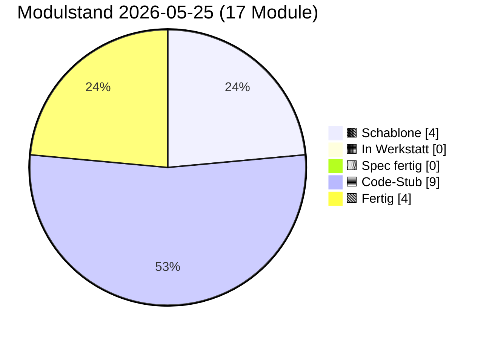

# PULS — lebender Status

**Format:** Jede Sitzung trägt unten einen Eintrag ein (neueste oben).
**Pflichtfelder pro Eintrag:** Datum · Sitzungs-Rolle · was getan · was offen · nächster sinnvoller Schritt.
**Begrenzung:** Diese Datei darf 3000 Zeilen nicht überschreiten. Älteres ins
`docs/sessions/archiv/`-Verzeichnis als Übergabeprotokoll auslagern.
**Schutz-Klausel (2026-05-17):** Die 3000-Zeilen-Grenze wurde bewusst hochgesetzt
(vorher 400) — Pflege-Sitzungen werden umfangreicher dokumentiert, weil
Architekturfunde und Diagnose-Routinen Platz brauchen. **Diese Grenze NICHT
wieder herabsetzen, auch nicht zum Token-Sparen.** Wenn 3000 Zeilen nahen,
auslagern statt kürzen.

---

## Modulstand heute

<!-- Pie-Block ab hier wird automatisch aus status.json generiert.
     Nicht von Hand bearbeiten. Erzeugen mit:
     python3 scripts/update_puls_pie.py
     Aufruf-Pflicht: nach jeder status.json-Änderung. Siehe CLAUDE.md. -->


Farb-Mapping verbindlich in [INTERFACES.md §5](INTERFACES.md). Live-Bau-Puls
auf der [Sage-Page](../index.html) (Karte "Bau-Puls").

## Als nächstes ✨

Module mit Code-Stub, **Sichttest durch Klaus 2026-05-14 erledigt** —
ergab fünf reproduzierbare Cosinus-Messwerte (siehe Karte 04 Beleg-
Block), die in der Pflege-Sitzung 2026-05-14 zu `PROVIDER_MIN_MATCH`
0.55 → 0.80 geführt haben:

- 🟦 **[01 Storage](components/01_storage.md)** — geprüft 2026-05-14 + 2026-05-16 + 2026-05-19 (Klaus, im Browser); init/round-trip/Unknown-Store sauber, jetzt acht Pflicht-Stores plus dynamische Stores ab v=4 (Bau 01.Y `ensureStore` 2026-05-19 grün — Knöpfe 6/7/8 3/3, happy-path / Idempotenz / Pattern-Verstoß); **Pflege „`init()` versions-fail-soft" 2026-05-19 live grün** (Klaus, DeX-Chrome: Knopf 9 `db_version_vor: 16 → nach_bump: 17`, dann Tab-Reload + Bonus-Probe Panel-02-Knöpfe 8/9/10 alle grün ohne Cleanup-Workaround). Headless-Smoke-Test 8/8 grün + Bau-02.Y-Regression 33/33 grün.
- 🟦 **[02 Spore](components/02_spore.md)** — geprüft 2026-05-14 + 2026-05-16 (Klaus, im Browser); Identität deterministisch, Spore sortiert, Sign+Verify valide, Manipulation erkannt; **Bau 02.X Backup-Export Sichttest 2026-05-16 grün** — Knöpfe 6/7/7b alle drei Hauptpfade ohne Modul-Bug. **Bau 02.Y Multi-Identitäts-API + Backup-Schema-Bump Sichttest 2026-05-19 (Klaus, DeX-Chrome auf Galaxy Tab S6): 3/3 grün** (nach Mini-Fix + Cleanup-Workaround) — Knopf 8 „Identitäts-Wechsel OK", Knopf 9 „Persona-Apoptose OK", Knopf 10 „Multi-ID-Backup OK"; Erst-Befund Multi-Tab-onblocked auf Knopf 8 + Rollback-Bug in `getOrCreateIdentity` durch Mini-Fix (Reihenfolge `ensureIdentityStores` vor `put(sbkim_keys)`) behoben; Headless-Smoke-Test 33/33 grün. Panel 01 (1–8) ebenfalls grün. Klaus' Beobachtung: zweiter Lauf gelang erst nach „Storage init"-Klick in Panel 01 — bestätigt offene Folge-Pflege Modul 01 `init()` versions-fail-soft.
- 🟦 **[03 Embedding](components/03_embedding.md)** — geprüft 2026-05-14 (Klaus, im Browser); L2-Norm 1.0, gleicher Inhalt ≈0.95, Baseline für unverwandte Begriffe ungewöhnlich hoch
- 🟦 **[04 Match](components/04_match.md)** — geprüft 2026-05-14 (Klaus, im Browser) + Bau 04.A `matchDimensions` sync 2026-05-19 live grün + **Bau 04.B `explainMatchLLM` 2026-05-20** (Stufe-B-LLM-Pass gegen Anthropic-API, JSON-only, strikte Schema-Validierung, fail-soft — zwei sync Throws InvalidApiKeyError + InvalidMatchResultError, alle anderen Fehlerpfade resolved mit `ExplainResult{available:false, reason}`; AbortError durchgereicht; Anti-Missbrauch § 8: `candidateScope:"netz"` still auf `"lokal"` korrigiert). **Bau 04.B Sichttest ungeprüft** (headless 30/30 smoke grün — wartet auf Klaus' Browser-Lauf Panel 04 Knopf 10 mit Anthropic-API-Key; bei `localhost`-Test möglicherweise CORS, Workaround echtes PWA-Setup).
- 🟦 **[06 Heterokaryose](components/06_heterokaryose.md)** — Code geschrieben 2026-05-15 (Bau-Sitzung 06) + Pflege Bau 06.1 Outbox-Lese-Pfad 2026-05-15 + **Bau 06.Y transparenter Slot-Pfad 2026-05-20** (additiv-mit-internem-Refactoring, KEIN Bruch der äußeren Signatur — Modul 06 schreibt jetzt slot-spezifisch in `sbkim_hetero_inbox_<key>` + `sbkim_anastomosis_log_<key>`; liest aus `sbkim_hetero_outbox_<key>` + `sbkim_siblings_<key>`; Receiver-Pfad nutzt `nodeId → slotKey`-Map; Sender cached `opSlot` zur Op-Zeit; volle 06/05/08-Achse jetzt geschlossen-konsistent slot-suffixed). Sichttest 2026-05-16 rasch grob durchgeklickt (Panel 06 14 Knöpfe), volle 12-Knopf-Sichttest-Runde 2026-05-20 grün im Bau-08.Y-Lauf inkl. Test 9 `HETERO_MAX_ANCHORS`. **Bau 06.Y Sichttest ungeprüft** (headless 25/25 smoke grün — wartet auf Klaus' Browser-Lauf Panel 06 + Knopf 15 Sekundär-Persona-Test).

Code-Stub frisch aus den Bau-Sitzungen 2026-05-14/15, **Sichttest ausstehend bzw. teilweise erledigt:**

- 🟦 **[05 Anastomose](components/05_anastomose.md)** — Code geschrieben 2026-05-14 (Bau-Sitzung) + BroadcastChannel-Bridge 2026-05-17 + **Bau 05.Y transparenter Slot-Pfad 2026-05-20** (additiv-mit-internem-Refactoring, KEIN Bruch der äußeren Signatur — Modul 05 schreibt jetzt slot-spezifisch in `sbkim_siblings_<key>` und `sbkim_anastomosis_log_<key>`; Receiver-Pfad nutzt `nodeId → slotKey`-Map zur Persona-Auflösung; Sender cached `opSlot` zur Op-Zeit). Sichttest geprüft 2026-05-15 (6/7 → Test 2 in Pflege als Vektor-Trias repariert); BroadcastChannel-Sichttest 2026-05-17 grün (4/4); volle Regression Panels 01-07 im Bau-08.Y-Sichttest 2026-05-20 grün. **Bau 05.Y Sichttest ungeprüft** (headless 25/25 smoke grün — wartet auf Klaus' Browser-Lauf Panel 05 + Knopf 10 Sekundär-Persona).
- 🟦 **[07 Apoptose](components/07_apoptose.md)** — Code geschrieben 2026-05-14 (Bau-Sitzung) + Pflege 02+07-Cache-Invalidate 2026-05-15 + Pflege Cleanup-Reihenfolge Bau 06 2026-05-15 + **Bau 07.Y transparenter Slot-Pfad + `_sendLegacyForIdentity`-Hook 2026-05-20** (additiv-mit-internem-Refactoring, KEIN Bruch der äußeren Signatur außer optionalen `key`-Parametern). Modul 07 schreibt jetzt slot-spezifisch (`sbkim_legacy_inbox_<key>` + `sbkim_anastomosis_log_<key>`); globale `confirmSelfApoptose` iteriert über ALLE Slots; neuer Hook `_sendLegacyForIdentity(key)` — **Bau-02.Y-fail-soft-Klausel aufgelöst**. **Konsumenten-Achse 05/06/07/08 jetzt vollständig slot-suffixed.** Sichttest 8/8 grün 2026-05-15 (Klaus, Re-Sichttest nach Cache-Invalidate); volle 8-Knopf-Sichttest-Runde 2026-05-20 im Bau-08.Y-Lauf grün inkl. Test 6 Self-Apoptose IRREVERSIBEL. **Bau 07.Y Sichttest ungeprüft** (headless 30/30 smoke grün — wartet auf Klaus' Browser-Lauf Panel 07 Test 6 globale Slot-Iteration + Panel 02 Knopf 9 Persona-Apoptose-Hook produktiv ohne `console.warn`).
- 🟦 **[00 Doku-Fenster](components/00_doku_fenster.md)** — Code geschrieben 2026-05-14 (Bau-Sitzung), Sichttest geprüft 2026-05-15 (Klaus, im Browser): 5 von 6 Tests grün im ersten Lauf (Setup, Test 2 5-Klick-Simulation, Test 3 4-Klick + Timeout, Test 5 TTL-Sweep, Selbstcheck-Hinweis); **Test 4 Test-Bug** mit Mini-Werten 81/100 (freeBytes=19 Bytes ist trivial < 50 MiB → `warningLevel:"both"` statt erwartetem `"ratio"`) → **Pflege-Sitzung 2026-05-15** repariert mit GiB-Skalierung (`usage:8.1 GiB, quota:10 GiB` → freeBytes ≈ 1.9 GiB → `warningLevel:"ratio"` sauber); Modul-Vertrag und INTERFACES.md unangetastet

Spec frisch, **Bau ausstehend**:

- 🟨 **[09 Einbau-PWA](components/09_einbau_pwa.md)** — Karte vollständig 2026-05-14 (Spec-Sitzung; Anleitung, kein JS-Modul), **Pflege-Sitzung 2026-05-15 erweitert auf neun Schritte** (Schritt 9 neu: `SbkimApoptose.init()` + `SbkimDoku.init({searchIconSelector:...})` + optionaler TTL-Sweep nach Handshake); `<script>`-Reihenfolge in Schritt 2 zieht 07 + 00 nach (`01 → 02 → 03 → 04 → 05 → 07 → 00`); Sichtkontroll-Block jetzt vier Pflicht-Punkte (sieben Selbstcheck-Zeilen + sechs IndexedDB-Stores + zwei live-Endpunkte + 5-Klick-Geste am Such-Symbol); Datei-Pfad-Konvention (SW im Endknoten-Repo-Root, sieben JS-Module inline oder unter `sbkim/`); Spore-Endpunkt `/sbkim/spore.json` verbindlich; SW-Scope-Falle dokumentiert; `domainVector`-Pflicht-Frage **entschieden Variante A (Soft-Pflicht im Andock-Workflow, kein Hauptversions-Sprung)** — Modul 02 / §0 / §2 bleiben unverändert. **Bau-Sitzung 2026-05-15 vor Schritt 1 sauber abgebrochen** (Befund-Sitzung): beide Endknoten haben aktiven `app-sw.js` im Repo-Root (Mein-Mixarium Z. 12543, Mein-Rezeptbuch Z. 10453), Karte 09 antizipiert diesen Fall nicht; zusätzlich Karte 09 § Sichtkontrolle implizit auf Desktop-DevTools gemünzt — Klaus' Tablet (Galaxy Tab S6 + DeX) braucht Eruda-Pfad. **Vor erneuter Bau-Sitzung 09** zwei Karten-Lücken in einer Pflege-Sitzung Karte 09 zu schließen (Empfehlung Option α: Patch in bestehenden `app-sw.js`; plus Eruda-Pfad für Tablet-Sichtkontrolle). Details in [Übergabeprotokoll 2026-05-15 Bau-09-blockiert](sessions/archiv/2026-05-15_bau-09-blockiert-app-sw.md).

Letzter Bau frisch (Bau-Sitzung 2026-05-15), **Sichttest geprüft 2026-05-15:**

- 🟦 **[08 UI-Demo](components/08_ui_demo.md)** — Code geschrieben 2026-05-15 (Bau-Sitzung 08), **Bau 08.Y slot-spezifische Outbox 2026-05-20** (additiv-mit-internem-Refactoring, KEIN Bruch der äußeren Signatur). Endknoten-Andocker-UI für die zwei Stellen, die Modul 06 (Heterokaryose) braucht, aber nicht selbst füllt: `sbkim_hetero_outbox_<activeSlotKey>` (Anker-Vorrat, slot-spezifisch seit Bau 08.Y) und `sbkim_siblings_<activeSlotKey>[peerNodeId].heterokaryosisOptIn` (additives Opt-In-Flag pro Geschwister). Fünf-Funktionen-API (`init/listOutbox/addOutboxAnchor/removeOutboxAnchor/setSiblingHeteroOptIn`), sechs benannte Error-Klassen im Factory-Stil analog Modul 00, drei Test-Brücken (`_clearOutbox`, `_addPseudoSibling` ohne Opt-In-Flag, `_clearPseudoSiblings`), synchroner Selbstcheck. **Storage-only** (kein Netz, kein Embedding, keine Signatur — Vektor-Erzeugung ist Aufrufer-Pflicht). `addOutboxAnchor`-Check-Reihenfolge: (1) Label sync, (2) Vektor sync, (3) async-Voll-Check (`OutboxFullError` nur bei NEUEM Label); Überschreiben eines bekannten Labels bleibt erlaubt. `setSiblingHeteroOptIn` strikt boolean (`1`, `"true"` werfen `InvalidOptInArgError`); Co-Schreiber-Disziplin via `Object.assign`. Panel 08 in `tests/manual_check.html` mit acht Knöpfen (Setup + sechs Test-Punkte + Selbstcheck-Hinweis); Panel-Status von Werkstatt-Stub `idle` auf `ok "Code-Stub"`. **Self-Apoptose-Knopf bewusst NICHT in Panel 08** (Spec-Sitzung 08-Entscheidung respektiert). `node --check src/modules/08_ui_demo.js` grün, alle 10 Inline-`<script>`-Blöcke validiert. **Sichttest geprüft 2026-05-15 (Klaus, im Browser): 6/6 Test-Punkte grün** (Pflege-Sitzung Sichttest-Resultate 2026-05-15). **Bau 08.Y Sichttest 2026-05-20 (Klaus, DeX-Chrome auf Galaxy Tab S6): Setup + Tests 1–6 grün** — Setup zeigt `active_slot_key:"main"` + `outbox_store:"sbkim_hetero_outbox_main"` + `siblings_store:"sbkim_siblings_main"`, Test 4 OutboxFullError-Message zitiert „sbkim_hetero_outbox_main am Limit (5 Einträge pro Slot)" (Slot-Suffix + „pro Slot"-Wortlaut live), Test 6 Co-Schreiber-Pfad auf slot-suffixed `sbkim_siblings_main` + `InvalidOptInArgError` für `1`/`"true"`. **Vollständige Regression Panels 01–07 grün** im selben Lauf (Storage / Spore Multi-Persona / Embedding / Match `matchDimensions` / Anastomose 9c Auto-Fallback / Heterokaryose Test 9 `HETERO_MAX_ANCHORS`-Begrenzung / Apoptose Self-Apoptose IRREVERSIBEL) — keine Bau-08.Y-Regression.

Empfehlung Hauptsitzung: **Klaus' Re-Andock beider Endknoten mit
PWA-Suffix**. Die Pflege-Sitzung 2026-05-16 „Karten 01 + 09 PWA-
Suffix" hat die Architektur-Erweiterung abgeschlossen (Modul 01 hat
jetzt `init({dbSuffix})`, Karten 01 + 09 und INTERFACES.md §1 Modul 01
sind nachgezogen, `PROTOCOL_VERSION` bleibt `"0.1"`, Modul 02 unangetastet).
Nächster Schritt liegt **in Klaus' Endknoten-Repos**:

1. In **beiden** Endknoten-Repos (`Mein-Mixarium`, `Mein-Rezeptbuch`)
   muss `sbkim/sbkim-init.js` erweitert werden: vor dem bestehenden
   `await SbkimAnastomose.init()` einen Aufruf
   `await SbkimStorage.init({ dbSuffix: "mixarium" })` (bzw.
   `"rezeptbuch"`) hinzufügen.
2. In beiden Tab-Sessions `__sbkimErzeugeSpore()` erneut triggern
   (Klaus in der jeweiligen Eruda-Konsole) → neue, getrennte nodeIds
   pro PWA.
3. Neue `spore.json` jeweils nach `~/<Endknoten>/sbkim/spore.json`
   verschieben + Commit + Push (überschreibt die alte Pages-Spore).
4. Erst nach Re-Andock kann eine Folge-Sitzung `status.json`
   `pingStatus` von `"blocked-origin-collision"` auf `"live"`
   wechseln (sobald Klaus den ersten Cross-Knoten-Handshake gefahren
   hat) und die `nodeId`-Werte in der Endknoten-Tabelle aktualisieren.

Andere offene Punkte (Mini-Pflege „Sushi-Kategorie sichtbar machen"
in Mein-Mixarium, INTERFACES.md §6 Tabellen-Bug) sind unverändert
offen. Details im [Übergabeprotokoll 2026-05-16 Pflege PWA-Suffix](sessions/archiv/2026-05-16_pflege-pwa-suffix-karten-01-09.md),
zur Andock-Hintergrund [Übergabeprotokoll 2026-05-16 Andock
Mein-Rezeptbuch](sessions/archiv/2026-05-16_andock-mein-rezeptbuch-iteration-3-live.md)
und der zugehörigen [Mixarium-Andock-Übergabe](sessions/archiv/2026-05-16_andock-mein-mixarium-iteration-3-live.md).

---

## Schnellüberblick

| Modul | Spec | Code | Manueller Sichttest | Anmerkung |
|---|---|---|---|---|
| 00 doku_fenster | Spec fertig (2026-05-14) | Code-Stub (2026-05-14, Pflege Persistenz-Strategie verbinden 2026-05-16) | geprüft 2026-05-15 (Klaus) — 5/6 Tests grün im ersten Lauf, Test 4 Test-Bug in Pflege-Sitzung 2026-05-15 mit GiB-Skalierung repariert; **Pflege Persistenz-Strategie verbinden Sichttest 2026-05-16 grün** (Klaus, im Browser) — Drei-Setup-Probe aus § Manueller Test Punkt 7 alle drei Pfade ohne Auffälligkeit: Persist-Trigger-Stub, Quota-Trigger, Negativ-Fall | Sechs-Funktionen-API (`init/open/close/isOpen/getStatusSnapshot/recordSighttest`), reines Lese-/Trigger-Modul, alleiniger Schreiber `sbkim_doku_meta`, 5-Klick-Geste mit 3s-Zeitfenster, Modal mit Backdrop und MutationObserver-Mount, Quota-Doppel-Schwelle (80% / 50 MiB), Self-Apoptose bewusst NICHT in 00. **Pflege Persistenz-Strategie verbinden 2026-05-16** (additiv, kein Refactoring): `getStatusSnapshot()` um Feld `storagePersisted: boolean \| null` erweitert (Spiegelung Modul-01-Getter fail-soft); Modal zeigt zusätzliche „Backup empfohlen"-Tipp-Zeile (`DOKU_BACKUP_TIP_TEXT` modul-lokal), wenn `storagePersisted === false` ODER `quota.warningLevel !== "none"`. Hinweis-only, kein Direkt-Aufruf von `SbkimSpore.exportBackup` aus Modul 00 (Aufrufer-Pflicht-Trennung). |
| 01 storage | Spec fertig (2026-05-14) | Code-Stub (2026-05-14, Pflege PWA-Suffix + Pflege Storage-Persist 2026-05-16, Bau 01.Y `ensureStore` 2026-05-19, Pflege `init()` versions-fail-soft 2026-05-19, Pflege Versions-Bump-Race in `openProbe` 2026-05-22) | geprüft 2026-05-14 + 2026-05-16 + 2026-05-19 + **2026-05-22** (Klaus) — Bau 01.Y `ensureStore` Knöpfe 6/7/8 3/3 grün (DeX-Chrome); Pflege „`init()` versions-fail-soft" Knopf 9 live grün 2026-05-19 (`db_version_vor: 16 → nach_bump: 17`, Bonus-Probe Panel-02-Knöpfe 8/9/10 ohne Cleanup grün); **Pflege „Versions-Bump-Race in `openProbe`" Sichttest 2026-05-22 grün** (Klaus, DeX-Chrome auf Galaxy Tab S6, 11-Knopf-Sequenz alle grün — Panel-01-Notfall-Reset → Hard-Reload → Panel-06-Setup ohne `ensureStore Versions-Bump blockiert`-Throw + Panel-06-Tests 1/9/10/11 + Panel-07-Tests 4/5/6 + Panel-00-Test 5 alle live grün; zentraler Race-Auflösungs-Beweis ist Setup-Knopf in Panel 06, der vor der Pflege reproduzierbar brach); Headless-Smoke 8/8 + Race-Smoke 6/6 + Bau-02.Y-Regression 33/33 weiterhin grün | IndexedDB-Wrapper |
| 02 spore | Spec fertig (2026-05-14, Pflege Stamm/Gast-Felder 2026-05-15, Pflege Spec Backup-Export Stufe 2 2026-05-16, Spec Multi-Identität Brief 04 2026-05-19) | Code-Stub (2026-05-14, Pflege Cache-Invalidate 2026-05-15, Pflege Stamm/Gast-Durchreichung 2026-05-15, Bau 02.X Backup-Export 2026-05-16, Bau 02.Y Multi-Identitäts-API + Backup-Schema-Bump 2026-05-19, Mini-Fix Rollback-Pfad 2026-05-19) | geprüft 2026-05-14 (Klaus) + 2026-05-15 (Cache-Invalidate-Pflege via Sichttest 07) + 2026-05-16 (Klaus, Bau 02.X Backup-Export Knöpfe 6/7/7b alle drei grün) + **2026-05-19 (Klaus, DeX-Chrome: Bau 02.Y Knöpfe 8/9/10 alle drei grün** nach Mini-Fix + Cleanup-Workaround) | Ed25519-Identität, Multi-Identitäts-Slots (Bau 02.Y), base64url-sha256-rawpub; +`resetIdentityCache()` aus Pflege-Sitzung 2026-05-15 (Pflicht-Hook für Apoptose-Cleanup). **Spore-JSON Optionale Felder additiv erweitert** 2026-05-15 (Spec-Sitzung Stamm/Gast): `stammCategories: string[]` + `guestCategories: string[]`, signaturpflichtig wenn vorhanden, Disjunktheit als Hosting-Pflicht (kein Verify-Abbruch). Sign-/Verify-Pfad unverändert. **`generateOwnSpore` Code-Allow-List nachgezogen** 2026-05-15 (Bau 02 Stamm/Gast): zwei Zeilen analog zu `domainKeywords` — ohne diese Pflege würden Stamm/Gast-Felder beim Andock still ignoriert. **Spec Backup-Export Stufe 2 2026-05-16** (Identitäts-Persistenz Stufe 2): zwei neue Funktionen `exportBackup(password) → Promise<SbkimBackupBlob>` + `importBackup(blob, password, options?)` (PBKDF2-SHA256 600 000 + AES-GCM-256, Klartext-Payload = Identität + Geschwister, defensiv per Default — `BackupOverwriteError`); drei §0-Konstanten verankert (`BACKUP_FORMAT_VERSION=1` / `BACKUP_KDF_ITERATIONS=600000` / `BACKUP_PASSWORD_MIN_LEN=8`); fünf neue Error-Klassen (`InvalidBackupPasswordError` / `BackupDecryptError` / `BackupVersionMismatchError` / `BackupSchemaError` / `BackupOverwriteError`). KEIN Spore-Feld dazu (Backup-Schicht separat, `PROTOCOL_VERSION` bleibt `"0.1"`). **Bau-Sitzung 02.X ausstehend**, KEIN Code in `src/modules/02_spore.js`. |
| 03 embedding | Spec fertig (2026-05-14) | Code-Stub (2026-05-14) | geprüft 2026-05-14 (Klaus) | semantischer Vektor |
| 04 match | Spec fertig (2026-05-14, Pflege Stamm/Gast-Hinweis 2026-05-15, Spec M04-Erweiterung Brief 03 2026-05-19) | Code-Stub (2026-05-14, Bau 04.A `matchDimensions` sync 2026-05-19, **Bau 04.B `explainMatchLLM` 2026-05-20**) | geprüft 2026-05-14 (Klaus) + Bau 04.A live grün 2026-05-19; **Bau 04.B Sichttest ungeprüft** (headless 30/30 smoke grün — wartet auf Klaus' Browser-Lauf Panel 04 Knopf 10 mit Anthropic-API-Key; CORS-Limitierung im localhost möglich, Workaround echtes PWA-Setup) | Vektorvergleich, modus-frei; Bau 04.A 2026-05-19 `matchDimensions` synchron (drei Schichten, Stufe-A-Heuristik). **Bau 04.B 2026-05-20** `explainMatchLLM` async — Stufe-B-LLM-Pass gegen Anthropic-API (hartcodiert), JSON-only, strikte Schema-Validierung, fail-soft (zwei sync Throws InvalidApiKeyError + InvalidMatchResultError; alle anderen Fehlerpfade resolved; AbortError durchgereicht). Anti-Missbrauch § 8: `candidateScope:"netz"` still auf `"lokal"` korrigiert. User-Key als opaque String (Vision-Anker 5 = produktiver Identitäts-Container, nicht in 04.B; Test-Brücke via `window.prompt`). **Brief-99-Pipeline ist mit Bau 04.B + Konsumenten-Achse 05/06/07/08 jetzt vollständig** — nur noch Endknoten-Migration offen. |
| 05 anastomose | Spec fertig (2026-05-14, Spec BroadcastChannel-Bridge 2026-05-17, Spec Multi-Identität Brief 04 2026-05-19) | Code-Stub (2026-05-14, Bau BroadcastChannel-Bridge 2026-05-17, **Bau 05.Y transparenter Slot-Pfad 2026-05-20**) | geprüft 2026-05-15 (Klaus) — 6/7 Tests grün im ersten Lauf, Test 2 Test-Bug in Pflege-Sitzung 2026-05-15 als Vektor-Trias repariert; **Bau BroadcastChannel-Bridge Sichttest 2026-05-17 grün** (Klaus, DeX-Chrome) — Knöpfe 9 / 9a / 9b / 9c alle vier ohne Modul-Befund (Test 9 established score 0.8881; Test 9a HandshakeTimeoutError nach 4005 ms; Test 9b MissingToNodeIdError synchron; Test 9c Auto-Fallback HTTP-404→Channel etabliert 0.8881); volle Regression Panels 01-07 grün im Bau-08.Y-Sichttest 2026-05-20 (Test 9c live grün); **Bau 05.Y Sichttest ungeprüft** (headless gebaut 2026-05-20, wartet auf Klaus' Browser-Lauf Panel 05 Setup + Knopf 10 Sekundär-Persona) | Handshake; Fünf-Funktionen-API, bidirektional, kanonisch signiert, Schwelle aus Modul 04; SW Variante A (Page-Hosted) + same-origin Fallback-Transport via `BroadcastChannel('sbkim')` aus Bau-Sitzung 2026-05-17 (additiv, `options.transport ∈ {"auto","http","channel"}` mit Default `"auto"` und einmaligem Auto-Fallback bei klaren HTTP-Defekt-Signalen) |
| 06 heterokaryose | Spec fertig (2026-05-15, Spec Multi-Identität Brief 04 2026-05-19) | Code-Stub (2026-05-15, Pflege Bau 06.1 Outbox-Lese-Pfad 2026-05-15, **Bau 06.Y transparenter Slot-Pfad 2026-05-20**) | rasch grob durchgeklickt 2026-05-16 + volle 12-Knopf-Sichttest-Runde 2026-05-20 (Klaus, Tab S6 + DeX) — Panel 06 alle Tests grün inkl. Test 9 HETERO_MAX_ANCHORS; **Bau 06.Y Sichttest ungeprüft** (headless 25/25 smoke grün — wartet auf Klaus' Browser-Lauf Panel 06 Setup + Knopf 15 Sekundär-Persona) | Datenaustausch unter Geschwistern; Fünf-Funktionen-API (`init/requestHeterokaryosis/receiveHeterokaryosis/listHeterokaryosis/forgetHeterokaryosis`), Pull-Pattern, Opt-In beidseits (additiv auf `sbkim_siblings`), kanonisch wie 05/07 (vierter Sign-Pfad bewusst dupliziert), neuer Store `sbkim_hetero_inbox` (Komposit-Schlüssel `peerNodeId\|ts`, DB-Version 1→2 additiv), SW Variante A mit drittem fetch-Listener `/sbkim/heterokaryosis` (Message-Typ `SBKIM_HETEROKARYOSIS_REQUEST`); Modul 07 Cleanup-Reihenfolge nachgezogen (`sbkim_hetero_inbox` zwischen `sbkim_legacy_inbox` und `sbkim_spore`). **Anker-Quelle nach Pflege Bau 06.1 (2026-05-15): voller Outbox-Lese-Pfad implementiert** — `sbkim_hetero_outbox` (Spec-Sitzung 08, v=3-Store) wird fail-soft gelesen, max. `HETERO_MAX_ANCHORS=5` Anker absteigend nach `addedAt`; Fallback auf Spore-Single-Anker bei leerer/fehlender Outbox bestehen geblieben. `src/modules/01_storage.js` `DB_VERSION` 2 → 3 (additive Migration v=3, `STORES_V3=["sbkim_hetero_outbox"]`); Panel 06 mit 14 Knöpfen; Test 9 (`HETERO_MAX_ANCHORS`-Begrenzung) voll abgedeckt (sechs Outbox-Einträge → Response liefert genau fünf, neueste zuerst). Sichttest ausstehend (headless gebaut, wartet auf Klaus' Browser) |
| 07 apoptose | Spec fertig (2026-05-14, Spec Multi-Identität Brief 04 2026-05-19) | Code-Stub (2026-05-14, Pflege Cache-Invalidate 2026-05-15, Pflege Cleanup-Reihenfolge Bau 06 2026-05-15, **Bau 07.Y transparenter Slot-Pfad + Legacy-Hook 2026-05-20**) | geprüft 2026-05-15 (Klaus) — **8/8 Tests grün** nach Pflege 02+07-Cache-Invalidate; volle 8-Knopf-Sichttest-Runde 2026-05-20 im Bau-08.Y-Lauf grün; **Bau 07.Y Sichttest ungeprüft** (headless 30/30 smoke grün — wartet auf Klaus' Browser-Lauf Panel 07 Test 6 globale Slot-Iteration + Panel 02 Knopf 9 Persona-Apoptose-Hook produktiv) | Selbstlöschung mit signiertem Vermächtnis; zweistufige Self-Apoptose (Token 60 s), Vermächtnis-Inbox, TTL-Vergessen explizit durch Andocker; kanonischer Sign/Verify-Pfad aus 02/05 dritter Pfad dupliziert; Cleanup-Schritt ruft `SbkimSpore.resetIdentityCache()` (Pflege 2026-05-15). **Bau 07.Y 2026-05-20:** drei Eingriffe — (1) transparenter Slot-Pfad in Stores; (2) globale `confirmSelfApoptose` iteriert über ALLE Slots; (3) neuer interner Hook `_sendLegacyForIdentity(key)` für Bau-02.Y `removeIdentity(key, {force:true})`-Aufrufe. **Konsumenten-Achse 05/06/07/08 vollständig slot-suffixed.** **Bau-02.Y-fail-soft-Klausel aufgelöst** ohne Modul-02-Code-Änderung. |
| 08 ui_demo | Spec fertig (2026-05-15) | Code-Stub (2026-05-15, Bau 08.Y slot-spezifische Outbox 2026-05-20) | geprüft 2026-05-15 (Klaus) — 6/6 Test-Punkte grün; **Bau 08.Y Sichttest 2026-05-20 grün** (Klaus, DeX-Chrome auf Galaxy Tab S6): Setup + Tests 1–6 grün, Setup zeigt `active_slot_key:"main"` + slot-suffixed Stores `sbkim_hetero_outbox_main` / `sbkim_siblings_main`, Test 4 OutboxFullError-Message live „am Limit (5 Einträge pro Slot)" mit Slot-Suffix, Test 6 Co-Schreiber-Pfad strikt-boolean. Volle Regression Panels 01–07 grün im selben Lauf | Endknoten-Pflege-UI für `sbkim_hetero_outbox` und `sbkim_siblings.heterokaryosisOptIn`; Fünf-Funktionen-API (`init/listOutbox/addOutboxAnchor/removeOutboxAnchor/setSiblingHeteroOptIn`), sechs benannte Error-Klassen im Factory-Stil analog Modul 00, drei Test-Brücken. **Bau 08.Y slot-spezifische Outbox 2026-05-20** (additiv-mit-internem-Refactoring, KEIN Bruch der äußeren Signatur): Modul 08 schreibt jetzt slot-spezifisch in `sbkim_hetero_outbox_<activeSlotKey>` und liest/schreibt `sbkim_siblings_<activeSlotKey>`; `activeSlotKey` im `init()` via `SbkimSpore.getActiveIdentityKey()` gecached (Default `"main"` als Rückwärts-Kompat); `probeDependencies` um Pflicht-Abhängigkeit `SbkimSpore (Modul 02)` erweitert; neue Closure-Helper `heteroOutboxStoreName/siblingsStoreName/ensureSlotStores`; defensives `ensureSlotStores` vor jedem ersten Schreibvorgang (idempotent, Bau 01.Y); Test-Brücken `_clearOutbox` / `_clearPseudoSiblings` via `SbkimStorage.clear` slot-isoliert. Selbstcheck-Zeile UNVERÄNDERT. `HETERO_OUTBOX_MAX_ENTRIES = 5` gilt jetzt PRO SLOT (bei 3 Personae theoretisch 15 Anker insgesamt). Headless-Smoke-Test 26/26 grün (drei Proben + Bonus). **Bekannte Limitierung aus Bau-06.Y-Brief aufgelöst** — Modul 06 (Bau 06.Y) liest aus `sbkim_hetero_outbox_<key>`, Modul 08 (diese Bau-Sitzung) schreibt dorthin. Modul 08 alleiniger Schreiber von `sbkim_hetero_outbox_<key>` (Schlüssel `label`, max. `HETERO_OUTBOX_MAX_ENTRIES`=5 PRO SLOT, absteigend nach `addedAt`, Überschreiben statt Verdrängen) und Co-Schreiber für `sbkim_siblings_<key>.heterokaryosisOptIn` (Modul 05 unangetastet). **Storage-only** (kein Netz, kein Embedding, keine Signatur, KEIN Receiver-Map). `addOutboxAnchor`-Check-Reihenfolge: (1) Label sync, (2) Vektor sync, (3) async-Voll-Check (`OutboxFullError` nur bei NEUEM Label); `setSiblingHeteroOptIn` strikt boolean; Self-Apoptose-Knopf bewusst NICHT in Panel 08. Panel 08 in `tests/manual_check.html` mit acht Knöpfen + Setup-Output zeigt `active_slot_key` + slot-suffixed Store-Namen. **Sichttest 2026-05-15 (Klaus): 6/6 Test-Punkte grün im ersten Lauf** (Bau-08-Sichttest). **Bau 08.Y Sichttest 2026-05-20 (Klaus, DeX-Chrome): Setup + Tests 1–6 grün** — Setup zeigt slot-suffixed Stores; Test 4 OutboxFullError-Message live mit „sbkim_hetero_outbox_main am Limit (5 Einträge pro Slot)"; Test 6 Co-Schreiber-Pfad strikt-boolean. **Vollständige Regression Panels 01–07 grün** im selben Lauf — keine Bau-08.Y-Regression. |
| 09 einbau_pwa | Spec fertig (2026-05-14, Pflege Schritt 9 + 07/00 2026-05-15, Pflege App-SW-Koexistenz 2026-05-15) | — (Anleitung, kein JS-Modul) | — | Andock-Anleitung — **9 Schritte** (Schritt 9 neu aus Pflege-Sitzung 2026-05-15: SbkimApoptose.init + SbkimDoku.init + optionaler TTL-Sweep nach Handshake); `<script>`-Reihenfolge 01→02→03→04→05→07→00; Soft-Pflicht `domainVector` im Andock-Workflow (kein Hauptversions-Sprung); SW im Endknoten-Repo-Root, `/sbkim/spore.json` als Spore-Endpunkt — plus Pflege App-SW-Koexistenz (2026-05-15): Schritt 3 a/b-Verzweigung (Pre-Flight-Check → 3a `register('sbkim-sw.js')` für PWA ohne eigenen SW, 3b `importScripts('./sbkim-sw.js')` im bestehenden App-SW für PWA mit eigenem SW), achtes Risiko „App-SW-Überschreibung", `sbkim-sw.js` `SBKIM_SW_STANDALONE`-Flag rückwärtskompatibel (Default `true`, `false` für Variante 3b) |
| 10 reputation | Stub (Schutz-Backlog) | — | — | Knoten-Reputation, Priorität niedrig |
| 11 rate_limit | Stub (Schutz-Backlog) | — | — | Rate-Limit & TTL, Priorität niedrig |
| 12 blocklist | Stub (Schutz-Backlog) | — | — | manuelle Sperrliste, Priorität niedrig |
| 14 diffusion | Stub (Diffusion-Backlog) | — | — | konsensuell-empfehlende Spore-Diffusion via Handshake-Erweiterung (Pfad 2 verbindlich, Pfad 1 = Default-Status-quo, Pfad 3 verworfen wegen Empfangsmodus-Prinzip); Spec ausstehend bis Netz ≥ 10 Geschwister oder erfolgreicher Live-Andock + Wachstums-Bedürfnis; Priorität niedrig — **plus Sage-Page-Sichtbarmachung 2026-05-15** (Karten 4/13/14 ziehen `diffusionBacklog[]` parallel zu `schutzBacklog[]`) |
| 15 membran | Spec fertig (Sub (e) voll 2026-05-24, **Sub (a)+(b) finalisiert 2026-05-25** in Spec-Sitzung 15.B mit MembraneSnapshot-Schema inkl. Siegel-Hook + Envelope mit vier op-Werten sporeRef/query/hint/queryResult + Allowlist fail-soft + Nonce-Pflicht 30 s Replay-Dedupe + Rate-Limit-Hook für Modul 11 vorbestellt, Sub (c) später, Sub (d) Verweis) | **Fertig** (Bau-Sitzung 15.B Sub (a)+(b) Bedien-Pfade 2026-05-25 + Bau 15 Sub (e) + Bau 15.SW SW-Probe-Detektor + Pflege Sage-Page-Sichttest-Knopf, alle 2026-05-24; PR #159 gemerged) | **Bau 15.B Sichttest 8/8 grün 2026-05-25** (Klaus, DeX-Chrome auf Galaxy Tab S6) — Panel 15 Setup + Knöpfe 10–17 alle grün im Termux-`localhost:8000`-Lauf nach Hard-Reload; Sage-Page Bonus vier Plaketten sichtbar (LEBT/VERKEHR/FREMD/Siegel-Badge); Mini-Pflege Knopf-11-Anti-PII-Filter (eigene nodeId vom String-Match ausnehmen) im selben PR #159 mitgenehmigt. Sub (e) + Bau 15.SW + Sage-Page-Lampe geprüft 2026-05-24 (Klaus, DeX-Chrome auf Galaxy Tab S6) — Panel 15 Knopf 8 BroadcastChannel-End-to-End grün, Sage-Page FREMD-Lampe + Modal + „🧪 Demo-Eintrag"-Knopf grün |
| 16 siegel | Spec fertig (2026-05-24, Spec-Sitzung 16) | **Code-Stub (Bau-Sitzung 16 vom 2026-05-24)** | Sichttest ungeprüft (Headless-Smoke 32/32 grün, wartet auf Klaus' Browser-Lauf) | SBKIM-Siegel — Selbst-Zertifikat einer PWA-Zelle nach erfolgter Integration der Pflicht-Module. Self-Inscribing (kein Hub-Aussteller, kein CI-Build-Check), Badge in Auszeichnungs-Optik (Prädikatswein- / DLG-Stil — Medaillon-Form, Edel-Gold-Anmutung, klassische Serif-Schrift, kein Marketing-Sticker-Stil), Click öffnet Modal mit Erklärung + nüchternem Aussteller-Klärungs-Satz (self-inscribing, Vertrauen kommt vom Repo — kein Disclaimer-Schwall). Lebendes Dokument: jedes Sicherheits-Update ergänzt einen Aspekt mit Datum. Anti-Greenwashing-Klausel: kein Siegel ohne erfüllte Selbst-Prüfung. **Spec-Sitzung 16 vom 2026-05-24:** alle vier Sub-Bereiche final spezifiziert — Sub (a) Pflicht-Modul-Liste mit sieben Modulen (01 Storage / 02 Spore / 03 Embedding [`lazy:true` für Sage-Page] / 04 Match / 05 Anastomose / 07 Apoptose / 15 Membran) + Surface-Funktions-Anker pro Modul (`init`/`getOwnSpore`/`embedPassage`/`match`/`handshake`/`prepareSelfApoptose`/`init`) + Status-Schema (`"ok"`/`"deferred"`/`"missing"`/`"broken"`) + binärer Fail-Modus (kein Render bei missing/broken, eine `console.warn`-Zeile mit ID-Liste); Sub (b) Badge-Rendering — DOM-Anker `#sbkim-siegel-badge` als vierte Plakette nach #lamp-fremd, 40-px rundes Medaillon Edel-Gold (`#C9A961`-Klasse) auf Bronze-Ink (`#1A1306`), Serif-System-Fallback (`'Spectral','Georgia',serif`, kein Pflicht-Google-Font), Wappen-Skelett (drei verschlungene Hyphen-Bögen + zentraler Knoten-Punkt), 600 ms First-Boot-Animation einmalig, dezenter Glow-Hover, KEINE Stufen-Varianten (Klaus-Festlegung: Siegel wächst über Aspekte, nicht über sichtbare Stufen), Sichtbarkeits-Modi `"visible"`/`"hidden"` (kein `"compact"` in Stufe 1); Sub (c) Erklärungs-Modal — eigenständig in `document.body` (analog Modul 15), Titel „SBKIM-Siegel — was bedeutet das?", Inhalt (Datum + Modul-Liste mit Status + Aspekte-Liste + Aussteller-Klärung), wertigere Typografie (Serif für Titel + Klausel, Geist für Daten-Listen), nüchterne Aussteller-Klärung in zwei Zeilen (Klaus-Korrektur 2026-05-24: KEIN Disclaimer-Schwall), Repo-URL Auto-Erkennung mit `init({repoUrl})`-Override; Sub (d) `ZERTIFIKAT_ASPEKTE`-Schema (`{since, module, aspect, description}`) chronologisch aufsteigend, Start-Eintrag „Grund-Siegel-Bezeugung 2026-05-24" verbindlich für Bau 16, Pflicht-Konvention: jedes spätere Sicherheits-Modul (10/11/12/14/15.B) MUSS in seiner Pflege einen Aspekt ergänzen. Persistenz **RAM-only** (Variante A, kein DB_VERSION-Bump, kein neuer Store, kein PROTOCOL_VERSION-Bump — Modul 16 ist nicht protokoll-aktiv). Schnittstelle `window.SbkimSiegel = {init/isCertified/getExplanation/getCertifiedModules/getAspects/_meta}`. KEINE benannten Error-Klassen (rein beobachtend, fail-soft via `console.warn`). INTERFACES.md § 1 Modul 16 voller Block ergänzt (analog § 1 Modul 15). **Kein Modul-Code, kein index.html-Eingriff** — Bau-Sitzung 16 nächster Schritt. Brief: `docs/sessions/BRIEF_BAU_16_SIEGEL.md`. |

Statuscodes: `—` (nichts) · `Schablone` · `Stub` · `Entwurf` · `Review` · `stabil` · `eingebaut`

## Endknoten (externe Repos des Betreibers)

| App | URL | Domäne | SBKIM-Stand |
|---|---|---|---|
| Rezeptbuch | https://lausiklauskn-png.github.io/Mein-Rezeptbuch/ | Kochrezepte (Stamm 7) — Drinks + Snacks als Überraschungs-Plus (Gast 11) | **integriert 2026-05-16, eigene Identität live 2026-05-16, Re-Andock 2026-05-17** (DeX-Chrome-IndexedDB-Verlust nach PR #75-Pflege, siehe § Offene Querschnitts-Fragen „DeX vs. Tablet-Chrome") · **aktuelle `nodeId: BSWxXmXvxF8FUR_MOx97a3l4gj1Q-JpcAJyp4BBRHyY`** (frischer Ed25519-Schlüssel 2026-05-17 in eigener IndexedDB `sbkim_rezeptbuch` der DeX-Chrome-Instanz; alte Tablet-Chrome-Identität `RHhposP0…` archiviert in PULS-Historie) · Spore live unter `https://lausiklauskn-png.github.io/Mein-Rezeptbuch/sbkim/spore.json` (Commit `3bcc453`) mit `domainVector[384]` · App-SW Variante 3b · Modul-05-v2 mit BroadcastChannel-Bridge eingebaut (`sbkim/05_anastomose-v2.js`, Commit `a1b9ded`). **Cross-Knoten-Handshake 2026-05-17 via Channel-Pfad etabliert** (`outcome:"established"`, score 0.9544 bidirektional, kein localStorage-Bypass mehr nötig — siehe Sitzungs-Eintrag „Live-Channel-Handshake"). `pingStatus: "live-channel"`. |
| Mixarium | https://lausiklauskn-png.github.io/Mein-Mixarium/ | Cocktails / Drinks (Stamm 8) — Knabbereien / Fingerfood (Gast 2) | **integriert 2026-05-16, eigene Identität live 2026-05-16, Re-Andock 2026-05-17** (DeX-Chrome-IndexedDB-Verlust nach PR #75-Pflege) · **aktuelle `nodeId: JOlHK31XEiylHOlOfe6E0_Vade6VcM0Q6Z_ADuxxdDY`** (frischer Ed25519-Schlüssel 2026-05-17 in eigener IndexedDB `sbkim_mixarium` der DeX-Chrome-Instanz; alte Tablet-Chrome-Identität `7xf0tt33_…` archiviert) · Spore live unter https://lausiklauskn-png.github.io/Mein-Mixarium/sbkim/spore.json (Commit `e9d0a45`) mit `domainVector[384]` · App-SW Variante 3b (`importScripts('./sbkim-sw.js')` im bestehenden `app-sw.js`) · Modul-05-v2 mit BroadcastChannel-Bridge eingebaut (`sbkim/05_anastomose-v2.js`, Commit `9d2f127`). **Cross-Knoten-Handshake 2026-05-17 via Channel-Pfad etabliert** (`outcome:"established"`, score 0.9544 bidirektional Mixarium → Rezeptbuch). `pingStatus: "live-channel"`. |

## Offene Querschnitts-Fragen

- **DeX-Chrome vs. Tablet-Chrome — zwei getrennte Browser-Instanzen**
  (eingetragen 2026-05-17, Mini-Pflege „Live-Channel-Handshake"). Auf
  Klaus' Galaxy Tab S6 mit Samsung DeX laufen Chrome am externen
  Monitor und Chrome am Tablet-Display als **faktisch zwei getrennte
  Browser-Instanzen** — eigene IndexedDB, eigene Service-Worker, eigene
  PWA-Liste. Eine in DeX angedockte Spore-Identität ist im Tablet-Modus
  nicht da; eine im Tablet installierte PWA bleibt nach DeX-
  Deinstallation weiter da. **Konsequenz für BroadcastChannel:** Channel-
  Bridge funktioniert nur, wenn beide Tabs in **derselben** Instanz
  laufen. Klaus' Endknoten-IndexedDB war am 2026-05-17 verloren
  (Ursache nicht abschließend geklärt — vermutlich Chrome-Update,
  versehentliches „Site-Daten löschen", oder Storage-Quota), beide
  Endknoten wurden in DeX-Chrome neu angedockt mit neuen nodeIds
  (`BSWxXm…` Rezeptbuch + `JOlHK3…` Mixarium). **Generalisierung:**
  dasselbe Phänomen tritt auf bei Chrome-Profil-Wechsel, Inkognito-
  Modus, Standalone-PWA vs. Tab-Modus. Tech-Note für Andocker /
  Programmierer in [`docs/OBSERVATORIUM_BROWSER.md`](OBSERVATORIUM_BROWSER.md)
  § Lehre 1. **Status:** dokumentiert, kein Code-Eingriff nötig —
  Workaround ist Single-Instance-Disziplin oder Backup-Import.

- **SW-Bridge-Phantom-Cache-Bug in Modul 05** (eingetragen 2026-05-16,
  Live-Andock-Sitzung Cross-Knoten-Handshake; **2026-05-17 vollständig
  aufgelöst — Status: Architektur-Grenze sauber benannt, Code-Eingriffe
  abgeschlossen, Endknoten-Pflege erledigt, Live-Cross-Knoten-Handshake
  via BroadcastChannel-Pfad bewiesen**). Beim
  Cross-Knoten-Handshake via `SbkimAnastomose.handshake(peerSpore,
  ownVec)` schickt Modul 05 einen POST an `peer.endpoint +
  "/sbkim/anastomosis"`. Der Phantom-Effekt — `outcome:"rejected",
  reason:"toNodeId stimmt nicht zum Empfänger"` trotz korrekter
  Identität im aktiven Tab — hatte **zwei Wurzeln**:
  1. **`clients.matchAll({includeUncontrolled:true})`** lieferte
     Pages, die der SW nicht kontrolliert (Phantom-Cache aus
     anderen Pfaden derselben Origin). → **gefixt in PR #70
     (2026-05-17 morgens, `bd895d3`)**: `includeUncontrolled:false`
     + Loop-Logik „alle controlled Clients der Reihe nach".
  2. **`isPathSuffix` scope-unbewusst** — fing JEDEN Pfad ab, der
     auf `/sbkim/<endpoint>` endet, also auch Cross-Scope-Pfade,
     wo ein Mein-Rezeptbuch-Tab `fetch('/Mein-Mixarium/sbkim/
     anastomosis')` macht und Mein-Rezeptbuchs SW (als Controller
     des Senders) abfängt statt durchzulassen. → **gefixt in
     Pflege 2026-05-17 (dieser Eintrag, Branch
     `claude/fix-sw-scope-paths-I70qE`)**: `isOwnEndpoint(...)`
     leitet erwarteten Pfad aus `self.registration.scope` ab,
     strikte Gleichheit; Cross-Scope-Fetches fallen durch
     (→ Network → 404).
  **Spec-Klarheit (Architektur-Grenze, kein Bug):** same-origin
  cross-PWA Handshake via SW-Bridge bleibt damit **konzeptuell
  unmöglich** — Subresource-Fetches gehen durch den SW des Senders,
  nicht des Empfängers. Für Klaus' heutiges Test-Setup (beide PWAs
  auf `lausiklauskn-png.github.io`) braucht es eine andere
  Architektur. **Empfehlung für Folge-Spec-Sitzung Modul 05:**
  BroadcastChannel-Bridge als Fallback-Pfad — Sender postet Request
  auf `BroadcastChannel('sbkim')`, Receiver lauscht. Brief-Skelett
  im Übergabeprotokoll [2026-05-17 Pflege Scope-Fix](sessions/archiv/2026-05-17_pflege-sw-isPathSuffix-scope-fix.md)
  § 7. **Erledigt (Klaus-Sichttest 2026-05-17 nachmittags):**
  Endknoten-Pflege mit File-Rename in beiden Repos (Mein-Rezeptbuch
  `cbc2531` → `sbkim-sw-v2.js`, Mein-Mixarium `9b32dc7` →
  `sbkim-sw-v24.js` + SW_VERSION-Bump); Distinguishing-Test im
  Mein-Rezeptbuch-Tab lieferte **POST → HTTP 405** und **GET → HTTP
  404** direkt von GitHub Pages (nginx-Antworten, kein Bridge-JSON
  mehr). Architektur-Grenze von beiden Seiten bestätigt.
  **Vollständig erledigt 2026-05-17 abends (Mini-Pflege „Live-Channel-
  Handshake"):** Klaus hat in DeX-Chrome beide Endknoten neu angedockt
  und neue spore.json gepusht (Mein-Rezeptbuch `3bcc453` nodeId
  `BSWxXm…`, Mein-Mixarium `e9d0a45` nodeId `JOlHK3…`). Erster regulärer
  `SbkimAnastomose.handshake(peerSpore, ownVec)`-Aufruf zwischen den
  beiden Endknoten via Eruda — **`outcome:"established"`, score 0.9544
  in beide Richtungen, `sbkim_siblings` bidirektional gefüllt, kein
  localStorage-Bypass mehr nötig.** HTTP-Pfad scheitert weiterhin mit
  405/404 von Pages, Auto-Fallback in `handshake()` greift,
  Channel-Bridge routet zwischen den beiden DeX-Chrome-Tabs derselben
  Origin. Pflege-Kette PR #65 → #70 → #71 → #72 → #73 → #74 → #75 →
  #76 → diese Mini-Pflege vollständig geschlossen.

- **`domainKeywords`-Hartkodierung in Endknoten-`sbkim-init.js`**
  (eingetragen 2026-05-16). Klaus' Mein-Mixarium-`sbkim-init.js` hat
  `domainKeywords = ["Cocktail", "Drink", "Mocktail", "Limonade",
  "Smoothie", "Aperitif", "Sake"]` hartkodiert — die echten App-
  Kategorien sind aber `stammCategories = ["Cocktails", "Mocktails",
  "Alkfr. Cocktails", "Smoothies & Shakes", "Limonaden", "Tees &
  Kaffees", "Bowlen", "Sirup & Basis"]`. „Aperitif" und „Sake" sind
  in den `domainKeywords` aber nicht als App-Ordner präsent. Klaus'
  Beobachtung (Live-Andock-Sitzung) deckt eine Inkonsistenz auf:
  `domainKeywords` sollte aus den echten App-Kategorien abgeleitet
  werden, nicht aus einer alten Zwischen-Sitzung hartkodiert. Folge-
  Pflege Mein-Mixarium-/Mein-Rezeptbuch-`sbkim-init.js`: `domainKeywords`
  aus `stammCategories`/`guestCategories` zur Init-Zeit generieren
  (z.B. via App-DB-Lookup oder mindestens als konsistente Liste).
  **Konsequenz heute:** der semantische Embedding-Vektor ist robust
  genug, dass der Cross-Knoten-Handshake trotz Inkonsistenz mit
  `outcome:"established"` läuft — aber für saubere Match-Scores in
  einem wachsenden Netz wäre die Bereinigung wertvoll. Status:
  Folge-Pflege ausstehend, niedrig priorisiert.

- **Endknoten-Repo-Hygiene gegen parallele Auto-PRs** (eingetragen
  2026-05-16). Während der Live-Andock-Sitzung lief eine PARALLELE
  Claude-Sitzung mit Branch `claude/add-recipe-remove-scramble-5xx9Y`
  und hat PR #238 „Buchstabensalat-Fix im Rezept-hinzufügen-Button"
  in Mein-Rezeptbuch gemerged. Dieser PR hatte aber eine ältere
  Basis-Version der `index.html` genommen und dabei **alle 8 SBKIM-
  `<script>`-Tags + Eruda** still entfernt. Das hat den Handshake-
  Test in Mein-Rezeptbuch ~1 h lang blockiert (SBKIM-Module gar nicht
  geladen). Nachgepflegt durch Wieder-Einfügen vor `</body>` an Zeile
  14802. **Schutz-Vorschlag (Folge-Pflege):** SBKIM-Sentinel-File in
  jedem Endknoten-Repo (z.B. `sbkim/.sentinel`) und/oder GitHub-Action
  in beiden Endknoten-Repos, die prüft: (a) `grep -c "sbkim/" index.html
  >= 8`, (b) `sbkim/sbkim-init.js` enthält `SbkimStorage.init` UND
  `SbkimAnastomose.init`, (c) `sbkim/01_storage.js` enthält `dbSuffix`.
  Soll künftige Auto-PRs auf Endknoten verhindern, die die SBKIM-
  Andock-Schicht still wegfegen. Status: Folge-Pflege-Vorschlag,
  niedrig priorisiert.

- **Sichtbarkeits-Lampen in der Endknoten-PWA** (eingetragen
  2026-05-16, Klaus-Vorschlag nach Pflege PWA-Suffix). Idee von
  Klaus: zwei kleine Lampen oben rechts in der PWA, eine zeigt
  „Knoten lebt" (Identität geladen, Storage offen, Module geladen),
  die zweite blinkt kurz bei jedem Anastomose- oder Heterokaryose-
  Verkehr („gerade kommuniziert"). Soll für Endknoten-Nutzer und im
  Observatorium **sichtbar** machen, dass das Netz lebt — viel
  zugänglicher als das 5-Klick-Doku-Fenster oder Eruda. Setzt
  Modul 00 (Doku-Fenster) als Datenquelle voraus und braucht zwei
  bis drei CustomEvents in Modul 05/06 (`sbkim:handshake-start`/
  `sbkim:handshake-end`/`sbkim:hetero-pull-start`/…). **Status:**
  Spec ausstehend; eigene kleine Karte (vermutlich Karte 15 oder
  ein additiver Block in Karte 00). Spec-Sitzung sinnvoll, **nach**
  dem ersten erfolgreichen Cross-Knoten-Handshake — dann ist klar,
  was die zweite Lampe tatsächlich anzeigen soll. Geschätzt ~60 Min
  headless für Spec, ähnlich für Bau-Stub.

- **Andock-Bundle (`sbkim-bundle.js`)** als künftiger Ein-Datei-
  Andock-Pfad (eingetragen 2026-05-16, Klaus-Vorschlag nach
  Pflege PWA-Suffix). Heutiger Karte-09-Pfad (9 Schritte mit awk,
  Termux, Eruda, Spore-mv) ist Pionier-Tanz — funktioniert für
  Klaus, aber kein Nicht-Programmierer würde das nachmachen. Vision:
  Endknoten-Betreiber kopiert **eine** Datei (`sbkim-bundle.js`) +
  fügt **einen** `<script>`-Tag ein. Das Bundle erzeugt beim ersten
  Laden Identität, Domain-Vektor, Spore, klinkt sich beim Service-
  Worker ein und macht den Status sichtbar (s. Lampen oben). **Setzt
  voraus:** drei oder mehr Endknoten im Netz, damit der Aufwand
  spürbar wird (heute mit zwei reicht der Direkt-Pfad mit Klaus).
  **Status:** Spec ausstehend; eigene Karte (vermutlich Karte 16 oder
  09.2). Ist eine echte Architektur-Frage (Bundling-Strategie,
  Versions-Update-Pfad, wie liefert der Bundle die Andock-Konfig),
  keine reine Pflege.

- ~~**Identitäts-Persistenz**~~ — **final gelöst 2026-05-16 durch
  drei aufeinander folgende Sitzungen am selben Tag** (Pflege
  Storage-Persist, Spec+Bau Backup-Export, Pflege Persistenz-
  Strategie verbinden). Klaus' Befürchtung: tiefes Browserspeicher-
  Löschen tötet die nodeId. Drei Stufen, die zusammen die echte
  „Spur stirbt nicht"-Architektur ergeben — alle drei jetzt geschlossen:
  (1) ~~**`navigator.storage.persist()`** beim `Storage.init` — bittet
  den Browser, IndexedDB von normalem Aufräumen auszunehmen.
  Modul-01-Folge-Pflege, headless möglich, ~30 Min.~~ — **gelöst
  2026-05-16 durch Pflege-Sitzung „Storage-Persist".** Modul 01
  ruft nach erfolgreichem DB-Open `navigator.storage.persist()` an
  (fail-soft); `_meta.storagePersisted` zeigt `true`/`false`/`null`
  als Live-Zustand. Details im [Übergabeprotokoll 2026-05-16 Pflege
  Storage-Persist](sessions/archiv/2026-05-16_pflege-01-storage-persist.md).
  (2) ~~**Backup-Export passwort-verschlüsselt** in Modul 02 — Klaus
  speichert eine `*.sbkim-backup.json` woanders und kann sie bei
  Browser-Wechsel zurückimportieren. Modul-02-Folge-Spec, ~60 Min.~~
  — **gelöst 2026-05-16 durch Spec-Sitzung Backup-Export Stufe 2 + Bau
  02.X Backup-Export** (selbiger Tag): Spec verankerte `exportBackup` /
  `importBackup` + drei §0-Konstanten + fünf Error-Klassen
  (PBKDF2-SHA256 600 000 + AES-GCM-256, Backup-Inhalt = Identität +
  Geschwister Pflicht-Frage 1 Variante b, Import-Überschreibung
  defensiv Pflicht-Frage 3 Variante a). Bau 02.X zog den Code
  additiv in `src/modules/02_spore.js` nach (drei Helper-Reuse-
  Entscheidungen: bestehende kanonische Sort + base64url-Helper +
  `resetIdentityCache`-Hook werden wiederverwendet, KEIN Refactoring;
  Panel 02 in `tests/manual_check.html` um drei Knöpfe „Backup
  exportieren" / „Backup einlesen" / „Identität ersetzen —
  unwiderruflich" erweitert). Details im
  [Übergabeprotokoll 2026-05-16 Spec Backup-Export](sessions/archiv/2026-05-16_spec-02-backup-export.md)
  und [Bau 02.X Backup-Export](sessions/archiv/2026-05-16_bau-02x-backup-export.md).
  **Sichttest** durch Klaus im Browser steht aus (headless gebaut —
  Tab-S6-PBKDF2-Aufruf-Zeit, AES-GCM-Verhalten in Safari iOS).
  (3) ~~**Quota-Frühwarnung im Doku-Fenster** — schon spezifiziert
  (Modul 00, `DOKU_QUOTA_WARN_RATIO=0.80` / `…_BYTES=50 MiB`); zeigt
  Warnzeile, bevor der Browser aufräumt.~~ — **final gelöst
  2026-05-16 durch Pflege-Sitzung „Persistenz-Strategie verbinden".**
  Modul 00 zeigt jetzt zusätzlich eine deutschsprachige
  „Backup empfohlen"-Tipp-Zeile (`DOKU_BACKUP_TIP_TEXT` modul-lokal),
  wenn `SbkimStorage._meta.storagePersisted === false` ODER
  `quota.warningLevel !== "none"`. `getStatusSnapshot()` spiegelt
  `storagePersisted: boolean | null` als neues Feld (fail-soft mit
  `typeof`-Check; `null` und `true` triggern nicht, nur explizites
  `false`). Hinweis-only, kein Direkt-Aufruf von
  `SbkimSpore.exportBackup` aus Modul 00 — Aufrufer-Pflicht-Trennung
  (Modul 00 bleibt reines Lese-/Trigger-Modul). **Sichttest geprüft
  2026-05-16** (Klaus, im Browser) — Drei-Setup-Probe aus Karte 00 §
  Manueller Test Punkt 7 alle drei Pfade grün (Persist-Trigger,
  Quota-Trigger, Negativ-Fall). Details im
  [Übergabeprotokoll 2026-05-16 Pflege Persistenz-Strategie
  verbinden](sessions/archiv/2026-05-16_pflege-persistenz-strategie-verbinden.md).
  **Architektur-Anmerkung:** *Nicht* als Selbst-Heilung über
  hartcodierten Schlüssel (Sicherheits-Bruch — jeder Repo-Forker
  hätte die Identität). `getOrCreateIdentity` legt bei leerem
  Storage eine **neue** Identität an (neue nodeId); erhalten bleibt
  der alte Knoten nur über Backup-Restore. Die Tipp-Zeile macht den
  Restore-Pfad sichtbar, klickt aber den Panel-02-Knopf nicht
  automatisch.

- ~~**IndexedDB-Origin-Kollision bei GitHub-Pages-Project-Sites**~~ —
  **gelöst 2026-05-16 durch Pflege-Sitzung „Karten 01 + 09 PWA-
  Suffix".** Variante (a) aus dem ursprünglichen Eintrag (PWA-Suffix
  in Storage-DB-Name) umgesetzt: Modul 01 akzeptiert jetzt optional
  `init({ dbSuffix: "<wert>" })` und öffnet die DB unter dem Namen
  `sbkim_<dbSuffix>` statt der Default-DB `sbkim`. Pattern für
  Suffix: `^[a-z0-9_-]+$` (sonst synchroner `InvalidDbSuffixError`).
  Modul 02 unangetastet (`IDENTITY_KEY = "main"` weiterhin Singleton-
  Schlüssel innerhalb der jeweiligen DB — Trennung passiert eine
  Schicht tiefer, auf DB-Namen-Ebene). Modul 05 unangetastet
  (`SbkimAnastomose.init()` weiterhin ohne Optionen; Idempotenz von
  `Storage.init` macht den zwei-Aufruf-Pfad sauber). Karten 01 + 09
  + INTERFACES.md §1 Modul 01 + §6 nachgezogen. `PROTOCOL_VERSION`
  bleibt `"0.1"`. Klaus' Re-Andock beider Endknoten (in beiden
  `sbkim-init.js` `SbkimStorage.init({dbSuffix})` vor
  `SbkimAnastomose.init()` einfügen + `__sbkimErzeugeSpore()`
  triggern + neue Spore deployen) steht aus — danach wechselt
  `status.json` `pingStatus` von `"blocked-origin-collision"` auf
  `"live"` für beide Endknoten in einer Folge-Sitzung. Variante
  (b) (eigene Subdomain mit Custom Domain) bleibt als langfristige
  Option dokumentiert. Details im
  [Übergabeprotokoll 2026-05-16 Pflege PWA-Suffix](sessions/archiv/2026-05-16_pflege-pwa-suffix-karten-01-09.md);
  Reproduktion der ursprünglichen Kollision im
  [Übergabeprotokoll 2026-05-16 Andock Mein-Rezeptbuch](sessions/archiv/2026-05-16_andock-mein-rezeptbuch-iteration-3-live.md).
- ~~**Karten-Lücke Karte 09 / Tablet-Sichtkontrolle**~~ — **gelöst
  2026-05-15 durch Pflege-Sitzung Karte 09 „App-SW-Koexistenz +
  Tablet-Sichtkontrolle" (diese Sitzung).** Karte 09 § Sichtkontrolle
  hat jetzt einen § Tablet-Variante-Sub-Block mit Eruda-Pfad
  (in-Page-DevTools-Polyfill, gepinnt auf `eruda@3`, jsdelivr-CDN,
  touch-bedienbar). Mapping der vier Pflicht-Punkte auf Eruda-Tabs
  (Console / Resources→IndexedDB / Network / 5-Klick-Geste).
  Verbindlicher Hinweis „nach Sichtkontrolle wieder entfernen —
  kein Produktiv-Einbau, kein SBKIM-Modul, kein Datenschutz-Stein".
  Details im Übergabeprotokoll
  [2026-05-15 Pflege Karte 09 App-SW + Tablet](sessions/archiv/2026-05-15_pflege-karte-09-app-sw-tablet.md).
- ~~**Karten-Lücke Karte 09 / Andocken in PWA mit bestehendem
  Service-Worker**~~ — **gelöst in zwei Pflege-Sitzungen 2026-05-15:**
  (a) Pflege App-SW-Koexistenz (PR #31, 2026-05-15) hat Schritt 3
  in 3a/3b verzweigt mit Pre-Flight-Check
  (`navigator.serviceWorker.getRegistration('./')`),
  Variante 3b = `importScripts('./sbkim-sw.js')` in bestehendem
  App-SW (= Option α), `SBKIM_SW_STANDALONE`-Flag in
  `src/sbkim-sw.js` (Default `true`, `false` für 3b), achtes
  Risiko „App-SW-Überschreibung" in § Risiken; (b) Pflege Karte 09
  „App-SW-Koexistenz + Tablet-Sichtkontrolle" (diese Sitzung,
  2026-05-15) hat zusätzlich **Variante 3c** als nachrangige
  Übergangslösung dokumentiert (SBKIM-SW unter `/sbkim/` mit Scope-
  Einschränkung = Option β; Option γ „App-SW ersetzen" entspricht
  der heutigen falschen Anwendung von Variante 3a auf eine PWA mit
  App-SW und ist als achtes Risiko bereits dokumentiert) plus eine
  Tabelle „Wann welche Variante?" als Andock-Entscheidungshilfe.
  Details im Übergabeprotokoll
  [2026-05-15 Pflege Karte 09 App-SW + Tablet](sessions/archiv/2026-05-15_pflege-karte-09-app-sw-tablet.md).
- ~~Werden Domain-URLs der Endknoten-Apps in `docs/PULS.md` /
  `status.json` aufgenommen oder nur lokal in deren `index.html`?~~ —
  **teilweise gelöst 2026-05-15** in abgebrochener Bau-Sitzung 09:
  Pages-URLs in PULS-Tabelle „Endknoten" und `status.json`
  `endknoten[*].url` eingetragen (`integrated:false` bleibt — Andock
  nicht erfolgt). Eintrag in `docs/INTERFACES.md` weiterhin offen.
- Werden Domain-URLs der Endknoten-Apps in `docs/INTERFACES.md` aufgenommen
  oder nur lokal in deren `index.html`? → Entscheidung steht aus.
- Embedding-Modell: bleibt es bei Default `Xenova/multilingual-e5-small`?
  → ja, bis Gegenargument. Quelle: `sbkim_integration.md` §4.1.
- ~~Speicherort der Spore bei GitHub Pages: `/.well-known/sbkim/spore.json`
  oder Alias `/sbkim/spore.json`?~~ — **gelöst 2026-05-14 in Spec-Sitzung
  09:** verbindlicher Andock-Default ist `/sbkim/spore.json` (Alias aus
  §3 INTERFACES). Begründung in `docs/components/09_einbau_pwa.md`
  Schritt 7: GitHub-Pages-Project-Sites haben mit `.well-known/` die
  Jekyll-Dot-Ordner-Falle, `/sbkim/spore.json` bündelt zudem alle
  SBKIM-Pfade unter `/sbkim/` (semantisch sauber).
- **Wording-Diskrepanz**: `CLAUDE.md` führt SBKIM als
  "Semantisch-Biologisch Koordiniertes Inter-Knoten-Mycel" — das Paper
  (Kap. 1.2) führt es als "Semantisch-Empfangendes Bidirektionales
  KI-Matching". Das Observatorium (`index.html`, `status.json`) übernimmt
  die Paper-Variante. CLAUDE.md sollte in einer separaten Sitzung
  nachgezogen werden.
- ~~**A1–B3-Notations-Überlappung Sage ↔ Mixarium**~~ — **gelöst
  2026-05-14 in Spec+Bau-Sitzung Modul 04.** Die Synthese „Hops tragen
  die Funktionen" steht jetzt verbindlich in
  [`docs/components/04_match.md` § A1–B3-Synthese](components/04_match.md):
  Pfad A = Curator → Auditor → Devil's Advocate (Anbieter-Seite
  verfeinert die Antwort); Pfad B = Interviewer → Matcher → Critic
  (Anfrage-Seite verfeinert die Frage), mit Apoptose bei B4 im
  Negativ-Fall. Sage zeigt die *Geometrie* der Hop-Position, Mixarium
  zeigt die *Rolle* — beide Notationen bleiben gültig, sie beschreiben
  dieselbe Wanderung aus zwei Winkeln. Kein eigenes Mapping-Dokument
  nötig.
- ~~**Spore-Persistenz-Strategie verteilt**~~ — **final gelöst
  2026-05-16 durch die vier aufeinander folgenden Sitzungen zur
  Identitäts-Persistenz** (Pflege Storage-Persist, Spec+Bau Backup-
  Export, Pflege Persistenz-Strategie verbinden). „Stille Löschung
  ohne Vermächtnis" (Karte 07 § Risiken) war nicht in einem
  einzelnen Modul lösbar — vier Stellen mussten beim Bauen
  zusammenpassen; alle vier stehen jetzt:
  - ~~**Modul 01 Storage:** `navigator.storage.persist()` beim `init()`
    + `navigator.storage.estimate()` für Quota-Frühwarnung —
    offen.~~ — **gelöst 2026-05-16** (Pflege Storage-Persist):
    `navigator.storage.persist()` fail-soft im Init-Pfad,
    `_meta.storagePersisted` als Live-Zustand-Getter. Quota-Estimate
    liegt seit Bau 00 (2026-05-14) in Modul 00.
  - **Modul 02 Spore:** Backup-Export (passwort-verschlüsselt) als
    Recovery-Pfad für Browser-Wechsel und manuelles Löschen —
    **Spec fertig 2026-05-16** (Spec-Sitzung Backup-Export Stufe 2):
    `SbkimBackupBlob`-Format (PBKDF2-SHA256 mit `BACKUP_KDF_ITERATIONS=600000`
    + AES-GCM-256), Klartext-Payload = Identität + bekannte Geschwister
    (Pflicht-Frage 1 Variante b), Import per Default defensiv
    (`BackupOverwriteError`, Pflicht-Frage 3 Variante a), drei
    §0-Konstanten verankert. **Code-Stub fertig 2026-05-16** (Bau 02.X
    Backup-Export, selbiger Tag): additiv in `src/modules/02_spore.js`
    — fünf Error-Klassen + drei modul-lokale Konstanten + drei §0-
    Konstanten gespiegelt + neuer Closure-Helper
    `derivePbkdf2AesGcmKey` (PBKDF2 → AES-GCM-256); drei Helper-Reuse-
    Entscheidungen (`canonicalize`/`canonicalJsonBytes`, `base64urlEncode`/
    `Decode`, `resetIdentityCache`) — kein Refactoring der bestehenden
    Funktionen. Panel 02 in `tests/manual_check.html` um drei Knöpfe
    erweitert (Export / Einlesen / Identität-ersetzen-force).
    Sichttest durch Klaus im Browser steht aus.
  - **Modul 00 Doku-Fenster:** stille Frühwarnung bei < X% Speicher
    (X als gemeinsame Konstante in §0) — **gelöst 2026-05-14 durch
    Spec-Sitzung 00:** `DOKU_QUOTA_WARN_RATIO = 0.80` UND
    `DOKU_QUOTA_WARN_BYTES = 52428800` (50 MiB) verbindlich in §0
    eingetragen (Doppel-Schwelle; Warnzeile bei Überschreitung einer
    der beiden). Konsistenter Schwellwert-Anker für Modul 01 und
    Modul 02. **Plus Pflege Persistenz-Strategie verbinden 2026-05-16:**
    Modul 00 zeigt jetzt zusätzlich eine deutschsprachige
    Backup-Tipp-Zeile (`DOKU_BACKUP_TIP_TEXT` modul-lokal), wenn
    `_meta.storagePersisted === false` ODER `quota.warningLevel !==
    "none"`. `getStatusSnapshot()` spiegelt `storagePersisted` als
    neues Feld (fail-soft). Hinweis-only, kein Direkt-Aufruf von
    `SbkimSpore.exportBackup` aus Modul 00.
  - **Modul 07 Apoptose:** Risiko-Vermerk „stille Löschung" (steht
    jetzt in Karte 07 § Risiken).

  **Die vier Stellen sind jetzt konsistent:** Quota-Schwellwert (zwei
  Zahlen in §0, Modul 00 Code-Befehl), Backup-Format (`SbkimBackupBlob`
  PBKDF2/AES-GCM, Modul 02 Code + Panel 02), Warntext (`DOKU_BACKUP_
  TIP_TEXT` deutsch, Modul 00), Risiko-Vermerk (Karte 07 § Risiken).
  Sichttest durch Klaus im Browser steht für Modul 02 + Modul 00 noch
  aus (beide headless gebaut).
- ~~**Spore-Diffusion: passiv (Pfad 1) vs. konsensuell-empfehlend
  (Pfad 2) vs. parasitär-mitreisend (Pfad 3)?**~~ — **gelöst
  2026-05-15 in Hauptsitzung 14-Diffusion-Stub durch Anlage
  [`docs/components/14_diffusion.md`](components/14_diffusion.md)**.
  Frage entstand in der abgebrochenen Bau-Sitzung Modul 09 vom
  2026-05-15 (siehe parallele Pflege-Sitzung Karte 09 „App-SW-
  Koexistenz" auf eigenem Branch). Verbindliche Auswahl: **Pfad 2
  (konsensuell-empfehlend)** über `recommendedPeers: SporeRef[]` als
  optionales Handshake-Antwort-Feld (max. 2 Einträge), Empfänger
  speichert als Lead mit TTL, opt-in pro Empfehlung — drehbuchkonform,
  weil jede Übergabe im Konsens. **Pfad 1 (passiv via
  `/sbkim/spore.json`)** bleibt Default-Mechanismus parallel.
  **Pfad 3 (parasitär-mitreisend)** explizit verworfen, weil er das
  Empfangsmodus-Prinzip aus `CLAUDE.md` und `sbkim_paper.pdf`
  („Kein Crawler, keine Pulsation, keine Eigenanfragen ins offene
  Netz") bricht. Modul 14 bleibt Stub bis Netz wächst (Schwelle siehe
  Diffusion-Backlog unten); Karte 05 wird in der Stub-Sitzung
  NICHT angefasst.
- ~~**Sage-Page sichtbar machen für Modul 14**~~ — **gelöst
  2026-05-15 durch Pflege-Sitzung Sage-Page Modul 14.**
  `index.html` rendert jetzt `diffusionBacklog[]` parallel zu
  `schutzBacklog[]` in zwei datengetriebenen Karten (Karte 4
  Module-Bento, Karte 14 Bau-Puls jeweils mit parallelem Divider
  „Diffusion-Backlog · proaktiv · Priorität niedrig"), Pie zählt
  jetzt 14 Module mit 5 Schablonen. Zusätzlich bekommt Karte 13
  Eigenschutz einen zweiten parallelen `schutz-backlog`-Block
  „Diffusion-Backlog · proaktiv (Wuchs durch Empfehlung)"
  sprachlich klar abgegrenzt vom Schutz-Backlog-Block („reaktiv");
  `schutz-pilz`-Schlussspruch um die Diffusion-Zeile erweitert
  („wächst, indem er Notizen über Nachbarn weitergibt, nicht ins
  Leere pulst"). Schema-Beispiel in Karte 7 zeigt jetzt
  `diffusionBacklog: []` parallel zum `schutzBacklog: []`-Kommentar.
  `status.json` unverändert (PR #29 hatte die Daten schon geliefert).
  `update_puls_pie.py` NICHT erneut aufgerufen (keine Modul-Daten-
  Änderung). Details im Übergabeprotokoll
  [2026-05-15 Pflege Sage-Page Modul 14](sessions/archiv/2026-05-15_pflege-sage-page-modul-14.md).

## Schutz-Backlog (aus Sage-Page Karte 13, 2026-05-10)

Drei strukturelle Lücken im Schutz-Modell sind beim Aufbau des
Observatoriums sichtbar geworden. Stubs sind angelegt; gezogen werden sie
ab spürbarem Wachstum:

- `docs/components/10_reputation.md` — Knoten-Reputation
- `docs/components/11_rate_limit.md` — Rate-Limit & TTL
- `docs/components/12_blocklist.md` — manuelle Blocklist

Eigenschutz-Karte der Sage-Page macht das Backlog für jeden Besucher
sichtbar und verlinkt direkt auf die Stubs.

### Diffusion-Backlog (aus Hauptsitzung 14-Diffusion-Stub, 2026-05-15)

Schutz und Diffusion sind zwei verschiedene Backlog-Kategorien. Der
Schutz-Backlog (10/11/12) ist **reaktiv** — er wehrt Schaden ab, wenn
das Netz groß genug ist, dass Apoptose und Match-Filter allein nicht
mehr reichen. Der Diffusion-Backlog ist **proaktiv** — er beschleunigt
das Wachstum durch konsensuelle Empfehlung beim Handshake, ohne das
Empfangsmodus-Prinzip zu brechen.

- `docs/components/14_diffusion.md` — konsensuell-empfehlende Spore-
  Diffusion via Handshake-Erweiterung (`recommendedPeers: SporeRef[]`
  als optionales Feld in der `HandshakeResponse`, max. 2 Einträge,
  Empfänger speichert als Lead mit TTL, opt-in pro Empfehlung)

Pfad-Auswahl verbindlich Pfad 2 (konsensuell-empfehlend);
Pfad 1 (passiv via `/sbkim/spore.json`) bleibt Default-Mechanismus
parallel; Pfad 3 (parasitär-mitreisend) verworfen wegen
Empfangsmodus-Prinzip aus `CLAUDE.md` + `sbkim_paper.pdf`.

Modul 14 wird gezogen, sobald **Netz ≥ 10 aktive Geschwister ODER
Bau-Sitzung Modul 09 erfolgreich abgeschlossen UND spürbares
Wachstums-Bedürfnis** — parallel zur 10/11/12-Logik.

`status.json` führt Modul 14 als eigenes Feld `diffusionBacklog[]`
parallel zu `schutzBacklog[]` (proaktiv vs. reaktiv); `scoreModel.
maxScoreNote` bleibt unangetastet (Backlog zählt nicht zum maxScore).
Das Pie-Skript `scripts/update_puls_pie.py` zählt beide Backlog-
Kategorien jetzt mit.

### Membran-Backlog (aus Hauptsitzung 15-Membran-Stub, 2026-05-18)

Schutz, Diffusion und Membran sind drei verschiedene Backlog-Kategorien.
Schutz (10/11/12) ist **reaktiv** — wehrt Schaden ab, wenn Apoptose
und Match-Filter allein nicht mehr reichen. Diffusion (14) ist
**proaktiv nach innen** — beschleunigt Wachstum durch konsensuelle
Empfehlung beim Handshake. Membran (15) ist **proaktiv nach außen** —
regelt die Außenhülle zwischen PWA-Zelle und Browser-Umgebung:
KI-Browser-Agenten (Anthropic Browser Use, OpenAI Operator, Comet,
Dia, Arc-Nachfolger) und Cross-Origin-App-zu-App-Brücken im selben
Browser ohne Server-Hop.

- `docs/components/15_membran.md` — Außenhülle des Knotens mit vier
  Sub-Bereichen: (a) Read-API für In-Browser-Agenten (lesend, keine
  Keys, `nodeIdHash` statt `nodeId` für Geschwister), (b) App-zu-App-
  Brücke via `postMessage` mit strikter Origin-Allowlist
  (`type:"sbkim/membrane/v1"`, `op:"sporeRef"|"query"|"hint"`, **kein**
  `handshake`), (c) signiertes Capability-Token analog Modul 02-Ed25519
  (später), (d) Backup-Datei als manueller App-Transport — existiert
  bereits in Modul 02 Bau 02.X, Karte 15 verweist nur.

Auswahl-Stufen verbindlich (a) + (b) Pflicht, (c) später, (d) nur
dokumentiert. Empfangsmodus-Prinzip bleibt absolut: Membran initiiert
nichts, sie hat nur Rezeptoren und Kanäle, kein `op:"handshake"` in
Sub (b), kein `scope:"write"` in Sub (c) Stufe 3.

Modul 15 wird gezogen, sobald **mindestens zwei** der folgenden
Bedingungen erfüllt sind (höhere Schwelle als 14, weil Membran-Bau
neue Angriffsfläche eröffnet):

- KI-Browser real verfügbar (Anthropic Browser Use SDK oder OpenAI
  Operator öffentlich mit dokumentiertem JS-Bridge-Mechanismus)
- App-zu-App-Wunsch konkret (Klaus oder Drittnutzer äußern Bedürfnis
  nach Cross-Origin-Konversation ohne Server)
- Dritter Endknoten ausserhalb `github.io` will sich andocken

`status.json` führt Modul 15 als eigenes Feld `membranBacklog[]`
parallel zu `schutzBacklog[]` und `diffusionBacklog[]`; `scoreModel.
maxScoreNote` präzisiert „Schutz-Backlog (10-12), Diffusion-Backlog (14)
und Membran-Backlog (15) zählen nicht mit". Das Pie-Skript
`scripts/update_puls_pie.py` zählt alle drei Backlog-Kategorien jetzt
mit (15 Module / 5 Schablonen seit dieser Sitzung).

---

## Vision-Anker (langfristig, kein Bau-Auftrag)

**Was ist das?** Visionen, die in Sitzungen aufgekommen sind und
nicht verloren gehen sollen, ohne dass sie sofort Spec oder Bau
auslösen. Sie warten auf eine Reifezeit oder einen passenden
Auslöser. Pflege-Disziplin: Vision wird hier festgehalten, mit
Datum + Sitzungs-Bezug + ungefährer Größenordnung. Wer sie ziehen
will, formuliert daraus einen Spec-Sitzungs-Brief.

### 2026-05-17 · Sage als Hybrid-Knoten (Variante I)

**Eingetragen:** Mini-Pflege „Vision-Anker" 2026-05-17 (Folge zu
Live-Channel-Handshake, PR #77 `7c08b88`). Klaus' Bild: die
Ameisenkönigin bleibt eine Ameise, auch wenn sie sich nicht vom
Fleck bewegt. Sage-Protokol kann Hub bleiben **und** zugleich ein
vollwertiger Endknoten werden — selbstreferenziell wie ein Mycel,
das seine eigene Karte ist.

**Was sich ändert (Spec-Sitzungs-Aufgabe, nicht jetzt umsetzen):**

- **CLAUDE.md** umschreiben — Satz „Es ist kein Endknoten" fällt;
  Sage wird als „Hub und Knoten zugleich" neu eingeführt.
- **INTERFACES.md § Endknoten-Liste** nimmt Sage als dritten Knoten
  auf, neben Mein-Rezeptbuch und Mein-Mixarium.
- **`status.json` § endknoten** bekommt einen `sage`-Eintrag mit
  eigener Domäne, nodeId (nach erstem Andocken), `pingStatus`.
- **Sage-Page (`index.html`)** muss alle SBKIM-Module mit voller
  `init()`-Kette laden (aktuell vermutlich nur Doku-Render). Modul
  03 Embedding (~30 MB) lädt erst beim ersten Andocken — UX-
  Vorwarnung in der Andock-Geste.
- **Sage's Domäne klären:** `domain` / `domainDescription` /
  `domainKeywords` / `domainVector`. Vorschläge im Spec-Brief:
  „Mycel-Bibliothek" / „SBKIM-Glossar" / „Sage-Observatorium".
  Stamm-/Gast-Kategorien? Brieferer Vorschlag: Stamm = Protokoll-
  Doku / Mycel-Vokabular; Gast = Glossar-Wartung / Schwesternetz-
  Beobachtungen.
- **IndexedDB-Suffix `sbkim_sage`** (analog `sbkim_rezeptbuch` /
  `sbkim_mixarium`).
- **App-SW-Variante 3a** (Standalone `sbkim-sw.js` im Sage-Page-
  Root, weil aktuell kein App-SW existiert).
- **Schwarz-Loch-Karte:** Klick könnte zukünftig nicht nur die
  Doku-md öffnen, sondern auch einen Andock-Wizard für Sage's
  Spore-Erzeugung anbieten (Hand in Hand mit Variante III unten).
- **Karte 09 § Schritt 1** wird neu eingefügt: „Sage-Observatorium
  selbst ist auch ein Endknoten — wer sich am Sage-Mycel andockt,
  bekommt es als Geschwister."

**Größenordnung:** Spec-Sitzung erster Aufgabe ~3-4 Stunden für
gründliche Klärung (kein Bau-Code, nur Verträge); danach Bau-
Sitzung ~2-3 Stunden für Sage-Page-Refactor + SW-Anlage + Andock-
Geste.

**Status:** **Strang 1 der V1-Sammelspec realisiert (2026-05-18, Brief
01 der V1-Sammelspec-Kaskade) + Sammelspec-Abschluss (Brief 99)
abgeschlossen (2026-05-19).** Sage als dritter Endknoten in
INTERFACES §6 Endknoten-Liste + §6.1 Sage-Page-Architektur aufgenommen
(Domäne `Mycel-Bibliothek`, IndexedDB-Suffix `sbkim_sage`, App-SW
Variante 3a, volle init()-Kette mit lazy Modul-03, Andock-Geste an
Schwarz-Loch-Karte als Wizard-Hinweis). CLAUDE.md auf „Hub und Knoten
zugleich" umgeschrieben, Karte 09 § Schritt 1 erweitert, `status.json`
um `sage`-Endknoten-Eintrag (`pingStatus:"pending-first-andock"`,
`nodeId:null`) ergänzt. `PROTOCOL_VERSION` bleibt `"0.1"` (additiv).
Die V1-Sammelspec-Kaskade ist mit BRIEF_99-Abschluss vollständig
geschlossen — Brief 02 (Plattform-Matrix, PR #97), Brief 03 (M04-
Erweiterung, PR #98) und Brief 04 (Multi-Identität, PR #99) sind alle
gemerged. **Sage-Page-Refactor** (volle init()-Kette + Andock-Wizard
+ Schichten-Lampen + Identitäts-Wechsler-UX in `index.html`) steht
als **Position 1 der Bau-Sitzungs-Brief-Pipeline** aus Brief 99
(siehe § Sitzungs-Einträge „Abschluss — V1-Sammelspec-Kaskade
(Brief 99)") und ist die empfohlene erste Bau-Sitzung der nächsten
Welle.

### 2026-05-17 · Niedrigeres Onboarding (Variante III-Ausbau)

**Eingetragen:** Mini-Pflege „Vision-Anker" 2026-05-17. Klaus'
Kritik trifft hart und stimmt: **Karte 09's 9 Schritte schrecken
ab.** Wer SBKIM ausprobieren will, ohne Klaus-Niveau zu haben,
scheitert vermutlich an Schritt 3 (Service-Worker) oder Schritt 5
(Embedding-Setup). Verbreitung steht im Konflikt mit Andock-Hürde.

**Drei Ausbau-Pfade als langfristiger Plan:**

1. **Andock-Wizard als Standalone-PWA.** Eine eigene Page (z.B.
   `https://lausiklauskn-png.github.io/Sage-Protokol/andock/`)
   führt durch alle 9 Schritte als geführte UI, mit Pre-Flight-
   Checks und Auto-Generierung der Endknoten-Repo-Dateien.
   Klaus' Worte: „klick hier und da, dann bekommst du Spore und
   Knoten".
2. **SBKIM-PWA-Distribution mit GitHub-Identität als Geschenk-
   Paket.** Eine GitHub-Action erzeugt für einen Nutzer
   automatisch ein Endknoten-Repo (Fork eines Templates), inkl.
   konfigurierter Spore-Identität, gebrandet auf den GitHub-User-
   Namen als Identitäts-Brücke. Wer „SBKIM-Knoten werden"
   klickt, hat 30 Sekunden später eine eigene Pages-PWA live.
3. **Eigener Browser-Wrapper (Fern-Vision).** Eine Electron- /
   Tauri- / Capacitor-PWA mit SBKIM eingebacken — eigener
   „agressiverer" Browser (Klaus' Wortwahl), der die Browser-
   Eigenheiten aus § Browser-Observatorium umgeht (keine
   IndexedDB-Reklamation, kein DeX/Tablet-Split, keine SW-
   Cache-Verwirrung). Sehr ambitioniert, vermutlich nur nach
   Variante 2-Reifezeit denkbar.

   > **2026-05-18 · Konkretisierung Mini-Browser-Pfad:** Realisierbar
   > mit **Tauri** (Rust + System-WebView, ~10-30 MB Binaries für
   > Windows/macOS/Linux aus einer Codebase) — schlanker als Electron
   > (~80-200 MB) und nicht „eigener Browser von Grund auf"
   > (Chromium-Code ~30 Mio Zeilen, unrealistisch). Liefert: eigene
   > IndexedDB im App-Daten-Verzeichnis (kein Browser-Reklamations-
   > Risiko, löst Lehre 1 + Spore-Verlust 2026-05-17), Tray-Icon-Modus
   > für Hintergrund-Empfang (Antwort auf Anker 4 Königin-Frage „wer
   > empfängt, wenn der Tab zu ist"), Doppelklick-Installer (`.msi` /
   > `.dmg` / `.AppImage`). **Onboarding-Bild:** 1 Klick Installer →
   > Tray-Icon → empfangsbereit, ~2 Minuten von Link bis Knoten.
   > **Mobile bleibt außen vor** — Tauri ist Desktop-only; für
   > Android/iOS bräuchte es Capacitor (separate Initiative). **Drei
   > gleichwertige Onboarding-Pfade** (Klaus 2026-05-18): Wizard
   > (Pfad 1, browserintern, ~5-8 Min), GitHub-Generator (Pfad 2,
   > eigene Pages-URL, ~10-15 Min), Mini-Browser (Pfad 3, Desktop-
   > App, ~2 Min) — Karte 09 zeigt alle drei, Interessent wählt selbst.
   > **Plattform-Architektur, Stack-Trade-offs, Verbindung zu V4/V5/V7
   > vertieft als eigener Vision-Anker 8** (Folge-Pflege 2026-05-18,
   > diese Notiz hält nur die Pfad-Optik fest).

**Verhältnis zu Modul 10/11/12:** Sobald SBKIM-Distribution für
Nicht-Klaus-Kreise relevant wird, werden die Schutz-Backlog-
Module **akut** (Reputation, Rate-Limit, Blocklist) — heute
schlummern sie als Stubs, weil das Netz klein und vertrauenswürdig
ist. Wer SBKIM in die Welt entlässt, muss diese drei vorher bauen.

**Größenordnung:** Variante 1 wäre ~10-15 Stunden (UX + Code +
Test). Variante 2 ~15-25 Stunden (GitHub-Action-Template + Repo-
Generator + Onboarding-Flow). Variante 3 ist eine eigene Bau-
Saison, nicht in Stunden messbar.

**Status:** Reif für Vor-Diskussion, aber nicht für Spec.

### 2026-05-17 · Browser-Observatorium-Universum (visuelle Variante)

**Eingetragen:** Mini-Pflege „Vision-Anker" 2026-05-17. Aus dem
Stil-Sitzungs-Gespräch zur Schwarz-Loch-Karte (PR #77): das
Browser-Observatorium kann nicht nur als Markdown-Doku in
`docs/OBSERVATORIUM_BROWSER.md` leben, sondern als **bildlich-
animiertes Mini-Universum** in der Sage-Page direkt.

**Konzept-Skizze:**

- **Eigener Screen `screen-observatorium`** in der Sage-Page,
  analog zu `screen-cycle`, `screen-module`, `screen-data`,
  `screen-warum`. Erreichbar durch Klick auf die Schwarz-Loch-
  Karte (anstelle der direkten GitHub-Navigation).
- **Sieben Sterne / Galaxien** für die sieben Lehren — jeder mit
  zartem Twinkling (CSS-Keyframes mit `opacity`-Pulse + leichter
  `box-shadow`-Atmung) und Parallax bei Maus-Bewegung
  (`requestAnimationFrame`-geglättet, Tiefen-Ebenen ähnlich wie
  in Mac-/Linux-Desktop-Hintergründen). Galaxien für die
  größeren Lehren (Browser-Instanzen, IndexedDB), Sterne für die
  schmaleren (Eruda, Termux). Label-Tags beim Hover.
- **Nebel-Hintergründe** als gestapelte `radial-gradient`s mit
  `mix-blend-mode: screen`, Sage-Theme-Farben (Cyan + Lila +
  Gold). Drift-Animation ~120 s, wirkt lebendig ohne Hektik.
- **Klick auf einen Stern** öffnet ein Lehre-Modal — gerenderter
  Text aus der `OBSERVATORIUM_BROWSER.md`, eingebettet in einen
  kleineren Nebel (Teleskop-Zoom-Effekt). Esc / Klick außerhalb
  schließt zurück zum Universum.
- **„Reiner Text"-Link** in einer Ecke des Universum-Screens als
  Wahl für Programmierer-Direktzugriff zur md.
- **Tablet-/Touch-tauglich:** Sterne klickbar, Parallax via
  `DeviceOrientationEvent` auf Mobile (subtile Neigungs-
  Sensitivität). `prefers-reduced-motion: reduce` respektiert.
- **Wahrheits-Quelle bleibt die md.** Universum liest die md
  clientseitig mit minimalem md-Parser (~80 Zeilen JS, keine
  externe Bibliothek wie `marked.js` — Single-File-PWA-Stil ist
  Konvention). Pflege geht in der md; jede neue Lehre dort wird
  automatisch zu einem neuen Stern.

**Pädagogischer Hintergrund:** Klaus' Beobachtung — komplexe
Themen durch Bilder zugänglich machen, ohne den Text-Pfad zu
verlieren. Spricht jüngere Leser und Bilder-Menschen an, die
sich von reinen Tech-Notes abschrecken lassen würden. Pflegt sich
automatisch, sobald die md-Quelle gepflegt wird.

**Größenordnung:** Eigene Bau-Sitzung „Browser-Observatorium-
Universum", ~6-10 Stunden für den initialen Bau (Layout + sieben
Sterne + Modal + minimaler md-Parser + Touch-Anpassung). Iteration
nötig — visueller Eindruck zeigt sich erst beim Testen.

**Status:** Reif für eigene Bau-Sitzung, jederzeit zwischen V1
und V3-Bau einschiebbar.

### 2026-05-17 · Königin-Relay (Modul 13?) — Mailbox für offline-Geschwister

**Eingetragen:** Mini-Pflege „Vision-Anker Königin-Relay" 2026-05-17
(Folge zu Bau Browser-Observatorium-Universum, PR #79 + Lehre 8,
PR #80 + Cursor-Variante PR #81). Klaus' fundamentale Architektur-
Frage nach den Pages-Live-Tests: **„Was, wenn ich einmal Browser A
nehme und ein andermal Browser B? Ist die Spore nur zu finden, wenn
der Browser offen ist? Ist sie empfangsbereit, wenn der Browser
nicht geöffnet ist?"**

Ehrliche Antwort: aktuelle SBKIM-Architektur sagt **„Wer nicht da
ist, schweigt"** (Empfangsmodus-Prinzip aus dem SBKIM-Paper). Browser-
PWAs sind nicht für dauerhaft laufende Dienste gebaut — Pages leben
nur solange die Tabs offen sind, Service-Worker werden nach Stunden
suspendiert. Browser-Wechsel = neue Identität (IndexedDB ist pro
Browser-Instanz). Das ist konzeptuell sauber für ein peer-to-peer
Mycel, aber eine harte Grenze für Verbreitung.

Klaus' Bild: **Königin wie bei Bienen.** Eine Königin ist Bezugspunkt,
nicht Daten-Eigentümer. Übertragen auf SBKIM könnte das ein
**„Königin-Relay" als optionales neues Modul (13?)** sein.

### Modell

- Eine Königin ist eine **Mailbox** für Geschwister.
- Sie speichert **nicht** private Schlüssel — nur **verschlüsselte
  Handshake-Envelopes** (Public-Key-Verschlüsselung mit dem
  Empfänger-publicKey, sodass nur dieser sie öffnen kann).
- Wenn Knoten A handshaken will mit B, und B ist offline → A schickt
  verschlüsselten Envelope an die Königin → Königin hält ihn fest →
  B kommt nächstes Mal online → fragt bei der Königin „Post für
  mich?" → bekommt den Envelope → entschlüsselt mit eigenem privaten
  Schlüssel → antwortet.
- **Privacy gewahrt:** Königin sieht nur verschlüsselte Daten,
  nicht den Inhalt.
- **Optional:** Knoten ohne Königin-Anbindung funktionieren wie
  bisher (direkter Channel-Bridge, same-instance). Königin ist
  „kann", nicht „muss".
- **Mehrere Königinnen möglich** → kein Single Point of Failure.
  Knoten registriert sich bei `N` Königinnen seines Vertrauens.
- **Analogie:** E-Mail-Relay, Matrix-Server, Bluesky-Relay — alle
  privacy-wahrend, alle Mailbox-Buffer-Modelle.

### Implementations-Optionen

1. **Server-Königin:** Node.js / Python / Go-Server, klassische
   Backend-Architektur. Wer hostet? Klaus selbst auf einem Raspi,
   ein Verein, ein Hoster. Geld + Vertrauen erforderlich.
2. **PWA-Königin mit Push-API:** browserseitige Königin, läuft im
   Service-Worker mit WebPush-Notifications. Komplexer, aber
   serverlos auf manchen Hostern. Push-Triggers können den
   Receiver-Tab automatisch öffnen.
3. **Eigenes-Gerät-Königin:** Klaus' Raspi zuhause mit immer-online
   Status. Selbst-souverän, aber technisch anspruchsvoll.

### Anknüpfung an V1 (Sage als Hybrid)

V1 macht Sage zu einem Knoten — das ist ein **erster Schritt in
Königin-Richtung.** Wenn Sage selbst Mailbox-Funktion bekäme, wäre
sie die erste Königin. Aber Sage liegt auf GitHub Pages — statisch,
kann nicht aktiv empfangen. Eine echte Königin braucht einen aktiv
laufenden Prozess. V1 ist daher Vorbereitung, nicht selbst Königin.

### Was Königin-Relay LÖST

- Empfang ohne offene Tabs (Mailbox puffert)
- Browser-Wechsel-Problem (Identität bleibt portabel über `exportBackup`,
  Königin-Verbindung über die Identität)
- Reputation / Schutz-Backlog (Module 10/11/12) könnten am Königin-
  Layer leben

### Was Königin-Relay BEDINGT (Trade-offs)

- **Privacy-Annahmen:** Königin kann Metadaten sammeln (wer schreibt
  wann an wen). Kein perfektes Privacy-Modell, aber besser als zentraler
  Server mit Klartext.
- **Hosting-Frage:** wer betreibt Königin-Knoten? Vertrauen + Geld.
- **Single Point of Failure** nur wenn jemand sich auf nur eine
  Königin verlässt. Mit `N`-Königin-Strategie vermieden.
- **Implementations-Aufwand:** signifikant, vermutlich >50 Stunden
  für initiale Spec + Bau + Königin-Implementierung.

### Status

**Reif für Spec-Sitzung-Diskussion**, aber NICHT für sofortige
Spec-Sitzung. Wartezeit empfohlen, damit:

- V1 (Sage als Hybrid) erst spezifiziert + gebaut wird → Sage-als-
  Knoten-Erfahrung sammeln
- IndexedDB-Persist-Schutz (Mini-Pflege offen) ergibt Praxis-Daten
  über Identitäts-Stabilität
- Klaus' Klarheit über Königin-Vertrauen-Modell reift (wer betreibt?
  Wer vertraut wem? Mehrere Hosts oder einzeln?)

Spec-Sitzung-Aufgabe **nach** der V1-Sage-Hybrid-Spec, NICHT
parallel.

### 2026-05-17 · Identitäts-Container — Rucksack, Safe, Chipkarte, Mini-Browser

**Eingetragen:** Mini-Pflege „Vision-Anker Königin-Relay" 2026-05-17,
Folge-Frage Klaus: „und die mitgeführte eigene Mini-Browser-Version
geht wirklich nicht effektiv, oder sowas wie ein Rucksack oder Safe
oder Chipkarte mit der ich mich beim Aufwachen oder Anmelden neu
identifiziere?"

Die Antwort hat **vier Konzept-Pfade**, die SBKIM in unterschiedlichen
Tiefen erweitern könnten:

1. **Rucksack/Safe (Datei) — schon implementiert.** Modul 02 hat
   `SbkimSpore.exportBackup(password)` + `importBackup(blob, password)`
   seit Bau 02.X (PR mit dem Identitäts-Backup-Stufe-2-Modul). Der
   Backup-Blob ist eine `.json`-Datei, PBKDF2-SHA256-600.000-Runden +
   AES-GCM-256-verschlüsselt. Was fehlt: **UX-Konzept eines
   „Identitäts-Containers"** — der Backup-Blob als „digitaler
   Reisepass", den Klaus auf USB / Cloud / lokal trägt. Beim Anmelden
   in einem neuen Browser: Datei rein, Klaus ist wieder er selbst.
   **Mini-Pflege „Identitäts-Container-UX"** könnte das polieren:
   sprechender Dateiname (z.B. `klaus-spore-2026-05-17.json`),
   Hinweis-Pfad im Doku-Fenster („Backup machst du regelmäßig"), Datei-
   Schloss-Visualisierung.

2. **Chipkarte / Hardware-Wallet — Hardware-basiert.** WebAuthn /
   FIDO2 ist der Browser-Standard für Hardware-/Biometrie-basierte
   Authentifizierung. Der private Schlüssel liegt im Sicherheits-
   Modul des Geräts (Smartphone-Secure-Enclave, YubiKey, Trezor) und
   verlässt es nie. SBKIM-Identität könnte WebAuthn-basiert sein
   statt IndexedDB-basiert — Identität ist an Hardware gebunden,
   nicht an Browser. Aber: WebAuthn ist primär für Login-Auth, nicht
   für signierte Mycel-Nachrichten. Anpassung nötig. **Größere
   Spec-Initiative**, vermutlich Modul 14 oder höher.

3. **Mini-Browser (Variante III aus bestehendem Vision-Anker).**
   Native App-Wrapper (Tauri / Electron / Capacitor) mit
   eingebakkener Identität. App läuft im Hintergrund, persistent,
   empfängt auch bei „aufgewachtem" Gerät ohne offene Tabs. **Schon
   als Vision-Anker drin (Variante III-Ausbau, dritter Pfad).** Diese
   Frage bestärkt: Mini-Browser ist nicht nur Onboarding-Hilfe,
   sondern auch **Hintergrund-Empfänger** und **Identitäts-Container.**

4. **Passkey-Sync (modern).** Apple iCloud-Keychain, Google Password
   Manager, 1Password synchronisieren Passkeys plattformübergreifend.
   Wer in einem Browser angemeldet ist, hat dort automatisch Zugriff
   auf seine Identitäten. Wäre eine **plattform-abhängige** Lösung
   (Apple ↔ Apple, Google ↔ Google), kein peer-to-peer, aber sehr
   pragmatisch für die meisten Nutzer.

### Verbindung zu Königin-Relay (Anker oben)

Königin-Relay und Identitäts-Container lösen unterschiedliche
Probleme:

- **Königin-Relay:** **„Wie empfange ich, wenn der Browser nicht
  offen ist?"** → Mailbox-Modell, ein Knoten irgendwo ist online
  und puffert verschlüsselte Envelopes
- **Identitäts-Container:** **„Wie nehme ich meine Identität von
  Browser A zu Browser B mit?"** → Datei / Hardware / Sync

Sie können kombiniert werden: Klaus' Identität liegt als Backup-Datei
(Rucksack), er importiert sie bei jedem neuen Browser-Anmeldung, und
seine Königin (verschlüsselte Mailbox) hat die ausstehenden Handshakes
für ihn parat.

### Status

Pfad 1 (Rucksack-UX): **Mini-Pflege möglich** ohne große Architektur-
Änderung. Sinnvoller Folge-Schritt nach Storage-Persist-Schutz.

Pfade 2/3/4: **Spec-Sitzungs-Diskussionen**, jeweils signifikanter
Aufwand. Reihenfolge:
- Pfad 3 (Mini-Browser) zuerst — schon als V3-Ausbau-Vision drin,
  kombiniert mit dem Onboarding-Wizard.
- Pfad 4 (Passkey-Sync) als pragmatische Brücke — vermutlich
  zwischen V3-Mini-Browser-Spec und Königin-Relay-Spec.
- Pfad 2 (Hardware-Wallet) als ferne Vision — nur falls SBKIM in
  einem sicherheits-kritischen Kontext eingesetzt würde.

**Status:** Reif für Vor-Diskussion, **nicht** für Spec. Wartet auf:
- V1-Sage-Hybrid-Erfahrung
- Storage-Persist-Schutz-Praxis (Mini-Pflege offen)
- Klaus' Bauchgefühl, welcher Pfad sich am stimmigsten anfühlt

### 2026-05-18 · Multi-Identität in der IndexedDB (Modul 02 Erweiterung)

**Eingetragen:** Mini-Pflege „Vision-Anker Multi-Identität" 2026-05-18.
Klaus' Folge-Gedanke nach dem Schlaf, klar abgegrenzt zu Lehre 1
(Browser-Instanzen-Trennung). Worüber Lehre 1 als **Verlust-Risiko**
sprach (zwei Browser-Instanzen erzeugen ungewollt zwei separate
Identitäten), wird hier als **Feature** umgekehrt: **bewusst mehrere
Identitäten in derselben IndexedDB**.

Klaus' Bild: „mehrere Identitäten in mehreren Ebenen im Browser oder
auf dem Tablet oder im Rechner, je nach Arbeitsoberfläche."

### Konzept

- **Heute:** Modul 02 hat einen Singleton-Slot `sbkim_keys["main"]`.
  Eine PWA = eine Identität pro Browser-Instanz.
- **Vision:** Modul 02 unterstützt **mehrere Identitäten** in derselben
  IndexedDB:
  ```
  sbkim_keys["main"]       → Klaus' Default-Identität
  sbkim_keys["beruflich"]  → Klaus' berufliche Persona
  sbkim_keys["test"]       → Test-Knoten
  ```
  Plus aktive-Identität-Marker `sbkim_meta["active-identity"]`, der
  bestimmt, welche Identität Module 05/06/07 gerade nutzen.

### Schritte (Spec-Aufgabe — nicht jetzt umsetzen)

- **Modul 02 erweitern:**
  - `getOrCreateIdentity(key?)` (Default `"main"`)
  - `setActiveIdentity(key)` (wechselt aktive Identität)
  - `listIdentities()` (alle vorhandenen)
  - `removeIdentity(key)` (vorsichtig, mit Bestätigung)
- **Aktive Identität als Konvention:** Module 05/06/07 lesen
  `sbkim_meta["active-identity"]` und verwenden den entsprechenden
  Identitäts-Slot.
- **UI zum Wechseln:** im Doku-Fenster oder als eigener Identity-
  Picker; vielleicht im Universum als „Welche-Identität-bin-ich"-
  Bewegung in der Sage-Page.
- **Pages-`spore.json`:** kann nur eine Identität öffentlich
  darstellen. Optionen:
  - Nur aktive Identität in `spore.json`
  - Liste-Schema (mehrere Identitäten, peer findet die passende
    über `toNodeId`-Filter)
- **Geschwister-Netze pro Identität:** Modul 05 muss `sbkim_siblings`
  pro Identitäts-Slot verwalten — `sbkim_siblings_main`,
  `sbkim_siblings_beruflich` etc.

### Trade-offs

- **IndexedDB-Verlust löscht alle Identitäten gleichzeitig** — kein
  Backup-Schutz gegenüber Browser-Reklamation. Daher Vision-Anker 5
  (Identitäts-Container) als Backup-Strategie bleibt parallel sinnvoll.
- **Verwirrungs-Risiko:** welche Identität ist gerade aktiv? UI muss
  das klar machen.
- **Spec-Aufwand:** signifikant — Modul 02 grundlegend erweitert,
  Module 05/06/07 ziehen nach. ~3-5 Stunden Spec, ~10-15 Stunden Bau.

### Verbindung zu anderen Vision-Ankern

- **V1 (Sage als Hybrid-Knoten):** Sage selbst könnte mehrere
  Identitäten haben — Hub-Identität für Spec-Verträge, Endknoten-
  Identität für Mycel-Beziehungen, Glossar-Identität für
  Wörterbuch-Pflege.
- **V3 (Niedrigeres Onboarding):** Multi-Identität-Wahl als Teil
  des Andock-Wizards. Andocker entscheidet beim ersten Klick:
  „eine Identität oder mehrere Personae?"
- **V4 (Königin-Relay):** Königin muss pro-Identität-Mailboxes
  verwalten. Klaus' Königin sieht: „Post für `klaus-beruflich`",
  „Post für `klaus-test`".
- **V5 (Identitäts-Container):** jeder Backup-Container könnte
  mehrere Identitäten enthalten. „Klaus' kompletter Rucksack" =
  alle Identitäten in einer Datei.

### Status

**Strang 3 der V1-Sammelspec realisiert (2026-05-19, Brief 04 der V1-
Sammelspec-Kaskade) + Sammelspec-Abschluss (Brief 99) abgeschlossen
(2026-05-19).** INTERFACES.md § 9 „Identitäts-Map (Multi-Identität,
Brief 04)" als verbindliche Spec-Klausel (sieben Sub-§ von Slot-Schema
bis M04-Verbindung); Modul 02 um fünf neue / erweiterte API-Funktionen
erweitert (`getOrCreateIdentity(key?)`, `setActiveIdentity(key)`,
`getActiveIdentityKey()`, `listIdentities()`,
`removeIdentity(key, options?)`); identitäts-spezifische Stores pro
Persona (`sbkim_siblings_<key>`, `sbkim_anastomosis_log_<key>`,
`sbkim_legacy_inbox_<key>`, `sbkim_hetero_inbox_<key>`,
`sbkim_hetero_outbox_<key>`); Persona-Isolation als verbindliche
Klausel (ein Geschwister gehört einer Persona, nicht dem ganzen
Knoten); Strategie A für Pages-`spore.json` gewählt (nur aktive
Identität, `PROTOCOL_VERSION` bleibt `"0.1"`); Strategie B als Folge-
Spec-Option benannt (Bump auf 0.2, NICHT gewählt). Apoptose-Granularität
entschieden: `confirmSelfApoptose` global, per-Persona-Apoptose über
`SbkimSpore.removeIdentity(key, {force:true})` mit internem Hook
`_sendLegacyForIdentity` in Modul 07. Multi-Identitäts-Backup
„kompletter Rucksack" als Empfehlung verankert; `BACKUP_FORMAT_VERSION`-
Bump 1→2 für die Bau-Folge-Sitzung 02.Y vermerkt (KEIN
`PROTOCOL_VERSION`-Eingriff). Die V1-Sammelspec-Kaskade ist mit
BRIEF_99-Abschluss (2026-05-19) vollständig geschlossen. **Bau-
Folge-Sitzungen** für Multi-Identität (01.Y `ensureStore`, 02.Y Multi-
Identitäts-API + Backup-Schema-Bump, 05.Y / 06.Y / 07.Y transparenter
Slot-Pfad, Endknoten-Migration) stehen in der **Bau-Sitzungs-Brief-
Pipeline** aus Brief 99 (siehe § Sitzungs-Einträge „Abschluss — V1-
Sammelspec-Kaskade (Brief 99)") und sind die nächste Welle nach
Kaskaden-Abschluss; Reihenfolge ist Klaus' Entscheidung.

**Bau 01.Y `ensureStore` 2026-05-19 abgeschlossen** (erste Bau-Sitzung
der Pipeline, Klaus' Wahl „Infrastruktur zuerst"). Modul 01 hat jetzt
die achte öffentliche Funktion `ensureStore(storeName: string) →
Promise<void>` für die dynamische Anlage identitäts-spezifischer
Stores ab DB-Version 4 (Option A aus § 9.5). Versions-Bump-Choreografie
linear via `db.version + 1`, fail-soft `onversionchange`-Handler auf
jeder neuen Verbindung, synchroner Pattern-Check
`^sbkim_[a-z0-9_]+$` (`InvalidStoreNameError`), async Bump-Fehler
`EnsureStoreError` mit `cause`-Property. **`DB_VERSION` von 3 auf 4**
(`STORES_V4 = []` als leere Liste — v=4 markiert den Übergang zu
„dynamische Stores via `ensureStore`", legt keinen festen Pflicht-
Store an); **`PROTOCOL_VERSION` bleibt `"0.1"`**;
**`BACKUP_FORMAT_VERSION` bleibt `1`** (Bump 1→2 erst in Bau 02.Y).
KEINE Modul-02/05/06/07-Änderung, KEINE identitäts-spezifischen
Stores angelegt — das ist Aufrufer-Pflicht in den Folge-Bau-Sitzungen.
Drei neue Panel-01-Knöpfe in `tests/manual_check.html` für die Drei-
Stufen-Probe (happy-path / Idempotenz / Pattern-Verstoß), Sichttest
2026-05-19 (Klaus, DeX-Chrome) 3/3 grün. Übergabeprotokoll
[2026-05-19_bau-01y-ensure-store.md](sessions/archiv/2026-05-19_bau-01y-ensure-store.md).

**Bau 02.Y Multi-Identitäts-API + Backup-Schema-Bump 2026-05-19
abgeschlossen** (zweite Bau-Sitzung der Pipeline, Klaus' Wahl
„logische Reihenfolge — Infrastruktur weiter"). Modul 02 hat jetzt die
vollständige Multi-Identitäts-API aus Brief 04 — fünf neue / erweiterte
Funktionen (`setActiveIdentity` / `getActiveIdentityKey` /
`listIdentities` / `removeIdentity` plus optionaler `key`-Parameter auf
`getOrCreateIdentity` / `generateOwnSpore` / `getOwnSpore`) — und
schreibt identitäts-spezifische Stores pro Persona über
`SbkimStorage.ensureStore(...)` aus Bau 01.Y. Das Backup-Wrapper-Schema
ist von **`BACKUP_FORMAT_VERSION = 1` auf `2`** gebumpt (Multi-
Identitäts-Backup „kompletter Rucksack" aus § 9.6 Pkt. 2; Pflicht-Feld
`payload.identities[]` im Klartext-Payload); alte v=1-Backups bleiben
über `importBackup` lesbar (Liste `BACKUP_FORMAT_VERSION_READ_OK =
[1, 2]`; Rückwärts-Kompat zu Klaus' Mein-Mixarium- / Mein-Rezeptbuch-
Backups vom 2026-05-16). **`PROTOCOL_VERSION` bleibt `"0.1"`**;
**`DB_VERSION` bleibt `4`** (neue Stores entstehen dynamisch).
**`sbkim_meta` wird in Modul 02 lazy über `ensureStore` angelegt** —
KEIN Modul-01-Eingriff nötig (Brief 04 hat den Marker spezifiziert,
aber Modul 01 keinen Pflicht-Store eingebaut; Bau-01.Y-Option-A deckt
den Pfad). KEINE Modul-05/06/07-Änderung (transparenter Slot-Pfad kommt
in 05.Y / 06.Y / 07.Y). `_sendLegacyForIdentity`-Hook in Modul 07
fail-soft (typeof-check, console.warn — Bau 07.Y bringt Implementation).
Drei neue Panel-02-Knöpfe in `tests/manual_check.html` (Identität
anlegen + wechseln / removeIdentity force-Fallback / Backup mit
Multi-Identität); Headless-Smoke-Test 33/33 grün; **Browser-Sichttest
2026-05-19 (Klaus, DeX-Chrome auf Galaxy Tab S6): 3/3 grün** nach
Mini-Fix (Reihenfolge in `getOrCreateIdentity` umgekehrt — atomarer
Pfad ohne Rollback) und Cleanup-Workaround. Erst-Befund Multi-Tab-
`onblocked` aus Brief antizipiert. Klaus' Beobachtung: zweiter Lauf
gelang erst nach Panel-01-„Storage init"-Klick — bestätigt offene
Folge-Pflege Modul 01 `init()` versions-fail-soft.
Übergabeprotokoll
[2026-05-19_bau-02y-multi-identitaet.md](sessions/archiv/2026-05-19_bau-02y-multi-identitaet.md).

**Folge-Pflege „Modul 01 `init()` versions-fail-soft" 2026-05-19
abgeschlossen** (PR Pflege 01-init eigener PR; Brief PR #106 als
Spec-Vorlage). `DB_VERSION = 4` ist jetzt Mindest-Schema-Version
(nicht „immer-anstreben"). `init()` öffnet die DB zweiphasig:
Probe-Open ohne Version + Entscheidung — bei `wasCreated` (DB
versehentlich angelegt) → `deleteDb` + regulärer Initial-Pfad;
`existing < DB_VERSION` → Migrations-Pfad; `existing >= DB_VERSION`
→ Pflicht-Store-Check + `KNOWN_STORES`-Erweiterung um dynamische
Stores + `openExact` ohne `onupgradeneeded`. Bei fehlendem Pflicht-
Store: `StorageOpenError` mit Liste (manuell zerstörte DB nicht
reparierbar). `_meta.dbVersionPolicy = "fail-soft-min-schema"` als
Read-Anker. Klaus' Cleanup-Workaround „Browserdaten löschen +
Storage init klicken" entfällt — Test-Stores aus früheren Sichttests
blockieren `init()` nicht mehr. Smoke-Test 8/8 grün, Bau-02.Y-
Regression-Test 33/33 weiterhin grün. **Tafel-Evolutions-konform**:
die Brief-02.Y-Tafel „KEIN Modul-01-Eingriff" war scope-disziplin
für Bau 02.Y; diese Pflege ist die explizite Folge-Sitzung mit
eigenem Brief + eigenem PR (CLAUDE.md § Heilige Tafeln § Tafel-
Evolutions-Klausel aus PR #105). Browser-Sichttest des Panel-01-
Knopf-9 ausstehend. Übergabeprotokoll
[2026-05-19_pflege-01-init-fail-soft.md](sessions/archiv/2026-05-19_pflege-01-init-fail-soft.md).

### 2026-05-18 · SBKIM-Browser-Extension — „Lampe in der Toolbar"

**Eingetragen:** Mini-Pflege „Vision-Anker Extension" 2026-05-18.
Klaus' Folge-Vision parallel zur Multi-Identität-Idee (Anker 6),
gleicher Tag, gleicher Schlaf-Klarheit-Moment: ein **kleines Tool
oben in der Browser-Navigationsleiste**, das den SBKIM-Status
sichtbar macht.

### Konzept

Zwei Lampen am Toolbar-Icon:

1. **Status-Lampe:** zeigt, dass das Protokoll lebt — Spore
   existiert, Knoten empfangsbereit. Grün/grau (an/aus).
2. **Aktivitäts-Lampe:** zeigt Handshake-Aktivität — gelb beim
   Andocken, blinkt während Verbindung, grün bei established,
   rot bei Fehler.

Klaus' Bild: „kleines Tool, das jeder in seinem Browser oben in
der Navigationsleiste installiert. Status- und Aktivitäts-Lampe
direkt sichtbar, ohne die Sage-Page öffnen zu müssen."

### Antwort kompakt: Technisch möglich — aber Mobile-Browser außen vor

**Manifest V3** ist das richtige Werkzeug. Desktop-Browser
(Chrome, Firefox, Edge, Brave, Opera, Safari) unterstützen MV3-
Extensions vollständig. **Mobile-Browser unterstützen keine
Extensions** — Klaus' eigenes DeX-/Tablet-Chrome-Setup bleibt
außen vor (Workaround: Kiwi Browser auf Android, Chromium-fork
mit Extension-Support).

### Plattform-Tabelle

| Plattform | Extension möglich? |
|---|---|
| Desktop Chrome / Edge / Brave / Opera / Firefox | ✓ |
| Desktop Safari (macOS) | ✓ (Xcode + App Store nötig) |
| Mobile Chrome (Android) — Klaus' Setup | ❌ |
| DeX-Chrome — Klaus' Setup | ❌ |
| Mobile Safari (iOS) | ✓ (eigenes Format) |
| Mobile Firefox (Android) | (eingeschränkt) |
| Kiwi Browser (Android) | ✓ |

### Architektur-Skizze

- **Manifest V3** mit `action` (Toolbar-Icon),
  `background.service_worker`, `externally_connectable` für Sage-
  PWA-Origin
- **Toolbar-Icon-Varianten:** `icon-aus.png` / `icon-lebt.png` /
  `icon-andockt.png` / `icon-etabliert.png` / `icon-fehler.png`
- `chrome.action.setIcon()` wechselt Icon je nach SBKIM-Status
- **Kommunikation Sage-PWA ↔ Extension** via
  `chrome.runtime.sendMessage` (Manifest deklariert PWA-Origin als
  `externally_connectable`)
- **Modul 13 „Extension-Bridge"** (neu zu spezifizieren) — sendet
  Status-Updates an Extension, wenn vorhanden; degradiert sauber,
  wenn nicht installiert
- **Popup HTML** für detaillierte Ansicht: Geschwister-Liste,
  Handshake-Log, Backup-Export-Trigger, Identitäts-Wechsler
- **Storage:** `chrome.storage.local` für UX-State (keine
  Identitäts-Schlüssel — die bleiben in der PWA-IndexedDB; Extension
  ist Anzeige + Steuerung, nicht Identitäts-Träger)

### Verbindung zu anderen Vision-Ankern

- **V2 (Niedrigeres Onboarding):** Extension ist **eine** UX-
  Vereinfachung, ergänzt die drei gleichwertigen Pfade (Wizard /
  GitHub-Generator / Mini-Browser) — kein Ersatz für den Andock-
  Schritt, aber laufende Status-Sichtbarkeit
- **V4 (Königin-Relay):** Extension zeigt Königin-Status („Königin
  erreichbar, X Nachrichten warten")
- **V5 (Identitäts-Container):** Backup-Export-Button im Popup,
  Identitäts-Rucksack einen Klick weg
- **V6 (Multi-Identität):** Identitäts-Wechsler im Popup — bewusste
  Persona-Wahl per Mini-Dropdown am Toolbar

### Abgrenzung Extension ↔ Mini-Browser (Anker 2 Pfad 3)

Komplementär, nicht konkurrierend:

- **Extension:** für Nutzer, die ohnehin Desktop-Chrome/Firefox
  nutzen. Niedrige Hürde (Install in einer Minute), nutzt
  existierenden Browser. Identität bleibt in PWA-IndexedDB
  (Reklamations-Risiko bleibt).
- **Mini-Browser (V2 Pfad 3):** für Nutzer, die einen dedizierten
  Knoten wollen (immer-on, Tray-Icon, eigene IndexedDB). Löst das
  Reklamations-Risiko, ist aber Desktop-App-Installation.

Beide können denselben Modul-13-Status-Bridge nutzen.

### Größenordnung

- Spec ~3-5 Stunden
- Bau Chrome-Extension ~15-25 Stunden
- Cross-Browser-Anpassungen (Firefox/Edge/Safari) ~10-15 Stunden
- App-Store-Distribution: Chrome Web Store ($5 einmalig), Firefox
  AMO (gratis), Apple Developer ($99/Jahr für Safari/iOS)

### Status

**Reif für Spec-Diskussion nach V1** (Sage als Hybrid-Knoten) und
nach einer Konsolidierungsphase der Marathon-Resultate. Komplementär
zu Anker 8 (Mini-Browser): Extension bedient Browser-Nutzer,
Mini-Browser bedient dedizierte Knoten — beide nutzen denselben
Modul-13-Bridge. Anschluss auch an Anker 9 (M04-Erweiterung): die
drei Match-Schichten + Brücke werden im Lampen-Popup-Detail sichtbar
gemacht, sobald Stufe B vorliegt.

### 2026-05-18 · Eigener Mini-Browser — Tauri-App als dedizierter Knoten

**Eingetragen:** Mini-Pflege „Vision-Anker Mini-Browser" 2026-05-18,
Folge-Pflege am selben Tag (nach PR #84 Anker 7). Klaus' parallele
zweite Browser-Identifikations-Schicht-Vision — bei PR #84 zunächst
als Notiz an Anker 2 Pfad 3 angehängt, hier per Klaus' Folge-
Entscheidung **als eigenständiger achter Vision-Anker vertieft**.

Klaus' Bild: „eigener kleiner Browser, von dem aus die Kommunikation
startet — muss nicht groß oder komplex sein. Läuft im Hintergrund,
eigene IndexedDB, unabhängig von Chrome."

### Konzept

Standalone-Desktop-App, die nur die Sage-PWA hostet:

- **Eigene IndexedDB** im App-Daten-Verzeichnis (`%APPDATA%/sbkim-node`
  / `~/Library/Application Support/sbkim-node` / `~/.config/sbkim-node`)
  → kein Browser-Reklamations-Risiko mehr (Lehre 1 + Spore-Verlust
  2026-05-17 strukturell gelöst).
- **Tray-Icon-Modus** für Hintergrund-Empfang — Browser-Tab nicht nötig,
  Knoten bleibt empfangsbereit, solange der Computer läuft.
- **Doppelklick-Installer** (`.msi` Windows, `.dmg` macOS, `.AppImage`
  Linux) — Onboarding ~2 Minuten von Link bis empfangsbereit.
- **Klein, fokussiert** — keine Tabs, keine Adressleiste, kein
  Browser-Chrome-Drumherum. Hostet `index.html` + Sage-PWA, sonst nichts.

### Antwort kompakt: Tauri ist der richtige Stack

**Tauri** (Rust-Backend + System-WebView) liefert das, was Klaus will,
ohne „eigenen Browser von Grund auf bauen" (Chromium-Code ~30 Mio
Zeilen, unrealistisch):

- ~10-30 MB Binaries pro Plattform (vs. Electron ~80-200 MB, weil
  Electron Chromium komplett mitliefert; Tauri nutzt das OS-eigene
  WebView2 / WKWebView / WebKitGTK)
- Cross-Platform aus einer Rust-Codebase
- Native System-Tray-Integration eingebaut
- Auto-Update-Mechanismus (signed releases)
- Aktive Community, MIT-Lizenz, Mozilla-finanziert mitentwickelt

### Plattform-Tabelle

| Plattform | Mini-Browser möglich? |
|---|---|
| Windows Desktop | ✓ (`.msi` via Tauri, nutzt WebView2) |
| macOS Desktop | ✓ (`.dmg` via Tauri, nutzt WKWebView) |
| Linux Desktop | ✓ (`.AppImage` via Tauri, nutzt WebKitGTK) |
| Android — Klaus' Setup | ❌ (Tauri-Mobile-Support unreif; Capacitor wäre separate Initiative) |
| iOS | ❌ (siehe Android) |
| DeX-Chrome — Klaus' Setup | ❌ (kein Desktop-OS im Tauri-Sinn) |

### Architektur-Skizze

- **Tauri-App-Shell:** Rust-Backend, hostet `index.html` der Sage-PWA
  lokal aus dem App-Bundle (kein Web-Server nötig — `tauri://localhost`
  als interne Origin)
- **IndexedDB:** WebView nutzt eigene IndexedDB-Instanz im App-Daten-
  Verzeichnis, isoliert vom System-Browser
- **Tray-Icon:** identische Lampen-Zustände wie Anker 7 Extension
  (aus / lebt / andockt / etabliert / fehler) — Wiederverwendung der
  Icon-Assets
- **Tray-Menü:** „Sage öffnen" / „Backup exportieren" / „Identität
  wechseln" (V6-Verbindung) / „Knoten beenden"
- **Modul-13-Bridge:** dieselbe wie für die Extension — PWA sendet
  Status-Updates an Tauri-Backend via `window.__TAURI__.event.emit()`,
  Backend aktualisiert Tray-Icon und Menü-Status
- **System-Autostart:** Toggle in Tray-Menü („mit System starten ✓") —
  Tauri-Auto-Launch-Plugin
- **Update:** Tauri-Updater prüft GitHub-Releases-Endpoint, signiert
  mit Tauri-Private-Key, User klickt „Update installieren"

### Verbindung zu anderen Vision-Ankern

- **V2 (Niedrigeres Onboarding):** Mini-Browser IST Pfad 3 der drei
  gleichwertigen Onboarding-Pfade (Wizard / GitHub-Generator / Mini-
  Browser). V2 Pfad 3 ist die **Onboarding-Optik** („Wie kommt jemand
  rein?"), Anker 8 ist die **Plattform-Architektur** dahinter
  („Welcher Stack, welche Trade-offs, welche Bau-Schritte?").
- **V4 (Königin-Relay):** Mini-Browser ist der **wahrscheinlichste
  Hintergrund-Empfänger** für Königin-Mailbox-Polling. Browser-Tab kann
  geschlossen sein, Tauri-App läuft im Tray weiter, holt Nachrichten
  im 5-Minuten-Takt.
- **V5 (Identitäts-Container):** Mini-Browser ist der **wahrscheinlichste
  Träger** für File-System-basierte Backup-Verschlüsselung — Tauri
  hat Datei-System-Zugriff via Rust-Backend, kann verschlüsselte
  Identitäts-Container in eine `.sbkim`-Datei exportieren.
- **V6 (Multi-Identität):** Tray-Menü-Eintrag „Identität wechseln"
  zeigt Persona-Dropdown direkt am System-Tray.
- **V7 (Extension):** komplementär, nicht konkurrierend (siehe nächster
  Abschnitt).

### Abgrenzung zu Anker 7 (Extension)

| Aspekt | Extension (V7) | Mini-Browser (V8) |
|---|---|---|
| Zielgruppe | Nutzer mit existierendem Browser | Nutzer wollen dedizierten Knoten |
| Installation | Browser-Store, 1 Klick | Doppelklick-Installer |
| Identitäts-Speicher | Browser-IndexedDB (Reklamations-Risiko bleibt) | App-Daten-Verzeichnis (kein Risiko) |
| Hintergrund-Empfang | Nein (Tab muss offen sein) | Ja (Tray-Modus) |
| Mobile | Eingeschränkt (Kiwi-Workaround Android) | Nein (Desktop-only) |
| Bau-Aufwand | ~15-25 h MVP | ~30-50 h MVP |
| Stack-Lernen | Manifest V3 (JS, bekannt) | Tauri/Rust (neu für Klaus) |

Beide können denselben **Modul-13-Status-Bridge** nutzen — derselbe
PWA-Code spricht beide an, je nach Umgebung (Browser-Extension oder
Tauri-Window).

### Abgrenzung zu Anker 2 Pfad 3 Tauri-Notiz

Anker 2 Pfad 3 hält den Mini-Browser als **einen von drei gleichwertigen
Onboarding-Pfaden** fest (Wahl-Optik für Karte 09). Anker 8 ist die
**eigenständige Plattform-Vision** dahinter — Architektur, Verbindungen
zu V4/V5/V6/V7, eigene Spec-Reife. Beide bleiben parallel im Repo;
Pfad-3-Notiz verweist auf Anker 8 für die Tiefe.

### Größenordnung

- Spec ~5-8 Stunden (mehr als Extension, weil Plattform-Stack neu)
- Bau Tauri-App MVP ~30-50 Stunden (Rust-Lernkurve eingerechnet)
- Cross-Platform-Build (Windows + macOS + Linux) ~10-15 Stunden
  zusätzlich (CI-Setup, plattformspezifische Eigenheiten)
- **Code-Signing:**
  - Apple Developer Program ($99/Jahr) — sonst macOS Gatekeeper-Warnung
  - Windows Code-Signing-Zertifikat (~$200-400/Jahr) — optional, sonst
    SmartScreen-Warnung beim ersten Start
  - Linux: keine Signatur nötig
- **Distribution:** GitHub Releases (kostenlos) oder eigene Site;
  Tauri-Updater zeigt auf JSON-Manifest mit signierten Binaries

### Status

**Reif für Spec-Diskussion**, parallel zu V7 (Extension). Höhere
Bau-Hürde als Extension (Rust-Stack neu, Code-Signing-Kosten), aber
**langfristig stabilster Endknoten-Pfad** — strukturelle Antwort auf
Lehre 1, Spore-Verlust 2026-05-17 und Anker 4 Königin-Frage „wer
empfängt, wenn der Tab zu ist". Anschluss an Anker 9 (M04-Erweiterung):
Tray-Modus + User-API-Key-Pattern (aus der Plattform-Demo `index.html`)
machen den Mini-Browser zum natürlichen Träger der LLM-Stufe-B-Calls.
Neun Vision-Anker stehen jetzt parallel im Repo — V1 bleibt Klaus'
nächste Spec-Wahl, alle anderen reifen im Hintergrund.

### 2026-05-18 · M04-Erweiterung — drei Schichten + Brücke + doppelte Spore

**Eingetragen:** Mini-Pflege „Vision-Anker M04-Erweiterung" 2026-05-18,
am selben Tag wie Anker 7 + 8. Klaus' Brainstorming hat die **Brücke
zwischen SBKIM-Paper (Plattform-Form, Mai 2026) und Mycel-Form**
sichtbar gemacht: die strukturierten Match-Felder aus dem Paper sind
nie verworfen worden, sondern leben im Mycel-Sage in vereinfachter Form
weiter — Modul 04 matcht heute aber nur **einseitig per Cosinus** über
ein einzelnes Spore-Embedding, die drei Dimensionen + Brücke + volle
Bidirektionalität fehlen noch.

### Konzept

Modul 04 hat heute eine schlanke API:

```
match(queryVec, passageVec) -> number   // Cosinus-Ähnlichkeit
isAboveProviderThreshold(score) -> bool // PROVIDER_MIN_MATCH=0.80
```

Eine Spore (Modul 02) trägt **ein** Embedding. Das ist eine ehrliche
Vorauswahl, aber strukturarm: kein Aufschluss, warum etwas matcht,
keine Brücken-Vorschläge, kein Gegenseitigkeits-Test.

Die Erweiterung übernimmt drei Bausteine aus dem ursprünglichen
SBKIM-Paper für die Mycel-Form:

1. **Drei-Schichten-Bewertung** (statt Single-Score):
   - **Fachlich** (Domain) — was kannst du / was suchst du inhaltlich?
   - **Prozess** — wie arbeitest du? (Rhythmus, Methodik, Verbindlichkeit)
   - **Skalierung** — auf welcher Größenebene? (einzelner Knoten,
     Cluster, Netz)
   Die drei Schichten sind orthogonal; jede liefert einen eigenen Score
   plus Begründung.

2. **Brücken-Feld** — nicht nur „match oder nicht", sondern „was würde
   es vollständig machen". Wenn Knoten A in zwei Schichten matcht, in
   der dritten aber eine Lücke hat, schlägt das System einen
   **Brücken-Knoten C** vor (Anknüpfung an Modul 06 Heterokaryose:
   Brücken-Feld kann aktive Vermittlung anstoßen).

3. **Doppelte Spore** — `capabilities` **und** `needs` auf beiden Seiten.
   Modul 02 bekommt einen zweiten Embedding-Slot, Modul 04 prüft beide
   Richtungen (A-cap × B-needs und A-needs × B-cap). Volle Bidirektionalität
   war schon im ersten Paper-Pitch Kern, in Mycel heute noch reduziert.

### Match-Pipeline (Vision)

- **Stufe A — lokal, kostenlos** (heute schon da, leicht erweitert):
  WebGPU-Embedding → Cosinus-Vergleich. Score < `PROVIDER_MIN_MATCH` →
  Apoptose. Aufschlüsselung pro Schicht: `match()` läuft dreimal, je
  Spore-Achse, gibt `{ fachlich, prozess, skalierung }`-Vektor zurück
  statt einer Zahl.

- **Stufe B — optional, LLM, User-eigener API-Key** (neu): bei
  `Score ≥ Schwelle` läuft ein zweiter Pass über einen Claude-API-Call,
  der die drei Schichten **erklärt** und einen **Brücken-Vorschlag**
  liefert. Pattern übernimmt die Layer-1-Demo der SBKIM-Plattform-
  `index.html` (claude-sonnet-4, `max_tokens` ~1024, JSON-only-Output,
  strenge Validation). Stufe B ist **opt-in pro Knoten** — wer keinen
  Key hinterlegt, bleibt bei Stufe A.

### Architektur-Skizze

- **Modul 02 Spore-Schema:** zweites Embedding-Feld (`embeddingNeeds`
  parallel zu `embedding`). Additiv — alte Sporen bleiben gültig, alter
  Slot heißt dann implizit `embeddingCapabilities`. `PROTOCOL_VERSION`
  bleibt `0.1` solange das alte Feld weiter akzeptiert wird; sonst
  Minor-Bump.
- **Modul 04 API-Erweiterung:**
  - `match(query, passage) -> number` bleibt erhalten (alte Aufrufer)
  - `matchDimensions(queryCap, queryNeeds, passageCap, passageNeeds)
    -> { fachlich, prozess, skalierung, overall }` neu, additiv
  - `explainMatchLLM({…}, apiKey) -> Promise<{ schichten, bruecke,
    erklaerung }>` — Stufe B, optional, fehlertolerant
- **Sage-Page-Erweiterung:** Match-Karte zeigt drei Schicht-Lampen
  statt eines Scores; Brücken-Vorschlag-Slot, falls vorhanden.
- **Anti-Missbrauch:** Brücken-Vorschlag ist **lokal**, nicht im Netz
  geteilt — vermeidet Spore-Leakage auf Drittknoten.

### Verbindung zu anderen Vision-Ankern

- **V1 (Sage als Hybrid-Knoten):** die drei Schichten + Brücke gehören
  als integraler Teil in die V1-Spec, nicht als separate spätere
  Erweiterung. Hybrid-Knoten ist der natürliche Ort, an dem Stufe-B
  überhaupt aufgesetzt wird (Endknoten + Spec-Hub gleichzeitig).
- **V4 (Königin-Relay, Modul 13?):** der Brücken-Vorschlag könnte
  einen Knoten C **vermitteln** — Königin-Mailbox als Transport.
- **V5 (Identitäts-Container):** API-Key gehört in den verschlüsselten
  Container, nicht in plain IndexedDB.
- **V6 (Multi-Identität):** doppelte Spore (cap + needs) **pro Persona** —
  jede Persona hat eigene Schichten, eigene Schwelle, eigenen Key.
- **V7 (Extension):** Match-Details (drei Schichten + Brücke) im
  Popup-Detailfenster — Lampe färbt sich pro Schicht.
- **V8 (Mini-Browser):** natürlicher Träger der LLM-Stufe-B-Calls —
  Tray-Modus kann längere Match-Pässe im Hintergrund fahren, User-Key
  liegt in App-Daten-Verzeichnis (kein Browser-Reklamations-Risiko).
- **Modul 06 (Heterokaryose):** Brücken-Feld ist der Anlass für aktive
  Verbindungs-Vermittlung — heterokaryose-outbox bekommt einen neuen
  Eintrags-Typ „Brücken-Vorschlag".

### Historie — Paper ↔ Mycel

Der ursprüngliche SBKIM-Pitch (Frühjahr 2026, Plattform-Form) trug die
drei Schichten und das Brücken-Feld als **Kern-Innovation** (Paper
Section 3.3 „Bidirektionales Matching mit drei Dimensionen"). Beim
Pivot zur Mycel-Form (Mai 2026, Beginn dieses Repos) wurde Modul 04
bewusst **minimal** angelegt — einfacher Cosinus, eine Schwelle —, um
zuerst die Infrastruktur (Storage, Spore, Embedding, Anastomose,
Apoptose) tragfähig zu bekommen. Die strukturierte Tiefe blieb als
**implizite Vision** im Paper; Anker 9 macht sie explizit und nennt
sie als Bau-Ziel der V1-Sammelspec.

### Größenordnung

- Spec ~3-5 Stunden (Schema-Erweiterung Modul 02, API Modul 04,
  Stufe-B-Prompt-Design)
- Bau Stufe A erweitert (dimensions-Aufschlüsselung): ~2-3 Stunden
- Bau Stufe B (LLM-Call + JSON-Validation + Fehlerbehandlung): ~5-8 Stunden
- Sage-Page-Karten 04 + Match-Demo Erweiterung: ~3-5 Stunden
- Migrations-Pflege Spore-Schema (alte Sporen anpassen): ~2 Stunden

### Status

**Strang 2 der V1-Sammelspec realisiert (2026-05-19, Brief 03 der
V1-Sammelspec-Kaskade) + Sammelspec-Abschluss (Brief 99) abgeschlossen
(2026-05-19).** Spec-Sitzung 2026-05-19 hat die drei Schichten +
Brücken-Feld + doppelte Spore + Stufe-A/Stufe-B-Match-Pipeline
verbindlich in INTERFACES.md verankert (§0 drei neue Konstanten
`SCHICHT_MIN_MATCH=0.60` / `STUFE_B_DEFAULT_MODEL` /
`STUFE_B_MAX_TOKENS`; §1 Modul 02 Bietet-Block-Spore-Schema-
Erweiterungs-Hinweis; §1 Modul 04 zwei neue API-Funktionen
`matchDimensions` + `explainMatchLLM` + vier neue Sub-Blöcke; §2
Spore-JSON-Felder `embeddingCapabilities` + `embeddingNeeds`;
§7 LLM-Stufe-B-Ehrlichkeits-Klausel neu; §8 Anti-Missbrauch-Klausel
neu; §9 Änderungsprotokoll, war §7 vor Brief 03, nach Brief 04 jetzt
§10) plus Karten 02 / 04 / 06 nachgezogen. **PROTOCOL_VERSION bleibt
`"0.1"`** — alle neuen Felder und Funktionen sind additiv, alte
Sporen ohne `embeddingNeeds` bleiben gültig (signalisieren „nur
Anbieter-Modus"). Die V1-Sammelspec-Kaskade ist mit BRIEF_99-Abschluss
(2026-05-19) vollständig geschlossen. **Bau** folgt nach Kaskaden-
Abschluss in eigenen Bau-Sitzungen aus der Bau-Sitzungs-Brief-Pipeline
(siehe § Sitzungs-Einträge „Abschluss — V1-Sammelspec-Kaskade
(Brief 99)"): Bau 04.A Stufe A erweitert (`matchDimensions` sync,
~2-3 h), Bau 04.B Stufe B (`explainMatchLLM` + User-Key-Verwaltung,
~5-8 h), Sage-Page-Karten 04 / Schichten-Lampen (Teil des Sage-
Page-Refactor, ~6-10 h gesamt), Migrations-Pflege Spore-Schema
(~2 h) — Reihenfolge Klaus' Entscheidung.

### 2026-05-18 · Sonnen-Galaxie — Sage-Geschichts-Galerie

**Eingetragen:** Mini-Pflege „Vision-Anker Sonnen-Galaxie" 2026-05-18,
**mid-Pflege re-gerahmt** auf Klaus' Wunsch. Erstrahmung als
„wissenschaftliche Papers-Bibliothek" wurde verworfen; tatsächliches
Konzept: **Sage-Geschichts-Galerie** — Stationen der Entwicklung des
Protokolls und seiner Namensgebung, biographisch-erzählerisch. Klaus'
O-Ton: „eher in die Richtung was macht man, wenn man auf eine Antwort
wartet? Man macht sich selber an die Arbeit. Die Pflege der Dokumente
und der Bau neuer Galaxien kann getrennt von einem Automatismus
erfolgen. So wie jetzt auch." Das eingecheckte EN-Paper
(`docs/papers/sbkim-paper-en.html`) bleibt als **eine** Station unter
mehreren — wissenschaftlicher Niederschlag der Reise, nicht
Selbstzweck.

**Heilige Tafel — Privatheits-Klausel:** **Die Sonnen-Galaxie erwähnt
Everlast GmbH NICHT.** Klaus' Wunsch ausdrücklich. Stationen, die im
realen Werdegang einen kommerziellen Kontext hatten, werden in der
Galaxie ausschließlich in ihrer technisch-konzeptionellen Form
erzählt. Gilt heilig auch für Folge-Mini-Pflegen, die neue Galaxien
nachziehen.

### Konzept

**Sonnen-Karte** als optisches Pendant zur Schwarz-Loch-Karte, nur
invertiert. Wo dort ein dunkler Akkretionsstrudel das Chrome-Logo
verschluckt, leuchtet hier eine **wärme-goldene Korona** mit einem
**dunklen, pulsierenden Sonnenkern** in der Mitte — der Kern ist das
direkte Pendant zum schwarzen Loch (Klaus' Worte: „analog zum schwarzen
Loch von Chrome, aber in einer Art Sonne, nicht so'n komisches Loch in
der Mitte"). Auf der Sonnenscheibe wandern **Sonnenflecken** (dunkle
Punkte in unregelmäßiger Außenform), die eigenständig pulsieren und
driften. Mouse-Hover verstärkt alle Pulse — Korona schneller,
Sonnenflecken schneller, Sonnenscheibe heller. Karte sitzt **weiter
oben** auf der Sage-Page als die Schwarz-Loch-Karte (vor der Reading-
Karte, „Vision und für Neugierige").

**Klick auf die Sonne** öffnet ein neues Vollbild-Universum — analog zum
Observatorium-Screen, mit eigener `papers-screen`-Klasse und
geordneterer Choreographie:

- **Hintergrund:** warm-goldene Nebel statt magenta/cyan; Sterne via
  Canvas; Maus-Schweif erlaubt (Komet-Optik aus Observatorium
  übernehmen, gerne).
- **Galaxien-Bewegung — geordnet, nicht wandernd:** „nicht
  durcheinander, sondern schön im Kreis oder in einer Ellipsenform und
  sich selber noch mal innerhalb der Ellipsenform um sich selber
  drehen." Konkret: eine **gemeinsame Bahn-Ellipse** um ein zentrales
  Sonnen-Zentrum, alle Paper-Galaxien gleichmäßig phasen-verteilt
  (3 Papers → 0°/120°/240°), gleiche Umlaufzeit (~ 40–60 s). Zusätzlich
  dreht jede Galaxie um die **eigene Achse** (das existierende
  `@keyframes galaxy-spin` reicht). Variante als Ausbaustufe: jede
  Galaxie auf eigener Ellipse mit unterschiedlicher Neigung, damit die
  Konstellation einen leichten 3D-Eindruck bekommt.
- **Galaxien-Inhalt:** ein Eintrag pro Paper. Status-Klassen
  steuern die Optik:
  - `paper-galaxy.live`     — voller Glanz (publiziert)
  - `paper-galaxy.draft`    — gedämpft, leicht schwankende Helligkeit
    (in Arbeit)
  - `paper-galaxy.geplant`  — sehr dimm, fast nur Umriss (Platzhalter
    für künftige Papers)
- **Klick auf Galaxie:** Modal analog `universe-modal`, mit
  Paper-Titel, Kurzbeschreibung, Status-Badge, Link zur HTML-Ansicht
  (`docs/papers/<file>.html` als Tab-Öffner mit `target="_blank"`).
  Bei `geplant`-Galaxie: keine Datei, nur Erläuterungs-Text.

### Stationen-Inventar (Start-Konfiguration · 5 Galaxien)

| Galaxie | Station | Status | Anker-Datei (sofern vorhanden) |
|---|---|---|---|
| 1 | **SBKIM-Namensgebung** — woher der Name kam, was die einzelnen Buchstaben in der Reise getragen haben | text-nur, **inhaltlich gefüllt** | (Modal-Body-Text, Pflege 2026-05-18) |
| 2 | **Zwei Seiten einer Medaille** — das bidirektionale Match-Prinzip biographisch erzählt: wann und warum die Idee aufkam, Anbieter und Sucher zugleich zu denken | text-nur, **inhaltlich gefüllt** | (Modal-Body-Text, Pflege 2026-05-18) |
| 3 | **Sage-Protokol-Geburt** — der Pivot von Plattform-Form zu Mycel-Form, Geburt dieses Repos | text-nur, **inhaltlich gefüllt** | (Modal-Body-Text, Pflege 2026-05-18) |
| 4 | **Wissenschaftlicher Niederschlag — das englische SBKIM-Paper** | live | `docs/papers/sbkim-paper-en.html` |
| 5 | **Wissenschaftlicher Niederschlag — das deutsche SBKIM-Paper** | live | `docs/papers/sbkim-paper-de.html` |

**Wachstums-Disziplin:** Pflege der Stationen und Bau neuer Galaxien
laufen als **getrennte Mini-Pflegen**, nicht als Automatismus. Wie
bisher: Klaus liefert den nächsten Inhalt, eine Mini-Pflege schreibt
ihn ein, Bau-Sitzung rendert ihn. Wenn weitere Stationen dazukommen,
skaliert die Bahn-Ellipse ihre Phasen automatisch (`360° / n` pro
Galaxie). Stationen können **textuell** (nur Modal-Body) oder
**dokumentengestützt** (mit Datei-Anker wie das EN-Paper) sein —
beides gleichwertig in der Galaxie.

### Heute schon erledigt

- **Ordner `docs/papers/`** angelegt (trägt das EN-Paper als
  dokumentengestützte Station 4; weitere Stationen brauchen den
  Ordner nicht).
- **`docs/papers/sbkim-paper-en.html`** eingecheckt — Klaus' Upload des
  englischen SBKIM-Papers (23 KB, sieben Sektionen).
- **CSS-Skizze für Sonnen-Karte** in dieser Sitzung kurz angetestet,
  dann **bewusst zurückgerollt** — Klaus' Disziplin „Brief schreiben,
  Bau in eigener Sitzung" hat Vorrang.
- **Mid-Pflege Re-Framing:** Konzept von „Papers-Bibliothek" auf
  „Geschichts-Galerie" verschoben (Folge-Commit auf PR #88). Optik
  bleibt vollständig (Sonnen-Karte, Ellipsen-Bahn, Eigenrotation,
  Sonnenflecken); nur die Daten und die Sprache haben sich gewandelt.

### Architektur-Skizze (für Bau-Sitzung)

**`index.html` — sieben Eingriffe, alle additiv:**

1. **CSS-Block** „Sonnen-Galaxie · Papers-Bibliothek" vor dem
   `.blackhole-card`-Block (~Z. 403). Spezifika:
   - `.sun-card` als `radial-gradient`-Hintergrund mit warm-dunklem
     Boden (Pendant zu `.blackhole-card`'s lila-schwarz).
   - `.sun-stage` Grid wie `.blackhole-stage`, Hover-Scene-Scale.
   - `.sun-scene` mit drei gestapelten Schichten:
     `.sun-corona` (radial, pulsierend), `.sun-corona-2` (conic,
     rotierend), `.sun-disk` (dunkler Sonnenkern, pulsierend) und drei
     `.sun-spot.s1/.s2/.s3` (Sonnenflecken in unregelmäßigen Drift-
     Bahnen).
   - Vier Keyframes: `sun-corona-pulse`, `sun-corona-spin`,
     `sun-disk-pulse`, `sun-spot-drift-1/2/3`.
   - Hover: alle Animations-Dauern halbieren (analog Black-Hole-Card,
     `bh-chrome` 11s→5.5s).
   - `prefers-reduced-motion: reduce` schaltet alle Animationen ab.

2. **CSS-Block** „Papers-Galaxie-Screen" für den neuen Screen.
   `.papers-screen` analog `.observatorium-screen` aber warm-goldener
   Tonalität (Nebel `rgba(244,180,53,…)` statt `rgba(255,70,180,…)`).
   `.paper-galaxy` analog `.universe-galaxy` plus drei Status-Klassen
   (`.live`, `.draft`, `.geplant`).

3. **HTML-Block** Sonnen-Karte vor `.card.reading` (~Z. 751):
   ```html
   <article class="card span-12 sun-card" data-back-anchor="papers">
     <span class="card-tag">Wissenschaftliche Grundlage · Papers-Bibliothek</span>
     <a class="sun-stage" href="#papers"
        onclick="goScreen('papers', 'papers'); return false;"
        aria-label="Papers-Bibliothek öffnen — Sonnen-Galaxie">
       <div class="sun-scene" aria-hidden="true">
         <div class="sun-corona"></div>
         <div class="sun-corona-2"></div>
         <div class="sun-disk"></div>
         <div class="sun-spot s1"></div>
         <div class="sun-spot s2"></div>
         <div class="sun-spot s3"></div>
       </div>
       <div class="sun-caption">
         <h3>Auf welcher Grundlage Sage steht</h3>
         <p>Zwei wissenschaftliche Papers tragen die Form. Das englische
         beschreibt SBKIM als bidirektionales Matching-Protokoll mit drei
         Dimensionen. Das deutsche folgt. Ein drittes Paper stellt das
         Mycel-Prinzip dem SBKIM-Matching gegenüber.</p>
         <p class="sun-hint">Klicke in die Sonne → die Papers tanzen
         als Galaxien um sie herum.</p>
       </div>
     </a>
   </article>
   ```

4. **HTML-Block** Papers-Galaxie-Screen nach `</main>` von
   `screen-observatorium` (~Z. 1121), analog zum Observatorium-Screen,
   eigene IDs (`screen-papers`, `papers-stage`, `papers-galaxies`,
   `paper-modal`, …).

5. **`SCREENS`-Array** (Z. ~1179) um `'papers'` erweitern.

6. **`goScreen()`** (Z. ~1226): Aufruf `setupPapersGalaxy()` wenn
   `id === 'papers'`. **`applyHashScreen()`** (Z. ~2482): bei
   `h === 'papers'` zurück-Anker `'papers'` mitgeben.

7. **JS-Block** nach `closeUniverseModal()` (~Z. 2479):
   `STATIONS_DATA`-Array (s. Inventar oben), `setupSonnenGalaxie()` mit
   einmaliger Initialisierung-Schranke, Ellipsen-Bahnen-Rendering,
   `openStationModal(idx)`, `closeStationModal()`. Bewegungs-Mathe:
   ```
   const ANG_SPEED = (2 * Math.PI) / 50;   // 50 s Umlaufzeit
   const t = now / 1000;
   STATIONS_DATA.forEach((s, i) => {
     const phase = (i / STATIONS_DATA.length) * Math.PI * 2;
     const x01 = 50 + Math.cos(t * ANG_SPEED + phase) * 30;
     const y01 = 50 + Math.sin(t * ANG_SPEED + phase) * 18;
     // Eigenrotation läuft via CSS-@keyframes galaxy-spin
   });
   ```
   Station-Eintrag hat zwei Varianten:
   - **textuell:** `{ title, summary, status: 'text' }` — Modal zeigt
     nur den `summary`-Body, keinen Datei-Link.
   - **dokumentengestützt:** `{ title, summary, status: 'live', href }` —
     Modal zeigt Body + „Original-Dokument öffnen →"-Link auf `href`
     (z.B. `docs/papers/sbkim-paper-en.html`).

**`status.json` — optionaler Eintrag:** ein neues Feld `historie` mit
Liste der Stationen (Titel, Status, optional Datei). Pflege-frei, weil
selten geändert; macht die Geschichts-Galerie auch maschinen-lesbar.

**`docs/papers/README.md`** als Erklärung der Bibliothek (was das
EN-Paper hier soll: dokumentengestützte Station der Sonnen-Galaxie) +
Verweis auf Vision-Anker 10.

### Sonnenflecken-Pattern (Klaus' Wunsch konkret)

Klaus' Worte: „mit Sonnenflecken, die ebenfalls größer und kleiner mit
unregelmäßiger Außenform pulsieren". Drei `.sun-spot`-Elemente mit
unterschiedlichen Größen (18 / 12 / 9 % der Scene-Breite), an
unterschiedlichen Positionen (top:33%/48%/38%, left:30%/55%/50%), jede
mit eigener `@keyframes sun-spot-drift-X`-Animation (unterschiedliche
Dauern 11/9/13 s, unterschiedliche Translate-Vektoren, leichte
Skalierung 0.7–1.15). Bei Hover Dauer halbieren — passt visuell zum
Sonnen-Stress-Erlebnis (Klaus' Worte: „bei Mouseover stärkeres
Pulsieren").

### Verbindung zu anderen Vision-Ankern

- **Anker 1 (Sage als Hybrid-Knoten):** das Observatorium kann privat
  bleiben, weil die Sonnen-Galerie öffentlich die Geschichte des
  Protokolls erzählt — wer die Reise versteht, versteht auch, **warum**
  Sage als Hybrid-Knoten sinnvoll wird.
- **Anker 9 (M04-Erweiterung):** Station „Zwei Seiten einer Medaille"
  ist die biographische Quelle für die bidirektionale Match-Erweiterung
  (Anbieter ↔ Sucher, doppelte Spore). Reift Anker 9 in V1, dann zieht
  Station 2 als Erzähl-Anker mit.
- **Schwarz-Loch-Karte (`.blackhole-card`):** optisches Pendant der
  Sonnen-Karte. Beide sitzen in derselben Bento-Reihe, aber an
  gegenüberliegenden Positionen (Sonne weiter oben für „Wo das Protokoll
  herkam", Loch weiter unten für „Was wir auf dem Weg gelernt haben").
  Sie ergänzen sich choreographisch: Sonne ist hell und erzählerisch
  (Werdegang), Schwarzes Loch ist dunkel und wirbelnd (Bau-Lehren).

### Größenordnung

- Bau-Sitzung CSS + HTML + JS für Sonnen-Karte: ~2 Stunden
- Bau-Sitzung Papers-Galaxie-Screen + Modal + Bewegungs-Loop: ~2-3 Stunden
- Status.json-Erweiterung + papers/README.md: ~0.5 Stunden
- Manueller Sichttest (Klaus, Browser): ~0.5 Stunden
- **Insgesamt eine Bau-Sitzung: ~5-6 Stunden**

Aufteilbar in zwei Bau-Sitzungen, falls eine zu lang wird:
- **Bau-Sitzung 10a:** Sonnen-Karte + Status.json + README (~3 h)
- **Bau-Sitzung 10b:** Papers-Galaxie-Screen + Modal + Bewegungs-Loop (~3 h)

### Status

**Realisiert PR #90 (Bau) + Pflege PR #92 (Stationen 1–3
inhaltlich gefüllt) + Pflege 2026-05-18 (Station 5 · DE-Paper
ergänzt)**. Sonnen-Karte sitzt zwischen Andock-Karte und Reading-
Karte (`data-back-anchor="sonnen"`); Geschichts-Galerie-Screen lebt
unter `#sonnen` und zeigt **fünf Stationen** auf einer gemeinsamen
Ellipsen-Bahn (`ANG_SPEED = 2π/50` s, Ellipse 30 vw × 18 vh,
gleichmäßige Phasen-Verteilung über `STATIONS_DATA.length` — bei 5
sind das 72° pro Galaxie) mit Eigenrotation via `@keyframes
galaxy-spin`. **Alle fünf Stationen sind inhaltlich gefüllt:**
Station 1 (Namensgebung), Station 2 (Zwei Seiten einer Medaille —
biographische Quelle für Anker 9), Station 3 (Sage-Protokol-Geburt
— Pivot Plattform → Mycel) als textuelle Erzählung im Modal-Body;
Station 4 (EN-Paper, `status: 'live'`) zusätzlich mit `href` auf
`docs/papers/sbkim-paper-en.html`; Station 5 (DE-Paper, `galaxy-
quasar`, `status: 'live'`) zusätzlich mit `href` auf `docs/papers/
sbkim-paper-de.html`. Das Placeholder-Hint-Banner ist via expliziten
`placeholder`-Flag gesteuert — neue text-only-Stationen können beim
Anlegen `placeholder: true` setzen, gefüllte tragen den Flag nicht.
`docs/papers/README.md` führt jetzt beide Paper-Dateien.

**Pflege-Disziplin Everlast GmbH:** jede Folge-Mini-Pflege, die Inhalt
für Stationen 1–3 liefert, **prüft vor dem Commit**, dass der Text
keine Erwähnung von Everlast GmbH enthält. Die heilige Tafel ganz oben
in diesem Anker ist verbindlich.

---

## Sitzungs-Einträge

**Format:** Der jüngste Eintrag steht ausführlich oben. Alle älteren
Sitzungen sind in `docs/sessions/archiv/` abgelegt — der Index
darunter verlinkt jedes Übergabeprotokoll. Neue Sitzungen tragen
sich oben mit vollem Text ein und verschieben den dann jeweils
vorletzten in den Archiv-Index. Ziel: PULS.md bleibt unter 3000
Zeilen (Schutz-Klausel oben, 2026-05-17 — NICHT herabsetzen).

### 2026-05-25 · Bau-Sitzung 17 Floating-Widget — Code-Stub voll angelegt + DispatchEvent-Hooks in Modul 02/05/15/16 + Panel 17 + Headless-Smoke 19/19 grün

**Sitzungs-Rolle:** Bau-Sitzung 17 (Pipeline-Schritt 5c). Branch
`claude/floating-widget-build-17-RQLgJ`. Anschluss nach Spec-Sitzung
17 (PR #165 gemerged 2026-05-25).

**Brief:** `docs/sessions/BRIEF_BAU_17_FLOATING_WIDGET.md` mit voll
spezifizierter Bau-Anweisung (A–F) — alle sechs Pflicht-Blöcke
umgesetzt.

**Was getan:**

- **`src/modules/17_floating_widget.js` voll angelegt** (~770 Zeilen,
  IIFE-Pattern wie andere Module). Public Surface `window.SbkimWidget
  = {init, show, hide, isVisible, getPosition, _meta}`:
  - **init(options?)** mountet Pille in `<body>` via MutationObserver-
    Fallback (analog Modul 00/16, 10 s Safety-Timeout). Standalone-CSS
    via `<style id="sbkim-widget-style">`-Element ans Ende von `<head>`
    (KEIN Shadow-DOM in Stufe 1, CSS-Variablen modul-lokal mit
    `--sbkim-widget-*`-Präfix, KEIN `:root`-Eingriff). Vier 40-px-Slot-
    Buttons horizontal (LEBT/VERKEHR/FREMD/SIEGEL); X-Knopf oben-rechts;
    Drag-Mechanik via Pointer-Events (5 px Threshold, gesamte Pille
    drag-fähig außerhalb der Slots, Viewport-Clamp 24 px immer
    sichtbar, freies Drag mit Pixel-Präzision — Spec-Empfehlung
    übernommen, KEIN Snap-zu-Ecken in Stufe 1). `localStorage`-
    Persistierung `sbkim_widget_visible` + `sbkim_widget_position`
    (UX-only, defekter JSON fail-soft auf Defaults).
  - **Fünf Event-Listener auf `window`** (sbkim:alive / :handshake /
    :postmessage / :fremd-alert / :siegel-certified) registriert.
    Detail-Form-Check fail-soft (fremd-alert ohne bufferSize → Slot-
    Zustand bleibt; siegel-certified ohne SbkimSiegel.isCertified=true
    → KEIN DOM-Mount + console.warn mit „Anti-Greenwashing"-Marker).
  - **SIEGEL-Slot Anti-Greenwashing binär:** zwei Pfade, beide mit
    `SbkimSiegel.isCertified()===true`-Check (Defensive-Doppel-Prüfung).
    First-Boot-Animation 600 ms einmal pro Session.
  - **LEBT-Modal** und **VERKEHR-Modal** eigenständig in
    `document.body` gemountet; Uptime-Counter aktualisiert 1× pro
    Sekunde; VERKEHR-Tabelle mit RAM-only FIFO 10.
  - **Modal-Bridge: Option 1 aus Brief (Bau-Sitzung-17-Entscheidung)**
    — Widget legt unsichtbare Spans `<span id="lamp-fremd">` und
    `<span id="sbkim-siegel-badge">` in seinem Inneren an. Modul 15/16
    attachen ihre Click-Handler dort. **Folge: `SbkimWidget.init()`
    MUSS VOR `SbkimMembrane.init()`/`SbkimSiegel.init()` im Endknoten-
    Andocker stehen.** Karte 09 § Schritt 12 dokumentiert das in
    eigener Folge-Pflege nach Bau 17 (Pipeline-Schritt 3 der „Weitere
    Schritte"-Liste).
  - **KEINE benannten Error-Klassen** (Render-Schicht, fail-soft via
    `console.warn` analog Modul 15/16).
- **DispatchEvent-Hooks additiv in Modul 02/05/15/16** (vier Code-
  Stellen, Selbstcheck-Zeilen UNVERÄNDERT):
  - **Modul 02:** neuer Flag `aliveDispatched` + Helper
    `dispatchAliveOnce(nodeId)`; Aufruf am Ende beider
    getOrCreateIdentity-Pfade (existing-Slot + new-Slot). Einmal pro
    Session — auch bei Multi-Persona-Anlage wird sbkim:alive nur
    einmal gefeuert (Modul 17 LEBT-Slot reagiert auf den ersten).
  - **Modul 05:** neuer Helper `dispatchHandshakeEvent(outcome,
    peerNodeId, direction)`; **`handshake`/`receiveHandshake` zu thin
    wrappers umgebaut** (additiv-mit-internem-Refactoring) um
    `_doHandshake`/`_doReceiveHandshake`. Wrappers dispatchen
    `sbkim:handshake` mit direction-Feld (outgoing/incoming) nach
    Result-Resolve. Äußere Signatur + Selbstcheck-Zeile + Public-
    Surface-Pointer UNVERÄNDERT. BroadcastChannel-Bridge + SW-Bridge
    routen Receiver-Events automatisch durch den neuen Wrapper.
  - **Modul 15:** neue Helper `dispatchPostmessageEvent(op, decision)`
    + `dispatchFremdAlertEvent(kind, decision, bufferSize)`;
    `recordEntry` dispatcht `sbkim:fremd-alert` NACH Buffer-Push +
    Listener-Aufruf; `recordPostMessageEntry` dispatcht
    `sbkim:postmessage` gated auf VALID_OPS-Whitelist (Type-Mismatch +
    unbekannte Ops geben KEIN Event ab — sind keine SBKIM-Membran-
    Postmessages im engeren Sinn, Karte 17 § Event-Bus-Schema).
  - **Modul 16:** `ZERTIFIKAT_ASPEKTE` um Modul-17-Eintrag „Floating-
    Widget mit Vier-Slot-Live-Status" 2026-05-25 erweitert (Konvention
    CLAUDE.md § „Sicherheits-Module pflegen Aspekte" — Modul 17 ist
    zwar Render-Schicht, aber der Brief empfiehlt den Eintrag, weil
    das Widget die Live-Schau-Schicht für die Sicherheits-Module ist).
    `init()` dispatcht `sbkim:siegel-certified` am Ende, wenn
    `certifiedFlag===true` (durch `ready=true`-Flag-Schutz idempotent).
- **Panel 17** in `tests/manual_check.html` mit Setup + Mock-Modul-16-
  Knopf + 10 Test-Knöpfen + Selbstcheck-Hinweis. Tests decken alle
  Pfade ab (LEBT-grün, VERKEHR-pulst, FREMD-rot, fremd-alert-Schema-
  Fail-soft, SIEGEL-erscheint-mit-Mock, SIEGEL-Anti-Greenwashing-
  Hinweis-mit-Tab-Reload, Traffic-FIFO-10, hide+show+localStorage,
  getPosition-defensive-Kopie, Modal-Bridge).
- **Headless-Smoke** `tests/smoke_bau17_floating_widget.mjs` mit
  minimalem DOM-Stub (Element/classList/querySelector/addEventListener/
  dispatchEvent + window-localStorage + CustomEvent-Polyfill): 19
  Proben, 19/19 grün.
- **Modul-15-Smoke-Regression** 31/31 grün (Sub-(b)-Tests prüfen
  unverändertes Verhalten + die neuen DispatchEvent-Hooks brechen das
  Verhalten nicht).
- **node --check** für alle fünf modifizierten/neuen Module +
  alle 13 Inline-`<script>`-Blöcke in `tests/manual_check.html` grün.
- **status.json** Modul 17 von `score:"spec"` auf `"stub"` aktualisiert;
  `python3 scripts/update_puls_pie.py` aufgerufen (Pie: 🟧 0 / 🟨 0 /
  🟦 9 / 🟩 4 / 🟫 4 — Spec-fertig-Pool von 1 auf 0, Code-Stub-Pool
  von 8 auf 9).
- **CLAUDE.md** § Modul-Tabelle Eintrag 17 auf „Code-Stub" mit
  Modal-Bridge-Init-Reihenfolge-Hinweis.
- **Karte 17** § Bauzustand um Zeile „Code geschrieben 2026-05-25"
  erweitert (lange Detail-Beschreibung).
- **INTERFACES.md** § 1 Modul 17 Status-Block + Geprüft-Zeile +
  § 10 Änderungsprotokoll-Eintrag erweitert.

**Was offen blieb:**

- **Sichttest 17 (Pipeline-Schritt 2 der „Weitere Schritte"-Liste)** —
  Klaus muss Panel 17 in `tests/manual_check.html` am DeX-Chrome
  durchklicken (Setup + Mock-Modul-16 + Tests 1–10 + Selbstcheck-
  Hinweis). Plus Sage-Page-Bonus-Check (Navleisten-Lampen + Siegel-
  Badge in der Sage-Page bleiben unverändert — das Widget ist KEIN
  Sage-Page-Modul). Erfolgs-Indikator: alle zehn Tests grün, Pille
  bottom-right sichtbar, LEBT pulsiert grün, Drag funktioniert.
- **Pflege Karte 09 § Schritt 10 + 11 + 12 (Pipeline-Schritt 3)** —
  drei-Zeilen-Einbau-Anweisung pro Endknoten dokumentieren. Eigene
  Mini-Pflege-Sitzung. Wichtige Konvention zu dokumentieren:
  `SbkimWidget.init()` MUSS VOR `SbkimMembrane.init()`/
  `SbkimSiegel.init()` stehen.
- **Endknoten-Re-Migration (Pipeline-Schritt 4)** — zwei Sitzungen
  (Mein-Rezeptbuch + Mein-Mixarium, je extern) mit drei-Zeilen-
  Einbau. Setzt Sichttest 17 voraus.
- **Optionale Folge-Pflegen** (nach App-Freigabe): Modul-00-+-Widget-
  Wiederherstellungs-Geste verknüpfen; Eruda-Kollisions-Erkennung
  (`typeof window.eruda !== "undefined"` → automatisch
  `defaultCorner:"bottom-left"`); Mobile-Karussell falls 320 px zu eng;
  Modul 11/12/10 Schutz-Module (ergänzen je ZERTIFIKAT_ASPEKTE-Eintrag
  im Siegel).

**Nächster sinnvoller Schritt:** **Sichttest 17** (Klaus am Tablet,
DeX-Chrome). Brief-Codeblock für Sichttest-Sitzung 17 unten in der
Chat-Antwort.

**Tafel-Evolutions-Bezug:** keiner — diese Bau-Sitzung folgt der
Pipeline-Reihenfolge unverändert. Modul-Bau-Reihenfolge 5c liegt
zwischen Spec-Sitzung 17 (5b) und Endknoten-Re-Migration (5d).

**Sitzungs-PR:** Branch `claude/floating-widget-build-17-RQLgJ`,
PR folgt nach Commit + Push.

---

### 2026-05-25 · Spec-Sitzung 17 Floating-Widget — Vier-Slot-Live-Status-Dashboard

**Sitzungs-Rolle:** Spec-Sitzung 17 (Pipeline-Schritt 5b). Branch
`claude/spec-17-floating-widget-vywVo`. Anschluss nach Brief-Anlage
Spec-17 (PR #163 gemerged 2026-05-25).

**Anlass:** Klaus' UI-Befund nach erster Endknoten-Migration —
Navleisten-Mount nicht skalierbar (Lampen + Siegel-Badge zu viel
Platz, kein User-X-Schließen, kein Drag, nicht einheitlich zwischen
Endknoten). Brief `BRIEF_SPEC_15_16_FLOATING_WIDGET.md` (PR #163)
hat 17 Spec-Punkte vorgegeben; **Klaus-Zusatz-Wunsch 2026-05-25**
(Tafel-Evolutions-Klausel) hat den ursprünglichen 2-Plaketten-
Vorschlag aus Brief-Punkt 3 zu einem **Vier-Slot-Live-Status-
Dashboard** weiterentwickelt: LEBT/VERKEHR/FREMD/SIEGEL als
sichtbare Spiegel der SBKIM-Schicht, jeder Slot mit eigenem Anti-
Greenwashing-Pfad.

**Getan — reine Doku-Pflege, KEIN Modul-Code:**

1. **Neue Karte `docs/components/17_floating_widget.md`** angelegt
   (~570 Zeilen). Volle Spec mit Mycel-Bild, Vokabular, Hochstufungs-
   Begründung, **Vier-Slot-Layout** (Tabelle Aktiv-Quelle pro Slot,
   Aktiv-/Inaktiv-Zustand, Anti-Greenwashing-Klausel pro Slot),
   Maße/Footprint Desktop+Mobile, Z-Index-Konvention,
   **Event-Bus-Schema** (fünf Custom-Events auf `window`:
   `sbkim:alive` Modul 02 · `sbkim:handshake` Modul 05 ·
   `sbkim:postmessage` Modul 15 Sub b · `sbkim:fremd-alert` Modul 15
   Sub e · `sbkim:siegel-certified` Modul 16) mit Detail-Form-Tabelle
   und PII-Disziplin (KEINE Inhalte, nur Counts + Status-Flags),
   UX-Regeln (Default-Sichtbarkeit ALLE Slots immer im DOM außer
   SIEGEL bei `isCertified()===false`), Tap-Verhalten pro Slot
   (LEBT/VERKEHR neue Modals aus Modul 17, FREMD/SIEGEL Proxy-Click
   auf bestehende Modul-15-/16-Modals), Drag-Mechanik (Pointer-Events
   API, 5 px Threshold, freies Drag empfohlen), X-Schließen + vier
   Wiederherstellungs-Pfade (DevTools-`show()` / 5-Klick-Geste an
   Modul-00-Such-Symbol / Doku-Fenster-Knopf / Tab-Reload bei
   `rememberHidden:false`), Schnittstelle
   `window.SbkimWidget = {init/show/hide/isVisible/getPosition/_meta}`,
   options-Form mit `slots`-Whitelist + `defaultCorner`/`defaultOffset`/
   `allowClose`/`allowDrag`/`rememberHidden`/`zIndex`/`theme`,
   Persistenz (`localStorage` für Visible + Position, RAM-only
   VERKEHR-Mini-Log FIFO 10), Modal-Bridge via Proxy-Click,
   Sage-Page-Pfad bleibt erhalten (Klaus-Festlegung 2026-05-25 —
   Navleisten-Lampen + Siegel-Badge Sage-page-spezifisch, Endknoten
   bekommen Widget), Strikte Tabus (KEINE Identität / Krypto /
   IndexedDB / Netz / Auto-Verhalten / Modal-Override /
   PROTOCOL_VERSION-Bump), Selbstcheck-Zeile-Konvention, 10 Test-
   Punkte für Bau-Sitzung 17, Folge-Pflege-Liste, Bauzustand-
   Tabelle.

2. **`docs/INTERFACES.md` § 1 Modul 17** voll spezifiziert (~280
   Zeilen) — alle Felder gespiegelt aus Karte 17 (Bietet/options/
   PositionSnapshot/Vier-Slot-Layout/Event-Bus-Schema/Nutzt/Storage/
   Events/Selbstcheck/Versionierungs-Vertrag/Fehlerverhalten/
   Datenformate/Garantien für 00-09-15-16/Tabus/Hook-Punkte/Risiken/
   Geprüft). Status `entwurf` (Spec-Sitzung 17 vom 2026-05-25).

3. **`docs/INTERFACES.md` § 1 Modul 02 + 05 + 15 + 16 Events-Blöcke
   erweitert** um die jeweils gefeuerten Pflicht-Custom-Events
   (Vorbestellung Modul 17 Floating-Widget, Bau-Sitzung 17 oder
   eigene Mini-Pflege). Detail-Form pro Event mit PII-Disziplin-
   Hinweis dokumentiert. **KEIN Code-Eingriff** in den jeweiligen
   `src/modules/`-Dateien — nur Schnittstellen-Doku.

4. **`docs/INTERFACES.md` § 10 Änderungsprotokoll** Eintrag
   2026-05-25 Spec-Sitzung 17 mit Voll-Begründung (Pipeline-Schritt
   5b, Tafel-Evolutions-Klausel, alle Pflicht-Stellen genannt).

5. **`docs/components/15_membran.md` § Sub (e)** + **`docs/components/
   16_siegel.md` § Sub (b)** + **`docs/components/02_spore.md`
   § Bauzustand** + **`docs/components/05_anastomose.md` § Bauzustand**
   je um einen ein-Satz-Verweis-Block / Zeile erweitert ("Seit
   Spec-Sitzung 17 (2026-05-25) ist Endknoten-Standard das Widget
   aus Karte 17; Hook `dispatchEvent(...)` wird in Bau-Sitzung 17
   nachgezogen. KEIN Eingriff in `src/modules/<modul>.js` durch
   Spec-Sitzung 17 selbst.").

6. **`status.json` § modules[]** um Modul 17 erweitert (`score:"spec"`,
   `siegel:"Spec fertig"`, abhängig `["02","05","15","16"]`, langer
   `kurz`-Block mit allen Spec-Punkten zusammengefasst). `lastUpdated:
   "2026-05-25"`. `python3 scripts/update_puls_pie.py` aufgerufen →
   neuer Pie-Stand (17 Module: 🟫 4 · 🟧 0 · 🟨 1 · 🟦 8 · 🟩 4) im
   `## Modulstand heute`-Block oben in dieser Datei.

7. **`CLAUDE.md` § Modul-Tabelle** Eintrag 17 auf „**Spec fertig**
   (2026-05-25, Spec-Sitzung 17)" aktualisiert mit kompletter
   Zusammenfassung. § Pipeline-Reihenfolge bleibt unangetastet
   (PR #163 hat sie bereits am 2026-05-25 verankert).

8. **Brief Bau-Sitzung 17 angelegt:**
   `docs/sessions/BRIEF_BAU_17_FLOATING_WIDGET.md` (~250 Zeilen Brief-
   Codeblock mit allen Bau-Anweisungen, Anti-Greenwashing-Disziplin,
   Pflicht-Liste der dispatchEvent-Hooks in Modul 02/05/15/16, Panel-
   17-Test-Punkte, strikte Tabus, Pflicht am Ende).

9. **Übergabeprotokoll** `docs/sessions/archiv/2026-05-25_spec-17-floating-widget.md`
   angelegt.

**Klärungs-Entscheidungen (Klaus-Zusatz-Wunsch + Brief-Architektur-
Fragen A–F):**

- **A. Event-Bus:** Custom DOM Events (`window.dispatchEvent`) statt
  direktem Backend-Subscribe oder Polling. Modul-Anbieter dispatchen
  je eine `dispatchEvent`-Zeile, Widget kennt nur Event-Namen.
- **B. Module 02 + 05 § Tafel-Erweiterung:** **hier** nur Event-
  Schema in Karte 17 + INTERFACES § 1 Modul 17 festgelegt + je ein-
  Satz-Verweis in Karten 02/05/15/16. **Volle dispatchEvent-Code-
  Pflege** kommt in Bau-Sitzung 17 (oder eigenen Mini-Pflege-
  Sitzungen pro Modul, Bau-Sitzung-17-Brief lässt das offen).
- **C. Layout:** Vier 40 px-Slots horizontal nebeneinander
  (~200 px × 48 px Gesamt). Mobile bleibt horizontal (kein
  Karussell), Slots auf 36 px verkleinert.
- **D. Default-Sichtbarkeit:** ALLE vier Slots immer im DOM (auch
  grau/dunkel) — leerer Slot = „Funktion bekannt, gerade nicht aktiv".
  Ausnahme SIEGEL bei `isCertified()===false` → nicht im DOM (binär,
  Spiegelung Karte 16 § Strikte Tabus).
- **E. Tap-Verhalten:** LEBT-Tap öffnet **neues** Status-Modal
  (Uptime + Modul-02-Init-Status + nodeId-Präfix, Modul 17 baut es
  selbst). VERKEHR-Tap öffnet **neues** Mini-Log-Modal (RAM-only
  FIFO 10, KEINE Persistenz — analog Modul 15 Sub e). FREMD-Tap +
  SIEGEL-Tap öffnen die **bestehenden** Modul-15-/16-Modals
  unverändert (Modal-Bridge via Proxy-Click).
- **F. Brief-Punkt 3 (2-Plaketten-Vorschlag) abgelöst** durch
  Vier-Slot-Live-Dashboard via Tafel-Evolutions-Klausel. Pille-Maße
  + Layout entsprechend angepasst (siehe C).

**Was NICHT getan:**

- KEIN Modul-Code in `src/modules/17_floating_widget.js` (Spec-
  Sitzung, kein Bau — kommt in Bau-Sitzung 17).
- KEIN Endknoten-Eingriff (extern, eigene Folge-Sitzung pro Repo).
- KEIN Modul-02/05/15/16-Backend-Code-Eingriff (`src/modules/`-
  Dateien unangetastet — Event-Hook-Code ist Bau-Sitzung 17).
- KEIN Sage-Page-Eingriff (`index.html` unangetastet — Sage-Page
  behält Navleisten-Lampen + Siegel-Badge, Klaus-Festlegung).
- KEIN `PROTOCOL_VERSION`-/`DB_VERSION`-/`BACKUP_FORMAT_VERSION`-
  Bump (Modul 17 ist nicht protokoll-aktiv).
- KEINE Tafel-Umsortierung über Pipeline-Schritte hinaus.

**PR und nächste Schritte:** Commit + Push auf
`claude/spec-17-floating-widget-vywVo`; Draft-PR. Bau-Sitzung 17 ist
Pipeline-Schritt 5c (Brief `BRIEF_BAU_17_FLOATING_WIDGET.md` liegt).

Übergabeprotokoll
`docs/sessions/archiv/2026-05-25_spec-17-floating-widget.md`.

---

### 2026-05-25 · Brief-Anlage Rückbau Modul 15 + 16 + Spore-Diagnose pro Endknoten

**Sitzungs-Rolle:** Mini-Pflege (Brief-Anlage; kein Modul-Code-,
Spec- oder Sage-Page-Eingriff). Branch
`claude/brief-rueckbau-15-16-endknoten`. Parallel zu PR #163 (Spec-
Sitzung-17-Floating-Widget-Brief, Draft) — diese Pflege legt einen
Notfall-Rückbau-Brief PRO ENDKNOTEN an, der vor der Re-Migration
mit Widget (Pipeline-Schritt 5d) läuft.

**Anlass:** Klaus' zwei Befunde 2026-05-25 nach erster Endknoten-
Migration:

1. **UI-Befund:** Lampen + Siegel nehmen zu viel Platz in der
   Navleiste, nicht einheitlich, kein User-X.
2. **NEU:** Mein-Rezeptbuch hat seine Spore (oder Identität)
   verloren. Mein-Mixarium kann keinen Handshake mehr zu
   Mein-Rezeptbuch herstellen.
3. **Visueller Befund aus Klaus' Screenshots:** Mein-Rezeptbuch
   zeigt VOLLE Sage-Page-Optik (Top-Header-Bar mit `LEBT · VERKEHR
   · FREMD · SBKIM-Siegel` als Pille — Sage-Page 1:1 nachgebaut);
   Mein-Mixarium zeigt nur `FREMD · Siegel-Badge` floating rechts
   außerhalb des App-Containers, KEINE Top-Bar. Beide Sitzungen
   haben den Brief unterschiedlich interpretiert.
4. **Klaus' Frage:** PWAs laufen auf main? Ja, GitHub Pages baut
   standardmäßig main aus — daher muss Phase A0 des Rückbau-
   Briefs explizit den PR-Stand pro Repo prüfen, bevor Code-
   Diagnose läuft.

**Getan — reine Doku-Pflege:**

1. **Neue Brief-Datei
   `docs/sessions/BRIEF_RUECKBAU_15_16_ENDKNOTEN.md`** angelegt
   (~360 Zeilen Brief-Codeblock, sechs Phasen A0/A/B/C/D/E + Klaus-
   Phase F nach Sitzung).

2. **Heilige Tafeln im Brief:** Kein Sage-Protokol-Eingriff; Spore
   NICHT antasten (Reparatur ist Browser-Crypto-Pflicht); IndexedDB
   NICHT manipulieren; Module 00–08 bleiben; PROTOCOL_VERSION /
   DB_VERSION / BACKUP_FORMAT_VERSION unverändert; PWA-Suffix bleibt.

3. **Stolperfallen + Klaus-Phase-F + Termux-Klärung** ausführlich
   dokumentiert. Termux ist KEIN Code-Editor-Workflow, aber für
   drei Operationen (Diagnose-Cat von `sbkim/spore.json`, Commit der
   reparierten Spore, lokaler `http.server`) der saubere Pfad.

Übergabeprotokoll
`docs/sessions/archiv/2026-05-25_brief-anlage-rueckbau-15-16-endknoten.md`.

---

### 2026-05-25 · Brief-Anlage + Pipeline-Anpassung — Spec-Sitzung 17 Floating-Widget (Auslöser Klaus' UI-Befund)

**Sitzungs-Rolle:** Mini-Pflege (Brief-Anlage + Pipeline-Anpassung,
kein Modul-Code-Eingriff). Branch
`claude/brief-spec-15-16-floating-widget`. Anschluss nach erster
Endknoten-Migration (PR #162 gemerged, externe Sitzungen
Mein-Rezeptbuch + Mein-Mixarium gelaufen 2026-05-25).

**Anlass:** Klaus' Live-Sichttest 2026-05-25 nach den ersten zwei
externen Endknoten-Bau-Sitzungen. **UI-Befund (Tafel-Evolutions-
Klausel-relevant):**

- **Mein-Rezeptbuch:** Lampen + Siegel-Badge nehmen zu viel Platz in
  der oberen Navleiste.
- **Mein-Mixarium:** Navleiste vollständig ausgefüllt — keine
  Atemluft für App-eigene Header-Elemente.
- **Nicht einheitlich:** beide Endknoten haben unterschiedliche
  Header-Strukturen, der Brief verlangte einen `.lamps`-Container
  mit CSS-Variablen-Kopier-Pflicht aus Sage-Page — produzierte genau
  diese Inkonsistenzen.
- **Kein User-X-Schließen:** Anti-Greenwashing-Klausel falsch
  interpretiert (sie verbietet nur das Anzeigen ohne Selbst-Prüfung-
  grün, nicht das User-Verbergen).
- **Kein Drag:** Position ist hartkodiert.

Klaus' Architektur-Forderung im Chat: „Wir müssen uns auf ein
einheitliches Modul einigen, das jederzeit weitergegeben werden
kann." Vorschlag: floating Mini-Panel im Eruda-Stil, self-mountend,
mit Drag + X-Schließen + localStorage-Persistierung.

**Getan — reine Doku-Pflege:**

1. **Neue Brief-Datei
   `docs/sessions/BRIEF_SPEC_15_16_FLOATING_WIDGET.md`** angelegt
   (~270 Zeilen Brief-Codeblock, 17 Spec-Punkte).

2. **CLAUDE.md § Pipeline-Reihenfolge** um drei neue Schritte
   erweitert zwischen Schritt 5 und Schritt 6 (5b Spec-Sitzung 17,
   5c Bau-Sitzung 17, 5d Endknoten-Re-Migration mit Widget).

3. **CLAUDE.md § Die zehn Module + Backlogs** um Modul 17 erweitert.

Übergabeprotokoll
`docs/sessions/archiv/2026-05-25_brief-anlage-spec-17-floating-widget.md`.

---

### 2026-05-25 · Pflege Endknoten-Migrations-Brief erweitern (Module 15 + 16)

**Sitzungs-Rolle:** Pflege (reine Doku, kein Modul-Code-Eingriff).
Branch `claude/brief-pflege-endknoten-migration-xRN7n`. Anschluss
nach Brief-Anlage 2026-05-25 (PR #160 gemerged, Brief-Datei
`BRIEF_PFLEGE_ENDKNOTEN_MIGRATION_ERWEITERN.md` als Auftrag).

**Anlass:** Pipeline-Schritt 5 (Endknoten-Migration) ist nach Bau-
Sitzung 15.B (PR #159 gemerged 2026-05-25 + Sichttest 8/8 grün) der
nächste Schritt vor App-Freigabe (Pipeline-Schritt 6). Der bestehende
Brief `BRIEF_BAU_ENDKNOTEN_MIGRATION_MULTI_IDENTITY.md` deckte nur
die Module 00–08 ab (vor Modul 15 + 16 angelegt). Vor der Verteilung
an Klaus' externe Endknoten-Repos muss er um Modul 15 (Membran-
Allowlist + FREMD-Lampe) und Modul 16 (SBKIM-Siegel-Badge) erweitert
werden. Zusätzlich braucht Karte 09 zwei neue Schritte (10 + 11),
sonst wissen Endknoten-Bauer nicht, wohin `#lamp-fremd` und die
`.lamps`-Container-Klasse gehören.

**Getan — reine Doku-Pflege, zwei Dateien erweitert:**

1. **`docs/components/09_einbau_pwa.md`** vier Stellen geändert:
   (a) § Andock-Schritt-Pfad-Überschrift „neun Schritte" → „elf
   Schritte" + Mermaid-Flowchart A1–A9 → A1–A11. (b) § Schritt 2
   `<script>`-Reihenfolge `01→02→03→04→05→07→00` →
   `…→00→15→16` mit Begründungs-Absatz (15 nach 00 weil
   Sub (a) `read()` Spore/Anastomose/Storage fail-soft liest; 16
   zuletzt weil es alle anderen surface-checkt — Anti-Greenwashing-
   Klausel binär). (c) § Sichtkontrolle: sieben → elf Selbstcheck-
   Zeilen + zwei neue Sichtkontroll-Punkte (7. FREMD-Lampe sichtbar
   grau/rot + Klick-Modal; 8. Siegel-Badge sichtbar wenn certified +
   Diagnose-Hinweis bei fehlendem Pflicht-Modul). (d) NEUE Schritte
   10 + 11 nach Schritt 9 angehängt: **Schritt 10 Membran-Allowlist
   + FREMD-Lampe + SW-Probe-Detektor** (Modul-Datei-Kopie + CSS-
   Anker `--lamp-alert`, `.lamp.fremd-alert`, `.lamp.fremd-pulse`,
   `@keyframes lamp-breath/lamp-alert-pulse` aus Sage-Protokol's
   `index.html` Z. 121–127; Navleisten-Markup `#lamp-fremd`;
   `sbkim-init.js`-Aufruf mit `allowedOrigins:["https://
   lausiklauskn-png.github.io"]` pro Endknoten; `enableTestButton:
   true` NICHT bei Endknoten — Sage-Page-only-Konvention aus Pflege
   2026-05-24; Sichtkontroll-Block + drei Fehler-Diagnosen);
   **Schritt 11 SBKIM-Siegel-Badge** (Modul-Datei-Kopie + vier
   `--siegel-*`-CSS-Variablen aus Z. 42–45 + `#sbkim-siegel-badge`-
   CSS-Block + First-Boot-Animation aus Z. 129–134; Option β
   `badgeSelector:".lamps"` analog Sage-Page; `repoUrl`-Override-
   Pflicht-Tabelle pro Endknoten — Auto-Erkennung liefert Pages-URL,
   Override braucht Quell-Repo-URL für Modal-Aussteller-Klärung;
   Anti-Greenwashing-Hinweis kein Badge ohne grüne Selbst-Prüfung;
   Sichtkontroll-Block + drei Fehler-Diagnosen). Bauzustand-Zeile
   2026-05-25 ergänzt.

2. **`docs/sessions/BRIEF_BAU_ENDKNOTEN_MIGRATION_MULTI_IDENTITY.md`**
   Aufgaben-Liste „sechs Punkte a–f" → „acht Punkte a–h": Punkt a)
   um 15_membran.js + 16_siegel.js + SW-Probe-Detektor-Hinweis
   erweitert; Punkt b) script-Reihenfolge `→ 15_membran → 16_siegel`
   + Begründungs-Absatz; Punkt e) elf statt neun Selbstcheck-Zeilen
   inkl. Modul 15 + 16; NEUE Punkte g) Modul 15 + h) Modul 16
   Vollanleitungen (Modul-Datei-Kopie + CSS-Anker + Navleisten-
   Markup + `sbkim-init.js`-Aufruf + Erwartungs-Block + drei Test-
   Pfade für FREMD-Lampe-Sichttest-Workaround); Punkt-1-Pflicht am
   Ende um „FREMD-Lampe + Siegel-Badge"-Erwartung erweitert;
   Zeitschätzung ~2 h → ~2.5–3 h pro Endknoten; Meta-Sitzung-
   Kontext um Pflege-Eintrag 2026-05-25 ergänzt.

**Sekundärer Auftrag aus dem Brief abgewogen + VERWORFEN:** INTERFACES
§ 6 Endknoten-Tabelle-Erweiterung mit `siegelBadgeMounted`-Spalte —
die Tabelle hat ein verbindliches `id/domain/domainDescription/
domainKeywords/domainVector`-Schema (Spec); eine `siegelBadgeMounted`-
Spalte wäre fremd in dieser Schema-Form. Endknoten-spezifischer
Badge-Mount-Zustand gehört in den Sichttest-Befund pro Endknoten-
Bau-Sitzung (Übergabeprotokolle im Endknoten-Repo), nicht in die
Spec-Tabelle.

**Was diese Sitzung NICHT geändert hat:**
- KEINE Modul-Code-Änderung (`src/modules/*.js` unangetastet).
- KEIN `index.html`-Eingriff in der Sage-Page (Vorlage bleibt).
- KEINE Spec-Änderung an Karte 15 / 16 / INTERFACES § 1 Modul 15 /
  16 — die sind Tafeln.
- KEIN `PROTOCOL_VERSION`-/`DB_VERSION`-/`BACKUP_FORMAT_VERSION`-Bump.
- KEINE Pipeline-Reihenfolge-Umsortierung in CLAUDE.md (Schritt 5 →
  6 bleibt).
- KEINE `status.json`-Pie-Regeneration (additiv im Andock-Pfad).
- KEIN Sichttest nötig (reine Doku-Pflege; Karte 09 + Brief sind
  Spec, kein ausführbarer Code).

**Was offen:** Klaus startet pro Endknoten eine externe Bau-Sitzung
(`Mein-Rezeptbuch` + `Mein-Mixarium`) mit dem erweiterten Brief als
ersten Prompt. Danach App-Freigabe (Pipeline-Schritt 6) — die drei
Apps mit Siegel-Badge sichtbar verteilen.

**Nächster sinnvoller Schritt:**
1. PR mergen (oder Draft-PR reviewen).
2. Pro Endknoten-Repo eine externe Bau-Sitzung mit dem erweiterten
   Brief — Pipeline-Schritt 5 voll ausführen.
3. App-Freigabe Pipeline-Schritt 6.

Bis dahin kein weiterer Sage-Protokol-Eingriff — Klaus arbeitet in
den Endknoten-Repos. Übergabeprotokoll
`docs/sessions/archiv/2026-05-25_pflege-endknoten-migration-erweitern.md`.

---

### 2026-05-25 · Sichttest + Brief-Anlage — Bau-15.B Sichttest grün + Pflege-Brief Endknoten-Migration erweitern angelegt

**Sitzungs-Rolle:** Mini-Pflege (Sichttest-Status-Nachzug + Brief-
Anlage). Branch `claude/brief-pflege-endknoten-migration-erweitern`.
Anschluss nach Bau-Sitzung 15.B (PR #159 gemerged, 2026-05-25).

**Anlass:** Klaus hat im selben Tag den Bau-15.B-Sichttest 8/8 grün
durchgezogen (Panel 15 Setup + Knöpfe 10–17 in DeX-Chrome auf Galaxy
Tab S6, Termux-`localhost:8000`-Server, Hard-Reload nach Pull). Im
Sichttest zeigte Knopf 11 zunächst einen False-Positive
„geschwister_nodeId_leak: 1 Leaks gefunden" — Ursache war ein
Selbst-Eintrag in Klaus' lokalem `sbkim_siblings`-Store (alte Test-
Daten, vermutlich aus Bau-05-BroadcastChannel-Selbst-Handshake), den
der Knopf-Vergleich nicht von echten fremden Geschwistern unterschied
(eigene `nodeId` ist nach Karte 15 § Sub (a) Feld-Konventionen
absichtlich Klartext). Mini-Pflege Knopf 11 im selben PR #159
nachgezogen (Commit `ad9ede9`, „A — direkt mergen" wurde nach
Klaus-Wahl zu „B — erst Mini-Fix, dann mergen") → PR #159 squash-
gemerged auf main als `7547ced`. Klaus tippte „Befehl schreiben" am
Sitzungs-Ende; diese Mini-Pflege zieht den Sichttest-Status für
Bau 15.B auf main nach und legt den Brief für die nächste Pflege-
Sitzung an.

**Was getan:**

- **Karte 15 § Bauzustand** Zeile „Sichttest Bau 15.B | geprüft
  2026-05-25 (Klaus, DeX-Chrome auf Galaxy Tab S6)" mit voller
  Sichttest-Anmerkung (Setup-`_meta`-Output, alle acht Knöpfe 10–17
  einzeln dokumentiert, Sage-Page Bonus, Mini-Pflege Knopf-11-Fix).
- **INTERFACES.md § 1 Modul 15 Status** auf `stabil` gezogen (war
  `review`) — Klaus-Sichttest 8/8 grün ist der dritte und letzte
  Lifecycle-Schritt (Spec → Code → Sichttest). „Geprüft"-Zeile um
  2026-05-25-Sichttest-Eintrag erweitert.
- **PULS.md** Tabellenzeile 15 auf „Fertig" mit Sichttest-Hinweis +
  diesen Sitzungs-Eintrag oben.
- **status.json** `membranBacklog[0]` `score` auf `"fertig"` gezogen
  (war `"stub"`); `siegel`-Text vorn um „Sichttest 8/8 grün
  2026-05-25" ergänzt. Pie-Skript aufgerufen → neuer Pie-Stand mit
  Modul 15 in Spalte „🟩 Fertig" statt „🟦 Code-Stub".
- **Brief-Anlage `docs/sessions/BRIEF_PFLEGE_ENDKNOTEN_MIGRATION_ERWEITERN.md`**:
  detaillierter Codeblock für die nächste Pflege-Sitzung, die zwei
  Karten-/Brief-Erweiterungen macht:
  - **Karte 09 § Einbau-Anleitung** um Schritt 10 (Membran-Allowlist
    + FREMD-Lampe + SW-Probe-Detektor) und Schritt 11 (Siegel-Badge-
    Container) erweitern — beide mit kompletten CSS-/DOM-/script-/
    init-Anker-Verweisen auf die Sage-Page-Vorlage (`:root`-
    Variablen, `.lamp.fremd-*`-Klassen, `#sbkim-siegel-badge`-Block,
    `.lamps`-Container).
  - **`BRIEF_BAU_ENDKNOTEN_MIGRATION_MULTI_IDENTITY.md`** um zwei
    neue Aufgaben-Punkte g) Modul 15 einbauen + h) Modul 16 einbauen
    ergänzen + Punkt e) Sichttest um die zwei neuen Selbstcheck-
    Zeilen erweitern.
  - **`allowedOrigins`-Default-Vorschlag pro Endknoten**:
    `["https://lausiklauskn-png.github.io"]` (sicher konservativ;
    wächst mit dem Mycel pro Folge-Pflege).
  - **`enableTestButton:true` NICHT bei Endknoten** — nur Sage-Page
    (Karte 15 § Pflege Sage-Page-Sichttest-Knopf 2026-05-24 verbindlich).
  - **Modul 16 `repoUrl`-Override pro Endknoten** (z.B.
    `"https://github.com/lausiklauskn-png/Mein-Rezeptbuch"`) +
    Anti-Greenwashing-Hinweis (Badge erscheint nur wenn alle sieben
    Pflicht-Module geladen sind).

**Disziplin gehalten:**

- KEIN Modul-Code-Eingriff in `src/modules/*.js` (Sage-Protokol-
  Module sind verbindlich auf main).
- KEIN Eingriff in `index.html` oder `sbkim-init.js` (die Vorlage
  bleibt).
- KEIN Eingriff in `tests/manual_check.html` (Bau 15.B + Mini-Pflege
  Knopf 11 sind auf main).
- KEINE Spec-Änderung an Karte 15 / Karte 16 / INTERFACES § 1 Modul
  15+16 (Tafeln bleiben — diese Pflege ist Status-Nachzug + Brief).
- KEINE Tafel-Umsortierung Pipeline (Reihenfolge unverändert:
  Schritt 5 Endknoten-Migration → Schritt 6 App-Freigabe; diese
  Brief-Anlage ist Vorbereitung für Schritt 5).
- KEIN `PROTOCOL_VERSION`-Bump, KEIN `DB_VERSION`-Bump.

**Nächster sinnvoller Schritt:**

1. **PR aus dieser Mini-Pflege mergen** (Brief-Anlage + Status-Nachzug).
2. **Pflege-Sitzung Endknoten-Migration-Brief erweitern** (Pipeline-
   Schritt 5-Vorbereitung) — Brief liegt fertig im Repo, eigene
   Sitzung in Sage-Protokol-Repo erweitert Karte 09 + Brief um Module
   15 + 16.
3. **Externe Endknoten-Bau-Sitzungen** pro Endknoten-Repo (`Mein-
   Rezeptbuch` + `Mein-Mixarium`) mit dem erweiterten Brief —
   Pipeline-Schritt 5 voll.
4. **Klaus' App-Freigabe** (Pipeline-Schritt 6).

Details im
[Übergabeprotokoll 2026-05-25 Sichttest + Brief Endknoten-Migration](sessions/archiv/2026-05-25_sichttest-15b-brief-endknoten-migration.md).

---

### 2026-05-25 · Bau-Sitzung 15.B — Modul 15 Sub (a) Read-API + Sub (b) postMessage-Brücke implementiert

**Sitzungs-Rolle:** Bau-Sitzung (Pipeline-Schritt 4 → Bau, Vorbereitung
auf Schritt 5 Endknoten-Migration). Branch
`claude/membrane-build-15b-7g9Ll`. Anschluss nach PR aus Spec-Sitzung
15.B (Brief liegt unter `docs/sessions/BRIEF_BAU_15B_MEMBRAN.md`).

**Anlass:** Spec-Sitzung 15.B (vorheriger Sitzungs-Eintrag) hat Karte 15
§ Sub (a)+(b) vollständig spezifiziert. Bau-Sitzung 15.B implementiert
die Spec 1:1 — finale MembraneSnapshot-Form, finale postMessage-
Envelope mit vier op-Werten + Bedien-Pfaden, RAM-Caches, Hooks für
Modul 11/14/04.C/16. Klaus' App-Freigabe braucht Modul 15 produktiv,
sonst sind die Endknoten ohne Membran-Allowlist + Read-API für Browser-
Agenten unterwegs.

**Was getan:**

- **`src/modules/15_membran.js` Sub (a) `read()` voll implementiert:**
  - Snapshot-Schema 1:1 aus Karte 15 § Sub (a) MembraneSnapshot
    gefüllt — Identitäts-Block (`protocolVersion` immer §0-`"0.1"`,
    `nodeId` Klartext eigene Identität, `domain`, `sporeUrl`,
    `domainKeywords[]`, `stammCategories[]`, `guestCategories[]` aus
    Spore fail-soft pro Feld), Geschwister-Block anonymisiert
    (`siblings:[{nodeIdHash:base64url-sha256(nodeId), since, status}]`,
    KEIN `score`/`lastSeen`), Storage-Block (`{quotaWarningLevel,
    storagePersisted}` Spiegelung Modul-01-Getter +
    `navigator.storage.estimate` Doppelschwelle 80 %/50 MiB),
    **Siegel-Block** neu (`siegel:{isCertified, repoUrl,
    certifiedModules}` 3-Fall-Logik: `null` wenn Modul 16
    fehlt/`_meta.ready===false`, voll mit `isCertified:true|false`
    sonst — defensive Kopie aus `SbkimSiegel.getExplanation()` ohne
    zweiten Klon).
  - **Sub-(e)-Hook erweitert** auf `details:{fieldsRequested:null,
    snapshotByteLen:JSON.stringify(snapshot).length}`. Daten-Volumen-
    Beobachtung möglich (Spec 15.B Sub (a)).
  - Quota blockt `read()` NICHT (Empfangsmodus-Prinzip — `read()` ist
    Beobachtungs-Schicht, kein Storage-Schreiber).

- **`src/modules/15_membran.js` Sub (b) postMessage-Bedien-Pfad voll
  implementiert** mit 7-stufiger Empfänger-Kette:
  1. Same-Origin → still verworfen (kein Sub-(e)-Eintrag).
  2. Type-Check (`data.type !== "sbkim/membrane/v1"`) → `ignored`.
  3. Allowlist-Check (`event.origin` nicht in `allowedOrigins`) →
     `rejected-allowlist`.
  4. Nonce-Pflicht (`typeof data.nonce !== "string"`) → `ignored`.
  5. **Replay-Dedupe** via RAM-Map `seenNonces` (FIFO 30 s TTL via
     `pruneSeenNonces(nowMs)`) → still verworfen, KEIN doppelter
     Sub-(e)-Eintrag, KEINE Antwort.
  6. **Rate-Limit-Hook** optional an `window.SbkimRateLimit?.checkOrigin(origin)`
     (fail-soft wenn Modul 11 fehlt; `"throttled"` → `decision:"ignored"`
     + `details.throttled:true`).
  7. **Op-Dispatch** (whitelist Set `{sporeRef, query, hint,
     queryResult}` — unbekannte op insb. `"handshake"` → `ignored`):
     - **`sporeRef`** — Schema-Check (`nodeId/sporeUrl/domain` alle
       Strings nicht-leer); OK → RAM-Cache `recentSporeRefs[origin] =
       {nodeId, sporeUrl, domain, receivedAt}` (FIFO max 16,
       Insertion-Order via Map.delete+set für Re-Insertion) →
       `accepted`; Schema-Fehler → `ignored`, KEINE Antwort.
     - **`hint`** — Schema-Check (`vector` Array Länge 384, `label`
       String, `ttlMs` Number >0); OK + `SbkimDiffusion?.recordLead`
       vorhanden → Delegation mit `{vector, label, ttlMs,
       sourceOrigin}` → `accepted`; OK aber Modul 14 fehlt →
       frequenz-gedrosselte `console.info`-Zeile (einmal pro Session,
       Bool-Guard `diffusionMissingNotified`) → `ignored`; Schema-
       Fehler → `ignored`. KEINE Antwort (fire-and-forget).
     - **`query`** — Schema-Check (`text` String nicht-leer, `k`
       Default 5); OK + `SbkimMatch?.queryLocal` vorhanden → `await
       SbkimMatch.queryLocal(text, k)` + Reply via
       `event.source.postMessage({op:"queryResult", fromOrigin,
       nonce:crypto.randomUUID(), inReplyTo, payload:{results,
       error:null}}, event.origin)` → `accepted`; OK aber Modul 04.C
       fehlt → Reply mit `payload:{results:[],
       error:"module-04c-not-available"}` → `ignored`; Schema-Fehler
       → `ignored`, KEINE Antwort.
     - **`queryResult`** — `inReplyTo` (Envelope-Feld, Fallback via
       Payload) gegen RAM-Map `pendingQueries[nonce] = {origin,
       sentAt, resolve}` (TTL 30 s via `prunePendingQueries(nowMs)`)
       matchen; Match → `pending.resolve(payload)` + Eintrag löschen
       → `accepted`; kein Match → `ignored`.

- **`src/modules/15_membran.js` `init()` Allowlist-Validierung
  fail-soft:** filter nicht-String oder ohne `http://`/`https://`-
  Präfix aus + `console.warn` pro entferntem Eintrag (Format
  `[SbkimMembrane] Allowlist-Eintrag verworfen (Format ungültig):
  "…"`). KEIN sync Throw — Andocker-Init bleibt funktional bei
  Tippfehler.

- **`SbkimMembrane._meta` erweitert** um vier neue Getter +
  Test-Brücke:
  - `recentSporeRefsCount` (sync Map-Größe)
  - `pendingQueriesCount` (sync Map-Größe)
  - `seenNoncesCount` (sync Map-Größe)
  - `siegelAvailable` (sync — prüft `SbkimSiegel._meta.ready === true`)
  - `_registerPendingQueryForTest(nonce, origin) → Promise` (Test-
    Brücke für queryResult-Match-Pfad, weil Sub (b) Empfänger-Schicht
    ist und keine Sender-API auf der Public-Surface anbietet)
  - `recentSporeRefsSnapshot` (defensive Kopie der Map als Objekt)
  - Konstanten-Anker `protocolVersion`/`replayDedupeTtlMs`/
    `recentSporeRefsMax`/`embeddingDim` (read-only)

- **Selbstcheck-Zeile UNVERÄNDERT** (`init/read/fremdzugriff.{list,
  subscribe,clear,_recordForTest}`) — Sub (a)+(b) ergänzen KEINE neuen
  Public-Surface-Funktionen, nur read() + postMessage-Listener gefüllt
  (Bau-Brief Pflicht-Punkt 4).

- **`src/modules/16_siegel.js` `ZERTIFIKAT_ASPEKTE`-Eintrag ergänzt**
  (Pflicht-Konvention CLAUDE.md § „Sicherheits-Module pflegen
  Aspekte"): additiv am Listen-Ende, KEIN Eingriff in Surface oder
  PFLICHT_MODULE:
  ```js
  {
    since:       "2026-05-25",
    module:      "15",
    aspect:      "Sub (a) Read-API + Sub (b) postMessage-Brücke",
    description: "Finale Bedien-Pfade: MembraneSnapshot mit Siegel-
      Hook, vier op-Werte (sporeRef/query/hint/queryResult) mit
      Nonce-Pflicht, fail-soft Allowlist, Rate-Limit-Hook für
      Modul 11.",
  }
  ```

- **Panel 15 in `tests/manual_check.html` um 8 neue Knöpfe 10–17
  erweitert:**
  - **Knopf 10** — Sub (a) read() vollständig: Snapshot-JSON
    (max 50 Zeilen Preview), Pflicht-Felder + siegel-Form-Check +
    Sub-(e)-Hook mit snapshotByteLen.
  - **Knopf 11** — Sub (a) Anti-PII-Probe: JSON enthält weder
    `sbkim_keys` noch Geschwister-nodeId-Klartext noch
    `navigator.userAgent`.
  - **Knopf 12** — Sub (b) op:sporeRef Probe (Allowlist OK →
    `accepted` + `recentSporeRefsCount` steigt + Cache-Inhalt).
  - **Knopf 13** — Sub (b) op:query Probe (Modul 04.C fehlt →
    `ignored`, weil Reply an `event.source` geht und bei
    `dispatchEvent` `source=null` ist; Headless-Smoke deckt vollen
    Reply-Pfad ab).
  - **Knopf 14** — Sub (b) op:hint Probe (Modul 14 fehlt → `ignored`
    + `console.info` einmal pro Session frequenz-gedrosselt;
    Schema-Fehler-Probe mit vector falscher Länge auch `ignored`).
  - **Knopf 15** — Sub (b) Replay-Probe (gleicher Nonce zweimal →
    1 Eintrag nach erstem Aufruf, 1 nach Replay, keine Verdopplung).
  - **Knopf 16** — Sub (b) Allowlist-fail-soft (gemischte Liste
    `["https://gut.example", 42, null, "ohne-präfix.example",
    "https://auch-gut.example"]` → 3 console.warn-Zeilen + finale
    Allowlist mit 2 Einträgen).
  - **Knopf 17** — Sub (b) Rate-Limit-Hook (Modul 11 Stub →
    `decision:"ignored"` + `details.throttled:true`).
  - Setup-Output erweitert um `siegelAvailable`,
    `recentSporeRefsCount`, `pendingQueriesCount`, `seenNoncesCount`.
  - Default `allowedOrigins` in `ensureSetup()` jetzt
    `["https://peer-a.example", "https://peer-b.example"]` damit
    Tests den Accepted-Pfad erreichen können.

- **Headless-Smoke `tests/smoke_bau15b_membran.mjs` 31/31 grün** —
  vollständige Abdeckung: Sub (a) Schema/protocolVersion/siegel-null/
  siegel-voll/siegelAvailable/Anti-PII (kein sbkim_keys, kein
  Geschwister-nodeId)/siblings anonymisiert; Sub (b) Allowlist
  fail-soft (3 warns + 2 Einträge übrig)/sporeRef OK + Schema-Fehler/
  query OK + 04.C-fehlt-Reply mit `error:"module-04c-not-available"`/
  hint Schema-Fehler + Modul-14-fehlt-Info einmal pro Session + OK
  mit recordLead/queryResult Match + no-Match/Replay-Dedupe/handshake-
  Tabu/Rate-Limit-throttle/Nonce-fehlend/Allowlist-Reject/FIFO-
  Eviction bei 17. Eintrag (max 16). Smoke-Test nutzt DOM-/`crypto`-/
  `navigator`-Stubs via `new Function`-Injection (analog Bau 15-
  Pattern).

- **`node --check src/modules/15_membran.js` grün, `node --check
  src/modules/16_siegel.js` grün, alle 12 inline-script-Blöcke in
  `tests/manual_check.html` syntaktisch grün.**

- **Karte 15 § Bauzustand** Zeile „Code geschrieben (Sub (a)+(b)
  Bedien-Pfade) | 2026-05-25 | Bau-Sitzung 15.B | …" mit voller
  Bau-Anmerkung (siehe oben).

- **INTERFACES.md § 1 Modul 15 Status** auf `review` gezogen (war
  `entwurf`) — Bau-Sitzung 15.B implementiert die Spec 1:1, Spec
  ist verbindlich, Browser-Sichttest steht noch aus. „Geprüft"-
  Zeile um „2026-05-25 (Bau-Sitzung 15.B …)" erweitert.

- **`status.json` `membranBacklog[0].siegel`** auf neuen Text
  aktualisiert (Bau-15.B-Eintrag vorn angefügt, alle vorherigen
  Pflege-Notizen behalten). Pie-Skript aufgerufen → „bereits
  aktuell" (score bleibt `"stub"`, kein Modul-Zähler-Wechsel).

**Disziplin gehalten:**

- KEIN Eingriff in `src/sbkim-sw.js` (Bau 15.SW fertig 2026-05-24,
  Sub-(e)-SW-Probe-Detektor unangetastet).
- KEIN Eingriff in Sub (e) Detektor-Schicht (Ringbuffer, Modal,
  Lampe, BroadcastChannel-Subscription) — Bau 15 fertig 2026-05-24.
- KEIN Eingriff in `index.html` (kein neues DOM-Element, kein neuer
  Lampen-Zustand).
- KEIN Eingriff in `sbkim-init.js` (Sage-Page hat keine produktiven
  Sub-(b)-Pfade — `allowedOrigins`-Liste ist Endknoten-Pflege in
  Pipeline-Schritt 5).
- KEIN Eingriff in Modul 14 (Diffusion) — hint-Pfad ist fail-soft.
- KEIN Eingriff in Modul 11 (Rate-Limit) — checkOrigin-Hook ist
  optional.
- KEIN Eingriff in Modul 04 (Match) für `queryLocal` — Modul 04.C
  Search-API ist eigene Spec-/Bau-Sitzung.
- KEIN Eingriff in Modul 16 außer `ZERTIFIKAT_ASPEKTE`-Eintrag
  (Pflicht-Konvention).
- KEINE Sender-API auf `window.SbkimMembrane` — Sub (b) ist
  Empfänger-Schicht, Sender-Pattern liegt beim Andocker.
- KEINE Schema-Bruch — alle Fail-Pfade auf null/[] oder `decision:
  "ignored"`, KEIN neues Feld außerhalb Spec.
- KEIN `op:"handshake"`-Pfad — die op-Validierung filtert ihn
  explizit als unbekannte op (ignored).
- KEIN sync Throw aus `init()` oder dem postMessage-Listener —
  alles fail-soft via `console.warn`/`console.info`.
- KEIN Persistent-Log für Sub (b) — Persistenz bleibt RAM-only
  (sbkim_membrane_log verworfen).
- KEINE Tafel-Umsortierung (Pipeline-Schritt 4 bleibt Schritt 4 +
  Bau).
- KEIN `PROTOCOL_VERSION`-Bump (Modul 15 ist nicht protokoll-aktiv).
- KEIN `DB_VERSION`-Bump (Persistenz RAM-only).

**Nächster sinnvoller Schritt:**

1. **PR mergen** + Klaus' Sichttest Panel 15 Knöpfe 10–17 in DeX-
   Chrome auf Galaxy Tab S6 (Sage-Page Bonus-Check: FREMD-Lampe +
   Modal + Demo-Knopf bleiben unverändert — Bau 15.B berührt das
   Sub-(e)-Modul nicht).
2. **Endknoten-Migration** Pipeline-Schritt 5 (Brief
   `BRIEF_BAU_ENDKNOTEN_MIGRATION_MULTI_IDENTITY.md`, ergänzt um
   Sub-(b)-Allowlist + Siegel-Anker pro Endknoten-PWA — eigene
   Folge-Sitzung pro Endknoten-Repo extern).
3. **Klaus' App-Freigabe** Pipeline-Schritt 6 — sobald Endknoten-
   Migration durch ist, mit Siegel sichtbar öffentlich verteilen.

Details im
[Übergabeprotokoll 2026-05-25 Bau-Sitzung 15.B](sessions/archiv/2026-05-25_bau-15b-membran.md).

---

### 2026-05-25 · Spec-Sitzung 15.B — Modul 15 Sub (a) Read-API + Sub (b) postMessage-Brücke finalisiert

**Sitzungs-Rolle:** Spec-Sitzung (Pipeline-Schritt 4). Branch
`claude/spec-15b-membran-zsvuy`. Anschluss nach PR #157 (Brief Spec-
Sitzung 15.B) + PR #156 (Pflege CLAUDE.md Aspekt-Pflicht) + PR #152
(Bau-Sitzung 16) + PR #154 (Pflege Wappen/Korona).

**Anlass:** Karte 15 hatte Sub (a) + Sub (b) als **Grob-Spec
2026-05-24** mit fixiertem globalen Namen + Allowlist-
Konfigurationspfad + Sub-(e)-Hooks — finale Detail-Spec war
ausstehend und blockiert die Endknoten-Migration (Pipeline-Schritt 5)
sowie die App-Freigabe (Pipeline-Schritt 6). Zusätzlich: **Siegel-Hook
im read()-Snapshot** war in INTERFACES § 1 Modul 16 § Garantien-Block
für Spec-Sitzung 15.B vorbestellt.

**Was getan:**

- **Karte 15 § Sub (a) Read-API vollständig finalisiert:**
  - **Status-Header** auf „🟨 Spec fertig (Sub (e) 2026-05-24, Sub
    (a)+(b) finalisiert 2026-05-25)" gesetzt.
  - **Snapshot-Schema** komplett ausgeschrieben — Identitäts-Block
    (`protocolVersion / nodeId / domain / sporeUrl / domainKeywords /
    stammCategories / guestCategories`, alle drei Spore-Listen
    mitgegeben weil ohnehin public), Geschwister-Block ANONYMISIERT
    (`siblings:[{nodeIdHash, since, status}]` mit
    `nodeIdHash=base64url-sha256(nodeId)` **OHNE Per-Session-Salt** —
    Salt verworfen weil kosmetisch, KEIN `score`/`lastSeen` weil
    Empfehlungs-Pfad-Tabu), Storage-Block (Doppelschwelle-Mapping
    aus Modul 00), **Siegel-Block neu** aus Vorbestellung INTERFACES
    § 1 Modul 16 (`siegel:{isCertified, repoUrl,
    certifiedModules:[{id,name,surfaceFn,lazy,status}]} | null` mit
    3-Fall-Logik: null wenn Modul 16 fehlt, voll mit
    isCertified:false bei rot transparent für Agent, voll mit
    isCertified:true bei grün).
  - **Quota-Verhalten finalisiert**: `read()` ist IMMER verfügbar,
    Quota-Warnung blockt nicht (Empfangsmodus-Prinzip).
  - **Sub-(e)-Hook erweitert**: `details:{fieldsRequested:null,
    snapshotByteLen:JSON.stringify(snapshot).length}` ergänzt
    `snapshotByteLen` für Daten-Volumen-Beobachtung.
  - **Strikte Tabus erweitert**: NIEMALS `sbkim_keys`, NIEMALS
    Geschwister-nodeId-Klartext (eigene nodeId OK), NIEMALS
    `score`/`lastSeen`, NIEMALS `navigator.userAgent` im Snapshot
    (im Sub-(e)-Buffer als `agentHint` getrennt), NIEMALS Klaus'
    API-Key (Modul 04.B).

- **Karte 15 § Sub (b) postMessage-Brücke vollständig finalisiert:**
  - **Envelope-Schema verbindlich**: `{type:"sbkim/membrane/v1", op,
    fromOrigin, nonce:crypto.randomUUID(), inReplyTo?, payload}`.
  - **Op-Tabelle final mit vier Werten + Payload-Schemata**:
    `sporeRef.payload={nodeId,sporeUrl,domain}` (fire-and-forget,
    RAM-Cache `recentSporeRefs[origin]` max. 16 FIFO),
    `query.payload={text,k(Default 5)}` (Antwort via
    `op:"queryResult"` mit `inReplyTo`; fail-soft `error:
    "module-04c-not-available"` solange Modul 04.C nicht da),
    `hint.payload={vector:number[384],label,ttlMs}` (fire-and-forget,
    delegiert an `SbkimDiffusion?.recordLead` falls Modul 14 da,
    sonst `console.info` + `decision:"ignored"`),
    `queryResult.payload={results,error}` (Empfänger matched
    `inReplyTo` gegen RAM-Map `pendingQueries[nonce]` TTL 30 s).
    **`handshake` Tabu**.
  - **Allowlist-Format** strict String exakter Origin-Match (KEIN
    Wildcard, KEIN `*self*`-Sonderwert).
  - **Validierungs-Strenge**: fail-soft mit `console.warn` pro
    entferntem Eintrag, **KEIN sync Throw** (Andocker-Init bleibt
    funktional bei Tippfehler in Origins-Liste).
  - **Sender-Mechanismus**: KEINE Modul-Vorgabe — Modul 15 ist nur
    Empfänger; Karte dokumentiert Andocker-Optionen
    (`window.open()`/`iframe.contentWindow`/`BroadcastChannel`-
    Fallback für same-origin Sichttest).
  - **Verhalten bei nicht-erlaubtem Origin**: stille Verwerfung +
    Sub-(e)-Eintrag `decision:"rejected-allowlist"`, KEIN neuer
    Store (`sbkim_membrane_log` verworfen — Persistenz bleibt
    RAM-only).
  - **Rate-Limit-Hook** als Vorbestellung für Modul 11: optionaler
    `SbkimRateLimit?.checkOrigin(origin)`-Aufruf vor Bedienung,
    fail-soft wenn Modul 11 fehlt, Drosselungs-Marker
    `details.throttled:true` macht Modul-11-Verwerfungen im Modal
    sichtbar.
  - **Nonce-Pflicht** `crypto.randomUUID()` pro Anfrage, **30 s
    Replay-Dedupe** (RAM-Map `seenNonces[nonce]` mit FIFO-Eviction),
    `inReplyTo`-Verkettung für `queryResult`.
  - **Strikte Tabus erweitert**: kein `op:"handshake"`, statische
    Allowlist, Nonce-Pflicht, kein Persistent-Log, kein Auto-
    Handshake bei `sporeRef`/`hint`, kein Stub-Store
    `sbkim_diffusion_leads` durch Modul 15 wenn Modul 14 fehlt
    (Modul 15 ist Empfänger der Botschaft, nicht Store-Owner).

- **„Was eine spätere Spec-Sitzung füllen müsste"-Sektionen für
  Sub (a) + Sub (b)** als entschieden markiert mit Verweis auf den
  verbindlichen Vertrag im Sub-(a)+(b)-Block.

- **Karte 15 § Bauzustand** neue Zeile „Spec gefüllt (Sub (a)+(b)
  final) | 2026-05-25 | Spec-Sitzung 15.B | ..." mit voller
  Spec-Anmerkung.

- **INTERFACES.md § 1 Modul 15 nachgezogen** (Zeilen 2157+):
  - **Status-String** auf Spec-Sitzung 15.B vom 2026-05-25 (Sub
    (a)+(b) voll) aktualisiert.
  - **Bietet-Block** Sub (a) und Sub (b) komplett neu mit voll-
    spezifiziertem `MembraneSnapshot`-Schema (inkl. Siegel-Hook) +
    postMessage-Envelope + Op-Tabelle (inkl. `queryResult`).
  - **options-Form** `allowedOrigins` ergänzt um Validierungs-Hinweis.
  - **Garantien-Block** erweitert (Sub-(a)-Anti-PII, Siegel-Hook
    3-Fall-Logik, Quota-nicht-blockend, Sub-(b)-Allowlist-Format
    + fail-soft, Op-Tabelle, Nonce-Pflicht, Rate-Limit-Hook,
    RAM-only-Caches).
  - **Tabus** erweitert (16 Punkte gesamt jetzt).
  - **Datenformate** explizit (MembraneSnapshot, Envelope, vier
    Payload-Schemata).
  - **Hook-Punkte** erweitert (Modul 11/14/04.C/16 alle als
    VORBESTELLT markiert).
  - **Fehlerverhalten** erweitert um neun neue Pfade (Schema-Fehler,
    Replay-Dedupe, Modul-14/04.C-fail-soft, init-Allowlist-Validierung,
    Rate-Limit-Throttle, Modul-16-fehlt-`siegel:null`, Quota-nicht-
    blockend).
  - **Geprüft-Datum** ergänzt: 2026-05-25 (Spec-Sitzung 15.B).

- **Brief BAU 15.B angelegt** unter
  `docs/sessions/BRIEF_BAU_15B_MEMBRAN.md` — voll-ausgeschriebener
  Codeblock für die nächste Bau-Sitzung mit 11 Pflicht-Schritten +
  2 Sekundär-Schritten + Pflicht-Konvention CLAUDE.md
  (`ZERTIFIKAT_ASPEKTE`-Eintrag in `src/modules/16_siegel.js`) +
  Panel-15-Knöpfe 10–17 für Sub-(a)+(b)-Sichttests.

- **`status.json` `membranBacklog[0].siegel`** um Spec-Sitzung-
  15.B-Vermerk vorne erweitert. Score bleibt `"stub"` (Bau-Sitzung
  15.B ist nächster Schritt). Pie-Skript NICHT aufgerufen.

**Disziplin gehalten:**

- KEIN Modul-Code-Eingriff in `src/modules/15_membran.js` oder
  `src/modules/16_siegel.js` — Spec-Sitzung.
- KEIN Eingriff in `tests/manual_check.html` — Panel 15 unberührt.
- KEIN Eingriff in `index.html` oder `sbkim-init.js`.
- KEIN Sichttest — finale Spec ist Doku-Arbeit + Brief-Anlage.
- KEINE Tafel-Umsortierung (Pipeline-Schritt 4 bleibt Schritt 4).
- KEIN `PROTOCOL_VERSION`-Bump (Modul 15 nicht protokoll-aktiv).
- KEIN `DB_VERSION`-Bump (Persistenz RAM-only).
- KEIN `status.json` `score`-Wechsel; Pie-Skript NICHT aufgerufen.

**Nächster sinnvoller Schritt:** PR mergen → Bau-Sitzung 15.B per
`Befehl schreiben` als nächste Claude-Sitzung anstoßen (Brief liegt
fertig). Klaus' Sichttest 16 (Pipeline-Schritt 3) läuft parallel,
keine Claude-Sitzung. Details im
[Übergabeprotokoll 2026-05-25 Spec-Sitzung 15.B](sessions/archiv/2026-05-25_spec-15b-membran.md).

---

### 2026-05-25 · Mini-Pflege — CLAUDE.md § „Sicherheits-Module pflegen Aspekte" verankert + Pipeline-Schritt 3a

**Sitzungs-Rolle:** Mini-Pflege. Branch
`claude/pflege-claudemd-sicherheits-aspekte-5IOHj`. Anschluss nach
Bau-Sitzung 16 (PR #152) + Pflege Wappen/Korona (PR #154) + Brief-Anlage
PR #155.

**Anlass:** Pipeline-Schritt 3a aus der CLAUDE.md-Tafel
„Pipeline-Reihenfolge bis App-Freigabe" — explizit als to-do markiert
in Spec-Sitzung 16 (Karte 16 § Sub (d) Pflicht-Konvention) und in
INTERFACES § 1 Modul 16 § Garantien-Block („Folge-Pflege CLAUDE.md:
§ „Sicherheits-Module pflegen Aspekte" als neuer Pflicht-Block ist NACH
Bau-Sitzung 16 fällig — eigene Mini-Pflege-Sitzung").

**Was getan:**

- **CLAUDE.md § „Was du tust (Pflicht-Konventionen)" als neuer
  positiver Pflicht-Block angelegt**, direkt nach § „Was du nicht
  tust". Genau ein Bullet-Eintrag: „Sicherheits-Module pflegen
  Aspekte" — bindet Bau-/Pflege-Sitzungen von 10/11/12/14/15.B + alle
  künftigen Sicherheits-Module an einen `ZERTIFIKAT_ASPEKTE`-Eintrag
  in `src/modules/16_siegel.js` (Datum + Modul-ID + Beschreibung).
  Verweis-Anker auf Karte 16 § Sub (d) UND INTERFACES § 1 Modul 16
  § ZERTIFIKAT_ASPEKTE (beide sind verbindliche Quelle).
- **Pipeline-Reihenfolge-Tafel Stand nachgezogen** (CLAUDE.md
  § Pipeline-Reihenfolge): Schritt 1 ✅ PR #151, Schritt 2 ✅ PR #152
  + Pflege Wappen/Korona PR #154, **Schritt 3a NEU eingefügt** und
  ✅ erledigt (PR aus dieser Sitzung), Schritte 3/4/5/6 unverändert.

**Disziplin gehalten:**

- KEIN Modul-Code, KEIN Eingriff in `src/modules/16_siegel.js`
  (Aspekt-Liste bleibt unverändert — neue Aspekte werden erst von
  echten Sicherheits-Bau-Sitzungen ergänzt).
- KEIN Eingriff in Karte 16 oder INTERFACES.md (Pflicht-Konvention
  steht dort schon — CLAUDE.md spiegelt sie nur).
- KEINE Tafel-Umsortierung (Klaus' Reihenfolge unangetastet, neuer
  Schritt 3a ist additive Pflege-Spalte zwischen 3 und 4, keine
  Reihenfolge-Verschiebung).
- KEIN `status.json`-Wechsel, Pie-Skript NICHT aufgerufen.
- Sichttest nicht nötig — reine Doku-Pflege.

**Nächster sinnvoller Schritt:** PR mergen → Spec-Sitzung 15.B per
`Befehl schreiben` als nächste Claude-Sitzung (Pipeline-Schritt 4).
Klaus' Sichttest 16 (Pipeline-Schritt 3) läuft parallel, ist keine
Claude-Sitzung.

---

### 2026-05-24 · Mini-Pflege — Modul 16 Wappen-Wechsel + Korona-Redesign (`.bh-disk`-Stil)

**Sitzungs-Rolle:** Mini-Pflege (Klaus-Wunsch im Anschluss an Bau-Sitzung 16
+ Merge PR #152). Branch `claude/modul-16-siegel-build-LcJA9` weiter genutzt.

**Anlass:** Klaus hat zwei Wünsche geäußert:
1. Das Spec-Skelett-Wappen (drei Hyphen-Bögen + Knoten-Punkt) durch ein
   vollwertiges **Ritterschild-Auszeichnungssiegel** ersetzen, das er aus
   einer parallelen Claude-Chat-Sitzung mitgebracht hat — mit Wortmarke
   „SBKIM SIEGEL", Bandschriftzug „OFFIZIELLE BESTÄTIGUNG", drei
   Untermedaillons (Schild / Mycel-Baum / Unendlichkeit) und Bodenband
   „SELF-INSCRIBING". Begründung: das alte Glyph war ihm in der Bedeutung
   zu abstrakt („nicht ganz klargekommen mit dem Sinn") — das neue Wappen
   trägt seine Bedeutung explizit im Bild.
2. Die ursprünglichen Gold-Sonnenstrahlen des mitgebrachten SVGs durch
   eine **Akkretions-Disk-Korona im `.bh-disk`-Stil** der Sage-Page-
   Schwarzes-Loch-Karte (`index.html:498`) ersetzen. Vorbild: conic-
   gradient orange → gold → magenta → blau → türkis → orange, blurred,
   im Original CSS-Animation `bh-spin` 9 s linear.

**Was getan:**

- **`assets/sbkim-siegel-wappen.svg` neu angelegt** als source of truth
  für das Wappen (eigenständig editierbar). Korona-Sektion ersetzt:
  - Sun-Corona-Group mit ~36 Gold-Strahl-Triangeln entfernt.
  - **Äußere Korona-Schicht:** zwölf 30°-Arc-Segmente um den Gold-Ring
    (Radius 475, Stroke 60), Farben aus der `.bh-disk`-Conic-Sequenz
    interpoliert (`#ff7a00 / #ffaf36 / #f7c569 / #dd8598 / #bf50c1 /
    #8754c8 / #4f57ce / #2a80c2 / #0cb4af / #2abc8b / #71a65d /
    #b8902e`). `feGaussianBlur stdDeviation=22` verschmilzt sie zu
    einer smoothen Conic-Anmutung, opacity 0.78.
  - **Innere Schicht** (analog `.bh-disk-2`): zwölf schmälere 32-px-
    Arcs auf Radius 460, Blur stdDeviation=14, opacity 0.55 — zweite
    Schicht mit weniger Blur, akzentuiert die Farb-Stops.
  - Keine Spin-Animation (statisches SVG-Asset; CSS-Animation des
    Containers könnte später eine subtile Rotation ergänzen, falls
    Klaus das wünscht — Folge-Pflege).
- **`src/modules/16_siegel.js`** Wappen-Konstante hinzugefügt:
  - Neue `WAPPEN_SVG`-Konstante (~19 KB) als JS-String inlined,
    Inline-Kommentar dokumentiert die source-of-truth-Trennung
    (`assets/sbkim-siegel-wappen.svg` ist die editierbare Quelle, der
    JS-Konstanten-Block ist Runtime-Kopie für Self-Containment ohne
    HTTP-Roundtrip).
  - `buildBadgeElement()`-Innenleben ersetzt: `span.innerHTML =
    WAPPEN_SVG;` statt der drei Hyphen-Bogen-Pfade. SVG nutzt
    `viewBox="0 0 1024 1024" preserveAspectRatio="xMidYMid meet"` und
    skaliert via CSS auf 40 px. Inline-Kommentar erklärt, dass die
    mikro-kleinen Text-Bänder bei 40 px nicht lesbar sind, aber als
    visueller Anker erkennbar bleiben.
- **`index.html`** Badge-CSS bereinigt:
  - `background: transparent` (statt `radial-gradient(...)`), `border:
    none`, `box-shadow` entfernt — das SVG bringt seinen eigenen Gold-
    Ring + Navy-Interior mit.
  - SVG-Größe von `32px` auf `40px` hochgesetzt (füllt jetzt die
    ganze Box).
  - `:focus-visible` + `.first-boot`-Klasse + Hover bleiben — Hover
    nutzt jetzt `filter: drop-shadow(0 0 8px var(--siegel-gold-glow))`
    + leichte `transform: scale(1.06)`, weil der Box-Shadow am
    transparenten Container nichts mehr ausrichten würde.
  - `@keyframes siegel-first-boot` nutzt jetzt ebenfalls `filter:
    drop-shadow(...)` für den Glow-Peak bei 60 %.

**Headless-Smoke 15/15 grün** — Wappen im DOM, Akkretions-Filter
(`bhCorona`) aktiv, drei Untermedaillon-IDs (`goldShieldGrad`)
gefunden, Wortmarken („SBKIM" / „SIEGEL" / „SELF-INSCRIBING")
enthalten, SVG nutzt `preserveAspectRatio` + `viewBox 0 0 1024 1024`
ohne hartcodiertes `width`/`height`, alte drei Hyphen-Bogen-Pfade
sauber entfernt.

**Was offen:**

- **Sichttest** durch Klaus im Browser (Sage-Page Hard-Reload):
  Badge zeigt das volle Ritterschild-Wappen mit farbigem
  Akkretions-Disk-Ring; First-Boot-Animation pulst einmal mit
  Drop-Shadow-Glow.
- **Spin-Animation** der Korona optional als Folge-Pflege, falls
  Klaus das `.bh-disk`-Drehen auch am Badge möchte (CSS `animation:
  bh-spin 9s linear infinite` auf das innere `<g>` setzen via
  zusätzlicher CSS-Regel `#sbkim-siegel-badge svg [filter*="bhCorona"]`).
  Aktuell statisch.
- **Endknoten-Migration** unverändert (Pipeline-Schritt 5).

**Nächster sinnvoller Schritt:** Pflege-PR aufmachen + Klaus' Sichttest
nach Pull. Bei Befund (Korona zu hell / zu dunkel / Spin-Animation
gewünscht) eigene Mini-Folge-Pflege.

---

### 2026-05-24 · Bau-Sitzung 16 — SBKIM-Siegel Code-Stub + Sage-Page Badge

**Sitzungs-Rolle:** Bau-Sitzung. Branch
`claude/modul-16-siegel-build-LcJA9`. Anschluss nach Spec-Sitzung 16
(vorheriger PULS-Eintrag) — Karte 16 voll gefüllt, INTERFACES §1
Modul 16 verbindlich, Brief `BRIEF_BAU_16_SIEGEL.md` aus Pipeline-
Reihenfolge-Tafel Schritt 2.

**Was getan:**

- **`src/modules/16_siegel.js` neu angelegt** (~620 Zeilen, IIFE-Pattern
  analog Modul 15). Public Surface
  `window.SbkimSiegel = {init, isCertified, getExplanation,
  getCertifiedModules, getAspects, _meta}`. Modul-interne Konstanten:
  - `PFLICHT_MODULE` mit sieben Einträgen (01 Storage / 02 Spore /
    03 Embedding `lazy:true` / 04 Match / 05 Anastomose / 07 Apoptose /
    15 Membran) + Surface-Funktions-Anker pro Modul.
  - `ZERTIFIKAT_ASPEKTE` mit Start-Eintrag „Grund-Siegel-Bezeugung
    2026-05-24" (verbindlich aus Spec-Sitzung 16).
- **Surface-Check** im `init()`: pro Eintrag `typeof
  globalThis[globalName]` + `typeof ns[surfaceFn] === "function"` →
  Status ∈ {"ok", "deferred", "missing", "broken"}. Snapshot einmalig,
  gecacht in Closure. Re-Init no-op (Karte 16 § Sub (a)
  Idempotenz-Klausel).
- **`isCertified()`** sync, true wenn alle Status ∈ {"ok", "deferred"}.
- **Binärer Fail-Modus** (Karte 16 § Sub (a)): bei mindestens einem
  `missing`/`broken`-Modul genau EINE `console.warn`-Zeile mit ID-Liste,
  KEIN Badge-Render, KEIN Modal-Mount. Element ist gar nicht im DOM.
  Verbindlicher Wortlaut: „[SbkimSiegel] kein Render: Pflicht-Module
  fehlen/defekt — 04 (missing), 07 (broken). Siehe
  docs/components/16_siegel.md § Sub (a)."
- **Defensive Kopien** für `getExplanation()` / `getCertifiedModules()`
  / `getAspects()` / `_meta.pflichtModuleSpec` (analog Modul 15
  `fremdzugriff.list()`-Pattern). Mutation am Rückgabe-Array berührt
  den internen State nicht.
- **Badge-Mount Option β** (Bau-Sitzungs-Wahl, dokumentiert in Karte 16
  § Bauzustand): `badgeSelector` zeigt auf einen CONTAINER (Default
  `.lamps`), Modul-Code erzeugt `<span id="sbkim-siegel-badge">…</span>`
  via JS darin — ausschließlich wenn `isCertified() === true`. Anti-
  Greenwashing-Klausel binär erfüllt (kein DOM-Element überhaupt im
  Negativ-Fall, kein `display:none`-Workaround). Wenn der Selektor ein
  bereits-existierendes Element mit `id="sbkim-siegel-badge"` matcht,
  nutzt das Modul dieses Element als Anker (Rückwärts-Kompat). Wenn der
  Selektor zur `init()`-Zeit nicht matcht, läuft ein
  `MutationObserver`-Re-Try analog Modul 00 (10 s Safety-Timeout, dann
  `console.warn`).
- **SVG-Wappen** mit drei Hyphen-Bögen + zentralem Knoten-Punkt
  (Karte 16 § Sub (b) Wappen-Element, viewBox `0 0 40 40`).
  Glyph-Farbe Bronze-Ink (`#1A1306` hartcodiert im SVG für Stroke,
  passt zu `:root --siegel-ink`).
- **Modal-Mount** analog Modul 15 in `document.body`. Backdrop /
  Esc-Keydown / ✕-Klick schließen, alle drei äquivalent. Inhalt:
  Datum („Bezeugt seit YYYY-MM-DD HH:MM Uhr"), Pflicht-Modul-Liste mit
  Status-Punkt + Status-Label („bereit" / „bereit (lazy)" / „fehlt" /
  „defekt"), Aspekte-Liste chronologisch aufsteigend mit Tie-Breaker
  `module`-ID, zwei-zeilige Aussteller-Klärung (verbindlicher Wortlaut
  aus Karte 16 § Sub (c)) — KEIN Disclaimer-Schwall, KEIN „ohne
  Garantie"-Block (Klaus-Korrektur 2026-05-24). Wertigere Typografie:
  Serif (`'Spectral','Georgia',serif`) für Titel + Aussteller-Block,
  Geist (Standard-Sans) für Daten-Listen.
- **First-Boot-Animation** einmalig pro Session: `.first-boot`-Klasse
  per JS gesetzt, nach 600 ms entfernt. `_meta.firstBootShown` als
  Guard. RAM-only — Tab-Reload zeigt die Animation erneut (Karte 16
  § Persistenz Variante A).
- **Repo-URL Auto-Erkennung** (Karte 16 § Sub (c) Repo-URL-Quelle):
  `location.origin + "/" + firstPathSegment + "/"`. Sage-Page-Default
  ergibt `https://lausiklauskn-png.github.io/Sage-Protokol/`. Override
  via `init({repoUrl:"..."})` mit Sanity-Check (muss mit `http(s)://`
  oder `/` anfangen, sonst fail-soft auf Auto-Erkennung).
- **KEINE benannten Error-Klassen** (Karte 16 § Strikte Tabus). Alle
  Fehlerpfade fail-soft via `console.warn` mit Prefix `[SbkimSiegel]`.
- **Selbstcheck-Zeile** beim Skript-Laden:
  `MODUL 16 SIEGEL bereit, Funktionen: init/isCertified/getExplanation/
  getCertifiedModules/getAspects` (synchron, vor jedem Aufruf —
  Konvention analog Modul 00/01/02/04/05/06/07/08/15).
- **`index.html` additiv erweitert**:
  - `:root` um vier neue Variablen ergänzt (`--siegel-gold:#C9A961`,
    `--siegel-gold-glow:rgba(201,169,97,0.55)`, `--siegel-ink:#1A1306`,
    `--siegel-line:rgba(201,169,97,0.45)`) — direkt nach den
    Lampen-Variablen.
  - Badge-CSS-Block (40-px rundes Medaillon, Radial-Gradient Edel-Gold
    auf Bronze-Ink, dezenter Glow-Hover, `:focus-visible`-Outline,
    `.first-boot`-Klasse + `@keyframes siegel-first-boot` 0%→60%→100%
    mit Scale 0.7→1.12→1.00 und Glow-Peak bei 60%) direkt nach den
    Lampen-Regeln.
  - Kein statisches DOM-Element in der Navleiste (Option β: Modul
    erzeugt den Span erst bei Bezeugung).
  - `<script src="src/modules/16_siegel.js">` nach `15_membran.js`,
    vor `sbkim-init.js`.
- **`sbkim-init.js` ergänzt**: `SbkimSiegel.init({badgeSelector:".lamps"})`-
  Aufruf nach `SbkimMembrane.init`, vor `SbkimDoku.init`. Doku-Kommentar
  beschreibt die Option-β-Wahl + Anti-Greenwashing-Garantie + die Auto-
  Erkennung der Repo-URL.
- **Panel 16 in `tests/manual_check.html` neu angelegt**: acht Knöpfe
  (Setup + Tests 1–6 + Hinweis-Knöpfe 7/8 + Selbstcheck). Test 1
  prüft `PFLICHT_MODULE`-Spec + defensive Kopien, Test 2 prüft das
  Snapshot-Schema, Test 3 simuliert Badge-Click + Esc + Backdrop, Test
  4 prüft Modal-Render (Datum + Module + Aspekte + Aussteller-Klausel
  mit „self-inscribing" und ohne Disclaimer-Schwall), Test 5 prüft
  Auto-Erkennung der Repo-URL, Test 6 prüft `firstBootShown`-Flag.
  Tests 7 und 8 sind HINWEIS-Knöpfe für die Anti-Greenwashing- und
  Hidden-Modus-Pfade (idempotent-Disziplin: nur nach Tab-Reload
  reproduzierbar).
- **`docs/components/16_siegel.md`** § Bauzustand auf
  „Code geschrieben 2026-05-24" gesetzt mit voller Bau-Notiz inkl.
  Option-β-Begründung + Headless-Smoke-Resultat.
- **`status.json`** `modules`-Eintrag für Modul 16 auf `score:"stub"`
  + voller Code-Stub-Vermerk im `siegel`-Feld.
- **PULS-Pie aktualisiert** via `python3 scripts/update_puls_pie.py`
  (Code-Stub 8 → 9, Spec fertig 1 → 0). Schnellüberblick-Zeile für
  Modul 16 in „Code"-Spalte auf „Code-Stub (Bau-Sitzung 16 vom
  2026-05-24)" gesetzt.

**Headless-Smoke-Test 32/32 grün:**

- 14 Happy-Path-Proben: ready/isCertified/certifiedAt/firstBootShown,
  Snapshot-Schema mit 7 Modulen, 03=deferred / 01=ok, certifiedModules-
  Länge 7, Aspekte-Start-Eintrag, repoUrl Auto-Erkennung, ID-Reihenfolge,
  defensive Kopie, Re-Init-Idempotenz.
- 10 Anti-Greenwashing-Fail: bei `SbkimMatch=undefined` +
  `SbkimApoptose` ohne `prepareSelfApoptose` → isCertified false,
  certifiedAt null, badgeMounted false, modalMounted false, genau EINE
  `console.warn`-Zeile mit „04 (missing), 07 (broken)", Snapshot mit
  „missing"/„broken"-Status weiterhin abrufbar.
- 8 Hidden-Mode + Override-Proben: `visible:"hidden"` + `mountModal:false`
  + `repoUrl:"https://github.com/lausiklauskn-png/Mein-Mixarium"` —
  isCertified true, KEIN Badge im DOM, KEIN Modal, visibleMode `hidden`,
  API erreichbar, repoUrl-Override greift, alle sieben Module ok.

**Was offen:**

- **Sichttest 16 (Klaus)** in der Sage-Page: Badge sichtbar in der
  Navleiste nach `#lamp-fremd`-Label, Click öffnet Modal,
  First-Boot-Animation einmal sichtbar, Aussteller-Klärung enthält
  „self-inscribing" + verlinkten Repo-URL ohne Disclaimer-Schwall,
  Panel 16 in `tests/manual_check.html` 6/6 grün.
- **Pflege-Sitzung CLAUDE.md** § „Sicherheits-Module pflegen
  Aspekte" als neuer Pflicht-Block (Spec-Sitzung 16 markierte das als
  to-do; Pipeline-Reihenfolge-Tafel Schritt 3a).
- **Spec-Sitzung 15.B** (Sub (a) Read-API mit Siegel-Hook im
  Snapshot, Sub (b) postMessage-Bedienung) — Pipeline-Schritt 4 nach
  Sichttest 16.
- **Endknoten-Migration** in Mein-Rezeptbuch + Mein-Mixarium (Karte 09
  § Schritt 10 — Membran-Allowlist + FREMD-Lampe + Siegel-Badge pro
  PWA, eigene Folge-Sitzung pro Endknoten-Repo) — Pipeline-Schritt 5.

**Nächster sinnvoller Schritt:** Klaus' Browser-Sichttest in der
Sage-Page (Hard-Reload, Badge in der Navleiste neben `#lamp-fremd`
suchen, einmal anklicken — Modal mit Bezeugt-Datum + sieben
Modul-Zeilen + Grund-Siegel-Aspekt-Eintrag + zwei-Zeilen-Aussteller-
Klärung muss erscheinen; Esc + Backdrop-Klick schließen). Parallel
Panel 16 in `tests/manual_check.html` durchspielen (Setup + Tests 1–6,
Test 4 ist der zentrale Beweis für die Aussteller-Klärung „self-
inscribing" ohne Disclaimer-Schwall). Bei Befund: eigene Mini-Pflege-
Sitzung.

---

### 2026-05-24 · Spec-Sitzung 16 — SBKIM-Siegel vollständig spezifiziert

**Sitzungs-Rolle:** Spec-Sitzung. Branch `claude/spec-16-siegel-ppGet`.
Anschluss nach PR #148 (Brief Spec 16) + PR #149 (status.json-Pflege)
+ PR #150 (CLAUDE.md Pipeline-Reihenfolge-Tafel). Anlass: Klaus'
verbindliche Festlegung 2026-05-24 zur App-Freigabe — Modul 16 SBKIM-
Siegel als sichtbares Vertrauens-Signal vor öffentlicher Verteilung
der drei PWAs (Mein-Mixarium, Mein-Rezeptbuch, Sage-Protokol).
Pipeline-Reihenfolge-Tafel (CLAUDE.md § Pipeline-Reihenfolge bis App-
Freigabe) verlangt Spec 16 als Schritt 1, vor Bau 16, Sichttest, Spec
15.B und Endknoten-Migration.

**Eingriffe (Spec-only, kein Code):**

- `docs/components/16_siegel.md` voll gefüllt — Karte 16 ersetzt
  den Stub aus PR #147 durch vollständige Spec mit allen vier Sub-
  Bereichen:
  - **Sub (a) Selbst-Prüfung**: finale Pflicht-Modul-Liste mit
    **sieben Modulen** (01 Storage / 02 Spore / 03 Embedding
    [`lazy:true` — Sage-Page-spezifisch lazy-loaded] / 04 Match /
    05 Anastomose / 07 Apoptose / 15 Membran). Surface-Funktions-
    Anker pro Modul fest (`init` / `getOwnSpore` / `embedPassage` /
    `match` / `handshake` / `prepareSelfApoptose` / `init`).
    Status-Schema mit vier Werten (`"ok"` / `"deferred"` /
    `"missing"` / `"broken"`); `"deferred"` zählt für `lazy:true`-
    Module als bestanden (Anti-Pattern: pauschale `lazy:true`-Markierung
    späterer Module ist ausdrücklich verboten — Modul 03 ist
    Sonderfall wegen ~30 MB Modell-Asset). Bestätigt **NICHT Pflicht**:
    00 (UI), 04.B (API-Key-abhängig), 06 (Opt-In), 08 (Endknoten-UI),
    10/11/12 (Schutz-Backlog), 14 (Diffusion-Backlog). Surface-Check
    **einmalig im `init()`** (Snapshot, gecacht). Fail-Modus binär:
    KEIN Render bei missing/broken, genau EINE `console.warn`-Zeile.
  - **Sub (b) Badge-Rendering**: DOM-Anker `#sbkim-siegel-badge` als
    **vierte Plakette** nach `#lamp-fremd` + Label. Form 40-px-Rund-
    Medaillon. Farbe Edel-Gold `#C9A961` mit `--siegel-*`-Variablen
    (`--siegel-gold`, `--siegel-gold-glow`, `--siegel-ink`,
    `--siegel-line`). **KEINE Stufen-Varianten** (Bronze/Silber/Gold)
    — Klaus-Festlegung 2026-05-24: Siegel wächst über Aspekte, nicht
    über sichtbare Stufen. Schrift Serif-Stack `'Spectral', 'Georgia',
    serif` (System-Fallback, kein Pflicht-Google-Font — Bau-Sitzung
    entscheidet Webfont-Loading). Wappen: drei verschlungene Hyphen-
    Bögen + zentraler Knoten-Punkt (SVG-Skelett als Spec-Anker, finale
    Pfade in Bau 16). 600-ms-First-Boot-Animation einmalig pro Session.
    Sichtbarkeits-Modi `"visible"` (Default) / `"hidden"` (API
    erreichbar, kein DOM) — **`"compact"` zurückgestellt** (Bau 16
    oder eigene spätere Sitzung). Anti-Greenwashing-Anker binär: kein
    Badge-Render bei `isCertified() === false`, Element gar nicht im
    DOM (nicht `display:none`).
  - **Sub (c) Erklärungs-Modal**: Titel „SBKIM-Siegel — was bedeutet
    das?". Eigenständig in `document.body` analog Modul 15 (kein
    Modul-00-Reuse, kein Slide-Card). Inhalt vier Blöcke: Datum der
    ersten Bezeugung + Modul-Liste mit Status + Aspekte-Liste
    chronologisch + Aussteller-Klärung. **Aussteller-Klärung
    final-verbindlich zwei Zeilen, nüchtern** (Klaus-Korrektur
    2026-05-24: „ohne Garantie war nicht ernst gemeint" — KEIN
    Disclaimer-Schwall, KEIN Haftungs-Block): „Dieses Siegel ist
    self-inscribing: die App hat sich beim Boot selbst geprüft.
    Vertrauen kommt vom Repo, in dem sie gehostet ist: `<repo-url>`."
    Wertigere Typografie (Serif für Titel + Klausel, Geist für
    Daten-Listen, Bronze-Ink-Hintergrund, Edel-Gold-Linienrahmen).
    Repo-URL **Auto-Erkennung mit Override** (`init({repoUrl})` —
    Endknoten setzen typischerweise expliziten Source-Repo-URL wie
    `https://github.com/lausiklauskn-png/Mein-Mixarium`).
  - **Sub (d) Aspekte-Liste (lebendes Dokument)**: Schema
    `{since:"YYYY-MM-DD", module:"NN", aspect:string≤80, description:string≤240}`.
    **Reihenfolge aufsteigend chronologisch** (älteste oben — jeder
    spätere Aspekt setzt auf den vorigen auf). Tie-Breaker: `module`-ID
    aufsteigend. **Start-Eintrag verbindlich für Bau 16**:
    `{since:"2026-05-24", module:"16", aspect:"Grund-Siegel-Bezeugung",
    description:"Diese App bestätigt durch Selbst-Prüfung beim Boot,
    dass die SBKIM-Pflicht-Module 01/02/03/04/05/07/15 geladen sind."}`.
    **Pflicht-Konvention für künftige Sicherheits-Module** (verankert
    in Karte 16 § Sub (d) und gespiegelt in INTERFACES.md § 1 Modul 16
    § Garantien): jedes spätere Modul (10/11/12/14/15.B/künftig) MUSS
    in seiner Bau-/Pflege-Sitzung in `src/modules/16_siegel.js` einen
    `ZERTIFIKAT_ASPEKTE`-Eintrag ergänzen (Listen-Ende, Datum + ID +
    Beschreibung). **Folge-Pflege CLAUDE.md noch fällig** — eigene
    Mini-Pflege-Sitzung NACH Bau-Sitzung 16 (verankert auch in
    Brief 16-BAU Anweisung).

- `docs/INTERFACES.md` § 1 Modul 16 voller Block ergänzt — analog
  § 1 Modul 15 mit allen Pflicht-Sektionen (Bietet/Nutzt/Storage/
  Events/Selbstcheck/Versionierungs-Vertrag/Fehlerverhalten/Datenformate/
  Garantien/Tabus/Hook-Punkte/Risiken/Geprüft-Stempel). `PFLICHT_MODULE`
  und `ZERTIFIKAT_ASPEKTE` als Modul-interne Konstanten verbindlich
  beschrieben mit Pflege-Disziplin (KEINE Runtime-API). Modul 15
  Sub (a) read()-Hook „SOLL `siegel`-Feld im Snapshot mitliefern"
  als Vorbestellung für Spec-Sitzung 15.B verankert. **§0 unverändert
  gelassen** (Modul 16 hat keine globalen Konstanten — alle modul-lokal).

- `docs/PULS.md` Tabellenzeile 16 nachgezogen (Stub→Spec fertig).
  **Pflege-Hinweis**: alte Zeile hatte einen Copy-Paste-Bug (Modul-15-
  Anmerkung im Modul-16-Row), bei dieser Update-Pflege korrigiert.

- `status.json` `siegelBacklog[0].score` von `"schablone"` auf
  `"spec"` hochgezogen; `siegel`-Text auf „Spec fertig (Spec-Sitzung
  16 2026-05-24)" angepasst. `python3 scripts/update_puls_pie.py`
  aufgerufen — Pie passt sich an: Schablonen 5→4, Spec fertig 0→1,
  gesamt 16 unverändert.

**Disziplin:**

- KEIN Modul-Code in `src/modules/16_siegel.js` (Bau-Sitzung 16
  folgt — Brief `docs/sessions/BRIEF_BAU_16_SIEGEL.md` angelegt).
- KEIN `index.html`-Eingriff (CSS + Badge-DOM + `<script>`-Tag +
  `SbkimSiegel.init()`-Aufruf in `sbkim-init.js` kommen in Bau 16).
- KEIN Sichttest (kein Code zu testen).
- KEIN Sprung auf `score:"stub"` — Spec-fertig = `score:"spec"`.
  Code-Stub kommt erst nach Bau-Sitzung 16.
- KEIN Eingriff in andere Modul-Karten (Modul 15 Sub (a) Siegel-Hook
  kommt in Spec-Sitzung 15.B).
- KEINE Modifikation an Klaus' verbindlichen Festlegungen 2026-05-24
  (Name SBKIM-Siegel, Self-Inscribing, Auszeichnungs-Optik, lebendes
  Dokument, Anti-Greenwashing-Klausel, nüchterne Modal-Klausel).
- Klaus-Korrektur „ohne Garantie war nicht ernst gemeint" → KEIN
  Disclaimer-Schwall in der Modal-Klausel; zwei Zeilen reichen.
- Tafel-Evolutions-Klausel respektiert: Stufen-Varianten (Bronze/
  Silber/Gold) ausdrücklich ausgeschlossen; `"compact"`-Modus
  zurückgestellt; `lazy:true`-Tolerator strikt auf Modul 03 begrenzt.

**Beobachtung am Rande (kein Block für diese Spec-Sitzung):**

- **PULS.md ist bei 3599 Zeilen** — die 3000-Zeilen-Schutz-Klausel
  (Header der Datei) ist überschritten. CLAUDE.md verlangt
  „auslagern statt kürzen". Eine eigene Mini-Pflege-Sitzung sollte
  ältere Sitzungs-Einträge ins Archiv-Verzeichnis verschieben — das
  ist NICHT Aufgabe dieser Spec-Sitzung, aber als offener
  Hauptsitzungs-To-do festgehalten.

**Vorgemerkt:**

- Klaus startet in einer neuen Sitzung Bau-Sitzung 16 mit dem Brief-
  Codeblock aus `BRIEF_BAU_16_SIEGEL.md` (am Sitzungs-Ende dieser Spec
  voll im Chat ausgegeben). Branch dort: `claude/bau-16-siegel`.
- Nach Bau 16 folgen: Sichttest (Klaus, Sage-Page) → Mini-Pflege
  CLAUDE.md „Sicherheits-Module pflegen Aspekte" → Spec-Sitzung 15.B
  mit Siegel-Hook im read()-Snapshot → Endknoten-Migration Karte 09 §
  Schritt 10 → Klaus' App-Freigabe.

Übergabeprotokoll:
[`docs/sessions/archiv/2026-05-24_spec-16-siegel.md`](sessions/archiv/2026-05-24_spec-16-siegel.md).

---

### 2026-05-24 · Mini-Pflege — CLAUDE.md Pipeline-Reihenfolge-Tafel verankert

**Sitzungs-Rolle:** Pflege-Sitzung. Branch
`claude/pflege-claude-md-pipeline-reihenfolge`. Anschluss nach PR #149
(status.json-Pflege). Anlass: Klaus' Frage „ist 4. mit vermerkt wegen
der Wichtigkeit der Reihenfolge?" — die Pipeline-Reihenfolge (Spec 16
→ Bau 16 → Sichttest → Spec 15.B → Endknoten-Migration → App-Freigabe;
Schutz-Module organisch danach) stand verstreut in Brief #148, Karte
16 und PULS-Sitzungs-Einträgen, aber NICHT als zentrale verbindliche
Tafel in der Pflichtleseliste. Eine neue Sitzung sah die Reihenfolge
nur dann, wenn sie zufällig den richtigen Brief las.

**Eingriffe (kein Code, nur CLAUDE.md):**

- `CLAUDE.md` neuer Block **„Pipeline-Reihenfolge bis App-Freigabe
  (verbindlich, 2026-05-24)"** direkt nach der Modul-Tabelle, vor
  „Wenn du blockiert bist". Inhalt:
  - Tabelle mit sechs Schritten (Sitzung, Branch-Vorschlag, Brief-
    Status)
  - Block „Danach (organisch)" für Module 11 / 12 / 10
  - **Begründung** der Reihenfolge (warum 16 vor 15.B, warum 16 vor
    Freigabe, warum Schutz-Module danach, warum Endknoten-Migration
    nach Bau 16 + Spec 15.B)
  - **Wer darf umsortieren** (Klaus per Chat, oder Sitzung mit
    Block-Befund + Anpassungs-Antrag; **niemand stillschweigend**)
- `docs/PULS.md` Sitzungs-Eintrag oben.

**Disziplin:**

- KEIN Code-Eingriff.
- KEINE Doppel-Verankerung — die bestehenden Stellen in Karte 16
  § Reihenfolge und Brief #148 § Hintergrund bleiben unverändert,
  CLAUDE.md ist jetzt zusätzliche zentrale Pflicht-Tafel.
- Tafel-Evolutions-Klausel explizit referenziert: die Reihenfolge ist
  eine Tafel und darf von einer neuen Erkenntnis weiterentwickelt
  werden — aber nur mit explizitem Anpassungs-Antrag, nicht
  stillschweigend.

**Vorgemerkt:**

- Klaus startet in einer neuen Sitzung Spec-Sitzung 16 mit dem Brief-
  Codeblock aus `BRIEF_SPEC_16_SIEGEL.md`. Branch dort:
  `claude/spec-16-siegel`.

Übergabeprotokoll:
[`docs/sessions/archiv/2026-05-24_pflege-claude-md-pipeline-reihenfolge.md`](sessions/archiv/2026-05-24_pflege-claude-md-pipeline-reihenfolge.md).

---

### 2026-05-24 · Mini-Pflege — `status.json` Endknoten-Daten nachgezogen

**Sitzungs-Rolle:** Pflege-Sitzung. Branch
`claude/pflege-status-json-endknoten-redock`. Anschluss nach PR #148
(Brief Spec 16). Anlass: Klaus' Hinweis im Sichttest-Dialog 2026-05-24
„ich habe vorhin was gelesen, von Sporen die zuletzt 16.05.26
aktualisiert wurden?" — `status.json` Endknoten-Daten waren noch auf
dem Erst-Andock-Stand (2026-05-16, alte Tablet-Chrome-nodeIds), obwohl
der DeX-Chrome-Re-Andock am 2026-05-17 mit frischen nodeIds erfolgt
war und seitdem in PULS-Endknoten-Tabelle korrekt dokumentiert ist.
Reine Anzeige-Drift, keine technische Konsequenz — aber die Sage-Page
zeigte beim Endknoten-Karten-Render veraltete IDs.

**Eingriffe (kein Code, nur status.json + Doku):**

- `status.json` Endknoten-Block:
  - **Rezeptbuch**: `nodeId` von `RHhposP0…` auf
    `BSWxXmXvxF8FUR_MOx97a3l4gj1Q-JpcAJyp4BBRHyY` aktualisiert (DeX-
    Chrome-Identität aus Re-Andock 2026-05-17); `reIntegratedAt:
    "2026-05-17"` als neues Feld ergänzt; `previousNodeIds: [...]`
    als Historie-Array (alte ID archiviert, nicht gelöscht — für
    Audit-Zwecke).
  - **Mixarium**: `nodeId` von `7xf0tt33_…` auf
    `JOlHK31XEiylHOlOfe6E0_Vade6VcM0Q6Z_ADuxxdDY` aktualisiert
    (DeX-Chrome-Identität); `reIntegratedAt: "2026-05-17"` +
    `previousNodeIds: [...]` ergänzt.
  - **Sage**: unverändert (Erst-Andock 2026-05-21, keine Drift).
- `integratedAt` bleibt 2026-05-16 für Rezeptbuch + Mixarium —
  das ist das Erst-Andock-Datum und semantisch korrekt. Re-Andock-
  Information ist additiv via neues `reIntegratedAt`-Feld.
- `pingStatus` bleibt `live-direct` für alle drei — das ist HTTP-
  Liveness (Spore antwortet HTTP 200), nicht der Handshake-Pfad-
  Status. PULS dokumentiert separat den Channel-Bridge-Handshake
  in der Endknoten-Tabellen-Anmerkung.
- `update_puls_pie.py` aufgerufen — Pie unverändert (16 Module,
  Verteilung gleich).

**Disziplin:**

- KEIN Code-Eingriff, nur Daten-Pflege.
- KEIN Eingriff in PULS-Endknoten-Tabelle (PULS hatte die korrekten
  Daten schon, das ist die Source-of-Truth-Doku; status.json wurde
  zur PULS-Wahrheit nachgezogen, nicht andersrum).
- KEINE Modul-Änderung, KEINE neuen Backlogs, KEINE Schema-
  Erweiterung über die zwei neuen optionalen Felder hinaus.
- `previousNodeIds` als Array bewusst gewählt (Vorgriff: falls
  weitere Re-Andocks kommen, einfach hinten anhängen — keine
  Schema-Änderung pro Re-Andock).

**Vorgemerkt:**

- **Spec-Sitzung 16 SBKIM-Siegel** als nächste Sitzung — Brief
  `docs/sessions/BRIEF_SPEC_16_SIEGEL.md` auf `main` (PR #148).

Übergabeprotokoll:
[`docs/sessions/archiv/2026-05-24_pflege-status-json-endknoten-redock.md`](sessions/archiv/2026-05-24_pflege-status-json-endknoten-redock.md).

---

### 2026-05-24 · Mini-Pflege — Modul 16 SBKIM-Siegel Stub angelegt

**Sitzungs-Rolle:** Pflege-Sitzung. Branch
`claude/pflege-modul-16-siegel-stub`. Anschluss nach PR #146
(Sichttest-Nachzug Karte 15 grün). Anlass: Klaus' strategische Planung
zur App-Freigabe. Vor öffentlicher Verteilung der PWAs (Mein-Mixarium,
Mein-Rezeptbuch, Sage-Protokol + ggf. weitere) braucht es ein
sichtbares **Vertrauens-Signal** für Forker und Endnutzer. Diskussion
2026-05-24 hat drei Eckpunkte fixiert:

1. **Name: SBKIM-Siegel** (nicht TÜV+, nicht Gift+, nicht Mycel-
   Plakette — Klaus' Festlegung).
2. **Self-Inscribing als Aussteller-Modell** — die App stellt sich
   das Siegel selbst aus nach erfolgreicher Selbst-Prüfung der
   Pflicht-Module beim Boot. Kein zentraler Hub-Aussteller, kein
   CI-Build-Check. Vertrauen kommt vom Repo, in dem die App gehostet
   ist.
3. **Lebendes Dokument** — die Erklärung hinter dem Siegel wächst
   organisch: jedes Sicherheits-Update ergänzt einen Aspekt mit
   Datum. Das Siegel altert nicht, es wächst.

Klaus' Zusatz aus dem späten Diskussions-Strang: **optische Wertigkeit**
als Auszeichnung (Prädikatswein- / DLG- / Stiftung-Warentest-Stil).
Modal nennt die Self-Inscribing-Natur kurz und nüchtern — KEIN
Haftungsausschluss-Block, kein Disclaimer-Schwall (Klaus-Korrektur:
„ohne Garantie war nicht ernst gemeint").

**Eingriffe (kein Code, nur Doku + Status-Erweiterung):**

- `docs/components/16_siegel.md` neu angelegt — Stub-Struktur analog
  Karte 14 (Diffusion) und Karte 15 (Membran): Im-Mycel-Bild,
  Vokabular, vier Sub-Bereiche (a Pflicht-Modul-Liste,
  b Badge-Rendering Auszeichnungs-Optik, c Erklärungs-Modal mit
  kurzer Aussteller-Klärung, d Aspekte-Liste lebendes Dokument),
  Persistenz-Anker (RAM-only-Default), Strikte Tabus
  (Anti-Greenwashing, Self-Issued ist keine Vertrauens-Garantie),
  Schnittstellen-Anker (`SbkimSiegel.{init, isCertified,
  getExplanation, getCertifiedModules, getAspects}`), Brief-99-
  Pipeline-Position.
- `status.json` neuer Top-Level-Block `siegelBacklog[]` parallel
  zu `schutzBacklog` / `diffusionBacklog` / `membranBacklog` (analoge
  Architektur-Entscheidung: Schutz reaktiv, Diffusion proaktiv nach
  innen, Membran proaktiv nach außen, **Siegel proaktiv nach innen+
  außen — Selbst-Bezeugung**). Eintrag Modul 16 (`score:"schablone"`,
  `siegel:"Stub (Siegel-Backlog, angelegt 2026-05-24), Priorität hoch
  (vor App-Freigabe)"`).
- `scripts/update_puls_pie.py` erweitert um Lesen von `siegelBacklog`
  zusätzlich zu den drei bestehenden Backlogs. Skript gelaufen:
  **15 → 16 Module, Schablonen 4 → 5**, andere Score-Verteilungen
  unverändert.
- `CLAUDE.md` Modul-Tabelle Eintrag 16 ergänzt + Erläuterungs-Absatz
  „Karte 16 (Siegel) ist die Selbst-Bezeugungs-Karte …" parallel
  zum bestehenden Karten-14+15-Absatz. Überschrift „Die zehn Module +
  Schutz-Backlog 10-12 + Proaktiv-Backlog 14 + 15 + Siegel-Backlog 16".
- `docs/PULS.md` Schnellüberblick-Tabelle Zeile 16 ergänzt; Sitzungs-
  Eintrag oben (dieser Block).

**Optische Vorgabe (Klaus, 2026-05-24, im Stub-Sub-(b) verankert):**

Das Siegel soll **wie eine Auszeichnung wirken**, NICHT wie ein
billiger Marketing-Sticker. Referenzen sind klassische Qualitäts-
Siegel: Prädikatswein-Plaketten (Spätlese / Auslese), DLG-Gold/
Silber/Bronze, Stiftung Warentest „sehr gut". Konkrete Design-Anker
in der Karte: Medaillon-Form (rund/leicht oval, 32–48 px), Edelmetall-
Anmutung (Default Edel-Gold `#C9A961`), klassische Serif- oder
humanistische Sans-Serif (NICHT die Mono-Schrift der Lampen-Labels),
abstraktes Mycel-Wappen-Element, SVG-skalierbar, dezenter Hover-
Glow, einmaliger Aufleuch-Puls beim ersten Bezeugen. Negativ-
Beispiele explizit benannt (keine Neon-Farben, keine Emoji-Plakette,
keine animierten GIFs).

**Modal-Klausel (Klaus, 2026-05-24, im Stub-Sub-(c) verankert):**

Das Erklärungs-Modal trägt einen kurzen Fakt-Satz zur Aussteller-
Klärung — KEIN Haftungsausschluss-Block (Klaus' Korrektur: „ohne
Garantie war nicht ernst gemeint"):

> Dieses Siegel ist **self-inscribing**: die App hat sich selbst
> geprüft. Vertrauen kommt vom Repo, in dem sie gehostet ist:
> `<repo-url>`.

Zwei Zeilen, nüchtern, ohne Disclaimer-Ton. Spec-Sitzung 16 darf
feinpolieren, aber NICHT aufblähen.

**Anti-Greenwashing-Klausel:**

- Kein Siegel ohne erfüllte Selbst-Prüfung — wenn ein Pflicht-Modul
  fehlt, KEIN Badge-Render. Auch nicht ausgegraut, auch nicht „in
  Arbeit". Spec ist binär: zertifiziert oder gar nicht.
- Aspekte-Liste ist code-versioniert, NICHT zur Laufzeit ergänzbar.
- Pflicht-Modul-Liste ist code-versioniert, NICHT zur Laufzeit
  änderbar.
- Keine Werbe-Sprache („zertifiziert von …!").
- Keine PII im Modal.

**Disziplin:**

- KEIN Code-Eingriff in dieser Pflege — nur Karte 16 anlegen, status.json
  erweitern, Pie regenerieren, Doku nachziehen.
- KEIN Spec-Eingriff in andere Module — Modul 16 Hooks (z.B. Modul 15
  Sub (a) `read()` trägt Siegel im Snapshot mit) sind Spec-Sitzung-
  16-Pflicht, nicht hier.
- `score:"schablone"` (Stub) — KEIN Sprung auf `"spec"` oder „stub",
  weil Spec-Sitzung 16 noch nicht gelaufen ist. Karte 16 ist heute
  noch nur Anker, nicht Vertrag.

**Vorgemerkt — Folge-Sitzungen (Klaus' Reihenfolge-Empfehlung aus
2026-05-24-Diskussion):**

```
Schritt 1: Spec-Sitzung 16    (diese Karte füllen — finale Pflicht-
                               Modul-Liste, Badge-DOM-Form, SVG-
                               Wappen-Entwurf, Modal-Inhalt,
                               Aspekte-Schema)
Schritt 2: Bau-Sitzung 16     (src/modules/16_siegel.js, Badge-CSS
                               in index.html, Modal-Mount,
                               ZERTIFIKAT_ASPEKTE-Startwert)
Schritt 3: Sichttest 16       (Klaus, Sage-Page Badge sichtbar +
                               Modal öffnet sich)
Schritt 4: Spec-Sitzung 15.B  (Sub (a) + Sub (b) mit Siegel-Hook)
Schritt 5: Endknoten-Migration Karte 09 § Schritt 10
                               (Membran-Lampe + Siegel-Anker pro
                                Endknoten-PWA)
Schritt 6: Klaus' App-Freigabe (mit Siegel sichtbar)
Später:    Modul 11 / 12 / 10  (jeder Bau ergänzt einen Aspekt)
```

Übergabeprotokoll:
[`docs/sessions/archiv/2026-05-24_pflege-modul-16-siegel-stub.md`](sessions/archiv/2026-05-24_pflege-modul-16-siegel-stub.md).

---

### 2026-05-24 · Sichttest-Nachzug — Karte 15 Sub (e) Fremd-Lampe live grün

**Sitzungs-Rolle:** Pflege-Sitzung (Sichttest-Nachzug). Branch
`claude/sichttest-15-fremd-lampe-gruen`. Anschluss nach PR #142 (Bau 15)
+ PR #144 (Bau 15.SW) + PR #145 (Pflege Sage-Page-Sichttest-Knopf), alle
gemerged 2026-05-24.

**Klaus' Browser-Sichttest auf DeX-Chrome (Galaxy Tab S6):**

1. **Panel 15 Knopf 8** „SW-Probe-Simulation via BroadcastChannel" in
   `tests/manual_check.html` — **grün** (Bau 15.SW Verifikation):
   alle sechs Pflicht-Felder passen (`kind:endpoint-probe`,
   `endpoint:/sbkim/spore.json`, `origin:https://probe.example`,
   `details.method:GET`, `details.secFetchSite:cross-site`,
   `lampe_fremd_alert:true`). End-to-End-Pfad SW→Page via
   `BroadcastChannel('sbkim-membrane')` bewiesen.
2. **Sage-Page FREMD-Lampe + Modal** auf gehosteter
   `https://lausiklauskn-png.github.io/Sage-Protokol/` nach Pages-Build
   von PR #145 — **grün** (Bau 15 Sub (e) Sage-Page-Lampe +
   Pflege Sage-Page-Sichttest-Knopf): acht-Schritt-Sichttest komplett
   („funktioniert wie erwartet" — Klaus): FREMD-Lampe sichtbar → Klick
   öffnet Modal → „🧪 Demo-Eintrag"-Knopf neben „Aufräumen" sichtbar
   → Klick fügt synthetischen `endpoint-probe`-Eintrag in Tabelle ein
   → Lampe pulst rot → Modal schließen → Lampe leuchtet weiter
   (Dauer-Alert) → Lampe erneut klicken → Tabelle zeigt Eintrag →
   „Aufräumen" → Tabelle leer, Lampe dunkel.

**Was bleibt headless-only:** Bau 15.SW echter Live-Cross-Origin-SW-
Probe (Sage-Pages-SW empfängt cross-site Fetch von wirklich fremder
Origin) — Klaus' drei Endknoten sind alle same-origin auf
`https://lausiklauskn-png.github.io`, der SW-Probe-Detektor wertet
same-origin laut Karte 15 § Fremd-Definition Schritt 3 bewusst NICHT
als Fremd (Spec-Wille). Echter Cross-Origin-Trigger bräuchte fremde
Origin (Gemini-3.5-Flash-Browser-Agent, Custom-Domain, Browser-
Extension). Der Demo-Knopf-Pfad deckt den Page-Empfang sauber ab.

**Eingriffe (Dokumentations-Nachzug, kein Code):**

- `docs/components/15_membran.md` § Bauzustand-Tabelle Sichttest-Zeile
  von „ungeprüft 2026-05-24" auf **„geprüft 2026-05-24 (Klaus, DeX-
  Chrome auf Galaxy Tab S6)"** umgestellt; Beleg-Block (welcher Test
  was bewies) ergänzt.
- `status.json` `membranBacklog[0].siegel` um Sichttest-Status
  ergänzt: „Sichttest 2026-05-24 grün (Klaus, DeX-Chrome)". `score`
  bleibt `"stub"` (Sub (a)+(b)+(c) sind weiterhin offen — Sichttest
  grün ändert daran nichts).
- `docs/PULS.md` Schnellüberblick-Tabellenzeile 15 Sichttest-Spalte
  auf grün.

**Disziplin:**

- KEIN Code-Eingriff, nur Doku-Nachzug.
- KEIN Sprung von `score:"stub"` auf `"fertig"` — die Code-Decken
  (Sub (a) + Sub (b) finale Spec) sind noch offen, Sub (c) Capability-
  Token kommt später, Sub (d) ist Verweis.
- Klaus' Konvention „Bau-Sitzungen schließen mit ‚Sichttest ungeprüft,
  wartet auf Klaus' Browser-Lauf' — keine Sitzung markiert sich selbst
  als grün ohne Klaus" eingehalten: die drei Bau-/Pflege-Sitzungen
  waren als „ungeprüft" geschlossen, dieser Sichttest-Nachzug stellt
  sie mit Klaus' explizitem „Funktioniert wie erwartet" auf grün.

**Vorgemerkt — Folge-Sitzungen:**

- **Spec-Sitzung 15.B** für Sub (a) Read-API + Sub (b) postMessage-
  Bedienungs-Pfad finalisieren — Klaus triggert mit `Befehl
  schreiben`.
- **Endknoten-Migration Karte 09 § Schritt 10** (Membran-Allowlist +
  Lampe in PWA-Header anhängen) — eigene Folge-Pflege pro Endknoten-
  Repo.
- **`/sbkim/query`-Endpunkt im SW-Pfad-Filter** ergänzen, sobald
  Modul 04.C Search-API serverseitig steht.

Übergabeprotokoll:
[`docs/sessions/archiv/2026-05-24_sichttest-15-fremd-lampe-gruen.md`](sessions/archiv/2026-05-24_sichttest-15-fremd-lampe-gruen.md).

---

### 2026-05-24 · Mini-Pflege — Sage-Page Fremd-Lampe Sichttest-Knopf

**Sitzungs-Rolle:** Pflege-Sitzung. Branch
`claude/pflege-fremd-lampe-test-knopf`. Anschluss nach Bau 15 + Bau
15.SW (PR #142 + #144 auf `main`). Anlass: Klaus' Browser-Sichttest
Panel 15 Knopf 8 in `tests/manual_check.html` ist grün — End-to-End-
Pfad SW→Page bewiesen. Aber die FREMD-Lampe auf der gehosteten Sage-
Page (`https://lausiklauskn-png.github.io/Sage-Protokol/`) lässt sich
mit Klaus' aktuellem Setup NICHT live triggern, weil seine drei
Endknoten (Mein-Rezeptbuch, Mein-Mixarium, Sage) **alle same-origin**
auf `https://lausiklauskn-png.github.io` liegen. Cross-PWA-Fetches
zwischen ihnen sind `Sec-Fetch-Site:same-origin` und werden laut
Karte 15 § Fremd-Definition Schritt 3 bewusst NICHT als Fremd
gewertet (Spec-Wille). Echter Cross-Origin-Test bräuchte eine wirklich
fremde Origin (Gemini-Browser-Agent, Browser-Extension), die Klaus
nicht trivial reproduzieren kann.

**Lösung:** ein optionaler Sichttest-Knopf direkt im Fremdzugriff-
Modal, hinter einem Init-Flag, das nur die Sage-Page setzt.
Endknoten bleiben unberührt.

**Eingriffe:**

- `src/modules/15_membran.js`: neue Init-Option `enableTestButton?:
  boolean` (Default `false`); modul-lokale Closure-Variable
  `testButtonEnabled` (Default `false`). In `mountFremdzugriffModal`
  nach dem „Aufräumen"-Knopf ein zweiter Knopf „🧪 Demo-Eintrag"
  im Summary-Bereich, der `recordForTest` mit einem synthetischen
  `kind:"endpoint-probe"`-Eintrag aufruft (`origin:
  "https://gemini.google.com"`, `endpoint:"/sbkim/spore.json"`,
  `details:{method:"GET", secFetchSite:"cross-site"}`, `agentHint:
  "Sichttest/1.0 (Demo-Knopf in Sage-Page-Modal)"`). Knopf nur
  sichtbar wenn `testButtonEnabled === true`. Stil: blau (Akzent-
  Farbe), klein, unauffällig — analog Aufräumen-Knopf-Layout.
- `sbkim-init.js` der Sage-Page: `enableTestButton:true` im
  `SbkimMembrane.init()`-Aufruf gesetzt. Endknoten-`sbkim-init.js`
  (in den jeweiligen Repos) setzen die Flag NICHT — Default-Pfad,
  Knopf bleibt dort unsichtbar.
- `docs/INTERFACES.md` § 1 Modul 15 options-Form um
  `enableTestButton?:boolean` erweitert.
- `docs/components/15_membran.md` § Bauzustand-Tabelle neue Zeile
  „Pflege Sage-Page-Sichttest-Knopf | 2026-05-24 | Mini-Pflege | …".

**Validierung:** `node --check src/modules/15_membran.js` grün.

**Disziplin / Tabus:**

- KEIN Eingriff in das Schema von `FremdzugriffEntry` oder die
  drei `kind`-Werte.
- KEIN Eingriff in die produktiven Eintragspfade (SW-Probe via
  BroadcastChannel, postMessage-Listener, `_recordForTest`-API).
- KEIN Storage-Eingriff, KEIN `DB_VERSION`-Bump, KEIN
  `PROTOCOL_VERSION`-Bump.
- KEINE neuen Error-Klassen (Sub (e) bleibt rein beobachtend +
  fail-soft).
- KEINE Endknoten-Migration (Knopf erscheint dort nicht — bewusst,
  Endknoten haben jeweils echte fremde Origins als potenzielle
  Trigger).
- KEINE Schema-Änderung am BroadcastChannel-Message-Format.

**Sichttest:** ungeprüft — wartet auf Klaus' Browser-Lauf der
gehosteten Sage-Page nach GitHub-Pages-Build (typisch 1–2 min nach
Merge). Erwartung: FREMD-Lampe klicken → Modal öffnet sich → neuer
„🧪 Demo-Eintrag"-Knopf neben „Aufräumen" sichtbar → Klick fügt
einen `endpoint-probe`-Eintrag in die Tabelle ein → Lampe wird rot
+ pulst → „Aufräumen" leert Tabelle und Lampe geht aus.

**Vorgemerkt:**

- **Endknoten-Migration Karte 09 § Schritt 10** (Membran-Allowlist
  + Lampe in PWA-Header) — eigene Folge-Sitzung pro Endknoten-Repo,
  setzt `enableTestButton` dort bewusst NICHT.
- **Spec-Sitzung 15.B** für Sub (a) Read-API + Sub (b) postMessage-
  Bedienungs-Pfad finalisieren — Klaus triggert mit `Befehl schreiben`.

Übergabeprotokoll:
[`docs/sessions/archiv/2026-05-24_pflege-fremd-lampe-test-knopf.md`](sessions/archiv/2026-05-24_pflege-fremd-lampe-test-knopf.md).

---

### 2026-05-24 · Bau-Sitzung 15.SW — Membran Sub (e) SW-Probe-Detektor

**Sitzungs-Rolle:** Bau-Sitzung. Branch
`claude/bau-15sw-membran-sw-probe`. Anschluss-Sitzung an Bau-Sitzung 15
vom selben Tag (Brief
`docs/sessions/BRIEF_BAU_15SW_MEMBRAN_SW_PROBE.md`). Auftrag aus
dem Brief: `src/sbkim-sw.js` additiv um einen vorgezogenen Sub-(e)-
Probe-Hook erweitern, der eingehende Fetches auf SBKIM-Endpunkte
fail-soft als „fremd" / „same-origin" klassifiziert und Fremd-Versuche
via `BroadcastChannel('sbkim-membrane')` an die Page-Membran-Schicht
postet (Empfänger ist `subscribeBroadcastChannel`-Closure in
`src/modules/15_membran.js` aus Bau 15). KEIN Eingriff in die drei
bestehenden `handleBridge`-Pfade ANASTOMOSIS/LEGACY/HETEROKARYOSIS,
KEIN `respondWith`, Probe-Hook ist passiv-beobachtend (Spec-Wille
Sub (e) ist Beobachtung + Anzeige, kein Filter; Filter gehört in Karte
12 Blocklist, Rate-Limit in Karte 11).

**Eingriffe:**

- `src/sbkim-sw.js` erweitert (273 → 396 Zeilen, additiv). Drei neue
  Konstanten am Modul-Anfang: `MEMBRANE_PROBE_CHANNEL="sbkim-membrane"`,
  `MEMBRANE_PROBE_MESSAGE_TYPE="SBKIM_MEMBRANE_PROBE"`,
  `SBKIM_ENDPOINT_PATHS=["/sbkim/spore.json", "/sbkim/anastomosis",
  "/sbkim/legacy", "/sbkim/heterokaryosis"]` (`/sbkim/query` bewusst
  weggelassen — Modul 04.C Search-API serverseitig noch nicht da,
  Detektor würde sonst für noch nicht existierende Endpunkte feuern).
  Sub-(e)-Hook `maybeRecordMembraneProbe(event.request)` als ERSTE
  Zeile im bestehenden `fetch`-Listener (vor den drei `isOwnEndpoint`-
  Branches), synchron + fail-soft. Drei Hilfsfunktionen am Datei-Ende
  hinzugefügt: `pathMatchesSbkimEndpoint(pathname)` (nutzt bestehende
  `isOwnEndpoint`-Funktion für jeden Pfad aus `SBKIM_ENDPOINT_PATHS`),
  `classifyOrigin(url, secFetchSite, referer)` (exakt nach Karte 15
  § Fremd-Definition Reihenfolge 1→4: url.origin ungleich → Fremd;
  Sec-Fetch-Site cross-site/same-site → Fremd; same-origin/none/
  fehlend → same-origin; Fallback Referer-Origin parsen),
  `postProbeViaBroadcastChannel(entry)` (pro Probe neue Channel-Instanz,
  open → postMessage → close, fail-soft via try/catch/finally).
  `FremdzugriffEntry` baut mit `kind:"endpoint-probe"`,
  `agentHint:null` (SW hat keinen zuverlässigen UA — Sub-Resource-
  Fetches tragen häufig keinen UA-Header), `decision:"accepted"`
  (SW erkennt nur, bedient nicht; die Bridge-Branches entscheiden
  später), `details:{method, secFetchSite}`. KEIN Replay-/Dedupe-
  Schutz (Sub (e) ist Beobachtung, jeder Probe-Versuch ist sehenswert;
  Modul 11 Rate-Limit kann später hooken).

- `tests/manual_check.html` Panel 15 um Knopf 8 + Knopf 9 erweitert
  (sieben → neun Knöpfe). **Knopf 8 „SW-Probe-Simulation via
  BroadcastChannel"**: testet den End-to-End-Pfad SW→Page ohne SW-Lauf
  via direktem `new BroadcastChannel("sbkim-membrane").postMessage(
  {type:"SBKIM_MEMBRANE_PROBE", entry:{...}})`. Erwartet einen Eintrag
  mit `kind:"endpoint-probe"`, `details.method:"GET"`,
  `details.secFetchSite:"cross-site"` + Lampe trägt `fremd-alert`.
  BroadcastChannel ist asynchron im Browser — Test wartet 30 ms vor
  der `list()`-Probe (typisch < 5 ms intra-process, 30 ms ist
  großzügig dosiert). **Knopf 9 „Live-SW-Probe-Auslöser
  (Hinweis)"**: kein automatischer Test — instruiert Klaus per
  `<pre>`-Output, dass ein echter SW-Probe-Test eine zweite Origin
  braucht (z.B. von Mein-Mixarium-PWA auf
  `https://lausiklauskn-png.github.io/Sage-Protokol/sbkim/spore.json`
  fetchen) und in der Sage-Page-Lampe `#lamp-fremd` rot wird; in
  `tests/manual_check.html` allein nicht reproduzierbar.

- **Karte 15 § Bauzustand-Tabelle** um zwei Zeilen erweitert: bestehende
  Sichttest-Zeile um Hinweis ergänzt („Bau 15.SW SW-Probe Sichttest
  ausstehend — Knopf 8 prüft den BroadcastChannel-Pfad headless,
  Knopf 9 ist nur ein Klaus-Hinweis für echten Cross-Origin-Test");
  neue Zeile „Code geschrieben (SW-Seite) | 2026-05-24 | Bau-Sitzung
  15.SW | …" mit voller Architektur-Beschreibung.

- **INTERFACES.md § 1 Modul 15 Storage-Block** um Hinweis ergänzt,
  dass `BroadcastChannel('sbkim-membrane')` jetzt ZWEI aktive
  Schreiber hat: Page-Schicht LESEND (subscribeBroadcastChannel-
  Closure in `src/modules/15_membran.js`), SW-Schicht SCHREIBEND
  (postProbeViaBroadcastChannel in `src/sbkim-sw.js`). Pro Probe
  neue Channel-Instanz (open → post → close), KEIN long-lived
  Channel im SW. Message-Schema (`SBKIM_MEMBRANE_PROBE`) bleibt
  UNVERÄNDERT — Page-Empfänger ist schema-bestimmend, Bau-Sitzung
  15.SW hat KEINE Schema-Änderung vorgenommen, nur den Sender im
  SW ergänzt.

- **status.json** `membranBacklog[0].siegel` um „SW-Probe-Detektor
  Bau 15.SW 2026-05-24" ergänzt; `score:"stub"` UNVERÄNDERT (Sub (a)+(b)+
  (c) sind noch offen — kein Sprung auf „fertig"). `kurz` um Bau-15.SW-
  Block erweitert (Hook-Position, vier Endpunkte mit `/sbkim/query`-
  Ausnahme, Fremd-Bewertungs-Reihenfolge 1→4, Per-Probe-Channel-
  Strategie). `update_puls_pie.py` aufgerufen — Pie unverändert
  („PULS-Pie ist bereits aktuell").

**Headless-Smoke-Test 21/21 grün** (Node `vm.createContext` mit
`self`-/`BroadcastChannel`-Stub): Cross-site Sec-Fetch-Site → 1 probe
(alle 9 Felder geprüft inkl. `type:SBKIM_MEMBRANE_PROBE`, `channel:
sbkim-membrane`, `kind:endpoint-probe`, `endpoint:/sbkim/spore.json`,
`origin:https://attack.example` aus Referer, `details.method:GET`,
`details.secFetchSite:cross-site`, `agentHint:null`,
`decision:accepted`); Same-origin Sec-Fetch-Site → 0 probes;
Sec-Fetch-Site:none → 0 probes; Non-SBKIM-Endpoint → 0 probes;
URL-Origin direkt fremd (Schritt 1, kein Sec-Fetch-Site nötig) → 1
probe mit `origin = url.origin`; same-site Sec-Fetch-Site → fremd mit
`origin` aus Referer (Subdomain-Pfad); Sec-Fetch-Site fehlt + Referer
fremd → fremd (Fallback Schritt 4); `/sbkim/query` NICHT gefiltert
→ 0 probes; kein Sec-Fetch-Site + kein Referer → 0 probes (defensiv
als same-origin gewertet). `node --check src/sbkim-sw.js` grün, alle
11 Inline-`<script>`-Blöcke in `tests/manual_check.html` syntaktisch
grün.

**Sichttest ungeprüft — wartet auf Klaus' Browser-Lauf:**

- Panel 15 Knopf 8 SW-Probe-Simulation via BroadcastChannel in
  `tests/manual_check.html` (DeX-Chrome auf Galaxy Tab S6, Hard-Reload
  nach Pull). Erwartung: ein Eintrag mit `kind:endpoint-probe` +
  `details.method:GET` + Lampe `fremd-alert` an Fake-Lampe.
- Panel 15 Knopf 9 ist nur Klaus-Hinweis — kein automatischer Test.
- Echter Live-Cross-Origin-Test: braucht zwei Origins, ist headless
  nicht reproduzierbar (siehe Knopf 9 Output für die Anleitung).

**Vorgemerkt (für eigene Folge-Sitzungen):**

- **Endknoten-Migration Karte 09 § Schritt 10** (Membran-Allowlist +
  Lampe in PWA-Header anhängen) — eigene Folge-Pflege, blockiert
  durch Sub (b) finale Spec.
- **Spec-Sitzung 15.B** für Sub (a) Read-API und Sub (b)
  postMessage-Bedienungs-Pfad finalisieren.
- **`/sbkim/query`-Endpunkt im Pfad-Filter** ergänzen, sobald
  Modul 04.C Search-API serverseitig steht.
- **Long-lived BroadcastChannel-Instanz im SW** mit Lebenszyklus-
  Logik nur dann, wenn Probe-Volumen so hoch wird, dass Per-Probe-
  Channel-Open zum Bottleneck wird (vermutlich nie).

Übergabeprotokoll:
[`docs/sessions/archiv/2026-05-24_bau-15sw-membran-sw-probe.md`](sessions/archiv/2026-05-24_bau-15sw-membran-sw-probe.md).

---

### 2026-05-24 · Bau-Sitzung 15 — Membran Sub (e) Fremdzugriff-Detektor + Navleisten-Lampe (Code-Stub)

**Sitzungs-Rolle:** Bau-Sitzung. Branch
`claude/bau-15-membran-fremdzugriff-RIl3a`. Anschluss-Sitzung an die
Spec-Sitzung 15 vom selben Tag (Brief
`docs/sessions/BRIEF_BAU_15_MEMBRAN_FREMDZUGRIFF.md`). Auftrag aus
dem Brief: `src/modules/15_membran.js` neu anlegen (Sub (e) voll,
Sub (a) `read()` als Skelett, Sub (b) postMessage-Listener als
Skelett), `index.html` um drei additive Lampen-Schritte erweitern,
Panel 15 in `tests/manual_check.html` ergänzen.

**Was getan:**

- **`src/modules/15_membran.js` neu angelegt** (~580 Zeilen, IIFE
  analog Modul 08-Stil ohne Error-Klassen). API gespiegelt aus
  INTERFACES.md §1 Modul 15:
  - `window.SbkimMembrane.init({bufferMax?, lampSelector?, mountModal?, allowedOrigins?})` —
    idempotent, fail-soft für Lampe-Miss (DOMContentLoaded-Re-Try).
  - `SbkimMembrane.read()` — Snapshot-Skelett (fail-soft pro
    Quelle): `protocolVersion`/`nodeId`/`domain`/`sporeUrl` aus
    `SbkimSpore.{getNodeId,getOwnSpore}`; `siblings[]` aus
    `SbkimAnastomose.listSiblings()` ANONYMISIERT via
    `nodeIdHash = base64url-sha256(nodeId)` (WebCrypto, fail-soft);
    `storage.storagePersisted` aus `SbkimStorage._meta`;
    `storage.quotaWarningLevel` aus `navigator.storage.estimate()`
    (Doppelschwelle 80 % / 50 MiB analog Karte 00 § Getter).
    Tabu `sbkim_keys` strikt eingehalten — kein Pfad lesen den
    privaten Schlüssel. Jeder `read()` schreibt einen Sub-(e)-
    Eintrag (`kind:"membrane-read"`, `decision:"accepted"`,
    `origin:null`).
  - `SbkimMembrane.fremdzugriff.{list, subscribe, clear, _recordForTest}` —
    Ringbuffer RAM-only (`let buffer = []` als Closure-State,
    `MEMBRANE_FREMDZUGRIFF_BUFFER_MAX = 50`, FIFO-Verdrängung via
    `buffer.splice`); `list()` liefert defensive Kopie älteste
    zuerst; `subscribe(cb)` mit idempotent-`unsubscribeFn` + fail-
    soft bei Listener-Throws; `clear()` leert Buffer + nimmt
    `.fremd-alert` von der Lampe; `_recordForTest(entry)` schiebt
    synthetischen Eintrag mit Pflichtfeld-Validation (`kind`/`decision`
    aus `VALID_KINDS`/`VALID_DECISIONS`) — ungültige Form ignoriert
    via `console.warn`, kein Throw.
  - **Sub (b) postMessage-Listener** in `init()` registriert: Same-
    Origin (`event.origin === window.location.origin`) erzeugt
    KEINEN Eintrag; nicht-allowlisted Cross-Origin →
    `decision:"rejected-allowlist"`; allowlisted Cross-Origin mit
    unbekanntem `type` ODER mit bekanntem `type` „sbkim/membrane/v1"
    → `decision:"ignored"` (Bedienungs-Pfad / „accepted" wartet auf
    Spec-Sitzung 15.B — Bau-Sitzung 15 darf nicht spekulieren).
    `details:{op, nonce}` aus Payload; `payload` selbst NIE im
    Eintrag (PII-Tabu Karte 15).
  - **BroadcastChannel('sbkim-membrane')-Subscription** für SW-
    endpoint-probes — Channel wird in `init()` angelegt (fail-soft
    bei fehlendem BroadcastChannel-API in alten Browsern),
    Nachrichten mit `type:"SBKIM_MEMBRANE_PROBE"` und gültigem
    `entry`-Feld werden als `kind:"endpoint-probe"`-Eintrag in den
    Buffer geschoben. **SW-seitiger Sender in `src/sbkim-sw.js`
    bewusst NICHT in dieser Bau-Sitzung** (Brief erlaubt explizit
    SEKUNDÄR-Ausgliederung als „eigene SW-Bau-Sitzung 15.SW falls
    Token knapp" — Page-seitig ist alles bereit, sobald 15.SW den
    SW-Listener nachzieht).
  - **Modal-Mount + Click-Handler:** `mountFremdzugriffModal()` als
    Closure-Helper, erzeugt in `document.body` ein verstecktes
    `<div id="sbkim-membran-modal">` mit Backdrop, Header (Titel +
    ✕), Summary (Count + Aufräumen-Knopf), Tabelle (5 Spalten),
    Tipp-Zeile. Layout via Inline-Style (Sage-Page-Palette: bg
    `#10102A`, line `rgba(255,255,255,0.18)`, font system-ui). Tabellen-
    Rows via `textContent` statt `innerHTML` (XSS-Schutz für fremde
    Strings aus postMessage / SW-Probe). Click auf Lampe → Modal
    öffnen + Snapshot rendern + subscribe; Esc + Backdrop + ✕ + alle
    drei schließen via `closeFremdzugriffModal()` mit Listener-
    Abmeldung.
  - **Lampen-Steuerung:** `updateLampAlertState()` toggelt
    `.fremd-alert` je nach `buffer.length`; `pulseLamp()` triggert
    `.fremd-pulse` via force-reflow-Pattern (analog Modul 05
    `.traffic-pulse`); Klasse nach `LAMP_PULSE_MS = 600` wieder
    abgenommen, damit jeder neue Eintrag erneut pulst.
  - KEINE benannten Error-Klassen — Karte 15 § Bau-Hinweise „rein
    beobachtend, fail-soft via console.warn".
  - Selbstcheck-Zeile beim Skript-Laden:
    `MODUL 15 MEMBRAN bereit, Funktionen: init/read/fremdzugriff.{list,subscribe,clear,_recordForTest}`.
  - `node --check src/modules/15_membran.js` grün.
- **`index.html` Lampen-Eingriff (drei additive Schritte):**
  - `:root` um `--lamp-alert: #DC2626;` ergänzt (Karte 15 § Lampe
    in der Navleiste).
  - Zwei neue CSS-Regeln: `.lamp.fremd-alert` (Dauer-Rot mit Glow
    + Atmungs-Animation analog `.lamp.alive`) und `.lamp.fremd-pulse`
    (kurzer Puls via `@keyframes lamp-alert-pulse`).
  - DOM in `<div class="lamps">` nach `#lamp-traffic`:
    `<span class="lamp" id="lamp-fremd" title="…"></span>` +
    `<span class="lamp-label">fremd</span>`.
  - `<script src="src/modules/15_membran.js">` vor `sbkim-init.js`
    eingehängt.
  - `sbkim-init.js` um `SbkimMembrane.init({lampSelector:'#lamp-fremd'})`-
    Aufruf in der Init-Kette ergänzt (nach 08 UI-Demo, vor 00 Doku
    — Sub (e) hat keine Pflicht-Modul-Abhängigkeiten, kann beliebig
    in der Kette stehen).
- **`tests/manual_check.html` Panel 15 ergänzt** (analog Panel 08-
  Pattern): neue `<section class="panel" data-module="15_membran">`
  mit verstecktem Fake-Lampen-Span `#panel-15-fake-lamp` (damit
  Sub (e) `lampSelector`-Hook ohne Sage-Page-Lampe testbar ist —
  Klassen-Toggle ist im DevTools-Element-Inspector am Span
  beobachtbar). Sieben Test-Knöpfe:
  1. **Setup** — `init({lampSelector:'#panel-15-fake-lamp', allowedOrigins:[], mountModal:false})` + `clear()`; Output zeigt `bufferMax`, `bufferLength`, Lampen-Klassen, Modal-Status, Allowlist.
  2. **`_recordForTest`-Probe** — drei Einträge (`membrane-read`/`membrane-postmessage`/`endpoint-probe`); prüft Reihenfolge älteste zuerst, defensive Kopie (pop am Rückgabe-Array berührt Buffer nicht), Lampe trägt `.fremd-alert`.
  3. **subscribe(cb) + Counter** — zwei Einträge → Counter=2, `unsubscribe()` → dritter Eintrag erhöht NICHT; zweiter unsubscribe-Aufruf idempotent (no-op); `subscribe(null)` liefert no-op-`unsubscribeFn`.
  4. **`clear()` + Lampe** — zwei Einträge → `clear()` → list leer, `.fremd-alert` weg, zweiter `clear()` no-op.
  5. **Ringbuffer-Voll-Probe** — 60 Einträge → `list().length === 50`, älteste 10 verdrängt, jüngster `agentHint === "Probe-59"`, ältester `"Probe-10"`.
  6. **`read()`-Snapshot** — fail-soft Schema (alle Pflichtfelder da, fail-soft null wo Quellen fehlen), Sub-(e)-Hook setzt Eintrag `kind:"membrane-read" decision:"accepted" origin:null`, Tabu-Check (kein `sbkim_keys`/`privateKey`-Feld; Geschwister nur `nodeIdHash` nicht `nodeId`).
  7. **postMessage Same/Fremd-Origin** — `window.postMessage(...)` Same-Origin = KEIN Eintrag; `window.dispatchEvent(new MessageEvent('message',{origin:'https://foo.example',data:{...}}))` Fremd-Origin = Eintrag `decision:"rejected-allowlist"` (Allowlist leer).
  - **Test 7 (Bonus)** — Re-Init mit `allowedOrigins:["https://foo.example"]`, drei dispatched MessageEvents: bekannter type+allowlist = `"ignored"`, unbekannter type+allowlist = `"ignored"`, baz.example (nicht-allowlist) = `"rejected-allowlist"`.
  - Selbstcheck-Hinweis-Knopf: Konsolen-Zeile suchen + Hinweis dass `MEMBRANE_FREMDZUGRIFF_BUFFER_MAX`/`AGENT_HINT_MAX_LEN` NICHT in der Selbstcheck-Zeile stehen.
- **Headless-Smoke 11/11 grün** in Node mit DOM-Stub: API-Surface,
  Reihenfolge älteste zuerst, defensive Kopie, Lampen-Toggle on/off,
  Buffer-Voll-Probe 60→50 mit `agentHint P10..P59`-Verdrängung,
  subscribe/unsubscribe-Counter, clear, `read()`-Snapshot-Schema mit
  Sub-(e)-Hook, ungültige Einträge fail-soft (console.warn ohne
  Throw). Alle 12 Inline-`<script>`-Blöcke in
  `tests/manual_check.html` syntaktisch grün.
- **`status.json` `membranBacklog[0].score`** von `"spec"` auf
  `"stub"` gewechselt, Pie-Block via
  `python3 scripts/update_puls_pie.py` aktualisiert (8 Code-Stubs
  statt 7).
- **Karte 15 § Bauzustand-Tabelle** Zeile „Code geschrieben" mit
  Datum + Detail-Block; Zeile „Sichttest" markiert „ungeprüft —
  wartet auf Klaus' Browser-Lauf"; Zeile „In Endknoten eingebaut"
  verweist auf künftige Folge-Pflege Karte 09 § Schritt 10.

**Was offen blieb:**

- **Sichttest in Klaus' Browser** — Panel 15 Setup + Tests 1–7
  (DeX-Chrome Galaxy Tab S6) + Sage-Page-Navleisten-Sichttest
  (`#lamp-fremd` da → Klick öffnet Modal → `_recordForTest(...)`
  aus Eruda → Lampe rot + Modal-Tabelle live → Aufräumen leert
  Tabelle + nimmt Lampe aus). Bau-Sitzung 15 endet ausdrücklich
  mit „ungeprüft, wartet auf Klaus' Browser-Lauf" (CLAUDE.md
  Konvention).
- **SW-Erweiterung in `src/sbkim-sw.js`** für endpoint-probe-
  Detektor — eigene **Bau-Sitzung 15.SW** (Brief schlägt aus). Auf
  Page-Seite ist die `BroadcastChannel('sbkim-membrane')`-
  Subscription bereit; sobald 15.SW den SW-Listener nachzieht,
  fließen endpoint-probes automatisch in den Ringbuffer.
- **Sub (a) finale Spec** — Karte 15 § Sub (a) Anker-Form ist im
  Skelett umgesetzt; finale Feld-Liste (z.B. `domainKeywords`/
  `stammCategories`-Mitlieferung, Anonymisierungs-Tiefe, Quota-
  Block-Verhalten) wartet auf Spec-Sitzung 15.B.
- **Sub (b) Bedienungs-Pfad** — Stufe-1-Listener filtert nur
  (`decision:"ignored"` für allowlist+type-OK statt `"accepted"`);
  Antwort-Pfad / `op:"sporeRef"/"query"/"hint"`-Semantik wartet auf
  Spec-Sitzung 15.B.
- **Modul 09 § Schritt 10** — „Membran-Allowlist setzen + Lampe in
  PWA-Header" als optionaler 10. Andock-Schritt. Eigene Folge-Pflege
  Karte 09 nach Klaus-Sichttest.

**Nächster sinnvoller Schritt:** Sichttest in Klaus' DeX-Chrome auf
Galaxy Tab S6 — Panel 15 (Setup + Tests 1–7) UND Sage-Page-
Navleisten-Sichttest (Lampe `#lamp-fremd` sichtbar nach `lebt` +
`verkehr`, Klick öffnet Modal, `_recordForTest`-Triggern aus Eruda
oder via Panel 15 erzeugt Live-Tabellen-Updates + Lampen-Toggle,
`Aufräumen`-Knopf leert beides).

**Übergabeprotokoll:**
[`2026-05-24_bau-15-membran-fremdzugriff.md`](sessions/archiv/2026-05-24_bau-15-membran-fremdzugriff.md).

---

### 2026-05-24 · Spec-Sitzung 15 — Membran Sub (e) Fremdzugriff-Detektor + Navleisten-Lampe (voll-Spec)

**Sitzungs-Rolle:** Spec-Sitzung. Branch
`claude/spec-15-membran-fremdzugriff-0R5iQ`. Anschluss-Sitzung an
die Pflege-Hauptsitzung Karte-15-Hochstufung vom selben Tag (Brief
`docs/sessions/BRIEF_SPEC_15_MEMBRAN.md`, Schwerpunkt Sub (e)).
Kein Modul-Code in `src/`, kein UI-Eingriff in `index.html` —
ausschließlich Spec-Pflege.

**Kern (drei Sätze):** Sub (e) Fremdzugriff-Detektor + Navleisten-
Lampe ist vollständig spezifiziert — Schnittstelle
`window.SbkimMembrane.fremdzugriff.{list,subscribe,clear,_recordForTest}`
mit verbindlichem `FremdzugriffEntry`-Schema (drei `kind`-Werte ×
drei `decision`-Werte, PII-strikt), Persistenz **RAM-only** (Closure-
`let buffer = []` ohne Storage-Anbindung, kein DB-Version-Bump),
Modal-Form **eigenständig in der Sage-Page** (Modul-00-Reuse und
Slide-Card begründet verworfen). Sub (a)+(b) bekommen Grob-Spec-
Entscheidungen (globaler Name `window.SbkimMembrane` fixiert,
Origin-Allowlist via `init({allowedOrigins})` im Andocker, Sub-(e)-
Hooks für `read()` und eingehende `message` verbindlich); finale
Spec dieser zwei Subs bleibt für Spec-Sitzung 15.B offen. INTERFACES.md
§0 (neuer Konstanten-Block `MEMBRANE_FREMDZUGRIFF_BUFFER_MAX = 50`)
+ §1 Modul-15-Block (Status `schablone` → `entwurf`) vollständig
nachgezogen.

**Sieben Spec-Entscheidungen aus dem Brief beantwortet:**

1. **Lampen-Anker** — dritte Lampe `<span class="lamp" id="lamp-fremd">`
   nach `#lamp-traffic`, Label `fremd`, CSS-Variable `--lamp-alert: #DC2626`,
   neue CSS-Klassen `.lamp.fremd-alert` (Dauer-Glow) und
   `.lamp.fremd-pulse` (kurzer Puls analog `.traffic-pulse`), Click-
   Handler öffnet Sub-(e)-Modal.
2. **Modal-Form** — **eigenständig in der Sage-Page** gewählt (kein
   Modul-00-Reuse, weil Modul 00 in Endknoten-PWAs lebt nicht in der
   Sage-Page; keine Slide-Card, weil kein etabliertes Pattern). Modal
   in `15_membran.js`-Closure mit `mountFremdzugriffModal()`-Helper.
3. **JS-API** — vier Funktionen unter `window.SbkimMembrane.fremdzugriff`:
   `list()` (sync, defensive Array-Kopie), `subscribe(cb)` (sync,
   listener-Fehler werden gefangen), `clear()` (Buffer + Lampe aus),
   `_recordForTest(entry)` (Test-Brücke mit Unterstrich-Konvention
   analog Modul 08 `_clearOutbox`).
4. **`FremdzugriffEntry`-Schema** — sieben Felder fixiert (`at`,
   `kind`, `origin`, `agentHint`, `endpoint`, `decision`, `details`),
   drei `kind`-Werte (`membrane-read` / `membrane-postmessage` /
   `endpoint-probe`), drei `decision`-Werte (`accepted` / `ignored` /
   `rejected-allowlist`), kind-spezifische `details`-Mindest-Form
   verbindlich (z.B. `{op, nonce}` für postMessage — niemals voller
   `payload`).
5. **Persistenz** — **RAM-only** (Modul-lokales Closure-`let buffer`).
   `sessionStorage` und IndexedDB-Store mit TTL begründet verworfen
   (Klaus' „lebende Schau" ≠ Audit-Archiv; IndexedDB wäre `DB_VERSION`-
   Bump für eine reine Anzeige-Schicht).
6. **„Fremd"-Definition** — `event.origin !== window.location.origin`
   für postMessage; für endpoint-probes SW-Fetch-Listener-Hook mit
   Reihenfolge `request.url`-Origin → `Sec-Fetch-Site` → `Referer` →
   Fallback same-origin; same-origin-Subpfade aus iframes zählen NICHT
   als Fremd; SW publiziert via `BroadcastChannel('sbkim-membrane')`-
   Message `{ type:"SBKIM_MEMBRANE_PROBE", entry }` an die Page-Schicht.
7. **INTERFACES.md-Spiegelung** — §0 neue Konstante
   `MEMBRANE_FREMDZUGRIFF_BUFFER_MAX = 50`; §1 Modul-15-Block
   komplett umgeschrieben (Status `schablone` → `entwurf`, vollständige
   Bietet-/Nutzt-/Storage-/Events-/Fehler-/Tabu-Sektion analog Modul
   00/08; KEINE benannten Error-Klassen für Sub (e) — rein beobachtend).

**Was angefasst wurde:** `docs/components/15_membran.md` (Status-
Zeile, Sub (e) komplett ausgeschrieben mit Schnittstelle / Schema /
Persistenz-Entscheidung / Ringbuffer-Verhalten / Fremd-Definition /
Lampe-DOM-Vorlage / Modal-Inhalt / Architektur-Trennung / Strikte
Tabus / Bau-Sitzung-Hinweise; Sub (a)+(b) mit Grob-Spec-Block für
globalen Namen + Sub-(e)-Hook + Allowlist-Konfigurationspfad;
„Offene Fragen Sub (e)"-Block als gelöst markiert mit Verweis;
Bauzustand-Tabelle Zeile „Spec gefüllt 2026-05-24"), `docs/INTERFACES.md`
(§0 `MEMBRANE_FREMDZUGRIFF_BUFFER_MAX` ergänzt; §1 Modul-15-Block
komplett neu), `status.json` (`membranBacklog[0].score` `"schablone"`
→ `"spec"`, `.siegel` + `.kurz` nachgezogen), `docs/PULS.md`
(Tabellen-Zeile 15 + neuer Sitzungs-Eintrag oben + Pie-Block
automatisch via `python3 scripts/update_puls_pie.py` nachgezogen —
Daten 4/0/1/7/3 statt 5/0/0/7/3), neuer Brief
`docs/sessions/BRIEF_BAU_15_MEMBRAN_FREMDZUGRIFF.md` für die Folge-
Bau-Sitzung, Übergabeprotokoll
`docs/sessions/archiv/2026-05-24_spec-15-membran-fremdzugriff.md`.

**Wichtig — was bewusst NICHT gemacht wurde:**

- Kein `src/modules/15_membran.js`. Modul-Code ist Bau-Sitzung 15.
- Kein `index.html`-Eingriff. Die dritte Lampe baut die Bau-Sitzung 15
  (DOM-Vorlage liegt in Karte 15 + INTERFACES.md zur copy-paste-
  Übernahme bereit).
- Kein Eingriff in andere Modul-Karten (außer Querverweis-Bullets am
  Ende von Karte 15 — die standen schon).
- Kein Eingriff in das Empfangsmodus-Prinzip — Sub (e) ist und bleibt
  passiv beobachtend, die Lampe BLOCKIERT NICHT, sie ZEIGT.
- Sub (c) Capability-Token unangetastet (Stufe 3, wartet auf
  Sub (a)+(b)).
- Sub (d) Backup-Datei unangetastet (existiert bereits in Modul 02
  Bau 02.X, Karte 15 verweist nur).

**Offene Folgepunkte (für die nächste Sitzung):**

- **Bau-Sitzung 15 ziehen.** Vollständiger Brief liegt unter
  `docs/sessions/BRIEF_BAU_15_MEMBRAN_FREMDZUGRIFF.md`. Vorgesehen:
  `src/modules/15_membran.js` (Sub (e) komplett, Sub (a) read()-
  Skelett mit Sub-(e)-Hook, Sub (b) postMessage-Listener mit Sub-(e)-
  Hook + Allowlist-Stub), Lampe in `index.html` (drei kleine
  Eingriffe: `:root --lamp-alert`, zwei CSS-Klassen, Lampen-Span +
  Label nach `#lamp-traffic`), Panel 15 in `tests/manual_check.html`,
  Erweiterung von `src/sbkim-sw.js` für endpoint-probe-Detektor (oder
  als eigene SW-Bau-Sitzung 15.SW, je nach Token-Budget).
- **Spec-Sitzung 15.B** (Sub (a)+(b) finale Spec): bleibt offen,
  zieht erst, wenn ein Endknoten-Betreiber konkret App-zu-App-Wunsch
  äußert ODER ein dritter Endknoten außerhalb `github.io` Andock-
  Anlass gibt. Heute kein Zeitdruck.
- **Folge-Pflege Karte 09** (Andock-Anleitung): Schritt 10 optional
  „Membran-Allowlist setzen + Lampe in PWA-Header anhängen" — eigene
  Pflege-Sitzung nach Bau-Sitzung 15, sobald Sub (e) live in der
  Sage-Page bewiesen ist.

**Nächster sinnvoller Schritt:** Bau-Sitzung 15 ziehen (Brief liegt
fertig), parallel die Sammelspec-15.B kann warten bis Endknoten-
Wunsch. Sage-Page-Refactor (BRIEF_BAU_SAGE_PAGE_REFACTOR.md aus
Brief-99-Pipeline) ist parallel ziehbar — kollidiert mit der Lampen-
Erweiterung der Bau-Sitzung 15 in `index.html`; saubere Reihenfolge:
**erst Sage-Page-Refactor mergen, dann Bau-Sitzung 15** (Lampe ist
additiv, Refactor ändert die Sage-Page-Struktur).

### 2026-05-24 · Pflege-Hauptsitzung — Karte 15 Hochstufung + Sub (e) Fremdzugriff-Lampe (Anlass Gemini 3.5 Flash)

**Sitzungs-Rolle:** Pflege-Hauptsitzung. Branch
`claude/gemini-flash-sage-protocol-41Dx5`. Anlass: Klaus' Chat-Frage
nach Gemini 3.5 Flash + dessen Verhältnis zu Sage-Protokol. Kein
Code in `src/`, kein UI-Eingriff in `index.html` — reine Doku-
Pflege + Vorbereitungs-Brief für eine spätere Spec-Sitzung 15.

**Kern (drei Sätze):** Google hat auf der I/O 2026 (19./20. Mai)
Gemini 3.5 Flash als Default-Modell in der Gemini-App und in der
Google-Suche (AI Mode) ausgerollt, mit Schwerpunkt „act, not just
answer" (agentisch). Damit ist die Vorbedingung „KI-Browser real
verfügbar" für Karte 15 (Membran) defacto erfüllt — Priorität
**niedrig → hoch**. Eine neue Sub-Bereich-Stufe (e) wird der Karte
hinzugefügt: **Fremdzugriff-Detektor + rote Navleisten-Lampe** in
der Sage-Page (rechts neben `#lamp-alive` „lebt" und `#lamp-traffic`
„verkehr"), Klick öffnet ein Fremdzugriff-Fenster mit Ringbuffer
der letzten N Zugriffe.

**Was angefasst wurde:** `CLAUDE.md` (Modul-Tabelle Karte 15 Status
+ neuer Erklär-Absatz unter „Karten 14 + 15"), `docs/components/15_membran.md`
(Status-Zeile, neuer Hochstufungs-Notiz-Abschnitt, neuer Sub (e),
neue offene Fragen für Sub (e), Schwellwert-Block um Sub-(e)-
Sofort-Ziehung erweitert, Bauzustand-Tabelle um Hochstufungs-
Zeile ergänzt, „Wird genutzt von"-Querverweis um Gemini 3.5 Flash
+ Klaus' Lampen-Schau ergänzt), `status.json` (`lastUpdated`
2026-05-21 → 2026-05-24; `membranBacklog[0].siegel` + `.kurz`
nachgezogen, fünfter Sub-Bereich (e) in `.kurz`), `docs/PULS.md`
(Tabellen-Zeile 15, neuer Sitzungs-Eintrag oben), neuer Brief
`docs/sessions/BRIEF_SPEC_15_MEMBRAN.md` für die spätere Spec-
Sitzung 15, Übergabeprotokoll `docs/sessions/archiv/2026-05-24_pflege-modul-15-hochstufung.md`.
**Pie-Block automatisch via `python3 scripts/update_puls_pie.py`
nachgezogen** (Daten 5/0/0/7/3 unverändert, nur Datum aktualisiert).

**Wichtig — was bewusst NICHT gemacht wurde:**

- Kein `index.html`-Eingriff. Die dritte Lampe baut erst die spätere
  Bau-Sitzung 15 (nach Spec-Sitzung 15). Diese Sitzung legt nur den
  Spec-Anker.
- Kein `src/modules/15_membran.js` angelegt. Membran-Code wartet auf
  Spec.
- Kein INTERFACES.md-Eingriff. Karte 15 spiegelt in INTERFACES erst,
  wenn die Spec gefüllt ist (Spec-Sitzung 15-Pflicht analog Spec-
  Sitzungen 00–09).
- Empfangsmodus-Prinzip unangetastet (keine Eigen-Anfragen, keine
  Pulsation, keine Crawler). Fremdzugriff-Detektor ist und bleibt
  **passiv beobachtend**.

**Offene Fragen für die Spec-Sitzung 15:** liegen jetzt in Karte 15
§ „Für Sub (e) — Fremdzugriff-Detektor + Lampe" (sechs konkrete
Spec-Fragen — Ringbuffer-Größe, Persistenz-Schicht, Modal-Form,
Pulse-Verhalten, Endpoint-Probe-Definition „fremd", `decision`-
Behandlung).

**Nächster sinnvoller Schritt:** Spec-Sitzung 15 ziehen, sobald
ein PR-Fenster ohne Bau-Sitzung-Kollision frei ist. Spec füllt die
Lampen-Form + den Ringbuffer-Vertrag aus, INTERFACES.md spiegelt
nach. Erst danach Bau-Sitzung 15 (Modul-Code + Lampe in
`index.html`). Brief liegt bereit als
`docs/sessions/BRIEF_SPEC_15_MEMBRAN.md`.

### 2026-05-22 · Pflege Modul 01 — Versions-Bump-Race in `openProbe` aufgelöst

**Sitzungs-Rolle:** Pflege-Sitzung. Branch
`claude/pflege-01-versions-bump-race-VFy9Y`. Folge-Pflege auf den
Diagnose-2-Befund der Sichttest-Folge 2026-05-21 (Übergabeprotokoll
`2026-05-21_bau-sage-page-refactor-sichttest.md` § Diagnose 2). Brief
PR #136 gemerged.

**Kern (drei Sätze):** Modul 01 löst die Race-Condition zwischen
`openProbe`-Connection-Close und nachfolgendem `ensureStore`-Versions-
Bump auf: `db.close()` ist synchron in JS, IndexedDB schließt die
Verbindung intern asynchron, ein direkt nachfolgender
`indexedDB.open(name, newVersion)` trifft auf eine noch nicht
aufgelöste Vorgänger-Verbindung und hängt in `onblocked`. Drei
additive Eingriffe in `src/modules/01_storage.js`: neuer Helper
`closeConnectionAndWait(db)` (wartet auf `db.onclose`-Feuer ODER
50-ms-Timeout-Fallback) ersetzt synchrones `db.close()` an drei
Stellen (beide `probedDb.close()` in `init`, der `db.close()` vor dem
Versions-Bump in `ensureStore`); `openProbe` installiert jetzt
`attachVersionChangeHandler` AUF der Probe-Verbindung. KEIN
INTERFACES-Bietet-/Storage-/Fehler-Block-Eingriff, KEIN
`ensureStore`-Verhalten-Bruch von außen, KEIN `DB_VERSION`-Bump.

**Was angefasst wurde:** `src/modules/01_storage.js` (Race-Auflösung
additiv), `docs/components/01_storage.md` (§ Versionsmigration neuer
Sub-Block + § Bauzustand zwei neue Zeilen), `docs/INTERFACES.md` (§ 1
Modul 01 Garantien-Block neuer Sub-Block + Geprüft-Zeile + § 9.5
Stand-Hinweis + § 10 Änderungsprotokoll), neuer Smoke-Test
`tests/smoke_pflege_01_versions_bump_race.mjs` (4 Proben / 6 Sub-
Proben, 6/6 grün), `docs/PULS.md` + Übergabeprotokoll
`docs/sessions/archiv/2026-05-22_pflege-01-versions-bump-race.md`.

**Was NICHT angefasst:** Modul-Code 00 / 02 / 03 / 04 / 05 / 06 / 07
/ 08 (Aufrufer-Seite, ihre Verträge bleiben unverändert).
`tests/manual_check.html` (Sichttest-Trigger ist der vorhandene
PR-#131-Notfall-Reset-Knopf + Hard-Reload + Panel-06-Setup-Knopf).
Sage-Page (`index.html`), CLAUDE.md, Karte 09, `status.json`.
`PROTOCOL_VERSION / DB_VERSION / BACKUP_FORMAT_VERSION` unverändert.

**Headless-Smoke-Tests:** alle grün ohne Anpassung — Pflege-01 8/8 +
Bau-02.Y 33/33 + Bau-04.A 19/19 + Bau-05.Y 25/25 + Bau-06.Y 25/25 +
Bau-07.Y 30/30 + Bau-08.Y 26/26 + neuer Pflege-01-Race 6/6 = **172
Proben grün**. Smoke-Test-Lauf-Zeit für den Race-Test ~51 ms pro
ensureStore-Bump (50-ms-Timeout dominiert, weil fake-indexeddb kein
`onclose` für normalen `close()` feuert — spiegelt das Android-Chrome-
Verhalten korrekt).

**Sichttest:** **grün geprüft 2026-05-22** (Klaus, DeX-Chrome auf
Galaxy Tab S6, Termux-`python3 -m http.server 8000`-Setup,
Nachpflege-Sitzung 2026-05-22 PR #?). Volle 11-Knopf-Sequenz aus dem
Brief durchgespielt, **alle 11 Klicks grün** — Pfad genau der, der
vor der Pflege reproduzierbar mit `ensureStore Versions-Bump
blockiert` brach:

| Schritt | Knopf | Ergebnis |
|---|---|---|
| 1 | Panel 01 „Notfall-Reset: IndexedDB komplett löschen" | DB `sbkim` gelöscht, Status-Chip „DB gelöscht — JETZT Strg+Shift+R" |
| 2 | Strg+Shift+R Hard-Reload | Tab frisch, Panels 00–08 wieder bereit |
| 3 | Panel 06 „Setup: Identität + 2 Pseudo-Geschwister (einmalig)" | **KEIN `ensureStore Versions-Bump blockiert`-Throw** (zentraler Race-Auflösungs-Beweis); `eigene_node_id: UnvQCNPhthiUCfb3CX3nzi7yGHBqvvzRvC_fA0Va858`, beide Pseudo-Geschwister geschrieben |
| 4 | Panel 06 Test 1 (Lokaler Pull-Round-Trip) | `outcome:"shared"`, `anchor_count:1`, Signatur valide, Inbox hat Eintrag |
| 5 | Panel 06 Test 9 (HETERO_MAX_ANCHORS-Begrenzung) | 6 Outbox-Einträge → `anchor_count:5`, „Nachtisch" zuerst, „Hefeteig" aussortiert |
| 6 | Panel 06 Test 10 (listHeterokaryosis) | 4 Inbox-Einträge, Form korrekt, `anchors`-Inhalte UI-seitig weggelassen |
| 7 | Panel 06 Test 11 (forgetHeterokaryosis idempotent) | `vor_forget:1 → nach_forget:0`, zweiter Aufruf wirft nicht |
| 8 | Panel 07 Test 4 (TTL-Cleanup) | `entfernt_anzahl:1`, altOld weg, altYoung bleibt |
| 9 | Panel 07 Test 5 (listLegacy) | 3 Demo-Einträge ohne `signature`-Feld in der UI-Antwort |
| 10 | Panel 07 Test 6 (Self-Apoptose IRREVERSIBEL) | `outcome:"completed"`, `stores_alle_leer:true`, `getNodeId_wirft_NoIdentityError:true` (Pseudo-Endpoints in `recipients_failed` erwartet) |
| 11 | Panel 00 Test 5 (TTL-Sweep) | `entfernt_anzahl:2`, beide alten Siblings entfernt, Snapshot leer |

Der **zentrale Race-Auflösungs-Beweis** ist Schritt 3: vor der Pflege
warf Panel 06 Setup reproduzierbar `ensureStore('sbkim_meta')
Versions-Bump blockiert` — nach der Pflege geht der Knopf sauber
durch. 50-ms-Timeout-Fallback in `closeConnectionAndWait` greift auf
Android-Chrome erwartungs-gemäß (DeX-Chrome feuert `db.onclose` nicht
zuverlässig — der Timeout ist die Sicherheits-Klausel).

**Tafel-Evolution:** keine evolviert (additive Race-Auflösung, kein
Vertragsbruch). Heilige Tafel „KEIN INTERFACES-Bietet-Eingriff" für
Modul 01 respektiert — nur Garantien-Block + Geprüft-Zeile + § 9.5
Stand-Hinweis + § 10 Änderungsprotokoll wurden additiv nachgezogen.

**Übergabeprotokoll:** [docs/sessions/archiv/2026-05-22_pflege-01-versions-bump-race.md](sessions/archiv/2026-05-22_pflege-01-versions-bump-race.md).

**Nächster sinnvoller Schritt:** Klaus' Sichttest am Galaxy Tab S6 /
DeX-Chrome (siehe oben). Folge-Sichttest deckt die roten Knöpfe nach
PR #130-Test-Bridge-Pflege live ab (Module 06/07/00 — bisher nur
statisch verifiziert).

---

### 2026-05-21 · Sichttest-Folge zur Bau-Sitzung Sage-Page-Refactor — Sage live

**Sitzungs-Rolle:** Sichttest-Folge zur Bau-Sitzung Sage-Page-Refactor.
Live-Andock von Sage als drittem Endknoten + Test-Bridge-Pflege-Kaskade.
Branch `claude/bau-sage-page-refactor-E7wNI` (Sitzungs-Anker; jede
Pflege auf eigenem Sub-Branch).

**Kern:** Klaus' Browser-Sichttest am Galaxy Tab S6 / DeX-Chrome auf
`https://lausiklauskn-png.github.io/Sage-Protokol/#andock` — Andock-
Wizard durchgespielt, alle drei Schritte grün, signed `spore.json`
(11,19 KB) + verschlüsseltes Backup heruntergeladen, `nodeId
nysOZE3VuKqZA23i5G2XL67s41JIIykI58zXMtJkYfA` in `sbkim_sage`. **Sage
ist offiziell der dritte Endknoten** neben Rezeptbuch und Mixarium;
`NODE_TYPE_DEFAULT = "hybrid"` aus INTERFACES §0 ist endlich
selbstreferenziell wahr.

**Acht PRs gemerged:** #127 Bau 04.B Test 10 Setup-Fix · #128
Test-Slots-Aufräumknopf Panel 02 · #129 CLAUDE.md Betreiber-
Arbeitsumgebung (Galaxy Tab S6 / DeX / Termux / Eruda + Sichttest-/
Kommunikations-Stil) · #130 Test-Bridge slot-suffix-Nachzug Bau
05.Y/06.Y/07.Y (18+ Stellen — schließt ROT-Befunde 06/07/00 als
Test-Bridge-Bug, nicht Modul-Bug) · #131 Notfall-Reset-Knopf für
IndexedDB (direkter `deleteDatabase`, umgeht Modul-01-Versions-Bump-
Bug) · #132 URL-Hash-Trigger `#andock` für Wizard (auch wenn Identität
existiert) · **#133 Sage-Endknoten live** (`status.json § endknoten[sage]:
integrated:true, nodeId:"nysOZE3V…YfA", pingStatus:"live-direct"`;
Live-Beweis analog 2026-05-16 Rezeptbuch + Mixarium) · #134 Wizard-
Footer auf Klarheit ohne Insider-Codes (Klaus' Live-Feedback).

**Was NICHT angefasst:** KEIN Modul-Code in `src/modules/*.js`. KEIN
Spec-Eingriff. KEIN PROTOCOL_VERSION / DB_VERSION / BACKUP_FORMAT_VERSION
Bump. Alle Änderungen leben in `tests/manual_check.html`, `index.html`,
`CLAUDE.md`, `sbkim/spore.json`, `status.json`.

**Offene Folge-Pflege:** (1) **Modul-01-`init`-Versions-Bump-Bug**
(bekannt aus PULS § Bau-02.Y-Sichttest 2026-05-19; in dieser Sitzung
reproduzierbar auf frischer DB nach #131-Reset). Code-Pfad-Diagnose im
Übergabeprotokoll § Diagnose 2: `openProbe`-Connection bekommt keinen
`onversionchange`-Handler, IDB-Worker-Thread hält sie nach synchronem
`close()` weiter offen, späterer `ensureStore`-Bump scheitert mit
`onblocked`. Nur in `manual_check.html` betroffen — Endknoten-PWAs nicht.
Eigene Bau-Pflege-Sitzung nötig, Brief noch nicht geschrieben. (2)
**Vollständiger Modul-06/07/00-Sichttest auf grüner DB.** Wartet auf
#1; statisch verifiziert (kein un-suffixed Slot-Store-Zugriff per `grep`),
nicht live durchgeklickt.

**Nächster sinnvoller Schritt:** Brief für Modul-01-Pflege
„Versions-Bump-Race in `openProbe`" schreiben — Close-Wait via
`db.onclose`-Promise, `onversionchange` auch auf Probe-Connection,
Sichttest-Trigger via #131-Notfall-Knopf reproduzierbar, KEIN
PROTOCOL_VERSION/DB_VERSION-Bump.

**Übergabeprotokoll:** [docs/sessions/archiv/2026-05-21_bau-sage-page-refactor-sichttest.md](sessions/archiv/2026-05-21_bau-sage-page-refactor-sichttest.md).

---

### 2026-05-20 · Sichttest-Nachzug Bau-Pipeline vollständig

**Sitzungs-Rolle:** Mini-Pflege, Doku-only. Branch
`claude/sichttest-nachzug-bau-pipeline-vollstaendig-j6mJF`, vom
`main`-Stand nach Bau 04.B PR #122 + Brief-Endknoten-Migration PR #123
aus angelegt. Folge auf Klaus' Browser-Sichttests 2026-05-20 (DeX-
Chrome auf Galaxy Tab S6, Termux-`python3 -m http.server 8000`-
Setup) — die ausstehende Doku-Nachpflege der Sichttest-Vermerke aus
Bau 01.Y/02.Y/04.B/05.Y/06.Y/07.Y/08.Y.

**Kern:** Klaus hat alle Bau-Sitzungen der Bau-99-Pipeline live
durchgeklickt: Panel 01 Storage zeigt `db_version: 7` mit
slot-suffixed Stores (`sbkim_siblings_main`, `sbkim_hetero_inbox_main`,
`sbkim_hetero_outbox_main`, `sbkim_anastomosis_log_main`,
`sbkim_legacy_inbox_main`); Panel 02 Knopf 8 Identitäts-Wechsel
test↔main grün; Panel 05/06/07 Selbstcheck-Konsolen-Zeilen jeweils
grün; Panel 07 Test 6 Self-Apoptose IRREVERSIBEL über alle Slots; Panel 08
mit `outbox_store: "sbkim_hetero_outbox_main"` (slot-suffixed); Panel 04
Knopf 10 `explainMatchLLM` live grün mit `window.prompt`-API-Key (nach
Service-Worker-Cleanup für Cache-Bust, weil DeX-Chrome zunächst die alte
9-Knopf-Variante cachte).

**Was eingetragen:**

- Karte 01 § Bauzustand neue Zeile „Sichttest Bau-Pipeline-vollständig"
  mit Panel-01-Beleg `db_version: 7` + slot-suffixed-Stores-Liste.
- Karte 02 § Bauzustand neue Zeile „Sichttest-Nachzug Bau-Pipeline"
  mit Knopf-8-Identitäts-Wechsel-Re-Verifikation.
- Karte 04 § Bauzustand Bau 04.B Zeile um „Sichttest 2026-05-20
  grundbelegt"-Anhang erweitert (10. Knopf live grün nach SW-Cleanup).
- Karte 05 § Bauzustand Bau 05.Y Zeile um „Sichttest 2026-05-20
  grundbelegt"-Anhang erweitert (Panel 05 mit Knopf 10 sichtbar).
- Karte 06 § Bauzustand Bau 06.Y Zeile um „Sichttest 2026-05-20
  teilbelegt"-Anhang erweitert (Selbstcheck nur — Klaus hat
  Schwerpunkt auf 04 gelegt; voller 12-Test-Lauf offen).
- Karte 07 § Bauzustand Bau 07.Y Zeile um „Sichttest 2026-05-20
  grundbelegt"-Anhang erweitert (Test 6 Self-Apoptose IRREVERSIBEL).
- `tests/manual_check.html` Knopf „Selbstcheck Konsole prüfen" auf vier
  Funktionen aktualisiert (war noch auf drei vor Bau 04.B).

**Was NICHT angefasst:** Modul-Code in `src/`, INTERFACES.md,
`status.json`, Sage-Page `index.html`, CLAUDE.md.
`PROTOCOL_VERSION` / `DB_VERSION` / `BACKUP_FORMAT_VERSION`
unverändert. `update_puls_pie.py` NICHT aufgerufen.

**Bekannte Befunde aus dem Sichttest:**

- Service-Worker-Cache hatte zunächst die alte Panel-04-Variante mit
  9 Knöpfen ausgeliefert — Klaus' Workaround:
  `chrome://serviceworker-internals/` Unregister + „Clear site data" +
  Tab-Reopen. Nach Cleanup: 10 Knöpfe live. Cache-Bust ist in CORS-
  freier `python3 -m http.server 8000`-Umgebung jeder Bau-Sitzung
  wieder relevant.
- Panel 06 12-Test-Re-Verifikation offen für Folge-Sichttest-
  Sitzung (Klaus hat in dieser Sitzung den Schwerpunkt auf Panel 04
  Bau 04.B gelegt).

**Vorgeschlagene nächste Schritte:**

1. **Endknoten-Migration ausführen** in zwei externen Bau-Sitzungen
   (Mein-Mixarium + Mein-Rezeptbuch). Brief liegt im Sage-Protokol-
   Repo bereit (`docs/sessions/BRIEF_BAU_ENDKNOTEN_MIGRATION_MULTI_IDENTITY.md`).
2. **Vision-Anker 5 Identitäts-Container Spec-Sitzung** (optional,
   parallel) — löst die `window.prompt`-Test-Brücke aus Bau 04.B mit
   produktivem sicheren Pfad.
3. **Folge-Sichttest Panel 06 12-Test-Lauf** (Multi-Slot-Persona-Setup
   mit Knopf 15 + Tests 1–9 voll durchklicken).

**PR:** Branch `claude/sichttest-nachzug-bau-pipeline-vollstaendig-j6mJF`,
Draft-PR „Sichttest-Nachzug Bau-Pipeline vollständig".

**Übergabeprotokoll:** [docs/sessions/archiv/2026-05-20_sichttest-nachzug-bau-pipeline-vollstaendig.md](sessions/archiv/2026-05-20_sichttest-nachzug-bau-pipeline-vollstaendig.md).

### 2026-05-20 · Brief — Bau-Sitzung Endknoten-Migration Multi-Identität angelegt

**Sitzungs-Rolle:** Brief-Sitzung (kein Spec, kein Bau-Code — nur
Doku-Pflege). Branch `claude/brief-endknoten-migration-multi-identity-j6mJF`,
vom `main` `9f4d565` aus angelegt (Stand nach Bau 04.B PR #122).
**Letzte Phase der Brief-99-Pipeline** — die zwei Endknoten-Repos
(Mein-Mixarium + Mein-Rezeptbuch) bekommen einen Brief, der den
Migrations-Pfad zusammenfasst. Brief wird zwei Mal ausgelöst
(einmal pro Endknoten); Inhalt identisch.

**Kern:** Klaus baut im Endknoten-Repo — Dateien kopieren
(`src/modules/*.js` + `sbkim-sw.js` aus Sage-Protokol nach
Endknoten-`sbkim/`-Verzeichnis); Cache-Bust via File-Rename oder
`CACHE_NAME`-Bump; Sichttest mit den neun Selbstcheck-Zeilen +
Live-Cross-Knoten-Handshake + Multi-Persona-Test in DevTools-Konsole.
`sbkim-init.js`-Code im Endknoten bleibt weitgehend unverändert —
der Slot-Pfad ist transparent über `getActiveIdentityKey()`-Default
„main".

**Was im Brief steht:** Pflichtleseliste (Karte 09 + die zehn Modul-
Dateien); Heilige Tafeln Endknoten-spezifisch; sechs Punkte a–f
(Dateien kopieren / script-Reihenfolge / sbkim-init.js / Cache-Bust
/ Sichttest mit neun Selbstcheck-Zeilen + Live-Handshake + Multi-
Persona-Test / Übergabeprotokoll); Stolperfallen (Cache-Bust;
IndexedDB-Verlust; CORS bei Bau 04.B). Zeitschätzung ~2 h pro
Endknoten.

**Was NICHT angefasst:** Kein Sage-Protokol-Modul-Code-Eingriff;
kein Vision-Anker-5-Code; kein Multi-Persona-UI im Doku-Fenster
(eigene Pflege-Sitzungen). `PROTOCOL_VERSION` / `DB_VERSION` /
`BACKUP_FORMAT_VERSION` unverändert. `status.json` unverändert.
`update_puls_pie.py` NICHT aufgerufen.

**Brief-Datei:** `docs/sessions/BRIEF_BAU_ENDKNOTEN_MIGRATION_MULTI_IDENTITY.md`.

**Vorgeschlagene nächste Schritte:**

1. **Klaus' Browser-Sichttests in Sage-Protokol-Panels** —
   ausstehende Sichttests aus Bau 05.Y / 06.Y / 07.Y / 04.B
   nachholen (Panel 05 Knopf 10 / Panel 06 Knopf 15 / Panel 07 Test 6
   + Panel 02 Knopf 9 / Panel 04 Knopf 10).
2. **Endknoten-Migration ausführen** in zwei externen Bau-Sitzungen
   (Mein-Mixarium + Mein-Rezeptbuch). Brief liegt im Sage-Protokol-
   Repo bereit.
3. **Vision-Anker 5 Identitäts-Container Spec-Sitzung** (optional,
   parallel) — löst die `window.prompt`-Test-Brücke aus Bau 04.B mit
   produktivem sicheren Pfad.

**PR:** Branch `claude/brief-endknoten-migration-multi-identity-j6mJF`,
Draft-PR „Brief — Bau-Sitzung Endknoten-Migration Multi-Identität".

---

### 2026-05-20 · Bau 04.B `explainMatchLLM` in Modul 04 (Match)

**Sitzungs-Rolle:** Bau-Sitzung (kein Spec — Brief 03 hat alles in
INTERFACES + Karte 04 § Stufe-B-Vertrag spezifiziert). Branch
`claude/bau-04b-explain-match-llm-j6mJF`, vom `main` `cd138c3` aus
angelegt (Stand nach Bau 07.Y PR #121). Schließt die M04-Erweiterung
aus Brief 03 (Stufe B nach Stufe A). Brief BAU_04B_EXPLAIN_MATCH_LLM
(PR #112 gemerged 2026-05-20, `main` `a1f6939`) als Spec-Vorlage.

**Kern (drei Sätze):** Modul 04 hat jetzt `explainMatchLLM(matchResult,
apiKey, options?)` async — Stufe-B-LLM-Pass gegen Anthropic-API
(`https://api.anthropic.com/v1/messages`, hartcodiert), JSON-only-
Output, strikte Schema-Validierung. Zwei sync Throws
(`InvalidApiKeyError` + `InvalidMatchResultError`) als Aufrufer-
Validierung; danach **alle Fehlerpfade fail-soft** resolved mit
`ExplainResult{available:false, reason:"<deutsch>", fallbackScore:
matchResult.overall}` — Aufrufer fällt auf Stufe-A-Resultat zurück.
`AbortError` ist die EINE Ausnahme (durchgereicht). Anti-Missbrauch
§ 8: `candidateScope:"netz"` wird still auf `"lokal"` korrigiert.

**Sechs Punkte a–f:**

- **a) INTERFACES.md** zwei Eingriffe: § 1 Modul 04 Geprüft-Zeile +
  § 10 Änderungsprotokoll. KEIN Vertrags-Drift.

- **b) Karte 04** § Bauzustand neue Zeile mit vollständiger Code-
  Beschreibung.

- **c) `src/modules/04_match.js` additiv** (keine bestehende Funktion
  verändert): zwei neue Fehler-Factories (`InvalidApiKeyError` +
  `InvalidMatchResultError`); fünf neue modul-lokale Konstanten
  (`STUFE_B_DEFAULT_MODEL` / `STUFE_B_MAX_TOKENS` / `ANTHROPIC_API_URL`
  / `ANTHROPIC_API_VERSION` / `LLM_MAX_OUTPUT_CHARS`); drei interne
  Helper (`validateMatchResultShape` / `buildLlmPrompt` /
  `validateLlmResponseSchema` mit netz→lokal-Korrektur); neue
  Funktion `explainMatchLLM` async (sync-Vor-Checks; fetch POST mit
  Anthropic-Headern; fail-soft auf allen Fehlerpfaden;
  `AbortError` durchgereicht; erfolg-Pfad mit `ExplainResult{available:
  true, ...}`). Selbstcheck-Zeile auf VIER Funktionen erweitert.
  `_meta` um `stufeBDefaultModel` + `stufeBMaxTokens` +
  `anthropicApiUrl` + `anthropicApiVersion` erweitert.
  Modul-Kopfkommentar um Bau-04.B-Block am Ende. `node --check` grün.

- **d) Panel 04** neuer Knopf 10 „explainMatchLLM Test-Brücke" —
  User-Key-Eingabe via `window.prompt` (KEIN localStorage —
  Sicherheits-Klausel; produktiver Identitäts-Container ist
  Vision-Anker 5). Setup via deterministischem matchDimensions-Aufruf
  (Käsekuchen-vs-Käsetorte). Status-Chip „Stufe-B-Call OK" auch bei
  `available:false`. Panel-Header um Bau-04.B-Block + CORS-Hinweis
  erweitert.

- **e) Smoke-Test** `tests/smoke_bau04b_explain_match_llm.mjs` mit
  fetch-Stub (Node 22, KEIN echter Netz-Aufruf). Zehn Proben + zwei
  Bonus (HTTP 200 valide JSON / candidateScope:"netz"→"lokal" /
  HTTP 429 / HTTP 500 / TypeError fetch / LLM-Output kein JSON /
  Schema-Mismatch / leerer apiKey → sync InvalidApiKeyError / leeres
  matchResult → sync InvalidMatchResultError / AbortError
  durchgereicht / usage fehlt → tokensUsed null / Schicht-Score=1.5
  außerhalb [-1,1] → Schema-Mismatch). **30 Sub-Proben, 30 grün.**
  Regression: Bau-02.Y 33/33 + Bau-04.A 19/19 + Pflege-01 8/8 +
  Bau-05.Y 25/25 + Bau-06.Y 25/25 + Bau-07.Y 30/30 + Bau-08.Y 26/26
  alle grün. **Summe alle Smokes: 196 Sub-Proben grün.**

- **f) Übergabeprotokoll**
  `docs/sessions/archiv/2026-05-20_bau-04b-explain-match-llm.md`.

**Heilige Tafeln eingehalten:** INTERFACES verbindlich. Karte 04
§ Stufe-B-Vertrag eins-zu-eins. Fehlertoleranz: nur zwei sync Throws,
alle anderen Pfade fail-soft. `AbortError` durchgereicht.
Anti-Missbrauch § 8: netz→lokal-Korrektur. User-Key-Verwaltung NICHT
in Modul 04 (Vision-Anker 5). Anthropic-API hartcodiert.
Rate-Limit-Awareness Aufrufer-Pflicht. Bestehende Funktionen
unangetastet. `PROTOCOL_VERSION` / `DB_VERSION` /
`BACKUP_FORMAT_VERSION` unverändert. **KEINE Tafel-Spannung.**

**Was NICHT angefasst:** Kein Identitäts-Container-Code; kein
localStorage / sessionStorage / IndexedDB für API-Key (Sicherheit);
kein Modul-01/02/03/05/06/07/08-Eingriff; kein eigener Rate-Limit-
Pfad; keine Sage-Page-/CLAUDE.md-/Karte-09-/`status.json`-Änderung
(Modul 04 bleibt `score:"fertig"`).

**Bekannte Limitierung CORS:** Anthropic-API erlaubt direkte Browser-
Aufrufe seit 2024 mit `anthropic-dangerous-direct-browser-access`-
Header — Modul 04 setzt diesen Header BEWUSST NICHT (keine
Klaus-feindliche Konfig-Komplexität). Bei `localhost`-Test scheitert
CORS möglich; Workaround echtes PWA-Setup (GitHub-Pages-Endknoten).

**Sichttest:** ungeprüft, weil headless gebaut. Wartet auf Klaus'
Browser-Lauf Panel 04 Knopf 10 mit Anthropic-API-Key.

**Vorgeschlagene nächste Schritte:**

1. **Klaus' Browser-Sichttest Panel 04 Knopf 10** — Anthropic-API-
   Key bereithalten; bei CORS-Fehler: Workaround echtes PWA-Setup.
2. **Endknoten-Migration (Mein-Mixarium + Mein-Rezeptbuch)** — alle
   Bau-02.Y / 04.A / 04.B / 05.Y / 06.Y / 07.Y / 08.Y produktiv im
   Endknoten-Repo. **Brief-99-Pipeline ist mit Bau 04.B + Konsumenten-
   Achse jetzt vollständig.** Endknoten-Migration ist die letzte
   verbleibende Phase.
3. **Vision-Anker 5 Identitäts-Container Spec-Sitzung** (optional) —
   löst die `window.prompt`-Test-Brücke aus Bau 04.B mit produktivem
   sicheren Pfad.

**PR:** Branch `claude/bau-04b-explain-match-llm-j6mJF`,
Draft-PR „Bau 04.B `explainMatchLLM` in Modul 04 (Match)".

---

### 2026-05-20 · Bau 07.Y transparenter Slot-Pfad + `_sendLegacyForIdentity`-Hook in Modul 07 (Apoptose)

**Sitzungs-Rolle:** Bau-Sitzung (kein Spec — Brief 04 PR #99 hat
alles spezifiziert; Bau 02.Y ruft den Hook bereits fail-soft).
Branch `claude/bau-07y-transparent-slot-pfad-und-legacy-hook-j6mJF`,
vom `main` `48a1abd` aus angelegt (Stand nach Bau 06.Y PR #120).
**Dritte und letzte der drei Konsumenten-Bauten** (05.Y / 06.Y / 07.Y).
Brief BAU_07Y_TRANSPARENT_SLOT_PFAD_UND_LEGACY_HOOK (PR #115
gemerged 2026-05-20, `main` `cf38d0f`) als Spec-Vorlage.

**Kern (drei Sätze):** Modul 07 schreibt jetzt slot-spezifisch in
`sbkim_legacy_inbox_<key>` und `sbkim_anastomosis_log_<key>`; liest
aus `sbkim_siblings_<key>` (Bau 05.Y) und im Cleanup-Pfad
zusätzlich aus `sbkim_hetero_inbox_<key>` (Bau 06.Y) +
`sbkim_hetero_outbox_<key>` (Bau 08.Y). Globale `confirmSelfApoptose`
iteriert jetzt über ALLE Slots — pro Slot Vermächtnis-Versand via
neuem Hook `_sendLegacyForIdentity(key)` + pro Slot Cleanup; danach
globaler `sbkim_meta["active-identity"]`-Reset + Modul-02-Cache-
Invalidate. Der neue Hook ist auf `window.SbkimApoptose._sendLegacyForIdentity`
exportiert — **Bau-02.Y-fail-soft-Klausel aufgelöst** ohne
Modul-02-Code-Änderung (typeof-check findet den Hook jetzt).

**Sechs Punkte a–f:**

- **a) INTERFACES.md** zwei Eingriffe: § 1 Modul 07 Geprüft-Zeile +
  § 10 Änderungsprotokoll. KEIN Vertrags-Drift.

- **b) Karte 07** § Bauzustand neue Zeile mit vollständiger Code-
  Beschreibung.

- **c) `src/modules/07_apoptose.js` additiv-mit-internem-Refactoring**
  (keine äußere Signatur-Änderung außer optionalen `key`-Parametern
  auf `listLegacy(key?)` und `forgetExpiredSiblings(maxAgeMs, key?)`,
  beide rückwärtskompatibel). Drei Eingriffe: (1) transparenter
  Slot-Pfad in Storage-Stores; (2) globale `confirmSelfApoptose`
  iteriert über ALLE Slots; (3) neuer interner Hook
  `_sendLegacyForIdentity(key, reason?)`. Konstanten `_BASE`-Variante;
  `CLEANUP_ORDER` durch `CLEANUP_ORDER_BASES = [siblings, log,
  legacy_inbox, hetero_inbox, hetero_outbox]` ersetzt. Fünf neue
  Closure-Helper für Store-Namen + `ensureSlotStores`. Modul-State
  um `activeSlotKey` + `receiverMap` + `ownPrivateKeyCacheBySlot`
  erweitert. `init()` ruft `getOrCreateIdentity()` + cached aktiven
  Slot + `ensureSlotStores` + baut `receiverMap`. **`confirmSelfApoptose`**
  komplett umgeschrieben: PRO Slot `_sendLegacyForIdentity` (fail-
  soft, aggregiert recipientsNotified/Failed); PRO Slot Cleanup
  über CLEANUP_ORDER_BASES + `del(spore,slot)` + `del(keys,slot)`;
  globaler `del(meta,"active-identity")`; Caches invalidiert +
  `SbkimSpore.resetIdentityCache()`. **`_sendLegacyForIdentity(key,
  reason?)`** neu: Aufrufer Bau-02.Y oder confirmSelfApoptose;
  sendet Persona-Vermächtnis an Geschwister DIESER Persona; signiert
  PRO Sibling separat mit `toNodeId: sibling.nodeId`; KEIN Store-
  Cleanup (Modul 02 räumt; confirmSelfApoptose räumt nach Hook);
  fail-soft. **`receiveLegacy`** Receiver-Map-Lookup. **`listLegacy(key?)`
  + `forgetExpiredSiblings(maxAgeMs, key?)`** optional per-Persona.
  Selbstcheck-Zeile UNVERÄNDERT. `_meta` um Basis-Namen + Getter
  `activeSlotKey` + Getter `receiverMapSize` erweitert.
  `node --check` grün.

- **d) Panel 07** bestehende neun Knöpfe ohne Strukturänderung
  (Cleanup-Pfad nach Bau 07.Y transparent slot-suffixed).

- **e) Smoke-Test** `tests/smoke_bau07y_transparent_slot_pfad_und_legacy_hook.mjs`
  mit fake-indexeddb (Node 22). Fünf Proben (Default-Slot „main"
  receiveLegacy + listLegacy / Sekundär-Slot „test_07y" via Modul-
  Re-Load + listLegacy(key) per Persona / Receiver mit unbekanntem
  toNodeId → rejected / `_sendLegacyForIdentity('main')` resolved
  fail-soft + KEIN Cleanup / globale `confirmSelfApoptose` über
  zwei Slots — pro Slot Cleanup + globaler Marker + Cache-
  Invalidate). **30 Sub-Proben, 30 grün.** Regression: Bau-02.Y
  33/33 + Bau-04.A 19/19 + Pflege-01 8/8 + Bau-05.Y 25/25 + Bau-06.Y
  25/25 + Bau-08.Y 26/26 alle grün.

- **f) Übergabeprotokoll**
  `docs/sessions/archiv/2026-05-20_bau-07y-transparent-slot-pfad-und-legacy-hook.md`.

**Heilige Tafeln eingehalten:** INTERFACES verbindlich.
`_sendLegacyForIdentity(key)` ist INTERNER Hook auf
`window.SbkimApoptose._sendLegacyForIdentity` exportiert. Globale
Self-Apoptose iteriert über alle Slots. Per-Persona-Apoptose läuft
NICHT durch Modul 07 (Modul 02's `removeIdentity`-Pfad). Receiver-
Map § 9.4. KEIN `setActiveIdentity`-Aufruf. `forgetExpiredSiblings`
+ `listLegacy` optional per-Persona. `ensureStore` defensiv.
Cleanup-Reihenfolge verbindlich. Default-Slot „main" Rückwärts-
Kompat. Bestehende Funktionen in äußerer Signatur gültig.
**KEINE Tafel-Spannung.**

**Konsumenten-Achse 05/06/07/08 jetzt vollständig slot-suffixed.**
Mit Bau 07.Y schließt sich die Pipeline der vier Konsumenten-Bauten
aus Brief 99. **Bau-02.Y-fail-soft-Klausel aufgelöst:** Modul 02's
typeof-check für `_sendLegacyForIdentity` findet den Hook jetzt;
`console.warn`-Pfad verschwindet automatisch ohne Modul-02-Code-
Änderung.

**Was NICHT angefasst:** Modul-02-Code (typeof-check passt schon);
Modul-05/06/08-Code; `setActiveIdentity`-Aufrufe aus Modul 07;
Migration alter Daten; `PROTOCOL_VERSION`/`DB_VERSION`/
`BACKUP_FORMAT_VERSION`-Bump; Sage-Page; CLAUDE.md; Karte 09;
`status.json` (Modul 07 bleibt `score:"fertig"`).

**Sichttest:** ungeprüft, weil headless gebaut. Wartet auf Klaus'
Browser-Lauf Panel 07 (Test 6 Self-Apoptose globale Slot-Iteration
+ Panel 02 Knopf 9 Persona-Apoptose ohne `console.warn`).

**Vorgeschlagene nächste Schritte:**

1. **Klaus' Browser-Sichttest Panel 07 + Panel 02** — Test 6
   Self-Apoptose globale Slot-Iteration; Panel 02 Knopf 9
   Persona-Apoptose-Hook produktiv.
2. **Endknoten-Migration (Mein-Mixarium + Mein-Rezeptbuch)** — alle
   Bau-02.Y / 04.A / 05.Y / 06.Y / 07.Y / 08.Y produktiv im
   Endknoten-Repo. Konsumenten-Achse 05/06/07/08 vollständig
   slot-suffixed — Multi-Persona-Pfad live.
3. **Bau 04.B explainMatchLLM** (parallel) — Brief BAU_04B
   (PR #112) gemerged. ~3-4 h, braucht User-Key-Test-Brücke.
4. **Vision-Anker 5 Identitäts-Container Spec-Sitzung** (optional).

**PR:** Branch `claude/bau-07y-transparent-slot-pfad-und-legacy-hook-j6mJF`,
Draft-PR „Bau 07.Y transparenter Slot-Pfad + `_sendLegacyForIdentity`-
Hook in Modul 07 (Apoptose)".

---

### 2026-05-20 · Bau 06.Y transparenter Slot-Pfad in Modul 06 (Heterokaryose)

**Sitzungs-Rolle:** Bau-Sitzung (kein Spec — Brief 04 PR #99 hat das
Pattern in INTERFACES § 1 Modul 06 + § 9.2 + § 9.4 spezifiziert).
Branch `claude/bau-06y-transparent-slot-pfad-j6mJF`, vom `main`
`12bebea` aus angelegt (Stand nach Bau 05.Y PR #119). Zweite der drei
Konsumenten-Bauten (05.Y / 06.Y / 07.Y). Brief BAU_06Y_TRANSPARENT_SLOT_PFAD
(PR #114 gemerged 2026-05-20, `main` `b92a602`) als Spec-Vorlage.

**Kern (drei Sätze):** Modul 06 schreibt jetzt slot-spezifisch in
`sbkim_hetero_inbox_<key>` und `sbkim_anastomosis_log_<key>`; liest
aus `sbkim_hetero_outbox_<key>` (Schreiber Modul 08 nach Bau 08.Y)
und `sbkim_siblings_<key>` (Schreiber Modul 05 nach Bau 05.Y).
Empfänger-Pfad (`receiveHeterokaryosis`) nutzt eine `nodeId → slotKey`-
Map (im `init()` einmal aus `SbkimSpore.listIdentities()` ×
`SbkimSpore.getOrCreateIdentity(slot)` aufgebaut). Sender-Pfad cached
`opSlot = activeSlotKey` zur Operations-Zeit; `setActiveIdentity`
wird NICHT gerufen — der globale Marker bleibt unangetastet.

**Sechs Punkte a–f:**

- **a) INTERFACES.md** zwei Eingriffe: § 1 Modul 06 Geprüft-Zeile +
  § 10 Änderungsprotokoll. KEIN Vertrags-Drift.

- **b) Karte 06** § Bauzustand neue Zeile mit vollständiger Code-
  Beschreibung + zwei aufgelöste Limitierungen (Bau-05.Y-Log-Pfad +
  Bau-06.Y-Brief Outbox-Lese-Pfad).

- **c) `src/modules/06_heterokaryose.js` additiv-mit-internem-Refactoring**.
  Konstanten `_BASE`-Variante; fünf neue Closure-Helper
  (`siblingsStoreName` / `anastomosisLogStoreName` /
  `heteroInboxStoreName` / `heteroOutboxStoreName` /
  `ensureSlotStores`). Modul-State um `activeSlotKey` + `receiverMap`
  + `ownPrivateKeyCacheBySlot` erweitert. `init()` ruft
  `getOrCreateIdentity()` + cached `activeSlotKey` +
  `ensureSlotStores` + baut `receiverMap`. `requestHeterokaryosis`
  cached `opSlot` zur Op-Zeit; alle Reads/Writes slot-suffixed.
  `receiveHeterokaryosis` macht Receiver-Map-Lookup auf `toNodeId`:
  Treffer → targetSlot als Persona; Map-Miss → rejected, KEIN
  Storage-Eingriff. `loadOwnPrivateKey(slotKey?)` /
  `logEntry(peerId, outcome, slotKey?)` /
  `readOutboxAnchors(slotKey?)` / `readSporeFallbackAnchors(slotKey?)`
  / `readOwnAnchors(slotKey?)` / `buildResponse(extra, request,
  slotKey?)` nehmen Slot-Parameter. `listHeterokaryosis()` /
  `forgetHeterokaryosis()` nutzen `activeSlotKey`. Selbstcheck-Zeile
  UNVERÄNDERT. `_meta` um `inboxStoreBase` / `outboxStoreBase` /
  `siblingsStoreBase` / `logStoreBase` + Getter `activeSlotKey` +
  Getter `receiverMapSize` erweitert. Test-Brücken angepasst.
  `node --check` grün.

- **d) Panel 06** neuer Knopf 15 „Test 15: Sekundär-Persona-
  Vorbereitung (Bau 06.Y — Tab-Reload nötig)". Bestehende 13 Knöpfe
  unverändert. Panel-Header um Bau-06.Y-Block erweitert.

- **e) Smoke-Test** `tests/smoke_bau06y_transparent_slot_pfad.mjs` mit
  fake-indexeddb (Node 22). Vier Proben (Default-Slot „main" /
  Sekundär-Slot „beruflich" via Modul-Re-Load / Receiver nutzt
  getroffene Persona / unbekannte toNodeId → rejected). **25 Sub-
  Proben, 25 grün, 0 rot.** Regression: Bau-02.Y 33/33 +
  Bau-04.A 19/19 + Pflege-01 8/8 + Bau-05.Y 25/25 + Bau-08.Y 26/26
  alle grün.

- **f) Übergabeprotokoll**
  `docs/sessions/archiv/2026-05-20_bau-06y-transparent-slot-pfad.md`.

**Heilige Tafeln eingehalten:** INTERFACES verbindlich. Receiver-Map
§ 9.4 analog Bau 05.Y. Map einmal pro init(). Re-Init via Tab-Reload.
KEINE `setActiveIdentity`-Aufrufe. Sender cached opSlot zur Op-Zeit.
`ensureStore` defensiv. Outbox-Lese-Pfad fail-soft. Default-Slot
„main" Rückwärts-Kompat. Bestehende Funktionen in äußerer Signatur
gültig. **KEINE Tafel-Spannung.**

**Aufgelöste Limitierungen:**
1. Bau-05.Y-Limitierung „Modul 06 TTL-Sweep liest noch non-suffixed
   Log" → aufgelöst.
2. Bau-06.Y-Brief-Limitierung „Modul 08 schreibt noch in
   non-suffixed Outbox" → bereits durch Bau 08.Y (PR #117) aufgelöst.

Die ganze Konsumenten-Achse 05/06/08 ist jetzt geschlossen-konsistent
slot-suffixed. Nur Bau 07.Y fehlt noch.

**Was NICHT angefasst:** Modul-05/07/08-Code; `setActiveIdentity`-
Aufrufe aus Modul 06; `refreshIdentityMap()`-Hook; Migration alter
Daten; `PROTOCOL_VERSION`/`DB_VERSION`/`BACKUP_FORMAT_VERSION`-Bump;
Sage-Page; CLAUDE.md; Karte 09; `status.json` (Modul 06 bleibt
`score:"fertig"`).

**Sichttest:** ungeprüft, weil headless gebaut. Wartet auf Klaus'
Browser-Lauf Panel 06 (Setup + Test 9 slot-suffixed Outbox + Knopf
15 Sekundär-Persona).

**Vorgeschlagene nächste Schritte:**

1. **Klaus' Browser-Sichttest Panel 06** — Setup + Test 9
   slot-suffixed Outbox + Knopf 15 Sekundär-Persona.
2. **Bau 07.Y schreiben** — Modul 07 Apoptose +
   `_sendLegacyForIdentity`-Hook. ~3-4 h (komplexer). Schließt die
   letzte Konsumenten-Bau-Sitzung der Brief-99-Pipeline.
3. **Endknoten-Migration** (setzt 07.Y voraus).
4. **Vision-Anker 5 Identitäts-Container Spec-Sitzung** (optional).

**PR:** Branch `claude/bau-06y-transparent-slot-pfad-j6mJF`,
Draft-PR „Bau 06.Y transparenter Slot-Pfad in Modul 06 (Heterokaryose)".

---

### 2026-05-20 · Bau 05.Y transparenter Slot-Pfad in Modul 05 (Anastomose)

**Sitzungs-Rolle:** Bau-Sitzung (kein Spec — Brief 04 PR #99 hat das
Pattern in INTERFACES § 1 Modul 05 + § 9.2 + § 9.4 vollständig
spezifiziert). Branch `claude/bau-05y-transparent-slot-pfad-j6mJF`,
vom `main` `a3b5123` aus angelegt (Stand nach Bau 08.Y + Sichttest-
Nachzug PR #117 / #118). Erste der drei Konsumenten-Bauten
(05.Y / 06.Y / 07.Y) nach Bau 08.Y. Brief BAU_05Y_TRANSPARENT_SLOT_PFAD
(PR #113 gemerged 2026-05-20, `main` `700f062`) als Spec-Vorlage.

**Kern (drei Sätze):** Modul 05 schreibt jetzt slot-spezifisch in
`sbkim_siblings_<key>` und `sbkim_anastomosis_log_<key>` pro aktiver
Identität. Empfänger-Pfad (`receiveHandshake`) prüft `request.toNodeId`
gegen eine Receiver-Map (`nodeId → slotKey`, im `init()` einmal aus
`SbkimSpore.listIdentities()` × `SbkimSpore.getOrCreateIdentity(slot)`
aufgebaut) und verwendet den getroffenen Slot als Persona NUR für die
eine Operation — `setActiveIdentity` wird NICHT gerufen, der globale
Marker bleibt unangetastet. Sender-Pfad cached `opSlot = activeSlotKey`
zur Operations-Zeit (gegen Mid-Operation-Wechsel — Karte 02 § Risiken).

**Sechs Punkte a–f:**

- **a) INTERFACES.md** zwei kleine Eingriffe: § 1 Modul 05 Geprüft-
  Zeile um „2026-05-20 (Bau 05.Y transparenter Slot-Pfad)" erweitert;
  § 10 Änderungsprotokoll neue Zeile. KEIN Vertrags-Drift.

- **b) Karte 05** § Bauzustand neue Zeile + Migrations-Hinweis (alte
  `sbkim_siblings`-Daten via `SbkimSpore.importBackup` aus Bau 02.Y
  nach `sbkim_siblings_main`) + bekannter Limitierung (Modul 06's
  TTL-Sweep liest noch non-suffixed Log bis Bau 06.Y).

- **c) `src/modules/05_anastomose.js` additiv-mit-internem-Refactoring**
  (keine äußere Signatur-Änderung). Konstanten `SIBLINGS_STORE` /
  `LOG_STORE` durch `SIBLINGS_STORE_BASE` / `LOG_STORE_BASE` ersetzt;
  `IDENTITY_KEY`-Hartkodierung durch Slot-Parameter ersetzt;
  `DEFAULT_IDENTITY_KEY = "main"` als Fallback. Drei neue Closure-
  Helper (`siblingsStoreName`, `anastomosisLogStoreName`,
  `ensureSlotStores`). Modul-State um `activeSlotKey` + `receiverMap`
  + `ownPrivateKeyCacheBySlot` erweitert. `init()` cached
  `activeSlotKey`, ruft `ensureSlotStores`, baut `receiverMap` über
  alle Slots. `handshake()` cached `opSlot` zur Op-Zeit. `receiveHandshake()`
  macht Receiver-Map-Lookup auf `toNodeId`. `loadOwnPrivateKey(slotKey)`
  / `loadOwnDomainVector(slotKey)` / `upsertSibling(entry, slotKey)` /
  `logEntry(peerId, outcome, slotKey)` / `buildResponse(extra, request,
  slotKey)` nehmen Slot-Parameter. `listSiblings()` / `forgetSibling()`
  nutzen `activeSlotKey`. Selbstcheck-Zeile UNVERÄNDERT. `_meta` um
  `siblingsStoreBase` / `logStoreBase` + Getter `activeSlotKey` +
  Getter `receiverMapSize` erweitert. `node --check` grün.

- **d) Panel 05** Neuer Knopf 10 „Test 10: Sekundär-Persona-
  Vorbereitung (Tab-Reload nötig)" — `getOrCreateIdentity('test_05y')`
  + `setActiveIdentity('test_05y')`; Klaus reloaded Tab, Test 1
  erneut → Sibling-Eintrag in `sbkim_siblings_test_05y`. Bestehende
  neun Knöpfe ohne Strukturänderung. Panel-Header um Bau-05.Y-Block
  erweitert.

- **e) Smoke-Test** `tests/smoke_bau05y_transparent_slot_pfad.mjs` mit
  fake-indexeddb (Node 22). Vier Proben (Default-Slot „main" /
  Sekundär-Slot „beruflich" via Modul-Re-Load / Receiver nutzt
  getroffene Persona / unbekannte toNodeId → rejected). **25 Sub-
  Proben, 25 grün, 0 rot.** Regression: Bau-02.Y-Smoke 33/33 +
  Bau-04.A-Smoke 19/19 + Pflege-01-Smoke 8/8 + Bau-08.Y-Smoke 26/26
  alle grün.

- **f) Übergabeprotokoll**
  `docs/sessions/archiv/2026-05-20_bau-05y-transparent-slot-pfad.md`.

**Heilige Tafeln eingehalten:** INTERFACES verbindlich (§ 1 Modul 05
Bietet/Storage/Fehler/Garantien UNVERÄNDERT). Receiver-Map § 9.4.
Aktiver-Slot-Cache in init(). Stores pro aktivem/getroffenem Slot.
`ensureStore` defensiv. Default-Slot „main" Rückwärts-Kompat.
BroadcastChannel-Bridge unverändert. **KEINE Tafel-Spannung.**

**Was NICHT angefasst:** Modul-06/07-Code (eigene Bau-Sitzungen);
`setActiveIdentity`-Aufrufe aus Modul 05; `refreshIdentityMap()`-Hook;
Migration alter nicht-suffixed Daten; `PROTOCOL_VERSION`/
`DB_VERSION`/`BACKUP_FORMAT_VERSION`-Bump; Sage-Page; CLAUDE.md;
Karte 09; `status.json`; `update_puls_pie.py` (Modul 05 bleibt
`score:"fertig"`).

**Bekannte Limitierung bis Bau 06.Y:** Modul 06's
`forgetExpiredSiblings`-Pfad liest noch den nicht-suffixed
`sbkim_anastomosis_log` — fail-soft (kein Bruch, nur leere
TTL-Sweeps) bis Bau 06.Y nachzieht.

**Sichttest:** ungeprüft, weil headless gebaut. Wartet auf Klaus'
Browser-Lauf Panel 05 (Setup zeigt `_meta.activeSlotKey` +
`receiverMapSize` + slot-suffixed Stores in DevTools; Knopf 10
Sekundär-Persona-Test mit Tab-Reload).

**Vorgeschlagene nächste Schritte:**

1. **Klaus' Browser-Sichttest Panel 05** — Setup zeigt aktiven Slot
   + Receiver-Map-Größe; Test 1 schreibt in slot-suffixed Store;
   Knopf 10 Sekundär-Persona.
2. **Bau 06.Y schreiben** — Modul 06 Heterokaryose transparenter
   Slot-Pfad. Löst die in Bau 05.Y notierte bekannte TTL-Sweep-
   Limitierung auf + liest `sbkim_hetero_outbox_<key>` (Bau 08.Y
   schrieb dorthin).
3. **Bau 07.Y schreiben** — Modul 07 Apoptose transparenter Slot-
   Pfad + `_sendLegacyForIdentity`-Hook. ~3-4 h, komplexer.
4. **Endknoten-Migration** — Mein-Mixarium + Mein-Rezeptbuch (setzt
   2 + 3 voraus).

**PR:** Branch `claude/bau-05y-transparent-slot-pfad-j6mJF`,
Draft-PR „Bau 05.Y transparenter Slot-Pfad in Modul 05 (Anastomose)".

---

### 2026-05-20 · Bau 08.Y slot-spezifische Outbox — Sichttest-Nachzug

**Sitzungs-Rolle:** Sichttest-Pflege-Sitzung (kein Code, kein Spec —
Doku-Nachzug nach Klaus' Browser-Sichttest 2026-05-20). Branch
`claude/bau-08y-sichttest-nachzug-j6mJF`, vom main aus angelegt nach
Merge PR #117 (`main` `54bba18`).

**Kern (drei Sätze):** Klaus hat in seinem Termux-`python3 -m
http.server 8000`-Setup auf Galaxy Tab S6 + DeX-Chrome alle acht
Panels von `tests/manual_check.html` durchgespielt — Panels 01–07
als Regression-Sichttest, Panel 08 als Bau-08.Y-Live-Beleg. Setup-
Knopf Panel 08 zeigt `active_slot_key:"main"` plus die slot-suffixed
Store-Namen `sbkim_hetero_outbox_main` / `sbkim_siblings_main`, und
die OutboxFullError-Message in Test 4 zitiert die slot-spezifische
Variante mit dem „pro Slot"-Wortlaut live. **Keine Regression in
Panels 01–07** — Bau 08.Y ist additiv und sauber.

**Belege im Sichttest:**

- **Panel 08 Setup-Output:** `outbox_store:"sbkim_hetero_outbox_main"`,
  `siblings_store:"sbkim_siblings_main"`, `active_slot_key:"main"`,
  `hinweis` enthält „Bau 08.Y: Modul 08 schreibt jetzt slot-spezifisch.
  HETERO_OUTBOX_MAX_ENTRIES (= 5) gilt PRO SLOT, nicht global."
- **Panel 08 Test 1 (Outbox add + list):** drei Anker in
  `sbkim_hetero_outbox_main`, neueste zuerst (Sauerteig), Schema
  korrekt, keine Vektoren in der Ausgabe.
- **Panel 08 Test 2 (Outbox remove):** idempotent — zweiter remove
  desselben Labels wirft nicht.
- **Panel 08 Test 3 (Überschreiben):** Anzahl unverändert (2),
  `addedAt` aktualisiert, Hefeteig steht jetzt oben.
- **Panel 08 Test 4 (OutboxFullError):** Message live „sbkim_hetero_outbox_main
  am Limit (5 Einträge pro Slot)" — Slot-Suffix + „pro Slot"-Wortlaut
  sind beide im Live-Output. Überschreiben eines bekannten Labels
  wirft nicht; nach remove passt ein neuer durch.
- **Panel 08 Test 5 (Validierung):** alle sechs Fälle werfen den
  passenden Error-Namen (`InvalidAnchorLabelError` × 3,
  `InvalidAnchorVectorError` × 3); Outbox bleibt leer (sync-Wurf
  vor jedem Schreib-Versuch).
- **Panel 08 Test 6 (setSiblingHeteroOptIn):** Co-Schreiber-Pfad
  liest/schreibt `sbkim_siblings_main`; Opt-In schaltet zwischen
  `true`/`false`, andere Felder bleiben; unbekannter Sibling wirft
  `UnknownSiblingError`; `1` und `"true"` werfen `InvalidOptInArgError`
  (strikt boolean).
- **Panel 01 Storage-init:** Store-Liste enthält jetzt `sbkim_hetero_outbox_main`
  und `sbkim_siblings_main` zusätzlich zum legacy `sbkim_hetero_outbox`
  und `sbkim_siblings` (non-suffixed bleibt für Backup-Re-Import-
  Workflow unangetastet, wie in Bau-08.Y-Brief spezifiziert).
- **Panel 01 versions-fail-soft probe:** `db_version_vor: 7 → nach_bump: 8`
  (Pflege Modul 01 versions-fail-soft 2026-05-19 weiterhin grün).
- **Panel 02 Spore:** alle 11 Knöpfe inkl. Multi-Persona-Wechsel,
  Persona-Apoptose, Multi-ID-Backup-Export grün.
- **Panel 03 Embedding + Panel 04 Match:** Vergleich Query/Passage
  0.9555, Tarantino-vs-Kochrezepte 0.7737 unter Schwelle (Apoptose-
  Trigger); Bau 04.A `matchDimensions` synchron alle drei Knöpfe
  weiterhin grün.
- **Panel 05 Anastomose:** Test 1 Handshake established 0.8881,
  Test 9 Channel-Pfad established 0.8881, Test 9c Auto-Fallback
  HTTP 404 → Channel etabliert 0.8881 — Bau BroadcastChannel-Bridge
  weiterhin grün.
- **Panel 06 Heterokaryose:** Test 9 `HETERO_MAX_ANCHORS`-Begrenzung
  (sechs Outbox-Einträge → fünf in Response, „Nachtisch" zuerst,
  „Hefeteig" ausselektiert) — Modul 06 liest noch aus `sbkim_hetero_outbox`
  (ohne Slot-Suffix), das ist die in Bau-06.Y-Brief dokumentierte
  bekannte Limitierung; Bau 06.Y selbst (eigene Bau-Sitzung) baut
  den Lese-Pfad slot-suffixed um.
- **Panel 07 Apoptose:** alle 8 Tests grün, inkl. Test 6 Self-Apoptose
  IRREVERSIBEL (`stores_alle_leer:true`, `getNodeId_wirft_NoIdentityError:true`).
  Modul-02-Cache-Invalidate-Fix aus Pflege-Sitzung 2026-05-15
  weiterhin grün.

**Was NICHT angefasst:** kein Code-Eingriff, kein Spec-Eingriff,
kein status.json-Eingriff (Modul 08 bleibt `score:"fertig"`).
Karte 08 § Bauzustand zieht eine Sichttest-Zeile nach. Übergabe-
protokoll erstellt.

**Tafel-Spannung:** keine.

**Vorgeschlagene nächste Schritte:**

1. **Bau-Sitzungen 05.Y / 06.Y / 07.Y schreiben** — eigene
   Bau-Sitzungen je ~2-3 h, in beliebiger Reihenfolge (Briefe gemerged
   seit 2026-05-19; nach diesen drei ist die Bau-08.Y-Limitierung
   „Modul 06 liest aus `sbkim_hetero_outbox` ohne Slot-Suffix"
   vollständig aufgelöst).
2. **Endknoten-Migration (Mein-Mixarium + Mein-Rezeptbuch)** — alle
   Bau-02.Y / 04.A / 05.Y / 06.Y / 07.Y / 08.Y produktiv im
   Endknoten-Repo verfügbar machen (Multi-Persona-Pfad live;
   setzt Schritt 1 voraus).
3. **Vision-Anker 5 Identitäts-Container Spec-Sitzung** (optional) —
   löst die User-Key-Test-Brücke aus Bau 04.B mit produktivem
   sicheren Pfad.

**PR:** Branch `claude/bau-08y-sichttest-nachzug-j6mJF`,
Draft-PR „Bau 08.Y slot-spezifische Outbox — Sichttest-Nachzug".

## Archiv-Index (Sitzungen vor dieser Pflege)

Alle Sitzungen bis einschließlich Pflege PULS-Archivierung
(2026-05-15) sind ausgelagert. Neueste oben.

| Datum | Sitzung | Übergabeprotokoll |
|---|---|---|
| 2026-05-20 | Bau · 08.Y slot-spezifische Outbox in Modul 08 (Bau-Sitzung; Branch `claude/bau-08y-slot-spezifische-outbox-j6mJF`; vierte Konsumenten-Bau-Sitzung der Bau-Sitzungs-Brief-Pipeline aus Brief 99; Modul 08 schreibt jetzt slot-spezifisch in `sbkim_hetero_outbox_<activeSlotKey>` und liest/schreibt `sbkim_siblings_<activeSlotKey>`; `activeSlotKey` im `init()` via `SbkimSpore.getActiveIdentityKey()` einmalig gecached (Default `"main"` als Rückwärts-Kompat); löst die in Bau-06.Y-Brief dokumentierte bekannte Limitierung auf; INTERFACES § 1 Modul 08 + Karte 08 + Panel 08 in `tests/manual_check.html` Setup-Output nachgezogen; Selbstcheck UNVERÄNDERT; `HETERO_OUTBOX_MAX_ENTRIES = 5` gilt jetzt PRO SLOT; Headless-Smoke 26/26 grün; Sichttest-Nachzug-Sitzung am 2026-05-20 als Folge; PROTOCOL_VERSION/DB_VERSION/BACKUP_FORMAT_VERSION unverändert; KEIN Eingriff in Modul-00/01/02/03/04/05/06/07-Code) | (zusammen mit [Sichttest-Nachzug](sessions/archiv/2026-05-20_bau-08y-sichttest-nachzug.md) im Archiv) |
| 2026-05-18 | Mini-Pflege · Vision-Anker M04-Erweiterung als neunter Anker (Brainstorming Paper-↔-Mycel-Brücke + Sorge ums Freigeben; PULS § Vision-Anker um neunten Anker erweitert — drei Schichten + Brücke + doppelte Spore, Stufe A lokal + Stufe B optional LLM; Anker 7 + 8 Status-Verweise ergänzt; PR-#85-Sitzungs-Eintrag auch ins Archiv; Großbrief V1-Sammelspec vorbereitet mit Scope-Erweiterung um Anker 9 / Anker 6 / Plattform-Matrix; kein Modul-Code, kein INTERFACES-Eingriff) | [→ Archiv](sessions/archiv/2026-05-18_mini-pflege-vision-anker-m04-erweiterung.md) |
| 2026-05-21 | Bau · Sage-Page-Refactor — Sage als dritter Endknoten bau-fertig (Bau-Sitzung; Branch `claude/bau-sage-page-refactor`; Sage-Page lädt alle SBKIM-Module mit fail-soft init()-Kette unter IndexedDB-Suffix `sbkim_sage`; eigener Standalone-`sbkim-sw.js` Variante 3a; Schwarz-Loch-Karte öffnet beim ersten Klick einen Mini-Andock-Wizard Identität → Spore mit lazy-Modul-03-Embedding → Backup; Module-Bento mit drei LED-Lampen pro Modul Spec/Code/Sichttest; PR #125 gemerged 2026-05-21; Sichttest-Folge mit PRs #127–#134 schloss die Sichttest-Schleife) | [→ Archiv](sessions/archiv/2026-05-21_bau-sage-page-refactor.md) |
| 2026-05-18 | Mini-Pflege · Vision-Anker Multi-Identität in der IndexedDB (sechster Vision-Anker als Feature-Inversion von Lehre 1 — bewusste Persona-Trennung statt zufällige Browser-Instanzen-Trennung; PULS § Vision-Anker erweitert; kein Modul-Code, keine INTERFACES.md-Änderung) | [→ Archiv](sessions/archiv/2026-05-18_mini-pflege-vision-anker-multi-identitaet.md) |
| 2026-05-19 | Bau · 04.A `matchDimensions` synchron in Modul 04 (PR #110 gemerged 2026-05-19; erste Bau-Sitzung der M04-Erweiterung aus Brief 03; additiv ohne Refactoring der bestehenden `match`/`isAboveProviderThreshold`; `matchDimensions(queryCap, queryNeeds, passageCap, passageNeeds)` synchron mit Drei-Schichten-Heuristik + `availableLanes ∈ {0,1,2}` + `bruecke:null`; `DimensionsAllNullError` sync bei allen vier null; Stufe-A-Heuristik gemäß Karte 04 (alle drei Schichten gleich dem Lane-Cosinus, echte semantische Differenzierung kommt in Stufe B via `explainMatchLLM` Bau 04.B). Smoke-Test 19/19 grün. Sichttest 2026-05-19 (Klaus, DeX-Chrome): grün geprüft. PROTOCOL_VERSION/DB_VERSION/BACKUP_FORMAT_VERSION unverändert. KEIN Modul-Code in 00/01/02/03/05/06/07/08, KEIN Schema-Eingriff, KEINE Sage-Page-Änderung) | [→ Archiv](sessions/archiv/2026-05-19_bau-04a-match-dimensions.md) |
| 2026-05-17 | Mini-Pflege · Vision-Anker Königin-Relay (Modul 13?) (PR #82, Branch `claude/pflege-vision-anker-koenigin-relay`; Klaus' Architektur-Frage „Was, wenn ich einmal einen Browser nehme und ein andermal einen anderen? Ist die Spore nur zu finden, wenn der Browser offen ist?" als vierter Vision-Anker eingetragen — „Königin-Relay" als optionales Mailbox-Modul für offline-Geschwister, privacy-wahrend (verschlüsselte Envelopes), drei Implementations-Optionen (Server/PWA-mit-Push/Eigenes-Gerät), Status reif für Spec-Diskussion nach V1. Modul-Karten/INTERFACES/status.json unangetastet) | [→ Archiv](sessions/archiv/2026-05-17_mini-pflege-vision-anker-koenigin-relay.md) |
| 2026-05-17 | Mini-Pflege · Vision-Anker (V1 / V3 / Universum) | Drei langfristige Vision-Anker (Sage als Hybrid-Knoten, Niedrigeres Onboarding, Browser-Observatorium-Universum) als neuer PULS-Block § Vision-Anker eingetragen — keine Spec, kein Bau-Code, nur Sammel-Anker für Folge-Sitzungen. Vision-Anker 1 (V1 Sage-Hybrid) wurde später (2026-05-18/19) durch die V1-Sammelspec-Kaskade Brief 01–04 realisiert. | [→ Archiv](sessions/archiv/2026-05-17_mini-pflege-vision-anker.md) |
| 2026-05-17 | Mini-Pflege · Observatorium-Lehre 8 + 8. Galaxie | Klaus' DeX-Cursor-Overlay-Befund (System-Cursor durch keine CSS-`cursor`-Property überschreibbar; sieben Workaround-Varianten alle ignoriert) als Lehre 8 in `docs/OBSERVATORIUM_BROWSER.md` eingetragen + achte Galaxie `galaxy-edgeon` (taumelnde Disk-Galaxie mit `@keyframes galaxy-precess`) als Sage-Page-Begleit-Anker. Modul-Code/INTERFACES.md/status.json unangetastet. | [→ Archiv](sessions/archiv/2026-05-17_mini-pflege-observatorium-lehre-8.md) |
| 2026-05-17 | Mini-Pflege · Live-Channel-Handshake + Browser-Observatorium | Live-Beweis Cross-Knoten-Handshake ohne localStorage-Bypass: Modul-05-v2 mit BroadcastChannel-Bridge in beiden Endknoten (Mein-Mixarium + Mein-Rezeptbuch), File-Rename als Cache-Bust. Beide Endknoten in DeX-Chrome neu angedockt mit neuen nodeIds (alte 2026-05-16-Identitäten durch IndexedDB-Verlust nicht mehr da). Erster regulärer Cross-Knoten-Handshake: `outcome:"established"`, score 0.9544261159927087 bidirektional via Auto-Fallback HTTP→Channel-Bridge. Pflege-Kette PR #65 → #70 → #71 → #72 → #73 → #74 → #75 → #76 vollständig geschlossen. Plus Browser-Observatorium-Sitzung mit Mini-Pflege auf der Sage-Page. status.json unverändert. | [→ Archiv](sessions/archiv/2026-05-17_live-channel-handshake.md) |
| 2026-05-17 | Mini-Pflege · Bau-Sichttest BroadcastChannel-Bridge grün | Folge-Eintrag zur Bau-Sitzung BroadcastChannel-Bridge (PR #75 `b8c8f41`). Klaus hat Panel 05 Knöpfe 9 / 9a / 9b / 9c im Browser durchgeklickt — alle vier grün im ersten Lauf (Termux-`python3 -m http.server 8000` auf Galaxy Tab S6 + DeX, Modell vom CDN-Fallback `cdn.jsdelivr.net` gezogen). Test 9 Channel-Pfad established score 0.8881, Test 9a HandshakeTimeoutError nach 4005 ms, Test 9b MissingToNodeIdError synchron, Test 9c Auto-Fallback HTTP-404→Channel etabliert 0.8881. Score-Stabilität bestätigt zwischen Test 9 und 9c. PROTOCOL_VERSION unverändert; status.json unverändert (Sichttest-Bestätigung, kein Score-Wechsel). | [→ Archiv](sessions/archiv/2026-05-17_mini-pflege-bau-05-sichttest-gruen.md) |
| 2026-05-17 | Bau-Sitzung Modul 05 · BroadcastChannel-Bridge implementiert | Bau-Sitzung zur Spec-Sitzung BroadcastChannel-Bridge (PR #75, `b8c8f41`). Additiver Channel-Pfad in `src/modules/05_anastomose.js` ohne Refactoring der bestehenden Pfade — zwei neue Error-Klassen (`InvalidTransportError` + `MissingToNodeIdError`), drei Konstanten (`ALLOWED_TRANSPORTS`, `BROADCAST_CHANNEL_NAME`, `REPLY_CHANNEL_PREFIX`), Closure-Helfer `setupBroadcastChannelBridge()` + `postChannelEnvelope()` + `sendViaChannel()` + `parseTransport()` + `shouldAutoFallback()`. `handshake()` um optionalen `options.transport`-Parameter mit Default `"auto"` erweitert; Auto-Fallback bei HTTP-Defekt-Signalen (4xx/5xx, non-JSON, Schema-Lücke, outcome unklar). Channel-Pfad: BroadcastChannel('sbkim') als Main-Channel, Reply-Channel via `nonce`-Ableitung, Receiver-Filter `toNodeId === own.nodeId && fromNodeId !== own.nodeId`, Cleanup in finally. HandshakeRequest/Response-Schema unverändert. Panel 05 in `tests/manual_check.html` um vier Knöpfe 9 / 9a / 9b / 9c erweitert. Karte 09 § Schritt 4 um Andock-Hinweis „Beide Tabs offen halten" erweitert. `node --check` grün, Smoke-Test im Node-VM-Kontext alle fünf Proben grün. PROTOCOL_VERSION bleibt `"0.1"`, status.json unverändert. | [→ Archiv](sessions/archiv/2026-05-17_bau-05-broadcastchannel-bridge.md) |
| 2026-05-19 | Pflege · Modul 01 `init()` versions-fail-soft (PR #107 gemerged 2026-05-19, `main` `b9e1a8f`; Sichttest-Nachzug PR #108, `main` `af4fdff`). Folge-Pflege auf Klaus' Bau-02.Y-Sichttest. DB_VERSION ist jetzt Mindest-Schema-Version, nicht „immer-anstreben". init() öffnet die DB zweiphasig (Probe + Entscheidung), respektiert existing > DB_VERSION ohne VersionError. Bei fehlendem Pflicht-Store: StorageOpenError mit Liste. Vier neue Closure-Helper (openProbe / checkRequiredStores / openExact / deleteDb); `_meta.dbVersionPolicy = "fail-soft-min-schema"` als Read-Anker. Karte 01 § Versionsmigration neuer Sub-Block + § Risiken zwei neue Punkte + § Manueller Test Knopf 9 + § Bauzustand. **Sichttest 2026-05-19 (Klaus, DeX-Chrome): live grün** — `db_version_vor: 16 → nach_bump: 17`, Bonus-Probe Panel-02-Knöpfe 8/9/10 alle grün ohne Cleanup-Workaround. Headless-Smoke 8/8 grün, Bau-02.Y-Regression 33/33 weiterhin grün. Tafel-Evolutions-konform (PR #105). PROTOCOL_VERSION/DB_VERSION/BACKUP_FORMAT_VERSION unverändert | [→ Archiv](sessions/archiv/2026-05-19_pflege-01-init-fail-soft.md) |
| 2026-05-19 | Bau · 02.Y Multi-Identitäts-API + Backup-Schema-Bump in Modul 02 (PR #104 gemerged 2026-05-19, `main` `63e8fd1`; zweite Bau-Sitzung der Pipeline aus Brief 99 — Klaus' Wahl „logische Reihenfolge — Infrastruktur weiter". Modul 02 hat fünf neue/erweiterte Funktionen (`setActiveIdentity` / `getActiveIdentityKey` / `listIdentities` / `removeIdentity` plus optionaler `key`-Parameter auf `getOrCreateIdentity` / `generateOwnSpore` / `getOwnSpore`); identitäts-spezifische Stores via `SbkimStorage.ensureStore` aus Bau 01.Y. **`BACKUP_FORMAT_VERSION` 1 → 2** (Multi-Identitäts-Backup „kompletter Rucksack"); alte v=1-Backups bleiben lesbar. `sbkim_meta` lazy via `ensureStore` (KEIN Modul-01-Eingriff). KEINE Modul-05/06/07-Änderung. Drei neue Panel-02-Knöpfe + Mini-Fix Rollback-Pfad (Reihenfolge `ensureIdentityStores` vor `put(sbkim_keys)`). Sichttest 2026-05-19 (Klaus, DeX-Chrome): 3/3 grün nach Mini-Fix + Cleanup-Workaround. Headless-Smoke 33/33 grün. Klaus' Befund: zweiter Lauf gelang erst nach Panel-01-„Storage init"-Klick — Folge-Pflege Modul 01 init() versions-fail-soft bestätigt. PROTOCOL_VERSION/DB_VERSION unverändert) | [→ Archiv](sessions/archiv/2026-05-19_bau-02y-multi-identitaet.md) |
| 2026-05-19 | Meta-Pflege · Tafel-Evolutions-Klausel + Modul-01-init-Folge-Pipeline (PR #105 gemerged 2026-05-19, `main` `60ea3f6`; nach Klaus' Anweisung: heilige Tafeln aufheben wenn alte Regel neuer notwendiger Arbeit widerspricht — Klaus EXPLIZIT auf Anpassungs-Bedarf hinweisen statt stoisch befolgen oder stillschweigend umgehen. **CLAUDE.md § Heilige Tafeln** um Sub-Sektion „Tafel-Evolutions-Klausel (Pflege 2026-05-19)" erweitert: drei Disziplin-Regeln, Bezeichnungs-Konvention „Diese-Sitzung-nicht"-Tafeln vs. absolute Verbote, Bezugs-Beispiel Modul-01-init-Befund. **INTERFACES.md § 9.5** um Folge-Befund 2026-05-19 erweitert. **PULS § Vision-Anker 6 § Status** um Folge-Pflege-Block. Ältester Sitzungs-Eintrag im selben PR ins Archiv ausgelagert; PULS unter 3000-Zeilen-Schutz-Klausel. PROTOCOL_VERSION/DB_VERSION/BACKUP_FORMAT_VERSION unverändert) | [→ Archiv](sessions/archiv/2026-05-19_pflege-tafel-evolution-modul01-pipeline.md) |
| 2026-05-19 | Brief · Pflege Modul 01 `init()` versions-fail-soft angelegt (PR #106 gemerged 2026-05-19, `main` `42a04e0`; Brief BAU_PFLEGE_01_INIT_FAIL_SOFT.md für die folgende Pflege-Sitzung; sechs Punkte a-f spezifiziert; Heilige Tafeln scope-genau; Lösungs-Skizze openProbe(name); Stolperfallen dokumentiert; Zeitschätzung 2-3 h) | (Brief im Repo: docs/sessions/BRIEF_BAU_PFLEGE_01_INIT_FAIL_SOFT.md) |
| 2026-05-18 | Mini-Pflege · Sonnen-Galaxie Station 5 (DE-Paper) erweitert (PR; deutsches SBKIM-Paper als HTML als fünfte Station eingefügt; Galaxie-Form `galaxy-quasar` mit Lichtstrahl-Beams; Bahn-Ellipse skaliert auf fünf Phasen à 72°; `STATIONS_DATA[4]` mit 4 Erzähl-Absätzen; Privatheits-Klausel eingehalten) | [→ Archiv](sessions/archiv/2026-05-18_pflege-sonnen-station-5-de-paper.md) |
| 2026-05-19 | Bau · 01.Y `ensureStore` in Modul 01 (PR #102 gemerged 2026-05-19, `main` `8a07ed5`; INTERFACES § 1 Modul 01 Bietet-Block um `ensureStore(storeName: string) → Promise<void>` als achte Funktion erweitert mit voller Garantien-Erklärung — Idempotenz, synchroner Pattern-Check `^sbkim_[a-z0-9_]+$` (`InvalidStoreNameError`), async `EnsureStoreError` mit `cause`-Property aus IDBOpenDBRequest, kein `UnknownStoreError`, strikt additiv, Aufrufer trägt Identitäts-Konvention; Storage-Block `DB-Version` 3 → 4 mit `STORES_V4 = []`-Begründung; Selbstcheck auf acht Funktionen; Geprüft-Zeile um 2026-05-19; § 9.5 Stand-Hinweis am Ende; § 10 Änderungsprotokoll-Zeile. **Code in `src/modules/01_storage.js`** additiv: `DB_VERSION = 4`; modul-lokale `STORE_NAME_PATTERN`; Factory-Funktionen `InvalidStoreNameError` + `EnsureStoreError`; neuer Modul-State `currentDb` als sync-lesbarer Anker; Helper `attachVersionChangeHandler(db)` (fail-soft `db.close()` + Cache-Invalidierung); neue Funktion `ensureStore(name)` mit synchronem Pattern-Check + Idempotenz-Check + Versions-Bump-Choreografie via `db.version + 1` + `KNOWN_STORES.push` zur Laufzeit; `_meta.dbVersion` als Getter (Live-Zustand), `_meta.dbVersionInitial` als Build-Konstante, `_meta.knownStores` als Getter (Snapshot pro Aufruf), `_meta.ensureStorePattern` als Read-Anker. **Karte 01** nachgezogen (§ Schnittstelle / § Stores / § Versionsmigration / § Konfigurationswerte / § Fehlerverhalten / § Risiken / § Manueller Test / § Bauzustand). **Panel 01 in `tests/manual_check.html`** drei neue Knöpfe (Knopf 6 happy-path, Knopf 7 Idempotenz, Knopf 8 Pattern-Verstoß). **Sichttest 2026-05-19 (Klaus, DeX-Chrome auf Galaxy Tab S6, Termux-`python3 -m http.server 8000`-Setup): 3/3 grün** — Knopf 6 `db_version` 4 → 5, Idempotenz greift (Knopf 7 5/5/5), Knopf 8 `InvalidStoreNameError` synchron geworfen. **KEINE Modul-02/05/06/07-Änderung** (transparenter Slot-Pfad kommt in 02.Y / 05.Y / 06.Y / 07.Y), keine identitäts-spezifischen Stores angelegt (Aufrufer-Pflicht). **`PROTOCOL_VERSION` bleibt `"0.1"`, `BACKUP_FORMAT_VERSION` bleibt `1` (Bump 1→2 erst in Bau 02.Y), `DB_VERSION` von 3 auf 4**. `node --check` grün; Cleanup-Hinweis: Test-Stores `sbkim_test_*` bleiben in der DB, Klaus löscht via DevTools manuell — Modul 01 bietet keinen `dropStore`-Pfad) | [→ Archiv](sessions/archiv/2026-05-19_bau-01y-ensure-store.md) |
| 2026-05-19 | Abschluss · V1-Sammelspec-Kaskade (Brief 99 · PR #100 gemerged 2026-05-19, `main` `80994fd`; schließt die vier Strang-Etappen Brief 01 V1-Sage-Hybrid PR #96 + Brief 02 Plattform-Matrix PR #97 + Brief 03 M04-Erweiterung PR #98 + Brief 04 Multi-Identität PR #99; KEINE neuen §-Inhalte in dieser Abschluss-Sitzung — INTERFACES § 10 Änderungsprotokoll um eine Abschluss-Zeile „Sammelspec-Abschluss (Brief 99)" erweitert; **PROTOCOL_VERSION bleibt `"0.1"`** + **BACKUP_FORMAT_VERSION bleibt `1`** als Snapshot-Stand verbindlich dokumentiert; Bau-Sitzungs-Brief-Pipeline für die nächste Welle benannt (KEINE Spec-Kaskade — jeder Bau eigene Bau-Sitzung mit eigenem PR; Reihenfolge ist Klaus' Entscheidung): Bau Sage-Page-Refactor → Bau 01.Y `ensureStore` in Modul 01 → Bau 02.Y Multi-Identitäts-API + Backup-Schema-Bump in Modul 02 → Bau 04.A Stufe A erweitert in Modul 04 → Bau 04.B Stufe B in Modul 04 → Bau 05.Y / 06.Y / 07.Y transparenter Slot-Pfad → Bau Multi-Identitäts-Migration der Endknoten; Konsistenz-Prüfung VOR dem Eingriff (Kaskaden-Konvention 5) abgehakt — alle vier Strang-PRs gemerged, INTERFACES § 0 / § 1 / § 2 / § 6 / § 7 / § 8 / § 9 / § 10 auf Brief-04-Stand geprüft, PROTOCOL_VERSION-Status-Snapshot `"0.1"`; KEIN Modul-Code, KEINE Sage-Page-Änderung, KEINE CLAUDE.md-/Karte-09-/`status.json`-Änderung — Brief 99 ist Doku-Pflege; Vision-Anker 1 / 6 / 9 § Status nachgezogen auf „Strang X realisiert + Sammelspec-Abschluss (Brief 99) abgeschlossen") | [→ Archiv](sessions/archiv/2026-05-19_abschluss-v1-sammelspec.md) |
| 2026-05-19 | Spec · Multi-Identität — Strang 3 (Brief 04) der V1-Sammelspec-Kaskade (Brief 04 · PR #99 gemerged 2026-05-19, `main` `59e3998`; INTERFACES § 1 Modul 02 um fünf neue / erweiterte API-Funktionen erweitert (`getOrCreateIdentity(key?)`, `setActiveIdentity(key)`, `getActiveIdentityKey()`, `listIdentities()`, `removeIdentity(key, options?)`), Singleton-Klausel durch Identitäts-Slot-Vertrag ersetzt (Default-Slot „main" verbindlich, beliebig viele weitere Slots, `sbkim_meta["active-identity"]` als String-Marker), Selbstcheck auf zwölf Funktionen erweitert, Fehlerverhalten um `UnknownIdentityError` + `RemoveActiveIdentityError` erweitert; § 1 Modul 05 / 06 / 07 auf identitäts-spezifische Store-Pattern (`sbkim_siblings_<key>`, `sbkim_anastomosis_log_<key>`, `sbkim_legacy_inbox_<key>`, `sbkim_hetero_inbox_<key>`, `sbkim_hetero_outbox_<key>`) umgestellt mit Identitäts-Cache- und Receiver-Map-nodeId→key-Konvention; § 2 Spore-JSON Multi-Identitäts-Hinweis-Block (Strategie A gewählt — nur aktive Identität in `spore.json`, `PROTOCOL_VERSION` bleibt `"0.1"`; Strategie B NICHT gewählt — würde auf `"0.2"` bumpen); § 9 Identitäts-Map als neue verbindliche Spec-Klausel mit sieben Sub-§ (9.1 Slot-Schema, 9.2 identitäts-spezifische Stores + Persona-Isolation, 9.3 active-identity-Marker, 9.4 Receiver-Pfad, 9.5 Migrations-Strategie Option A/B, 9.6 Trade-off-Klausel, 9.7 Verbindung zur M04-Erweiterung); § 9 Änderungsprotokoll auf § 10 nachnummeriert; Apoptose-Granularität entschieden — `confirmSelfApoptose` global, `removeIdentity(key, {force:true})` ist Single-Identitäts-Apoptose mit Hook `_sendLegacyForIdentity` in Modul 07; Karten 02 / 05 / 06 / 07 nachgezogen; `PROTOCOL_VERSION` bleibt `"0.1"`, `BACKUP_FORMAT_VERSION` bleibt `1` (Bump 1→2 in Bau-Folge-Sitzung 02.Y); BRIEF_99 `docs/sessions/BRIEF_99_SAMMELSPEC_ABSCHLUSS.md` angelegt; kein Modul-Code, keine Sage-Page-Änderung) | [→ Archiv](sessions/archiv/2026-05-19_spec-multi-identitaet.md) |
| 2026-05-19 | Spec · M04-Erweiterung — Strang 2 (Brief 03) der V1-Sammelspec-Kaskade (Brief 03 · PR #98 gemerged 2026-05-19, `main` `27d6a19`; INTERFACES § 0 um drei §0-Konstanten erweitert (`SCHICHT_MIN_MATCH=0.60`, `STUFE_B_DEFAULT_MODEL="claude-sonnet-4"`, `STUFE_B_MAX_TOKENS=1024`), § 1 Modul 02 Bietet-Block-Spore-Schema-Erweiterungs-Hinweis (`embeddingCapabilities` Alias + `embeddingNeeds` neu), § 1 Modul 04 um zwei neue Funktionen + vier neue Sub-Blöcke (Drei-Schichten-Modell mit Mittelwert-vs-Min-Begründung, Brücken-Feld-Spec mit BridgeProposal, Schwellen-Vertrag mit 5 Auswertungs-Regeln, Stufe-B-Vertrag mit JSON-Schema und Beispiel-Output mit zwei Personas) + Fehlerverhalten-Tabelle um sieben neue Zeilen + Garantien um vier neue Punkte erweitert, § 2 Spore-JSON Optionale Felder um die zwei neuen Vektor-Felder erweitert, § 7 LLM-Stufe-B-Ehrlichkeits-Klausel (vier verbindliche Sätze: Stufe B opt-in, Stufe A rückgrat-tragend lokal, kein Knoten zu Drittanbieter gezwungen, Knoten ohne Stufe B = vollwertige Netz-Teilnehmer), § 8 Anti-Missbrauch-Klausel (drei verbindliche Sätze: Brücken-Vorschlag lokal, `candidateScope:"netz"` formal nicht aktivierbar bis Anker 10-12, Modul 06 filtert Outbox-Einträge), § 7 Änderungsprotokoll auf § 9 nachnummeriert; Karten 02 (M04-Sub-Block mit Migrations-Tabelle vier Spore-Zustände + Bauzustand-Hinweis für Bau-Folge-Sitzung) / 04 (vier neue Sub-Blöcke parallel zu INTERFACES + Stamm/Gast-Block unverändert) / 06 (Brücken-Vorschlag-Eintrags-Typ-Sub-Block + vier-stufige Filter-Logik) nachgezogen; PROTOCOL_VERSION bleibt `"0.1"` (additive Felder + additive Funktionen, kein altes Feld zur Pflicht erhoben); kein Modul-Code in `src/`, keine Sage-Page-Änderung; Brief 04 `docs/sessions/BRIEF_04_multi_identitaet.md` angelegt) | [→ Archiv](sessions/archiv/2026-05-19_spec-m04-erweiterung.md) |
| 2026-05-18 | Spec · Plattform-Matrix — Strang 2 der V1-Sammelspec-Kaskade (Brief 02 · PR #97 gemerged — `main` `69077db`; INTERFACES § 6.2 Plattform-Matrix mit fünf Profilen × sechs Spalten + Sage-Anmerkung, § 6.3 Plattform-Ehrlichkeits-Klausel als verbindliche Spec-Klausel mit Begründung aus Klaus' Lehre 1, § 6.4 Vision-Bezüge als Querverweis-Matrix mit sieben Ankern; § 6.1 Plattform-Matrix-Stub auf Verweis umgeschrieben; Anti-Vorgriff auf V4 / V5 / V7 / V8 / V9 / V6 streng eingehalten; `PROTOCOL_VERSION` bleibt `"0.1"`; CLAUDE.md / Karte 09 / `status.json` unangetastet — Brief 02 lebt rein in INTERFACES; Brief 03 `docs/sessions/BRIEF_03_m04_erweiterung.md` angelegt) | [→ Archiv](sessions/archiv/2026-05-18_spec-plattform-matrix.md) |
| 2026-05-18 | Spec · V1 Sage-Hybrid — Strang 1 der V1-Sammelspec-Kaskade (Brief 01 · PR #96 gemerged — `main` `a3e0072`; INTERFACES § 6 Endknoten-Liste neu mit Sage als drittem Endknoten + § 6.1 Sage-Page-Architektur mit IndexedDB-Suffix `sbkim_sage` / App-SW Variante 3a / volle init()-Kette / Andock-Geste an Schwarz-Loch-Karte; CLAUDE.md auf „Hub und Knoten zugleich"; Karte 09 § Schritt 1 erweitert; `status.json` § endknoten um sage-Eintrag mit `pingStatus:"pending-first-andock"`; Domäne „Mycel-Bibliothek" gewählt; `PROTOCOL_VERSION` bleibt `"0.1"`; Sage-Page-Refactor folgt als Bau-Sitzung in BRIEF_99-Liste; Brief 02 `docs/sessions/BRIEF_02_plattform_matrix.md` angelegt) | [→ Archiv](sessions/archiv/2026-05-18_spec-v1-sage-hybrid.md) |
| 2026-05-18 | Meta-Pflege · V1-Sammelspec als Brief-Kaskade sequenziert (PR #93 + Konvention-6-Refactor PR #95 — sechs heilige Tafeln: ein Strang = ein PR, Brief als Datei im Repo, einheitlicher Bauplan, BRIEF_99-Abschluss, verteilte Konsistenz-Prüfung, Auslöser-Befehl im Chat statt Brief-Volltext; Strang-Reihenfolge Brief 01 V1-Sage-Hybrid → Brief 02 Plattform-Matrix → Brief 03 M04-Erweiterung → Brief 04 Multi-Identität → BRIEF_99-Abschluss; Brief 01 `docs/sessions/BRIEF_01_v1_sage_hybrid.md` als erste Brief-Datei angelegt; PROTOCOL_VERSION bleibt `"0.1"` solange Stränge additiv; kein Modul-Code, kein INTERFACES-Eingriff in der Meta-Pflege selbst) | [→ Archiv](sessions/archiv/2026-05-18_meta-pflege-v1-sammelspec-kaskade.md) |
| 2026-05-18 | Hauptsitzung · Modul 15 Membran — Backlog-Stub angelegt (KI-Browser-Schnittstelle + App-zu-App-Brücke; vier Sub-Bereiche a/b Pflicht, c später, d nur Verweis; status.json `membranBacklog[]`, scripts/update_puls_pie.py mit-zählend, PULS-Schnellüberblick + neue Sektion „Membran-Backlog", CLAUDE.md-Modul-Tabelle erweitert + Karte 14 nachgeholt, INTERFACES.md Block nach Modul 09, Sage-Page Karten 4/13/14 + FALLBACK_STATUS; Vokabular „Cells" als Mycel-Anker = Zellmembran) | [→ Archiv](sessions/archiv/2026-05-18_haupt-15-membran-stub.md) |
| 2026-05-18 | Mini-Pflege · Sonnen-Galaxie Stationen 1–3 inhaltlich gefüllt (PR #92 — drei Erzähl-Texte je 4 Absätze, basierend auf Hero-Claim/CLAUDE.md/PULS § Anker 9; `openStationModal()` jetzt 1:1 wie `openUniverseModal()` mit `|`-Splitting + Markdown-Parser; Placeholder-Hint-Logik auf expliziten `s.placeholder`-Flag umgestellt; Privatheits-Klausel eingehalten) | [→ Archiv](sessions/archiv/2026-05-18_pflege-sonnen-stationen-erzaehl-texte.md) |
| 2026-05-18 | Bau-Sitzung · Vision-Anker 10 Sonnen-Galaxie · Sage-Geschichts-Galerie (PR #90 — alle sieben Eingriffe aus PULS § Anker 10 § Architektur-Skizze additiv in `index.html` umgesetzt: CSS Sonnen-Karte mit Korona/Disk/12-Sommersprossen, CSS Geschichts-Galerie-Screen mit `#02020c`-BG und warm-goldenen Nebeln, HTML Sonnen-Karte vor `.card.reading`, HTML `#screen-sonnen` nach Observatorium, `SCREENS`-Array, `goScreen()` + `applyHashScreen()`, JS-Block mit `STATIONS_DATA` + `setupSonnenGalaxie()` 1:1 wie Observatorium für Stars/Maus/Komet-Schweif/Wake-Boost; Optik-Korrekturen mid-PR Klaus eingearbeitet — Kern verschwommen, 12 wabernde Sommersprossen statt 3 großer Flecken, dunkler statt brauner Hintergrund, Ring dreht sich nicht mehr sondern pulst nur bei Hover; `docs/papers/README.md` angelegt; Privatheits-Klausel eingehalten) | [→ Archiv](sessions/archiv/2026-05-18_bau-vision-10-sonnen-galaxie.md) |
| 2026-05-18 | Mini-Pflege · Vision-Anker Sonnen-Galaxie als zehnter Anker (Geschichts-Galerie · PR #88 — Anker 10 in PULS § Vision-Anker eingefügt, mid-Pflege re-gerahmt von „Papers-Bibliothek" auf „Sage-Geschichts-Galerie"; heilige Privatheits-Klausel „Everlast GmbH NICHT erwähnen"; `docs/papers/sbkim-paper-en.html` als dokumentengestützte Station 4 eingecheckt; Brief für Bau-Sitzung in `docs/sessions/BRIEF_BAU_SONNEN_GALAXIE.md` abgelegt und auf Geschichts-Galerie umgeschrieben; CSS-Probelauf testweise eingefügt und disziplin-konform zurückgerollt) | [→ Archiv](sessions/archiv/2026-05-18_mini-pflege-vision-10-sonnen-galaxie.md) |
| 2026-05-18 | Mini-Pflege · PULS-Auslagerung (8 ältere Sitzungs-Einträge aus dem Body in den Archiv-Index ausgelagert; Doppelung Body↔Index beseitigt; PULS 3256 → 2337 Zeilen netto −919; Konvention pro Sitzung wieder angewandt; reine Doku-Pflege, kein Modul-Code, kein `update_puls_pie.py`-Aufruf) | [→ Archiv](sessions/archiv/2026-05-18_mini-pflege-puls-auslagerung.md) |
| 2026-05-18 | Mini-Pflege · Vision-Anker Mini-Browser (Tauri-App) als achter Anker (PR #85 — eigener achter Anker für die dedizierte Desktop-App; Konzept Tauri-Stack ~10-30 MB, eigene IndexedDB im App-Daten-Verzeichnis, Tray-Icon-Modus für Hintergrund-Empfang, Doppelklick-Installer .msi/.dmg/.AppImage, Auto-Update via Tauri-Updater; Verbindungen zu V2-Pfad-3 / V4 Königin-Hintergrund / V5 Backup-Datei / V6 Identitäts-Wechsler im Tray / V7 gleiche Modul-13-Bridge; Abgrenzung zu V7 Extension; Desktop-only — Mobile/DeX außen vor; PR-#84-Sitzungs-Eintrag dort ins Archiv ausgelagert) | [→ Archiv](sessions/archiv/2026-05-18_mini-pflege-vision-anker-mini-browser.md) |
| 2026-05-18 | Mini-Pflege · Vision-Anker Extension („Lampe in der Toolbar") + Mini-Browser-Konkretisierung Anker 2 Pfad 3 (PR #84 — siebter Vision-Anker; Manifest V3, Modul-13-Bridge, Plattform-Tabelle Desktop ja / Mobile nein, drei gleichwertige Onboarding-Pfade; Mini-Browser-Konkretisierung später per Folge-Pflege als eigener Anker 8 vertieft) | [→ Archiv](sessions/archiv/2026-05-18_mini-pflege-vision-anker-extension.md) |
| 2026-05-17 | Spec · Modul 05 BroadcastChannel-Bridge als same-origin Fallback (additiver Transport additiv zum HTTP-Pfad; `handshake(...)` um optionalen `options.transport`-Parameter erweitert mit Default `"auto"`; Wrapper-Envelope mit `replyChannelName` aus nonce; `BroadcastChannel('sbkim')` als gemeinsamer Channel pro Origin; `toNodeId` Pflicht im Channel-Pfad; Receiver-Tab muss offen sein, kein Wake-Lock; E1–E7-Entscheidungstabelle mit Begründungen; HandshakeRequest/Response-Schema unverändert; `PROTOCOL_VERSION` bleibt `"0.1"`; KEIN Code, KEIN Eingriff in Karte 09 — Bau-Sitzung folgt) | [→ Archiv](sessions/archiv/2026-05-17_spec-05-broadcastchannel-bridge.md) |
| 2026-05-17 | Pflege · Modul 05/SW Scope-Fix `isOwnEndpoint` (`sbkim-sw.js` `isPathSuffix` durch scope-bewusste `isOwnEndpoint` ersetzt — leitet erwarteten Pfad aus `self.registration.scope` ab, strikte Gleichheit; behebt falsch-positiven Cross-Scope-Intercept; Variante 3c bewusst nicht abgedeckt; Same-origin cross-PWA via SW-Bridge bleibt konzeptuell unmöglich, Folge-Spec Modul 05 BroadcastChannel-Bridge empfohlen; Klaus muss `sbkim-sw.js` mit Cache-Bust in beide Endknoten nachziehen) | [→ Archiv](sessions/archiv/2026-05-17_pflege-sw-isPathSuffix-scope-fix.md) |
| 2026-05-17 | Test-Erkenntnis · A/B-Test PR #70 + Architekturfund `isPathSuffix` scope-unbewusst (kein PR; Befund: PR #70's `includeUncontrolled:false`-Fix korrekt für sein Szenario, aber irrelevant für same-origin cross-PWA, weil Sender-SW vor Receiver-SW intercepted; voller Cache-Eskalations-Trace inkl. File-Rename + chrome://serviceworker-internals/) | [→ Archiv](sessions/archiv/2026-05-17_pflege-sw-isPathSuffix-scope-fund.md) |
| 2026-05-17 | Pflege · Modul 05/SW Phantom-Clients-Fix (`sbkim-sw.js` `clients.matchAll` von `includeUncontrolled:true` auf `false` umgestellt + neue Loop-Logik „alle controlled Clients der Reihe nach, erster der nicht ‚toNodeId stimmt nicht‘ sagt gewinnt"; behebt den SW-Bridge-Phantom-Cache-Bug aus Cross-Knoten-Handshake-Sitzung; Klaus muss neue `sbkim-sw.js` in beide Endknoten-Repos kopieren + pushen) | [→ Archiv](sessions/archiv/2026-05-17_pflege-sw-phantom-clients-fix.md) |
| 2026-05-17 | Mini-Pflege · Score-Realität — Module 03/05/09 auf `fertig` hochgestuft (Live-Beweis Cross-Knoten-Handshake 2026-05-16); Endknoten-`pingStatus`-Bonus aktiviert (`live-direct` zählt 15 statt 8); Demo-Ring auf zwei Bögen umgestellt (grün-schimmernd wächst auf 85 %, bunt schrumpft auf 15 %); update_puls_pie.py aufgerufen | [→ Archiv](sessions/archiv/2026-05-17_pflege-score-realitaet.md) |
| 2026-05-17 | Mini-Pflege · Rechtschreibung „Protokoll" mit zwei L (deutsches Wort) — Eigenname „Sage-Protokol" (englisch) bleibt; `Mycel-Protokoll` + generisches `Protokoll` (Footer-Label, Card-Tag, Markdown) korrigiert; 7 Dateien; Repo-URLs unverändert; KEIN Modul-Code-Eingriff | [→ Archiv](sessions/archiv/2026-05-17_pflege-rechtschreibung-protokoll.md) |
| 2026-05-17 | Mini-Pflege · Sage-Page Live-Status für Topologie + Lebenszyklus (`isNextUp()`-Vakuum-Falle gefixt — nur Module mit `score:"spec"\|"werkstatt"` zählen als nextup; neue `renderCyclePhases()`-Funktion bindet Phase-Pills an Modul-02/03/05/04-Live-Status; automatisch sichtbar bei künftigen Modul-Status-Änderungen in `status.json`) | [→ Archiv](sessions/archiv/2026-05-17_pflege-sage-page-live-status.md) |
| 2026-05-16 | Live-Andock · Cross-Knoten-Handshake etabliert (`outcome:"established"` zwischen Mein-Mixarium `7xf0tt33_…` und Mein-Rezeptbuch `RHhposP0…`; Origin-Kollision via dbSuffix aufgelöst; Modul 01 in Endknoten nachgezogen; PR #238-Schaden in Mein-Rezeptbuch-`index.html` repariert; Match-Score Cocktails↔Kochrezepte ≥ 0.8; SW-Bridge-Phantom-Cache-Bug umgangen via direktem `receiveHandshake`-Aufruf, Folge-Pflege offen) | [→ Archiv](sessions/archiv/2026-05-16_cross-knoten-handshake-etabliert.md) |
| 2026-05-16 | Pflege · Sage-Page Vollumbau / Redesign (Geist-Typografie, Force-Graph-Topologie ersetzt Pie-Doppelung, Lesematerial-Karte, Sichtbarkeits-Lampen-Demo-Anker, scroll-aware Lebenszyklus, neue Pflege-Konvention `docs/sage_page_pflege.md`) | [→ Archiv](sessions/archiv/2026-05-16_pflege-sage-page-redesign.md) |
| 2026-05-16 | Mini-Pflege · Test-Panel Knopf-7-pendingBackup-Reset (Reset-Zeile aus Handler-Anfang in `tests/manual_check.html` entfernt, `pendingBackup = null` jetzt direkt vor `importBackup`-Aufruf nach erfolgreicher File-Wahl; File-Picker-Cancel löst keine State-Änderung mehr aus, Stash überlebt doppelten Knopf-7-Klick ohne File-Wahl; KEIN Modul-Code-Eingriff, KEIN INTERFACES.md-Eingriff, KEIN Score-Wechsel) | [→ Archiv](sessions/archiv/2026-05-16_pflege-test-panel-knopf-7-pendingBackup.md) |
| 2026-05-16 | Pflege · Phase-1 Sichttest-Resultate Karten 02/06/01 (Klaus' Sichttest 2026-05-16: Bau-02.X-Knöpfe 6/7/7b grün + Panel 06 rasch grob + Panel 01 Knopf 5 `_meta.storagePersisted: true` in Karten 02/06/01 § Bauzustand + PULS Schnellüberblick nachgezogen; Test-Panel-UX-Befund Knopf 7 pendingBackup-Stash-Reset offen als Mini-Pflege) | [→ Archiv](sessions/archiv/2026-05-16_pflege-phase1-sichttest-karten-02-06-01.md) |
| 2026-05-16 | Pflege · Persistenz-Strategie verbinden (Identitäts-Persistenz Stufe 3 — Modul 00 „Backup empfohlen"-Tipp-Zeile bei `storagePersisted === false` ODER Quota-Warn; `getStatusSnapshot()` um `storagePersisted` erweitert, kein Direkt-Aufruf von Modul 02; alle drei Stufen final gelöst) | [→ Archiv](sessions/archiv/2026-05-16_pflege-persistenz-strategie-verbinden.md) |
| 2026-05-16 | Bau · Modul 02 Backup-Export Code-Stub (Bau 02.X — `exportBackup`/`importBackup` additiv in `src/modules/02_spore.js`, fünf Error-Klassen, drei Helper-Reuse-Entscheidungen, drei Panel-02-Knöpfe; Identitäts-Persistenz Stufe (2) damit gelöst) | [→ Archiv](sessions/archiv/2026-05-16_bau-02x-backup-export.md) |
| 2026-05-16 | Spec · Modul 02 Backup-Export (Identitäts-Persistenz Stufe 2 — `exportBackup`/`importBackup` passwort-verschlüsselt, PBKDF2 600 k + AES-GCM-256, drei §0-Konstanten, fünf neue Error-Klassen; Bau-Sitzung 02.X folgt) | [→ Archiv](sessions/archiv/2026-05-16_spec-02-backup-export.md) |
| 2026-05-16 | Pflege · Storage-Persist (Identitäts-Persistenz Stufe 1, `navigator.storage.persist()` fail-soft im Init-Pfad von Modul 01) | [→ Archiv](sessions/archiv/2026-05-16_pflege-01-storage-persist.md) |
| 2026-05-16 | Pflege · Karten 01 + 09 PWA-Suffix (IndexedDB-Origin-Kollision gelöst durch `SbkimStorage.init({dbSuffix})`) | [→ Archiv](sessions/archiv/2026-05-16_pflege-pwa-suffix-karten-01-09.md) |
| 2026-05-16 | Bau · 09 Iteration 3 — Mein-Rezeptbuch live angedockt + Architektur-Lücke entdeckt | [→ Archiv](sessions/archiv/2026-05-16_andock-mein-rezeptbuch-iteration-3-live.md) |
| 2026-05-16 | Bau · 09 Iteration 3 — Mein-Mixarium live angedockt (status.json + PULS) | [→ Archiv](sessions/archiv/2026-05-16_andock-mein-mixarium-iteration-3-live.md) |
| 2026-05-15 | Bau · Stamm/Gast-Durchreichung in `generateOwnSpore` (Folge-Bau, Modul 02) | [→ Archiv](sessions/archiv/2026-05-15_bau-02-stamm-gast-felder-durchreichung.md) |
| 2026-05-15 | Spec · Stamm/Gast-Felder in Spore-JSON (additiv, kein Hauptversions-Sprung) | [→ Archiv](sessions/archiv/2026-05-15_spec-stamm-gast-spore-felder.md) |
| 2026-05-15 | Bau · Live Andock Iteration 2 — Eruda in beiden Endknoten + Architektur-Konzept Stamm/Gast | [→ Archiv](sessions/archiv/2026-05-15_live-andock-eruda-stamm-gast.md) |
| 2026-05-15 | Pflege · Karte 09 App-SW-Koexistenz + Tablet-Sichtkontrolle (Variante 3c + Eruda-Block) | [→ Archiv](sessions/archiv/2026-05-15_pflege-karte-09-app-sw-tablet.md) |
| 2026-05-15 | Pflege · Sichttest-Resultate (Sage-Page mehrschichtig + Panel 08 — beide grün) | [→ Archiv](sessions/archiv/2026-05-15_pflege-sichttest-resultate.md) |
| 2026-05-15 | Pflege · PULS-Archivierung (4758 → 426 Zeilen, Sitzungs-Einträge in Archiv-Index, Konvention für Folgesitzungen) | [→ Archiv](sessions/archiv/2026-05-15_pflege-puls-archivierung.md) |
| 2026-05-15 | Pflege · Sage-Page Lebenszyklus mehrschichtig (Phase-4-Fix + Schicht „Knoten-Leben" + Klick-Lernpfad + reichere Animationen) | [→ Archiv](sessions/archiv/2026-05-15_pflege-sage-page-lebenszyklus-mehrschichtig.md) |
| 2026-05-15 | Bau 08 · Modul 08 UI-Demo (Endknoten-Pflege-UI für `sbkim_hetero_outbox` + `heterokaryosisOptIn`) | [→ Archiv](sessions/archiv/2026-05-15_bau-08-ui-demo.md) |
| 2026-05-15 | Pflege · Bau 06.1 Outbox-Lese-Pfad in Modul 06 + DB-Version 2 → 3 | [→ Archiv](sessions/archiv/2026-05-15_pflege-bau-06.1-outbox-lese-pfad.md) |
| 2026-05-15 | Pflege · Sage-Page Phasen-Animation + Wanderung-Erweiterung + Initialstart-Zentrierung | [→ Archiv](sessions/archiv/2026-05-15_pflege-sage-page-lebenszyklus-phasen.md) |
| 2026-05-15 | Pflege · Sage-Page Design-Fix (Modul-Bento-Wrap, Lebenszyklus-Hub-Bootstrap, Initialstart-viewBox) | [→ Archiv](sessions/archiv/2026-05-15_pflege-sage-page-design-fix.md) |
| 2026-05-15 | Spec · Modul 08 UI-Demo gefüllt | [→ Archiv](sessions/archiv/2026-05-15_spec-08-ui-demo.md) |
| 2026-05-15 | Bau · Modul 06 Heterokaryose Code-Stub | [→ Archiv](sessions/archiv/2026-05-15_bau-06-heterokaryose.md) |
| 2026-05-15 | Spec · Modul 06 Heterokaryose gefüllt | [→ Archiv](sessions/archiv/2026-05-15_spec-06-heterokaryose.md) |
| 2026-05-15 | Pflege · Sage-Page Modul 14 Sichtbarmachung (`diffusionBacklog[]` parallel zu `schutzBacklog[]`) | [→ Archiv](sessions/archiv/2026-05-15_pflege-sage-page-modul-14.md) |
| 2026-05-15 | Pflege · Karte 09 App-SW-Koexistenz (Variante 3b importScripts, `SBKIM_SW_STANDALONE`-Flag) | [→ Archiv](sessions/archiv/2026-05-15_pflege-09-app-sw-koexistenz.md) |
| 2026-05-15 | Hauptsitzung · Modul 14 Diffusion — Backlog-Stub angelegt (Pfad 2 verbindlich) | [→ Archiv](sessions/archiv/2026-05-15_haupt-14-diffusion-stub.md) |
| 2026-05-15 | Bau-Sitzung Modul 09 — BLOCKIERT vor Schritt 1 (App-SW-Konflikt in beiden Endknoten) | [→ Archiv](sessions/archiv/2026-05-15_bau-09-blockiert-app-sw.md) |
| 2026-05-15 | Pflege · Karte 09 Schritt 9 — `SbkimApoptose.init` + `SbkimDoku.init` + optionaler TTL-Sweep | [→ Archiv](sessions/archiv/2026-05-15_pflege-09-schritt-9-doku-ttl.md) |
| 2026-05-15 | Pflege · Modul 02 + Modul 07 Cache-Invalidate (`resetIdentityCache()` als Cleanup-Schritt 6) | [→ Archiv](sessions/archiv/2026-05-15_pflege-02-07-cache-invalidate.md) |
| 2026-05-15 | Pflege · Modul 07 Test 6 bestätigt (Re-Sichttest nach Cache-Invalidate) | [→ Archiv](sessions/archiv/2026-05-15_pflege-07-test6-bestaetigt.md) |
| 2026-05-15 | Pflege · Modul 05 Test 2 Vektor-Trias (Tarantino → Steuerrecht / Eisenbahn / Quantenfeld) | [→ Archiv](sessions/archiv/2026-05-15_pflege-05-test2-vektor-trias.md) |
| 2026-05-15 | Pflege · Modul 00 Test 4 Quota-Werte (GiB-Skalierung statt Mini-Bytes) | [→ Archiv](sessions/archiv/2026-05-15_pflege-00-test4-quota.md) |
| 2026-05-14 | Bau · Modul 00 Doku-Fenster (Code-Stub) | [→ Archiv](sessions/archiv/2026-05-14_bau-00-doku-fenster.md) |
| 2026-05-14 | Spec · Modul 00 Doku-Fenster (Spec fertig) | [→ Archiv](sessions/archiv/2026-05-14_spec-00-doku-fenster.md) |
| 2026-05-14 | Bau · Modul 07 Apoptose (Code-Stub) | [→ Archiv](sessions/archiv/2026-05-14_bau-07-apoptose.md) |
| 2026-05-14 | Spec · Modul 07 Apoptose (Spec fertig) | [→ Archiv](sessions/archiv/2026-05-14_spec-07-apoptose.md) |
| 2026-05-14 | Spec · Modul 09 Einbau-PWA (Spec fertig) | [→ Archiv](sessions/archiv/2026-05-14_spec-09-einbau-pwa.md) |
| 2026-05-14 | Bau · Modul 05 Anastomose (Code-Stub) | [→ Archiv](sessions/archiv/2026-05-14_bau-05-anastomose.md) |
| 2026-05-14 | Spec · Modul 05 Anastomose (Spec fertig) | [→ Archiv](sessions/archiv/2026-05-14_spec-05-anastomose.md) |
| 2026-05-14 | Pflege · Match-Kalibrierung (`PROVIDER_MIN_MATCH` 0.55 → 0.80) | [→ Archiv](sessions/archiv/2026-05-14_pflege-match-kalibrierung.md) |
| 2026-05-14 | Spec+Bau · Modul 02 Spore (Spec + Code-Stub) | [→ Archiv](sessions/archiv/2026-05-14_spec-bau-02-spore.md) |
| 2026-05-14 | Spec+Bau · Modul 04 Match (Spec + Code-Stub) | [→ Archiv](sessions/archiv/2026-05-14_spec-bau-04-match.md) |
| 2026-05-14 | Bau · Modul 03 Embedding (Code-Stub) | [→ Archiv](sessions/archiv/2026-05-14_bau-03-embedding.md) |
| 2026-05-14 | Bau · Modul 01 Storage (Code-Stub) | [→ Archiv](sessions/archiv/2026-05-14_bau-01-storage.md) |
| 2026-05-14 | Spec · Modul 01 Storage + Modul 03 Embedding | [→ Archiv](sessions/archiv/2026-05-14_spec-01-storage-und-03-embedding.md) |
| 2026-05-14 | Plan-Sitzung · Spec-Brief 01 Storage + 03 Embedding | [→ Archiv](sessions/archiv/2026-05-14_plan-spec-01-storage-und-03-embedding.md) |
| 2026-05-10 | Hauptsitzung · Site-Echo + Bau-Puls + Brand-Icon | [→ Archiv](sessions/archiv/2026-05-10_site_echo.md) |
| 2026-05-10 | Hauptsitzung · Sage·Observatorium (Landing Page) | [→ Archiv](sessions/archiv/2026-05-10_observatorium.md) |
| 2026-05-10 | Hauptsitzung · Skelett-Anlage (Repo-Initiale, zehn Karten-Schablonen, Memory-Schicht) | [→ Archiv](sessions/archiv/2026-05-10_skelett-anlage.md) |
