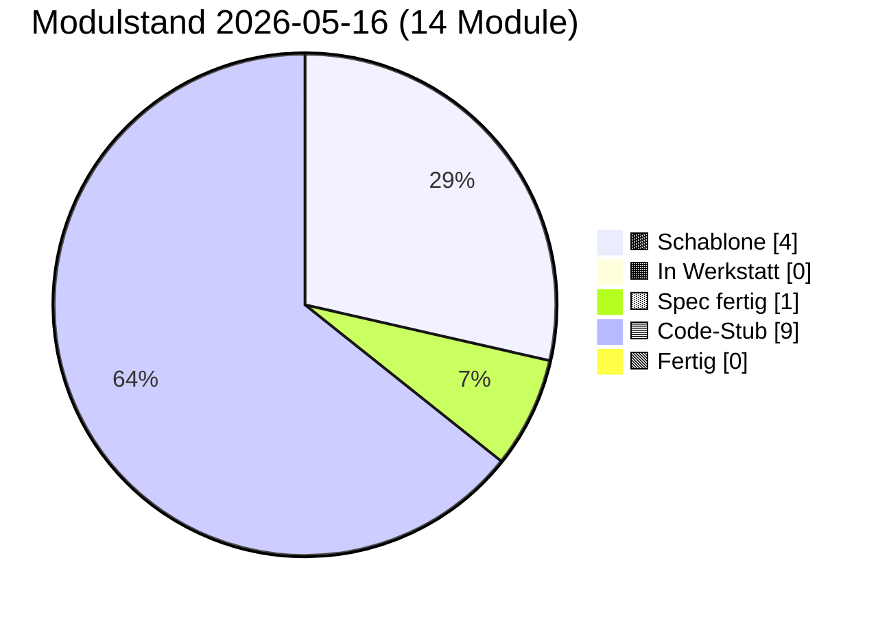

# PULS — lebender Status

**Format:** Jede Sitzung trägt unten einen Eintrag ein (neueste oben).
**Pflichtfelder pro Eintrag:** Datum · Sitzungs-Rolle · was getan · was offen · nächster sinnvoller Schritt.
**Begrenzung:** Diese Datei darf 400 Zeilen nicht überschreiten. Älteres ins
`docs/sessions/archiv/`-Verzeichnis als Übergabeprotokoll auslagern.

---

## Modulstand heute

<!-- Pie-Block ab hier wird automatisch aus status.json generiert.
     Nicht von Hand bearbeiten. Erzeugen mit:
     python3 scripts/update_puls_pie.py
     Aufruf-Pflicht: nach jeder status.json-Änderung. Siehe CLAUDE.md. -->

Farb-Mapping verbindlich in [INTERFACES.md §5](INTERFACES.md). Live-Bau-Puls
auf der [Sage-Page](../index.html) (Karte "Bau-Puls").

## Als nächstes ✨

Module mit Code-Stub, **Sichttest durch Klaus 2026-05-14 erledigt** —
ergab fünf reproduzierbare Cosinus-Messwerte (siehe Karte 04 Beleg-
Block), die in der Pflege-Sitzung 2026-05-14 zu `PROVIDER_MIN_MATCH`
0.55 → 0.80 geführt haben:

- 🟦 **[01 Storage](components/01_storage.md)** — geprüft 2026-05-14 (Klaus, im Browser); init/round-trip/Unknown-Store sauber, sechs Stores in DevTools sichtbar
- 🟦 **[02 Spore](components/02_spore.md)** — geprüft 2026-05-14 (Klaus, im Browser); Identität deterministisch, Spore sortiert, Sign+Verify valide, Manipulation erkannt
- 🟦 **[03 Embedding](components/03_embedding.md)** — geprüft 2026-05-14 (Klaus, im Browser); L2-Norm 1.0, gleicher Inhalt ≈0.95, Baseline für unverwandte Begriffe ungewöhnlich hoch
- 🟦 **[04 Match](components/04_match.md)** — geprüft 2026-05-14 (Klaus, im Browser); 3/5 Tests grün, 2 zeigten Schwellen-Drift → Pflege-Sitzung 2026-05-14 hat `PROVIDER_MIN_MATCH` und Test-Schwellen kalibriert

Code-Stub frisch aus den Bau-Sitzungen 2026-05-14/15, **Sichttest ausstehend bzw. teilweise erledigt:**

- 🟦 **[05 Anastomose](components/05_anastomose.md)** — Code geschrieben 2026-05-14 (Bau-Sitzung), Sichttest geprüft 2026-05-15 (Klaus, im Browser): 6 von 7 Tests grün im ersten Lauf (Setup, Test 1 passendes Match score=0.888, Test 3 Versions-Mismatch, Test 4 Signatur-Manipulation, Test 5 Re-Handshake, Test 6 forgetSibling, Test 7 listSiblings); **Test 2 (Domain-Mismatch / Tarantino-Vektor) Test-Bug** — score=0.854 statt erwartetem <0.80 (Tarantino-Filme spielen oft in Bars → zu nah am Mixarium-Cocktail-Vektor); Modul-Logik korrekt, `PROVIDER_MIN_MATCH=0.80` greift wie spezifiziert. **Pflege-Sitzung 2026-05-15** baut Panel 05 Test 2 auf **Vektor-Trias** um (Steuerrecht und Bilanzierung / Eisenbahnsignalanlagen / Quantenfeldtheorie), Pass-Check „mindestens einer der drei rejected mit score < 0.80"; Tarantino-Vergleichswert wird parallel als reiner Cosinus protokolliert; Karte 05 § Manueller Test Punkt 2 zieht mit. Klaus' zweiter Sichttest-Lauf nach Pflege folgt; falls alle drei Trias-Kandidaten über 0.80 liegen, eigene Folge-Pflege-Sitzung „Embedding-Baseline"
- 🟦 **[06 Heterokaryose](components/06_heterokaryose.md)** — Code geschrieben 2026-05-15 (Bau-Sitzung 06) + **Pflege Bau 06.1 Outbox-Lese-Pfad 2026-05-15** (`sbkim_hetero_outbox` als Anker-Quelle nach Spec-Sitzung 08, fail-soft Fallback bleibt). Sichttest ausstehend (headless gebaut, wartet auf Klaus' Browser). Fünf-Funktionen-API, kanonischer Sign/Verify-Pfad als **vierter Pfad bewusst dupliziert** (Single-File-PWA-Stil), neuer Store `sbkim_hetero_inbox` (DB-Version 1→2 additiv, Bau 06), Service-Worker dritter fetch-Listener-Pfad `/sbkim/heterokaryosis`, Modul 07 Cleanup-Reihenfolge nachgezogen (`sbkim_hetero_inbox` zwischen `sbkim_legacy_inbox` und `sbkim_spore`), Karte 01/06/07 + INTERFACES.md §1 Modul 01/06/07 + §6 nachgezogen. **Anker-Quelle nach Pflege Bau 06.1: voller Outbox-Lese-Pfad** — Modul 06 liest `sbkim_hetero_outbox` (v=3-Store aus Spec-Sitzung 08, `DB_VERSION` 2 → 3 additive Migration in `01_storage.js`) fail-soft (try/catch um `SbkimStorage.all`; bei leerem/fehlenden Store / Wurf wie `UnknownStoreError` → Fallback), sortiert absteigend nach `addedAt`, mappt die ersten `HETERO_MAX_ANCHORS` (= 5) auf Anker-Form `{label, vector}`. Wenn die Outbox leer ist (oder eine ältere Klaus-PWA mit DB-Version 1/2 sie noch nicht hat), bleibt der Spore-Single-Anker-Fallback aus der Erst-Bau-Iteration bestehen (Label `"(domain)"`, Vektor = `senderSpore.domainVector`; `anchors:[]` als Degraded-Modus, wenn auch das fehlt). Panel 06 mit 14 Knöpfen; Test 9 (`HETERO_MAX_ANCHORS`-Begrenzung) jetzt **voll abgedeckt** (sechs Outbox-Einträge direkt via `SbkimStorage.put` — kein `SbkimUiDemo`-Aufruf, Bau 08 ist eigene Phase — → Response liefert genau fünf, neueste zuerst). `node --check src/modules/01_storage.js` + `node --check src/modules/06_heterokaryose.js` + alle 9 Inline-Scripts grün. `status.json` unverändert (Modul 06 bleibt `score:"stub"`, Pflege ist additiv). **Test 6 in Panel 07 muss in einem Folge-Sichttest neu durchgespielt werden** (Cleanup löscht jetzt sechs Stores statt fünf — die Anzahl der zu prüfenden leeren Stores ist um eins gestiegen).
- 🟦 **[07 Apoptose](components/07_apoptose.md)** — Code geschrieben 2026-05-14 (Bau-Sitzung), Sichttest geprüft 2026-05-15 (Klaus, im Browser): 7 von 8 Tests grün im ersten Lauf (Setup + Tests 1/2/3/4/5/7 + Selbstcheck); **Test 6 (Self-Apoptose) deckte echten Modul-Bug auf**: nach Cleanup `getNodeId_wirft_NoIdentityError:false` trotz `stores_alle_leer:true` — Modul 02's In-Memory-`identityCache` wurde nicht durch externes `storage.clear` invalidiert (Modul 07 wusste nichts vom Modul-02-Cache). Folgeschaden: Tests 1/2/3/8 nach Test 6 mit „Keine Identität in sbkim_keys[main]". **Pflege-Sitzung 2026-05-15** ergänzt Modul 02 um öffentliche `resetIdentityCache() → void` (sync, idempotent, leert nur Closure-Cache, kein Storage-Eingriff) und Modul 07's Cleanup ruft sie als letzten Schritt nach den `storage.clear`-Aufrufen — heilige Tafeln (INTERFACES.md §1 Modul 02 + §1 Modul 07 + §6 + Karten 02 + 07) ziehen mit. Re-Sichttest 2026-05-15 bestätigte den Cache-Fix: `getNodeId_wirft_NoIdentityError:true`. Modul 07 Sichttest 8/8 grün. **Pflege Cleanup-Reihenfolge Bau 06 (2026-05-15)** erweitert `CLEANUP_ORDER` additiv um `sbkim_hetero_inbox` (Position 4 zwischen `sbkim_legacy_inbox` und `sbkim_spore`); Test 6 muss in einem Folge-Sichttest neu durchgespielt werden (jetzt 6 statt 5 Stores zu prüfen).
- 🟦 **[00 Doku-Fenster](components/00_doku_fenster.md)** — Code geschrieben 2026-05-14 (Bau-Sitzung), Sichttest geprüft 2026-05-15 (Klaus, im Browser): 5 von 6 Tests grün im ersten Lauf (Setup, Test 2 5-Klick-Simulation, Test 3 4-Klick + Timeout, Test 5 TTL-Sweep, Selbstcheck-Hinweis); **Test 4 Test-Bug** mit Mini-Werten 81/100 (freeBytes=19 Bytes ist trivial < 50 MiB → `warningLevel:"both"` statt erwartetem `"ratio"`) → **Pflege-Sitzung 2026-05-15** repariert mit GiB-Skalierung (`usage:8.1 GiB, quota:10 GiB` → freeBytes ≈ 1.9 GiB → `warningLevel:"ratio"` sauber); Modul-Vertrag und INTERFACES.md unangetastet

Spec frisch, **Bau ausstehend**:

- 🟨 **[09 Einbau-PWA](components/09_einbau_pwa.md)** — Karte vollständig 2026-05-14 (Spec-Sitzung; Anleitung, kein JS-Modul), **Pflege-Sitzung 2026-05-15 erweitert auf neun Schritte** (Schritt 9 neu: `SbkimApoptose.init()` + `SbkimDoku.init({searchIconSelector:...})` + optionaler TTL-Sweep nach Handshake); `<script>`-Reihenfolge in Schritt 2 zieht 07 + 00 nach (`01 → 02 → 03 → 04 → 05 → 07 → 00`); Sichtkontroll-Block jetzt vier Pflicht-Punkte (sieben Selbstcheck-Zeilen + sechs IndexedDB-Stores + zwei live-Endpunkte + 5-Klick-Geste am Such-Symbol); Datei-Pfad-Konvention (SW im Endknoten-Repo-Root, sieben JS-Module inline oder unter `sbkim/`); Spore-Endpunkt `/sbkim/spore.json` verbindlich; SW-Scope-Falle dokumentiert; `domainVector`-Pflicht-Frage **entschieden Variante A (Soft-Pflicht im Andock-Workflow, kein Hauptversions-Sprung)** — Modul 02 / §0 / §2 bleiben unverändert. **Bau-Sitzung 2026-05-15 vor Schritt 1 sauber abgebrochen** (Befund-Sitzung): beide Endknoten haben aktiven `app-sw.js` im Repo-Root (Mein-Mixarium Z. 12543, Mein-Rezeptbuch Z. 10453), Karte 09 antizipiert diesen Fall nicht; zusätzlich Karte 09 § Sichtkontrolle implizit auf Desktop-DevTools gemünzt — Klaus' Tablet (Galaxy Tab S6 + DeX) braucht Eruda-Pfad. **Vor erneuter Bau-Sitzung 09** zwei Karten-Lücken in einer Pflege-Sitzung Karte 09 zu schließen (Empfehlung Option α: Patch in bestehenden `app-sw.js`; plus Eruda-Pfad für Tablet-Sichtkontrolle). Details in [Übergabeprotokoll 2026-05-15 Bau-09-blockiert](sessions/archiv/2026-05-15_bau-09-blockiert-app-sw.md).

Letzter Bau frisch (Bau-Sitzung 2026-05-15), **Sichttest geprüft 2026-05-15:**

- 🟦 **[08 UI-Demo](components/08_ui_demo.md)** — Code geschrieben 2026-05-15 (Bau-Sitzung 08). Endknoten-Andocker-UI für die zwei Stellen, die Modul 06 (Heterokaryose) braucht, aber nicht selbst füllt: `sbkim_hetero_outbox` (Anker-Vorrat) und `sbkim_siblings[peerNodeId].heterokaryosisOptIn` (additives Opt-In-Flag pro Geschwister). Fünf-Funktionen-API (`init/listOutbox/addOutboxAnchor/removeOutboxAnchor/setSiblingHeteroOptIn`), sechs benannte Error-Klassen im Factory-Stil analog Modul 00, drei Test-Brücken (`_clearOutbox`, `_addPseudoSibling` ohne Opt-In-Flag, `_clearPseudoSiblings`), synchroner Selbstcheck. **Storage-only** (kein Netz, kein Embedding, keine Signatur — Vektor-Erzeugung ist Aufrufer-Pflicht). `addOutboxAnchor`-Check-Reihenfolge: (1) Label sync, (2) Vektor sync, (3) async-Voll-Check (`OutboxFullError` nur bei NEUEM Label); Überschreiben eines bekannten Labels bleibt erlaubt. `setSiblingHeteroOptIn` strikt boolean (`1`, `"true"` werfen `InvalidOptInArgError`); Co-Schreiber-Disziplin via `Object.assign`. Panel 08 in `tests/manual_check.html` mit acht Knöpfen (Setup + sechs Test-Punkte + Selbstcheck-Hinweis); Panel-Status von Werkstatt-Stub `idle` auf `ok "Code-Stub"`. **Self-Apoptose-Knopf bewusst NICHT in Panel 08** (Spec-Sitzung 08-Entscheidung respektiert). `node --check src/modules/08_ui_demo.js` grün, alle 10 Inline-`<script>`-Blöcke validiert. **Sichttest geprüft 2026-05-15 (Klaus, im Browser): 6/6 Test-Punkte grün** (Pflege-Sitzung Sichttest-Resultate 2026-05-15).

Empfehlung Hauptsitzung: **Klaus' Re-Andock beider Endknoten mit
PWA-Suffix**. Die Pflege-Sitzung 2026-05-16 „Karten 01 + 09 PWA-
Suffix" hat die Architektur-Erweiterung abgeschlossen (Modul 01 hat
jetzt `init({dbSuffix})`, Karten 01 + 09 und INTERFACES.md §1 Modul 01
sind nachgezogen, `PROTOCOL_VERSION` bleibt `"0.1"`, Modul 02 unangetastet).
Nächster Schritt liegt **in Klaus' Endknoten-Repos**:

1. In **beiden** Endknoten-Repos (`Mein-Mixarium`, `Mein-Rezeptbuch`)
   muss `sbkim/sbkim-init.js` erweitert werden: vor dem bestehenden
   `await SbkimAnastomose.init()` einen Aufruf
   `await SbkimStorage.init({ dbSuffix: "mixarium" })` (bzw.
   `"rezeptbuch"`) hinzufügen.
2. In beiden Tab-Sessions `__sbkimErzeugeSpore()` erneut triggern
   (Klaus in der jeweiligen Eruda-Konsole) → neue, getrennte nodeIds
   pro PWA.
3. Neue `spore.json` jeweils nach `~/<Endknoten>/sbkim/spore.json`
   verschieben + Commit + Push (überschreibt die alte Pages-Spore).
4. Erst nach Re-Andock kann eine Folge-Sitzung `status.json`
   `pingStatus` von `"blocked-origin-collision"` auf `"live"`
   wechseln (sobald Klaus den ersten Cross-Knoten-Handshake gefahren
   hat) und die `nodeId`-Werte in der Endknoten-Tabelle aktualisieren.

Andere offene Punkte (Mini-Pflege „Sushi-Kategorie sichtbar machen"
in Mein-Mixarium, INTERFACES.md §6 Tabellen-Bug) sind unverändert
offen. Details im [Übergabeprotokoll 2026-05-16 Pflege PWA-Suffix](sessions/archiv/2026-05-16_pflege-pwa-suffix-karten-01-09.md),
zur Andock-Hintergrund [Übergabeprotokoll 2026-05-16 Andock
Mein-Rezeptbuch](sessions/archiv/2026-05-16_andock-mein-rezeptbuch-iteration-3-live.md)
und der zugehörigen [Mixarium-Andock-Übergabe](sessions/archiv/2026-05-16_andock-mein-mixarium-iteration-3-live.md).

---

## Schnellüberblick

| Modul | Spec | Code | Manueller Sichttest | Anmerkung |
|---|---|---|---|---|
| 00 doku_fenster | Spec fertig (2026-05-14) | Code-Stub (2026-05-14) | geprüft 2026-05-15 (Klaus) — 5/6 Tests grün im ersten Lauf, Test 4 Test-Bug in Pflege-Sitzung 2026-05-15 mit GiB-Skalierung repariert | Sechs-Funktionen-API (`init/open/close/isOpen/getStatusSnapshot/recordSighttest`), reines Lese-/Trigger-Modul, alleiniger Schreiber `sbkim_doku_meta`, 5-Klick-Geste mit 3s-Zeitfenster, Modal mit Backdrop und MutationObserver-Mount, Quota-Doppel-Schwelle (80% / 50 MiB), Self-Apoptose bewusst NICHT in 00 |
| 01 storage | Spec fertig (2026-05-14) | Code-Stub (2026-05-14) | geprüft 2026-05-14 (Klaus) | IndexedDB-Wrapper |
| 02 spore | Spec fertig (2026-05-14, Pflege Stamm/Gast-Felder 2026-05-15) | Code-Stub (2026-05-14, Pflege Cache-Invalidate 2026-05-15, Pflege Stamm/Gast-Durchreichung 2026-05-15) | geprüft 2026-05-14 (Klaus) + 2026-05-15 (Cache-Invalidate-Pflege via Sichttest 07) | Ed25519-Identität, Singleton, base64url-sha256-rawpub; +`resetIdentityCache()` aus Pflege-Sitzung 2026-05-15 (Pflicht-Hook für Apoptose-Cleanup). **Spore-JSON Optionale Felder additiv erweitert** 2026-05-15 (Spec-Sitzung Stamm/Gast): `stammCategories: string[]` + `guestCategories: string[]`, signaturpflichtig wenn vorhanden, Disjunktheit als Hosting-Pflicht (kein Verify-Abbruch). Sign-/Verify-Pfad unverändert. **`generateOwnSpore` Code-Allow-List nachgezogen** 2026-05-15 (Bau 02 Stamm/Gast): zwei Zeilen analog zu `domainKeywords` — ohne diese Pflege würden Stamm/Gast-Felder beim Andock still ignoriert. |
| 03 embedding | Spec fertig (2026-05-14) | Code-Stub (2026-05-14) | geprüft 2026-05-14 (Klaus) | semantischer Vektor |
| 04 match | Spec fertig (2026-05-14, Pflege Stamm/Gast-Hinweis 2026-05-15) | Code-Stub (2026-05-14) | geprüft 2026-05-14 (Klaus) | Vektorvergleich, modus-frei; Pflege-Sitzung 2026-05-14 PROVIDER_MIN_MATCH 0.55→0.80. **Karte 04 § Stamm/Gast-Hinweis 2026-05-15** (Spec-Sitzung Stamm/Gast): Match bleibt unverändert; Stamm/Gast ist Klassifikations-Schicht auf Daten-Ebene, kein Vektor-Math; explizit kein Dämpfungsfaktor, keine zweite Schwelle. |
| 05 anastomose | Spec fertig (2026-05-14) | Code-Stub (2026-05-14) | geprüft 2026-05-15 (Klaus) — 6/7 Tests grün im ersten Lauf, Test 2 Test-Bug (Tarantino-Vektor zu nah an Cocktails 0.854) in Pflege-Sitzung 2026-05-15 als Vektor-Trias repariert (3 Kandidaten parallel, Pass = ≥ 1 unter 0.80); Klaus' zweiter Lauf nach Pflege folgt | Handshake; Fünf-Funktionen-API, bidirektional, kanonisch signiert, Schwelle aus Modul 04; SW Variante A (Page-Hosted) |
| 06 heterokaryose | Spec fertig (2026-05-15) | Code-Stub (2026-05-15, Pflege Bau 06.1 Outbox-Lese-Pfad 2026-05-15) | — | Datenaustausch unter Geschwistern; Fünf-Funktionen-API (`init/requestHeterokaryosis/receiveHeterokaryosis/listHeterokaryosis/forgetHeterokaryosis`), Pull-Pattern, Opt-In beidseits (additiv auf `sbkim_siblings`), kanonisch wie 05/07 (vierter Sign-Pfad bewusst dupliziert), neuer Store `sbkim_hetero_inbox` (Komposit-Schlüssel `peerNodeId\|ts`, DB-Version 1→2 additiv), SW Variante A mit drittem fetch-Listener `/sbkim/heterokaryosis` (Message-Typ `SBKIM_HETEROKARYOSIS_REQUEST`); Modul 07 Cleanup-Reihenfolge nachgezogen (`sbkim_hetero_inbox` zwischen `sbkim_legacy_inbox` und `sbkim_spore`). **Anker-Quelle nach Pflege Bau 06.1 (2026-05-15): voller Outbox-Lese-Pfad implementiert** — `sbkim_hetero_outbox` (Spec-Sitzung 08, v=3-Store) wird fail-soft gelesen, max. `HETERO_MAX_ANCHORS=5` Anker absteigend nach `addedAt`; Fallback auf Spore-Single-Anker bei leerer/fehlender Outbox bestehen geblieben. `src/modules/01_storage.js` `DB_VERSION` 2 → 3 (additive Migration v=3, `STORES_V3=["sbkim_hetero_outbox"]`); Panel 06 mit 14 Knöpfen; Test 9 (`HETERO_MAX_ANCHORS`-Begrenzung) voll abgedeckt (sechs Outbox-Einträge → Response liefert genau fünf, neueste zuerst). Sichttest ausstehend (headless gebaut, wartet auf Klaus' Browser) |
| 07 apoptose | Spec fertig (2026-05-14) | Code-Stub (2026-05-14, Pflege Cache-Invalidate 2026-05-15) | geprüft 2026-05-15 (Klaus) — **8/8 Tests grün** nach Pflege 02+07-Cache-Invalidate (Re-Sichttest 2026-05-15 bestätigte `getNodeId_wirft_NoIdentityError:true`); Test 6 (Self-Apoptose) hatte einen Modul-02-Cache-Bug aufgedeckt, der in Pflege 2026-05-15 mit `resetIdentityCache()` als Cleanup-Schritt 6 behoben wurde. | Selbstlöschung mit signiertem Vermächtnis; zweistufige Self-Apoptose (Token 60 s), Vermächtnis-Inbox, TTL-Vergessen explizit durch Andocker; kanonischer Sign/Verify-Pfad aus 02/05 dritter Pfad dupliziert; SW erweitert um `/sbkim/legacy` (gemeinsamer fetch-Listener mit `/sbkim/anastomosis`); Panel 07 mit zehn Knöpfen; Cleanup-Schritt 6 ruft `SbkimSpore.resetIdentityCache()` nach Pflege-Sitzung 2026-05-15 |
| 08 ui_demo | Spec fertig (2026-05-15) | Code-Stub (2026-05-15) | geprüft 2026-05-15 (Klaus) — 6/6 Test-Punkte grün | Endknoten-Pflege-UI für `sbkim_hetero_outbox` und `sbkim_siblings.heterokaryosisOptIn`; Fünf-Funktionen-API (`init/listOutbox/addOutboxAnchor/removeOutboxAnchor/setSiblingHeteroOptIn`), sechs benannte Error-Klassen im Factory-Stil analog Modul 00 (`UiDemoDependenciesError` / `InvalidAnchorLabelError` / `InvalidAnchorVectorError` / `OutboxFullError` / `UnknownSiblingError` / `InvalidOptInArgError`), drei Test-Brücken (`_clearOutbox`, `_addPseudoSibling` ohne Opt-In-Flag, `_clearPseudoSiblings`). Modul 08 alleiniger Schreiber von `sbkim_hetero_outbox` (v=3-Store aus Pflege Bau 06.1, Schlüssel `label`, max. `HETERO_OUTBOX_MAX_ENTRIES`=5, absteigend nach `addedAt`, Überschreiben statt Verdrängen) und Co-Schreiber für `sbkim_siblings.heterokaryosisOptIn` (Modul 05 unangetastet, Karte-01-Vertragserweiterung). **Storage-only** (kein Netz, kein Embedding, keine Signatur — Vektor-Erzeugung ist Aufrufer-Pflicht). `addOutboxAnchor`-Check-Reihenfolge: (1) Label sync, (2) Vektor sync, (3) async-Voll-Check (`OutboxFullError` nur bei NEUEM Label); Überschreiben eines bekannten Labels bleibt erlaubt. `setSiblingHeteroOptIn` strikt boolean (`1`, `"true"` werfen `InvalidOptInArgError`); Co-Schreiber-Disziplin via `Object.assign({}, sibling, {heterokaryosisOptIn})`. Self-Apoptose-Knopf bewusst NICHT in Panel 08 (Spec-Sitzung 08-Entscheidung respektiert). Panel 08 in `tests/manual_check.html` mit acht Knöpfen (Setup + sechs Test-Punkte + Selbstcheck-Hinweis); Panel-Status von Werkstatt-Stub `idle` auf `ok "Code-Stub"`. **Sichttest geprüft 2026-05-15 (Klaus): 6/6 Test-Punkte grün im ersten Lauf** (Pflege-Sitzung Sichttest-Resultate 2026-05-15). |
| 09 einbau_pwa | Spec fertig (2026-05-14, Pflege Schritt 9 + 07/00 2026-05-15, Pflege App-SW-Koexistenz 2026-05-15) | — (Anleitung, kein JS-Modul) | — | Andock-Anleitung — **9 Schritte** (Schritt 9 neu aus Pflege-Sitzung 2026-05-15: SbkimApoptose.init + SbkimDoku.init + optionaler TTL-Sweep nach Handshake); `<script>`-Reihenfolge 01→02→03→04→05→07→00; Soft-Pflicht `domainVector` im Andock-Workflow (kein Hauptversions-Sprung); SW im Endknoten-Repo-Root, `/sbkim/spore.json` als Spore-Endpunkt — plus Pflege App-SW-Koexistenz (2026-05-15): Schritt 3 a/b-Verzweigung (Pre-Flight-Check → 3a `register('sbkim-sw.js')` für PWA ohne eigenen SW, 3b `importScripts('./sbkim-sw.js')` im bestehenden App-SW für PWA mit eigenem SW), achtes Risiko „App-SW-Überschreibung", `sbkim-sw.js` `SBKIM_SW_STANDALONE`-Flag rückwärtskompatibel (Default `true`, `false` für Variante 3b) |
| 10 reputation | Stub (Schutz-Backlog) | — | — | Knoten-Reputation, Priorität niedrig |
| 11 rate_limit | Stub (Schutz-Backlog) | — | — | Rate-Limit & TTL, Priorität niedrig |
| 12 blocklist | Stub (Schutz-Backlog) | — | — | manuelle Sperrliste, Priorität niedrig |
| 14 diffusion | Stub (Diffusion-Backlog) | — | — | konsensuell-empfehlende Spore-Diffusion via Handshake-Erweiterung (Pfad 2 verbindlich, Pfad 1 = Default-Status-quo, Pfad 3 verworfen wegen Empfangsmodus-Prinzip); Spec ausstehend bis Netz ≥ 10 Geschwister oder erfolgreicher Live-Andock + Wachstums-Bedürfnis; Priorität niedrig — **plus Sage-Page-Sichtbarmachung 2026-05-15** (Karten 4/13/14 ziehen `diffusionBacklog[]` parallel zu `schutzBacklog[]`) |

Statuscodes: `—` (nichts) · `Schablone` · `Stub` · `Entwurf` · `Review` · `stabil` · `eingebaut`

## Endknoten (externe Repos des Betreibers)

| App | URL | Domäne | SBKIM-Stand |
|---|---|---|---|
| Rezeptbuch | https://lausiklauskn-png.github.io/Mein-Rezeptbuch/ | Kochrezepte (Stamm 7) — Drinks + Snacks als Überraschungs-Plus (Gast 11) | **integriert 2026-05-16** (Bau-Sitzung 09 Iteration 3, mit Klaus am Termux) · Spore live unter `https://lausiklauskn-png.github.io/Mein-Rezeptbuch/sbkim/spore.json` mit `stammCategories[7]` + `guestCategories[11]` + `domainVector[384]` · App-SW Variante 3b · Eruda-Konsole zeigt alle sieben Modul-Selbstchecks plus drei `sbkim-init.js`-Init-Zeilen grün. **nodeId identisch zu Mein-Mixarium** (`1h5OPqqq3lPJPPxdXIyAjkzdHgYCfkuHx5ZEjZguOq0`) wegen **IndexedDB-Origin-Kollision** auf GitHub Pages Project-Sites (beide PWAs unter Origin `lausiklauskn-png.github.io` teilen `sbkim_keys["main"]`). Cross-Knoten-Handshake zwischen Mein-Rezeptbuch und Mein-Mixarium **technisch nicht möglich** (`pingStatus: "blocked-origin-collision"`). Architektur-Erweiterung in Karten 01 + 09 in Folge-Pflege-Sitzung notwendig. |
| Mixarium | https://lausiklauskn-png.github.io/Mein-Mixarium/ | Cocktails / Drinks (Stamm 8) — Knabbereien / Fingerfood (Gast 2) | **integriert 2026-05-16** (Bau-Sitzung 09 Iteration 3, mit Klaus am Termux) · nodeId `1h5OPqqq3lPJPPxdXIyAjkzdHgYCfkuHx5ZEjZguOq0` · Spore live unter https://lausiklauskn-png.github.io/Mein-Mixarium/sbkim/spore.json mit allen Pflicht- und optionalen Feldern inkl. `stammCategories[8]` + `guestCategories[2]` + `domainVector[384]` · App-SW Variante 3b (`importScripts('./sbkim-sw.js')` im bestehenden `app-sw.js`) · Eruda-Konsole zeigt alle sieben Modul-Selbstchecks plus drei `sbkim-init.js`-Init-Zeilen grün. **nodeId identisch zu Mein-Rezeptbuch** wegen IndexedDB-Origin-Kollision (siehe nächste Zeile). Cross-Knoten-Handshake gegen Mein-Rezeptbuch **technisch nicht möglich** (`pingStatus: "blocked-origin-collision"` von beiden Seiten). Architektur-Erweiterung in Karten 01 + 09 in Folge-Pflege-Sitzung notwendig. |

## Offene Querschnitts-Fragen

- ~~**IndexedDB-Origin-Kollision bei GitHub-Pages-Project-Sites**~~ —
  **gelöst 2026-05-16 durch Pflege-Sitzung „Karten 01 + 09 PWA-
  Suffix".** Variante (a) aus dem ursprünglichen Eintrag (PWA-Suffix
  in Storage-DB-Name) umgesetzt: Modul 01 akzeptiert jetzt optional
  `init({ dbSuffix: "<wert>" })` und öffnet die DB unter dem Namen
  `sbkim_<dbSuffix>` statt der Default-DB `sbkim`. Pattern für
  Suffix: `^[a-z0-9_-]+$` (sonst synchroner `InvalidDbSuffixError`).
  Modul 02 unangetastet (`IDENTITY_KEY = "main"` weiterhin Singleton-
  Schlüssel innerhalb der jeweiligen DB — Trennung passiert eine
  Schicht tiefer, auf DB-Namen-Ebene). Modul 05 unangetastet
  (`SbkimAnastomose.init()` weiterhin ohne Optionen; Idempotenz von
  `Storage.init` macht den zwei-Aufruf-Pfad sauber). Karten 01 + 09
  + INTERFACES.md §1 Modul 01 + §6 nachgezogen. `PROTOCOL_VERSION`
  bleibt `"0.1"`. Klaus' Re-Andock beider Endknoten (in beiden
  `sbkim-init.js` `SbkimStorage.init({dbSuffix})` vor
  `SbkimAnastomose.init()` einfügen + `__sbkimErzeugeSpore()`
  triggern + neue Spore deployen) steht aus — danach wechselt
  `status.json` `pingStatus` von `"blocked-origin-collision"` auf
  `"live"` für beide Endknoten in einer Folge-Sitzung. Variante
  (b) (eigene Subdomain mit Custom Domain) bleibt als langfristige
  Option dokumentiert. Details im
  [Übergabeprotokoll 2026-05-16 Pflege PWA-Suffix](sessions/archiv/2026-05-16_pflege-pwa-suffix-karten-01-09.md);
  Reproduktion der ursprünglichen Kollision im
  [Übergabeprotokoll 2026-05-16 Andock Mein-Rezeptbuch](sessions/archiv/2026-05-16_andock-mein-rezeptbuch-iteration-3-live.md).
- ~~**Karten-Lücke Karte 09 / Tablet-Sichtkontrolle**~~ — **gelöst
  2026-05-15 durch Pflege-Sitzung Karte 09 „App-SW-Koexistenz +
  Tablet-Sichtkontrolle" (diese Sitzung).** Karte 09 § Sichtkontrolle
  hat jetzt einen § Tablet-Variante-Sub-Block mit Eruda-Pfad
  (in-Page-DevTools-Polyfill, gepinnt auf `eruda@3`, jsdelivr-CDN,
  touch-bedienbar). Mapping der vier Pflicht-Punkte auf Eruda-Tabs
  (Console / Resources→IndexedDB / Network / 5-Klick-Geste).
  Verbindlicher Hinweis „nach Sichtkontrolle wieder entfernen —
  kein Produktiv-Einbau, kein SBKIM-Modul, kein Datenschutz-Stein".
  Details im Übergabeprotokoll
  [2026-05-15 Pflege Karte 09 App-SW + Tablet](sessions/archiv/2026-05-15_pflege-karte-09-app-sw-tablet.md).
- ~~**Karten-Lücke Karte 09 / Andocken in PWA mit bestehendem
  Service-Worker**~~ — **gelöst in zwei Pflege-Sitzungen 2026-05-15:**
  (a) Pflege App-SW-Koexistenz (PR #31, 2026-05-15) hat Schritt 3
  in 3a/3b verzweigt mit Pre-Flight-Check
  (`navigator.serviceWorker.getRegistration('./')`),
  Variante 3b = `importScripts('./sbkim-sw.js')` in bestehendem
  App-SW (= Option α), `SBKIM_SW_STANDALONE`-Flag in
  `src/sbkim-sw.js` (Default `true`, `false` für 3b), achtes
  Risiko „App-SW-Überschreibung" in § Risiken; (b) Pflege Karte 09
  „App-SW-Koexistenz + Tablet-Sichtkontrolle" (diese Sitzung,
  2026-05-15) hat zusätzlich **Variante 3c** als nachrangige
  Übergangslösung dokumentiert (SBKIM-SW unter `/sbkim/` mit Scope-
  Einschränkung = Option β; Option γ „App-SW ersetzen" entspricht
  der heutigen falschen Anwendung von Variante 3a auf eine PWA mit
  App-SW und ist als achtes Risiko bereits dokumentiert) plus eine
  Tabelle „Wann welche Variante?" als Andock-Entscheidungshilfe.
  Details im Übergabeprotokoll
  [2026-05-15 Pflege Karte 09 App-SW + Tablet](sessions/archiv/2026-05-15_pflege-karte-09-app-sw-tablet.md).
- ~~Werden Domain-URLs der Endknoten-Apps in `docs/PULS.md` /
  `status.json` aufgenommen oder nur lokal in deren `index.html`?~~ —
  **teilweise gelöst 2026-05-15** in abgebrochener Bau-Sitzung 09:
  Pages-URLs in PULS-Tabelle „Endknoten" und `status.json`
  `endknoten[*].url` eingetragen (`integrated:false` bleibt — Andock
  nicht erfolgt). Eintrag in `docs/INTERFACES.md` weiterhin offen.
- Werden Domain-URLs der Endknoten-Apps in `docs/INTERFACES.md` aufgenommen
  oder nur lokal in deren `index.html`? → Entscheidung steht aus.
- Embedding-Modell: bleibt es bei Default `Xenova/multilingual-e5-small`?
  → ja, bis Gegenargument. Quelle: `sbkim_integration.md` §4.1.
- ~~Speicherort der Spore bei GitHub Pages: `/.well-known/sbkim/spore.json`
  oder Alias `/sbkim/spore.json`?~~ — **gelöst 2026-05-14 in Spec-Sitzung
  09:** verbindlicher Andock-Default ist `/sbkim/spore.json` (Alias aus
  §3 INTERFACES). Begründung in `docs/components/09_einbau_pwa.md`
  Schritt 7: GitHub-Pages-Project-Sites haben mit `.well-known/` die
  Jekyll-Dot-Ordner-Falle, `/sbkim/spore.json` bündelt zudem alle
  SBKIM-Pfade unter `/sbkim/` (semantisch sauber).
- **Wording-Diskrepanz**: `CLAUDE.md` führt SBKIM als
  "Semantisch-Biologisch Koordiniertes Inter-Knoten-Mycel" — das Paper
  (Kap. 1.2) führt es als "Semantisch-Empfangendes Bidirektionales
  KI-Matching". Das Observatorium (`index.html`, `status.json`) übernimmt
  die Paper-Variante. CLAUDE.md sollte in einer separaten Sitzung
  nachgezogen werden.
- ~~**A1–B3-Notations-Überlappung Sage ↔ Mixarium**~~ — **gelöst
  2026-05-14 in Spec+Bau-Sitzung Modul 04.** Die Synthese „Hops tragen
  die Funktionen" steht jetzt verbindlich in
  [`docs/components/04_match.md` § A1–B3-Synthese](components/04_match.md):
  Pfad A = Curator → Auditor → Devil's Advocate (Anbieter-Seite
  verfeinert die Antwort); Pfad B = Interviewer → Matcher → Critic
  (Anfrage-Seite verfeinert die Frage), mit Apoptose bei B4 im
  Negativ-Fall. Sage zeigt die *Geometrie* der Hop-Position, Mixarium
  zeigt die *Rolle* — beide Notationen bleiben gültig, sie beschreiben
  dieselbe Wanderung aus zwei Winkeln. Kein eigenes Mapping-Dokument
  nötig.
- **Spore-Persistenz-Strategie verteilt** (offen, eingetragen
  2026-05-14 nach Bau-Sitzung 07; **teilweise gelöst 2026-05-14
  durch Spec-Sitzung 00**). „Stille Löschung ohne Vermächtnis"
  (Karte 07 § Risiken) ist nicht in einem einzelnen Modul lösbar —
  vier Stellen müssen beim Bauen zusammenpassen:
  - **Modul 01 Storage:** `navigator.storage.persist()` beim `init()`
    + `navigator.storage.estimate()` für Quota-Frühwarnung —
    **offen**.
  - **Modul 02 Spore:** Backup-Export (passwort-verschlüsselt) als
    Recovery-Pfad für Browser-Wechsel und manuelles Löschen —
    **offen**.
  - **Modul 00 Doku-Fenster:** stille Frühwarnung bei < X% Speicher
    (X als gemeinsame Konstante in §0) — **gelöst 2026-05-14 durch
    Spec-Sitzung 00:** `DOKU_QUOTA_WARN_RATIO = 0.80` UND
    `DOKU_QUOTA_WARN_BYTES = 52428800` (50 MiB) verbindlich in §0
    eingetragen (Doppel-Schwelle; Warnzeile bei Überschreitung einer
    der beiden). Konsistenter Schwellwert-Anker für Modul 01 und
    Modul 02. Modul 00 ist der erste Andocker, der die §0-Konstanten
    konkret nutzt — `navigator.storage.estimate()` beim `open()`,
    Vergleich gegen beide Schwellen, passive Warnzeile im
    Statusfenster. Verbleibender Schritt für eine Folge-Pflege-
    Sitzung „Persistenz-Strategie verbinden": Modul 01 verankert
    `navigator.storage.persist()` als Persist-Mechanismus, Modul 02
    spezifiziert das Backup-Format (vermutlich neu in §2).
  - **Modul 07 Apoptose:** Risiko-Vermerk „stille Löschung" (steht
    jetzt in Karte 07 § Risiken).

  Beim Bauen darauf achten, dass die vier Stellen konsistent bleiben:
  **Quota-Schwellwert** (jetzt gelöst — zwei Zahlen in §0), **Backup-
  Format** (eine JSON-Struktur, vermutlich neu in §2 — offen),
  **Warntext** (deutsch, einmal formuliert — offen). Aufhänger für
  eine Pflege-Sitzung „Persistenz-Strategie verbinden", sobald
  02-Backup und 01-Quota spruchreif sind. Modul 00 hat seinen Teil
  verankert; die Frage bleibt offen, weil 01/02 noch nicht spruchreif
  sind.
- ~~**Spore-Diffusion: passiv (Pfad 1) vs. konsensuell-empfehlend
  (Pfad 2) vs. parasitär-mitreisend (Pfad 3)?**~~ — **gelöst
  2026-05-15 in Hauptsitzung 14-Diffusion-Stub durch Anlage
  [`docs/components/14_diffusion.md`](components/14_diffusion.md)**.
  Frage entstand in der abgebrochenen Bau-Sitzung Modul 09 vom
  2026-05-15 (siehe parallele Pflege-Sitzung Karte 09 „App-SW-
  Koexistenz" auf eigenem Branch). Verbindliche Auswahl: **Pfad 2
  (konsensuell-empfehlend)** über `recommendedPeers: SporeRef[]` als
  optionales Handshake-Antwort-Feld (max. 2 Einträge), Empfänger
  speichert als Lead mit TTL, opt-in pro Empfehlung — drehbuchkonform,
  weil jede Übergabe im Konsens. **Pfad 1 (passiv via
  `/sbkim/spore.json`)** bleibt Default-Mechanismus parallel.
  **Pfad 3 (parasitär-mitreisend)** explizit verworfen, weil er das
  Empfangsmodus-Prinzip aus `CLAUDE.md` und `sbkim_paper.pdf`
  („Kein Crawler, keine Pulsation, keine Eigenanfragen ins offene
  Netz") bricht. Modul 14 bleibt Stub bis Netz wächst (Schwelle siehe
  Diffusion-Backlog unten); Karte 05 wird in der Stub-Sitzung
  NICHT angefasst.
- ~~**Sage-Page sichtbar machen für Modul 14**~~ — **gelöst
  2026-05-15 durch Pflege-Sitzung Sage-Page Modul 14.**
  `index.html` rendert jetzt `diffusionBacklog[]` parallel zu
  `schutzBacklog[]` in zwei datengetriebenen Karten (Karte 4
  Module-Bento, Karte 14 Bau-Puls jeweils mit parallelem Divider
  „Diffusion-Backlog · proaktiv · Priorität niedrig"), Pie zählt
  jetzt 14 Module mit 5 Schablonen. Zusätzlich bekommt Karte 13
  Eigenschutz einen zweiten parallelen `schutz-backlog`-Block
  „Diffusion-Backlog · proaktiv (Wuchs durch Empfehlung)"
  sprachlich klar abgegrenzt vom Schutz-Backlog-Block („reaktiv");
  `schutz-pilz`-Schlussspruch um die Diffusion-Zeile erweitert
  („wächst, indem er Notizen über Nachbarn weitergibt, nicht ins
  Leere pulst"). Schema-Beispiel in Karte 7 zeigt jetzt
  `diffusionBacklog: []` parallel zum `schutzBacklog: []`-Kommentar.
  `status.json` unverändert (PR #29 hatte die Daten schon geliefert).
  `update_puls_pie.py` NICHT erneut aufgerufen (keine Modul-Daten-
  Änderung). Details im Übergabeprotokoll
  [2026-05-15 Pflege Sage-Page Modul 14](sessions/archiv/2026-05-15_pflege-sage-page-modul-14.md).

## Schutz-Backlog (aus Sage-Page Karte 13, 2026-05-10)

Drei strukturelle Lücken im Schutz-Modell sind beim Aufbau des
Observatoriums sichtbar geworden. Stubs sind angelegt; gezogen werden sie
ab spürbarem Wachstum:

- `docs/components/10_reputation.md` — Knoten-Reputation
- `docs/components/11_rate_limit.md` — Rate-Limit & TTL
- `docs/components/12_blocklist.md` — manuelle Blocklist

Eigenschutz-Karte der Sage-Page macht das Backlog für jeden Besucher
sichtbar und verlinkt direkt auf die Stubs.

### Diffusion-Backlog (aus Hauptsitzung 14-Diffusion-Stub, 2026-05-15)

Schutz und Diffusion sind zwei verschiedene Backlog-Kategorien. Der
Schutz-Backlog (10/11/12) ist **reaktiv** — er wehrt Schaden ab, wenn
das Netz groß genug ist, dass Apoptose und Match-Filter allein nicht
mehr reichen. Der Diffusion-Backlog ist **proaktiv** — er beschleunigt
das Wachstum durch konsensuelle Empfehlung beim Handshake, ohne das
Empfangsmodus-Prinzip zu brechen.

- `docs/components/14_diffusion.md` — konsensuell-empfehlende Spore-
  Diffusion via Handshake-Erweiterung (`recommendedPeers: SporeRef[]`
  als optionales Feld in der `HandshakeResponse`, max. 2 Einträge,
  Empfänger speichert als Lead mit TTL, opt-in pro Empfehlung)

Pfad-Auswahl verbindlich Pfad 2 (konsensuell-empfehlend);
Pfad 1 (passiv via `/sbkim/spore.json`) bleibt Default-Mechanismus
parallel; Pfad 3 (parasitär-mitreisend) verworfen wegen
Empfangsmodus-Prinzip aus `CLAUDE.md` + `sbkim_paper.pdf`.

Modul 14 wird gezogen, sobald **Netz ≥ 10 aktive Geschwister ODER
Bau-Sitzung Modul 09 erfolgreich abgeschlossen UND spürbares
Wachstums-Bedürfnis** — parallel zur 10/11/12-Logik.

`status.json` führt Modul 14 als eigenes Feld `diffusionBacklog[]`
parallel zu `schutzBacklog[]` (proaktiv vs. reaktiv); `scoreModel.
maxScoreNote` bleibt unangetastet (Backlog zählt nicht zum maxScore).
Das Pie-Skript `scripts/update_puls_pie.py` zählt beide Backlog-
Kategorien jetzt mit.

---

## Sitzungs-Einträge

**Format:** Der jüngste Eintrag steht ausführlich oben. Alle älteren
Sitzungen sind in `docs/sessions/archiv/` abgelegt — der Index
darunter verlinkt jedes Übergabeprotokoll. Neue Sitzungen tragen
sich oben mit vollem Text ein und verschieben den dann jeweils
vorletzten in den Archiv-Index. Ziel: PULS.md bleibt unter 400
Zeilen (CLAUDE.md § Format).

### 2026-05-16 · Pflege-Sitzung — Karten 01 + 09 PWA-Suffix (IndexedDB-Origin-Kollision gelöst)

**Sitzungs-Rolle:** Pflege-Sitzung, headless, EINE Phase. Branch
`claude/pflege-pwa-suffix-EDj8D`. Folge-Pflege direkt nach der Live-
Andock-Sitzung 2026-05-16 (Mein-Mixarium + Mein-Rezeptbuch live
SBKIM-integriert, aber identische `nodeId` wegen IndexedDB-Origin-
Kollision auf GitHub-Pages-Project-Sites — siehe Übergabeprotokoll
„Andock Mein-Rezeptbuch", § ARCHITEKTUR-LÜCKE).

**Auftrag:** Variante (a) aus dem Andock-Übergabeprotokoll umsetzen
— PWA-Suffix in Modul 01 DB-Name, additiv und ohne Hauptversions-
Sprung; Modul 02 unangetastet. Beide Endknoten teilen Origin
`lausiklauskn-png.github.io` und damit die Default-DB `sbkim`; mit
Suffix können sie eigene Identitäten bekommen.

**Getan:**

- **`src/modules/01_storage.js`** patched. `init()` → `init(options)`
  mit optionalem `options.dbSuffix: string`. Validierung
  **synchron** vor dem Promise-Aufbau: Pattern `^[a-z0-9_-]+$`,
  sonst Wurf `InvalidDbSuffixError` (Kleinbuchstaben, Ziffern, `_`,
  `-`). Ohne Suffix bleibt der Default-DB-Name `sbkim`
  (rückwärtskompatibel — Sage-Werkstatt und alle bestehenden Klaus-
  PWAs ohne Suffix-Konfig laufen unverändert weiter). Effektiver
  DB-Name bei gesetztem Suffix: `sbkim_<dbSuffix>` (z.B.
  `sbkim_mixarium`). Neue Konstanten `DB_NAME_DEFAULT = "sbkim"` und
  `DB_SUFFIX_PATTERN = /^[a-z0-9_-]+$/`. Idempotenz erweitert:
  zweiter `init()`-Aufruf mit **abweichendem** Suffix wirft
  `InvalidDbSuffixError` (kein stilles Ignorieren — Klaus' Andocker
  muss `SbkimStorage.init({dbSuffix})` ZUERST aufrufen, bevor
  Module 05/06/07/00 ihre internen `Storage.init()`-Aufrufe
  nachziehen). `_meta.dbName` jetzt als Getter (Live-Zustand statt
  Build-Konstante). `node --check src/modules/01_storage.js` grün.
- **Karte 01** (`docs/components/01_storage.md`) nachgezogen.
  § Schnittstelle: `init(options?)` mit dbSuffix-Block. Neuer
  Unter-Block § DB-Namen-Konvention (PWA-Suffix) zwischen
  § Schnittstelle und § Stores: drei-Zeilen-Tabelle (Default,
  mixarium, rezeptbuch), vier Konventions-Punkte (Aufrufer-Pflicht,
  Pattern-Validierung sync, ERSTER init-Aufruf, Modul 02
  unangetastet). § Konfigurationswerte `DB_NAME` → `DB_NAME_DEFAULT`
  + neue Konstante `DB_SUFFIX_PATTERN`. § Fehlerverhalten zwei
  Zeilen ergänzt. § Bauzustand neue Zeile „Pflege PWA-Suffix".
- **Karte 09** (`docs/components/09_einbau_pwa.md`) nachgezogen.
  § Vor dem Einbau zu klärende Werte neue Zeile `<DB_SUFFIX>`
  (Beispiele: `rezeptbuch` / `mixarium`); Erklärungsblock direkt
  darunter zur IndexedDB-Origin-Kollision. § Schritt 4 umbenannt
  auf „`SbkimStorage.init({dbSuffix})` + `SbkimAnastomose.init()`",
  Code-Block mit zwei sequenziellen `await`-Aufrufen (Storage
  zuerst mit `dbSuffix`, dann Anastomose); Erklärungs-Absatz „Warum
  zwei Aufrufe statt einem?"; Sichtkontrolle-Hinweis auf DB-Namen
  `sbkim_<DB_SUFFIX>`; „Häufiger Fehler"-Block um
  `InvalidDbSuffixError` ergänzt. § Bauzustand neue Zeile „Pflege
  PWA-Suffix".
- **`docs/INTERFACES.md` §1 Modul 01** init-Signatur auf
  `init(options?)` erweitert, options-Form dokumentiert, DB-Name-
  Zeile auf „`sbkim` (Default) / `sbkim_<dbSuffix>`" umgestellt,
  Fehlerverhalten-Block um zwei `InvalidDbSuffixError`-Zeilen
  ergänzt, Geprüft-Zeile um 2026-05-16 erweitert. **§6
  Änderungsprotokoll** Zeile am unteren Ende (neueste unten).
- **PULS** § Empfehlung umformuliert auf „Klaus' Re-Andock beider
  Endknoten mit PWA-Suffix"; § Offene Querschnitts-Fragen
  IndexedDB-Origin-Kollision mit `~~strikethrough~~` als gelöst
  markiert + Verweis auf dieses Übergabeprotokoll;
  § Sitzungs-Einträge rotiert (dieser Eintrag oben, Bau 02
  Stamm/Gast Eintrag entfernt — bleibt im Archiv-Index, war schon
  ausgelagert seit PR #47).
- **Übergabeprotokoll**
  `docs/sessions/archiv/2026-05-16_pflege-pwa-suffix-karten-01-09.md`
  angelegt.

**Bewusst nicht angefasst:**

- **`src/modules/02_spore.js`** unverändert. `IDENTITY_KEY = "main"`
  bleibt — durch den umbenannten DB-Namen ist die Identität jetzt
  PWA-spezifisch, ohne dass Modul 02 davon weiß. Karte 02 + §1
  Modul 02 in INTERFACES.md unangetastet.
- **`src/modules/05_anastomose.js`** unverändert.
  `SbkimAnastomose.init()` weiterhin ohne Optionen — Idempotenz
  von `Storage.init` macht den zwei-Aufruf-Pfad im Andocker sauber
  (Storage zuerst mit Suffix, dann Anastomose; Modul 05 ruft
  `Storage.init()` intern nach und bekommt dasselbe dbPromise).
  Keine Vertrags-Ausweitung in §1 Modul 05.
- **`src/modules/00/03/04/06/07/08*`** unverändert.
- **`tests/manual_check.html`** — optionaler „DB mit Suffix
  öffnen"-Test-Knopf bewusst weggelassen. Begründung: Panel 01
  „Storage init" greift in `init()` idempotent; ein zweiter
  Test-Knopf mit abweichendem Suffix würde nach einem normalen
  Setup-Lauf `InvalidDbSuffixError` werfen und das Panel
  durcheinanderbringen. Wer den Suffix-Pfad sichten will, testet
  ihn in einer Endknoten-PWA (Karte 09 Schritt 4) — das ist die
  echte Bühne.
- **`status.json`** unverändert. Klaus' Re-Andock danach erzeugt
  frische nodeIds — `pingStatus` + `nodeId` werden in einer
  Folge-Sitzung aktualisiert, sobald beide Endknoten neue
  Spore-Files unter ihren Pages-URLs deployed haben.
- **`update_puls_pie.py`** nicht aufgerufen (kein Modul-Score-
  Wechsel; Modul 01 bleibt Code-Stub, Pie-Inhalt unverändert).
- **`index.html` (Sage-Page)** unverändert.
- **`PROTOCOL_VERSION`** bleibt `"0.1"`.
- **`DB_VERSION`** bleibt `3`.

**Validierung:**

- **`node --check src/modules/01_storage.js`** grün.
- **Karte 01 + Karte 09 Cross-Reading** durchgezogen: drei
  Beispielwerte (`mixarium`, `rezeptbuch`, Default ohne Suffix)
  konsistent in beiden Karten und in INTERFACES.md §1 Modul 01.
- **Smoke-Test des `init(options)`-Pfads** in Node mit stub-
  `indexedDB.open`-Promise — sieben Fälle alle grün:
  (1) `init()` default → `dbName === "sbkim"`;
  (2) `init({dbSuffix:"mixarium"})` → `"sbkim_mixarium"`;
  (3) `init()` NACH `init({dbSuffix:"rezeptbuch"})` — kein Wurf,
  `dbName` bleibt `"sbkim_rezeptbuch"` (kritischer Idempotenz-Pfad
  für den zweiten Storage-Init in `SbkimAnastomose.init`);
  (4) `init({dbSuffix:"rezeptbuch"})` NACH
  `init({dbSuffix:"mixarium"})` → rejects mit
  `InvalidDbSuffixError`;
  (5) `init({dbSuffix:"BAD"})` → SYNCHRONER `InvalidDbSuffixError`
  (Pattern-Verletzung Großbuchstabe);
  (6) `init({dbSuffix:""})` → SYNCHRONER `InvalidDbSuffixError`
  (Pattern verlangt ≥ 1 Zeichen);
  (7) `init({dbSuffix: null})` → behandelt wie keine Optionen,
  `dbName === "sbkim"`.
- **Erster Implementierungs-Wurf hatte einen Idempotenz-Bug**: der
  Konflikt-Check verglich `requestedName` (Default `"sbkim"` ohne
  Optionen) mit `dbNameInUse` (gesetzt durch ersten Aufruf mit
  Suffix, z.B. `"sbkim_rezeptbuch"`) — Modul 05's interner
  `Storage.init()`-Aufruf nach dem Andocker-Setup hätte
  `InvalidDbSuffixError` geworfen. Behoben im selben Sitzungs-
  Commit: Konflikt-Check feuert nur, wenn `options.dbSuffix`
  EXPLIZIT gesetzt UND abweichend ist. Smoke-Test 3 deckt genau
  diesen Pfad ab und ist grün.

**Was offen blieb:**

- **Klaus' Re-Andock beider Endknoten** mit `dbSuffix:"mixarium"` /
  `"rezeptbuch"` in `sbkim-init.js`. Nicht headless — wartet auf
  Klaus am Termux.
- **`status.json` `pingStatus`-Update** nach Re-Andock — wechselt
  von `"blocked-origin-collision"` auf zunächst `"pending-peer"`
  (frische, getrennte Identitäten ohne Cross-Handshake) bzw.
  `"live"` nach erstem erfolgreichen Cross-Knoten-Handshake.
- **Cross-Knoten-Handshake** (Karte 09 Schritt 8) — nach Re-Andock
  möglich.
- **Eruda-Rückbau** in beiden Endknoten — nach erstem
  erfolgreichen Cross-Knoten-Handshake.
- **Mini-Pflege „Sushi-Kategorie sichtbar machen"** in Mein-
  Mixarium (entkoppelt) und **INTERFACES.md §6 Tabellen-Bug** aus
  PR #45 Squash-Merge bleiben weiterhin offen.
- **Klaus' Sichttest Panel 06** (Heterokaryose) weiterhin offen
  aus früheren Sitzungen.

**Nächster sinnvoller Schritt:**

1. **Klaus' Re-Andock Mein-Mixarium + Mein-Rezeptbuch** —
   `sbkim-init.js` in beiden Endknoten-Repos um
   `SbkimStorage.init({dbSuffix})` erweitern, `__sbkimErzeugeSpore()`
   in Eruda triggern, neue Spore deployen. *Nicht headless* — wartet
   auf Klaus am Termux.
2. **`status.json`-Folge-Sitzung** nach Re-Andock — `pingStatus`
   und `nodeId`-Werte aktualisieren.
3. **Cross-Knoten-Handshake** zwischen beiden Endknoten.
4. **Eruda-Rückbau** nach erstem erfolgreichen Handshake.

---

### 2026-05-16 · Bau-Sitzung 09 Iteration 3 — Mein-Rezeptbuch live angedockt (+ Architektur-Lücke entdeckt)

**Sitzungs-Rolle:** Bau-Sitzung Modul 09 (Live-Andock-Versuch, dritte
Iteration, zweiter Endknoten), mit Klaus am Tablet via Termux,
**nicht headless**. Branch
`claude/andock-mein-rezeptbuch-iteration-3-live`. Direkt nach
Mein-Mixarium-Andock in derselben Klaus-Sitzung.

**Getan:**

- **`gh repo clone`** (Sage-Protokol war lokal schon da, aber neu
  gepullt um PR #47 + #48 zu holen) + `cp` der sieben Modul-Files
  + `sbkim-sw.js` in `~/Mein-Rezeptbuch/sbkim/` bzw. Repo-Root.
- **Schritt 2** awk: 7 SBKIM-Script-Tags vor letztem `</body>`
  (`grep -c 'src="sbkim/'` → 7).
- **Schritt 3** App-SW Variante 3b: drei Zeilen oben in
  `app-sw.js` (Rezeptbuch-App-SW `mrz-v11` ab Zeile 4).
- **Schritt 4** `sbkim-init.js` (45 Zeilen) mit Rezeptbuch-
  spezifischen Werten:
  - `stammCategories` (7): Vorspeisen, Suppen, Fleisch, Fisch,
    Vegetarisch, Kuchen, Desserts.
  - `guestCategories` (11): Getränke, Smoothies & Shakes,
    Mocktails, Alkfr. Cocktails, Limonaden, Tees & Kaffees,
    Cocktails, Bowlen, Sirup & Basis, Knabbereien, Fingerfood.
  - `domainKeywords` (7): Rezept, Kochen, Essen, Hauptgang,
    Beilage, Backen, Saucen.
  - `nodeName: "Rezeptbuch Klaus"`, `endpoint:
    "https://lausiklauskn-png.github.io/Mein-Rezeptbuch/"`.
- **Commit + Push** der Module + Patches (`2c8e141`).
- **Live-Reload** in Chrome — App war frisch deinstalliert vom
  Home-Screen, neu via URL aufgerufen. App-SW wurde neu installiert
  (Variante 3b aktiv). Eruda-Konsole zeigt alle sieben Modul-
  Selbstchecks plus drei `sbkim-init.js`-Init-Zeilen grün.
- **`__sbkimErzeugeSpore()`** in Eruda. Embedding-Modell-Cache war
  aus Mixarium-Sitzung im Browser-Cache, kein Re-Download.
  Modul 03 EMBEDDING bereit, Domain-Vektor erzeugt, Spore signiert.
- **Spore-Download via Eruda-One-Liner** → `/storage/emulated/0/
  Download/spore.json` (Chrome überschreibt bei gleichem
  Dateinamen — Mixarium-Spore war eh schon nach
  `~/Mein-Mixarium/sbkim/` verschoben, also keine Kollision lokal).
  `mv ~/storage/downloads/spore.json ~/Mein-Rezeptbuch/sbkim/
  spore.json` + Commit + Push (`04ac4c2`).
- **Live-Spore-URL** `https://lausiklauskn-png.github.io/Mein-
  Rezeptbuch/sbkim/spore.json` deployt nach Pages-Build.

**ARCHITEKTUR-LÜCKE entdeckt — IndexedDB-Origin-Kollision:**

Klaus' aufmerksame Beobachtung: die **nodeId in der Rezeptbuch-
Spore ist identisch zu Mixarium** (`1h5OPqqq3lPJPPxdXIyAjkzdHgYCfkuHx5ZEjZguOq0`).
Klaus hat die App **deinstalliert** (nicht nur vom Home-Screen
entfernt), und trotzdem dieselbe Identität bekommen.

**Ursache:** GitHub-Pages-Project-Sites teilen denselben Origin
(`lausiklauskn-png.github.io`); nur der Pfad differenziert sie.
IndexedDB ist im Browser pro Origin, nicht pro Pfad. Modul 01
öffnet die DB unter dem festen Namen `sbkim` und Modul 02 speichert
die Identität unter `sbkim_keys["main"]`. Konsequenz: beide PWAs
greifen auf dieselbe DB, dieselbe Identität, denselben Ed25519-
Schlüssel.

**Konsequenzen für die zwei deployten Spore-Files:**

- Beide haben dieselbe `id` und denselben `publicKey`.
- Aber unterschiedliche `endpoint`, `nodeName`, `domain` (wobei
  `domain` für beide auch identisch ist `lausiklauskn-png.github.io`),
  `domainDescription`, `domainKeywords`, `stammCategories`,
  `guestCategories`, `domainVector`.
- IndexedDB enthält nur die zuletzt erzeugte Spore (Rezeptbuch hat
  Mixarium's `sbkim_spore["main"]` überschrieben). Die deployten
  Pages-Spore-Files sind aber unabhängig vom IndexedDB-Stand.
- **Cross-Knoten-Handshake technisch unmöglich** (`A.id === B.id`
  → ein Knoten kann sich nicht selbst kennenlernen).

**Sage-Protokol-Sicht-Stand nachgezogen:**

- **`status.json`** Endknoten[Rezeptbuch] auf `integrated: true`
  hochgestuft mit allen additiven Feldern; beide Endknoten zeigen
  `pingStatus: "blocked-origin-collision"` (war vorher
  `"pending-peer"` bei Mixarium).
- **PULS § Offene Querschnitts-Fragen** neue Frage „IndexedDB-Origin-
  Kollision bei GitHub-Pages-Project-Sites" oben eingetragen, mit
  zwei Fix-Optionen für eine Folge-Pflege-Sitzung.
- **PULS § Endknoten-Tabelle** beide Zeilen erweitert (Rezeptbuch
  jetzt integriert; Mixarium-Zeile vermerkt die geteilte nodeId).
- **PULS § Empfehlung Hauptsitzung** umformuliert auf „Karten 01 +
  09 erweitern um PWA-Suffix" als nächsten Schritt.
- **PULS § Sitzungs-Einträge** rotiert.

**Bewusst nicht angefasst:**

- **`src/modules/*`** unverändert. Modul 01 + 02 brauchen die
  Erweiterung um PWA-spezifische Schlüssel-Namen, aber das ist
  Folge-Pflege, nicht diese Sitzung.
- **Karten 01 + 09** unverändert. Erweiterung kommt in
  Folge-Pflege-Sitzung „Karten 01 + 09 PWA-Suffix" — additiv,
  ohne Hauptversions-Sprung.
- **`tests/manual_check.html`**, **`index.html`**, **`docs/INTERFACES.md`**
  unverändert.
- **`update_puls_pie.py`** nicht aufgerufen (kein Modul-Score-
  Wechsel).
- **`PROTOCOL_VERSION`** bleibt `"0.1"`.

**Validierung:**

- **`status.json` valid JSON** (`python3 -c "import json;
  json.load(...)"`); beide Endknoten als `integrated: true` mit
  `pingStatus: "blocked-origin-collision"`.
- **Spore-JSONs live-erreichbar** für beide Endknoten.
- **Eruda zeigt alle sieben Modul-Selbstchecks** plus drei Init-
  Zeilen in beiden PWAs grün.

**Was offen blieb:**

- **Folge-Pflege „Karten 01 + 09 PWA-Suffix"** — Architektur-
  Erweiterung. Modul 01 öffnet die DB unter PWA-spezifischem Namen
  (z.B. `sbkim_<endknotenName>` aus Karte-09-Konfig oder aus
  `location.pathname`); Modul 02 nutzt entsprechend
  `IDENTITY_KEY` pro PWA. Karten 01 + 09 + ggf. Karte 02 ziehen
  nach. Additiv, kein Hauptversions-Sprung. Folge: nodeId und
  Spore werden für jede PWA neu erzeugt; alte Pages-Spores werden
  überschrieben.
- **Cross-Knoten-Handshake** (Karte 09 § 8) zwischen Mixarium und
  Rezeptbuch — erst möglich, wenn die Architektur-Erweiterung
  durch ist und beide Endknoten frische, unabhängige Identitäten
  haben.
- **Eruda-Rückbau** in beiden Endknoten — sinnvoll nach
  erfolgreichem ersten Cross-Handshake (also nach Architektur-Fix).
- **Mini-Pflege „Sushi-Kategorie sichtbar machen"** in
  Mein-Mixarium (entkoppelt).
- **Mini-Pflege INTERFACES.md §6 Tabellen-Bug** (aus Squash-Merge
  PR #45).

**Nächster sinnvoller Schritt:**

1. **Folge-Pflege „Karten 01 + 09 PWA-Suffix"** — *headless
   möglich*. Karten erweitern + Modul 01 + 02 Code-Patch +
   Sichtprüfung via `tests/manual_check.html`. Geschätzt ~45–60 Min.
2. **Klaus' Re-Andock beider Endknoten** mit frischen Identitäten,
   nach Schritt 1.
3. **Cross-Knoten-Handshake** nach Schritt 2.
4. **Eruda-Rückbau** nach Schritt 3.

---

## Archiv-Index (Sitzungen vor dieser Pflege)

Alle Sitzungen bis einschließlich Pflege PULS-Archivierung
(2026-05-15) sind ausgelagert. Neueste oben.

| Datum | Sitzung | Übergabeprotokoll |
|---|---|---|
| 2026-05-16 | Pflege · Karten 01 + 09 PWA-Suffix (IndexedDB-Origin-Kollision gelöst durch `SbkimStorage.init({dbSuffix})`) | [→ Archiv](sessions/archiv/2026-05-16_pflege-pwa-suffix-karten-01-09.md) |
| 2026-05-16 | Bau · 09 Iteration 3 — Mein-Rezeptbuch live angedockt + Architektur-Lücke entdeckt | [→ Archiv](sessions/archiv/2026-05-16_andock-mein-rezeptbuch-iteration-3-live.md) |
| 2026-05-16 | Bau · 09 Iteration 3 — Mein-Mixarium live angedockt (status.json + PULS) | [→ Archiv](sessions/archiv/2026-05-16_andock-mein-mixarium-iteration-3-live.md) |
| 2026-05-15 | Bau · Stamm/Gast-Durchreichung in `generateOwnSpore` (Folge-Bau, Modul 02) | [→ Archiv](sessions/archiv/2026-05-15_bau-02-stamm-gast-felder-durchreichung.md) |
| 2026-05-15 | Spec · Stamm/Gast-Felder in Spore-JSON (additiv, kein Hauptversions-Sprung) | [→ Archiv](sessions/archiv/2026-05-15_spec-stamm-gast-spore-felder.md) |
| 2026-05-15 | Bau · Live Andock Iteration 2 — Eruda in beiden Endknoten + Architektur-Konzept Stamm/Gast | [→ Archiv](sessions/archiv/2026-05-15_live-andock-eruda-stamm-gast.md) |
| 2026-05-15 | Pflege · Karte 09 App-SW-Koexistenz + Tablet-Sichtkontrolle (Variante 3c + Eruda-Block) | [→ Archiv](sessions/archiv/2026-05-15_pflege-karte-09-app-sw-tablet.md) |
| 2026-05-15 | Pflege · Sichttest-Resultate (Sage-Page mehrschichtig + Panel 08 — beide grün) | [→ Archiv](sessions/archiv/2026-05-15_pflege-sichttest-resultate.md) |
| 2026-05-15 | Pflege · PULS-Archivierung (4758 → 426 Zeilen, Sitzungs-Einträge in Archiv-Index, Konvention für Folgesitzungen) | [→ Archiv](sessions/archiv/2026-05-15_pflege-puls-archivierung.md) |
| 2026-05-15 | Pflege · Sage-Page Lebenszyklus mehrschichtig (Phase-4-Fix + Schicht „Knoten-Leben" + Klick-Lernpfad + reichere Animationen) | [→ Archiv](sessions/archiv/2026-05-15_pflege-sage-page-lebenszyklus-mehrschichtig.md) |
| 2026-05-15 | Bau 08 · Modul 08 UI-Demo (Endknoten-Pflege-UI für `sbkim_hetero_outbox` + `heterokaryosisOptIn`) | [→ Archiv](sessions/archiv/2026-05-15_bau-08-ui-demo.md) |
| 2026-05-15 | Pflege · Bau 06.1 Outbox-Lese-Pfad in Modul 06 + DB-Version 2 → 3 | [→ Archiv](sessions/archiv/2026-05-15_pflege-bau-06.1-outbox-lese-pfad.md) |
| 2026-05-15 | Pflege · Sage-Page Phasen-Animation + Wanderung-Erweiterung + Initialstart-Zentrierung | [→ Archiv](sessions/archiv/2026-05-15_pflege-sage-page-lebenszyklus-phasen.md) |
| 2026-05-15 | Pflege · Sage-Page Design-Fix (Modul-Bento-Wrap, Lebenszyklus-Hub-Bootstrap, Initialstart-viewBox) | [→ Archiv](sessions/archiv/2026-05-15_pflege-sage-page-design-fix.md) |
| 2026-05-15 | Spec · Modul 08 UI-Demo gefüllt | [→ Archiv](sessions/archiv/2026-05-15_spec-08-ui-demo.md) |
| 2026-05-15 | Bau · Modul 06 Heterokaryose Code-Stub | [→ Archiv](sessions/archiv/2026-05-15_bau-06-heterokaryose.md) |
| 2026-05-15 | Spec · Modul 06 Heterokaryose gefüllt | [→ Archiv](sessions/archiv/2026-05-15_spec-06-heterokaryose.md) |
| 2026-05-15 | Pflege · Sage-Page Modul 14 Sichtbarmachung (`diffusionBacklog[]` parallel zu `schutzBacklog[]`) | [→ Archiv](sessions/archiv/2026-05-15_pflege-sage-page-modul-14.md) |
| 2026-05-15 | Pflege · Karte 09 App-SW-Koexistenz (Variante 3b importScripts, `SBKIM_SW_STANDALONE`-Flag) | [→ Archiv](sessions/archiv/2026-05-15_pflege-09-app-sw-koexistenz.md) |
| 2026-05-15 | Hauptsitzung · Modul 14 Diffusion — Backlog-Stub angelegt (Pfad 2 verbindlich) | [→ Archiv](sessions/archiv/2026-05-15_haupt-14-diffusion-stub.md) |
| 2026-05-15 | Bau-Sitzung Modul 09 — BLOCKIERT vor Schritt 1 (App-SW-Konflikt in beiden Endknoten) | [→ Archiv](sessions/archiv/2026-05-15_bau-09-blockiert-app-sw.md) |
| 2026-05-15 | Pflege · Karte 09 Schritt 9 — `SbkimApoptose.init` + `SbkimDoku.init` + optionaler TTL-Sweep | [→ Archiv](sessions/archiv/2026-05-15_pflege-09-schritt-9-doku-ttl.md) |
| 2026-05-15 | Pflege · Modul 02 + Modul 07 Cache-Invalidate (`resetIdentityCache()` als Cleanup-Schritt 6) | [→ Archiv](sessions/archiv/2026-05-15_pflege-02-07-cache-invalidate.md) |
| 2026-05-15 | Pflege · Modul 07 Test 6 bestätigt (Re-Sichttest nach Cache-Invalidate) | [→ Archiv](sessions/archiv/2026-05-15_pflege-07-test6-bestaetigt.md) |
| 2026-05-15 | Pflege · Modul 05 Test 2 Vektor-Trias (Tarantino → Steuerrecht / Eisenbahn / Quantenfeld) | [→ Archiv](sessions/archiv/2026-05-15_pflege-05-test2-vektor-trias.md) |
| 2026-05-15 | Pflege · Modul 00 Test 4 Quota-Werte (GiB-Skalierung statt Mini-Bytes) | [→ Archiv](sessions/archiv/2026-05-15_pflege-00-test4-quota.md) |
| 2026-05-14 | Bau · Modul 00 Doku-Fenster (Code-Stub) | [→ Archiv](sessions/archiv/2026-05-14_bau-00-doku-fenster.md) |
| 2026-05-14 | Spec · Modul 00 Doku-Fenster (Spec fertig) | [→ Archiv](sessions/archiv/2026-05-14_spec-00-doku-fenster.md) |
| 2026-05-14 | Bau · Modul 07 Apoptose (Code-Stub) | [→ Archiv](sessions/archiv/2026-05-14_bau-07-apoptose.md) |
| 2026-05-14 | Spec · Modul 07 Apoptose (Spec fertig) | [→ Archiv](sessions/archiv/2026-05-14_spec-07-apoptose.md) |
| 2026-05-14 | Spec · Modul 09 Einbau-PWA (Spec fertig) | [→ Archiv](sessions/archiv/2026-05-14_spec-09-einbau-pwa.md) |
| 2026-05-14 | Bau · Modul 05 Anastomose (Code-Stub) | [→ Archiv](sessions/archiv/2026-05-14_bau-05-anastomose.md) |
| 2026-05-14 | Spec · Modul 05 Anastomose (Spec fertig) | [→ Archiv](sessions/archiv/2026-05-14_spec-05-anastomose.md) |
| 2026-05-14 | Pflege · Match-Kalibrierung (`PROVIDER_MIN_MATCH` 0.55 → 0.80) | [→ Archiv](sessions/archiv/2026-05-14_pflege-match-kalibrierung.md) |
| 2026-05-14 | Spec+Bau · Modul 02 Spore (Spec + Code-Stub) | [→ Archiv](sessions/archiv/2026-05-14_spec-bau-02-spore.md) |
| 2026-05-14 | Spec+Bau · Modul 04 Match (Spec + Code-Stub) | [→ Archiv](sessions/archiv/2026-05-14_spec-bau-04-match.md) |
| 2026-05-14 | Bau · Modul 03 Embedding (Code-Stub) | [→ Archiv](sessions/archiv/2026-05-14_bau-03-embedding.md) |
| 2026-05-14 | Bau · Modul 01 Storage (Code-Stub) | [→ Archiv](sessions/archiv/2026-05-14_bau-01-storage.md) |
| 2026-05-14 | Spec · Modul 01 Storage + Modul 03 Embedding | [→ Archiv](sessions/archiv/2026-05-14_spec-01-storage-und-03-embedding.md) |
| 2026-05-14 | Plan-Sitzung · Spec-Brief 01 Storage + 03 Embedding | [→ Archiv](sessions/archiv/2026-05-14_plan-spec-01-storage-und-03-embedding.md) |
| 2026-05-10 | Hauptsitzung · Site-Echo + Bau-Puls + Brand-Icon | [→ Archiv](sessions/archiv/2026-05-10_site_echo.md) |
| 2026-05-10 | Hauptsitzung · Sage·Observatorium (Landing Page) | [→ Archiv](sessions/archiv/2026-05-10_observatorium.md) |
| 2026-05-10 | Hauptsitzung · Skelett-Anlage (Repo-Initiale, zehn Karten-Schablonen, Memory-Schicht) | [→ Archiv](sessions/archiv/2026-05-10_skelett-anlage.md) |
