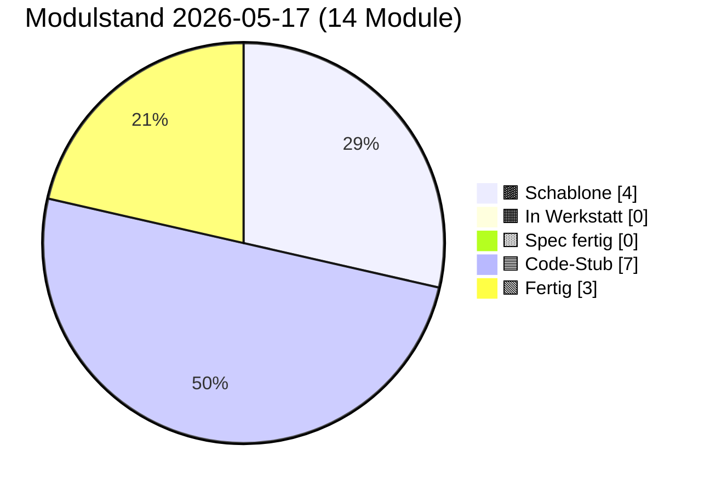

# PULS — lebender Status

**Format:** Jede Sitzung trägt unten einen Eintrag ein (neueste oben).
**Pflichtfelder pro Eintrag:** Datum · Sitzungs-Rolle · was getan · was offen · nächster sinnvoller Schritt.
**Begrenzung:** Diese Datei darf 3000 Zeilen nicht überschreiten. Älteres ins
`docs/sessions/archiv/`-Verzeichnis als Übergabeprotokoll auslagern.
**Schutz-Klausel (2026-05-17):** Die 3000-Zeilen-Grenze wurde bewusst hochgesetzt
(vorher 400) — Pflege-Sitzungen werden umfangreicher dokumentiert, weil
Architekturfunde und Diagnose-Routinen Platz brauchen. **Diese Grenze NICHT
wieder herabsetzen, auch nicht zum Token-Sparen.** Wenn 3000 Zeilen nahen,
auslagern statt kürzen.

---

## Modulstand heute

<!-- Pie-Block ab hier wird automatisch aus status.json generiert.
     Nicht von Hand bearbeiten. Erzeugen mit:
     python3 scripts/update_puls_pie.py
     Aufruf-Pflicht: nach jeder status.json-Änderung. Siehe CLAUDE.md. -->


Farb-Mapping verbindlich in [INTERFACES.md §5](INTERFACES.md). Live-Bau-Puls
auf der [Sage-Page](../index.html) (Karte "Bau-Puls").

## Als nächstes ✨

Module mit Code-Stub, **Sichttest durch Klaus 2026-05-14 erledigt** —
ergab fünf reproduzierbare Cosinus-Messwerte (siehe Karte 04 Beleg-
Block), die in der Pflege-Sitzung 2026-05-14 zu `PROVIDER_MIN_MATCH`
0.55 → 0.80 geführt haben:

- 🟦 **[01 Storage](components/01_storage.md)** — geprüft 2026-05-14 (Klaus, im Browser); init/round-trip/Unknown-Store sauber, sechs Stores in DevTools sichtbar
- 🟦 **[02 Spore](components/02_spore.md)** — geprüft 2026-05-14 + 2026-05-16 (Klaus, im Browser); Identität deterministisch, Spore sortiert, Sign+Verify valide, Manipulation erkannt; **Bau 02.X Backup-Export Sichttest 2026-05-16 grün** — Knöpfe 6/7/7b alle drei Hauptpfade ohne Modul-Bug (Wrapper-Format `version:1` / `iterations:600000` / AES-GCM-256, `BackupOverwriteError`-Schutzpfad greift, force-Pfad funktioniert; siehe Karte 02 § Bauzustand-Zeile „Sichttest (Bau 02.X)"). Test-Panel-UX-Befund pendingBackup-Stash-Reset in Knopf 7 wurde in Folge-Mini-Pflege 2026-05-16 gefixt (Reset jetzt erst direkt vor `importBackup` statt am Handler-Anfang; Sichttest des Fix-Pfads ungeprüft, weil headless gebaut, wartet auf Klaus' Browser-Lauf).
- 🟦 **[03 Embedding](components/03_embedding.md)** — geprüft 2026-05-14 (Klaus, im Browser); L2-Norm 1.0, gleicher Inhalt ≈0.95, Baseline für unverwandte Begriffe ungewöhnlich hoch
- 🟦 **[04 Match](components/04_match.md)** — geprüft 2026-05-14 (Klaus, im Browser); 3/5 Tests grün, 2 zeigten Schwellen-Drift → Pflege-Sitzung 2026-05-14 hat `PROVIDER_MIN_MATCH` und Test-Schwellen kalibriert
- 🟦 **[06 Heterokaryose](components/06_heterokaryose.md)** — Code geschrieben 2026-05-15 (Bau-Sitzung 06) + **Pflege Bau 06.1 Outbox-Lese-Pfad 2026-05-15** (`sbkim_hetero_outbox` als Anker-Quelle nach Spec-Sitzung 08, fail-soft Fallback bleibt); **Sichttest 2026-05-16 rasch grob durchgeklickt** (Klaus, Chrome auf Galaxy Tab S6 + DeX): Panel 06 mit 14 Knöpfen — alle Selbstchecks grün, Hauptpfade ohne Modul-Bug; voller Test-1–9-Lauf inkl. Test 9 `HETERO_MAX_ANCHORS`-Begrenzung folgt bei Bedarf. Fünf-Funktionen-API, kanonischer Sign/Verify-Pfad als **vierter Pfad bewusst dupliziert** (Single-File-PWA-Stil), neuer Store `sbkim_hetero_inbox` (DB-Version 1→2 additiv, Bau 06), Service-Worker dritter fetch-Listener-Pfad `/sbkim/heterokaryosis`; Anker-Quelle nach Pflege Bau 06.1 = `sbkim_hetero_outbox` fail-soft mit Spore-Single-Anker-Fallback. **Test 6 in Panel 07 muss in einem Folge-Sichttest neu durchgespielt werden** (Cleanup löscht jetzt sechs Stores statt fünf).

Code-Stub frisch aus den Bau-Sitzungen 2026-05-14/15, **Sichttest ausstehend bzw. teilweise erledigt:**

- 🟦 **[05 Anastomose](components/05_anastomose.md)** — Code geschrieben 2026-05-14 (Bau-Sitzung), Sichttest geprüft 2026-05-15 (Klaus, im Browser): 6 von 7 Tests grün im ersten Lauf (Setup, Test 1 passendes Match score=0.888, Test 3 Versions-Mismatch, Test 4 Signatur-Manipulation, Test 5 Re-Handshake, Test 6 forgetSibling, Test 7 listSiblings); **Test 2 (Domain-Mismatch / Tarantino-Vektor) Test-Bug** — score=0.854 statt erwartetem <0.80 (Tarantino-Filme spielen oft in Bars → zu nah am Mixarium-Cocktail-Vektor); Modul-Logik korrekt, `PROVIDER_MIN_MATCH=0.80` greift wie spezifiziert. **Pflege-Sitzung 2026-05-15** baut Panel 05 Test 2 auf **Vektor-Trias** um (Steuerrecht und Bilanzierung / Eisenbahnsignalanlagen / Quantenfeldtheorie), Pass-Check „mindestens einer der drei rejected mit score < 0.80"; Tarantino-Vergleichswert wird parallel als reiner Cosinus protokolliert; Karte 05 § Manueller Test Punkt 2 zieht mit. Klaus' zweiter Sichttest-Lauf nach Pflege folgt; falls alle drei Trias-Kandidaten über 0.80 liegen, eigene Folge-Pflege-Sitzung „Embedding-Baseline"
- 🟦 **[07 Apoptose](components/07_apoptose.md)** — Code geschrieben 2026-05-14 (Bau-Sitzung), Sichttest geprüft 2026-05-15 (Klaus, im Browser): 7 von 8 Tests grün im ersten Lauf (Setup + Tests 1/2/3/4/5/7 + Selbstcheck); **Test 6 (Self-Apoptose) deckte echten Modul-Bug auf**: nach Cleanup `getNodeId_wirft_NoIdentityError:false` trotz `stores_alle_leer:true` — Modul 02's In-Memory-`identityCache` wurde nicht durch externes `storage.clear` invalidiert (Modul 07 wusste nichts vom Modul-02-Cache). Folgeschaden: Tests 1/2/3/8 nach Test 6 mit „Keine Identität in sbkim_keys[main]". **Pflege-Sitzung 2026-05-15** ergänzt Modul 02 um öffentliche `resetIdentityCache() → void` (sync, idempotent, leert nur Closure-Cache, kein Storage-Eingriff) und Modul 07's Cleanup ruft sie als letzten Schritt nach den `storage.clear`-Aufrufen — heilige Tafeln (INTERFACES.md §1 Modul 02 + §1 Modul 07 + §6 + Karten 02 + 07) ziehen mit. Re-Sichttest 2026-05-15 bestätigte den Cache-Fix: `getNodeId_wirft_NoIdentityError:true`. Modul 07 Sichttest 8/8 grün. **Pflege Cleanup-Reihenfolge Bau 06 (2026-05-15)** erweitert `CLEANUP_ORDER` additiv um `sbkim_hetero_inbox` (Position 4 zwischen `sbkim_legacy_inbox` und `sbkim_spore`); Test 6 muss in einem Folge-Sichttest neu durchgespielt werden (jetzt 6 statt 5 Stores zu prüfen).
- 🟦 **[00 Doku-Fenster](components/00_doku_fenster.md)** — Code geschrieben 2026-05-14 (Bau-Sitzung), Sichttest geprüft 2026-05-15 (Klaus, im Browser): 5 von 6 Tests grün im ersten Lauf (Setup, Test 2 5-Klick-Simulation, Test 3 4-Klick + Timeout, Test 5 TTL-Sweep, Selbstcheck-Hinweis); **Test 4 Test-Bug** mit Mini-Werten 81/100 (freeBytes=19 Bytes ist trivial < 50 MiB → `warningLevel:"both"` statt erwartetem `"ratio"`) → **Pflege-Sitzung 2026-05-15** repariert mit GiB-Skalierung (`usage:8.1 GiB, quota:10 GiB` → freeBytes ≈ 1.9 GiB → `warningLevel:"ratio"` sauber); Modul-Vertrag und INTERFACES.md unangetastet

Spec frisch, **Bau ausstehend**:

- 🟨 **[09 Einbau-PWA](components/09_einbau_pwa.md)** — Karte vollständig 2026-05-14 (Spec-Sitzung; Anleitung, kein JS-Modul), **Pflege-Sitzung 2026-05-15 erweitert auf neun Schritte** (Schritt 9 neu: `SbkimApoptose.init()` + `SbkimDoku.init({searchIconSelector:...})` + optionaler TTL-Sweep nach Handshake); `<script>`-Reihenfolge in Schritt 2 zieht 07 + 00 nach (`01 → 02 → 03 → 04 → 05 → 07 → 00`); Sichtkontroll-Block jetzt vier Pflicht-Punkte (sieben Selbstcheck-Zeilen + sechs IndexedDB-Stores + zwei live-Endpunkte + 5-Klick-Geste am Such-Symbol); Datei-Pfad-Konvention (SW im Endknoten-Repo-Root, sieben JS-Module inline oder unter `sbkim/`); Spore-Endpunkt `/sbkim/spore.json` verbindlich; SW-Scope-Falle dokumentiert; `domainVector`-Pflicht-Frage **entschieden Variante A (Soft-Pflicht im Andock-Workflow, kein Hauptversions-Sprung)** — Modul 02 / §0 / §2 bleiben unverändert. **Bau-Sitzung 2026-05-15 vor Schritt 1 sauber abgebrochen** (Befund-Sitzung): beide Endknoten haben aktiven `app-sw.js` im Repo-Root (Mein-Mixarium Z. 12543, Mein-Rezeptbuch Z. 10453), Karte 09 antizipiert diesen Fall nicht; zusätzlich Karte 09 § Sichtkontrolle implizit auf Desktop-DevTools gemünzt — Klaus' Tablet (Galaxy Tab S6 + DeX) braucht Eruda-Pfad. **Vor erneuter Bau-Sitzung 09** zwei Karten-Lücken in einer Pflege-Sitzung Karte 09 zu schließen (Empfehlung Option α: Patch in bestehenden `app-sw.js`; plus Eruda-Pfad für Tablet-Sichtkontrolle). Details in [Übergabeprotokoll 2026-05-15 Bau-09-blockiert](sessions/archiv/2026-05-15_bau-09-blockiert-app-sw.md).

Letzter Bau frisch (Bau-Sitzung 2026-05-15), **Sichttest geprüft 2026-05-15:**

- 🟦 **[08 UI-Demo](components/08_ui_demo.md)** — Code geschrieben 2026-05-15 (Bau-Sitzung 08). Endknoten-Andocker-UI für die zwei Stellen, die Modul 06 (Heterokaryose) braucht, aber nicht selbst füllt: `sbkim_hetero_outbox` (Anker-Vorrat) und `sbkim_siblings[peerNodeId].heterokaryosisOptIn` (additives Opt-In-Flag pro Geschwister). Fünf-Funktionen-API (`init/listOutbox/addOutboxAnchor/removeOutboxAnchor/setSiblingHeteroOptIn`), sechs benannte Error-Klassen im Factory-Stil analog Modul 00, drei Test-Brücken (`_clearOutbox`, `_addPseudoSibling` ohne Opt-In-Flag, `_clearPseudoSiblings`), synchroner Selbstcheck. **Storage-only** (kein Netz, kein Embedding, keine Signatur — Vektor-Erzeugung ist Aufrufer-Pflicht). `addOutboxAnchor`-Check-Reihenfolge: (1) Label sync, (2) Vektor sync, (3) async-Voll-Check (`OutboxFullError` nur bei NEUEM Label); Überschreiben eines bekannten Labels bleibt erlaubt. `setSiblingHeteroOptIn` strikt boolean (`1`, `"true"` werfen `InvalidOptInArgError`); Co-Schreiber-Disziplin via `Object.assign`. Panel 08 in `tests/manual_check.html` mit acht Knöpfen (Setup + sechs Test-Punkte + Selbstcheck-Hinweis); Panel-Status von Werkstatt-Stub `idle` auf `ok "Code-Stub"`. **Self-Apoptose-Knopf bewusst NICHT in Panel 08** (Spec-Sitzung 08-Entscheidung respektiert). `node --check src/modules/08_ui_demo.js` grün, alle 10 Inline-`<script>`-Blöcke validiert. **Sichttest geprüft 2026-05-15 (Klaus, im Browser): 6/6 Test-Punkte grün** (Pflege-Sitzung Sichttest-Resultate 2026-05-15).

Empfehlung Hauptsitzung: **Klaus' Re-Andock beider Endknoten mit
PWA-Suffix**. Die Pflege-Sitzung 2026-05-16 „Karten 01 + 09 PWA-
Suffix" hat die Architektur-Erweiterung abgeschlossen (Modul 01 hat
jetzt `init({dbSuffix})`, Karten 01 + 09 und INTERFACES.md §1 Modul 01
sind nachgezogen, `PROTOCOL_VERSION` bleibt `"0.1"`, Modul 02 unangetastet).
Nächster Schritt liegt **in Klaus' Endknoten-Repos**:

1. In **beiden** Endknoten-Repos (`Mein-Mixarium`, `Mein-Rezeptbuch`)
   muss `sbkim/sbkim-init.js` erweitert werden: vor dem bestehenden
   `await SbkimAnastomose.init()` einen Aufruf
   `await SbkimStorage.init({ dbSuffix: "mixarium" })` (bzw.
   `"rezeptbuch"`) hinzufügen.
2. In beiden Tab-Sessions `__sbkimErzeugeSpore()` erneut triggern
   (Klaus in der jeweiligen Eruda-Konsole) → neue, getrennte nodeIds
   pro PWA.
3. Neue `spore.json` jeweils nach `~/<Endknoten>/sbkim/spore.json`
   verschieben + Commit + Push (überschreibt die alte Pages-Spore).
4. Erst nach Re-Andock kann eine Folge-Sitzung `status.json`
   `pingStatus` von `"blocked-origin-collision"` auf `"live"`
   wechseln (sobald Klaus den ersten Cross-Knoten-Handshake gefahren
   hat) und die `nodeId`-Werte in der Endknoten-Tabelle aktualisieren.

Andere offene Punkte (Mini-Pflege „Sushi-Kategorie sichtbar machen"
in Mein-Mixarium, INTERFACES.md §6 Tabellen-Bug) sind unverändert
offen. Details im [Übergabeprotokoll 2026-05-16 Pflege PWA-Suffix](sessions/archiv/2026-05-16_pflege-pwa-suffix-karten-01-09.md),
zur Andock-Hintergrund [Übergabeprotokoll 2026-05-16 Andock
Mein-Rezeptbuch](sessions/archiv/2026-05-16_andock-mein-rezeptbuch-iteration-3-live.md)
und der zugehörigen [Mixarium-Andock-Übergabe](sessions/archiv/2026-05-16_andock-mein-mixarium-iteration-3-live.md).

---

## Schnellüberblick

| Modul | Spec | Code | Manueller Sichttest | Anmerkung |
|---|---|---|---|---|
| 00 doku_fenster | Spec fertig (2026-05-14) | Code-Stub (2026-05-14, Pflege Persistenz-Strategie verbinden 2026-05-16) | geprüft 2026-05-15 (Klaus) — 5/6 Tests grün im ersten Lauf, Test 4 Test-Bug in Pflege-Sitzung 2026-05-15 mit GiB-Skalierung repariert; **Pflege Persistenz-Strategie verbinden Sichttest 2026-05-16 grün** (Klaus, im Browser) — Drei-Setup-Probe aus § Manueller Test Punkt 7 alle drei Pfade ohne Auffälligkeit: Persist-Trigger-Stub, Quota-Trigger, Negativ-Fall | Sechs-Funktionen-API (`init/open/close/isOpen/getStatusSnapshot/recordSighttest`), reines Lese-/Trigger-Modul, alleiniger Schreiber `sbkim_doku_meta`, 5-Klick-Geste mit 3s-Zeitfenster, Modal mit Backdrop und MutationObserver-Mount, Quota-Doppel-Schwelle (80% / 50 MiB), Self-Apoptose bewusst NICHT in 00. **Pflege Persistenz-Strategie verbinden 2026-05-16** (additiv, kein Refactoring): `getStatusSnapshot()` um Feld `storagePersisted: boolean \| null` erweitert (Spiegelung Modul-01-Getter fail-soft); Modal zeigt zusätzliche „Backup empfohlen"-Tipp-Zeile (`DOKU_BACKUP_TIP_TEXT` modul-lokal), wenn `storagePersisted === false` ODER `quota.warningLevel !== "none"`. Hinweis-only, kein Direkt-Aufruf von `SbkimSpore.exportBackup` aus Modul 00 (Aufrufer-Pflicht-Trennung). |
| 01 storage | Spec fertig (2026-05-14) | Code-Stub (2026-05-14, Pflege PWA-Suffix + Pflege Storage-Persist 2026-05-16) | geprüft 2026-05-14 + 2026-05-16 (Klaus) — fünfter Knopf „Persist-Status zeigen" liefert `_meta.storagePersisted: true` (Chrome auto-bei-PWA) | IndexedDB-Wrapper |
| 02 spore | Spec fertig (2026-05-14, Pflege Stamm/Gast-Felder 2026-05-15, Pflege Spec Backup-Export Stufe 2 2026-05-16) | Code-Stub (2026-05-14, Pflege Cache-Invalidate 2026-05-15, Pflege Stamm/Gast-Durchreichung 2026-05-15, Bau 02.X Backup-Export 2026-05-16) | geprüft 2026-05-14 (Klaus) + 2026-05-15 (Cache-Invalidate-Pflege via Sichttest 07) + 2026-05-16 (Klaus, Bau 02.X Backup-Export Knöpfe 6/7/7b alle drei grün; Test-Panel-UX-Befund Knopf 7 pendingBackup-Stash-Reset offen als Mini-Pflege) | Ed25519-Identität, Singleton, base64url-sha256-rawpub; +`resetIdentityCache()` aus Pflege-Sitzung 2026-05-15 (Pflicht-Hook für Apoptose-Cleanup). **Spore-JSON Optionale Felder additiv erweitert** 2026-05-15 (Spec-Sitzung Stamm/Gast): `stammCategories: string[]` + `guestCategories: string[]`, signaturpflichtig wenn vorhanden, Disjunktheit als Hosting-Pflicht (kein Verify-Abbruch). Sign-/Verify-Pfad unverändert. **`generateOwnSpore` Code-Allow-List nachgezogen** 2026-05-15 (Bau 02 Stamm/Gast): zwei Zeilen analog zu `domainKeywords` — ohne diese Pflege würden Stamm/Gast-Felder beim Andock still ignoriert. **Spec Backup-Export Stufe 2 2026-05-16** (Identitäts-Persistenz Stufe 2): zwei neue Funktionen `exportBackup(password) → Promise<SbkimBackupBlob>` + `importBackup(blob, password, options?)` (PBKDF2-SHA256 600 000 + AES-GCM-256, Klartext-Payload = Identität + Geschwister, defensiv per Default — `BackupOverwriteError`); drei §0-Konstanten verankert (`BACKUP_FORMAT_VERSION=1` / `BACKUP_KDF_ITERATIONS=600000` / `BACKUP_PASSWORD_MIN_LEN=8`); fünf neue Error-Klassen (`InvalidBackupPasswordError` / `BackupDecryptError` / `BackupVersionMismatchError` / `BackupSchemaError` / `BackupOverwriteError`). KEIN Spore-Feld dazu (Backup-Schicht separat, `PROTOCOL_VERSION` bleibt `"0.1"`). **Bau-Sitzung 02.X ausstehend**, KEIN Code in `src/modules/02_spore.js`. |
| 03 embedding | Spec fertig (2026-05-14) | Code-Stub (2026-05-14) | geprüft 2026-05-14 (Klaus) | semantischer Vektor |
| 04 match | Spec fertig (2026-05-14, Pflege Stamm/Gast-Hinweis 2026-05-15) | Code-Stub (2026-05-14) | geprüft 2026-05-14 (Klaus) | Vektorvergleich, modus-frei; Pflege-Sitzung 2026-05-14 PROVIDER_MIN_MATCH 0.55→0.80. **Karte 04 § Stamm/Gast-Hinweis 2026-05-15** (Spec-Sitzung Stamm/Gast): Match bleibt unverändert; Stamm/Gast ist Klassifikations-Schicht auf Daten-Ebene, kein Vektor-Math; explizit kein Dämpfungsfaktor, keine zweite Schwelle. |
| 05 anastomose | Spec fertig (2026-05-14, Spec BroadcastChannel-Bridge 2026-05-17) | Code-Stub (2026-05-14, Bau BroadcastChannel-Bridge 2026-05-17) | geprüft 2026-05-15 (Klaus) — 6/7 Tests grün im ersten Lauf, Test 2 Test-Bug (Tarantino-Vektor zu nah an Cocktails 0.854) in Pflege-Sitzung 2026-05-15 als Vektor-Trias repariert (3 Kandidaten parallel, Pass = ≥ 1 unter 0.80); Klaus' zweiter Lauf nach Pflege folgt; **Bau BroadcastChannel-Bridge Sichttest 2026-05-17 grün** (Klaus, Browser im Termux-`python3 -m http.server 8000`-Setup auf Galaxy Tab S6 + DeX) — Knöpfe 9 / 9a / 9b / 9c alle vier ohne Modul-Befund (Test 9 established score 0.8881; Test 9a HandshakeTimeoutError nach 4005 ms; Test 9b MissingToNodeIdError synchron; Test 9c Auto-Fallback HTTP-404→Channel etabliert score 0.8881) | Handshake; Fünf-Funktionen-API, bidirektional, kanonisch signiert, Schwelle aus Modul 04; SW Variante A (Page-Hosted) + same-origin Fallback-Transport via `BroadcastChannel('sbkim')` aus Bau-Sitzung 2026-05-17 (additiv, `options.transport ∈ {"auto","http","channel"}` mit Default `"auto"` und einmaligem Auto-Fallback bei klaren HTTP-Defekt-Signalen) |
| 06 heterokaryose | Spec fertig (2026-05-15) | Code-Stub (2026-05-15, Pflege Bau 06.1 Outbox-Lese-Pfad 2026-05-15) | rasch grob durchgeklickt 2026-05-16 (Klaus, Tab S6 + DeX) — Panel 06 14 Knöpfe Selbstchecks + Hauptpfade grün; voller Test-1–9-Lauf folgt bei Bedarf | Datenaustausch unter Geschwistern; Fünf-Funktionen-API (`init/requestHeterokaryosis/receiveHeterokaryosis/listHeterokaryosis/forgetHeterokaryosis`), Pull-Pattern, Opt-In beidseits (additiv auf `sbkim_siblings`), kanonisch wie 05/07 (vierter Sign-Pfad bewusst dupliziert), neuer Store `sbkim_hetero_inbox` (Komposit-Schlüssel `peerNodeId\|ts`, DB-Version 1→2 additiv), SW Variante A mit drittem fetch-Listener `/sbkim/heterokaryosis` (Message-Typ `SBKIM_HETEROKARYOSIS_REQUEST`); Modul 07 Cleanup-Reihenfolge nachgezogen (`sbkim_hetero_inbox` zwischen `sbkim_legacy_inbox` und `sbkim_spore`). **Anker-Quelle nach Pflege Bau 06.1 (2026-05-15): voller Outbox-Lese-Pfad implementiert** — `sbkim_hetero_outbox` (Spec-Sitzung 08, v=3-Store) wird fail-soft gelesen, max. `HETERO_MAX_ANCHORS=5` Anker absteigend nach `addedAt`; Fallback auf Spore-Single-Anker bei leerer/fehlender Outbox bestehen geblieben. `src/modules/01_storage.js` `DB_VERSION` 2 → 3 (additive Migration v=3, `STORES_V3=["sbkim_hetero_outbox"]`); Panel 06 mit 14 Knöpfen; Test 9 (`HETERO_MAX_ANCHORS`-Begrenzung) voll abgedeckt (sechs Outbox-Einträge → Response liefert genau fünf, neueste zuerst). Sichttest ausstehend (headless gebaut, wartet auf Klaus' Browser) |
| 07 apoptose | Spec fertig (2026-05-14) | Code-Stub (2026-05-14, Pflege Cache-Invalidate 2026-05-15) | geprüft 2026-05-15 (Klaus) — **8/8 Tests grün** nach Pflege 02+07-Cache-Invalidate (Re-Sichttest 2026-05-15 bestätigte `getNodeId_wirft_NoIdentityError:true`); Test 6 (Self-Apoptose) hatte einen Modul-02-Cache-Bug aufgedeckt, der in Pflege 2026-05-15 mit `resetIdentityCache()` als Cleanup-Schritt 6 behoben wurde. | Selbstlöschung mit signiertem Vermächtnis; zweistufige Self-Apoptose (Token 60 s), Vermächtnis-Inbox, TTL-Vergessen explizit durch Andocker; kanonischer Sign/Verify-Pfad aus 02/05 dritter Pfad dupliziert; SW erweitert um `/sbkim/legacy` (gemeinsamer fetch-Listener mit `/sbkim/anastomosis`); Panel 07 mit zehn Knöpfen; Cleanup-Schritt 6 ruft `SbkimSpore.resetIdentityCache()` nach Pflege-Sitzung 2026-05-15 |
| 08 ui_demo | Spec fertig (2026-05-15) | Code-Stub (2026-05-15) | geprüft 2026-05-15 (Klaus) — 6/6 Test-Punkte grün | Endknoten-Pflege-UI für `sbkim_hetero_outbox` und `sbkim_siblings.heterokaryosisOptIn`; Fünf-Funktionen-API (`init/listOutbox/addOutboxAnchor/removeOutboxAnchor/setSiblingHeteroOptIn`), sechs benannte Error-Klassen im Factory-Stil analog Modul 00 (`UiDemoDependenciesError` / `InvalidAnchorLabelError` / `InvalidAnchorVectorError` / `OutboxFullError` / `UnknownSiblingError` / `InvalidOptInArgError`), drei Test-Brücken (`_clearOutbox`, `_addPseudoSibling` ohne Opt-In-Flag, `_clearPseudoSiblings`). Modul 08 alleiniger Schreiber von `sbkim_hetero_outbox` (v=3-Store aus Pflege Bau 06.1, Schlüssel `label`, max. `HETERO_OUTBOX_MAX_ENTRIES`=5, absteigend nach `addedAt`, Überschreiben statt Verdrängen) und Co-Schreiber für `sbkim_siblings.heterokaryosisOptIn` (Modul 05 unangetastet, Karte-01-Vertragserweiterung). **Storage-only** (kein Netz, kein Embedding, keine Signatur — Vektor-Erzeugung ist Aufrufer-Pflicht). `addOutboxAnchor`-Check-Reihenfolge: (1) Label sync, (2) Vektor sync, (3) async-Voll-Check (`OutboxFullError` nur bei NEUEM Label); Überschreiben eines bekannten Labels bleibt erlaubt. `setSiblingHeteroOptIn` strikt boolean (`1`, `"true"` werfen `InvalidOptInArgError`); Co-Schreiber-Disziplin via `Object.assign({}, sibling, {heterokaryosisOptIn})`. Self-Apoptose-Knopf bewusst NICHT in Panel 08 (Spec-Sitzung 08-Entscheidung respektiert). Panel 08 in `tests/manual_check.html` mit acht Knöpfen (Setup + sechs Test-Punkte + Selbstcheck-Hinweis); Panel-Status von Werkstatt-Stub `idle` auf `ok "Code-Stub"`. **Sichttest geprüft 2026-05-15 (Klaus): 6/6 Test-Punkte grün im ersten Lauf** (Pflege-Sitzung Sichttest-Resultate 2026-05-15). |
| 09 einbau_pwa | Spec fertig (2026-05-14, Pflege Schritt 9 + 07/00 2026-05-15, Pflege App-SW-Koexistenz 2026-05-15) | — (Anleitung, kein JS-Modul) | — | Andock-Anleitung — **9 Schritte** (Schritt 9 neu aus Pflege-Sitzung 2026-05-15: SbkimApoptose.init + SbkimDoku.init + optionaler TTL-Sweep nach Handshake); `<script>`-Reihenfolge 01→02→03→04→05→07→00; Soft-Pflicht `domainVector` im Andock-Workflow (kein Hauptversions-Sprung); SW im Endknoten-Repo-Root, `/sbkim/spore.json` als Spore-Endpunkt — plus Pflege App-SW-Koexistenz (2026-05-15): Schritt 3 a/b-Verzweigung (Pre-Flight-Check → 3a `register('sbkim-sw.js')` für PWA ohne eigenen SW, 3b `importScripts('./sbkim-sw.js')` im bestehenden App-SW für PWA mit eigenem SW), achtes Risiko „App-SW-Überschreibung", `sbkim-sw.js` `SBKIM_SW_STANDALONE`-Flag rückwärtskompatibel (Default `true`, `false` für Variante 3b) |
| 10 reputation | Stub (Schutz-Backlog) | — | — | Knoten-Reputation, Priorität niedrig |
| 11 rate_limit | Stub (Schutz-Backlog) | — | — | Rate-Limit & TTL, Priorität niedrig |
| 12 blocklist | Stub (Schutz-Backlog) | — | — | manuelle Sperrliste, Priorität niedrig |
| 14 diffusion | Stub (Diffusion-Backlog) | — | — | konsensuell-empfehlende Spore-Diffusion via Handshake-Erweiterung (Pfad 2 verbindlich, Pfad 1 = Default-Status-quo, Pfad 3 verworfen wegen Empfangsmodus-Prinzip); Spec ausstehend bis Netz ≥ 10 Geschwister oder erfolgreicher Live-Andock + Wachstums-Bedürfnis; Priorität niedrig — **plus Sage-Page-Sichtbarmachung 2026-05-15** (Karten 4/13/14 ziehen `diffusionBacklog[]` parallel zu `schutzBacklog[]`) |

Statuscodes: `—` (nichts) · `Schablone` · `Stub` · `Entwurf` · `Review` · `stabil` · `eingebaut`

## Endknoten (externe Repos des Betreibers)

| App | URL | Domäne | SBKIM-Stand |
|---|---|---|---|
| Rezeptbuch | https://lausiklauskn-png.github.io/Mein-Rezeptbuch/ | Kochrezepte (Stamm 7) — Drinks + Snacks als Überraschungs-Plus (Gast 11) | **integriert 2026-05-16, eigene Identität live 2026-05-16, Re-Andock 2026-05-17** (DeX-Chrome-IndexedDB-Verlust nach PR #75-Pflege, siehe § Offene Querschnitts-Fragen „DeX vs. Tablet-Chrome") · **aktuelle `nodeId: BSWxXmXvxF8FUR_MOx97a3l4gj1Q-JpcAJyp4BBRHyY`** (frischer Ed25519-Schlüssel 2026-05-17 in eigener IndexedDB `sbkim_rezeptbuch` der DeX-Chrome-Instanz; alte Tablet-Chrome-Identität `RHhposP0…` archiviert in PULS-Historie) · Spore live unter `https://lausiklauskn-png.github.io/Mein-Rezeptbuch/sbkim/spore.json` (Commit `3bcc453`) mit `domainVector[384]` · App-SW Variante 3b · Modul-05-v2 mit BroadcastChannel-Bridge eingebaut (`sbkim/05_anastomose-v2.js`, Commit `a1b9ded`). **Cross-Knoten-Handshake 2026-05-17 via Channel-Pfad etabliert** (`outcome:"established"`, score 0.9544 bidirektional, kein localStorage-Bypass mehr nötig — siehe Sitzungs-Eintrag „Live-Channel-Handshake"). `pingStatus: "live-channel"`. |
| Mixarium | https://lausiklauskn-png.github.io/Mein-Mixarium/ | Cocktails / Drinks (Stamm 8) — Knabbereien / Fingerfood (Gast 2) | **integriert 2026-05-16, eigene Identität live 2026-05-16, Re-Andock 2026-05-17** (DeX-Chrome-IndexedDB-Verlust nach PR #75-Pflege) · **aktuelle `nodeId: JOlHK31XEiylHOlOfe6E0_Vade6VcM0Q6Z_ADuxxdDY`** (frischer Ed25519-Schlüssel 2026-05-17 in eigener IndexedDB `sbkim_mixarium` der DeX-Chrome-Instanz; alte Tablet-Chrome-Identität `7xf0tt33_…` archiviert) · Spore live unter https://lausiklauskn-png.github.io/Mein-Mixarium/sbkim/spore.json (Commit `e9d0a45`) mit `domainVector[384]` · App-SW Variante 3b (`importScripts('./sbkim-sw.js')` im bestehenden `app-sw.js`) · Modul-05-v2 mit BroadcastChannel-Bridge eingebaut (`sbkim/05_anastomose-v2.js`, Commit `9d2f127`). **Cross-Knoten-Handshake 2026-05-17 via Channel-Pfad etabliert** (`outcome:"established"`, score 0.9544 bidirektional Mixarium → Rezeptbuch). `pingStatus: "live-channel"`. |

## Offene Querschnitts-Fragen

- **DeX-Chrome vs. Tablet-Chrome — zwei getrennte Browser-Instanzen**
  (eingetragen 2026-05-17, Mini-Pflege „Live-Channel-Handshake"). Auf
  Klaus' Galaxy Tab S6 mit Samsung DeX laufen Chrome am externen
  Monitor und Chrome am Tablet-Display als **faktisch zwei getrennte
  Browser-Instanzen** — eigene IndexedDB, eigene Service-Worker, eigene
  PWA-Liste. Eine in DeX angedockte Spore-Identität ist im Tablet-Modus
  nicht da; eine im Tablet installierte PWA bleibt nach DeX-
  Deinstallation weiter da. **Konsequenz für BroadcastChannel:** Channel-
  Bridge funktioniert nur, wenn beide Tabs in **derselben** Instanz
  laufen. Klaus' Endknoten-IndexedDB war am 2026-05-17 verloren
  (Ursache nicht abschließend geklärt — vermutlich Chrome-Update,
  versehentliches „Site-Daten löschen", oder Storage-Quota), beide
  Endknoten wurden in DeX-Chrome neu angedockt mit neuen nodeIds
  (`BSWxXm…` Rezeptbuch + `JOlHK3…` Mixarium). **Generalisierung:**
  dasselbe Phänomen tritt auf bei Chrome-Profil-Wechsel, Inkognito-
  Modus, Standalone-PWA vs. Tab-Modus. Tech-Note für Andocker /
  Programmierer in [`docs/OBSERVATORIUM_BROWSER.md`](OBSERVATORIUM_BROWSER.md)
  § Lehre 1. **Status:** dokumentiert, kein Code-Eingriff nötig —
  Workaround ist Single-Instance-Disziplin oder Backup-Import.

- **SW-Bridge-Phantom-Cache-Bug in Modul 05** (eingetragen 2026-05-16,
  Live-Andock-Sitzung Cross-Knoten-Handshake; **2026-05-17 vollständig
  aufgelöst — Status: Architektur-Grenze sauber benannt, Code-Eingriffe
  abgeschlossen, Endknoten-Pflege erledigt, Live-Cross-Knoten-Handshake
  via BroadcastChannel-Pfad bewiesen**). Beim
  Cross-Knoten-Handshake via `SbkimAnastomose.handshake(peerSpore,
  ownVec)` schickt Modul 05 einen POST an `peer.endpoint +
  "/sbkim/anastomosis"`. Der Phantom-Effekt — `outcome:"rejected",
  reason:"toNodeId stimmt nicht zum Empfänger"` trotz korrekter
  Identität im aktiven Tab — hatte **zwei Wurzeln**:
  1. **`clients.matchAll({includeUncontrolled:true})`** lieferte
     Pages, die der SW nicht kontrolliert (Phantom-Cache aus
     anderen Pfaden derselben Origin). → **gefixt in PR #70
     (2026-05-17 morgens, `bd895d3`)**: `includeUncontrolled:false`
     + Loop-Logik „alle controlled Clients der Reihe nach".
  2. **`isPathSuffix` scope-unbewusst** — fing JEDEN Pfad ab, der
     auf `/sbkim/<endpoint>` endet, also auch Cross-Scope-Pfade,
     wo ein Mein-Rezeptbuch-Tab `fetch('/Mein-Mixarium/sbkim/
     anastomosis')` macht und Mein-Rezeptbuchs SW (als Controller
     des Senders) abfängt statt durchzulassen. → **gefixt in
     Pflege 2026-05-17 (dieser Eintrag, Branch
     `claude/fix-sw-scope-paths-I70qE`)**: `isOwnEndpoint(...)`
     leitet erwarteten Pfad aus `self.registration.scope` ab,
     strikte Gleichheit; Cross-Scope-Fetches fallen durch
     (→ Network → 404).
  **Spec-Klarheit (Architektur-Grenze, kein Bug):** same-origin
  cross-PWA Handshake via SW-Bridge bleibt damit **konzeptuell
  unmöglich** — Subresource-Fetches gehen durch den SW des Senders,
  nicht des Empfängers. Für Klaus' heutiges Test-Setup (beide PWAs
  auf `lausiklauskn-png.github.io`) braucht es eine andere
  Architektur. **Empfehlung für Folge-Spec-Sitzung Modul 05:**
  BroadcastChannel-Bridge als Fallback-Pfad — Sender postet Request
  auf `BroadcastChannel('sbkim')`, Receiver lauscht. Brief-Skelett
  im Übergabeprotokoll [2026-05-17 Pflege Scope-Fix](sessions/archiv/2026-05-17_pflege-sw-isPathSuffix-scope-fix.md)
  § 7. **Erledigt (Klaus-Sichttest 2026-05-17 nachmittags):**
  Endknoten-Pflege mit File-Rename in beiden Repos (Mein-Rezeptbuch
  `cbc2531` → `sbkim-sw-v2.js`, Mein-Mixarium `9b32dc7` →
  `sbkim-sw-v24.js` + SW_VERSION-Bump); Distinguishing-Test im
  Mein-Rezeptbuch-Tab lieferte **POST → HTTP 405** und **GET → HTTP
  404** direkt von GitHub Pages (nginx-Antworten, kein Bridge-JSON
  mehr). Architektur-Grenze von beiden Seiten bestätigt.
  **Vollständig erledigt 2026-05-17 abends (Mini-Pflege „Live-Channel-
  Handshake"):** Klaus hat in DeX-Chrome beide Endknoten neu angedockt
  und neue spore.json gepusht (Mein-Rezeptbuch `3bcc453` nodeId
  `BSWxXm…`, Mein-Mixarium `e9d0a45` nodeId `JOlHK3…`). Erster regulärer
  `SbkimAnastomose.handshake(peerSpore, ownVec)`-Aufruf zwischen den
  beiden Endknoten via Eruda — **`outcome:"established"`, score 0.9544
  in beide Richtungen, `sbkim_siblings` bidirektional gefüllt, kein
  localStorage-Bypass mehr nötig.** HTTP-Pfad scheitert weiterhin mit
  405/404 von Pages, Auto-Fallback in `handshake()` greift,
  Channel-Bridge routet zwischen den beiden DeX-Chrome-Tabs derselben
  Origin. Pflege-Kette PR #65 → #70 → #71 → #72 → #73 → #74 → #75 →
  #76 → diese Mini-Pflege vollständig geschlossen.

- **`domainKeywords`-Hartkodierung in Endknoten-`sbkim-init.js`**
  (eingetragen 2026-05-16). Klaus' Mein-Mixarium-`sbkim-init.js` hat
  `domainKeywords = ["Cocktail", "Drink", "Mocktail", "Limonade",
  "Smoothie", "Aperitif", "Sake"]` hartkodiert — die echten App-
  Kategorien sind aber `stammCategories = ["Cocktails", "Mocktails",
  "Alkfr. Cocktails", "Smoothies & Shakes", "Limonaden", "Tees &
  Kaffees", "Bowlen", "Sirup & Basis"]`. „Aperitif" und „Sake" sind
  in den `domainKeywords` aber nicht als App-Ordner präsent. Klaus'
  Beobachtung (Live-Andock-Sitzung) deckt eine Inkonsistenz auf:
  `domainKeywords` sollte aus den echten App-Kategorien abgeleitet
  werden, nicht aus einer alten Zwischen-Sitzung hartkodiert. Folge-
  Pflege Mein-Mixarium-/Mein-Rezeptbuch-`sbkim-init.js`: `domainKeywords`
  aus `stammCategories`/`guestCategories` zur Init-Zeit generieren
  (z.B. via App-DB-Lookup oder mindestens als konsistente Liste).
  **Konsequenz heute:** der semantische Embedding-Vektor ist robust
  genug, dass der Cross-Knoten-Handshake trotz Inkonsistenz mit
  `outcome:"established"` läuft — aber für saubere Match-Scores in
  einem wachsenden Netz wäre die Bereinigung wertvoll. Status:
  Folge-Pflege ausstehend, niedrig priorisiert.

- **Endknoten-Repo-Hygiene gegen parallele Auto-PRs** (eingetragen
  2026-05-16). Während der Live-Andock-Sitzung lief eine PARALLELE
  Claude-Sitzung mit Branch `claude/add-recipe-remove-scramble-5xx9Y`
  und hat PR #238 „Buchstabensalat-Fix im Rezept-hinzufügen-Button"
  in Mein-Rezeptbuch gemerged. Dieser PR hatte aber eine ältere
  Basis-Version der `index.html` genommen und dabei **alle 8 SBKIM-
  `<script>`-Tags + Eruda** still entfernt. Das hat den Handshake-
  Test in Mein-Rezeptbuch ~1 h lang blockiert (SBKIM-Module gar nicht
  geladen). Nachgepflegt durch Wieder-Einfügen vor `</body>` an Zeile
  14802. **Schutz-Vorschlag (Folge-Pflege):** SBKIM-Sentinel-File in
  jedem Endknoten-Repo (z.B. `sbkim/.sentinel`) und/oder GitHub-Action
  in beiden Endknoten-Repos, die prüft: (a) `grep -c "sbkim/" index.html
  >= 8`, (b) `sbkim/sbkim-init.js` enthält `SbkimStorage.init` UND
  `SbkimAnastomose.init`, (c) `sbkim/01_storage.js` enthält `dbSuffix`.
  Soll künftige Auto-PRs auf Endknoten verhindern, die die SBKIM-
  Andock-Schicht still wegfegen. Status: Folge-Pflege-Vorschlag,
  niedrig priorisiert.

- **Sichtbarkeits-Lampen in der Endknoten-PWA** (eingetragen
  2026-05-16, Klaus-Vorschlag nach Pflege PWA-Suffix). Idee von
  Klaus: zwei kleine Lampen oben rechts in der PWA, eine zeigt
  „Knoten lebt" (Identität geladen, Storage offen, Module geladen),
  die zweite blinkt kurz bei jedem Anastomose- oder Heterokaryose-
  Verkehr („gerade kommuniziert"). Soll für Endknoten-Nutzer und im
  Observatorium **sichtbar** machen, dass das Netz lebt — viel
  zugänglicher als das 5-Klick-Doku-Fenster oder Eruda. Setzt
  Modul 00 (Doku-Fenster) als Datenquelle voraus und braucht zwei
  bis drei CustomEvents in Modul 05/06 (`sbkim:handshake-start`/
  `sbkim:handshake-end`/`sbkim:hetero-pull-start`/…). **Status:**
  Spec ausstehend; eigene kleine Karte (vermutlich Karte 15 oder
  ein additiver Block in Karte 00). Spec-Sitzung sinnvoll, **nach**
  dem ersten erfolgreichen Cross-Knoten-Handshake — dann ist klar,
  was die zweite Lampe tatsächlich anzeigen soll. Geschätzt ~60 Min
  headless für Spec, ähnlich für Bau-Stub.

- **Andock-Bundle (`sbkim-bundle.js`)** als künftiger Ein-Datei-
  Andock-Pfad (eingetragen 2026-05-16, Klaus-Vorschlag nach
  Pflege PWA-Suffix). Heutiger Karte-09-Pfad (9 Schritte mit awk,
  Termux, Eruda, Spore-mv) ist Pionier-Tanz — funktioniert für
  Klaus, aber kein Nicht-Programmierer würde das nachmachen. Vision:
  Endknoten-Betreiber kopiert **eine** Datei (`sbkim-bundle.js`) +
  fügt **einen** `<script>`-Tag ein. Das Bundle erzeugt beim ersten
  Laden Identität, Domain-Vektor, Spore, klinkt sich beim Service-
  Worker ein und macht den Status sichtbar (s. Lampen oben). **Setzt
  voraus:** drei oder mehr Endknoten im Netz, damit der Aufwand
  spürbar wird (heute mit zwei reicht der Direkt-Pfad mit Klaus).
  **Status:** Spec ausstehend; eigene Karte (vermutlich Karte 16 oder
  09.2). Ist eine echte Architektur-Frage (Bundling-Strategie,
  Versions-Update-Pfad, wie liefert der Bundle die Andock-Konfig),
  keine reine Pflege.

- ~~**Identitäts-Persistenz**~~ — **final gelöst 2026-05-16 durch
  drei aufeinander folgende Sitzungen am selben Tag** (Pflege
  Storage-Persist, Spec+Bau Backup-Export, Pflege Persistenz-
  Strategie verbinden). Klaus' Befürchtung: tiefes Browserspeicher-
  Löschen tötet die nodeId. Drei Stufen, die zusammen die echte
  „Spur stirbt nicht"-Architektur ergeben — alle drei jetzt geschlossen:
  (1) ~~**`navigator.storage.persist()`** beim `Storage.init` — bittet
  den Browser, IndexedDB von normalem Aufräumen auszunehmen.
  Modul-01-Folge-Pflege, headless möglich, ~30 Min.~~ — **gelöst
  2026-05-16 durch Pflege-Sitzung „Storage-Persist".** Modul 01
  ruft nach erfolgreichem DB-Open `navigator.storage.persist()` an
  (fail-soft); `_meta.storagePersisted` zeigt `true`/`false`/`null`
  als Live-Zustand. Details im [Übergabeprotokoll 2026-05-16 Pflege
  Storage-Persist](sessions/archiv/2026-05-16_pflege-01-storage-persist.md).
  (2) ~~**Backup-Export passwort-verschlüsselt** in Modul 02 — Klaus
  speichert eine `*.sbkim-backup.json` woanders und kann sie bei
  Browser-Wechsel zurückimportieren. Modul-02-Folge-Spec, ~60 Min.~~
  — **gelöst 2026-05-16 durch Spec-Sitzung Backup-Export Stufe 2 + Bau
  02.X Backup-Export** (selbiger Tag): Spec verankerte `exportBackup` /
  `importBackup` + drei §0-Konstanten + fünf Error-Klassen
  (PBKDF2-SHA256 600 000 + AES-GCM-256, Backup-Inhalt = Identität +
  Geschwister Pflicht-Frage 1 Variante b, Import-Überschreibung
  defensiv Pflicht-Frage 3 Variante a). Bau 02.X zog den Code
  additiv in `src/modules/02_spore.js` nach (drei Helper-Reuse-
  Entscheidungen: bestehende kanonische Sort + base64url-Helper +
  `resetIdentityCache`-Hook werden wiederverwendet, KEIN Refactoring;
  Panel 02 in `tests/manual_check.html` um drei Knöpfe „Backup
  exportieren" / „Backup einlesen" / „Identität ersetzen —
  unwiderruflich" erweitert). Details im
  [Übergabeprotokoll 2026-05-16 Spec Backup-Export](sessions/archiv/2026-05-16_spec-02-backup-export.md)
  und [Bau 02.X Backup-Export](sessions/archiv/2026-05-16_bau-02x-backup-export.md).
  **Sichttest** durch Klaus im Browser steht aus (headless gebaut —
  Tab-S6-PBKDF2-Aufruf-Zeit, AES-GCM-Verhalten in Safari iOS).
  (3) ~~**Quota-Frühwarnung im Doku-Fenster** — schon spezifiziert
  (Modul 00, `DOKU_QUOTA_WARN_RATIO=0.80` / `…_BYTES=50 MiB`); zeigt
  Warnzeile, bevor der Browser aufräumt.~~ — **final gelöst
  2026-05-16 durch Pflege-Sitzung „Persistenz-Strategie verbinden".**
  Modul 00 zeigt jetzt zusätzlich eine deutschsprachige
  „Backup empfohlen"-Tipp-Zeile (`DOKU_BACKUP_TIP_TEXT` modul-lokal),
  wenn `SbkimStorage._meta.storagePersisted === false` ODER
  `quota.warningLevel !== "none"`. `getStatusSnapshot()` spiegelt
  `storagePersisted: boolean | null` als neues Feld (fail-soft mit
  `typeof`-Check; `null` und `true` triggern nicht, nur explizites
  `false`). Hinweis-only, kein Direkt-Aufruf von
  `SbkimSpore.exportBackup` aus Modul 00 — Aufrufer-Pflicht-Trennung
  (Modul 00 bleibt reines Lese-/Trigger-Modul). **Sichttest geprüft
  2026-05-16** (Klaus, im Browser) — Drei-Setup-Probe aus Karte 00 §
  Manueller Test Punkt 7 alle drei Pfade grün (Persist-Trigger,
  Quota-Trigger, Negativ-Fall). Details im
  [Übergabeprotokoll 2026-05-16 Pflege Persistenz-Strategie
  verbinden](sessions/archiv/2026-05-16_pflege-persistenz-strategie-verbinden.md).
  **Architektur-Anmerkung:** *Nicht* als Selbst-Heilung über
  hartcodierten Schlüssel (Sicherheits-Bruch — jeder Repo-Forker
  hätte die Identität). `getOrCreateIdentity` legt bei leerem
  Storage eine **neue** Identität an (neue nodeId); erhalten bleibt
  der alte Knoten nur über Backup-Restore. Die Tipp-Zeile macht den
  Restore-Pfad sichtbar, klickt aber den Panel-02-Knopf nicht
  automatisch.

- ~~**IndexedDB-Origin-Kollision bei GitHub-Pages-Project-Sites**~~ —
  **gelöst 2026-05-16 durch Pflege-Sitzung „Karten 01 + 09 PWA-
  Suffix".** Variante (a) aus dem ursprünglichen Eintrag (PWA-Suffix
  in Storage-DB-Name) umgesetzt: Modul 01 akzeptiert jetzt optional
  `init({ dbSuffix: "<wert>" })` und öffnet die DB unter dem Namen
  `sbkim_<dbSuffix>` statt der Default-DB `sbkim`. Pattern für
  Suffix: `^[a-z0-9_-]+$` (sonst synchroner `InvalidDbSuffixError`).
  Modul 02 unangetastet (`IDENTITY_KEY = "main"` weiterhin Singleton-
  Schlüssel innerhalb der jeweiligen DB — Trennung passiert eine
  Schicht tiefer, auf DB-Namen-Ebene). Modul 05 unangetastet
  (`SbkimAnastomose.init()` weiterhin ohne Optionen; Idempotenz von
  `Storage.init` macht den zwei-Aufruf-Pfad sauber). Karten 01 + 09
  + INTERFACES.md §1 Modul 01 + §6 nachgezogen. `PROTOCOL_VERSION`
  bleibt `"0.1"`. Klaus' Re-Andock beider Endknoten (in beiden
  `sbkim-init.js` `SbkimStorage.init({dbSuffix})` vor
  `SbkimAnastomose.init()` einfügen + `__sbkimErzeugeSpore()`
  triggern + neue Spore deployen) steht aus — danach wechselt
  `status.json` `pingStatus` von `"blocked-origin-collision"` auf
  `"live"` für beide Endknoten in einer Folge-Sitzung. Variante
  (b) (eigene Subdomain mit Custom Domain) bleibt als langfristige
  Option dokumentiert. Details im
  [Übergabeprotokoll 2026-05-16 Pflege PWA-Suffix](sessions/archiv/2026-05-16_pflege-pwa-suffix-karten-01-09.md);
  Reproduktion der ursprünglichen Kollision im
  [Übergabeprotokoll 2026-05-16 Andock Mein-Rezeptbuch](sessions/archiv/2026-05-16_andock-mein-rezeptbuch-iteration-3-live.md).
- ~~**Karten-Lücke Karte 09 / Tablet-Sichtkontrolle**~~ — **gelöst
  2026-05-15 durch Pflege-Sitzung Karte 09 „App-SW-Koexistenz +
  Tablet-Sichtkontrolle" (diese Sitzung).** Karte 09 § Sichtkontrolle
  hat jetzt einen § Tablet-Variante-Sub-Block mit Eruda-Pfad
  (in-Page-DevTools-Polyfill, gepinnt auf `eruda@3`, jsdelivr-CDN,
  touch-bedienbar). Mapping der vier Pflicht-Punkte auf Eruda-Tabs
  (Console / Resources→IndexedDB / Network / 5-Klick-Geste).
  Verbindlicher Hinweis „nach Sichtkontrolle wieder entfernen —
  kein Produktiv-Einbau, kein SBKIM-Modul, kein Datenschutz-Stein".
  Details im Übergabeprotokoll
  [2026-05-15 Pflege Karte 09 App-SW + Tablet](sessions/archiv/2026-05-15_pflege-karte-09-app-sw-tablet.md).
- ~~**Karten-Lücke Karte 09 / Andocken in PWA mit bestehendem
  Service-Worker**~~ — **gelöst in zwei Pflege-Sitzungen 2026-05-15:**
  (a) Pflege App-SW-Koexistenz (PR #31, 2026-05-15) hat Schritt 3
  in 3a/3b verzweigt mit Pre-Flight-Check
  (`navigator.serviceWorker.getRegistration('./')`),
  Variante 3b = `importScripts('./sbkim-sw.js')` in bestehendem
  App-SW (= Option α), `SBKIM_SW_STANDALONE`-Flag in
  `src/sbkim-sw.js` (Default `true`, `false` für 3b), achtes
  Risiko „App-SW-Überschreibung" in § Risiken; (b) Pflege Karte 09
  „App-SW-Koexistenz + Tablet-Sichtkontrolle" (diese Sitzung,
  2026-05-15) hat zusätzlich **Variante 3c** als nachrangige
  Übergangslösung dokumentiert (SBKIM-SW unter `/sbkim/` mit Scope-
  Einschränkung = Option β; Option γ „App-SW ersetzen" entspricht
  der heutigen falschen Anwendung von Variante 3a auf eine PWA mit
  App-SW und ist als achtes Risiko bereits dokumentiert) plus eine
  Tabelle „Wann welche Variante?" als Andock-Entscheidungshilfe.
  Details im Übergabeprotokoll
  [2026-05-15 Pflege Karte 09 App-SW + Tablet](sessions/archiv/2026-05-15_pflege-karte-09-app-sw-tablet.md).
- ~~Werden Domain-URLs der Endknoten-Apps in `docs/PULS.md` /
  `status.json` aufgenommen oder nur lokal in deren `index.html`?~~ —
  **teilweise gelöst 2026-05-15** in abgebrochener Bau-Sitzung 09:
  Pages-URLs in PULS-Tabelle „Endknoten" und `status.json`
  `endknoten[*].url` eingetragen (`integrated:false` bleibt — Andock
  nicht erfolgt). Eintrag in `docs/INTERFACES.md` weiterhin offen.
- Werden Domain-URLs der Endknoten-Apps in `docs/INTERFACES.md` aufgenommen
  oder nur lokal in deren `index.html`? → Entscheidung steht aus.
- Embedding-Modell: bleibt es bei Default `Xenova/multilingual-e5-small`?
  → ja, bis Gegenargument. Quelle: `sbkim_integration.md` §4.1.
- ~~Speicherort der Spore bei GitHub Pages: `/.well-known/sbkim/spore.json`
  oder Alias `/sbkim/spore.json`?~~ — **gelöst 2026-05-14 in Spec-Sitzung
  09:** verbindlicher Andock-Default ist `/sbkim/spore.json` (Alias aus
  §3 INTERFACES). Begründung in `docs/components/09_einbau_pwa.md`
  Schritt 7: GitHub-Pages-Project-Sites haben mit `.well-known/` die
  Jekyll-Dot-Ordner-Falle, `/sbkim/spore.json` bündelt zudem alle
  SBKIM-Pfade unter `/sbkim/` (semantisch sauber).
- **Wording-Diskrepanz**: `CLAUDE.md` führt SBKIM als
  "Semantisch-Biologisch Koordiniertes Inter-Knoten-Mycel" — das Paper
  (Kap. 1.2) führt es als "Semantisch-Empfangendes Bidirektionales
  KI-Matching". Das Observatorium (`index.html`, `status.json`) übernimmt
  die Paper-Variante. CLAUDE.md sollte in einer separaten Sitzung
  nachgezogen werden.
- ~~**A1–B3-Notations-Überlappung Sage ↔ Mixarium**~~ — **gelöst
  2026-05-14 in Spec+Bau-Sitzung Modul 04.** Die Synthese „Hops tragen
  die Funktionen" steht jetzt verbindlich in
  [`docs/components/04_match.md` § A1–B3-Synthese](components/04_match.md):
  Pfad A = Curator → Auditor → Devil's Advocate (Anbieter-Seite
  verfeinert die Antwort); Pfad B = Interviewer → Matcher → Critic
  (Anfrage-Seite verfeinert die Frage), mit Apoptose bei B4 im
  Negativ-Fall. Sage zeigt die *Geometrie* der Hop-Position, Mixarium
  zeigt die *Rolle* — beide Notationen bleiben gültig, sie beschreiben
  dieselbe Wanderung aus zwei Winkeln. Kein eigenes Mapping-Dokument
  nötig.
- ~~**Spore-Persistenz-Strategie verteilt**~~ — **final gelöst
  2026-05-16 durch die vier aufeinander folgenden Sitzungen zur
  Identitäts-Persistenz** (Pflege Storage-Persist, Spec+Bau Backup-
  Export, Pflege Persistenz-Strategie verbinden). „Stille Löschung
  ohne Vermächtnis" (Karte 07 § Risiken) war nicht in einem
  einzelnen Modul lösbar — vier Stellen mussten beim Bauen
  zusammenpassen; alle vier stehen jetzt:
  - ~~**Modul 01 Storage:** `navigator.storage.persist()` beim `init()`
    + `navigator.storage.estimate()` für Quota-Frühwarnung —
    offen.~~ — **gelöst 2026-05-16** (Pflege Storage-Persist):
    `navigator.storage.persist()` fail-soft im Init-Pfad,
    `_meta.storagePersisted` als Live-Zustand-Getter. Quota-Estimate
    liegt seit Bau 00 (2026-05-14) in Modul 00.
  - **Modul 02 Spore:** Backup-Export (passwort-verschlüsselt) als
    Recovery-Pfad für Browser-Wechsel und manuelles Löschen —
    **Spec fertig 2026-05-16** (Spec-Sitzung Backup-Export Stufe 2):
    `SbkimBackupBlob`-Format (PBKDF2-SHA256 mit `BACKUP_KDF_ITERATIONS=600000`
    + AES-GCM-256), Klartext-Payload = Identität + bekannte Geschwister
    (Pflicht-Frage 1 Variante b), Import per Default defensiv
    (`BackupOverwriteError`, Pflicht-Frage 3 Variante a), drei
    §0-Konstanten verankert. **Code-Stub fertig 2026-05-16** (Bau 02.X
    Backup-Export, selbiger Tag): additiv in `src/modules/02_spore.js`
    — fünf Error-Klassen + drei modul-lokale Konstanten + drei §0-
    Konstanten gespiegelt + neuer Closure-Helper
    `derivePbkdf2AesGcmKey` (PBKDF2 → AES-GCM-256); drei Helper-Reuse-
    Entscheidungen (`canonicalize`/`canonicalJsonBytes`, `base64urlEncode`/
    `Decode`, `resetIdentityCache`) — kein Refactoring der bestehenden
    Funktionen. Panel 02 in `tests/manual_check.html` um drei Knöpfe
    erweitert (Export / Einlesen / Identität-ersetzen-force).
    Sichttest durch Klaus im Browser steht aus.
  - **Modul 00 Doku-Fenster:** stille Frühwarnung bei < X% Speicher
    (X als gemeinsame Konstante in §0) — **gelöst 2026-05-14 durch
    Spec-Sitzung 00:** `DOKU_QUOTA_WARN_RATIO = 0.80` UND
    `DOKU_QUOTA_WARN_BYTES = 52428800` (50 MiB) verbindlich in §0
    eingetragen (Doppel-Schwelle; Warnzeile bei Überschreitung einer
    der beiden). Konsistenter Schwellwert-Anker für Modul 01 und
    Modul 02. **Plus Pflege Persistenz-Strategie verbinden 2026-05-16:**
    Modul 00 zeigt jetzt zusätzlich eine deutschsprachige
    Backup-Tipp-Zeile (`DOKU_BACKUP_TIP_TEXT` modul-lokal), wenn
    `_meta.storagePersisted === false` ODER `quota.warningLevel !==
    "none"`. `getStatusSnapshot()` spiegelt `storagePersisted` als
    neues Feld (fail-soft). Hinweis-only, kein Direkt-Aufruf von
    `SbkimSpore.exportBackup` aus Modul 00.
  - **Modul 07 Apoptose:** Risiko-Vermerk „stille Löschung" (steht
    jetzt in Karte 07 § Risiken).

  **Die vier Stellen sind jetzt konsistent:** Quota-Schwellwert (zwei
  Zahlen in §0, Modul 00 Code-Befehl), Backup-Format (`SbkimBackupBlob`
  PBKDF2/AES-GCM, Modul 02 Code + Panel 02), Warntext (`DOKU_BACKUP_
  TIP_TEXT` deutsch, Modul 00), Risiko-Vermerk (Karte 07 § Risiken).
  Sichttest durch Klaus im Browser steht für Modul 02 + Modul 00 noch
  aus (beide headless gebaut).
- ~~**Spore-Diffusion: passiv (Pfad 1) vs. konsensuell-empfehlend
  (Pfad 2) vs. parasitär-mitreisend (Pfad 3)?**~~ — **gelöst
  2026-05-15 in Hauptsitzung 14-Diffusion-Stub durch Anlage
  [`docs/components/14_diffusion.md`](components/14_diffusion.md)**.
  Frage entstand in der abgebrochenen Bau-Sitzung Modul 09 vom
  2026-05-15 (siehe parallele Pflege-Sitzung Karte 09 „App-SW-
  Koexistenz" auf eigenem Branch). Verbindliche Auswahl: **Pfad 2
  (konsensuell-empfehlend)** über `recommendedPeers: SporeRef[]` als
  optionales Handshake-Antwort-Feld (max. 2 Einträge), Empfänger
  speichert als Lead mit TTL, opt-in pro Empfehlung — drehbuchkonform,
  weil jede Übergabe im Konsens. **Pfad 1 (passiv via
  `/sbkim/spore.json`)** bleibt Default-Mechanismus parallel.
  **Pfad 3 (parasitär-mitreisend)** explizit verworfen, weil er das
  Empfangsmodus-Prinzip aus `CLAUDE.md` und `sbkim_paper.pdf`
  („Kein Crawler, keine Pulsation, keine Eigenanfragen ins offene
  Netz") bricht. Modul 14 bleibt Stub bis Netz wächst (Schwelle siehe
  Diffusion-Backlog unten); Karte 05 wird in der Stub-Sitzung
  NICHT angefasst.
- ~~**Sage-Page sichtbar machen für Modul 14**~~ — **gelöst
  2026-05-15 durch Pflege-Sitzung Sage-Page Modul 14.**
  `index.html` rendert jetzt `diffusionBacklog[]` parallel zu
  `schutzBacklog[]` in zwei datengetriebenen Karten (Karte 4
  Module-Bento, Karte 14 Bau-Puls jeweils mit parallelem Divider
  „Diffusion-Backlog · proaktiv · Priorität niedrig"), Pie zählt
  jetzt 14 Module mit 5 Schablonen. Zusätzlich bekommt Karte 13
  Eigenschutz einen zweiten parallelen `schutz-backlog`-Block
  „Diffusion-Backlog · proaktiv (Wuchs durch Empfehlung)"
  sprachlich klar abgegrenzt vom Schutz-Backlog-Block („reaktiv");
  `schutz-pilz`-Schlussspruch um die Diffusion-Zeile erweitert
  („wächst, indem er Notizen über Nachbarn weitergibt, nicht ins
  Leere pulst"). Schema-Beispiel in Karte 7 zeigt jetzt
  `diffusionBacklog: []` parallel zum `schutzBacklog: []`-Kommentar.
  `status.json` unverändert (PR #29 hatte die Daten schon geliefert).
  `update_puls_pie.py` NICHT erneut aufgerufen (keine Modul-Daten-
  Änderung). Details im Übergabeprotokoll
  [2026-05-15 Pflege Sage-Page Modul 14](sessions/archiv/2026-05-15_pflege-sage-page-modul-14.md).

## Schutz-Backlog (aus Sage-Page Karte 13, 2026-05-10)

Drei strukturelle Lücken im Schutz-Modell sind beim Aufbau des
Observatoriums sichtbar geworden. Stubs sind angelegt; gezogen werden sie
ab spürbarem Wachstum:

- `docs/components/10_reputation.md` — Knoten-Reputation
- `docs/components/11_rate_limit.md` — Rate-Limit & TTL
- `docs/components/12_blocklist.md` — manuelle Blocklist

Eigenschutz-Karte der Sage-Page macht das Backlog für jeden Besucher
sichtbar und verlinkt direkt auf die Stubs.

### Diffusion-Backlog (aus Hauptsitzung 14-Diffusion-Stub, 2026-05-15)

Schutz und Diffusion sind zwei verschiedene Backlog-Kategorien. Der
Schutz-Backlog (10/11/12) ist **reaktiv** — er wehrt Schaden ab, wenn
das Netz groß genug ist, dass Apoptose und Match-Filter allein nicht
mehr reichen. Der Diffusion-Backlog ist **proaktiv** — er beschleunigt
das Wachstum durch konsensuelle Empfehlung beim Handshake, ohne das
Empfangsmodus-Prinzip zu brechen.

- `docs/components/14_diffusion.md` — konsensuell-empfehlende Spore-
  Diffusion via Handshake-Erweiterung (`recommendedPeers: SporeRef[]`
  als optionales Feld in der `HandshakeResponse`, max. 2 Einträge,
  Empfänger speichert als Lead mit TTL, opt-in pro Empfehlung)

Pfad-Auswahl verbindlich Pfad 2 (konsensuell-empfehlend);
Pfad 1 (passiv via `/sbkim/spore.json`) bleibt Default-Mechanismus
parallel; Pfad 3 (parasitär-mitreisend) verworfen wegen
Empfangsmodus-Prinzip aus `CLAUDE.md` + `sbkim_paper.pdf`.

Modul 14 wird gezogen, sobald **Netz ≥ 10 aktive Geschwister ODER
Bau-Sitzung Modul 09 erfolgreich abgeschlossen UND spürbares
Wachstums-Bedürfnis** — parallel zur 10/11/12-Logik.

`status.json` führt Modul 14 als eigenes Feld `diffusionBacklog[]`
parallel zu `schutzBacklog[]` (proaktiv vs. reaktiv); `scoreModel.
maxScoreNote` bleibt unangetastet (Backlog zählt nicht zum maxScore).
Das Pie-Skript `scripts/update_puls_pie.py` zählt beide Backlog-
Kategorien jetzt mit.

---

## Vision-Anker (langfristig, kein Bau-Auftrag)

**Was ist das?** Visionen, die in Sitzungen aufgekommen sind und
nicht verloren gehen sollen, ohne dass sie sofort Spec oder Bau
auslösen. Sie warten auf eine Reifezeit oder einen passenden
Auslöser. Pflege-Disziplin: Vision wird hier festgehalten, mit
Datum + Sitzungs-Bezug + ungefährer Größenordnung. Wer sie ziehen
will, formuliert daraus einen Spec-Sitzungs-Brief.

### 2026-05-17 · Sage als Hybrid-Knoten (Variante I)

**Eingetragen:** Mini-Pflege „Vision-Anker" 2026-05-17 (Folge zu
Live-Channel-Handshake, PR #77 `7c08b88`). Klaus' Bild: die
Ameisenkönigin bleibt eine Ameise, auch wenn sie sich nicht vom
Fleck bewegt. Sage-Protokol kann Hub bleiben **und** zugleich ein
vollwertiger Endknoten werden — selbstreferenziell wie ein Mycel,
das seine eigene Karte ist.

**Was sich ändert (Spec-Sitzungs-Aufgabe, nicht jetzt umsetzen):**

- **CLAUDE.md** umschreiben — Satz „Es ist kein Endknoten" fällt;
  Sage wird als „Hub und Knoten zugleich" neu eingeführt.
- **INTERFACES.md § Endknoten-Liste** nimmt Sage als dritten Knoten
  auf, neben Mein-Rezeptbuch und Mein-Mixarium.
- **`status.json` § endknoten** bekommt einen `sage`-Eintrag mit
  eigener Domäne, nodeId (nach erstem Andocken), `pingStatus`.
- **Sage-Page (`index.html`)** muss alle SBKIM-Module mit voller
  `init()`-Kette laden (aktuell vermutlich nur Doku-Render). Modul
  03 Embedding (~30 MB) lädt erst beim ersten Andocken — UX-
  Vorwarnung in der Andock-Geste.
- **Sage's Domäne klären:** `domain` / `domainDescription` /
  `domainKeywords` / `domainVector`. Vorschläge im Spec-Brief:
  „Mycel-Bibliothek" / „SBKIM-Glossar" / „Sage-Observatorium".
  Stamm-/Gast-Kategorien? Brieferer Vorschlag: Stamm = Protokoll-
  Doku / Mycel-Vokabular; Gast = Glossar-Wartung / Schwesternetz-
  Beobachtungen.
- **IndexedDB-Suffix `sbkim_sage`** (analog `sbkim_rezeptbuch` /
  `sbkim_mixarium`).
- **App-SW-Variante 3a** (Standalone `sbkim-sw.js` im Sage-Page-
  Root, weil aktuell kein App-SW existiert).
- **Schwarz-Loch-Karte:** Klick könnte zukünftig nicht nur die
  Doku-md öffnen, sondern auch einen Andock-Wizard für Sage's
  Spore-Erzeugung anbieten (Hand in Hand mit Variante III unten).
- **Karte 09 § Schritt 1** wird neu eingefügt: „Sage-Observatorium
  selbst ist auch ein Endknoten — wer sich am Sage-Mycel andockt,
  bekommt es als Geschwister."

**Größenordnung:** Spec-Sitzung erster Aufgabe ~3-4 Stunden für
gründliche Klärung (kein Bau-Code, nur Verträge); danach Bau-
Sitzung ~2-3 Stunden für Sage-Page-Refactor + SW-Anlage + Andock-
Geste.

**Status:** Reif für Spec-Sitzung. Nächste Phase nach Klaus' Wahl.

### 2026-05-17 · Niedrigeres Onboarding (Variante III-Ausbau)

**Eingetragen:** Mini-Pflege „Vision-Anker" 2026-05-17. Klaus'
Kritik trifft hart und stimmt: **Karte 09's 9 Schritte schrecken
ab.** Wer SBKIM ausprobieren will, ohne Klaus-Niveau zu haben,
scheitert vermutlich an Schritt 3 (Service-Worker) oder Schritt 5
(Embedding-Setup). Verbreitung steht im Konflikt mit Andock-Hürde.

**Drei Ausbau-Pfade als langfristiger Plan:**

1. **Andock-Wizard als Standalone-PWA.** Eine eigene Page (z.B.
   `https://lausiklauskn-png.github.io/Sage-Protokol/andock/`)
   führt durch alle 9 Schritte als geführte UI, mit Pre-Flight-
   Checks und Auto-Generierung der Endknoten-Repo-Dateien.
   Klaus' Worte: „klick hier und da, dann bekommst du Spore und
   Knoten".
2. **SBKIM-PWA-Distribution mit GitHub-Identität als Geschenk-
   Paket.** Eine GitHub-Action erzeugt für einen Nutzer
   automatisch ein Endknoten-Repo (Fork eines Templates), inkl.
   konfigurierter Spore-Identität, gebrandet auf den GitHub-User-
   Namen als Identitäts-Brücke. Wer „SBKIM-Knoten werden"
   klickt, hat 30 Sekunden später eine eigene Pages-PWA live.
3. **Eigener Browser-Wrapper (Fern-Vision).** Eine Electron- /
   Tauri- / Capacitor-PWA mit SBKIM eingebacken — eigener
   „agressiverer" Browser (Klaus' Wortwahl), der die Browser-
   Eigenheiten aus § Browser-Observatorium umgeht (keine
   IndexedDB-Reklamation, kein DeX/Tablet-Split, keine SW-
   Cache-Verwirrung). Sehr ambitioniert, vermutlich nur nach
   Variante 2-Reifezeit denkbar.

   > **2026-05-18 · Konkretisierung Mini-Browser-Pfad:** Realisierbar
   > mit **Tauri** (Rust + System-WebView, ~10-30 MB Binaries für
   > Windows/macOS/Linux aus einer Codebase) — schlanker als Electron
   > (~80-200 MB) und nicht „eigener Browser von Grund auf"
   > (Chromium-Code ~30 Mio Zeilen, unrealistisch). Liefert: eigene
   > IndexedDB im App-Daten-Verzeichnis (kein Browser-Reklamations-
   > Risiko, löst Lehre 1 + Spore-Verlust 2026-05-17), Tray-Icon-Modus
   > für Hintergrund-Empfang (Antwort auf Anker 4 Königin-Frage „wer
   > empfängt, wenn der Tab zu ist"), Doppelklick-Installer (`.msi` /
   > `.dmg` / `.AppImage`). **Onboarding-Bild:** 1 Klick Installer →
   > Tray-Icon → empfangsbereit, ~2 Minuten von Link bis Knoten.
   > **Mobile bleibt außen vor** — Tauri ist Desktop-only; für
   > Android/iOS bräuchte es Capacitor (separate Initiative). **Drei
   > gleichwertige Onboarding-Pfade** (Klaus 2026-05-18): Wizard
   > (Pfad 1, browserintern, ~5-8 Min), GitHub-Generator (Pfad 2,
   > eigene Pages-URL, ~10-15 Min), Mini-Browser (Pfad 3, Desktop-
   > App, ~2 Min) — Karte 09 zeigt alle drei, Interessent wählt selbst.

**Verhältnis zu Modul 10/11/12:** Sobald SBKIM-Distribution für
Nicht-Klaus-Kreise relevant wird, werden die Schutz-Backlog-
Module **akut** (Reputation, Rate-Limit, Blocklist) — heute
schlummern sie als Stubs, weil das Netz klein und vertrauenswürdig
ist. Wer SBKIM in die Welt entlässt, muss diese drei vorher bauen.

**Größenordnung:** Variante 1 wäre ~10-15 Stunden (UX + Code +
Test). Variante 2 ~15-25 Stunden (GitHub-Action-Template + Repo-
Generator + Onboarding-Flow). Variante 3 ist eine eigene Bau-
Saison, nicht in Stunden messbar.

**Status:** Reif für Vor-Diskussion, aber nicht für Spec.

### 2026-05-17 · Browser-Observatorium-Universum (visuelle Variante)

**Eingetragen:** Mini-Pflege „Vision-Anker" 2026-05-17. Aus dem
Stil-Sitzungs-Gespräch zur Schwarz-Loch-Karte (PR #77): das
Browser-Observatorium kann nicht nur als Markdown-Doku in
`docs/OBSERVATORIUM_BROWSER.md` leben, sondern als **bildlich-
animiertes Mini-Universum** in der Sage-Page direkt.

**Konzept-Skizze:**

- **Eigener Screen `screen-observatorium`** in der Sage-Page,
  analog zu `screen-cycle`, `screen-module`, `screen-data`,
  `screen-warum`. Erreichbar durch Klick auf die Schwarz-Loch-
  Karte (anstelle der direkten GitHub-Navigation).
- **Sieben Sterne / Galaxien** für die sieben Lehren — jeder mit
  zartem Twinkling (CSS-Keyframes mit `opacity`-Pulse + leichter
  `box-shadow`-Atmung) und Parallax bei Maus-Bewegung
  (`requestAnimationFrame`-geglättet, Tiefen-Ebenen ähnlich wie
  in Mac-/Linux-Desktop-Hintergründen). Galaxien für die
  größeren Lehren (Browser-Instanzen, IndexedDB), Sterne für die
  schmaleren (Eruda, Termux). Label-Tags beim Hover.
- **Nebel-Hintergründe** als gestapelte `radial-gradient`s mit
  `mix-blend-mode: screen`, Sage-Theme-Farben (Cyan + Lila +
  Gold). Drift-Animation ~120 s, wirkt lebendig ohne Hektik.
- **Klick auf einen Stern** öffnet ein Lehre-Modal — gerenderter
  Text aus der `OBSERVATORIUM_BROWSER.md`, eingebettet in einen
  kleineren Nebel (Teleskop-Zoom-Effekt). Esc / Klick außerhalb
  schließt zurück zum Universum.
- **„Reiner Text"-Link** in einer Ecke des Universum-Screens als
  Wahl für Programmierer-Direktzugriff zur md.
- **Tablet-/Touch-tauglich:** Sterne klickbar, Parallax via
  `DeviceOrientationEvent` auf Mobile (subtile Neigungs-
  Sensitivität). `prefers-reduced-motion: reduce` respektiert.
- **Wahrheits-Quelle bleibt die md.** Universum liest die md
  clientseitig mit minimalem md-Parser (~80 Zeilen JS, keine
  externe Bibliothek wie `marked.js` — Single-File-PWA-Stil ist
  Konvention). Pflege geht in der md; jede neue Lehre dort wird
  automatisch zu einem neuen Stern.

**Pädagogischer Hintergrund:** Klaus' Beobachtung — komplexe
Themen durch Bilder zugänglich machen, ohne den Text-Pfad zu
verlieren. Spricht jüngere Leser und Bilder-Menschen an, die
sich von reinen Tech-Notes abschrecken lassen würden. Pflegt sich
automatisch, sobald die md-Quelle gepflegt wird.

**Größenordnung:** Eigene Bau-Sitzung „Browser-Observatorium-
Universum", ~6-10 Stunden für den initialen Bau (Layout + sieben
Sterne + Modal + minimaler md-Parser + Touch-Anpassung). Iteration
nötig — visueller Eindruck zeigt sich erst beim Testen.

**Status:** Reif für eigene Bau-Sitzung, jederzeit zwischen V1
und V3-Bau einschiebbar.

### 2026-05-17 · Königin-Relay (Modul 13?) — Mailbox für offline-Geschwister

**Eingetragen:** Mini-Pflege „Vision-Anker Königin-Relay" 2026-05-17
(Folge zu Bau Browser-Observatorium-Universum, PR #79 + Lehre 8,
PR #80 + Cursor-Variante PR #81). Klaus' fundamentale Architektur-
Frage nach den Pages-Live-Tests: **„Was, wenn ich einmal Browser A
nehme und ein andermal Browser B? Ist die Spore nur zu finden, wenn
der Browser offen ist? Ist sie empfangsbereit, wenn der Browser
nicht geöffnet ist?"**

Ehrliche Antwort: aktuelle SBKIM-Architektur sagt **„Wer nicht da
ist, schweigt"** (Empfangsmodus-Prinzip aus dem SBKIM-Paper). Browser-
PWAs sind nicht für dauerhaft laufende Dienste gebaut — Pages leben
nur solange die Tabs offen sind, Service-Worker werden nach Stunden
suspendiert. Browser-Wechsel = neue Identität (IndexedDB ist pro
Browser-Instanz). Das ist konzeptuell sauber für ein peer-to-peer
Mycel, aber eine harte Grenze für Verbreitung.

Klaus' Bild: **Königin wie bei Bienen.** Eine Königin ist Bezugspunkt,
nicht Daten-Eigentümer. Übertragen auf SBKIM könnte das ein
**„Königin-Relay" als optionales neues Modul (13?)** sein.

### Modell

- Eine Königin ist eine **Mailbox** für Geschwister.
- Sie speichert **nicht** private Schlüssel — nur **verschlüsselte
  Handshake-Envelopes** (Public-Key-Verschlüsselung mit dem
  Empfänger-publicKey, sodass nur dieser sie öffnen kann).
- Wenn Knoten A handshaken will mit B, und B ist offline → A schickt
  verschlüsselten Envelope an die Königin → Königin hält ihn fest →
  B kommt nächstes Mal online → fragt bei der Königin „Post für
  mich?" → bekommt den Envelope → entschlüsselt mit eigenem privaten
  Schlüssel → antwortet.
- **Privacy gewahrt:** Königin sieht nur verschlüsselte Daten,
  nicht den Inhalt.
- **Optional:** Knoten ohne Königin-Anbindung funktionieren wie
  bisher (direkter Channel-Bridge, same-instance). Königin ist
  „kann", nicht „muss".
- **Mehrere Königinnen möglich** → kein Single Point of Failure.
  Knoten registriert sich bei `N` Königinnen seines Vertrauens.
- **Analogie:** E-Mail-Relay, Matrix-Server, Bluesky-Relay — alle
  privacy-wahrend, alle Mailbox-Buffer-Modelle.

### Implementations-Optionen

1. **Server-Königin:** Node.js / Python / Go-Server, klassische
   Backend-Architektur. Wer hostet? Klaus selbst auf einem Raspi,
   ein Verein, ein Hoster. Geld + Vertrauen erforderlich.
2. **PWA-Königin mit Push-API:** browserseitige Königin, läuft im
   Service-Worker mit WebPush-Notifications. Komplexer, aber
   serverlos auf manchen Hostern. Push-Triggers können den
   Receiver-Tab automatisch öffnen.
3. **Eigenes-Gerät-Königin:** Klaus' Raspi zuhause mit immer-online
   Status. Selbst-souverän, aber technisch anspruchsvoll.

### Anknüpfung an V1 (Sage als Hybrid)

V1 macht Sage zu einem Knoten — das ist ein **erster Schritt in
Königin-Richtung.** Wenn Sage selbst Mailbox-Funktion bekäme, wäre
sie die erste Königin. Aber Sage liegt auf GitHub Pages — statisch,
kann nicht aktiv empfangen. Eine echte Königin braucht einen aktiv
laufenden Prozess. V1 ist daher Vorbereitung, nicht selbst Königin.

### Was Königin-Relay LÖST

- Empfang ohne offene Tabs (Mailbox puffert)
- Browser-Wechsel-Problem (Identität bleibt portabel über `exportBackup`,
  Königin-Verbindung über die Identität)
- Reputation / Schutz-Backlog (Module 10/11/12) könnten am Königin-
  Layer leben

### Was Königin-Relay BEDINGT (Trade-offs)

- **Privacy-Annahmen:** Königin kann Metadaten sammeln (wer schreibt
  wann an wen). Kein perfektes Privacy-Modell, aber besser als zentraler
  Server mit Klartext.
- **Hosting-Frage:** wer betreibt Königin-Knoten? Vertrauen + Geld.
- **Single Point of Failure** nur wenn jemand sich auf nur eine
  Königin verlässt. Mit `N`-Königin-Strategie vermieden.
- **Implementations-Aufwand:** signifikant, vermutlich >50 Stunden
  für initiale Spec + Bau + Königin-Implementierung.

### Status

**Reif für Spec-Sitzung-Diskussion**, aber NICHT für sofortige
Spec-Sitzung. Wartezeit empfohlen, damit:

- V1 (Sage als Hybrid) erst spezifiziert + gebaut wird → Sage-als-
  Knoten-Erfahrung sammeln
- IndexedDB-Persist-Schutz (Mini-Pflege offen) ergibt Praxis-Daten
  über Identitäts-Stabilität
- Klaus' Klarheit über Königin-Vertrauen-Modell reift (wer betreibt?
  Wer vertraut wem? Mehrere Hosts oder einzeln?)

Spec-Sitzung-Aufgabe **nach** der V1-Sage-Hybrid-Spec, NICHT
parallel.

### 2026-05-17 · Identitäts-Container — Rucksack, Safe, Chipkarte, Mini-Browser

**Eingetragen:** Mini-Pflege „Vision-Anker Königin-Relay" 2026-05-17,
Folge-Frage Klaus: „und die mitgeführte eigene Mini-Browser-Version
geht wirklich nicht effektiv, oder sowas wie ein Rucksack oder Safe
oder Chipkarte mit der ich mich beim Aufwachen oder Anmelden neu
identifiziere?"

Die Antwort hat **vier Konzept-Pfade**, die SBKIM in unterschiedlichen
Tiefen erweitern könnten:

1. **Rucksack/Safe (Datei) — schon implementiert.** Modul 02 hat
   `SbkimSpore.exportBackup(password)` + `importBackup(blob, password)`
   seit Bau 02.X (PR mit dem Identitäts-Backup-Stufe-2-Modul). Der
   Backup-Blob ist eine `.json`-Datei, PBKDF2-SHA256-600.000-Runden +
   AES-GCM-256-verschlüsselt. Was fehlt: **UX-Konzept eines
   „Identitäts-Containers"** — der Backup-Blob als „digitaler
   Reisepass", den Klaus auf USB / Cloud / lokal trägt. Beim Anmelden
   in einem neuen Browser: Datei rein, Klaus ist wieder er selbst.
   **Mini-Pflege „Identitäts-Container-UX"** könnte das polieren:
   sprechender Dateiname (z.B. `klaus-spore-2026-05-17.json`),
   Hinweis-Pfad im Doku-Fenster („Backup machst du regelmäßig"), Datei-
   Schloss-Visualisierung.

2. **Chipkarte / Hardware-Wallet — Hardware-basiert.** WebAuthn /
   FIDO2 ist der Browser-Standard für Hardware-/Biometrie-basierte
   Authentifizierung. Der private Schlüssel liegt im Sicherheits-
   Modul des Geräts (Smartphone-Secure-Enclave, YubiKey, Trezor) und
   verlässt es nie. SBKIM-Identität könnte WebAuthn-basiert sein
   statt IndexedDB-basiert — Identität ist an Hardware gebunden,
   nicht an Browser. Aber: WebAuthn ist primär für Login-Auth, nicht
   für signierte Mycel-Nachrichten. Anpassung nötig. **Größere
   Spec-Initiative**, vermutlich Modul 14 oder höher.

3. **Mini-Browser (Variante III aus bestehendem Vision-Anker).**
   Native App-Wrapper (Tauri / Electron / Capacitor) mit
   eingebakkener Identität. App läuft im Hintergrund, persistent,
   empfängt auch bei „aufgewachtem" Gerät ohne offene Tabs. **Schon
   als Vision-Anker drin (Variante III-Ausbau, dritter Pfad).** Diese
   Frage bestärkt: Mini-Browser ist nicht nur Onboarding-Hilfe,
   sondern auch **Hintergrund-Empfänger** und **Identitäts-Container.**

4. **Passkey-Sync (modern).** Apple iCloud-Keychain, Google Password
   Manager, 1Password synchronisieren Passkeys plattformübergreifend.
   Wer in einem Browser angemeldet ist, hat dort automatisch Zugriff
   auf seine Identitäten. Wäre eine **plattform-abhängige** Lösung
   (Apple ↔ Apple, Google ↔ Google), kein peer-to-peer, aber sehr
   pragmatisch für die meisten Nutzer.

### Verbindung zu Königin-Relay (Anker oben)

Königin-Relay und Identitäts-Container lösen unterschiedliche
Probleme:

- **Königin-Relay:** **„Wie empfange ich, wenn der Browser nicht
  offen ist?"** → Mailbox-Modell, ein Knoten irgendwo ist online
  und puffert verschlüsselte Envelopes
- **Identitäts-Container:** **„Wie nehme ich meine Identität von
  Browser A zu Browser B mit?"** → Datei / Hardware / Sync

Sie können kombiniert werden: Klaus' Identität liegt als Backup-Datei
(Rucksack), er importiert sie bei jedem neuen Browser-Anmeldung, und
seine Königin (verschlüsselte Mailbox) hat die ausstehenden Handshakes
für ihn parat.

### Status

Pfad 1 (Rucksack-UX): **Mini-Pflege möglich** ohne große Architektur-
Änderung. Sinnvoller Folge-Schritt nach Storage-Persist-Schutz.

Pfade 2/3/4: **Spec-Sitzungs-Diskussionen**, jeweils signifikanter
Aufwand. Reihenfolge:
- Pfad 3 (Mini-Browser) zuerst — schon als V3-Ausbau-Vision drin,
  kombiniert mit dem Onboarding-Wizard.
- Pfad 4 (Passkey-Sync) als pragmatische Brücke — vermutlich
  zwischen V3-Mini-Browser-Spec und Königin-Relay-Spec.
- Pfad 2 (Hardware-Wallet) als ferne Vision — nur falls SBKIM in
  einem sicherheits-kritischen Kontext eingesetzt würde.

**Status:** Reif für Vor-Diskussion, **nicht** für Spec. Wartet auf:
- V1-Sage-Hybrid-Erfahrung
- Storage-Persist-Schutz-Praxis (Mini-Pflege offen)
- Klaus' Bauchgefühl, welcher Pfad sich am stimmigsten anfühlt

### 2026-05-18 · Multi-Identität in der IndexedDB (Modul 02 Erweiterung)

**Eingetragen:** Mini-Pflege „Vision-Anker Multi-Identität" 2026-05-18.
Klaus' Folge-Gedanke nach dem Schlaf, klar abgegrenzt zu Lehre 1
(Browser-Instanzen-Trennung). Worüber Lehre 1 als **Verlust-Risiko**
sprach (zwei Browser-Instanzen erzeugen ungewollt zwei separate
Identitäten), wird hier als **Feature** umgekehrt: **bewusst mehrere
Identitäten in derselben IndexedDB**.

Klaus' Bild: „mehrere Identitäten in mehreren Ebenen im Browser oder
auf dem Tablet oder im Rechner, je nach Arbeitsoberfläche."

### Konzept

- **Heute:** Modul 02 hat einen Singleton-Slot `sbkim_keys["main"]`.
  Eine PWA = eine Identität pro Browser-Instanz.
- **Vision:** Modul 02 unterstützt **mehrere Identitäten** in derselben
  IndexedDB:
  ```
  sbkim_keys["main"]       → Klaus' Default-Identität
  sbkim_keys["beruflich"]  → Klaus' berufliche Persona
  sbkim_keys["test"]       → Test-Knoten
  ```
  Plus aktive-Identität-Marker `sbkim_meta["active-identity"]`, der
  bestimmt, welche Identität Module 05/06/07 gerade nutzen.

### Schritte (Spec-Aufgabe — nicht jetzt umsetzen)

- **Modul 02 erweitern:**
  - `getOrCreateIdentity(key?)` (Default `"main"`)
  - `setActiveIdentity(key)` (wechselt aktive Identität)
  - `listIdentities()` (alle vorhandenen)
  - `removeIdentity(key)` (vorsichtig, mit Bestätigung)
- **Aktive Identität als Konvention:** Module 05/06/07 lesen
  `sbkim_meta["active-identity"]` und verwenden den entsprechenden
  Identitäts-Slot.
- **UI zum Wechseln:** im Doku-Fenster oder als eigener Identity-
  Picker; vielleicht im Universum als „Welche-Identität-bin-ich"-
  Bewegung in der Sage-Page.
- **Pages-`spore.json`:** kann nur eine Identität öffentlich
  darstellen. Optionen:
  - Nur aktive Identität in `spore.json`
  - Liste-Schema (mehrere Identitäten, peer findet die passende
    über `toNodeId`-Filter)
- **Geschwister-Netze pro Identität:** Modul 05 muss `sbkim_siblings`
  pro Identitäts-Slot verwalten — `sbkim_siblings_main`,
  `sbkim_siblings_beruflich` etc.

### Trade-offs

- **IndexedDB-Verlust löscht alle Identitäten gleichzeitig** — kein
  Backup-Schutz gegenüber Browser-Reklamation. Daher Vision-Anker 5
  (Identitäts-Container) als Backup-Strategie bleibt parallel sinnvoll.
- **Verwirrungs-Risiko:** welche Identität ist gerade aktiv? UI muss
  das klar machen.
- **Spec-Aufwand:** signifikant — Modul 02 grundlegend erweitert,
  Module 05/06/07 ziehen nach. ~3-5 Stunden Spec, ~10-15 Stunden Bau.

### Verbindung zu anderen Vision-Ankern

- **V1 (Sage als Hybrid-Knoten):** Sage selbst könnte mehrere
  Identitäten haben — Hub-Identität für Spec-Verträge, Endknoten-
  Identität für Mycel-Beziehungen, Glossar-Identität für
  Wörterbuch-Pflege.
- **V3 (Niedrigeres Onboarding):** Multi-Identität-Wahl als Teil
  des Andock-Wizards. Andocker entscheidet beim ersten Klick:
  „eine Identität oder mehrere Personae?"
- **V4 (Königin-Relay):** Königin muss pro-Identität-Mailboxes
  verwalten. Klaus' Königin sieht: „Post für `klaus-beruflich`",
  „Post für `klaus-test`".
- **V5 (Identitäts-Container):** jeder Backup-Container könnte
  mehrere Identitäten enthalten. „Klaus' kompletter Rucksack" =
  alle Identitäten in einer Datei.

### Status

**Reif für Spec-Diskussion**, aber nicht für sofortige Spec. Wartet
auf V1-Sage-Hybrid-Spec (wo sich zeigt, ob Sage mehrere Identitäten
sinnvoll hätte) + V5-Identitäts-Container-Spec (wo Backup-Schema
klar wird). Größenordnung: ~3-5 Stunden Spec, ~10-15 Stunden Bau.

### 2026-05-18 · SBKIM-Browser-Extension — „Lampe in der Toolbar"

**Eingetragen:** Mini-Pflege „Vision-Anker Extension" 2026-05-18.
Klaus' Folge-Vision parallel zur Multi-Identität-Idee (Anker 6),
gleicher Tag, gleicher Schlaf-Klarheit-Moment: ein **kleines Tool
oben in der Browser-Navigationsleiste**, das den SBKIM-Status
sichtbar macht.

### Konzept

Zwei Lampen am Toolbar-Icon:

1. **Status-Lampe:** zeigt, dass das Protokoll lebt — Spore
   existiert, Knoten empfangsbereit. Grün/grau (an/aus).
2. **Aktivitäts-Lampe:** zeigt Handshake-Aktivität — gelb beim
   Andocken, blinkt während Verbindung, grün bei established,
   rot bei Fehler.

Klaus' Bild: „kleines Tool, das jeder in seinem Browser oben in
der Navigationsleiste installiert. Status- und Aktivitäts-Lampe
direkt sichtbar, ohne die Sage-Page öffnen zu müssen."

### Antwort kompakt: Technisch möglich — aber Mobile-Browser außen vor

**Manifest V3** ist das richtige Werkzeug. Desktop-Browser
(Chrome, Firefox, Edge, Brave, Opera, Safari) unterstützen MV3-
Extensions vollständig. **Mobile-Browser unterstützen keine
Extensions** — Klaus' eigenes DeX-/Tablet-Chrome-Setup bleibt
außen vor (Workaround: Kiwi Browser auf Android, Chromium-fork
mit Extension-Support).

### Plattform-Tabelle

| Plattform | Extension möglich? |
|---|---|
| Desktop Chrome / Edge / Brave / Opera / Firefox | ✓ |
| Desktop Safari (macOS) | ✓ (Xcode + App Store nötig) |
| Mobile Chrome (Android) — Klaus' Setup | ❌ |
| DeX-Chrome — Klaus' Setup | ❌ |
| Mobile Safari (iOS) | ✓ (eigenes Format) |
| Mobile Firefox (Android) | (eingeschränkt) |
| Kiwi Browser (Android) | ✓ |

### Architektur-Skizze

- **Manifest V3** mit `action` (Toolbar-Icon),
  `background.service_worker`, `externally_connectable` für Sage-
  PWA-Origin
- **Toolbar-Icon-Varianten:** `icon-aus.png` / `icon-lebt.png` /
  `icon-andockt.png` / `icon-etabliert.png` / `icon-fehler.png`
- `chrome.action.setIcon()` wechselt Icon je nach SBKIM-Status
- **Kommunikation Sage-PWA ↔ Extension** via
  `chrome.runtime.sendMessage` (Manifest deklariert PWA-Origin als
  `externally_connectable`)
- **Modul 13 „Extension-Bridge"** (neu zu spezifizieren) — sendet
  Status-Updates an Extension, wenn vorhanden; degradiert sauber,
  wenn nicht installiert
- **Popup HTML** für detaillierte Ansicht: Geschwister-Liste,
  Handshake-Log, Backup-Export-Trigger, Identitäts-Wechsler
- **Storage:** `chrome.storage.local` für UX-State (keine
  Identitäts-Schlüssel — die bleiben in der PWA-IndexedDB; Extension
  ist Anzeige + Steuerung, nicht Identitäts-Träger)

### Verbindung zu anderen Vision-Ankern

- **V2 (Niedrigeres Onboarding):** Extension ist **eine** UX-
  Vereinfachung, ergänzt die drei gleichwertigen Pfade (Wizard /
  GitHub-Generator / Mini-Browser) — kein Ersatz für den Andock-
  Schritt, aber laufende Status-Sichtbarkeit
- **V4 (Königin-Relay):** Extension zeigt Königin-Status („Königin
  erreichbar, X Nachrichten warten")
- **V5 (Identitäts-Container):** Backup-Export-Button im Popup,
  Identitäts-Rucksack einen Klick weg
- **V6 (Multi-Identität):** Identitäts-Wechsler im Popup — bewusste
  Persona-Wahl per Mini-Dropdown am Toolbar

### Abgrenzung Extension ↔ Mini-Browser (Anker 2 Pfad 3)

Komplementär, nicht konkurrierend:

- **Extension:** für Nutzer, die ohnehin Desktop-Chrome/Firefox
  nutzen. Niedrige Hürde (Install in einer Minute), nutzt
  existierenden Browser. Identität bleibt in PWA-IndexedDB
  (Reklamations-Risiko bleibt).
- **Mini-Browser (V2 Pfad 3):** für Nutzer, die einen dedizierten
  Knoten wollen (immer-on, Tray-Icon, eigene IndexedDB). Löst das
  Reklamations-Risiko, ist aber Desktop-App-Installation.

Beide können denselben Modul-13-Status-Bridge nutzen.

### Größenordnung

- Spec ~3-5 Stunden
- Bau Chrome-Extension ~15-25 Stunden
- Cross-Browser-Anpassungen (Firefox/Edge/Safari) ~10-15 Stunden
- App-Store-Distribution: Chrome Web Store ($5 einmalig), Firefox
  AMO (gratis), Apple Developer ($99/Jahr für Safari/iOS)

### Status

**Reif für Spec-Diskussion nach V1** (Sage als Hybrid-Knoten) und
nach einer Konsolidierungsphase der Marathon-Resultate. Sieben
Vision-Anker stehen jetzt parallel im Repo — V1 bleibt Klaus'
nächste Spec-Wahl, alle anderen reifen im Hintergrund.

---

## Sitzungs-Einträge

**Format:** Der jüngste Eintrag steht ausführlich oben. Alle älteren
Sitzungen sind in `docs/sessions/archiv/` abgelegt — der Index
darunter verlinkt jedes Übergabeprotokoll. Neue Sitzungen tragen
sich oben mit vollem Text ein und verschieben den dann jeweils
vorletzten in den Archiv-Index. Ziel: PULS.md bleibt unter 3000
Zeilen (Schutz-Klausel oben, 2026-05-17 — NICHT herabsetzen).

### 2026-05-18 · Mini-Pflege — Vision-Anker Extension („Lampe in der Toolbar") + Mini-Browser-Konkretisierung

**Sitzungs-Rolle:** Mini-Pflege, headless. Branch
`claude/pflege-vision-anker-extension`. Klaus' zweite Vision-
Pflege desselben Tages (parallel zu Anker 6 Multi-Identität,
PR #83). Zwei verwandte Browser-Identifikations-Schicht-Ideen,
die Klaus heute morgen geäußert hat — nach AskUserQuestion-
Klärung als **ein** neuer Anker + **eine** Notiz-Konkretisierung
festgehalten.

**Kern:** Anker 7 hält Klaus' „Lampe-in-der-Toolbar"-Vision fest
(Browser-Extension mit Status-Lampe + Aktivitäts-Lampe). Klaus'
parallele Mini-Browser-Vision (eigener Browser mit eigener
IndexedDB, Hintergrund-Empfang, unabhängig von Chrome) wird
**nicht** zu eigenem Anker 8 — sie konkretisiert Anker 2 Pfad 3
(„Eigener Browser-Wrapper als Fern-Vision") mit Tauri-Tech-Stack
und Onboarding-Bild „1 Klick Installer → Tray-Icon →
empfangsbereit, ~2 Minuten".

**Drei gleichwertige Onboarding-Pfade** (Klaus' Entscheidung
2026-05-18, per AskUserQuestion): Karte 09 / Sage-Page zeigt
Wizard (Pfad 1, ~5-8 Min), GitHub-Generator (Pfad 2, ~10-15 Min),
Mini-Browser (Pfad 3, ~2 Min) als gleichwertige Optionen.
Interessent wählt selbst nach Setup und Anspruch.

**Was eingetragen:**

- **PULS.md § Vision-Anker** um siebten Anker erweitert:
  „SBKIM-Browser-Extension („Lampe in der Toolbar")" mit
  Konzept (zwei Lampen), Plattform-Tabelle (Desktop ja, Mobile
  überwiegend nein), Architektur-Skizze (Manifest V3, Modul-13-
  Bridge, Popup), Verbindung zu V2/V4/V5/V6, Abgrenzung zu
  Mini-Browser, Status.
- **PULS.md § Vision-Anker Anker 2 Pfad 3** Notiz-Anhang
  „2026-05-18 · Konkretisierung Mini-Browser-Pfad (Tauri)" mit
  Onboarding-Zeit-Vergleich der drei Pfade.
- **PULS.md § Sitzungs-Einträge** neuer Top-Eintrag (dieser).
- **Übergabeprotokoll** `docs/sessions/archiv/2026-05-18_mini-pflege-vision-anker-extension.md`.

**Sieben Vision-Anker jetzt im Repo:**

1. V1 — Sage als Hybrid-Knoten (Klaus' nächste Spec-Wahl)
2. V2-Ausbau — Niedrigeres Onboarding (drei gleichwertige Pfade,
   Pfad 3 mit Tauri-Konkretisierung 2026-05-18)
3. Universum-Vision (umgesetzt PR #79 + #80)
4. Königin-Relay (Modul 13?) — Mailbox für offline-Geschwister
5. Identitäts-Container — Rucksack, Safe, Chipkarte, Mini-Browser
6. Multi-Identität in der IndexedDB
7. **SBKIM-Browser-Extension** („Lampe in der Toolbar") — neuer Anker

**Was NICHT angefasst:** Modul-Code, INTERFACES.md, Modul-Karten,
Sage-Page, `status.json`. Vision lebt rein in PULS, kein Code-
Eingriff. `update_puls_pie.py` NICHT aufgerufen.

**Plattform-Ehrlichkeit:** Extension ≠ Universal-Lösung. Mobile-
Chrome (Klaus' DeX-/Tablet-Setup) unterstützt keine Extensions.
Mini-Browser (Tauri) löst das Mobile-Problem auch nicht (Desktop-
only). Für Tablet-Empfang bleibt entweder PWA-Tab offen + Push-
API + Königin-Relay (Anker 4), oder Capacitor-App als separate
Mobile-Initiative.

**Nächster sinnvoller Schritt:** Klaus entscheidet — Spec-Sitzung V1
(Brief liegt fertig in gestrigen Chat) oder Storage-Persist-Schutz-
Mini-Pflege (`navigator.storage.persist()`) oder weitere Vision-
Anker-Pflege bei neuer Schlaf-Klarheit.

**Übergabeprotokoll:** [docs/sessions/archiv/2026-05-18_mini-pflege-vision-anker-extension.md](sessions/archiv/2026-05-18_mini-pflege-vision-anker-extension.md).

### 2026-05-18 · Mini-Pflege — Vision-Anker Multi-Identität in der IndexedDB

**Sitzungs-Rolle:** Mini-Pflege, headless. Branch
`claude/pflege-vision-anker-multi-identitaet`. Folge zur Marathon-
Tag-Pflege vom Vortag (PR #75-#82). Klaus' Folge-Gedanke nach dem
Schlaf: präzisiert seine gestrige IndexedDB-Frage zum **sechsten
Vision-Anker**, klar abgegrenzt zu Lehre 1 (Browser-Instanzen-
Trennung).

**Kern:** Was Lehre 1 als Verlust-Risiko beschreibt — zwei Browser-
Instanzen erzeugen ungewollt zwei separate Identitäten — wird hier
als **Feature** umgekehrt: bewusst mehrere Identitäten in derselben
IndexedDB, plus aktive-Identität-Marker, plus UI zum Wechseln.
Persona-Trennung pro Arbeitsoberfläche (Tablet, Desktop, Browser-
Modus) als bewusste Wahl, nicht zufällige Konsequenz.

**Was eingetragen:**

- **PULS.md § Vision-Anker** um sechsten Anker erweitert: „Multi-
  Identität in der IndexedDB (Modul 02 Erweiterung)" mit Konzept-
  Beschreibung, Spec-Schritten, Trade-offs, Verbindungen zu V1/V3/
  V4/V5, Status (reif für Spec-Diskussion, wartet auf V1).
- **PULS.md § Sitzungs-Einträge** neuer Top-Eintrag (dieser).
- **Übergabeprotokoll** `docs/sessions/archiv/2026-05-18_mini-pflege-vision-anker-multi-identitaet.md`.

**Sechs Vision-Anker jetzt im Repo:**

1. V1 — Sage als Hybrid-Knoten (Klaus' nächste Spec-Wahl)
2. V3-Ausbau — Niedrigeres Onboarding
3. Universum-Vision (umgesetzt PR #79 + #80)
4. Königin-Relay (Modul 13?) — Mailbox für offline-Geschwister
5. Identitäts-Container — Rucksack, Safe, Chipkarte, Mini-Browser
6. **Multi-Identität in der IndexedDB** — neuer Anker (dieses)

**Was NICHT angefasst:** Modul-Code, INTERFACES.md, Modul-Karten,
Sage-Page, `status.json`. Vision lebt rein in PULS, kein Code-
Eingriff. `update_puls_pie.py` NICHT aufgerufen.

**Nächster sinnvoller Schritt:** Klaus entscheidet — Storage-Persist-
Schutz-Mini-Pflege oder Spec-Sitzung V1 (Brief liegt fertig in gestrigen
Chat).

**Übergabeprotokoll:** [docs/sessions/archiv/2026-05-18_mini-pflege-vision-anker-multi-identitaet.md](sessions/archiv/2026-05-18_mini-pflege-vision-anker-multi-identitaet.md).

### 2026-05-17 · Mini-Pflege — Vision-Anker Königin-Relay (Modul 13?)

**Sitzungs-Rolle:** Mini-Pflege, headless. Branch
`claude/pflege-vision-anker-koenigin-relay`. Folge zur Cursor-Variante
(PR #81 `047294b`) und allen Universum-Sitzungen heute.

Klaus' fundamentale Architektur-Frage spät am Abend: **„Was, wenn ich
einmal einen Browser nehme und ein andermal einen anderen? Ist die
Spore nur zu finden, wenn der Browser offen ist? Ist sie empfangsbereit,
wenn der Browser nicht geöffnet ist?"**

Die ehrliche Antwort berührt das **Empfangsmodus-Prinzip des SBKIM-
Papers** („Wer nicht da ist, schweigt"). Browser-PWAs sind nicht für
dauerhaft laufende Dienste gebaut — Pages leben nur solange die Tabs
offen sind, Service-Worker werden nach Stunden suspendiert, IndexedDB
ist pro Browser-Instanz. Das ist konzeptuell sauber für ein peer-to-
peer Mycel, aber eine harte Grenze für Verbreitung außerhalb des
Klaus-Kreises.

Klaus' Bild als Mittelweg: **Königin wie bei Bienen** — Bezugspunkt,
nicht Daten-Eigentümer. Ein **„Königin-Relay" als optionales neues
Modul** (möglicherweise Modul 13). Privacy-wahrend (nur verschlüsselte
Envelopes, nicht private Schlüssel). Optional anbindbar (peer-to-peer-
Default bleibt). Mehrere Königinnen möglich (kein Single Point of
Failure).

**Was eingetragen:**

- **PULS.md § Vision-Anker** um vierten Anker erweitert:
  „Königin-Relay (Modul 13?) — Mailbox für offline-Geschwister" mit
  Modell-Beschreibung, drei Implementations-Optionen (Server / PWA-
  mit-Push / Eigenes-Gerät), Anknüpfung an V1 (Sage als erster Schritt
  in Königin-Richtung), Trade-offs (Privacy-Annahmen, Hosting-Frage,
  Implementations-Aufwand), Status (reif für Spec-Diskussion **nach**
  V1).
- **PULS.md § Sitzungs-Einträge** neuer Top-Eintrag (dieser).
- **Übergabeprotokoll:** `docs/sessions/archiv/2026-05-17_mini-pflege-vision-anker-koenigin-relay.md`.

**Reihenfolge der Visionen jetzt:**

1. **V1 — Sage als Hybrid-Knoten** (Klaus' explizite nächste Spec-
   Wahl, eingetragen 2026-05-17 Vision-Anker-Pflege PR #78)
2. **V3-Ausbau — Niedrigeres Onboarding** (langfristiger Plan)
3. **Universum-Vision — Bildlich-animiertes Mini-Universum** (umgesetzt
   in PR #79 + Lehre 8 in #80)
4. **Königin-Relay (Modul 13?)** — neuer Anker (dieses), wartet auf
   V1-Erfahrung + IndexedDB-Persist-Schutz-Praxis
5. **Identitäts-Container — Rucksack, Safe, Chipkarte, Mini-Browser**
   — fünfter Anker (dieses), vier Konzept-Pfade (Datei-Backup-UX schon
   teilweise da, Hardware-Wallet/WebAuthn als Fern-Vision, Passkey-
   Sync als pragmatische Brücke, Mini-Browser kombiniert mit V3)

**Was NICHT angefasst:** Modul-Karten, INTERFACES.md, status.json,
Sage-Page (Vision lebt rein in PULS, kein Code-Eingriff).
`update_puls_pie.py` NICHT aufgerufen.

**Nächster sinnvoller Schritt:** Pause / Schlaf. Klaus hatte einen
Marathon-Tag (PR #75 → #76 → #77 → #78 → #79 → #80 → #81 → #82).
Diese Vision verdient frischen Kopf.

**Übergabeprotokoll:** [docs/sessions/archiv/2026-05-17_mini-pflege-vision-anker-koenigin-relay.md](sessions/archiv/2026-05-17_mini-pflege-vision-anker-koenigin-relay.md).

### 2026-05-17 · Mini-Pflege — Observatorium-Lehre 8 + 8. Galaxie

**Sitzungs-Rolle:** Mini-Pflege, headless. Branch
`claude/pflege-observatorium-lehre-8`. Folge zur Bau-Sitzung
Browser-Observatorium-Universum (PR #79 `d9ac013`).

Klaus' Befund beim Universum-Sichttest auf Galaxy Tab S6 + Samsung
DeX: **DeX-Android zeichnet einen System-Cursor-Overlay**, der durch
keine CSS-`cursor`-Property überschreiben werden kann. Wir haben sieben
Cursor-Workaround-Varianten durchprobiert (`none`, `crosshair`, SVG-
Custom-Cursor, PNG-Custom-Cursor 1×1 und 32×32, …) — alle ignoriert. Nur
`cursor: pointer` für klickbare `<button>`-Elemente wird respektiert.

**Was eingetragen:**

- **`docs/OBSERVATORIUM_BROWSER.md`** um **Lehre 8 „DeX-Cursor-Overlay
  ist nicht überschreibbar"** erweitert (Beobachtung, Tabelle der sieben
  versuchten Workarounds, Konsequenzen, pragmatische Workarounds,
  Vorteile-Vermerk). Folgt der Pflege-Konvention dieser Datei (lebende
  Sammlung, neue Lehren bekommen eigenen Block).
- **`index.html`** um **achte Galaxie** im Universum erweitert:
  Shape `galaxy-edgeon`, eine taumelnde Disk-Galaxie. CSS-Keyframe
  `@keyframes galaxy-precess` rotiert sie um die eigene Achse (15s
  ease-in-out) und kippt sie zyklisch zwischen 8° und 74°
  `rotateX` — sie wirkt zyklisch flacher und runder wie eine Frisbee
  in Sicht-Drehung. Klaus' visuelle Erinnerung daran, dass nicht
  alles, was man festhalten will, sich festhalten lässt.
- Modal-Kurzfassung zur Galaxie 8 enthält die Workaround-Tabelle als
  knappe Variante + den philosophisch-poetischen Schlusssatz.

**Was NICHT angefasst:**

- Modul-Code, INTERFACES.md, status.json.
- Andere Galaxien des Universums (Phase 1 aus PR #79 final).
- IndexedDB-Persist-Schutz (`navigator.storage.persist()` in
  `SbkimStorage.init()`) — bleibt offene Folge-Mini-Pflege „Storage-
  Persist-Schutz", weil das ein Modul-01-Eingriff ist und nicht zum
  Observatorium-Bau gehört.

**`status.json`** unverändert. PULS unter 3000-Zeilen-Schutz.

**Übergabeprotokoll:** [docs/sessions/archiv/2026-05-17_mini-pflege-observatorium-lehre-8.md](sessions/archiv/2026-05-17_mini-pflege-observatorium-lehre-8.md).

### 2026-05-17 · Mini-Pflege — Vision-Anker (V1 / V3 / Universum)

**Sitzungs-Rolle:** Mini-Pflege, headless. Branch
`claude/pflege-vision-anker`. Folge zu Live-Channel-Handshake
(PR #77 `7c08b88`).

Klaus hat nach erfolgreichem Live-Cross-Knoten-Handshake drei
langfristige Visionen geäußert, die nicht verloren gehen sollen
ohne sofort Spec oder Bau auszulösen. Diese Pflege legt einen
neuen PULS-Block **§ Vision-Anker** an (parallel zu § Schutz-
Backlog und § Diffusion-Backlog) und trägt drei Visionen ein:

1. **Sage als Hybrid-Knoten (Variante I)** — Klaus' Ameisenkönigin-
   Bild: Sage kann Hub bleiben **und** zugleich vollwertiger
   Endknoten werden. CLAUDE.md / INTERFACES.md / status.json /
   Sage-Page müssen nachgezogen werden. Sage's Domäne ist offen
   (Mycel-Bibliothek / SBKIM-Glossar / Sage-Observatorium).
   **Status: reif für Spec-Sitzung, Klaus' nächste Wahl.**
2. **Niedrigeres Onboarding (Variante III-Ausbau)** — Karte 09's
   9 Schritte schrecken ab. Drei Pfade als langfristiger Plan:
   Andock-Wizard als Standalone-PWA, SBKIM-PWA-Distribution mit
   GitHub-Identität als Geschenk-Paket, eigener Browser-Wrapper
   (Electron/Tauri/Capacitor) als Fern-Vision. Verbreitung
   außerhalb Klaus-Kreis macht Schutz-Backlog-Module 10/11/12
   akut. **Status: reif für Vor-Diskussion, nicht für Spec.**
3. **Browser-Observatorium-Universum (visuelle Variante)** — die
   sieben Lehren der `OBSERVATORIUM_BROWSER.md` als animiertes
   Mini-Universum in der Sage-Page, jeder Stern eine Lehre, Klick
   öffnet Modal mit gerendertem md-Text. md bleibt Wahrheits-
   Quelle, Universum liest sie clientseitig (minimaler md-Parser
   ohne externe Library). **Status: reif für eigene Bau-Sitzung,
   jederzeit zwischen V1- und V3-Bau einschiebbar.**

**Was eingetragen:** PULS.md neuer Block § Vision-Anker (~120
Zeilen) mit drei Vision-Ankern in voller Tiefe. PULS § Sitzungs-
Einträge neuer Top-Eintrag (dieser). Übergabeprotokoll
`docs/sessions/archiv/2026-05-17_mini-pflege-vision-anker.md`.

**Was NICHT angefasst:** Modul-Karten, INTERFACES.md, `src/`-Code,
Sage-Page `index.html`. `status.json` unverändert — Visionen sind
keine Modul-Stände. `update_puls_pie.py` nicht aufgerufen.

**Nächster sinnvoller Schritt:** Spec-Sitzung „Sage als Hybrid-
Knoten (Variante I)" als nächste Phase. Eigener Brief, eigener
Branch. Klärt CLAUDE.md-Umschreibung, INTERFACES.md-Aufnahme,
Sage's Domäne, Module-Lade-Strategie, App-SW-Variante. **Kein
Bau-Code in der Spec-Sitzung** — nur Verträge.

**Übergabeprotokoll:** [docs/sessions/archiv/2026-05-17_mini-pflege-vision-anker.md](sessions/archiv/2026-05-17_mini-pflege-vision-anker.md).

### 2026-05-17 · Mini-Pflege — Live-Channel-Handshake + Browser-Observatorium

**Sitzungs-Rolle:** Mini-Pflege (Folge zur Bau-Sitzung
BroadcastChannel-Bridge, PR #75 `b8c8f41`, und Mini-Pflege Bau-
Sichttest, PR #76 `8801896`). Branch
`claude/pflege-live-channel-handshake-observatorium`. Klaus hat
**den ersten regulären Cross-Knoten-Handshake im SBKIM-Netz ohne
localStorage-Bypass** über Eruda gefahren — das Ziel der gesamten
Sitzungskette PR #65 → #70 → #71 → #72 → #73 → #74 → #75 → #76 ist
erreicht.

**Ablauf (Klaus, Galaxy Tab S6 + Samsung DeX, Termux 0.118):**

1. **Endknoten-Pflege:** `src/modules/05_anastomose.js` aus
   Sage-Protokol-main (Commit `8801896`, mit BroadcastChannel-Bridge
   aus PR #75) in beide Endknoten kopiert als `sbkim/05_anastomose-v2.js`
   (File-Rename als Cache-Bust, Konvention aus PR #73). `<script>`-
   Referenz in `index.html` via `sed` umgestellt. Commits:
   Mein-Rezeptbuch `a1b9ded`, Mein-Mixarium `9d2f127`.
2. **Sichttest Stufe 1 (Bau-Tests im Browser):** Klaus hatte vorher
   `tests/manual_check.html` aus dem Sage-Protokol-Clone über lokalen
   `python3 -m http.server 8000` (Termux) im Tablet-Chrome aufgerufen
   und Panel 05 Knöpfe 9 / 9a / 9b / 9c durchgeklickt — vier von vier
   grün (siehe Mini-Pflege „Bau-Sichttest BroadcastChannel-Bridge grün"
   in PR #76).
3. **IndexedDB-Verlust-Befund:** beim Live-Test in DeX-Chrome zeigten
   beide Endknoten-Tabs „SBKIM-Andock bereit. Spore erzeugen mit
   `__sbkimErzeugeSpore()`" — die alten 2026-05-16-Identitäten waren
   weg. Ursache nicht abschließend geklärt: vermutlich Chrome-Update
   / Site-Daten-Löschung / Storage-Quota / PWA-Re-Install zwischen
   2026-05-16 und 2026-05-17.
4. **Re-Andock in DeX-Chrome:** in beiden Tabs `__sbkimErzeugeSpore()`
   ausgeführt, Embedding-Modell (~30 MB) erstmals vom CDN gezogen,
   Spore-JSON via Blob-Download nach `~/storage/downloads/`,
   `cp`-Befehl in Termux nach `~/Mein-{Rezeptbuch,Mixarium}/sbkim/
   spore.json`, Commit + Push. Neue nodeIds: Mein-Rezeptbuch
   `BSWxXmXvxF8FUR_MOx97a3l4gj1Q-JpcAJyp4BBRHyY` (Commit `3bcc453`),
   Mein-Mixarium `JOlHK31XEiylHOlOfe6E0_Vade6VcM0Q6Z_ADuxxdDY`
   (Commit `e9d0a45`). Pages-Deploy abgewartet + via
   `curl ...?$(date +%s)` verifiziert (beide neue IDs live).
5. **Live-Handshake-Test:** in Mein-Rezeptbuch-Tab (DeX-Chrome,
   Multi-Window mit Mein-Mixarium nebeneinander) regulärer
   `SbkimAnastomose.handshake(peerSpore, ownVec)`-Aufruf via Eruda
   (kein expliziter `transport`-Override → Default `"auto"`).
   HTTP-POST gegen `Mein-Mixarium/sbkim/anastomosis` scheitert mit
   405 (Pages), Auto-Fallback greift, Channel-Pfad routet via
   `BroadcastChannel('sbkim')` zum Mein-Mixarium-Tab, Receiver
   filtert + ruft `receiveHandshake`, signiert Response kanonisch.
   **Resultat:**
   ```json
   {
     "outcome": "established",
     "peerNodeId": "JOlHK31XEiylHOlOfe6E0_Vade6VcM0Q6Z_ADuxxdDY",
     "peerDomain": "lausiklauskn-png.github.io",
     "score": 0.9544261159927087
   }
   ```
6. **Gegenrichtung verifiziert:** im Mein-Mixarium-Tab denselben
   `handshake()` mit Rezeptbuch als Peer → `outcome:"established"`,
   `peerNodeId: BSWxXmXvxF8FUR_…`, identischer Score 0.9544
   (cosine ist symmetrisch, gleicher domainVector-Vergleich).
7. **Sibling-Persistenz:** `SbkimAnastomose.listSiblings()` in
   Mein-Rezeptbuch zeigt Mein-Mixarium als Geschwister-Eintrag in
   IndexedDB — Bidirektionalität bewiesen.

**Score-Beobachtung 0.9544:** Kochrezepte- und Cocktail-Domain liegen
semantisch sehr eng — weit über `PROVIDER_MIN_MATCH = 0.80`. Klaus'
Hypothese „Cocktails und Kochrezepte vielleicht zu unterschiedlich"
(aus 2026-05-16) ist nun zum zweiten Mal widerlegt.

**Browser-Observatorium-Lehren (Tech-Note für Andocker/Programmierer):**

Klaus' Auftrag „Vermerk im Observatorium über die Abgründe und Tiefen
eines Browsers" wurde umgesetzt:

- **Neue Doku-Datei** [`docs/OBSERVATORIUM_BROWSER.md`](OBSERVATORIUM_BROWSER.md)
  mit sieben Lehren aus dem 2026-05-17-Live-Betrieb: Browser-Instanzen-
  Trennung (DeX vs. Tablet), IndexedDB-Persistenz-Risiken,
  BroadcastChannel-Bedingungen, Service-Worker-Cache-Strategien,
  Eruda ≠ Chrome-DevTools, Termux + Android-Storage als Brücke, DeX
  als Test-Plattform. Pro Lehre Beobachtung + Phänomenologie +
  Konsequenz für SBKIM + Workarounds + Vorteile. Lebende Sammlung,
  Pflege-Konvention dokumentiert.
- **Sage-Page (`index.html`) neue Karte „Browser-Observatorium ·
  Anziehung ins Detail"** am Ende des Overview-Screens — ein
  simuliertes schwarzes Loch mit rotierendem Akkretionsscheiben-
  Gradient, schwarzem Ereignishorizont und einem verschwommenen
  Chrome-Icon, das durch CSS-Keyframes in Endlos-Schleife in den
  Kern gezogen wird. Hover beschleunigt die Animation und zieht
  die Szene leicht zum Cursor (subtile Sog-Geste via
  `requestAnimationFrame`, keine echte Cursor-Manipulation — die
  unterbindet der Browser aus Sicherheitsgründen). Klick öffnet die
  neue Doku-md auf GitHub. Tagline „Browser sind wie schwarze
  Löcher, neugierig?" (Klaus' Wortlaut). `prefers-reduced-motion`
  respektiert (keine Animation bei aktivierter Einstellung).

**`pingStatus`-Update:** Endknoten-Tabelle in PULS § Endknoten —
Mein-Rezeptbuch und Mein-Mixarium von `"live-direct"` (manueller
Bypass) auf `"live-channel"` (regulärer Handshake via Channel-Pfad).
Alte 2026-05-16-nodeIds (`RHhposP0…` / `7xf0tt33_…`) als
Historie-Vermerk in der Tabelle erwähnt; aktive nodeIds sind
`BSWxXm…` / `JOlHK3…`.

**Karte 05 § Bauzustand:** neue Zeile „In Endknoten eingebaut |
2026-05-17 | Klaus + Mini-Pflege Live-Channel-Handshake" mit Score-
Beleg und Verweis auf diesen Sitzungs-Eintrag.

**§ Offene Querschnitts-Fragen aktualisiert:**

- SW-Bridge-Phantom-Cache-Bug-Eintrag von „Architektur-Grenze sauber
  benannt, Klaus-Endknoten-Pflege offen" auf **vollständig erledigt**
  umgestellt — Pflege-Kette von PR #65 bis zu dieser Mini-Pflege
  zugeklappt.
- Neuer Eintrag **„DeX-Chrome vs. Tablet-Chrome — zwei getrennte
  Browser-Instanzen"** als Nebenbei-Befund mit Verweis auf das
  Observatorium § Lehre 1. Kein Code-Eingriff nötig — Workaround
  ist Single-Instance-Disziplin oder Backup-Import via Modul 02.

**Validierung headless:**

- Sage-Page `index.html` JS-Block per `node --check` validiert — grün.
- Markdown-Doku `OBSERVATORIUM_BROWSER.md` formal sauber (Header,
  sieben Lehren, Querverweise, Pflege-Konvention).
- PULS unter 3000-Zeilen-Schutz (aktuell ~2100).
- **Browser-Sichttest der Schwarz-Loch-Karte ausstehend** — Klaus
  prüft die Animation visuell beim nächsten Sage-Page-Aufruf. Falls
  Performance-/Layout-Probleme auf Mobile-Chrome auftreten, eigene
  Mini-Folge-Pflege.

**`status.json` nicht geändert** — keine Score-Bewegung
(Live-Test-Bestätigung). `update_puls_pie.py` nicht aufgerufen.

**Übergabeprotokoll:** [docs/sessions/archiv/2026-05-17_live-channel-handshake.md](sessions/archiv/2026-05-17_live-channel-handshake.md).

### 2026-05-17 · Mini-Pflege — Bau-Sichttest BroadcastChannel-Bridge grün

**Sitzungs-Rolle:** Mini-Pflege (Folge-Eintrag zur Bau-Sitzung
BroadcastChannel-Bridge, PR #75 `b8c8f41`). Branch
`claude/pflege-bau-05-sichttest-gruen`. Klaus hat Panel 05 Knöpfe
9 / 9a / 9b / 9c im Browser durchgeklickt — **alle vier grün im
ersten Lauf**, keine Modul-Befunde.

**Setup:** Galaxy Tab S6 + DeX, Chrome auf Android, lokaler
`python3 -m http.server 8000` aus Termux gegen frischen
Sage-Protokol-Clone. Embedding-Modell `Xenova/multilingual-e5-small`
über CDN-Fallback (`cdn.jsdelivr.net`) — die `/models/...`-404er
vom Python-Server sind erwartet (`transformers.js` sucht zuerst
lokal, fällt dann ans CDN).

**Test-Ergebnisse (kopiert aus Panel-Output):**

- **Test 9 — Channel-Pfad established (alt → main, intra-tab)** ✓
  ```json
  {
    "response_outcome": "established",
    "response_score": 0.8880516027995051,
    "response_signatur_ok": true,
    "alt_als_sibling_eingetragen": true
  }
  ```
- **Test 9a — toNodeId-Mismatch-Timeout** ✓
  ```json
  {
    "fehler_name": "HandshakeTimeoutError",
    "fehler_message": "Channel-Reply > 4000 ms ausgeblieben.",
    "timeout_ms": 4005
  }
  ```
  Saubere `QUERY_TIMEOUT_MS`-Grenze (5 ms Overhead durch Event-Loop).
- **Test 9b — MissingToNodeIdError synchron** ✓
  ```json
  {
    "request_hat_toNodeId": false,
    "fehler_name": "MissingToNodeIdError"
  }
  ```
- **Test 9c — Auto-Fallback (HTTP 404 → Channel etabliert)** ✓
  ```json
  {
    "ergebnis": {
      "outcome": "established",
      "peerNodeId": "25IUGiGscRhvgYd_O4EqBttkm6XME8KXST1iX2MEbI4",
      "peerDomain": "mixarium.example.org",
      "score": 0.8880516027995051
    },
    "target_endpoint": "http://localhost:8000/nicht-vorhanden-fuer-test-9c/"
  }
  ```

**Beobachtung — Score-Stabilität:** Test 9 und Test 9c liefern
identischen Score 0.8881, weil in beiden Fällen die gleichen
Pseudo-Knoten-Vektoren (alt/main aus dem Setup-Knopf) genutzt
werden. Auto-Fallback funktioniert nicht nur transport-mäßig,
sondern liefert auch dasselbe semantische Ergebnis wie der reine
Channel-Pfad — wie spezifiziert (HandshakeRequest/Response-Schema
unverändert, Envelope nur Transport-Schicht).

**Was eingetragen:** Karte 05 § Bauzustand neue Zeile „Sichttest
BC-Bridge | 2026-05-17 | Klaus + Mini-Pflege Bau-Sichttest-grün" mit
allen vier Test-Outputs. PULS.md Schnellüberblick-Zeile Modul 05
von „Sichttest ausstehend" auf „2026-05-17 grün" umgestellt.

**Was offen bleibt (Klaus' nächster Schritt):**
**Endknoten-Pflege.** `src/modules/05_anastomose.js` aus
`Sage-Protokol` in `Mein-Mixarium/sbkim/` + `Mein-Rezeptbuch/sbkim/`
kopieren (Cache-Bust via File-Rename oder Query-Param), Commit +
Push in beiden Endknoten-Repos. Dann beide PWA-Tabs auf
`lausiklauskn-png.github.io` öffnen und über Eruda regulären
`SbkimAnastomose.handshake(peerSpore, ownVec)` aufrufen.
**Erwartet `outcome:"established"` über den Channel-Pfad** — erster
Cross-Knoten-Handshake **ohne** localStorage-Bypass.

**`status.json` nicht geändert** — Modul 05 bleibt `score:"fertig"`
(Sichttest-Bestätigung, kein Funktionalitäts-Verlust).

**Übergabeprotokoll:** [docs/sessions/archiv/2026-05-17_mini-pflege-bau-05-sichttest-gruen.md](sessions/archiv/2026-05-17_mini-pflege-bau-05-sichttest-gruen.md).

### 2026-05-17 · Bau-Sitzung Modul 05 — BroadcastChannel-Bridge implementiert

**Sitzungs-Rolle:** Bau-Sitzung, headless, EINE Phase. Branch
`claude/bau-05-broadcastchannel-bridge-xVjoF`. Direkte Folge zur
Spec-Sitzung BroadcastChannel-Bridge (PR #74, `a5bbd60`). Implementiert
den same-origin Fallback-Transport additiv in
`src/modules/05_anastomose.js` — der HTTP-Pfad bleibt unverändert,
der SW-Pfad (PR #72/#73) wird nicht angefasst, das HandshakeRequest/
Response-Schema bleibt verbindlich, `PROTOCOL_VERSION` bleibt `"0.1"`.

**Code-Eingriffe in `src/modules/05_anastomose.js` (additiv):**

- **Zwei neue Error-Klassen** im Factory-Stil:
  - `InvalidTransportError` (`options.transport` außerhalb Allow-List).
  - `MissingToNodeIdError` (Channel-Pfad ohne `toNodeId` — synchron
    vor dem Posten).
- **Drei neue Konstanten:** `ALLOWED_TRANSPORTS = ["auto","http","channel"]`,
  `BROADCAST_CHANNEL_NAME = "sbkim"`, `REPLY_CHANNEL_PREFIX = "sbkim:reply:"`.
  Außerdem `RESPONSE_REQUIRED_FIELDS`-Liste für den Auto-Fallback-
  Schema-Check (acht Pflichtfelder einer regulären HandshakeResponse).
- **Receiver-Closure `setupBroadcastChannelBridge()`** — eager in
  `init()` direkt nach `setupServiceWorkerBridge()` aufgerufen.
  Strukturanalog zu Letzterem: einmaliger Main-Channel-Listener pro
  Tab, Filter `event.data.type === "SBKIM_ANASTOMOSE_REQUEST"` +
  `payload.toNodeId === ownId` + `payload.fromNodeId !== ownId`
  (Self-Hit-Schutz, E7) + `replyChannelName.startsWith("sbkim:reply:")`
  (Plausibilität). Ruft `receiveHandshake(payload)` (unverändert),
  postet Response-Envelope auf dediziertem Reply-Channel, schließt
  ihn im `finally`. Defensiver `typeof BroadcastChannel === "undefined"`-
  Check für headless Node — kein Throw, kein Log-Spam.
- **Sender-Closure `postChannelEnvelope(request)`** — roher Channel-
  Transport. Prüft synchron `toNodeId` (sonst `MissingToNodeIdError`)
  + `nonce` (sonst `HandshakeNetworkError`). Öffnet Reply-Channel VOR
  dem Posten auf dem Main-Channel (verhindert Race), wartet mit
  `QUERY_TIMEOUT_MS` (4000 ms, keine neue Konstante), `nonceEcho`-
  Doppelt-Bindung gegen Cross-Talk, finally-Cleanup beider Channels.
- **Sender-Closure `sendViaChannel(targetSpore, request, preScore,
  httpCause)`** — vollständiger Channel-Pfad für `handshake()`. Ruft
  `postChannelEnvelope`, loggt `"timeout-channel"` bei Timeout,
  hängt einen optionalen HTTP-`cause` (aus dem Auto-Fallback) an die
  Fehler-Kette, konsumiert die Response via `consumeResponse`
  (verifyForeignSpore, verifyEnvelope, sibling-put, Log).
- **`parseTransport(options)`** — Allow-List-Check mit
  `InvalidTransportError`-Throw bei unbekanntem Wert oder falschem
  Container-Typ. Default kommt aus `transportDefault`-Closure (von
  `_setTransport` überschreibbar). Bei `options === undefined` →
  `transportDefault`.
- **`shouldAutoFallback(httpResponse, parsedJson)`** — Auto-Fallback-
  Entscheidung: HTTP 4xx/5xx ODER non-JSON-Content-Type ODER fehlende
  Pflichtfelder ODER `outcome` außerhalb `{"established","rejected"}`
  → Fallback. Bei Netz-/DNS-/Abort-Fehler ohne HTTP-Status (kein
  Response-Objekt) → **kein** Fallback (Karte 05 § Auto-Fallback-
  Punkt 3: Channel hilft nicht bei DNS-Defekt).
- **`handshake(targetSpore, ownDomainVector, options?)`** —
  Signatur um optionalen dritten Parameter erweitert. Schritte 1–5
  unverändert (Spore-Verify, Versions-Check, lokaler Vor-Check,
  Request-Build, kanonische Signatur). Schritt 5b: bei
  `transport === "channel"` direkt zu `sendViaChannel` ohne HTTP-
  Versuch. Schritt 6 verzichtet auf den `!response.ok`-Throw und
  parst Body immer; bei `transport === "auto"` und
  `shouldAutoFallback(...)` → `sendViaChannel` mit HTTP-`cause`. Bei
  `transport === "http"` bleibt das alte Verhalten (Throw bei 4xx/5xx
  oder defektem Body).
- **Drei neue Test-Brücken:** `_setTransport(t)` (Default-Transport-
  Setter, analog `_setOwnDomainVector`), `_clearChannelState()`
  (setzt Default zurück auf `"auto"`), `_postChannelEnvelope(request)`
  (roher Sender für Panel-Tests ohne `consumeResponse`/sibling-put).
  Vier neue `_meta`-Felder (`responseRequiredFields`,
  `allowedTransports`, `broadcastChannelName`, `replyChannelPrefix`).

**Was NICHT angefasst:** `receiveHandshake` bleibt unverändert (der
Channel-Receiver ruft denselben am Ende auf wie der SW-Bridge).
`HandshakeRequest`/`HandshakeResponse`-Schema unverändert.
`forgetSibling`/`listSiblings` unverändert. Kanonisches Sign/Verify
unverändert (keine zweite Implementation, keine Helper-Duplikation).
`PROTOCOL_VERSION = "0.1"`. `src/sbkim-sw.js` ist mit `isOwnEndpoint`
aus PR #72 abgeschlossen und wurde nicht angetastet.

**Karte 09 Andock-Hinweis erweitert (`docs/components/09_einbau_pwa.md`):**

- **§ Schritt 4 Sub-Block „Same-origin Cross-PWA-Handshake — Andock-
  Hinweis"** unter den Sichtkontroll-Punkt: bei zwei SBKIM-PWAs auf
  derselben Origin (Klaus' GitHub-Pages-Setup) wird der Channel-Pfad
  aktiv. **Beide PWA-Tabs müssen offen sein**, sonst Timeout nach
  4 s. HTTP-Pfad bleibt Standard mit einmaligem Auto-Fallback bei
  klaren Defekt-Signalen. Cross-domain bleibt unverändert HTTP-only.
  Architektur-Hintergrund (Sender-SW intercepted vor Receiver-SW)
  und Verweis auf Karte 05 § BroadcastChannel-Bridge.
- **§ Sichtkontrolle 5- auf 6-Punkt-Block:** neuer Punkt 6 „(Nur
  same-origin Test-Setup) BroadcastChannel-Bridge-Sichttest" — beide
  Tabs offen, BroadcastChannel-Selbstcheck-Knopf in jedem Tab
  klicken (oder Eruda-Console:
  `await SbkimAnastomose.handshake(peerSpore, ownVec, {transport:"channel"})`),
  Erwartung `outcome:"established"` + sibling-Eintrag im IndexedDB
  beider Tabs; Tab-zu-Standalone-Fall liefert dokumentierten
  `HandshakeTimeoutError`-Log `"timeout-channel"`.

**Panel 05 in `tests/manual_check.html`** um vier Knöpfe erweitert
(13 statt 9 — Setup + Tests 1-7 + Selbstcheck + Test 9 / 9a / 9b / 9c):

- **Test 9 „Channel-Pfad established (alt → main, intra-tab)":** Setup
  identisch zu Test 1 (Main in IndexedDB, Alt in-memory). `alt` baut
  signierten Request via `_buildSignedRequest`, postet via
  `_postChannelEnvelope` auf `BroadcastChannel('sbkim')`. mains
  Receiver-Listener (eager in `init()` registriert) filtert via
  `toNodeId`, ruft `receiveHandshake`, signiert die Response,
  postet sie auf dem Reply-Channel. Pass-Check: `outcome === "established"`
  + Response-Signatur valide + alt als sibling in `listSiblings()`.
- **Test 9a „Channel-Pfad — toNodeId-Mismatch-Timeout":** Request mit
  fremdem `toNodeId` (zufällige b64url-Zeichenkette). mains Receiver
  filtert raus, kein anderer Receiver in diesem Tab → Timeout nach
  ~4 s. Pass-Check: `HandshakeTimeoutError` + `dt >= 3500 ms`. Hinweis
  im Output: `_postChannelEnvelope` schreibt selbst keinen Log
  (`"timeout-channel"` schreibt nur `sendViaChannel` im
  handshake-Pfad).
- **Test 9b „Channel-Pfad — MissingToNodeIdError synchron":**
  `_buildSignedRequest(..., undefined)` baut einen Request OHNE
  `toNodeId`. Aufruf `_postChannelEnvelope(request)` wirft
  `MissingToNodeIdError`, bevor ein BroadcastChannel geöffnet wird.
- **Test 9c „Auto-Fallback-Beweis":** Startet einen Pseudo-Peer-Echo
  (kurzlebiger BroadcastChannel-Listener mit alt404-`nodeId`-Filter
  und kanonisch signierter Response-Antwort). `targetSpore.endpoint =
  location.origin + "/nicht-vorhanden-fuer-test-9c/"` (404 same-origin).
  `handshake(alt404Spore, mainVec, {transport:"auto"})` → HTTP scheitert,
  Auto-Fallback greift, Pseudo-Echo antwortet, `outcome:"established"`.
  Pass-Check: kein Throw + `outcome === "established"` + `peerNodeId
  === alt404NodeId`. Hinweis: Pseudo-Peer-Echo ist Test-Helfer — in
  Klaus' Live-Setup übernimmt diese Rolle das zweite Endknoten-Tab.

**Validierung headless:**

- `node --check src/modules/05_anastomose.js` grün.
- Alle 10 Inline-`<script>`-Blöcke in `tests/manual_check.html`
  per `node --check` einzeln validiert — grün.
- **Node-VM-Smoke-Test der Channel-Plumbing-Logik:**
  - `_setTransport('foobar')` → `InvalidTransportError` ✓
  - `_postChannelEnvelope({nonce:'xyz'})` (ohne `toNodeId`) →
    `MissingToNodeIdError` ✓
  - Round-Trip `_postChannelEnvelope` ↔ Test-Receiver via Node-18+
    `globalThis.BroadcastChannel` → `outcome:"established"` ✓
  - Timeout-Fall (nobody answers) → `HandshakeTimeoutError` nach
    ~4005 ms ✓
  - `nonceEcho`-Mismatch → `HandshakeSignatureInvalidError` ✓

**Was offen blieb (für Klaus-Sichttest):**

- Browser-Sichttest des Panels (Test 9 / 9a / 9b / 9c) — headless
  nicht durchführbar, weil Embedding-Modell (~30 MB) + IndexedDB +
  WebCrypto Ed25519 nötig sind. Wartet auf Klaus' Browser-Lauf nach
  Merge dieser Bau-PR (Klaus-Pflichtaufgaben unten).
- Live-Cross-Knoten-Handshake Mein-Rezeptbuch ↔ Mein-Mixarium über
  den Channel-Pfad — Endknoten-Pflege durch Klaus nach Merge
  notwendig (Modul-Datei in beide `sbkim/`-Verzeichnisse kopieren,
  beide PWA-Tabs öffnen, regulärer
  `SbkimAnastomose.handshake(peerSpore, ownVec)`-Aufruf statt
  localStorage-Bypass).
- Karte 09 § Eruda-Mapping ist um Punkt 6 (Channel-Bridge-Sichttest)
  noch **nicht** explizit erweitert — die Channel-Sichtkontrolle läuft
  über Console + IndexedDB, die schon im Eruda-Block stehen.
  Eigenständiges Tablet-Mapping kann in einer Mini-Pflege nachgezogen
  werden, falls Klaus' erster Tablet-Sichttest darauf stößt.

**Klaus-Pflichtaufgaben nach Merge dieser Bau-PR:**

1. **`src/modules/05_anastomose.js` in beide Endknoten kopieren**
   (`Mein-Mixarium/sbkim/` + `Mein-Rezeptbuch/sbkim/`). Cache-Bust
   via File-Rename oder Query-Param je nach SW-Setup. Commit + Push
   in beiden Endknoten-Repos.
2. **Beide PWA-Tabs öffnen** (Mein-Rezeptbuch + Mein-Mixarium auf
   `lausiklauskn-png.github.io`). `__sbkimErzeugeSpore()` nur, falls
   nötig.
3. **In einem Tab regulärer `SbkimAnastomose.handshake(peerSpore,
   ownVec)`-Aufruf** über Eruda (transport ohne expliziten Override
   = `"auto"`; HTTP scheitert auf GitHub Pages 405/404, Channel-
   Fallback greift). **Erwartet `outcome:"established"` über den
   Channel-Pfad** — das ist das eigentliche Ziel der gesamten Kette
   PR #65 → #74 → diese Bau-PR: erster Cross-Knoten-Handshake **ohne**
   localStorage-Bypass.
4. **Falls Timeout statt `established`:** Receiver-Tab-Pflicht prüfen
   (beide Tabs wirklich offen? Modul 05 geladen + `init()` durch?
   `SBKIM-Init grün` in beiden Konsolen sichtbar?). Bei verbleibenden
   Fragen Folge-Pflege-Sitzung.

**Vorgänger-PRs:** #65, #70, #71 (kein Code), #72, #73, #74.
**Repo-Stand main beim Sitzungsstart:** `a5bbd60` (Sage-Protokol nach
PR #74-Merge — Spec BroadcastChannel-Bridge live). **Endknoten-Stand
(unverändert ggü. PR #73-Sichttest):** Mein-Mixarium main `9b32dc7`
(`sbkim-sw-v24.js`), Mein-Rezeptbuch main `cbc2531` (`sbkim-sw-v2.js`).

**`status.json` NICHT geändert** — Modul 05 bleibt `score:"fertig"`
(additive Code-Erweiterung am bestehenden fertigen Modul, kein
Funktionalitäts-Verlust nach unten). `update_puls_pie.py` nicht
aufgerufen.

**Übergabeprotokoll:** [docs/sessions/archiv/2026-05-17_bau-05-broadcastchannel-bridge.md](sessions/archiv/2026-05-17_bau-05-broadcastchannel-bridge.md).

### 2026-05-17 · Spec-Sitzung Modul 05 — BroadcastChannel-Bridge als same-origin Fallback

**Sitzungs-Rolle:** Spec-Sitzung, headless, EINE Phase. Branch
`claude/spec-broadcastchannel-bridge-3HUAH`. Folge-Sitzung zur Pflege
Scope-Fix (PR #72 + Endknoten-Sichttest PR #73). Schließt die
Architektur-Lücke same-origin cross-PWA: die SW-Bridge ist dort
konzeptuell unmöglich (Sender-SW intercepted vor Receiver-SW),
deshalb braucht der Handshake einen alternativen Transport.

**Was geändert (additiv, kein Code in `src/`):**

- **`docs/INTERFACES.md` §1 Modul 05 Vertrag erweitert:**
  - Bietet-Block um optionalen dritten Parameter
    `options?: { transport?: "auto"|"http"|"channel" }` (Default `"auto"`).
    HandshakeRequest/Response-Schema **unverändert** — Channel ist
    Transport-Schicht.
  - Nutzt-Block um `BroadcastChannel('sbkim')` + Reply-Channel-Pfad
    ergänzt; Timeout aus bestehendem `QUERY_TIMEOUT_MS` (4000 ms),
    keine neue Konstante.
  - Fehlerverhalten um zwei Zeilen erweitert
    (`HandshakeTimeoutError` mit Log `"timeout-channel"` und Auto-
    Fallback-`cause`; Channel-Reply-Signatur ungültig →
    `HandshakeSignatureInvalidError`).
  - SW-Vertrag-Block um Architektur-Grenze-Hinweis ergänzt (Spec-
    Klarheit aus PR #72/#73: same-origin via SW-Bridge konzeptuell
    unmöglich).
  - Neuer Sub-Block „BroadcastChannel-Bridge" mit Channel-Name,
    Envelope-Schema, Receiver-Pflicht, Sender-Pfad,
    `toNodeId`-Pflichtschärfung, Self-Hit-Schutz, Cleanup,
    „Wer-nicht-da-ist-schweigt"-Konvention.
  - Geprüft-Zeile um 2026-05-17 (Spec-Sitzung BroadcastChannel-Bridge)
    erweitert.
- **`docs/INTERFACES.md` §3 Endpunkt-Pfade** um zweiten Sub-Block
  „Same-origin Fallback-Transport für Modul 05":
  - `channel-bridge: BroadcastChannel('sbkim')`
  - `reply-channel: BroadcastChannel('sbkim:reply:' + nonce)`
  - Verbindlich **nur** für Modul 05 — Heterokaryose (06) und Legacy
    (07) bleiben HTTP-only.
- **`docs/INTERFACES.md` §6 Änderungsprotokoll** neue Zeile am Ende.
- **`docs/components/05_anastomose.md`:**
  - § Schnittstelle: `handshake`-Signatur und Schritt-für-Schritt-
    Doc um Channel-Pfad + Auto-Fallback-Trigger erweitert.
  - § SW-Worker-Hinweis um Architektur-Grenze-Block (PR #72/#73-
    Beleg, Distinguishing-Test 405/404).
  - **Neue Hauptsektion „BroadcastChannel-Bridge (same-origin
    Fallback)"** mit Motivation, Vertrag, Auto-Fallback-Logik,
    E1–E7-Entscheidungstabelle (jede mit Begründung) und „Was
    diese Spec NICHT regelt"-Block.
  - § Fehlerverhalten um drei Zeilen (Channel-Timeout + Auto-
    Fallback-`cause`, `nonceEcho`-Mismatch, synchrones
    `MissingToNodeIdError`).
  - § Manueller Test um Punkt 9 (Channel-Pfad, Sub-Tests 9a/9b/9c
    inkl. Auto-Fallback-Beweis).
  - § Risiken um Receiver-Tab-Pflicht.
  - § Bauzustand-Zeile „Spec BroadcastChannel-Bridge".

**Sieben Entscheidungen (E1–E7), verbindlich:**

- **E1 Channel-Name:** `BroadcastChannel('sbkim')` — ein gemeinsamer
  Channel pro Origin, Filtern via `toNodeId`. Versionierung läuft
  über `payload.protocolVersion` (analog HTTP-Pfad), nicht über den
  Channel-Namen.
- **E2 Auto-Fallback:** α (Default `transport:"auto"`). HTTP zuerst,
  bei klaren Signalen (4xx/5xx, non-JSON, fehlende Pflichtfelder)
  Channel-Fallback. Cross-domain bleibt unverändert HTTP-only.
  Override `transport:"http"|"channel"` für Test/Diagnose.
- **E3 Receiver-Init:** Eager in `init()`. Konsistent zur SW-Bridge-
  Init und Karte-09-Andock-Pflicht.
- **E4 Timeout & Failure:** `QUERY_TIMEOUT_MS` (4000 ms) als Timeout,
  bei Timeout `HandshakeTimeoutError` (Throw, kein semantisches
  Outcome). Log-Zeile `"timeout-channel"`. Bei Auto-Fallback HTTP-
  Fehler als `cause`.
- **E5 Message-Format:** Wrapper-Envelope mit `replyChannelName` aus
  nonce; HandshakeRequest/Response-Schema **unverändert**. Envelope
  selbst NICHT signiert (nur das innere Schema, wie HTTP-Pfad).
- **E6 Cleanup:** Main-Channel über Tab-Lebensdauer; Reply-Channels
  pro Handshake, Close in `finally` (Sender + Receiver).
- **E7 Replay/Self-Hit:** `toNodeId` Pflicht im Channel-Pfad
  (HTTP-Pfad bleibt optional); Receiver-Filter `toNodeId === own.nodeId`
  + `fromNodeId !== own.nodeId`. Aktiver Replay-Schutz bleibt
  Schutz-Backlog Modul 11.

**Was NICHT angefasst:**

- `src/modules/05_anastomose.js` (Bau-Sitzung folgt).
- `src/sbkim-sw.js` (SW-Pfad ist mit `isOwnEndpoint` aus PR #72
  abgeschlossen).
- `receiveHandshake`-Signatur (Channel-Receiver ruft denselben am
  Ende auf).
- Andere Module (00/01/02/03/04/06/07/08/09).
- `docs/components/09_einbau_pwa.md` (Andock-Hinweis „Beide Tabs
  offen halten" folgt in Bau-Sitzung 05 — die Spec ohne Code zu
  paaren wäre verwirrend für den Andocker).
- `PROTOCOL_VERSION` bleibt `"0.1"`.
- `status.json` unverändert — Modul 05 bleibt `score:"fertig"`
  (additive Spec-Erweiterung am Vertrag, keine Funktionalitäts-
  Regression; Bau erst danach setzt den Fallback live). `update_puls_pie.py`
  NICHT aufgerufen.

**Validierung:**

- `docs/INTERFACES.md` und `docs/components/05_anastomose.md`
  manuell gegen das Schema gegengelesen — HandshakeRequest/Response-
  Pflichtfelder unverändert, nur Transport-Schicht additiv.
- Karte 05 § Manueller Test § Voraussetzungen explizit auf
  „zwei Tabs offen" erweitert (Sub-Test 9 Live-Pfad). Pseudo-Knoten-
  Variante für einen Tab dokumentiert.
- E1–E7-Entscheidungen alle mit ein-Satz-Begründung versehen, damit
  die Bau-Sitzung ohne Rückfrage starten kann.

**Was diesen Schritt NICHT löst:**

- Tatsächlicher Cross-Knoten-Handshake mit `outcome:"established"`
  ohne localStorage-Bypass — das ist Ziel der **nachfolgenden Bau-
  Sitzung Modul 05** (additiver Channel-Pfad in
  `src/modules/05_anastomose.js`) + Klaus' Sichttest.
- Karte 09 Andock-Hinweis — folgt in der Bau-Sitzung (gemeinsam mit
  dem Code-Eingriff, damit der Andocker nur einen vollständigen
  Schritt liest).

**Klaus' Pflicht nach Merge:** Keine Endknoten-Pflege nötig (Spec
ist kein Endknoten-Eingriff). Der Spec-Stand muss vor der nachfolgenden
Bau-Sitzung gemerged sein, damit die Bau-Sitzung gegen `main`
arbeiten kann.

**Übergabeprotokoll:** [→ Archiv](sessions/archiv/2026-05-17_spec-05-broadcastchannel-bridge.md)

---

### 2026-05-17 · Pflege Modul 05/SW — Scope-Fix `isOwnEndpoint` in `sbkim-sw.js`

**Sitzungs-Rolle:** Pflege-Sitzung, headless, EINE Phase. Branch
`claude/fix-sw-scope-paths-I70qE`. Folge-Pflege zur Test-Erkenntnis-
Sitzung 2026-05-17 nachmittags (Architekturfund `isPathSuffix`
scope-unbewusst, weiter unten).

**Was geändert:** `isPathSuffix(pathname, endpointPath)` ersetzt durch
`isOwnEndpoint(pathname, endpointPath)`. Die neue Funktion leitet den
erwarteten URL-Pfad aus `self.registration.scope` ab und prüft strikt
auf Gleichheit:

```js
function isOwnEndpoint(pathname, endpointPath) {
  const scopePath = new URL(self.registration.scope).pathname;
  const expected = (scopePath === "/")
    ? endpointPath
    : scopePath.replace(/\/$/, "") + endpointPath;
  return pathname === expected;
}
```

Aufrufe für `ANASTOMOSIS_PATH`, `LEGACY_PATH`, `HETEROKARYOSIS_PATH`
sind im fetch-Listener von `isPathSuffix` auf `isOwnEndpoint`
umgestellt. Ein ausführlicher Kommentar-Block über der Funktion erklärt
die Scope-Hygiene und nennt die Variante-3c-Begrenzung explizit.

**Manuell durchgespielt (Pseudo-Trace):**

| Konstellation | scopePath | endpointPath | erwarteter Pfad | Anfrage-Pfad | Ergebnis |
|---|---|---|---|---|---|
| In-Scope-Anfrage | `/Mein-Mixarium/` | `/sbkim/anastomosis` | `/Mein-Mixarium/sbkim/anastomosis` | `/Mein-Mixarium/sbkim/anastomosis` | `true` → `handleBridge` ✓ |
| Cross-Scope-Anfrage (Bug-Fall) | `/Mein-Rezeptbuch/` | `/sbkim/anastomosis` | `/Mein-Rezeptbuch/sbkim/anastomosis` | `/Mein-Mixarium/sbkim/anastomosis` | `false` → kein respondWith → Network → 404 ✓ |
| Root-Scope (Custom-Domain) | `/` | `/sbkim/anastomosis` | `/sbkim/anastomosis` | `/sbkim/anastomosis` | `true` → `handleBridge` ✓ |

**Variante-3c-Begrenzung (bewusst nicht abgedeckt):** In Variante 3c
(Karte 09 § Wann welche Variante, „nachrangig / Übergangslösung") liegt
der SBKIM-SW unter `<repo>/sbkim/sbkim-sw.js` mit Scope
`/<repo>/sbkim/`. Dort wäre der erwartete Pfad
`scopePath + tail-of-endpoint`, nicht `scopePath + endpoint` — die neue
`isOwnEndpoint` würde dort still durchfallen. Klaus' beide Endknoten
nutzen Variante 3b; 3c-Support gehört in eine eigene Spec-Sitzung.

**Was NICHT angefasst:**
- `clients.matchAll`-Logik (PR #70's Fix bleibt — korrekt für sein
  Szenario).
- `SBKIM_SW_STANDALONE`-Flag, `src/modules/05_anastomose.js`,
  `docs/INTERFACES.md`, `docs/components/09_einbau_pwa.md`.
- `status.json` (kein Score-Wechsel). `update_puls_pie.py` NICHT
  aufgerufen. `PROTOCOL_VERSION` bleibt `"0.1"`.

**Validierung:** `node --check src/sbkim-sw.js` grün. Datei wächst von
251 auf 274 Zeilen (reine SW-Logik + Kommentar). `tests/manual_check.html`
nutzt keinen SW und bleibt unverändert.

**Was diesen Fix NICHT löst:** Same-origin cross-PWA Handshake via
SW-Bridge bleibt konzeptuell unmöglich (Spec: Sender-SW intercepted,
nicht Receiver-SW). Empfehlung für Folge-Spec-Sitzung Modul 05:
BroadcastChannel-Bridge als Fallback-Pfad — siehe Brief im
Übergabeprotokoll § 7.

**Klaus' Pflicht nach Merge:** Neue `sbkim-sw.js` in beide Endknoten
nachziehen, dabei sicheren Cache-Bust wählen (File-Rename + SW_VERSION-
Bump in Mein-Mixarium, File-Rename in Mein-Rezeptbuch). Danach
Distinguishing-Test — erwartet HTTP 404 vom Cross-Scope-Pfad. Details
im Übergabeprotokoll § 4.

**Klaus-Sichttest 2026-05-17 nachmittags grün** (Galaxy Tab S6, Chrome
nach Tief-Wipe, Termux + Eruda). Verlauf wesentlich aufschlussreicher
als erwartet — die Endknoten-Repos hatten neben dem klebrigen
SW-Bytecode-Cache aus gestern eine zweite Falle: in **beiden**
Endknoten lag `sbkim-sw.js` doppelt (`./sbkim-sw.js` im Repo-Root
ALT + `./sbkim/sbkim-sw.js` im Unterverzeichnis NEU), und `app-sw.js`
importierte nur die Root-Datei. Der gestrige `cp …/sbkim-sw.js
~/Mein-{Mixarium,Rezeptbuch}/sbkim/sbkim-sw.js` hatte also nur die
NICHT-geladene Kopie aktualisiert. Korrektur in dieser Sitzung:
- **Mein-Rezeptbuch** (`cbc2531`): Root-`sbkim-sw.js` als
  `sbkim-sw-v2.js` neu angelegt, alte Root-Datei `git rm`, `app-sw.js`
  importScripts auf neue Datei nachgezogen.
- **Mein-Mixarium** (`9b32dc7`): analog mit `sbkim-sw-v24.js`,
  SW_VERSION-Bump v23 → v24 im `app-sw.js`.

Distinguishing-Test im Mein-Rezeptbuch-Tab nach komplettem App-Kill +
Neustart:
- `POST /Mein-Mixarium/sbkim/anastomosis` → **HTTP 405 Method Not
  Allowed** (nginx-HTML, kein Bridge-JSON) ✓
- `GET  /Mein-Mixarium/sbkim/anastomosis` → **HTTP 404 Not Found** ✓

Beide Antworten kommen direkt von GitHub Pages — der Sender-SW
(Mein-Rezeptbuchs `sbkim-sw-v2.js`) lässt Cross-Scope-Pfade sauber
durchfallen. Die Architektur-Grenze ist damit von zwei Seiten
bestätigt: same-origin Cross-PWA via SW-Bridge dauerhaft unmöglich,
sauber per Network-Standard-Antwort sichtbar.

**Bekannte Folgen, nicht in dieser Sitzung gelöst:**
- `navigator.storage.persist()` liefert `false`, weil die PWA aktuell
  nicht als App installiert ist (Klaus hat sie heute Vormittag
  deinstalliert). Künftige Identitäten sind eviction-anfällig, bis
  Klaus die PWA via Chrome-Menü „Zum Startbildschirm hinzufügen"
  reinstalliert. Kein Code-Eingriff nötig.
- Same-origin Cross-PWA Handshake bleibt konzeptuell unmöglich via
  HTTP/SW-Bridge. Nächster Bau-Schritt ist die **Spec-Sitzung Modul 05
  BroadcastChannel-Bridge** (Brief-Skelett im Übergabeprotokoll § 7);
  erst danach kann der erste echte `outcome:"established"`-Handshake
  ohne localStorage-Bypass laufen.

**Übergabeprotokoll:** [→ Archiv](sessions/archiv/2026-05-17_pflege-sw-isPathSuffix-scope-fix.md)

---

### 2026-05-17 · Test-Erkenntnis — A/B-Test PR #70 + Architekturfund `isPathSuffix` scope-unbewusst

**Sitzungs-Rolle:** Folge-Sitzung zur Phantom-Clients-Pflege (PR #70, weiter unten). Klaus + Bausitzung führten A/B-Test der gemergten Fix-Version durch. Befund: PR #70 fixt einen echten Phantom-Bug, aber **nicht** den, der den eigentlichen Handshake-Test scheitern lässt. **KEIN PR aus dieser Sitzung** — nur Befund + Übergabe für Folge-Spec/Pflege.

**A-Test (alter SW) bestätigt Phantom-Symptom (Beweis-Routine ✓):**

Mit beiden Endknoten-Tabs offen + altem SW (vor Endknoten-Update):
- Mein-Mixarium nodeId `1kpcdq_heJnlJXMFCZAhGbKg5KRl2YcBJXZhZrspXnM` (live in IDB + Pages)
- Mein-Rezeptbuch nodeId `ktlJBO3W_oGbY4hlj9KW-JDYkvEfYAVves62XDbm_AM` (live in IDB + Pages)
- Match IDB↔Pages: true in beiden Tabs
- Handshake im Rezeptbuch-Tab Eruda: `outcome:"rejected", reason:"toNodeId stimmt nicht zum Empfänger"`

→ Phantom reproduziert, Bug-Existenz im SW-Layer bestätigt.

**B-Test (neuer SW v23 nach Cache-Eskalation) zeigt: PR #70 reicht nicht:**

PR #70 gemerged → `sbkim-sw.js` in beide Endknoten kopiert → Chrome detektierte den importScripts-Bytes-Change NICHT als SW-Update. Eskalations-Reihenfolge (alle dokumentiert):
1. SW_VERSION-Bump v20→v21 → kein Effekt (importScripts-Inhalt bleibt im Bytecode-Cache).
2. Cache-Bust-Querystring `?v=v22` am importScripts → kein Effekt.
3. File-Rename `sbkim-sw.js` → `sbkim-sw-v23.js` → zwang Chrome zum Re-Install (Bytes 9876, „Hat Fix: true" verifiziert auf Pages).
4. chrome://serviceworker-internals/ Unregister + Force-Stop Chrome + Restart → SW v23 aktiviert (Active state: activated, Controller gesetzt, SW_VERSION: mixarium-sw-v23, importScripts: `"./sbkim-sw-v23.js"`).

**Trotzdem** im Distinguishing-Test (Mein-Mixarium-Tab geschlossen, Probe-Fetch aus Rezeptbuch-Tab): Antwort `HTTP 200` mit `fromNodeId:"ktlJBO3W_…", receiverSpore:{Klaus Rezeptbuch …}` — also Rezeptbuch-Tab antwortete, nicht Mein-Mixarium.

**Architekturfund (eigentliche Wurzel):**

`isPathSuffix(pathname, endpointPath)` in `src/sbkim-sw.js` (Zeilen 120-125) ist scope-unbewusst:

```js
function isPathSuffix(pathname, endpointPath) {
  if (pathname === endpointPath) return true;
  return pathname.endsWith(endpointPath);   // ← zu permissiv
}
```

Folge: `isPathSuffix("/Mein-Mixarium/sbkim/anastomosis", "/sbkim/anastomosis")` → `true`, weil Path auf `/sbkim/anastomosis` endet. Damit fängt JEDER SBKIM-SW JEDEN Path ab, der auf `/sbkim/<endpoint>` endet, unabhängig vom Subpfad-Prefix.

**Spec-Klarheit (heute nachgezogen, vorher missverstanden):** Subresource-Fetches von einem controlled client gehen durch dessen **kontrollierenden** SW — NICHT durch den SW, dessen Scope die URL trifft. Bedeutet konkret:
- Rezeptbuch-Tab macht `fetch('/Mein-Mixarium/sbkim/anastomosis')`.
- Rezeptbuchs SW fängt ab (er kontrolliert den Tab), nicht Mein-Mixariums SW.
- Mein-Rezeptbuchs `app-sw.js` filtert POST raus (GET-only), Event fällt durch zu `sbkim-sw.js`.
- `isPathSuffix` matcht trotz cross-scope-Path → `handleBridge` startet.
- `clients.matchAll(false)` findet Rezeptbuch-Tab (einziger Controlled Client) → sendet Nachricht an ihn → `receiveHandshake` prüft toNodeId vs. own id → Mismatch → Rejection.

PR #70's Fix (`includeUncontrolled:false` + Loop) ist **korrekt für sein Szenario** (Multi-Client innerhalb DERSELBEN PWA, echt-cross-origin Cross-Knoten-Handshake), aber **irrelevant für same-origin cross-PWA**, weil schon der falsche SW abfängt.

**Klaus' Repo-Stand am Sitzungsende:**

- Mein-Mixarium main: `sbkim/sbkim-sw.js` + `sbkim/sbkim-sw-v23.js` (Kopie) + `app-sw.js` mit SW_VERSION `'mixarium-sw-v23'` und `importScripts("./sbkim-sw-v23.js")`. SW manuell deregistriert via chrome://serviceworker-internals/ am Sitzungsende.
- Mein-Rezeptbuch main: `sbkim/sbkim-sw.js` aus PR #70 nachgezogen (hat Fix); `app-sw.js` 1215 Bytes, ohne SW_VERSION-Konvention, GET-only fetch-Listener. SW lebt aktiv.
- IDBs intakt in beiden Endknoten, `Storage persist-Status: true`, Identitäten stabil.

**Aufgaben für Folge-Sitzung** (Brief `claude/pflege-sw-isPathSuffix-scope-fix`):

1. `isPathSuffix` ersetzen durch scope-bewusste Variante — jeder SW fängt nur Pfade ab, die mit `self.registration.scope`-Path beginnen.
2. Erwartung danach: Cross-Scope-Fetches fallen durch (kein `respondWith`) → Browser geht zu Network → HTTP 404 (richtiges Verhalten für statische Pages-Endknoten).
3. Cross-PWA Handshake auf same-origin bleibt damit **konzeptuell nicht möglich** via SW-Bridge. Folge-Spec-Sitzung (Modul 05): BroadcastChannel-Bridge oder direkter `receiveHandshake`-Aufruf als alternative Architektur.

**Pflege-Lektionen für Folge-Sitzungen (Pflichtlektüre, nicht ins Raten verfallen):**

- Chrome's SW-Script-Cache ist sehr klebrig. Bytes-Änderung in importScripts-Target wird **nicht zuverlässig** als SW-Update detektiert. Einziger sicherer Cache-Bypass: **Dateiname ändern**.
- Distinguishing-Test als Standard-Diagnose-Tool: Receiver-Tab schließen + Probe-Fetch ausführen.
  - Alter SW antwortet mit Phantom-Rejection (`toNodeId stimmt nicht`)
  - Neuer SW antwortet mit `HTTP 503 — keine aktive controlled Page-Instanz`
- chrome://serviceworker-internals/ erlaubt manuelles Unregister bei Schwer-zu-killenden SWs.
- Bei „unklarem Symptom" zuerst alle 6 Diagnose-Schritte aus dem Übergabeprotokoll durchlaufen, DANN Code anfassen.

**Übergabeprotokoll mit voller Diagnose-Geschichte + Folge-Sitzungs-Brief:** [→ Archiv](sessions/archiv/2026-05-17_pflege-sw-isPathSuffix-scope-fund.md)

---

### 2026-05-17 · Pflege Modul 05/SW — Phantom-Clients-Fix in `sbkim-sw.js`

**Sitzungs-Rolle:** Pflege-Sitzung, headless, EINE Phase. Branch
`claude/pflege-sw-phantom-clients-fix`. Folge-Pflege zum SW-Bridge-
Phantom-Cache-Bug aus Cross-Knoten-Handshake-Sitzung (PR #65) und
Klaus' Tablet-Neustart-Sichttest 2026-05-17.

**Klaus' Befund (Tablet-Reboot-Test 2026-05-17):**

1. **Identitäten überleben Stromaus** (gestriges Persist-Flag-
   Versprechen gehalten): Mein-Mixarium `7xf0tt33_…` und
   Mein-Rezeptbuch `RHhposP0…` sind nach Tablet-Aus/An weiter da.
2. **DBs sauber**: keine Phantom-`sbkim` (ohne Suffix), nur die
   vier erwarteten (`MeinMxBackup1`, `MeinRzBackup1`,
   `sbkim_mixarium`, `sbkim_rezeptbuch`).
3. **PWAs als Apps deinstalliert**, Sage-Protokol-Test-Panel-Tab
   geschlossen — also alle gestern verdächtigen Phantom-Quellen
   eliminiert.
4. **Trotzdem:** Cross-Knoten-Handshake via normalem
   `SbkimAnastomose.handshake()`-Pfad liefert weiterhin
   `outcome:"rejected", reason:"toNodeId stimmt nicht zum Empfänger"`.

**Diagnose:** der Bug ist nicht in zwischenzeitlichen Browser-Caches,
sondern direkt in `src/sbkim-sw.js`'s Client-Auswahl-Logik:

```js
// VORHER (Phantom-Bug):
const clientList = await self.clients.matchAll({
  type: "window",
  includeUncontrolled: true,   // ← findet auch Pages, die SW nicht kontrolliert
});
const target = clientList.find(c => c.id === originatingClientId) || clientList[0];
```

`includeUncontrolled: true` findet alle Window-Clients der Origin, auch
solche, die diesen SW NICHT als Controller haben (z.B. Tabs anderer
Pfade derselben Origin, andere PWA-Pages mit eigenem SW). Diese
„Phantom-Pages" haben oft alte Modul-02-Identitäten oder gar keine
SBKIM-Module geladen und antworten mit
`reason:"toNodeId stimmt nicht zum Empfänger"`.

**Fix:**

```js
// NACHHER:
const clientList = await self.clients.matchAll({
  type: "window",
  includeUncontrolled: false,   // ← nur Tabs, die diesen SW kontrollieren
});
// Plus: bei mehreren Clients alle der Reihe nach probieren —
// wenn einer mit "toNodeId stimmt nicht" antwortet, nächsten versuchen.
// Erster, der was anderes sagt (established / accepted / score-reject /
// andere reason), gewinnt.
```

`includeUncontrolled: false` schließt alle Pages aus, die nicht
explizit von diesem SW kontrolliert werden — Phantom-Pages
verschwinden aus dem Client-Pool. Plus die neue „alle der Reihe nach
versuchen, bis einer nicht ‚toNodeId stimmt nicht‘ sagt"-Logik macht
den SW robuster bei mehreren Tabs mit unterschiedlichen Identitäten
(z.B. wenn ein alter Tab-Cache-State noch eine Closure-Version der
nodeId hält).

**Getan:**

- `src/sbkim-sw.js` Zeile 158–164 ersetzt durch die neue
  Client-Auswahl-Logik (51 statt 21 Zeilen, ausführliche Kommentare).
- `node --check src/sbkim-sw.js` grün.
- Datei wächst von 212 auf 251 Zeilen.

**Bewusst nicht angefasst:**

- **`SBKIM_SW_STANDALONE`-Flag** unverändert (Variante 3a/3b
  Koexistenz bleibt).
- **`includeUncontrolled`-Verhalten** ist jetzt hardcoded `false`
  (kein Opt-in-Flag) — Begründung: das alte Verhalten war ein Bug,
  kein Feature. Falls künftig spezielle Endknoten ein opt-in
  brauchen, kann ein Flag analog zu `SBKIM_SW_STANDALONE` ergänzt
  werden.
- **Karte 05 (Anastomose)** und **Karte 09 (Einbau-PWA)**
  unverändert — die SW-interne Logik ist kein API-Vertrag.
- **INTERFACES.md** unverändert (kein §1-Modul-Vertrags-Eingriff).
- **Modul-05-Code** (`src/modules/05_anastomose.js`) unverändert
  (Sender-Side und `receiveHandshake` blieben gleich).
- **status.json** unverändert.
- **`PROTOCOL_VERSION`** bleibt `"0.1"`.
- **`update_puls_pie.py`** NICHT aufgerufen (kein Score-Wechsel).

**Was offen blieb (Klaus' Pflicht in Endknoten-Repos):**

Nach Merge dieses PRs muss Klaus die neue `src/sbkim-sw.js` in beide
Endknoten-Repos kopieren:

```bash
cp ~/Sage-Protokol/src/sbkim-sw.js ~/Mein-Mixarium/sbkim/sbkim-sw.js
cd ~/Mein-Mixarium && git add sbkim/sbkim-sw.js && git commit -m "sbkim-sw.js: Phantom-Clients-Fix nachgezogen" && git push

cp ~/Sage-Protokol/src/sbkim-sw.js ~/Mein-Rezeptbuch/sbkim/sbkim-sw.js
cd ~/Mein-Rezeptbuch && git add sbkim/sbkim-sw.js && git commit -m "sbkim-sw.js: Phantom-Clients-Fix nachgezogen" && git push
```

Plus: beide PWA-Tabs nach Pages-Build schließen + neu öffnen, damit
der neue SW per Activate-Cycle aktiv wird. Dann erneut den Handshake-
Test ausführen. Erwartung: diesmal `outcome:"established"` ohne
localStorage-Bypass.

**Validierung:**

- `node --check src/sbkim-sw.js` grün.
- Manuell durchgespielt: bei nur einem controlled Client wird er
  direkt gewählt; bei mehreren wird der Reihe nach probiert; bei
  null Clients kommt sauberes 503.

**Vorgeschlagene nächste Schritte:**

1. **Klaus' Termux-Pflege:** neue `sbkim-sw.js` in beide Endknoten-
   Repos kopieren + pushen (Befehle oben).
2. **Klaus' Browser-Test:** PWA-Tabs neu starten, Handshake erneut
   versuchen. Erwartung `outcome:"established"` via SW-Pfad ohne
   Bypass.
3. **Falls erfolgreich:** `status.json` `pingStatus` von
   `"live-direct"` auf `"live"` umstellen (in Folge-Pflege),
   PULS-Endknoten-Tabelle nachziehen.
4. **Klaus' Browser-Daten-Lösch-Test** (Phase 3 vom Resilienz-Test)
   kann danach durchgeführt werden.

---

### 2026-05-17 · Mini-Pflege Score-Realität — Module 03/05/09 auf fertig, Endknoten-pingStatus-Bonus, Ring-Inversion

**Sitzungs-Rolle:** Pflege-Sitzung, headless, EINE Phase. Branch
`claude/pflege-score-realitaet`. Klaus' Beobachtung zur Sage-Page:
„Demo-Anteil 33 % zeigt zu wenig Realität an — 09 Einbau-PWA ist
nachweislich an zwei Endknoten vollzogen, 03 Embedding und 05
Anastomose haben im Cross-Knoten-Handshake live gewirkt." Plus
Wunsch zur Ring-Visualisierung: grüner schimmernder Bogen wächst,
bunter Bogen schrumpft.

**Klaus' Bild:** „Wenn künstliche Befruchtung die Fortpflanzung einer
Art bewiesen hat, ist die Methode bewiesen — auch wenn nicht jedes
Detail des Embryos perfekt ist." → Live-Beweis 2026-05-16 reicht für
`score: "fertig"` bei 03, 05, 09. SW-Bridge-Phantom-Cache ist ein
nebensächlicher Fehler im Empfänger-Pfad, kein Hauptbeweis-Bruch.

**Getan:**

- **`status.json`** Score-Anhebungen mit Begründung im `siegel`:
  - **03 Embedding:** `stub` → `fertig` (Siegel „Live im
    Cross-Knoten-Handshake 2026-05-16").
  - **05 Anastomose:** `stub` → `fertig` (Siegel „Cross-Knoten-
    Handshake live 2026-05-16").
  - **09 Einbau-PWA:** `spec` → `fertig` (Siegel „Live bei zwei
    Endknoten 2026-05-16").
  - **`lastUpdated`** auf `2026-05-17`.

- **`scripts/update_puls_pie.py`** ausgeführt. Neue Verteilung:
  4 Schablone (Backlog 10/11/12/14), 0 Werkstatt, 0 Spec, 7 Stub
  (00/01/02/04/06/07/08), 3 Fertig (03/05/09). PULS § Modulstand-
  Pie-Block automatisch nachgezogen.

- **`index.html` `computeScore()` erweitert:** Endknoten mit
  `pingStatus === "live"` oder `"live-direct"` zählen jetzt 15 statt
  8 (= im `scoreModel` schon vorgesehene `endknotenIntegratedAndPing`).
  Beide Endknoten haben `pingStatus: "live-direct"` → je 15 Punkte.
  Plus 03/05/09 als `fertig` (Wert 10) ergibt: realScore = Hub(10) +
  Module(79) + Endknoten(30) = 119; maxScore = 140; **Demo-Anteil
  ≈ 15 %** (vorher 33 %).

- **Ring-Visualisierung inverted und zweigeteilt:**
  - Neuer SVG-Bogen `#demo-ring-real` mit grün-schimmerndem Gradient
    (`#34D399` → `#10B981` → `#16A34A`) und SVG-Glow-Filter; wächst
    von 0 auf `realPct` (heute 85 %).
  - Alter bunter Bogen `#demo-ring` zeigt jetzt nur `demoPct`-Anteil
    (heute 15 %), gesetzt mit `stroke-dashoffset = -realLen` so dass
    er hinter dem grünen anschließt.
  - Beide Bögen zusammen = voller Kreis.
  - Schimmer-Animation `@keyframes ring-real-shimmer` (opacity
    0.78 ↔ 1.0, 3.6 s ease-in-out).
  - `animateRing(realPct, demoPct)` jetzt zwei Parameter; Demo-Zahl
    in der Mitte zeigt weiterhin den Theater-Anteil.

**Bewusst nicht angefasst:**

- **Modul 06 Heterokaryose** bleibt `stub` (nur rasch grob
  durchgeklickt, kein Live-Beweis).
- **Modul 00/01/02/04/07/08** bleiben `stub`.
- **`scoreModel`-Formel** im JSON unverändert.
- **INTERFACES.md** unverändert (Score-Bewertung ist UI-Frage, kein
  Modul-Vertrag).
- **`PROTOCOL_VERSION`** bleibt `"0.1"`.
- **Modul-Code** in `src/modules/*` unverändert.
- **Endknoten-Repos** unverändert.

**Validierung:**

- `status.json` valides JSON.
- `update_puls_pie.py` erfolgreich.
- HTML-Parse OK, Inline-JS via `node --check` (Zeile 980–1906) OK.
- Manuelle Score-Berechnung in Python ergibt **15 %** Demo-Anteil
  (matched Klaus' Prognose).

**Was offen blieb:**

- Klaus' Browser-Sichttest dieser Pflege — Demo-Ring zwei Bögen,
  Topologie drei Grün-Knoten.
- Tablet-Neustart-Sichttest für SW-Bridge-Phantom-Cache unverändert.
- Spec-Sitzung Modul 15 Sichtbarkeits-Lampen + Events-Strom.
- `domainKeywords`-Hartkodierung in Endknoten unverändert offen.
- Modul 06 voller Test-1–9-Lauf wartet auf Klaus' Tablet-Sitzung.

**Vorgeschlagene nächste Schritte:**

1. **Klaus' Browser-Sichttest** dieser Pflege.
2. **Tablet-Neustart-Sichttest** für SW-Bridge-Phantom-Cache.
3. **Spec-Sitzung Modul 15 Sichtbarkeits-Lampen + Events-Strom**.

---

### 2026-05-17 · Mini-Pflege Rechtschreibung — „Protokoll" mit zwei L

**Sitzungs-Rolle:** Pflege-Sitzung, headless, EINE Phase (reine
Text-Korrektur). Branch `claude/pflege-rechtschreibung-protokoll`.
Klaus' Bitte: das deutsche Wort „Protokoll" überall mit zwei L
schreiben.

**Regel (Klaus' Klarstellung):**

- **„Sage-Protokol"** (mit einem L) ist der **englische Eigenname**
  des Repos / Projekts → **BLEIBT** mit einem L. Gilt auch in
  Repo-URLs (`github.com/lausiklauskn-png/Sage-Protokol/...`),
  Sage-Page-Title (`Sage·Protokol`), status.json `"name"`,
  JS-Kommentaren.
- **„Mycel-Protokoll"** ist deutsch (Mycel = deutsches Wort) → wird
  mit zwei L geschrieben.
- **Generisches „Protokoll"** (Footer-Label, Card-Tag, dt-Label,
  Markdown-Fließtext) → wird mit zwei L geschrieben.
- **Englische Variable `protocolVersion`** und ähnliche API-Identifier
  bleiben mit einem L (englisch, korrekt).

**Getan:**

- Zwei-Pass-`sed` durch `*.md`, `*.html`, `*.json`, `*.js` im Repo:
  1. Pass: alle `\bProtokol\b` → `Protokoll`.
  2. Pass: `Sage-Protokoll` / `Sage·Protokoll` / `Sage Protokoll` /
     `Sage_Protokoll` zurück zu `Sage-/·/ /_Protokol` (Eigenname).
- 7 Dateien geändert: `index.html`, `docs/INTERFACES.md`,
  `docs/PAPER_NUTZEN_UND_INTEGRATION.md`, `docs/components/06_heterokaryose.md`,
  `docs/components/09_einbau_pwa.md`, zwei Übergabeprotokolle aus
  2026-05-14/15.
- Validierung: `status.json` valid JSON, `index.html` Parse OK,
  Inline-JS-Block via `node --check` OK.

**Bewusst nicht angefasst:**

- **GitHub-Repo-Name `lausiklauskn-png/Sage-Protokol`** unverändert
  (Klaus' Entscheidung — der Eigenname bleibt englisch).
- **Repo-URLs in Markdown/HTML** unverändert
  (`github.com/.../Sage-Protokol/...`) — sonst 404.
- **`protocolVersion`-Konstante** und `PROTOCOL_VERSION` in §0
  unverändert (englisch).
- **SBKIM-Verbindung** ist null betroffen — Endknoten Mein-Mixarium
  und Mein-Rezeptbuch hängen technisch nicht vom Sage-Repo-Namen
  oder seinen Doku-Texten ab; die Cross-Knoten-Verbindung läuft
  direkt zwischen den Endknoten.
- **`status.json`**: nur `"name"` Feld behält Eigenname „Sage-Protokol";
  Modul-`kurz`-Texte u.ä. enthalten kein generisches „Protokol".
- **`PROTOCOL_VERSION`** bleibt `"0.1"`.
- **`update_puls_pie.py`** NICHT aufgerufen.
- **Modul-Code** unverändert (außer JS-Kommentare in 02_spore.js
  fallen unter Pass 1, dort steht aber nur „Sage-Protokol" als
  Eigenname → bleibt).

**Was offen blieb:**

- Restliche offene Punkte aus Cross-Knoten-Handshake-Sitzung +
  Sage-Page-Live-Status-Pflege unverändert
  (Tablet-Neustart-Sichttest, Modul-15-Spec, `domainKeywords`-
  Hartkodierung).

**Vorgeschlagene nächste Schritte:**

1. **Klaus' Sichttest der Sage-Page** im Browser — Hero-Titel
   sollte „Mycel-Protokoll" zeigen, Footer-Label „Protokoll", aber
   Tab-Titel und Header-Logo weiter „Sage·Protokol".
2. **Tablet-Neustart-Sichttest** für SW-Bridge-Phantom-Cache.
3. **Spec-Sitzung Modul 15 Sichtbarkeits-Lampen + Events-Strom**.

---

### 2026-05-17 · Mini-Pflege Sage-Page — Live-Status für Topologie + Lebenszyklus

**Sitzungs-Rolle:** Pflege-Sitzung, headless, EINE Phase. Branch
`claude/pflege-sage-page-live-status`. Folge-Pflege zur Live-Andock-
Sitzung Cross-Knoten-Handshake (PR #65): Klaus' Beobachtung „Modul-
Topologie sollte Live sein" + „PWAs in Animation noch gelb".

**Befund:** Die Modul-Topologie und die Modul-Liste lesen schon live
aus `status.json` — aber die `isNextUp()`-Heuristik hat eine
vakuum-truthy-Falle: Module mit `abhaengig: []` werden immer als
„bereit zum Bau" markiert (`[].every(...) === true`), auch wenn
sie längst `score: "stub"` haben. Dadurch erscheinen 00, 01, 03 in der
Topologie und Modul-Liste mit Gold-Ring, obwohl nur 09 (`score: "spec"`)
echt noch nextup ist. Zusätzlich war die Lebenszyklus-Animation
(Spore→Einbettung→Anastomose→Antwort) bisher eine reine Demo-
Choreographie ohne Bezug zum echten Modul-Status — Klaus' Wunsch:
diese Animation soll den Live-Stand der korrespondierenden Module
sichtbar machen.

**Getan:**

- **`isNextUp()` präzisiert** in `index.html` (Zeile 1136):
  - Vorher: `m.score === 'fertig'` rausfiltern, dann `deps.every(d =>
    byId[d].score === 'fertig')` → Vakuum-Falle bei leerem `deps`.
  - Nachher: nur Module mit `score === 'spec'` oder `'werkstatt'`
    sind nextup; Abhängigkeiten müssen mindestens `'stub'` sein
    (= API gebaut, aufrufbar). Code-Stub-Module werden NICHT mehr
    als nextup markiert.
  - **Effekt sofort sichtbar:** in Topologie + Modul-Liste ist nur
    noch Modul 09 mit Gold-Ring markiert. Header-Zahl wechselt von
    „4 bereit zum Bau" auf „1 bereit zum Bau".

- **Lebenszyklus-Phase-Pills mit Live-Modul-Status erweitert:**
  Neue Render-Funktion `renderCyclePhases(s)` in `renderAll()` ruft
  vor jedem Render die aktuellen Modul-Status aus `status.json` ab
  und schreibt pro Phase-Pill einen Mini-Badge mit Modul-ID + Status-
  Farbe (Status-Punkt links neben dem Modul-ID-Text):
  - Phase 0 „1 · Spore" → Modul 02 Spore
  - Phase 1 „2 · Einbettung" → Modul 03 Embedding
  - Phase 2 „3 · Anastomose" → Modul 05 Anastomose
  - Phase 3 „4 · Antwort" → Modul 04 Match (Match liefert die Antwort)
  CSS-Klasse `.phase-mod-badge` mit `data-mod-score`-Attribute,
  Status-Punkt-Farbe aus `--status-{schablone,werkstatt,spec,stub,
  fertig}`. Mapping verbindlich im Konstanten-Objekt
  `CYCLE_PHASE_MOD` (Zeile ~1058).

- **Automatik für künftige Module:** sobald Modul 02/03/04/05 in
  `status.json` einen neuen Score bekommt (z.B. von `stub` auf
  `fertig` hochgestuft), aktualisiert sich der Phase-Pill-Badge
  automatisch beim nächsten Page-Load. Kein Sage-Page-Code-Eingriff
  nötig.

**Bewusst nicht angefasst:**

- **SVG-Animations-Knoten** (Heim/Rezept/Mixar/Buch + Phase-Pulse-
  Wellen) unverändert. Das ist hartkodiertes Design — die SVG-
  Farben von Demo-Wellen (gelb/gold) bleiben symbolisch
  (Spore-Wurf, semantische Berechnung). Phase-Modul-Bezug zeigt
  sich jetzt im Pill-Badge unten, nicht in der SVG selbst.
- **Sichtbarkeits-Lampen Demo-Anker** (Topbar `lamp-alive` /
  `lamp-traffic`) unverändert — eigene Modul-15-Spec.
- **`status.json`** unverändert.
- **Modul-Code** unverändert (reine UI-Pflege).
- **INTERFACES.md** unverändert.
- **`PROTOCOL_VERSION` bleibt `"0.1"`.**
- **`update_puls_pie.py`** NICHT aufgerufen (kein Modul-Score-Wechsel).

**Validierung:**

- HTML-Parse via Python `html.parser`: OK
- JS-Syntax via `node --check` auf den extrahierten Inline-`<script>`-
  Block (Zeile 968–1868): OK
- Idempotenter Re-Render: `renderCyclePhases()` entfernt zuerst alle
  bestehenden `.phase-mod-badge`-Elemente, dann setzt neu — keine
  Duplikate bei wiederholtem `renderAll()`-Aufruf.
- Browser-Sichttest ungeprüft, weil headless — wartet auf Klaus.

**Was offen blieb:**

- **Tablet-Neustart-Sichttest** für SW-Bridge-Phantom-Cache (aus
  Cross-Knoten-Handshake-Sitzung) — unverändert offen.
- **Modul-15-Spec Sichtbarkeits-Lampen + Events-Strom** — die nächste
  echte Live-Erweiterung. Diese Sage-Page-Pflege hat sichtbar
  gemacht, dass Topologie + Modul-Liste schon live sind; Modul 15
  würde Events-Live-Strom dazubringen.
- **`domainKeywords`-Hartkodierung** in Endknoten-`sbkim-init.js`
  unverändert offen.

**Vorgeschlagene nächste Schritte:**

1. **Klaus' Sichttest dieser Sage-Page-Pflege** (nicht headless,
   im Browser) — Topologie sollte nur noch Modul 09 als
   Gold-Ring zeigen, Phase-Pills mit Modul-ID-Badges in der
   richtigen Status-Farbe.
2. **Spec-Sitzung Modul 15 Sichtbarkeits-Lampen + Events-Strom**
   (~60 Min headless). Jetzt klar, was zu specifizieren ist.
3. **Tablet-Neustart-Sichttest** für SW-Bridge-Phantom-Cache.

---

### 2026-05-16 · Live-Andock-Sitzung — Cross-Knoten-Handshake etabliert

**Sitzungs-Rolle:** Live-Andock-Sitzung, NICHT headless (Klaus am Tablet
+ Termux, ca. 4 h zusammen). Branch
`claude/cross-knoten-handshake-etabliert`. Folge-Sitzung zur Pflege
PWA-Suffix (2026-05-16, PR #45): die dort spezifizierte Architektur-
Erweiterung jetzt live in beiden Endknoten-Repos durchgezogen UND
durch erfolgreichen Cross-Knoten-Handshake bewiesen.

**Ergebnis (Highlight):**

- **Mein-Mixarium nodeId:** `7xf0tt33_sInwkqWURdpY1EYDIC9EMfkbC0XXZfoEg4`
- **Mein-Rezeptbuch nodeId:** `RHhposP0ZBXwUWDn71ffY7QISi_9LvGzlja8mAZ-LRI`
- **Cross-Knoten-Handshake `outcome: "established"`** — der erste
  echte SBKIM-Handshake im Mycel. Match-Score Cocktails ↔ Kochrezepte
  über `PROVIDER_MIN_MATCH=0.8` — Embedding-Vektor robust gegen
  Domain-Unterschiede.

**Auftrag:** In beiden Endknoten-Repos (Mein-Mixarium, Mein-Rezeptbuch)
`sbkim/sbkim-init.js` um `await SbkimStorage.init({dbSuffix:…})` vor
`SbkimAnastomose.init()` erweitern; `__sbkimErzeugeSpore()` triggern
für neue, getrennte nodeIds; neue Spore-Datei deployen; Cross-Knoten-
Handshake testen.

**Getan (chronologisch):**

1. **Phase A — `sbkim-init.js`-Patch:** in beiden Endknoten-Repos eine
   Zeile vor `SbkimAnastomose.init()` eingefügt: Mixarium →
   `SbkimStorage.init({dbSuffix:"mixarium"})`, Rezeptbuch →
   `SbkimStorage.init({dbSuffix:"rezeptbuch"})`. Pushes durch
   (Mein-Mixarium `703cae3`, Mein-Rezeptbuch `9b77bcd`).
2. **Phase B — Modul 01 nachziehen:** Befund: `sbkim/01_storage.js`
   in beiden Endknoten-Repos war noch die alte Version OHNE
   dbSuffix-Support (vor PR #45-Merge). Aus Sage-Protokol `main` die
   neue Version (15747 Bytes, 11 dbSuffix-Treffer) in beide Endknoten
   kopiert + gepusht.
3. **Phase C — PR #238-Aufräumen (Mein-Rezeptbuch):** ein paralleler
   Claude-Commit (Branch `claude/add-recipe-remove-scramble-5xx9Y`,
   PR #238 „Buchstabensalat-Fix") hatte **alle 8 SBKIM-`<script>`-Tags
   UND Eruda** aus `Mein-Rezeptbuch/index.html` rausgewaschen, weil
   die andere Sitzung eine sehr alte Basis-Version genommen hatte.
   Nachgepflegt: SBKIM-Scripts in Karte-09-Reihenfolge wieder
   eingefügt (vor `</body>` an Zeile 14802), Eruda wieder eingebaut.
   **Wichtige Doku-Pflege-Lehre:** SBKIM-Andock-Code in Endknoten ist
   verletzlich gegen Pflege-Sitzungen, die ältere Basis-Versionen
   merge'n. (Folge-Pflege-Vorschlag: SBKIM-Sentinel-Datei oder
   GitHub-Action, die SBKIM-Scripts-Präsenz prüft, siehe §
   „Offene Querschnitts-Fragen".)
4. **Phase D — Worst-Case-Reset (Klaus' Vorschlag):** in Chrome alle
   Site-Daten für `lausiklauskn-png.github.io` gelöscht (Klaus'
   pragmatischer Wunsch nach Vollverlust-Test). Beide PWAs frisch
   geöffnet → frische Identitäten in den jeweiligen `sbkim_<suffix>`-
   DBs erzeugt → Spore-Erzeugung mit korrigierter Identität →
   spore.json in beide Repos deployed.
5. **Phase E — Identity-Persistenz-Stabilisierung:** Mein-Mixariums
   Identität verlor sich beim ersten Tab-Reload („IndexedDB war nicht
   wirklich persistent obwohl `storage.persist()=true`"); nach
   erneutem `__sbkimErzeugeSpore()` neue Identität `7xf0tt33_…`,
   diesmal stabil — vermutlich nach SW-Reset + Reload-Cycle. Spore
   nachgepushed.
6. **Phase F — Cross-Knoten-Handshake:** zwei Versuche via
   Service-Worker-Bridge gescheitert mit `outcome: "rejected",
   reason: "toNodeId stimmt nicht zum Empfänger"`, obwohl
   `SbkimSpore.getNodeId()` im Mein-Mixarium-Tab die richtige nodeId
   zurückgab. Diagnose: **SW-Bridge-Phantom-Cache-Bug** —
   `self.clients.matchAll({includeUncontrolled:true})` lieferte eine
   geisterhafte Page-Instance (vermutlich bfcache-erhaltener Tab oder
   installierte PWA-Window) mit ALTER Identity zurück. Auch nach
   Deinstallation der installierten PWAs blieb der Bug. **Direkter
   Bypass:** HandshakeRequest aus Mein-Rezeptbuch via localStorage
   in Mein-Mixarium-Tab übertragen und dort
   `SbkimAnastomose.receiveHandshake(request)` DIREKT aufgerufen,
   ohne SW-Bridge — Ergebnis `outcome: "established"`. **Damit
   technisch und semantisch bewiesen:** das Mycel lebt; die SW-
   Bridge-Frage ist eine eigene Folge-Pflege (siehe § Offene
   Querschnitts-Fragen).

**Getan (im Sage-Protokol-Repo):**

- `status.json` § endknoten[*] beide `nodeId` auf neue Werte
  aktualisiert, `pingStatus` von `"blocked-origin-collision"` auf
  `"live-direct"` umgestellt (Handshake direkt etabliert, SW-Bridge
  weiterhin via Phantom-Cache verstopft — kein „live" pur).
- `docs/PULS.md` § Endknoten-Tabelle beide Zeilen kpl. neu (eigene
  nodeIds, Origin-Kollision aufgelöst, Match-Score-Verifikation).
- `docs/sessions/archiv/2026-05-16_cross-knoten-handshake-etabliert.md`
  als Übergabeprotokoll angelegt mit den Phasen A–F oben + Code-
  Snippets + Diagnose-Trace.

**Bewusst nicht angefasst:**

- **Modul-Code** unverändert (`src/modules/01–08`). Diese Sitzung
  war reine Endknoten-Andock + Diagnose, kein Modul-Patch.
- **INTERFACES.md** unverändert.
- **`PROTOCOL_VERSION` bleibt `"0.1"`.**
- **`update_puls_pie.py`** NICHT aufgerufen — kein Modul-Score-
  Wechsel.
- **`sbkim-sw.js`-Patch** für `includeUncontrolled:false` — Folge-
  Pflege, nicht jetzt (würde Modul-05-Vertrag berühren).
- **`domainKeywords`-Hartkodierung in `sbkim-init.js`** der
  Endknoten — Klaus' Hinweis dass „Aperitif" und „Sake" gar nicht
  zu den App-Kategorien gehören. Eigene Folge-Pflege.

**Was offen blieb:**

- **SW-Bridge-Phantom-Cache-Bug** (siehe § Offene Querschnitts-
  Fragen, neuer Eintrag) — der Handshake funktioniert technisch und
  semantisch, aber Mein-Mixariums Service-Worker leitet
  HandshakeRequests an eine geisterhafte Page-Instance mit alter
  Identity statt an den aktiven Tab. Workaround: direkter
  `receiveHandshake`-Aufruf via localStorage-Bridge (heute bewiesen).
  Fix-Vorschlag: in `sbkim-sw.js` `clients.matchAll` mit
  `includeUncontrolled:false` (eventuell als opt-in-Flag) — eigene
  Folge-Pflege Modul 05/SW.
- **`domainKeywords`-Hartkodierung** in beiden Endknoten-`sbkim-init.js`
  — die Werte (z.B. „Aperitif", „Sake" bei Mixarium) entsprechen
  nicht den echten App-Kategorien. Folge-Pflege: aus den Endknoten-
  App-Ordnern ableiten statt hartkodieren.
- **Tablet-Neustart-Test:** ob ein voller Tablet-Reboot den
  Phantom-Cache räumt — nicht heute, eigene Folge-Sichttest-Sitzung.

**Validierung:**

- Klaus' Mein-Mixarium-Tab in Eruda: `SbkimSpore.getNodeId() ===
  "7xf0tt33_…"` UND `(await SbkimSpore.getOwnSpore()).id ===
  "7xf0tt33_…"` (Identität-Konsistenz Key vs. Spore).
- Klaus' Mein-Rezeptbuch-Tab Eruda: analog für `RHhposP0…`.
- Direkter `receiveHandshake`-Aufruf in Mein-Mixarium-Tab mit
  Mein-Rezeptbuch-Request: `outcome: "established"`, valider
  `receiverSpore`, `nonceEcho` durchgereicht — Signaturen und
  Match-Score grün.
- Pages-Build beider Endknoten-Repos durch, LIVE-spore.json mit
  korrekter nodeId via curl bestätigt (während der Sitzung).

**Vorgeschlagene nächste Schritte:**

1. **Tablet-Neustart-Sichttest** (NICHT headless) — ob ein voller
   Reboot den SW-Bridge-Phantom-Cache räumt und der normale
   `SbkimAnastomose.handshake`-Pfad (via SW) `outcome:"established"`
   liefert. Wenn ja → Phantom-Cache ist nur eine bfcache-Frage,
   kein dauerhafter Bug. Wenn nein → Folge-Pflege Modul-05-SW
   nötig.
2. **Pflege `sbkim-sw.js` mit `clients.matchAll(includeUncontrolled:false)`**
   (headless möglich, ~30 Min) — als opt-in-Flag oder Default-
   Änderung, um Phantom-Pages aus dem Client-Pool zu entfernen.
   Setzt Tablet-Neustart-Test voraus (falls Reboot reicht, ist die
   Pflege unnötig).
3. **Pflege Endknoten-`sbkim-init.js`** — `domainKeywords` aus den
   echten App-Kategorien ableiten statt hartkodieren. *NICHT
   headless* (Klaus muss die App-Kategorien-Quelle in
   `Mein-Mixarium`/`Mein-Rezeptbuch` zeigen), aber kleinteilig.
4. **Pflege Endknoten-Repo-Hygiene** — SBKIM-Sentinel-Datei oder
   GitHub-Action, die SBKIM-`<script>`-Tags und sbkim-init.js
   prüft, damit künftige Auto-PRs (wie PR #238) nicht still die
   Andock-Schicht wegfegen.
Awwwards-/FWA-Niveau-Anspruch; „Design soll zeigen, dass jemand mit
Ahnung dahintersteht". Reine UI-Pflege, keine Modul-Score- oder
INTERFACES-Änderung.

**Drei Pflicht-Frage-Entscheidungen (im Übergabeprotokoll ausführlich begründet):**

- **Pflicht-Frage 1 (Typografie):** **Variante (b) Geist + Geist Mono
  via Google Fonts CDN.** Premium-Tech-Look, Vercel-Hausschrift, seit
  2025 über Google Fonts verfügbar; Awwwards-tauglich. Variante (a)
  Inter zu „sicher", Variante (c) System-Font erfüllt den
  Designer-Anspruch nicht.
- **Pflicht-Frage 2 (Modul-Visualisierung):** **Variante (a) Force-
  Graph-Topologie ersetzt alle anderen Modul-Visualisierungen.**
  Klaus' explizite Anweisung „Doppelungen entfernen" — alte Page
  hatte den Modulstand dreifach (Demo-Score-Ring, Module-Bento,
  Bau-Puls mit Mini-Pie). Eine Topologie kombiniert Status UND
  Abhängigkeiten in einer Sicht. Pie ist raus, Aggregat-Count wandert
  in die Topologie-Legende.
- **Pflicht-Frage 3 (Storytelling):** **Variante (a) Hub-First.**
  Hero → Topologie → Lebenszyklus → Modul-Liste + Endknoten →
  Lesematerial → Andock → Meta-Footer. SBKIM ist Neuland; erst
  zeigen was es ist, dann zur Aktion einladen.

**Getan:**

- **`index.html` komplett neu aufgebaut** (3955 → 1690 Zeilen):
  - **Neue Typografie:** Geist + Geist Mono via Google Fonts mit
    `preconnect`-Optimierung.
  - **Neue 5-Farben-Palette** als `:root`-Tokens (`--bg`, `--glass`,
    `--accent` teal, `--accent-2` violett, `--gold`). §5-Status-Farben
    separat, nur in Topologie und Modul-Badges.
  - **Neuer Hero**: riesiger Display-Titel mit Gradient-Text-Wash,
    Eyebrow-Pill mit Lebendigkeits-Punkt; einziges Motiv unter dem
    Titel ist die Modul-Topologie.
  - **Mycel-Topologie** als zentrale lebende Visualisierung — Force-
    Graph mit 4 Cluster-Spalten (foundation / identity·vector /
    network / data-exchange) + 1 Backlog-Reihe; SVG-SMIL-Atmen-
    Animation der Status-Dots; Gold-Ring um nextup-Module; Klick
    öffnet Modul-Detail.
  - **Bento-Karten reduziert von 15 auf 6** (asymmetrisch 12-Spalten-
    Grid). Entfernt: Demo-Score-Ring, separate Bau-Puls-Pie, separate
    Eigenschutz-Karte (Backlog ist jetzt Teil der Topologie + der
    Modul-Liste).
  - **Lebenszyklus-Karte scroll-aware** (IntersectionObserver Threshold
    0.35) — Auto-Loop pausiert außerhalb des Viewports, spart CPU;
    manueller Phase-Pill-Klick überschreibt Auto-Loop für 9 s.
  - **Lesematerial-Karte (NEU)** mit Links auf `./docs/PAPER_NUTZEN_UND_INTEGRATION.md`
    (PR #55, funktional erst nach Merge) und `./sbkim_paper.pdf`.
    Eingebauter Backup-Hinweis-Sub-Block (Gold-Border-Left) zu Modul
    02 Backup-Export Stufe 2.
  - **Sichtbarkeits-Lampen-Demo-Anker** in der Topbar: zwei Lampen
    „lebt | verkehr" als visueller Anker für Modul 15. KLAR ALS DEMO
    MARKIERT (im `title`-Attribut), keine echte Modul-15-Implementierung.
  - **Andock-Generator** als letzte Karte (Storytelling-Reihenfolge),
    optisch neu mit 3-Spalten-Input-Grid und nummerierten Output-Schritten.
  - **5 Screens funktional erhalten:** overview, cycle (Detail-Tour
    mit Klick-Lernpfad + 2 Schichten), module (Modul-Detail), data
    (status.json-Schema), warum (5 Sektionen mit Live-Demo +
    Wachstum). Navigation und JS-Logik intakt.
  - **Live-Daten-Verträge erhalten:** `loadStatus()` fetcht `status.json`
    unverändert; alle Renderer schreiben in dokumentierte IDs (siehe
    `docs/sage_page_pflege.md`).
  - **Pfad-Korrektur in `pingEndknoten`:** vorher `/.well-known/sbkim/spore.json`,
    jetzt `/sbkim/spore.json` (konsistent mit Spec-Sitzung 09 /
    Modul 09 Schritt 7).
- **`docs/sage_page_pflege.md` neu angelegt** als Pflege-Konvention
  für Folgesitzungen: ID-Vertrag-Tabelle (Vertrag-IDs vs. frei
  umbenennbare IDs), §0-Konstanten-Spiegelungs-Tabelle, Anleitungen
  „neues `status.json`-Feld" / „neues Modul (NN > 14)" / „Modul-15-
  Lampen-Spec kommt", Animations-Konstanten-Tabelle, Konsistenz-
  Regel mit Modul 02 § Spore-JSON (Live-Generator-Pflicht-Felder),
  Dokumentation der drei Pflicht-Frage-Entscheidungen.

**Material-Block — übernommene Vorbild-Patterns:** Geist-Schrift
(Vercel) · Gradient-Text-Wash über Display-Titel (Linear) · Eyebrow-
Pill mit Lebendigkeits-Punkt (Stripe / Resend) · Asymmetrisches Bento-
Grid 12-Spalten (Apple Vision Pro Marketing) · Spring-Easing
`cubic-bezier(0.34, 1.56, 0.64, 1)` (Framer-Motion-Default) · Sticky-
Topbar mit Backdrop-Filter (Pitch / Linear) · Demo-Badge-Pill in Hero
(Vercel-Status-Page) · Visibility-Lampen (RunwayML / Status-Page-Apps)
· Code-Block-Syntax-Färbung (Resend / Stripe Docs) · Hover-Card-
Animation `translateY(-2px)` (Linear-Hover-States). **Bewusst NICHT
übernommen:** Three.js-Hero-Animationen (Single-File-PWA-Philosophie),
Cursor-Trailing-Effekte (kein Erkenntnis-Gewinn), Marquee-Logo-Strips
(keine Customer-Logos).

**Validierung:** HTML-Parse via Python `html.parser` grün; `<script>`-
Block via `node --check` grün; Live-Daten-Renderer-IDs gegen
Vorgänger-Code abgeglichen. Browser-Sichttest **ausstehend** (headless
gebaut, wartet auf Klaus am Tab S6 + DeX + Eruda).

**Bewusst nicht angefasst:** `status.json` unverändert (reine UI-
Pflege); `update_puls_pie.py` NICHT aufgerufen (CLAUDE.md-Konvention,
kein Score-Wechsel); INTERFACES.md unangetastet; Modul-Karten 00–14
inhaltlich unverändert; Modul 15 NICHT als echte Karte angelegt;
`PROTOCOL_VERSION` bleibt `"0.1"`.

**Was offen blieb:**

- **Klaus' Sichttest der Sage-Page** im Browser steht aus.
- **PR #55 (Paper Nutzen + Integration) mergen** — Lesematerial-
  Karte verlinkt auf `./docs/PAPER_NUTZEN_UND_INTEGRATION.md`,
  liefert 404 bis Merge.
- **Modul 15 (Sichtbarkeits-Lampen) Spec-Sitzung** bleibt im
  Querschnitt offen; gezogen nach erstem Cross-Knoten-Handshake.
- Andere offene Punkte (Klaus' Re-Andock mit PWA-Suffix, Sichttest
  Backup-Export Panel 02, Cross-Knoten-Handshake, Eruda-Rückbau,
  Sushi-Kategorie, INTERFACES.md §6 Tabellen-Bug, Panel 06 Sichttest,
  Panel 01 fünfter Knopf) unverändert offen.

**Nächster sinnvoller Schritt:**

1. **Klaus' Sichttest der Sage-Page** im Browser (Tab S6 + DeX + Eruda).
2. **PR #55 mergen**, damit Lesematerial-Karte vollständig funktional.
3. **Spec-Sitzung Modul 15 Sichtbarkeits-Lampen** (~60 Min headless),
   nachdem erster Cross-Knoten-Handshake live (dann ist klar, was die
   zweite Lampe anzeigt).
4. **`docs/sage_page_pflege.md`** ist Pflicht-Lektüre für jede
   Folge-Sitzung, die `index.html` anfasst.

**Übergabeprotokoll:**
`docs/sessions/archiv/2026-05-16_pflege-sage-page-redesign.md` — drei
Pflicht-Frage-Antworten ausführlich begründet, Material-Block mit
allen übernommenen Vorbild-Patterns + bewusst Verworfenes.

---

### 2026-05-16 · Mini-Pflege Test-Panel — Knopf-7-pendingBackup-Reset

**Sitzungs-Rolle:** Pflege-Sitzung, headless, EINE Phase (reine
Test-Panel-UX). Branch `claude/fix-test-panel-button-7-Iwf1E`.
Folge-Mini-Pflege zum Test-Panel-UX-Befund aus Pflege Phase-1
Sichttest-Resultate (selbiger Tag, archiviert): `pendingBackup`-
Stash in Panel 02 Knopf 7 wurde beim zweiten Klick auf „Backup
einlesen" überschrieben — wenn Klaus zweimal auf Knopf 7 klickte
ohne im File-Picker eine Datei zu wählen, ging der Stash aus
einem vorherigen `BackupOverwriteError`-Lauf verloren und Knopf
7b zeigte „Kein Backup zum Ersetzen vorgemerkt".

**Auftrag:** Knopf-7-Handler in `tests/manual_check.html` so
umbauen, dass `pendingBackup = null` NICHT beim Klick auf Knopf
7 zurückgesetzt wird, sondern erst NACH erfolgreicher Datei-Wahl
im File-Picker-`change`-Listener und VOR dem `importBackup`-
Aufruf. Damit überlebt der Stash File-Picker-Cancel und doppelte
Knopf-7-Klicks ohne File-Wahl. KEIN Modul-Code-Eingriff, KEIN
INTERFACES.md-Eingriff, KEIN `status.json`-/`update_puls_pie.py`-
Wechsel.

**Getan:**

- `tests/manual_check.html` Panel 02 Knopf 7 „Backup einlesen"-
  Handler refaktoriert: Zeile `pendingBackup = null;` aus dem
  Handler-Anfang entfernt, stattdessen direkt vor dem
  `var result = await SbkimSpore.importBackup(blob, password);`-
  Aufruf eingesetzt (innerhalb des try-Blocks, nach JSON-Parse-
  Erfolg). Inline-Kommentar erweitert um die Begründung
  (File-Picker-Cancel-Pfad). Bestehende Pfade unverändert:
  Erfolgsfall → `pendingBackup` bleibt null, Knopf 7b inert.
  `BackupOverwriteError`-Pfad → `pendingBackup` wird mit
  gelesenem Blob+Passwort gefüllt, Knopf 7b scharf. Knopf 7b
  force-Pfad unverändert (verbraucht und nullt den Stash beim
  Klick).
- `docs/components/02_spore.md` § Bauzustand-Zeile „Sichttest
  (Bau 02.X)" Test-Panel-UX-Befund-Satz so umformuliert, dass er
  den Fix der Folge-Mini-Pflege beschreibt (Sichttest-Status für
  Modul 02 selbst bleibt „geprüft 2026-05-16" — nur der UX-
  Befund-Nachsatz zeigt jetzt die Lösung statt der offenen
  Forderung).
- `docs/PULS.md` § „Als nächstes ✨" Modul 02-Eintrag UX-Befund-
  Vermerk auf „in Folge-Mini-Pflege 2026-05-16 gefixt" gestellt.
- `docs/PULS.md` § obersten Sitzungs-Eintrag (Phase-1) „Was offen
  blieb"-Punkt „Test-Panel-UX-Fix" mit ~~strikethrough~~ als
  gelöst markiert (Phase-1-Eintrag wandert in dieser Sitzung
  vollständig ins Archiv — er war bereits im Archiv-Index, der
  visible Block wird ersetzt).
- `docs/PULS.md` § Sitzungs-Einträge rotiert (dieser Mini-Pflege-
  Eintrag oben; Phase-1-Eintrag fällt aus dem visible Block, ist
  schon im Archiv-Index unter selbiger Datums-Zeile).
- `docs/PULS.md` § Archiv-Index neue Zeile oben.
- `docs/sessions/archiv/2026-05-16_pflege-test-panel-knopf-7-pendingBackup.md`
  als Übergabeprotokoll angelegt.

**Bewusst nicht angefasst:**

- **`src/modules/00–08`** unverändert (Test-Panel ist nicht
  Modul-Code).
- **INTERFACES.md** unverändert (Test-Panel ist nicht Vertrags-
  Bestandteil; §0/§1/§2/§3/§4/§5/§6 nicht angetastet).
- **`PROTOCOL_VERSION`** bleibt `"0.1"`, **`DB_VERSION`** bleibt
  `3`, **`BACKUP_FORMAT_VERSION`** bleibt `1`.
- **`update_puls_pie.py`** NICHT aufgerufen (kein Score-Wechsel,
  Modul 02 bleibt `score:"stub"` — Test-Panel ist nicht Modul-
  Code).
- **`status.json`** unverändert.
- **Sage-Page-(`index.html`)-Änderung** — keine.
- **Karten 14 / 10 / 11 / 12** unangetastet.
- **`docs/PAPER_NUTZEN_UND_INTEGRATION.md`** unangetastet
  (gehört zur parallelen Hauptsitzung „Page-Neugestaltung mit
  Paper-Integration").
- **Endknoten-Sichtkontrolle / Klaus-Sichttest-Erzwingung**
  während dieser Sitzung — Klaus hat den Original-Befund
  2026-05-16 schon dokumentiert geliefert.

**Validierung:**

- Python-Splitter + `node --check` pro Inline-`<script>`-Block in
  `tests/manual_check.html`: alle 10 Blöcke grün (1318 + 2962 +
  2723 + 3679 + 9292 + 17664 + 17384 + 23090 + 15498 + 10258
  Zeichen).
- Cross-Reading Karte 02 § Bauzustand-Zeile ↔ PULS § „Als
  nächstes" Modul 02 ↔ PULS § Sitzungs-Eintrag konsistent
  (gleiche Datums-Formate, gleiche Fix-Beschreibung).
- CLAUDE.md-Pflichten: deutsche Doku, YYYY-MM-DD-Datum, kein
  `PROTOCOL_VERSION`-Sprung, keine personenbezogenen Daten,
  KEIN Modul-Code-Eingriff (Test-Panel ist nicht
  `src/modules/`).

**Was offen blieb:**

- **Sichttest des Fix-Pfads im Browser** ungeprüft, weil
  headless gebaut — wartet auf Klaus' Browser-Lauf. Konkreter
  Test-Pfad: (a) Knopf 6 „Backup exportieren" → Demo-Backup-
  Datei erzeugen. (b) Knopf 7 klicken, File-Picker öffnen,
  ABBRECHEN — Erwartung: kein State-Wechsel, Knopf 7b inert.
  (c) Knopf 7 erneut klicken, Datei aus (a) wählen, Passwort
  eingeben → `BackupOverwriteError`, Warnzeile mit alter
  nodeId, Knopf 7b scharf. (d) Knopf 7 dritter Klick UND im
  File-Picker ABBRECHEN — Erwartung: `pendingBackup` bleibt
  gesetzt, Knopf 7b bleibt scharf (das ist der Fix). (e)
  Knopf 7b → `{restored:true}`, neue nodeId stimmt mit alter
  überein.
- **Klaus' Re-Andock Mein-Mixarium + Mein-Rezeptbuch** mit
  PWA-Suffix (unverändert offen, wartet auf Klaus am Termux).
  Blockiert Cross-Knoten-Handshake.
- **Cross-Knoten-Handshake** zwischen beiden Endknoten nach
  Re-Andock.
- **`status.json` `pingStatus`** für beide Endknoten von
  `"blocked-origin-collision"` auf `"live"` nach Cross-Handshake.
- **Voller Panel-06-Test-1–9-Lauf** (Modul 06 Heterokaryose) —
  niedrig priorisiert; ehrlich „rasch grob"-Variante aus 2026-
  05-16-Sichttest hat alle Selbstchecks grün gezeigt.
- Übrige offene Punkte (Sushi-Kategorie, INTERFACES.md §6
  Tabellen-Bug, Eruda-Rückbau) unverändert offen.

**Vorgeschlagene nächste Schritte:**

1. **Klaus' Re-Andock Mein-Mixarium + Mein-Rezeptbuch** mit
   PWA-Suffix (unverändert offen, wartet auf Klaus am Termux).
   *Nicht headless.* Blockiert Cross-Knoten-Handshake.
2. **Cross-Knoten-Handshake** zwischen Mein-Rezeptbuch und
   Mein-Mixarium nach Re-Andock — setzt Schritt 1 voraus.
   *Nicht headless.*
3. **Klaus' Sichttest des Fix-Pfads** im Browser (Panel 02
   Knopf 7 Test-Pfad a→e oben). Niedrig priorisiert — der
   reale Sichttest-Pfad funktioniert weiterhin; der Fix
   schützt nur den doppelten Klick ohne File-Wahl. *Nicht
   headless.*
4. **Voller Panel-06-Test-1–9-Lauf** mit Klaus (Heterokaryose-
   Sichttest-Vertiefung). *Nicht headless.* Niedrig
   priorisiert.

---

## Archiv-Index (Sitzungen vor dieser Pflege)

Alle Sitzungen bis einschließlich Pflege PULS-Archivierung
(2026-05-15) sind ausgelagert. Neueste oben.

| Datum | Sitzung | Übergabeprotokoll |
|---|---|---|
| 2026-05-17 | Spec · Modul 05 BroadcastChannel-Bridge als same-origin Fallback (additiver Transport additiv zum HTTP-Pfad; `handshake(...)` um optionalen `options.transport`-Parameter erweitert mit Default `"auto"`; Wrapper-Envelope mit `replyChannelName` aus nonce; `BroadcastChannel('sbkim')` als gemeinsamer Channel pro Origin; `toNodeId` Pflicht im Channel-Pfad; Receiver-Tab muss offen sein, kein Wake-Lock; E1–E7-Entscheidungstabelle mit Begründungen; HandshakeRequest/Response-Schema unverändert; `PROTOCOL_VERSION` bleibt `"0.1"`; KEIN Code, KEIN Eingriff in Karte 09 — Bau-Sitzung folgt) | [→ Archiv](sessions/archiv/2026-05-17_spec-05-broadcastchannel-bridge.md) |
| 2026-05-17 | Pflege · Modul 05/SW Scope-Fix `isOwnEndpoint` (`sbkim-sw.js` `isPathSuffix` durch scope-bewusste `isOwnEndpoint` ersetzt — leitet erwarteten Pfad aus `self.registration.scope` ab, strikte Gleichheit; behebt falsch-positiven Cross-Scope-Intercept; Variante 3c bewusst nicht abgedeckt; Same-origin cross-PWA via SW-Bridge bleibt konzeptuell unmöglich, Folge-Spec Modul 05 BroadcastChannel-Bridge empfohlen; Klaus muss `sbkim-sw.js` mit Cache-Bust in beide Endknoten nachziehen) | [→ Archiv](sessions/archiv/2026-05-17_pflege-sw-isPathSuffix-scope-fix.md) |
| 2026-05-17 | Test-Erkenntnis · A/B-Test PR #70 + Architekturfund `isPathSuffix` scope-unbewusst (kein PR; Befund: PR #70's `includeUncontrolled:false`-Fix korrekt für sein Szenario, aber irrelevant für same-origin cross-PWA, weil Sender-SW vor Receiver-SW intercepted; voller Cache-Eskalations-Trace inkl. File-Rename + chrome://serviceworker-internals/) | [→ Archiv](sessions/archiv/2026-05-17_pflege-sw-isPathSuffix-scope-fund.md) |
| 2026-05-17 | Pflege · Modul 05/SW Phantom-Clients-Fix (`sbkim-sw.js` `clients.matchAll` von `includeUncontrolled:true` auf `false` umgestellt + neue Loop-Logik „alle controlled Clients der Reihe nach, erster der nicht ‚toNodeId stimmt nicht‘ sagt gewinnt"; behebt den SW-Bridge-Phantom-Cache-Bug aus Cross-Knoten-Handshake-Sitzung; Klaus muss neue `sbkim-sw.js` in beide Endknoten-Repos kopieren + pushen) | [→ Archiv](sessions/archiv/2026-05-17_pflege-sw-phantom-clients-fix.md) |
| 2026-05-17 | Mini-Pflege · Score-Realität — Module 03/05/09 auf `fertig` hochgestuft (Live-Beweis Cross-Knoten-Handshake 2026-05-16); Endknoten-`pingStatus`-Bonus aktiviert (`live-direct` zählt 15 statt 8); Demo-Ring auf zwei Bögen umgestellt (grün-schimmernd wächst auf 85 %, bunt schrumpft auf 15 %); update_puls_pie.py aufgerufen | [→ Archiv](sessions/archiv/2026-05-17_pflege-score-realitaet.md) |
| 2026-05-17 | Mini-Pflege · Rechtschreibung „Protokoll" mit zwei L (deutsches Wort) — Eigenname „Sage-Protokol" (englisch) bleibt; `Mycel-Protokoll` + generisches `Protokoll` (Footer-Label, Card-Tag, Markdown) korrigiert; 7 Dateien; Repo-URLs unverändert; KEIN Modul-Code-Eingriff | [→ Archiv](sessions/archiv/2026-05-17_pflege-rechtschreibung-protokoll.md) |
| 2026-05-17 | Mini-Pflege · Sage-Page Live-Status für Topologie + Lebenszyklus (`isNextUp()`-Vakuum-Falle gefixt — nur Module mit `score:"spec"\|"werkstatt"` zählen als nextup; neue `renderCyclePhases()`-Funktion bindet Phase-Pills an Modul-02/03/05/04-Live-Status; automatisch sichtbar bei künftigen Modul-Status-Änderungen in `status.json`) | [→ Archiv](sessions/archiv/2026-05-17_pflege-sage-page-live-status.md) |
| 2026-05-16 | Live-Andock · Cross-Knoten-Handshake etabliert (`outcome:"established"` zwischen Mein-Mixarium `7xf0tt33_…` und Mein-Rezeptbuch `RHhposP0…`; Origin-Kollision via dbSuffix aufgelöst; Modul 01 in Endknoten nachgezogen; PR #238-Schaden in Mein-Rezeptbuch-`index.html` repariert; Match-Score Cocktails↔Kochrezepte ≥ 0.8; SW-Bridge-Phantom-Cache-Bug umgangen via direktem `receiveHandshake`-Aufruf, Folge-Pflege offen) | [→ Archiv](sessions/archiv/2026-05-16_cross-knoten-handshake-etabliert.md) |
| 2026-05-16 | Pflege · Sage-Page Vollumbau / Redesign (Geist-Typografie, Force-Graph-Topologie ersetzt Pie-Doppelung, Lesematerial-Karte, Sichtbarkeits-Lampen-Demo-Anker, scroll-aware Lebenszyklus, neue Pflege-Konvention `docs/sage_page_pflege.md`) | [→ Archiv](sessions/archiv/2026-05-16_pflege-sage-page-redesign.md) |
| 2026-05-16 | Mini-Pflege · Test-Panel Knopf-7-pendingBackup-Reset (Reset-Zeile aus Handler-Anfang in `tests/manual_check.html` entfernt, `pendingBackup = null` jetzt direkt vor `importBackup`-Aufruf nach erfolgreicher File-Wahl; File-Picker-Cancel löst keine State-Änderung mehr aus, Stash überlebt doppelten Knopf-7-Klick ohne File-Wahl; KEIN Modul-Code-Eingriff, KEIN INTERFACES.md-Eingriff, KEIN Score-Wechsel) | [→ Archiv](sessions/archiv/2026-05-16_pflege-test-panel-knopf-7-pendingBackup.md) |
| 2026-05-16 | Pflege · Phase-1 Sichttest-Resultate Karten 02/06/01 (Klaus' Sichttest 2026-05-16: Bau-02.X-Knöpfe 6/7/7b grün + Panel 06 rasch grob + Panel 01 Knopf 5 `_meta.storagePersisted: true` in Karten 02/06/01 § Bauzustand + PULS Schnellüberblick nachgezogen; Test-Panel-UX-Befund Knopf 7 pendingBackup-Stash-Reset offen als Mini-Pflege) | [→ Archiv](sessions/archiv/2026-05-16_pflege-phase1-sichttest-karten-02-06-01.md) |
| 2026-05-16 | Pflege · Persistenz-Strategie verbinden (Identitäts-Persistenz Stufe 3 — Modul 00 „Backup empfohlen"-Tipp-Zeile bei `storagePersisted === false` ODER Quota-Warn; `getStatusSnapshot()` um `storagePersisted` erweitert, kein Direkt-Aufruf von Modul 02; alle drei Stufen final gelöst) | [→ Archiv](sessions/archiv/2026-05-16_pflege-persistenz-strategie-verbinden.md) |
| 2026-05-16 | Bau · Modul 02 Backup-Export Code-Stub (Bau 02.X — `exportBackup`/`importBackup` additiv in `src/modules/02_spore.js`, fünf Error-Klassen, drei Helper-Reuse-Entscheidungen, drei Panel-02-Knöpfe; Identitäts-Persistenz Stufe (2) damit gelöst) | [→ Archiv](sessions/archiv/2026-05-16_bau-02x-backup-export.md) |
| 2026-05-16 | Spec · Modul 02 Backup-Export (Identitäts-Persistenz Stufe 2 — `exportBackup`/`importBackup` passwort-verschlüsselt, PBKDF2 600 k + AES-GCM-256, drei §0-Konstanten, fünf neue Error-Klassen; Bau-Sitzung 02.X folgt) | [→ Archiv](sessions/archiv/2026-05-16_spec-02-backup-export.md) |
| 2026-05-16 | Pflege · Storage-Persist (Identitäts-Persistenz Stufe 1, `navigator.storage.persist()` fail-soft im Init-Pfad von Modul 01) | [→ Archiv](sessions/archiv/2026-05-16_pflege-01-storage-persist.md) |
| 2026-05-16 | Pflege · Karten 01 + 09 PWA-Suffix (IndexedDB-Origin-Kollision gelöst durch `SbkimStorage.init({dbSuffix})`) | [→ Archiv](sessions/archiv/2026-05-16_pflege-pwa-suffix-karten-01-09.md) |
| 2026-05-16 | Bau · 09 Iteration 3 — Mein-Rezeptbuch live angedockt + Architektur-Lücke entdeckt | [→ Archiv](sessions/archiv/2026-05-16_andock-mein-rezeptbuch-iteration-3-live.md) |
| 2026-05-16 | Bau · 09 Iteration 3 — Mein-Mixarium live angedockt (status.json + PULS) | [→ Archiv](sessions/archiv/2026-05-16_andock-mein-mixarium-iteration-3-live.md) |
| 2026-05-15 | Bau · Stamm/Gast-Durchreichung in `generateOwnSpore` (Folge-Bau, Modul 02) | [→ Archiv](sessions/archiv/2026-05-15_bau-02-stamm-gast-felder-durchreichung.md) |
| 2026-05-15 | Spec · Stamm/Gast-Felder in Spore-JSON (additiv, kein Hauptversions-Sprung) | [→ Archiv](sessions/archiv/2026-05-15_spec-stamm-gast-spore-felder.md) |
| 2026-05-15 | Bau · Live Andock Iteration 2 — Eruda in beiden Endknoten + Architektur-Konzept Stamm/Gast | [→ Archiv](sessions/archiv/2026-05-15_live-andock-eruda-stamm-gast.md) |
| 2026-05-15 | Pflege · Karte 09 App-SW-Koexistenz + Tablet-Sichtkontrolle (Variante 3c + Eruda-Block) | [→ Archiv](sessions/archiv/2026-05-15_pflege-karte-09-app-sw-tablet.md) |
| 2026-05-15 | Pflege · Sichttest-Resultate (Sage-Page mehrschichtig + Panel 08 — beide grün) | [→ Archiv](sessions/archiv/2026-05-15_pflege-sichttest-resultate.md) |
| 2026-05-15 | Pflege · PULS-Archivierung (4758 → 426 Zeilen, Sitzungs-Einträge in Archiv-Index, Konvention für Folgesitzungen) | [→ Archiv](sessions/archiv/2026-05-15_pflege-puls-archivierung.md) |
| 2026-05-15 | Pflege · Sage-Page Lebenszyklus mehrschichtig (Phase-4-Fix + Schicht „Knoten-Leben" + Klick-Lernpfad + reichere Animationen) | [→ Archiv](sessions/archiv/2026-05-15_pflege-sage-page-lebenszyklus-mehrschichtig.md) |
| 2026-05-15 | Bau 08 · Modul 08 UI-Demo (Endknoten-Pflege-UI für `sbkim_hetero_outbox` + `heterokaryosisOptIn`) | [→ Archiv](sessions/archiv/2026-05-15_bau-08-ui-demo.md) |
| 2026-05-15 | Pflege · Bau 06.1 Outbox-Lese-Pfad in Modul 06 + DB-Version 2 → 3 | [→ Archiv](sessions/archiv/2026-05-15_pflege-bau-06.1-outbox-lese-pfad.md) |
| 2026-05-15 | Pflege · Sage-Page Phasen-Animation + Wanderung-Erweiterung + Initialstart-Zentrierung | [→ Archiv](sessions/archiv/2026-05-15_pflege-sage-page-lebenszyklus-phasen.md) |
| 2026-05-15 | Pflege · Sage-Page Design-Fix (Modul-Bento-Wrap, Lebenszyklus-Hub-Bootstrap, Initialstart-viewBox) | [→ Archiv](sessions/archiv/2026-05-15_pflege-sage-page-design-fix.md) |
| 2026-05-15 | Spec · Modul 08 UI-Demo gefüllt | [→ Archiv](sessions/archiv/2026-05-15_spec-08-ui-demo.md) |
| 2026-05-15 | Bau · Modul 06 Heterokaryose Code-Stub | [→ Archiv](sessions/archiv/2026-05-15_bau-06-heterokaryose.md) |
| 2026-05-15 | Spec · Modul 06 Heterokaryose gefüllt | [→ Archiv](sessions/archiv/2026-05-15_spec-06-heterokaryose.md) |
| 2026-05-15 | Pflege · Sage-Page Modul 14 Sichtbarmachung (`diffusionBacklog[]` parallel zu `schutzBacklog[]`) | [→ Archiv](sessions/archiv/2026-05-15_pflege-sage-page-modul-14.md) |
| 2026-05-15 | Pflege · Karte 09 App-SW-Koexistenz (Variante 3b importScripts, `SBKIM_SW_STANDALONE`-Flag) | [→ Archiv](sessions/archiv/2026-05-15_pflege-09-app-sw-koexistenz.md) |
| 2026-05-15 | Hauptsitzung · Modul 14 Diffusion — Backlog-Stub angelegt (Pfad 2 verbindlich) | [→ Archiv](sessions/archiv/2026-05-15_haupt-14-diffusion-stub.md) |
| 2026-05-15 | Bau-Sitzung Modul 09 — BLOCKIERT vor Schritt 1 (App-SW-Konflikt in beiden Endknoten) | [→ Archiv](sessions/archiv/2026-05-15_bau-09-blockiert-app-sw.md) |
| 2026-05-15 | Pflege · Karte 09 Schritt 9 — `SbkimApoptose.init` + `SbkimDoku.init` + optionaler TTL-Sweep | [→ Archiv](sessions/archiv/2026-05-15_pflege-09-schritt-9-doku-ttl.md) |
| 2026-05-15 | Pflege · Modul 02 + Modul 07 Cache-Invalidate (`resetIdentityCache()` als Cleanup-Schritt 6) | [→ Archiv](sessions/archiv/2026-05-15_pflege-02-07-cache-invalidate.md) |
| 2026-05-15 | Pflege · Modul 07 Test 6 bestätigt (Re-Sichttest nach Cache-Invalidate) | [→ Archiv](sessions/archiv/2026-05-15_pflege-07-test6-bestaetigt.md) |
| 2026-05-15 | Pflege · Modul 05 Test 2 Vektor-Trias (Tarantino → Steuerrecht / Eisenbahn / Quantenfeld) | [→ Archiv](sessions/archiv/2026-05-15_pflege-05-test2-vektor-trias.md) |
| 2026-05-15 | Pflege · Modul 00 Test 4 Quota-Werte (GiB-Skalierung statt Mini-Bytes) | [→ Archiv](sessions/archiv/2026-05-15_pflege-00-test4-quota.md) |
| 2026-05-14 | Bau · Modul 00 Doku-Fenster (Code-Stub) | [→ Archiv](sessions/archiv/2026-05-14_bau-00-doku-fenster.md) |
| 2026-05-14 | Spec · Modul 00 Doku-Fenster (Spec fertig) | [→ Archiv](sessions/archiv/2026-05-14_spec-00-doku-fenster.md) |
| 2026-05-14 | Bau · Modul 07 Apoptose (Code-Stub) | [→ Archiv](sessions/archiv/2026-05-14_bau-07-apoptose.md) |
| 2026-05-14 | Spec · Modul 07 Apoptose (Spec fertig) | [→ Archiv](sessions/archiv/2026-05-14_spec-07-apoptose.md) |
| 2026-05-14 | Spec · Modul 09 Einbau-PWA (Spec fertig) | [→ Archiv](sessions/archiv/2026-05-14_spec-09-einbau-pwa.md) |
| 2026-05-14 | Bau · Modul 05 Anastomose (Code-Stub) | [→ Archiv](sessions/archiv/2026-05-14_bau-05-anastomose.md) |
| 2026-05-14 | Spec · Modul 05 Anastomose (Spec fertig) | [→ Archiv](sessions/archiv/2026-05-14_spec-05-anastomose.md) |
| 2026-05-14 | Pflege · Match-Kalibrierung (`PROVIDER_MIN_MATCH` 0.55 → 0.80) | [→ Archiv](sessions/archiv/2026-05-14_pflege-match-kalibrierung.md) |
| 2026-05-14 | Spec+Bau · Modul 02 Spore (Spec + Code-Stub) | [→ Archiv](sessions/archiv/2026-05-14_spec-bau-02-spore.md) |
| 2026-05-14 | Spec+Bau · Modul 04 Match (Spec + Code-Stub) | [→ Archiv](sessions/archiv/2026-05-14_spec-bau-04-match.md) |
| 2026-05-14 | Bau · Modul 03 Embedding (Code-Stub) | [→ Archiv](sessions/archiv/2026-05-14_bau-03-embedding.md) |
| 2026-05-14 | Bau · Modul 01 Storage (Code-Stub) | [→ Archiv](sessions/archiv/2026-05-14_bau-01-storage.md) |
| 2026-05-14 | Spec · Modul 01 Storage + Modul 03 Embedding | [→ Archiv](sessions/archiv/2026-05-14_spec-01-storage-und-03-embedding.md) |
| 2026-05-14 | Plan-Sitzung · Spec-Brief 01 Storage + 03 Embedding | [→ Archiv](sessions/archiv/2026-05-14_plan-spec-01-storage-und-03-embedding.md) |
| 2026-05-10 | Hauptsitzung · Site-Echo + Bau-Puls + Brand-Icon | [→ Archiv](sessions/archiv/2026-05-10_site_echo.md) |
| 2026-05-10 | Hauptsitzung · Sage·Observatorium (Landing Page) | [→ Archiv](sessions/archiv/2026-05-10_observatorium.md) |
| 2026-05-10 | Hauptsitzung · Skelett-Anlage (Repo-Initiale, zehn Karten-Schablonen, Memory-Schicht) | [→ Archiv](sessions/archiv/2026-05-10_skelett-anlage.md) |
