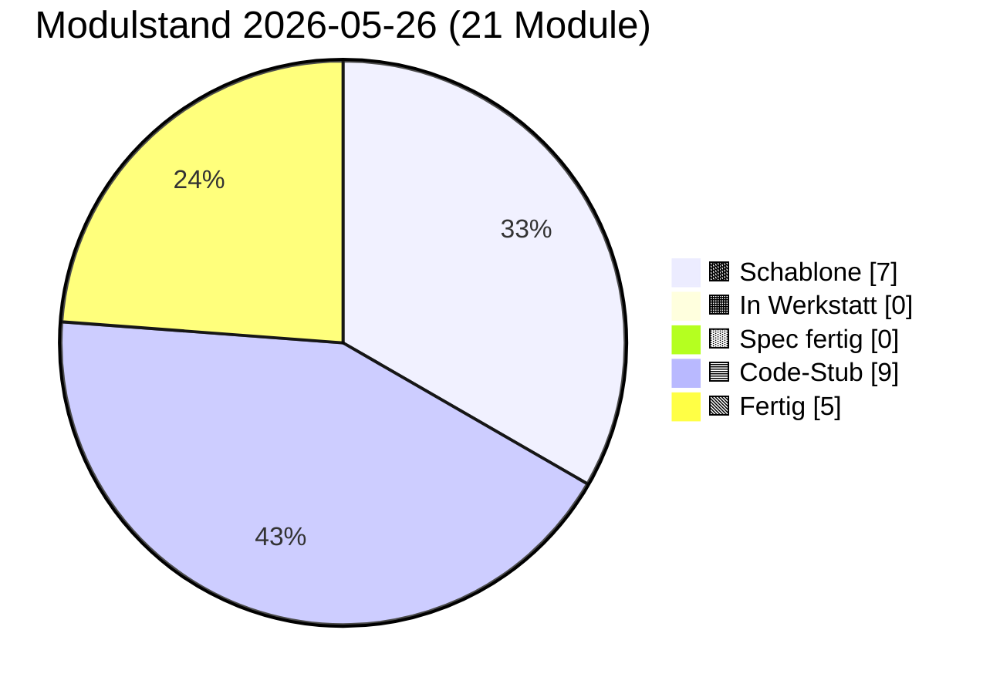

# PULS — lebender Status

**Format:** Jede Sitzung trägt unten einen Eintrag ein (neueste oben).
**Pflichtfelder pro Eintrag:** Datum · Sitzungs-Rolle · was getan · was offen · nächster sinnvoller Schritt.
**Begrenzung:** Diese Datei darf 3000 Zeilen nicht überschreiten. Älteres ins
`docs/sessions/archiv/`-Verzeichnis als Übergabeprotokoll auslagern.
**Schutz-Klausel (2026-05-17):** Die 3000-Zeilen-Grenze wurde bewusst hochgesetzt
(vorher 400) — Pflege-Sitzungen werden umfangreicher dokumentiert, weil
Architekturfunde und Diagnose-Routinen Platz brauchen. **Diese Grenze NICHT
wieder herabsetzen, auch nicht zum Token-Sparen.** Wenn 3000 Zeilen nahen,
auslagern statt kürzen.

---

## Modulstand heute

<!-- Pie-Block ab hier wird automatisch aus status.json generiert.
     Nicht von Hand bearbeiten. Erzeugen mit:
     python3 scripts/update_puls_pie.py
     Aufruf-Pflicht: nach jeder status.json-Änderung. Siehe CLAUDE.md. -->


Farb-Mapping verbindlich in [INTERFACES.md §5](INTERFACES.md). Live-Bau-Puls
auf der [Sage-Page](../index.html) (Karte "Bau-Puls").

## Als nächstes ✨

Module mit Code-Stub, **Sichttest durch Klaus 2026-05-14 erledigt** —
ergab fünf reproduzierbare Cosinus-Messwerte (siehe Karte 04 Beleg-
Block), die in der Pflege-Sitzung 2026-05-14 zu `PROVIDER_MIN_MATCH`
0.55 → 0.80 geführt haben:

- 🟦 **[01 Storage](components/01_storage.md)** — geprüft 2026-05-14 + 2026-05-16 + 2026-05-19 (Klaus, im Browser); init/round-trip/Unknown-Store sauber, jetzt acht Pflicht-Stores plus dynamische Stores ab v=4 (Bau 01.Y `ensureStore` 2026-05-19 grün — Knöpfe 6/7/8 3/3, happy-path / Idempotenz / Pattern-Verstoß); **Pflege „`init()` versions-fail-soft" 2026-05-19 live grün** (Klaus, DeX-Chrome: Knopf 9 `db_version_vor: 16 → nach_bump: 17`, dann Tab-Reload + Bonus-Probe Panel-02-Knöpfe 8/9/10 alle grün ohne Cleanup-Workaround). Headless-Smoke-Test 8/8 grün + Bau-02.Y-Regression 33/33 grün.
- 🟦 **[02 Spore](components/02_spore.md)** — geprüft 2026-05-14 + 2026-05-16 (Klaus, im Browser); Identität deterministisch, Spore sortiert, Sign+Verify valide, Manipulation erkannt; **Bau 02.X Backup-Export Sichttest 2026-05-16 grün** — Knöpfe 6/7/7b alle drei Hauptpfade ohne Modul-Bug. **Bau 02.Y Multi-Identitäts-API + Backup-Schema-Bump Sichttest 2026-05-19 (Klaus, DeX-Chrome auf Galaxy Tab S6): 3/3 grün** (nach Mini-Fix + Cleanup-Workaround) — Knopf 8 „Identitäts-Wechsel OK", Knopf 9 „Persona-Apoptose OK", Knopf 10 „Multi-ID-Backup OK"; Erst-Befund Multi-Tab-onblocked auf Knopf 8 + Rollback-Bug in `getOrCreateIdentity` durch Mini-Fix (Reihenfolge `ensureIdentityStores` vor `put(sbkim_keys)`) behoben; Headless-Smoke-Test 33/33 grün. Panel 01 (1–8) ebenfalls grün. Klaus' Beobachtung: zweiter Lauf gelang erst nach „Storage init"-Klick in Panel 01 — bestätigt offene Folge-Pflege Modul 01 `init()` versions-fail-soft.
- 🟦 **[03 Embedding](components/03_embedding.md)** — geprüft 2026-05-14 (Klaus, im Browser); L2-Norm 1.0, gleicher Inhalt ≈0.95, Baseline für unverwandte Begriffe ungewöhnlich hoch
- 🟩 **[04 Match](components/04_match.md)** — geprüft 2026-05-14 (Klaus, im Browser) + Bau 04.A `matchDimensions` sync 2026-05-19 live grün + **Bau 04.B `explainMatchLLM` 2026-05-20** (Stufe-B-LLM-Pass gegen Anthropic-API, fail-soft) + **Bau 04.C `queryLocal` 2026-05-26 + Sichttest 5/5 grün 2026-05-26** (Klaus, DeX-Chrome auf Galaxy Tab S6, Panel 04 Tests 11–15 alle live grün: Happy-Path Top 0.9501 + Mittel 0.8627, Schwelle-Cut leere Liste, Top-k-Cut T1 0.9488 + T2 0.9144, Provider-Pfad registriert=true 2 Treffer, Leerer Korpus beide 0). Modul 04 jetzt **fertig** (Cosinus + Drei-Schichten + Stufe-B-LLM + lokales Such-Backend). Cross-Knoten-Such-Lücke geschlossen — Modul 15 Sub (b) `op:"query"`-Empfänger ruft jetzt live `queryLocal`. **Bau 04.B Sichttest mit echtem API-Key noch offen** (Knopf 10, CORS-Workaround echtes PWA-Setup).
- 🟦 **[06 Heterokaryose](components/06_heterokaryose.md)** — Code geschrieben 2026-05-15 (Bau-Sitzung 06) + Pflege Bau 06.1 Outbox-Lese-Pfad 2026-05-15 + **Bau 06.Y transparenter Slot-Pfad 2026-05-20** (additiv-mit-internem-Refactoring, KEIN Bruch der äußeren Signatur — Modul 06 schreibt jetzt slot-spezifisch in `sbkim_hetero_inbox_<key>` + `sbkim_anastomosis_log_<key>`; liest aus `sbkim_hetero_outbox_<key>` + `sbkim_siblings_<key>`; Receiver-Pfad nutzt `nodeId → slotKey`-Map; Sender cached `opSlot` zur Op-Zeit; volle 06/05/08-Achse jetzt geschlossen-konsistent slot-suffixed). Sichttest 2026-05-16 rasch grob durchgeklickt (Panel 06 14 Knöpfe), volle 12-Knopf-Sichttest-Runde 2026-05-20 grün im Bau-08.Y-Lauf inkl. Test 9 `HETERO_MAX_ANCHORS`. **Bau 06.Y Sichttest ungeprüft** (headless 25/25 smoke grün — wartet auf Klaus' Browser-Lauf Panel 06 + Knopf 15 Sekundär-Persona-Test).

Code-Stub frisch aus den Bau-Sitzungen 2026-05-14/15, **Sichttest ausstehend bzw. teilweise erledigt:**

- 🟦 **[05 Anastomose](components/05_anastomose.md)** — Code geschrieben 2026-05-14 (Bau-Sitzung) + BroadcastChannel-Bridge 2026-05-17 + **Bau 05.Y transparenter Slot-Pfad 2026-05-20** (additiv-mit-internem-Refactoring, KEIN Bruch der äußeren Signatur — Modul 05 schreibt jetzt slot-spezifisch in `sbkim_siblings_<key>` und `sbkim_anastomosis_log_<key>`; Receiver-Pfad nutzt `nodeId → slotKey`-Map zur Persona-Auflösung; Sender cached `opSlot` zur Op-Zeit). Sichttest geprüft 2026-05-15 (6/7 → Test 2 in Pflege als Vektor-Trias repariert); BroadcastChannel-Sichttest 2026-05-17 grün (4/4); volle Regression Panels 01-07 im Bau-08.Y-Sichttest 2026-05-20 grün. **Bau 05.Y Sichttest ungeprüft** (headless 25/25 smoke grün — wartet auf Klaus' Browser-Lauf Panel 05 + Knopf 10 Sekundär-Persona).
- 🟦 **[07 Apoptose](components/07_apoptose.md)** — Code geschrieben 2026-05-14 (Bau-Sitzung) + Pflege 02+07-Cache-Invalidate 2026-05-15 + Pflege Cleanup-Reihenfolge Bau 06 2026-05-15 + **Bau 07.Y transparenter Slot-Pfad + `_sendLegacyForIdentity`-Hook 2026-05-20** (additiv-mit-internem-Refactoring, KEIN Bruch der äußeren Signatur außer optionalen `key`-Parametern). Modul 07 schreibt jetzt slot-spezifisch (`sbkim_legacy_inbox_<key>` + `sbkim_anastomosis_log_<key>`); globale `confirmSelfApoptose` iteriert über ALLE Slots; neuer Hook `_sendLegacyForIdentity(key)` — **Bau-02.Y-fail-soft-Klausel aufgelöst**. **Konsumenten-Achse 05/06/07/08 jetzt vollständig slot-suffixed.** Sichttest 8/8 grün 2026-05-15 (Klaus, Re-Sichttest nach Cache-Invalidate); volle 8-Knopf-Sichttest-Runde 2026-05-20 im Bau-08.Y-Lauf grün inkl. Test 6 Self-Apoptose IRREVERSIBEL. **Bau 07.Y Sichttest ungeprüft** (headless 30/30 smoke grün — wartet auf Klaus' Browser-Lauf Panel 07 Test 6 globale Slot-Iteration + Panel 02 Knopf 9 Persona-Apoptose-Hook produktiv ohne `console.warn`).
- 🟦 **[00 Doku-Fenster](components/00_doku_fenster.md)** — Code geschrieben 2026-05-14 (Bau-Sitzung), Sichttest geprüft 2026-05-15 (Klaus, im Browser): 5 von 6 Tests grün im ersten Lauf (Setup, Test 2 5-Klick-Simulation, Test 3 4-Klick + Timeout, Test 5 TTL-Sweep, Selbstcheck-Hinweis); **Test 4 Test-Bug** mit Mini-Werten 81/100 (freeBytes=19 Bytes ist trivial < 50 MiB → `warningLevel:"both"` statt erwartetem `"ratio"`) → **Pflege-Sitzung 2026-05-15** repariert mit GiB-Skalierung (`usage:8.1 GiB, quota:10 GiB` → freeBytes ≈ 1.9 GiB → `warningLevel:"ratio"` sauber); Modul-Vertrag und INTERFACES.md unangetastet

Spec frisch, **Bau ausstehend**:

- 🟨 **[09 Einbau-PWA](components/09_einbau_pwa.md)** — Karte vollständig 2026-05-14 (Spec-Sitzung; Anleitung, kein JS-Modul), **Pflege-Sitzung 2026-05-15 erweitert auf neun Schritte** (Schritt 9 neu: `SbkimApoptose.init()` + `SbkimDoku.init({searchIconSelector:...})` + optionaler TTL-Sweep nach Handshake); `<script>`-Reihenfolge in Schritt 2 zieht 07 + 00 nach (`01 → 02 → 03 → 04 → 05 → 07 → 00`); Sichtkontroll-Block jetzt vier Pflicht-Punkte (sieben Selbstcheck-Zeilen + sechs IndexedDB-Stores + zwei live-Endpunkte + 5-Klick-Geste am Such-Symbol); Datei-Pfad-Konvention (SW im Endknoten-Repo-Root, sieben JS-Module inline oder unter `sbkim/`); Spore-Endpunkt `/sbkim/spore.json` verbindlich; SW-Scope-Falle dokumentiert; `domainVector`-Pflicht-Frage **entschieden Variante A (Soft-Pflicht im Andock-Workflow, kein Hauptversions-Sprung)** — Modul 02 / §0 / §2 bleiben unverändert. **Bau-Sitzung 2026-05-15 vor Schritt 1 sauber abgebrochen** (Befund-Sitzung): beide Endknoten haben aktiven `app-sw.js` im Repo-Root (Mein-Mixarium Z. 12543, Mein-Rezeptbuch Z. 10453), Karte 09 antizipiert diesen Fall nicht; zusätzlich Karte 09 § Sichtkontrolle implizit auf Desktop-DevTools gemünzt — Klaus' Tablet (Galaxy Tab S6 + DeX) braucht Eruda-Pfad. **Vor erneuter Bau-Sitzung 09** zwei Karten-Lücken in einer Pflege-Sitzung Karte 09 zu schließen (Empfehlung Option α: Patch in bestehenden `app-sw.js`; plus Eruda-Pfad für Tablet-Sichtkontrolle). Details in [Übergabeprotokoll 2026-05-15 Bau-09-blockiert](sessions/archiv/2026-05-15_bau-09-blockiert-app-sw.md).

Letzter Bau frisch (Bau-Sitzung 2026-05-15), **Sichttest geprüft 2026-05-15:**

- 🟦 **[08 UI-Demo](components/08_ui_demo.md)** — Code geschrieben 2026-05-15 (Bau-Sitzung 08), **Bau 08.Y slot-spezifische Outbox 2026-05-20** (additiv-mit-internem-Refactoring, KEIN Bruch der äußeren Signatur). Endknoten-Andocker-UI für die zwei Stellen, die Modul 06 (Heterokaryose) braucht, aber nicht selbst füllt: `sbkim_hetero_outbox_<activeSlotKey>` (Anker-Vorrat, slot-spezifisch seit Bau 08.Y) und `sbkim_siblings_<activeSlotKey>[peerNodeId].heterokaryosisOptIn` (additives Opt-In-Flag pro Geschwister). Fünf-Funktionen-API (`init/listOutbox/addOutboxAnchor/removeOutboxAnchor/setSiblingHeteroOptIn`), sechs benannte Error-Klassen im Factory-Stil analog Modul 00, drei Test-Brücken (`_clearOutbox`, `_addPseudoSibling` ohne Opt-In-Flag, `_clearPseudoSiblings`), synchroner Selbstcheck. **Storage-only** (kein Netz, kein Embedding, keine Signatur — Vektor-Erzeugung ist Aufrufer-Pflicht). `addOutboxAnchor`-Check-Reihenfolge: (1) Label sync, (2) Vektor sync, (3) async-Voll-Check (`OutboxFullError` nur bei NEUEM Label); Überschreiben eines bekannten Labels bleibt erlaubt. `setSiblingHeteroOptIn` strikt boolean (`1`, `"true"` werfen `InvalidOptInArgError`); Co-Schreiber-Disziplin via `Object.assign`. Panel 08 in `tests/manual_check.html` mit acht Knöpfen (Setup + sechs Test-Punkte + Selbstcheck-Hinweis); Panel-Status von Werkstatt-Stub `idle` auf `ok "Code-Stub"`. **Self-Apoptose-Knopf bewusst NICHT in Panel 08** (Spec-Sitzung 08-Entscheidung respektiert). `node --check src/modules/08_ui_demo.js` grün, alle 10 Inline-`<script>`-Blöcke validiert. **Sichttest geprüft 2026-05-15 (Klaus, im Browser): 6/6 Test-Punkte grün** (Pflege-Sitzung Sichttest-Resultate 2026-05-15). **Bau 08.Y Sichttest 2026-05-20 (Klaus, DeX-Chrome auf Galaxy Tab S6): Setup + Tests 1–6 grün** — Setup zeigt `active_slot_key:"main"` + `outbox_store:"sbkim_hetero_outbox_main"` + `siblings_store:"sbkim_siblings_main"`, Test 4 OutboxFullError-Message zitiert „sbkim_hetero_outbox_main am Limit (5 Einträge pro Slot)" (Slot-Suffix + „pro Slot"-Wortlaut live), Test 6 Co-Schreiber-Pfad auf slot-suffixed `sbkim_siblings_main` + `InvalidOptInArgError` für `1`/`"true"`. **Vollständige Regression Panels 01–07 grün** im selben Lauf (Storage / Spore Multi-Persona / Embedding / Match `matchDimensions` / Anastomose 9c Auto-Fallback / Heterokaryose Test 9 `HETERO_MAX_ANCHORS`-Begrenzung / Apoptose Self-Apoptose IRREVERSIBEL) — keine Bau-08.Y-Regression.

Empfehlung Hauptsitzung: **Klaus' Re-Andock beider Endknoten mit
PWA-Suffix**. Die Pflege-Sitzung 2026-05-16 „Karten 01 + 09 PWA-
Suffix" hat die Architektur-Erweiterung abgeschlossen (Modul 01 hat
jetzt `init({dbSuffix})`, Karten 01 + 09 und INTERFACES.md §1 Modul 01
sind nachgezogen, `PROTOCOL_VERSION` bleibt `"0.1"`, Modul 02 unangetastet).
Nächster Schritt liegt **in Klaus' Endknoten-Repos**:

1. In **beiden** Endknoten-Repos (`Mein-Mixarium`, `Mein-Rezeptbuch`)
   muss `sbkim/sbkim-init.js` erweitert werden: vor dem bestehenden
   `await SbkimAnastomose.init()` einen Aufruf
   `await SbkimStorage.init({ dbSuffix: "mixarium" })` (bzw.
   `"rezeptbuch"`) hinzufügen.
2. In beiden Tab-Sessions `__sbkimErzeugeSpore()` erneut triggern
   (Klaus in der jeweiligen Eruda-Konsole) → neue, getrennte nodeIds
   pro PWA.
3. Neue `spore.json` jeweils nach `~/<Endknoten>/sbkim/spore.json`
   verschieben + Commit + Push (überschreibt die alte Pages-Spore).
4. Erst nach Re-Andock kann eine Folge-Sitzung `status.json`
   `pingStatus` von `"blocked-origin-collision"` auf `"live"`
   wechseln (sobald Klaus den ersten Cross-Knoten-Handshake gefahren
   hat) und die `nodeId`-Werte in der Endknoten-Tabelle aktualisieren.

Andere offene Punkte (Mini-Pflege „Sushi-Kategorie sichtbar machen"
in Mein-Mixarium, INTERFACES.md §6 Tabellen-Bug) sind unverändert
offen. Details im [Übergabeprotokoll 2026-05-16 Pflege PWA-Suffix](sessions/archiv/2026-05-16_pflege-pwa-suffix-karten-01-09.md),
zur Andock-Hintergrund [Übergabeprotokoll 2026-05-16 Andock
Mein-Rezeptbuch](sessions/archiv/2026-05-16_andock-mein-rezeptbuch-iteration-3-live.md)
und der zugehörigen [Mixarium-Andock-Übergabe](sessions/archiv/2026-05-16_andock-mein-mixarium-iteration-3-live.md).

---

## Schnellüberblick

| Modul | Spec | Code | Manueller Sichttest | Anmerkung |
|---|---|---|---|---|
| 00 doku_fenster | Spec fertig (2026-05-14) | Code-Stub (2026-05-14, Pflege Persistenz-Strategie verbinden 2026-05-16) | geprüft 2026-05-15 (Klaus) — 5/6 Tests grün im ersten Lauf, Test 4 Test-Bug in Pflege-Sitzung 2026-05-15 mit GiB-Skalierung repariert; **Pflege Persistenz-Strategie verbinden Sichttest 2026-05-16 grün** (Klaus, im Browser) — Drei-Setup-Probe aus § Manueller Test Punkt 7 alle drei Pfade ohne Auffälligkeit: Persist-Trigger-Stub, Quota-Trigger, Negativ-Fall | Sechs-Funktionen-API (`init/open/close/isOpen/getStatusSnapshot/recordSighttest`), reines Lese-/Trigger-Modul, alleiniger Schreiber `sbkim_doku_meta`, 5-Klick-Geste mit 3s-Zeitfenster, Modal mit Backdrop und MutationObserver-Mount, Quota-Doppel-Schwelle (80% / 50 MiB), Self-Apoptose bewusst NICHT in 00. **Pflege Persistenz-Strategie verbinden 2026-05-16** (additiv, kein Refactoring): `getStatusSnapshot()` um Feld `storagePersisted: boolean \| null` erweitert (Spiegelung Modul-01-Getter fail-soft); Modal zeigt zusätzliche „Backup empfohlen"-Tipp-Zeile (`DOKU_BACKUP_TIP_TEXT` modul-lokal), wenn `storagePersisted === false` ODER `quota.warningLevel !== "none"`. Hinweis-only, kein Direkt-Aufruf von `SbkimSpore.exportBackup` aus Modul 00 (Aufrufer-Pflicht-Trennung). |
| 01 storage | Spec fertig (2026-05-14) | Code-Stub (2026-05-14, Pflege PWA-Suffix + Pflege Storage-Persist 2026-05-16, Bau 01.Y `ensureStore` 2026-05-19, Pflege `init()` versions-fail-soft 2026-05-19, Pflege Versions-Bump-Race in `openProbe` 2026-05-22) | geprüft 2026-05-14 + 2026-05-16 + 2026-05-19 + **2026-05-22** (Klaus) — Bau 01.Y `ensureStore` Knöpfe 6/7/8 3/3 grün (DeX-Chrome); Pflege „`init()` versions-fail-soft" Knopf 9 live grün 2026-05-19 (`db_version_vor: 16 → nach_bump: 17`, Bonus-Probe Panel-02-Knöpfe 8/9/10 ohne Cleanup grün); **Pflege „Versions-Bump-Race in `openProbe`" Sichttest 2026-05-22 grün** (Klaus, DeX-Chrome auf Galaxy Tab S6, 11-Knopf-Sequenz alle grün — Panel-01-Notfall-Reset → Hard-Reload → Panel-06-Setup ohne `ensureStore Versions-Bump blockiert`-Throw + Panel-06-Tests 1/9/10/11 + Panel-07-Tests 4/5/6 + Panel-00-Test 5 alle live grün; zentraler Race-Auflösungs-Beweis ist Setup-Knopf in Panel 06, der vor der Pflege reproduzierbar brach); Headless-Smoke 8/8 + Race-Smoke 6/6 + Bau-02.Y-Regression 33/33 weiterhin grün | IndexedDB-Wrapper |
| 02 spore | Spec fertig (2026-05-14, Pflege Stamm/Gast-Felder 2026-05-15, Pflege Spec Backup-Export Stufe 2 2026-05-16, Spec Multi-Identität Brief 04 2026-05-19) | Code-Stub (2026-05-14, Pflege Cache-Invalidate 2026-05-15, Pflege Stamm/Gast-Durchreichung 2026-05-15, Bau 02.X Backup-Export 2026-05-16, Bau 02.Y Multi-Identitäts-API + Backup-Schema-Bump 2026-05-19, Mini-Fix Rollback-Pfad 2026-05-19) | geprüft 2026-05-14 (Klaus) + 2026-05-15 (Cache-Invalidate-Pflege via Sichttest 07) + 2026-05-16 (Klaus, Bau 02.X Backup-Export Knöpfe 6/7/7b alle drei grün) + **2026-05-19 (Klaus, DeX-Chrome: Bau 02.Y Knöpfe 8/9/10 alle drei grün** nach Mini-Fix + Cleanup-Workaround) | Ed25519-Identität, Multi-Identitäts-Slots (Bau 02.Y), base64url-sha256-rawpub; +`resetIdentityCache()` aus Pflege-Sitzung 2026-05-15 (Pflicht-Hook für Apoptose-Cleanup). **Spore-JSON Optionale Felder additiv erweitert** 2026-05-15 (Spec-Sitzung Stamm/Gast): `stammCategories: string[]` + `guestCategories: string[]`, signaturpflichtig wenn vorhanden, Disjunktheit als Hosting-Pflicht (kein Verify-Abbruch). Sign-/Verify-Pfad unverändert. **`generateOwnSpore` Code-Allow-List nachgezogen** 2026-05-15 (Bau 02 Stamm/Gast): zwei Zeilen analog zu `domainKeywords` — ohne diese Pflege würden Stamm/Gast-Felder beim Andock still ignoriert. **Spec Backup-Export Stufe 2 2026-05-16** (Identitäts-Persistenz Stufe 2): zwei neue Funktionen `exportBackup(password) → Promise<SbkimBackupBlob>` + `importBackup(blob, password, options?)` (PBKDF2-SHA256 600 000 + AES-GCM-256, Klartext-Payload = Identität + Geschwister, defensiv per Default — `BackupOverwriteError`); drei §0-Konstanten verankert (`BACKUP_FORMAT_VERSION=1` / `BACKUP_KDF_ITERATIONS=600000` / `BACKUP_PASSWORD_MIN_LEN=8`); fünf neue Error-Klassen (`InvalidBackupPasswordError` / `BackupDecryptError` / `BackupVersionMismatchError` / `BackupSchemaError` / `BackupOverwriteError`). KEIN Spore-Feld dazu (Backup-Schicht separat, `PROTOCOL_VERSION` bleibt `"0.1"`). **Bau-Sitzung 02.X ausstehend**, KEIN Code in `src/modules/02_spore.js`. |
| 03 embedding | Spec fertig (2026-05-14) | Code-Stub (2026-05-14) | geprüft 2026-05-14 (Klaus) | semantischer Vektor |
| 04 match | Spec fertig (2026-05-14, Pflege Stamm/Gast-Hinweis 2026-05-15, Spec M04-Erweiterung Brief 03 2026-05-19, Spec Sub (c) `queryLocal` 2026-05-26) | **Fertig** (2026-05-14, Bau 04.A `matchDimensions` sync 2026-05-19, Bau 04.B `explainMatchLLM` 2026-05-20, **Bau 04.C `queryLocal` 2026-05-26 PR #177**) | geprüft 2026-05-14 (Klaus) + Bau 04.A live grün 2026-05-19; **Bau 04.C Sichttest 5/5 grün 2026-05-26** (Klaus, DeX-Chrome auf Galaxy Tab S6, Termux-localhost:8000 nach Hard-Reload): Panel 04 Tests 11–15 alle live grün — Test 11 Happy-Path Top 0.9501 + Mittel 0.8627 + Unter-Schwelle gefiltert; Test 12 Schwelle-Cut leere Liste; Test 13 Top-k-Cut T1 0.9488 + T2 0.9144; Test 14 Provider-Pfad registriert=true + 2 Treffer; Test 15 Leerer Korpus beide 0 + provider_registriert=false. **Bau 04.B Sichttest mit echtem Anthropic-API-Key noch offen** (Knopf 10, headless 30/30 grün — CORS-Workaround echtes PWA-Setup) | Vektorvergleich, modus-frei; Bau 04.A `matchDimensions` synchron (drei orthogonale Schichten, Stufe-A-Heuristik). Bau 04.B `explainMatchLLM` async — Stufe-B-LLM-Pass gegen Anthropic-API (hartcodiert), JSON-only, fail-soft. **Bau 04.C 2026-05-26 `queryLocal` async** — lokales Such-Feld-Backend (PR #177): Default k=5, hartcodierte Schwelle PROVIDER_MIN_MATCH=0.80, Korpus zwei Pfade (`options.corpus` Vorrang ODER `setLocalCorpus`-Provider via Callback oder Array), fünf Fehler-Factories (EmptyQueryError / QueryTooLongError / InvalidKError / EmbeddingNotAvailableError / InvalidCorpusError) sync + EmbeddingFailedError async-rethrow, leerer Korpus + alle-unter-Schwelle resolved mit `[]` ohne Throw. Modul 15 Sub (b) `op:"query"`-Empfänger ruft jetzt live `queryLocal` (fail-soft-Pattern greift) — `error:"module-04c-not-available"`-Antwort entfällt. Headless-Smoke 43/43 grün, Regression 04.A 19/19 + 04.B 30/30 + 15.B 31/31 + 17 32/32 grün. **Cross-Knoten-Such-Lücke geschlossen.** |
| 05 anastomose | Spec fertig (2026-05-14, Spec BroadcastChannel-Bridge 2026-05-17, Spec Multi-Identität Brief 04 2026-05-19) | Code-Stub (2026-05-14, Bau BroadcastChannel-Bridge 2026-05-17, **Bau 05.Y transparenter Slot-Pfad 2026-05-20**) | geprüft 2026-05-15 (Klaus) — 6/7 Tests grün im ersten Lauf, Test 2 Test-Bug in Pflege-Sitzung 2026-05-15 als Vektor-Trias repariert; **Bau BroadcastChannel-Bridge Sichttest 2026-05-17 grün** (Klaus, DeX-Chrome) — Knöpfe 9 / 9a / 9b / 9c alle vier ohne Modul-Befund (Test 9 established score 0.8881; Test 9a HandshakeTimeoutError nach 4005 ms; Test 9b MissingToNodeIdError synchron; Test 9c Auto-Fallback HTTP-404→Channel etabliert 0.8881); volle Regression Panels 01-07 grün im Bau-08.Y-Sichttest 2026-05-20 (Test 9c live grün); **Bau 05.Y Sichttest ungeprüft** (headless gebaut 2026-05-20, wartet auf Klaus' Browser-Lauf Panel 05 Setup + Knopf 10 Sekundär-Persona) | Handshake; Fünf-Funktionen-API, bidirektional, kanonisch signiert, Schwelle aus Modul 04; SW Variante A (Page-Hosted) + same-origin Fallback-Transport via `BroadcastChannel('sbkim')` aus Bau-Sitzung 2026-05-17 (additiv, `options.transport ∈ {"auto","http","channel"}` mit Default `"auto"` und einmaligem Auto-Fallback bei klaren HTTP-Defekt-Signalen) |
| 06 heterokaryose | Spec fertig (2026-05-15, Spec Multi-Identität Brief 04 2026-05-19) | Code-Stub (2026-05-15, Pflege Bau 06.1 Outbox-Lese-Pfad 2026-05-15, **Bau 06.Y transparenter Slot-Pfad 2026-05-20**) | rasch grob durchgeklickt 2026-05-16 + volle 12-Knopf-Sichttest-Runde 2026-05-20 (Klaus, Tab S6 + DeX) — Panel 06 alle Tests grün inkl. Test 9 HETERO_MAX_ANCHORS; **Bau 06.Y Sichttest ungeprüft** (headless 25/25 smoke grün — wartet auf Klaus' Browser-Lauf Panel 06 Setup + Knopf 15 Sekundär-Persona) | Datenaustausch unter Geschwistern; Fünf-Funktionen-API (`init/requestHeterokaryosis/receiveHeterokaryosis/listHeterokaryosis/forgetHeterokaryosis`), Pull-Pattern, Opt-In beidseits (additiv auf `sbkim_siblings`), kanonisch wie 05/07 (vierter Sign-Pfad bewusst dupliziert), neuer Store `sbkim_hetero_inbox` (Komposit-Schlüssel `peerNodeId\|ts`, DB-Version 1→2 additiv), SW Variante A mit drittem fetch-Listener `/sbkim/heterokaryosis` (Message-Typ `SBKIM_HETEROKARYOSIS_REQUEST`); Modul 07 Cleanup-Reihenfolge nachgezogen (`sbkim_hetero_inbox` zwischen `sbkim_legacy_inbox` und `sbkim_spore`). **Anker-Quelle nach Pflege Bau 06.1 (2026-05-15): voller Outbox-Lese-Pfad implementiert** — `sbkim_hetero_outbox` (Spec-Sitzung 08, v=3-Store) wird fail-soft gelesen, max. `HETERO_MAX_ANCHORS=5` Anker absteigend nach `addedAt`; Fallback auf Spore-Single-Anker bei leerer/fehlender Outbox bestehen geblieben. `src/modules/01_storage.js` `DB_VERSION` 2 → 3 (additive Migration v=3, `STORES_V3=["sbkim_hetero_outbox"]`); Panel 06 mit 14 Knöpfen; Test 9 (`HETERO_MAX_ANCHORS`-Begrenzung) voll abgedeckt (sechs Outbox-Einträge → Response liefert genau fünf, neueste zuerst). Sichttest ausstehend (headless gebaut, wartet auf Klaus' Browser) |
| 07 apoptose | Spec fertig (2026-05-14, Spec Multi-Identität Brief 04 2026-05-19) | Code-Stub (2026-05-14, Pflege Cache-Invalidate 2026-05-15, Pflege Cleanup-Reihenfolge Bau 06 2026-05-15, **Bau 07.Y transparenter Slot-Pfad + Legacy-Hook 2026-05-20**) | geprüft 2026-05-15 (Klaus) — **8/8 Tests grün** nach Pflege 02+07-Cache-Invalidate; volle 8-Knopf-Sichttest-Runde 2026-05-20 im Bau-08.Y-Lauf grün; **Bau 07.Y Sichttest ungeprüft** (headless 30/30 smoke grün — wartet auf Klaus' Browser-Lauf Panel 07 Test 6 globale Slot-Iteration + Panel 02 Knopf 9 Persona-Apoptose-Hook produktiv) | Selbstlöschung mit signiertem Vermächtnis; zweistufige Self-Apoptose (Token 60 s), Vermächtnis-Inbox, TTL-Vergessen explizit durch Andocker; kanonischer Sign/Verify-Pfad aus 02/05 dritter Pfad dupliziert; Cleanup-Schritt ruft `SbkimSpore.resetIdentityCache()` (Pflege 2026-05-15). **Bau 07.Y 2026-05-20:** drei Eingriffe — (1) transparenter Slot-Pfad in Stores; (2) globale `confirmSelfApoptose` iteriert über ALLE Slots; (3) neuer interner Hook `_sendLegacyForIdentity(key)` für Bau-02.Y `removeIdentity(key, {force:true})`-Aufrufe. **Konsumenten-Achse 05/06/07/08 vollständig slot-suffixed.** **Bau-02.Y-fail-soft-Klausel aufgelöst** ohne Modul-02-Code-Änderung. |
| 08 ui_demo | Spec fertig (2026-05-15) | Code-Stub (2026-05-15, Bau 08.Y slot-spezifische Outbox 2026-05-20) | geprüft 2026-05-15 (Klaus) — 6/6 Test-Punkte grün; **Bau 08.Y Sichttest 2026-05-20 grün** (Klaus, DeX-Chrome auf Galaxy Tab S6): Setup + Tests 1–6 grün, Setup zeigt `active_slot_key:"main"` + slot-suffixed Stores `sbkim_hetero_outbox_main` / `sbkim_siblings_main`, Test 4 OutboxFullError-Message live „am Limit (5 Einträge pro Slot)" mit Slot-Suffix, Test 6 Co-Schreiber-Pfad strikt-boolean. Volle Regression Panels 01–07 grün im selben Lauf | Endknoten-Pflege-UI für `sbkim_hetero_outbox` und `sbkim_siblings.heterokaryosisOptIn`; Fünf-Funktionen-API (`init/listOutbox/addOutboxAnchor/removeOutboxAnchor/setSiblingHeteroOptIn`), sechs benannte Error-Klassen im Factory-Stil analog Modul 00, drei Test-Brücken. **Bau 08.Y slot-spezifische Outbox 2026-05-20** (additiv-mit-internem-Refactoring, KEIN Bruch der äußeren Signatur): Modul 08 schreibt jetzt slot-spezifisch in `sbkim_hetero_outbox_<activeSlotKey>` und liest/schreibt `sbkim_siblings_<activeSlotKey>`; `activeSlotKey` im `init()` via `SbkimSpore.getActiveIdentityKey()` gecached (Default `"main"` als Rückwärts-Kompat); `probeDependencies` um Pflicht-Abhängigkeit `SbkimSpore (Modul 02)` erweitert; neue Closure-Helper `heteroOutboxStoreName/siblingsStoreName/ensureSlotStores`; defensives `ensureSlotStores` vor jedem ersten Schreibvorgang (idempotent, Bau 01.Y); Test-Brücken `_clearOutbox` / `_clearPseudoSiblings` via `SbkimStorage.clear` slot-isoliert. Selbstcheck-Zeile UNVERÄNDERT. `HETERO_OUTBOX_MAX_ENTRIES = 5` gilt jetzt PRO SLOT (bei 3 Personae theoretisch 15 Anker insgesamt). Headless-Smoke-Test 26/26 grün (drei Proben + Bonus). **Bekannte Limitierung aus Bau-06.Y-Brief aufgelöst** — Modul 06 (Bau 06.Y) liest aus `sbkim_hetero_outbox_<key>`, Modul 08 (diese Bau-Sitzung) schreibt dorthin. Modul 08 alleiniger Schreiber von `sbkim_hetero_outbox_<key>` (Schlüssel `label`, max. `HETERO_OUTBOX_MAX_ENTRIES`=5 PRO SLOT, absteigend nach `addedAt`, Überschreiben statt Verdrängen) und Co-Schreiber für `sbkim_siblings_<key>.heterokaryosisOptIn` (Modul 05 unangetastet). **Storage-only** (kein Netz, kein Embedding, keine Signatur, KEIN Receiver-Map). `addOutboxAnchor`-Check-Reihenfolge: (1) Label sync, (2) Vektor sync, (3) async-Voll-Check (`OutboxFullError` nur bei NEUEM Label); `setSiblingHeteroOptIn` strikt boolean; Self-Apoptose-Knopf bewusst NICHT in Panel 08. Panel 08 in `tests/manual_check.html` mit acht Knöpfen + Setup-Output zeigt `active_slot_key` + slot-suffixed Store-Namen. **Sichttest 2026-05-15 (Klaus): 6/6 Test-Punkte grün im ersten Lauf** (Bau-08-Sichttest). **Bau 08.Y Sichttest 2026-05-20 (Klaus, DeX-Chrome): Setup + Tests 1–6 grün** — Setup zeigt slot-suffixed Stores; Test 4 OutboxFullError-Message live mit „sbkim_hetero_outbox_main am Limit (5 Einträge pro Slot)"; Test 6 Co-Schreiber-Pfad strikt-boolean. **Vollständige Regression Panels 01–07 grün** im selben Lauf — keine Bau-08.Y-Regression. |
| 09 einbau_pwa | Spec fertig (2026-05-14, Pflege Schritt 9 + 07/00 2026-05-15, Pflege App-SW-Koexistenz 2026-05-15) | — (Anleitung, kein JS-Modul) | — | Andock-Anleitung — **9 Schritte** (Schritt 9 neu aus Pflege-Sitzung 2026-05-15: SbkimApoptose.init + SbkimDoku.init + optionaler TTL-Sweep nach Handshake); `<script>`-Reihenfolge 01→02→03→04→05→07→00; Soft-Pflicht `domainVector` im Andock-Workflow (kein Hauptversions-Sprung); SW im Endknoten-Repo-Root, `/sbkim/spore.json` als Spore-Endpunkt — plus Pflege App-SW-Koexistenz (2026-05-15): Schritt 3 a/b-Verzweigung (Pre-Flight-Check → 3a `register('sbkim-sw.js')` für PWA ohne eigenen SW, 3b `importScripts('./sbkim-sw.js')` im bestehenden App-SW für PWA mit eigenem SW), achtes Risiko „App-SW-Überschreibung", `sbkim-sw.js` `SBKIM_SW_STANDALONE`-Flag rückwärtskompatibel (Default `true`, `false` für Variante 3b) |
| 10 reputation | Stub (Schutz-Backlog) | — | — | Knoten-Reputation, Priorität niedrig |
| 11 rate_limit | Stub (Schutz-Backlog) | — | — | Rate-Limit & TTL, Priorität niedrig |
| 12 blocklist | Stub (Schutz-Backlog) | — | — | manuelle Sperrliste, Priorität niedrig |
| 14 diffusion | Stub (Diffusion-Backlog) | — | — | konsensuell-empfehlende Spore-Diffusion via Handshake-Erweiterung (Pfad 2 verbindlich, Pfad 1 = Default-Status-quo, Pfad 3 verworfen wegen Empfangsmodus-Prinzip); Spec ausstehend bis Netz ≥ 10 Geschwister oder erfolgreicher Live-Andock + Wachstums-Bedürfnis; Priorität niedrig — **plus Sage-Page-Sichtbarmachung 2026-05-15** (Karten 4/13/14 ziehen `diffusionBacklog[]` parallel zu `schutzBacklog[]`) |
| 15 membran | Spec fertig (Sub (e) voll 2026-05-24, **Sub (a)+(b) finalisiert 2026-05-25** in Spec-Sitzung 15.B mit MembraneSnapshot-Schema inkl. Siegel-Hook + Envelope mit vier op-Werten sporeRef/query/hint/queryResult + Allowlist fail-soft + Nonce-Pflicht 30 s Replay-Dedupe + Rate-Limit-Hook für Modul 11 vorbestellt, Sub (c) später, Sub (d) Verweis) | **Fertig** (Bau-Sitzung 15.B Sub (a)+(b) Bedien-Pfade 2026-05-25 + Bau 15 Sub (e) + Bau 15.SW SW-Probe-Detektor + Pflege Sage-Page-Sichttest-Knopf, alle 2026-05-24; PR #159 gemerged) | **Bau 15.B Sichttest 8/8 grün 2026-05-25** (Klaus, DeX-Chrome auf Galaxy Tab S6) — Panel 15 Setup + Knöpfe 10–17 alle grün im Termux-`localhost:8000`-Lauf nach Hard-Reload; Sage-Page Bonus vier Plaketten sichtbar (LEBT/VERKEHR/FREMD/Siegel-Badge); Mini-Pflege Knopf-11-Anti-PII-Filter (eigene nodeId vom String-Match ausnehmen) im selben PR #159 mitgenehmigt. Sub (e) + Bau 15.SW + Sage-Page-Lampe geprüft 2026-05-24 (Klaus, DeX-Chrome auf Galaxy Tab S6) — Panel 15 Knopf 8 BroadcastChannel-End-to-End grün, Sage-Page FREMD-Lampe + Modal + „🧪 Demo-Eintrag"-Knopf grün |
| 16 siegel | Spec fertig (2026-05-24, Spec-Sitzung 16, Tafel-Spec-Pflege Mycel-Vision 2026-05-26 Sub (e) Bronze/Gold) | **Code-Stub (Bau-Sitzung 16 vom 2026-05-24 + Bau Sub (e) 2026-05-26)** | **Sub (e) geprüft 2026-05-26 (Klaus, DeX-Chrome auf Galaxy Tab S6) — Panel 16 Knöpfe 9–12 4/4 grün + Endknoten-Cross-Knoten-Sichttest in MR + MM beide Sub (e) live grün** (Bronze-Initial visuell + Modal + Handshake established score 0.9544 via BC-Bridge + Bronze→Gold-Wechsel in beiden PWAs via manuellem Eruda-Dispatch — drei Folge-Befunde: Widget-Slot stufen-unabhängig, Endknoten-Modul-05 prä-Bau-17, Modal-UTC-Zeit); Knöpfe 1–8 (Bau-16-Basis) bleiben ungeprüft. Headless-Smoke 32/32 + Sub (e) 15/15 grün. | SBKIM-Siegel — Selbst-Zertifikat einer PWA-Zelle nach erfolgter Integration der Pflicht-Module. Self-Inscribing (kein Hub-Aussteller, kein CI-Build-Check), Badge in Auszeichnungs-Optik (Prädikatswein- / DLG-Stil — Medaillon-Form, Edel-Gold-Anmutung, klassische Serif-Schrift, kein Marketing-Sticker-Stil), Click öffnet Modal mit Erklärung + nüchternem Aussteller-Klärungs-Satz (self-inscribing, Vertrauen kommt vom Repo — kein Disclaimer-Schwall). Lebendes Dokument: jedes Sicherheits-Update ergänzt einen Aspekt mit Datum. Anti-Greenwashing-Klausel: kein Siegel ohne erfüllte Selbst-Prüfung. **Spec-Sitzung 16 vom 2026-05-24:** alle vier Sub-Bereiche final spezifiziert — Sub (a) Pflicht-Modul-Liste mit sieben Modulen (01 Storage / 02 Spore / 03 Embedding [`lazy:true` für Sage-Page] / 04 Match / 05 Anastomose / 07 Apoptose / 15 Membran) + Surface-Funktions-Anker pro Modul (`init`/`getOwnSpore`/`embedPassage`/`match`/`handshake`/`prepareSelfApoptose`/`init`) + Status-Schema (`"ok"`/`"deferred"`/`"missing"`/`"broken"`) + binärer Fail-Modus (kein Render bei missing/broken, eine `console.warn`-Zeile mit ID-Liste); Sub (b) Badge-Rendering — DOM-Anker `#sbkim-siegel-badge` als vierte Plakette nach #lamp-fremd, 40-px rundes Medaillon Edel-Gold (`#C9A961`-Klasse) auf Bronze-Ink (`#1A1306`), Serif-System-Fallback (`'Spectral','Georgia',serif`, kein Pflicht-Google-Font), Wappen-Skelett (drei verschlungene Hyphen-Bögen + zentraler Knoten-Punkt), 600 ms First-Boot-Animation einmalig, dezenter Glow-Hover, KEINE Stufen-Varianten (Klaus-Festlegung: Siegel wächst über Aspekte, nicht über sichtbare Stufen), Sichtbarkeits-Modi `"visible"`/`"hidden"` (kein `"compact"` in Stufe 1); Sub (c) Erklärungs-Modal — eigenständig in `document.body` (analog Modul 15), Titel „SBKIM-Siegel — was bedeutet das?", Inhalt (Datum + Modul-Liste mit Status + Aspekte-Liste + Aussteller-Klärung), wertigere Typografie (Serif für Titel + Klausel, Geist für Daten-Listen), nüchterne Aussteller-Klärung in zwei Zeilen (Klaus-Korrektur 2026-05-24: KEIN Disclaimer-Schwall), Repo-URL Auto-Erkennung mit `init({repoUrl})`-Override; Sub (d) `ZERTIFIKAT_ASPEKTE`-Schema (`{since, module, aspect, description}`) chronologisch aufsteigend, Start-Eintrag „Grund-Siegel-Bezeugung 2026-05-24" verbindlich für Bau 16, Pflicht-Konvention: jedes spätere Sicherheits-Modul (10/11/12/14/15.B) MUSS in seiner Pflege einen Aspekt ergänzen. Persistenz **RAM-only** (Variante A, kein DB_VERSION-Bump, kein neuer Store, kein PROTOCOL_VERSION-Bump — Modul 16 ist nicht protokoll-aktiv). Schnittstelle `window.SbkimSiegel = {init/isCertified/getExplanation/getCertifiedModules/getAspects/_meta}`. KEINE benannten Error-Klassen (rein beobachtend, fail-soft via `console.warn`). INTERFACES.md § 1 Modul 16 voller Block ergänzt (analog § 1 Modul 15). **Kein Modul-Code, kein index.html-Eingriff** — Bau-Sitzung 16 nächster Schritt. Brief: `docs/sessions/BRIEF_BAU_16_SIEGEL.md`. |

Statuscodes: `—` (nichts) · `Schablone` · `Stub` · `Entwurf` · `Review` · `stabil` · `eingebaut`

## Endknoten (externe Repos des Betreibers)

| App | URL | Domäne | SBKIM-Stand |
|---|---|---|---|
| Rezeptbuch | https://lausiklauskn-png.github.io/Mein-Rezeptbuch/ | Kochrezepte (Stamm 7) — Drinks + Snacks als Überraschungs-Plus (Gast 11) | **integriert 2026-05-16, eigene Identität live 2026-05-16, Re-Andock 2026-05-17** (DeX-Chrome-IndexedDB-Verlust nach PR #75-Pflege, siehe § Offene Querschnitts-Fragen „DeX vs. Tablet-Chrome") · **aktuelle `nodeId: BSWxXmXvxF8FUR_MOx97a3l4gj1Q-JpcAJyp4BBRHyY`** (frischer Ed25519-Schlüssel 2026-05-17 in eigener IndexedDB `sbkim_rezeptbuch` der DeX-Chrome-Instanz; alte Tablet-Chrome-Identität `RHhposP0…` archiviert in PULS-Historie) · Spore live unter `https://lausiklauskn-png.github.io/Mein-Rezeptbuch/sbkim/spore.json` (Commit `3bcc453`) mit `domainVector[384]` · App-SW Variante 3b · Modul-05-v2 mit BroadcastChannel-Bridge eingebaut (`sbkim/05_anastomose-v2.js`, Commit `a1b9ded`). **Cross-Knoten-Handshake 2026-05-17 via Channel-Pfad etabliert** (`outcome:"established"`, score 0.9544 bidirektional, kein localStorage-Bypass mehr nötig — siehe Sitzungs-Eintrag „Live-Channel-Handshake"). `pingStatus: "live-channel"`. |
| Mixarium | https://lausiklauskn-png.github.io/Mein-Mixarium/ | Cocktails / Drinks (Stamm 8) — Knabbereien / Fingerfood (Gast 2) | **integriert 2026-05-16, eigene Identität live 2026-05-16, Re-Andock 2026-05-17** (DeX-Chrome-IndexedDB-Verlust nach PR #75-Pflege) · **aktuelle `nodeId: JOlHK31XEiylHOlOfe6E0_Vade6VcM0Q6Z_ADuxxdDY`** (frischer Ed25519-Schlüssel 2026-05-17 in eigener IndexedDB `sbkim_mixarium` der DeX-Chrome-Instanz; alte Tablet-Chrome-Identität `7xf0tt33_…` archiviert) · Spore live unter https://lausiklauskn-png.github.io/Mein-Mixarium/sbkim/spore.json (Commit `e9d0a45`) mit `domainVector[384]` · App-SW Variante 3b (`importScripts('./sbkim-sw.js')` im bestehenden `app-sw.js`) · Modul-05-v2 mit BroadcastChannel-Bridge eingebaut (`sbkim/05_anastomose-v2.js`, Commit `9d2f127`). **Cross-Knoten-Handshake 2026-05-17 via Channel-Pfad etabliert** (`outcome:"established"`, score 0.9544 bidirektional Mixarium → Rezeptbuch). `pingStatus: "live-channel"`. |

## Offene Querschnitts-Fragen

- **DeX-Chrome vs. Tablet-Chrome — zwei getrennte Browser-Instanzen**
  (eingetragen 2026-05-17, Mini-Pflege „Live-Channel-Handshake"). Auf
  Klaus' Galaxy Tab S6 mit Samsung DeX laufen Chrome am externen
  Monitor und Chrome am Tablet-Display als **faktisch zwei getrennte
  Browser-Instanzen** — eigene IndexedDB, eigene Service-Worker, eigene
  PWA-Liste. Eine in DeX angedockte Spore-Identität ist im Tablet-Modus
  nicht da; eine im Tablet installierte PWA bleibt nach DeX-
  Deinstallation weiter da. **Konsequenz für BroadcastChannel:** Channel-
  Bridge funktioniert nur, wenn beide Tabs in **derselben** Instanz
  laufen. Klaus' Endknoten-IndexedDB war am 2026-05-17 verloren
  (Ursache nicht abschließend geklärt — vermutlich Chrome-Update,
  versehentliches „Site-Daten löschen", oder Storage-Quota), beide
  Endknoten wurden in DeX-Chrome neu angedockt mit neuen nodeIds
  (`BSWxXm…` Rezeptbuch + `JOlHK3…` Mixarium). **Generalisierung:**
  dasselbe Phänomen tritt auf bei Chrome-Profil-Wechsel, Inkognito-
  Modus, Standalone-PWA vs. Tab-Modus. Tech-Note für Andocker /
  Programmierer in [`docs/OBSERVATORIUM_BROWSER.md`](OBSERVATORIUM_BROWSER.md)
  § Lehre 1. **Status:** dokumentiert, kein Code-Eingriff nötig —
  Workaround ist Single-Instance-Disziplin oder Backup-Import.

- **SW-Bridge-Phantom-Cache-Bug in Modul 05** (eingetragen 2026-05-16,
  Live-Andock-Sitzung Cross-Knoten-Handshake; **2026-05-17 vollständig
  aufgelöst — Status: Architektur-Grenze sauber benannt, Code-Eingriffe
  abgeschlossen, Endknoten-Pflege erledigt, Live-Cross-Knoten-Handshake
  via BroadcastChannel-Pfad bewiesen**). Beim
  Cross-Knoten-Handshake via `SbkimAnastomose.handshake(peerSpore,
  ownVec)` schickt Modul 05 einen POST an `peer.endpoint +
  "/sbkim/anastomosis"`. Der Phantom-Effekt — `outcome:"rejected",
  reason:"toNodeId stimmt nicht zum Empfänger"` trotz korrekter
  Identität im aktiven Tab — hatte **zwei Wurzeln**:
  1. **`clients.matchAll({includeUncontrolled:true})`** lieferte
     Pages, die der SW nicht kontrolliert (Phantom-Cache aus
     anderen Pfaden derselben Origin). → **gefixt in PR #70
     (2026-05-17 morgens, `bd895d3`)**: `includeUncontrolled:false`
     + Loop-Logik „alle controlled Clients der Reihe nach".
  2. **`isPathSuffix` scope-unbewusst** — fing JEDEN Pfad ab, der
     auf `/sbkim/<endpoint>` endet, also auch Cross-Scope-Pfade,
     wo ein Mein-Rezeptbuch-Tab `fetch('/Mein-Mixarium/sbkim/
     anastomosis')` macht und Mein-Rezeptbuchs SW (als Controller
     des Senders) abfängt statt durchzulassen. → **gefixt in
     Pflege 2026-05-17 (dieser Eintrag, Branch
     `claude/fix-sw-scope-paths-I70qE`)**: `isOwnEndpoint(...)`
     leitet erwarteten Pfad aus `self.registration.scope` ab,
     strikte Gleichheit; Cross-Scope-Fetches fallen durch
     (→ Network → 404).
  **Spec-Klarheit (Architektur-Grenze, kein Bug):** same-origin
  cross-PWA Handshake via SW-Bridge bleibt damit **konzeptuell
  unmöglich** — Subresource-Fetches gehen durch den SW des Senders,
  nicht des Empfängers. Für Klaus' heutiges Test-Setup (beide PWAs
  auf `lausiklauskn-png.github.io`) braucht es eine andere
  Architektur. **Empfehlung für Folge-Spec-Sitzung Modul 05:**
  BroadcastChannel-Bridge als Fallback-Pfad — Sender postet Request
  auf `BroadcastChannel('sbkim')`, Receiver lauscht. Brief-Skelett
  im Übergabeprotokoll [2026-05-17 Pflege Scope-Fix](sessions/archiv/2026-05-17_pflege-sw-isPathSuffix-scope-fix.md)
  § 7. **Erledigt (Klaus-Sichttest 2026-05-17 nachmittags):**
  Endknoten-Pflege mit File-Rename in beiden Repos (Mein-Rezeptbuch
  `cbc2531` → `sbkim-sw-v2.js`, Mein-Mixarium `9b32dc7` →
  `sbkim-sw-v24.js` + SW_VERSION-Bump); Distinguishing-Test im
  Mein-Rezeptbuch-Tab lieferte **POST → HTTP 405** und **GET → HTTP
  404** direkt von GitHub Pages (nginx-Antworten, kein Bridge-JSON
  mehr). Architektur-Grenze von beiden Seiten bestätigt.
  **Vollständig erledigt 2026-05-17 abends (Mini-Pflege „Live-Channel-
  Handshake"):** Klaus hat in DeX-Chrome beide Endknoten neu angedockt
  und neue spore.json gepusht (Mein-Rezeptbuch `3bcc453` nodeId
  `BSWxXm…`, Mein-Mixarium `e9d0a45` nodeId `JOlHK3…`). Erster regulärer
  `SbkimAnastomose.handshake(peerSpore, ownVec)`-Aufruf zwischen den
  beiden Endknoten via Eruda — **`outcome:"established"`, score 0.9544
  in beide Richtungen, `sbkim_siblings` bidirektional gefüllt, kein
  localStorage-Bypass mehr nötig.** HTTP-Pfad scheitert weiterhin mit
  405/404 von Pages, Auto-Fallback in `handshake()` greift,
  Channel-Bridge routet zwischen den beiden DeX-Chrome-Tabs derselben
  Origin. Pflege-Kette PR #65 → #70 → #71 → #72 → #73 → #74 → #75 →
  #76 → diese Mini-Pflege vollständig geschlossen.

- **`domainKeywords`-Hartkodierung in Endknoten-`sbkim-init.js`**
  (eingetragen 2026-05-16). Klaus' Mein-Mixarium-`sbkim-init.js` hat
  `domainKeywords = ["Cocktail", "Drink", "Mocktail", "Limonade",
  "Smoothie", "Aperitif", "Sake"]` hartkodiert — die echten App-
  Kategorien sind aber `stammCategories = ["Cocktails", "Mocktails",
  "Alkfr. Cocktails", "Smoothies & Shakes", "Limonaden", "Tees &
  Kaffees", "Bowlen", "Sirup & Basis"]`. „Aperitif" und „Sake" sind
  in den `domainKeywords` aber nicht als App-Ordner präsent. Klaus'
  Beobachtung (Live-Andock-Sitzung) deckt eine Inkonsistenz auf:
  `domainKeywords` sollte aus den echten App-Kategorien abgeleitet
  werden, nicht aus einer alten Zwischen-Sitzung hartkodiert. Folge-
  Pflege Mein-Mixarium-/Mein-Rezeptbuch-`sbkim-init.js`: `domainKeywords`
  aus `stammCategories`/`guestCategories` zur Init-Zeit generieren
  (z.B. via App-DB-Lookup oder mindestens als konsistente Liste).
  **Konsequenz heute:** der semantische Embedding-Vektor ist robust
  genug, dass der Cross-Knoten-Handshake trotz Inkonsistenz mit
  `outcome:"established"` läuft — aber für saubere Match-Scores in
  einem wachsenden Netz wäre die Bereinigung wertvoll. Status:
  Folge-Pflege ausstehend, niedrig priorisiert.

- **Endknoten-Repo-Hygiene gegen parallele Auto-PRs** (eingetragen
  2026-05-16). Während der Live-Andock-Sitzung lief eine PARALLELE
  Claude-Sitzung mit Branch `claude/add-recipe-remove-scramble-5xx9Y`
  und hat PR #238 „Buchstabensalat-Fix im Rezept-hinzufügen-Button"
  in Mein-Rezeptbuch gemerged. Dieser PR hatte aber eine ältere
  Basis-Version der `index.html` genommen und dabei **alle 8 SBKIM-
  `<script>`-Tags + Eruda** still entfernt. Das hat den Handshake-
  Test in Mein-Rezeptbuch ~1 h lang blockiert (SBKIM-Module gar nicht
  geladen). Nachgepflegt durch Wieder-Einfügen vor `</body>` an Zeile
  14802. **Schutz-Vorschlag (Folge-Pflege):** SBKIM-Sentinel-File in
  jedem Endknoten-Repo (z.B. `sbkim/.sentinel`) und/oder GitHub-Action
  in beiden Endknoten-Repos, die prüft: (a) `grep -c "sbkim/" index.html
  >= 8`, (b) `sbkim/sbkim-init.js` enthält `SbkimStorage.init` UND
  `SbkimAnastomose.init`, (c) `sbkim/01_storage.js` enthält `dbSuffix`.
  Soll künftige Auto-PRs auf Endknoten verhindern, die die SBKIM-
  Andock-Schicht still wegfegen. Status: Folge-Pflege-Vorschlag,
  niedrig priorisiert.

- **Sichtbarkeits-Lampen in der Endknoten-PWA** (eingetragen
  2026-05-16, Klaus-Vorschlag nach Pflege PWA-Suffix). Idee von
  Klaus: zwei kleine Lampen oben rechts in der PWA, eine zeigt
  „Knoten lebt" (Identität geladen, Storage offen, Module geladen),
  die zweite blinkt kurz bei jedem Anastomose- oder Heterokaryose-
  Verkehr („gerade kommuniziert"). Soll für Endknoten-Nutzer und im
  Observatorium **sichtbar** machen, dass das Netz lebt — viel
  zugänglicher als das 5-Klick-Doku-Fenster oder Eruda. Setzt
  Modul 00 (Doku-Fenster) als Datenquelle voraus und braucht zwei
  bis drei CustomEvents in Modul 05/06 (`sbkim:handshake-start`/
  `sbkim:handshake-end`/`sbkim:hetero-pull-start`/…). **Status:**
  Spec ausstehend; eigene kleine Karte (vermutlich Karte 15 oder
  ein additiver Block in Karte 00). Spec-Sitzung sinnvoll, **nach**
  dem ersten erfolgreichen Cross-Knoten-Handshake — dann ist klar,
  was die zweite Lampe tatsächlich anzeigen soll. Geschätzt ~60 Min
  headless für Spec, ähnlich für Bau-Stub.

- **Andock-Bundle (`sbkim-bundle.js`)** als künftiger Ein-Datei-
  Andock-Pfad (eingetragen 2026-05-16, Klaus-Vorschlag nach
  Pflege PWA-Suffix). Heutiger Karte-09-Pfad (9 Schritte mit awk,
  Termux, Eruda, Spore-mv) ist Pionier-Tanz — funktioniert für
  Klaus, aber kein Nicht-Programmierer würde das nachmachen. Vision:
  Endknoten-Betreiber kopiert **eine** Datei (`sbkim-bundle.js`) +
  fügt **einen** `<script>`-Tag ein. Das Bundle erzeugt beim ersten
  Laden Identität, Domain-Vektor, Spore, klinkt sich beim Service-
  Worker ein und macht den Status sichtbar (s. Lampen oben). **Setzt
  voraus:** drei oder mehr Endknoten im Netz, damit der Aufwand
  spürbar wird (heute mit zwei reicht der Direkt-Pfad mit Klaus).
  **Status:** Spec ausstehend; eigene Karte (vermutlich Karte 16 oder
  09.2). Ist eine echte Architektur-Frage (Bundling-Strategie,
  Versions-Update-Pfad, wie liefert der Bundle die Andock-Konfig),
  keine reine Pflege.

- ~~**Identitäts-Persistenz**~~ — **final gelöst 2026-05-16 durch
  drei aufeinander folgende Sitzungen am selben Tag** (Pflege
  Storage-Persist, Spec+Bau Backup-Export, Pflege Persistenz-
  Strategie verbinden). Klaus' Befürchtung: tiefes Browserspeicher-
  Löschen tötet die nodeId. Drei Stufen, die zusammen die echte
  „Spur stirbt nicht"-Architektur ergeben — alle drei jetzt geschlossen:
  (1) ~~**`navigator.storage.persist()`** beim `Storage.init` — bittet
  den Browser, IndexedDB von normalem Aufräumen auszunehmen.
  Modul-01-Folge-Pflege, headless möglich, ~30 Min.~~ — **gelöst
  2026-05-16 durch Pflege-Sitzung „Storage-Persist".** Modul 01
  ruft nach erfolgreichem DB-Open `navigator.storage.persist()` an
  (fail-soft); `_meta.storagePersisted` zeigt `true`/`false`/`null`
  als Live-Zustand. Details im [Übergabeprotokoll 2026-05-16 Pflege
  Storage-Persist](sessions/archiv/2026-05-16_pflege-01-storage-persist.md).
  (2) ~~**Backup-Export passwort-verschlüsselt** in Modul 02 — Klaus
  speichert eine `*.sbkim-backup.json` woanders und kann sie bei
  Browser-Wechsel zurückimportieren. Modul-02-Folge-Spec, ~60 Min.~~
  — **gelöst 2026-05-16 durch Spec-Sitzung Backup-Export Stufe 2 + Bau
  02.X Backup-Export** (selbiger Tag): Spec verankerte `exportBackup` /
  `importBackup` + drei §0-Konstanten + fünf Error-Klassen
  (PBKDF2-SHA256 600 000 + AES-GCM-256, Backup-Inhalt = Identität +
  Geschwister Pflicht-Frage 1 Variante b, Import-Überschreibung
  defensiv Pflicht-Frage 3 Variante a). Bau 02.X zog den Code
  additiv in `src/modules/02_spore.js` nach (drei Helper-Reuse-
  Entscheidungen: bestehende kanonische Sort + base64url-Helper +
  `resetIdentityCache`-Hook werden wiederverwendet, KEIN Refactoring;
  Panel 02 in `tests/manual_check.html` um drei Knöpfe „Backup
  exportieren" / „Backup einlesen" / „Identität ersetzen —
  unwiderruflich" erweitert). Details im
  [Übergabeprotokoll 2026-05-16 Spec Backup-Export](sessions/archiv/2026-05-16_spec-02-backup-export.md)
  und [Bau 02.X Backup-Export](sessions/archiv/2026-05-16_bau-02x-backup-export.md).
  **Sichttest** durch Klaus im Browser steht aus (headless gebaut —
  Tab-S6-PBKDF2-Aufruf-Zeit, AES-GCM-Verhalten in Safari iOS).
  (3) ~~**Quota-Frühwarnung im Doku-Fenster** — schon spezifiziert
  (Modul 00, `DOKU_QUOTA_WARN_RATIO=0.80` / `…_BYTES=50 MiB`); zeigt
  Warnzeile, bevor der Browser aufräumt.~~ — **final gelöst
  2026-05-16 durch Pflege-Sitzung „Persistenz-Strategie verbinden".**
  Modul 00 zeigt jetzt zusätzlich eine deutschsprachige
  „Backup empfohlen"-Tipp-Zeile (`DOKU_BACKUP_TIP_TEXT` modul-lokal),
  wenn `SbkimStorage._meta.storagePersisted === false` ODER
  `quota.warningLevel !== "none"`. `getStatusSnapshot()` spiegelt
  `storagePersisted: boolean | null` als neues Feld (fail-soft mit
  `typeof`-Check; `null` und `true` triggern nicht, nur explizites
  `false`). Hinweis-only, kein Direkt-Aufruf von
  `SbkimSpore.exportBackup` aus Modul 00 — Aufrufer-Pflicht-Trennung
  (Modul 00 bleibt reines Lese-/Trigger-Modul). **Sichttest geprüft
  2026-05-16** (Klaus, im Browser) — Drei-Setup-Probe aus Karte 00 §
  Manueller Test Punkt 7 alle drei Pfade grün (Persist-Trigger,
  Quota-Trigger, Negativ-Fall). Details im
  [Übergabeprotokoll 2026-05-16 Pflege Persistenz-Strategie
  verbinden](sessions/archiv/2026-05-16_pflege-persistenz-strategie-verbinden.md).
  **Architektur-Anmerkung:** *Nicht* als Selbst-Heilung über
  hartcodierten Schlüssel (Sicherheits-Bruch — jeder Repo-Forker
  hätte die Identität). `getOrCreateIdentity` legt bei leerem
  Storage eine **neue** Identität an (neue nodeId); erhalten bleibt
  der alte Knoten nur über Backup-Restore. Die Tipp-Zeile macht den
  Restore-Pfad sichtbar, klickt aber den Panel-02-Knopf nicht
  automatisch.

- ~~**IndexedDB-Origin-Kollision bei GitHub-Pages-Project-Sites**~~ —
  **gelöst 2026-05-16 durch Pflege-Sitzung „Karten 01 + 09 PWA-
  Suffix".** Variante (a) aus dem ursprünglichen Eintrag (PWA-Suffix
  in Storage-DB-Name) umgesetzt: Modul 01 akzeptiert jetzt optional
  `init({ dbSuffix: "<wert>" })` und öffnet die DB unter dem Namen
  `sbkim_<dbSuffix>` statt der Default-DB `sbkim`. Pattern für
  Suffix: `^[a-z0-9_-]+$` (sonst synchroner `InvalidDbSuffixError`).
  Modul 02 unangetastet (`IDENTITY_KEY = "main"` weiterhin Singleton-
  Schlüssel innerhalb der jeweiligen DB — Trennung passiert eine
  Schicht tiefer, auf DB-Namen-Ebene). Modul 05 unangetastet
  (`SbkimAnastomose.init()` weiterhin ohne Optionen; Idempotenz von
  `Storage.init` macht den zwei-Aufruf-Pfad sauber). Karten 01 + 09
  + INTERFACES.md §1 Modul 01 + §6 nachgezogen. `PROTOCOL_VERSION`
  bleibt `"0.1"`. Klaus' Re-Andock beider Endknoten (in beiden
  `sbkim-init.js` `SbkimStorage.init({dbSuffix})` vor
  `SbkimAnastomose.init()` einfügen + `__sbkimErzeugeSpore()`
  triggern + neue Spore deployen) steht aus — danach wechselt
  `status.json` `pingStatus` von `"blocked-origin-collision"` auf
  `"live"` für beide Endknoten in einer Folge-Sitzung. Variante
  (b) (eigene Subdomain mit Custom Domain) bleibt als langfristige
  Option dokumentiert. Details im
  [Übergabeprotokoll 2026-05-16 Pflege PWA-Suffix](sessions/archiv/2026-05-16_pflege-pwa-suffix-karten-01-09.md);
  Reproduktion der ursprünglichen Kollision im
  [Übergabeprotokoll 2026-05-16 Andock Mein-Rezeptbuch](sessions/archiv/2026-05-16_andock-mein-rezeptbuch-iteration-3-live.md).
- ~~**Karten-Lücke Karte 09 / Tablet-Sichtkontrolle**~~ — **gelöst
  2026-05-15 durch Pflege-Sitzung Karte 09 „App-SW-Koexistenz +
  Tablet-Sichtkontrolle" (diese Sitzung).** Karte 09 § Sichtkontrolle
  hat jetzt einen § Tablet-Variante-Sub-Block mit Eruda-Pfad
  (in-Page-DevTools-Polyfill, gepinnt auf `eruda@3`, jsdelivr-CDN,
  touch-bedienbar). Mapping der vier Pflicht-Punkte auf Eruda-Tabs
  (Console / Resources→IndexedDB / Network / 5-Klick-Geste).
  Verbindlicher Hinweis „nach Sichtkontrolle wieder entfernen —
  kein Produktiv-Einbau, kein SBKIM-Modul, kein Datenschutz-Stein".
  Details im Übergabeprotokoll
  [2026-05-15 Pflege Karte 09 App-SW + Tablet](sessions/archiv/2026-05-15_pflege-karte-09-app-sw-tablet.md).
- ~~**Karten-Lücke Karte 09 / Andocken in PWA mit bestehendem
  Service-Worker**~~ — **gelöst in zwei Pflege-Sitzungen 2026-05-15:**
  (a) Pflege App-SW-Koexistenz (PR #31, 2026-05-15) hat Schritt 3
  in 3a/3b verzweigt mit Pre-Flight-Check
  (`navigator.serviceWorker.getRegistration('./')`),
  Variante 3b = `importScripts('./sbkim-sw.js')` in bestehendem
  App-SW (= Option α), `SBKIM_SW_STANDALONE`-Flag in
  `src/sbkim-sw.js` (Default `true`, `false` für 3b), achtes
  Risiko „App-SW-Überschreibung" in § Risiken; (b) Pflege Karte 09
  „App-SW-Koexistenz + Tablet-Sichtkontrolle" (diese Sitzung,
  2026-05-15) hat zusätzlich **Variante 3c** als nachrangige
  Übergangslösung dokumentiert (SBKIM-SW unter `/sbkim/` mit Scope-
  Einschränkung = Option β; Option γ „App-SW ersetzen" entspricht
  der heutigen falschen Anwendung von Variante 3a auf eine PWA mit
  App-SW und ist als achtes Risiko bereits dokumentiert) plus eine
  Tabelle „Wann welche Variante?" als Andock-Entscheidungshilfe.
  Details im Übergabeprotokoll
  [2026-05-15 Pflege Karte 09 App-SW + Tablet](sessions/archiv/2026-05-15_pflege-karte-09-app-sw-tablet.md).
- ~~Werden Domain-URLs der Endknoten-Apps in `docs/PULS.md` /
  `status.json` aufgenommen oder nur lokal in deren `index.html`?~~ —
  **teilweise gelöst 2026-05-15** in abgebrochener Bau-Sitzung 09:
  Pages-URLs in PULS-Tabelle „Endknoten" und `status.json`
  `endknoten[*].url` eingetragen (`integrated:false` bleibt — Andock
  nicht erfolgt). Eintrag in `docs/INTERFACES.md` weiterhin offen.
- Werden Domain-URLs der Endknoten-Apps in `docs/INTERFACES.md` aufgenommen
  oder nur lokal in deren `index.html`? → Entscheidung steht aus.
- Embedding-Modell: bleibt es bei Default `Xenova/multilingual-e5-small`?
  → ja, bis Gegenargument. Quelle: `sbkim_integration.md` §4.1.
- ~~Speicherort der Spore bei GitHub Pages: `/.well-known/sbkim/spore.json`
  oder Alias `/sbkim/spore.json`?~~ — **gelöst 2026-05-14 in Spec-Sitzung
  09:** verbindlicher Andock-Default ist `/sbkim/spore.json` (Alias aus
  §3 INTERFACES). Begründung in `docs/components/09_einbau_pwa.md`
  Schritt 7: GitHub-Pages-Project-Sites haben mit `.well-known/` die
  Jekyll-Dot-Ordner-Falle, `/sbkim/spore.json` bündelt zudem alle
  SBKIM-Pfade unter `/sbkim/` (semantisch sauber).
- **Wording-Diskrepanz**: `CLAUDE.md` führt SBKIM als
  "Semantisch-Biologisch Koordiniertes Inter-Knoten-Mycel" — das Paper
  (Kap. 1.2) führt es als "Semantisch-Empfangendes Bidirektionales
  KI-Matching". Das Observatorium (`index.html`, `status.json`) übernimmt
  die Paper-Variante. CLAUDE.md sollte in einer separaten Sitzung
  nachgezogen werden.
- ~~**A1–B3-Notations-Überlappung Sage ↔ Mixarium**~~ — **gelöst
  2026-05-14 in Spec+Bau-Sitzung Modul 04.** Die Synthese „Hops tragen
  die Funktionen" steht jetzt verbindlich in
  [`docs/components/04_match.md` § A1–B3-Synthese](components/04_match.md):
  Pfad A = Curator → Auditor → Devil's Advocate (Anbieter-Seite
  verfeinert die Antwort); Pfad B = Interviewer → Matcher → Critic
  (Anfrage-Seite verfeinert die Frage), mit Apoptose bei B4 im
  Negativ-Fall. Sage zeigt die *Geometrie* der Hop-Position, Mixarium
  zeigt die *Rolle* — beide Notationen bleiben gültig, sie beschreiben
  dieselbe Wanderung aus zwei Winkeln. Kein eigenes Mapping-Dokument
  nötig.
- ~~**Spore-Persistenz-Strategie verteilt**~~ — **final gelöst
  2026-05-16 durch die vier aufeinander folgenden Sitzungen zur
  Identitäts-Persistenz** (Pflege Storage-Persist, Spec+Bau Backup-
  Export, Pflege Persistenz-Strategie verbinden). „Stille Löschung
  ohne Vermächtnis" (Karte 07 § Risiken) war nicht in einem
  einzelnen Modul lösbar — vier Stellen mussten beim Bauen
  zusammenpassen; alle vier stehen jetzt:
  - ~~**Modul 01 Storage:** `navigator.storage.persist()` beim `init()`
    + `navigator.storage.estimate()` für Quota-Frühwarnung —
    offen.~~ — **gelöst 2026-05-16** (Pflege Storage-Persist):
    `navigator.storage.persist()` fail-soft im Init-Pfad,
    `_meta.storagePersisted` als Live-Zustand-Getter. Quota-Estimate
    liegt seit Bau 00 (2026-05-14) in Modul 00.
  - **Modul 02 Spore:** Backup-Export (passwort-verschlüsselt) als
    Recovery-Pfad für Browser-Wechsel und manuelles Löschen —
    **Spec fertig 2026-05-16** (Spec-Sitzung Backup-Export Stufe 2):
    `SbkimBackupBlob`-Format (PBKDF2-SHA256 mit `BACKUP_KDF_ITERATIONS=600000`
    + AES-GCM-256), Klartext-Payload = Identität + bekannte Geschwister
    (Pflicht-Frage 1 Variante b), Import per Default defensiv
    (`BackupOverwriteError`, Pflicht-Frage 3 Variante a), drei
    §0-Konstanten verankert. **Code-Stub fertig 2026-05-16** (Bau 02.X
    Backup-Export, selbiger Tag): additiv in `src/modules/02_spore.js`
    — fünf Error-Klassen + drei modul-lokale Konstanten + drei §0-
    Konstanten gespiegelt + neuer Closure-Helper
    `derivePbkdf2AesGcmKey` (PBKDF2 → AES-GCM-256); drei Helper-Reuse-
    Entscheidungen (`canonicalize`/`canonicalJsonBytes`, `base64urlEncode`/
    `Decode`, `resetIdentityCache`) — kein Refactoring der bestehenden
    Funktionen. Panel 02 in `tests/manual_check.html` um drei Knöpfe
    erweitert (Export / Einlesen / Identität-ersetzen-force).
    Sichttest durch Klaus im Browser steht aus.
  - **Modul 00 Doku-Fenster:** stille Frühwarnung bei < X% Speicher
    (X als gemeinsame Konstante in §0) — **gelöst 2026-05-14 durch
    Spec-Sitzung 00:** `DOKU_QUOTA_WARN_RATIO = 0.80` UND
    `DOKU_QUOTA_WARN_BYTES = 52428800` (50 MiB) verbindlich in §0
    eingetragen (Doppel-Schwelle; Warnzeile bei Überschreitung einer
    der beiden). Konsistenter Schwellwert-Anker für Modul 01 und
    Modul 02. **Plus Pflege Persistenz-Strategie verbinden 2026-05-16:**
    Modul 00 zeigt jetzt zusätzlich eine deutschsprachige
    Backup-Tipp-Zeile (`DOKU_BACKUP_TIP_TEXT` modul-lokal), wenn
    `_meta.storagePersisted === false` ODER `quota.warningLevel !==
    "none"`. `getStatusSnapshot()` spiegelt `storagePersisted` als
    neues Feld (fail-soft). Hinweis-only, kein Direkt-Aufruf von
    `SbkimSpore.exportBackup` aus Modul 00.
  - **Modul 07 Apoptose:** Risiko-Vermerk „stille Löschung" (steht
    jetzt in Karte 07 § Risiken).

  **Die vier Stellen sind jetzt konsistent:** Quota-Schwellwert (zwei
  Zahlen in §0, Modul 00 Code-Befehl), Backup-Format (`SbkimBackupBlob`
  PBKDF2/AES-GCM, Modul 02 Code + Panel 02), Warntext (`DOKU_BACKUP_
  TIP_TEXT` deutsch, Modul 00), Risiko-Vermerk (Karte 07 § Risiken).
  Sichttest durch Klaus im Browser steht für Modul 02 + Modul 00 noch
  aus (beide headless gebaut).
- ~~**Spore-Diffusion: passiv (Pfad 1) vs. konsensuell-empfehlend
  (Pfad 2) vs. parasitär-mitreisend (Pfad 3)?**~~ — **gelöst
  2026-05-15 in Hauptsitzung 14-Diffusion-Stub durch Anlage
  [`docs/components/14_diffusion.md`](components/14_diffusion.md)**.
  Frage entstand in der abgebrochenen Bau-Sitzung Modul 09 vom
  2026-05-15 (siehe parallele Pflege-Sitzung Karte 09 „App-SW-
  Koexistenz" auf eigenem Branch). Verbindliche Auswahl: **Pfad 2
  (konsensuell-empfehlend)** über `recommendedPeers: SporeRef[]` als
  optionales Handshake-Antwort-Feld (max. 2 Einträge), Empfänger
  speichert als Lead mit TTL, opt-in pro Empfehlung — drehbuchkonform,
  weil jede Übergabe im Konsens. **Pfad 1 (passiv via
  `/sbkim/spore.json`)** bleibt Default-Mechanismus parallel.
  **Pfad 3 (parasitär-mitreisend)** explizit verworfen, weil er das
  Empfangsmodus-Prinzip aus `CLAUDE.md` und `sbkim_paper.pdf`
  („Kein Crawler, keine Pulsation, keine Eigenanfragen ins offene
  Netz") bricht. Modul 14 bleibt Stub bis Netz wächst (Schwelle siehe
  Diffusion-Backlog unten); Karte 05 wird in der Stub-Sitzung
  NICHT angefasst.
- ~~**Sage-Page sichtbar machen für Modul 14**~~ — **gelöst
  2026-05-15 durch Pflege-Sitzung Sage-Page Modul 14.**
  `index.html` rendert jetzt `diffusionBacklog[]` parallel zu
  `schutzBacklog[]` in zwei datengetriebenen Karten (Karte 4
  Module-Bento, Karte 14 Bau-Puls jeweils mit parallelem Divider
  „Diffusion-Backlog · proaktiv · Priorität niedrig"), Pie zählt
  jetzt 14 Module mit 5 Schablonen. Zusätzlich bekommt Karte 13
  Eigenschutz einen zweiten parallelen `schutz-backlog`-Block
  „Diffusion-Backlog · proaktiv (Wuchs durch Empfehlung)"
  sprachlich klar abgegrenzt vom Schutz-Backlog-Block („reaktiv");
  `schutz-pilz`-Schlussspruch um die Diffusion-Zeile erweitert
  („wächst, indem er Notizen über Nachbarn weitergibt, nicht ins
  Leere pulst"). Schema-Beispiel in Karte 7 zeigt jetzt
  `diffusionBacklog: []` parallel zum `schutzBacklog: []`-Kommentar.
  `status.json` unverändert (PR #29 hatte die Daten schon geliefert).
  `update_puls_pie.py` NICHT erneut aufgerufen (keine Modul-Daten-
  Änderung). Details im Übergabeprotokoll
  [2026-05-15 Pflege Sage-Page Modul 14](sessions/archiv/2026-05-15_pflege-sage-page-modul-14.md).

## Schutz-Backlog (aus Sage-Page Karte 13, 2026-05-10)

Drei strukturelle Lücken im Schutz-Modell sind beim Aufbau des
Observatoriums sichtbar geworden. Stubs sind angelegt; gezogen werden sie
ab spürbarem Wachstum:

- `docs/components/10_reputation.md` — Knoten-Reputation
- `docs/components/11_rate_limit.md` — Rate-Limit & TTL
- `docs/components/12_blocklist.md` — manuelle Blocklist

Eigenschutz-Karte der Sage-Page macht das Backlog für jeden Besucher
sichtbar und verlinkt direkt auf die Stubs.

### Diffusion-Backlog (aus Hauptsitzung 14-Diffusion-Stub, 2026-05-15)

Schutz und Diffusion sind zwei verschiedene Backlog-Kategorien. Der
Schutz-Backlog (10/11/12) ist **reaktiv** — er wehrt Schaden ab, wenn
das Netz groß genug ist, dass Apoptose und Match-Filter allein nicht
mehr reichen. Der Diffusion-Backlog ist **proaktiv** — er beschleunigt
das Wachstum durch konsensuelle Empfehlung beim Handshake, ohne das
Empfangsmodus-Prinzip zu brechen.

- `docs/components/14_diffusion.md` — konsensuell-empfehlende Spore-
  Diffusion via Handshake-Erweiterung (`recommendedPeers: SporeRef[]`
  als optionales Feld in der `HandshakeResponse`, max. 2 Einträge,
  Empfänger speichert als Lead mit TTL, opt-in pro Empfehlung)

Pfad-Auswahl verbindlich Pfad 2 (konsensuell-empfehlend);
Pfad 1 (passiv via `/sbkim/spore.json`) bleibt Default-Mechanismus
parallel; Pfad 3 (parasitär-mitreisend) verworfen wegen
Empfangsmodus-Prinzip aus `CLAUDE.md` + `sbkim_paper.pdf`.

Modul 14 wird gezogen, sobald **Netz ≥ 10 aktive Geschwister ODER
Bau-Sitzung Modul 09 erfolgreich abgeschlossen UND spürbares
Wachstums-Bedürfnis** — parallel zur 10/11/12-Logik.

`status.json` führt Modul 14 als eigenes Feld `diffusionBacklog[]`
parallel zu `schutzBacklog[]` (proaktiv vs. reaktiv); `scoreModel.
maxScoreNote` bleibt unangetastet (Backlog zählt nicht zum maxScore).
Das Pie-Skript `scripts/update_puls_pie.py` zählt beide Backlog-
Kategorien jetzt mit.

### Membran-Backlog (aus Hauptsitzung 15-Membran-Stub, 2026-05-18)

Schutz, Diffusion und Membran sind drei verschiedene Backlog-Kategorien.
Schutz (10/11/12) ist **reaktiv** — wehrt Schaden ab, wenn Apoptose
und Match-Filter allein nicht mehr reichen. Diffusion (14) ist
**proaktiv nach innen** — beschleunigt Wachstum durch konsensuelle
Empfehlung beim Handshake. Membran (15) ist **proaktiv nach außen** —
regelt die Außenhülle zwischen PWA-Zelle und Browser-Umgebung:
KI-Browser-Agenten (Anthropic Browser Use, OpenAI Operator, Comet,
Dia, Arc-Nachfolger) und Cross-Origin-App-zu-App-Brücken im selben
Browser ohne Server-Hop.

- `docs/components/15_membran.md` — Außenhülle des Knotens mit vier
  Sub-Bereichen: (a) Read-API für In-Browser-Agenten (lesend, keine
  Keys, `nodeIdHash` statt `nodeId` für Geschwister), (b) App-zu-App-
  Brücke via `postMessage` mit strikter Origin-Allowlist
  (`type:"sbkim/membrane/v1"`, `op:"sporeRef"|"query"|"hint"`, **kein**
  `handshake`), (c) signiertes Capability-Token analog Modul 02-Ed25519
  (später), (d) Backup-Datei als manueller App-Transport — existiert
  bereits in Modul 02 Bau 02.X, Karte 15 verweist nur.

Auswahl-Stufen verbindlich (a) + (b) Pflicht, (c) später, (d) nur
dokumentiert. Empfangsmodus-Prinzip bleibt absolut: Membran initiiert
nichts, sie hat nur Rezeptoren und Kanäle, kein `op:"handshake"` in
Sub (b), kein `scope:"write"` in Sub (c) Stufe 3.

Modul 15 wird gezogen, sobald **mindestens zwei** der folgenden
Bedingungen erfüllt sind (höhere Schwelle als 14, weil Membran-Bau
neue Angriffsfläche eröffnet):

- KI-Browser real verfügbar (Anthropic Browser Use SDK oder OpenAI
  Operator öffentlich mit dokumentiertem JS-Bridge-Mechanismus)
- App-zu-App-Wunsch konkret (Klaus oder Drittnutzer äußern Bedürfnis
  nach Cross-Origin-Konversation ohne Server)
- Dritter Endknoten ausserhalb `github.io` will sich andocken

`status.json` führt Modul 15 als eigenes Feld `membranBacklog[]`
parallel zu `schutzBacklog[]` und `diffusionBacklog[]`; `scoreModel.
maxScoreNote` präzisiert „Schutz-Backlog (10-12), Diffusion-Backlog (14)
und Membran-Backlog (15) zählen nicht mit". Das Pie-Skript
`scripts/update_puls_pie.py` zählt alle drei Backlog-Kategorien jetzt
mit (15 Module / 5 Schablonen seit dieser Sitzung).

---

## Vision-Anker (langfristig, kein Bau-Auftrag)

**Was ist das?** Visionen, die in Sitzungen aufgekommen sind und
nicht verloren gehen sollen, ohne dass sie sofort Spec oder Bau
auslösen. Sie warten auf eine Reifezeit oder einen passenden
Auslöser. Pflege-Disziplin: Vision wird hier festgehalten, mit
Datum + Sitzungs-Bezug + ungefährer Größenordnung. Wer sie ziehen
will, formuliert daraus einen Spec-Sitzungs-Brief.

### 2026-05-28 · Sporenpflege-Lehre — Schlüssel = Auffindbarkeit

**Eingetragen:** Pflege-Sitzung 05+18 Handshake-Eigenvektor 2026-05-28,
aus Klaus' Erkenntnis: „Sporenpflege ist wichtig, sonst kann man im
Netz nicht wiedergefunden werden oder muss sich neu einbetten und
handshaken."

**Die Lehre (Baumeister-Klärung):** Eine SBKIM-Zelle ist **zwei
Dinge** — das **Ed25519-Schlüsselpaar** (`sbkim_keys`, slot=main) ist
die *wahre Identität*, die `spore.json` nur die *signierte
Visitenkarte*. Die `nodeId` = `base64url(sha256(publicKey))` hängt
**ausschließlich** am Schlüssel. Daraus folgt die Auffindbarkeits-
Hierarchie:

| Pflege | nodeId bleibt? | Re-Handshake nötig? | Modul |
|---|---|---|---|
| **Schlüssel-Backup** (kritisch) | ja | nur bei Schlüsselverlust | 02 Backup / 18 Sub (d) |
| **Re-Spore / Re-Embedding** (Domänenwechsel) | ja | nein — Geschwister behalten dich | 18 Sub (f)+(g) |
| **Voll-Reset** (Notfall, neuer Schlüssel) | **nein, neu** | ja, überall | — |

**Drei Verlust-Fälle:**

1. **Schlüsselpaar weg** (IndexedDB gelöscht, neues Gerät, **anderer
   Browser** — DeX-Chrome ≠ Tablet-Chrome, getrennte Speicher!) →
   neue nodeId → für alle ein Fremder, überall neu handshaken. **Die
   eigentliche Gefahr.** Schutz: Schlüssel-Backup.
2. **Domäne/Stichworte geändert** → `domainVector` veraltet → neu
   einbetten + neu signieren (Sub f/g). nodeId bleibt.
3. **Protokoll-Version springt** → Spore-Format/Signatur ungültig →
   neu signieren.

**Größenordnung:** eigene Bau-Sitzung „Modul 18 Sub (d)+(f)+(g) —
Sporenpflege" (Brief liegt: `docs/sessions/BRIEF_PFLEGE_18_SPORENPFLEGE.md`).
Backup-/Restore zuerst (kritisch), dann Re-Spore + Re-Embedding, alles
über Test-Bridge-Knöpfe (kein Konsolen-Hack). Pipeline: nach App-
Freigabe-Strang, parallel zu Modul-18-Voll-Spec (5h.2) möglich.

### 2026-05-17 · Sage als Hybrid-Knoten (Variante I)

**Eingetragen:** Mini-Pflege „Vision-Anker" 2026-05-17 (Folge zu
Live-Channel-Handshake, PR #77 `7c08b88`). Klaus' Bild: die
Ameisenkönigin bleibt eine Ameise, auch wenn sie sich nicht vom
Fleck bewegt. Sage-Protokol kann Hub bleiben **und** zugleich ein
vollwertiger Endknoten werden — selbstreferenziell wie ein Mycel,
das seine eigene Karte ist.

**Was sich ändert (Spec-Sitzungs-Aufgabe, nicht jetzt umsetzen):**

- **CLAUDE.md** umschreiben — Satz „Es ist kein Endknoten" fällt;
  Sage wird als „Hub und Knoten zugleich" neu eingeführt.
- **INTERFACES.md § Endknoten-Liste** nimmt Sage als dritten Knoten
  auf, neben Mein-Rezeptbuch und Mein-Mixarium.
- **`status.json` § endknoten** bekommt einen `sage`-Eintrag mit
  eigener Domäne, nodeId (nach erstem Andocken), `pingStatus`.
- **Sage-Page (`index.html`)** muss alle SBKIM-Module mit voller
  `init()`-Kette laden (aktuell vermutlich nur Doku-Render). Modul
  03 Embedding (~30 MB) lädt erst beim ersten Andocken — UX-
  Vorwarnung in der Andock-Geste.
- **Sage's Domäne klären:** `domain` / `domainDescription` /
  `domainKeywords` / `domainVector`. Vorschläge im Spec-Brief:
  „Mycel-Bibliothek" / „SBKIM-Glossar" / „Sage-Observatorium".
  Stamm-/Gast-Kategorien? Brieferer Vorschlag: Stamm = Protokoll-
  Doku / Mycel-Vokabular; Gast = Glossar-Wartung / Schwesternetz-
  Beobachtungen.
- **IndexedDB-Suffix `sbkim_sage`** (analog `sbkim_rezeptbuch` /
  `sbkim_mixarium`).
- **App-SW-Variante 3a** (Standalone `sbkim-sw.js` im Sage-Page-
  Root, weil aktuell kein App-SW existiert).
- **Schwarz-Loch-Karte:** Klick könnte zukünftig nicht nur die
  Doku-md öffnen, sondern auch einen Andock-Wizard für Sage's
  Spore-Erzeugung anbieten (Hand in Hand mit Variante III unten).
- **Karte 09 § Schritt 1** wird neu eingefügt: „Sage-Observatorium
  selbst ist auch ein Endknoten — wer sich am Sage-Mycel andockt,
  bekommt es als Geschwister."

**Größenordnung:** Spec-Sitzung erster Aufgabe ~3-4 Stunden für
gründliche Klärung (kein Bau-Code, nur Verträge); danach Bau-
Sitzung ~2-3 Stunden für Sage-Page-Refactor + SW-Anlage + Andock-
Geste.

**Status:** **Strang 1 der V1-Sammelspec realisiert (2026-05-18, Brief
01 der V1-Sammelspec-Kaskade) + Sammelspec-Abschluss (Brief 99)
abgeschlossen (2026-05-19).** Sage als dritter Endknoten in
INTERFACES §6 Endknoten-Liste + §6.1 Sage-Page-Architektur aufgenommen
(Domäne `Mycel-Bibliothek`, IndexedDB-Suffix `sbkim_sage`, App-SW
Variante 3a, volle init()-Kette mit lazy Modul-03, Andock-Geste an
Schwarz-Loch-Karte als Wizard-Hinweis). CLAUDE.md auf „Hub und Knoten
zugleich" umgeschrieben, Karte 09 § Schritt 1 erweitert, `status.json`
um `sage`-Endknoten-Eintrag (`pingStatus:"pending-first-andock"`,
`nodeId:null`) ergänzt. `PROTOCOL_VERSION` bleibt `"0.1"` (additiv).
Die V1-Sammelspec-Kaskade ist mit BRIEF_99-Abschluss vollständig
geschlossen — Brief 02 (Plattform-Matrix, PR #97), Brief 03 (M04-
Erweiterung, PR #98) und Brief 04 (Multi-Identität, PR #99) sind alle
gemerged. **Sage-Page-Refactor** (volle init()-Kette + Andock-Wizard
+ Schichten-Lampen + Identitäts-Wechsler-UX in `index.html`) steht
als **Position 1 der Bau-Sitzungs-Brief-Pipeline** aus Brief 99
(siehe § Sitzungs-Einträge „Abschluss — V1-Sammelspec-Kaskade
(Brief 99)") und ist die empfohlene erste Bau-Sitzung der nächsten
Welle.

### 2026-05-17 · Niedrigeres Onboarding (Variante III-Ausbau)

**Eingetragen:** Mini-Pflege „Vision-Anker" 2026-05-17. Klaus'
Kritik trifft hart und stimmt: **Karte 09's 9 Schritte schrecken
ab.** Wer SBKIM ausprobieren will, ohne Klaus-Niveau zu haben,
scheitert vermutlich an Schritt 3 (Service-Worker) oder Schritt 5
(Embedding-Setup). Verbreitung steht im Konflikt mit Andock-Hürde.

**Drei Ausbau-Pfade als langfristiger Plan:**

1. **Andock-Wizard als Standalone-PWA.** Eine eigene Page (z.B.
   `https://lausiklauskn-png.github.io/Sage-Protokol/andock/`)
   führt durch alle 9 Schritte als geführte UI, mit Pre-Flight-
   Checks und Auto-Generierung der Endknoten-Repo-Dateien.
   Klaus' Worte: „klick hier und da, dann bekommst du Spore und
   Knoten".
2. **SBKIM-PWA-Distribution mit GitHub-Identität als Geschenk-
   Paket.** Eine GitHub-Action erzeugt für einen Nutzer
   automatisch ein Endknoten-Repo (Fork eines Templates), inkl.
   konfigurierter Spore-Identität, gebrandet auf den GitHub-User-
   Namen als Identitäts-Brücke. Wer „SBKIM-Knoten werden"
   klickt, hat 30 Sekunden später eine eigene Pages-PWA live.
3. **Eigener Browser-Wrapper (Fern-Vision).** Eine Electron- /
   Tauri- / Capacitor-PWA mit SBKIM eingebacken — eigener
   „agressiverer" Browser (Klaus' Wortwahl), der die Browser-
   Eigenheiten aus § Browser-Observatorium umgeht (keine
   IndexedDB-Reklamation, kein DeX/Tablet-Split, keine SW-
   Cache-Verwirrung). Sehr ambitioniert, vermutlich nur nach
   Variante 2-Reifezeit denkbar.

   > **2026-05-18 · Konkretisierung Mini-Browser-Pfad:** Realisierbar
   > mit **Tauri** (Rust + System-WebView, ~10-30 MB Binaries für
   > Windows/macOS/Linux aus einer Codebase) — schlanker als Electron
   > (~80-200 MB) und nicht „eigener Browser von Grund auf"
   > (Chromium-Code ~30 Mio Zeilen, unrealistisch). Liefert: eigene
   > IndexedDB im App-Daten-Verzeichnis (kein Browser-Reklamations-
   > Risiko, löst Lehre 1 + Spore-Verlust 2026-05-17), Tray-Icon-Modus
   > für Hintergrund-Empfang (Antwort auf Anker 4 Königin-Frage „wer
   > empfängt, wenn der Tab zu ist"), Doppelklick-Installer (`.msi` /
   > `.dmg` / `.AppImage`). **Onboarding-Bild:** 1 Klick Installer →
   > Tray-Icon → empfangsbereit, ~2 Minuten von Link bis Knoten.
   > **Mobile bleibt außen vor** — Tauri ist Desktop-only; für
   > Android/iOS bräuchte es Capacitor (separate Initiative). **Drei
   > gleichwertige Onboarding-Pfade** (Klaus 2026-05-18): Wizard
   > (Pfad 1, browserintern, ~5-8 Min), GitHub-Generator (Pfad 2,
   > eigene Pages-URL, ~10-15 Min), Mini-Browser (Pfad 3, Desktop-
   > App, ~2 Min) — Karte 09 zeigt alle drei, Interessent wählt selbst.
   > **Plattform-Architektur, Stack-Trade-offs, Verbindung zu V4/V5/V7
   > vertieft als eigener Vision-Anker 8** (Folge-Pflege 2026-05-18,
   > diese Notiz hält nur die Pfad-Optik fest).

**Verhältnis zu Modul 10/11/12:** Sobald SBKIM-Distribution für
Nicht-Klaus-Kreise relevant wird, werden die Schutz-Backlog-
Module **akut** (Reputation, Rate-Limit, Blocklist) — heute
schlummern sie als Stubs, weil das Netz klein und vertrauenswürdig
ist. Wer SBKIM in die Welt entlässt, muss diese drei vorher bauen.

**Größenordnung:** Variante 1 wäre ~10-15 Stunden (UX + Code +
Test). Variante 2 ~15-25 Stunden (GitHub-Action-Template + Repo-
Generator + Onboarding-Flow). Variante 3 ist eine eigene Bau-
Saison, nicht in Stunden messbar.

**Status:** Reif für Vor-Diskussion, aber nicht für Spec.

### 2026-05-17 · Browser-Observatorium-Universum (visuelle Variante)

**Eingetragen:** Mini-Pflege „Vision-Anker" 2026-05-17. Aus dem
Stil-Sitzungs-Gespräch zur Schwarz-Loch-Karte (PR #77): das
Browser-Observatorium kann nicht nur als Markdown-Doku in
`docs/OBSERVATORIUM_BROWSER.md` leben, sondern als **bildlich-
animiertes Mini-Universum** in der Sage-Page direkt.

**Konzept-Skizze:**

- **Eigener Screen `screen-observatorium`** in der Sage-Page,
  analog zu `screen-cycle`, `screen-module`, `screen-data`,
  `screen-warum`. Erreichbar durch Klick auf die Schwarz-Loch-
  Karte (anstelle der direkten GitHub-Navigation).
- **Sieben Sterne / Galaxien** für die sieben Lehren — jeder mit
  zartem Twinkling (CSS-Keyframes mit `opacity`-Pulse + leichter
  `box-shadow`-Atmung) und Parallax bei Maus-Bewegung
  (`requestAnimationFrame`-geglättet, Tiefen-Ebenen ähnlich wie
  in Mac-/Linux-Desktop-Hintergründen). Galaxien für die
  größeren Lehren (Browser-Instanzen, IndexedDB), Sterne für die
  schmaleren (Eruda, Termux). Label-Tags beim Hover.
- **Nebel-Hintergründe** als gestapelte `radial-gradient`s mit
  `mix-blend-mode: screen`, Sage-Theme-Farben (Cyan + Lila +
  Gold). Drift-Animation ~120 s, wirkt lebendig ohne Hektik.
- **Klick auf einen Stern** öffnet ein Lehre-Modal — gerenderter
  Text aus der `OBSERVATORIUM_BROWSER.md`, eingebettet in einen
  kleineren Nebel (Teleskop-Zoom-Effekt). Esc / Klick außerhalb
  schließt zurück zum Universum.
- **„Reiner Text"-Link** in einer Ecke des Universum-Screens als
  Wahl für Programmierer-Direktzugriff zur md.
- **Tablet-/Touch-tauglich:** Sterne klickbar, Parallax via
  `DeviceOrientationEvent` auf Mobile (subtile Neigungs-
  Sensitivität). `prefers-reduced-motion: reduce` respektiert.
- **Wahrheits-Quelle bleibt die md.** Universum liest die md
  clientseitig mit minimalem md-Parser (~80 Zeilen JS, keine
  externe Bibliothek wie `marked.js` — Single-File-PWA-Stil ist
  Konvention). Pflege geht in der md; jede neue Lehre dort wird
  automatisch zu einem neuen Stern.

**Pädagogischer Hintergrund:** Klaus' Beobachtung — komplexe
Themen durch Bilder zugänglich machen, ohne den Text-Pfad zu
verlieren. Spricht jüngere Leser und Bilder-Menschen an, die
sich von reinen Tech-Notes abschrecken lassen würden. Pflegt sich
automatisch, sobald die md-Quelle gepflegt wird.

**Größenordnung:** Eigene Bau-Sitzung „Browser-Observatorium-
Universum", ~6-10 Stunden für den initialen Bau (Layout + sieben
Sterne + Modal + minimaler md-Parser + Touch-Anpassung). Iteration
nötig — visueller Eindruck zeigt sich erst beim Testen.

**Status:** Reif für eigene Bau-Sitzung, jederzeit zwischen V1
und V3-Bau einschiebbar.

### 2026-05-17 · Königin-Relay (Modul 13?) — Mailbox für offline-Geschwister

**Eingetragen:** Mini-Pflege „Vision-Anker Königin-Relay" 2026-05-17
(Folge zu Bau Browser-Observatorium-Universum, PR #79 + Lehre 8,
PR #80 + Cursor-Variante PR #81). Klaus' fundamentale Architektur-
Frage nach den Pages-Live-Tests: **„Was, wenn ich einmal Browser A
nehme und ein andermal Browser B? Ist die Spore nur zu finden, wenn
der Browser offen ist? Ist sie empfangsbereit, wenn der Browser
nicht geöffnet ist?"**

Ehrliche Antwort: aktuelle SBKIM-Architektur sagt **„Wer nicht da
ist, schweigt"** (Empfangsmodus-Prinzip aus dem SBKIM-Paper). Browser-
PWAs sind nicht für dauerhaft laufende Dienste gebaut — Pages leben
nur solange die Tabs offen sind, Service-Worker werden nach Stunden
suspendiert. Browser-Wechsel = neue Identität (IndexedDB ist pro
Browser-Instanz). Das ist konzeptuell sauber für ein peer-to-peer
Mycel, aber eine harte Grenze für Verbreitung.

Klaus' Bild: **Königin wie bei Bienen.** Eine Königin ist Bezugspunkt,
nicht Daten-Eigentümer. Übertragen auf SBKIM könnte das ein
**„Königin-Relay" als optionales neues Modul (13?)** sein.

### Modell

- Eine Königin ist eine **Mailbox** für Geschwister.
- Sie speichert **nicht** private Schlüssel — nur **verschlüsselte
  Handshake-Envelopes** (Public-Key-Verschlüsselung mit dem
  Empfänger-publicKey, sodass nur dieser sie öffnen kann).
- Wenn Knoten A handshaken will mit B, und B ist offline → A schickt
  verschlüsselten Envelope an die Königin → Königin hält ihn fest →
  B kommt nächstes Mal online → fragt bei der Königin „Post für
  mich?" → bekommt den Envelope → entschlüsselt mit eigenem privaten
  Schlüssel → antwortet.
- **Privacy gewahrt:** Königin sieht nur verschlüsselte Daten,
  nicht den Inhalt.
- **Optional:** Knoten ohne Königin-Anbindung funktionieren wie
  bisher (direkter Channel-Bridge, same-instance). Königin ist
  „kann", nicht „muss".
- **Mehrere Königinnen möglich** → kein Single Point of Failure.
  Knoten registriert sich bei `N` Königinnen seines Vertrauens.
- **Analogie:** E-Mail-Relay, Matrix-Server, Bluesky-Relay — alle
  privacy-wahrend, alle Mailbox-Buffer-Modelle.

### Implementations-Optionen

1. **Server-Königin:** Node.js / Python / Go-Server, klassische
   Backend-Architektur. Wer hostet? Klaus selbst auf einem Raspi,
   ein Verein, ein Hoster. Geld + Vertrauen erforderlich.
2. **PWA-Königin mit Push-API:** browserseitige Königin, läuft im
   Service-Worker mit WebPush-Notifications. Komplexer, aber
   serverlos auf manchen Hostern. Push-Triggers können den
   Receiver-Tab automatisch öffnen.
3. **Eigenes-Gerät-Königin:** Klaus' Raspi zuhause mit immer-online
   Status. Selbst-souverän, aber technisch anspruchsvoll.

### Anknüpfung an V1 (Sage als Hybrid)

V1 macht Sage zu einem Knoten — das ist ein **erster Schritt in
Königin-Richtung.** Wenn Sage selbst Mailbox-Funktion bekäme, wäre
sie die erste Königin. Aber Sage liegt auf GitHub Pages — statisch,
kann nicht aktiv empfangen. Eine echte Königin braucht einen aktiv
laufenden Prozess. V1 ist daher Vorbereitung, nicht selbst Königin.

### Was Königin-Relay LÖST

- Empfang ohne offene Tabs (Mailbox puffert)
- Browser-Wechsel-Problem (Identität bleibt portabel über `exportBackup`,
  Königin-Verbindung über die Identität)
- Reputation / Schutz-Backlog (Module 10/11/12) könnten am Königin-
  Layer leben

### Was Königin-Relay BEDINGT (Trade-offs)

- **Privacy-Annahmen:** Königin kann Metadaten sammeln (wer schreibt
  wann an wen). Kein perfektes Privacy-Modell, aber besser als zentraler
  Server mit Klartext.
- **Hosting-Frage:** wer betreibt Königin-Knoten? Vertrauen + Geld.
- **Single Point of Failure** nur wenn jemand sich auf nur eine
  Königin verlässt. Mit `N`-Königin-Strategie vermieden.
- **Implementations-Aufwand:** signifikant, vermutlich >50 Stunden
  für initiale Spec + Bau + Königin-Implementierung.

### Status

**Reif für Spec-Sitzung-Diskussion**, aber NICHT für sofortige
Spec-Sitzung. Wartezeit empfohlen, damit:

- V1 (Sage als Hybrid) erst spezifiziert + gebaut wird → Sage-als-
  Knoten-Erfahrung sammeln
- IndexedDB-Persist-Schutz (Mini-Pflege offen) ergibt Praxis-Daten
  über Identitäts-Stabilität
- Klaus' Klarheit über Königin-Vertrauen-Modell reift (wer betreibt?
  Wer vertraut wem? Mehrere Hosts oder einzeln?)

Spec-Sitzung-Aufgabe **nach** der V1-Sage-Hybrid-Spec, NICHT
parallel.

### 2026-05-17 · Identitäts-Container — Rucksack, Safe, Chipkarte, Mini-Browser

**Eingetragen:** Mini-Pflege „Vision-Anker Königin-Relay" 2026-05-17,
Folge-Frage Klaus: „und die mitgeführte eigene Mini-Browser-Version
geht wirklich nicht effektiv, oder sowas wie ein Rucksack oder Safe
oder Chipkarte mit der ich mich beim Aufwachen oder Anmelden neu
identifiziere?"

Die Antwort hat **vier Konzept-Pfade**, die SBKIM in unterschiedlichen
Tiefen erweitern könnten:

1. **Rucksack/Safe (Datei) — schon implementiert.** Modul 02 hat
   `SbkimSpore.exportBackup(password)` + `importBackup(blob, password)`
   seit Bau 02.X (PR mit dem Identitäts-Backup-Stufe-2-Modul). Der
   Backup-Blob ist eine `.json`-Datei, PBKDF2-SHA256-600.000-Runden +
   AES-GCM-256-verschlüsselt. Was fehlt: **UX-Konzept eines
   „Identitäts-Containers"** — der Backup-Blob als „digitaler
   Reisepass", den Klaus auf USB / Cloud / lokal trägt. Beim Anmelden
   in einem neuen Browser: Datei rein, Klaus ist wieder er selbst.
   **Mini-Pflege „Identitäts-Container-UX"** könnte das polieren:
   sprechender Dateiname (z.B. `klaus-spore-2026-05-17.json`),
   Hinweis-Pfad im Doku-Fenster („Backup machst du regelmäßig"), Datei-
   Schloss-Visualisierung.

2. **Chipkarte / Hardware-Wallet — Hardware-basiert.** WebAuthn /
   FIDO2 ist der Browser-Standard für Hardware-/Biometrie-basierte
   Authentifizierung. Der private Schlüssel liegt im Sicherheits-
   Modul des Geräts (Smartphone-Secure-Enclave, YubiKey, Trezor) und
   verlässt es nie. SBKIM-Identität könnte WebAuthn-basiert sein
   statt IndexedDB-basiert — Identität ist an Hardware gebunden,
   nicht an Browser. Aber: WebAuthn ist primär für Login-Auth, nicht
   für signierte Mycel-Nachrichten. Anpassung nötig. **Größere
   Spec-Initiative**, vermutlich Modul 14 oder höher.

3. **Mini-Browser (Variante III aus bestehendem Vision-Anker).**
   Native App-Wrapper (Tauri / Electron / Capacitor) mit
   eingebakkener Identität. App läuft im Hintergrund, persistent,
   empfängt auch bei „aufgewachtem" Gerät ohne offene Tabs. **Schon
   als Vision-Anker drin (Variante III-Ausbau, dritter Pfad).** Diese
   Frage bestärkt: Mini-Browser ist nicht nur Onboarding-Hilfe,
   sondern auch **Hintergrund-Empfänger** und **Identitäts-Container.**

4. **Passkey-Sync (modern).** Apple iCloud-Keychain, Google Password
   Manager, 1Password synchronisieren Passkeys plattformübergreifend.
   Wer in einem Browser angemeldet ist, hat dort automatisch Zugriff
   auf seine Identitäten. Wäre eine **plattform-abhängige** Lösung
   (Apple ↔ Apple, Google ↔ Google), kein peer-to-peer, aber sehr
   pragmatisch für die meisten Nutzer.

### Verbindung zu Königin-Relay (Anker oben)

Königin-Relay und Identitäts-Container lösen unterschiedliche
Probleme:

- **Königin-Relay:** **„Wie empfange ich, wenn der Browser nicht
  offen ist?"** → Mailbox-Modell, ein Knoten irgendwo ist online
  und puffert verschlüsselte Envelopes
- **Identitäts-Container:** **„Wie nehme ich meine Identität von
  Browser A zu Browser B mit?"** → Datei / Hardware / Sync

Sie können kombiniert werden: Klaus' Identität liegt als Backup-Datei
(Rucksack), er importiert sie bei jedem neuen Browser-Anmeldung, und
seine Königin (verschlüsselte Mailbox) hat die ausstehenden Handshakes
für ihn parat.

### Status

Pfad 1 (Rucksack-UX): **Mini-Pflege möglich** ohne große Architektur-
Änderung. Sinnvoller Folge-Schritt nach Storage-Persist-Schutz.

Pfade 2/3/4: **Spec-Sitzungs-Diskussionen**, jeweils signifikanter
Aufwand. Reihenfolge:
- Pfad 3 (Mini-Browser) zuerst — schon als V3-Ausbau-Vision drin,
  kombiniert mit dem Onboarding-Wizard.
- Pfad 4 (Passkey-Sync) als pragmatische Brücke — vermutlich
  zwischen V3-Mini-Browser-Spec und Königin-Relay-Spec.
- Pfad 2 (Hardware-Wallet) als ferne Vision — nur falls SBKIM in
  einem sicherheits-kritischen Kontext eingesetzt würde.

**Status:** Reif für Vor-Diskussion, **nicht** für Spec. Wartet auf:
- V1-Sage-Hybrid-Erfahrung
- Storage-Persist-Schutz-Praxis (Mini-Pflege offen)
- Klaus' Bauchgefühl, welcher Pfad sich am stimmigsten anfühlt

### 2026-05-18 · Multi-Identität in der IndexedDB (Modul 02 Erweiterung)

**Eingetragen:** Mini-Pflege „Vision-Anker Multi-Identität" 2026-05-18.
Klaus' Folge-Gedanke nach dem Schlaf, klar abgegrenzt zu Lehre 1
(Browser-Instanzen-Trennung). Worüber Lehre 1 als **Verlust-Risiko**
sprach (zwei Browser-Instanzen erzeugen ungewollt zwei separate
Identitäten), wird hier als **Feature** umgekehrt: **bewusst mehrere
Identitäten in derselben IndexedDB**.

Klaus' Bild: „mehrere Identitäten in mehreren Ebenen im Browser oder
auf dem Tablet oder im Rechner, je nach Arbeitsoberfläche."

### Konzept

- **Heute:** Modul 02 hat einen Singleton-Slot `sbkim_keys["main"]`.
  Eine PWA = eine Identität pro Browser-Instanz.
- **Vision:** Modul 02 unterstützt **mehrere Identitäten** in derselben
  IndexedDB:
  ```
  sbkim_keys["main"]       → Klaus' Default-Identität
  sbkim_keys["beruflich"]  → Klaus' berufliche Persona
  sbkim_keys["test"]       → Test-Knoten
  ```
  Plus aktive-Identität-Marker `sbkim_meta["active-identity"]`, der
  bestimmt, welche Identität Module 05/06/07 gerade nutzen.

### Schritte (Spec-Aufgabe — nicht jetzt umsetzen)

- **Modul 02 erweitern:**
  - `getOrCreateIdentity(key?)` (Default `"main"`)
  - `setActiveIdentity(key)` (wechselt aktive Identität)
  - `listIdentities()` (alle vorhandenen)
  - `removeIdentity(key)` (vorsichtig, mit Bestätigung)
- **Aktive Identität als Konvention:** Module 05/06/07 lesen
  `sbkim_meta["active-identity"]` und verwenden den entsprechenden
  Identitäts-Slot.
- **UI zum Wechseln:** im Doku-Fenster oder als eigener Identity-
  Picker; vielleicht im Universum als „Welche-Identität-bin-ich"-
  Bewegung in der Sage-Page.
- **Pages-`spore.json`:** kann nur eine Identität öffentlich
  darstellen. Optionen:
  - Nur aktive Identität in `spore.json`
  - Liste-Schema (mehrere Identitäten, peer findet die passende
    über `toNodeId`-Filter)
- **Geschwister-Netze pro Identität:** Modul 05 muss `sbkim_siblings`
  pro Identitäts-Slot verwalten — `sbkim_siblings_main`,
  `sbkim_siblings_beruflich` etc.

### Trade-offs

- **IndexedDB-Verlust löscht alle Identitäten gleichzeitig** — kein
  Backup-Schutz gegenüber Browser-Reklamation. Daher Vision-Anker 5
  (Identitäts-Container) als Backup-Strategie bleibt parallel sinnvoll.
- **Verwirrungs-Risiko:** welche Identität ist gerade aktiv? UI muss
  das klar machen.
- **Spec-Aufwand:** signifikant — Modul 02 grundlegend erweitert,
  Module 05/06/07 ziehen nach. ~3-5 Stunden Spec, ~10-15 Stunden Bau.

### Verbindung zu anderen Vision-Ankern

- **V1 (Sage als Hybrid-Knoten):** Sage selbst könnte mehrere
  Identitäten haben — Hub-Identität für Spec-Verträge, Endknoten-
  Identität für Mycel-Beziehungen, Glossar-Identität für
  Wörterbuch-Pflege.
- **V3 (Niedrigeres Onboarding):** Multi-Identität-Wahl als Teil
  des Andock-Wizards. Andocker entscheidet beim ersten Klick:
  „eine Identität oder mehrere Personae?"
- **V4 (Königin-Relay):** Königin muss pro-Identität-Mailboxes
  verwalten. Klaus' Königin sieht: „Post für `klaus-beruflich`",
  „Post für `klaus-test`".
- **V5 (Identitäts-Container):** jeder Backup-Container könnte
  mehrere Identitäten enthalten. „Klaus' kompletter Rucksack" =
  alle Identitäten in einer Datei.

### Status

**Strang 3 der V1-Sammelspec realisiert (2026-05-19, Brief 04 der V1-
Sammelspec-Kaskade) + Sammelspec-Abschluss (Brief 99) abgeschlossen
(2026-05-19).** INTERFACES.md § 9 „Identitäts-Map (Multi-Identität,
Brief 04)" als verbindliche Spec-Klausel (sieben Sub-§ von Slot-Schema
bis M04-Verbindung); Modul 02 um fünf neue / erweiterte API-Funktionen
erweitert (`getOrCreateIdentity(key?)`, `setActiveIdentity(key)`,
`getActiveIdentityKey()`, `listIdentities()`,
`removeIdentity(key, options?)`); identitäts-spezifische Stores pro
Persona (`sbkim_siblings_<key>`, `sbkim_anastomosis_log_<key>`,
`sbkim_legacy_inbox_<key>`, `sbkim_hetero_inbox_<key>`,
`sbkim_hetero_outbox_<key>`); Persona-Isolation als verbindliche
Klausel (ein Geschwister gehört einer Persona, nicht dem ganzen
Knoten); Strategie A für Pages-`spore.json` gewählt (nur aktive
Identität, `PROTOCOL_VERSION` bleibt `"0.1"`); Strategie B als Folge-
Spec-Option benannt (Bump auf 0.2, NICHT gewählt). Apoptose-Granularität
entschieden: `confirmSelfApoptose` global, per-Persona-Apoptose über
`SbkimSpore.removeIdentity(key, {force:true})` mit internem Hook
`_sendLegacyForIdentity` in Modul 07. Multi-Identitäts-Backup
„kompletter Rucksack" als Empfehlung verankert; `BACKUP_FORMAT_VERSION`-
Bump 1→2 für die Bau-Folge-Sitzung 02.Y vermerkt (KEIN
`PROTOCOL_VERSION`-Eingriff). Die V1-Sammelspec-Kaskade ist mit
BRIEF_99-Abschluss (2026-05-19) vollständig geschlossen. **Bau-
Folge-Sitzungen** für Multi-Identität (01.Y `ensureStore`, 02.Y Multi-
Identitäts-API + Backup-Schema-Bump, 05.Y / 06.Y / 07.Y transparenter
Slot-Pfad, Endknoten-Migration) stehen in der **Bau-Sitzungs-Brief-
Pipeline** aus Brief 99 (siehe § Sitzungs-Einträge „Abschluss — V1-
Sammelspec-Kaskade (Brief 99)") und sind die nächste Welle nach
Kaskaden-Abschluss; Reihenfolge ist Klaus' Entscheidung.

**Bau 01.Y `ensureStore` 2026-05-19 abgeschlossen** (erste Bau-Sitzung
der Pipeline, Klaus' Wahl „Infrastruktur zuerst"). Modul 01 hat jetzt
die achte öffentliche Funktion `ensureStore(storeName: string) →
Promise<void>` für die dynamische Anlage identitäts-spezifischer
Stores ab DB-Version 4 (Option A aus § 9.5). Versions-Bump-Choreografie
linear via `db.version + 1`, fail-soft `onversionchange`-Handler auf
jeder neuen Verbindung, synchroner Pattern-Check
`^sbkim_[a-z0-9_]+$` (`InvalidStoreNameError`), async Bump-Fehler
`EnsureStoreError` mit `cause`-Property. **`DB_VERSION` von 3 auf 4**
(`STORES_V4 = []` als leere Liste — v=4 markiert den Übergang zu
„dynamische Stores via `ensureStore`", legt keinen festen Pflicht-
Store an); **`PROTOCOL_VERSION` bleibt `"0.1"`**;
**`BACKUP_FORMAT_VERSION` bleibt `1`** (Bump 1→2 erst in Bau 02.Y).
KEINE Modul-02/05/06/07-Änderung, KEINE identitäts-spezifischen
Stores angelegt — das ist Aufrufer-Pflicht in den Folge-Bau-Sitzungen.
Drei neue Panel-01-Knöpfe in `tests/manual_check.html` für die Drei-
Stufen-Probe (happy-path / Idempotenz / Pattern-Verstoß), Sichttest
2026-05-19 (Klaus, DeX-Chrome) 3/3 grün. Übergabeprotokoll
[2026-05-19_bau-01y-ensure-store.md](sessions/archiv/2026-05-19_bau-01y-ensure-store.md).

**Bau 02.Y Multi-Identitäts-API + Backup-Schema-Bump 2026-05-19
abgeschlossen** (zweite Bau-Sitzung der Pipeline, Klaus' Wahl
„logische Reihenfolge — Infrastruktur weiter"). Modul 02 hat jetzt die
vollständige Multi-Identitäts-API aus Brief 04 — fünf neue / erweiterte
Funktionen (`setActiveIdentity` / `getActiveIdentityKey` /
`listIdentities` / `removeIdentity` plus optionaler `key`-Parameter auf
`getOrCreateIdentity` / `generateOwnSpore` / `getOwnSpore`) — und
schreibt identitäts-spezifische Stores pro Persona über
`SbkimStorage.ensureStore(...)` aus Bau 01.Y. Das Backup-Wrapper-Schema
ist von **`BACKUP_FORMAT_VERSION = 1` auf `2`** gebumpt (Multi-
Identitäts-Backup „kompletter Rucksack" aus § 9.6 Pkt. 2; Pflicht-Feld
`payload.identities[]` im Klartext-Payload); alte v=1-Backups bleiben
über `importBackup` lesbar (Liste `BACKUP_FORMAT_VERSION_READ_OK =
[1, 2]`; Rückwärts-Kompat zu Klaus' Mein-Mixarium- / Mein-Rezeptbuch-
Backups vom 2026-05-16). **`PROTOCOL_VERSION` bleibt `"0.1"`**;
**`DB_VERSION` bleibt `4`** (neue Stores entstehen dynamisch).
**`sbkim_meta` wird in Modul 02 lazy über `ensureStore` angelegt** —
KEIN Modul-01-Eingriff nötig (Brief 04 hat den Marker spezifiziert,
aber Modul 01 keinen Pflicht-Store eingebaut; Bau-01.Y-Option-A deckt
den Pfad). KEINE Modul-05/06/07-Änderung (transparenter Slot-Pfad kommt
in 05.Y / 06.Y / 07.Y). `_sendLegacyForIdentity`-Hook in Modul 07
fail-soft (typeof-check, console.warn — Bau 07.Y bringt Implementation).
Drei neue Panel-02-Knöpfe in `tests/manual_check.html` (Identität
anlegen + wechseln / removeIdentity force-Fallback / Backup mit
Multi-Identität); Headless-Smoke-Test 33/33 grün; **Browser-Sichttest
2026-05-19 (Klaus, DeX-Chrome auf Galaxy Tab S6): 3/3 grün** nach
Mini-Fix (Reihenfolge in `getOrCreateIdentity` umgekehrt — atomarer
Pfad ohne Rollback) und Cleanup-Workaround. Erst-Befund Multi-Tab-
`onblocked` aus Brief antizipiert. Klaus' Beobachtung: zweiter Lauf
gelang erst nach Panel-01-„Storage init"-Klick — bestätigt offene
Folge-Pflege Modul 01 `init()` versions-fail-soft.
Übergabeprotokoll
[2026-05-19_bau-02y-multi-identitaet.md](sessions/archiv/2026-05-19_bau-02y-multi-identitaet.md).

**Folge-Pflege „Modul 01 `init()` versions-fail-soft" 2026-05-19
abgeschlossen** (PR Pflege 01-init eigener PR; Brief PR #106 als
Spec-Vorlage). `DB_VERSION = 4` ist jetzt Mindest-Schema-Version
(nicht „immer-anstreben"). `init()` öffnet die DB zweiphasig:
Probe-Open ohne Version + Entscheidung — bei `wasCreated` (DB
versehentlich angelegt) → `deleteDb` + regulärer Initial-Pfad;
`existing < DB_VERSION` → Migrations-Pfad; `existing >= DB_VERSION`
→ Pflicht-Store-Check + `KNOWN_STORES`-Erweiterung um dynamische
Stores + `openExact` ohne `onupgradeneeded`. Bei fehlendem Pflicht-
Store: `StorageOpenError` mit Liste (manuell zerstörte DB nicht
reparierbar). `_meta.dbVersionPolicy = "fail-soft-min-schema"` als
Read-Anker. Klaus' Cleanup-Workaround „Browserdaten löschen +
Storage init klicken" entfällt — Test-Stores aus früheren Sichttests
blockieren `init()` nicht mehr. Smoke-Test 8/8 grün, Bau-02.Y-
Regression-Test 33/33 weiterhin grün. **Tafel-Evolutions-konform**:
die Brief-02.Y-Tafel „KEIN Modul-01-Eingriff" war scope-disziplin
für Bau 02.Y; diese Pflege ist die explizite Folge-Sitzung mit
eigenem Brief + eigenem PR (CLAUDE.md § Heilige Tafeln § Tafel-
Evolutions-Klausel aus PR #105). Browser-Sichttest des Panel-01-
Knopf-9 ausstehend. Übergabeprotokoll
[2026-05-19_pflege-01-init-fail-soft.md](sessions/archiv/2026-05-19_pflege-01-init-fail-soft.md).

### 2026-05-18 · SBKIM-Browser-Extension — „Lampe in der Toolbar"

**Eingetragen:** Mini-Pflege „Vision-Anker Extension" 2026-05-18.
Klaus' Folge-Vision parallel zur Multi-Identität-Idee (Anker 6),
gleicher Tag, gleicher Schlaf-Klarheit-Moment: ein **kleines Tool
oben in der Browser-Navigationsleiste**, das den SBKIM-Status
sichtbar macht.

### Konzept

Zwei Lampen am Toolbar-Icon:

1. **Status-Lampe:** zeigt, dass das Protokoll lebt — Spore
   existiert, Knoten empfangsbereit. Grün/grau (an/aus).
2. **Aktivitäts-Lampe:** zeigt Handshake-Aktivität — gelb beim
   Andocken, blinkt während Verbindung, grün bei established,
   rot bei Fehler.

Klaus' Bild: „kleines Tool, das jeder in seinem Browser oben in
der Navigationsleiste installiert. Status- und Aktivitäts-Lampe
direkt sichtbar, ohne die Sage-Page öffnen zu müssen."

### Antwort kompakt: Technisch möglich — aber Mobile-Browser außen vor

**Manifest V3** ist das richtige Werkzeug. Desktop-Browser
(Chrome, Firefox, Edge, Brave, Opera, Safari) unterstützen MV3-
Extensions vollständig. **Mobile-Browser unterstützen keine
Extensions** — Klaus' eigenes DeX-/Tablet-Chrome-Setup bleibt
außen vor (Workaround: Kiwi Browser auf Android, Chromium-fork
mit Extension-Support).

### Plattform-Tabelle

| Plattform | Extension möglich? |
|---|---|
| Desktop Chrome / Edge / Brave / Opera / Firefox | ✓ |
| Desktop Safari (macOS) | ✓ (Xcode + App Store nötig) |
| Mobile Chrome (Android) — Klaus' Setup | ❌ |
| DeX-Chrome — Klaus' Setup | ❌ |
| Mobile Safari (iOS) | ✓ (eigenes Format) |
| Mobile Firefox (Android) | (eingeschränkt) |
| Kiwi Browser (Android) | ✓ |

### Architektur-Skizze

- **Manifest V3** mit `action` (Toolbar-Icon),
  `background.service_worker`, `externally_connectable` für Sage-
  PWA-Origin
- **Toolbar-Icon-Varianten:** `icon-aus.png` / `icon-lebt.png` /
  `icon-andockt.png` / `icon-etabliert.png` / `icon-fehler.png`
- `chrome.action.setIcon()` wechselt Icon je nach SBKIM-Status
- **Kommunikation Sage-PWA ↔ Extension** via
  `chrome.runtime.sendMessage` (Manifest deklariert PWA-Origin als
  `externally_connectable`)
- **Modul 13 „Extension-Bridge"** (neu zu spezifizieren) — sendet
  Status-Updates an Extension, wenn vorhanden; degradiert sauber,
  wenn nicht installiert
- **Popup HTML** für detaillierte Ansicht: Geschwister-Liste,
  Handshake-Log, Backup-Export-Trigger, Identitäts-Wechsler
- **Storage:** `chrome.storage.local` für UX-State (keine
  Identitäts-Schlüssel — die bleiben in der PWA-IndexedDB; Extension
  ist Anzeige + Steuerung, nicht Identitäts-Träger)

### Verbindung zu anderen Vision-Ankern

- **V2 (Niedrigeres Onboarding):** Extension ist **eine** UX-
  Vereinfachung, ergänzt die drei gleichwertigen Pfade (Wizard /
  GitHub-Generator / Mini-Browser) — kein Ersatz für den Andock-
  Schritt, aber laufende Status-Sichtbarkeit
- **V4 (Königin-Relay):** Extension zeigt Königin-Status („Königin
  erreichbar, X Nachrichten warten")
- **V5 (Identitäts-Container):** Backup-Export-Button im Popup,
  Identitäts-Rucksack einen Klick weg
- **V6 (Multi-Identität):** Identitäts-Wechsler im Popup — bewusste
  Persona-Wahl per Mini-Dropdown am Toolbar

### Abgrenzung Extension ↔ Mini-Browser (Anker 2 Pfad 3)

Komplementär, nicht konkurrierend:

- **Extension:** für Nutzer, die ohnehin Desktop-Chrome/Firefox
  nutzen. Niedrige Hürde (Install in einer Minute), nutzt
  existierenden Browser. Identität bleibt in PWA-IndexedDB
  (Reklamations-Risiko bleibt).
- **Mini-Browser (V2 Pfad 3):** für Nutzer, die einen dedizierten
  Knoten wollen (immer-on, Tray-Icon, eigene IndexedDB). Löst das
  Reklamations-Risiko, ist aber Desktop-App-Installation.

Beide können denselben Modul-13-Status-Bridge nutzen.

### Größenordnung

- Spec ~3-5 Stunden
- Bau Chrome-Extension ~15-25 Stunden
- Cross-Browser-Anpassungen (Firefox/Edge/Safari) ~10-15 Stunden
- App-Store-Distribution: Chrome Web Store ($5 einmalig), Firefox
  AMO (gratis), Apple Developer ($99/Jahr für Safari/iOS)

### Status

**Reif für Spec-Diskussion nach V1** (Sage als Hybrid-Knoten) und
nach einer Konsolidierungsphase der Marathon-Resultate. Komplementär
zu Anker 8 (Mini-Browser): Extension bedient Browser-Nutzer,
Mini-Browser bedient dedizierte Knoten — beide nutzen denselben
Modul-13-Bridge. Anschluss auch an Anker 9 (M04-Erweiterung): die
drei Match-Schichten + Brücke werden im Lampen-Popup-Detail sichtbar
gemacht, sobald Stufe B vorliegt.

### 2026-05-18 · Eigener Mini-Browser — Tauri-App als dedizierter Knoten

**Eingetragen:** Mini-Pflege „Vision-Anker Mini-Browser" 2026-05-18,
Folge-Pflege am selben Tag (nach PR #84 Anker 7). Klaus' parallele
zweite Browser-Identifikations-Schicht-Vision — bei PR #84 zunächst
als Notiz an Anker 2 Pfad 3 angehängt, hier per Klaus' Folge-
Entscheidung **als eigenständiger achter Vision-Anker vertieft**.

Klaus' Bild: „eigener kleiner Browser, von dem aus die Kommunikation
startet — muss nicht groß oder komplex sein. Läuft im Hintergrund,
eigene IndexedDB, unabhängig von Chrome."

### Konzept

Standalone-Desktop-App, die nur die Sage-PWA hostet:

- **Eigene IndexedDB** im App-Daten-Verzeichnis (`%APPDATA%/sbkim-node`
  / `~/Library/Application Support/sbkim-node` / `~/.config/sbkim-node`)
  → kein Browser-Reklamations-Risiko mehr (Lehre 1 + Spore-Verlust
  2026-05-17 strukturell gelöst).
- **Tray-Icon-Modus** für Hintergrund-Empfang — Browser-Tab nicht nötig,
  Knoten bleibt empfangsbereit, solange der Computer läuft.
- **Doppelklick-Installer** (`.msi` Windows, `.dmg` macOS, `.AppImage`
  Linux) — Onboarding ~2 Minuten von Link bis empfangsbereit.
- **Klein, fokussiert** — keine Tabs, keine Adressleiste, kein
  Browser-Chrome-Drumherum. Hostet `index.html` + Sage-PWA, sonst nichts.

### Antwort kompakt: Tauri ist der richtige Stack

**Tauri** (Rust-Backend + System-WebView) liefert das, was Klaus will,
ohne „eigenen Browser von Grund auf bauen" (Chromium-Code ~30 Mio
Zeilen, unrealistisch):

- ~10-30 MB Binaries pro Plattform (vs. Electron ~80-200 MB, weil
  Electron Chromium komplett mitliefert; Tauri nutzt das OS-eigene
  WebView2 / WKWebView / WebKitGTK)
- Cross-Platform aus einer Rust-Codebase
- Native System-Tray-Integration eingebaut
- Auto-Update-Mechanismus (signed releases)
- Aktive Community, MIT-Lizenz, Mozilla-finanziert mitentwickelt

### Plattform-Tabelle

| Plattform | Mini-Browser möglich? |
|---|---|
| Windows Desktop | ✓ (`.msi` via Tauri, nutzt WebView2) |
| macOS Desktop | ✓ (`.dmg` via Tauri, nutzt WKWebView) |
| Linux Desktop | ✓ (`.AppImage` via Tauri, nutzt WebKitGTK) |
| Android — Klaus' Setup | ❌ (Tauri-Mobile-Support unreif; Capacitor wäre separate Initiative) |
| iOS | ❌ (siehe Android) |
| DeX-Chrome — Klaus' Setup | ❌ (kein Desktop-OS im Tauri-Sinn) |

### Architektur-Skizze

- **Tauri-App-Shell:** Rust-Backend, hostet `index.html` der Sage-PWA
  lokal aus dem App-Bundle (kein Web-Server nötig — `tauri://localhost`
  als interne Origin)
- **IndexedDB:** WebView nutzt eigene IndexedDB-Instanz im App-Daten-
  Verzeichnis, isoliert vom System-Browser
- **Tray-Icon:** identische Lampen-Zustände wie Anker 7 Extension
  (aus / lebt / andockt / etabliert / fehler) — Wiederverwendung der
  Icon-Assets
- **Tray-Menü:** „Sage öffnen" / „Backup exportieren" / „Identität
  wechseln" (V6-Verbindung) / „Knoten beenden"
- **Modul-13-Bridge:** dieselbe wie für die Extension — PWA sendet
  Status-Updates an Tauri-Backend via `window.__TAURI__.event.emit()`,
  Backend aktualisiert Tray-Icon und Menü-Status
- **System-Autostart:** Toggle in Tray-Menü („mit System starten ✓") —
  Tauri-Auto-Launch-Plugin
- **Update:** Tauri-Updater prüft GitHub-Releases-Endpoint, signiert
  mit Tauri-Private-Key, User klickt „Update installieren"

### Verbindung zu anderen Vision-Ankern

- **V2 (Niedrigeres Onboarding):** Mini-Browser IST Pfad 3 der drei
  gleichwertigen Onboarding-Pfade (Wizard / GitHub-Generator / Mini-
  Browser). V2 Pfad 3 ist die **Onboarding-Optik** („Wie kommt jemand
  rein?"), Anker 8 ist die **Plattform-Architektur** dahinter
  („Welcher Stack, welche Trade-offs, welche Bau-Schritte?").
- **V4 (Königin-Relay):** Mini-Browser ist der **wahrscheinlichste
  Hintergrund-Empfänger** für Königin-Mailbox-Polling. Browser-Tab kann
  geschlossen sein, Tauri-App läuft im Tray weiter, holt Nachrichten
  im 5-Minuten-Takt.
- **V5 (Identitäts-Container):** Mini-Browser ist der **wahrscheinlichste
  Träger** für File-System-basierte Backup-Verschlüsselung — Tauri
  hat Datei-System-Zugriff via Rust-Backend, kann verschlüsselte
  Identitäts-Container in eine `.sbkim`-Datei exportieren.
- **V6 (Multi-Identität):** Tray-Menü-Eintrag „Identität wechseln"
  zeigt Persona-Dropdown direkt am System-Tray.
- **V7 (Extension):** komplementär, nicht konkurrierend (siehe nächster
  Abschnitt).

### Abgrenzung zu Anker 7 (Extension)

| Aspekt | Extension (V7) | Mini-Browser (V8) |
|---|---|---|
| Zielgruppe | Nutzer mit existierendem Browser | Nutzer wollen dedizierten Knoten |
| Installation | Browser-Store, 1 Klick | Doppelklick-Installer |
| Identitäts-Speicher | Browser-IndexedDB (Reklamations-Risiko bleibt) | App-Daten-Verzeichnis (kein Risiko) |
| Hintergrund-Empfang | Nein (Tab muss offen sein) | Ja (Tray-Modus) |
| Mobile | Eingeschränkt (Kiwi-Workaround Android) | Nein (Desktop-only) |
| Bau-Aufwand | ~15-25 h MVP | ~30-50 h MVP |
| Stack-Lernen | Manifest V3 (JS, bekannt) | Tauri/Rust (neu für Klaus) |

Beide können denselben **Modul-13-Status-Bridge** nutzen — derselbe
PWA-Code spricht beide an, je nach Umgebung (Browser-Extension oder
Tauri-Window).

### Abgrenzung zu Anker 2 Pfad 3 Tauri-Notiz

Anker 2 Pfad 3 hält den Mini-Browser als **einen von drei gleichwertigen
Onboarding-Pfaden** fest (Wahl-Optik für Karte 09). Anker 8 ist die
**eigenständige Plattform-Vision** dahinter — Architektur, Verbindungen
zu V4/V5/V6/V7, eigene Spec-Reife. Beide bleiben parallel im Repo;
Pfad-3-Notiz verweist auf Anker 8 für die Tiefe.

### Größenordnung

- Spec ~5-8 Stunden (mehr als Extension, weil Plattform-Stack neu)
- Bau Tauri-App MVP ~30-50 Stunden (Rust-Lernkurve eingerechnet)
- Cross-Platform-Build (Windows + macOS + Linux) ~10-15 Stunden
  zusätzlich (CI-Setup, plattformspezifische Eigenheiten)
- **Code-Signing:**
  - Apple Developer Program ($99/Jahr) — sonst macOS Gatekeeper-Warnung
  - Windows Code-Signing-Zertifikat (~$200-400/Jahr) — optional, sonst
    SmartScreen-Warnung beim ersten Start
  - Linux: keine Signatur nötig
- **Distribution:** GitHub Releases (kostenlos) oder eigene Site;
  Tauri-Updater zeigt auf JSON-Manifest mit signierten Binaries

### Status

**Reif für Spec-Diskussion**, parallel zu V7 (Extension). Höhere
Bau-Hürde als Extension (Rust-Stack neu, Code-Signing-Kosten), aber
**langfristig stabilster Endknoten-Pfad** — strukturelle Antwort auf
Lehre 1, Spore-Verlust 2026-05-17 und Anker 4 Königin-Frage „wer
empfängt, wenn der Tab zu ist". Anschluss an Anker 9 (M04-Erweiterung):
Tray-Modus + User-API-Key-Pattern (aus der Plattform-Demo `index.html`)
machen den Mini-Browser zum natürlichen Träger der LLM-Stufe-B-Calls.
Neun Vision-Anker stehen jetzt parallel im Repo — V1 bleibt Klaus'
nächste Spec-Wahl, alle anderen reifen im Hintergrund.

### 2026-05-18 · M04-Erweiterung — drei Schichten + Brücke + doppelte Spore

**Eingetragen:** Mini-Pflege „Vision-Anker M04-Erweiterung" 2026-05-18,
am selben Tag wie Anker 7 + 8. Klaus' Brainstorming hat die **Brücke
zwischen SBKIM-Paper (Plattform-Form, Mai 2026) und Mycel-Form**
sichtbar gemacht: die strukturierten Match-Felder aus dem Paper sind
nie verworfen worden, sondern leben im Mycel-Sage in vereinfachter Form
weiter — Modul 04 matcht heute aber nur **einseitig per Cosinus** über
ein einzelnes Spore-Embedding, die drei Dimensionen + Brücke + volle
Bidirektionalität fehlen noch.

### Konzept

Modul 04 hat heute eine schlanke API:

```
match(queryVec, passageVec) -> number   // Cosinus-Ähnlichkeit
isAboveProviderThreshold(score) -> bool // PROVIDER_MIN_MATCH=0.80
```

Eine Spore (Modul 02) trägt **ein** Embedding. Das ist eine ehrliche
Vorauswahl, aber strukturarm: kein Aufschluss, warum etwas matcht,
keine Brücken-Vorschläge, kein Gegenseitigkeits-Test.

Die Erweiterung übernimmt drei Bausteine aus dem ursprünglichen
SBKIM-Paper für die Mycel-Form:

1. **Drei-Schichten-Bewertung** (statt Single-Score):
   - **Fachlich** (Domain) — was kannst du / was suchst du inhaltlich?
   - **Prozess** — wie arbeitest du? (Rhythmus, Methodik, Verbindlichkeit)
   - **Skalierung** — auf welcher Größenebene? (einzelner Knoten,
     Cluster, Netz)
   Die drei Schichten sind orthogonal; jede liefert einen eigenen Score
   plus Begründung.

2. **Brücken-Feld** — nicht nur „match oder nicht", sondern „was würde
   es vollständig machen". Wenn Knoten A in zwei Schichten matcht, in
   der dritten aber eine Lücke hat, schlägt das System einen
   **Brücken-Knoten C** vor (Anknüpfung an Modul 06 Heterokaryose:
   Brücken-Feld kann aktive Vermittlung anstoßen).

3. **Doppelte Spore** — `capabilities` **und** `needs` auf beiden Seiten.
   Modul 02 bekommt einen zweiten Embedding-Slot, Modul 04 prüft beide
   Richtungen (A-cap × B-needs und A-needs × B-cap). Volle Bidirektionalität
   war schon im ersten Paper-Pitch Kern, in Mycel heute noch reduziert.

### Match-Pipeline (Vision)

- **Stufe A — lokal, kostenlos** (heute schon da, leicht erweitert):
  WebGPU-Embedding → Cosinus-Vergleich. Score < `PROVIDER_MIN_MATCH` →
  Apoptose. Aufschlüsselung pro Schicht: `match()` läuft dreimal, je
  Spore-Achse, gibt `{ fachlich, prozess, skalierung }`-Vektor zurück
  statt einer Zahl.

- **Stufe B — optional, LLM, User-eigener API-Key** (neu): bei
  `Score ≥ Schwelle` läuft ein zweiter Pass über einen Claude-API-Call,
  der die drei Schichten **erklärt** und einen **Brücken-Vorschlag**
  liefert. Pattern übernimmt die Layer-1-Demo der SBKIM-Plattform-
  `index.html` (claude-sonnet-4, `max_tokens` ~1024, JSON-only-Output,
  strenge Validation). Stufe B ist **opt-in pro Knoten** — wer keinen
  Key hinterlegt, bleibt bei Stufe A.

### Architektur-Skizze

- **Modul 02 Spore-Schema:** zweites Embedding-Feld (`embeddingNeeds`
  parallel zu `embedding`). Additiv — alte Sporen bleiben gültig, alter
  Slot heißt dann implizit `embeddingCapabilities`. `PROTOCOL_VERSION`
  bleibt `0.1` solange das alte Feld weiter akzeptiert wird; sonst
  Minor-Bump.
- **Modul 04 API-Erweiterung:**
  - `match(query, passage) -> number` bleibt erhalten (alte Aufrufer)
  - `matchDimensions(queryCap, queryNeeds, passageCap, passageNeeds)
    -> { fachlich, prozess, skalierung, overall }` neu, additiv
  - `explainMatchLLM({…}, apiKey) -> Promise<{ schichten, bruecke,
    erklaerung }>` — Stufe B, optional, fehlertolerant
- **Sage-Page-Erweiterung:** Match-Karte zeigt drei Schicht-Lampen
  statt eines Scores; Brücken-Vorschlag-Slot, falls vorhanden.
- **Anti-Missbrauch:** Brücken-Vorschlag ist **lokal**, nicht im Netz
  geteilt — vermeidet Spore-Leakage auf Drittknoten.

### Verbindung zu anderen Vision-Ankern

- **V1 (Sage als Hybrid-Knoten):** die drei Schichten + Brücke gehören
  als integraler Teil in die V1-Spec, nicht als separate spätere
  Erweiterung. Hybrid-Knoten ist der natürliche Ort, an dem Stufe-B
  überhaupt aufgesetzt wird (Endknoten + Spec-Hub gleichzeitig).
- **V4 (Königin-Relay, Modul 13?):** der Brücken-Vorschlag könnte
  einen Knoten C **vermitteln** — Königin-Mailbox als Transport.
- **V5 (Identitäts-Container):** API-Key gehört in den verschlüsselten
  Container, nicht in plain IndexedDB.
- **V6 (Multi-Identität):** doppelte Spore (cap + needs) **pro Persona** —
  jede Persona hat eigene Schichten, eigene Schwelle, eigenen Key.
- **V7 (Extension):** Match-Details (drei Schichten + Brücke) im
  Popup-Detailfenster — Lampe färbt sich pro Schicht.
- **V8 (Mini-Browser):** natürlicher Träger der LLM-Stufe-B-Calls —
  Tray-Modus kann längere Match-Pässe im Hintergrund fahren, User-Key
  liegt in App-Daten-Verzeichnis (kein Browser-Reklamations-Risiko).
- **Modul 06 (Heterokaryose):** Brücken-Feld ist der Anlass für aktive
  Verbindungs-Vermittlung — heterokaryose-outbox bekommt einen neuen
  Eintrags-Typ „Brücken-Vorschlag".

### Historie — Paper ↔ Mycel

Der ursprüngliche SBKIM-Pitch (Frühjahr 2026, Plattform-Form) trug die
drei Schichten und das Brücken-Feld als **Kern-Innovation** (Paper
Section 3.3 „Bidirektionales Matching mit drei Dimensionen"). Beim
Pivot zur Mycel-Form (Mai 2026, Beginn dieses Repos) wurde Modul 04
bewusst **minimal** angelegt — einfacher Cosinus, eine Schwelle —, um
zuerst die Infrastruktur (Storage, Spore, Embedding, Anastomose,
Apoptose) tragfähig zu bekommen. Die strukturierte Tiefe blieb als
**implizite Vision** im Paper; Anker 9 macht sie explizit und nennt
sie als Bau-Ziel der V1-Sammelspec.

### Größenordnung

- Spec ~3-5 Stunden (Schema-Erweiterung Modul 02, API Modul 04,
  Stufe-B-Prompt-Design)
- Bau Stufe A erweitert (dimensions-Aufschlüsselung): ~2-3 Stunden
- Bau Stufe B (LLM-Call + JSON-Validation + Fehlerbehandlung): ~5-8 Stunden
- Sage-Page-Karten 04 + Match-Demo Erweiterung: ~3-5 Stunden
- Migrations-Pflege Spore-Schema (alte Sporen anpassen): ~2 Stunden

### Status

**Strang 2 der V1-Sammelspec realisiert (2026-05-19, Brief 03 der
V1-Sammelspec-Kaskade) + Sammelspec-Abschluss (Brief 99) abgeschlossen
(2026-05-19).** Spec-Sitzung 2026-05-19 hat die drei Schichten +
Brücken-Feld + doppelte Spore + Stufe-A/Stufe-B-Match-Pipeline
verbindlich in INTERFACES.md verankert (§0 drei neue Konstanten
`SCHICHT_MIN_MATCH=0.60` / `STUFE_B_DEFAULT_MODEL` /
`STUFE_B_MAX_TOKENS`; §1 Modul 02 Bietet-Block-Spore-Schema-
Erweiterungs-Hinweis; §1 Modul 04 zwei neue API-Funktionen
`matchDimensions` + `explainMatchLLM` + vier neue Sub-Blöcke; §2
Spore-JSON-Felder `embeddingCapabilities` + `embeddingNeeds`;
§7 LLM-Stufe-B-Ehrlichkeits-Klausel neu; §8 Anti-Missbrauch-Klausel
neu; §9 Änderungsprotokoll, war §7 vor Brief 03, nach Brief 04 jetzt
§10) plus Karten 02 / 04 / 06 nachgezogen. **PROTOCOL_VERSION bleibt
`"0.1"`** — alle neuen Felder und Funktionen sind additiv, alte
Sporen ohne `embeddingNeeds` bleiben gültig (signalisieren „nur
Anbieter-Modus"). Die V1-Sammelspec-Kaskade ist mit BRIEF_99-Abschluss
(2026-05-19) vollständig geschlossen. **Bau** folgt nach Kaskaden-
Abschluss in eigenen Bau-Sitzungen aus der Bau-Sitzungs-Brief-Pipeline
(siehe § Sitzungs-Einträge „Abschluss — V1-Sammelspec-Kaskade
(Brief 99)"): Bau 04.A Stufe A erweitert (`matchDimensions` sync,
~2-3 h), Bau 04.B Stufe B (`explainMatchLLM` + User-Key-Verwaltung,
~5-8 h), Sage-Page-Karten 04 / Schichten-Lampen (Teil des Sage-
Page-Refactor, ~6-10 h gesamt), Migrations-Pflege Spore-Schema
(~2 h) — Reihenfolge Klaus' Entscheidung.

### 2026-05-18 · Sonnen-Galaxie — Sage-Geschichts-Galerie

**Eingetragen:** Mini-Pflege „Vision-Anker Sonnen-Galaxie" 2026-05-18,
**mid-Pflege re-gerahmt** auf Klaus' Wunsch. Erstrahmung als
„wissenschaftliche Papers-Bibliothek" wurde verworfen; tatsächliches
Konzept: **Sage-Geschichts-Galerie** — Stationen der Entwicklung des
Protokolls und seiner Namensgebung, biographisch-erzählerisch. Klaus'
O-Ton: „eher in die Richtung was macht man, wenn man auf eine Antwort
wartet? Man macht sich selber an die Arbeit. Die Pflege der Dokumente
und der Bau neuer Galaxien kann getrennt von einem Automatismus
erfolgen. So wie jetzt auch." Das eingecheckte EN-Paper
(`docs/papers/sbkim-paper-en.html`) bleibt als **eine** Station unter
mehreren — wissenschaftlicher Niederschlag der Reise, nicht
Selbstzweck.

**Heilige Tafel — Privatheits-Klausel:** **Die Sonnen-Galaxie erwähnt
Everlast GmbH NICHT.** Klaus' Wunsch ausdrücklich. Stationen, die im
realen Werdegang einen kommerziellen Kontext hatten, werden in der
Galaxie ausschließlich in ihrer technisch-konzeptionellen Form
erzählt. Gilt heilig auch für Folge-Mini-Pflegen, die neue Galaxien
nachziehen.

### Konzept

**Sonnen-Karte** als optisches Pendant zur Schwarz-Loch-Karte, nur
invertiert. Wo dort ein dunkler Akkretionsstrudel das Chrome-Logo
verschluckt, leuchtet hier eine **wärme-goldene Korona** mit einem
**dunklen, pulsierenden Sonnenkern** in der Mitte — der Kern ist das
direkte Pendant zum schwarzen Loch (Klaus' Worte: „analog zum schwarzen
Loch von Chrome, aber in einer Art Sonne, nicht so'n komisches Loch in
der Mitte"). Auf der Sonnenscheibe wandern **Sonnenflecken** (dunkle
Punkte in unregelmäßiger Außenform), die eigenständig pulsieren und
driften. Mouse-Hover verstärkt alle Pulse — Korona schneller,
Sonnenflecken schneller, Sonnenscheibe heller. Karte sitzt **weiter
oben** auf der Sage-Page als die Schwarz-Loch-Karte (vor der Reading-
Karte, „Vision und für Neugierige").

**Klick auf die Sonne** öffnet ein neues Vollbild-Universum — analog zum
Observatorium-Screen, mit eigener `papers-screen`-Klasse und
geordneterer Choreographie:

- **Hintergrund:** warm-goldene Nebel statt magenta/cyan; Sterne via
  Canvas; Maus-Schweif erlaubt (Komet-Optik aus Observatorium
  übernehmen, gerne).
- **Galaxien-Bewegung — geordnet, nicht wandernd:** „nicht
  durcheinander, sondern schön im Kreis oder in einer Ellipsenform und
  sich selber noch mal innerhalb der Ellipsenform um sich selber
  drehen." Konkret: eine **gemeinsame Bahn-Ellipse** um ein zentrales
  Sonnen-Zentrum, alle Paper-Galaxien gleichmäßig phasen-verteilt
  (3 Papers → 0°/120°/240°), gleiche Umlaufzeit (~ 40–60 s). Zusätzlich
  dreht jede Galaxie um die **eigene Achse** (das existierende
  `@keyframes galaxy-spin` reicht). Variante als Ausbaustufe: jede
  Galaxie auf eigener Ellipse mit unterschiedlicher Neigung, damit die
  Konstellation einen leichten 3D-Eindruck bekommt.
- **Galaxien-Inhalt:** ein Eintrag pro Paper. Status-Klassen
  steuern die Optik:
  - `paper-galaxy.live`     — voller Glanz (publiziert)
  - `paper-galaxy.draft`    — gedämpft, leicht schwankende Helligkeit
    (in Arbeit)
  - `paper-galaxy.geplant`  — sehr dimm, fast nur Umriss (Platzhalter
    für künftige Papers)
- **Klick auf Galaxie:** Modal analog `universe-modal`, mit
  Paper-Titel, Kurzbeschreibung, Status-Badge, Link zur HTML-Ansicht
  (`docs/papers/<file>.html` als Tab-Öffner mit `target="_blank"`).
  Bei `geplant`-Galaxie: keine Datei, nur Erläuterungs-Text.

### Stationen-Inventar (Start-Konfiguration · 5 Galaxien)

| Galaxie | Station | Status | Anker-Datei (sofern vorhanden) |
|---|---|---|---|
| 1 | **SBKIM-Namensgebung** — woher der Name kam, was die einzelnen Buchstaben in der Reise getragen haben | text-nur, **inhaltlich gefüllt** | (Modal-Body-Text, Pflege 2026-05-18) |
| 2 | **Zwei Seiten einer Medaille** — das bidirektionale Match-Prinzip biographisch erzählt: wann und warum die Idee aufkam, Anbieter und Sucher zugleich zu denken | text-nur, **inhaltlich gefüllt** | (Modal-Body-Text, Pflege 2026-05-18) |
| 3 | **Sage-Protokol-Geburt** — der Pivot von Plattform-Form zu Mycel-Form, Geburt dieses Repos | text-nur, **inhaltlich gefüllt** | (Modal-Body-Text, Pflege 2026-05-18) |
| 4 | **Wissenschaftlicher Niederschlag — das englische SBKIM-Paper** | live | `docs/papers/sbkim-paper-en.html` |
| 5 | **Wissenschaftlicher Niederschlag — das deutsche SBKIM-Paper** | live | `docs/papers/sbkim-paper-de.html` |

**Wachstums-Disziplin:** Pflege der Stationen und Bau neuer Galaxien
laufen als **getrennte Mini-Pflegen**, nicht als Automatismus. Wie
bisher: Klaus liefert den nächsten Inhalt, eine Mini-Pflege schreibt
ihn ein, Bau-Sitzung rendert ihn. Wenn weitere Stationen dazukommen,
skaliert die Bahn-Ellipse ihre Phasen automatisch (`360° / n` pro
Galaxie). Stationen können **textuell** (nur Modal-Body) oder
**dokumentengestützt** (mit Datei-Anker wie das EN-Paper) sein —
beides gleichwertig in der Galaxie.

### Heute schon erledigt

- **Ordner `docs/papers/`** angelegt (trägt das EN-Paper als
  dokumentengestützte Station 4; weitere Stationen brauchen den
  Ordner nicht).
- **`docs/papers/sbkim-paper-en.html`** eingecheckt — Klaus' Upload des
  englischen SBKIM-Papers (23 KB, sieben Sektionen).
- **CSS-Skizze für Sonnen-Karte** in dieser Sitzung kurz angetestet,
  dann **bewusst zurückgerollt** — Klaus' Disziplin „Brief schreiben,
  Bau in eigener Sitzung" hat Vorrang.
- **Mid-Pflege Re-Framing:** Konzept von „Papers-Bibliothek" auf
  „Geschichts-Galerie" verschoben (Folge-Commit auf PR #88). Optik
  bleibt vollständig (Sonnen-Karte, Ellipsen-Bahn, Eigenrotation,
  Sonnenflecken); nur die Daten und die Sprache haben sich gewandelt.

### Architektur-Skizze (für Bau-Sitzung)

**`index.html` — sieben Eingriffe, alle additiv:**

1. **CSS-Block** „Sonnen-Galaxie · Papers-Bibliothek" vor dem
   `.blackhole-card`-Block (~Z. 403). Spezifika:
   - `.sun-card` als `radial-gradient`-Hintergrund mit warm-dunklem
     Boden (Pendant zu `.blackhole-card`'s lila-schwarz).
   - `.sun-stage` Grid wie `.blackhole-stage`, Hover-Scene-Scale.
   - `.sun-scene` mit drei gestapelten Schichten:
     `.sun-corona` (radial, pulsierend), `.sun-corona-2` (conic,
     rotierend), `.sun-disk` (dunkler Sonnenkern, pulsierend) und drei
     `.sun-spot.s1/.s2/.s3` (Sonnenflecken in unregelmäßigen Drift-
     Bahnen).
   - Vier Keyframes: `sun-corona-pulse`, `sun-corona-spin`,
     `sun-disk-pulse`, `sun-spot-drift-1/2/3`.
   - Hover: alle Animations-Dauern halbieren (analog Black-Hole-Card,
     `bh-chrome` 11s→5.5s).
   - `prefers-reduced-motion: reduce` schaltet alle Animationen ab.

2. **CSS-Block** „Papers-Galaxie-Screen" für den neuen Screen.
   `.papers-screen` analog `.observatorium-screen` aber warm-goldener
   Tonalität (Nebel `rgba(244,180,53,…)` statt `rgba(255,70,180,…)`).
   `.paper-galaxy` analog `.universe-galaxy` plus drei Status-Klassen
   (`.live`, `.draft`, `.geplant`).

3. **HTML-Block** Sonnen-Karte vor `.card.reading` (~Z. 751):
   ```html
   <article class="card span-12 sun-card" data-back-anchor="papers">
     <span class="card-tag">Wissenschaftliche Grundlage · Papers-Bibliothek</span>
     <a class="sun-stage" href="#papers"
        onclick="goScreen('papers', 'papers'); return false;"
        aria-label="Papers-Bibliothek öffnen — Sonnen-Galaxie">
       <div class="sun-scene" aria-hidden="true">
         <div class="sun-corona"></div>
         <div class="sun-corona-2"></div>
         <div class="sun-disk"></div>
         <div class="sun-spot s1"></div>
         <div class="sun-spot s2"></div>
         <div class="sun-spot s3"></div>
       </div>
       <div class="sun-caption">
         <h3>Auf welcher Grundlage Sage steht</h3>
         <p>Zwei wissenschaftliche Papers tragen die Form. Das englische
         beschreibt SBKIM als bidirektionales Matching-Protokoll mit drei
         Dimensionen. Das deutsche folgt. Ein drittes Paper stellt das
         Mycel-Prinzip dem SBKIM-Matching gegenüber.</p>
         <p class="sun-hint">Klicke in die Sonne → die Papers tanzen
         als Galaxien um sie herum.</p>
       </div>
     </a>
   </article>
   ```

4. **HTML-Block** Papers-Galaxie-Screen nach `</main>` von
   `screen-observatorium` (~Z. 1121), analog zum Observatorium-Screen,
   eigene IDs (`screen-papers`, `papers-stage`, `papers-galaxies`,
   `paper-modal`, …).

5. **`SCREENS`-Array** (Z. ~1179) um `'papers'` erweitern.

6. **`goScreen()`** (Z. ~1226): Aufruf `setupPapersGalaxy()` wenn
   `id === 'papers'`. **`applyHashScreen()`** (Z. ~2482): bei
   `h === 'papers'` zurück-Anker `'papers'` mitgeben.

7. **JS-Block** nach `closeUniverseModal()` (~Z. 2479):
   `STATIONS_DATA`-Array (s. Inventar oben), `setupSonnenGalaxie()` mit
   einmaliger Initialisierung-Schranke, Ellipsen-Bahnen-Rendering,
   `openStationModal(idx)`, `closeStationModal()`. Bewegungs-Mathe:
   ```
   const ANG_SPEED = (2 * Math.PI) / 50;   // 50 s Umlaufzeit
   const t = now / 1000;
   STATIONS_DATA.forEach((s, i) => {
     const phase = (i / STATIONS_DATA.length) * Math.PI * 2;
     const x01 = 50 + Math.cos(t * ANG_SPEED + phase) * 30;
     const y01 = 50 + Math.sin(t * ANG_SPEED + phase) * 18;
     // Eigenrotation läuft via CSS-@keyframes galaxy-spin
   });
   ```
   Station-Eintrag hat zwei Varianten:
   - **textuell:** `{ title, summary, status: 'text' }` — Modal zeigt
     nur den `summary`-Body, keinen Datei-Link.
   - **dokumentengestützt:** `{ title, summary, status: 'live', href }` —
     Modal zeigt Body + „Original-Dokument öffnen →"-Link auf `href`
     (z.B. `docs/papers/sbkim-paper-en.html`).

**`status.json` — optionaler Eintrag:** ein neues Feld `historie` mit
Liste der Stationen (Titel, Status, optional Datei). Pflege-frei, weil
selten geändert; macht die Geschichts-Galerie auch maschinen-lesbar.

**`docs/papers/README.md`** als Erklärung der Bibliothek (was das
EN-Paper hier soll: dokumentengestützte Station der Sonnen-Galaxie) +
Verweis auf Vision-Anker 10.

### Sonnenflecken-Pattern (Klaus' Wunsch konkret)

Klaus' Worte: „mit Sonnenflecken, die ebenfalls größer und kleiner mit
unregelmäßiger Außenform pulsieren". Drei `.sun-spot`-Elemente mit
unterschiedlichen Größen (18 / 12 / 9 % der Scene-Breite), an
unterschiedlichen Positionen (top:33%/48%/38%, left:30%/55%/50%), jede
mit eigener `@keyframes sun-spot-drift-X`-Animation (unterschiedliche
Dauern 11/9/13 s, unterschiedliche Translate-Vektoren, leichte
Skalierung 0.7–1.15). Bei Hover Dauer halbieren — passt visuell zum
Sonnen-Stress-Erlebnis (Klaus' Worte: „bei Mouseover stärkeres
Pulsieren").

### Verbindung zu anderen Vision-Ankern

- **Anker 1 (Sage als Hybrid-Knoten):** das Observatorium kann privat
  bleiben, weil die Sonnen-Galerie öffentlich die Geschichte des
  Protokolls erzählt — wer die Reise versteht, versteht auch, **warum**
  Sage als Hybrid-Knoten sinnvoll wird.
- **Anker 9 (M04-Erweiterung):** Station „Zwei Seiten einer Medaille"
  ist die biographische Quelle für die bidirektionale Match-Erweiterung
  (Anbieter ↔ Sucher, doppelte Spore). Reift Anker 9 in V1, dann zieht
  Station 2 als Erzähl-Anker mit.
- **Schwarz-Loch-Karte (`.blackhole-card`):** optisches Pendant der
  Sonnen-Karte. Beide sitzen in derselben Bento-Reihe, aber an
  gegenüberliegenden Positionen (Sonne weiter oben für „Wo das Protokoll
  herkam", Loch weiter unten für „Was wir auf dem Weg gelernt haben").
  Sie ergänzen sich choreographisch: Sonne ist hell und erzählerisch
  (Werdegang), Schwarzes Loch ist dunkel und wirbelnd (Bau-Lehren).

### Größenordnung

- Bau-Sitzung CSS + HTML + JS für Sonnen-Karte: ~2 Stunden
- Bau-Sitzung Papers-Galaxie-Screen + Modal + Bewegungs-Loop: ~2-3 Stunden
- Status.json-Erweiterung + papers/README.md: ~0.5 Stunden
- Manueller Sichttest (Klaus, Browser): ~0.5 Stunden
- **Insgesamt eine Bau-Sitzung: ~5-6 Stunden**

Aufteilbar in zwei Bau-Sitzungen, falls eine zu lang wird:
- **Bau-Sitzung 10a:** Sonnen-Karte + Status.json + README (~3 h)
- **Bau-Sitzung 10b:** Papers-Galaxie-Screen + Modal + Bewegungs-Loop (~3 h)

### Status

**Realisiert PR #90 (Bau) + Pflege PR #92 (Stationen 1–3
inhaltlich gefüllt) + Pflege 2026-05-18 (Station 5 · DE-Paper
ergänzt)**. Sonnen-Karte sitzt zwischen Andock-Karte und Reading-
Karte (`data-back-anchor="sonnen"`); Geschichts-Galerie-Screen lebt
unter `#sonnen` und zeigt **fünf Stationen** auf einer gemeinsamen
Ellipsen-Bahn (`ANG_SPEED = 2π/50` s, Ellipse 30 vw × 18 vh,
gleichmäßige Phasen-Verteilung über `STATIONS_DATA.length` — bei 5
sind das 72° pro Galaxie) mit Eigenrotation via `@keyframes
galaxy-spin`. **Alle fünf Stationen sind inhaltlich gefüllt:**
Station 1 (Namensgebung), Station 2 (Zwei Seiten einer Medaille —
biographische Quelle für Anker 9), Station 3 (Sage-Protokol-Geburt
— Pivot Plattform → Mycel) als textuelle Erzählung im Modal-Body;
Station 4 (EN-Paper, `status: 'live'`) zusätzlich mit `href` auf
`docs/papers/sbkim-paper-en.html`; Station 5 (DE-Paper, `galaxy-
quasar`, `status: 'live'`) zusätzlich mit `href` auf `docs/papers/
sbkim-paper-de.html`. Das Placeholder-Hint-Banner ist via expliziten
`placeholder`-Flag gesteuert — neue text-only-Stationen können beim
Anlegen `placeholder: true` setzen, gefüllte tragen den Flag nicht.
`docs/papers/README.md` führt jetzt beide Paper-Dateien.

**Pflege-Disziplin Everlast GmbH:** jede Folge-Mini-Pflege, die Inhalt
für Stationen 1–3 liefert, **prüft vor dem Commit**, dass der Text
keine Erwähnung von Everlast GmbH enthält. Die heilige Tafel ganz oben
in diesem Anker ist verbindlich.

---

## Sitzungs-Einträge

**Format:** Der jüngste Eintrag steht ausführlich oben. Alle älteren
Sitzungen sind in `docs/sessions/archiv/` abgelegt — der Index
darunter verlinkt jedes Übergabeprotokoll. Neue Sitzungen tragen
sich oben mit vollem Text ein und verschieben den dann jeweils
vorletzten in den Archiv-Index. Ziel: PULS.md bleibt unter 3000
Zeilen (Schutz-Klausel oben, 2026-05-17 — NICHT herabsetzen).

### 2026-05-28 · Brief-Anlage MR + MM Modul-18-Einbau (Mini-Sitzungs-Briefe)

**Sitzungs-Rolle:** Brief-Anlage. Branch
`claude/briefe-mr-mm-modul-18-einbau`. Reine Doku — Klaus hat
nachgefragt, ob die Endknoten-Re-Migration nicht schon passiert
ist. Klärung: 5e-Re-Aktivierung (Modul 15/16/17) ist 2026-05-26 in
MR PR #249 + MM PR #58 durch (siehe
`2026-05-26_endknoten-sichttest-cross-knoten-sub-e.md`), aber
**Modul 18 fehlt in MR + MM**. Klaus' Live-Screenshots 2026-05-28
bestätigen LEBT/VERKEHR/FREMD/SIEGEL-Widget aktiv in beiden
Endknoten — SIEGEL-Klick triggert aktuell den Fallback „Modul 18
noch nicht verfügbar".

**Was getan:**

1. **`docs/sessions/BRIEF_BAU_MR_MODUL_18.md`** angelegt. Kompakter
   Mini-Sitzungs-Brief für `lausiklauskn-png/Mein-Rezeptbuch`:
   drei Eingriffe (Datei kopieren + Skript-Tag + `SbkimToolPwa.init`-
   Aufruf NACH `SbkimSiegel.init`), Pflicht-Disziplin, Sichttest-
   Schritte für Klaus' Tab.
2. **`docs/sessions/BRIEF_BAU_MM_MODUL_18.md`** analog für
   `lausiklauskn-png/Mein-Mixarium`.
3. Beide Briefe explizit abgegrenzt gegen die 5e-Re-Aktivierung:
   „Nicht zu verwechseln mit PR #249/#58 vom 2026-05-26 — die hatten
   Modul 15+16+17; dieser Brief füllt **nur** die Modul-18-Lücke."
4. Klare Konventions-Anker für die Endknoten-Sitzungen: KEIN
   Modul-Code-Eingriff (1:1 Kopie), KEIN `PROTOCOL_VERSION`-Bump,
   KEIN `ZERTIFIKAT_ASPEKTE`-Eintrag, KEIN automatischer Andock-
   Trigger.

**Auslöser-Kontext:** Klaus hat nach dem Sichttest Bau 18 Sub (a)
Vorab + Brief Observatoriums-Vorteilspack nachgefragt, ob die
Re-Migration schon passiert sei (PRs #249/#58 von Mai 2026 noch
erinnert). Klärung: die große 5e-Re-Aktivierung ist durch; jetzt
steht nur noch der **Modul-18-Mini-Einbau** aus (Pipeline 5h.1-Folge).

**Pflicht-Disziplin eingehalten (dieser PR):**

- ✓ KEIN Modul-Code-Eingriff.
- ✓ KEIN Eingriff in `src/modules/`.
- ✓ KEIN externer Repo-Eingriff (GitHub-MCP-Tools nur auf
  Sage-Protokol — die Mini-Sitzungen pro Endknoten startet Klaus
  in der jeweiligen externen Repo-Sitzung mit dem Brief als Prompt).
- ✓ KEIN `PROTOCOL_VERSION`-/Pie-Update.
- ✓ KEINE Tafel-Umsortierung CLAUDE.md.

**Nächster Schritt:** Klaus startet pro externes Repo eine eigene
Claude-Code-Sitzung mit dem jeweiligen Brief als Prompt — analog
zum 5e-Re-Aktivierungs-Workflow von 2026-05-25. Nach Modul-18-Einbau
+ Sichttest in beiden Endknoten ist Pipeline-Phase A Schritt 5h.1-
Folge geschlossen. Danach: Truhe-Bau-Sitzung
(`claude/bau-observatoriums-vorteilspack`, Brief in PR #195).

---

### 2026-05-28 · Plansitzung Observatoriums-Vorteilspack (Truhe-Brief)

**Sitzungs-Rolle:** Brief-Anlage-Sitzung (kleine Sitzung). Branch
`claude/brief-observatoriums-vorteilspack`. Reine Doku/Spec-Arbeit,
KEIN Modul-Code, KEIN Sage-Page-Eingriff.

**Anlass:** Klaus' Vision 2026-05-28 nach grünem Sichttest Bau 18
Sub (a) Vorab (PR #194): eine **Toolbox-Truhe im Sage-Page-
Observatorium** mit allen SBKIM-Tools als kopierfertige
„Verpackungen". Alte Seemannskiste + Schlüssel-Schritt-Mechanik
(analog Einladungs-Tür Scene 5/5b), Container-Größe wie Schwarz-
Loch-/Sonnen-Karte (~280 px). Klaus' Wort: **„Vorteilspack"** —
die Truhe ist die Sage-Page-Sichtbarkeit des Starter-Bundles
(Phase B Schritt 8), Klick-und-Kopier-Pfad statt git-clone.

**Was getan:**

1. **Brief** `docs/sessions/BRIEF_BAU_OBSERVATORIUMS_VORTEILSPACK.md`
   voll angelegt. Inhalt:
   - Pflicht-Verifikations-Schritt (CLAUDE.md, Konzept-Karte,
     Schwester-Konzept Starter-Bundle, Einladungs-Optik, Schwarz-
     Loch-Container-Größe, alle Modul-Karten).
   - Pflicht-Disziplin (KEIN `src/modules/`-Eingriff, KEIN
     `PROTOCOL_VERSION`-Bump, KEIN `ZERTIFIKAT_ASPEKTE`-Eintrag,
     KEIN Endknoten-Eingriff, KEIN Modul-19-Bau, KEINE Tafel-
     Umsortierung).
   - Sage-Page-Karte-Vorschlag mit Truhe-Stage (280 px) + Schlüssel
     davor + Klick-Mechanik in vier Phasen.
   - Tool-Tile-Außen-Sicht (Tier-Badge + Icon + Name + Aufgabe +
     Status-Marker) + Tool-Modal-Inhalt (neun Sektionen pro Tool).
   - Tier-Vorschlag (Bau-Sitzung muss final entscheiden):
     - **Must-have (3):** 01 Storage, 02 Spore, 15 Membran.
     - **Basic (7):** 03 Embedding, 04 Match, 05 Anastomose, 07
       Apoptose, 16 Siegel, 17 Floating-Widget, 18 Tool-PWA Sub (a)
       Vorab.
     - **Pro (8+):** 00 Doku-Fenster, 06 Heterokaryose, 08 UI-Demo,
       09 Einbau-Anleitung, 10/11/12 Schutz-Backlog, 14 Diffusion-
       Backlog, 19 Andock-Wizard (Konzept).
   - Vibe-Coding-Prompt-Paket-Template pro Tool — Klaus copy-paste-
     fähig in eine KI-Sitzung, die KI baut dann das Tool im Repo
     ein.
   - Code-Inhalt-Strategie: **Hybrid** empfohlen — statische
     Metadaten + lazy-fetch von `src/modules/NN_modul.js` beim
     Kopier-Klick.
   - Klärung Beziehung zum Starter-Bundle (Phase B Schritt 8):
     Truhe = klick-und-kopier; Starter-Bundle = git-clone.

2. **Konzept-Karte** `docs/components/_observatoriums_vorteilspack.md`
   als Schablone angelegt mit Vokabular, Klaus-Festlegungen 2026-05-28
   (fünf Tafel-Punkte), sechs Sub-Bereiche (a–f) mit Spec-Skizze +
   offenen Spec-Punkten, Strikte Tabus, Bauzustand-Tabelle.

3. **CLAUDE.md Pflege** § „Vision-Anker-Vorbereitung":
   - Neue Zeile für Observatoriums-Vorteilspack-Truhe.
   - Pipeline-Position: NACH MR + MM Endknoten-Re-Migration,
     parallel zu Phase B Schritt 7 möglich.
   - **KEINE Tafel-Umsortierung** der Phase-A/B-Reihenfolge.

**Pflicht-Disziplin eingehalten:**

- ✓ KEIN Code in `src/modules/`.
- ✓ KEIN Sage-Page-Eingriff in `index.html` (kommt erst in der
  Bau-Sitzung).
- ✓ KEIN `PROTOCOL_VERSION`-/`DB_VERSION`-/`BACKUP_FORMAT_VERSION`-
  Bump.
- ✓ KEIN `ZERTIFIKAT_ASPEKTE`-Eintrag (Truhe ist Distributions-/
  Render-Schicht, kein Sicherheits-Modul).
- ✓ KEINE Pipeline-Umsortierung (Truhe ist Vision-Anker-
  Vorbereitung, Pipeline-Phase-frei).
- ✓ KEIN Endknoten-Eingriff.

**Was offen:**

1. **Bau-Sitzung Observatoriums-Vorteilspack-Truhe** — eigener
   Branch `claude/bau-observatoriums-vorteilspack`, NACH MR + MM
   Re-Migration. Brief liegt.
2. **Tier-Liste final** entscheiden in der Bau-Sitzung (Vorschlag
   im Brief, aber Klaus' Veto möglich).
3. **Asset-Frage** (Schlüssel-WebP-Reuse oder eigene CSS-/SVG-
   Variante) wird in der Bau-Sitzung gelöst.
4. **Tool-Datenbank-Quelle** (Build-Time-JSON oder Runtime-Fetch)
   wird in der Bau-Sitzung gelöst.

**Nächster Schritt:** Endknoten-Re-Migration MR + MM als zwei
eigene Sitzungen in den externen Repos starten. Truhe-Bau-Sitzung
folgt **NACH** MR + MM.

---

### 2026-05-28 · Pflege Modul-18-Lade-Puls (Schritt 3 + 4)

**Sitzungs-Rolle:** Pflege-Sitzung. Branch
`claude/pflege-modul18-lade-puls`. Reines CSS in Modul 18: der Lade-Status
(`.sbkim-tool-pwa-status[data-kind="loading"]`) pulsiert jetzt — deckt
**Schritt 3** (Embedding-Download) **und Schritt 4** (Handshake-Wartezeit,
bis 5 min) ab. Opacity-Animation auf dem Compositor (läuft trotz Haupt-
Thread-Last, stoppt bei echtem Einfrieren). `prefers-reduced-motion`
respektiert. Nutzt das vorhandene `data-kind`-Attribut → keine JS-Logik-
Änderung. `node --check` grün, Smoke 19/19. **KEIN** VERSION-Bump.

---

### 2026-05-28 · Pflege Modul-18-Match-Schritt Embedding-Fortschritt

**Sitzungs-Rolle:** Pflege-Sitzung. Branch
`claude/pflege-modul18-embedding-fortschritt`. Folge zu #205/#206: der
Embedding-Fortschritts-Event (`sbkim:embedding-progress`, Modul 03) wird
jetzt auch im **Modul-18-Wizard Schritt 3 (Match)** angezeigt — derselbe
Live-Balken statt des statischen „lädt …". Genau der Pfad, den Klaus beim
Andocken/Handshake (Siegel → Andocken) benutzt. `init()` registriert einen
`onEmbeddingProgress`-Listener, gated auf `currentStep===3 &&
embeddingReady==="loading"` (bedient nur das eigene Lade-Fenster, nicht den
Sage-Identitäts-Wizard). Smoke Probe 19 NEU (Listener-Registrierung) →
19/19 grün. `node --check` 18 grün. **KEIN** VERSION-Bump.

---

### 2026-05-28 · Pflege Sage-Andock-Einstiege (Discoverability)

**Sitzungs-Rolle:** Pflege-Sitzung. Branch
`claude/pflege-sage-andock-einstiege`. Klaus' Befund: der Identitäts-
Wizard (`#andock`, „Identität/Spore/Backup") hatte **keinen sichtbaren
Einstieg** — nur die Hash-URL oder der (bedingte) Schwarz-Loch-Erst-Klick.
Auf einem Hybrid-Knoten (Sage = Hub UND Endknoten) muss man seine
Identität/Spore aber auffindbar erzeugen + verwalten können.

**Fix (Sage-lokal, Modul 16 unangetastet):** zwei sichtbare Einstiege zum
`openAndockWizard()`:
1. **Untere Karte** „Sage als Knoten · eigene Identität & Spore" (über der
   „Endknoten anschließen"-Karte) mit Knopf „🔑 Identität & Spore erzeugen
   / verwalten →". Klärt explizit den Unterschied zur Spore-Vorlage-für-
   fremde-PWAs-Karte.
2. **Link im Siegel-Modal** — per MutationObserver wird in das Modul-16-
   Siegel-Modal (`#sbkim-siegel-modal`) ein „🔑 Eigene Identität & Spore"-
   Link injiziert, sobald es im DOM auftaucht. Das geteilte Sicherheits-
   Modul 16 bleibt **unverändert** (#andock ist Sage-page-spezifisch). Der
   Wizard (z-index 100000) legt sich über das Siegel-Modal (99998).

`index.html`-Script-Block `node --check` grün. **KEIN** VERSION-Bump,
**KEIN** Eingriff in Modul 16 (kein Re-Sync, kein Aspekte-Eintrag nötig).
Sichttest ungeprüft.

---

### 2026-05-28 · Pflege Handshake-Timeout-Override (interaktiv großzügig)

**Sitzungs-Rolle:** Pflege-Sitzung. Branch
`claude/pflege-handshake-timeout-override`. Auslöser: Klaus' Befund —
der Live-Cross-Tab-Handshake bricht nach 4 s ab („Channel-Reply > 4000
ms"); früher war der Timeout zum Testen auf 5–10 min hochgesetzt, der
Re-Sync auf `main` (QUERY_TIMEOUT_MS=4000) hat das überschrieben.
Wurzel-Erklärung in `docs/OBSERVATORIUM_BROWSER.md` Lehre 1 + 3:
BroadcastChannel ist same-origin **und** same-instance, und Mobile-Chrome
verwirft/drosselt Hintergrund-Tabs → Empfänger-Listener weg → Timeout.

**Fix:** Modul 05 `handshake(targetSpore, ownDomainVector?, options?)`
bekommt `options.timeoutMs`-Override (Channel-Reply + HTTP-Abort).
Protokoll-Default bleibt `QUERY_TIMEOUT_MS = 4000` für automatisierte
Pfade (forker-sicher). Threaded durch `_doHandshake` → `sendViaChannel`
→ `postChannelEnvelope`. Modul 18 interaktiver Wizard
`triggerStepFourHandshake` reicht `HANDSHAKE_CHANNEL_TIMEOUT_MS = 300000`
(5 min) — Mensch wartet + Schließen-X vorhanden. Smoke Probe 18 prüft
jetzt zusätzlich `timeoutMs > 4000` im handshake-Aufruf (18/18 grün).
INTERFACES § 1 Modul 05 + Karte 05 nachgezogen. `node --check` 05+18 grün.
**KEIN** VERSION-Bump. Sichttest: der eigentliche Erfolg hängt am
Mobile-Workaround (beide Tabs sichtbar, DeX-Splitscreen) — der Timeout
gibt nur Luft, ersetzt aber keinen verworfenen Tab.

---

### 2026-05-28 · Pflege Embedding-Lade-Puls (UX, Folge zu #205)

**Sitzungs-Rolle:** Pflege-Sitzung. Branch
`claude/pflege-embedding-puls`. Klaus' Wunsch: „lasse ihn pulsen solange
es nicht eingefroren ist". Der Lade-Indikator im Sage-Andock-Wizard
Schritt 2 pulsiert jetzt (CSS-Opacity-Animation `sage-andock-pulse`,
Klasse `.is-loading`) während des Embedding-Ladens. Opacity läuft auf dem
Compositor → pulsiert auch weiter, während der Haupt-Thread am Modell
rechnet, **stoppt aber, wenn die Seite echt eingefroren ist** — genau der
„lebt noch vs. hängt"-Indikator. Klasse wird in Success- + Catch-Pfad
entfernt; `setAndockOutput` lässt sie unangetastet (nur ok/err). `prefers-
reduced-motion` respektiert (kein Puls). Reines CSS+JS in index.html,
Script-Block `node --check` grün. KEIN VERSION-Bump.

---

### 2026-05-28 · Pflege Embedding-Download-Fortschritt (UX)

**Sitzungs-Rolle:** Pflege-Sitzung. Branch
`claude/pflege-embedding-fortschritt`. Auslöser: Klaus' Live-Befund —
nach tiefem Browser-Löschen lädt das 30-MB-Embedding-Modell neu, **ohne
jeden Fortschritts-Hinweis** („lädt ewig, frustrierend, nichts zu sehen").

**Fix:** Modul 03 `init()` reicht jetzt einen `progress_callback` an
transformers.js `pipeline(...)` und sendet den Download-Fortschritt als
window-Event **`sbkim:embedding-progress`** (`detail` = transformers.js-
Daten: `status`/`file`/`progress`/`loaded`/`total`). Fail-soft +
konsumentenfrei (Event-Bus-Stil analog Modul 17). Der Sage-Andock-Wizard
(Schritt 2 „Spore erzeugen") lauscht darauf und zeigt einen Live-
Balken („Embedding-Modell lädt … ████░░ 45 % (model.onnx, ~30 MB)").
Listener wird in Success- + Catch-Pfad sauber entfernt.

**Kein** Modell-Wechsel (Klaus' Frage): `Xenova/multilingual-e5-small`
bleibt — 384-dim ist protokoll-fest (INTERFACES §0, Modul 04/05), und ein
Wechsel bräuchte mycel-weite Lockstep-Migration aller Knoten + Re-
Embedding. Der lange Ladevorgang ist einmalig (gecacht); nur nach Cache-
Wipe sichtbar. Begründung im Chat festgehalten.

**Tests:** `node --check` Modul 03 grün, index.html-Wizard-Script-Block
grün, Regression Modul-18-Smoke 18/18 grün. **KEIN** VERSION-Bump.
**Offen / Folge-Kandidat:** Modul-18-Wizard (Match-Schritt) kann denselben
`sbkim:embedding-progress`-Event konsumieren — noch nicht verdrahtet.
Sichttest ungeprüft (wartet auf Klaus' Browser-Lauf).

---

### 2026-05-28 · Pflege Sage-Identitäts-Wizard z-index (UX-Fix)

**Sitzungs-Rolle:** Pflege-Sitzung. Branch
`claude/pflege-sage-andock-wizard-zindex`. Auslöser: Klaus' Live-
Sichttest 2026-05-28 — der Sage-Identitäts-Wizard (`sage-andock-modal`,
„Identität erzeugen / Spore erzeugen + herunterladen / Backup") war mit
`z-index: 300` hinter dem Siegel-Modal (99998) und dem Modul-18-Wizard
(10000) vergraben und praktisch unauffindbar. Klaus landete wiederholt
auf den falschen Modals (Modul-18-Wizard, Siegel-Modal, „Spore-Vorlage
erzeugen"-Karte für fremde PWAs).

**Fix:** `.sage-andock-modal` z-index 300 → **100000** (über Siegel,
Membran-Fremd-Alert 99999, Modul-18). Der Identitäts-Wizard ist eine
bewusste User-Geste (`#andock` / Schwarz-Loch-Klick) und muss beim
Öffnen vorn liegen. Eine CSS-Zeile in `index.html`.

**Offen / nächster Schritt:** Sichttest ungeprüft — nach Merge +
Hard-Reload `#andock` öffnet den Identitäts-Wizard vorn → Schritt 1/2
(Identität + Spore erzeugen) → nodeId → Commit `sbkim/spore.json` →
End-to-End-Handshake MM↔Sage. **Discoverability bleibt offen**
(der Wizard hat keinen sichtbaren Knopf, nur Hash/Schwarz-Loch-Klick)
— Kandidat für Folge-Pflege.

---

### 2026-05-28 · Pflege 05+18 Handshake — Eigenvektor-Auflösung (Lösung 1, korrigiert PR #201)

**Sitzungs-Rolle:** Pflege-Sitzung. Branch
`claude/pflege-05-18-handshake-eigenvektor`. Korrigiert den Ansatz von
PR #201 nach MM-Bausitzungs-Bericht + tieferer Wurzel-Analyse.

**Wurzel:** `_doHandshake` sendet `ownDomainVector` als
`request.domainVector` **und** die signierte eigene Spore als
`senderSpore` — beide müssen denselben Vektor tragen. PR #201 ließ
Modul 18 einen frischen `embedPassage(domainKeywords)` rechnen, was vom
signierten Spore-`domainVector` (`embedPassage(domainDescription + '. '
+ domainKeywords)`) abweicht → inkonsistenter Request. Außerdem braucht
der Handshake die eigene Spore ohnehin (Signieren), die den kanonischen
Vektor schon trägt.

**Entscheidung (Klaus): Lösung 1** — Modul 05 löst den Eigenvektor
selbst aus der eigenen Spore auf (forker-sicher: `handshake(fremdSpore)`
ist immer korrekt, single source of truth).

**Was getan:** Modul 05 `_doHandshake`: `ownDomainVector` optional, bei
Weglassen `loadOwnDomainVector(opSlot)` → `ownSpore.domainVector`; keine
Spore → klare `AnastomoseDependenciesError`. Modul 18
`triggerStepFourHandshake` wieder schlank (`handshake(foreignSpore)`,
kein embedPassage). INTERFACES § 1 Modul 05 Tafel + Modul-05-Karte +
Modul-18-Karte nachgezogen. Smoke Probe 18 umgestellt (handshake ohne
2. Arg + kein embedPassage in Schritt 4) → **18/18 grün**. `node --check`
05 + 18 grün. `smoke_bau05y` nicht lauffähig (fake-indexeddb fehlt im
Sandbox) — Live-Pfad über Klaus' Sichttest.

**Backward-kompatibel:** explizit übergebener Vektor (Test
`manual_check.html` `mainVec`) wird weiter honoriert.

**Offen:** Sage-Knoten braucht eine Laufzeit-Eigen-Spore (Sage-Andock-
Wizard `generateOwnSpore`) — separater Setup-Schritt. Danach Schritt-4-
Sichttest. Sporen-Reinigung/Neubildung (Klaus' Frage) = eigenes Thema
(Modul 18 Sub f/g). Übergabeprotokoll:
`docs/sessions/archiv/2026-05-28_pflege-05-18-handshake-eigenvektor.md`.

---

### 2026-05-28 · Pflege Modul 18 Sub (a) Handshake — ownDomainVector (Folge-Wurzel-Fix)

**Sitzungs-Rolle:** Pflege-Sitzung. Branch
`claude/pflege-modul-18-handshake-domainvector`. Folge zum Match-Embed-
Fix (PR #199).

**Wurzel-Diagnose:** Nach dem Match-Fix lief Schritt 3 grün (Sage-Page
86 %, Mein-Mixarium 85 % + Drei-Bars), aber Schritt 4 (Handshake) warf
„ownDomainVector muss Float32Array(384) sein — Aufruf von handshake".
`triggerStepFourHandshake` rief `SbkimAnastomose.handshake(foreignSpore)`
mit nur einem Argument; `handshake(targetSpore, ownDomainVector)`
erwartet als 2. Arg einen eigenen Domain-Vektor `Float32Array(384)`
(Modul 05 § `_doHandshake`). Gleiche Bug-Klasse wie PR #199, eine
Stufe weiter. Reproduzierbar auf Sage-Page **und** Mein-Mixarium.

**Was getan:** `triggerStepFourHandshake` leitet den eigenen Domain-
Vektor jetzt kanonisch ab via `SbkimEmbedding.embedPassage(
domainKeywords.join(", "))` (analog Spore-`domainVector` /
`manual_check.html` `mainVec`) und reicht ihn als 2. Argument an
`handshake`. Verfügbarkeits-Check + Leere-Stichworte-Guard. Smoke Probe
18 NEU (treibt bis Schritt 4, prüft `handshake` bekommt Float32Array(384)
als Arg 2) → **18/18 grün**. `node --check` 18 + 05 grün.

**Pflicht-Disziplin:** KEIN Eingriff in Modul 03 / Modul 05 (Surfaces
korrekt). KEIN VERSION-Bump, KEIN ZERTIFIKAT_ASPEKTE-Eintrag, KEIN
Endknoten-Eingriff.

**Offen / nächster Schritt:** Sichttest ungeprüft — wartet auf Klaus'
Browser-Lauf Schritt 4. Danach MR + MM Sync (Modul-18-Datei jetzt inkl.
Match-Fix + Handshake-Fix). Übergabeprotokoll:
`docs/sessions/archiv/2026-05-28_pflege-modul-18-handshake-domainvector.md`.

---

### 2026-05-28 · Pflege Modul 18 Sub (a) Match-Schritt — Embedding-Pflicht-Aufruf (Wurzel-Fix)

**Sitzungs-Rolle:** Pflege-Sitzung. Branch
`claude/pflege-modul-18-match-embed-6XM5l`. Wurzel-Fix für Klaus'
Live-Befund in Schritt 3 (Match) nach PR #198.

**Wurzel-Diagnose (Bug-Kette):** `computeAndRenderMatch` in
`src/modules/18_tool_pwa.js` reichte die **String**-Outputs von
`textBlob` direkt an `SbkimMatch.matchDimensions` — das erwartet aber
vier `Float32Array(384)` (Modul 04 § `assertVector`) → synchroner
`InvalidVectorError` („Parameter 'queryVec' muss Float32Array sein,
war: String"). Das Embedding (Modul 03) wurde lazy initialisiert,
aber die vier Textblobs nie zu Vektoren gemacht — der
`embedQueryBatch`-Aufruf fehlte komplett. Reproduzierbar in Sage-Page
UND Mein-Rezeptbuch (1:1-Sync) → Wurzel im Sage-Quellcode.

**Was getan:**

1. **Eingriff A** — `computeAndRenderMatch` ruft jetzt **vor**
   `matchDimensions` zwingend `SbkimEmbedding.embedQueryBatch([...])`
   für die nicht-null Textblobs auf. Null-Safe-Mapping (null-Spalten
   bleiben null, gehen NICHT in den Batch; alle vier null →
   Vorab-Fehlermeldung statt `DimensionsAllNullError`). Lade-Hinweis
   sofort: „Embedding-Modell wird geladen (ca. 30 MB beim ersten
   Aufruf …)". **KEIN künstlicher Timeout** (kein `Promise.race`).
2. **Eingriff B** — Karte 18 § Sub (a) § Match-Schritt: neuer Block
   „Embedding-Pflicht-Aufruf vor `matchDimensions`" + § Bauzustand-
   Zeile „Pflege Match-embedQueryBatch-Pflicht — 2026-05-28".
3. **Test** — `smoke_bau18_sub_a_vorab.mjs` Probe 15 additiv
   verschärft (`embedQueryBatch(Strings)` VOR `matchDimensions`,
   `matchDimensions` bekommt nur Float32Array/null) — **17/17 grün**.
   Regression `smoke_bau15b` 31/31, `smoke_bau16_sub_e_bronze` 16/16,
   `smoke_bau17_floating_widget` 36/36 grün. `node --check` 18 + 04
   grün.

**Pflicht-Disziplin:** KEIN Eingriff in Modul 03 / Modul 04 (Surfaces
korrekt). KEIN `PROTOCOL_VERSION`-/`DB_VERSION`-/`BACKUP_FORMAT_VERSION`-
Bump, KEIN `ZERTIFIKAT_ASPEKTE`-Eintrag (Render-Schicht-Pflege), KEIN
Endknoten-Eingriff (MR + MM eigene Sync-Sitzung nach Sichttest grün).

**Offen / nächster Schritt:** Sichttest ungeprüft — wartet auf Klaus'
Galaxy-Tab-S6-Browser-Lauf (erster echter 30-MB-Embedding-Download im
Match-Schritt). Danach MR + MM Sync-Sitzungen. Übergabeprotokoll:
`docs/sessions/archiv/2026-05-28_pflege-modul-18-match-embed.md`.

---

### 2026-05-28 · Sichttest-Nachzug Bau 18 Sub (a) Vorab — Panel 18 grün 10/10

**Sitzungs-Rolle:** Sichttest-Nachzug-PR. Branch
`claude/bau-18-sichttest-nachzug`. Reine Doku-Pflege nach Klaus'
grünem Live-Sichttest am Tab — kein Code-Eingriff.

**Was getan:**

1. **Klaus' Sichttest Panel 18 Knöpfe 1–10 alle grün** am Galaxy
   Tab S6 (DeX-Chrome, Termux-`localhost:8000/tests/manual_check.html`
   nach Hard-Reload). Reihenfolge: Setup → Test 1 (Surface) → Test 2
   (init fail-soft) → Test 3 (ready-heal) → Test 4 (NotReadyError) →
   Test 5 (Modal Schritt 1 sichtbar) → Test 6 (Live-Spore-Fetch +
   verifyForeignSpore + Foreign-Spore-Preview) → Test 7
   (InvalidUrlArgError) → Test 8 (close() mit confirm()-Dialog) →
   Test 9 (matchThreshold-Clamp) → Test 10 (externalHubUrl-
   Spiegelung).
2. **Live-Cross-Knoten-Spore-Read belegt:** Test 6 hat live gegen
   `https://lausiklauskn-png.github.io/Mein-Mixarium/sbkim/spore.json`
   gefetched, `SbkimSpore.verifyForeignSpore` lief durch, Foreign-
   Spore-Preview rendert volle Mixarium-Identität:
   - Domain `lausiklauskn-png.github.io`
   - Knoten-ID `B7Fke9CYTR1BrC3x…` (Kurzform aus 64-Zeichen-ID)
   - Domain-Stichworte: Cocktail, Drink, Mocktail, Limonade, Smoothie,
     Aperitif, Sake
   - Stamm-Kategorien: Cocktails, Mocktails, Alkfr. Cocktails,
     Smoothies & Shakes, Limonaden, Tees & Kaffees, Bowlen, Sirup & Basis
   - Gast-Kategorien: Knabbereien, Fingerfood

   Das ist der **erste produktive Cross-Knoten-Spore-Read aus
   Modul 18**.
3. **Test 8 confirm()-Bestätigungs-Dialog korrekt:** weil Modal in
   Schritt 2 war (`hasUnsubmittedInput` liefert true für Schritt 2/3),
   feuerte `close()` den nativen Browser-`confirm("Andock-Wizard
   schließen? Eingaben gehen verloren.")`. Klaus drückte „OK" →
   Modal sauber geschlossen, `is_open_after: false`, `current_step: 0`.
4. **Drei Sichttest-Screenshots** im Repo unter
   `docs/sessions/archiv/screenshots/`:
   - `2026-05-28_panel18_test5_modal_schritt1.jpg`
   - `2026-05-28_panel18_test6_spore_geladen.jpg`
   - `2026-05-28_panel18_test8_close_confirm.jpg`
5. **Doku-Pflege:**
   - Karte 18 § Bauzustand: neue Zeile „Sichttest grün — 2026-05-28
     — Sichttest-Nachzug Bau 18 Sub (a) Vorab" am Listen-Ende mit
     voller Belegung der zehn Test-Knöpfe + Live-Spore-Fetch +
     Screenshots + Pipeline-5h.1-Abschluss.
   - INTERFACES.md § 1 Modul 18 Geprüft-Zeile: dritte Datums-Zeile
     für Sichttest-Nachzug.

**Pflicht-Disziplin eingehalten:**

- KEIN Code-Eingriff (Doku-Pflege only).
- KEIN `status.json`-Score-Wechsel (Modul 18 bleibt `score:"stub"` —
  Konvention analog Modul 17: nach Bau + Sichttest grün bleibt
  `stub`, weil nur Sub (a) Vorab implementiert ist; Voll-Bau 18
  Pipeline 5h.2 entscheidet später, ob `score:"fertig"`).
- KEIN `PROTOCOL_VERSION`-/`DB_VERSION`-/`BACKUP_FORMAT_VERSION`-Bump.
- KEIN `ZERTIFIKAT_ASPEKTE`-Eintrag.

**Pipeline-Stand:** Phase A Schritt **5h.1 abgeschlossen** (Bau 18
Sub (a) Vorab voll-geprüft auf Tab). Nächster Schritt: Endknoten-Re-
Migration **MR + MM** als zwei eigene Sitzungen pro Endknoten-Repo
(Briefe in der Bau-Sitzungs-Antwort 2026-05-28).

---

### 2026-05-28 · Bau-Sitzung 18 Sub (a) Vorab (Andocken-Pfad allein)

**Sitzungs-Rolle:** Bau-Sitzung (Pipeline-Phase A Schritt **5h.1**),
Folge von Spec-Sitzung 18 Sub (a) Vorab (PR #190). Branch
`claude/bau-18-sub-a-vorab-Ze6Xf`.

**Anlass:** Spec-Sitzung 18 Sub (a) Vorab vom 2026-05-28 hat
Endknoten-Init-Schema + `openAndockTab(url?)`-Signatur + Embedding-
Lazy-Trigger + Match-Schwelle-UI + Stepper-Modal-Form festgelegt.
Diese Bau-Sitzung schreibt den Modul-Code, der den fail-soft-Hook
im Modul-16-Sub-(e)-Bronze-Modal (PR #180) produktiv macht und das
Multisuchfeld mit einer realen Andock-Surface versorgt.

**Was getan:**

1. **`src/modules/18_tool_pwa.js`** voll angelegt (~1 000 Zeilen
   inkl. Inline-CSS) mit:
   - Public-Surface `SbkimToolPwa = {init, openAndockTab, close,
     isOpen, _meta}` + Selbstcheck-Zeile
     `MODUL 18 TOOL-PWA bereit, Sub (a) Vorab, Funktionen:
     init/openAndockTab/close/isOpen` beim Skript-Laden.
   - Zwei Errors (Factory-Stil analog Modul 15/16):
     `ToolPwaNotReadyError` (mit Liste der fehlenden Felder im
     Message) + `ToolPwaInvalidUrlArgError`.
   - `init(options)` Promise<void>, idempotent + fail-soft.
     Pflicht-Felder `endpoint`+`domain`+`domainKeywords` fehlen
     → `console.warn` + `_meta.ready=false` + `_meta.missingFields[]`,
     KEIN Throw. `matchThreshold > PROVIDER_MIN_MATCH (0.80)` →
     clamp + warn. `externalHubUrl` Read-Anker (KEIN Hub-Fetch
     in Sub (a) Vorab). `repoUrl` Auto-Erkennung aus
     `location.origin` + erstem Pfad-Segment.
   - `openAndockTab(url?)` mit Sync-Validierung **vor** await
     (ready-Check + `new URL(url)`-Validierung). Async: Modal-
     Self-Mount in `document.body` (Override via `opts.mountTarget`)
     mit MutationObserver-Fallback (10 s Timeout). Bereits-offen +
     gleiche URL → no-op; bereits-offen + andere URL → Reset auf
     Schritt 2.
   - Vier-Schritt-Stepper-UI (URL/Spore/Match/Handshake):
     - Schritt 1: Text-Input + „Weiter →"-Knopf, URL-Validierung
       sichtbar im Fehler-Label.
     - Schritt 2: `fetch(joinUrl(url, "sbkim/spore.json"))` +
       `SbkimSpore.verifyForeignSpore` (Signatur-Fail kein
       „Trotzdem"-Knopf). Foreign-Spore-Preview (Domain /
       Knoten-ID-kurz / Domain-Stichworte / Kategorien).
     - Schritt 3: Match-Check mit Lazy-Embedding (Re-Use bei
       `SbkimEmbedding._meta.ready===true` ODER `isReady()===true`,
       sonst `SbkimEmbedding.init()` mit 30 s Time-out-Warnung +
       Retry-Knopf). `SbkimMatch.matchDimensions` → Drei-Schichten-
       Bars fachlich/prozess/skalierung mit Bar-Farben grün/gelb/rot.
       Bei `overall >= matchThreshold` → grün + „Weiter zum
       Handshake". Bei `overall < matchThreshold` → gelb/rot +
       „Trotzdem andocken". Bei `DimensionsAllNullError` → Fehler
       OHNE „Trotzdem"-Knopf.
     - Schritt 4: `SbkimAnastomose.handshake(foreignSpore)` →
       grünes Häkchen + auto-Close 2 s. Fehler-Fall: konkrete
       Meldung + Retry-Knopf.
   - `close()` mit `confirm()`-Bestätigung bei offenen Wizard-
     Eingaben (Schritt 1 mit URL-Text ODER Schritt 2/3); no-op
     bei Schritt 0/4.
   - `isOpen()` boolean (aus `_meta.modalOpen`).
   - `_meta` 13 Felder gemäß INTERFACES § 1 Modul 18, defensive
     Kopie pro Lese-Zugriff (Array-Mutation am Snapshot beeinflusst
     Closure-State NICHT — getestet in Smoke 11).
   - Inline-CSS via `<style>`-Inject im `<head>` (Konvention
     analog Modul 17 — Drei-Zeilen-Einbau-Konvention für
     Endknoten). `z-index: 10000` (> Modul-17-Modal-9999, Spec
     § Risiken Modal-Konflikt-Mitigation).

2. **`index.html`** erweitert: NEUER `<script>`-Tag vor
   `sbkim-init.js`. Sage-Page macht KEINEN `SbkimToolPwa.init()`-
   Aufruf (Sub (a) Vorab ist Endknoten-Pflicht — Sage-Page hat
   keine Andock-Geste, der Andock-Wizard auf der Schwarz-Loch-
   Karte ist eigenständig).

3. **`tests/manual_check.html` Panel 18** angelegt mit 11 Knöpfen:
   - Setup-Knopf (`SbkimToolPwa.init({endpoint, domain,
     domainKeywords})` mit Test-Werten).
   - Test 1: Surface + Selbstcheck-Hinweis.
   - Test 2: `init({})` ohne opts → warn + `ready=false`.
   - Test 3: `init({…vollständig…})` → `ready=true`.
   - Test 4: `openAndockTab()` ohne ready → `ToolPwaNotReadyError`.
   - Test 5: `openAndockTab()` mit ready → Modal Schritt 1.
   - Test 6: `openAndockTab("https://…")` → Schritt 2 direkt.
   - Test 7: `openAndockTab("not-a-url")` → `ToolPwaInvalidUrlArgError`.
   - Test 8: `close()` schließt Modal.
   - Test 9: `matchThreshold > 0.80` → clamp + warn.
   - Test 10: `externalHubUrl` als string → `_meta` gespiegelt
     (kein Hub-Fetch).
   - Reset-Knopf für sauberen Vorzustand vor Test 4.
   - Selbstcheck-Hinweis.

4. **Headless-Smoke `tests/smoke_bau18_sub_a_vorab.mjs`** mit 17
   Proben (15 vom Brief gefordert + 2 zusätzliche Härtungen):
   - Surface (Probe 1).
   - init fail-soft (Probe 2).
   - init grün (Probe 3).
   - openAndockTab ohne ready → Error (Probe 4).
   - openAndockTab mit ready → Modal Schritt 1 (Probe 5).
   - openAndockTab mit url → Schritt 2 (Probe 6).
   - openAndockTab mit ungültiger url → Error (Probe 7).
   - close (Probe 8).
   - matchThreshold-Clamp (Probe 9).
   - externalHubUrl-Spiegelung + kein Hub-Fetch (Probe 10).
   - _meta-Defensiv-Kopie (Probe 11).
   - modalOpen-Toggle (Probe 12).
   - currentStep-Bewegung (Probe 13).
   - missingFields-Reset bei Re-Init (Probe 14).
   - Re-Use-Test SbkimEmbedding._meta.ready (Probe 15) inkl.
     Match-Bars + Schritt-2→3-Übergang.
   - Idempotenz mit identischen opts (Probe 16, Zusatz).
   - repoUrl Auto-Erkennung (Probe 17, Zusatz).
   Lauf: **17/17 grün**.

5. **Doku-Pflege:**
   - **Karte 18 § Bauzustand:** neue Zeile „Bau Sub (a) Vorab —
     2026-05-28 — Bau-Sitzung 18 Sub (a) Vorab" am Listen-Ende.
     Status-Header auf 🟦 **Code-Stub Sub (a) Vorab** + Sub (b)–(i)
     bleibt 🟫 Schablone.
   - **INTERFACES.md § 1 Modul 18:** Status-Block auf
     „Code-Stub (Bau Sub (a) Vorab)" geändert, Geprüft-Zeile
     mit voll-Begründungs-Block ergänzt (alle Tabus + Pflicht-
     Disziplinen sichtbar verankert).
   - **`status.json` Modul 18:** von `score:"schablone"` auf
     `score:"stub"` gehoben (Konvention analog Modul 17 nach
     Bau-Sitzung 17). `abhaengig: ["02","03","04","05","16"]`
     ergänzt. `scripts/update_puls_pie.py` ausgeführt — Pie zeigt
     jetzt 7 Schablone / 9 Code-Stub / 5 Fertig (Modul 18 wechselt
     von Schablone-7-Bucket in Code-Stub-9-Bucket).

**Pflicht-Disziplin eingehalten:**

- KEIN Code für Sub (b)–(i). NUR Sub (a) Vorab-Surface.
- KEIN Endknoten-Eingriff (MR + MM Re-Migration ist eigene Folge-
  Sitzung pro Endknoten-Repo).
- KEIN `PROTOCOL_VERSION`-/`DB_VERSION`-/`BACKUP_FORMAT_VERSION`-
  Bump (Sub (a) Vorab ist RAM-only Render-Schicht).
- KEINE neuen Module (KEIN Modul 19, KEIN Vision-Anker-5-
  Container).
- KEINE Tafel-Umsortierung CLAUDE.md (5h → 5h.1+5h.2-Pflege ist
  eigene Folge-Sitzung).
- KEIN `ZERTIFIKAT_ASPEKTE`-Eintrag (Modul 18 ist Wartungs-/
  Andock-Schicht, kein Sicherheits-Modul).
- KEIN automatisches Andock-Triggern. KEIN Hub-Fetch. KEIN
  `matchThreshold > PROVIDER_MIN_MATCH`.

**Was offen:**

- **Sichttest ungeprüft** — wartet auf Klaus' Browser-Lauf Panel 18
  Knöpfe 1–10 (Galaxy Tab S6 / DeX-Chrome). Konvention CLAUDE.md
  „Klaus' Browser-Sichttest ist nicht ersetzbar".
- **Endknoten-Re-Migration MR + MM** — eigene Folge-Sitzungen pro
  Endknoten-Repo. Sobald Klaus' Sichttest Panel 18 grün ist,
  startet die MR-Folge-Sitzung (Brief in dieser Sitzungs-Antwort).
- **Sub (b)–(i) Voll-Spec + Voll-Bau** — Pipeline 5h.2, NACH App-
  Freigabe.
- **PR #190 (Spec-Sitzung 18 Sub (a) Vorab)** noch offen — wurde
  in diese Bau-Branch fast-forward-gemergt, damit der Bau auf der
  Spec aufsetzt. Klaus entscheidet die Merge-Reihenfolge.

**Nächster Schritt:** Klaus' Sichttest Panel 18 Knöpfe 1–10. Bei
grünem Sichttest startet MR-Folge-Sitzung (Brief in der Chat-
Antwort).

---

### 2026-05-28 · Spec-Sitzung 18 Sub (a) Vorab (Andocken-Pfad allein)

**Sitzungs-Rolle:** Spec-Sitzung (Pipeline-Phase A Schritt **5h.1**),
reine Doku/Spec-Arbeit, KEIN Modul-Code. Branch
`claude/spec-18-sub-a-vorab-2oi16`.

**Anlass:** Klaus' Klärung 2026-05-28 in der Plansitzung Multisuchfeld:
Modul 18 Sub (a) Andocken-Pfad **vor** dem Multisuchfeld umsetzen
(Pipeline-Vorrang). Vorab-Spec **nur für Sub (a)** schließt zwei Lücken:
(1) Bronze-Modal-`[Andocken]`-Knopf in Modul 16 Sub (e) (PR #180)
greift live, sobald `SbkimToolPwa.openAndockTab` existiert; (2)
Multisuchfeld-Spec setzt Sub (a) als Andock-Geste voraus.

**Was getan:**

1. **Karte 18 § Sub (a) Andocken** voll gefüllt mit Klaus' sechs
   Entscheidungspunkten:
   - **Endknoten-Init-Schema** — Pflicht-Felder
     `endpoint`+`domain`+`domainKeywords`; Optional `stammCategories`/
     `guestCategories`/`matchThreshold`/`externalHubUrl`/`repoUrl`/
     `mountTarget`. Fail-soft mit `console.warn` bei fehlenden Pflicht-
     Feldern (KEIN Throw aus `init()`, `_meta.ready=false`,
     `openAndockTab()` wirft dann `ToolPwaNotReadyError` sync).
     Idempotenz: identische opts → no-op; geänderte Pflicht-Felder →
     `console.warn` (laufender Identitäts-Wechsel ist Voll-Spec-18-
     Sub-(c)-Aufgabe).
   - **`openAndockTab(url?: string): Promise<void>`-Signatur** —
     sync vor `await`: `_meta.ready`-Check + URL-Validierung; async:
     öffnet Modal mit Wizard-Schritt 1 (leer) ODER Schritt 2 (URL
     vorbelegt). Resolved sobald Modal sichtbar gemountet ist,
     NICHT erst nach Wizard-Abschluss. Zweiter Aufruf mit gleicher
     `url` → no-op; andere `url` → Reset auf Schritt 2.
   - **Embedding-Lazy-Trigger** — Lazy on demand beim ersten
     `openAndockTab()`-Aufruf (NICHT bei `init()`), Re-Use wenn
     `SbkimEmbedding._meta.ready===true` aus 04.C-Pfad. User-
     sichtbarer Spinner in Wizard-Schritt 3 verbindlich, 30 s
     Time-out-Warnung, fail-soft Retry.
   - **Match-Schwelle-UI** — Drei-Schichten-Darstellung
     `fachlich`/`prozess`/`skalierung` via `SbkimMatch.matchDimensions`
     (Modul 04.A); Bar-Farben grün/gelb/rot bei `≥matchThreshold`/
     `≥SCHICHT_MIN_MATCH`/`<SCHICHT_MIN_MATCH`. „Trotzdem andocken"-
     Knopf bei `overall<matchThreshold`. `opts.matchThreshold`
     override-bar, geclampt auf `[0, PROVIDER_MIN_MATCH=0.80]` —
     Bauer kann reduzieren, NICHT erhöhen (Spec-Tabu, wer strenger
     filtern will baut Modul-10-Reputation).
   - **Modal-Form** — Stepper-UI mit vier Schritt-Punkten oben
     („① URL — ② Spore — ③ Match — ④ Handshake"), Single-Pane-Body,
     „← Zurück" + „Weiter →"-Footer. Bestätigungs-Modal bei
     Schluss mit Eingaben; automatischer Modal-Close 2 s nach
     erfolgreichem Handshake.
   - **Andocken aus Multisuchfeld-Discovery** — `openAndockTab(url)`-
     URL-Parameter-Pfad; URL-Vorbelegung springt zu Schritt 2;
     Erkennungs-Heuristik liegt beim Aufrufer (Sub (i) / Multisuchfeld),
     nicht in Sub (a) Vorab.
   - **SB-KIMTool-Point-Integration** — `opts.externalHubUrl` als
     optionaler `string|null`-Parameter, Default `null`. Sub (a)
     Vorab ruft KEINEN Hub-Fetch (nur Read-Anker `_meta.externalHubUrl`
     für Sub (i) + Multisuchfeld). Multi-Hub-Array bleibt Voll-Spec 18.

2. **Karte 18 § Schnittstelle** Sub (a) Vorab-Vertrag verankert:
   `init`+`openAndockTab`+`close`+`isOpen`+`_meta` als Sub-(a)-Vorab-
   final. Zwei Errors benannt (`ToolPwaNotReadyError` +
   `ToolPwaInvalidUrlArgError`). `_meta`-Schema voll spec'd (13 Read-
   Anker-Felder). Wizard-interne Fehler als UI-Hinweise pro Schritt
   (NICHT als JS-Errors aus `openAndockTab`).

3. **Karte 18 § Strikte Tabus** Sub (a) Vorab-Block verankert
   (KEIN automatisches Andock-Triggern, KEIN Hub-Fetch, KEIN
   `matchThreshold > PROVIDER_MIN_MATCH`, KEIN Re-Init ohne `warn`,
   KEIN Modul-Pflicht-Check beim Bronze-Klick, KEIN PII-Render).

4. **Karte 18 § Modal-Form** Sub (a) Vorab-Stepper-UI verankert;
   Sub (b)–(i)-Tab-Container bleibt Voll-Spec 18-Aufgabe.

5. **Karte 18 § Bauzustand** neue Zeile „Spec Sub (a) Vorab gefüllt
   2026-05-28" — Sub (b)–(i) bleiben unverändert als Skizze.

6. **INTERFACES.md § 1 Modul 18** als neuer Eintrag angelegt (war
   vorher nicht da): Status `entwurf (Sub (a) Vorab)`, Sub (b)–(i)
   explizit „Spec ausstehend" für Voll-Spec 18. Voll-Block mit
   Bietet/Nutzt/Storage/Events/Fehlerverhalten/Selbstcheck/Strikte
   Tabus/Hook-Punkte/Risiken/Geprüft.

7. **Karte 18 § Status-Header** auf 🟨 Spec Sub (a) Vorab gefüllt
   gehoben (vorher 🟫 Schablone).

**Heilige Tafeln eingehalten:**

- KEIN Modul-Code in `src/modules/` (Spec-Sitzung).
- KEIN Endknoten-Eingriff.
- KEIN PROTOCOL_VERSION-/DB_VERSION-/BACKUP_FORMAT_VERSION-Bump.
- KEINE Voll-Spec der Sub-Bereiche (b)–(i) — explizit ausgeklammert
  (Voll-Spec 18 Pipeline-Schritt 5h.2 NACH App-Freigabe).
- KEINE Tafel-Umsortierung CLAUDE.md — Klaus' OK zur 5h → 5h.1+5h.2-
  Aufteilung liegt vor (Plansitzung 2026-05-28), aber CLAUDE.md-Pflege
  ist eigene Folge-Sitzung mit eigenem PR.
- KEINE neuen Karten in `docs/components/` (Karte 18 bestand bereits).
- KEIN `status.json`-/Pie-Update — Modul 18 bleibt `score:"schablone"`
  (Sub (a) allein ist noch kein „spec"-Voll-Stand; Voll-Spec 18 hebt
  später auf `score:"spec"`).
- KEIN ZERTIFIKAT_ASPEKTE-Eintrag (Spec, kein Sicherheits-Modul-
  Update).
- KEINE PII in der Spec.

**Was offen blieb:**

- **Folge-Bau-Sitzung Sub (a) Vorab** — implementiert
  `src/modules/18_tool_pwa.js` mit nur `init`+`openAndockTab`+
  `close`+`isOpen`+`_meta`. CSS + Panel 18 in `tests/manual_check.html`
  + Headless-Smoke. Pipeline-Schritt 5h.1 abgeschlossen wenn Sichttest
  grün. Brief-Codeblock dafür in der Chat-Antwort dieser Sitzung
  (Klaus' Konvention 2026-05-21).
- **Endknoten-Re-Migration mit Modul 18 Sub (a)** — Mein-Rezeptbuch +
  Mein-Mixarium bekommen `<script src="sbkim/18_tool_pwa.js">` +
  `SbkimToolPwa.init({…})`-Aufruf. Sichttest: Bronze-Modal-
  `[Andocken]`-Knopf greift live, öffnet 4-Schritt-Wizard.
- **Multisuchfeld-Spec-Sitzung** (Schwester-Brief
  `BRIEF_SPEC_SUCHFELD_MULTI.md`, Pipeline-Schritt 5i.2) kann erst
  danach starten — Sub (a) Vorab ist Voraussetzung für Extern-/Hub-
  Treffer-Andock-Knopf.
- **Voll-Spec-Sitzung 18** (Sub b–i) bleibt Pipeline-Phase 6 (NACH
  App-Freigabe), Pipeline-Schritt 5h.2.
- **Eigene Folge-Pflege CLAUDE.md** Pipeline-Reihenfolge Phase A
  anpassen (5h → 5h.1 + 5h.2) — Klaus' OK liegt aus 2026-05-28-
  Plansitzung vor, aber eigene Pflege-Sitzung mit eigenem PR.
- **Offene Fragen für Voll-Spec 18** (in Karte 18 § Sub (a) am
  Ende notiert): Sub-(b)-Heterokaryose-Slot-Wechsel während offener
  Sub-(a)-Wizard-Sitzung? Sub-(c)-Identitäts-Wechsel-Interferenz?
  Sub-(i)-Spore-Discovery-Render-Form? Multi-Hub-Setups
  (`externalHubUrl: string[]`)? Re-Handshake-Verhalten bei
  bestehendem Sibling-Eintrag mit derselben `nodeId`?

**Nächster sinnvoller Schritt:** Klaus mergt PR dieser Spec-Sitzung,
dann Folge-Bau-Sitzung 18 Sub (a) Vorab (Brief-Codeblock in der
Chat-Antwort dieser Sitzung).

**Übergabeprotokoll:**
`docs/sessions/archiv/2026-05-28_spec-18-sub-a-vorab.md`.

---

### 2026-05-28 · Plansitzung Multisuchfeld — zwei Spec-Briefe (Sub (a) Vorab + Multisuchfeld)

**Sitzungs-Rolle:** Plansitzung (Spec-Brief-Schreiben, kein Modul-
Code, kein Endknoten-Eingriff, kein `status.json`-Update). Branch
`claude/multisearch-field-spec-DXrva`.

**Anlass:** Klaus' Wunsch 2026-05-28: das Endknoten-Suchfeld soll
**multi-modal** sein — Lokal (Modul 04.C) + Cross-Knoten Mycel
(Modul 15 Sub b) + **EXTERN** Internet (mit Klaus' Begriff
„Spuren"). Bisherige Dual-Modus-Briefe MR/MM (Pipeline-Schritt 5i)
decken nur Lokal + Mycel.

**Klaus' Klärung in der Sitzung:**

1. **Sitzungs-Scope:** „vor dem Suchfeld 18 umsetzen und in Den
   Plan Repo Idee SB-KIMTOOL-Point mit einbeziehen" — Modul 18
   Sub (a) Andocken-Pfad muss VOR dem Multisuchfeld umgesetzt
   werden (Pipeline-Vorrang), und SB-KIMTool-Point (Externer
   Mycel-Hub, Phase B Schritt 9) soll im Plan einbezogen werden.
2. **UI-Modus:** Klaus bat um Empfehlung („denke an Nutzer Die
   coole Ideen schätzen") — Empfehlung im Brief verankert:
   Variante D (drei Sektionen gestapelt + Auto-Klassifikation +
   Knopf für Extern). Macht Vier-Schichten-Lesart visuell sichtbar.
3. **Extern-Backend:** „Mehrere Backends parallel — Klaus
   entscheidet später" — Spec listet DuckDuckGo Instant Answer +
   Brave Search + generischer Fetch-Helper parallel + Anti-
   Tracking-Disziplin.

**Was getan:**

1. **Verifikations-Pflicht-Schritt** (CLAUDE.md-Pflege 2026-05-27
   nach Klaus' Doppel-Arbeit-Befund): `main` aktuell (PR #187 +
   #188 gemerged), Branch `claude/multisearch-field-spec-DXrva`
   ausgecheckt, CLAUDE.md komplett gelesen (vor allem § Vier-
   Schichten-Lesart 2026-05-27 + § Pipeline Phase A/B/D), PULS
   § Schnellüberblick + jüngste Sitzungs-Einträge, status.json,
   Karte 18 (9 Sub-Bereiche + § Such-Feld-Integration-Pattern),
   Karte 16 § Sub (e) (`[Andocken]`-Knopf + fail-soft-Check),
   beide Dual-Modus-Briefe MR/MM. **Kein Doppel-Arbeit-Befund** —
   `BRIEF_SPEC_SUCHFELD_MULTI.md` existiert noch nicht.

2. **Brief 1 angelegt: `docs/sessions/BRIEF_SPEC_18_SUB_A_VORAB.md`**
   — Pipeline-Vorrang-Brief (Klaus' Klärung „vor dem Suchfeld 18").
   Drei offene Spec-Punkte aus Karte 18 § Sub (a) final-zu-legen
   (Endknoten-Init-Schema + Embedding-Lazy-Trigger + Match-Schwelle-
   UI), plus drei Folge-Entscheidungen (Modal-Form, Andocken aus
   Multisuchfeld-Discovery, SB-KIMTool-Point-Integration via
   `externalHubUrl`-Param). Sub-Bereiche (b)–(i) explizit
   ausgeklammert (Voll-Spec 18 nach App-Freigabe).
   - Pipeline-Antrag: Schritt 5h → 5h.1 (Sub a Vorab) + 5h.2
     (Voll-Spec 18). 5h.1 vor 5i Such-Feld-Integration.
   - Folge-Bau-Sitzung implementiert `src/modules/18_tool_pwa.js`
     mit `init` + `openAndockTab` + `close` + `isOpen` + `_meta`.
     Modul 16 fail-soft-Check (PR #180) greift dann produktiv.

3. **Brief 2 angelegt: `docs/sessions/BRIEF_SPEC_SUCHFELD_MULTI.md`**
   — Multisuchfeld-Spec (drei Modi + UI + Backend-Mehrwahl + SB-
   KIMTool-Point-Bezug). Inhalt:
   - **Tafel-Konflikt-Lösung verankert:** Empfangsmodus-Prinzip
     gilt für Mycel-Schicht (Schicht 1); Extern-Such ist Pilz-
     Schicht-Operation (Schicht 2) und tafel-konform unter vier
     Bedingungen (nur User-Geste, eine Anfrage pro Aufruf, kein
     Persist ohne OptIn, kein User-Profiling).
   - **UI-Empfehlung Variante D** (drei Sektionen gestapelt +
     Klassifikations-Indikator + Auto-Lokal/Mycel + Extern hinter
     Knopf). Vier-Schichten-Lesart visuell sichtbar. Drei
     alternative UI-Varianten (Auto / Dropdown / Tab-Reiter)
     explizit als ablehnungswürdig dokumentiert.
   - **Drei externe Backends parallel** mit Anti-Tracking-
     Disziplin: DuckDuckGo Instant Answer (kein API-Key), Brave
     Search (API-Key User-Pflicht analog 04.B), generischer
     Fetch-Helper (User-konfigurierbar mit einheitlichem Response-
     Schema). Voll-Spec entscheidet Default.
   - **„Spuren"-Begriff** mit drei Lesarten ausgelegt
     (Suchhistorie / Sporen-Spuren / Internet-Spuren). Spec-
     Sitzung klärt mit Klaus per Rückfrage.
   - **„Andocken"-Knopf in Extern-/Hub-Treffer** auf
     `SbkimToolPwa.openAndockTab(url)` (Voraussetzung 5h.1
     Sub (a) Vorab muss gebaut sein).
   - **SB-KIMTool-Point-Integration** (Klaus' Klärung) als
     vierte Sektion zwischen Mycel und Extern empfohlen — Hub
     `status.json` als Discovery-Quelle, eigene Sektion mit
     `[Andocken]`-Knopf, User-Geste-getriggert.
   - **Strikte Tabus verbindlich verankert** (kein Auto-Polling,
     kein User-Profil, kein Persist ohne OptIn, kein Default-Key,
     kein Crawler, kein Cross-Knoten-Forward, kein Tracking-
     Pixel-Render).
   - Pipeline-Antrag: Schritt 5i → 5i.1 (Dual-Modus, Briefe MR/MM
     bereits angelegt) + 5i.2 (Multisuchfeld). 5i.2 setzt 5h.1
     voraus.

**Heilige Tafeln eingehalten:**

- KEIN Modul-Code in `src/modules/` (Plansitzung).
- KEIN Endknoten-Eingriff.
- KEINE Sage-Page-Änderung in `index.html`.
- KEINE CLAUDE.md-Änderung (Pipeline-Antrag bleibt in beiden
  Briefen als § Pipeline-Anpassungs-Antrag stehen; eigene
  Folge-Pflege-Sitzung mit Klaus' OK).
- KEINE neuen Karten in `docs/components/` (Karte 18 bleibt
  unangetastet — die Spec-Sitzung 18 Sub (a) Vorab erweitert sie
  später, nicht diese Plansitzung).
- KEIN `status.json`-/Pie-Update.
- KEIN `PROTOCOL_VERSION`-/`DB_VERSION`-/`BACKUP_FORMAT_VERSION`-
  Bump.
- KEIN ZERTIFIKAT_ASPEKTE-Eintrag (Plansitzung).
- KEINE PII in beiden Briefen.

**Was offen blieb:**

- **Folge-Spec-Sitzung 18 Sub (a) Vorab** (Brief liegt,
  Branch `claude/spec-18-sub-a-vorab` vom `main` aus nach Merge
  dieser PR).
- **Folge-Spec-Sitzung Multisuchfeld** (Brief liegt, Branch
  `claude/spec-suchfeld-multi`; SETZT VORAUS dass 5h.1 läuft).
- **Eigene Folge-Pflege-Sitzung CLAUDE.md** Pipeline-Reihenfolge
  Phase A anpassen (5h → 5h.1 + 5h.2, 5i → 5i.1 + 5i.2) — Klaus'
  explizites OK in dieser Sitzung gegeben, aber als eigene
  schmale Pflege mit eigenem PR (Tafel-Evolutions-Klausel).
- **„Spuren"-Begriffs-Klärung** mit Klaus in der Spec-Sitzung
  Multisuchfeld (Lesart 1/2/3 — Karte 1 Such-Verlauf-Persist mit
  OptIn ist am wahrscheinlichsten).
- **Vier alternative Bau-Sitzungen** (MR + MM Dual-Modus aus
  bisherigen Briefen 5i.1; MR + MM Multisuchfeld aus 5i.2 nach
  Spec-Sitzung Multisuchfeld). Pipeline-Reihenfolge: 5h.1 →
  5h.1-Bau → 5i.1 (parallel, schon Briefe) → Spec-Sitzung
  Multisuchfeld → 5i.2 (MR + MM).

**Nächster sinnvoller Schritt:** Klaus mergt PR dieser Plansitzung,
dann Folge-Spec-Sitzung 18 Sub (a) Vorab (Pipeline-Vorrang). Brief-
Codeblock dafür in der Chat-Antwort dieser Sitzung ausgegeben
(Klaus' Konvention 2026-05-21).

**Übergabeprotokoll:**
`docs/sessions/archiv/2026-05-28_plansitzung-multisuchfeld.md`.

---

### 2026-05-28 · Sichttest + Folge-Pflegen Einladung (in derselben Bau-Sitzung)

**Sitzungs-Rolle:** Iterative Pflege innerhalb der noch offenen
Bau-Sitzung `claude/bau-einladung-site-8fZyj`. Klaus hat in der Nacht
2026-05-28 die Site auf Galaxy Tab S6 + DeX-Chrome gepullt und Befund
für Befund per Chat gemeldet. Statt einer eigenen Folge-Sitzung wurden
alle Pflegen am selben Branch nachgezogen.

**Was inhaltlich geändert wurde** (Details im Übergabeprotokoll):

1. **Sektion 1** Eröffnungs-Satz: „das nichts will" → „das in
   perfekter Symbiose lebt" (HTML + MD, vier Sprachen).
2. **Sektion 3 Pilz-Karten**: drei KI-Bilder von Klaus integriert
   (Hände-mit-Sporen, Premium-Pilz, Synapsen-Pilz) ersetzen die
   prozeduralen WebGL-Mini-Szenen. Pixelgenau via `object-fit: contain`,
   Hover-3D weg, Mouse-getriggerter Feenstaub am Cursor pro Karte.
3. **Sektion 5 Schlüssel**: mehrfach iteriert — B1-Vortex-Hintergrund
   + B2-Schlüssel-Vollansicht via mix-blend-mode (Schwarz transparent),
   Stop-Motion-Rotation verworfen, schwarzes Loch verworfen
   (Notlösung), Maus-Interaktion verworfen. Text mit Haarlinien-
   Outline + verstärktem Schatten.
4. **Sektion 6 Lichtung**: Vignette entfernt (Wald komplett sichtbar),
   Text mit `text-stroke` + verstärkten Shadows. Afterword unter den
   CTA-Buttons heller.
5. **Sektion 5b NEU — Tür-Sequenz**: Pinned-Scroll-Animation 320vh
   mit fünf Phasen (groß rechts zoom → fährt zur Mitte → ruht → Zoom
   auf Lichtspalt → Tür transparent + Flash → Flash sanft auf 0).
   Lichtungs-Foto als Stage-Background schimmert in Phase 4 durch.
6. **Übergang 5b→6**: harter schwarzer Balken (scene-fade-top von 6)
   entfernt — die Tür-Sequenz fadet schon zum Lichtungs-Foto.
7. **DE Mit-Bauer-Sprache**: „Mensch-Mit-Bauer" und „Agent-Mit-Bauer"
   (holprig) ersetzt durch „Menschen, die mitbauen" und „Agenten, die
   mitbauen" (Variante A, gleichwertig). EN/FR/ES unverändert.
   Bug-Fix: `&amp;`-Entity in `s4.eyebrow`.
8. **Übergänge insgesamt**: JS-eingefügte `.scene-fade-top/-bot` für
   sanftere Sektion-Wechsel. Mycel-Opacity-Lerp halbiert.
9. **Kamerafahrten**: Sektion 1/5/6 mit seitlichen Kamerafahrten
   (links/rechts/oben) zur Mitte hin.
10. **Feenstaub-Verstärkung**: Cross-Star-Funken auf allen drei Foto-
    Sektionen + Schlüssel-Sporen zweifarbig.
11. **Drei Lossless-WebP-Foto-Hintergründe** vendoriert (Mycel-Boden,
    Vortex, Lichtung) plus Tür-Bild und B2-Schlüssel und 4 Rotations-
    Frames (im Archiv).

**Sage-Page-Mount der Einladung (Klaus' Anweisung 2026-05-28):**

Ursprünglich als eigene Folge-Pflege-Sitzung geplant, von Klaus zum
Schluss explizit für diese Bau-Sitzung autorisiert (Tafel-Evolutions-
Klausel auf „KEINE Sage-Page-Änderung in `index.html`"). Neue Karte
zwischen Lesematerial- und Andock-Karte: Tür-Bild semi-transparent
Default, bei Hover über 1.8s langsam voll sichtbar (Klaus' Wunsch:
„erst bei längerem draufbleiben"). Mouse-Move spawnt Cross-Star-
Feenstaub am Cursor. Klick → Tür-Öffnungs-Animation → Navigation zu
`docs/einladung/index.html`. Vision-Karte Bauzustand aktualisiert.

**Heilige Tafeln (Stand 2026-05-28):**

- KEIN Modul-Code geändert in `src/modules/` (nur Doku + Einladung).
- KEIN Endknoten-Eingriff.
- KEIN PROTOCOL_VERSION-/DB_VERSION-/BACKUP_FORMAT_VERSION-Bump.
- KEINE Pipeline-Umsortierung Phase A/B/C.
- Sage-Page-Tafel ANGEPASST: Mount der Einladungs-Türschwelle in
  `index.html` durch Klaus' explizite Anweisung autorisiert.

**Verifikations-Status:**

- ✅ Klaus' Browser-Sichttest auf Galaxy Tab S6 erfolgt.
- ✅ Headless-Smoke 9/9 nach jeder Pflege grün.
- ✅ PDF nach DE-Änderungen re-erzeugt (32 Seiten, ~750 KB).
- ✅ Sage-Page-Mount visuell geprüft (Idle + Hover-Screenshots).
- ✅ Klaus' OK auf Sage-Page-Mount (2026-05-28).

**Nächster sinnvoller Schritt:** PR #188 aus Draft auf Ready for
Review setzen; Klaus mergt nach Bedarf. Sitzung damit abschluss-bereit.

**Übergabeprotokoll erweitert:**
`docs/sessions/archiv/2026-05-27_bau-einladung-site.md` § „Folge-
Pflegen 2026-05-28".

---

### 2026-05-27 · Bau-Sitzung Einladungs-Site (Mycel-Vision)

**Sitzungs-Rolle:** Bau-Sitzung Einladungs-Site (gestalterischer
Bau plus schlanke Tafel-Pflege; kein Modul-Code, kein Endknoten-
Eingriff, keine Sage-Page-Änderung in `index.html`, keine
Pipeline-Umsortierung). Branch `claude/bau-einladung-site-8fZyj`.

**Anlass:** Plansitzung 2026-05-27 (siehe Eintrag unten) hat das
Drei-Format-Einladungs-Artefakt + Karte + CLAUDE.md-Pflege als
Bau-Auftrag beschrieben (`docs/sessions/BRIEF_BAU_EINLADUNG_SITE.md`).

**Was getan:**

1. **Recherche-Phase** — `docs/einladung/recherche.md` mit zehn
   Vorbild-Pattern-Quellen (Lusion, Active Theory, Bruno Simon,
   Apple Vision Pro, Stripe-Mesh-Gradient, Codrops Refraction /
   GPGPU / Cells-Collide / Variable Fonts 2026, Omega Clearspace,
   Lusion-Scroll-Sync). Pro übernommenes Pattern Quelle + Sektion-
   Zuordnung benannt. Tech-Stack-Entscheidung pro Pattern
   tabellarisch.
2. **Artefakt 1 `docs/einladung/index.html`** — Single-File-PWA-Stil
   mit sechs Sektionen, lokal vendoriertem three.js@0.160 (importmap)
   + GSAP@3.12 + ScrollTrigger + Fraunces-Variable + Inter-Variable
   (alles unter `docs/einladung/vendor/`). Sechs Welten:
   (1) Eröffnung — Voll-WebGL-Partikel-Wolke 50k/15k mit Vertex-Drift-
   Shader, (2) Mycel — InstancedBufferAttribute-Punktwolke +
   LineSegments-Hyphen, (3) Pilz — drei Mini-WebGL-Canvases mit
   eigenen ShaderMaterials (matt-organisch / metall-lamelliert /
   iridescent-kristallin), (4) Mit-Bauer — Print-Magazin DOM/CSS +
   SVG-Sternenfeld 220 Punkte ohne Zentrum, (5) Observatorium —
   Schlüssel-Mesh mit custom Iridescence-Refraction-Fragment-Shader
   + Tür-Backdrop-Shader, (6) Lichtung — Stripe-style Mesh-Gradient
   mit vier wandernden Blob-Mittelpunkten. Mehrsprachig DE/EN/FR/ES
   (Browser-Sprache initial), Sprachenwahl + Audio-Mute fixed in der
   Ecke, `prefers-reduced-motion`-Respekt.
3. **Artefakt 2 `docs/einladung/einladung.md`** — kanonische Inhalts-
   Fassung in vier Sprachen, identische Anker-IDs wie HTML-Site,
   Anhang mit Modul-Referenzen für KI-Agenten beim Andocken.
4. **Artefakt 3 `docs/einladung/einladung.pdf`** — 34-Seiten
   Print-Magazin-Druckfassung (770 KB), erzeugt via `_pdf.mjs`
   (Markdown → marked → HTML + `print.css` → Headless-Chromium
   `page.pdf()`). Marginalia-Spalte mit Schichten-Numeralen
   (·, I, II, III, IV, ✦, ◇), justifizierter Fließtext, Sprach-
   Trenner-Seiten mit Blockquote-Lead + Datum-Block, Colophon-
   Schluss-Seite. **Reproduzierbar** via `_pdf.mjs`-Skript.
5. **Artefakt 4 `docs/components/_vision_einladung.md`** — Spec-Anker
   analog `_mycel_hub.md` / `_starter_bundle.md`, mit Vokabular-Block,
   sechs-Sektionen-Plan, Bauzustand-Tabelle, Vendor-Tabelle,
   Reproduzierbarkeits-Bash-Block, Querverweisen.
6. **Artefakt 5 CLAUDE.md-Pflege** drei Edits:
   - § „Was dieses Repo ist" → neuer Unter-Abschnitt „Vier-Schichten-
     Lesart (Pflege 2026-05-27)" mit Mycel / Pilz / Mit-Bauer /
     Observatorium-Definitionen, Multi-KI-Klarstellung,
     Identitäts-Frage offen.
   - § Pipeline-Reihenfolge → neue **Phase D** zweigeteilt (D.1
     Agent-Bootstrap-Mechanik-Spec, D.2 Pilz-Schicht-Wirtschafts-
     Spec) + Vision-Anker-Vorbereitungs-Block; nicht-blockierend für
     A/B/C; D.2 bewusst offen bis reale Pilz-Bauten existieren.
   - § Die zehn Module → neuer Vision-Anker-Karten-Block (Einladung +
     Starter-Bundle + Externer Mycel-Hub) vor dem Modul-Erläuterungs-
     Block.
7. **Headless-Smoke-Test** `docs/einladung/_smoke.mjs` — startet
   lokalen HTTP-Server, lädt `index.html` via Headless-Chromium, prüft
   sechs Sektionen, drei Fruchtkörper-Canvases, Grad-Canvas, 220
   Sternenfeld-Punkte, Sprach-Wechsel DE/EN/FR, Null-Console-Fehler.
   **Ergebnis: 9/9 grün.**
8. **README** `docs/einladung/README.md` mit Datei-Tabelle, Reproduzier-
   Befehlen, Privacy-Klausel.
9. **`.gitignore`** ergänzt um `docs/einladung/_print_render.html`
   (ephemere Render-Vorlage).

**Recherche-Quellen** (siehe `docs/einladung/recherche.md` für
Details + Pattern-Übernahme-Hinweis pro Sektion): Lusion-Studio
(Awwwards Site of the Month) + Lusion-Scroll-Sync-Demo · Active
Theory · Bruno Simon (Tutorial-Beschreibung; Direkt-Fetch lieferte
403 in Sandbox) · Apple Vision Pro Produkt-Page · Stripe-Mesh-
Gradient · Codrops Multiside-Refraction / Warping-Text-Glass-Torus /
GPGPU-Dreamy-Particles / Cells-Collide-Organic-Particles · Omega
Clearspace (WebGPU Showcase) · Variable-Font-Typografie-Trends 2026
(Creative Boom / Kittl).

**Pflicht-Klauseln eingehalten (Klaus' Schärfung 2026-05-27):**

- ✅ **Anti-08/15** — keine Bootstrap-Defaults, keine Tailwind-
  Grundlayouts, keine generischen Stripe-Hero-Clones (Sektion 6 ist
  warm-ocker-moos statt Stripe-blau-violett), keine Fade-In-Only-
  Animationen (Fade-In nur als Akzent NEBEN den WebGL-Kamera-Fahrten),
  keine Stockfotos, keine Emoji-Dekoration (alle Symbole als SVG-
  Punkte / Marginalia-Numeralen), Variable-Font-Pflicht erfüllt.
- ✅ **WebGL-Untergrenze 3 von 6 Sektionen** — überschritten:
  Sektionen 1, 2, 5, 6 (vier echte WebGL-Sektionen) plus drei
  eingebettete WebGL-Mini-Canvases in Sektion 3 = sieben WebGL-
  Schichten gesamt. Custom Fragment-Shader (Iridescence, Refraction-
  Approximation, Mesh-Gradient, Sporen-Halo), GPU-instanced Punkte,
  LineSegments. Sektion 4 ist bewusst DOM/CSS auf Print-Magazin-
  Niveau (Variable-Font-opsz + dreispaltige Komposition + SVG-
  Sternenfeld).
- ✅ **Sechs Welten, nicht ein Pattern sechsmal** — jede Sektion
  eigene visuelle Sprache (organischer Mycel-Boden / verzweigtes
  Hyphen-Geflecht / drei ungleiche Fruchtkörper-Materialien /
  Print-Magazin-Komposition / Kristall-Schlüssel mit Tür-Spalt /
  warmer Mesh-Gradient-Lichtung). Vorbild Apple Vision Pro Produkt-
  Page eingehalten.
- ✅ **Niveau-Bezug zum Repo** — Sage-Page-Niveau (Schwarzes Loch,
  Galaxien, Sonne) getoppt; plumpe Karten der Sage-Page sind nicht
  Vorbild geworden.

**Heilige Tafeln eingehalten:**

- KEIN Modul-Code in `src/modules/`.
- KEIN Endknoten-Eingriff (MR / MM unangetastet).
- KEINE Sage-Page-Änderung in `index.html` (Sage-Page-Mount der
  Einladung ist explizit als Folge-Pflege-Sitzung markiert).
- KEIN `PROTOCOL_VERSION`-/`DB_VERSION`-/`BACKUP_FORMAT_VERSION`-Bump.
- KEINE Pipeline-Umsortierung Phase A/B/C — Phase D wird ADDITIV
  angehängt, nicht-blockierend.
- KEIN ZERTIFIKAT_ASPEKTE-Eintrag (Einladung ist kein Sicherheits-
  Modul-Update).
- KEINE PII (keine E-Mail-Adressen, kein Klar-Name in der Einladung).
- KEIN externer Tracker / Analytics-Snippet / Auto-Play-Audio.
- KEIN Crawler / Pulsation / Eigenanfragen ins offene Netz.

**Vendor-Footprint** (`docs/einladung/vendor/`, alle lokal —
keine CDN-Abhängigkeit zur Laufzeit, kein Tracker):

- `three.module.min.js` ~670 KB (MIT)
- `gsap.min.js` ~72 KB
- `ScrollTrigger.min.js` ~43 KB
- `fonts/fraunces-full.woff2` ~120 KB (SIL OFL)
- `fonts/fraunces-full-italic.woff2` ~150 KB
- `fonts/inter-wght.woff2` ~48 KB

Total ~1.1 MB für vier-Sprach-Drei-Format-Einladung mit sieben
WebGL-Szenen + Variable-Font-Typografie.

**Was offen blieb:**

- **Klaus' Browser-Sichttest** — die Einladungs-Site lebt nur dann
  „echt", wenn Klaus sie auf Galaxy-Tab-S6 (DeX und Tablet-Modus)
  geöffnet hat. Headless-Smoke 9/9 grün ist Logik-Bestätigung, nicht
  Sicht-Bestätigung. Wartet auf Klaus.
- **Sage-Page-Mount** der Einladung — eigene Folge-Pflege-Sitzung,
  nicht-blockierend für Phase A/B/C. Die Einladung lebt zunächst
  eigenständig unter `/docs/einladung/`. Brief-Codeblock kann nach
  Klaus' Sichttest angelegt werden.
- **Mycel-Hub-Mount** — eigene Folge-Pflege-Sitzung NACH Phase B
  Schritt 9 (Externer Mycel-Hub Bau).
- **Sprach-Erweiterung** über DE/EN/FR/ES hinaus (IT / PL / TR / ZH /
  JA / …) — eigene Sprach-Pflege-Sitzungen pro Sprache, wenn Bedarf
  entsteht. Markdown ist Quelle der Wahrheit; HTML-i18n-Strings + PDF
  re-generieren.

**Nächster sinnvoller Schritt:** Klaus' Browser-Sichttest auf Galaxy
Tab S6 (DeX + Tablet). Erst danach lohnt eine Folge-Pflege-Sitzung
(Sage-Page-Mount).

**Übergabeprotokoll:**
`docs/sessions/archiv/2026-05-27_bau-einladung-site.md`.

---

### 2026-05-27 · Plansitzung Mycel-Vision-Erweiterung (Einladung)

**Sitzungs-Rolle:** Plansitzung (Brainstorming + Strategie-
Entscheidung, kein Modul-Code, kein Tafel-Bau, kein
`status.json`-Update). Branch
`claude/mycel-distribution-strategy-65F5G`.

**Anlass:** Klaus hat die Mycel-Vision in mehreren Etappen erweitert
und um drei substantielle Aussagen ergänzt — Vier-Schichten-Lesart
mit **Observatorium** als schlüssel-geschütztem Forschungs-Ort,
Multi-KI-Modell-Klarstellung (Anthropic / Gemini / OpenAI / EU-
Modelle alle gleichwertig im Mycel), Menschen-Begeisterungs-Schicht
als Pflicht (mehrsprachig + optisch lesbar). Plus eine KI-Agent-
Mit-Bauer-These mit fünf Reife-Fragen und Klaus' Mut-Klausel zur
Gestaltung der Einladungs-Site.

**Begriffs-Entscheidung:** Klaus hat in zwei Iterationen
„Einladung" gewählt (vorher abgelehnt: Manifest / Charta /
Sporenkarte / Horizont; angeboten als „nicht festlegend":
Lichtung / Aussaat / Einladung). Begründung: schlicht, ehrlich,
ohne Programm-Anspruch.

**Was getan:**

- Plan-File ausgearbeitet (außerhalb Repo,
  `~/.claude/plans/du-bist-eine-plansitzung-peppy-book.md`) mit
  Vier-Schichten-Lesart, KI-Agent-Ebene mit fünf Reife-Fragen,
  Verhältnis zur bestehenden Pipeline (Phase A/B/C unverändert,
  Phase D neu nicht-blockierend), Gestaltungs-Auftrag mit
  Tech-Stack + sechs Sektionen + Recherche-Pflicht.
- Brief `docs/sessions/BRIEF_BAU_EINLADUNG_SITE.md` geschrieben.
  Fünf Artefakte definiert: `docs/einladung/index.html` (3D-
  Einladungs-Site, six Sektionen, three.js + GSAP + Custom-Shader +
  Lottie + optionaler Ambient-Sound, mobile-tauglich, reduced-
  motion-Respekt, mehrsprachig DE/EN/FR/ES Start),
  `docs/einladung/einladung.md` (Maschinen-lesbar),
  `docs/einladung/einladung.pdf` (Print-Layout),
  `docs/components/_vision_einladung.md` (schlanker Spec-Anker),
  CLAUDE.md-Pflege drei Edits (§ „Was dieses Repo ist" mit
  Vier-Schichten-Sicht, § Pipeline neue Phase D zweigeteilt
  D.1 Agent-Bootstrap-Mechanik / D.2 Pilz-Schicht-Wirtschaft,
  § Modul-Tabelle Vision-Anker-Block).
- Brief enthält Pflicht-Recherche-Phase mit zehn empfohlenen
  Vorbild-Sites (awwwards / Bruno Simon / Lusion / Active Theory /
  Spline / Stripe / Linear / Apple Product Pages / Resn).
- Übergabeprotokoll
  `docs/sessions/archiv/2026-05-27_plansitzung-mycel-vision-
  einladung.md`.

**Heilige Tafeln eingehalten:**

- KEIN Modul-Code in `src/modules/` (Plansitzung).
- KEIN Endknoten-Eingriff.
- KEINE Sage-Page-Änderung in `index.html`.
- KEINE CLAUDE.md-Änderung in dieser Sitzung (Tafel-Pflege
  passiert in der Folge-Bau-Sitzung als Artefakt 5).
- KEINE neuen Karten in `docs/components/` (Karte
  `_vision_einladung.md` wird in der Folge-Sitzung angelegt).
- KEINE Pipeline-Umsortierung (Phase A/B/C unverändert).
- KEIN `status.json`-/Pie-Update.
- KEIN PROTOCOL_VERSION-/DB_VERSION-/BACKUP_FORMAT_VERSION-Bump.

**Was offen blieb:**

- **Folge-Sitzung Bau-Einladungs-Site** (Brief liegt, Branch
  `claude/bau-einladung-site` vom `main` aus nach Merge).
- **PDF-Erzeugungs-Pfad** wird in der Bau-Sitzung gewählt
  (pandoc vs. Headless-Chrome vs. manueller Print); falls alle
  scheitern, ende mit Artefakt 3 offen markiert.
- **Sage-Page-Mount der Einladung** ist explizit aus dem Scope
  ausgenommen — eigene Sage-Page-Pflege-Sitzung NACH der Bau-
  Sitzung; die Einladungs-Site lebt zunächst eigenständig unter
  `/einladung/`.
- **Mycel-Hub-Einbau der Einladung** — eigene Folge-Pflege-
  Sitzung nach Phase B Schritt 9 (Externer Mycel-Hub Bau).

**Nächster sinnvoller Schritt:** Folge-Sitzung Bau-Einladungs-Site
mit Brief `docs/sessions/BRIEF_BAU_EINLADUNG_SITE.md`.

**Übergabeprotokoll:**
`docs/sessions/archiv/2026-05-27_plansitzung-mycel-vision-einladung.md`.

### 2026-05-26 · Pflege 16 Modal-Local-Time (Sub-(e)-Folge-Pflege 3/3)

**Sitzungs-Rolle:** Pflege-Sitzung Render-Kosmetik. Branch
`claude/pflege-16-modal-local-time`. Dritte und letzte der drei
Sage-Sub-(e)-Folge-Pflegen aus dem Endknoten-Sichttest-Bilanz vom
2026-05-26.

**Anlass:** Klaus' Befund DeX-Chrome auf Galaxy Tab S6 in MESZ
(UTC+2):

> Datum/Uhrzeit ist nicht aktuell, ich vermute nicht
> Mitteleuropäische Zeit, eher Amerikan.

Das SBKIM-Siegel-Modal zeigte „Bezeugt seit 2026-05-26, 19:10 Uhr"
statt der lokalen Zeit 21:10. Ursache: `renderModalContents()` in
Modul 16 hat den `dateLine.textContent` per
`new Date(snap.certifiedAt).toISOString().slice(0, 10)` +
`iso.slice(11, 16)` gebaut — UTC-ISO-Substrings.

**Fix in `src/modules/16_siegel.js`** Zeilen ~872–885 (kleiner
Eingriff, additiv):

UTC-ISO-Slice durch lokale Date-Methoden ersetzt — `date.getFullYear()`,
`String(date.getMonth() + 1).padStart(2, "0")`, `getDate()`,
`getHours()`, `getMinutes()` mit `padStart(2, "0")`. Format-
Konvention `YYYY-MM-DD, HH:MM Uhr` bleibt (ISO-Datum + lokale
Stunden/Minuten — kein Optik-Wechsel auf `toLocaleString`-Style,
weil Klaus' Doku-Pattern überall ISO-Datum verwendet). Fail-soft-
Fallback: bei `NaN`-Date wird der Roh-`certifiedAt` direkt
angezeigt.

`_meta.certifiedAt` bleibt UTC-ISO (Spec-Vertrag aus § Persistenz
unverändert — nur die Render-Schicht konvertiert).

**Was getan:**

- `src/modules/16_siegel.js` Zeile 872–885 minimal-patch.
- Karte 16 § Sub (c) Modal-Body Punkt 1 um Anzeige-Konvention-
  Block erweitert (lokale Date-Methoden + Begründung).
- Karte 16 § Bauzustand neue Zeile „Pflege Modal-Local-Time".
- INTERFACES.md § 1 Modul 16 Geprüft-Zeile + § 10
  Änderungsprotokoll-Eintrag.
- Headless-Smoke `smoke_bau16_sub_e_bronze.mjs` um Probe 16
  erweitert (16/16 grün).
- Regression `smoke_bau15b` 31/31 + `smoke_bau17` 36/36 grün.
- node --check Modul 16 grün.
- status.json Modul 16 unverändert (`stub`); Pie nicht
  regeneriert.

**Heilige Tafeln eingehalten:**

- KEIN funktionaler Vertrags-Eingriff (Public Surface unverändert;
  `_meta.certifiedAt`-Format bleibt UTC-ISO).
- KEIN PROTOCOL_VERSION-/DB_VERSION-/BACKUP_FORMAT_VERSION-Bump.
- KEIN ZERTIFIKAT_ASPEKTE-Eintrag (Render-Schicht-Pflege, kein
  Sicherheits-Modul-Update).
- KEIN Endknoten-Eingriff.
- KEINE Tafel-Umsortierung CLAUDE.md.

**Alle drei Sage-Sub-(e)-Folge-Pflegen abgeschlossen:**

| # | Pflege | PR | Status |
|---|---|---|---|
| 1 | Modul 17 Bronze/Gold-Render | #185 | ✅ gemerged |
| 2 | Endknoten-Modul-05-Update | extern (MR + MM) | offen — eigene Sitzungen |
| 3 | Modul 16 Modal-Local-Time | dieser PR | ✅ in Arbeit |

**Was offen blieb:**

- **Endknoten-Sammel-Update-PR pro MR + MM**: nach Sage-Pflegen 1+3
  + Endknoten-Modul-05-Update (Pflege 2) alle Updates in einem
  Endknoten-PR pro Repo nachziehen.
- **Klaus' Browser-Sichttest** Modal-Datum lokal in DeX-Chrome
  nach Endknoten-Update + Modal-Click.

**Nächster sinnvoller Schritt:** Pflege Endknoten-Modul-05-Update
(Pflege 2/3) — zwei externe Bau-Sitzungen MR + MM. Brief liegt:
`BRIEF_PFLEGE_ENDKNOTEN_MODUL_05_UPDATE.md`. Codeblock für MR
wurde bereits im Sage-Chat ausgegeben.

**Übergabeprotokoll:** `docs/sessions/archiv/2026-05-26_pflege-16-modal-local-time.md`.

---

### 2026-05-26 · Pflege Modul 17 Widget Bronze/Gold-Render

**Sitzungs-Rolle:** Pflege-Sitzung Render-Schicht. Branch
`claude/pflege-17-widget-bronze-gold-render`. Folge-Pflege zu Sub-(e)-
Sichttest-Bilanz vom selben Tag (Befund 1).

**Anlass:** Sichtbarer SIEGEL-Slot im Floating-Widget rendert
stufen-unabhängig als Gold-Medaillon mit ★ — Klaus visuell kein
Unterschied zwischen MR (pre-Handshake, sollte Bronze sein) und MM
(post-Handshake, ist Gold). Modul 16 setzt `data-stufe="bronze"`/
`"gold"` korrekt am unsichtbaren `#sbkim-siegel-badge`-Proxy-Span im
Widget-Inneren (Spec-konform), aber der sichtbare Slot-Button daneben
hat keine Stufen-Logik. Architektur-Pfad (ii) aus Brief gewählt:
Modul 17 nutzt lookup auf `SbkimSiegel._meta.siegelStufe` (Modul-16-
Getter aus Bau 16 Sub e) im `mountSiegelSlot()`-Aufruf — robust gegen
Event-Reihenfolge (Modul 16 init vor Modul 17 dispatch).

**Was geändert wurde:**

- **`src/modules/17_floating_widget.js`** additiv: drei neue
  Konstanten (`SIEGEL_STUFE_BRONZE`/`SIEGEL_STUFE_GOLD`/
  `SIEGEL_STUFENWECHSEL_MS=600`), drei neue Helper (`getSiegelStufe()`
  fail-soft Default `"bronze"` / `applySiegelStufeToSlot(stufe)` /
  `playSiegelStufenwechselAnimation()`), `mountSiegelSlot()` +
  `buildWidget()`-Init-Pfad rufen `applySiegelStufeToSlot(getSiegelStufe())`
  nach Slot-Mount, `onHandshake()` schaltet bei `outcome:"established"`
  + `siegelMounted===true` + `siegelStufeRendered!=="gold"` auf Gold
  + 600 ms `.sbkim-widget-siegel-stufenwechsel`-Klasse (idempotent —
  zweiter Handshake re-animiert nicht). `_meta` um Getter
  `siegelStufeRendered` (string\|null) erweitert.
- **`buildCss()`** erweitert um drei Regeln + `@keyframes
  sbkim-widget-siegel-stufenwechsel-gold`: Bronze-Filter
  `saturate(0.6) brightness(0.85)` am Slot::before + `.sbkim-widget-
  siegel-glyph`, Bronze-Hover-glow `rgba(140,110,47,0.55)`, Gold =
  Default-Render kein Override, Animation analog index.html `siegel-
  stufenwechsel-gold`.
- **Panel 17** in `tests/manual_check.html` um Test 13 (Initial-
  Bronze-Attribut + _meta-Spiegelung) + Test 14 (sbkim:handshake
  established → Gold + Animations-Klasse + 700-ms-Re-Check)
  erweitert; Header-Status auf „Code-Stub + Pflege Sub-(e)-Render
  2026-05-26".
- **Headless-Smoke** `tests/smoke_bau17_floating_widget.mjs` um vier
  neue Proben 32–35 erweitert: 36/36 grün.
- **Karte 17** § Bauzustand neue Zeile „Pflege Sub-(e)-Visueller
  Slot-Render".
- **INTERFACES.md** § 1 Modul 17 Bietet-Block + Vier-Slot-Layout +
  Geprüft-Zeile erweitert; § 10 Änderungsprotokoll neue Zeile.

**Was geprüft:**

- node --check `17_floating_widget.js` + alle 13 Inline-`<script>`-
  Blöcke in `tests/manual_check.html` grün.
- smoke_bau17_floating_widget.mjs 36/36 grün.
- smoke_bau15b_membran.mjs 31/31 grün (Regression).
- smoke_bau16_sub_e_bronze.mjs 15/15 grün (Regression).

**Heilige Tafeln eingehalten:**

- KEIN Modul-16-Eingriff (Modul 16 setzt `data-stufe` korrekt am
  Proxy-Span — Spec-Konformität bestätigt).
- KEIN PROTOCOL_VERSION-/DB_VERSION-/BACKUP_FORMAT_VERSION-Bump.
- KEIN Endknoten-Eingriff (eigene Folge-PRs pro Endknoten-Repo).
- KEIN ZERTIFIKAT_ASPEKTE-Eintrag (Render-Schicht-Pflege).
- KEINE Tafel-Umsortierung CLAUDE.md.
- KEINE Sage-Page-Änderung (`index.html` unangetastet).

**Was offen:**

- Klaus' Sichttest Panel 17 Tests 13 + 14 auf der Sage-Page.
- Endknoten-Re-Migration: Mein-Rezeptbuch + Mein-Mixarium müssen
  `sbkim/17_floating_widget.js` auf den neuen Sage-Commit nachziehen
  — eigene Folge-PRs pro Endknoten-Repo.
- Visueller Vergleich: MR (Bronze, kein Verkehr) vs. MM (Gold,
  post-handshake) sollte sichtbar unterscheidbar werden.

**Nächster sinnvoller Schritt:** Merge PR, dann Endknoten-Update-
Sitzungen (Mein-Rezeptbuch + Mein-Mixarium) auf den neuen Sage-
Commit ziehen. Optional kombinieren mit Pflege Modul-05-Update
(zweite Folge-Pflege aus dem Sichttest-Befund 2) — ein gemeinsamer
Endknoten-Update-PR pro Repo.

`status.json` Modul 17 unverändert (Score bleibt `"stub"`,
additive Render-Pflege); `python3 scripts/update_puls_pie.py`
aufgerufen (Pie-Verteilung unverändert).

---

### 2026-05-26 · Endknoten-Sichttest Cross-Knoten Sub (e) + drei Folge-Briefe

**Sitzungs-Rolle:** Pflege-Sitzung Sichttest-Bilanz. Branch
`claude/sichttest-sub-e-endknoten-bilanz`. Pipeline-Phase A
Schritt 5e abgeschlossen.

**Anlass:** Nach Merge MR PR #249 + MM PR #58 (Re-Aktivierung Modul
15+16 in beiden Endknoten) + Folge-Fix-PRs für badgeSelector-Konfig
(Sage-Default `.lamps` Endknoten-untauglich → Fix `#sbkim-siegel-
badge` Widget-Proxy) hat Klaus den vollen Sub-(e)-Sichttest in beiden
Endknoten gefahren. Live-Cross-Knoten-Handshake bewiesen.

**Vier Sichttest-Hauptpunkte (DeX-Chrome auf Galaxy Tab S6):**

| Punkt | MR | MM |
|---|---|---|
| 1 Initial-Bronze visuell + Modal-Hinweis + Aspekt-4-pending | ✅ | ✅ |
| 2 Cross-Knoten-Handshake via Eruda (BC-Bridge) | — (passiver Empfänger) | ✅ `outcome:"established", score:0.9544` |
| 3 Bronze→Gold via manuellem Eruda-Dispatch + Modal-Refresh | ✅ `stufe:gold` | ✅ `stufe:gold` |
| 4 RAM-only-Persistenz (Tab-Reload → Bronze) | (nicht erneut getestet) | (nicht erneut getestet) |

**Spec-Konforme Beobachtungen:**

- Modul 16 isCertified=true in beiden PWAs (alle sieben Pflicht-
  Module live).
- Modal-Render korrekt: Bronze-Hinweis-Block + `[Andocken]`-Knopf
  + Modul-18-Info-Notiz in Bronze; Hinweis-Block weg + Aspekt 4
  datiert in Gold.
- Aspekt 4 „Mycel-Verbindung etabliert (erster Handshake)" zeigt
  „pending" in Bronze, Datum in Gold (per Spec).
- VERKEHR-Slot in MM-Widget zeigt `handshake outgoing established`-
  Event live (Widget-Event-Bus aus Bau 17 funktioniert).

**Drei eigenständige Folge-Befunde** (eigene Pflege-Sitzungen
geplant, Briefe in dieser Sitzung mit angelegt):

1. **Widget-SIEGEL-Slot stufen-unabhängig** — Modul 17 rendert Slot-
   Button immer als Gold-Medaillon mit ★. Modul 16's `data-stufe`-
   Attribut wirkt nur am unsichtbaren Widget-Proxy-Span im Inneren,
   nicht am sichtbaren Button. Visueller Bronze/Gold-Unterschied
   im Slot fehlt. Brief: `BRIEF_PFLEGE_17_WIDGET_BRONZE_GOLD_RENDER.md`.

2. **Endknoten-`sbkim/05_anastomose-v2.js` ist prä-Bau-17** — dispatcht
   KEIN `sbkim:handshake`-window-Event automatisch beim erfolgreichen
   Cross-Knoten-Handshake. Bronze→Gold-Wechsel nur via manuellem
   Eruda-Dispatch testbar. Fix: Endknoten-Modul-05 auf Sage-main-
   Stand updaten (analog Modul 15/16/17/sw — eigene PR pro Endknoten).
   Brief: `BRIEF_PFLEGE_ENDKNOTEN_MODUL_05_UPDATE.md`.

3. **Modal-„Bezeugt seit … Uhr"-Datum zeigt UTC** statt MESZ-lokal.
   Modul 16 `certifiedAt` wird in `mountSiegelModal()` ohne
   `toLocaleString("de-DE")`-Konvertierung gerendert. Klaus' Befund:
   „Datum/Uhrzeit ist nicht aktuell, ich vermute nicht
   Mitteleuropäische Zeit, eher Amerikan." Brief:
   `BRIEF_PFLEGE_16_MODAL_LOCAL_TIME.md`.

**Was getan:**

- Karte 16 § Bauzustand Zeile „In Endknoten eingebaut" gefüllt mit
  vollem Sichttest-Bericht + drei Folge-Befunde.
- INTERFACES.md § 1 Modul 16 Geprüft-Zeile + § 10 Änderungsprotokoll
  um Endknoten-Sichttest-Eintrag erweitert.
- status.json Modul 16 `siegel`-Text um Cross-Knoten-Sichttest-Befund
  erweitert (Score bleibt `"stub"` — Knöpfe 1–8 + Folge-Befunde offen).
- Drei Folge-Briefe in `docs/sessions/` angelegt.
- PULS.md Schnellüberblick Modul-16-Zeile aktualisiert + dieser
  Sitzungs-Eintrag oben.
- Übergabeprotokoll.

**Heilige Tafeln eingehalten:**

- KEIN Modul-Code-Eingriff in Sage (Sichttest-Bilanz ist Doku-
  Pflege, Folge-Pflegen kommen in eigenen PRs).
- KEIN Endknoten-Eingriff (MR + MM Re-Aktivierung lief in eigenen
  Sitzungen + PRs).
- KEIN PROTOCOL_VERSION-/DB_VERSION-/BACKUP_FORMAT_VERSION-Bump.
- KEINE Tafel-Umsortierung CLAUDE.md.
- KEIN neuer ZERTIFIKAT_ASPEKTE-Eintrag (Sichttest-Bilanz ist
  keine Sicherheits-Modul-Pflege).

**Nächste Schritte (priorisiert):**

1. **Pflege 17 Widget-SIEGEL-Slot Bronze/Gold-Render** (Sage-Bau-
   Sitzung, Modul 17 erweitern um Stufen-Listener + CSS-Anpassung
   des sichtbaren Slot-Buttons).
2. **Pflege Endknoten-Modul-05 Update** (zwei externe Bau-Sitzungen
   pro MR + MM, Volldatei-Replace aus Sage-main).
3. **Pflege 16 Modal lokale Zeit** (kleine Sage-Pflege, ein
   `toLocaleString`-Aufruf in `mountSiegelModal()`).
4. Optional: Sichttest Bau-16-Basis Knöpfe 1–8 nachholen.

**Übergabeprotokoll:** `docs/sessions/archiv/2026-05-26_endknoten-sichttest-cross-knoten-sub-e.md`.

---

### 2026-05-26 · Sichttest 16 Sub (e) grün (4/4)

**Sitzungs-Rolle:** Pflege-Sitzung Sichttest-Nachzug. Branch
`claude/sichttest-16-sub-e-v25wR`. Pipeline-Phase A Schritt 5g
(Folge zu Bau 16 Sub e aus PR #180).

**Anlass:** Klaus hat unmittelbar nach Merge von PR #180 die vier
neuen Panel-16-Knöpfe 9–12 auf seinem Galaxy Tab S6 (DeX-Chrome,
Termux `python3 -m http.server 8000` nach Hard-Reload) live
durchgeklickt. Alle vier grün. Diese Pflege-Sitzung zieht den Befund
in Karte 16 + INTERFACES.md + status.json + PULS nach.

**Sichttest-Befunde (4/4 grün):**

| Test | Ergebnis | Status-Chip |
|---|---|---|
| 9 Bronze-Initial | `badge_data_stufe:"bronze"`, `aria_label:"SBKIM-Siegel · Mycel suchend"`, `title:null` (Doppel-Tooltip-Klausel Pflege 17), `mycel_connected:false`, `mycel_connected_at:null`, `siegel_stufe_getter:"bronze"` | „Sub (e) Bronze-Initial OK" |
| 10 Bronze→Gold via synthetischem Handshake (zweimal idempotent grün dank `_resetMycelConnectedForTest`) | `stufe_vor:"bronze"` → `stufe_nach:"gold"`, `aria_label_nach:"SBKIM-Siegel · Mycel verbunden"`, `mycel_connected_nach:true`, `mycel_connected_at_nach:"2026-05-26T16:27:22.973Z"`, `klasse_stufenwechsel_gold:true` | „Sub (e) Bronze→Gold OK" |
| 11 Idempotenz (zweiter Handshake) | `erste_welle === zweite_welle === "2026-05-26T16:27:56.565Z"`, `datum_unveraendert:true`, `klasse_nach_zweitem_dispatch:false`, `stufe_nach_zweitem_dispatch:"gold"` | „Idempotent OK" |
| 12 Bronze-Klick öffnet Modal | `modal_offen:true`, `hinweis_block_im_dom:true`, `hinweis_block_sichtbar:true`, `andock_button_im_modal:true`, `aspekt_4_pending_marker:true`, `letzter_aspekt_text_kopf:"pending· 16· Mycel-Verbindung etabliert (erster Handshake)…"`, `aspekte_anzahl:4` | „Bronze-Klick OK" |

**Was getan:**

- **Karte 16 § Bauzustand:** „Sichttest Sub (e) — folgt"-Zeile durch
  volle 4/4-grün-Sichttest-Zeile mit allen Knopf-Outputs ersetzt.
- **INTERFACES.md § 1 Modul 16 Geprüft-Zeile** um vierten Eintrag
  „2026-05-26 (Sichttest Bau 16 Sub (e) — Klaus, DeX-Chrome auf
  Galaxy Tab S6: Panel 16 Knöpfe 9–12 4/4 grün)" erweitert.
- **INTERFACES.md § 10 Änderungsprotokoll** neue Tabellen-Zeile
  „Sichttest 16 Sub (e) grün" mit vollem Bericht.
- **`status.json` Modul 16** `siegel`-Text um Sub-(e)-Sichttest-Befund
  erweitert; **Score BLEIBT `"stub"`** — Sub-(e)-Sichttest deckt
  nur Knöpfe 9–12 ab, Knöpfe 1–8 (Bau-16-Basis) bleiben ungeprüft
  (eigener späterer Sichttest-Nachzug nötig, bevor Score auf
  `"fertig"` wechseln kann).
- **`python3 scripts/update_puls_pie.py`** aufgerufen — Pie-
  Verteilung unverändert, weil Score-Wechsel nicht stattfindet.
- **PULS.md** § Schnellüberblick Modul-16-Zeile aktualisiert (Spec +
  Code + Manueller Sichttest); dieser Sitzungs-Eintrag oben in
  § Sitzungs-Einträge.

**Heilige Tafeln dieser Sitzung eingehalten:**

- KEIN Modul-Code-Eingriff in `src/modules/16_siegel.js`
  (Sichttest-Pflege ist reine Doku).
- KEIN Endknoten-Eingriff.
- KEIN PROTOCOL_VERSION-/DB_VERSION-/BACKUP_FORMAT_VERSION-Bump.
- KEINE Tafel-Umsortierung CLAUDE.md.
- KEIN „Sicherheits-Module pflegen Aspekte"-Aspekt (CLAUDE.md
  § Pflicht-Konvention gilt nicht — diese Pflege ist Sichttest-
  Nachzug, kein neues Sicherheits-Modul / keine Sub-Funktion).

**Was offen blieb:**

- **Sichttest Bau-16-Basis (Knöpfe 1–8)** weiterhin ungeprüft —
  eigener Sichttest-Nachzug nötig (Setup + Test 1 PFLICHT_MODULE-
  Spec + Test 2 Snapshot-Schema + Test 3 Badge im DOM + Modal +
  Test 4 Modal-Render + Test 5 repoUrl-Auto-Erkennung + Test 6
  First-Boot-Flag + Test 7/8 Hinweis-Knöpfe). Erst wenn Voll-
  Sichttest grün ist, kann Modul 16 Score auf `"fertig"`
  wechseln (analog Konvention 04.B/04.C).
- **Endknoten-Re-Aktivierung Modul 15+16+04.C** in Mein-Rezeptbuch
  + Mein-Mixarium (Pipeline-Phase A Schritt 5e). Setzt aktuellen
  Stand voraus — Sub (e) Sichttest grün stellt sicher, dass die
  Endknoten beim ersten Cross-Knoten-Handshake live Bronze→Gold
  wechseln werden.

**Nächster sinnvoller Schritt:** Endknoten-Re-Aktivierung Mein-
Rezeptbuch + Mein-Mixarium (Pipeline-Schritt 5e, eigene Folge-
Sitzung pro Endknoten-Repo).

**Übergabeprotokoll:** `docs/sessions/archiv/2026-05-26_sichttest-16-sub-e-gruen.md`.

---

### 2026-05-26 · Bau-Sitzung 16 Sub (e) Bronze/Gold-Stufung

**Sitzungs-Rolle:** Bau-Sitzung. Branch `claude/bau-16-sub-e-bronze-1UeT1`.
Pipeline-Phase A Schritt 5g. Brief: PR #179 / `BRIEF_BAU_16_SUB_E_BRONZE.md`.

**Anlass:** Klaus' Tafel-Spec-Pflege 2026-05-26 (PR #175) hatte das
SIEGEL zweistufig spezifiziert — Bronze („Mycel suchend") wenn Surface-
Check grün, aber noch kein Cross-Knoten-Handshake; Gold („Mycel
verbunden") sobald erster `sbkim:handshake outcome:"established"`-Event
ankommt. Diese Bau-Sitzung implementiert die Spec-Erweiterung Karte 16
§ Sub (e) Mycel-Verbindungs-Stufe.

**Was getan:**

- **`src/modules/16_siegel.js` additiv erweitert** (KEIN Bruch
  bestehender Public-Surface, KEIN Refactoring):
  - Closure-State `mycelConnected:false` + `mycelConnectedAt:null`
    (RAM-only — Tab-Reload startet wieder Bronze, gewollt).
  - Closure-interne Helper `siegelStufe()` (gibt `"bronze"`/`"gold"`),
    `applyStufeToBadge()` (setzt `data-stufe`-Attribut + stufen-
    spezifisches `aria-label`, entfernt `title`-Attribut),
    `playStufenwechselAnimation()` (`stufenwechsel-gold`-Klasse 600 ms),
    `onHandshakeEvent(event)` (idempotent + fail-soft via
    `event?.detail?.outcome !== "established"` → no-op),
    `registerHandshakeListener()`, `isAspect4(a)`.
  - `mountBadge()` um EINEN Aufruf `applyStufeToBadge()` vor
    `attachBadgeClickHandler` erweitert (additiv, eine Zeile).
  - `init()` um EINEN Aufruf `registerHandshakeListener()` vor dem
    `ready=true`-Flag erweitert (Listener registriert nach Badge-Mount
    nur bei grünem Surface-Check).
  - `buildBadgeElement()` setzt initiales aria-label auf
    „SBKIM-Siegel · Mycel suchend" + KEIN title-Attribut mehr (Pflege
    17 Tooltips-Konvention).
  - `mountSiegelModal()` um `bronzeHinweisBlock` zwischen Header und
    dateLine erweitert (display:none Default).
  - Neuer Helper `renderBronzeHinweisBlock(modalRoot)`: in Gold-Stufe
    display:none, in Bronze-Stufe display:block mit Hinweis-Text +
    `[Andocken]`-Knopf; Andock-Click fail-soft via
    `global.SbkimToolPwa?.openAndockTab`-Check (bei Fehlen Info-Notiz
    „Modul 18 noch nicht verfügbar — Andocken via Sage-Page-Andock-
    Wizard.").
  - `renderModalContents()` aspectsList-Loop um Aspekt-4-Pending-Marker
    erweitert: `isAspect4(a) && mycelConnected !== true` → since-Span
    zeigt „pending" italic + grau statt Datum.
  - `ZERTIFIKAT_ASPEKTE` um Aspekt 4 am Listen-Ende ergänzt
    (`since:"2026-05-26"`, `module:"16"`, `aspect:"Mycel-Verbindung
    etabliert (erster Handshake)"`).
  - Test-Brücke `_resetMycelConnectedForTest()` (Test-only, Panel 16
    Knopf 12 + Smoke-Test).
  - `_meta` um drei Live-Getter erweitert: `mycelConnected` (boolean),
    `mycelConnectedAt` (string|null ISO-8601), `siegelStufe`
    (`"bronze"|"gold"`).
- **`index.html` additiv erweitert**:
  - Zwei neue `:root`-Variablen `--siegel-bronze: #8C6E2F` +
    `--siegel-bronze-glow: rgba(140,110,47,0.45)`.
  - Drei neue CSS-Regeln im Badge-Block:
    `#sbkim-siegel-badge[data-stufe="bronze"]` (filter
    saturate-brightness), `:hover`-Variante mit Bronze-Glow-Drop-
    Shadow, `[data-stufe="gold"]` als no-op-Anker,
    `.stufenwechsel-gold` (animation 600 ms).
  - Neuer `@keyframes siegel-stufenwechsel-gold` (0→1.15→1.0 mit
    Gold-Glow-Box-Shadow + Drop-Shadow-Filter im Mittelpunkt).
- **Panel 16** in `tests/manual_check.html` um vier Knöpfe 9–12
  erweitert (Sub-(e)-Bronze-Initial / synthetischer Handshake → Gold
  + Stufenwechsel-Klasse / Idempotenz-Test / Bronze-Klick → Modal-
  Hinweis-Block + [Andocken] + Aspekt-4-Pending). Panel-Header-Text
  um Bau-16-Sub-(e)-Block erweitert.
- **Headless-Smoke** `tests/smoke_bau16_sub_e_bronze.mjs` (Node 22)
  mit minimalem DOM-Stub inkl. Descendant-Combinator-Support +
  textContent-Getter/Setter: 15 Proben, **15/15 grün**.
- **Regression**: smoke_bau04a 19/19 + smoke_bau04b 30/30 +
  smoke_bau04c 43/43 + smoke_bau15b 31/31 + smoke_bau17 32/32 grün.
- **node --check** für `16_siegel.js` + alle 13 Inline-`<script>`-
  Blöcke in `tests/manual_check.html` grün.
- **Doku-Pflege**: Karte 16 § Bauzustand neue Zeile, INTERFACES.md
  § 1 Modul 16 Bietet-/Events-/Geprüft-Block + § 10 Änderungsprotokoll
  voll gespiegelt. status.json Modul 16 `siegel`-Text aktualisiert
  (`score:"stub"` bleibt bis Sichttest grün, analog 04.B/04.C-
  Konvention).

**Heilige Tafeln dieser Sitzung eingehalten:**

- KEIN PROTOCOL_VERSION-/DB_VERSION-/BACKUP_FORMAT_VERSION-Bump.
- KEIN Auto-Andocken (Empfangsmodus-Prinzip wahren) — Aspekt 4 nur
  via empfangenem `sbkim:handshake`-Event aktiviert.
- KEIN Persistent-Store für mycelConnected (RAM-only, gewollt).
- KEIN Modul-18-Code-Bau (fail-soft-Check).
- KEIN Modul-05/17-Eingriff (Custom-Event existiert seit Bau 17).
- KEIN Endknoten-Eingriff (Re-Aktivierung folgt als Pipeline-
  Schritt 5e).
- KEINE Sage-Page-Änderung außer index.html CSS-Variablen +
  Badge-Regeln (Block 2 des Briefs).

**Was offen blieb:**

- Sichttest Panel 16 Knöpfe 9–12 (Klaus' Browser-Lauf) — ungeprüft,
  wartet auf DeX-Chrome am Galaxy Tab S6.
- Endknoten-Re-Aktivierung Mein-Rezeptbuch + Mein-Mixarium mit
  Sub-(e)-Pfad (Pipeline-Schritt 5e, eigene Folge-Sitzung pro
  Endknoten).
- Bau Modul 18 Tool-PWA-Container (Pipeline-Schritt 5h) — der
  fail-soft `[Andocken]`-Knopf bleibt vorerst auf Info-Notiz-Pfad.

**Nächster sinnvoller Schritt:** Sichttest-Pflege-Sitzung „Sichttest
16 Sub e grün" nach Klaus' Browser-Lauf Panel 16 Knöpfe 9–12
(analog Pfad PR #178 für 04.C).

**Headless-Bilanz:** 15/15 grün (Bau 16 Sub e) + Regression 04.A
19/19 + 04.B 30/30 + 04.C 43/43 + 15.B 31/31 + 17 32/32 grün.

**Übergabeprotokoll:** `docs/sessions/archiv/2026-05-26_bau-16-sub-e-bronze.md`.

---

### 2026-05-26 · Pflege Sichttest 04.C grün (5/5)

**Sitzungs-Rolle:** Pflege-Sitzung Sichttest-Nachzug. Branch
`claude/sichttest-04c-gruen`. **KEIN Modul-Code-Eingriff** —
reine Doku-Pflege nach Klaus' Live-Probe.

**Anlass:** Klaus hat unmittelbar nach Merge von PR #177 (Bau 04.C)
den Sichttest auf seinem Galaxy Tab S6 (DeX-Chrome, Termux-
`python3 -m http.server 8000`-Setup) durchgeführt. Alle fünf neuen
Panel-04-Knöpfe live grün.

**Sichttest-Befunde (5/5 grün):**

| Test | Resultat |
|---|---|
| 11 Happy-Path | `treffer_anzahl:2`, Top (0.9501, "rez-1") + Mittel (0.8627, "rez-2"), Unter-Schwelle (0.50) weggefiltert. Status-Chip „queryLocal Happy-Path OK". |
| 12 Schwelle-Cut | `treffer_anzahl:0`, KEIN Throw, alle drei Items unter 0.80 (0.30/0.55/0.78). Status-Chip „Schwelle-Cut OK". |
| 13 Top-k-Cut | k=2 von 5, genau T1 (0.9488) + T2 (0.9144), drei verworfen. Status-Chip „Top-k-Cut OK". |
| 14 Provider-Pfad | `setLocalCorpus(corpus)` → `provider_registriert:true`, queryLocal OHNE options.corpus liefert „Über Provider" (0.9318) + „Auch da" (0.8643). Status-Chip „Provider-Pfad OK". |
| 15 Leerer Korpus | beide Pfade leere Liste (`mit_options_corpus_leer:0`, `ohne_provider:0`), `provider_registriert:false` (Cleanup OK). Status-Chip „leerer Korpus OK". |

**Vorgeschichte / Sichttest-Setup-Befund:** Klaus' lokales `main` war
divergiert nach Squash-Merge von PR #177. HEAD lag auf altem
Feature-Branch `claude/pflege-17-tooltips-und-heartbeat`, zusätzlich
lokales `main` hatte zwei nicht-pushed-erscheinende Modul-17-UX-
Pflege-Commits (`19a8a66`+`3b10a9d`, 2026-05-25) — beide aber als
gemergede PRs auf `origin/main` mit anderem SHA (Squash-Effekt).
Lösung-Pfad: `git checkout main` → `git log --oneline
origin/main..main` (Diagnose) → `git reset --hard origin/main`
(sicher, weil Inhalte beweisbar schon auf origin lagen). Danach
Server neu + Hard-Reload → Panel 04 zeigte 15 Knöpfe statt 10.

**Was diese Pflege getan hat:**

1. **Karte 04 § Bauzustand** — neue Zeile „Sichttest (Bau 04.C)"
   mit allen fünf Score-Werten + Vorgeschichte-Block + Konsequenz-
   Marker.
2. **`status.json`** Modul 04 `score:"stub"` → `"fertig"`; `siegel`-
   Text aktualisiert mit Sichttest-Befund + Headless-Smoke 43/43-
   Bilanz + Cross-Knoten-Such-Lücke-Geschlossen-Marker; `kurz` um
   „sichtgetestet 2026-05-26" erweitert.
3. **PULS.md** § „Als nächstes ✨" Modul-04-Zeile von 🟦 auf 🟩
   gewechselt; voller Sichttest-Block ergänzt.
4. **`update_puls_pie.py`** aufgerufen → Pie regeneriert
   (21 Module, 🟫 8 / 🟧 0 / 🟨 0 / 🟦 8 / 🟩 5 — Fertig 4→5).
5. **Übergabeprotokoll** `docs/sessions/archiv/2026-05-26_pflege-
   sichttest-04c-gruen.md` angelegt.

**Was diese Pflege NICHT getan hat:**

- KEIN Modul-Code-Eingriff in `src/modules/`.
- KEINE Endknoten-Sitzung.
- KEIN PROTOCOL_VERSION-/DB_VERSION-/BACKUP_FORMAT_VERSION-Bump.
- KEINE INTERFACES.md-Änderung (Sichttest-Befund ist Karten-Doku,
  kein Vertrags-Eingriff).
- KEINE Tafel-Umsortierung.

**Offen / Nächster sinnvoller Schritt:**

1. **Bau 16 Sub (e) Bronze/Gold-SIEGEL-Stufung** (Pipeline-Schritt
   5g) — Modul 16 lauscht auf `sbkim:handshake outcome:"established"`,
   schaltet `_meta.mycelConnected:true`, re-rendert Badge in Gold.
   Aspekt 4 in `ZERTIFIKAT_ASPEKTE`. Spec liegt (Karte 16 § Sub e
   aus Tafel-Spec-Pflege 2026-05-26). Sage-Protokol-interne Sitzung,
   kein externer Endknoten betroffen.
2. **Re-Aktivierung Modul 15+16+04.C in Mein-Rezeptbuch**
   (Pipeline-Schritt 5e + Vorbereitung 5i). Externe Sitzung in
   Mein-Rezeptbuch-Repo. Brief `BRIEF_BAU_ENDKNOTEN_SUCHFELD_MR.md`
   liegt im Sage-Protokol-Archiv als Vorlage. Setzt PR #177-Merge
   voraus (erledigt).
3. **Re-Aktivierung Modul 15+16+04.C in Mein-Mixarium** — analog,
   Brief `BRIEF_BAU_ENDKNOTEN_SUCHFELD_MM.md` liegt.

**Sitzungs-PR:** Branch `claude/sichttest-04c-gruen`, Draft-PR folgt
nach Commit + Push.

---

### 2026-05-26 · Bau 04.C `queryLocal` + Such-Feld-Vorbereitung + Hub-Vorlage

**Sitzungs-Rolle:** Hauptsitzung Bau-Phase-A-Such-Feld-Sprint
(Pipeline-Schritt 5f + Vorbereitung 5i + Vorbereitung Phase B
Schritt 9). Branch `claude/bau-04c-suchfeld-hub-mjSYl`. **Modul-04-
Code-Eingriff additiv + drei Doku-Blöcke + drei Folge-Briefe.**

**Auslöser:** Tafel-Spec-Pflege Mycel-Vision (2026-05-26) hat Karte
04 § Sub (c) `queryLocal` voll spec'd; Modul 15 Sub (b) wartet seit
Bau 15.B 2026-05-25 fail-soft auf `SbkimMatch.queryLocal`. Diese
Sitzung schließt die Lücke und legt die Vorlagen für die externen
Folge-Sitzungen an (Endknoten + Hub).

**Was getan (fünf Blöcke, fünf Commits):**

**Block 1 — Bau Modul 04 Sub (c) `queryLocal`** (Pipeline-Phase A 5f):

- `src/modules/04_match.js` additiv erweitert (keine bestehende
  Funktion verändert): fünf neue Fehler-Factories sync (EmptyQueryError,
  QueryTooLongError, InvalidKError, EmbeddingNotAvailableError,
  InvalidCorpusError); neue Closure-State `_localCorpusProvider`;
  sync-Helper `validateCorpus` (Array-Check + Item-Schema-Check pro
  Eintrag); neue async-Funktion
  `queryLocal(text, k?, options?) → Promise<Array<{label,score,anchorId}>>`
  (Default k=5, hartcodierte Schwelle PROVIDER_MIN_MATCH=0.80, Korpus
  zwei Pfade options.corpus + Provider, Embedding via Modul 03
  `embedQuery`, Top-k-Cut nach Filter+Sort, leerer Korpus + alle-
  unter-Schwelle → leere Liste ohne Throw, EmbeddingFailedError async
  rethrow + Bad-Shape-Check); neue Public-Funktion
  `setLocalCorpus(corpusOrProvider)` (sync, idempotent, akzeptiert
  Array/Function/null, defensive Array-Kopie via Array.from).
- **Selbstcheck-Zeile auf fünf Funktionen erweitert.** `_meta` um
  `queryLocalDefaultK:5` + `queryLocalMaxTextLen:4096` + Live-Getter
  `localCorpusRegistered` erweitert.
- **Panel 04** in `tests/manual_check.html` um fünf Knöpfe erweitert
  (Test 11 Happy-Path Mini-Korpus / Test 12 Schwelle-Cut alle < 0.80
  / Test 13 Top-k-Cut k=2 von 5 / Test 14 Provider-Pfad via
  setLocalCorpus / Test 15 leerer Korpus kein Throw). SbkimEmbedding
  wird im Test-Setup gemockt (deterministischer LCG-Referenz-Vektor
  384-dim, KEINE Modell-Lade). Korpus-Vektoren via
  `mixedVec04C(ref, target, seed)` mit exakt vorhersagbarem Cosinus.
  Selbstcheck-Hinweis-Knopf-Text aktualisiert auf fünf Funktionen.
- **Headless-Smoke** `tests/smoke_bau04c_query_local.mjs` mit 12
  Probengruppen: **43 Sub-Proben, 43 grün, 0 rot.** Regression:
  smoke_bau04a 19/19, smoke_bau04b 30/30, smoke_bau15b 31/31,
  smoke_bau17 32/32 weiterhin grün.
- **Karte 04** § Bauzustand neue Zeile „Bau Sub (c) `queryLocal`";
  § Manueller Test um Knöpfe 11–15 erweitert (10 Bau-04.B-Knopf
  beibehalten); § Schnittstelle Selbstcheck-Format-Zeile aktualisiert.
- **INTERFACES.md §1 Modul 04** Bietet-Block um zwei neue
  Funktionen + Fehlerverhalten um zehn Zeilen + Garantien-Block um
  queryLocal-Lokalität + setLocalCorpus-Idempotenz + Geprüft-Zeile +
  Selbstcheck-Zeile erweitert. § 10 Änderungsprotokoll-Eintrag.
- **`status.json` Modul 04** bleibt `score:"stub"` (analog Bau 04.B,
  Score-Wechsel folgt nach Klaus' Sichttest). `siegel` + `kurz`
  erweitert. `update_puls_pie.py` NICHT aufgerufen (keine Score-
  Änderung).
- **PROTOCOL_VERSION / DB_VERSION / BACKUP_FORMAT_VERSION** unverändert.

**Block 2 — Karte 18 § Such-Feld-Integration-Pattern voll** (Klaus'
Stichwort/Semantik-Heuristik):

Drei-Signal-Klassifikator (alle drei für „Stichwort" gelten): Wort-
Anzahl ≤ 3, kein Fragezeichen, kein Bridge-Word aus deutscher Liste
(welcher/welches/welche/passt/zu/für/mit/ohne/wie/wann/warum/was/wer/wo,
case-insensitiv, ganzes Wort).

- Stichwort → lokale Substring-Filter-Suche (endknoten-spezifisch),
  KEIN Modul-03/04-Aufruf.
- Semantik → `queryLocal` + Cross-Knoten-Query via BroadcastChannel
  `sbkim-membrane` (postMessage op:"query" pro Geschwister, 3 s
  Timeout, op:"queryResult" sammeln).

Code-Schnipsel: classifySearch + runSearch + sendCrossKnotenQuery
(BroadcastChannel-basiert, same-origin Mycel). UI-Pattern mit zwei
Sektionen („Lokal" + „Aus dem Mycel"), Treffer-Spalten
Label/Score/Geschwister-Verweis. Anker-Pfad-Konvention
`#anchor=<anchorId>` + scrollToAnchor-Hook-Beispiel. Edge-Cases
(leeres Feld, 0 lokale Treffer, Modul 03 nicht geladen, kein
Geschwister, Timeout pro Geschwister, fremdes module-04c-not-available,
> 4096 Zeichen, Debounce-Pflicht).

**Block 3 — SB-KIMTool-Point Hub-Landing-Page-Vorlage:**

`docs/components/_sb_kim_tool_point_template/` mit fünf Dateien:

- `index.html` — Single-file Hub-Landing-Page (GitHub-Pages-fähig),
  Mount-Anker `<section id="andock-wizard">` + `<section id="endknoten">`,
  Floating-Widget-Mount-Skripte auskommentiert. Rendert Endknoten-
  Liste fail-soft via fetch("status.json"). Sage-Tonalität, kein
  Marketing-Glanz. Verweis auf Sage-Protokol als Spec-Quelle.
- `status.json` — Skelett mit leerer endknoten-Liste, Hub-Spore-
  Platzhalter, Pflicht-Modul-Liste (02/17/19).
- `README.md` — Forker-Aufruf, Pflege-Konvention (keine PII, keine
  Spec-Spiegelung, kein Auto-Merge).
- `sbkim/spore.json` — Hub-Spore-Skelett, Domain „Mycel-Hub",
  nodeType „hybrid".
- `EINBAU.md` — Sieben-Schritte-Anleitung für Klaus' Folge-Sitzung
  im externen Repo.

**KEIN Push ins externe Repo** `lausiklauskn-png/SB-KIMTool-Point` —
die Vorlage bleibt in Sage-Protokol, das Hub-Repo wird in eigener
Folge-Sitzung befüllt.

**Block 4 — Drei Folge-Briefe in `docs/sessions/`:**

- `BRIEF_BAU_ENDKNOTEN_SUCHFELD_MR.md` — Such-Feld-Dual-Modus in
  Mein-Rezeptbuch (Klaus' Folge-Sitzung im externen Repo).
- `BRIEF_BAU_ENDKNOTEN_SUCHFELD_MM.md` — Such-Feld-Dual-Modus in
  Mein-Mixarium.
- `BRIEF_BAU_HUB_SB_KIMTOOL_POINT_INITIAL.md` — Initial-Bau im
  externen Hub-Repo (Vorlage aus `_sb_kim_tool_point_template/`
  einsetzen + Module 02/17 kopieren + Hub-Spore generieren).

Jeder Brief enthält Pflichtlese-Liste, Block-Struktur, Heilige Tafeln,
PR-Konvention, Endstand-Codeblock für die jeweils übernächste Sitzung.

**Block 5 — PULS.md + Übergabeprotokoll + Brief-Codeblock im Chat:**

- PULS.md neuer Sitzungs-Eintrag oben (dieser hier).
- Übergabeprotokoll
  `docs/sessions/archiv/2026-05-26_bau-04c-suchfeld-und-hub-vorlage.md`.
- `update_puls_pie.py` NICHT aufgerufen (keine status.json-Modul-
  Score-Änderung).
- „Vorgeschlagene nächste Schritte"-Block + Brief-Codeblock im Chat
  (Konvention CLAUDE.md Pflicht-5 + Pflicht-6).

**Tests bestanden:**

- `node --check src/modules/04_match.js` grün.
- `node tests/smoke_bau04c_query_local.mjs` — 43/43 grün.
- Regression: smoke_bau04a 19/19, smoke_bau04b 30/30,
  smoke_bau15b 31/31, smoke_bau17 32/32 weiterhin grün.
- Alle 13 Inline-`<script>`-Blöcke in `tests/manual_check.html`
  syntaktisch validiert.
- `python3 -c "import json; json.load(open('status.json'))"` valid.
- `python3 -c "import json; json.load(open('docs/components/_sb_kim_tool_point_template/status.json'))"` valid.
- `python3 -c "import json; json.load(open('docs/components/_sb_kim_tool_point_template/sbkim/spore.json'))"` valid.

**Was offen / nächster sinnvoller Schritt:**

- **Klaus' Sichttest 04.C** (Panel 04 Knöpfe 11–15 in Browser, nach
  Hard-Reload — der SbkimEmbedding-Mock ist Side-Effect, wer Panel 03
  danach läuft, muss reloaden).
- **Bau-Sitzung 16 Sub (e) Bronze/Gold-SIEGEL-Stufung** (Pipeline-
  Schritt 5g). Wartet nicht auf Bau 04.C-Sichttest — Modul 16
  unabhängig.
- **Externe Folge-Sitzungen** in MR/MM für Such-Feld-Dual-Modus
  (Briefe liegen) — Klaus startet die im jeweiligen Repo.
- **Externer Hub-Initial-Bau** in SB-KIMTool-Point (Brief liegt) —
  Klaus' Folge-Sitzung, Phase B (nach App-Freigabe).

**Sitzungs-PR:** Branch `claude/bau-04c-suchfeld-hub-mjSYl`,
Draft-PR folgt nach Push.

---

### 2026-05-26 · Doku-Pflege — PULS-Archiv-Auslagerung + Hub-Naming `SB-KIMTool-Point`

**Sitzungs-Rolle:** Pflege-Sitzung (Doppel-Scope, beide Doku-only).
Branch `claude/pflege-puls-archiv-und-naming-hub`. **KEIN Modul-
Code-Eingriff.**

**Anlass:** Klaus' Anweisungen nach PR #175-Merge:

1. **Naming-Festlegung Externer Mycel-Hub.** Nach kurzer Diskussion
   verschiedener Optionen (Mycel-Hafen / SBKIM-Hafen / Sporen-Hafen /
   Fruchtkoerper / Tool-Point-Dok / Node-Harbor / Knot-Harbor /
   Mycelium-Dock) hat Klaus **`SB-KIMTool-Point`** als finalen Repo-
   Namen gewählt und das Repo direkt als `lausiklauskn-png/SB-KIMTool-
   Point` public + leer angelegt. Begründung: `SB-KIM` referenziert
   das Akronym mit Bindestrich-Lesbarkeit; `Tool-Point` bezeichnet
   den zentralen Sammelpunkt für Modul-18-Tool-PWAs.
2. **PULS-Archiv-Auslagerung.** PULS.md war bei 5370 Zeilen
   (Schutz-Klausel 3000) — alte Sitzungs-Einträge mussten ins
   Archiv.

**Was getan (zwei zusammengefasste Pflegen in einem PR):**

**A) Hub-Naming-Festlegung:**

- `CLAUDE.md` § Pipeline-Schritt 9 — Repo-URL konkret eingetragen
  (`lausiklauskn-png/SB-KIMTool-Point`, angelegt 2026-05-26 public
  + leer).
- `docs/components/_mycel_hub.md` — Header-Block mit konkretem
  Repo-Pfad + URL; § Repo-Struktur-Skizze von `sbkim-hub/` auf
  `SB-KIMTool-Point/` umbenannt; § Spec-Punkte „Repo-Name + Owner"
  von offenen Vorschlägen auf Klaus' Festlegung umgeschrieben;
  § Bauzustand-Tabelle um „Repo-Name + Owner festgelegt 2026-05-26"-
  Zeile erweitert.
- `docs/components/19_andock_wizard.md` § Schnittstelle — Beispiel-
  `hubRepo`-Option erweitert um konkrete Hub-URL.
- `docs/components/_starter_bundle.md` § Konfig-Template — Beispiel-
  Hub-URL auf `https://lausiklauskn-png.github.io/SB-KIMTool-Point/`.
- `docs/sessions/BRIEF_SPEC_19_ANDOCK_WIZARD.md` — Hub-Repo-Pfad
  konkret eingetragen.
- `status.json` `mycelHubBacklog[mycel-hub]`-Eintrag — Name auf
  „Externer Mycel-Hub — Repo lausiklauskn-png/SB-KIMTool-Point",
  Kurz-Beschreibung um konkrete URL erweitert.

**Was NICHT geändert wurde (Design-Entscheidung):**

- Pool-Name `mycelHubBacklog` in `status.json` + `update_puls_pie.py`
  bleibt (logischer Cluster-Name für drei Items: Modul 19 + Starter-
  Bundle + Externer Hub).
- Karten-Datei `docs/components/_mycel_hub.md` bleibt unter dem
  Rollen-Namen (Konzept-Karte beschreibt die Rolle „Externer Mycel-
  Hub", der Repo-Name ist eine Instanz).
- `INTERFACES.md` § 10 Änderungsprotokoll-Eintrag (historisches
  Protokoll mit „sbkim-hub-Vorschlag") bleibt unverändert.
- Sitzungs-Archiv-Dateien (`docs/sessions/archiv/*.md`) bleiben
  unverändert (historische Dokumente, read-only).

**B) PULS-Archiv-Auslagerung (delegiert an Subagent):**

- 33 Sitzungs-Einträge vom 2026-05-25 / 2026-05-24 / 2026-05-22 /
  2026-05-21 / 2026-05-20 aus dem Body gelöscht (≈ 3260 Zeilen
  Volltext entfernt).
- Im Archiv-Index-Tabelle (Z. 5276 ff in der alten PULS.md, jetzt
  Z. 2043 ff) 33 neue 1-Zeilen-Einträge nach „Neueste oben"-
  Konvention eingefügt (vor den bestehenden 87 Zeilen). Archiv-
  Index-Tabelle: 87 → 120 Zeilen.
- Eine fehlende Archiv-Datei retroaktiv angelegt:
  `docs/sessions/archiv/2026-05-24_pflege-16-wappen-korona.md`
  (Mini-Pflege Modul 16 Wappen-Wechsel + Korona-Redesign, PR #154,
  hatte historisch kein Übergabeprotokoll). Inhalt aus dem ehemaligen
  PULS-Body-Eintrag übernommen.
- **PULS.md jetzt 2138 Zeilen** (vorher 5370). Schutz-Klausel
  3000 wieder eingehalten.

**Im Body bleiben:** nur die zwei 2026-05-26-Sitzungs-Einträge
(Tafel-Spec-Pflege Mycel-Vision + Pflege Modul 17 Tooltips/
Heartbeat) plus diese neue Pflege-Sitzung (drei Einträge gesamt).

**Verifikation:**

- ✅ `wc -l docs/PULS.md` → 2138 (< 3000 Schutz-Klausel)
- ✅ `grep -c sbkim-hub` in nicht-historischen Doku-Dateien (außerhalb
  archiv/ + INTERFACES.md + PULS.md) → 0 Treffer
- ✅ `python3 -c "import json; json.load(open('status.json'))"` → JSON
  valid
- ✅ Karten + Briefe enthalten konkreten Repo-Pfad `lausiklauskn-png/
  SB-KIMTool-Point` mit URL

**Was offen / nächster sinnvoller Schritt:**

- **Pipeline-Phase A Schritt 5f — Bau-Sitzung 04.C `queryLocal`.**
  Kritisch, weil Modul 15 Sub (b) ohne 04.C nicht funktioniert.
  Brief liegt: `docs/sessions/BRIEF_BAU_04C_QUERY_LOCAL.md`.
- Spec-Sitzung Externer Mycel-Hub (Pipeline-Phase B Schritt 9): das
  jetzt angelegte leere Repo `lausiklauskn-png/SB-KIMTool-Point`
  wartet auf Spec + Bau (Modul 19 Andock-Wizard + initiale Hub-
  Landing-Page). Erfolgt erst NACH App-Freigabe (Phase B).

**Sitzungs-PR:** Branch `claude/pflege-puls-archiv-und-naming-hub`,
Draft-PR folgt nach Commit + Push.

---

### 2026-05-26 · Tafel-Spec-Pflege Mycel-Vision (Klaus' Vision-Korrektur)

**Sitzungs-Rolle:** Hauptsitzung Tafel-Spec-Pflege. Branch
`claude/tafel-spec-mycel-vision`. **Reine Doku-Pflege**, KEIN
Modul-Code-Eingriff.

**Anlass:** Klaus' Vision-Klärung 2026-05-26 in mehreren Etappen:

1. **Such-Feld als bidirektionales Cross-Knoten-Matching-Anker** —
   Klaus' Kern-Intuition: User tippt in Mein-Rezeptbuch „welcher Wein
   passt zu Lasagne" → Cross-Knoten-Query an Mein-Mixarium → Treffer
   kommen zurück → Verweis ins andere PWA. Genau das, was das
   `sbkim_paper.pdf` als „Semantisches Bidirektionales KI-Matching"
   beschreibt — und was Klaus' externes
   [Semantic Match Demo](https://github.com/lausiklauskn-png/semantic-match-demo)
   als UI-Pattern enthält.
2. **Modul 04.C `queryLocal` fehlt** — kritischer Blocker. Modul 15
   Sub (b) hat den Empfänger-Pfad gebaut (`op:"query"` /
   `op:"queryResult"`), antwortet aber mit
   `error:"module-04c-not-available"`.
3. **Modul 15 + 16 Rückbau in Endknoten zurücknehmen** — Klaus hat
   15+16 aus MR + MM zurückgebaut. Mit Floating-Widget (Modul 17) ist
   die UX gelöst → 15+16 wieder rein, plus zusätzlich Modul 18 (Tool-
   PWA-Container) und Modul 19 (Andock-Wizard kopierbar).
4. **Mehrstufen-Architektur:** Sage-Protokol → SBKIM-Starter-Bundle
   (eigenes Repo) → Externer Mycel-Hub (eigenes Repo) → Forker-PWAs
   (Pepo Semantic Match Demo, Muttis Rezeptbuch, etc.).
5. **Modul 16 Aspekt 4 + Bronze-Stufe** — zweistufiger SIEGEL (Bronze
   „Mycel suchend" / Gold „Mycel verbunden") löst Henne-Ei-Problem
   (Andocken erreichbar ohne Voraus-Voll-SIEGEL).
6. **Auto-Andocken NEIN** — Empfangsmodus-Prinzip wahren. Andocken
   nur via Modul 18 Sub (a) explizite Geste.

Klaus' Anweisung: **„bevor wir bauen nachdenken"** — daher diese eine
große Tafel-Spec-Pflege, die die komplette erweiterte Vision
dokumentiert, BEVOR irgendetwas gebaut wird.

**Pepo-Demo-Studie (vorab):**

WebFetch auf `lausiklauskn-png/semantic-match-demo` (index.html +
hub.html + protocol/sbkim-node.html + SBKIM_Paper_DE.html):

- ✅ **Übernehmbar als Pattern-Vorlage:** Symmetrie-Anforderung
  (beide Parteien beschreiben Fähigkeit UND Bedarf, Vier-Feld-
  Eingabe), Score-Ring (0–100% mit Farb-Schwellen ≥70/40-69/<40),
  Drei-Dimensionen-Anzeige (fachlich/prozess/skalierung — entspricht
  Modul 04.A `matchDimensions`), Match-/Differenz-Listen, Confirm-
  Workflow.
- ❌ **NICHT übernehmbar:** WebRTC/PeerJS-Transport (Demo nutzt
  PeerJS, Sage nutzt postMessage + BroadcastChannel), Claude-API
  als zentrale Match-Engine (Demo rechnet alles per Claude,
  Sage rechnet lokal via Modul 03 + 04 + optional Stufe-B-LLM via
  04.B), Tablet-Hub-Vermittler-Modell (Demo hat Tablet als zentralen
  Hub, Sage hat dezentrale Peers).

Klaus' Klärung 2026-05-26: die Demo war Vorlage für eine andere
Firma, nicht Sage-Spec — aber die bidirektionale Match-Vision ist
identisch. Sage-Mycel ist die eigenständige dezentrale Implementation.

**Was diese Sitzung getan hat:**

1. **Karte 04 § Sub (c) `queryLocal` voll spec'd** — Signatur, Default
   `k=5`, hartcodierte Schwelle `PROVIDER_MIN_MATCH=0.80`, Korpus zwei
   Pfade (`options.corpus` + `_corpusProvider`-Callback via
   `setLocalCorpus`), Embedding via Modul 03 `embedQuery`, Top-k-Cut,
   fünf Fehler-Pfade, Strikte Tabus, Cross-Knoten-Search-Hook auf
   Modul 15 Sub (b) ohne Code-Update. Selbstcheck-Zeile künftig fünf
   Funktionen.
2. **Karte 16 § Sub (e) Mycel-Verbindungs-Stufe** voll spec'd —
   zweistufiger SIEGEL Bronze/Gold via `sbkim:handshake`-Listener,
   RAM-only `_meta.mycelConnected`, visuelle Unterscheidung gedämpfter
   Bronze-Ton via saturate(0.6)-filter + Stufenwechsel-Animation
   600 ms. Aspekt 4 „Mycel-Verbindung etabliert (erster Handshake)"
   in ZERTIFIKAT_ASPEKTE-Liste. § Strikte Tabus Klausel angepasst
   (Bronze/Gold-Stufung erlaubt seit 2026-05-26; Silber/Platin
   bleiben verboten).
3. **Karte 18 Sub-Bereiche von 5 (a–e) auf 9 (a–i) erweitert** —
   neue Sub (b) Heterokaryose (ersetzt alte „Sporen-Installation");
   neue Sub (f) Sporen-Regeneration; (g) Re-Embedding; (h) Manueller
   Handshake-Trigger; (i) Spore-Discovery (Sage / Externer Hub /
   Manuelle-URL). Neuer Karten-Abschnitt § Such-Feld-Integration-
   Pattern (Pepo-Demo-Studie als Referenz, Sender-Helper-Code-Pattern,
   UI-Pattern, Anker-Pfad-Konvention).
4. **Drei neue Stub-Karten:**
   - `docs/components/19_andock_wizard.md` (Andock-Wizard kopierbar)
   - `docs/components/_starter_bundle.md` (Modul-Distributions-Repo)
   - `docs/components/_mycel_hub.md` (öffentliches Observatorium light)
5. **Drei neue Briefe:**
   - `BRIEF_BAU_04C_QUERY_LOCAL.md` (Phase-A-Bau-Sitzung)
   - `BRIEF_SPEC_19_ANDOCK_WIZARD.md` (Phase-B-Spec-Sitzung)
   - `BRIEF_SPEC_18_TOOL_PWA.md` aktualisiert (9 Sub-Bereiche +
     Such-Pattern-Pflicht)
6. **CLAUDE.md § Pipeline-Reihenfolge erweitert** um Phase A
   (5e–5j: Re-Aktivierung MR/MM + Bau 04.C + Bau 16 Sub e +
   Spec/Bau 18 + Such-Feld-Helper + Migration), Phase B (7–9:
   Modul 19 + Starter-Bundle + Externer Mycel-Hub), Phase C
   (10–12: Pepo + Muttis Rezeptbuch + Cross-Knoten-Such-Test).
   § Modul-Tabelle Eintrag 18 auf 9-Sub-Schema; Eintrag 19 NEU.
7. **`status.json`** neuer `mycelHubBacklog`-Pool mit Modul 19 +
   `starter-bundle` + `mycel-hub` (alle `score:"schablone"`); Modul
   18-Eintrag um 9-Sub-Hinweis erweitert; `lastUpdated:"2026-05-26"`.
   `scripts/update_puls_pie.py` um `mycelHubBacklog`-Pool erweitert.
   Pie regeneriert (21 Module, 🟫 8 / 🟧 0 / 🟨 0 / 🟦 9 / 🟩 4).
8. **INTERFACES.md § 10 Änderungsprotokoll-Eintrag** mit vollem
   Tafel-Spec-Pflege-Resultat.

**Was diese Sitzung NICHT getan hat:**

- KEIN Modul-Code in `src/modules/`.
- KEIN Endknoten-Eingriff (externe Repos unangetastet).
- KEINE Sage-Page-Änderung (`index.html` nur als Code-Vorlage für
  Modul 19 referenziert, nicht modifiziert).
- KEIN `PROTOCOL_VERSION`-/`DB_VERSION`-/`BACKUP_FORMAT_VERSION`-Bump.
- KEIN Modul-02/05/15/17-Code-Eingriff.
- KEINE Tafel-Umsortierung CLAUDE.md außer additiver Pipeline-
  Erweiterung (Phasen A/B/C ergänzt, alte Schritte 1–6 unverändert).

**Offen / Nächster sinnvoller Schritt:**

1. **Sichttest dieser Pflege durch Klaus** (Karten lesen, oder
   zumindest § Klaus-Festlegungen-Blöcke pro Karte; Pipeline-
   Reihenfolge in CLAUDE.md prüfen). Bei „grün" mergen.
2. **Phase A Pipeline-Schritt 5f starten** — Bau-Sitzung 04.C
   `queryLocal` (Brief `BRIEF_BAU_04C_QUERY_LOCAL.md` liegt). Kritisch,
   weil Modul 15 Sub (b) ohne 04.C nicht funktioniert.
3. **Phase A Pipeline-Schritt 5e + 5g + 5h + 5i + 5j folgen** —
   Re-Aktivierung MR/MM + Bronze-Stufe-Bau + Modul 18 + Such-Feld-
   Helper + Endknoten-Migration.
4. **Phase B Spec-Sitzung 19 Andock-Wizard** (Brief
   `BRIEF_SPEC_19_ANDOCK_WIZARD.md` liegt) — NACH App-Freigabe.

---

---

## Archiv-Index (Sitzungen vor dieser Pflege)

Alle Sitzungen bis einschließlich Pflege PULS-Archivierung
(2026-05-15) sind ausgelagert. Neueste oben.

| Datum | Sitzung | Übergabeprotokoll |
|---|---|---|
| 2026-05-26 | Pflege · Modul 17 Tooltips + Self-Heartbeat (Doppel-Tooltips auf DeX-Chrome durch `title`-Entfernung gefixt, `aria-label` trägt Vollwert; LEBT-Heartbeat-Fallback via Modul 17 Self-Heartbeat 5 s nach init mit Anti-Greenwashing-Klausel (nur bei SbkimSpore.ready); Headless-Smoke 32/32 grün; Endknoten-Pflege-Folge offen) | [→ Archiv](sessions/archiv/2026-05-26_pflege-17-tooltips-und-heartbeat.md) |
| 2026-05-25 | Stub · 18 Tool-PWA-Container (Stub-Anlage Karte 18 mit fünf Sub-Bereichen Andock-Geste / Sporen-Installation / Identitäts-Wechsel / Backup / Self-Apoptose; SIEGEL-Anker-Idee aus Sichttest 17 — SIEGEL als Tool-Schrank für Wartungs-Operationen; Brief `BRIEF_SPEC_18_TOOL_PWA.md` angelegt; status.json um `toolPwaBacklog[]` erweitert + Pie-Skript um neuen Pool; CLAUDE.md Modul-Tabelle Eintrag 18 als „Schablone"; Spec-Sitzung 18 läuft NACH App-Freigabe) | [→ Archiv](sessions/archiv/2026-05-25_stub-18-tool-pwa.md) |
| 2026-05-25 | Pflege · Karte 09 § Schritt 12 — Floating-Widget als Endknoten-Standard (Doku-Pflege Schritt 12 in Karte 09 ergänzt: `SbkimWidget.init()` muss VOR `SbkimMembrane.init()` / `SbkimSiegel.init()` im Endknoten-Andocker stehen, weil Widget die Proxy-DOM-Anker `#lamp-fremd` + `#sbkim-siegel-badge` anlegt; Drei-Zeilen-Einbau statt 30; Sage-Page behält Navleisten-Lampen unverändert; kein Modul-Code) | [→ Archiv](sessions/archiv/2026-05-25_pflege-09-widget-einbau.md) |
| 2026-05-25 | Pflege · Modul 17 UX-Minimalismus (Sage-Page-Lampen-Stil-Pflege; Tooltips minimalistisch + ohne Emoji-Lärm; Klaus' UX-Befund nach Sichttest 17 erstes Live-Mounting: Widget-Slots zu sprechend, Slot-Beschriftungen entkoppelt vom Sage-Page-Lampen-Vokabular; nur Modul 17 + tests/manual_check.html angepasst, keine Modul-15/16-Eingriffe) | [→ Archiv](sessions/archiv/2026-05-25_pflege-17-ux-minimalistisch.md) |
| 2026-05-25 | Bau · 17 Floating-Widget Code-Stub voll angelegt (Vier-Slot-Live-Status-Dashboard LEBT/VERKEHR/FREMD/SIEGEL + fünf window-Event-Listener + Standalone-CSS via `<style>`-Inject + Drag (Pointer-Events) + X-Schließen + localStorage-Persistierung; DispatchEvent-Hooks additiv in Modul 02/05/15/16 (`sbkim:alive` / `sbkim:handshake` / `sbkim:postmessage` / `sbkim:fremd-alert` / `sbkim:siegel-certified`); Bauzustand-Entscheidung Modal-Bridge Option 1 (Proxy-DOM `#lamp-fremd` + `#sbkim-siegel-badge` im Widget); Headless-Smoke 19/19 grün, Sichttest ungeprüft) | [→ Archiv](sessions/archiv/2026-05-25_bau-17-floating-widget.md) |
| 2026-05-25 | Spec · 17 Floating-Widget (Karte 17 voll spec'd: Vier-Slot-Live-Status-Dashboard + fünf window-Events + Self-Mount in `<body>` + Drag-Mechanik + X-Schließen + localStorage-Persistierung + Modal-Anker-Bridge zu Modul 15+16; INTERFACES § 1 Modul 17 verbindlich; Brief `BRIEF_BAU_17_FLOATING_WIDGET.md`; kein Modul-Code) | [→ Archiv](sessions/archiv/2026-05-25_spec-17-floating-widget.md) |
| 2026-05-25 | Brief · Rückbau Modul 15+16 in Endknoten + Spore-Diagnose (Brief-Anlage für die nötige Rückbau-Sitzung in Mein-Rezeptbuch + Mein-Mixarium: Navleisten-Lampen + Siegel ausbauen, Spore-Diagnose-Schritte, danach Re-Aktivierung mit Modul 17 Widget-Pfad; reine Doku-Pflege, externer Endknoten-Repo) | [→ Archiv](sessions/archiv/2026-05-25_brief-anlage-rueckbau-15-16-endknoten.md) |
| 2026-05-25 | Brief · Spec-Sitzung 17 Floating-Widget + Pipeline-Anpassung (Brief `BRIEF_SPEC_15_16_FLOATING_WIDGET.md` angelegt nach Klaus' UI-Befund 2026-05-25 erste Endknoten-Migration; Pipeline-Tafel um Schritte 5b/5c/5d erweitert via Tafel-Evolutions-Klausel; kein Modul-Code) | [→ Archiv](sessions/archiv/2026-05-25_brief-anlage-spec-17-floating-widget.md) |
| 2026-05-25 | Pflege · Endknoten-Migrations-Brief erweitern (Brief `BRIEF_BAU_ENDKNOTEN_MIGRATION_MULTI_IDENTITY.md` erweitert um Membran-Allowlist + Lampe + Siegel-Anker pro Endknoten-PWA via PR #162; reine Doku-Pflege) | [→ Archiv](sessions/archiv/2026-05-25_pflege-endknoten-migration-erweitern.md) |
| 2026-05-25 | Sichttest + Brief · Bau-15.B + Endknoten-Migration (Sichttest-Nachzug Bau 15.B grün; Brief-Anlage Pflege-Brief Endknoten-Migration; reine Doku-Pflege) | [→ Archiv](sessions/archiv/2026-05-25_sichttest-15b-brief-endknoten-migration.md) |
| 2026-05-25 | Bau · 15.B Modul 15 Sub (a)+(b) (Membran-Read-API + postMessage-Bedienung mit Siegel-Hook im Snapshot; `read()` liefert SIEGEL-Snapshot mit `_meta.siegelAspects`; postMessage-Receiver mit Allowlist + Schema-Validierung; Headless-Smoke grün; Aspekt 2 „Membran Sub (a)+(b) implementiert" in `ZERTIFIKAT_ASPEKTE` ergänzt; INTERFACES § 1 Modul 15 nachgezogen) | [→ Archiv](sessions/archiv/2026-05-25_bau-15b-membran.md) |
| 2026-05-25 | Spec · 15.B Membran Sub (a)+(b) (Karte 15 Sub (a) Read-API + Sub (b) postMessage-Bedienung mit Siegel-Hook im Snapshot voll spec'd; INTERFACES § 1 Modul 15 verbindlich; Brief `BRIEF_BAU_15B_MEMBRAN.md`; kein Modul-Code) | [→ Archiv](sessions/archiv/2026-05-25_spec-15b-membran.md) |
| 2026-05-25 | Pflege · CLAUDE.md § Sicherheits-Module pflegen Aspekte (neuer Pflicht-Block nach Klaus' Verallgemeinerung: jede Sicherheits-/Schutz-Modul-Sitzung pflegt einen `ZERTIFIKAT_ASPEKTE`-Eintrag in Modul 16; Spannungs-/Bezugs-Querverweise; reine Doku-Pflege) | [→ Archiv](sessions/archiv/2026-05-25_pflege-claudemd-sicherheits-aspekte.md) |
| 2026-05-24 | Mini-Pflege · 16 Wappen-Wechsel + Korona-Redesign (`.bh-disk`-Stil; Wappen-Wechsel von Hyphen-Bögen zu vollwertigem Ritterschild-Auszeichnungssiegel mit Wortmarke + Bandschriftzug + drei Untermedaillons + Bodenband; Korona-Wechsel von Gold-Strahlen zu Akkretions-Disk-Konzentrik im `.bh-disk`-Conic-Gradient-Stil; `assets/sbkim-siegel-wappen.svg` als source of truth; `src/modules/16_siegel.js` `WAPPEN_SVG` inlined; Headless-Smoke 15/15 grün) | [→ Archiv](sessions/archiv/2026-05-24_pflege-16-wappen-korona.md) |
| 2026-05-24 | Bau · 16 SBKIM-Siegel Code-Stub + Sage-Page Badge (Voll-Bau Modul 16: `src/modules/16_siegel.js` mit `init` / `register` / `getCertificate` / `buildBadgeElement` / `openModal` + `ZERTIFIKAT_ASPEKTE`-Startwert; Badge-CSS in `index.html` + Modal-Mount; Headless-Smoke grün; PR #152 gemerged 2026-05-24; Anti-Greenwashing-Klausel: Siegel nur bei erfüllter Selbst-Prüfung der Pflicht-Module) | [→ Archiv](sessions/archiv/2026-05-24_bau-16-siegel.md) |
| 2026-05-24 | Spec · 16 SBKIM-Siegel (Karte 16 voll spec'd: vier Sub-Bereiche (a) Selbst-Prüfung + (b) Badge-Optik + (c) Modal-Inhalt + (d) Aspekte-Schema; Pflicht-Modul-Liste; self-inscribing Natur; INTERFACES § 1 Modul 16 verbindlich; Brief `BRIEF_BAU_16_SIEGEL.md`; PR #151 gemerged 2026-05-24; kein Modul-Code) | [→ Archiv](sessions/archiv/2026-05-24_spec-16-siegel.md) |
| 2026-05-24 | Mini-Pflege · CLAUDE.md Pipeline-Reihenfolge-Tafel (verbindliche Pipeline-Reihenfolge bis App-Freigabe als Tafel in CLAUDE.md eingetragen: Spec 16 → Bau 16 → Sichttest 16 → Spec 15.B → Endknoten-Migration → App-Freigabe; Begründungs-Block + Wer-darf-umsortieren-Klausel; reine Doku-Pflege) | [→ Archiv](sessions/archiv/2026-05-24_pflege-claude-md-pipeline-reihenfolge.md) |
| 2026-05-24 | Mini-Pflege · status.json Endknoten-Daten nachgezogen (Endknoten-Re-Docking-Werte in status.json nachgezogen; Pie regeneriert; reine Doku-Pflege) | [→ Archiv](sessions/archiv/2026-05-24_pflege-status-json-endknoten-redock.md) |
| 2026-05-24 | Mini-Pflege · Modul 16 SBKIM-Siegel Stub (Karte 16 Stub angelegt mit vier Sub-Bereichen + Pflicht-Modul-Liste-Skizze; status.json `siegelBacklog[]`; CLAUDE.md Modul-Tabelle Eintrag 16 als „Stub, Priorität hoch"; reine Doku-Pflege) | [→ Archiv](sessions/archiv/2026-05-24_pflege-modul-16-siegel-stub.md) |
| 2026-05-24 | Sichttest-Nachzug · Karte 15 Sub (e) Fremd-Lampe live grün (Klaus' Sichttest auf Sage-Page: rote Fremd-Lampe in Navleiste sichtbar + Klick öffnet Fremdzugriff-Modal mit Liste der Detektor-Ereignisse; Sichttest-Knopf in Panel 15 grün; reine Sichttest-Bestätigung) | [→ Archiv](sessions/archiv/2026-05-24_sichttest-15-fremd-lampe-gruen.md) |
| 2026-05-24 | Mini-Pflege · Sage-Page Fremd-Lampe Sichttest-Knopf (neuer Test-Bridge-Knopf in Panel 15 für die Fremd-Lampe; `tests/manual_check.html` erweitert; reine Test-UI-Pflege) | [→ Archiv](sessions/archiv/2026-05-24_pflege-fremd-lampe-test-knopf.md) |
| 2026-05-24 | Bau · 15.SW Membran Sub (e) SW-Probe-Detektor (`sbkim-sw.js` um SW-Probe-Erkennung erweitert: ungewöhnliche Fetch-Patterns vom Service-Worker werden als Fremdzugriff-Kandidat markiert; Headless-Smoke grün) | [→ Archiv](sessions/archiv/2026-05-24_bau-15sw-membran-sw-probe.md) |
| 2026-05-24 | Bau · 15 Membran Sub (e) Fremdzugriff-Detektor (Voll-Bau Sub (e): `src/modules/15_membran.js` mit `detectForeignAccess` + rote Lampe `#lamp-fremd` in Navleiste + Modal mit Fremdzugriff-Liste; Karte 15 + INTERFACES § 1 Modul 15 nachgezogen; Headless-Smoke grün) | [→ Archiv](sessions/archiv/2026-05-24_bau-15-membran-fremdzugriff.md) |
| 2026-05-24 | Spec · 15 Membran Sub (e) Fremdzugriff-Detektor (Karte 15 Sub (e) voll spec'd: Detektor-Schema + rote Lampe + Modal-Inhalt; Brief `BRIEF_BAU_15_MEMBRAN_FREMDZUGRIFF.md`; kein Modul-Code) | [→ Archiv](sessions/archiv/2026-05-24_spec-15-membran-fremdzugriff.md) |
| 2026-05-24 | Pflege · Karte 15 Hochstufung + Sub (e) (Karte 15 Priorität niedrig → hoch nach Gemini-3.5-Flash-Auslöser auf I/O 2026; neuer Sub-Bereich (e) Fremdzugriff-Detektor + Lampe; CLAUDE.md Modul-Tabelle nachgezogen; reine Doku-Pflege) | [→ Archiv](sessions/archiv/2026-05-24_pflege-modul-15-hochstufung.md) |
| 2026-05-22 | Pflege · Modul 01 Versions-Bump-Race in `openProbe` (Folge-Pflege zur Pflege 2026-05-19; `openProbe` mit Versions-Bump-Race-Fix: parallel laufende `ensureStore`-Aufrufe konnten in seltenen Fällen mit `VersionError` kollidieren — jetzt sequentialisiert via internem Queue + Single-Flight-Pattern; Headless-Smoke grün; PROTOCOL_VERSION unverändert) | [→ Archiv](sessions/archiv/2026-05-22_pflege-01-versions-bump-race.md) |
| 2026-05-21 | Sichttest-Folge · Bau Sage-Page-Refactor live (Klaus' Browser-Sichttest 2026-05-21 auf Galaxy Tab S6 DeX-Chrome: Sage-Page live grün — Module-Bento alle drei LED-Lampen je Modul rendern, Schwarz-Loch-Karte Andock-Wizard öffnet, Identität → Spore-Generierung mit lazy Modul-03-Embedding + Backup grün; PRs #127–#134 als kleine Sichttest-Nachzüge; PROTOCOL_VERSION unverändert) | [→ Archiv](sessions/archiv/2026-05-21_bau-sage-page-refactor-sichttest.md) |
| 2026-05-20 | Sichttest-Nachzug · Bau-Pipeline vollständig (Klaus' Browser-Sichttest aller Bau-Sitzungen der Multi-Identitäts-Pipeline 01.Y / 02.Y / 04.A / 04.B / 05.Y / 06.Y / 07.Y / 08.Y; alle Panel-Knöpfe der jeweiligen Module grün; PROTOCOL_VERSION/DB_VERSION/BACKUP_FORMAT_VERSION unverändert) | [→ Archiv](sessions/archiv/2026-05-20_sichttest-nachzug-bau-pipeline-vollstaendig.md) |
| 2026-05-20 | Brief · Bau-Sitzung Endknoten-Migration Multi-Identität (Brief `BRIEF_BAU_ENDKNOTEN_MIGRATION_MULTI_IDENTITY.md` angelegt für die produktive Migration von Mein-Rezeptbuch + Mein-Mixarium auf die Multi-Identitäts-API nach Bau-Pipeline 01.Y / 02.Y / 04.A / 04.B / 05.Y / 06.Y / 07.Y / 08.Y) | (Brief im Repo: docs/sessions/BRIEF_BAU_ENDKNOTEN_MIGRATION_MULTI_IDENTITY.md) |
| 2026-05-20 | Bau · 04.B `explainMatchLLM` in Modul 04 (Stufe B des Drei-Schichten-Match-Modells: optionaler LLM-Aufruf mit Cap+Needs-Vergleich; JSON-Schema-Output; User-Key-Test-Brücke (löst sich erst mit Vision-Anker 5 Identitäts-Container); Headless-Smoke grün; PROTOCOL_VERSION unverändert) | [→ Archiv](sessions/archiv/2026-05-20_bau-04b-explain-match-llm.md) |
| 2026-05-20 | Bau · 07.Y transparenter Slot-Pfad + `_sendLegacyForIdentity`-Hook (Modul 07 Apoptose um identitäts-spezifischen Slot-Pfad erweitert; `_sendLegacyForIdentity`-Hook für Single-Identitäts-Apoptose via `removeIdentity(key, {force:true})`; Headless-Smoke grün) | [→ Archiv](sessions/archiv/2026-05-20_bau-07y-transparent-slot-pfad-und-legacy-hook.md) |
| 2026-05-20 | Bau · 06.Y transparenter Slot-Pfad (Modul 06 Heterokaryose um identitäts-spezifischen Slot-Pfad erweitert: `sbkim_hetero_inbox_<key>` + `sbkim_hetero_outbox_<key>`; Receiver-Map nodeId→key; Headless-Smoke grün) | [→ Archiv](sessions/archiv/2026-05-20_bau-06y-transparent-slot-pfad.md) |
| 2026-05-20 | Bau · 05.Y transparenter Slot-Pfad (Modul 05 Anastomose um identitäts-spezifischen Slot-Pfad erweitert: `sbkim_siblings_<key>` + `sbkim_anastomosis_log_<key>` + `sbkim_legacy_inbox_<key>`; Headless-Smoke grün) | [→ Archiv](sessions/archiv/2026-05-20_bau-05y-transparent-slot-pfad.md) |
| 2026-05-20 | Bau · 08.Y slot-spezifische Outbox in Modul 08 (Bau-Sitzung; Branch `claude/bau-08y-slot-spezifische-outbox-j6mJF`; vierte Konsumenten-Bau-Sitzung der Bau-Sitzungs-Brief-Pipeline aus Brief 99; Modul 08 schreibt jetzt slot-spezifisch in `sbkim_hetero_outbox_<activeSlotKey>` und liest/schreibt `sbkim_siblings_<activeSlotKey>`; `activeSlotKey` im `init()` via `SbkimSpore.getActiveIdentityKey()` einmalig gecached (Default `"main"` als Rückwärts-Kompat); löst die in Bau-06.Y-Brief dokumentierte bekannte Limitierung auf; INTERFACES § 1 Modul 08 + Karte 08 + Panel 08 in `tests/manual_check.html` Setup-Output nachgezogen; Selbstcheck UNVERÄNDERT; `HETERO_OUTBOX_MAX_ENTRIES = 5` gilt jetzt PRO SLOT; Headless-Smoke 26/26 grün; Sichttest-Nachzug-Sitzung am 2026-05-20 als Folge; PROTOCOL_VERSION/DB_VERSION/BACKUP_FORMAT_VERSION unverändert; KEIN Eingriff in Modul-00/01/02/03/04/05/06/07-Code) | (zusammen mit [Sichttest-Nachzug](sessions/archiv/2026-05-20_bau-08y-sichttest-nachzug.md) im Archiv) |
| 2026-05-18 | Mini-Pflege · Vision-Anker M04-Erweiterung als neunter Anker (Brainstorming Paper-↔-Mycel-Brücke + Sorge ums Freigeben; PULS § Vision-Anker um neunten Anker erweitert — drei Schichten + Brücke + doppelte Spore, Stufe A lokal + Stufe B optional LLM; Anker 7 + 8 Status-Verweise ergänzt; PR-#85-Sitzungs-Eintrag auch ins Archiv; Großbrief V1-Sammelspec vorbereitet mit Scope-Erweiterung um Anker 9 / Anker 6 / Plattform-Matrix; kein Modul-Code, kein INTERFACES-Eingriff) | [→ Archiv](sessions/archiv/2026-05-18_mini-pflege-vision-anker-m04-erweiterung.md) |
| 2026-05-21 | Bau · Sage-Page-Refactor — Sage als dritter Endknoten bau-fertig (Bau-Sitzung; Branch `claude/bau-sage-page-refactor`; Sage-Page lädt alle SBKIM-Module mit fail-soft init()-Kette unter IndexedDB-Suffix `sbkim_sage`; eigener Standalone-`sbkim-sw.js` Variante 3a; Schwarz-Loch-Karte öffnet beim ersten Klick einen Mini-Andock-Wizard Identität → Spore mit lazy-Modul-03-Embedding → Backup; Module-Bento mit drei LED-Lampen pro Modul Spec/Code/Sichttest; PR #125 gemerged 2026-05-21; Sichttest-Folge mit PRs #127–#134 schloss die Sichttest-Schleife) | [→ Archiv](sessions/archiv/2026-05-21_bau-sage-page-refactor.md) |
| 2026-05-18 | Mini-Pflege · Vision-Anker Multi-Identität in der IndexedDB (sechster Vision-Anker als Feature-Inversion von Lehre 1 — bewusste Persona-Trennung statt zufällige Browser-Instanzen-Trennung; PULS § Vision-Anker erweitert; kein Modul-Code, keine INTERFACES.md-Änderung) | [→ Archiv](sessions/archiv/2026-05-18_mini-pflege-vision-anker-multi-identitaet.md) |
| 2026-05-19 | Bau · 04.A `matchDimensions` synchron in Modul 04 (PR #110 gemerged 2026-05-19; erste Bau-Sitzung der M04-Erweiterung aus Brief 03; additiv ohne Refactoring der bestehenden `match`/`isAboveProviderThreshold`; `matchDimensions(queryCap, queryNeeds, passageCap, passageNeeds)` synchron mit Drei-Schichten-Heuristik + `availableLanes ∈ {0,1,2}` + `bruecke:null`; `DimensionsAllNullError` sync bei allen vier null; Stufe-A-Heuristik gemäß Karte 04 (alle drei Schichten gleich dem Lane-Cosinus, echte semantische Differenzierung kommt in Stufe B via `explainMatchLLM` Bau 04.B). Smoke-Test 19/19 grün. Sichttest 2026-05-19 (Klaus, DeX-Chrome): grün geprüft. PROTOCOL_VERSION/DB_VERSION/BACKUP_FORMAT_VERSION unverändert. KEIN Modul-Code in 00/01/02/03/05/06/07/08, KEIN Schema-Eingriff, KEINE Sage-Page-Änderung) | [→ Archiv](sessions/archiv/2026-05-19_bau-04a-match-dimensions.md) |
| 2026-05-17 | Mini-Pflege · Vision-Anker Königin-Relay (Modul 13?) (PR #82, Branch `claude/pflege-vision-anker-koenigin-relay`; Klaus' Architektur-Frage „Was, wenn ich einmal einen Browser nehme und ein andermal einen anderen? Ist die Spore nur zu finden, wenn der Browser offen ist?" als vierter Vision-Anker eingetragen — „Königin-Relay" als optionales Mailbox-Modul für offline-Geschwister, privacy-wahrend (verschlüsselte Envelopes), drei Implementations-Optionen (Server/PWA-mit-Push/Eigenes-Gerät), Status reif für Spec-Diskussion nach V1. Modul-Karten/INTERFACES/status.json unangetastet) | [→ Archiv](sessions/archiv/2026-05-17_mini-pflege-vision-anker-koenigin-relay.md) |
| 2026-05-17 | Mini-Pflege · Vision-Anker (V1 / V3 / Universum) | Drei langfristige Vision-Anker (Sage als Hybrid-Knoten, Niedrigeres Onboarding, Browser-Observatorium-Universum) als neuer PULS-Block § Vision-Anker eingetragen — keine Spec, kein Bau-Code, nur Sammel-Anker für Folge-Sitzungen. Vision-Anker 1 (V1 Sage-Hybrid) wurde später (2026-05-18/19) durch die V1-Sammelspec-Kaskade Brief 01–04 realisiert. | [→ Archiv](sessions/archiv/2026-05-17_mini-pflege-vision-anker.md) |
| 2026-05-17 | Mini-Pflege · Observatorium-Lehre 8 + 8. Galaxie | Klaus' DeX-Cursor-Overlay-Befund (System-Cursor durch keine CSS-`cursor`-Property überschreibbar; sieben Workaround-Varianten alle ignoriert) als Lehre 8 in `docs/OBSERVATORIUM_BROWSER.md` eingetragen + achte Galaxie `galaxy-edgeon` (taumelnde Disk-Galaxie mit `@keyframes galaxy-precess`) als Sage-Page-Begleit-Anker. Modul-Code/INTERFACES.md/status.json unangetastet. | [→ Archiv](sessions/archiv/2026-05-17_mini-pflege-observatorium-lehre-8.md) |
| 2026-05-17 | Mini-Pflege · Live-Channel-Handshake + Browser-Observatorium | Live-Beweis Cross-Knoten-Handshake ohne localStorage-Bypass: Modul-05-v2 mit BroadcastChannel-Bridge in beiden Endknoten (Mein-Mixarium + Mein-Rezeptbuch), File-Rename als Cache-Bust. Beide Endknoten in DeX-Chrome neu angedockt mit neuen nodeIds (alte 2026-05-16-Identitäten durch IndexedDB-Verlust nicht mehr da). Erster regulärer Cross-Knoten-Handshake: `outcome:"established"`, score 0.9544261159927087 bidirektional via Auto-Fallback HTTP→Channel-Bridge. Pflege-Kette PR #65 → #70 → #71 → #72 → #73 → #74 → #75 → #76 vollständig geschlossen. Plus Browser-Observatorium-Sitzung mit Mini-Pflege auf der Sage-Page. status.json unverändert. | [→ Archiv](sessions/archiv/2026-05-17_live-channel-handshake.md) |
| 2026-05-17 | Mini-Pflege · Bau-Sichttest BroadcastChannel-Bridge grün | Folge-Eintrag zur Bau-Sitzung BroadcastChannel-Bridge (PR #75 `b8c8f41`). Klaus hat Panel 05 Knöpfe 9 / 9a / 9b / 9c im Browser durchgeklickt — alle vier grün im ersten Lauf (Termux-`python3 -m http.server 8000` auf Galaxy Tab S6 + DeX, Modell vom CDN-Fallback `cdn.jsdelivr.net` gezogen). Test 9 Channel-Pfad established score 0.8881, Test 9a HandshakeTimeoutError nach 4005 ms, Test 9b MissingToNodeIdError synchron, Test 9c Auto-Fallback HTTP-404→Channel etabliert 0.8881. Score-Stabilität bestätigt zwischen Test 9 und 9c. PROTOCOL_VERSION unverändert; status.json unverändert (Sichttest-Bestätigung, kein Score-Wechsel). | [→ Archiv](sessions/archiv/2026-05-17_mini-pflege-bau-05-sichttest-gruen.md) |
| 2026-05-17 | Bau-Sitzung Modul 05 · BroadcastChannel-Bridge implementiert | Bau-Sitzung zur Spec-Sitzung BroadcastChannel-Bridge (PR #75, `b8c8f41`). Additiver Channel-Pfad in `src/modules/05_anastomose.js` ohne Refactoring der bestehenden Pfade — zwei neue Error-Klassen (`InvalidTransportError` + `MissingToNodeIdError`), drei Konstanten (`ALLOWED_TRANSPORTS`, `BROADCAST_CHANNEL_NAME`, `REPLY_CHANNEL_PREFIX`), Closure-Helfer `setupBroadcastChannelBridge()` + `postChannelEnvelope()` + `sendViaChannel()` + `parseTransport()` + `shouldAutoFallback()`. `handshake()` um optionalen `options.transport`-Parameter mit Default `"auto"` erweitert; Auto-Fallback bei HTTP-Defekt-Signalen (4xx/5xx, non-JSON, Schema-Lücke, outcome unklar). Channel-Pfad: BroadcastChannel('sbkim') als Main-Channel, Reply-Channel via `nonce`-Ableitung, Receiver-Filter `toNodeId === own.nodeId && fromNodeId !== own.nodeId`, Cleanup in finally. HandshakeRequest/Response-Schema unverändert. Panel 05 in `tests/manual_check.html` um vier Knöpfe 9 / 9a / 9b / 9c erweitert. Karte 09 § Schritt 4 um Andock-Hinweis „Beide Tabs offen halten" erweitert. `node --check` grün, Smoke-Test im Node-VM-Kontext alle fünf Proben grün. PROTOCOL_VERSION bleibt `"0.1"`, status.json unverändert. | [→ Archiv](sessions/archiv/2026-05-17_bau-05-broadcastchannel-bridge.md) |
| 2026-05-19 | Pflege · Modul 01 `init()` versions-fail-soft (PR #107 gemerged 2026-05-19, `main` `b9e1a8f`; Sichttest-Nachzug PR #108, `main` `af4fdff`). Folge-Pflege auf Klaus' Bau-02.Y-Sichttest. DB_VERSION ist jetzt Mindest-Schema-Version, nicht „immer-anstreben". init() öffnet die DB zweiphasig (Probe + Entscheidung), respektiert existing > DB_VERSION ohne VersionError. Bei fehlendem Pflicht-Store: StorageOpenError mit Liste. Vier neue Closure-Helper (openProbe / checkRequiredStores / openExact / deleteDb); `_meta.dbVersionPolicy = "fail-soft-min-schema"` als Read-Anker. Karte 01 § Versionsmigration neuer Sub-Block + § Risiken zwei neue Punkte + § Manueller Test Knopf 9 + § Bauzustand. **Sichttest 2026-05-19 (Klaus, DeX-Chrome): live grün** — `db_version_vor: 16 → nach_bump: 17`, Bonus-Probe Panel-02-Knöpfe 8/9/10 alle grün ohne Cleanup-Workaround. Headless-Smoke 8/8 grün, Bau-02.Y-Regression 33/33 weiterhin grün. Tafel-Evolutions-konform (PR #105). PROTOCOL_VERSION/DB_VERSION/BACKUP_FORMAT_VERSION unverändert | [→ Archiv](sessions/archiv/2026-05-19_pflege-01-init-fail-soft.md) |
| 2026-05-19 | Bau · 02.Y Multi-Identitäts-API + Backup-Schema-Bump in Modul 02 (PR #104 gemerged 2026-05-19, `main` `63e8fd1`; zweite Bau-Sitzung der Pipeline aus Brief 99 — Klaus' Wahl „logische Reihenfolge — Infrastruktur weiter". Modul 02 hat fünf neue/erweiterte Funktionen (`setActiveIdentity` / `getActiveIdentityKey` / `listIdentities` / `removeIdentity` plus optionaler `key`-Parameter auf `getOrCreateIdentity` / `generateOwnSpore` / `getOwnSpore`); identitäts-spezifische Stores via `SbkimStorage.ensureStore` aus Bau 01.Y. **`BACKUP_FORMAT_VERSION` 1 → 2** (Multi-Identitäts-Backup „kompletter Rucksack"); alte v=1-Backups bleiben lesbar. `sbkim_meta` lazy via `ensureStore` (KEIN Modul-01-Eingriff). KEINE Modul-05/06/07-Änderung. Drei neue Panel-02-Knöpfe + Mini-Fix Rollback-Pfad (Reihenfolge `ensureIdentityStores` vor `put(sbkim_keys)`). Sichttest 2026-05-19 (Klaus, DeX-Chrome): 3/3 grün nach Mini-Fix + Cleanup-Workaround. Headless-Smoke 33/33 grün. Klaus' Befund: zweiter Lauf gelang erst nach Panel-01-„Storage init"-Klick — Folge-Pflege Modul 01 init() versions-fail-soft bestätigt. PROTOCOL_VERSION/DB_VERSION unverändert) | [→ Archiv](sessions/archiv/2026-05-19_bau-02y-multi-identitaet.md) |
| 2026-05-19 | Meta-Pflege · Tafel-Evolutions-Klausel + Modul-01-init-Folge-Pipeline (PR #105 gemerged 2026-05-19, `main` `60ea3f6`; nach Klaus' Anweisung: heilige Tafeln aufheben wenn alte Regel neuer notwendiger Arbeit widerspricht — Klaus EXPLIZIT auf Anpassungs-Bedarf hinweisen statt stoisch befolgen oder stillschweigend umgehen. **CLAUDE.md § Heilige Tafeln** um Sub-Sektion „Tafel-Evolutions-Klausel (Pflege 2026-05-19)" erweitert: drei Disziplin-Regeln, Bezeichnungs-Konvention „Diese-Sitzung-nicht"-Tafeln vs. absolute Verbote, Bezugs-Beispiel Modul-01-init-Befund. **INTERFACES.md § 9.5** um Folge-Befund 2026-05-19 erweitert. **PULS § Vision-Anker 6 § Status** um Folge-Pflege-Block. Ältester Sitzungs-Eintrag im selben PR ins Archiv ausgelagert; PULS unter 3000-Zeilen-Schutz-Klausel. PROTOCOL_VERSION/DB_VERSION/BACKUP_FORMAT_VERSION unverändert) | [→ Archiv](sessions/archiv/2026-05-19_pflege-tafel-evolution-modul01-pipeline.md) |
| 2026-05-19 | Brief · Pflege Modul 01 `init()` versions-fail-soft angelegt (PR #106 gemerged 2026-05-19, `main` `42a04e0`; Brief BAU_PFLEGE_01_INIT_FAIL_SOFT.md für die folgende Pflege-Sitzung; sechs Punkte a-f spezifiziert; Heilige Tafeln scope-genau; Lösungs-Skizze openProbe(name); Stolperfallen dokumentiert; Zeitschätzung 2-3 h) | (Brief im Repo: docs/sessions/BRIEF_BAU_PFLEGE_01_INIT_FAIL_SOFT.md) |
| 2026-05-18 | Mini-Pflege · Sonnen-Galaxie Station 5 (DE-Paper) erweitert (PR; deutsches SBKIM-Paper als HTML als fünfte Station eingefügt; Galaxie-Form `galaxy-quasar` mit Lichtstrahl-Beams; Bahn-Ellipse skaliert auf fünf Phasen à 72°; `STATIONS_DATA[4]` mit 4 Erzähl-Absätzen; Privatheits-Klausel eingehalten) | [→ Archiv](sessions/archiv/2026-05-18_pflege-sonnen-station-5-de-paper.md) |
| 2026-05-19 | Bau · 01.Y `ensureStore` in Modul 01 (PR #102 gemerged 2026-05-19, `main` `8a07ed5`; INTERFACES § 1 Modul 01 Bietet-Block um `ensureStore(storeName: string) → Promise<void>` als achte Funktion erweitert mit voller Garantien-Erklärung — Idempotenz, synchroner Pattern-Check `^sbkim_[a-z0-9_]+$` (`InvalidStoreNameError`), async `EnsureStoreError` mit `cause`-Property aus IDBOpenDBRequest, kein `UnknownStoreError`, strikt additiv, Aufrufer trägt Identitäts-Konvention; Storage-Block `DB-Version` 3 → 4 mit `STORES_V4 = []`-Begründung; Selbstcheck auf acht Funktionen; Geprüft-Zeile um 2026-05-19; § 9.5 Stand-Hinweis am Ende; § 10 Änderungsprotokoll-Zeile. **Code in `src/modules/01_storage.js`** additiv: `DB_VERSION = 4`; modul-lokale `STORE_NAME_PATTERN`; Factory-Funktionen `InvalidStoreNameError` + `EnsureStoreError`; neuer Modul-State `currentDb` als sync-lesbarer Anker; Helper `attachVersionChangeHandler(db)` (fail-soft `db.close()` + Cache-Invalidierung); neue Funktion `ensureStore(name)` mit synchronem Pattern-Check + Idempotenz-Check + Versions-Bump-Choreografie via `db.version + 1` + `KNOWN_STORES.push` zur Laufzeit; `_meta.dbVersion` als Getter (Live-Zustand), `_meta.dbVersionInitial` als Build-Konstante, `_meta.knownStores` als Getter (Snapshot pro Aufruf), `_meta.ensureStorePattern` als Read-Anker. **Karte 01** nachgezogen (§ Schnittstelle / § Stores / § Versionsmigration / § Konfigurationswerte / § Fehlerverhalten / § Risiken / § Manueller Test / § Bauzustand). **Panel 01 in `tests/manual_check.html`** drei neue Knöpfe (Knopf 6 happy-path, Knopf 7 Idempotenz, Knopf 8 Pattern-Verstoß). **Sichttest 2026-05-19 (Klaus, DeX-Chrome auf Galaxy Tab S6, Termux-`python3 -m http.server 8000`-Setup): 3/3 grün** — Knopf 6 `db_version` 4 → 5, Idempotenz greift (Knopf 7 5/5/5), Knopf 8 `InvalidStoreNameError` synchron geworfen. **KEINE Modul-02/05/06/07-Änderung** (transparenter Slot-Pfad kommt in 02.Y / 05.Y / 06.Y / 07.Y), keine identitäts-spezifischen Stores angelegt (Aufrufer-Pflicht). **`PROTOCOL_VERSION` bleibt `"0.1"`, `BACKUP_FORMAT_VERSION` bleibt `1` (Bump 1→2 erst in Bau 02.Y), `DB_VERSION` von 3 auf 4**. `node --check` grün; Cleanup-Hinweis: Test-Stores `sbkim_test_*` bleiben in der DB, Klaus löscht via DevTools manuell — Modul 01 bietet keinen `dropStore`-Pfad) | [→ Archiv](sessions/archiv/2026-05-19_bau-01y-ensure-store.md) |
| 2026-05-19 | Abschluss · V1-Sammelspec-Kaskade (Brief 99 · PR #100 gemerged 2026-05-19, `main` `80994fd`; schließt die vier Strang-Etappen Brief 01 V1-Sage-Hybrid PR #96 + Brief 02 Plattform-Matrix PR #97 + Brief 03 M04-Erweiterung PR #98 + Brief 04 Multi-Identität PR #99; KEINE neuen §-Inhalte in dieser Abschluss-Sitzung — INTERFACES § 10 Änderungsprotokoll um eine Abschluss-Zeile „Sammelspec-Abschluss (Brief 99)" erweitert; **PROTOCOL_VERSION bleibt `"0.1"`** + **BACKUP_FORMAT_VERSION bleibt `1`** als Snapshot-Stand verbindlich dokumentiert; Bau-Sitzungs-Brief-Pipeline für die nächste Welle benannt (KEINE Spec-Kaskade — jeder Bau eigene Bau-Sitzung mit eigenem PR; Reihenfolge ist Klaus' Entscheidung): Bau Sage-Page-Refactor → Bau 01.Y `ensureStore` in Modul 01 → Bau 02.Y Multi-Identitäts-API + Backup-Schema-Bump in Modul 02 → Bau 04.A Stufe A erweitert in Modul 04 → Bau 04.B Stufe B in Modul 04 → Bau 05.Y / 06.Y / 07.Y transparenter Slot-Pfad → Bau Multi-Identitäts-Migration der Endknoten; Konsistenz-Prüfung VOR dem Eingriff (Kaskaden-Konvention 5) abgehakt — alle vier Strang-PRs gemerged, INTERFACES § 0 / § 1 / § 2 / § 6 / § 7 / § 8 / § 9 / § 10 auf Brief-04-Stand geprüft, PROTOCOL_VERSION-Status-Snapshot `"0.1"`; KEIN Modul-Code, KEINE Sage-Page-Änderung, KEINE CLAUDE.md-/Karte-09-/`status.json`-Änderung — Brief 99 ist Doku-Pflege; Vision-Anker 1 / 6 / 9 § Status nachgezogen auf „Strang X realisiert + Sammelspec-Abschluss (Brief 99) abgeschlossen") | [→ Archiv](sessions/archiv/2026-05-19_abschluss-v1-sammelspec.md) |
| 2026-05-19 | Spec · Multi-Identität — Strang 3 (Brief 04) der V1-Sammelspec-Kaskade (Brief 04 · PR #99 gemerged 2026-05-19, `main` `59e3998`; INTERFACES § 1 Modul 02 um fünf neue / erweiterte API-Funktionen erweitert (`getOrCreateIdentity(key?)`, `setActiveIdentity(key)`, `getActiveIdentityKey()`, `listIdentities()`, `removeIdentity(key, options?)`), Singleton-Klausel durch Identitäts-Slot-Vertrag ersetzt (Default-Slot „main" verbindlich, beliebig viele weitere Slots, `sbkim_meta["active-identity"]` als String-Marker), Selbstcheck auf zwölf Funktionen erweitert, Fehlerverhalten um `UnknownIdentityError` + `RemoveActiveIdentityError` erweitert; § 1 Modul 05 / 06 / 07 auf identitäts-spezifische Store-Pattern (`sbkim_siblings_<key>`, `sbkim_anastomosis_log_<key>`, `sbkim_legacy_inbox_<key>`, `sbkim_hetero_inbox_<key>`, `sbkim_hetero_outbox_<key>`) umgestellt mit Identitäts-Cache- und Receiver-Map-nodeId→key-Konvention; § 2 Spore-JSON Multi-Identitäts-Hinweis-Block (Strategie A gewählt — nur aktive Identität in `spore.json`, `PROTOCOL_VERSION` bleibt `"0.1"`; Strategie B NICHT gewählt — würde auf `"0.2"` bumpen); § 9 Identitäts-Map als neue verbindliche Spec-Klausel mit sieben Sub-§ (9.1 Slot-Schema, 9.2 identitäts-spezifische Stores + Persona-Isolation, 9.3 active-identity-Marker, 9.4 Receiver-Pfad, 9.5 Migrations-Strategie Option A/B, 9.6 Trade-off-Klausel, 9.7 Verbindung zur M04-Erweiterung); § 9 Änderungsprotokoll auf § 10 nachnummeriert; Apoptose-Granularität entschieden — `confirmSelfApoptose` global, `removeIdentity(key, {force:true})` ist Single-Identitäts-Apoptose mit Hook `_sendLegacyForIdentity` in Modul 07; Karten 02 / 05 / 06 / 07 nachgezogen; `PROTOCOL_VERSION` bleibt `"0.1"`, `BACKUP_FORMAT_VERSION` bleibt `1` (Bump 1→2 in Bau-Folge-Sitzung 02.Y); BRIEF_99 `docs/sessions/BRIEF_99_SAMMELSPEC_ABSCHLUSS.md` angelegt; kein Modul-Code, keine Sage-Page-Änderung) | [→ Archiv](sessions/archiv/2026-05-19_spec-multi-identitaet.md) |
| 2026-05-19 | Spec · M04-Erweiterung — Strang 2 (Brief 03) der V1-Sammelspec-Kaskade (Brief 03 · PR #98 gemerged 2026-05-19, `main` `27d6a19`; INTERFACES § 0 um drei §0-Konstanten erweitert (`SCHICHT_MIN_MATCH=0.60`, `STUFE_B_DEFAULT_MODEL="claude-sonnet-4"`, `STUFE_B_MAX_TOKENS=1024`), § 1 Modul 02 Bietet-Block-Spore-Schema-Erweiterungs-Hinweis (`embeddingCapabilities` Alias + `embeddingNeeds` neu), § 1 Modul 04 um zwei neue Funktionen + vier neue Sub-Blöcke (Drei-Schichten-Modell mit Mittelwert-vs-Min-Begründung, Brücken-Feld-Spec mit BridgeProposal, Schwellen-Vertrag mit 5 Auswertungs-Regeln, Stufe-B-Vertrag mit JSON-Schema und Beispiel-Output mit zwei Personas) + Fehlerverhalten-Tabelle um sieben neue Zeilen + Garantien um vier neue Punkte erweitert, § 2 Spore-JSON Optionale Felder um die zwei neuen Vektor-Felder erweitert, § 7 LLM-Stufe-B-Ehrlichkeits-Klausel (vier verbindliche Sätze: Stufe B opt-in, Stufe A rückgrat-tragend lokal, kein Knoten zu Drittanbieter gezwungen, Knoten ohne Stufe B = vollwertige Netz-Teilnehmer), § 8 Anti-Missbrauch-Klausel (drei verbindliche Sätze: Brücken-Vorschlag lokal, `candidateScope:"netz"` formal nicht aktivierbar bis Anker 10-12, Modul 06 filtert Outbox-Einträge), § 7 Änderungsprotokoll auf § 9 nachnummeriert; Karten 02 (M04-Sub-Block mit Migrations-Tabelle vier Spore-Zustände + Bauzustand-Hinweis für Bau-Folge-Sitzung) / 04 (vier neue Sub-Blöcke parallel zu INTERFACES + Stamm/Gast-Block unverändert) / 06 (Brücken-Vorschlag-Eintrags-Typ-Sub-Block + vier-stufige Filter-Logik) nachgezogen; PROTOCOL_VERSION bleibt `"0.1"` (additive Felder + additive Funktionen, kein altes Feld zur Pflicht erhoben); kein Modul-Code in `src/`, keine Sage-Page-Änderung; Brief 04 `docs/sessions/BRIEF_04_multi_identitaet.md` angelegt) | [→ Archiv](sessions/archiv/2026-05-19_spec-m04-erweiterung.md) |
| 2026-05-18 | Spec · Plattform-Matrix — Strang 2 der V1-Sammelspec-Kaskade (Brief 02 · PR #97 gemerged — `main` `69077db`; INTERFACES § 6.2 Plattform-Matrix mit fünf Profilen × sechs Spalten + Sage-Anmerkung, § 6.3 Plattform-Ehrlichkeits-Klausel als verbindliche Spec-Klausel mit Begründung aus Klaus' Lehre 1, § 6.4 Vision-Bezüge als Querverweis-Matrix mit sieben Ankern; § 6.1 Plattform-Matrix-Stub auf Verweis umgeschrieben; Anti-Vorgriff auf V4 / V5 / V7 / V8 / V9 / V6 streng eingehalten; `PROTOCOL_VERSION` bleibt `"0.1"`; CLAUDE.md / Karte 09 / `status.json` unangetastet — Brief 02 lebt rein in INTERFACES; Brief 03 `docs/sessions/BRIEF_03_m04_erweiterung.md` angelegt) | [→ Archiv](sessions/archiv/2026-05-18_spec-plattform-matrix.md) |
| 2026-05-18 | Spec · V1 Sage-Hybrid — Strang 1 der V1-Sammelspec-Kaskade (Brief 01 · PR #96 gemerged — `main` `a3e0072`; INTERFACES § 6 Endknoten-Liste neu mit Sage als drittem Endknoten + § 6.1 Sage-Page-Architektur mit IndexedDB-Suffix `sbkim_sage` / App-SW Variante 3a / volle init()-Kette / Andock-Geste an Schwarz-Loch-Karte; CLAUDE.md auf „Hub und Knoten zugleich"; Karte 09 § Schritt 1 erweitert; `status.json` § endknoten um sage-Eintrag mit `pingStatus:"pending-first-andock"`; Domäne „Mycel-Bibliothek" gewählt; `PROTOCOL_VERSION` bleibt `"0.1"`; Sage-Page-Refactor folgt als Bau-Sitzung in BRIEF_99-Liste; Brief 02 `docs/sessions/BRIEF_02_plattform_matrix.md` angelegt) | [→ Archiv](sessions/archiv/2026-05-18_spec-v1-sage-hybrid.md) |
| 2026-05-18 | Meta-Pflege · V1-Sammelspec als Brief-Kaskade sequenziert (PR #93 + Konvention-6-Refactor PR #95 — sechs heilige Tafeln: ein Strang = ein PR, Brief als Datei im Repo, einheitlicher Bauplan, BRIEF_99-Abschluss, verteilte Konsistenz-Prüfung, Auslöser-Befehl im Chat statt Brief-Volltext; Strang-Reihenfolge Brief 01 V1-Sage-Hybrid → Brief 02 Plattform-Matrix → Brief 03 M04-Erweiterung → Brief 04 Multi-Identität → BRIEF_99-Abschluss; Brief 01 `docs/sessions/BRIEF_01_v1_sage_hybrid.md` als erste Brief-Datei angelegt; PROTOCOL_VERSION bleibt `"0.1"` solange Stränge additiv; kein Modul-Code, kein INTERFACES-Eingriff in der Meta-Pflege selbst) | [→ Archiv](sessions/archiv/2026-05-18_meta-pflege-v1-sammelspec-kaskade.md) |
| 2026-05-18 | Hauptsitzung · Modul 15 Membran — Backlog-Stub angelegt (KI-Browser-Schnittstelle + App-zu-App-Brücke; vier Sub-Bereiche a/b Pflicht, c später, d nur Verweis; status.json `membranBacklog[]`, scripts/update_puls_pie.py mit-zählend, PULS-Schnellüberblick + neue Sektion „Membran-Backlog", CLAUDE.md-Modul-Tabelle erweitert + Karte 14 nachgeholt, INTERFACES.md Block nach Modul 09, Sage-Page Karten 4/13/14 + FALLBACK_STATUS; Vokabular „Cells" als Mycel-Anker = Zellmembran) | [→ Archiv](sessions/archiv/2026-05-18_haupt-15-membran-stub.md) |
| 2026-05-18 | Mini-Pflege · Sonnen-Galaxie Stationen 1–3 inhaltlich gefüllt (PR #92 — drei Erzähl-Texte je 4 Absätze, basierend auf Hero-Claim/CLAUDE.md/PULS § Anker 9; `openStationModal()` jetzt 1:1 wie `openUniverseModal()` mit `|`-Splitting + Markdown-Parser; Placeholder-Hint-Logik auf expliziten `s.placeholder`-Flag umgestellt; Privatheits-Klausel eingehalten) | [→ Archiv](sessions/archiv/2026-05-18_pflege-sonnen-stationen-erzaehl-texte.md) |
| 2026-05-18 | Bau-Sitzung · Vision-Anker 10 Sonnen-Galaxie · Sage-Geschichts-Galerie (PR #90 — alle sieben Eingriffe aus PULS § Anker 10 § Architektur-Skizze additiv in `index.html` umgesetzt: CSS Sonnen-Karte mit Korona/Disk/12-Sommersprossen, CSS Geschichts-Galerie-Screen mit `#02020c`-BG und warm-goldenen Nebeln, HTML Sonnen-Karte vor `.card.reading`, HTML `#screen-sonnen` nach Observatorium, `SCREENS`-Array, `goScreen()` + `applyHashScreen()`, JS-Block mit `STATIONS_DATA` + `setupSonnenGalaxie()` 1:1 wie Observatorium für Stars/Maus/Komet-Schweif/Wake-Boost; Optik-Korrekturen mid-PR Klaus eingearbeitet — Kern verschwommen, 12 wabernde Sommersprossen statt 3 großer Flecken, dunkler statt brauner Hintergrund, Ring dreht sich nicht mehr sondern pulst nur bei Hover; `docs/papers/README.md` angelegt; Privatheits-Klausel eingehalten) | [→ Archiv](sessions/archiv/2026-05-18_bau-vision-10-sonnen-galaxie.md) |
| 2026-05-18 | Mini-Pflege · Vision-Anker Sonnen-Galaxie als zehnter Anker (Geschichts-Galerie · PR #88 — Anker 10 in PULS § Vision-Anker eingefügt, mid-Pflege re-gerahmt von „Papers-Bibliothek" auf „Sage-Geschichts-Galerie"; heilige Privatheits-Klausel „Everlast GmbH NICHT erwähnen"; `docs/papers/sbkim-paper-en.html` als dokumentengestützte Station 4 eingecheckt; Brief für Bau-Sitzung in `docs/sessions/BRIEF_BAU_SONNEN_GALAXIE.md` abgelegt und auf Geschichts-Galerie umgeschrieben; CSS-Probelauf testweise eingefügt und disziplin-konform zurückgerollt) | [→ Archiv](sessions/archiv/2026-05-18_mini-pflege-vision-10-sonnen-galaxie.md) |
| 2026-05-18 | Mini-Pflege · PULS-Auslagerung (8 ältere Sitzungs-Einträge aus dem Body in den Archiv-Index ausgelagert; Doppelung Body↔Index beseitigt; PULS 3256 → 2337 Zeilen netto −919; Konvention pro Sitzung wieder angewandt; reine Doku-Pflege, kein Modul-Code, kein `update_puls_pie.py`-Aufruf) | [→ Archiv](sessions/archiv/2026-05-18_mini-pflege-puls-auslagerung.md) |
| 2026-05-18 | Mini-Pflege · Vision-Anker Mini-Browser (Tauri-App) als achter Anker (PR #85 — eigener achter Anker für die dedizierte Desktop-App; Konzept Tauri-Stack ~10-30 MB, eigene IndexedDB im App-Daten-Verzeichnis, Tray-Icon-Modus für Hintergrund-Empfang, Doppelklick-Installer .msi/.dmg/.AppImage, Auto-Update via Tauri-Updater; Verbindungen zu V2-Pfad-3 / V4 Königin-Hintergrund / V5 Backup-Datei / V6 Identitäts-Wechsler im Tray / V7 gleiche Modul-13-Bridge; Abgrenzung zu V7 Extension; Desktop-only — Mobile/DeX außen vor; PR-#84-Sitzungs-Eintrag dort ins Archiv ausgelagert) | [→ Archiv](sessions/archiv/2026-05-18_mini-pflege-vision-anker-mini-browser.md) |
| 2026-05-18 | Mini-Pflege · Vision-Anker Extension („Lampe in der Toolbar") + Mini-Browser-Konkretisierung Anker 2 Pfad 3 (PR #84 — siebter Vision-Anker; Manifest V3, Modul-13-Bridge, Plattform-Tabelle Desktop ja / Mobile nein, drei gleichwertige Onboarding-Pfade; Mini-Browser-Konkretisierung später per Folge-Pflege als eigener Anker 8 vertieft) | [→ Archiv](sessions/archiv/2026-05-18_mini-pflege-vision-anker-extension.md) |
| 2026-05-17 | Spec · Modul 05 BroadcastChannel-Bridge als same-origin Fallback (additiver Transport additiv zum HTTP-Pfad; `handshake(...)` um optionalen `options.transport`-Parameter erweitert mit Default `"auto"`; Wrapper-Envelope mit `replyChannelName` aus nonce; `BroadcastChannel('sbkim')` als gemeinsamer Channel pro Origin; `toNodeId` Pflicht im Channel-Pfad; Receiver-Tab muss offen sein, kein Wake-Lock; E1–E7-Entscheidungstabelle mit Begründungen; HandshakeRequest/Response-Schema unverändert; `PROTOCOL_VERSION` bleibt `"0.1"`; KEIN Code, KEIN Eingriff in Karte 09 — Bau-Sitzung folgt) | [→ Archiv](sessions/archiv/2026-05-17_spec-05-broadcastchannel-bridge.md) |
| 2026-05-17 | Pflege · Modul 05/SW Scope-Fix `isOwnEndpoint` (`sbkim-sw.js` `isPathSuffix` durch scope-bewusste `isOwnEndpoint` ersetzt — leitet erwarteten Pfad aus `self.registration.scope` ab, strikte Gleichheit; behebt falsch-positiven Cross-Scope-Intercept; Variante 3c bewusst nicht abgedeckt; Same-origin cross-PWA via SW-Bridge bleibt konzeptuell unmöglich, Folge-Spec Modul 05 BroadcastChannel-Bridge empfohlen; Klaus muss `sbkim-sw.js` mit Cache-Bust in beide Endknoten nachziehen) | [→ Archiv](sessions/archiv/2026-05-17_pflege-sw-isPathSuffix-scope-fix.md) |
| 2026-05-17 | Test-Erkenntnis · A/B-Test PR #70 + Architekturfund `isPathSuffix` scope-unbewusst (kein PR; Befund: PR #70's `includeUncontrolled:false`-Fix korrekt für sein Szenario, aber irrelevant für same-origin cross-PWA, weil Sender-SW vor Receiver-SW intercepted; voller Cache-Eskalations-Trace inkl. File-Rename + chrome://serviceworker-internals/) | [→ Archiv](sessions/archiv/2026-05-17_pflege-sw-isPathSuffix-scope-fund.md) |
| 2026-05-17 | Pflege · Modul 05/SW Phantom-Clients-Fix (`sbkim-sw.js` `clients.matchAll` von `includeUncontrolled:true` auf `false` umgestellt + neue Loop-Logik „alle controlled Clients der Reihe nach, erster der nicht ‚toNodeId stimmt nicht‘ sagt gewinnt"; behebt den SW-Bridge-Phantom-Cache-Bug aus Cross-Knoten-Handshake-Sitzung; Klaus muss neue `sbkim-sw.js` in beide Endknoten-Repos kopieren + pushen) | [→ Archiv](sessions/archiv/2026-05-17_pflege-sw-phantom-clients-fix.md) |
| 2026-05-17 | Mini-Pflege · Score-Realität — Module 03/05/09 auf `fertig` hochgestuft (Live-Beweis Cross-Knoten-Handshake 2026-05-16); Endknoten-`pingStatus`-Bonus aktiviert (`live-direct` zählt 15 statt 8); Demo-Ring auf zwei Bögen umgestellt (grün-schimmernd wächst auf 85 %, bunt schrumpft auf 15 %); update_puls_pie.py aufgerufen | [→ Archiv](sessions/archiv/2026-05-17_pflege-score-realitaet.md) |
| 2026-05-17 | Mini-Pflege · Rechtschreibung „Protokoll" mit zwei L (deutsches Wort) — Eigenname „Sage-Protokol" (englisch) bleibt; `Mycel-Protokoll` + generisches `Protokoll` (Footer-Label, Card-Tag, Markdown) korrigiert; 7 Dateien; Repo-URLs unverändert; KEIN Modul-Code-Eingriff | [→ Archiv](sessions/archiv/2026-05-17_pflege-rechtschreibung-protokoll.md) |
| 2026-05-17 | Mini-Pflege · Sage-Page Live-Status für Topologie + Lebenszyklus (`isNextUp()`-Vakuum-Falle gefixt — nur Module mit `score:"spec"\|"werkstatt"` zählen als nextup; neue `renderCyclePhases()`-Funktion bindet Phase-Pills an Modul-02/03/05/04-Live-Status; automatisch sichtbar bei künftigen Modul-Status-Änderungen in `status.json`) | [→ Archiv](sessions/archiv/2026-05-17_pflege-sage-page-live-status.md) |
| 2026-05-16 | Live-Andock · Cross-Knoten-Handshake etabliert (`outcome:"established"` zwischen Mein-Mixarium `7xf0tt33_…` und Mein-Rezeptbuch `RHhposP0…`; Origin-Kollision via dbSuffix aufgelöst; Modul 01 in Endknoten nachgezogen; PR #238-Schaden in Mein-Rezeptbuch-`index.html` repariert; Match-Score Cocktails↔Kochrezepte ≥ 0.8; SW-Bridge-Phantom-Cache-Bug umgangen via direktem `receiveHandshake`-Aufruf, Folge-Pflege offen) | [→ Archiv](sessions/archiv/2026-05-16_cross-knoten-handshake-etabliert.md) |
| 2026-05-16 | Pflege · Sage-Page Vollumbau / Redesign (Geist-Typografie, Force-Graph-Topologie ersetzt Pie-Doppelung, Lesematerial-Karte, Sichtbarkeits-Lampen-Demo-Anker, scroll-aware Lebenszyklus, neue Pflege-Konvention `docs/sage_page_pflege.md`) | [→ Archiv](sessions/archiv/2026-05-16_pflege-sage-page-redesign.md) |
| 2026-05-16 | Mini-Pflege · Test-Panel Knopf-7-pendingBackup-Reset (Reset-Zeile aus Handler-Anfang in `tests/manual_check.html` entfernt, `pendingBackup = null` jetzt direkt vor `importBackup`-Aufruf nach erfolgreicher File-Wahl; File-Picker-Cancel löst keine State-Änderung mehr aus, Stash überlebt doppelten Knopf-7-Klick ohne File-Wahl; KEIN Modul-Code-Eingriff, KEIN INTERFACES.md-Eingriff, KEIN Score-Wechsel) | [→ Archiv](sessions/archiv/2026-05-16_pflege-test-panel-knopf-7-pendingBackup.md) |
| 2026-05-16 | Pflege · Phase-1 Sichttest-Resultate Karten 02/06/01 (Klaus' Sichttest 2026-05-16: Bau-02.X-Knöpfe 6/7/7b grün + Panel 06 rasch grob + Panel 01 Knopf 5 `_meta.storagePersisted: true` in Karten 02/06/01 § Bauzustand + PULS Schnellüberblick nachgezogen; Test-Panel-UX-Befund Knopf 7 pendingBackup-Stash-Reset offen als Mini-Pflege) | [→ Archiv](sessions/archiv/2026-05-16_pflege-phase1-sichttest-karten-02-06-01.md) |
| 2026-05-16 | Pflege · Persistenz-Strategie verbinden (Identitäts-Persistenz Stufe 3 — Modul 00 „Backup empfohlen"-Tipp-Zeile bei `storagePersisted === false` ODER Quota-Warn; `getStatusSnapshot()` um `storagePersisted` erweitert, kein Direkt-Aufruf von Modul 02; alle drei Stufen final gelöst) | [→ Archiv](sessions/archiv/2026-05-16_pflege-persistenz-strategie-verbinden.md) |
| 2026-05-16 | Bau · Modul 02 Backup-Export Code-Stub (Bau 02.X — `exportBackup`/`importBackup` additiv in `src/modules/02_spore.js`, fünf Error-Klassen, drei Helper-Reuse-Entscheidungen, drei Panel-02-Knöpfe; Identitäts-Persistenz Stufe (2) damit gelöst) | [→ Archiv](sessions/archiv/2026-05-16_bau-02x-backup-export.md) |
| 2026-05-16 | Spec · Modul 02 Backup-Export (Identitäts-Persistenz Stufe 2 — `exportBackup`/`importBackup` passwort-verschlüsselt, PBKDF2 600 k + AES-GCM-256, drei §0-Konstanten, fünf neue Error-Klassen; Bau-Sitzung 02.X folgt) | [→ Archiv](sessions/archiv/2026-05-16_spec-02-backup-export.md) |
| 2026-05-16 | Pflege · Storage-Persist (Identitäts-Persistenz Stufe 1, `navigator.storage.persist()` fail-soft im Init-Pfad von Modul 01) | [→ Archiv](sessions/archiv/2026-05-16_pflege-01-storage-persist.md) |
| 2026-05-16 | Pflege · Karten 01 + 09 PWA-Suffix (IndexedDB-Origin-Kollision gelöst durch `SbkimStorage.init({dbSuffix})`) | [→ Archiv](sessions/archiv/2026-05-16_pflege-pwa-suffix-karten-01-09.md) |
| 2026-05-16 | Bau · 09 Iteration 3 — Mein-Rezeptbuch live angedockt + Architektur-Lücke entdeckt | [→ Archiv](sessions/archiv/2026-05-16_andock-mein-rezeptbuch-iteration-3-live.md) |
| 2026-05-16 | Bau · 09 Iteration 3 — Mein-Mixarium live angedockt (status.json + PULS) | [→ Archiv](sessions/archiv/2026-05-16_andock-mein-mixarium-iteration-3-live.md) |
| 2026-05-15 | Bau · Stamm/Gast-Durchreichung in `generateOwnSpore` (Folge-Bau, Modul 02) | [→ Archiv](sessions/archiv/2026-05-15_bau-02-stamm-gast-felder-durchreichung.md) |
| 2026-05-15 | Spec · Stamm/Gast-Felder in Spore-JSON (additiv, kein Hauptversions-Sprung) | [→ Archiv](sessions/archiv/2026-05-15_spec-stamm-gast-spore-felder.md) |
| 2026-05-15 | Bau · Live Andock Iteration 2 — Eruda in beiden Endknoten + Architektur-Konzept Stamm/Gast | [→ Archiv](sessions/archiv/2026-05-15_live-andock-eruda-stamm-gast.md) |
| 2026-05-15 | Pflege · Karte 09 App-SW-Koexistenz + Tablet-Sichtkontrolle (Variante 3c + Eruda-Block) | [→ Archiv](sessions/archiv/2026-05-15_pflege-karte-09-app-sw-tablet.md) |
| 2026-05-15 | Pflege · Sichttest-Resultate (Sage-Page mehrschichtig + Panel 08 — beide grün) | [→ Archiv](sessions/archiv/2026-05-15_pflege-sichttest-resultate.md) |
| 2026-05-15 | Pflege · PULS-Archivierung (4758 → 426 Zeilen, Sitzungs-Einträge in Archiv-Index, Konvention für Folgesitzungen) | [→ Archiv](sessions/archiv/2026-05-15_pflege-puls-archivierung.md) |
| 2026-05-15 | Pflege · Sage-Page Lebenszyklus mehrschichtig (Phase-4-Fix + Schicht „Knoten-Leben" + Klick-Lernpfad + reichere Animationen) | [→ Archiv](sessions/archiv/2026-05-15_pflege-sage-page-lebenszyklus-mehrschichtig.md) |
| 2026-05-15 | Bau 08 · Modul 08 UI-Demo (Endknoten-Pflege-UI für `sbkim_hetero_outbox` + `heterokaryosisOptIn`) | [→ Archiv](sessions/archiv/2026-05-15_bau-08-ui-demo.md) |
| 2026-05-15 | Pflege · Bau 06.1 Outbox-Lese-Pfad in Modul 06 + DB-Version 2 → 3 | [→ Archiv](sessions/archiv/2026-05-15_pflege-bau-06.1-outbox-lese-pfad.md) |
| 2026-05-15 | Pflege · Sage-Page Phasen-Animation + Wanderung-Erweiterung + Initialstart-Zentrierung | [→ Archiv](sessions/archiv/2026-05-15_pflege-sage-page-lebenszyklus-phasen.md) |
| 2026-05-15 | Pflege · Sage-Page Design-Fix (Modul-Bento-Wrap, Lebenszyklus-Hub-Bootstrap, Initialstart-viewBox) | [→ Archiv](sessions/archiv/2026-05-15_pflege-sage-page-design-fix.md) |
| 2026-05-15 | Spec · Modul 08 UI-Demo gefüllt | [→ Archiv](sessions/archiv/2026-05-15_spec-08-ui-demo.md) |
| 2026-05-15 | Bau · Modul 06 Heterokaryose Code-Stub | [→ Archiv](sessions/archiv/2026-05-15_bau-06-heterokaryose.md) |
| 2026-05-15 | Spec · Modul 06 Heterokaryose gefüllt | [→ Archiv](sessions/archiv/2026-05-15_spec-06-heterokaryose.md) |
| 2026-05-15 | Pflege · Sage-Page Modul 14 Sichtbarmachung (`diffusionBacklog[]` parallel zu `schutzBacklog[]`) | [→ Archiv](sessions/archiv/2026-05-15_pflege-sage-page-modul-14.md) |
| 2026-05-15 | Pflege · Karte 09 App-SW-Koexistenz (Variante 3b importScripts, `SBKIM_SW_STANDALONE`-Flag) | [→ Archiv](sessions/archiv/2026-05-15_pflege-09-app-sw-koexistenz.md) |
| 2026-05-15 | Hauptsitzung · Modul 14 Diffusion — Backlog-Stub angelegt (Pfad 2 verbindlich) | [→ Archiv](sessions/archiv/2026-05-15_haupt-14-diffusion-stub.md) |
| 2026-05-15 | Bau-Sitzung Modul 09 — BLOCKIERT vor Schritt 1 (App-SW-Konflikt in beiden Endknoten) | [→ Archiv](sessions/archiv/2026-05-15_bau-09-blockiert-app-sw.md) |
| 2026-05-15 | Pflege · Karte 09 Schritt 9 — `SbkimApoptose.init` + `SbkimDoku.init` + optionaler TTL-Sweep | [→ Archiv](sessions/archiv/2026-05-15_pflege-09-schritt-9-doku-ttl.md) |
| 2026-05-15 | Pflege · Modul 02 + Modul 07 Cache-Invalidate (`resetIdentityCache()` als Cleanup-Schritt 6) | [→ Archiv](sessions/archiv/2026-05-15_pflege-02-07-cache-invalidate.md) |
| 2026-05-15 | Pflege · Modul 07 Test 6 bestätigt (Re-Sichttest nach Cache-Invalidate) | [→ Archiv](sessions/archiv/2026-05-15_pflege-07-test6-bestaetigt.md) |
| 2026-05-15 | Pflege · Modul 05 Test 2 Vektor-Trias (Tarantino → Steuerrecht / Eisenbahn / Quantenfeld) | [→ Archiv](sessions/archiv/2026-05-15_pflege-05-test2-vektor-trias.md) |
| 2026-05-15 | Pflege · Modul 00 Test 4 Quota-Werte (GiB-Skalierung statt Mini-Bytes) | [→ Archiv](sessions/archiv/2026-05-15_pflege-00-test4-quota.md) |
| 2026-05-14 | Bau · Modul 00 Doku-Fenster (Code-Stub) | [→ Archiv](sessions/archiv/2026-05-14_bau-00-doku-fenster.md) |
| 2026-05-14 | Spec · Modul 00 Doku-Fenster (Spec fertig) | [→ Archiv](sessions/archiv/2026-05-14_spec-00-doku-fenster.md) |
| 2026-05-14 | Bau · Modul 07 Apoptose (Code-Stub) | [→ Archiv](sessions/archiv/2026-05-14_bau-07-apoptose.md) |
| 2026-05-14 | Spec · Modul 07 Apoptose (Spec fertig) | [→ Archiv](sessions/archiv/2026-05-14_spec-07-apoptose.md) |
| 2026-05-14 | Spec · Modul 09 Einbau-PWA (Spec fertig) | [→ Archiv](sessions/archiv/2026-05-14_spec-09-einbau-pwa.md) |
| 2026-05-14 | Bau · Modul 05 Anastomose (Code-Stub) | [→ Archiv](sessions/archiv/2026-05-14_bau-05-anastomose.md) |
| 2026-05-14 | Spec · Modul 05 Anastomose (Spec fertig) | [→ Archiv](sessions/archiv/2026-05-14_spec-05-anastomose.md) |
| 2026-05-14 | Pflege · Match-Kalibrierung (`PROVIDER_MIN_MATCH` 0.55 → 0.80) | [→ Archiv](sessions/archiv/2026-05-14_pflege-match-kalibrierung.md) |
| 2026-05-14 | Spec+Bau · Modul 02 Spore (Spec + Code-Stub) | [→ Archiv](sessions/archiv/2026-05-14_spec-bau-02-spore.md) |
| 2026-05-14 | Spec+Bau · Modul 04 Match (Spec + Code-Stub) | [→ Archiv](sessions/archiv/2026-05-14_spec-bau-04-match.md) |
| 2026-05-14 | Bau · Modul 03 Embedding (Code-Stub) | [→ Archiv](sessions/archiv/2026-05-14_bau-03-embedding.md) |
| 2026-05-14 | Bau · Modul 01 Storage (Code-Stub) | [→ Archiv](sessions/archiv/2026-05-14_bau-01-storage.md) |
| 2026-05-14 | Spec · Modul 01 Storage + Modul 03 Embedding | [→ Archiv](sessions/archiv/2026-05-14_spec-01-storage-und-03-embedding.md) |
| 2026-05-14 | Plan-Sitzung · Spec-Brief 01 Storage + 03 Embedding | [→ Archiv](sessions/archiv/2026-05-14_plan-spec-01-storage-und-03-embedding.md) |
| 2026-05-10 | Hauptsitzung · Site-Echo + Bau-Puls + Brand-Icon | [→ Archiv](sessions/archiv/2026-05-10_site_echo.md) |
| 2026-05-10 | Hauptsitzung · Sage·Observatorium (Landing Page) | [→ Archiv](sessions/archiv/2026-05-10_observatorium.md) |
| 2026-05-10 | Hauptsitzung · Skelett-Anlage (Repo-Initiale, zehn Karten-Schablonen, Memory-Schicht) | [→ Archiv](sessions/archiv/2026-05-10_skelett-anlage.md) |
