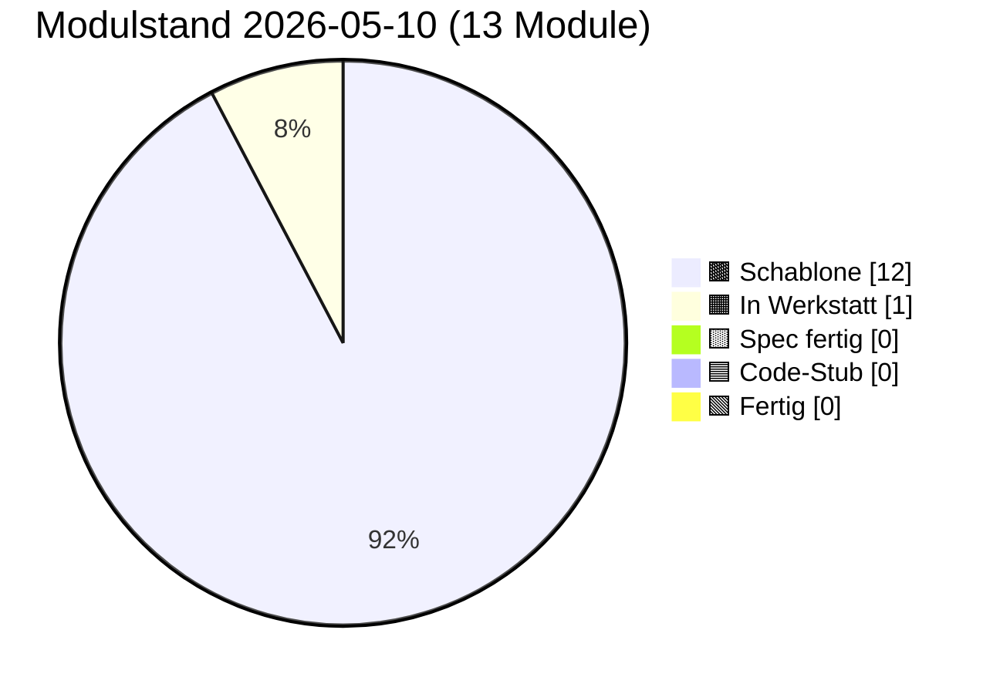

# PULS — lebender Status

**Format:** Jede Sitzung trägt unten einen Eintrag ein (neueste oben).
**Pflichtfelder pro Eintrag:** Datum · Sitzungs-Rolle · was getan · was offen · nächster sinnvoller Schritt.
**Begrenzung:** Diese Datei darf 400 Zeilen nicht überschreiten. Älteres ins
`docs/sessions/archiv/`-Verzeichnis als Übergabeprotokoll auslagern.

---

## Modulstand heute

Farb-Mapping verbindlich in [INTERFACES.md §5](INTERFACES.md). Live-Bau-Puls
auf der [Sage-Page](../index.html) (Karte "Bau-Puls").

## Als nächstes ✨

Module ohne offene Abhängigkeiten, bereit zum Anpacken:

- ✨ **[00 Doku-Fenster](components/00_doku_fenster.md)** — keine Abh., 5-Klick-UI in Endknoten
- ✨ **[01 Storage](components/01_storage.md)** — keine Abh., **Voraussetzung für 02, 05, 07, 12**
- ✨ **[03 Embedding](components/03_embedding.md)** — keine Abh., **Voraussetzung für 04**
- ✨ **[09 Einbau-PWA](components/09_einbau_pwa.md)** — keine Abh., reine Anleitung

In Arbeit (fortsetzen, nicht neu starten):

- 🟧 **[08 UI-Demo](components/08_ui_demo.md)** — Werkstatt-Stub vorhanden, Spec füllen

Empfehlung Hauptsitzung: zwei parallele Spec-Sitzungen 01 + 03 starten.
Sie blockieren am meisten Folgemodule.

---

## Schnellüberblick

| Modul | Spec | Code | Manueller Sichttest | Anmerkung |
|---|---|---|---|---|
| 00 doku_fenster | leere Schablone | — | — | "5-Klick versteckte Doku" in Suchleiste |
| 01 storage | leere Schablone | — | — | IndexedDB-Wrapper |
| 02 spore | leere Schablone | — | — | Ed25519-Identität |
| 03 embedding | leere Schablone | — | — | semantischer Vektor |
| 04 match | leere Schablone | — | — | Vektorvergleich |
| 05 anastomose | leere Schablone | — | — | Handshake |
| 06 heterokaryose | leere Schablone | — | — | Datenaustausch |
| 07 apoptose | leere Schablone | — | — | Selbstlöschung |
| 08 ui_demo | leere Schablone | — | — | Test-Oberfläche |
| 09 einbau_pwa | leere Schablone | — | — | Anleitung Rezeptbuch/Mixarium |
| 10 reputation | Stub (Schutz-Backlog) | — | — | Knoten-Reputation, Priorität niedrig |
| 11 rate_limit | Stub (Schutz-Backlog) | — | — | Rate-Limit & TTL, Priorität niedrig |
| 12 blocklist | Stub (Schutz-Backlog) | — | — | manuelle Sperrliste, Priorität niedrig |

Statuscodes: `—` (nichts) · `Schablone` · `Stub` · `Entwurf` · `Review` · `stabil` · `eingebaut`

## Endknoten (externe Repos des Betreibers)

| App | Domain | Domäne | SBKIM-Stand |
|---|---|---|---|
| Rezeptbuch | (TBD) | Kochrezepte | nicht integriert |
| Mixarium | (TBD) | Cocktails / Drinks | nicht integriert |

## Offene Querschnitts-Fragen

- Werden Domain-URLs der Endknoten-Apps in `docs/INTERFACES.md` aufgenommen
  oder nur lokal in deren `index.html`? → Entscheidung steht aus.
- Embedding-Modell: bleibt es bei Default `Xenova/multilingual-e5-small`?
  → ja, bis Gegenargument. Quelle: `sbkim_integration.md` §4.1.
- Speicherort der Spore bei GitHub Pages: `/.well-known/sbkim/spore.json`
  oder Alias `/sbkim/spore.json`? → siehe `docs/components/02_spore.md`
  und `docs/components/09_einbau_pwa.md`, sobald die geschrieben sind.
- **Wording-Diskrepanz**: `CLAUDE.md` führt SBKIM als
  "Semantisch-Biologisch Koordiniertes Inter-Knoten-Mycel" — das Paper
  (Kap. 1.2) führt es als "Semantisch-Empfangendes Bidirektionales
  KI-Matching". Das Observatorium (`index.html`, `status.json`) übernimmt
  die Paper-Variante. CLAUDE.md sollte in einer separaten Sitzung
  nachgezogen werden.

## Schutz-Backlog (aus Sage-Page Karte 13, 2026-05-10)

Drei strukturelle Lücken im Schutz-Modell sind beim Aufbau des
Observatoriums sichtbar geworden. Stubs sind angelegt; gezogen werden sie
ab spürbarem Wachstum:

- `docs/components/10_reputation.md` — Knoten-Reputation
- `docs/components/11_rate_limit.md` — Rate-Limit & TTL
- `docs/components/12_blocklist.md` — manuelle Blocklist

Eigenschutz-Karte der Sage-Page macht das Backlog für jeden Besucher
sichtbar und verlinkt direkt auf die Stubs.

---

## Sitzungs-Einträge

### 2026-05-10 · Hauptsitzung · Site-Echo + Bau-Puls + Brand-Icon

**Getan:**
- **Status-Farb-Mapping** als gemeinsame Quelle in `docs/INTERFACES.md` §5
  ergänzt: 5 Status (schablone/werkstatt/spec/stub/fertig) +
  Sonderzustand `nextup`. Reife-Gradient braun → orange → gelb → blau →
  grün; goldene Outline für `nextup`. Wird identisch in Markdown-Badges,
  Mermaid-`classDef`, PULS-Pie und Site-CSS-Variablen verwendet.
- **Alle 13 Komponenten-Karten** (`docs/components/00..12`) ans
  Site-Layout angeglichen: Hero-Block mit Status-Badge + Schicht +
  Site-Karten-Anker, Bio-Metapher-Block ("Im Mycel-Bild"),
  Visualisierung pro Modul (Mermaid für 00, 01, 03, 05, 06, 08, 09, 11,
  12 · Inline-SVG für 02, 04, 07, 10), Querverweise-Footer mit
  Abhängigkeiten/genutzt-von/Site-Karte/Glossar/Paper/Verwandt.
  Bestehender Inhalt bleibt erhalten, nur Strukturwechsel.
- **`docs/ARCHITEKTUR.md`** um neuen §0 Bau-DAG erweitert: Mermaid-
  Flowchart der Modul-Abhängigkeiten mit `classDef` pro Status, goldene
  Outline für `next-up`. Bestehende ASCII-Diagramme bleiben.
- **`docs/PULS.md`** um Pie-Chart "Modulstand heute" + "Als nächstes ✨"-
  Liste oben erweitert. Pie ist Mermaid-`pie showData`. Liste der
  next-up-Module (00, 01, 03, 09 + 08 in Werkstatt) verlinkt direkt auf
  die Komponenten-Karten.
- **Brand-Icon `assets/icon.svg`** angelegt: Steinpilz weiß auf
  hellgrün → dunkelgrün Verlauf, schwarzer Schlagschatten (Word-Style)
  via SVG-`feDropShadow` für 3D-Wirkung. Single-File, kein PNG-Fallback
  (Konverter fehlten in der Sitzung; SVG-Favicon wird von allen modernen
  Browsern unterstützt).
- **Sage-Page `index.html`** erweitert:
  1. Favicon-Links im `<head>` (SVG + Apple-Touch).
  2. Brand-Icon (36×36) in der Topbar neben "SAGE·OBSERVATORIUM".
  3. CSS-Variablen `--status-*` aus dem Mapping (gemeinsame Quelle).
  4. Neue Karte 14 "Bau-Puls" zwischen Eigenschutz und Pulse-Footer:
     Bento-Grid mit allen 13 Modulen, Status-Farbe als linker Balken,
     pulsierender Glow um next-up-Karten, Pie-Chart-Donut mit Legende,
     Klick öffnet jeweilige `docs/components/NN_*.md`.
  5. JS: `renderBauPuls(s)` + `isNextUp(m, byId)` + `STATUS_META` +
     `SLUG_MAP`. Eingehängt in den bestehenden `renderAll()`-Pfad,
     liest dieselbe `status.json` wie der Rest der Page.
- **Verifikation lokal:** Python-Server, `curl` auf `/`, `/status.json`,
  `/assets/icon.svg`, drei Markdown-Pfade → alle HTTP 200. JS-Syntax mit
  `node --check` grün. Alle 38 vom JS gesuchten DOM-IDs im HTML
  vorhanden. next-up-Logik in Python gegen `status.json` simuliert →
  liefert 00, 01, 03, 08, 09 wie erwartet.

**Offen:**
- **`favicon.ico`-Bitmap-Fallback** nicht erzeugt (kein ImageMagick /
  rsvg-convert / Inkscape im Sitzungs-Image). Moderne Browser nutzen
  ohnehin SVG-Favicon; ältere Browser zeigen ein Default-Icon. Bei
  Bedarf separat nachziehen via Online-Konverter oder einer Sitzung mit
  installiertem Konverter.
- **GLOSSAR.md** noch nicht alle neuen Begriffe enthält (z.B.
  "Atemkreis", "Werkstatt", "Hop-TTL", "Override"). Die Querverweis-
  Footer der Komponenten-Karten linken auf Glossar-Anker, die teilweise
  noch zu ergänzen sind. Reine Doku-Aufgabe für eine Spec-Sitzung.
- **PULS-Pie-Chart** muss bei Status-Wechseln manuell mit-aktualisiert
  werden — Mermaid kann `status.json` nicht lesen. Pflichtteil der
  Sitzung, die einen Status ändert (steht ohnehin im Pflicht-Workflow).

**Nächster sinnvoller Schritt:**
- Visuelle Sichtprüfung der Sage-Page durch Klaus im Browser:
  Favicon im Tab? Brand-Icon in der Topbar? Bau-Puls-Karte rendert?
  Goldenes Pulsieren auf 00/01/03/08/09? Klicks öffnen die richtigen
  Markdown-Dateien? Mobile-Layout passt?
- Spec-Sitzung **Modul 01 (Storage)** starten — die meiste Folge-
  Blockade. Parallel **Modul 03 (Embedding)** Spec-Sitzung — unabhängig.
- GLOSSAR.md in einer eigenen kleinen Sitzung um die fehlenden Anker
  vervollständigen.

---

### 2026-05-10 · Hauptsitzung · Sage·Observatorium (Landing Page)

**Getan:**
- `index.html` (Single-File, 14 Karten + 4 Detail-Screens) als Sage·
  Observatorium gebaut. Hybrid-Layout: Bento-Hauptscreen + Detail-Tour
  für Lebenszyklus, Modul-Detail, Datenquelle.
- Visuelles System: Glass-Cards, Drift-Orbs, Score-Ring mit Count-Up,
  Sonar-Pulses am Hub, Particle-Streams Indigo/Gold/Teal, Space Grotesk
  + Space Mono via Google Fonts. `prefers-reduced-motion` respektiert.
- 14 Karten: Hero · Demo-Anteil-Ring · Lebenszyklus · Module (10+3) ·
  Schichten-Bars · Endknoten · Datenquelle · Glossar · Schläfer-Modus ·
  Andocken (Live-Generator) · Wanderung (Mechanik) · Initialstart
  (Cold-Start) · Eigenschutz (Penicillin-Schicht) · Pulse-Footer.
- Andock-Karte 10 mit Live-Generator: Repo-URL/Domain/Knotentyp →
  generiert valide `spore.json` + GitHub-PR-Vorlinker (`quick_pull`-URL,
  vor-ausgefüllter Diff für `status.json`). 3-Klicks-Pfad, kein Backend.
- `status.json` erweitert um `nodeTypes`-Score-Mapping
  (schablone/werkstatt/spec/stub/fertig → 0/3/5/7/10), `scoreModel`,
  `schutzBacklog[]` für die drei Schutz-Module 10-12. `fullName` auf
  Paper-Variante korrigiert.
- `.nojekyll` angelegt (verhindert Jekyll-Build von GitHub Pages).
- Drei Schutz-Backlog-Stubs unter `docs/components/10_reputation.md`,
  `11_rate_limit.md`, `12_blocklist.md` mit Zweck, offenen Fragen,
  Abhängigkeiten und Anker zur Eigenschutz-Karte.
- PULS.md erweitert: drei neue Tabellenzeilen 10/11/12, Schutz-Backlog-
  Block im Querschnitts-Fragen-Bereich, Wording-Diskrepanz vermerkt.

**Offen:**
- CLAUDE.md Modul-Tabelle muss von 00-09 auf 00-12 erweitert werden
  (transparenter Eigen-Commit, "acht Module"-Widerspruch im Text fixen).
- Wording-Diskrepanz CLAUDE.md ↔ Paper bleibt offen (siehe oben).
- Modul 02 (Spore) muss später Krypto-Schema liefern, dann wandert die
  unsignierte Spore aus der Andock-Karte zur signierten Variante. Bis
  dahin: Disclaimer "provisorisch unsigniert" auf der Karte.
- Modul 05 (Anastomose) wird die manuelle PR-Mechanik in der Andock-
  Karte später ersetzen. Bis dahin: 3-Klicks-Pfad bleibt der Standard.

**Nächster sinnvoller Schritt:**
- Spec-Sitzung Modul 01 (Storage) starten — IndexedDB-Wrapper ist
  Voraussetzung für 02, 05, 07, 12.
- Parallel Spec-Sitzung Modul 03 (Embedding) — unabhängig.

**Nachzug 2026-05-10:**
- Eigenschutz-Karte 13 von 4 auf 6 Sektionen erweitert: zusätzlich
  **Vermächtnis-Markierung** (Paper Kap. 16, signiertes Vermächtnis +
  Quorum aus §17) und **Strukturelle Schutzschicht** (Paper §1.4 — kein
  Angreifer-Anreiz, "Mycel frisst nur totes Mycel").
- Stubs Modul 10 (Reputation) und Modul 12 (Blocklist) angepasst: der
  biologische Hauptmechanismus liegt in Modul 07 (Vermächtnis) +
  Heterokaryose-Quorum. Die Stubs sind nicht "der Mechanismus", sondern
  formal-quantitative bzw. manuelle Override-Ergänzungen. Lücken sind
  dadurch kleiner als zunächst angenommen.

---

### 2026-05-10 · Hauptsitzung · Skelett-Anlage

**Getan:**
- Repo-Skelett angelegt: `CLAUDE.md`, `docs/`, `src/`, `tests/`.
- Memory-Schicht aufgesetzt: `PULS.md`, `ARCHITEKTUR.md`, `INTERFACES.md`,
  `GLOSSAR.md`.
- Zehn Komponenten-Karten als leere Schablonen unter `docs/components/`
  angelegt (00 bis 09).
- `BRIEFING_TEMPLATE.md` für Bausitzungen erstellt.
- `tests/manual_check.html` als Stub angelegt.
- Festgelegt: Sage-Protokol ist Spezifikations-/Bau-Hub, nicht Endknoten.
  Endknoten sind Rezeptbuch und Mixarium.
- Festgelegt: Knotentyp aller Endknoten zunächst `hybrid`.
- Festgelegt: PULS.md wird von jeder Sitzung am Ende verpflichtend gepflegt.

**Offen:**
- Alle zehn Komponenten-Karten sind leer. Jede braucht eine Spec-Sitzung
  (kurz, ~20 Min) bevor eine Bau-Sitzung sie umsetzen kann.
- `INTERFACES.md` enthält nur Versionsfeld und Schablone, keine
  Modul-Verträge.

**Nächster sinnvoller Schritt:**
- Eine **Spec-Sitzung für Modul 01 (Storage)** und eine **Spec-Sitzung
  für Modul 03 (Embedding)** parallel starten — die beiden sind
  unabhängig voneinander. Briefing-Vorlage: `docs/sessions/BRIEFING_TEMPLATE.md`.
- Danach Spec-Sitzung Modul 02 (Spore), die auf Storage aufsetzt.
