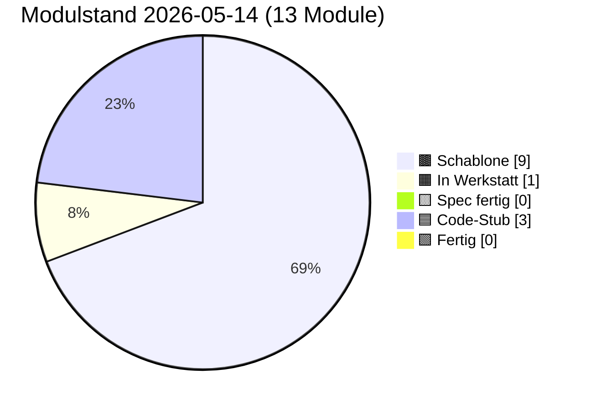

# PULS — lebender Status

**Format:** Jede Sitzung trägt unten einen Eintrag ein (neueste oben).
**Pflichtfelder pro Eintrag:** Datum · Sitzungs-Rolle · was getan · was offen · nächster sinnvoller Schritt.
**Begrenzung:** Diese Datei darf 400 Zeilen nicht überschreiten. Älteres ins
`docs/sessions/archiv/`-Verzeichnis als Übergabeprotokoll auslagern.

---

## Modulstand heute

<!-- Pie-Block ab hier wird automatisch aus status.json generiert.
     Nicht von Hand bearbeiten. Erzeugen mit:
     python3 scripts/update_puls_pie.py
     Aufruf-Pflicht: nach jeder status.json-Änderung. Siehe CLAUDE.md. -->

Farb-Mapping verbindlich in [INTERFACES.md §5](INTERFACES.md). Live-Bau-Puls
auf der [Sage-Page](../index.html) (Karte "Bau-Puls").

## Als nächstes ✨

Module mit Code-Stub, brauchen Sichttest im Browser:

- 🟦 **[01 Storage](components/01_storage.md)** — Code 2026-05-14, Sichttest steht aus (Klaus klickt in `tests/manual_check.html`)
- 🟦 **[03 Embedding](components/03_embedding.md)** — Code 2026-05-14, Sichttest steht aus (Modell-Download beim ersten Klick, dauert 5–15 s)
- 🟦 **[04 Match](components/04_match.md)** — Spec + Code 2026-05-14, Sichttest steht aus (sechs Knöpfe in Panel 04, hängt am 03-Modell-Cache)

Module ohne offene Abhängigkeiten, Spec noch ausstehend:

- ✨ **[00 Doku-Fenster](components/00_doku_fenster.md)** — keine Abh., 5-Klick-UI in Endknoten
- ✨ **[09 Einbau-PWA](components/09_einbau_pwa.md)** — keine Abh., reine Anleitung

In Arbeit (fortsetzen, nicht neu starten):

- 🟧 **[08 UI-Demo](components/08_ui_demo.md)** — Werkstatt-Stub vorhanden, Spec füllen

Empfehlung Hauptsitzung: Klaus klickt 01 + 03 + 04 im Browser durch
(`tests/manual_check.html`). Danach **Spec-Sitzung Modul 02 Spore**
(blockiert sonst 05 Anastomose) oder **Spec-Sitzung Modul 05
Anastomose** (alle Vorbedingungen außer 02 stehen als Stub). Parallel
anbietbar: Spec-Sitzung Modul 00 (Doku-Fenster) oder Modul 09
(Einbau-PWA) — beide ohne Abhängigkeiten.

---

## Schnellüberblick

| Modul | Spec | Code | Manueller Sichttest | Anmerkung |
|---|---|---|---|---|
| 00 doku_fenster | leere Schablone | — | — | "5-Klick versteckte Doku" in Suchleiste |
| 01 storage | Spec fertig (2026-05-14) | Code-Stub (2026-05-14) | ungeprüft (Bau-Sitzung headless) | IndexedDB-Wrapper |
| 02 spore | leere Schablone | — | — | Ed25519-Identität |
| 03 embedding | Spec fertig (2026-05-14) | Code-Stub (2026-05-14) | ungeprüft (Bau-Sitzung headless) | semantischer Vektor |
| 04 match | Spec fertig (2026-05-14) | Code-Stub (2026-05-14) | ungeprüft (Sitzung headless) | Vektorvergleich, modus-frei |
| 05 anastomose | leere Schablone | — | — | Handshake |
| 06 heterokaryose | leere Schablone | — | — | Datenaustausch |
| 07 apoptose | leere Schablone | — | — | Selbstlöschung |
| 08 ui_demo | leere Schablone | — | — | Test-Oberfläche |
| 09 einbau_pwa | leere Schablone | — | — | Anleitung Rezeptbuch/Mixarium |
| 10 reputation | Stub (Schutz-Backlog) | — | — | Knoten-Reputation, Priorität niedrig |
| 11 rate_limit | Stub (Schutz-Backlog) | — | — | Rate-Limit & TTL, Priorität niedrig |
| 12 blocklist | Stub (Schutz-Backlog) | — | — | manuelle Sperrliste, Priorität niedrig |

Statuscodes: `—` (nichts) · `Schablone` · `Stub` · `Entwurf` · `Review` · `stabil` · `eingebaut`

## Endknoten (externe Repos des Betreibers)

| App | Domain | Domäne | SBKIM-Stand |
|---|---|---|---|
| Rezeptbuch | (TBD) | Kochrezepte | nicht integriert |
| Mixarium | (TBD) | Cocktails / Drinks | nicht integriert |

## Offene Querschnitts-Fragen

- Werden Domain-URLs der Endknoten-Apps in `docs/INTERFACES.md` aufgenommen
  oder nur lokal in deren `index.html`? → Entscheidung steht aus.
- Embedding-Modell: bleibt es bei Default `Xenova/multilingual-e5-small`?
  → ja, bis Gegenargument. Quelle: `sbkim_integration.md` §4.1.
- Speicherort der Spore bei GitHub Pages: `/.well-known/sbkim/spore.json`
  oder Alias `/sbkim/spore.json`? → siehe `docs/components/02_spore.md`
  und `docs/components/09_einbau_pwa.md`, sobald die geschrieben sind.
- **Wording-Diskrepanz**: `CLAUDE.md` führt SBKIM als
  "Semantisch-Biologisch Koordiniertes Inter-Knoten-Mycel" — das Paper
  (Kap. 1.2) führt es als "Semantisch-Empfangendes Bidirektionales
  KI-Matching". Das Observatorium (`index.html`, `status.json`) übernimmt
  die Paper-Variante. CLAUDE.md sollte in einer separaten Sitzung
  nachgezogen werden.
- ~~**A1–B3-Notations-Überlappung Sage ↔ Mixarium**~~ — **gelöst
  2026-05-14 in Spec+Bau-Sitzung Modul 04.** Die Synthese „Hops tragen
  die Funktionen" steht jetzt verbindlich in
  [`docs/components/04_match.md` § A1–B3-Synthese](components/04_match.md):
  Pfad A = Curator → Auditor → Devil's Advocate (Anbieter-Seite
  verfeinert die Antwort); Pfad B = Interviewer → Matcher → Critic
  (Anfrage-Seite verfeinert die Frage), mit Apoptose bei B4 im
  Negativ-Fall. Sage zeigt die *Geometrie* der Hop-Position, Mixarium
  zeigt die *Rolle* — beide Notationen bleiben gültig, sie beschreiben
  dieselbe Wanderung aus zwei Winkeln. Kein eigenes Mapping-Dokument
  nötig.

## Schutz-Backlog (aus Sage-Page Karte 13, 2026-05-10)

Drei strukturelle Lücken im Schutz-Modell sind beim Aufbau des
Observatoriums sichtbar geworden. Stubs sind angelegt; gezogen werden sie
ab spürbarem Wachstum:

- `docs/components/10_reputation.md` — Knoten-Reputation
- `docs/components/11_rate_limit.md` — Rate-Limit & TTL
- `docs/components/12_blocklist.md` — manuelle Blocklist

Eigenschutz-Karte der Sage-Page macht das Backlog für jeden Besucher
sichtbar und verlinkt direkt auf die Stubs.

---

## Sitzungs-Einträge

### 2026-05-14 · Spec+Bau-Sitzung · Modul 04 Match (Spec + Code-Stub)

**Getan:**
- **Komponenten-Karte 04 (Match) vollständig gefüllt** (statt der alten
  Site-Echo-Skizze mit `matchAgainstDomain`/`getDomainVector`): API
  reduziert auf zwei öffentliche Funktionen + eine Konstante —
  `match(queryVec, passageVec) → number` (modus-frei, Skalarprodukt
  zweier L2-normalisierter Float32Array(384)) und
  `isAboveProviderThreshold(score) → boolean`. Konstante
  `PROVIDER_MIN_MATCH = 0.55` aus INTERFACES.md §0 wird nur
  weitergespiegelt, nicht neu definiert.
- **Domänen-Vektor-Verwaltung explizit gestrichen** — sie gehört in
  den Andock-Schritt (Modul 02 Spore / Modul 09 Einbau-PWA), nicht in
  Modul 04. Match nimmt zwei beliebige Vektoren entgegen und ist
  zustandslos.
- **A1–B3-Notations-Synthese in Karte 04 § A1–B3-Synthese gelöst:**
  „Die Hops tragen die Funktionen" — Pfad A = Curator → Auditor →
  Devil's Advocate (Anbieter-Seite verfeinert die Antwort), Pfad B =
  Interviewer → Matcher → Critic (Anfrage-Seite verfeinert die Frage),
  bei B4 Apoptose. Sage zeigt die *Geometrie* der Hop-Position,
  Mixarium zeigt die *Rolle*. Modul 04 sitzt an Position 2 in beiden
  Pfaden. Querschnitts-Frage in PULS oben als gelöst gestrichen
  (Strikethrough + Verweis), kein eigenes Mapping-Dokument nötig.
- **`src/modules/04_match.js` geschrieben:** IIFE wie 01, klassisches
  `<script>`-Tag, `window.SbkimMatch`. Selbstcheck synchron beim Skript-
  Laden (kein async Init):
  `console.info("MODUL 04 MATCH bereit, Funktionen: match/isAboveProviderThreshold, Schwelle: PROVIDER_MIN_MATCH=0.55")`.
  Zwei benannte Error-Typen: `InvalidVectorError` (kein
  `Float32Array`) und `ShapeMismatchError` (Länge ≠ 384 oder Längen-
  Differenz). Norm-Prüfung im Hot-Path bewusst weggelassen (Vertrauen
  auf Modul 03, jeder zusätzliche `Math.sqrt` würde in Schleifen
  bremsen).
- **`tests/manual_check.html` Panel 04 von „noch nicht gebaut" auf
  „Code-Stub"** gestellt. Sechs echte Knöpfe via `SbkimUI.addButton`:
  *Ähnlich Käsekuchen/Käsetorte (> 0.70)* · *Fern Käsekuchen/Auspuffrohr
  (< 0.40)* · *Schwelle positiv (Hefeteig vs. Kochrezepte)* · *Schwelle
  negativ (Tarantino vs. Kochrezepte)* · *Form-Fehler ShapeMismatchError*
  · *Selbstcheck Konsole prüfen*. Voraussetzung: Modul 03 wird beim
  ersten Klick mitgeladen.
- **`INTERFACES.md` Modul 04 auf Status `entwurf`** gesetzt, volle
  Vertrag-Sektion mit Signaturen, Fehlerverhalten und Garantien für
  Modul 05/07. Änderungsprotokoll fortgeschrieben.
- **`status.json`: Modul 04 auf `score: "stub"`.** Pie via
  `scripts/update_puls_pie.py` regeneriert
  (Schablone 9 / Werkstatt 1 / Spec 0 / Stub 3).
- **JS-Syntax mit `node --check` validiert** (grün). Im Browser noch
  nicht geklickt — Sitzung headless.
- **Karte 04 Bauzustand-Tabelle** mit Zeilen *Spec gefüllt* + *Code
  geschrieben* + *Sichttest (ungeprüft, weil Sitzung headless — Klaus
  klickt im Browser)* ergänzt. Hero-Badge auf 🟦 Code-Stub.

**Offen:**
- **Sichttest im Browser** durch Klaus: `tests/manual_check.html`
  öffnen, sechs Knöpfe in Panel 04 klicken. Erwartungen:
  Käsekuchen/Käsetorte > 0.70 (semantisch nah, vermutlich 0.80–0.90),
  Käsekuchen/Auspuffrohr < 0.40 (semantisch fern), positiver Schwelle-
  Test über 0.55, negativer unter 0.55, Form-Fehler liefert
  `ShapeMismatchError`. Konsolen-Selbstcheck beim Laden prüfen.
- **Sichttest 01 + 03** ebenfalls weiter offen (kommt im selben
  Browser-Klick-Durchlauf wie 04, weil 04-Panels Modul 03 mit-laden).

**Nächster sinnvoller Schritt:**
- Klaus klickt 01, 03 und 04 im Browser durch und trägt die Sichttest-
  Zeilen in den drei Karten nach.
- Danach: **Spec-Sitzung Modul 02 Spore** (blockiert sonst 05
  Anastomose und 07 Apoptose) oder **Spec-Sitzung Modul 05 Anastomose**
  (drei von vier Vorbedingungen — 01, 03, 04 — stehen als Stub; nur 02
  fehlt). Parallel anbietbar: Spec-Sitzung Modul 00 (Doku-Fenster) oder
  Modul 09 (Einbau-PWA) — beide ohne Abhängigkeiten.

---

### 2026-05-14 · Bau-Sitzung · Modul 03 Embedding (Code-Stub)

**Getan:**
- `src/modules/03_embedding.js` geschrieben: IIFE-Modul wie 01,
  klassisches `<script>`-Tag. Exportiert `window.SbkimEmbedding` mit
  den sechs Funktionen aus der Spec
  (`init/isReady/embedQuery/embedPassage/embedQueryBatch/embedPassageBatch`).
  **Kein** `mode`-Parameter — der e5-Rollen-Prefix
  (`"query: "` / `"passage: "`) wird intern angewandt.
- **Modell-Lade-Strategie:** dynamischer `await import(...)` aus dem
  CDN `https://cdn.jsdelivr.net/npm/@xenova/transformers@2.17.2`.
  Version explizit fixiert, damit das Verhalten reproduzierbar bleibt.
  `pipeline("feature-extraction", "Xenova/multilingual-e5-small")`
  läuft via WebAssembly im Browser. Erster Lauf braucht Internet
  (~30 MB), spätere Sitzungen laufen aus dem Browser-Cache.
- **L2-Norm-Garantie:** Pipeline mit
  `{ pooling: "mean", normalize: true }` aufgerufen — die zurückgegebenen
  Vektoren sind bereits L2-normalisiert. Modul 04 kann Cosinus als
  reines Skalarprodukt rechnen.
- **Lazy-Init:** wenn `embedQuery`/`embedPassage` vor `init()` aufgerufen
  wird, ruft das Modul intern `init()` auf.
- **Truncate-Erkennung:** `pipe.tokenizer(prefixedText)` wird vor jedem
  Embed-Call ausgewertet, `input_ids.dims[1] > 512` triggert
  `console.warn("MODUL 03 EMBEDDING: Eingabe > 512 Tokens, abgeschnitten")`
  einmalig pro Sitzung. Bei Tokenizer-Surface-Änderung in
  transformers.js-Updates fällt der Check still aus (best-effort,
  Trunkation bleibt durch die Pipeline garantiert).
- **Drei benannte Error-Typen** wie in der Spec:
  `ModelLoadError` / `EmbeddingError` / `EmptyInputError`. Bei
  `ModelLoadError` wird `pipePromise` zurückgesetzt, damit ein Retry
  möglich ist.
- **Selbstcheck nach `init()`:**
  `console.info("MODUL 03 EMBEDDING bereit, Funktionen: init/isReady/embedQuery/embedPassage/embedQueryBatch/embedPassageBatch, Modell: Xenova/multilingual-e5-small, Dim: 384")`.
  Nicht beim Skript-Laden (das wäre eine unehrliche Bereit-Meldung
  wegen des asynchronen Modell-Downloads).
- `tests/manual_check.html`: Panel 03 von „Spec fertig" auf „Code-Stub"
  gestellt. Fünf echte Knöpfe registriert:
  *Embedding init* / *Embedding round-trip* / *Vergleich Query vs.
  Passage* / *Batch (2 Inhalte)* / *Selbstcheck Konsole prüfen*.
  Vorbereitende Stub-Handler-Schleife entfernt (jetzt ohne Funktion,
  weil keine `data-stub`-Knöpfe mehr existieren).
- JS-Syntax mit `node --check` validiert (grün). Im Browser noch
  nicht geklickt — Sitzung headless, Modell-Download braucht
  Browser-Netz.
- Karte 03 Bauzustand-Zeilen *Code geschrieben* + *Sichttest
  (ungeprüft, weil ...)* ergänzt. Hero-Badge auf 🟦 Code-Stub.
- `INTERFACES.md` Modul 03 auf `Status: entwurf`. Änderungsprotokoll
  fortgeschrieben.
- `status.json`: 03 auf `score: "stub"`. Pie via
  `scripts/update_puls_pie.py` regeneriert
  (Schablone 10 / Werkstatt 1 / Spec 0 / Stub 2).

**Offen:**
- **Sichttest im Browser** durch Klaus: `tests/manual_check.html`
  öffnen, fünf Knöpfe in Panel 03 klicken (Modell-Download dauert
  beim ersten Mal). Konsolen-Selbstcheck nach `init` prüfen. Cosinus
  zwischen Query- und Passage-Variante desselben Texts sollte
  zwischen 0.85 und 0.95 liegen, zwischen „Käsekuchen" und
  „Auspuffrohr" deutlich darunter.
- **Bau-Sitzung Modul 01 Sichttest** ebenfalls offen — gleiche
  Sitzungs-Klick-Liste für Klaus.

**Nächster sinnvoller Schritt:**
- Klaus klickt 01 und 03 im Browser durch und trägt die Sichttest-
  Zeilen in den Karten nach.
- Danach: **Spec-Sitzung Modul 04 Match** starten (`match(queryVec,
  passageVec)`, A1–B3-Notations-Synthese als zweite Aufgabe der
  Sitzung — siehe Querschnitts-Fragen oben).
- Parallel anbietbar: Spec-Sitzung Modul 09 (Einbau-PWA).

---

### 2026-05-14 · Bau-Sitzung · Modul 01 Storage (Code-Stub)

**Getan:**
- `src/modules/01_storage.js` geschrieben: IIFE, klassisches Skript-Tag
  (kein ESM-Import — PWA-Single-File-Style). Exportiert
  `window.SbkimStorage` mit allen sieben Funktionen aus der Spec
  (`init/getStore/get/put/del/all/clear`). Promise-basiert. Selbstcheck
  `console.info("MODUL 01 STORAGE bereit, Funktionen: ...")` wird beim
  Skript-Laden emittiert (synchron, vor `init`).
- Fünf benannte Error-Typen implementiert wie in der Spec
  (`StorageUnavailableError`, `UnknownStoreError`, `QuotaExceededError`,
  `DataCloneError`, `StorageOpenError`) mit deutschsprachigen Messages.
- Versionsmigration `applyMigration(db, v)` additiv aufgebaut: für
  `v=1` werden alle sechs Stores angelegt, künftige Versionen ergänzen
  case-by-case. Niemals `deleteObjectStore` ohne Spec-Update.
- `tests/manual_check.html`: Panel 01 von „Spec fertig, Code ausstehend"
  auf „Code-Stub" gestellt, Stub-Knöpfe ersetzt durch echte
  `SbkimUI.addButton`-Aufrufe mit vier Knöpfen:
  *Storage init* / *Storage round-trip* / *Unknown Store (Fehler
  erwartet)* / *Selbstcheck Konsole prüfen*.
- JS-Syntax mit `node --check` validiert (grün). Im Browser noch nicht
  geklickt — Sitzung headless. Sichttest steht Klaus aus.
- Karte 01 Bauzustand-Zeilen *Code geschrieben* + *Sichttest
  (ungeprüft, weil ...)* ergänzt. Hero-Badge auf 🟦 Code-Stub.
- `INTERFACES.md` Modul 01 auf `Status: entwurf`. Änderungsprotokoll
  fortgeschrieben.
- `status.json`: 01 auf `score: "stub"`. Pie via
  `scripts/update_puls_pie.py` regeneriert
  (Schablone 10 / Werkstatt 1 / Spec 1 / Stub 1).

**Offen:**
- **Sichttest im Browser** durch Klaus: `tests/manual_check.html`
  öffnen, vier Knöpfe in Panel 01 klicken, DevTools → Application →
  IndexedDB prüfen (DB `sbkim` mit sechs Stores), Konsolen-Selbstcheck
  prüfen. Ergebnis in die Bauzustand-Tabelle der Karte 01 nachtragen.
- **Bau-Sitzung Modul 03** folgt direkt im Anschluss in derselben
  Klaus-Sitzung.

**Nächster sinnvoller Schritt:**
- Bau-Sitzung Modul 03 starten (jetzt in dieser Sitzung).
- Danach: Klaus klickt 01 und 03 im Browser durch, trägt die
  Sichttest-Zeilen in den Karten nach.

---

### 2026-05-14 · Spec-Sitzung · Modul 01 Storage + Modul 03 Embedding

**Getan:**
- **Komponenten-Karte 01 (Storage) gefüllt:** API mit sieben Funktionen
  (`init/getStore/get/put/del/all/clear`), verbindliche Stores-Tabelle
  (sechs Stores mit Schlüsseltyp + Wert-Form + Schreiber/Leser),
  Versionsmigrations-Regel (additiv, `DB_VERSION` hochziehen pro
  Spec-Änderung), Fehlertabelle mit fünf benannten Error-Typen,
  Selbstcheck-Format. Plan-offene Frage „Suchhistorie / Embedding-Cache"
  bewusst negativ entschieden (personenbezogen → CLAUDE.md-Verbot;
  `transformers.js` cached selbst).
- **Komponenten-Karte 03 (Embedding) gefüllt:** Vier Embed-Funktionen
  (`embedQuery`, `embedPassage`, `embedQueryBatch`, `embedPassageBatch`)
  + `init` + `isReady`, **kein** `mode`-Parameter (e5-Prefix-Drift per
  API-Design ausgeschlossen). L2-Norm-Garantie gegen Modul 04 dokumentiert
  (Cosinus = Skalarprodukt). Truncate-Strategie: still abschneiden auf
  512 Tokens mit einmaligem `console.warn` pro Sitzung. Selbstcheck nach
  erfolgreichem `init()` (nicht beim Skript-Laden).
- **INTERFACES.md — erstmals Vertrag-Sektionen gefüllt:** Modul 01 und
  Modul 03 stehen jetzt mit vollen Signaturen, Stores, Events,
  Selbstcheck und Fehlerverhalten dort. Änderungsprotokoll fortgeschrieben.
  Status beider Module auf `spec`.
- **status.json:** 01 und 03 auf `spec`. `lastUpdated` auf 2026-05-14.
  `python3 scripts/update_puls_pie.py` lief, Pie regeneriert
  (Schablone 10 / Werkstatt 1 / Spec 2).
- **`docs/WEGWEISER.md` neu angelegt** (aus Plan-Brief Punkt 8):
  Einstiegs-Anleitung mit neun nummerierten Checkbox-Schritten,
  Mini-Glossar in einfacher Sprache, Stand-Block am Ende. Erster Stand-
  Eintrag von dieser Sitzung.
- **`tests/manual_check.html` erweitert:** Stub-Knöpfe für Panel 01
  (init / round-trip / Selbstcheck) und Panel 03 (init / round-trip /
  Vergleich Query vs. Passage / Selbstcheck) mit minimalem Hinweis-
  Handler. Bau-Sitzung ersetzt die Handler durch echte Aufrufe.
- **PULS.md angepasst:** „Als nächstes ✨" auf Bau-Sitzungen für 01 + 03
  umgestellt, Schnellüberblicks-Tabelle für 01 und 03 auf „Spec fertig",
  neuer Sitzungs-Eintrag (dieser).

**Offen:**
- **Bau-Sitzung 01** und **Bau-Sitzung 03** stehen aus. Können parallel
  laufen (unabhängig, jede Sitzung kennt nur ihre Karte).
- **Spec-Sitzung Modul 09 (Einbau-PWA)** weiterhin als parallel
  anbietbare dritte Sitzung empfohlen — dependenz-frei.
- **A1–B3-Synthese** als Querschnitts-Frage bleibt ungeklärt, Auflösung
  in Spec-Sitzung Modul 04 (siehe Querschnitts-Fragen oben).
- **Glossar-Anker:** WEGWEISER hat ein Mini-Glossar in einfacher
  Sprache; das Voll-Glossar (`docs/GLOSSAR.md`) braucht laut Site-Echo-
  Sitzung noch Ergänzungen (Atemkreis, Werkstatt, Hop-TTL, Override).
  Reine Doku-Aufgabe, eigene Sitzung.

**Nächster sinnvoller Schritt:**
- **Bau-Sitzung Modul 01** starten (`src/modules/01_storage.js`,
  Knopf-Handler in `manual_check.html` ersetzen, Selbstcheck-`console.info`
  beim Skript-Laden, manueller Sichttest).
- Parallel **Bau-Sitzung Modul 03** (`src/modules/03_embedding.js`,
  Lazy-Init, L2-Norm, Selbstcheck-`console.info` nach `init`).
- Parallel anbietbar: **Spec-Sitzung Modul 09 Einbau-PWA**.

---

### 2026-05-14 · Plan-Sitzung · Spec-Brief 01 Storage + 03 Embedding

**Getan:**
- **Recherche A1–B3-Notation:** Sage-Landingpage Karte 11 „Wanderung"
  (`index.html` Z. 2741–2819) verwendet A1/A2/A3 + B1/B2/B3/B4 als
  Hop-Stationen in zwei Such-Pfaden. Mixarium-`SBKIM_AGENTS.md` benutzt
  dieselben Buchstaben für Agenten-Rollen (Curator/Auditor/Devil's
  Advocate · Interviewer/Matcher/Critic). Notation kongruent, Bedeutung
  unterschiedlich — Synthese als Querschnitts-Frage festgehalten,
  Lösung gehört in Spec-Sitzung Modul 04 Match.
- **Plan-File angelegt** unter `/root/.claude/plans/1-es-soll-sage-resilient-crane.md`
  (Claude-Code-Plan-Mode-File, außerhalb des Repos). Plan beschreibt
  Spec-Sitzung 01+03 als nächste Bausitzung mit 8 Liefer-Artefakten:
  Karten 01 + 03, INTERFACES.md, status.json, PULS, manual_check.html,
  Sitzungs-Archiv, **neue `docs/WEGWEISER.md`** (Einstiegs-Anleitung für
  neue Sitzungen mit Checkbox-Schritten + Stand-Block).
- **Entscheidung Modus-Drift (e5-Prefix):** Embedding-API wird in **vier**
  Funktionen aufgeteilt — `embedQuery` / `embedPassage` /
  `embedQueryBatch` / `embedPassageBatch`. Modul 04 Match bleibt
  modus-frei mit `match(queryVec, passageVec)`. Vergessen ist
  API-strukturell ausgeschlossen.
- **Entscheidung Selbstcheck:** beide Module emittieren beim ersten
  `init()`-Erfolg eine `console.info("MODUL XX … bereit, Funktionen: …")`-
  Meldung (Klaus-Notiz: Andocken-Verifikation in DevTools).
- **Empfehlung Modul 09 (Einbau-PWA)** als parallel anbietbare Spec-
  Sitzung mit aufgenommen — 5-Schritte-Andock-Workflow ist dependenz-
  frei und blockiert sonst die Bau-Sitzungen.

**Offen:**
- Spec-Sitzung 01+03 noch nicht ausgeführt — diese Plan-Sitzung erstellt
  nur den Auftrag, nicht die Spec selbst (CLAUDE.md: Plan ≠ Bausitzung).
- A1–B3-Synthese ist als Querschnitts-Frage in PULS notiert, wartet auf
  Spec-Sitzung Modul 04.

**Nächster sinnvoller Schritt:**
- Frische **Spec-Sitzung 01 + 03** starten. Briefing aus dem Plan-File
  (Pfad oben), Format aus `docs/sessions/BRIEFING_TEMPLATE.md` §B.
  Alternativ zwei parallele Sitzungen, je eine pro Modul (Token-
  Sparsamkeit, CLAUDE.md-empfohlen).
- Parallel anbietbar: Spec-Sitzung Modul 09 Einbau-PWA.

---

### 2026-05-10 · Hauptsitzung · Site-Echo + Bau-Puls + Brand-Icon

**Getan:**
- **Status-Farb-Mapping** als gemeinsame Quelle in `docs/INTERFACES.md` §5
  ergänzt: 5 Status (schablone/werkstatt/spec/stub/fertig) +
  Sonderzustand `nextup`. Reife-Gradient braun → orange → gelb → blau →
  grün; goldene Outline für `nextup`. Wird identisch in Markdown-Badges,
  Mermaid-`classDef`, PULS-Pie und Site-CSS-Variablen verwendet.
- **Alle 13 Komponenten-Karten** (`docs/components/00..12`) ans
  Site-Layout angeglichen: Hero-Block mit Status-Badge + Schicht +
  Site-Karten-Anker, Bio-Metapher-Block ("Im Mycel-Bild"),
  Visualisierung pro Modul (Mermaid für 00, 01, 03, 05, 06, 08, 09, 11,
  12 · Inline-SVG für 02, 04, 07, 10), Querverweise-Footer mit
  Abhängigkeiten/genutzt-von/Site-Karte/Glossar/Paper/Verwandt.
  Bestehender Inhalt bleibt erhalten, nur Strukturwechsel.
- **`docs/ARCHITEKTUR.md`** um neuen §0 Bau-DAG erweitert: Mermaid-
  Flowchart der Modul-Abhängigkeiten mit `classDef` pro Status, goldene
  Outline für `next-up`. Bestehende ASCII-Diagramme bleiben.
- **`docs/PULS.md`** um Pie-Chart "Modulstand heute" + "Als nächstes ✨"-
  Liste oben erweitert. Pie ist Mermaid-`pie showData`. Liste der
  next-up-Module (00, 01, 03, 09 + 08 in Werkstatt) verlinkt direkt auf
  die Komponenten-Karten.
- **Brand-Icon `assets/icon.svg`** angelegt: Steinpilz weiß auf
  hellgrün → dunkelgrün Verlauf, schwarzer Schlagschatten (Word-Style)
  via SVG-`feDropShadow` für 3D-Wirkung. Single-File, kein PNG-Fallback
  (Konverter fehlten in der Sitzung; SVG-Favicon wird von allen modernen
  Browsern unterstützt).
- **Sage-Page `index.html`** erweitert:
  1. Favicon-Links im `<head>` (SVG + Apple-Touch).
  2. Brand-Icon (36×36) in der Topbar neben "SAGE·OBSERVATORIUM".
  3. CSS-Variablen `--status-*` aus dem Mapping (gemeinsame Quelle).
  4. Neue Karte 14 "Bau-Puls" zwischen Eigenschutz und Pulse-Footer:
     Bento-Grid mit allen 13 Modulen, Status-Farbe als linker Balken,
     pulsierender Glow um next-up-Karten, Pie-Chart-Donut mit Legende,
     Klick öffnet jeweilige `docs/components/NN_*.md`.
  5. JS: `renderBauPuls(s)` + `isNextUp(m, byId)` + `STATUS_META` +
     `SLUG_MAP`. Eingehängt in den bestehenden `renderAll()`-Pfad,
     liest dieselbe `status.json` wie der Rest der Page.
- **Verifikation lokal:** Python-Server, `curl` auf `/`, `/status.json`,
  `/assets/icon.svg`, drei Markdown-Pfade → alle HTTP 200. JS-Syntax mit
  `node --check` grün. Alle 38 vom JS gesuchten DOM-IDs im HTML
  vorhanden. next-up-Logik in Python gegen `status.json` simuliert →
  liefert 00, 01, 03, 08, 09 wie erwartet.

**Offen:**
- **`favicon.ico`-Bitmap-Fallback** nicht erzeugt (kein ImageMagick /
  rsvg-convert / Inkscape im Sitzungs-Image). Moderne Browser nutzen
  ohnehin SVG-Favicon; ältere Browser zeigen ein Default-Icon. Bei
  Bedarf separat nachziehen via Online-Konverter oder einer Sitzung mit
  installiertem Konverter.
- **GLOSSAR.md** noch nicht alle neuen Begriffe enthält (z.B.
  "Atemkreis", "Werkstatt", "Hop-TTL", "Override"). Die Querverweis-
  Footer der Komponenten-Karten linken auf Glossar-Anker, die teilweise
  noch zu ergänzen sind. Reine Doku-Aufgabe für eine Spec-Sitzung.
- **PULS-Pie-Chart** muss bei Status-Wechseln manuell mit-aktualisiert
  werden — Mermaid kann `status.json` nicht lesen. Pflichtteil der
  Sitzung, die einen Status ändert (steht ohnehin im Pflicht-Workflow).

**Nächster sinnvoller Schritt:**
- Visuelle Sichtprüfung der Sage-Page durch Klaus im Browser:
  Favicon im Tab? Brand-Icon in der Topbar? Bau-Puls-Karte rendert?
  Goldenes Pulsieren auf 00/01/03/08/09? Klicks öffnen die richtigen
  Markdown-Dateien? Mobile-Layout passt?
- Spec-Sitzung **Modul 01 (Storage)** starten — die meiste Folge-
  Blockade. Parallel **Modul 03 (Embedding)** Spec-Sitzung — unabhängig.
- GLOSSAR.md in einer eigenen kleinen Sitzung um die fehlenden Anker
  vervollständigen.

---

### 2026-05-10 · Hauptsitzung · Sage·Observatorium (Landing Page)

**Getan:**
- `index.html` (Single-File, 14 Karten + 4 Detail-Screens) als Sage·
  Observatorium gebaut. Hybrid-Layout: Bento-Hauptscreen + Detail-Tour
  für Lebenszyklus, Modul-Detail, Datenquelle.
- Visuelles System: Glass-Cards, Drift-Orbs, Score-Ring mit Count-Up,
  Sonar-Pulses am Hub, Particle-Streams Indigo/Gold/Teal, Space Grotesk
  + Space Mono via Google Fonts. `prefers-reduced-motion` respektiert.
- 14 Karten: Hero · Demo-Anteil-Ring · Lebenszyklus · Module (10+3) ·
  Schichten-Bars · Endknoten · Datenquelle · Glossar · Schläfer-Modus ·
  Andocken (Live-Generator) · Wanderung (Mechanik) · Initialstart
  (Cold-Start) · Eigenschutz (Penicillin-Schicht) · Pulse-Footer.
- Andock-Karte 10 mit Live-Generator: Repo-URL/Domain/Knotentyp →
  generiert valide `spore.json` + GitHub-PR-Vorlinker (`quick_pull`-URL,
  vor-ausgefüllter Diff für `status.json`). 3-Klicks-Pfad, kein Backend.
- `status.json` erweitert um `nodeTypes`-Score-Mapping
  (schablone/werkstatt/spec/stub/fertig → 0/3/5/7/10), `scoreModel`,
  `schutzBacklog[]` für die drei Schutz-Module 10-12. `fullName` auf
  Paper-Variante korrigiert.
- `.nojekyll` angelegt (verhindert Jekyll-Build von GitHub Pages).
- Drei Schutz-Backlog-Stubs unter `docs/components/10_reputation.md`,
  `11_rate_limit.md`, `12_blocklist.md` mit Zweck, offenen Fragen,
  Abhängigkeiten und Anker zur Eigenschutz-Karte.
- PULS.md erweitert: drei neue Tabellenzeilen 10/11/12, Schutz-Backlog-
  Block im Querschnitts-Fragen-Bereich, Wording-Diskrepanz vermerkt.

**Offen:**
- CLAUDE.md Modul-Tabelle muss von 00-09 auf 00-12 erweitert werden
  (transparenter Eigen-Commit, "acht Module"-Widerspruch im Text fixen).
- Wording-Diskrepanz CLAUDE.md ↔ Paper bleibt offen (siehe oben).
- Modul 02 (Spore) muss später Krypto-Schema liefern, dann wandert die
  unsignierte Spore aus der Andock-Karte zur signierten Variante. Bis
  dahin: Disclaimer "provisorisch unsigniert" auf der Karte.
- Modul 05 (Anastomose) wird die manuelle PR-Mechanik in der Andock-
  Karte später ersetzen. Bis dahin: 3-Klicks-Pfad bleibt der Standard.

**Nächster sinnvoller Schritt:**
- Spec-Sitzung Modul 01 (Storage) starten — IndexedDB-Wrapper ist
  Voraussetzung für 02, 05, 07, 12.
- Parallel Spec-Sitzung Modul 03 (Embedding) — unabhängig.

**Nachzug 2026-05-10:**
- Eigenschutz-Karte 13 von 4 auf 6 Sektionen erweitert: zusätzlich
  **Vermächtnis-Markierung** (Paper Kap. 16, signiertes Vermächtnis +
  Quorum aus §17) und **Strukturelle Schutzschicht** (Paper §1.4 — kein
  Angreifer-Anreiz, "Mycel frisst nur totes Mycel").
- Stubs Modul 10 (Reputation) und Modul 12 (Blocklist) angepasst: der
  biologische Hauptmechanismus liegt in Modul 07 (Vermächtnis) +
  Heterokaryose-Quorum. Die Stubs sind nicht "der Mechanismus", sondern
  formal-quantitative bzw. manuelle Override-Ergänzungen. Lücken sind
  dadurch kleiner als zunächst angenommen.

---

### 2026-05-10 · Hauptsitzung · Skelett-Anlage

**Getan:**
- Repo-Skelett angelegt: `CLAUDE.md`, `docs/`, `src/`, `tests/`.
- Memory-Schicht aufgesetzt: `PULS.md`, `ARCHITEKTUR.md`, `INTERFACES.md`,
  `GLOSSAR.md`.
- Zehn Komponenten-Karten als leere Schablonen unter `docs/components/`
  angelegt (00 bis 09).
- `BRIEFING_TEMPLATE.md` für Bausitzungen erstellt.
- `tests/manual_check.html` als Stub angelegt.
- Festgelegt: Sage-Protokol ist Spezifikations-/Bau-Hub, nicht Endknoten.
  Endknoten sind Rezeptbuch und Mixarium.
- Festgelegt: Knotentyp aller Endknoten zunächst `hybrid`.
- Festgelegt: PULS.md wird von jeder Sitzung am Ende verpflichtend gepflegt.

**Offen:**
- Alle zehn Komponenten-Karten sind leer. Jede braucht eine Spec-Sitzung
  (kurz, ~20 Min) bevor eine Bau-Sitzung sie umsetzen kann.
- `INTERFACES.md` enthält nur Versionsfeld und Schablone, keine
  Modul-Verträge.

**Nächster sinnvoller Schritt:**
- Eine **Spec-Sitzung für Modul 01 (Storage)** und eine **Spec-Sitzung
  für Modul 03 (Embedding)** parallel starten — die beiden sind
  unabhängig voneinander. Briefing-Vorlage: `docs/sessions/BRIEFING_TEMPLATE.md`.
- Danach Spec-Sitzung Modul 02 (Spore), die auf Storage aufsetzt.
