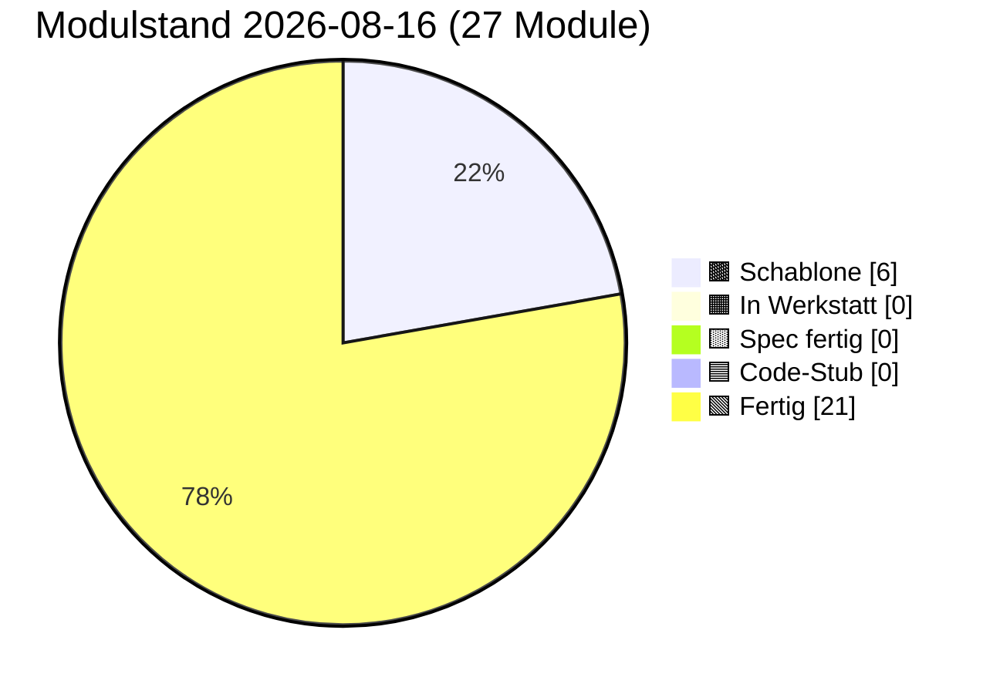

# PULS — lebender Status

**Format:** Jede Sitzung trägt unten einen Eintrag ein (neueste oben).
**Pflichtfelder pro Eintrag:** Datum · Sitzungs-Rolle · was getan · was offen · nächster sinnvoller Schritt.
**Begrenzung:** Diese Datei darf 3000 Zeilen nicht überschreiten. Älteres ins
`docs/sessions/archiv/`-Verzeichnis als Übergabeprotokoll auslagern.
**Schutz-Klausel (2026-05-17):** Die 3000-Zeilen-Grenze wurde bewusst hochgesetzt
(vorher 400) — Pflege-Sitzungen werden umfangreicher dokumentiert, weil
Architekturfunde und Diagnose-Routinen Platz brauchen. **Diese Grenze NICHT
wieder herabsetzen, auch nicht zum Token-Sparen.** Wenn 3000 Zeilen nahen,
auslagern statt kürzen.

---

## Modulstand heute

<!-- Pie-Block ab hier wird automatisch aus status.json generiert.
     Nicht von Hand bearbeiten. Erzeugen mit:
     python3 scripts/update_puls_pie.py
     Aufruf-Pflicht: nach jeder status.json-Änderung. Siehe CLAUDE.md. -->


Farb-Mapping verbindlich in [INTERFACES.md §5](INTERFACES.md). Live-Bau-Puls
auf der [Sage-Page](../index.html) (Karte "Bau-Puls").

## Stand 2026-08-16 (Bau) — 🔒 Das Siegel prüft jetzt auch den Raum (Modul 05b)

**Klaus' Wort:** *„ja, 05b ins Siegel aufnehmen"*.

**Der Anlass war ein Widerspruch, kein Fehler im Code.** Das Netz-Fenster von
Alis Moderaum meldete auf Klaus' Tablet „✗ Raum-Lesen fehlgeschlagen: Kein
Nostr-Relais-Client (Modul 05b) verfügbar" — **und das Siegel leuchtete
trotzdem**. Es prüfte sieben Module; der gemeinsame Raum war keines davon. Ein
Siegel, das goldenes Vertrauen zeigt, während der Knoten den Raum gar nicht
lesen kann, sagt die Unwahrheit. Genau davor soll die Anti-Greenwashing-Klausel
(Karte 16) schützen — sie griff nicht, weil die **Liste** unvollständig war,
nicht weil die Prüfung schwach war.

**Der Einwand dagegen — und warum er nicht trug.** Diese Sitzung hatte Klaus
zuerst gewarnt, die Aufnahme lasse anderswo Siegel *erlöschen*. Klaus fragte
nach („Wie soll denn das gehen?"). Nachgemessen über **alle 22 Knoten-Repos**:
jeder lädt 05b. Die Warnung war eine Vermutung, keine Messung. Die Aufnahme
löscht nirgends ein Siegel — sie verhindert nur, dass eines leuchtet, wo der
Raum tot ist.

**Getan:**
- `src/modules/16_siegel.js` — `PFLICHT_MODULE` hat **acht** Einträge. Geprüft
  wird `subscribe`, nicht `publish`: daran hängt das **Lesen** des Raums; wer
  nur senden kann, nimmt nicht teil. Kanon-sha `3e17f6474fc7`.
- Ein `ZERTIFIKAT_ASPEKTE`-Eintrag dokumentiert es im Modal
  (Ehrlichkeits-Kopplung: Code und Aspekt zusammen, nie einzeln).
- Vertrag zuerst: `INTERFACES.md` §1 Modul 16, dann Karte 16, `CLAUDE.md`,
  `docs/PFLICHT_MODULE.md`, `docs/MYCEL-GESCHENKBOX.md`,
  `tests/smoke_bauvorlagen.mjs` (acht statt sieben) und die Stufe-2-Bauvorlage.
- **Netzweiter Rollout: 21/21 Kopien tragen den Kanon** (gegen `origin/main`
  geprüft, nicht gegen den lokalen Klon). Dazu 13 sha-Pins nachgezogen und in
  **zehn** Repos die `CACHE_VERSION` erhöht — ohne die liefert der
  Service-Worker die alte Fassung weiter, und die Änderung erreicht das Tablet
  nie.

**Neu: `tests/smoke_bau16_pflicht_05b.mjs`.** Die zweite Hälfte ist der Punkt —
sie baut die Umgebung **ohne** Relais-Client und verlangt, dass das Siegel dann
ausbleibt. Ohne sie liefe die Probe genauso grün, wenn 05b gar nicht in der
Liste stünde.

**Ein Fehler dieser Sitzung, den er gefangen hat:** der neue Aspekt trug zuerst
die Feldnamen `moduleId`/`title` statt `module`/`aspect`. Gültiges JavaScript,
`node --check` zufrieden — und das Modal hätte einen **leeren** Eintrag gezeigt:
eine Sicherheits-Änderung, die sich selbst dokumentiert, mit unsichtbarer
Dokumentation. Gefunden hat das nicht eine Probe, sondern das **Lesen des
Diffs** (Rollout-Rezept Schritt 2). Ab jetzt eine Probe; beide Fehler wurden
gegengeprobt und werfen sie um.

**Proben:** `node tests/run_alle.mjs` → **74 grün, 0 rot, 0 nicht lauffähig**;
Gegenprobe Bauvorlagen 7/7. Zwei Repos melden rot aus vorbestehenden Gründen
(Privat-Brain: `playwright-core` fehlt; SB-KIMTool-Point: `fake-indexeddb`
fehlt) — beides auf blankem `origin/main` gegengeprüft, identische Zahlen.

**Offen:** Klaus' Browser-Sichttest. Headless beweist die Logik, nicht das
Abzeichen auf der Seite — und genau dieses Abzeichen war das Problem.

## Stand 2026-08-16 (Pflege) — ⚖️ Urheberschaft und Rechte, netzweit geklärt

**Klaus' Frage:** in den USA habe ein „Vibecoder" einen Prozess verloren und alle
Rechte an seinen Apps eingebüßt, weil Anthropic per Wasserzeichen die Urheberschaft
nachgewiesen habe. Sorge dahinter: dass eines Tages Ansprüche oder Geldforderungen an
seinen 33 Repos hängen.

**Befund (Web-Recherche 2026-08-16).** Den Prozess gibt es nicht. Drei echte
Nachrichten sind zu einer falschen Geschichte verschmolzen: (1) Claude setzt seit dem
2026-08-02 wirklich Wasserzeichen — als **Transparenz-Pflicht** nach Art. 50 EU-KI-VO,
die *Verarbeitung* belegt, nicht Urheberschaft, und bei Code bewusst schwächer ist.
(2) Der 1,5-Mrd.-Vergleich hatte Anthropic als **Beklagte** wegen Trainingsdaten.
(3) Rein maschinell erzeugtes Material ist nicht schutzfähig (§ 2 Abs. 2 / § 69a UrhG;
Thaler v. Perlmutter) — wer damit klagt, kann verlieren, aber weil **niemand** Rechte
hat, nicht weil ein Anbieter sie hätte. Anthropics Bedingungen treten die Rechte an den
Ausgaben ausdrücklich an den Kunden ab; es gibt keine Beteiligungs-Klausel.

**Die echte Lücke war eine andere:** von 33 Repos hatte **eines** eine Lizenzdatei
(Mein-WorkFloh). Die menschliche Prägung — Architektur, Verträge, Auswahl der Module,
Kalibrier-Messreihen, Brief-Kette, Git-Historie — war überall vorhanden, aber nirgends
als Rechte-Aussage formuliert.

**Getan:**
- **`docs/URHEBERSCHAFT_UND_RECHTE.md`** angelegt — kanonische Fassung für alle Repos:
  Faktencheck mit Quellen, Einordnung der Wasserzeichen, Anbieter-Bedingungen, deutsche
  Rechtslage, was trägt und was ehrlicherweise nicht, Marken-Zeiger, Geld-Frage,
  Beweissicherung. Ehrlich vermerkt: `anthropic.com` war aus dieser Umgebung nicht
  abrufbar, geprüft wurde über Fachberichterstattung.
- **Zwei Lizenzen** eingeführt (Klaus' Entscheid): **A · Protokoll-Lizenz** offen mit
  Namensnennung für Sage-Protokol, SB-KIMTool-Point, mycel-karte — das Protokoll *soll*
  nachgebaut werden können; **B · App-Lizenz** nach dem Muster der bestehenden
  `Mein-WorkFloh/LICENSE` für die übrigen Repos.
- **`LICENSE` + `RECHTE.md` in alle Repos** ausgerollt; die kurze `RECHTE.md` verweist
  auf die kanonische Fassung hier, damit nicht 33 Kopien gepflegt werden müssen.
- **Mit-Bauer-Klarstellung** in `docs/einladung/einladung.md` (alle vier Sprachen),
  `docs/einladung/index.html`, `CLAUDE.md` § Schicht 3 und
  `docs/components/_vision_einladung.md`: der Begriff bleibt inhaltlich unangetastet,
  ein Satz stellt klar, dass er eine Würdigung ist und keine Aussage über Urheberschaft.

**Offen / nächster sinnvoller Schritt:** Klaus sollte einmal selbst in die
Anbieter-Bedingungen sehen und eine datierte Kopie ablegen (Abschnitt 9, letzter Punkt).
Markenanmeldung erst bei Stufe 2 des Marktplatzes zu entscheiden.

---

## Stand 2026-08-16 (Bau) — 🍄 Vier Marktplatz-Apps werden Endknoten

**Klaus' Auftrag:** die im PWA-Toolpoint eingetragenen Apps ins eigene Mycel
aufnehmen, „nach dem Bauplan aus Sage" — mit dem **Flying Widget** und dem
**selbstausfüllenden Siegel**, und dabei *immer erst die aktuellste Fassung
suchen, notfalls Sage nachziehen*. Auf Rückfrage: „die vorhandene ist gemeint,
bau damit."

**Der Abgleich zuerst** (alle 33 Repos, nach Inhalt, mit Fingerabdruck +
Datum): Sage trägt bei **beiden** Werkzeugen den neuesten Stand
(`23_rendezvous_ui.js` `b496bc86…`, `16_siegel.js` `95003d20…` vom 15.08.).
Klaus' Bedingung trifft also nicht zu — Sage musste nicht nachgezogen werden.
Das ist ein **Messergebnis, keine Eigenschaft von Sage**; beim nächsten Mal
wieder messen.

**Gebaut und gemergt (4 Repos, 6 PRs):** Alis Moderaum (`#39`+`#40`, trägt
zwei Marktplatz-Einträge) · Perfect Skin Fashion (`#15`+`#16`) · Perfect Skin
Beauty (`#43`, eigene Domain) · Muster Werbetechnik (`#7`, die „Internetseite").
Je 13 Kanon-Module byte-1:1, App-eigener Klebstoff (eigene Schublade, eigenes
Wizard-Präfix, graviertes Wappen-Band), Kette in der **Leerlaufpause** statt im
kritischen Pfad (die Messwerte dieser Seiten stehen öffentlich im Marktplatz),
Reihenfolge verdrahtet **und bewacht** (17 vor 15/16 — sonst hängen Lampe und
Siegel lautlos ins Leere).

**Was die Wächter gefangen haben** — und ohne die durchgerutscht wäre:
1. Die Sicherungsdatei hätte in allen vier weiter `kimboard-backup-….json`
   geheißen (sichtbar erst, wenn man sie ein halbes Jahr später sucht).
2. Bei Perfect Skin Beauty war die Prüfung „läuft die Seite noch?" **blind**:
   sie suchte das *Wort* `script.js`, das dort fünfmal in Kommentaren steht.
   Geschärft, und in den zwei früher gebauten Repos nachgezogen — **eine
   Prüfung, die zufällig recht hat, ist keine Prüfung.**
3. Ein doppelt maskierter Punkt im Generator (`effects\\.js` statt
   `effects\.js`) machte eine Prüfung dauerhaft rot.
4. Perfect Skin Beauty läuft unter eigener Domain — ohne Eintrag hätte der
   Wächter **die eigene Seite** abgewiesen. Jetzt drin, mit und ohne `www.`

**🚫 Küchenzettel wurde bewusst NICHT gebaut.** Es sieht aus wie eine
Rezept-App, ist im Code aber eine **Tarn-Hülle** („App-Hopping schlägt
App-Verbote", „Tarnung gegen ein echtes Regime"). Ein sichtbares Netz-Fenster
plus Siegel plus Karten-Link wäre das Gegenteil dessen, wofür sie gebaut wurde.
Klaus überließ die Entscheidung der Sitzung; entschieden wurde: nichts
anfassen. Volle Begründung + der schonende Weg, falls es doch soll:
[`BRIEF_MYCEL_AUFNAHME_TOOLPOINT_APPS.md`](sessions/BRIEF_MYCEL_AUFNAHME_TOOLPOINT_APPS.md)
§ A.1.

**Ehrlich zum Stand:** die vier sind **andock-bereit, noch nicht im Mycel**.
Die lebende Identität entsteht im Browser pro Adresse — eine Sitzung kann sie
nicht erzeugen. Sie entsteht, wenn Klaus in jeder App einmal den Wizard im
Siegel drückt. Erst danach gibt es eine echte `nodeId` für `status.json` und
die Mycel-Karte.

**Offen:** Klaus' Andock-Lauf (4×) · die B-Liste des Briefes (11 zurückhängende
Siegel-Kopien, 5 zurückhängende Widget-Kopien, darunter **Sages eigenes
`sbkim-bundle-voll/`** und PWA-Toolpoint) · `Kimseek` und `Privat-Brain` haben
ein Siegel **ohne Identitäts-Wechsler**.

## Stand 2026-08-16 (Pflege) — 📄 Papiere bereinigt zurück · ein Wächter, der wirklich hineinsieht

**Was Klaus wollte** (2026-08-15/16): der Name des Hauses, dem die alten
Konzeptpapiere einmal vorgelegt wurden, soll **überall** verschwinden — „auch aus
den PDFs", damit kein Eindruck einer Zusammenarbeit entsteht und keine Abmahnung
droht. Danach: „ja, hol die Papiere bereinigt zurück." Die Form hat Klaus selbst
vereinfacht: an der Stelle des Namens **drei Punkte**.

**Gemacht (PR `#863` entfernt, PR `#864` zurückgeholt).** Die drei Papiere sind
**neu gesetzt**, nicht geschwärzt — eine Schwärzung im alten PDF ließe den Text
darunter stehen. HTML von Hand (Tabellen aus dem alten PDF rekonstruiert) +
`sbkim-demo/papiere/print.css` (nüchterner Bericht, **nicht** die Magazin-Optik
der Einladung) + `_pdf.mjs` nach dem Hausmuster aus `docs/einladung/_pdf.mjs`.
Über den Namen hinaus sind auch **Firmen-Domänen, Produkt- und Community-Namen**
heraus — mit „…" davor wären sie weiter identifizierbar gewesen, und Klaus' Ziel
war ausdrücklich „dass keine Rückschlüsse gezogen werden können". Jedes Papier
trägt oben einen **Einordnungs-Kasten**: Zeitdokument von damals, was eingelöst
wurde (das Matching läuft) und was **bewusst nicht** gebaut wurde (Lizenzserver,
Treuhand, Zertifizierungsstelle, Datenburggraben — siehe
[`PLAN_PILZ_WIRTSCHAFT.md`](PLAN_PILZ_WIRTSCHAFT.md)).

**Die eigentliche Lehre steckt im Wächter** (CLAUDE.md § „Die dritte Falle").
Zweimal war „im PDF steht nichts mehr" grün, ohne dass jemand hineingesehen
hatte: erst wurde die **Datei** statt des Inhalts durchsucht (PDF-Text ist
gepackt — `grep` findet dort grundsätzlich nichts; Klaus hat nachgefragt, dann
kamen **35 Treffer**), dann konnte der neue Leser die **Chromium**-PDFs nicht
lesen (Text als Glyph-Nummern eines Schrift-Ausschnitts). Deshalb prüft
`tests/smoke_papiere_bereinigt.mjs` **erst**, ob überall hineingesehen wurde
(kein Strom verschlossen, kein Zeichen unzuordenbar, genug Text), und **erst
dann** auf Fundstellen — zwei Lesarten *glatt*/*flach* gegen gebrochene und
gesperrt gesetzte Schreibweisen. `sbkim-demo/papiere/_pdf_text.mjs` geht den
vollen Weg Seite → Schrift → ToUnicode → Buchstaben. `tests/gegenprobe_papiere.mjs`
baut sieben Fehler ein, **zwei davon wirklich in ein neu gebautes PDF** — alle
sieben werden bemerkt.

**Nebenbei:** `hub.html` registrierte ein `./sw.js`, das es nie gab (404 bei
jedem Aufruf, stumm weggefangen). Entfernt, `aktualisieren.js` dort ergänzt.

**Proben:** 72 grün, 0 rot, 0 nicht lauffähig · Gegenprobe 7/7 · keine toten
Verweise · kein waagerechter Lauf (412 px / 1350 px) · 0 von 24 Tabellen laufen
im Druck über.

**Offen / nächster Schritt:**
- **Klaus' Browser-Lauf** an der Demo: öffnen sich die drei PDFs am Tablet, und
  treffen die Einordnungs-Kästen den richtigen Ton? (Nicht headless prüfbar.)
- `hub.html` lädt Schriften von **`fonts.googleapis.com`** — ein CDN, entgegen
  der Offline-Regel. Vorbestehend, hier bewusst **nicht** angefasst: ein
  Schriftwechsel ändert das Aussehen und gehört in eine eigene Entscheidung.

## Stand 2026-08-15 (Pflege) — 🧬 Modul-23-UI netzweit · Modul 15 aus BLP in den Kanon

Übergabeprotokoll:
`docs/sessions/archiv/2026-08-15_modul23-ui-netzweit-modul15-kanon.md`.

**Sieben Merges, vier Repos.** Die Modul-23-Oberfläche stand netzweit still: vier
Kopien hingen 150–780 Zeilen hinter dem Kanon. BookLedgerPro (`#302`), Kim-Bell
(`#42`), Mein-WorkFloh (`#170`), SB-KIMTool-Point (`#150`) — alle jetzt byte-1:1
auf `4882c3b6`. **Nachgezählt: es sind 16 Kopien im Netz, nicht vier**; die
anderen zwölf standen schon richtig, geprüft gegen `origin/main`, nicht gegen den
lokalen Klon.

### Der Fund, der die Sitzung gedreht hat

Beim Abgleich *aller* Kopien in BookLedgerPro trug **Modul 15 eine BLP-eigene
Buchhaltungs-Synonym-Karte** (`BLP_QUERY_SYNONYMS` + `queryWithInclusion`, seit
2026-07-11). Echte, nützliche Funktion — an der einen Stelle, die niemand ändern
darf. **Ein blindes byte-1:1-Nachziehen hätte sie gelöscht**, und niemand hätte es
gemerkt: die Cross-Knoten-Suche hätte einfach etwas weniger gefunden.

Statt sie zu überschreiben, ist sie **in den Kanon gewandert** (PR #852): neue
Option `queryInclusion` / `setQueryInclusion`, **Default aus** — wer nichts
einstellt, bekommt exakt den bisherigen Pfad. Die **Worte** stehen jetzt in BLPs
eigenem Klebstoff (`sbkim/sbkim-init.js`), wo die Domäne bekannt ist. Wer dort ein
Fachwort ergänzt, ändert kein Modul mehr.

Modul 16 trägt den Pflicht-Aspekt dazu — und der sagt ausdrücklich, dass dies
**keine** Schutz-Verbesserung ist. Ein Aspekt, der mehr behauptet als er leistet,
wäre genau das Greenwashing, das Karte 16 verbietet.

### Drei Repos hatten gar keinen Wächter für ihre Kopien

„Kopieren, nicht klonen" stand dort nur als Versprechen. Deshalb neu:
BookLedgerPro (15 Module genagelt) und SB-KIMTool-Point (18) haben jetzt einen
Drift-Guard mit Vollzähligkeits-Prüfung. Bei Point wiegt das am schwersten —
**Kim-Bell und Mein-WorkFloh nennen `SB-KIMTool-Point/web/tools/*` als Quelle
ihrer eigenen Kopien**, ein Drift dort wandert also weiter. Seine sechs offenen
Abweichungen sind im selben Zug zu (`#151`); keine trug Point-eigene Logik.

### Was offen bleibt

- **Modul 15 steht netzweit in fünf Generationen** — und das war schon vor dieser
  Sitzung so (`fbf9f42d` in acht Repos, dazu `33d6fe0c`, `0f8a3f69`, `92948a91`,
  `8a07567f`). Der Kanon-Sprung hat eine sechste obendrauf gesetzt, die
  Zersplitterung aber nicht verursacht. Ein eigener Rollout, kein Nebenbei.
- **Klaus' Browser-Sichttest** für alles aus dieser Sitzung.

---

## Stand 2026-08-14 (Pflege) — 🗂 PULS ausgelagert: 10.150 → 2.592 Zeilen

**Rolle:** Pflege-Sitzung auf Klaus' Zuruf „PULS.md auslagern". Die Schutz-Klausel
nennt 3000 Zeilen; die Datei stand bei **10.150** — sechs Sitzungen in Folge hatten
das gemeldet, ohne dass es jemand tat.

**Verfahren wie beim letzten Mal, nicht neu erfunden.** Die Mai-Auslagerung vom
2026-07-24 (Klaus' „Option A") hatte den nächsten Schritt sogar vorgezeichnet:
*„Juni könnte in einer Folge-Sitzung ebenso ausgelagert werden (wäre Option B)."*
Genau das ist hier passiert, nur zusätzlich für Juli und den älteren August.

| Archiv-Datei | Inhalt | Zeilen |
|---|---|---|
| `2026-08_puls-auslagerung.md` | Sitzungen 03.–09.08. | 2.290 |
| `2026-07_puls-auslagerung.md` | alle Juli-Sitzungen | 2.731 |
| `2026-06_puls-auslagerung.md` | alle Juni-Sitzungen | 2.608 |

**In PULS bleiben:** die acht jüngsten Sitzungen (14.08. bis 11.08.) und **alle**
Struktur-Sektionen — „Als nächstes", Schnellüberblick, Endknoten, Offene
Querschnitts-Fragen, Schutz-Backlog, Vision-Anker, Archiv-Index. An jeder der drei
Schnittstellen steht ein Zeiger, im Archiv-Index drei Sammel-Zeilen.

**Ausgelagert, NICHT gekürzt** — und das ist nachgerechnet, nicht behauptet:
von **360** Überschriften fehlt **keine**, keine ist erfunden, und von **8.472**
nicht-leeren Zeilen wird **keine einzige** vermisst. Alle **124** Archiv-Verweise
in PULS zeigen auf existierende Dateien. Der Mermaid-Pie-Block ist unberührt (er
wird aus `status.json` erzeugt und nie von Hand angefasst), die **3000er-Grenze
steht unverändert** — sie wurde ausdrücklich nicht herabgesetzt.

**Luft für die Zukunft:** 2.592 von 3.000 Zeilen, also gut 400 frei. Wer die
nächste Auslagerung braucht, nimmt wieder den ältesten Monat.

**Offen:** die vier Modul-23-UI-Kopien (je eine geprüfte Runde pro App) ·
Klaus' Browser-Sichttests.


## Stand 2026-08-14 (Pflege) — 🔓 Sperr-Knöpfe · Automatik-Schalter · drei tote Wächter

**Rolle:** Pflege-Sitzung, Fortsetzung nach PR #843. Übergabeprotokoll:
`docs/sessions/archiv/2026-08-14_sperr-knoepfe-automatik-tote-waechter.md`.

**✅ Klaus' Handgriff ist erledigt:** die neue `marktplatz-api.php` liegt auf
dem Hetzner-Webhosting. Belegt durch die Tat — Klaus schaltete den
Automatik-Schalter ein, der Server nahm `"an": true` an und committete
(Toolpoint `0adfb69`). Kein `bad_key`. Der Punkt stand seit dem 2026-08-12 offen.

**Fünf Merges:**

- **Toolpoint #62** — der Automatik-Schalter darf **benutzt** werden.
  `tests/smoke.mjs` verlangte `_automatik.an === false`; als Auslieferungs-Zustand
  richtig gedacht, aber die Probe läuft bei jedem Push. Beim ersten echten
  Gebrauch wurde `main` rot — und weil `statische-liste.yml` **vor** dem
  Committen prüft, kam der Schalter **nie auf der Seite an**. Ein Wächter, der
  sein eigenes Feature verhindert. Geprüft wird jetzt die **Form**, nicht der
  Anfangswert.
- **family #271** — **Sperr-Knöpfe** im Studio. Server und Datei konnten es
  längst; es fehlte allein die Bedienung. Übernommen, nicht abgeschrieben
  (family: `renderSporen`, `toast()`, `createElement`, de/en). **Vierter Ort**
  der Rangfolge `gruen 0 < nichts 1 < gelb 2 < rot 3`.
- **family #272** — der **Automatik-Schalter**, und zwar mit **drei** Stücken:
  family hatte weder `unterGrenze` noch eine Leistungs-Grenze. Nur das Häkchen
  wäre der tote Knopf gewesen. Gezählt wird der **angezeigte** Wert (sonst
  widerspräche das Band der Zahl daneben); das gerechnete Gelb wird **nie**
  gespeichert.
- **family #273** — **Fehler in der eigenen Arbeit**, gefunden beim Nachprüfen
  des nächtlichen Pfades: eine **fehlgeschlagene** Messung trägt die alten
  Zahlen weiter und zählte den Zähler jede Nacht erneut hoch. Nach drei
  Ausfällen der Leitung hätte ein Band an einer ungemessenen Seite gehangen.
  Der eigene Kommentar hatte davor gewarnt — der Text stimmte, der Code nicht.
- **Sage #847** — **drei** tote Wächter, nicht zwei. `bau23_0b` und
  `bau23c` starben beim Start (DOM-Ersatz überwachsen, und zwar
  **unterschiedlich** verrottet); `resign_spore_v02` meldete **sieben
  gefundene Fehler**, obwohl sie nichts prüfen konnte. **Ursache:** Sage hat 69
  Smokes und nichts, was sie zusammen laufen lässt → neu `tests/run_alle.mjs`
  mit **drei** Ergebnissen (grün · ROT · **nicht lauffähig**).

**Dreimal an einem Tag fand die Gegenprobe eine blinde Stelle in der EIGENEN
Probe** — jedes Mal echt: die Untergrenze des Riegels (greift nur gegen einen
Müll-Wert), die Objekt-Prüfung des Schalters (mein Test las nur, statt zu
schreiben), und eine Toolpoint-Gegenprobe, die eine abgeschaffte Regel bewachte.

**Zahlen:** Toolpoint 593/593 · 253 Wächter 0 blind · family
`smoke_studio_markt` 102 → **182** · neue `gegenprobe_studio_riegel.sh` 19
Wächter 0 blind · Sage `run_alle` 50 grün / **0 rot** / 19 nicht lauffähig, mit
`fake-indexeddb` gegengeprüft **69/69**.

**✅ Nachtrag am selben Tag — `package.json` gebaut (PR #849).** Klaus hat
zugestimmt; der Punkt stand oben noch als „Klaus gefragt, Antwort steht aus"
und wäre für die nächste Sitzung eine falsche Fährte gewesen. Ergebnis:
**70/70 grün** (die neue Wächter-Probe kommt dazu). Damit laufen die 19
Speicher-/Krypto-Härtungen wieder — Modul 01 („Löschen nur bei zweifelsfreier
Leere", Identitäts-Isolierung), 02 (Spore v0.2, Multi-Identität), 20 (Safe),
05 (Nostr).

Zwei Entscheidungen darin: **kein `"type": "module"`** — gemessen, mit dem Feld
fallen zwei Proben um, weil Node dann jede `.js` als ES-Modul liest; ein neuer
Wächter `tests/smoke_package_json.mjs` hält es fest (samt exakter Fassungs-
Nagelung, kein `^`). Und **`package-lock.json` bleibt in `.gitignore`** — eine
bestehende Entscheidung wird nicht still umgedreht; die exakte Nagelung liefert
die Reproduzierbarkeit ohnehin. `CLAUDE.md` § „Die Proben laufen lassen"
erklärt jetzt `npm install`/`npm test` und warum 19 Proben ohne das Paket
**ungeprüft** und nicht **rot** heißen.

**Offen:** die vier Modul-23-UI-Kopien · `PULS.md` bei ~10.100 gegen 3.000
Zeilen (**sechste** Meldung) · Klaus' Browser-Sichttests.

---

## Stand 2026-08-12 (Pflege) — 🔒 Modul-23-Kern netzweit geschlossen

**Rolle:** Pflege-Sitzung, Nachzug offener Punkte aus dem Brief „nach Modul 17".
Übergabeprotokoll:
`docs/sessions/archiv/2026-08-12_modul23-kern-netzweit-geschlossen.md`.

**Getan — vier Merges:**

- **Sage #842** — `sbkim-bundle-voll` Modul 15 + 16 byte-1:1 nachgezogen. Die
  Box stand vor der Pflege vom 2026-08-01 (15: 249 Zeilen fehlten, das
  Fremdzugriff-Protokoll; 16: der zugehörige Aspekt). **Beide mussten zusammen
  wandern** — der Siegel-Aspekt behauptet eine Fähigkeit, die als Code in
  Modul 15 liegt. Der sha-Pin im Smoke stand noch auf dem alten Wert und
  arbeitete damit **gegen** den byte-1:1-Wächter zwei Zeilen darüber. 46/46.
- **Kim-Bell #41 + Mein-WorkFloh #169** — Modul-23-**Kern** von `bbdf02a8`
  (zwei Generationen zurück) auf den Kanon `3caa0bb1`. Ihnen fehlte
  **Schutz-Plan Stufe 2b**: fremde Karten wurden **gar nicht auf Echtheit
  geprüft**, kein Mengen-Deckel gegen Flutung. Beim Rollout am 2026-07-30
  durchgerutscht, weil ihre Kopie `modules/sbkim-rendezvous.js` heißt statt
  `sbkim/23_rendezvous.js`.
- **PWA Toolpoint #36** — Modul-23-**UI** von `1f8b6c68` (dem *vorigen* Kanon)
  auf `4882c3b6`. Datei **und** Pin waren beide alt, der Guard also in sich
  stimmig und grün — er bewachte nur den falschen Stand. Bringt Klaus'
  Sprachwahl vom 2026-08-11 ins Netz-Panel.

**Ergebnis:** der **Modul-23-Kern läuft jetzt in allen 33 Repos auf dem
Kanon** — die Sicherheitslücke ist netzweit zu.

**Bewusst NICHT gemacht:** die **vier zurückliegenden UI-Kopien**
(Kim-Bell · Mein-WorkFloh · SB-KIMTool-Point je `f117096e` ~780 Zeilen;
BookLedgerPro `c67b2942` ~152 Zeilen). Die Sitzung vom 2026-08-12 hat sie
ausdrücklich zurückgestellt („eine eigene, geprüfte Runde pro App") — das
gilt weiter. **Ehrliche Folge:** in Kim-Bell + WorkFloh **prüft** der Kern
jetzt, aber `cardsVerified`/`rejected` werden noch nicht **angezeigt**, und
die Sprachwahl fehlt dort weiter.

**Drei Funde:**

1. Der Brief nannte **2** Repos — ein Scan **nach Inhalt statt Dateiname** fand
   **5**. Dieselbe Lehre wie im Modul-17-Rollout, sofort wiederholt.
2. Der neue Kern prüft **nur**, wenn Modul 02 `verifyForeignSpore` mitbringt.
   Vorher geprüft (beide Apps: ja). Ohne diese Kontrolle wäre ein
   Sicherheits-PR entstanden, der grün meldet und **nichts** bewirkt.
3. **Zwei tote Wächter in Sage** (vorbestehend, auf blankem `main`
   gegengeprüft): `smoke_bau23_0b_identitaet.mjs` +
   `smoke_bau23c_ki_richter.mjs` haben einen selbstgebauten DOM-Ersatz, den
   die Modul-23-UI überwachsen hat (`d.getElementById is not a function`).

**Umgebungs-Befund:** Sage hat **keine `package.json`**. Ohne
`fake-indexeddb` sind **19 Smokes falsch rot** — jede Sitzung im frischen
Container sieht das neu. Mit dem Paket: 67 von 69 grün.

**Offen:** die vier UI-Runden · die zwei toten Wächter · `package.json` ·
`PULS.md` bei ~10.000 gegen 3.000 Zeilen (auslagern, nicht kürzen — **fünfte**
Meldung) · Klaus' Browser-Sichttest (Modul 17 schmal + Sprachwahl Toolpoint) ·
`marktplatz-api.php` aufs Webhosting.

---

## Stand 2026-08-12 (Plan) — 🗂 Plan: fremde Apps auf den Marktplatz holen

**Rolle:** Plan-Sitzung, kein Bau. Auftrag:
`docs/sessions/BRIEF_PLAN_FREMDE_APPS_AUFNEHMEN.md`. Ergebnis:
**[`docs/PLAN_FREMDE_APPS.md`](PLAN_FREMDE_APPS.md)**. Übergabeprotokoll:
`docs/sessions/archiv/2026-08-12_plan-fremde-apps.md`.

**Der Befund, der den Plan verkürzt hat.** Der Auftrag ging davon aus, der
„sichtbare Weg raus" müsse erst gebaut werden. **Er steht bereits:** jede
Marktplatz-Karte trägt einen **„⚑ Melden"**-Knopf (`PWA-Toolpoint/assets/app.js`
Z. 851 ff.) — nativer Dialog, ohne Konto, ohne E-Mail, mit `eintrag_id` und
Bot-Falle. Ebenso steht `own:false` ⇒ `rel="nofollow ugc"` (`karte.js` Z. 299).
Es fehlt nur **ein fünfter Meldegrund**: „Das ist meine App."

**Der `img:`-Konflikt ist kleiner als gedacht.** Die Pflicht sitzt **allein im
Studio** (`studio.js` Z. 345 · 1005). Der Renderer kann es längst: ohne Bild
zeichnet `karte.js` Z. 308–311 ein **leeres Feld fester Größe** — kein kaputtes
Bild, kein Layout-Sprung — und `fundKandidaten()` schließt bildlose Einträge vom
„Fund der Woche" aus. Vorschlag: `img` **optional für `own:false`**, Pflicht für
eigene. **Kein neutraler Platzhalter** (wäre eine Behauptung über eine ungeprüfte
App); leer ist ehrlicher und ist zugleich der Anreiz, sich zu melden.

**Die vier Antworten:** **A** nur verlinken, nie hosten (kein Fall gefunden, in
dem Hosten mehr bringt; ohne Lizenzdatei gilt „alle Rechte vorbehalten", und
gehostete Messwerte wären Klaus' Hosting-Leistung, als fremde ausgewiesen) ·
**B** ja, nach B1/B2 · **C** GitHub-Issue statt Impressum-Mail (§7 UWG; ein
kostenloses Angebot bleibt geschäftlich; 50 Anschreiben sind 50 Gelegenheiten
für **eine** Abmahnung) — wortwörtlicher Text liegt im Papier · **D** siehe unten.

**✅ Klaus' Entscheidungen 2026-08-12** (AskUserQuestion, weil Frage D gegen
seine eigene Tafel §8d lief und **nicht** stillschweigend korrigiert wird):

1. **„Der Eintrag kostet nichts."** — nicht „die ersten hundert". Damit bleibt
   alles Stufe 1: keine Preisankündigung, kein Gewerbe nötig, kein Graubereich.
   Die Zahl hundert lebt weiter als **innere Messmarke**, steht aber nirgends.
2. **Erster Schub: fünf Apps, nicht fünfzig.** Danach werden vier Zahlen gezählt
   (antworten · bleiben · wollen raus · beschweren sich), **dann** erst wird über
   den großen Schub entschieden. Abbruch-Regel vorher festgelegt.

**Klaus' Nebenfrage — wie weit vom bezahlbaren Modell?** Mit den Zahlen aus §9
(Bedarf 2.000–3.000 €/Monat): ① **2–3 Partner** · ② **~100 Kunden** à 20 € ·
③ **400–500 Käufe/Monat** · ④ bei 50 €/Jahr **500 Anbieter**. Fünfzig Einträge
sind **ein Zehntel** von ④ — und ④ kommt laut Papier erst nach ③, das erst nach
① und ②. **Die Idee zahlt auf Reichweite ein, nicht auf Einkommen** — genau das
hat Klaus selbst als Ziel benannt. Heute steht **null Einnahme** irgendwo. Von
§15 blockieren **0b** (Rohertrag als Grundlage) und **5** (verfügbare Zeit) die
*schnellen* Wege ① und ② und kosten je einen Satz — sie liegen seit 2026-08-09.

**Ehrlich vermerkt:** §14 Punkt 7 sagt, der offene Markt komme „erst wenn 1–5
stehen". Toolpoint ist vorgezogen worden. Vertretbar (der Bau war eine Kopie,
§8b), aber es ist eine bewusste Abweichung und steht so im Papier statt still
zu bleiben. An §9 ändert sie nichts.

**Nicht getan (Tabu eingehalten):** kein Eintrag, keine E-Mail, kein Code.
B1/B2/B3 sind Vorschläge und brauchen einen eigenen Bau-Brief in `PWA-Toolpoint`.

---

## Stand 2026-08-12 — 📱 Modul 17: die Blase hing halb aus dem Bild. Netzweit behoben, 15 Repos

**Rolle:** Hauptsitzung. Auftrag: Klaus, „Modul siebzehn starten" — der Punkt aus
`BRIEF_NACH_SCHALTER.md` § Offen-Liste. PRs: Sage #839 · BookLedgerPro #301 ·
Jasons-Tresor #155 · Kimboard #94 · Kimseek #60 · Mein-Mixarium #188 ·
Mein-Rezeptbuch #372 · Mein-Tresor #103 · Muttis-Rezeptbuch #184 ·
Privat-Brain #74 · Tomys-Hub #152 · family-project #269 · Kim-Bell #40 ·
Mein-WorkFloh #168 · SB-KIMTool-Point #149. **Alle 15 gemergt.**

**Der Befund, selbst nachgemessen.** Die Pille hat keine Breiten-Grenze — sie ist
so breit wie ihr Inhalt. Weil sie rechts in der Ecke hängt, wächst sie nach
**links** aus dem Bild:

| Fenster | vorher | nachher |
|---|---|---|
| 320 px | 385 px — **81 px links abgeschnitten** | 227 px |
| 360 px | 385 px — **41 px links abgeschnitten** | 227 px |
| 412 px | 385 px, passt | 385 px, unverändert **mit** Wörtern |

**Klaus' Entscheid (AskUserQuestion, gegen zwei gemessene Alternativen).** Unter
400 px tragen die Lampen keine Wörter mehr; ab 400 px bleibt alles wie bisher
(Klaus' Wunsch 2026-05-25 „1:1 Sage-Page-Stil" gilt dort weiter). Verworfen:
zweizeilig umbrechen (66 statt 34 px hoch) und alles enger stellen (reicht für
360 px, bei 320 px ragt sie weiter 7 px hinaus).

**Zwei Fallen im Fix selbst.** `max-width` allein hilft nicht — die Slots sind
Flex-Kinder mit `min-width: auto` und schrumpfen nicht unter ihre Wortbreite; der
Inhalt quölle dann aus der Pille statt aus dem Bild. Und die Trefferfläche kommt
über das **Innenmaß** zurück, nicht über `min-width`: auf denselben Slots steht
im minimierten Zustand `max-width: 0`, damit sie hinter SIEGEL zusammenschieben —
ein `min-width` hielte sie auf. Darum `padding` und die `:not([data-minimized])`-
Klammer. Das Modul warnt an der Stelle selbst davor; der Kommentar war zu lesen.

**Die Lehre dieser Sitzung: die Messung gab zu früh Entwarnung.** Der erste
Messaufbau meldete **274 px** und damit „alles in Ordnung". Zwei Fehler steckten
darin, beide in der Messung, nicht im Modul: (1) der SIEGEL-Slot mountet nur,
wenn `SbkimSiegel.isCertified()` wirklich `true` liefert (Anti-Greenwashing,
Modul 17 prüft doppelt) — ohne Stub fehlten 111 px; (2) die Messseite setzte eine
eigene Grundschrift (14 px), während alle Maße im Modul `rem` sind — der Aufbau
maß sich selbst. Erst korrigiert kam Klaus' 385 px heraus. **Eine Prüfung, die
dir recht gibt, ist der Ort, an dem du am genauesten hinsehen musst** — hier war
es kein falsches Ergebnis, sondern ein falscher Aufbau.

**Verifikation.** `smoke_bau17_floating_widget.mjs` **40/40** (zwei neue Wächter
auf dem **erzeugten** CSS, nicht dem Quelltext). Vier Gegenproben, alle schlagen
an, keine blind: Grenze entfernt (38/40) · `padding`→`min-width` (39/40) ·
`:not([data-minimized])` entfernt (39/40) · Wörter bleiben (39/40). Neu:
`tools/widget-breite-messen.mjs` misst ein Modul in Reinform, ohne dass eine App
drumherum stehen muss — gegen die alte Fassung schlägt es an (Exit 1). Je Repo
die echte Suite gelaufen, alle grün.

**Sechs Service-Worker-Cache-Bumps mit dabei** (BookLedgerPro v218 · Kim-Bell v26
· Kimboard v52 · Kimseek v33 · Mein-WorkFloh v120 · Privat-Brain v49). Ohne sie
lieferte der Offline-Vorrat die alte Fassung weiter, und der Fix wäre am Tablet
unsichtbar geblieben — der Rollout hätte grün gemeldet und nichts bewirkt.

**Netzweite Verifikation: 15/15 tragen den Kanon `dd3e0d7fb596`, 0 Abweichung**,
keine alte sha mehr im Netz. Fünf sha-Pins nachgezogen (vier `test/smoke.test.js`,
ein `tools/drift-guard.mjs`) — der Brief nannte drei betroffene Apps, es waren
fünfzehn.

**Was offen bleibt.**
- **Klaus' Browser-Sichttest** der schmalen Ansicht — headless ersetzt ihn nicht.
- **Vorbestehender Befund, nicht von dieser Sitzung:**
  `sbkim-bundle-voll/modules/15_membran.js` + `16_siegel.js` sind vom Kanon
  abgedriftet (Pflege 2026-08-01 fehlt, 261 bzw. 6 Zeilen). Gegenprobe auf blankem
  `origin/main`: dieselben zwei Fehler, 44 ok / 2 fail vorher wie nachher. Eigene
  Runde.
- **`docs/PULS.md` bei 9879 Zeilen** gegen 3000. Vierte Sitzung, die es meldet —
  und diese legt schon wieder einen Eintrag dazu.
- Der **Handgriff auf dem Webhosting** (`marktplatz-api.php`) ist weiter offen:
  Klaus hat beim Hochladen versehentlich den Brieftext in die Datei gelegt, die
  richtige Fassung wurde ihm als Datei **und** als Copy-Paste-Block geschickt.
  Rückmeldung steht aus.

**Nächster sinnvoller Schritt:** Klaus' Sichttest am Handy (Pille passt, Lampen
ohne Wörter, Antippen öffnet weiter die Fenster) — er ist der einzige Beweis, den
diese Sitzung nicht führen konnte.

---

## Stand 2026-08-12 (Abschluss) — 📋 Briefe geschrieben, Plan-Sitzung vorbereitet

**Rolle:** Hauptsitzung, Abschluss. Übergabeprotokoll:
`docs/sessions/archiv/2026-08-12_netz-mikrofon-sprachen.md`.

**Neuer Auftrag von Klaus für die Folge-Sitzung — PLAN-MODUS, KEIN BAU:**
`docs/sessions/BRIEF_PLAN_FREMDE_APPS_AUFNEHMEN.md`. Es geht um die Frage, ob
fremde PWAs vom Markt aktiv auf den Toolpoint-Marktplatz geholt werden können —
eintragen, dann die Besitzer ansprechen („willst du drin bleiben?"). Klaus'
Motiv ausdrücklich: **Reichweite, nicht Provision.**

**Warum die Idee einen richtigen Kern hat:** sie ist die logische Antwort auf
den gemessenen Befund aus `PLAN_PILZ_WIRTSCHAFT.md` §1 — **0 fremde Einträge
trotz gratis.** Warten hat nachweislich nicht funktioniert.

**Vier Stellen, an denen die Plan-Sitzung genau hinsehen muss** (im Brief
ausgeführt):

1. **Verlinken ≠ Hosten.** Ein öffentliches GitHub-Repo **ohne Lizenzdatei** ist
   nicht frei — „alle Rechte vorbehalten". Ein Fork auf GitHub deckt die
   GitHub-ToS; ein Weiterveröffentlichen auf `family-projekt.de` nicht.
2. **Das Pflichtfeld `img:`** in `listings.js` kollidiert mit Fremd-Einträgen —
   ein Bildschirmfoto fremder Apps ist deren Material.
3. **Impressum-Anschreiben ist der heikelste Punkt** (§7 UWG; ein kostenloses
   Angebot bleibt geschäftlich, wenn es dem eigenen Zweck dient). Sauberere
   Wege: GitHub-Issue im Repo des Anbieters, ihr eigenes Kontaktformular.
4. **„Die ersten hundert kosten nichts" läuft gegen Klaus' eigene Tafel.** §8d
   zieht die Grenze scharf: sobald ein Preis angekündigt wird, ist es **Stufe 2
   mit Gewerbeanmeldung davor**. „Der Eintrag kostet nichts" bleibt Stufe 1.
   **Wird Klaus vorgelegt, nicht stillschweigend korrigiert.**

**Nebengedanke (Klaus' Zusatzfrage: wie weit vom bezahlbaren Modell?).** Nach
`PLAN_PILZ_WIRTSCHAFT.md` §9 wachsen Marktplatz-Provision und Jahresbeitrag auf
den **langsamsten** Wegen (400–500 Käufe/Monat bzw. 500 zahlende Anbieter),
während ① Beteiligung **2–3 Partner** und ② Wartung **~100 Kunden** braucht.
Fünfzig Einträge sind ein Zehntel dessen, was ④ allein tragen würde — und ④
kommt laut Papier erst nach ① und ②. **Die Idee zahlt auf Reichweite ein, nicht
auf Einkommen.** Kein Abweichen vom Ziel, aber auch kein Schritt darauf zu.

**Nächster sinnvoller Schritt:** Klaus' Browser-Sichttest der zwölf Sprachen,
dann die Plan-Sitzung nach dem neuen Brief.

---

## Stand 2026-08-12 — 🎤 Das Netz-Mikrofon hörte immer Deutsch. Netzweit behoben, 16 Repos

**Rolle:** Hauptsitzung. Auftrag von Klaus: *„Ziehe jetzt die Sprachen, die wir
jetzt haben, in die Pinnwand mit hinein … Genauso in meinen anderen Apps …
Vergiss bitte nichts."*

### Der Befund, der die Aufgabe verändert hat

Ich hatte zuvor in `index.html` von Rezeptbuch, Mixarium und Muttis nach
`SpeechRecognition` gesucht, nichts gefunden und wollte melden: *„diese Apps
haben gar kein Mikrofon."* **Das war falsch.** Das Mikrofon liegt nicht in der
App-Datei, sondern im **Modul 23** — im 🎤 des „Mit dem Netz verbinden"-Felds.
Und dort stand:

```js
var lang = (langs[0] || ["de-DE"])[0];
```

Immer der **erste** Eintrag der Liste, also **immer Deutsch**, ohne jede
Möglichkeit, etwas daran zu ändern. Dieses 🎤 sitzt in **jeder** App mit
Modul 23 — Rezeptbuch, Mixarium, Muttis, Tomys Hub, BookLedgerPro,
family-project, Kimboard, Kimseek, Jasons-Tresor, Mein-Tresor. Für alle, die
kein Deutsch sprechen, war es unbrauchbar.

**Lehre:** eine Suche in der App-Datei sagt nichts darüber, was die App
**kann**. Die Fähigkeit steckte im Modul; wer nur `index.html` durchsieht,
übersieht die halbe App und meldet das Gegenteil der Wahrheit.

### Kanon (PR #836)

**Modul 21** — von drei auf **zwölf** Sprachen: Deutsch · English · Русский ·
العربية · Türkçe · Polski · Українська · Français · Español · Italiano · پښتو ·
دری/فارسی. Deutsch bleibt der erste Eintrag, damit Aufrufer ohne eigene Wahl
sich unverändert verhalten. Neu öffentlich: `languageLabel` ·
`preferredLanguage` · `isRtl` · `scriptMismatchHint`.

> **Mit gefunden, wäre sonst kaputtgegangen:** `alternativeCodes` reichte
> **alle** übrigen Sprachen an die EU-Engine weiter. Google Cloud
> Speech-to-Text nimmt in `alternativeLanguageCodes` höchstens **drei**.
> Solange die Liste drei Sprachen lang war, fiel das nicht auf — mit zwölf
> hätte **jede** EU-Anfrage abgelehnt werden können, und BookLedgerPro fährt
> die EU-Engine bindend. Jetzt gedeckelt, mit eigener Probe.

**Modul 23 UI** — Sprachwahl neben dem 🎤, vorbelegt aus der **Geräte-Sprache**
(wer erst eine Einstellung finden muss, um verstanden zu werden, benutzt das
Mikrofon nicht); pro App gemerkt (`sbkim_rdv_miclang_<dbSuffix>`, geteilter
Origin); **ohne Modul 21 keine Wahl** (ein Wähler ohne Spracheingabe wäre ein
toter Knopf); Erkennung des **stillen Fehlschlags** über die Schrift; `dir=auto`
am Frage-Feld.

### Rollout — 16 Repos, alle gemergt

Kanon Sage #836 · Rezeptbuch #371 · Mixarium #187 · Muttis #183 · Tomys #151 ·
BookLedgerPro #300 · Kimboard #93 · Privat-Brain #73 · Kimseek #59 ·
Kuechenzettel #5 · family-project #266+#268 · Jasons-Tresor #154 ·
Mein-Tresor #102 · SB-KIMTool-Point #148 · Kim-Bell #39 · Mein-WorkFloh #167 ·
PWA-Toolpoint #35 · Company-Brain #12 · Mein-Mixarium-Page #16.

**Die Drift-Guard-Prüfwerte sind diesmal mitgezogen** (Kimboard, Kimseek,
Kuechenzettel, Privat-Brain, Kim-Bell, Mein-WorkFloh) — genau die wurden beim
letzten Rollout vergessen und ließen drei Repos rot.

### Eine Probe, die nichts bewies

Zwei Haken der Pinnwand-Probe verlangten nur „enthält **nicht** 'lateinischer
Schrift'". Das ist auf fast jedem Text wahr — sie meldeten grün, während im
Hinweisfeld „kein Relay verbunden…" stand, also auf einem Lauf, in dem die
Erkennung das Frage-Feld nie erreicht hatte. Jetzt muss der gesprochene Text
**wirklich im Feld stehen**. Nachgezogen in Sage, Kimboard, Privat-Brain.

**Merksatz (zum zweiten Mal an einem Tag):** eine Prüfung, die nur eine
**Abwesenheit** verlangt, ist keine Prüfung.

### Gemessen

`smoke_bau21_spracheingabe` **65/65** (war 45) · neu `smoke_bau23_sprachwahl`
**22/22** · Suite regressfrei (nur `smoke_resign_spore_v02` rot, braucht
`SBKIM_NODE_KEY`, war vorher schon rot — mit `git stash` gegengeprüft).

**Fünf Sabotage-Proben** gemacht: Vorauswahl zurück auf Deutsch → 4 rot ·
EU-Deckel weg → 2 rot · Schriftkontrolle stumm → 2 rot · `langs[0]` zurück →
6 rot · Speichername ohne App-Namen → 3 rot.

### Was offen bleibt

1. **Vier Modul-23-Kopien sind kein byte-gleicher Abzug** — Kim-Bell,
   Mein-WorkFloh, SB-KIMTool-Point (alle `f117096e…`, rund **710 Zeilen**
   hinter dem Kanon) und BookLedgerPro (`c67b2942…`). Sie haben die Sprachwahl
   im Netz-Panel **nicht** bekommen. Ein blinder Überschreiber brächte
   ungeprüft eine ganze Reihe anderer Änderungen mit (u.a. die
   Identitäts-Anzeige aus Stufe 0a/0b) — das gehört in eine eigene, geprüfte
   Runde pro App.
2. **Klaus' Browser-Sichttest** der zwölf Sprachen im Netz-Panel — headless
   ersetzt ihn nicht.
3. **Dari-Test** (Klaus wollte morgen prüfen) und die **EU-Spracherkennung für
   Paschtu** (Plan liegt in `BRIEF_WAECHTER_TOOLPOINT_UND_SCHALTER.md`).
4. **PULS.md liegt bei ~9800 Zeilen** gegen die eigene 3000-Zeilen-Grenze. Die
   Schutz-Klausel sagt: auslagern, nicht kürzen. Steht weiter aus.

**Nächster sinnvoller Schritt:** Klaus' Sichttest, dann die vier abweichenden
Modul-23-Kopien einzeln nachziehen.

---

## Stand 2026-08-12 — 🎚 Schritt 4: der Schalter. Gerechnetes Gelb, öffentlich nur auf Ansage

**Rolle:** Hauptsitzung. **Schritt 4 der Rauswurf-Regel** (Auftrag:
`docs/sessions/BRIEF_SCHALTER_UND_WAS_OFFEN_LIEGT.md`). Zwei PRs, beide gemergt:
PWA-Toolpoint #34 · family-project #267. Damit ist die Bau-Reihenfolge der
Rauswurf-Regel **abgeschlossen** (Schritte 1–4).

**Was gebaut wurde.** Klaus kann jetzt entscheiden, ob der Wächter von allein
arbeitet oder ob er selbst drückt. Der Schalter heißt `_automatik` und steht in
`pwa-toolpoint/assets/config/wache-hand.json`:

| Stellung | Befund im Studio | Gelb öffentlich | Rot |
|---|---|---|---|
| **Von Hand** (Start) | steht da | nein | nur von Hand |
| **Automatik** | steht da | **ja, gerechnet** | nur von Hand |

Der Befund ist in beiden Stellungen derselbe. Es geht allein darum, wer ihn zu
sehen bekommt.

**Der Befund aus Schritt 3 ist eingehalten: gerechnet, nicht gespeichert.**
`assets/karte.js` rechnet das gelbe Band bei jedem Zeichnen aus
`messung.unterGrenze`. Stünde es in `wache-hand.json`, käme es nie wieder heraus
— der Riegel lässt aus dem Browser nur Verschärfen zu — und bliebe stehen,
während die Seite längst schnell ist. So verschwindet es von allein, sobald
wieder gut gemessen wird.

**Die offene Frage des Briefs, entschieden und begründet.** Der Schalter musste
committet sein, weil das gerechnete Band öffentlich steht: der Browser eines
fremden Besuchers muss wissen, ob die Automatik an ist, und der weiß nichts vom
`localStorage` des Studios. Gewählt wurde `_automatik` in derselben Datei wie die
Ampel — damit steht alles, was der Wächter tut, an einer Stelle, und es gibt
genau einen Commit-Weg dorthin, der schon gebaut und gegengeprüft ist.

Der Preis dafür steht offen im Papier: der Prüfer in `commit_wache`
(`family-project/server/marktplatz-api.php`) ließ neben `_hinweis` nur Schlüssel
zu, die wie eine `anchorId` aussehen. Er ist **erweitert** worden, um genau
diesen einen Namen. `wache_automatik_pruefen()` lässt vier Werte mit Typ und
Bereich durch und weist alles andere ab. **Eine Ampel kann darin nicht stehen** —
der Schalter ist damit kein zweiter Weg zur Sperre.

**Ein stiller Fehler, der dabei auffiel.** `tools/statische-listen.mjs` filterte
alles außer rot und gelb heraus, mit der Begründung „nur was etwas bewirkt". Das
stimmte, solange nichts gerechnet wurde. Seit es ein automatisches Gelb gibt,
**bewirkt grün etwas**: es ist die Hand-Freigabe, die genau dieses Gelb
überstimmt. Wäre grün weiter herausgefallen, käme das gerechnete Band trotz
Freigabe zurück — und zwar lautlos. Jetzt reicht das Werkzeug grün durch.

**Geprüft.** `npm test` **476/476** (30 neue Wächter, die die echte `karteHtml`
laufen lassen und den Schalter wirklich rechnen) · `bash tests/gegenprobe.sh`
**147 schlagen an, 0 blind** (9 neue Sabotagen) · `smoke_studio_markt` **102/102**
(12 neue Proben an der echten PHP) · `gegenprobe_wache_riegel` **11/11
anschlagend, 0 blind** (3 neue Sabotagen) · `php -l` grün · family `smoke_all`
110/110, `smoke_studio_vectors` 41/41. Cache-Version auf `v21`.

**Was offen bleibt.** Klaus' Browser-Sichttest steht aus. Und: der Schalter
braucht auf dem Hetzner-**Webhosting** die neuere `marktplatz-api.php`. Liegt
dort noch die alte, antwortet sie `bad_key` — das Studio nennt diesen Fall dann
beim Namen, statt still zu scheitern, und die Ampel selbst geht unverändert
weiter.

**Nächster sinnvoller Schritt:** die `marktplatz-api.php` hochladen (ein
WebFTP-Schritt), danach der Sichttest des Schalters. Parallel und unabhängig
davon: Modul 17 zu breit fürs Handy, `docs/PULS.md` über der Grenze, family ohne
Sperr-Knöpfe — alle drei in `docs/sessions/BRIEF_NACH_SCHALTER.md` mit dem am
2026-08-12 **neu nachgesehenen** Stand.

## Stand 2026-08-11 (2) — ⛔ Die Ampel: sperren aus dem Studio, lösen nur in der Datei

**Rolle:** Hauptsitzung. **Schritt 3 der Rauswurf-Regel** (Auftrag:
`docs/sessions/BRIEF_WAECHTER_TOOLPOINT_UND_SCHALTER.md`). Vier PRs, alle
gemergt: PWA-Toolpoint #32 · family-project #265 · Kimboard #89 · Kimseek #58.

**Was gebaut wurde.** PWA Toolpoint kann einen Eintrag jetzt **sperren** — dort,
wo Klaus ihn sieht, nicht über einen Datei-Editor. Handschalter
`assets/config/wache-hand.json`, Band an der Karte (`assets/karte.js`), zwei
Knöpfe im Studio („⛔ Sperren", „⚠ Vorbehalt", zweistufig, mit Pflicht-Grund).
**Rot heißt nicht „weg":** der Eintrag bleibt sichtbar, der Grund steht dabei,
nur der Link geht aus und er ist nicht mehr Fund der Woche. Ein stilles
Verschwinden wäre für den Anbieter nicht nachvollziehbar.

**Die Ampel wird eingebacken, nicht nachgeladen.** `tools/statische-listen.mjs`
schreibt sie in die Karten UND als `window.PT_WACHE` in die Seite; der Bau-Lauf
hört deshalb auch auf `wache-hand.json`. Ein Band, das erst nach dem Laden
erscheint, schöbe die ganze Liste — genau der Fehler, der dort schon einmal
CLS 0,136 gekostet hat.

**Der Riegel im Server, einseitig gelockert.** In
`family-project/server/marktplatz-api.php` stand: *„Eine Sperre soll niemand aus
dem Browser setzen oder lösen."* Das war für beide Richtungen gedacht und für
eine davon zu streng — wer eine gefährliche App vor sich hat, muss sie sperren
können, wo er sie sieht. Umgekehrt bleibt es beim Alten, aus einem einzigen
Grund: **ein Fehlgriff beim Setzen sperrt höchstens zu viel und fällt auf. Ein
Fehlgriff beim Lösen ist still.** Der Kommentar dort ist mitgeändert, nicht nur
der Code.

**Getragen wird das von einer Rangfolge, nicht von einer Sonderfall-Liste:**
`gruen 0 < (nichts) 1 < gelb 2 < rot 3`, aus dem Browser nur nach oben. Das
erschlägt in einem Satz: Herabstufen, Freigeben, „`gruen` setzen" und — der
stillste Weg — das **Weglassen** eines gesperrten Eintrags. Dazu `grund_fehlt`
(keine Sperre ohne lesbaren Grund) und `vorlage_nicht_lesbar` (fail-closed
bleibt fail-closed). Die Tabelle steht an drei Stellen, benannt in
`pwa-toolpoint/docs/RAUSWURF-REGEL.md`.

**Was die Automatik NIE darf, ist unverändert:** rot setzen · rot lösen · über
den kriminellen Fall entscheiden · still handeln.

**Beweis.** Toolpoint-Smoke **446/446** (28 neu), Gegenprobe **138 anschlagend,
0 blind** (13 neu). `smoke_studio_markt` **90/90** (18 neu) — diese Prüfungen
lesen die PHP-Datei nicht, sie **lassen sie laufen**: der `commit_wache`-Block
wird klammer-gezählt herausgeschnitten, mit Attrappen umgeben und mit echten
Nutzlasten gefüttert. Dazu `tests/gegenprobe_wache_riegel.sh` — acht Lücken
einzeln wieder eingebaut, **alle acht** werfen die Prüfung um.
**Browser-Sichttest ungeprüft — wartet auf Klaus.**

**Zwei blinde Wächter, gefunden von der Gegenprobe** (die Lehre aus dem Brief
hat sich sofort ausgezahlt): eine Prüfung fand `wache-hand.json` im **Kommentar**
der Workflow-Datei statt in der `paths`-Liste — die Zeile fehlte tatsächlich, und
die Prüfung gab der Sitzung recht. Und eine ältere Probe zielte auf eine
Code-Zeile, die ich verändert hatte; sie änderte nichts mehr und sah deshalb aus
wie bestanden.

**Nebenbefund — und die Berichtigung dazu.** Der Drift-Guard von
**PWA-Toolpoint, Kimboard und Kimseek** stand auf rot: `23_rendezvous_ui.js`
wurde mit dem Kanon nachgezogen, der erwartete Hash aber nicht. Gemessen:
Kimboard 5/6, Kimseek 10/11. Die Kopien sind byte-identisch mit
`src/modules/23_rendezvous_ui.js`, nachzuziehen war also der **Hash**.

**Repariert hat es eine parallele Sitzung, nicht diese** (#31 um 21:14, Kimseek
#57, Kimboards eigener Lauf). Mein Merge kam um 21:35; meine drei Commits waren
Doppelarbeit, zwei landeten als **leerer Diff**. Beim Messen war der Befund
richtig, beim Melden überholt. **Merksatz: zwischen Messen und Melden liegt
Zeit — ein `fetch` beim Sitzungsstart deckt zwei Stunden später nichts.**
Gefunden hat es Klaus, indem er den Brief gegenlesen ließ; berichtigt in
Toolpoint #33.

**Was offen blieb.**

- **Schritt 4 (der Schalter Hand/Automatik + Schwellen) NICHT gebaut** — bewusst.
  Beim Bauen kam ein Befund heraus, der die Bauweise festlegt: **das
  automatische Gelb darf nicht in `wache-hand.json` landen.** Die Regel sagt,
  die erste gute Messung nimmt es zurück; der Riegel lässt aus dem Browser nur
  Verschärfen zu — es käme nie wieder heraus und bliebe stehen, während die
  Seite längst schnell ist. In family fällt das nicht auf, weil das automatische
  Gelb dort im nächtlichen Bericht steht. Für Toolpoint heißt das: **gerechnet,
  nicht gespeichert**, aus `messung.unterGrenze`. Und die Grenze **50** ist keine
  Studio-Zahl — gezählt wird in `tools/messwerte-holen.mjs`; ein Regler, der sie
  ändert, während der nächtliche Lauf gegen 50 zählt, wäre ein Knopf, der lügt.
  Änderbar sind **3** (Nächte) und **4** (Meldungen). Alles notiert in
  `pwa-toolpoint/docs/RAUSWURF-REGEL.md`.
- **Klaus muss `server/marktplatz-api.php` aufs Webhosting laden** (Apache,
  konsoleH, neben `einreichung.php`/`freigabe.php`). Bis dahin scheitern die
  Sperr-Knöpfe mit `field_not_allowed` — sichtbar und in der sicheren Richtung.
  An `freigabe-config.php` ist **nichts** zu ändern.
- **`docs/PULS.md` reißt seine eigene Grenze weiter** (3000 im Kopf, rund 9560
  real). Diese Sitzung hat es **nicht** ausgelagert und sagt es deshalb hier zum
  zweiten Mal. Eigene Pflege-Runde: Älteres nach `docs/sessions/archiv/`,
  **nicht** kürzen und die Grenze **nicht** herabsetzen.

**Nachtrag 2026-08-12 — die halbe Kette ist belegt, der Rest zurückgestellt.**
Klaus hat `marktplatz-api.php` per WebFTP hochgeladen (Zeilen 415/418/428/440
gegen die Datei geprüft, 440 Zeilen, kein `?>`), und die Knöpfe **⛔ Sperren** /
**⚠ Vorbehalt** stehen an allen 14 Einträgen im Studio — beides von seinem
Bildschirmfoto bestätigt. Den **Sperr-Vorgang selbst** hat er bewusst nicht
getestet: *„vermutlich funktioniert das auch. Ich muss das jetzt nicht testen."*
Das ist seine Entscheidung und **kein Riegel** für Schritt 4. Ehrlich benannt:
belegt ist die Sichtbarkeit der Knöpfe und die Logik headless (90/90 + 8/8
Gegenproben an der echten PHP) — der Rundlauf Knopf→Server→Band nicht.

**Nächster sinnvoller Schritt:** Schritt 4 (der Schalter) nach dem oben
festgelegten Muster — das automatische Gelb **gerechnet, nicht gespeichert**.

---


> **↓ Ausgelagert am 2026-08-14 — die Sitzungen vom 03. bis 09.08..**
>
> Die Einträge stehen **wortwörtlich** in
> [`docs/sessions/archiv/2026-08_puls-auslagerung.md`](sessions/archiv/2026-08_puls-auslagerung.md)
> (2277 Zeilen). Nichts gekürzt, nichts zusammengefasst — die Schutz-Klausel
> oben verlangt **auslagern statt kürzen**, und die Git-Historie trägt es ohnehin.

## Als nächstes ✨

Module mit Code-Stub, **Sichttest durch Klaus 2026-05-14 erledigt** —
ergab fünf reproduzierbare Cosinus-Messwerte (siehe Karte 04 Beleg-
Block), die in der Pflege-Sitzung 2026-05-14 zu `PROVIDER_MIN_MATCH`
0.55 → 0.80 geführt haben:

- 🟦 **[01 Storage](components/01_storage.md)** — geprüft 2026-05-14 + 2026-05-16 + 2026-05-19 (Klaus, im Browser); init/round-trip/Unknown-Store sauber, jetzt acht Pflicht-Stores plus dynamische Stores ab v=4 (Bau 01.Y `ensureStore` 2026-05-19 grün — Knöpfe 6/7/8 3/3, happy-path / Idempotenz / Pattern-Verstoß); **Pflege „`init()` versions-fail-soft" 2026-05-19 live grün** (Klaus, DeX-Chrome: Knopf 9 `db_version_vor: 16 → nach_bump: 17`, dann Tab-Reload + Bonus-Probe Panel-02-Knöpfe 8/9/10 alle grün ohne Cleanup-Workaround). Headless-Smoke-Test 8/8 grün + Bau-02.Y-Regression 33/33 grün.
- 🟦 **[02 Spore](components/02_spore.md)** — geprüft 2026-05-14 + 2026-05-16 (Klaus, im Browser); Identität deterministisch, Spore sortiert, Sign+Verify valide, Manipulation erkannt; **Bau 02.X Backup-Export Sichttest 2026-05-16 grün** — Knöpfe 6/7/7b alle drei Hauptpfade ohne Modul-Bug. **Bau 02.Y Multi-Identitäts-API + Backup-Schema-Bump Sichttest 2026-05-19 (Klaus, DeX-Chrome auf Galaxy Tab S6): 3/3 grün** (nach Mini-Fix + Cleanup-Workaround) — Knopf 8 „Identitäts-Wechsel OK", Knopf 9 „Persona-Apoptose OK", Knopf 10 „Multi-ID-Backup OK"; Erst-Befund Multi-Tab-onblocked auf Knopf 8 + Rollback-Bug in `getOrCreateIdentity` durch Mini-Fix (Reihenfolge `ensureIdentityStores` vor `put(sbkim_keys)`) behoben; Headless-Smoke-Test 33/33 grün. Panel 01 (1–8) ebenfalls grün. Klaus' Beobachtung: zweiter Lauf gelang erst nach „Storage init"-Klick in Panel 01 — bestätigt offene Folge-Pflege Modul 01 `init()` versions-fail-soft.
- 🟦 **[03 Embedding](components/03_embedding.md)** — geprüft 2026-05-14 (Klaus, im Browser); L2-Norm 1.0, gleicher Inhalt ≈0.95, Baseline für unverwandte Begriffe ungewöhnlich hoch
- 🟩 **[04 Match](components/04_match.md)** — geprüft 2026-05-14 (Klaus, im Browser) + Bau 04.A `matchDimensions` sync 2026-05-19 live grün + **Bau 04.B `explainMatchLLM` 2026-05-20** (Stufe-B-LLM-Pass gegen Anthropic-API, fail-soft) + **Bau 04.C `queryLocal` 2026-05-26 + Sichttest 5/5 grün 2026-05-26** (Klaus, DeX-Chrome auf Galaxy Tab S6, Panel 04 Tests 11–15 alle live grün: Happy-Path Top 0.9501 + Mittel 0.8627, Schwelle-Cut leere Liste, Top-k-Cut T1 0.9488 + T2 0.9144, Provider-Pfad registriert=true 2 Treffer, Leerer Korpus beide 0). Modul 04 jetzt **fertig** (Cosinus + Drei-Schichten + Stufe-B-LLM + lokales Such-Backend). Cross-Knoten-Such-Lücke geschlossen — Modul 15 Sub (b) `op:"query"`-Empfänger ruft jetzt live `queryLocal`. **Bau 04.B Sichttest mit echtem API-Key noch offen** (Knopf 10, CORS-Workaround echtes PWA-Setup).
- 🟦 **[06 Heterokaryose](components/06_heterokaryose.md)** — Code geschrieben 2026-05-15 (Bau-Sitzung 06) + Pflege Bau 06.1 Outbox-Lese-Pfad 2026-05-15 + **Bau 06.Y transparenter Slot-Pfad 2026-05-20** (additiv-mit-internem-Refactoring, KEIN Bruch der äußeren Signatur — Modul 06 schreibt jetzt slot-spezifisch in `sbkim_hetero_inbox_<key>` + `sbkim_anastomosis_log_<key>`; liest aus `sbkim_hetero_outbox_<key>` + `sbkim_siblings_<key>`; Receiver-Pfad nutzt `nodeId → slotKey`-Map; Sender cached `opSlot` zur Op-Zeit; volle 06/05/08-Achse jetzt geschlossen-konsistent slot-suffixed). Sichttest 2026-05-16 rasch grob durchgeklickt (Panel 06 14 Knöpfe), volle 12-Knopf-Sichttest-Runde 2026-05-20 grün im Bau-08.Y-Lauf inkl. Test 9 `HETERO_MAX_ANCHORS`. **Bau 06.Y Sichttest ungeprüft** (headless 25/25 smoke grün — wartet auf Klaus' Browser-Lauf Panel 06 + Knopf 15 Sekundär-Persona-Test).

Code-Stub frisch aus den Bau-Sitzungen 2026-05-14/15, **Sichttest ausstehend bzw. teilweise erledigt:**

- 🟦 **[05 Anastomose](components/05_anastomose.md)** — Code geschrieben 2026-05-14 (Bau-Sitzung) + BroadcastChannel-Bridge 2026-05-17 + **Bau 05.Y transparenter Slot-Pfad 2026-05-20** (additiv-mit-internem-Refactoring, KEIN Bruch der äußeren Signatur — Modul 05 schreibt jetzt slot-spezifisch in `sbkim_siblings_<key>` und `sbkim_anastomosis_log_<key>`; Receiver-Pfad nutzt `nodeId → slotKey`-Map zur Persona-Auflösung; Sender cached `opSlot` zur Op-Zeit). Sichttest geprüft 2026-05-15 (6/7 → Test 2 in Pflege als Vektor-Trias repariert); BroadcastChannel-Sichttest 2026-05-17 grün (4/4); volle Regression Panels 01-07 im Bau-08.Y-Sichttest 2026-05-20 grün. **Bau 05.Y Sichttest ungeprüft** (headless 25/25 smoke grün — wartet auf Klaus' Browser-Lauf Panel 05 + Knopf 10 Sekundär-Persona).
- 🟦 **[07 Apoptose](components/07_apoptose.md)** — Code geschrieben 2026-05-14 (Bau-Sitzung) + Pflege 02+07-Cache-Invalidate 2026-05-15 + Pflege Cleanup-Reihenfolge Bau 06 2026-05-15 + **Bau 07.Y transparenter Slot-Pfad + `_sendLegacyForIdentity`-Hook 2026-05-20** (additiv-mit-internem-Refactoring, KEIN Bruch der äußeren Signatur außer optionalen `key`-Parametern). Modul 07 schreibt jetzt slot-spezifisch (`sbkim_legacy_inbox_<key>` + `sbkim_anastomosis_log_<key>`); globale `confirmSelfApoptose` iteriert über ALLE Slots; neuer Hook `_sendLegacyForIdentity(key)` — **Bau-02.Y-fail-soft-Klausel aufgelöst**. **Konsumenten-Achse 05/06/07/08 jetzt vollständig slot-suffixed.** Sichttest 8/8 grün 2026-05-15 (Klaus, Re-Sichttest nach Cache-Invalidate); volle 8-Knopf-Sichttest-Runde 2026-05-20 im Bau-08.Y-Lauf grün inkl. Test 6 Self-Apoptose IRREVERSIBEL. **Bau 07.Y Sichttest ungeprüft** (headless 30/30 smoke grün — wartet auf Klaus' Browser-Lauf Panel 07 Test 6 globale Slot-Iteration + Panel 02 Knopf 9 Persona-Apoptose-Hook produktiv ohne `console.warn`).
- 🟦 **[00 Doku-Fenster](components/00_doku_fenster.md)** — Code geschrieben 2026-05-14 (Bau-Sitzung), Sichttest geprüft 2026-05-15 (Klaus, im Browser): 5 von 6 Tests grün im ersten Lauf (Setup, Test 2 5-Klick-Simulation, Test 3 4-Klick + Timeout, Test 5 TTL-Sweep, Selbstcheck-Hinweis); **Test 4 Test-Bug** mit Mini-Werten 81/100 (freeBytes=19 Bytes ist trivial < 50 MiB → `warningLevel:"both"` statt erwartetem `"ratio"`) → **Pflege-Sitzung 2026-05-15** repariert mit GiB-Skalierung (`usage:8.1 GiB, quota:10 GiB` → freeBytes ≈ 1.9 GiB → `warningLevel:"ratio"` sauber); Modul-Vertrag und INTERFACES.md unangetastet

Spec frisch, **Bau ausstehend**:

- 🟨 **[09 Einbau-PWA](components/09_einbau_pwa.md)** — Karte vollständig 2026-05-14 (Spec-Sitzung; Anleitung, kein JS-Modul), **Pflege-Sitzung 2026-05-15 erweitert auf neun Schritte** (Schritt 9 neu: `SbkimApoptose.init()` + `SbkimDoku.init({searchIconSelector:...})` + optionaler TTL-Sweep nach Handshake); `<script>`-Reihenfolge in Schritt 2 zieht 07 + 00 nach (`01 → 02 → 03 → 04 → 05 → 07 → 00`); Sichtkontroll-Block jetzt vier Pflicht-Punkte (sieben Selbstcheck-Zeilen + sechs IndexedDB-Stores + zwei live-Endpunkte + 5-Klick-Geste am Such-Symbol); Datei-Pfad-Konvention (SW im Endknoten-Repo-Root, sieben JS-Module inline oder unter `sbkim/`); Spore-Endpunkt `/sbkim/spore.json` verbindlich; SW-Scope-Falle dokumentiert; `domainVector`-Pflicht-Frage **entschieden Variante A (Soft-Pflicht im Andock-Workflow, kein Hauptversions-Sprung)** — Modul 02 / §0 / §2 bleiben unverändert. **Bau-Sitzung 2026-05-15 vor Schritt 1 sauber abgebrochen** (Befund-Sitzung): beide Endknoten haben aktiven `app-sw.js` im Repo-Root (Mein-Mixarium Z. 12543, Mein-Rezeptbuch Z. 10453), Karte 09 antizipiert diesen Fall nicht; zusätzlich Karte 09 § Sichtkontrolle implizit auf Desktop-DevTools gemünzt — Klaus' Tablet (Galaxy Tab S6 + DeX) braucht Eruda-Pfad. **Vor erneuter Bau-Sitzung 09** zwei Karten-Lücken in einer Pflege-Sitzung Karte 09 zu schließen (Empfehlung Option α: Patch in bestehenden `app-sw.js`; plus Eruda-Pfad für Tablet-Sichtkontrolle). Details in [Übergabeprotokoll 2026-05-15 Bau-09-blockiert](sessions/archiv/2026-05-15_bau-09-blockiert-app-sw.md).

Letzter Bau frisch (Bau-Sitzung 2026-05-15), **Sichttest geprüft 2026-05-15:**

- 🟦 **[08 UI-Demo](components/08_ui_demo.md)** — Code geschrieben 2026-05-15 (Bau-Sitzung 08), **Bau 08.Y slot-spezifische Outbox 2026-05-20** (additiv-mit-internem-Refactoring, KEIN Bruch der äußeren Signatur). Endknoten-Andocker-UI für die zwei Stellen, die Modul 06 (Heterokaryose) braucht, aber nicht selbst füllt: `sbkim_hetero_outbox_<activeSlotKey>` (Anker-Vorrat, slot-spezifisch seit Bau 08.Y) und `sbkim_siblings_<activeSlotKey>[peerNodeId].heterokaryosisOptIn` (additives Opt-In-Flag pro Geschwister). Fünf-Funktionen-API (`init/listOutbox/addOutboxAnchor/removeOutboxAnchor/setSiblingHeteroOptIn`), sechs benannte Error-Klassen im Factory-Stil analog Modul 00, drei Test-Brücken (`_clearOutbox`, `_addPseudoSibling` ohne Opt-In-Flag, `_clearPseudoSiblings`), synchroner Selbstcheck. **Storage-only** (kein Netz, kein Embedding, keine Signatur — Vektor-Erzeugung ist Aufrufer-Pflicht). `addOutboxAnchor`-Check-Reihenfolge: (1) Label sync, (2) Vektor sync, (3) async-Voll-Check (`OutboxFullError` nur bei NEUEM Label); Überschreiben eines bekannten Labels bleibt erlaubt. `setSiblingHeteroOptIn` strikt boolean (`1`, `"true"` werfen `InvalidOptInArgError`); Co-Schreiber-Disziplin via `Object.assign`. Panel 08 in `tests/manual_check.html` mit acht Knöpfen (Setup + sechs Test-Punkte + Selbstcheck-Hinweis); Panel-Status von Werkstatt-Stub `idle` auf `ok "Code-Stub"`. **Self-Apoptose-Knopf bewusst NICHT in Panel 08** (Spec-Sitzung 08-Entscheidung respektiert). `node --check src/modules/08_ui_demo.js` grün, alle 10 Inline-`<script>`-Blöcke validiert. **Sichttest geprüft 2026-05-15 (Klaus, im Browser): 6/6 Test-Punkte grün** (Pflege-Sitzung Sichttest-Resultate 2026-05-15). **Bau 08.Y Sichttest 2026-05-20 (Klaus, DeX-Chrome auf Galaxy Tab S6): Setup + Tests 1–6 grün** — Setup zeigt `active_slot_key:"main"` + `outbox_store:"sbkim_hetero_outbox_main"` + `siblings_store:"sbkim_siblings_main"`, Test 4 OutboxFullError-Message zitiert „sbkim_hetero_outbox_main am Limit (5 Einträge pro Slot)" (Slot-Suffix + „pro Slot"-Wortlaut live), Test 6 Co-Schreiber-Pfad auf slot-suffixed `sbkim_siblings_main` + `InvalidOptInArgError` für `1`/`"true"`. **Vollständige Regression Panels 01–07 grün** im selben Lauf (Storage / Spore Multi-Persona / Embedding / Match `matchDimensions` / Anastomose 9c Auto-Fallback / Heterokaryose Test 9 `HETERO_MAX_ANCHORS`-Begrenzung / Apoptose Self-Apoptose IRREVERSIBEL) — keine Bau-08.Y-Regression.

Empfehlung Hauptsitzung: **Klaus' Re-Andock beider Endknoten mit
PWA-Suffix**. Die Pflege-Sitzung 2026-05-16 „Karten 01 + 09 PWA-
Suffix" hat die Architektur-Erweiterung abgeschlossen (Modul 01 hat
jetzt `init({dbSuffix})`, Karten 01 + 09 und INTERFACES.md §1 Modul 01
sind nachgezogen, `PROTOCOL_VERSION` bleibt `"0.1"`, Modul 02 unangetastet).
Nächster Schritt liegt **in Klaus' Endknoten-Repos**:

1. In **beiden** Endknoten-Repos (`Mein-Mixarium`, `Mein-Rezeptbuch`)
   muss `sbkim/sbkim-init.js` erweitert werden: vor dem bestehenden
   `await SbkimAnastomose.init()` einen Aufruf
   `await SbkimStorage.init({ dbSuffix: "mixarium" })` (bzw.
   `"rezeptbuch"`) hinzufügen.
2. In beiden Tab-Sessions `__sbkimErzeugeSpore()` erneut triggern
   (Klaus in der jeweiligen Eruda-Konsole) → neue, getrennte nodeIds
   pro PWA.
3. Neue `spore.json` jeweils nach `~/<Endknoten>/sbkim/spore.json`
   verschieben + Commit + Push (überschreibt die alte Pages-Spore).
4. Erst nach Re-Andock kann eine Folge-Sitzung `status.json`
   `pingStatus` von `"blocked-origin-collision"` auf `"live"`
   wechseln (sobald Klaus den ersten Cross-Knoten-Handshake gefahren
   hat) und die `nodeId`-Werte in der Endknoten-Tabelle aktualisieren.

Andere offene Punkte (Mini-Pflege „Sushi-Kategorie sichtbar machen"
in Mein-Mixarium, INTERFACES.md §6 Tabellen-Bug) sind unverändert
offen. Details im [Übergabeprotokoll 2026-05-16 Pflege PWA-Suffix](sessions/archiv/2026-05-16_pflege-pwa-suffix-karten-01-09.md),
zur Andock-Hintergrund [Übergabeprotokoll 2026-05-16 Andock
Mein-Rezeptbuch](sessions/archiv/2026-05-16_andock-mein-rezeptbuch-iteration-3-live.md)
und der zugehörigen [Mixarium-Andock-Übergabe](sessions/archiv/2026-05-16_andock-mein-mixarium-iteration-3-live.md).

---

## Schnellüberblick

| Modul | Spec | Code | Manueller Sichttest | Anmerkung |
|---|---|---|---|---|
| 00 doku_fenster | Spec fertig (2026-05-14) | Code-Stub (2026-05-14, Pflege Persistenz-Strategie verbinden 2026-05-16) | geprüft 2026-05-15 (Klaus) — 5/6 Tests grün im ersten Lauf, Test 4 Test-Bug in Pflege-Sitzung 2026-05-15 mit GiB-Skalierung repariert; **Pflege Persistenz-Strategie verbinden Sichttest 2026-05-16 grün** (Klaus, im Browser) — Drei-Setup-Probe aus § Manueller Test Punkt 7 alle drei Pfade ohne Auffälligkeit: Persist-Trigger-Stub, Quota-Trigger, Negativ-Fall | Sechs-Funktionen-API (`init/open/close/isOpen/getStatusSnapshot/recordSighttest`), reines Lese-/Trigger-Modul, alleiniger Schreiber `sbkim_doku_meta`, 5-Klick-Geste mit 3s-Zeitfenster, Modal mit Backdrop und MutationObserver-Mount, Quota-Doppel-Schwelle (80% / 50 MiB), Self-Apoptose bewusst NICHT in 00. **Pflege Persistenz-Strategie verbinden 2026-05-16** (additiv, kein Refactoring): `getStatusSnapshot()` um Feld `storagePersisted: boolean \| null` erweitert (Spiegelung Modul-01-Getter fail-soft); Modal zeigt zusätzliche „Backup empfohlen"-Tipp-Zeile (`DOKU_BACKUP_TIP_TEXT` modul-lokal), wenn `storagePersisted === false` ODER `quota.warningLevel !== "none"`. Hinweis-only, kein Direkt-Aufruf von `SbkimSpore.exportBackup` aus Modul 00 (Aufrufer-Pflicht-Trennung). |
| 01 storage | Spec fertig (2026-05-14) | Code-Stub (2026-05-14, Pflege PWA-Suffix + Pflege Storage-Persist 2026-05-16, Bau 01.Y `ensureStore` 2026-05-19, Pflege `init()` versions-fail-soft 2026-05-19, Pflege Versions-Bump-Race in `openProbe` 2026-05-22) | geprüft 2026-05-14 + 2026-05-16 + 2026-05-19 + **2026-05-22** (Klaus) — Bau 01.Y `ensureStore` Knöpfe 6/7/8 3/3 grün (DeX-Chrome); Pflege „`init()` versions-fail-soft" Knopf 9 live grün 2026-05-19 (`db_version_vor: 16 → nach_bump: 17`, Bonus-Probe Panel-02-Knöpfe 8/9/10 ohne Cleanup grün); **Pflege „Versions-Bump-Race in `openProbe`" Sichttest 2026-05-22 grün** (Klaus, DeX-Chrome auf Galaxy Tab S6, 11-Knopf-Sequenz alle grün — Panel-01-Notfall-Reset → Hard-Reload → Panel-06-Setup ohne `ensureStore Versions-Bump blockiert`-Throw + Panel-06-Tests 1/9/10/11 + Panel-07-Tests 4/5/6 + Panel-00-Test 5 alle live grün; zentraler Race-Auflösungs-Beweis ist Setup-Knopf in Panel 06, der vor der Pflege reproduzierbar brach); Headless-Smoke 8/8 + Race-Smoke 6/6 + Bau-02.Y-Regression 33/33 weiterhin grün | IndexedDB-Wrapper |
| 02 spore | Spec fertig (2026-05-14, Pflege Stamm/Gast-Felder 2026-05-15, Pflege Spec Backup-Export Stufe 2 2026-05-16, Spec Multi-Identität Brief 04 2026-05-19) | Code-Stub (2026-05-14, Pflege Cache-Invalidate 2026-05-15, Pflege Stamm/Gast-Durchreichung 2026-05-15, Bau 02.X Backup-Export 2026-05-16, Bau 02.Y Multi-Identitäts-API + Backup-Schema-Bump 2026-05-19, Mini-Fix Rollback-Pfad 2026-05-19) | geprüft 2026-05-14 (Klaus) + 2026-05-15 (Cache-Invalidate-Pflege via Sichttest 07) + 2026-05-16 (Klaus, Bau 02.X Backup-Export Knöpfe 6/7/7b alle drei grün) + **2026-05-19 (Klaus, DeX-Chrome: Bau 02.Y Knöpfe 8/9/10 alle drei grün** nach Mini-Fix + Cleanup-Workaround) | Ed25519-Identität, Multi-Identitäts-Slots (Bau 02.Y), base64url-sha256-rawpub; +`resetIdentityCache()` aus Pflege-Sitzung 2026-05-15 (Pflicht-Hook für Apoptose-Cleanup). **Spore-JSON Optionale Felder additiv erweitert** 2026-05-15 (Spec-Sitzung Stamm/Gast): `stammCategories: string[]` + `guestCategories: string[]`, signaturpflichtig wenn vorhanden, Disjunktheit als Hosting-Pflicht (kein Verify-Abbruch). Sign-/Verify-Pfad unverändert. **`generateOwnSpore` Code-Allow-List nachgezogen** 2026-05-15 (Bau 02 Stamm/Gast): zwei Zeilen analog zu `domainKeywords` — ohne diese Pflege würden Stamm/Gast-Felder beim Andock still ignoriert. **Spec Backup-Export Stufe 2 2026-05-16** (Identitäts-Persistenz Stufe 2): zwei neue Funktionen `exportBackup(password) → Promise<SbkimBackupBlob>` + `importBackup(blob, password, options?)` (PBKDF2-SHA256 600 000 + AES-GCM-256, Klartext-Payload = Identität + Geschwister, defensiv per Default — `BackupOverwriteError`); drei §0-Konstanten verankert (`BACKUP_FORMAT_VERSION=1` / `BACKUP_KDF_ITERATIONS=600000` / `BACKUP_PASSWORD_MIN_LEN=8`); fünf neue Error-Klassen (`InvalidBackupPasswordError` / `BackupDecryptError` / `BackupVersionMismatchError` / `BackupSchemaError` / `BackupOverwriteError`). KEIN Spore-Feld dazu (Backup-Schicht separat, `PROTOCOL_VERSION` bleibt `"0.1"`). **Bau-Sitzung 02.X ausstehend**, KEIN Code in `src/modules/02_spore.js`. |
| 03 embedding | Spec fertig (2026-05-14) | Code-Stub (2026-05-14) | geprüft 2026-05-14 (Klaus) | semantischer Vektor |
| 04 match | Spec fertig (2026-05-14, Pflege Stamm/Gast-Hinweis 2026-05-15, Spec M04-Erweiterung Brief 03 2026-05-19, Spec Sub (c) `queryLocal` 2026-05-26, Konzept Hybrid-Match 2026-06-20) | **Fertig** (2026-05-14, Bau 04.A `matchDimensions` sync 2026-05-19, Bau 04.B `explainMatchLLM` 2026-05-20, Bau 04.C `queryLocal` 2026-05-26 PR #177, **Bau 04.D `hybridMatch` Match-Zeit-LLM-Richter 2026-06-20**) | geprüft 2026-05-14 (Klaus) + Bau 04.A live grün 2026-05-19; **Bau 04.C Sichttest 5/5 grün 2026-05-26** (Klaus, DeX-Chrome auf Galaxy Tab S6, Termux-localhost:8000 nach Hard-Reload): Panel 04 Tests 11–15 alle live grün — Test 11 Happy-Path Top 0.9501 + Mittel 0.8627 + Unter-Schwelle gefiltert; Test 12 Schwelle-Cut leere Liste; Test 13 Top-k-Cut T1 0.9488 + T2 0.9144; Test 14 Provider-Pfad registriert=true + 2 Treffer; Test 15 Leerer Korpus beide 0 + provider_registriert=false. **Bau 04.B Sichttest mit echtem Anthropic-API-Key noch offen** (Knopf 10, headless 30/30 grün — CORS-Workaround echtes PWA-Setup) | Vektorvergleich, modus-frei; Bau 04.A `matchDimensions` synchron (drei orthogonale Schichten, Stufe-A-Heuristik). Bau 04.B `explainMatchLLM` async — Stufe-B-LLM-Pass gegen Anthropic-API (hartcodiert), JSON-only, fail-soft. **Bau 04.C 2026-05-26 `queryLocal` async** — lokales Such-Feld-Backend (PR #177): Default k=5, hartcodierte Schwelle PROVIDER_MIN_MATCH=0.80, Korpus zwei Pfade (`options.corpus` Vorrang ODER `setLocalCorpus`-Provider via Callback oder Array), fünf Fehler-Factories (EmptyQueryError / QueryTooLongError / InvalidKError / EmbeddingNotAvailableError / InvalidCorpusError) sync + EmbeddingFailedError async-rethrow, leerer Korpus + alle-unter-Schwelle resolved mit `[]` ohne Throw. Modul 15 Sub (b) `op:"query"`-Empfänger ruft jetzt live `queryLocal` (fail-soft-Pattern greift) — `error:"module-04c-not-available"`-Antwort entfällt. Headless-Smoke 43/43 grün, Regression 04.A 19/19 + 04.B 30/30 + 15.B 31/31 + 17 32/32 grün. **Cross-Knoten-Such-Lücke geschlossen.** |
| 05 anastomose | Spec fertig (2026-05-14, Spec BroadcastChannel-Bridge 2026-05-17, Spec Multi-Identität Brief 04 2026-05-19, **Nostr-Transport-Vertrag 2026-06-27**) | Code-Stub (2026-05-14, Bau BroadcastChannel-Bridge 2026-05-17, Bau 05.Y transparenter Slot-Pfad 2026-05-20, **Bau Nostr-Relais-Transport 2026-06-27**) | geprüft 2026-05-15 (Klaus) — 6/7 Tests grün im ersten Lauf, Test 2 Test-Bug in Pflege-Sitzung 2026-05-15 als Vektor-Trias repariert; **Bau BroadcastChannel-Bridge Sichttest 2026-05-17 grün** (Klaus, DeX-Chrome) — Knöpfe 9 / 9a / 9b / 9c alle vier ohne Modul-Befund (Test 9 established score 0.8881; Test 9a HandshakeTimeoutError nach 4005 ms; Test 9b MissingToNodeIdError synchron; Test 9c Auto-Fallback HTTP-404→Channel etabliert 0.8881); volle Regression Panels 01-07 grün im Bau-08.Y-Sichttest 2026-05-20 (Test 9c live grün); **Bau 05.Y Sichttest ungeprüft** (headless gebaut 2026-05-20, wartet auf Klaus' Browser-Lauf Panel 05 Setup + Knopf 10 Sekundär-Persona); **Bau Nostr-Transport: Modul-05-Logik headless 17/17 grün gegen In-Memory-Mock-Relais (`smoke_bau05_nostr.mjs`); echter WebSocket+schnorr-Client (Modul 05b) browser-only, Relais aus der Sandbox unerreichbar → wartet auf Klaus' Browser-Lauf** | Handshake; Fünf-Funktionen-API + `listenNostr/stopListenNostr`, bidirektional, kanonisch signiert, Schwelle aus Modul 04; SW Variante A (Page-Hosted) + same-origin Fallback-Transport via `BroadcastChannel('sbkim')` (additiv, Default `"auto"` mit einmaligem Auto-Fallback) + **server-loser Cross-Knoten-Transport via Nostr-Relais (`options.transport:"nostr"`, NUR explizit — "auto" wählt nie nostr; Event NIP-01 kind:1 t=sbkim-anastomosis, content = bestehende Ed25519-signierte Anfrage; Nostr-Key nur Transport-Umschlag; echter Client `src/modules/05b_nostr_relay.js` browser-only, Default-Relais `wss://relay.family-projekt.de`)**. `options.transport ∈ {"auto","http","channel","nostr"}` |
| 06 heterokaryose | Spec fertig (2026-05-15, Spec Multi-Identität Brief 04 2026-05-19) | Code-Stub (2026-05-15, Pflege Bau 06.1 Outbox-Lese-Pfad 2026-05-15, **Bau 06.Y transparenter Slot-Pfad 2026-05-20**) | rasch grob durchgeklickt 2026-05-16 + volle 12-Knopf-Sichttest-Runde 2026-05-20 (Klaus, Tab S6 + DeX) — Panel 06 alle Tests grün inkl. Test 9 HETERO_MAX_ANCHORS; **Bau 06.Y Sichttest ungeprüft** (headless 25/25 smoke grün — wartet auf Klaus' Browser-Lauf Panel 06 Setup + Knopf 15 Sekundär-Persona) | Datenaustausch unter Geschwistern; Fünf-Funktionen-API (`init/requestHeterokaryosis/receiveHeterokaryosis/listHeterokaryosis/forgetHeterokaryosis`), Pull-Pattern, Opt-In beidseits (additiv auf `sbkim_siblings`), kanonisch wie 05/07 (vierter Sign-Pfad bewusst dupliziert), neuer Store `sbkim_hetero_inbox` (Komposit-Schlüssel `peerNodeId\|ts`, DB-Version 1→2 additiv), SW Variante A mit drittem fetch-Listener `/sbkim/heterokaryosis` (Message-Typ `SBKIM_HETEROKARYOSIS_REQUEST`); Modul 07 Cleanup-Reihenfolge nachgezogen (`sbkim_hetero_inbox` zwischen `sbkim_legacy_inbox` und `sbkim_spore`). **Anker-Quelle nach Pflege Bau 06.1 (2026-05-15): voller Outbox-Lese-Pfad implementiert** — `sbkim_hetero_outbox` (Spec-Sitzung 08, v=3-Store) wird fail-soft gelesen, max. `HETERO_MAX_ANCHORS=5` Anker absteigend nach `addedAt`; Fallback auf Spore-Single-Anker bei leerer/fehlender Outbox bestehen geblieben. `src/modules/01_storage.js` `DB_VERSION` 2 → 3 (additive Migration v=3, `STORES_V3=["sbkim_hetero_outbox"]`); Panel 06 mit 14 Knöpfen; Test 9 (`HETERO_MAX_ANCHORS`-Begrenzung) voll abgedeckt (sechs Outbox-Einträge → Response liefert genau fünf, neueste zuerst). Sichttest ausstehend (headless gebaut, wartet auf Klaus' Browser) |
| 07 apoptose | Spec fertig (2026-05-14, Spec Multi-Identität Brief 04 2026-05-19) | Code-Stub (2026-05-14, Pflege Cache-Invalidate 2026-05-15, Pflege Cleanup-Reihenfolge Bau 06 2026-05-15, **Bau 07.Y transparenter Slot-Pfad + Legacy-Hook 2026-05-20**) | geprüft 2026-05-15 (Klaus) — **8/8 Tests grün** nach Pflege 02+07-Cache-Invalidate; volle 8-Knopf-Sichttest-Runde 2026-05-20 im Bau-08.Y-Lauf grün; **Bau 07.Y Sichttest ungeprüft** (headless 30/30 smoke grün — wartet auf Klaus' Browser-Lauf Panel 07 Test 6 globale Slot-Iteration + Panel 02 Knopf 9 Persona-Apoptose-Hook produktiv) | Selbstlöschung mit signiertem Vermächtnis; zweistufige Self-Apoptose (Token 60 s), Vermächtnis-Inbox, TTL-Vergessen explizit durch Andocker; kanonischer Sign/Verify-Pfad aus 02/05 dritter Pfad dupliziert; Cleanup-Schritt ruft `SbkimSpore.resetIdentityCache()` (Pflege 2026-05-15). **Bau 07.Y 2026-05-20:** drei Eingriffe — (1) transparenter Slot-Pfad in Stores; (2) globale `confirmSelfApoptose` iteriert über ALLE Slots; (3) neuer interner Hook `_sendLegacyForIdentity(key)` für Bau-02.Y `removeIdentity(key, {force:true})`-Aufrufe. **Konsumenten-Achse 05/06/07/08 vollständig slot-suffixed.** **Bau-02.Y-fail-soft-Klausel aufgelöst** ohne Modul-02-Code-Änderung. |
| 08 ui_demo | Spec fertig (2026-05-15) | Code-Stub (2026-05-15, Bau 08.Y slot-spezifische Outbox 2026-05-20) | geprüft 2026-05-15 (Klaus) — 6/6 Test-Punkte grün; **Bau 08.Y Sichttest 2026-05-20 grün** (Klaus, DeX-Chrome auf Galaxy Tab S6): Setup + Tests 1–6 grün, Setup zeigt `active_slot_key:"main"` + slot-suffixed Stores `sbkim_hetero_outbox_main` / `sbkim_siblings_main`, Test 4 OutboxFullError-Message live „am Limit (5 Einträge pro Slot)" mit Slot-Suffix, Test 6 Co-Schreiber-Pfad strikt-boolean. Volle Regression Panels 01–07 grün im selben Lauf | Endknoten-Pflege-UI für `sbkim_hetero_outbox` und `sbkim_siblings.heterokaryosisOptIn`; Fünf-Funktionen-API (`init/listOutbox/addOutboxAnchor/removeOutboxAnchor/setSiblingHeteroOptIn`), sechs benannte Error-Klassen im Factory-Stil analog Modul 00, drei Test-Brücken. **Bau 08.Y slot-spezifische Outbox 2026-05-20** (additiv-mit-internem-Refactoring, KEIN Bruch der äußeren Signatur): Modul 08 schreibt jetzt slot-spezifisch in `sbkim_hetero_outbox_<activeSlotKey>` und liest/schreibt `sbkim_siblings_<activeSlotKey>`; `activeSlotKey` im `init()` via `SbkimSpore.getActiveIdentityKey()` gecached (Default `"main"` als Rückwärts-Kompat); `probeDependencies` um Pflicht-Abhängigkeit `SbkimSpore (Modul 02)` erweitert; neue Closure-Helper `heteroOutboxStoreName/siblingsStoreName/ensureSlotStores`; defensives `ensureSlotStores` vor jedem ersten Schreibvorgang (idempotent, Bau 01.Y); Test-Brücken `_clearOutbox` / `_clearPseudoSiblings` via `SbkimStorage.clear` slot-isoliert. Selbstcheck-Zeile UNVERÄNDERT. `HETERO_OUTBOX_MAX_ENTRIES = 5` gilt jetzt PRO SLOT (bei 3 Personae theoretisch 15 Anker insgesamt). Headless-Smoke-Test 26/26 grün (drei Proben + Bonus). **Bekannte Limitierung aus Bau-06.Y-Brief aufgelöst** — Modul 06 (Bau 06.Y) liest aus `sbkim_hetero_outbox_<key>`, Modul 08 (diese Bau-Sitzung) schreibt dorthin. Modul 08 alleiniger Schreiber von `sbkim_hetero_outbox_<key>` (Schlüssel `label`, max. `HETERO_OUTBOX_MAX_ENTRIES`=5 PRO SLOT, absteigend nach `addedAt`, Überschreiben statt Verdrängen) und Co-Schreiber für `sbkim_siblings_<key>.heterokaryosisOptIn` (Modul 05 unangetastet). **Storage-only** (kein Netz, kein Embedding, keine Signatur, KEIN Receiver-Map). `addOutboxAnchor`-Check-Reihenfolge: (1) Label sync, (2) Vektor sync, (3) async-Voll-Check (`OutboxFullError` nur bei NEUEM Label); `setSiblingHeteroOptIn` strikt boolean; Self-Apoptose-Knopf bewusst NICHT in Panel 08. Panel 08 in `tests/manual_check.html` mit acht Knöpfen + Setup-Output zeigt `active_slot_key` + slot-suffixed Store-Namen. **Sichttest 2026-05-15 (Klaus): 6/6 Test-Punkte grün im ersten Lauf** (Bau-08-Sichttest). **Bau 08.Y Sichttest 2026-05-20 (Klaus, DeX-Chrome): Setup + Tests 1–6 grün** — Setup zeigt slot-suffixed Stores; Test 4 OutboxFullError-Message live mit „sbkim_hetero_outbox_main am Limit (5 Einträge pro Slot)"; Test 6 Co-Schreiber-Pfad strikt-boolean. **Vollständige Regression Panels 01–07 grün** im selben Lauf — keine Bau-08.Y-Regression. |
| 09 einbau_pwa | Spec fertig (2026-05-14, Pflege Schritt 9 + 07/00 2026-05-15, Pflege App-SW-Koexistenz 2026-05-15) | — (Anleitung, kein JS-Modul) | — | Andock-Anleitung — **9 Schritte** (Schritt 9 neu aus Pflege-Sitzung 2026-05-15: SbkimApoptose.init + SbkimDoku.init + optionaler TTL-Sweep nach Handshake); `<script>`-Reihenfolge 01→02→03→04→05→07→00; Soft-Pflicht `domainVector` im Andock-Workflow (kein Hauptversions-Sprung); SW im Endknoten-Repo-Root, `/sbkim/spore.json` als Spore-Endpunkt — plus Pflege App-SW-Koexistenz (2026-05-15): Schritt 3 a/b-Verzweigung (Pre-Flight-Check → 3a `register('sbkim-sw.js')` für PWA ohne eigenen SW, 3b `importScripts('./sbkim-sw.js')` im bestehenden App-SW für PWA mit eigenem SW), achtes Risiko „App-SW-Überschreibung", `sbkim-sw.js` `SBKIM_SW_STANDALONE`-Flag rückwärtskompatibel (Default `true`, `false` für Variante 3b) |
| 10 reputation | Stub (Schutz-Backlog) | — | — | Knoten-Reputation, Priorität niedrig |
| 11 rate_limit | Stub (Schutz-Backlog) | — | — | Rate-Limit & TTL, Priorität niedrig |
| 12 blocklist | Stub (Schutz-Backlog) | — | — | manuelle Sperrliste, Priorität niedrig |
| 14 diffusion | Stub (Diffusion-Backlog) | — | — | konsensuell-empfehlende Spore-Diffusion via Handshake-Erweiterung (Pfad 2 verbindlich, Pfad 1 = Default-Status-quo, Pfad 3 verworfen wegen Empfangsmodus-Prinzip); Spec ausstehend bis Netz ≥ 10 Geschwister oder erfolgreicher Live-Andock + Wachstums-Bedürfnis; Priorität niedrig — **plus Sage-Page-Sichtbarmachung 2026-05-15** (Karten 4/13/14 ziehen `diffusionBacklog[]` parallel zu `schutzBacklog[]`) |
| 15 membran | Spec fertig (Sub (e) voll 2026-05-24, **Sub (a)+(b) finalisiert 2026-05-25** in Spec-Sitzung 15.B mit MembraneSnapshot-Schema inkl. Siegel-Hook + Envelope mit vier op-Werten sporeRef/query/hint/queryResult + Allowlist fail-soft + Nonce-Pflicht 30 s Replay-Dedupe + Rate-Limit-Hook für Modul 11 vorbestellt, Sub (c) später, Sub (d) Verweis) | **Fertig** (Bau-Sitzung 15.B Sub (a)+(b) Bedien-Pfade 2026-05-25 + Bau 15 Sub (e) + Bau 15.SW SW-Probe-Detektor + Pflege Sage-Page-Sichttest-Knopf, alle 2026-05-24; PR #159 gemerged) | **Bau 15.B Sichttest 8/8 grün 2026-05-25** (Klaus, DeX-Chrome auf Galaxy Tab S6) — Panel 15 Setup + Knöpfe 10–17 alle grün im Termux-`localhost:8000`-Lauf nach Hard-Reload; Sage-Page Bonus vier Plaketten sichtbar (LEBT/VERKEHR/FREMD/Siegel-Badge); Mini-Pflege Knopf-11-Anti-PII-Filter (eigene nodeId vom String-Match ausnehmen) im selben PR #159 mitgenehmigt. Sub (e) + Bau 15.SW + Sage-Page-Lampe geprüft 2026-05-24 (Klaus, DeX-Chrome auf Galaxy Tab S6) — Panel 15 Knopf 8 BroadcastChannel-End-to-End grün, Sage-Page FREMD-Lampe + Modal + „🧪 Demo-Eintrag"-Knopf grün |
| 16 siegel | Spec fertig (2026-05-24, Spec-Sitzung 16, Tafel-Spec-Pflege Mycel-Vision 2026-05-26 Sub (e) Bronze/Gold) | **Code-Stub (Bau-Sitzung 16 vom 2026-05-24 + Bau Sub (e) 2026-05-26)** | **Sub (e) geprüft 2026-05-26 (Klaus, DeX-Chrome auf Galaxy Tab S6) — Panel 16 Knöpfe 9–12 4/4 grün + Endknoten-Cross-Knoten-Sichttest in MR + MM beide Sub (e) live grün** (Bronze-Initial visuell + Modal + Handshake established score 0.9544 via BC-Bridge + Bronze→Gold-Wechsel in beiden PWAs via manuellem Eruda-Dispatch — drei Folge-Befunde: Widget-Slot stufen-unabhängig, Endknoten-Modul-05 prä-Bau-17, Modal-UTC-Zeit); Knöpfe 1–8 (Bau-16-Basis) bleiben ungeprüft. Headless-Smoke 32/32 + Sub (e) 15/15 grün. | SBKIM-Siegel — Selbst-Zertifikat einer PWA-Zelle nach erfolgter Integration der Pflicht-Module. Self-Inscribing (kein Hub-Aussteller, kein CI-Build-Check), Badge in Auszeichnungs-Optik (Prädikatswein- / DLG-Stil — Medaillon-Form, Edel-Gold-Anmutung, klassische Serif-Schrift, kein Marketing-Sticker-Stil), Click öffnet Modal mit Erklärung + nüchternem Aussteller-Klärungs-Satz (self-inscribing, Vertrauen kommt vom Repo — kein Disclaimer-Schwall). Lebendes Dokument: jedes Sicherheits-Update ergänzt einen Aspekt mit Datum. Anti-Greenwashing-Klausel: kein Siegel ohne erfüllte Selbst-Prüfung. **Spec-Sitzung 16 vom 2026-05-24:** alle vier Sub-Bereiche final spezifiziert — Sub (a) Pflicht-Modul-Liste mit sieben Modulen (01 Storage / 02 Spore / 03 Embedding [`lazy:true` für Sage-Page] / 04 Match / 05 Anastomose / 07 Apoptose / 15 Membran) + Surface-Funktions-Anker pro Modul (`init`/`getOwnSpore`/`embedPassage`/`match`/`handshake`/`prepareSelfApoptose`/`init`) + Status-Schema (`"ok"`/`"deferred"`/`"missing"`/`"broken"`) + binärer Fail-Modus (kein Render bei missing/broken, eine `console.warn`-Zeile mit ID-Liste); Sub (b) Badge-Rendering — DOM-Anker `#sbkim-siegel-badge` als vierte Plakette nach #lamp-fremd, 40-px rundes Medaillon Edel-Gold (`#C9A961`-Klasse) auf Bronze-Ink (`#1A1306`), Serif-System-Fallback (`'Spectral','Georgia',serif`, kein Pflicht-Google-Font), Wappen-Skelett (drei verschlungene Hyphen-Bögen + zentraler Knoten-Punkt), 600 ms First-Boot-Animation einmalig, dezenter Glow-Hover, KEINE Stufen-Varianten (Klaus-Festlegung: Siegel wächst über Aspekte, nicht über sichtbare Stufen), Sichtbarkeits-Modi `"visible"`/`"hidden"` (kein `"compact"` in Stufe 1); Sub (c) Erklärungs-Modal — eigenständig in `document.body` (analog Modul 15), Titel „SBKIM-Siegel — was bedeutet das?", Inhalt (Datum + Modul-Liste mit Status + Aspekte-Liste + Aussteller-Klärung), wertigere Typografie (Serif für Titel + Klausel, Geist für Daten-Listen), nüchterne Aussteller-Klärung in zwei Zeilen (Klaus-Korrektur 2026-05-24: KEIN Disclaimer-Schwall), Repo-URL Auto-Erkennung mit `init({repoUrl})`-Override; Sub (d) `ZERTIFIKAT_ASPEKTE`-Schema (`{since, module, aspect, description}`) chronologisch aufsteigend, Start-Eintrag „Grund-Siegel-Bezeugung 2026-05-24" verbindlich für Bau 16, Pflicht-Konvention: jedes spätere Sicherheits-Modul (10/11/12/14/15.B) MUSS in seiner Pflege einen Aspekt ergänzen. Persistenz **RAM-only** (Variante A, kein DB_VERSION-Bump, kein neuer Store, kein PROTOCOL_VERSION-Bump — Modul 16 ist nicht protokoll-aktiv). Schnittstelle `window.SbkimSiegel = {init/isCertified/getExplanation/getCertifiedModules/getAspects/_meta}`. KEINE benannten Error-Klassen (rein beobachtend, fail-soft via `console.warn`). INTERFACES.md § 1 Modul 16 voller Block ergänzt (analog § 1 Modul 15). **Kein Modul-Code, kein index.html-Eingriff** — Bau-Sitzung 16 nächster Schritt. Brief: `docs/sessions/BRIEF_BAU_16_SIEGEL.md`. |

Statuscodes: `—` (nichts) · `Schablone` · `Stub` · `Entwurf` · `Review` · `stabil` · `eingebaut`

## Endknoten (externe Repos des Betreibers)

| App | URL | Domäne | SBKIM-Stand |
|---|---|---|---|
| Rezeptbuch | https://lausiklauskn-png.github.io/Mein-Rezeptbuch/ | Kochrezepte (Stamm 7) — Drinks + Snacks als Überraschungs-Plus (Gast 11) | **integriert 2026-05-16, eigene Identität live 2026-05-16, Re-Andock 2026-05-17** (DeX-Chrome-IndexedDB-Verlust nach PR #75-Pflege, siehe § Offene Querschnitts-Fragen „DeX vs. Tablet-Chrome") · **aktuelle `nodeId: BSWxXmXvxF8FUR_MOx97a3l4gj1Q-JpcAJyp4BBRHyY`** (frischer Ed25519-Schlüssel 2026-05-17 in eigener IndexedDB `sbkim_rezeptbuch` der DeX-Chrome-Instanz; alte Tablet-Chrome-Identität `RHhposP0…` archiviert in PULS-Historie) · Spore live unter `https://lausiklauskn-png.github.io/Mein-Rezeptbuch/sbkim/spore.json` (Commit `3bcc453`) mit `domainVector[384]` · App-SW Variante 3b · Modul-05-v2 mit BroadcastChannel-Bridge eingebaut (`sbkim/05_anastomose-v2.js`, Commit `a1b9ded`). **Cross-Knoten-Handshake 2026-05-17 via Channel-Pfad etabliert** (`outcome:"established"`, score 0.9544 bidirektional, kein localStorage-Bypass mehr nötig — siehe Sitzungs-Eintrag „Live-Channel-Handshake"). `pingStatus: "live-channel"`. |
| Mixarium | https://lausiklauskn-png.github.io/Mein-Mixarium/ | Cocktails / Drinks (Stamm 8) — Knabbereien / Fingerfood (Gast 2) | **integriert 2026-05-16, eigene Identität live 2026-05-16, Re-Andock 2026-05-17** (DeX-Chrome-IndexedDB-Verlust nach PR #75-Pflege) · **aktuelle `nodeId: JOlHK31XEiylHOlOfe6E0_Vade6VcM0Q6Z_ADuxxdDY`** (frischer Ed25519-Schlüssel 2026-05-17 in eigener IndexedDB `sbkim_mixarium` der DeX-Chrome-Instanz; alte Tablet-Chrome-Identität `7xf0tt33_…` archiviert) · Spore live unter https://lausiklauskn-png.github.io/Mein-Mixarium/sbkim/spore.json (Commit `e9d0a45`) mit `domainVector[384]` · App-SW Variante 3b (`importScripts('./sbkim-sw.js')` im bestehenden `app-sw.js`) · Modul-05-v2 mit BroadcastChannel-Bridge eingebaut (`sbkim/05_anastomose-v2.js`, Commit `9d2f127`). **Cross-Knoten-Handshake 2026-05-17 via Channel-Pfad etabliert** (`outcome:"established"`, score 0.9544 bidirektional Mixarium → Rezeptbuch). `pingStatus: "live-channel"`. |


> **↓ Ausgelagert am 2026-08-14 — alle Juli-Sitzungen.**
>
> Die Einträge stehen **wortwörtlich** in
> [`docs/sessions/archiv/2026-07_puls-auslagerung.md`](sessions/archiv/2026-07_puls-auslagerung.md)
> (2716 Zeilen). Nichts gekürzt, nichts zusammengefasst — die Schutz-Klausel
> oben verlangt **auslagern statt kürzen**, und die Git-Historie trägt es ohnehin.

## Offene Querschnitts-Fragen

- **DeX-Chrome vs. Tablet-Chrome — zwei getrennte Browser-Instanzen**
  (eingetragen 2026-05-17, Mini-Pflege „Live-Channel-Handshake"). Auf
  Klaus' Galaxy Tab S6 mit Samsung DeX laufen Chrome am externen
  Monitor und Chrome am Tablet-Display als **faktisch zwei getrennte
  Browser-Instanzen** — eigene IndexedDB, eigene Service-Worker, eigene
  PWA-Liste. Eine in DeX angedockte Spore-Identität ist im Tablet-Modus
  nicht da; eine im Tablet installierte PWA bleibt nach DeX-
  Deinstallation weiter da. **Konsequenz für BroadcastChannel:** Channel-
  Bridge funktioniert nur, wenn beide Tabs in **derselben** Instanz
  laufen. Klaus' Endknoten-IndexedDB war am 2026-05-17 verloren
  (Ursache nicht abschließend geklärt — vermutlich Chrome-Update,
  versehentliches „Site-Daten löschen", oder Storage-Quota), beide
  Endknoten wurden in DeX-Chrome neu angedockt mit neuen nodeIds
  (`BSWxXm…` Rezeptbuch + `JOlHK3…` Mixarium). **Generalisierung:**
  dasselbe Phänomen tritt auf bei Chrome-Profil-Wechsel, Inkognito-
  Modus, Standalone-PWA vs. Tab-Modus. Tech-Note für Andocker /
  Programmierer in [`docs/OBSERVATORIUM_BROWSER.md`](OBSERVATORIUM_BROWSER.md)
  § Lehre 1. **Status:** dokumentiert, kein Code-Eingriff nötig —
  Workaround ist Single-Instance-Disziplin oder Backup-Import.

- **SW-Bridge-Phantom-Cache-Bug in Modul 05** (eingetragen 2026-05-16,
  Live-Andock-Sitzung Cross-Knoten-Handshake; **2026-05-17 vollständig
  aufgelöst — Status: Architektur-Grenze sauber benannt, Code-Eingriffe
  abgeschlossen, Endknoten-Pflege erledigt, Live-Cross-Knoten-Handshake
  via BroadcastChannel-Pfad bewiesen**). Beim
  Cross-Knoten-Handshake via `SbkimAnastomose.handshake(peerSpore,
  ownVec)` schickt Modul 05 einen POST an `peer.endpoint +
  "/sbkim/anastomosis"`. Der Phantom-Effekt — `outcome:"rejected",
  reason:"toNodeId stimmt nicht zum Empfänger"` trotz korrekter
  Identität im aktiven Tab — hatte **zwei Wurzeln**:
  1. **`clients.matchAll({includeUncontrolled:true})`** lieferte
     Pages, die der SW nicht kontrolliert (Phantom-Cache aus
     anderen Pfaden derselben Origin). → **gefixt in PR #70
     (2026-05-17 morgens, `bd895d3`)**: `includeUncontrolled:false`
     + Loop-Logik „alle controlled Clients der Reihe nach".
  2. **`isPathSuffix` scope-unbewusst** — fing JEDEN Pfad ab, der
     auf `/sbkim/<endpoint>` endet, also auch Cross-Scope-Pfade,
     wo ein Mein-Rezeptbuch-Tab `fetch('/Mein-Mixarium/sbkim/
     anastomosis')` macht und Mein-Rezeptbuchs SW (als Controller
     des Senders) abfängt statt durchzulassen. → **gefixt in
     Pflege 2026-05-17 (dieser Eintrag, Branch
     `claude/fix-sw-scope-paths-I70qE`)**: `isOwnEndpoint(...)`
     leitet erwarteten Pfad aus `self.registration.scope` ab,
     strikte Gleichheit; Cross-Scope-Fetches fallen durch
     (→ Network → 404).
  **Spec-Klarheit (Architektur-Grenze, kein Bug):** same-origin
  cross-PWA Handshake via SW-Bridge bleibt damit **konzeptuell
  unmöglich** — Subresource-Fetches gehen durch den SW des Senders,
  nicht des Empfängers. Für Klaus' heutiges Test-Setup (beide PWAs
  auf `lausiklauskn-png.github.io`) braucht es eine andere
  Architektur. **Empfehlung für Folge-Spec-Sitzung Modul 05:**
  BroadcastChannel-Bridge als Fallback-Pfad — Sender postet Request
  auf `BroadcastChannel('sbkim')`, Receiver lauscht. Brief-Skelett
  im Übergabeprotokoll [2026-05-17 Pflege Scope-Fix](sessions/archiv/2026-05-17_pflege-sw-isPathSuffix-scope-fix.md)
  § 7. **Erledigt (Klaus-Sichttest 2026-05-17 nachmittags):**
  Endknoten-Pflege mit File-Rename in beiden Repos (Mein-Rezeptbuch
  `cbc2531` → `sbkim-sw-v2.js`, Mein-Mixarium `9b32dc7` →
  `sbkim-sw-v24.js` + SW_VERSION-Bump); Distinguishing-Test im
  Mein-Rezeptbuch-Tab lieferte **POST → HTTP 405** und **GET → HTTP
  404** direkt von GitHub Pages (nginx-Antworten, kein Bridge-JSON
  mehr). Architektur-Grenze von beiden Seiten bestätigt.
  **Vollständig erledigt 2026-05-17 abends (Mini-Pflege „Live-Channel-
  Handshake"):** Klaus hat in DeX-Chrome beide Endknoten neu angedockt
  und neue spore.json gepusht (Mein-Rezeptbuch `3bcc453` nodeId
  `BSWxXm…`, Mein-Mixarium `e9d0a45` nodeId `JOlHK3…`). Erster regulärer
  `SbkimAnastomose.handshake(peerSpore, ownVec)`-Aufruf zwischen den
  beiden Endknoten via Eruda — **`outcome:"established"`, score 0.9544
  in beide Richtungen, `sbkim_siblings` bidirektional gefüllt, kein
  localStorage-Bypass mehr nötig.** HTTP-Pfad scheitert weiterhin mit
  405/404 von Pages, Auto-Fallback in `handshake()` greift,
  Channel-Bridge routet zwischen den beiden DeX-Chrome-Tabs derselben
  Origin. Pflege-Kette PR #65 → #70 → #71 → #72 → #73 → #74 → #75 →
  #76 → diese Mini-Pflege vollständig geschlossen.

- **`domainKeywords`-Hartkodierung in Endknoten-`sbkim-init.js`**
  (eingetragen 2026-05-16). Klaus' Mein-Mixarium-`sbkim-init.js` hat
  `domainKeywords = ["Cocktail", "Drink", "Mocktail", "Limonade",
  "Smoothie", "Aperitif", "Sake"]` hartkodiert — die echten App-
  Kategorien sind aber `stammCategories = ["Cocktails", "Mocktails",
  "Alkfr. Cocktails", "Smoothies & Shakes", "Limonaden", "Tees &
  Kaffees", "Bowlen", "Sirup & Basis"]`. „Aperitif" und „Sake" sind
  in den `domainKeywords` aber nicht als App-Ordner präsent. Klaus'
  Beobachtung (Live-Andock-Sitzung) deckt eine Inkonsistenz auf:
  `domainKeywords` sollte aus den echten App-Kategorien abgeleitet
  werden, nicht aus einer alten Zwischen-Sitzung hartkodiert. Folge-
  Pflege Mein-Mixarium-/Mein-Rezeptbuch-`sbkim-init.js`: `domainKeywords`
  aus `stammCategories`/`guestCategories` zur Init-Zeit generieren
  (z.B. via App-DB-Lookup oder mindestens als konsistente Liste).
  **Konsequenz heute:** der semantische Embedding-Vektor ist robust
  genug, dass der Cross-Knoten-Handshake trotz Inkonsistenz mit
  `outcome:"established"` läuft — aber für saubere Match-Scores in
  einem wachsenden Netz wäre die Bereinigung wertvoll. Status:
  Folge-Pflege ausstehend, niedrig priorisiert.

- **Endknoten-Repo-Hygiene gegen parallele Auto-PRs** (eingetragen
  2026-05-16). Während der Live-Andock-Sitzung lief eine PARALLELE
  Claude-Sitzung mit Branch `claude/add-recipe-remove-scramble-5xx9Y`
  und hat PR #238 „Buchstabensalat-Fix im Rezept-hinzufügen-Button"
  in Mein-Rezeptbuch gemerged. Dieser PR hatte aber eine ältere
  Basis-Version der `index.html` genommen und dabei **alle 8 SBKIM-
  `<script>`-Tags + Eruda** still entfernt. Das hat den Handshake-
  Test in Mein-Rezeptbuch ~1 h lang blockiert (SBKIM-Module gar nicht
  geladen). Nachgepflegt durch Wieder-Einfügen vor `</body>` an Zeile
  14802. **Schutz-Vorschlag (Folge-Pflege):** SBKIM-Sentinel-File in
  jedem Endknoten-Repo (z.B. `sbkim/.sentinel`) und/oder GitHub-Action
  in beiden Endknoten-Repos, die prüft: (a) `grep -c "sbkim/" index.html
  >= 8`, (b) `sbkim/sbkim-init.js` enthält `SbkimStorage.init` UND
  `SbkimAnastomose.init`, (c) `sbkim/01_storage.js` enthält `dbSuffix`.
  Soll künftige Auto-PRs auf Endknoten verhindern, die die SBKIM-
  Andock-Schicht still wegfegen. Status: Folge-Pflege-Vorschlag,
  niedrig priorisiert.

- **Sichtbarkeits-Lampen in der Endknoten-PWA** (eingetragen
  2026-05-16, Klaus-Vorschlag nach Pflege PWA-Suffix). Idee von
  Klaus: zwei kleine Lampen oben rechts in der PWA, eine zeigt
  „Knoten lebt" (Identität geladen, Storage offen, Module geladen),
  die zweite blinkt kurz bei jedem Anastomose- oder Heterokaryose-
  Verkehr („gerade kommuniziert"). Soll für Endknoten-Nutzer und im
  Observatorium **sichtbar** machen, dass das Netz lebt — viel
  zugänglicher als das 5-Klick-Doku-Fenster oder Eruda. Setzt
  Modul 00 (Doku-Fenster) als Datenquelle voraus und braucht zwei
  bis drei CustomEvents in Modul 05/06 (`sbkim:handshake-start`/
  `sbkim:handshake-end`/`sbkim:hetero-pull-start`/…). **Status:**
  Spec ausstehend; eigene kleine Karte (vermutlich Karte 15 oder
  ein additiver Block in Karte 00). Spec-Sitzung sinnvoll, **nach**
  dem ersten erfolgreichen Cross-Knoten-Handshake — dann ist klar,
  was die zweite Lampe tatsächlich anzeigen soll. Geschätzt ~60 Min
  headless für Spec, ähnlich für Bau-Stub.

- **Andock-Bundle (`sbkim-bundle.js`)** als künftiger Ein-Datei-
  Andock-Pfad (eingetragen 2026-05-16, Klaus-Vorschlag nach
  Pflege PWA-Suffix). Heutiger Karte-09-Pfad (9 Schritte mit awk,
  Termux, Eruda, Spore-mv) ist Pionier-Tanz — funktioniert für
  Klaus, aber kein Nicht-Programmierer würde das nachmachen. Vision:
  Endknoten-Betreiber kopiert **eine** Datei (`sbkim-bundle.js`) +
  fügt **einen** `<script>`-Tag ein. Das Bundle erzeugt beim ersten
  Laden Identität, Domain-Vektor, Spore, klinkt sich beim Service-
  Worker ein und macht den Status sichtbar (s. Lampen oben). **Setzt
  voraus:** drei oder mehr Endknoten im Netz, damit der Aufwand
  spürbar wird (heute mit zwei reicht der Direkt-Pfad mit Klaus).
  **Status:** Spec ausstehend; eigene Karte (vermutlich Karte 16 oder
  09.2). Ist eine echte Architektur-Frage (Bundling-Strategie,
  Versions-Update-Pfad, wie liefert der Bundle die Andock-Konfig),
  keine reine Pflege.

- ~~**Identitäts-Persistenz**~~ — **final gelöst 2026-05-16 durch
  drei aufeinander folgende Sitzungen am selben Tag** (Pflege
  Storage-Persist, Spec+Bau Backup-Export, Pflege Persistenz-
  Strategie verbinden). Klaus' Befürchtung: tiefes Browserspeicher-
  Löschen tötet die nodeId. Drei Stufen, die zusammen die echte
  „Spur stirbt nicht"-Architektur ergeben — alle drei jetzt geschlossen:
  (1) ~~**`navigator.storage.persist()`** beim `Storage.init` — bittet
  den Browser, IndexedDB von normalem Aufräumen auszunehmen.
  Modul-01-Folge-Pflege, headless möglich, ~30 Min.~~ — **gelöst
  2026-05-16 durch Pflege-Sitzung „Storage-Persist".** Modul 01
  ruft nach erfolgreichem DB-Open `navigator.storage.persist()` an
  (fail-soft); `_meta.storagePersisted` zeigt `true`/`false`/`null`
  als Live-Zustand. Details im [Übergabeprotokoll 2026-05-16 Pflege
  Storage-Persist](sessions/archiv/2026-05-16_pflege-01-storage-persist.md).
  (2) ~~**Backup-Export passwort-verschlüsselt** in Modul 02 — Klaus
  speichert eine `*.sbkim-backup.json` woanders und kann sie bei
  Browser-Wechsel zurückimportieren. Modul-02-Folge-Spec, ~60 Min.~~
  — **gelöst 2026-05-16 durch Spec-Sitzung Backup-Export Stufe 2 + Bau
  02.X Backup-Export** (selbiger Tag): Spec verankerte `exportBackup` /
  `importBackup` + drei §0-Konstanten + fünf Error-Klassen
  (PBKDF2-SHA256 600 000 + AES-GCM-256, Backup-Inhalt = Identität +
  Geschwister Pflicht-Frage 1 Variante b, Import-Überschreibung
  defensiv Pflicht-Frage 3 Variante a). Bau 02.X zog den Code
  additiv in `src/modules/02_spore.js` nach (drei Helper-Reuse-
  Entscheidungen: bestehende kanonische Sort + base64url-Helper +
  `resetIdentityCache`-Hook werden wiederverwendet, KEIN Refactoring;
  Panel 02 in `tests/manual_check.html` um drei Knöpfe „Backup
  exportieren" / „Backup einlesen" / „Identität ersetzen —
  unwiderruflich" erweitert). Details im
  [Übergabeprotokoll 2026-05-16 Spec Backup-Export](sessions/archiv/2026-05-16_spec-02-backup-export.md)
  und [Bau 02.X Backup-Export](sessions/archiv/2026-05-16_bau-02x-backup-export.md).
  **Sichttest** durch Klaus im Browser steht aus (headless gebaut —
  Tab-S6-PBKDF2-Aufruf-Zeit, AES-GCM-Verhalten in Safari iOS).
  (3) ~~**Quota-Frühwarnung im Doku-Fenster** — schon spezifiziert
  (Modul 00, `DOKU_QUOTA_WARN_RATIO=0.80` / `…_BYTES=50 MiB`); zeigt
  Warnzeile, bevor der Browser aufräumt.~~ — **final gelöst
  2026-05-16 durch Pflege-Sitzung „Persistenz-Strategie verbinden".**
  Modul 00 zeigt jetzt zusätzlich eine deutschsprachige
  „Backup empfohlen"-Tipp-Zeile (`DOKU_BACKUP_TIP_TEXT` modul-lokal),
  wenn `SbkimStorage._meta.storagePersisted === false` ODER
  `quota.warningLevel !== "none"`. `getStatusSnapshot()` spiegelt
  `storagePersisted: boolean | null` als neues Feld (fail-soft mit
  `typeof`-Check; `null` und `true` triggern nicht, nur explizites
  `false`). Hinweis-only, kein Direkt-Aufruf von
  `SbkimSpore.exportBackup` aus Modul 00 — Aufrufer-Pflicht-Trennung
  (Modul 00 bleibt reines Lese-/Trigger-Modul). **Sichttest geprüft
  2026-05-16** (Klaus, im Browser) — Drei-Setup-Probe aus Karte 00 §
  Manueller Test Punkt 7 alle drei Pfade grün (Persist-Trigger,
  Quota-Trigger, Negativ-Fall). Details im
  [Übergabeprotokoll 2026-05-16 Pflege Persistenz-Strategie
  verbinden](sessions/archiv/2026-05-16_pflege-persistenz-strategie-verbinden.md).
  **Architektur-Anmerkung:** *Nicht* als Selbst-Heilung über
  hartcodierten Schlüssel (Sicherheits-Bruch — jeder Repo-Forker
  hätte die Identität). `getOrCreateIdentity` legt bei leerem
  Storage eine **neue** Identität an (neue nodeId); erhalten bleibt
  der alte Knoten nur über Backup-Restore. Die Tipp-Zeile macht den
  Restore-Pfad sichtbar, klickt aber den Panel-02-Knopf nicht
  automatisch.

- ~~**IndexedDB-Origin-Kollision bei GitHub-Pages-Project-Sites**~~ —
  **gelöst 2026-05-16 durch Pflege-Sitzung „Karten 01 + 09 PWA-
  Suffix".** Variante (a) aus dem ursprünglichen Eintrag (PWA-Suffix
  in Storage-DB-Name) umgesetzt: Modul 01 akzeptiert jetzt optional
  `init({ dbSuffix: "<wert>" })` und öffnet die DB unter dem Namen
  `sbkim_<dbSuffix>` statt der Default-DB `sbkim`. Pattern für
  Suffix: `^[a-z0-9_-]+$` (sonst synchroner `InvalidDbSuffixError`).
  Modul 02 unangetastet (`IDENTITY_KEY = "main"` weiterhin Singleton-
  Schlüssel innerhalb der jeweiligen DB — Trennung passiert eine
  Schicht tiefer, auf DB-Namen-Ebene). Modul 05 unangetastet
  (`SbkimAnastomose.init()` weiterhin ohne Optionen; Idempotenz von
  `Storage.init` macht den zwei-Aufruf-Pfad sauber). Karten 01 + 09
  + INTERFACES.md §1 Modul 01 + §6 nachgezogen. `PROTOCOL_VERSION`
  bleibt `"0.1"`. Klaus' Re-Andock beider Endknoten (in beiden
  `sbkim-init.js` `SbkimStorage.init({dbSuffix})` vor
  `SbkimAnastomose.init()` einfügen + `__sbkimErzeugeSpore()`
  triggern + neue Spore deployen) steht aus — danach wechselt
  `status.json` `pingStatus` von `"blocked-origin-collision"` auf
  `"live"` für beide Endknoten in einer Folge-Sitzung. Variante
  (b) (eigene Subdomain mit Custom Domain) bleibt als langfristige
  Option dokumentiert. Details im
  [Übergabeprotokoll 2026-05-16 Pflege PWA-Suffix](sessions/archiv/2026-05-16_pflege-pwa-suffix-karten-01-09.md);
  Reproduktion der ursprünglichen Kollision im
  [Übergabeprotokoll 2026-05-16 Andock Mein-Rezeptbuch](sessions/archiv/2026-05-16_andock-mein-rezeptbuch-iteration-3-live.md).
- ~~**Karten-Lücke Karte 09 / Tablet-Sichtkontrolle**~~ — **gelöst
  2026-05-15 durch Pflege-Sitzung Karte 09 „App-SW-Koexistenz +
  Tablet-Sichtkontrolle" (diese Sitzung).** Karte 09 § Sichtkontrolle
  hat jetzt einen § Tablet-Variante-Sub-Block mit Eruda-Pfad
  (in-Page-DevTools-Polyfill, gepinnt auf `eruda@3`, jsdelivr-CDN,
  touch-bedienbar). Mapping der vier Pflicht-Punkte auf Eruda-Tabs
  (Console / Resources→IndexedDB / Network / 5-Klick-Geste).
  Verbindlicher Hinweis „nach Sichtkontrolle wieder entfernen —
  kein Produktiv-Einbau, kein SBKIM-Modul, kein Datenschutz-Stein".
  Details im Übergabeprotokoll
  [2026-05-15 Pflege Karte 09 App-SW + Tablet](sessions/archiv/2026-05-15_pflege-karte-09-app-sw-tablet.md).
- ~~**Karten-Lücke Karte 09 / Andocken in PWA mit bestehendem
  Service-Worker**~~ — **gelöst in zwei Pflege-Sitzungen 2026-05-15:**
  (a) Pflege App-SW-Koexistenz (PR #31, 2026-05-15) hat Schritt 3
  in 3a/3b verzweigt mit Pre-Flight-Check
  (`navigator.serviceWorker.getRegistration('./')`),
  Variante 3b = `importScripts('./sbkim-sw.js')` in bestehendem
  App-SW (= Option α), `SBKIM_SW_STANDALONE`-Flag in
  `src/sbkim-sw.js` (Default `true`, `false` für 3b), achtes
  Risiko „App-SW-Überschreibung" in § Risiken; (b) Pflege Karte 09
  „App-SW-Koexistenz + Tablet-Sichtkontrolle" (diese Sitzung,
  2026-05-15) hat zusätzlich **Variante 3c** als nachrangige
  Übergangslösung dokumentiert (SBKIM-SW unter `/sbkim/` mit Scope-
  Einschränkung = Option β; Option γ „App-SW ersetzen" entspricht
  der heutigen falschen Anwendung von Variante 3a auf eine PWA mit
  App-SW und ist als achtes Risiko bereits dokumentiert) plus eine
  Tabelle „Wann welche Variante?" als Andock-Entscheidungshilfe.
  Details im Übergabeprotokoll
  [2026-05-15 Pflege Karte 09 App-SW + Tablet](sessions/archiv/2026-05-15_pflege-karte-09-app-sw-tablet.md).
- ~~Werden Domain-URLs der Endknoten-Apps in `docs/PULS.md` /
  `status.json` aufgenommen oder nur lokal in deren `index.html`?~~ —
  **teilweise gelöst 2026-05-15** in abgebrochener Bau-Sitzung 09:
  Pages-URLs in PULS-Tabelle „Endknoten" und `status.json`
  `endknoten[*].url` eingetragen (`integrated:false` bleibt — Andock
  nicht erfolgt). Eintrag in `docs/INTERFACES.md` weiterhin offen.
- Werden Domain-URLs der Endknoten-Apps in `docs/INTERFACES.md` aufgenommen
  oder nur lokal in deren `index.html`? → Entscheidung steht aus.
- Embedding-Modell: bleibt es bei Default `Xenova/multilingual-e5-small`?
  → ja, bis Gegenargument. Quelle: `sbkim_integration.md` §4.1.
- ~~Speicherort der Spore bei GitHub Pages: `/.well-known/sbkim/spore.json`
  oder Alias `/sbkim/spore.json`?~~ — **gelöst 2026-05-14 in Spec-Sitzung
  09:** verbindlicher Andock-Default ist `/sbkim/spore.json` (Alias aus
  §3 INTERFACES). Begründung in `docs/components/09_einbau_pwa.md`
  Schritt 7: GitHub-Pages-Project-Sites haben mit `.well-known/` die
  Jekyll-Dot-Ordner-Falle, `/sbkim/spore.json` bündelt zudem alle
  SBKIM-Pfade unter `/sbkim/` (semantisch sauber).
- **Wording-Diskrepanz**: `CLAUDE.md` führt SBKIM als
  "Semantisch-Biologisch Koordiniertes Inter-Knoten-Mycel" — das Paper
  (Kap. 1.2) führt es als "Semantisch-Empfangendes Bidirektionales
  KI-Matching". Das Observatorium (`index.html`, `status.json`) übernimmt
  die Paper-Variante. CLAUDE.md sollte in einer separaten Sitzung
  nachgezogen werden.
- ~~**A1–B3-Notations-Überlappung Sage ↔ Mixarium**~~ — **gelöst
  2026-05-14 in Spec+Bau-Sitzung Modul 04.** Die Synthese „Hops tragen
  die Funktionen" steht jetzt verbindlich in
  [`docs/components/04_match.md` § A1–B3-Synthese](components/04_match.md):
  Pfad A = Curator → Auditor → Devil's Advocate (Anbieter-Seite
  verfeinert die Antwort); Pfad B = Interviewer → Matcher → Critic
  (Anfrage-Seite verfeinert die Frage), mit Apoptose bei B4 im
  Negativ-Fall. Sage zeigt die *Geometrie* der Hop-Position, Mixarium
  zeigt die *Rolle* — beide Notationen bleiben gültig, sie beschreiben
  dieselbe Wanderung aus zwei Winkeln. Kein eigenes Mapping-Dokument
  nötig.
- ~~**Spore-Persistenz-Strategie verteilt**~~ — **final gelöst
  2026-05-16 durch die vier aufeinander folgenden Sitzungen zur
  Identitäts-Persistenz** (Pflege Storage-Persist, Spec+Bau Backup-
  Export, Pflege Persistenz-Strategie verbinden). „Stille Löschung
  ohne Vermächtnis" (Karte 07 § Risiken) war nicht in einem
  einzelnen Modul lösbar — vier Stellen mussten beim Bauen
  zusammenpassen; alle vier stehen jetzt:
  - ~~**Modul 01 Storage:** `navigator.storage.persist()` beim `init()`
    + `navigator.storage.estimate()` für Quota-Frühwarnung —
    offen.~~ — **gelöst 2026-05-16** (Pflege Storage-Persist):
    `navigator.storage.persist()` fail-soft im Init-Pfad,
    `_meta.storagePersisted` als Live-Zustand-Getter. Quota-Estimate
    liegt seit Bau 00 (2026-05-14) in Modul 00.
  - **Modul 02 Spore:** Backup-Export (passwort-verschlüsselt) als
    Recovery-Pfad für Browser-Wechsel und manuelles Löschen —
    **Spec fertig 2026-05-16** (Spec-Sitzung Backup-Export Stufe 2):
    `SbkimBackupBlob`-Format (PBKDF2-SHA256 mit `BACKUP_KDF_ITERATIONS=600000`
    + AES-GCM-256), Klartext-Payload = Identität + bekannte Geschwister
    (Pflicht-Frage 1 Variante b), Import per Default defensiv
    (`BackupOverwriteError`, Pflicht-Frage 3 Variante a), drei
    §0-Konstanten verankert. **Code-Stub fertig 2026-05-16** (Bau 02.X
    Backup-Export, selbiger Tag): additiv in `src/modules/02_spore.js`
    — fünf Error-Klassen + drei modul-lokale Konstanten + drei §0-
    Konstanten gespiegelt + neuer Closure-Helper
    `derivePbkdf2AesGcmKey` (PBKDF2 → AES-GCM-256); drei Helper-Reuse-
    Entscheidungen (`canonicalize`/`canonicalJsonBytes`, `base64urlEncode`/
    `Decode`, `resetIdentityCache`) — kein Refactoring der bestehenden
    Funktionen. Panel 02 in `tests/manual_check.html` um drei Knöpfe
    erweitert (Export / Einlesen / Identität-ersetzen-force).
    Sichttest durch Klaus im Browser steht aus.
  - **Modul 00 Doku-Fenster:** stille Frühwarnung bei < X% Speicher
    (X als gemeinsame Konstante in §0) — **gelöst 2026-05-14 durch
    Spec-Sitzung 00:** `DOKU_QUOTA_WARN_RATIO = 0.80` UND
    `DOKU_QUOTA_WARN_BYTES = 52428800` (50 MiB) verbindlich in §0
    eingetragen (Doppel-Schwelle; Warnzeile bei Überschreitung einer
    der beiden). Konsistenter Schwellwert-Anker für Modul 01 und
    Modul 02. **Plus Pflege Persistenz-Strategie verbinden 2026-05-16:**
    Modul 00 zeigt jetzt zusätzlich eine deutschsprachige
    Backup-Tipp-Zeile (`DOKU_BACKUP_TIP_TEXT` modul-lokal), wenn
    `_meta.storagePersisted === false` ODER `quota.warningLevel !==
    "none"`. `getStatusSnapshot()` spiegelt `storagePersisted` als
    neues Feld (fail-soft). Hinweis-only, kein Direkt-Aufruf von
    `SbkimSpore.exportBackup` aus Modul 00.
  - **Modul 07 Apoptose:** Risiko-Vermerk „stille Löschung" (steht
    jetzt in Karte 07 § Risiken).

  **Die vier Stellen sind jetzt konsistent:** Quota-Schwellwert (zwei
  Zahlen in §0, Modul 00 Code-Befehl), Backup-Format (`SbkimBackupBlob`
  PBKDF2/AES-GCM, Modul 02 Code + Panel 02), Warntext (`DOKU_BACKUP_
  TIP_TEXT` deutsch, Modul 00), Risiko-Vermerk (Karte 07 § Risiken).
  Sichttest durch Klaus im Browser steht für Modul 02 + Modul 00 noch
  aus (beide headless gebaut).
- ~~**Spore-Diffusion: passiv (Pfad 1) vs. konsensuell-empfehlend
  (Pfad 2) vs. parasitär-mitreisend (Pfad 3)?**~~ — **gelöst
  2026-05-15 in Hauptsitzung 14-Diffusion-Stub durch Anlage
  [`docs/components/14_diffusion.md`](components/14_diffusion.md)**.
  Frage entstand in der abgebrochenen Bau-Sitzung Modul 09 vom
  2026-05-15 (siehe parallele Pflege-Sitzung Karte 09 „App-SW-
  Koexistenz" auf eigenem Branch). Verbindliche Auswahl: **Pfad 2
  (konsensuell-empfehlend)** über `recommendedPeers: SporeRef[]` als
  optionales Handshake-Antwort-Feld (max. 2 Einträge), Empfänger
  speichert als Lead mit TTL, opt-in pro Empfehlung — drehbuchkonform,
  weil jede Übergabe im Konsens. **Pfad 1 (passiv via
  `/sbkim/spore.json`)** bleibt Default-Mechanismus parallel.
  **Pfad 3 (parasitär-mitreisend)** explizit verworfen, weil er das
  Empfangsmodus-Prinzip aus `CLAUDE.md` und `sbkim_paper.pdf`
  („Kein Crawler, keine Pulsation, keine Eigenanfragen ins offene
  Netz") bricht. Modul 14 bleibt Stub bis Netz wächst (Schwelle siehe
  Diffusion-Backlog unten); Karte 05 wird in der Stub-Sitzung
  NICHT angefasst.
- ~~**Sage-Page sichtbar machen für Modul 14**~~ — **gelöst
  2026-05-15 durch Pflege-Sitzung Sage-Page Modul 14.**
  `index.html` rendert jetzt `diffusionBacklog[]` parallel zu
  `schutzBacklog[]` in zwei datengetriebenen Karten (Karte 4
  Module-Bento, Karte 14 Bau-Puls jeweils mit parallelem Divider
  „Diffusion-Backlog · proaktiv · Priorität niedrig"), Pie zählt
  jetzt 14 Module mit 5 Schablonen. Zusätzlich bekommt Karte 13
  Eigenschutz einen zweiten parallelen `schutz-backlog`-Block
  „Diffusion-Backlog · proaktiv (Wuchs durch Empfehlung)"
  sprachlich klar abgegrenzt vom Schutz-Backlog-Block („reaktiv");
  `schutz-pilz`-Schlussspruch um die Diffusion-Zeile erweitert
  („wächst, indem er Notizen über Nachbarn weitergibt, nicht ins
  Leere pulst"). Schema-Beispiel in Karte 7 zeigt jetzt
  `diffusionBacklog: []` parallel zum `schutzBacklog: []`-Kommentar.
  `status.json` unverändert (PR #29 hatte die Daten schon geliefert).
  `update_puls_pie.py` NICHT erneut aufgerufen (keine Modul-Daten-
  Änderung). Details im Übergabeprotokoll
  [2026-05-15 Pflege Sage-Page Modul 14](sessions/archiv/2026-05-15_pflege-sage-page-modul-14.md).

## Schutz-Backlog (aus Sage-Page Karte 13, 2026-05-10)

Drei strukturelle Lücken im Schutz-Modell sind beim Aufbau des
Observatoriums sichtbar geworden. Stubs sind angelegt; gezogen werden sie
ab spürbarem Wachstum:

- `docs/components/10_reputation.md` — Knoten-Reputation
- `docs/components/11_rate_limit.md` — Rate-Limit & TTL
- `docs/components/12_blocklist.md` — manuelle Blocklist

Eigenschutz-Karte der Sage-Page macht das Backlog für jeden Besucher
sichtbar und verlinkt direkt auf die Stubs.

### Diffusion-Backlog (aus Hauptsitzung 14-Diffusion-Stub, 2026-05-15)

Schutz und Diffusion sind zwei verschiedene Backlog-Kategorien. Der
Schutz-Backlog (10/11/12) ist **reaktiv** — er wehrt Schaden ab, wenn
das Netz groß genug ist, dass Apoptose und Match-Filter allein nicht
mehr reichen. Der Diffusion-Backlog ist **proaktiv** — er beschleunigt
das Wachstum durch konsensuelle Empfehlung beim Handshake, ohne das
Empfangsmodus-Prinzip zu brechen.

- `docs/components/14_diffusion.md` — konsensuell-empfehlende Spore-
  Diffusion via Handshake-Erweiterung (`recommendedPeers: SporeRef[]`
  als optionales Feld in der `HandshakeResponse`, max. 2 Einträge,
  Empfänger speichert als Lead mit TTL, opt-in pro Empfehlung)

Pfad-Auswahl verbindlich Pfad 2 (konsensuell-empfehlend);
Pfad 1 (passiv via `/sbkim/spore.json`) bleibt Default-Mechanismus
parallel; Pfad 3 (parasitär-mitreisend) verworfen wegen
Empfangsmodus-Prinzip aus `CLAUDE.md` + `sbkim_paper.pdf`.

Modul 14 wird gezogen, sobald **Netz ≥ 10 aktive Geschwister ODER
Bau-Sitzung Modul 09 erfolgreich abgeschlossen UND spürbares
Wachstums-Bedürfnis** — parallel zur 10/11/12-Logik.

`status.json` führt Modul 14 als eigenes Feld `diffusionBacklog[]`
parallel zu `schutzBacklog[]` (proaktiv vs. reaktiv); `scoreModel.
maxScoreNote` bleibt unangetastet (Backlog zählt nicht zum maxScore).
Das Pie-Skript `scripts/update_puls_pie.py` zählt beide Backlog-
Kategorien jetzt mit.

### Membran-Backlog (aus Hauptsitzung 15-Membran-Stub, 2026-05-18)

Schutz, Diffusion und Membran sind drei verschiedene Backlog-Kategorien.
Schutz (10/11/12) ist **reaktiv** — wehrt Schaden ab, wenn Apoptose
und Match-Filter allein nicht mehr reichen. Diffusion (14) ist
**proaktiv nach innen** — beschleunigt Wachstum durch konsensuelle
Empfehlung beim Handshake. Membran (15) ist **proaktiv nach außen** —
regelt die Außenhülle zwischen PWA-Zelle und Browser-Umgebung:
KI-Browser-Agenten (Anthropic Browser Use, OpenAI Operator, Comet,
Dia, Arc-Nachfolger) und Cross-Origin-App-zu-App-Brücken im selben
Browser ohne Server-Hop.

- `docs/components/15_membran.md` — Außenhülle des Knotens mit vier
  Sub-Bereichen: (a) Read-API für In-Browser-Agenten (lesend, keine
  Keys, `nodeIdHash` statt `nodeId` für Geschwister), (b) App-zu-App-
  Brücke via `postMessage` mit strikter Origin-Allowlist
  (`type:"sbkim/membrane/v1"`, `op:"sporeRef"|"query"|"hint"`, **kein**
  `handshake`), (c) signiertes Capability-Token analog Modul 02-Ed25519
  (später), (d) Backup-Datei als manueller App-Transport — existiert
  bereits in Modul 02 Bau 02.X, Karte 15 verweist nur.

Auswahl-Stufen verbindlich (a) + (b) Pflicht, (c) später, (d) nur
dokumentiert. Empfangsmodus-Prinzip bleibt absolut: Membran initiiert
nichts, sie hat nur Rezeptoren und Kanäle, kein `op:"handshake"` in
Sub (b), kein `scope:"write"` in Sub (c) Stufe 3.

Modul 15 wird gezogen, sobald **mindestens zwei** der folgenden
Bedingungen erfüllt sind (höhere Schwelle als 14, weil Membran-Bau
neue Angriffsfläche eröffnet):

- KI-Browser real verfügbar (Anthropic Browser Use SDK oder OpenAI
  Operator öffentlich mit dokumentiertem JS-Bridge-Mechanismus)
- App-zu-App-Wunsch konkret (Klaus oder Drittnutzer äußern Bedürfnis
  nach Cross-Origin-Konversation ohne Server)
- Dritter Endknoten ausserhalb `github.io` will sich andocken

`status.json` führt Modul 15 als eigenes Feld `membranBacklog[]`
parallel zu `schutzBacklog[]` und `diffusionBacklog[]`; `scoreModel.
maxScoreNote` präzisiert „Schutz-Backlog (10-12), Diffusion-Backlog (14)
und Membran-Backlog (15) zählen nicht mit". Das Pie-Skript
`scripts/update_puls_pie.py` zählt alle drei Backlog-Kategorien jetzt
mit (15 Module / 5 Schablonen seit dieser Sitzung).

---

## Vision-Anker (langfristig, kein Bau-Auftrag)

**Was ist das?** Visionen, die in Sitzungen aufgekommen sind und
nicht verloren gehen sollen, ohne dass sie sofort Spec oder Bau
auslösen. Sie warten auf eine Reifezeit oder einen passenden
Auslöser. Pflege-Disziplin: Vision wird hier festgehalten, mit
Datum + Sitzungs-Bezug + ungefährer Größenordnung. Wer sie ziehen
will, formuliert daraus einen Spec-Sitzungs-Brief.

### 2026-05-28 · Sporenpflege-Lehre — Schlüssel = Auffindbarkeit

**Eingetragen:** Pflege-Sitzung 05+18 Handshake-Eigenvektor 2026-05-28,
aus Klaus' Erkenntnis: „Sporenpflege ist wichtig, sonst kann man im
Netz nicht wiedergefunden werden oder muss sich neu einbetten und
handshaken."

**Die Lehre (Baumeister-Klärung):** Eine SBKIM-Zelle ist **zwei
Dinge** — das **Ed25519-Schlüsselpaar** (`sbkim_keys`, slot=main) ist
die *wahre Identität*, die `spore.json` nur die *signierte
Visitenkarte*. Die `nodeId` = `base64url(sha256(publicKey))` hängt
**ausschließlich** am Schlüssel. Daraus folgt die Auffindbarkeits-
Hierarchie:

| Pflege | nodeId bleibt? | Re-Handshake nötig? | Modul |
|---|---|---|---|
| **Schlüssel-Backup** (kritisch) | ja | nur bei Schlüsselverlust | 02 Backup / 18 Sub (d) |
| **Re-Spore / Re-Embedding** (Domänenwechsel) | ja | nein — Geschwister behalten dich | 18 Sub (f)+(g) |
| **Voll-Reset** (Notfall, neuer Schlüssel) | **nein, neu** | ja, überall | — |

**Drei Verlust-Fälle:**

1. **Schlüsselpaar weg** (IndexedDB gelöscht, neues Gerät, **anderer
   Browser** — DeX-Chrome ≠ Tablet-Chrome, getrennte Speicher!) →
   neue nodeId → für alle ein Fremder, überall neu handshaken. **Die
   eigentliche Gefahr.** Schutz: Schlüssel-Backup.
2. **Domäne/Stichworte geändert** → `domainVector` veraltet → neu
   einbetten + neu signieren (Sub f/g). nodeId bleibt.
3. **Protokoll-Version springt** → Spore-Format/Signatur ungültig →
   neu signieren.

**Größenordnung:** eigene Bau-Sitzung „Modul 18 Sub (d)+(f)+(g) —
Sporenpflege" (Brief liegt: `docs/sessions/BRIEF_PFLEGE_18_SPORENPFLEGE.md`).
Backup-/Restore zuerst (kritisch), dann Re-Spore + Re-Embedding, alles
über Test-Bridge-Knöpfe (kein Konsolen-Hack). Pipeline: nach App-
Freigabe-Strang, parallel zu Modul-18-Voll-Spec (5h.2) möglich.

### 2026-05-17 · Sage als Hybrid-Knoten (Variante I)

**Eingetragen:** Mini-Pflege „Vision-Anker" 2026-05-17 (Folge zu
Live-Channel-Handshake, PR #77 `7c08b88`). Klaus' Bild: die
Ameisenkönigin bleibt eine Ameise, auch wenn sie sich nicht vom
Fleck bewegt. Sage-Protokol kann Hub bleiben **und** zugleich ein
vollwertiger Endknoten werden — selbstreferenziell wie ein Mycel,
das seine eigene Karte ist.

**Was sich ändert (Spec-Sitzungs-Aufgabe, nicht jetzt umsetzen):**

- **CLAUDE.md** umschreiben — Satz „Es ist kein Endknoten" fällt;
  Sage wird als „Hub und Knoten zugleich" neu eingeführt.
- **INTERFACES.md § Endknoten-Liste** nimmt Sage als dritten Knoten
  auf, neben Mein-Rezeptbuch und Mein-Mixarium.
- **`status.json` § endknoten** bekommt einen `sage`-Eintrag mit
  eigener Domäne, nodeId (nach erstem Andocken), `pingStatus`.
- **Sage-Page (`index.html`)** muss alle SBKIM-Module mit voller
  `init()`-Kette laden (aktuell vermutlich nur Doku-Render). Modul
  03 Embedding (~30 MB) lädt erst beim ersten Andocken — UX-
  Vorwarnung in der Andock-Geste.
- **Sage's Domäne klären:** `domain` / `domainDescription` /
  `domainKeywords` / `domainVector`. Vorschläge im Spec-Brief:
  „Mycel-Bibliothek" / „SBKIM-Glossar" / „Sage-Observatorium".
  Stamm-/Gast-Kategorien? Brieferer Vorschlag: Stamm = Protokoll-
  Doku / Mycel-Vokabular; Gast = Glossar-Wartung / Schwesternetz-
  Beobachtungen.
- **IndexedDB-Suffix `sbkim_sage`** (analog `sbkim_rezeptbuch` /
  `sbkim_mixarium`).
- **App-SW-Variante 3a** (Standalone `sbkim-sw.js` im Sage-Page-
  Root, weil aktuell kein App-SW existiert).
- **Schwarz-Loch-Karte:** Klick könnte zukünftig nicht nur die
  Doku-md öffnen, sondern auch einen Andock-Wizard für Sage's
  Spore-Erzeugung anbieten (Hand in Hand mit Variante III unten).
- **Karte 09 § Schritt 1** wird neu eingefügt: „Sage-Observatorium
  selbst ist auch ein Endknoten — wer sich am Sage-Mycel andockt,
  bekommt es als Geschwister."

**Größenordnung:** Spec-Sitzung erster Aufgabe ~3-4 Stunden für
gründliche Klärung (kein Bau-Code, nur Verträge); danach Bau-
Sitzung ~2-3 Stunden für Sage-Page-Refactor + SW-Anlage + Andock-
Geste.

**Status:** **Strang 1 der V1-Sammelspec realisiert (2026-05-18, Brief
01 der V1-Sammelspec-Kaskade) + Sammelspec-Abschluss (Brief 99)
abgeschlossen (2026-05-19).** Sage als dritter Endknoten in
INTERFACES §6 Endknoten-Liste + §6.1 Sage-Page-Architektur aufgenommen
(Domäne `Mycel-Bibliothek`, IndexedDB-Suffix `sbkim_sage`, App-SW
Variante 3a, volle init()-Kette mit lazy Modul-03, Andock-Geste an
Schwarz-Loch-Karte als Wizard-Hinweis). CLAUDE.md auf „Hub und Knoten
zugleich" umgeschrieben, Karte 09 § Schritt 1 erweitert, `status.json`
um `sage`-Endknoten-Eintrag (`pingStatus:"pending-first-andock"`,
`nodeId:null`) ergänzt. `PROTOCOL_VERSION` bleibt `"0.1"` (additiv).
Die V1-Sammelspec-Kaskade ist mit BRIEF_99-Abschluss vollständig
geschlossen — Brief 02 (Plattform-Matrix, PR #97), Brief 03 (M04-
Erweiterung, PR #98) und Brief 04 (Multi-Identität, PR #99) sind alle
gemerged. **Sage-Page-Refactor** (volle init()-Kette + Andock-Wizard
+ Schichten-Lampen + Identitäts-Wechsler-UX in `index.html`) steht
als **Position 1 der Bau-Sitzungs-Brief-Pipeline** aus Brief 99
(siehe § Sitzungs-Einträge „Abschluss — V1-Sammelspec-Kaskade
(Brief 99)") und ist die empfohlene erste Bau-Sitzung der nächsten
Welle.

### 2026-05-17 · Niedrigeres Onboarding (Variante III-Ausbau)

**Eingetragen:** Mini-Pflege „Vision-Anker" 2026-05-17. Klaus'
Kritik trifft hart und stimmt: **Karte 09's 9 Schritte schrecken
ab.** Wer SBKIM ausprobieren will, ohne Klaus-Niveau zu haben,
scheitert vermutlich an Schritt 3 (Service-Worker) oder Schritt 5
(Embedding-Setup). Verbreitung steht im Konflikt mit Andock-Hürde.

**Drei Ausbau-Pfade als langfristiger Plan:**

1. **Andock-Wizard als Standalone-PWA.** Eine eigene Page (z.B.
   `https://lausiklauskn-png.github.io/Sage-Protokol/andock/`)
   führt durch alle 9 Schritte als geführte UI, mit Pre-Flight-
   Checks und Auto-Generierung der Endknoten-Repo-Dateien.
   Klaus' Worte: „klick hier und da, dann bekommst du Spore und
   Knoten".
2. **SBKIM-PWA-Distribution mit GitHub-Identität als Geschenk-
   Paket.** Eine GitHub-Action erzeugt für einen Nutzer
   automatisch ein Endknoten-Repo (Fork eines Templates), inkl.
   konfigurierter Spore-Identität, gebrandet auf den GitHub-User-
   Namen als Identitäts-Brücke. Wer „SBKIM-Knoten werden"
   klickt, hat 30 Sekunden später eine eigene Pages-PWA live.
3. **Eigener Browser-Wrapper (Fern-Vision).** Eine Electron- /
   Tauri- / Capacitor-PWA mit SBKIM eingebacken — eigener
   „agressiverer" Browser (Klaus' Wortwahl), der die Browser-
   Eigenheiten aus § Browser-Observatorium umgeht (keine
   IndexedDB-Reklamation, kein DeX/Tablet-Split, keine SW-
   Cache-Verwirrung). Sehr ambitioniert, vermutlich nur nach
   Variante 2-Reifezeit denkbar.

   > **2026-05-18 · Konkretisierung Mini-Browser-Pfad:** Realisierbar
   > mit **Tauri** (Rust + System-WebView, ~10-30 MB Binaries für
   > Windows/macOS/Linux aus einer Codebase) — schlanker als Electron
   > (~80-200 MB) und nicht „eigener Browser von Grund auf"
   > (Chromium-Code ~30 Mio Zeilen, unrealistisch). Liefert: eigene
   > IndexedDB im App-Daten-Verzeichnis (kein Browser-Reklamations-
   > Risiko, löst Lehre 1 + Spore-Verlust 2026-05-17), Tray-Icon-Modus
   > für Hintergrund-Empfang (Antwort auf Anker 4 Königin-Frage „wer
   > empfängt, wenn der Tab zu ist"), Doppelklick-Installer (`.msi` /
   > `.dmg` / `.AppImage`). **Onboarding-Bild:** 1 Klick Installer →
   > Tray-Icon → empfangsbereit, ~2 Minuten von Link bis Knoten.
   > **Mobile bleibt außen vor** — Tauri ist Desktop-only; für
   > Android/iOS bräuchte es Capacitor (separate Initiative). **Drei
   > gleichwertige Onboarding-Pfade** (Klaus 2026-05-18): Wizard
   > (Pfad 1, browserintern, ~5-8 Min), GitHub-Generator (Pfad 2,
   > eigene Pages-URL, ~10-15 Min), Mini-Browser (Pfad 3, Desktop-
   > App, ~2 Min) — Karte 09 zeigt alle drei, Interessent wählt selbst.
   > **Plattform-Architektur, Stack-Trade-offs, Verbindung zu V4/V5/V7
   > vertieft als eigener Vision-Anker 8** (Folge-Pflege 2026-05-18,
   > diese Notiz hält nur die Pfad-Optik fest).

**Verhältnis zu Modul 10/11/12:** Sobald SBKIM-Distribution für
Nicht-Klaus-Kreise relevant wird, werden die Schutz-Backlog-
Module **akut** (Reputation, Rate-Limit, Blocklist) — heute
schlummern sie als Stubs, weil das Netz klein und vertrauenswürdig
ist. Wer SBKIM in die Welt entlässt, muss diese drei vorher bauen.

**Größenordnung:** Variante 1 wäre ~10-15 Stunden (UX + Code +
Test). Variante 2 ~15-25 Stunden (GitHub-Action-Template + Repo-
Generator + Onboarding-Flow). Variante 3 ist eine eigene Bau-
Saison, nicht in Stunden messbar.

**Status:** Reif für Vor-Diskussion, aber nicht für Spec.

### 2026-05-17 · Browser-Observatorium-Universum (visuelle Variante)

**Eingetragen:** Mini-Pflege „Vision-Anker" 2026-05-17. Aus dem
Stil-Sitzungs-Gespräch zur Schwarz-Loch-Karte (PR #77): das
Browser-Observatorium kann nicht nur als Markdown-Doku in
`docs/OBSERVATORIUM_BROWSER.md` leben, sondern als **bildlich-
animiertes Mini-Universum** in der Sage-Page direkt.

**Konzept-Skizze:**

- **Eigener Screen `screen-observatorium`** in der Sage-Page,
  analog zu `screen-cycle`, `screen-module`, `screen-data`,
  `screen-warum`. Erreichbar durch Klick auf die Schwarz-Loch-
  Karte (anstelle der direkten GitHub-Navigation).
- **Sieben Sterne / Galaxien** für die sieben Lehren — jeder mit
  zartem Twinkling (CSS-Keyframes mit `opacity`-Pulse + leichter
  `box-shadow`-Atmung) und Parallax bei Maus-Bewegung
  (`requestAnimationFrame`-geglättet, Tiefen-Ebenen ähnlich wie
  in Mac-/Linux-Desktop-Hintergründen). Galaxien für die
  größeren Lehren (Browser-Instanzen, IndexedDB), Sterne für die
  schmaleren (Eruda, Termux). Label-Tags beim Hover.
- **Nebel-Hintergründe** als gestapelte `radial-gradient`s mit
  `mix-blend-mode: screen`, Sage-Theme-Farben (Cyan + Lila +
  Gold). Drift-Animation ~120 s, wirkt lebendig ohne Hektik.
- **Klick auf einen Stern** öffnet ein Lehre-Modal — gerenderter
  Text aus der `OBSERVATORIUM_BROWSER.md`, eingebettet in einen
  kleineren Nebel (Teleskop-Zoom-Effekt). Esc / Klick außerhalb
  schließt zurück zum Universum.
- **„Reiner Text"-Link** in einer Ecke des Universum-Screens als
  Wahl für Programmierer-Direktzugriff zur md.
- **Tablet-/Touch-tauglich:** Sterne klickbar, Parallax via
  `DeviceOrientationEvent` auf Mobile (subtile Neigungs-
  Sensitivität). `prefers-reduced-motion: reduce` respektiert.
- **Wahrheits-Quelle bleibt die md.** Universum liest die md
  clientseitig mit minimalem md-Parser (~80 Zeilen JS, keine
  externe Bibliothek wie `marked.js` — Single-File-PWA-Stil ist
  Konvention). Pflege geht in der md; jede neue Lehre dort wird
  automatisch zu einem neuen Stern.

**Pädagogischer Hintergrund:** Klaus' Beobachtung — komplexe
Themen durch Bilder zugänglich machen, ohne den Text-Pfad zu
verlieren. Spricht jüngere Leser und Bilder-Menschen an, die
sich von reinen Tech-Notes abschrecken lassen würden. Pflegt sich
automatisch, sobald die md-Quelle gepflegt wird.

**Größenordnung:** Eigene Bau-Sitzung „Browser-Observatorium-
Universum", ~6-10 Stunden für den initialen Bau (Layout + sieben
Sterne + Modal + minimaler md-Parser + Touch-Anpassung). Iteration
nötig — visueller Eindruck zeigt sich erst beim Testen.

**Status:** Reif für eigene Bau-Sitzung, jederzeit zwischen V1
und V3-Bau einschiebbar.

### 2026-05-17 · Königin-Relay (Modul 13?) — Mailbox für offline-Geschwister

**Eingetragen:** Mini-Pflege „Vision-Anker Königin-Relay" 2026-05-17
(Folge zu Bau Browser-Observatorium-Universum, PR #79 + Lehre 8,
PR #80 + Cursor-Variante PR #81). Klaus' fundamentale Architektur-
Frage nach den Pages-Live-Tests: **„Was, wenn ich einmal Browser A
nehme und ein andermal Browser B? Ist die Spore nur zu finden, wenn
der Browser offen ist? Ist sie empfangsbereit, wenn der Browser
nicht geöffnet ist?"**

Ehrliche Antwort: aktuelle SBKIM-Architektur sagt **„Wer nicht da
ist, schweigt"** (Empfangsmodus-Prinzip aus dem SBKIM-Paper). Browser-
PWAs sind nicht für dauerhaft laufende Dienste gebaut — Pages leben
nur solange die Tabs offen sind, Service-Worker werden nach Stunden
suspendiert. Browser-Wechsel = neue Identität (IndexedDB ist pro
Browser-Instanz). Das ist konzeptuell sauber für ein peer-to-peer
Mycel, aber eine harte Grenze für Verbreitung.

Klaus' Bild: **Königin wie bei Bienen.** Eine Königin ist Bezugspunkt,
nicht Daten-Eigentümer. Übertragen auf SBKIM könnte das ein
**„Königin-Relay" als optionales neues Modul (13?)** sein.

### Modell

- Eine Königin ist eine **Mailbox** für Geschwister.
- Sie speichert **nicht** private Schlüssel — nur **verschlüsselte
  Handshake-Envelopes** (Public-Key-Verschlüsselung mit dem
  Empfänger-publicKey, sodass nur dieser sie öffnen kann).
- Wenn Knoten A handshaken will mit B, und B ist offline → A schickt
  verschlüsselten Envelope an die Königin → Königin hält ihn fest →
  B kommt nächstes Mal online → fragt bei der Königin „Post für
  mich?" → bekommt den Envelope → entschlüsselt mit eigenem privaten
  Schlüssel → antwortet.
- **Privacy gewahrt:** Königin sieht nur verschlüsselte Daten,
  nicht den Inhalt.
- **Optional:** Knoten ohne Königin-Anbindung funktionieren wie
  bisher (direkter Channel-Bridge, same-instance). Königin ist
  „kann", nicht „muss".
- **Mehrere Königinnen möglich** → kein Single Point of Failure.
  Knoten registriert sich bei `N` Königinnen seines Vertrauens.
- **Analogie:** E-Mail-Relay, Matrix-Server, Bluesky-Relay — alle
  privacy-wahrend, alle Mailbox-Buffer-Modelle.

### Implementations-Optionen

1. **Server-Königin:** Node.js / Python / Go-Server, klassische
   Backend-Architektur. Wer hostet? Klaus selbst auf einem Raspi,
   ein Verein, ein Hoster. Geld + Vertrauen erforderlich.
2. **PWA-Königin mit Push-API:** browserseitige Königin, läuft im
   Service-Worker mit WebPush-Notifications. Komplexer, aber
   serverlos auf manchen Hostern. Push-Triggers können den
   Receiver-Tab automatisch öffnen.
3. **Eigenes-Gerät-Königin:** Klaus' Raspi zuhause mit immer-online
   Status. Selbst-souverän, aber technisch anspruchsvoll.

### Anknüpfung an V1 (Sage als Hybrid)

V1 macht Sage zu einem Knoten — das ist ein **erster Schritt in
Königin-Richtung.** Wenn Sage selbst Mailbox-Funktion bekäme, wäre
sie die erste Königin. Aber Sage liegt auf GitHub Pages — statisch,
kann nicht aktiv empfangen. Eine echte Königin braucht einen aktiv
laufenden Prozess. V1 ist daher Vorbereitung, nicht selbst Königin.

### Was Königin-Relay LÖST

- Empfang ohne offene Tabs (Mailbox puffert)
- Browser-Wechsel-Problem (Identität bleibt portabel über `exportBackup`,
  Königin-Verbindung über die Identität)
- Reputation / Schutz-Backlog (Module 10/11/12) könnten am Königin-
  Layer leben

### Was Königin-Relay BEDINGT (Trade-offs)

- **Privacy-Annahmen:** Königin kann Metadaten sammeln (wer schreibt
  wann an wen). Kein perfektes Privacy-Modell, aber besser als zentraler
  Server mit Klartext.
- **Hosting-Frage:** wer betreibt Königin-Knoten? Vertrauen + Geld.
- **Single Point of Failure** nur wenn jemand sich auf nur eine
  Königin verlässt. Mit `N`-Königin-Strategie vermieden.
- **Implementations-Aufwand:** signifikant, vermutlich >50 Stunden
  für initiale Spec + Bau + Königin-Implementierung.

### Status

**Reif für Spec-Sitzung-Diskussion**, aber NICHT für sofortige
Spec-Sitzung. Wartezeit empfohlen, damit:

- V1 (Sage als Hybrid) erst spezifiziert + gebaut wird → Sage-als-
  Knoten-Erfahrung sammeln
- IndexedDB-Persist-Schutz (Mini-Pflege offen) ergibt Praxis-Daten
  über Identitäts-Stabilität
- Klaus' Klarheit über Königin-Vertrauen-Modell reift (wer betreibt?
  Wer vertraut wem? Mehrere Hosts oder einzeln?)

Spec-Sitzung-Aufgabe **nach** der V1-Sage-Hybrid-Spec, NICHT
parallel.

### 2026-05-17 · Identitäts-Container — Rucksack, Safe, Chipkarte, Mini-Browser

**Eingetragen:** Mini-Pflege „Vision-Anker Königin-Relay" 2026-05-17,
Folge-Frage Klaus: „und die mitgeführte eigene Mini-Browser-Version
geht wirklich nicht effektiv, oder sowas wie ein Rucksack oder Safe
oder Chipkarte mit der ich mich beim Aufwachen oder Anmelden neu
identifiziere?"

Die Antwort hat **vier Konzept-Pfade**, die SBKIM in unterschiedlichen
Tiefen erweitern könnten:

1. **Rucksack/Safe (Datei) — schon implementiert.** Modul 02 hat
   `SbkimSpore.exportBackup(password)` + `importBackup(blob, password)`
   seit Bau 02.X (PR mit dem Identitäts-Backup-Stufe-2-Modul). Der
   Backup-Blob ist eine `.json`-Datei, PBKDF2-SHA256-600.000-Runden +
   AES-GCM-256-verschlüsselt. Was fehlt: **UX-Konzept eines
   „Identitäts-Containers"** — der Backup-Blob als „digitaler
   Reisepass", den Klaus auf USB / Cloud / lokal trägt. Beim Anmelden
   in einem neuen Browser: Datei rein, Klaus ist wieder er selbst.
   **Mini-Pflege „Identitäts-Container-UX"** könnte das polieren:
   sprechender Dateiname (z.B. `klaus-spore-2026-05-17.json`),
   Hinweis-Pfad im Doku-Fenster („Backup machst du regelmäßig"), Datei-
   Schloss-Visualisierung.

2. **Chipkarte / Hardware-Wallet — Hardware-basiert.** WebAuthn /
   FIDO2 ist der Browser-Standard für Hardware-/Biometrie-basierte
   Authentifizierung. Der private Schlüssel liegt im Sicherheits-
   Modul des Geräts (Smartphone-Secure-Enclave, YubiKey, Trezor) und
   verlässt es nie. SBKIM-Identität könnte WebAuthn-basiert sein
   statt IndexedDB-basiert — Identität ist an Hardware gebunden,
   nicht an Browser. Aber: WebAuthn ist primär für Login-Auth, nicht
   für signierte Mycel-Nachrichten. Anpassung nötig. **Größere
   Spec-Initiative**, vermutlich Modul 14 oder höher.

3. **Mini-Browser (Variante III aus bestehendem Vision-Anker).**
   Native App-Wrapper (Tauri / Electron / Capacitor) mit
   eingebakkener Identität. App läuft im Hintergrund, persistent,
   empfängt auch bei „aufgewachtem" Gerät ohne offene Tabs. **Schon
   als Vision-Anker drin (Variante III-Ausbau, dritter Pfad).** Diese
   Frage bestärkt: Mini-Browser ist nicht nur Onboarding-Hilfe,
   sondern auch **Hintergrund-Empfänger** und **Identitäts-Container.**

4. **Passkey-Sync (modern).** Apple iCloud-Keychain, Google Password
   Manager, 1Password synchronisieren Passkeys plattformübergreifend.
   Wer in einem Browser angemeldet ist, hat dort automatisch Zugriff
   auf seine Identitäten. Wäre eine **plattform-abhängige** Lösung
   (Apple ↔ Apple, Google ↔ Google), kein peer-to-peer, aber sehr
   pragmatisch für die meisten Nutzer.

### Verbindung zu Königin-Relay (Anker oben)

Königin-Relay und Identitäts-Container lösen unterschiedliche
Probleme:

- **Königin-Relay:** **„Wie empfange ich, wenn der Browser nicht
  offen ist?"** → Mailbox-Modell, ein Knoten irgendwo ist online
  und puffert verschlüsselte Envelopes
- **Identitäts-Container:** **„Wie nehme ich meine Identität von
  Browser A zu Browser B mit?"** → Datei / Hardware / Sync

Sie können kombiniert werden: Klaus' Identität liegt als Backup-Datei
(Rucksack), er importiert sie bei jedem neuen Browser-Anmeldung, und
seine Königin (verschlüsselte Mailbox) hat die ausstehenden Handshakes
für ihn parat.

### Status

Pfad 1 (Rucksack-UX): **Mini-Pflege möglich** ohne große Architektur-
Änderung. Sinnvoller Folge-Schritt nach Storage-Persist-Schutz.

Pfade 2/3/4: **Spec-Sitzungs-Diskussionen**, jeweils signifikanter
Aufwand. Reihenfolge:
- Pfad 3 (Mini-Browser) zuerst — schon als V3-Ausbau-Vision drin,
  kombiniert mit dem Onboarding-Wizard.
- Pfad 4 (Passkey-Sync) als pragmatische Brücke — vermutlich
  zwischen V3-Mini-Browser-Spec und Königin-Relay-Spec.
- Pfad 2 (Hardware-Wallet) als ferne Vision — nur falls SBKIM in
  einem sicherheits-kritischen Kontext eingesetzt würde.

**Status:** Reif für Vor-Diskussion, **nicht** für Spec. Wartet auf:
- V1-Sage-Hybrid-Erfahrung
- Storage-Persist-Schutz-Praxis (Mini-Pflege offen)
- Klaus' Bauchgefühl, welcher Pfad sich am stimmigsten anfühlt

### 2026-05-18 · Multi-Identität in der IndexedDB (Modul 02 Erweiterung)

**Eingetragen:** Mini-Pflege „Vision-Anker Multi-Identität" 2026-05-18.
Klaus' Folge-Gedanke nach dem Schlaf, klar abgegrenzt zu Lehre 1
(Browser-Instanzen-Trennung). Worüber Lehre 1 als **Verlust-Risiko**
sprach (zwei Browser-Instanzen erzeugen ungewollt zwei separate
Identitäten), wird hier als **Feature** umgekehrt: **bewusst mehrere
Identitäten in derselben IndexedDB**.

Klaus' Bild: „mehrere Identitäten in mehreren Ebenen im Browser oder
auf dem Tablet oder im Rechner, je nach Arbeitsoberfläche."

### Konzept

- **Heute:** Modul 02 hat einen Singleton-Slot `sbkim_keys["main"]`.
  Eine PWA = eine Identität pro Browser-Instanz.
- **Vision:** Modul 02 unterstützt **mehrere Identitäten** in derselben
  IndexedDB:
  ```
  sbkim_keys["main"]       → Klaus' Default-Identität
  sbkim_keys["beruflich"]  → Klaus' berufliche Persona
  sbkim_keys["test"]       → Test-Knoten
  ```
  Plus aktive-Identität-Marker `sbkim_meta["active-identity"]`, der
  bestimmt, welche Identität Module 05/06/07 gerade nutzen.

### Schritte (Spec-Aufgabe — nicht jetzt umsetzen)

- **Modul 02 erweitern:**
  - `getOrCreateIdentity(key?)` (Default `"main"`)
  - `setActiveIdentity(key)` (wechselt aktive Identität)
  - `listIdentities()` (alle vorhandenen)
  - `removeIdentity(key)` (vorsichtig, mit Bestätigung)
- **Aktive Identität als Konvention:** Module 05/06/07 lesen
  `sbkim_meta["active-identity"]` und verwenden den entsprechenden
  Identitäts-Slot.
- **UI zum Wechseln:** im Doku-Fenster oder als eigener Identity-
  Picker; vielleicht im Universum als „Welche-Identität-bin-ich"-
  Bewegung in der Sage-Page.
- **Pages-`spore.json`:** kann nur eine Identität öffentlich
  darstellen. Optionen:
  - Nur aktive Identität in `spore.json`
  - Liste-Schema (mehrere Identitäten, peer findet die passende
    über `toNodeId`-Filter)
- **Geschwister-Netze pro Identität:** Modul 05 muss `sbkim_siblings`
  pro Identitäts-Slot verwalten — `sbkim_siblings_main`,
  `sbkim_siblings_beruflich` etc.

### Trade-offs

- **IndexedDB-Verlust löscht alle Identitäten gleichzeitig** — kein
  Backup-Schutz gegenüber Browser-Reklamation. Daher Vision-Anker 5
  (Identitäts-Container) als Backup-Strategie bleibt parallel sinnvoll.
- **Verwirrungs-Risiko:** welche Identität ist gerade aktiv? UI muss
  das klar machen.
- **Spec-Aufwand:** signifikant — Modul 02 grundlegend erweitert,
  Module 05/06/07 ziehen nach. ~3-5 Stunden Spec, ~10-15 Stunden Bau.

### Verbindung zu anderen Vision-Ankern

- **V1 (Sage als Hybrid-Knoten):** Sage selbst könnte mehrere
  Identitäten haben — Hub-Identität für Spec-Verträge, Endknoten-
  Identität für Mycel-Beziehungen, Glossar-Identität für
  Wörterbuch-Pflege.
- **V3 (Niedrigeres Onboarding):** Multi-Identität-Wahl als Teil
  des Andock-Wizards. Andocker entscheidet beim ersten Klick:
  „eine Identität oder mehrere Personae?"
- **V4 (Königin-Relay):** Königin muss pro-Identität-Mailboxes
  verwalten. Klaus' Königin sieht: „Post für `klaus-beruflich`",
  „Post für `klaus-test`".
- **V5 (Identitäts-Container):** jeder Backup-Container könnte
  mehrere Identitäten enthalten. „Klaus' kompletter Rucksack" =
  alle Identitäten in einer Datei.

### Status

**Strang 3 der V1-Sammelspec realisiert (2026-05-19, Brief 04 der V1-
Sammelspec-Kaskade) + Sammelspec-Abschluss (Brief 99) abgeschlossen
(2026-05-19).** INTERFACES.md § 9 „Identitäts-Map (Multi-Identität,
Brief 04)" als verbindliche Spec-Klausel (sieben Sub-§ von Slot-Schema
bis M04-Verbindung); Modul 02 um fünf neue / erweiterte API-Funktionen
erweitert (`getOrCreateIdentity(key?)`, `setActiveIdentity(key)`,
`getActiveIdentityKey()`, `listIdentities()`,
`removeIdentity(key, options?)`); identitäts-spezifische Stores pro
Persona (`sbkim_siblings_<key>`, `sbkim_anastomosis_log_<key>`,
`sbkim_legacy_inbox_<key>`, `sbkim_hetero_inbox_<key>`,
`sbkim_hetero_outbox_<key>`); Persona-Isolation als verbindliche
Klausel (ein Geschwister gehört einer Persona, nicht dem ganzen
Knoten); Strategie A für Pages-`spore.json` gewählt (nur aktive
Identität, `PROTOCOL_VERSION` bleibt `"0.1"`); Strategie B als Folge-
Spec-Option benannt (Bump auf 0.2, NICHT gewählt). Apoptose-Granularität
entschieden: `confirmSelfApoptose` global, per-Persona-Apoptose über
`SbkimSpore.removeIdentity(key, {force:true})` mit internem Hook
`_sendLegacyForIdentity` in Modul 07. Multi-Identitäts-Backup
„kompletter Rucksack" als Empfehlung verankert; `BACKUP_FORMAT_VERSION`-
Bump 1→2 für die Bau-Folge-Sitzung 02.Y vermerkt (KEIN
`PROTOCOL_VERSION`-Eingriff). Die V1-Sammelspec-Kaskade ist mit
BRIEF_99-Abschluss (2026-05-19) vollständig geschlossen. **Bau-
Folge-Sitzungen** für Multi-Identität (01.Y `ensureStore`, 02.Y Multi-
Identitäts-API + Backup-Schema-Bump, 05.Y / 06.Y / 07.Y transparenter
Slot-Pfad, Endknoten-Migration) stehen in der **Bau-Sitzungs-Brief-
Pipeline** aus Brief 99 (siehe § Sitzungs-Einträge „Abschluss — V1-
Sammelspec-Kaskade (Brief 99)") und sind die nächste Welle nach
Kaskaden-Abschluss; Reihenfolge ist Klaus' Entscheidung.

**Bau 01.Y `ensureStore` 2026-05-19 abgeschlossen** (erste Bau-Sitzung
der Pipeline, Klaus' Wahl „Infrastruktur zuerst"). Modul 01 hat jetzt
die achte öffentliche Funktion `ensureStore(storeName: string) →
Promise<void>` für die dynamische Anlage identitäts-spezifischer
Stores ab DB-Version 4 (Option A aus § 9.5). Versions-Bump-Choreografie
linear via `db.version + 1`, fail-soft `onversionchange`-Handler auf
jeder neuen Verbindung, synchroner Pattern-Check
`^sbkim_[a-z0-9_]+$` (`InvalidStoreNameError`), async Bump-Fehler
`EnsureStoreError` mit `cause`-Property. **`DB_VERSION` von 3 auf 4**
(`STORES_V4 = []` als leere Liste — v=4 markiert den Übergang zu
„dynamische Stores via `ensureStore`", legt keinen festen Pflicht-
Store an); **`PROTOCOL_VERSION` bleibt `"0.1"`**;
**`BACKUP_FORMAT_VERSION` bleibt `1`** (Bump 1→2 erst in Bau 02.Y).
KEINE Modul-02/05/06/07-Änderung, KEINE identitäts-spezifischen
Stores angelegt — das ist Aufrufer-Pflicht in den Folge-Bau-Sitzungen.
Drei neue Panel-01-Knöpfe in `tests/manual_check.html` für die Drei-
Stufen-Probe (happy-path / Idempotenz / Pattern-Verstoß), Sichttest
2026-05-19 (Klaus, DeX-Chrome) 3/3 grün. Übergabeprotokoll
[2026-05-19_bau-01y-ensure-store.md](sessions/archiv/2026-05-19_bau-01y-ensure-store.md).

**Bau 02.Y Multi-Identitäts-API + Backup-Schema-Bump 2026-05-19
abgeschlossen** (zweite Bau-Sitzung der Pipeline, Klaus' Wahl
„logische Reihenfolge — Infrastruktur weiter"). Modul 02 hat jetzt die
vollständige Multi-Identitäts-API aus Brief 04 — fünf neue / erweiterte
Funktionen (`setActiveIdentity` / `getActiveIdentityKey` /
`listIdentities` / `removeIdentity` plus optionaler `key`-Parameter auf
`getOrCreateIdentity` / `generateOwnSpore` / `getOwnSpore`) — und
schreibt identitäts-spezifische Stores pro Persona über
`SbkimStorage.ensureStore(...)` aus Bau 01.Y. Das Backup-Wrapper-Schema
ist von **`BACKUP_FORMAT_VERSION = 1` auf `2`** gebumpt (Multi-
Identitäts-Backup „kompletter Rucksack" aus § 9.6 Pkt. 2; Pflicht-Feld
`payload.identities[]` im Klartext-Payload); alte v=1-Backups bleiben
über `importBackup` lesbar (Liste `BACKUP_FORMAT_VERSION_READ_OK =
[1, 2]`; Rückwärts-Kompat zu Klaus' Mein-Mixarium- / Mein-Rezeptbuch-
Backups vom 2026-05-16). **`PROTOCOL_VERSION` bleibt `"0.1"`**;
**`DB_VERSION` bleibt `4`** (neue Stores entstehen dynamisch).
**`sbkim_meta` wird in Modul 02 lazy über `ensureStore` angelegt** —
KEIN Modul-01-Eingriff nötig (Brief 04 hat den Marker spezifiziert,
aber Modul 01 keinen Pflicht-Store eingebaut; Bau-01.Y-Option-A deckt
den Pfad). KEINE Modul-05/06/07-Änderung (transparenter Slot-Pfad kommt
in 05.Y / 06.Y / 07.Y). `_sendLegacyForIdentity`-Hook in Modul 07
fail-soft (typeof-check, console.warn — Bau 07.Y bringt Implementation).
Drei neue Panel-02-Knöpfe in `tests/manual_check.html` (Identität
anlegen + wechseln / removeIdentity force-Fallback / Backup mit
Multi-Identität); Headless-Smoke-Test 33/33 grün; **Browser-Sichttest
2026-05-19 (Klaus, DeX-Chrome auf Galaxy Tab S6): 3/3 grün** nach
Mini-Fix (Reihenfolge in `getOrCreateIdentity` umgekehrt — atomarer
Pfad ohne Rollback) und Cleanup-Workaround. Erst-Befund Multi-Tab-
`onblocked` aus Brief antizipiert. Klaus' Beobachtung: zweiter Lauf
gelang erst nach Panel-01-„Storage init"-Klick — bestätigt offene
Folge-Pflege Modul 01 `init()` versions-fail-soft.
Übergabeprotokoll
[2026-05-19_bau-02y-multi-identitaet.md](sessions/archiv/2026-05-19_bau-02y-multi-identitaet.md).

**Folge-Pflege „Modul 01 `init()` versions-fail-soft" 2026-05-19
abgeschlossen** (PR Pflege 01-init eigener PR; Brief PR #106 als
Spec-Vorlage). `DB_VERSION = 4` ist jetzt Mindest-Schema-Version
(nicht „immer-anstreben"). `init()` öffnet die DB zweiphasig:
Probe-Open ohne Version + Entscheidung — bei `wasCreated` (DB
versehentlich angelegt) → `deleteDb` + regulärer Initial-Pfad;
`existing < DB_VERSION` → Migrations-Pfad; `existing >= DB_VERSION`
→ Pflicht-Store-Check + `KNOWN_STORES`-Erweiterung um dynamische
Stores + `openExact` ohne `onupgradeneeded`. Bei fehlendem Pflicht-
Store: `StorageOpenError` mit Liste (manuell zerstörte DB nicht
reparierbar). `_meta.dbVersionPolicy = "fail-soft-min-schema"` als
Read-Anker. Klaus' Cleanup-Workaround „Browserdaten löschen +
Storage init klicken" entfällt — Test-Stores aus früheren Sichttests
blockieren `init()` nicht mehr. Smoke-Test 8/8 grün, Bau-02.Y-
Regression-Test 33/33 weiterhin grün. **Tafel-Evolutions-konform**:
die Brief-02.Y-Tafel „KEIN Modul-01-Eingriff" war scope-disziplin
für Bau 02.Y; diese Pflege ist die explizite Folge-Sitzung mit
eigenem Brief + eigenem PR (CLAUDE.md § Heilige Tafeln § Tafel-
Evolutions-Klausel aus PR #105). Browser-Sichttest des Panel-01-
Knopf-9 ausstehend. Übergabeprotokoll
[2026-05-19_pflege-01-init-fail-soft.md](sessions/archiv/2026-05-19_pflege-01-init-fail-soft.md).

### 2026-05-18 · SBKIM-Browser-Extension — „Lampe in der Toolbar"

**Eingetragen:** Mini-Pflege „Vision-Anker Extension" 2026-05-18.
Klaus' Folge-Vision parallel zur Multi-Identität-Idee (Anker 6),
gleicher Tag, gleicher Schlaf-Klarheit-Moment: ein **kleines Tool
oben in der Browser-Navigationsleiste**, das den SBKIM-Status
sichtbar macht.

### Konzept

Zwei Lampen am Toolbar-Icon:

1. **Status-Lampe:** zeigt, dass das Protokoll lebt — Spore
   existiert, Knoten empfangsbereit. Grün/grau (an/aus).
2. **Aktivitäts-Lampe:** zeigt Handshake-Aktivität — gelb beim
   Andocken, blinkt während Verbindung, grün bei established,
   rot bei Fehler.

Klaus' Bild: „kleines Tool, das jeder in seinem Browser oben in
der Navigationsleiste installiert. Status- und Aktivitäts-Lampe
direkt sichtbar, ohne die Sage-Page öffnen zu müssen."

### Antwort kompakt: Technisch möglich — aber Mobile-Browser außen vor

**Manifest V3** ist das richtige Werkzeug. Desktop-Browser
(Chrome, Firefox, Edge, Brave, Opera, Safari) unterstützen MV3-
Extensions vollständig. **Mobile-Browser unterstützen keine
Extensions** — Klaus' eigenes DeX-/Tablet-Chrome-Setup bleibt
außen vor (Workaround: Kiwi Browser auf Android, Chromium-fork
mit Extension-Support).

### Plattform-Tabelle

| Plattform | Extension möglich? |
|---|---|
| Desktop Chrome / Edge / Brave / Opera / Firefox | ✓ |
| Desktop Safari (macOS) | ✓ (Xcode + App Store nötig) |
| Mobile Chrome (Android) — Klaus' Setup | ❌ |
| DeX-Chrome — Klaus' Setup | ❌ |
| Mobile Safari (iOS) | ✓ (eigenes Format) |
| Mobile Firefox (Android) | (eingeschränkt) |
| Kiwi Browser (Android) | ✓ |

### Architektur-Skizze

- **Manifest V3** mit `action` (Toolbar-Icon),
  `background.service_worker`, `externally_connectable` für Sage-
  PWA-Origin
- **Toolbar-Icon-Varianten:** `icon-aus.png` / `icon-lebt.png` /
  `icon-andockt.png` / `icon-etabliert.png` / `icon-fehler.png`
- `chrome.action.setIcon()` wechselt Icon je nach SBKIM-Status
- **Kommunikation Sage-PWA ↔ Extension** via
  `chrome.runtime.sendMessage` (Manifest deklariert PWA-Origin als
  `externally_connectable`)
- **Modul 13 „Extension-Bridge"** (neu zu spezifizieren) — sendet
  Status-Updates an Extension, wenn vorhanden; degradiert sauber,
  wenn nicht installiert
- **Popup HTML** für detaillierte Ansicht: Geschwister-Liste,
  Handshake-Log, Backup-Export-Trigger, Identitäts-Wechsler
- **Storage:** `chrome.storage.local` für UX-State (keine
  Identitäts-Schlüssel — die bleiben in der PWA-IndexedDB; Extension
  ist Anzeige + Steuerung, nicht Identitäts-Träger)

### Verbindung zu anderen Vision-Ankern

- **V2 (Niedrigeres Onboarding):** Extension ist **eine** UX-
  Vereinfachung, ergänzt die drei gleichwertigen Pfade (Wizard /
  GitHub-Generator / Mini-Browser) — kein Ersatz für den Andock-
  Schritt, aber laufende Status-Sichtbarkeit
- **V4 (Königin-Relay):** Extension zeigt Königin-Status („Königin
  erreichbar, X Nachrichten warten")
- **V5 (Identitäts-Container):** Backup-Export-Button im Popup,
  Identitäts-Rucksack einen Klick weg
- **V6 (Multi-Identität):** Identitäts-Wechsler im Popup — bewusste
  Persona-Wahl per Mini-Dropdown am Toolbar

### Abgrenzung Extension ↔ Mini-Browser (Anker 2 Pfad 3)

Komplementär, nicht konkurrierend:

- **Extension:** für Nutzer, die ohnehin Desktop-Chrome/Firefox
  nutzen. Niedrige Hürde (Install in einer Minute), nutzt
  existierenden Browser. Identität bleibt in PWA-IndexedDB
  (Reklamations-Risiko bleibt).
- **Mini-Browser (V2 Pfad 3):** für Nutzer, die einen dedizierten
  Knoten wollen (immer-on, Tray-Icon, eigene IndexedDB). Löst das
  Reklamations-Risiko, ist aber Desktop-App-Installation.

Beide können denselben Modul-13-Status-Bridge nutzen.

### Größenordnung

- Spec ~3-5 Stunden
- Bau Chrome-Extension ~15-25 Stunden
- Cross-Browser-Anpassungen (Firefox/Edge/Safari) ~10-15 Stunden
- App-Store-Distribution: Chrome Web Store ($5 einmalig), Firefox
  AMO (gratis), Apple Developer ($99/Jahr für Safari/iOS)

### Status

**Reif für Spec-Diskussion nach V1** (Sage als Hybrid-Knoten) und
nach einer Konsolidierungsphase der Marathon-Resultate. Komplementär
zu Anker 8 (Mini-Browser): Extension bedient Browser-Nutzer,
Mini-Browser bedient dedizierte Knoten — beide nutzen denselben
Modul-13-Bridge. Anschluss auch an Anker 9 (M04-Erweiterung): die
drei Match-Schichten + Brücke werden im Lampen-Popup-Detail sichtbar
gemacht, sobald Stufe B vorliegt.

### 2026-05-18 · Eigener Mini-Browser — Tauri-App als dedizierter Knoten

**Eingetragen:** Mini-Pflege „Vision-Anker Mini-Browser" 2026-05-18,
Folge-Pflege am selben Tag (nach PR #84 Anker 7). Klaus' parallele
zweite Browser-Identifikations-Schicht-Vision — bei PR #84 zunächst
als Notiz an Anker 2 Pfad 3 angehängt, hier per Klaus' Folge-
Entscheidung **als eigenständiger achter Vision-Anker vertieft**.

Klaus' Bild: „eigener kleiner Browser, von dem aus die Kommunikation
startet — muss nicht groß oder komplex sein. Läuft im Hintergrund,
eigene IndexedDB, unabhängig von Chrome."

### Konzept

Standalone-Desktop-App, die nur die Sage-PWA hostet:

- **Eigene IndexedDB** im App-Daten-Verzeichnis (`%APPDATA%/sbkim-node`
  / `~/Library/Application Support/sbkim-node` / `~/.config/sbkim-node`)
  → kein Browser-Reklamations-Risiko mehr (Lehre 1 + Spore-Verlust
  2026-05-17 strukturell gelöst).
- **Tray-Icon-Modus** für Hintergrund-Empfang — Browser-Tab nicht nötig,
  Knoten bleibt empfangsbereit, solange der Computer läuft.
- **Doppelklick-Installer** (`.msi` Windows, `.dmg` macOS, `.AppImage`
  Linux) — Onboarding ~2 Minuten von Link bis empfangsbereit.
- **Klein, fokussiert** — keine Tabs, keine Adressleiste, kein
  Browser-Chrome-Drumherum. Hostet `index.html` + Sage-PWA, sonst nichts.

### Antwort kompakt: Tauri ist der richtige Stack

**Tauri** (Rust-Backend + System-WebView) liefert das, was Klaus will,
ohne „eigenen Browser von Grund auf bauen" (Chromium-Code ~30 Mio
Zeilen, unrealistisch):

- ~10-30 MB Binaries pro Plattform (vs. Electron ~80-200 MB, weil
  Electron Chromium komplett mitliefert; Tauri nutzt das OS-eigene
  WebView2 / WKWebView / WebKitGTK)
- Cross-Platform aus einer Rust-Codebase
- Native System-Tray-Integration eingebaut
- Auto-Update-Mechanismus (signed releases)
- Aktive Community, MIT-Lizenz, Mozilla-finanziert mitentwickelt

### Plattform-Tabelle

| Plattform | Mini-Browser möglich? |
|---|---|
| Windows Desktop | ✓ (`.msi` via Tauri, nutzt WebView2) |
| macOS Desktop | ✓ (`.dmg` via Tauri, nutzt WKWebView) |
| Linux Desktop | ✓ (`.AppImage` via Tauri, nutzt WebKitGTK) |
| Android — Klaus' Setup | ❌ (Tauri-Mobile-Support unreif; Capacitor wäre separate Initiative) |
| iOS | ❌ (siehe Android) |
| DeX-Chrome — Klaus' Setup | ❌ (kein Desktop-OS im Tauri-Sinn) |

### Architektur-Skizze

- **Tauri-App-Shell:** Rust-Backend, hostet `index.html` der Sage-PWA
  lokal aus dem App-Bundle (kein Web-Server nötig — `tauri://localhost`
  als interne Origin)
- **IndexedDB:** WebView nutzt eigene IndexedDB-Instanz im App-Daten-
  Verzeichnis, isoliert vom System-Browser
- **Tray-Icon:** identische Lampen-Zustände wie Anker 7 Extension
  (aus / lebt / andockt / etabliert / fehler) — Wiederverwendung der
  Icon-Assets
- **Tray-Menü:** „Sage öffnen" / „Backup exportieren" / „Identität
  wechseln" (V6-Verbindung) / „Knoten beenden"
- **Modul-13-Bridge:** dieselbe wie für die Extension — PWA sendet
  Status-Updates an Tauri-Backend via `window.__TAURI__.event.emit()`,
  Backend aktualisiert Tray-Icon und Menü-Status
- **System-Autostart:** Toggle in Tray-Menü („mit System starten ✓") —
  Tauri-Auto-Launch-Plugin
- **Update:** Tauri-Updater prüft GitHub-Releases-Endpoint, signiert
  mit Tauri-Private-Key, User klickt „Update installieren"

### Verbindung zu anderen Vision-Ankern

- **V2 (Niedrigeres Onboarding):** Mini-Browser IST Pfad 3 der drei
  gleichwertigen Onboarding-Pfade (Wizard / GitHub-Generator / Mini-
  Browser). V2 Pfad 3 ist die **Onboarding-Optik** („Wie kommt jemand
  rein?"), Anker 8 ist die **Plattform-Architektur** dahinter
  („Welcher Stack, welche Trade-offs, welche Bau-Schritte?").
- **V4 (Königin-Relay):** Mini-Browser ist der **wahrscheinlichste
  Hintergrund-Empfänger** für Königin-Mailbox-Polling. Browser-Tab kann
  geschlossen sein, Tauri-App läuft im Tray weiter, holt Nachrichten
  im 5-Minuten-Takt.
- **V5 (Identitäts-Container):** Mini-Browser ist der **wahrscheinlichste
  Träger** für File-System-basierte Backup-Verschlüsselung — Tauri
  hat Datei-System-Zugriff via Rust-Backend, kann verschlüsselte
  Identitäts-Container in eine `.sbkim`-Datei exportieren.
- **V6 (Multi-Identität):** Tray-Menü-Eintrag „Identität wechseln"
  zeigt Persona-Dropdown direkt am System-Tray.
- **V7 (Extension):** komplementär, nicht konkurrierend (siehe nächster
  Abschnitt).

### Abgrenzung zu Anker 7 (Extension)

| Aspekt | Extension (V7) | Mini-Browser (V8) |
|---|---|---|
| Zielgruppe | Nutzer mit existierendem Browser | Nutzer wollen dedizierten Knoten |
| Installation | Browser-Store, 1 Klick | Doppelklick-Installer |
| Identitäts-Speicher | Browser-IndexedDB (Reklamations-Risiko bleibt) | App-Daten-Verzeichnis (kein Risiko) |
| Hintergrund-Empfang | Nein (Tab muss offen sein) | Ja (Tray-Modus) |
| Mobile | Eingeschränkt (Kiwi-Workaround Android) | Nein (Desktop-only) |
| Bau-Aufwand | ~15-25 h MVP | ~30-50 h MVP |
| Stack-Lernen | Manifest V3 (JS, bekannt) | Tauri/Rust (neu für Klaus) |

Beide können denselben **Modul-13-Status-Bridge** nutzen — derselbe
PWA-Code spricht beide an, je nach Umgebung (Browser-Extension oder
Tauri-Window).

### Abgrenzung zu Anker 2 Pfad 3 Tauri-Notiz

Anker 2 Pfad 3 hält den Mini-Browser als **einen von drei gleichwertigen
Onboarding-Pfaden** fest (Wahl-Optik für Karte 09). Anker 8 ist die
**eigenständige Plattform-Vision** dahinter — Architektur, Verbindungen
zu V4/V5/V6/V7, eigene Spec-Reife. Beide bleiben parallel im Repo;
Pfad-3-Notiz verweist auf Anker 8 für die Tiefe.

### Größenordnung

- Spec ~5-8 Stunden (mehr als Extension, weil Plattform-Stack neu)
- Bau Tauri-App MVP ~30-50 Stunden (Rust-Lernkurve eingerechnet)
- Cross-Platform-Build (Windows + macOS + Linux) ~10-15 Stunden
  zusätzlich (CI-Setup, plattformspezifische Eigenheiten)
- **Code-Signing:**
  - Apple Developer Program ($99/Jahr) — sonst macOS Gatekeeper-Warnung
  - Windows Code-Signing-Zertifikat (~$200-400/Jahr) — optional, sonst
    SmartScreen-Warnung beim ersten Start
  - Linux: keine Signatur nötig
- **Distribution:** GitHub Releases (kostenlos) oder eigene Site;
  Tauri-Updater zeigt auf JSON-Manifest mit signierten Binaries

### Status

**Reif für Spec-Diskussion**, parallel zu V7 (Extension). Höhere
Bau-Hürde als Extension (Rust-Stack neu, Code-Signing-Kosten), aber
**langfristig stabilster Endknoten-Pfad** — strukturelle Antwort auf
Lehre 1, Spore-Verlust 2026-05-17 und Anker 4 Königin-Frage „wer
empfängt, wenn der Tab zu ist". Anschluss an Anker 9 (M04-Erweiterung):
Tray-Modus + User-API-Key-Pattern (aus der Plattform-Demo `index.html`)
machen den Mini-Browser zum natürlichen Träger der LLM-Stufe-B-Calls.
Neun Vision-Anker stehen jetzt parallel im Repo — V1 bleibt Klaus'
nächste Spec-Wahl, alle anderen reifen im Hintergrund.

### 2026-05-18 · M04-Erweiterung — drei Schichten + Brücke + doppelte Spore

**Eingetragen:** Mini-Pflege „Vision-Anker M04-Erweiterung" 2026-05-18,
am selben Tag wie Anker 7 + 8. Klaus' Brainstorming hat die **Brücke
zwischen SBKIM-Paper (Plattform-Form, Mai 2026) und Mycel-Form**
sichtbar gemacht: die strukturierten Match-Felder aus dem Paper sind
nie verworfen worden, sondern leben im Mycel-Sage in vereinfachter Form
weiter — Modul 04 matcht heute aber nur **einseitig per Cosinus** über
ein einzelnes Spore-Embedding, die drei Dimensionen + Brücke + volle
Bidirektionalität fehlen noch.

### Konzept

Modul 04 hat heute eine schlanke API:

```
match(queryVec, passageVec) -> number   // Cosinus-Ähnlichkeit
isAboveProviderThreshold(score) -> bool // PROVIDER_MIN_MATCH=0.80
```

Eine Spore (Modul 02) trägt **ein** Embedding. Das ist eine ehrliche
Vorauswahl, aber strukturarm: kein Aufschluss, warum etwas matcht,
keine Brücken-Vorschläge, kein Gegenseitigkeits-Test.

Die Erweiterung übernimmt drei Bausteine aus dem ursprünglichen
SBKIM-Paper für die Mycel-Form:

1. **Drei-Schichten-Bewertung** (statt Single-Score):
   - **Fachlich** (Domain) — was kannst du / was suchst du inhaltlich?
   - **Prozess** — wie arbeitest du? (Rhythmus, Methodik, Verbindlichkeit)
   - **Skalierung** — auf welcher Größenebene? (einzelner Knoten,
     Cluster, Netz)
   Die drei Schichten sind orthogonal; jede liefert einen eigenen Score
   plus Begründung.

2. **Brücken-Feld** — nicht nur „match oder nicht", sondern „was würde
   es vollständig machen". Wenn Knoten A in zwei Schichten matcht, in
   der dritten aber eine Lücke hat, schlägt das System einen
   **Brücken-Knoten C** vor (Anknüpfung an Modul 06 Heterokaryose:
   Brücken-Feld kann aktive Vermittlung anstoßen).

3. **Doppelte Spore** — `capabilities` **und** `needs` auf beiden Seiten.
   Modul 02 bekommt einen zweiten Embedding-Slot, Modul 04 prüft beide
   Richtungen (A-cap × B-needs und A-needs × B-cap). Volle Bidirektionalität
   war schon im ersten Paper-Pitch Kern, in Mycel heute noch reduziert.

### Match-Pipeline (Vision)

- **Stufe A — lokal, kostenlos** (heute schon da, leicht erweitert):
  WebGPU-Embedding → Cosinus-Vergleich. Score < `PROVIDER_MIN_MATCH` →
  Apoptose. Aufschlüsselung pro Schicht: `match()` läuft dreimal, je
  Spore-Achse, gibt `{ fachlich, prozess, skalierung }`-Vektor zurück
  statt einer Zahl.

- **Stufe B — optional, LLM, User-eigener API-Key** (neu): bei
  `Score ≥ Schwelle` läuft ein zweiter Pass über einen Claude-API-Call,
  der die drei Schichten **erklärt** und einen **Brücken-Vorschlag**
  liefert. Pattern übernimmt die Layer-1-Demo der SBKIM-Plattform-
  `index.html` (claude-sonnet-4, `max_tokens` ~1024, JSON-only-Output,
  strenge Validation). Stufe B ist **opt-in pro Knoten** — wer keinen
  Key hinterlegt, bleibt bei Stufe A.

### Architektur-Skizze

- **Modul 02 Spore-Schema:** zweites Embedding-Feld (`embeddingNeeds`
  parallel zu `embedding`). Additiv — alte Sporen bleiben gültig, alter
  Slot heißt dann implizit `embeddingCapabilities`. `PROTOCOL_VERSION`
  bleibt `0.1` solange das alte Feld weiter akzeptiert wird; sonst
  Minor-Bump.
- **Modul 04 API-Erweiterung:**
  - `match(query, passage) -> number` bleibt erhalten (alte Aufrufer)
  - `matchDimensions(queryCap, queryNeeds, passageCap, passageNeeds)
    -> { fachlich, prozess, skalierung, overall }` neu, additiv
  - `explainMatchLLM({…}, apiKey) -> Promise<{ schichten, bruecke,
    erklaerung }>` — Stufe B, optional, fehlertolerant
- **Sage-Page-Erweiterung:** Match-Karte zeigt drei Schicht-Lampen
  statt eines Scores; Brücken-Vorschlag-Slot, falls vorhanden.
- **Anti-Missbrauch:** Brücken-Vorschlag ist **lokal**, nicht im Netz
  geteilt — vermeidet Spore-Leakage auf Drittknoten.

### Verbindung zu anderen Vision-Ankern

- **V1 (Sage als Hybrid-Knoten):** die drei Schichten + Brücke gehören
  als integraler Teil in die V1-Spec, nicht als separate spätere
  Erweiterung. Hybrid-Knoten ist der natürliche Ort, an dem Stufe-B
  überhaupt aufgesetzt wird (Endknoten + Spec-Hub gleichzeitig).
- **V4 (Königin-Relay, Modul 13?):** der Brücken-Vorschlag könnte
  einen Knoten C **vermitteln** — Königin-Mailbox als Transport.
- **V5 (Identitäts-Container):** API-Key gehört in den verschlüsselten
  Container, nicht in plain IndexedDB.
- **V6 (Multi-Identität):** doppelte Spore (cap + needs) **pro Persona** —
  jede Persona hat eigene Schichten, eigene Schwelle, eigenen Key.
- **V7 (Extension):** Match-Details (drei Schichten + Brücke) im
  Popup-Detailfenster — Lampe färbt sich pro Schicht.
- **V8 (Mini-Browser):** natürlicher Träger der LLM-Stufe-B-Calls —
  Tray-Modus kann längere Match-Pässe im Hintergrund fahren, User-Key
  liegt in App-Daten-Verzeichnis (kein Browser-Reklamations-Risiko).
- **Modul 06 (Heterokaryose):** Brücken-Feld ist der Anlass für aktive
  Verbindungs-Vermittlung — heterokaryose-outbox bekommt einen neuen
  Eintrags-Typ „Brücken-Vorschlag".

### Historie — Paper ↔ Mycel

Der ursprüngliche SBKIM-Pitch (Frühjahr 2026, Plattform-Form) trug die
drei Schichten und das Brücken-Feld als **Kern-Innovation** (Paper
Section 3.3 „Bidirektionales Matching mit drei Dimensionen"). Beim
Pivot zur Mycel-Form (Mai 2026, Beginn dieses Repos) wurde Modul 04
bewusst **minimal** angelegt — einfacher Cosinus, eine Schwelle —, um
zuerst die Infrastruktur (Storage, Spore, Embedding, Anastomose,
Apoptose) tragfähig zu bekommen. Die strukturierte Tiefe blieb als
**implizite Vision** im Paper; Anker 9 macht sie explizit und nennt
sie als Bau-Ziel der V1-Sammelspec.

### Größenordnung

- Spec ~3-5 Stunden (Schema-Erweiterung Modul 02, API Modul 04,
  Stufe-B-Prompt-Design)
- Bau Stufe A erweitert (dimensions-Aufschlüsselung): ~2-3 Stunden
- Bau Stufe B (LLM-Call + JSON-Validation + Fehlerbehandlung): ~5-8 Stunden
- Sage-Page-Karten 04 + Match-Demo Erweiterung: ~3-5 Stunden
- Migrations-Pflege Spore-Schema (alte Sporen anpassen): ~2 Stunden

### Status

**Strang 2 der V1-Sammelspec realisiert (2026-05-19, Brief 03 der
V1-Sammelspec-Kaskade) + Sammelspec-Abschluss (Brief 99) abgeschlossen
(2026-05-19).** Spec-Sitzung 2026-05-19 hat die drei Schichten +
Brücken-Feld + doppelte Spore + Stufe-A/Stufe-B-Match-Pipeline
verbindlich in INTERFACES.md verankert (§0 drei neue Konstanten
`SCHICHT_MIN_MATCH=0.60` / `STUFE_B_DEFAULT_MODEL` /
`STUFE_B_MAX_TOKENS`; §1 Modul 02 Bietet-Block-Spore-Schema-
Erweiterungs-Hinweis; §1 Modul 04 zwei neue API-Funktionen
`matchDimensions` + `explainMatchLLM` + vier neue Sub-Blöcke; §2
Spore-JSON-Felder `embeddingCapabilities` + `embeddingNeeds`;
§7 LLM-Stufe-B-Ehrlichkeits-Klausel neu; §8 Anti-Missbrauch-Klausel
neu; §9 Änderungsprotokoll, war §7 vor Brief 03, nach Brief 04 jetzt
§10) plus Karten 02 / 04 / 06 nachgezogen. **PROTOCOL_VERSION bleibt
`"0.1"`** — alle neuen Felder und Funktionen sind additiv, alte
Sporen ohne `embeddingNeeds` bleiben gültig (signalisieren „nur
Anbieter-Modus"). Die V1-Sammelspec-Kaskade ist mit BRIEF_99-Abschluss
(2026-05-19) vollständig geschlossen. **Bau** folgt nach Kaskaden-
Abschluss in eigenen Bau-Sitzungen aus der Bau-Sitzungs-Brief-Pipeline
(siehe § Sitzungs-Einträge „Abschluss — V1-Sammelspec-Kaskade
(Brief 99)"): Bau 04.A Stufe A erweitert (`matchDimensions` sync,
~2-3 h), Bau 04.B Stufe B (`explainMatchLLM` + User-Key-Verwaltung,
~5-8 h), Sage-Page-Karten 04 / Schichten-Lampen (Teil des Sage-
Page-Refactor, ~6-10 h gesamt), Migrations-Pflege Spore-Schema
(~2 h) — Reihenfolge Klaus' Entscheidung.

### 2026-05-18 · Sonnen-Galaxie — Sage-Geschichts-Galerie

**Eingetragen:** Mini-Pflege „Vision-Anker Sonnen-Galaxie" 2026-05-18,
**mid-Pflege re-gerahmt** auf Klaus' Wunsch. Erstrahmung als
„wissenschaftliche Papers-Bibliothek" wurde verworfen; tatsächliches
Konzept: **Sage-Geschichts-Galerie** — Stationen der Entwicklung des
Protokolls und seiner Namensgebung, biographisch-erzählerisch. Klaus'
O-Ton: „eher in die Richtung was macht man, wenn man auf eine Antwort
wartet? Man macht sich selber an die Arbeit. Die Pflege der Dokumente
und der Bau neuer Galaxien kann getrennt von einem Automatismus
erfolgen. So wie jetzt auch." Das eingecheckte EN-Paper
(`docs/papers/sbkim-paper-en.html`) bleibt als **eine** Station unter
mehreren — wissenschaftlicher Niederschlag der Reise, nicht
Selbstzweck.

**Heilige Tafel — Privatheits-Klausel:** **Die Sonnen-Galaxie erwähnt
EVL. NICHT.** Klaus' Wunsch ausdrücklich. Stationen, die im
realen Werdegang einen kommerziellen Kontext hatten, werden in der
Galaxie ausschließlich in ihrer technisch-konzeptionellen Form
erzählt. Gilt heilig auch für Folge-Mini-Pflegen, die neue Galaxien
nachziehen.

### Konzept

**Sonnen-Karte** als optisches Pendant zur Schwarz-Loch-Karte, nur
invertiert. Wo dort ein dunkler Akkretionsstrudel das Chrome-Logo
verschluckt, leuchtet hier eine **wärme-goldene Korona** mit einem
**dunklen, pulsierenden Sonnenkern** in der Mitte — der Kern ist das
direkte Pendant zum schwarzen Loch (Klaus' Worte: „analog zum schwarzen
Loch von Chrome, aber in einer Art Sonne, nicht so'n komisches Loch in
der Mitte"). Auf der Sonnenscheibe wandern **Sonnenflecken** (dunkle
Punkte in unregelmäßiger Außenform), die eigenständig pulsieren und
driften. Mouse-Hover verstärkt alle Pulse — Korona schneller,
Sonnenflecken schneller, Sonnenscheibe heller. Karte sitzt **weiter
oben** auf der Sage-Page als die Schwarz-Loch-Karte (vor der Reading-
Karte, „Vision und für Neugierige").

**Klick auf die Sonne** öffnet ein neues Vollbild-Universum — analog zum
Observatorium-Screen, mit eigener `papers-screen`-Klasse und
geordneterer Choreographie:

- **Hintergrund:** warm-goldene Nebel statt magenta/cyan; Sterne via
  Canvas; Maus-Schweif erlaubt (Komet-Optik aus Observatorium
  übernehmen, gerne).
- **Galaxien-Bewegung — geordnet, nicht wandernd:** „nicht
  durcheinander, sondern schön im Kreis oder in einer Ellipsenform und
  sich selber noch mal innerhalb der Ellipsenform um sich selber
  drehen." Konkret: eine **gemeinsame Bahn-Ellipse** um ein zentrales
  Sonnen-Zentrum, alle Paper-Galaxien gleichmäßig phasen-verteilt
  (3 Papers → 0°/120°/240°), gleiche Umlaufzeit (~ 40–60 s). Zusätzlich
  dreht jede Galaxie um die **eigene Achse** (das existierende
  `@keyframes galaxy-spin` reicht). Variante als Ausbaustufe: jede
  Galaxie auf eigener Ellipse mit unterschiedlicher Neigung, damit die
  Konstellation einen leichten 3D-Eindruck bekommt.
- **Galaxien-Inhalt:** ein Eintrag pro Paper. Status-Klassen
  steuern die Optik:
  - `paper-galaxy.live`     — voller Glanz (publiziert)
  - `paper-galaxy.draft`    — gedämpft, leicht schwankende Helligkeit
    (in Arbeit)
  - `paper-galaxy.geplant`  — sehr dimm, fast nur Umriss (Platzhalter
    für künftige Papers)
- **Klick auf Galaxie:** Modal analog `universe-modal`, mit
  Paper-Titel, Kurzbeschreibung, Status-Badge, Link zur HTML-Ansicht
  (`docs/papers/<file>.html` als Tab-Öffner mit `target="_blank"`).
  Bei `geplant`-Galaxie: keine Datei, nur Erläuterungs-Text.

### Stationen-Inventar (Start-Konfiguration · 5 Galaxien)

| Galaxie | Station | Status | Anker-Datei (sofern vorhanden) |
|---|---|---|---|
| 1 | **SBKIM-Namensgebung** — woher der Name kam, was die einzelnen Buchstaben in der Reise getragen haben | text-nur, **inhaltlich gefüllt** | (Modal-Body-Text, Pflege 2026-05-18) |
| 2 | **Zwei Seiten einer Medaille** — das bidirektionale Match-Prinzip biographisch erzählt: wann und warum die Idee aufkam, Anbieter und Sucher zugleich zu denken | text-nur, **inhaltlich gefüllt** | (Modal-Body-Text, Pflege 2026-05-18) |
| 3 | **Sage-Protokol-Geburt** — der Pivot von Plattform-Form zu Mycel-Form, Geburt dieses Repos | text-nur, **inhaltlich gefüllt** | (Modal-Body-Text, Pflege 2026-05-18) |
| 4 | **Wissenschaftlicher Niederschlag — das englische SBKIM-Paper** | live | `docs/papers/sbkim-paper-en.html` |
| 5 | **Wissenschaftlicher Niederschlag — das deutsche SBKIM-Paper** | live | `docs/papers/sbkim-paper-de.html` |

**Wachstums-Disziplin:** Pflege der Stationen und Bau neuer Galaxien
laufen als **getrennte Mini-Pflegen**, nicht als Automatismus. Wie
bisher: Klaus liefert den nächsten Inhalt, eine Mini-Pflege schreibt
ihn ein, Bau-Sitzung rendert ihn. Wenn weitere Stationen dazukommen,
skaliert die Bahn-Ellipse ihre Phasen automatisch (`360° / n` pro
Galaxie). Stationen können **textuell** (nur Modal-Body) oder
**dokumentengestützt** (mit Datei-Anker wie das EN-Paper) sein —
beides gleichwertig in der Galaxie.

### Heute schon erledigt

- **Ordner `docs/papers/`** angelegt (trägt das EN-Paper als
  dokumentengestützte Station 4; weitere Stationen brauchen den
  Ordner nicht).
- **`docs/papers/sbkim-paper-en.html`** eingecheckt — Klaus' Upload des
  englischen SBKIM-Papers (23 KB, sieben Sektionen).
- **CSS-Skizze für Sonnen-Karte** in dieser Sitzung kurz angetestet,
  dann **bewusst zurückgerollt** — Klaus' Disziplin „Brief schreiben,
  Bau in eigener Sitzung" hat Vorrang.
- **Mid-Pflege Re-Framing:** Konzept von „Papers-Bibliothek" auf
  „Geschichts-Galerie" verschoben (Folge-Commit auf PR #88). Optik
  bleibt vollständig (Sonnen-Karte, Ellipsen-Bahn, Eigenrotation,
  Sonnenflecken); nur die Daten und die Sprache haben sich gewandelt.

### Architektur-Skizze (für Bau-Sitzung)

**`index.html` — sieben Eingriffe, alle additiv:**

1. **CSS-Block** „Sonnen-Galaxie · Papers-Bibliothek" vor dem
   `.blackhole-card`-Block (~Z. 403). Spezifika:
   - `.sun-card` als `radial-gradient`-Hintergrund mit warm-dunklem
     Boden (Pendant zu `.blackhole-card`'s lila-schwarz).
   - `.sun-stage` Grid wie `.blackhole-stage`, Hover-Scene-Scale.
   - `.sun-scene` mit drei gestapelten Schichten:
     `.sun-corona` (radial, pulsierend), `.sun-corona-2` (conic,
     rotierend), `.sun-disk` (dunkler Sonnenkern, pulsierend) und drei
     `.sun-spot.s1/.s2/.s3` (Sonnenflecken in unregelmäßigen Drift-
     Bahnen).
   - Vier Keyframes: `sun-corona-pulse`, `sun-corona-spin`,
     `sun-disk-pulse`, `sun-spot-drift-1/2/3`.
   - Hover: alle Animations-Dauern halbieren (analog Black-Hole-Card,
     `bh-chrome` 11s→5.5s).
   - `prefers-reduced-motion: reduce` schaltet alle Animationen ab.

2. **CSS-Block** „Papers-Galaxie-Screen" für den neuen Screen.
   `.papers-screen` analog `.observatorium-screen` aber warm-goldener
   Tonalität (Nebel `rgba(244,180,53,…)` statt `rgba(255,70,180,…)`).
   `.paper-galaxy` analog `.universe-galaxy` plus drei Status-Klassen
   (`.live`, `.draft`, `.geplant`).

3. **HTML-Block** Sonnen-Karte vor `.card.reading` (~Z. 751):
   ```html
   <article class="card span-12 sun-card" data-back-anchor="papers">
     <span class="card-tag">Wissenschaftliche Grundlage · Papers-Bibliothek</span>
     <a class="sun-stage" href="#papers"
        onclick="goScreen('papers', 'papers'); return false;"
        aria-label="Papers-Bibliothek öffnen — Sonnen-Galaxie">
       <div class="sun-scene" aria-hidden="true">
         <div class="sun-corona"></div>
         <div class="sun-corona-2"></div>
         <div class="sun-disk"></div>
         <div class="sun-spot s1"></div>
         <div class="sun-spot s2"></div>
         <div class="sun-spot s3"></div>
       </div>
       <div class="sun-caption">
         <h3>Auf welcher Grundlage Sage steht</h3>
         <p>Zwei wissenschaftliche Papers tragen die Form. Das englische
         beschreibt SBKIM als bidirektionales Matching-Protokoll mit drei
         Dimensionen. Das deutsche folgt. Ein drittes Paper stellt das
         Mycel-Prinzip dem SBKIM-Matching gegenüber.</p>
         <p class="sun-hint">Klicke in die Sonne → die Papers tanzen
         als Galaxien um sie herum.</p>
       </div>
     </a>
   </article>
   ```

4. **HTML-Block** Papers-Galaxie-Screen nach `</main>` von
   `screen-observatorium` (~Z. 1121), analog zum Observatorium-Screen,
   eigene IDs (`screen-papers`, `papers-stage`, `papers-galaxies`,
   `paper-modal`, …).

5. **`SCREENS`-Array** (Z. ~1179) um `'papers'` erweitern.

6. **`goScreen()`** (Z. ~1226): Aufruf `setupPapersGalaxy()` wenn
   `id === 'papers'`. **`applyHashScreen()`** (Z. ~2482): bei
   `h === 'papers'` zurück-Anker `'papers'` mitgeben.

7. **JS-Block** nach `closeUniverseModal()` (~Z. 2479):
   `STATIONS_DATA`-Array (s. Inventar oben), `setupSonnenGalaxie()` mit
   einmaliger Initialisierung-Schranke, Ellipsen-Bahnen-Rendering,
   `openStationModal(idx)`, `closeStationModal()`. Bewegungs-Mathe:
   ```
   const ANG_SPEED = (2 * Math.PI) / 50;   // 50 s Umlaufzeit
   const t = now / 1000;
   STATIONS_DATA.forEach((s, i) => {
     const phase = (i / STATIONS_DATA.length) * Math.PI * 2;
     const x01 = 50 + Math.cos(t * ANG_SPEED + phase) * 30;
     const y01 = 50 + Math.sin(t * ANG_SPEED + phase) * 18;
     // Eigenrotation läuft via CSS-@keyframes galaxy-spin
   });
   ```
   Station-Eintrag hat zwei Varianten:
   - **textuell:** `{ title, summary, status: 'text' }` — Modal zeigt
     nur den `summary`-Body, keinen Datei-Link.
   - **dokumentengestützt:** `{ title, summary, status: 'live', href }` —
     Modal zeigt Body + „Original-Dokument öffnen →"-Link auf `href`
     (z.B. `docs/papers/sbkim-paper-en.html`).

**`status.json` — optionaler Eintrag:** ein neues Feld `historie` mit
Liste der Stationen (Titel, Status, optional Datei). Pflege-frei, weil
selten geändert; macht die Geschichts-Galerie auch maschinen-lesbar.

**`docs/papers/README.md`** als Erklärung der Bibliothek (was das
EN-Paper hier soll: dokumentengestützte Station der Sonnen-Galaxie) +
Verweis auf Vision-Anker 10.

### Sonnenflecken-Pattern (Klaus' Wunsch konkret)

Klaus' Worte: „mit Sonnenflecken, die ebenfalls größer und kleiner mit
unregelmäßiger Außenform pulsieren". Drei `.sun-spot`-Elemente mit
unterschiedlichen Größen (18 / 12 / 9 % der Scene-Breite), an
unterschiedlichen Positionen (top:33%/48%/38%, left:30%/55%/50%), jede
mit eigener `@keyframes sun-spot-drift-X`-Animation (unterschiedliche
Dauern 11/9/13 s, unterschiedliche Translate-Vektoren, leichte
Skalierung 0.7–1.15). Bei Hover Dauer halbieren — passt visuell zum
Sonnen-Stress-Erlebnis (Klaus' Worte: „bei Mouseover stärkeres
Pulsieren").

### Verbindung zu anderen Vision-Ankern

- **Anker 1 (Sage als Hybrid-Knoten):** das Observatorium kann privat
  bleiben, weil die Sonnen-Galerie öffentlich die Geschichte des
  Protokolls erzählt — wer die Reise versteht, versteht auch, **warum**
  Sage als Hybrid-Knoten sinnvoll wird.
- **Anker 9 (M04-Erweiterung):** Station „Zwei Seiten einer Medaille"
  ist die biographische Quelle für die bidirektionale Match-Erweiterung
  (Anbieter ↔ Sucher, doppelte Spore). Reift Anker 9 in V1, dann zieht
  Station 2 als Erzähl-Anker mit.
- **Schwarz-Loch-Karte (`.blackhole-card`):** optisches Pendant der
  Sonnen-Karte. Beide sitzen in derselben Bento-Reihe, aber an
  gegenüberliegenden Positionen (Sonne weiter oben für „Wo das Protokoll
  herkam", Loch weiter unten für „Was wir auf dem Weg gelernt haben").
  Sie ergänzen sich choreographisch: Sonne ist hell und erzählerisch
  (Werdegang), Schwarzes Loch ist dunkel und wirbelnd (Bau-Lehren).

### Größenordnung

- Bau-Sitzung CSS + HTML + JS für Sonnen-Karte: ~2 Stunden
- Bau-Sitzung Papers-Galaxie-Screen + Modal + Bewegungs-Loop: ~2-3 Stunden
- Status.json-Erweiterung + papers/README.md: ~0.5 Stunden
- Manueller Sichttest (Klaus, Browser): ~0.5 Stunden
- **Insgesamt eine Bau-Sitzung: ~5-6 Stunden**

Aufteilbar in zwei Bau-Sitzungen, falls eine zu lang wird:
- **Bau-Sitzung 10a:** Sonnen-Karte + Status.json + README (~3 h)
- **Bau-Sitzung 10b:** Papers-Galaxie-Screen + Modal + Bewegungs-Loop (~3 h)

### Status

**Realisiert PR #90 (Bau) + Pflege PR #92 (Stationen 1–3
inhaltlich gefüllt) + Pflege 2026-05-18 (Station 5 · DE-Paper
ergänzt)**. Sonnen-Karte sitzt zwischen Andock-Karte und Reading-
Karte (`data-back-anchor="sonnen"`); Geschichts-Galerie-Screen lebt
unter `#sonnen` und zeigt **fünf Stationen** auf einer gemeinsamen
Ellipsen-Bahn (`ANG_SPEED = 2π/50` s, Ellipse 30 vw × 18 vh,
gleichmäßige Phasen-Verteilung über `STATIONS_DATA.length` — bei 5
sind das 72° pro Galaxie) mit Eigenrotation via `@keyframes
galaxy-spin`. **Alle fünf Stationen sind inhaltlich gefüllt:**
Station 1 (Namensgebung), Station 2 (Zwei Seiten einer Medaille —
biographische Quelle für Anker 9), Station 3 (Sage-Protokol-Geburt
— Pivot Plattform → Mycel) als textuelle Erzählung im Modal-Body;
Station 4 (EN-Paper, `status: 'live'`) zusätzlich mit `href` auf
`docs/papers/sbkim-paper-en.html`; Station 5 (DE-Paper, `galaxy-
quasar`, `status: 'live'`) zusätzlich mit `href` auf `docs/papers/
sbkim-paper-de.html`. Das Placeholder-Hint-Banner ist via expliziten
`placeholder`-Flag gesteuert — neue text-only-Stationen können beim
Anlegen `placeholder: true` setzen, gefüllte tragen den Flag nicht.
`docs/papers/README.md` führt jetzt beide Paper-Dateien.

**Pflege-Disziplin EVL.:** jede Folge-Mini-Pflege, die Inhalt
für Stationen 1–3 liefert, **prüft vor dem Commit**, dass der Text
keine Erwähnung von EVL. enthält. Die heilige Tafel ganz oben
in diesem Anker ist verbindlich.

---


> **↓ Ausgelagert am 2026-08-14 — alle Juni-Sitzungen.**
>
> Die Einträge stehen **wortwörtlich** in
> [`docs/sessions/archiv/2026-06_puls-auslagerung.md`](sessions/archiv/2026-06_puls-auslagerung.md)
> (2593 Zeilen). Nichts gekürzt, nichts zusammengefasst — die Schutz-Klausel
> oben verlangt **auslagern statt kürzen**, und die Git-Historie trägt es ohnehin.

## Archiv-Index (Sitzungen vor dieser Pflege)

Alle Sitzungen bis einschließlich Pflege PULS-Archivierung
(2026-05-15) sind ausgelagert. Neueste oben.

| Datum | Sitzung | Übergabeprotokoll |
|---|---|---|
| 2026-08-03 … 08-09 | **PULS-Auslagerung 14.08.** · alle August-Sitzungen bis einschließlich 09.08. (Pilz-Wirtschaft Fassung 2, Discovery-Karte, die Bilder-/Ladezeit-Reihe 64→97, Sage-Page-Einblenden, Postfach-Verjährung, Kontrast-Reihe) | [→ Archiv](sessions/archiv/2026-08_puls-auslagerung.md) |
| 2026-07-01 … 07-29 | **PULS-Auslagerung 14.08.** · alle Juli-Sitzungen (Stufe 2b Kartenechtheit, Identität-überlebt-die-Sitzung, Demo-Anteil 8 %→0 %, A11/A12/A15/A18-Strang, RELATEDNESS_CENTER v2, B1–B7-Krypto-Strang, Bau 04.F/04.G) | [→ Archiv](sessions/archiv/2026-07_puls-auslagerung.md) |
| 2026-06-21 … 06-29 | **PULS-Auslagerung 14.08.** · alle Juni-Sitzungen (Modul 23 Rendezvous, Modul 05 Nostr-Transport, Such-Widget-Increments, „verwandt · KI“, Pinnwand-Beschriftung, Sichttest-Belege) | [→ Archiv](sessions/archiv/2026-06_puls-auslagerung.md) |
| 2026-08-12 | Bau-Sitzung (PWA-Toolpoint) · **Fremde Apps eintragbar — B1 · B2 · B3** (PR #37). Schritt 1 aus [`PLAN_FREMDE_APPS.md`](PLAN_FREMDE_APPS.md) §7 ist gebaut, damit ist die Bedingung erfüllt, unter der §3 ein Eintragen ohne Nachfrage überhaupt für vertretbar hält. **B1** fünfter Meldegrund „Das ist meine App — bitte ändern oder entfernen", ganz oben, Zusage *ohne Rückfrage und ohne Frist*. **B2** `img` ist Pflicht nur noch bei `own: true`; die Sperre saß allein im Studio, der Renderer konnte Karten ohne Bild längst (leeres Feld fester Größe, kein Fund der Woche) und blieb unberührt. Kein neutraler Platzhalter — ein Ersatz-Symbol wäre eine Behauptung über eine ungeprüfte App. **B3** Satz „Eingetragen, nicht abgestimmt" an jeder Fremd-Karte, sichtbar im Summary. **Befund, der im Plan noch nicht stand:** „ganz oben" und „vorausgewählt" waren dasselbe — der Dialog gab schlicht dem *ersten* Grund den Haken, womit jede Meldung ohne Klick zu einer behaupteten Eigentümerschaft geworden wäre. Der Haken hängt seitdem an `MELDE_STANDARD`, nicht an der Position. Smoke **495/495**, Gegenprobe **167 Wächter, 0 blind**. **Es ist kein fremder Eintrag entstanden** — der Bau macht es möglich, mehr nicht. Offen: Schritt 2, fünf Apps aussuchen (Klaus). **Klaus' Blick am Tablet steht aus.** | [→ Plan](PLAN_FREMDE_APPS.md) |
| 2026-08-11 | Hauptsitzung · **Mycel-Blase: der lange schmale Kasten (netzweiter Fix) + Rauswurf-Regel Schritt 1+2.** Klaus' Befund auf zwei Handys (pwa-toolpoint.de, Tomys-Hub): statt der Blase ein fingerbreiter, schirmhoher Kasten. **Ursache** war eine Kaskaden-Kollision, nicht die Klemme — `#sbkim-rdv-btn[data-ecke-unten="1"]{bottom:78px !important}` schlug das inline gesetzte `bottom:auto`, also galten `top` UND `bottom` zugleich und das `position:fixed`-Element zog sich über die ganze Strecke dazwischen. Nur unter 560 px, und nur nachdem eine Position gesetzt war (Ziehen, **Minimieren**, gemerkte Position beim Laden) — darum sah der erste Aufruf richtig aus. **Fix:** `applyPos` nimmt das Merkmal `data-ecke-unten` ab; wer frei positioniert ist, steht nicht mehr in der Ecke. Im echten Chromium gemessen (360×800, gemerkte Position oben 60): **88 × 662 px vorher, 88 × 33 px nachher**; Gegenprobe ohne gemerkte Position hält weiter 78 px Abstand vom Rand. Kanon + beide Bundles + **zehn** Repos byte-1:1 (PR #818 · Tomys-Hub #150 · family #264 · PWA-Toolpoint #30 · Mixarium #185 · Mein-Rezeptbuch #369 · Muttis #181 · Jasons-Tresor #153 · Mein-Tresor #101 · Kimboard #86 · Kimseek #56). **Klaus' Sichttest 2026-08-11 positiv.** — **Eigener Fehler benannt:** der Beweis der ersten Runde maß nur die BREITE und nie die Höhe, obwohl Klaus von Anfang an „langer Container" sagte; die letzte Probe löschte zudem die gemerkte Position, womit der Fehler gar nicht auftreten KONNTE. Neuer Wächter prüft die Tat, nicht den Wortlaut, samt Sabotage-Probe (98/98). — Davor in derselben Sitzung: eigener Raum je Marktplatz, Relais bei Hetzner live, Meilenstein-Bilder, Mycel-Karte nachgezogen, Melde-Kette erstmals ganz belegt, **Rauswurf-Regel** (`pwa-toolpoint/docs/RAUSWURF-REGEL.md`, Klaus' Zahlen 4 · 3 · 50) samt Schritt 1 (Meldungen gruppiert) und Schritt 2 (Messwert neben der Beschwerde). **Offen: Schritt 3 (Wächter nach Toolpoint) + Schritt 4 (der Schalter)** — Brief liegt: [`BRIEF_WAECHTER_TOOLPOINT_UND_SCHALTER.md`](sessions/BRIEF_WAECHTER_TOOLPOINT_UND_SCHALTER.md) | [→ Brief](sessions/BRIEF_WAECHTER_TOOLPOINT_UND_SCHALTER.md) |
| 2026-07-28 | Hauptsitzung · **Fork-Einordnung + netzweite Schlüssel-Prüfung + Copyright + Server-Sperre.** Klaus' Frage zu einem Fork (`mirkosalvato1-ctrl`, 3 Repos) → harmlos eingeordnet. **Alle 36 Repos** (öffentlich + privat) auf getrackte Geheimnisse gescannt: **kein** privater Schlüssel, **kein** API-Token, **kein** Passwort, **keine** `.env`/`.pem` (Sporen tragen nur den öffentlichen `x`-Teil; `node_key.enc.json` korrekt AES-256-GCM/PBKDF2-600k). Copyright in **9 Repos** ergänzt + selbst gemergt (Company-Brain #7, Kuechenzettel #3, Kochfreunde #2, ISD-Page-Entwurf #14, semantic-match-demo #22, yamilet-Promptgenerator #4, BookLedgerPro #280, mycel-karte #6, SP-FP-md-Speicher #4); Obfuskation per Klaus-Entscheid **abgelehnt** (Kopierbarkeit ist bei SBKIM gewollt). **Realer Befund an `family-projekt.de`:** Caddy führt kein PHP aus → `.php`-Quelltext wurde als Klartext ausgeliefert, `.htaccess` wirkt dort nicht; `handle /server/* { respond 404 }` gebaut (family-project #118) und **live scharfgeschaltet** (`/opt/relay/Caddyfile`, Gegenprobe mit echtem Caddy v2.8.4: alt lieferte Test-Token im Klartext, neu 404). Echter Token war nie offen (liegt auf dem Apache-Webhosting). Nebenertrag: Ubuntu-Updates + Kernel 7.0.0-15 → 7.0.0-28, „System restart required" erledigt. CLAUDE.md um **Auslieferungs-Brille**, **Drei-Maschinen-Regel** und **Fork ≠ Vorfall** erweitert. | [→ Archiv](sessions/archiv/2026-07-28_fork-sicherheitspruefung-copyright-serversperre.md) |
| 2026-05-26 … 05-31 | **PULS-Auslagerung 24.07.** · 51 Mai-Sitzungen (Vision-Anker-Bauten, Einladungs-Site, Multi-Identität, Observatoriums-Truhe, Spore-Pflege u.v.m.) | [→ Archiv](sessions/archiv/2026-05_puls-auslagerung.md) |
| 2026-05-26 | Pflege · Modul 17 Tooltips + Self-Heartbeat (Doppel-Tooltips auf DeX-Chrome durch `title`-Entfernung gefixt, `aria-label` trägt Vollwert; LEBT-Heartbeat-Fallback via Modul 17 Self-Heartbeat 5 s nach init mit Anti-Greenwashing-Klausel (nur bei SbkimSpore.ready); Headless-Smoke 32/32 grün; Endknoten-Pflege-Folge offen) | [→ Archiv](sessions/archiv/2026-05-26_pflege-17-tooltips-und-heartbeat.md) |
| 2026-05-25 | Stub · 18 Tool-PWA-Container (Stub-Anlage Karte 18 mit fünf Sub-Bereichen Andock-Geste / Sporen-Installation / Identitäts-Wechsel / Backup / Self-Apoptose; SIEGEL-Anker-Idee aus Sichttest 17 — SIEGEL als Tool-Schrank für Wartungs-Operationen; Brief `BRIEF_SPEC_18_TOOL_PWA.md` angelegt; status.json um `toolPwaBacklog[]` erweitert + Pie-Skript um neuen Pool; CLAUDE.md Modul-Tabelle Eintrag 18 als „Schablone"; Spec-Sitzung 18 läuft NACH App-Freigabe) | [→ Archiv](sessions/archiv/2026-05-25_stub-18-tool-pwa.md) |
| 2026-05-25 | Pflege · Karte 09 § Schritt 12 — Floating-Widget als Endknoten-Standard (Doku-Pflege Schritt 12 in Karte 09 ergänzt: `SbkimWidget.init()` muss VOR `SbkimMembrane.init()` / `SbkimSiegel.init()` im Endknoten-Andocker stehen, weil Widget die Proxy-DOM-Anker `#lamp-fremd` + `#sbkim-siegel-badge` anlegt; Drei-Zeilen-Einbau statt 30; Sage-Page behält Navleisten-Lampen unverändert; kein Modul-Code) | [→ Archiv](sessions/archiv/2026-05-25_pflege-09-widget-einbau.md) |
| 2026-05-25 | Pflege · Modul 17 UX-Minimalismus (Sage-Page-Lampen-Stil-Pflege; Tooltips minimalistisch + ohne Emoji-Lärm; Klaus' UX-Befund nach Sichttest 17 erstes Live-Mounting: Widget-Slots zu sprechend, Slot-Beschriftungen entkoppelt vom Sage-Page-Lampen-Vokabular; nur Modul 17 + tests/manual_check.html angepasst, keine Modul-15/16-Eingriffe) | [→ Archiv](sessions/archiv/2026-05-25_pflege-17-ux-minimalistisch.md) |
| 2026-05-25 | Bau · 17 Floating-Widget Code-Stub voll angelegt (Vier-Slot-Live-Status-Dashboard LEBT/VERKEHR/FREMD/SIEGEL + fünf window-Event-Listener + Standalone-CSS via `<style>`-Inject + Drag (Pointer-Events) + X-Schließen + localStorage-Persistierung; DispatchEvent-Hooks additiv in Modul 02/05/15/16 (`sbkim:alive` / `sbkim:handshake` / `sbkim:postmessage` / `sbkim:fremd-alert` / `sbkim:siegel-certified`); Bauzustand-Entscheidung Modal-Bridge Option 1 (Proxy-DOM `#lamp-fremd` + `#sbkim-siegel-badge` im Widget); Headless-Smoke 19/19 grün, Sichttest ungeprüft) | [→ Archiv](sessions/archiv/2026-05-25_bau-17-floating-widget.md) |
| 2026-05-25 | Spec · 17 Floating-Widget (Karte 17 voll spec'd: Vier-Slot-Live-Status-Dashboard + fünf window-Events + Self-Mount in `<body>` + Drag-Mechanik + X-Schließen + localStorage-Persistierung + Modal-Anker-Bridge zu Modul 15+16; INTERFACES § 1 Modul 17 verbindlich; Brief `BRIEF_BAU_17_FLOATING_WIDGET.md`; kein Modul-Code) | [→ Archiv](sessions/archiv/2026-05-25_spec-17-floating-widget.md) |
| 2026-05-25 | Brief · Rückbau Modul 15+16 in Endknoten + Spore-Diagnose (Brief-Anlage für die nötige Rückbau-Sitzung in Mein-Rezeptbuch + Mein-Mixarium: Navleisten-Lampen + Siegel ausbauen, Spore-Diagnose-Schritte, danach Re-Aktivierung mit Modul 17 Widget-Pfad; reine Doku-Pflege, externer Endknoten-Repo) | [→ Archiv](sessions/archiv/2026-05-25_brief-anlage-rueckbau-15-16-endknoten.md) |
| 2026-05-25 | Brief · Spec-Sitzung 17 Floating-Widget + Pipeline-Anpassung (Brief `BRIEF_SPEC_15_16_FLOATING_WIDGET.md` angelegt nach Klaus' UI-Befund 2026-05-25 erste Endknoten-Migration; Pipeline-Tafel um Schritte 5b/5c/5d erweitert via Tafel-Evolutions-Klausel; kein Modul-Code) | [→ Archiv](sessions/archiv/2026-05-25_brief-anlage-spec-17-floating-widget.md) |
| 2026-05-25 | Pflege · Endknoten-Migrations-Brief erweitern (Brief `BRIEF_BAU_ENDKNOTEN_MIGRATION_MULTI_IDENTITY.md` erweitert um Membran-Allowlist + Lampe + Siegel-Anker pro Endknoten-PWA via PR #162; reine Doku-Pflege) | [→ Archiv](sessions/archiv/2026-05-25_pflege-endknoten-migration-erweitern.md) |
| 2026-05-25 | Sichttest + Brief · Bau-15.B + Endknoten-Migration (Sichttest-Nachzug Bau 15.B grün; Brief-Anlage Pflege-Brief Endknoten-Migration; reine Doku-Pflege) | [→ Archiv](sessions/archiv/2026-05-25_sichttest-15b-brief-endknoten-migration.md) |
| 2026-05-25 | Bau · 15.B Modul 15 Sub (a)+(b) (Membran-Read-API + postMessage-Bedienung mit Siegel-Hook im Snapshot; `read()` liefert SIEGEL-Snapshot mit `_meta.siegelAspects`; postMessage-Receiver mit Allowlist + Schema-Validierung; Headless-Smoke grün; Aspekt 2 „Membran Sub (a)+(b) implementiert" in `ZERTIFIKAT_ASPEKTE` ergänzt; INTERFACES § 1 Modul 15 nachgezogen) | [→ Archiv](sessions/archiv/2026-05-25_bau-15b-membran.md) |
| 2026-05-25 | Spec · 15.B Membran Sub (a)+(b) (Karte 15 Sub (a) Read-API + Sub (b) postMessage-Bedienung mit Siegel-Hook im Snapshot voll spec'd; INTERFACES § 1 Modul 15 verbindlich; Brief `BRIEF_BAU_15B_MEMBRAN.md`; kein Modul-Code) | [→ Archiv](sessions/archiv/2026-05-25_spec-15b-membran.md) |
| 2026-05-25 | Pflege · CLAUDE.md § Sicherheits-Module pflegen Aspekte (neuer Pflicht-Block nach Klaus' Verallgemeinerung: jede Sicherheits-/Schutz-Modul-Sitzung pflegt einen `ZERTIFIKAT_ASPEKTE`-Eintrag in Modul 16; Spannungs-/Bezugs-Querverweise; reine Doku-Pflege) | [→ Archiv](sessions/archiv/2026-05-25_pflege-claudemd-sicherheits-aspekte.md) |
| 2026-05-24 | Mini-Pflege · 16 Wappen-Wechsel + Korona-Redesign (`.bh-disk`-Stil; Wappen-Wechsel von Hyphen-Bögen zu vollwertigem Ritterschild-Auszeichnungssiegel mit Wortmarke + Bandschriftzug + drei Untermedaillons + Bodenband; Korona-Wechsel von Gold-Strahlen zu Akkretions-Disk-Konzentrik im `.bh-disk`-Conic-Gradient-Stil; `assets/sbkim-siegel-wappen.svg` als source of truth; `src/modules/16_siegel.js` `WAPPEN_SVG` inlined; Headless-Smoke 15/15 grün) | [→ Archiv](sessions/archiv/2026-05-24_pflege-16-wappen-korona.md) |
| 2026-05-24 | Bau · 16 SBKIM-Siegel Code-Stub + Sage-Page Badge (Voll-Bau Modul 16: `src/modules/16_siegel.js` mit `init` / `register` / `getCertificate` / `buildBadgeElement` / `openModal` + `ZERTIFIKAT_ASPEKTE`-Startwert; Badge-CSS in `index.html` + Modal-Mount; Headless-Smoke grün; PR #152 gemerged 2026-05-24; Anti-Greenwashing-Klausel: Siegel nur bei erfüllter Selbst-Prüfung der Pflicht-Module) | [→ Archiv](sessions/archiv/2026-05-24_bau-16-siegel.md) |
| 2026-05-24 | Spec · 16 SBKIM-Siegel (Karte 16 voll spec'd: vier Sub-Bereiche (a) Selbst-Prüfung + (b) Badge-Optik + (c) Modal-Inhalt + (d) Aspekte-Schema; Pflicht-Modul-Liste; self-inscribing Natur; INTERFACES § 1 Modul 16 verbindlich; Brief `BRIEF_BAU_16_SIEGEL.md`; PR #151 gemerged 2026-05-24; kein Modul-Code) | [→ Archiv](sessions/archiv/2026-05-24_spec-16-siegel.md) |
| 2026-05-24 | Mini-Pflege · CLAUDE.md Pipeline-Reihenfolge-Tafel (verbindliche Pipeline-Reihenfolge bis App-Freigabe als Tafel in CLAUDE.md eingetragen: Spec 16 → Bau 16 → Sichttest 16 → Spec 15.B → Endknoten-Migration → App-Freigabe; Begründungs-Block + Wer-darf-umsortieren-Klausel; reine Doku-Pflege) | [→ Archiv](sessions/archiv/2026-05-24_pflege-claude-md-pipeline-reihenfolge.md) |
| 2026-05-24 | Mini-Pflege · status.json Endknoten-Daten nachgezogen (Endknoten-Re-Docking-Werte in status.json nachgezogen; Pie regeneriert; reine Doku-Pflege) | [→ Archiv](sessions/archiv/2026-05-24_pflege-status-json-endknoten-redock.md) |
| 2026-05-24 | Mini-Pflege · Modul 16 SBKIM-Siegel Stub (Karte 16 Stub angelegt mit vier Sub-Bereichen + Pflicht-Modul-Liste-Skizze; status.json `siegelBacklog[]`; CLAUDE.md Modul-Tabelle Eintrag 16 als „Stub, Priorität hoch"; reine Doku-Pflege) | [→ Archiv](sessions/archiv/2026-05-24_pflege-modul-16-siegel-stub.md) |
| 2026-05-24 | Sichttest-Nachzug · Karte 15 Sub (e) Fremd-Lampe live grün (Klaus' Sichttest auf Sage-Page: rote Fremd-Lampe in Navleiste sichtbar + Klick öffnet Fremdzugriff-Modal mit Liste der Detektor-Ereignisse; Sichttest-Knopf in Panel 15 grün; reine Sichttest-Bestätigung) | [→ Archiv](sessions/archiv/2026-05-24_sichttest-15-fremd-lampe-gruen.md) |
| 2026-05-24 | Mini-Pflege · Sage-Page Fremd-Lampe Sichttest-Knopf (neuer Test-Bridge-Knopf in Panel 15 für die Fremd-Lampe; `tests/manual_check.html` erweitert; reine Test-UI-Pflege) | [→ Archiv](sessions/archiv/2026-05-24_pflege-fremd-lampe-test-knopf.md) |
| 2026-05-24 | Bau · 15.SW Membran Sub (e) SW-Probe-Detektor (`sbkim-sw.js` um SW-Probe-Erkennung erweitert: ungewöhnliche Fetch-Patterns vom Service-Worker werden als Fremdzugriff-Kandidat markiert; Headless-Smoke grün) | [→ Archiv](sessions/archiv/2026-05-24_bau-15sw-membran-sw-probe.md) |
| 2026-05-24 | Bau · 15 Membran Sub (e) Fremdzugriff-Detektor (Voll-Bau Sub (e): `src/modules/15_membran.js` mit `detectForeignAccess` + rote Lampe `#lamp-fremd` in Navleiste + Modal mit Fremdzugriff-Liste; Karte 15 + INTERFACES § 1 Modul 15 nachgezogen; Headless-Smoke grün) | [→ Archiv](sessions/archiv/2026-05-24_bau-15-membran-fremdzugriff.md) |
| 2026-05-24 | Spec · 15 Membran Sub (e) Fremdzugriff-Detektor (Karte 15 Sub (e) voll spec'd: Detektor-Schema + rote Lampe + Modal-Inhalt; Brief `BRIEF_BAU_15_MEMBRAN_FREMDZUGRIFF.md`; kein Modul-Code) | [→ Archiv](sessions/archiv/2026-05-24_spec-15-membran-fremdzugriff.md) |
| 2026-05-24 | Pflege · Karte 15 Hochstufung + Sub (e) (Karte 15 Priorität niedrig → hoch nach Gemini-3.5-Flash-Auslöser auf I/O 2026; neuer Sub-Bereich (e) Fremdzugriff-Detektor + Lampe; CLAUDE.md Modul-Tabelle nachgezogen; reine Doku-Pflege) | [→ Archiv](sessions/archiv/2026-05-24_pflege-modul-15-hochstufung.md) |
| 2026-05-22 | Pflege · Modul 01 Versions-Bump-Race in `openProbe` (Folge-Pflege zur Pflege 2026-05-19; `openProbe` mit Versions-Bump-Race-Fix: parallel laufende `ensureStore`-Aufrufe konnten in seltenen Fällen mit `VersionError` kollidieren — jetzt sequentialisiert via internem Queue + Single-Flight-Pattern; Headless-Smoke grün; PROTOCOL_VERSION unverändert) | [→ Archiv](sessions/archiv/2026-05-22_pflege-01-versions-bump-race.md) |
| 2026-05-21 | Sichttest-Folge · Bau Sage-Page-Refactor live (Klaus' Browser-Sichttest 2026-05-21 auf Galaxy Tab S6 DeX-Chrome: Sage-Page live grün — Module-Bento alle drei LED-Lampen je Modul rendern, Schwarz-Loch-Karte Andock-Wizard öffnet, Identität → Spore-Generierung mit lazy Modul-03-Embedding + Backup grün; PRs #127–#134 als kleine Sichttest-Nachzüge; PROTOCOL_VERSION unverändert) | [→ Archiv](sessions/archiv/2026-05-21_bau-sage-page-refactor-sichttest.md) |
| 2026-05-20 | Sichttest-Nachzug · Bau-Pipeline vollständig (Klaus' Browser-Sichttest aller Bau-Sitzungen der Multi-Identitäts-Pipeline 01.Y / 02.Y / 04.A / 04.B / 05.Y / 06.Y / 07.Y / 08.Y; alle Panel-Knöpfe der jeweiligen Module grün; PROTOCOL_VERSION/DB_VERSION/BACKUP_FORMAT_VERSION unverändert) | [→ Archiv](sessions/archiv/2026-05-20_sichttest-nachzug-bau-pipeline-vollstaendig.md) |
| 2026-05-20 | Brief · Bau-Sitzung Endknoten-Migration Multi-Identität (Brief `BRIEF_BAU_ENDKNOTEN_MIGRATION_MULTI_IDENTITY.md` angelegt für die produktive Migration von Mein-Rezeptbuch + Mein-Mixarium auf die Multi-Identitäts-API nach Bau-Pipeline 01.Y / 02.Y / 04.A / 04.B / 05.Y / 06.Y / 07.Y / 08.Y) | (Brief im Repo: docs/sessions/BRIEF_BAU_ENDKNOTEN_MIGRATION_MULTI_IDENTITY.md) |
| 2026-05-20 | Bau · 04.B `explainMatchLLM` in Modul 04 (Stufe B des Drei-Schichten-Match-Modells: optionaler LLM-Aufruf mit Cap+Needs-Vergleich; JSON-Schema-Output; User-Key-Test-Brücke (löst sich erst mit Vision-Anker 5 Identitäts-Container); Headless-Smoke grün; PROTOCOL_VERSION unverändert) | [→ Archiv](sessions/archiv/2026-05-20_bau-04b-explain-match-llm.md) |
| 2026-05-20 | Bau · 07.Y transparenter Slot-Pfad + `_sendLegacyForIdentity`-Hook (Modul 07 Apoptose um identitäts-spezifischen Slot-Pfad erweitert; `_sendLegacyForIdentity`-Hook für Single-Identitäts-Apoptose via `removeIdentity(key, {force:true})`; Headless-Smoke grün) | [→ Archiv](sessions/archiv/2026-05-20_bau-07y-transparent-slot-pfad-und-legacy-hook.md) |
| 2026-05-20 | Bau · 06.Y transparenter Slot-Pfad (Modul 06 Heterokaryose um identitäts-spezifischen Slot-Pfad erweitert: `sbkim_hetero_inbox_<key>` + `sbkim_hetero_outbox_<key>`; Receiver-Map nodeId→key; Headless-Smoke grün) | [→ Archiv](sessions/archiv/2026-05-20_bau-06y-transparent-slot-pfad.md) |
| 2026-05-20 | Bau · 05.Y transparenter Slot-Pfad (Modul 05 Anastomose um identitäts-spezifischen Slot-Pfad erweitert: `sbkim_siblings_<key>` + `sbkim_anastomosis_log_<key>` + `sbkim_legacy_inbox_<key>`; Headless-Smoke grün) | [→ Archiv](sessions/archiv/2026-05-20_bau-05y-transparent-slot-pfad.md) |
| 2026-05-20 | Bau · 08.Y slot-spezifische Outbox in Modul 08 (Bau-Sitzung; Branch `claude/bau-08y-slot-spezifische-outbox-j6mJF`; vierte Konsumenten-Bau-Sitzung der Bau-Sitzungs-Brief-Pipeline aus Brief 99; Modul 08 schreibt jetzt slot-spezifisch in `sbkim_hetero_outbox_<activeSlotKey>` und liest/schreibt `sbkim_siblings_<activeSlotKey>`; `activeSlotKey` im `init()` via `SbkimSpore.getActiveIdentityKey()` einmalig gecached (Default `"main"` als Rückwärts-Kompat); löst die in Bau-06.Y-Brief dokumentierte bekannte Limitierung auf; INTERFACES § 1 Modul 08 + Karte 08 + Panel 08 in `tests/manual_check.html` Setup-Output nachgezogen; Selbstcheck UNVERÄNDERT; `HETERO_OUTBOX_MAX_ENTRIES = 5` gilt jetzt PRO SLOT; Headless-Smoke 26/26 grün; Sichttest-Nachzug-Sitzung am 2026-05-20 als Folge; PROTOCOL_VERSION/DB_VERSION/BACKUP_FORMAT_VERSION unverändert; KEIN Eingriff in Modul-00/01/02/03/04/05/06/07-Code) | (zusammen mit [Sichttest-Nachzug](sessions/archiv/2026-05-20_bau-08y-sichttest-nachzug.md) im Archiv) |
| 2026-05-18 | Mini-Pflege · Vision-Anker M04-Erweiterung als neunter Anker (Brainstorming Paper-↔-Mycel-Brücke + Sorge ums Freigeben; PULS § Vision-Anker um neunten Anker erweitert — drei Schichten + Brücke + doppelte Spore, Stufe A lokal + Stufe B optional LLM; Anker 7 + 8 Status-Verweise ergänzt; PR-#85-Sitzungs-Eintrag auch ins Archiv; Großbrief V1-Sammelspec vorbereitet mit Scope-Erweiterung um Anker 9 / Anker 6 / Plattform-Matrix; kein Modul-Code, kein INTERFACES-Eingriff) | [→ Archiv](sessions/archiv/2026-05-18_mini-pflege-vision-anker-m04-erweiterung.md) |
| 2026-05-21 | Bau · Sage-Page-Refactor — Sage als dritter Endknoten bau-fertig (Bau-Sitzung; Branch `claude/bau-sage-page-refactor`; Sage-Page lädt alle SBKIM-Module mit fail-soft init()-Kette unter IndexedDB-Suffix `sbkim_sage`; eigener Standalone-`sbkim-sw.js` Variante 3a; Schwarz-Loch-Karte öffnet beim ersten Klick einen Mini-Andock-Wizard Identität → Spore mit lazy-Modul-03-Embedding → Backup; Module-Bento mit drei LED-Lampen pro Modul Spec/Code/Sichttest; PR #125 gemerged 2026-05-21; Sichttest-Folge mit PRs #127–#134 schloss die Sichttest-Schleife) | [→ Archiv](sessions/archiv/2026-05-21_bau-sage-page-refactor.md) |
| 2026-05-18 | Mini-Pflege · Vision-Anker Multi-Identität in der IndexedDB (sechster Vision-Anker als Feature-Inversion von Lehre 1 — bewusste Persona-Trennung statt zufällige Browser-Instanzen-Trennung; PULS § Vision-Anker erweitert; kein Modul-Code, keine INTERFACES.md-Änderung) | [→ Archiv](sessions/archiv/2026-05-18_mini-pflege-vision-anker-multi-identitaet.md) |
| 2026-05-19 | Bau · 04.A `matchDimensions` synchron in Modul 04 (PR #110 gemerged 2026-05-19; erste Bau-Sitzung der M04-Erweiterung aus Brief 03; additiv ohne Refactoring der bestehenden `match`/`isAboveProviderThreshold`; `matchDimensions(queryCap, queryNeeds, passageCap, passageNeeds)` synchron mit Drei-Schichten-Heuristik + `availableLanes ∈ {0,1,2}` + `bruecke:null`; `DimensionsAllNullError` sync bei allen vier null; Stufe-A-Heuristik gemäß Karte 04 (alle drei Schichten gleich dem Lane-Cosinus, echte semantische Differenzierung kommt in Stufe B via `explainMatchLLM` Bau 04.B). Smoke-Test 19/19 grün. Sichttest 2026-05-19 (Klaus, DeX-Chrome): grün geprüft. PROTOCOL_VERSION/DB_VERSION/BACKUP_FORMAT_VERSION unverändert. KEIN Modul-Code in 00/01/02/03/05/06/07/08, KEIN Schema-Eingriff, KEINE Sage-Page-Änderung) | [→ Archiv](sessions/archiv/2026-05-19_bau-04a-match-dimensions.md) |
| 2026-05-17 | Mini-Pflege · Vision-Anker Königin-Relay (Modul 13?) (PR #82, Branch `claude/pflege-vision-anker-koenigin-relay`; Klaus' Architektur-Frage „Was, wenn ich einmal einen Browser nehme und ein andermal einen anderen? Ist die Spore nur zu finden, wenn der Browser offen ist?" als vierter Vision-Anker eingetragen — „Königin-Relay" als optionales Mailbox-Modul für offline-Geschwister, privacy-wahrend (verschlüsselte Envelopes), drei Implementations-Optionen (Server/PWA-mit-Push/Eigenes-Gerät), Status reif für Spec-Diskussion nach V1. Modul-Karten/INTERFACES/status.json unangetastet) | [→ Archiv](sessions/archiv/2026-05-17_mini-pflege-vision-anker-koenigin-relay.md) |
| 2026-05-17 | Mini-Pflege · Vision-Anker (V1 / V3 / Universum) | Drei langfristige Vision-Anker (Sage als Hybrid-Knoten, Niedrigeres Onboarding, Browser-Observatorium-Universum) als neuer PULS-Block § Vision-Anker eingetragen — keine Spec, kein Bau-Code, nur Sammel-Anker für Folge-Sitzungen. Vision-Anker 1 (V1 Sage-Hybrid) wurde später (2026-05-18/19) durch die V1-Sammelspec-Kaskade Brief 01–04 realisiert. | [→ Archiv](sessions/archiv/2026-05-17_mini-pflege-vision-anker.md) |
| 2026-05-17 | Mini-Pflege · Observatorium-Lehre 8 + 8. Galaxie | Klaus' DeX-Cursor-Overlay-Befund (System-Cursor durch keine CSS-`cursor`-Property überschreibbar; sieben Workaround-Varianten alle ignoriert) als Lehre 8 in `docs/OBSERVATORIUM_BROWSER.md` eingetragen + achte Galaxie `galaxy-edgeon` (taumelnde Disk-Galaxie mit `@keyframes galaxy-precess`) als Sage-Page-Begleit-Anker. Modul-Code/INTERFACES.md/status.json unangetastet. | [→ Archiv](sessions/archiv/2026-05-17_mini-pflege-observatorium-lehre-8.md) |
| 2026-05-17 | Mini-Pflege · Live-Channel-Handshake + Browser-Observatorium | Live-Beweis Cross-Knoten-Handshake ohne localStorage-Bypass: Modul-05-v2 mit BroadcastChannel-Bridge in beiden Endknoten (Mein-Mixarium + Mein-Rezeptbuch), File-Rename als Cache-Bust. Beide Endknoten in DeX-Chrome neu angedockt mit neuen nodeIds (alte 2026-05-16-Identitäten durch IndexedDB-Verlust nicht mehr da). Erster regulärer Cross-Knoten-Handshake: `outcome:"established"`, score 0.9544261159927087 bidirektional via Auto-Fallback HTTP→Channel-Bridge. Pflege-Kette PR #65 → #70 → #71 → #72 → #73 → #74 → #75 → #76 vollständig geschlossen. Plus Browser-Observatorium-Sitzung mit Mini-Pflege auf der Sage-Page. status.json unverändert. | [→ Archiv](sessions/archiv/2026-05-17_live-channel-handshake.md) |
| 2026-05-17 | Mini-Pflege · Bau-Sichttest BroadcastChannel-Bridge grün | Folge-Eintrag zur Bau-Sitzung BroadcastChannel-Bridge (PR #75 `b8c8f41`). Klaus hat Panel 05 Knöpfe 9 / 9a / 9b / 9c im Browser durchgeklickt — alle vier grün im ersten Lauf (Termux-`python3 -m http.server 8000` auf Galaxy Tab S6 + DeX, Modell vom CDN-Fallback `cdn.jsdelivr.net` gezogen). Test 9 Channel-Pfad established score 0.8881, Test 9a HandshakeTimeoutError nach 4005 ms, Test 9b MissingToNodeIdError synchron, Test 9c Auto-Fallback HTTP-404→Channel etabliert 0.8881. Score-Stabilität bestätigt zwischen Test 9 und 9c. PROTOCOL_VERSION unverändert; status.json unverändert (Sichttest-Bestätigung, kein Score-Wechsel). | [→ Archiv](sessions/archiv/2026-05-17_mini-pflege-bau-05-sichttest-gruen.md) |
| 2026-05-17 | Bau-Sitzung Modul 05 · BroadcastChannel-Bridge implementiert | Bau-Sitzung zur Spec-Sitzung BroadcastChannel-Bridge (PR #75, `b8c8f41`). Additiver Channel-Pfad in `src/modules/05_anastomose.js` ohne Refactoring der bestehenden Pfade — zwei neue Error-Klassen (`InvalidTransportError` + `MissingToNodeIdError`), drei Konstanten (`ALLOWED_TRANSPORTS`, `BROADCAST_CHANNEL_NAME`, `REPLY_CHANNEL_PREFIX`), Closure-Helfer `setupBroadcastChannelBridge()` + `postChannelEnvelope()` + `sendViaChannel()` + `parseTransport()` + `shouldAutoFallback()`. `handshake()` um optionalen `options.transport`-Parameter mit Default `"auto"` erweitert; Auto-Fallback bei HTTP-Defekt-Signalen (4xx/5xx, non-JSON, Schema-Lücke, outcome unklar). Channel-Pfad: BroadcastChannel('sbkim') als Main-Channel, Reply-Channel via `nonce`-Ableitung, Receiver-Filter `toNodeId === own.nodeId && fromNodeId !== own.nodeId`, Cleanup in finally. HandshakeRequest/Response-Schema unverändert. Panel 05 in `tests/manual_check.html` um vier Knöpfe 9 / 9a / 9b / 9c erweitert. Karte 09 § Schritt 4 um Andock-Hinweis „Beide Tabs offen halten" erweitert. `node --check` grün, Smoke-Test im Node-VM-Kontext alle fünf Proben grün. PROTOCOL_VERSION bleibt `"0.1"`, status.json unverändert. | [→ Archiv](sessions/archiv/2026-05-17_bau-05-broadcastchannel-bridge.md) |
| 2026-05-19 | Pflege · Modul 01 `init()` versions-fail-soft (PR #107 gemerged 2026-05-19, `main` `b9e1a8f`; Sichttest-Nachzug PR #108, `main` `af4fdff`). Folge-Pflege auf Klaus' Bau-02.Y-Sichttest. DB_VERSION ist jetzt Mindest-Schema-Version, nicht „immer-anstreben". init() öffnet die DB zweiphasig (Probe + Entscheidung), respektiert existing > DB_VERSION ohne VersionError. Bei fehlendem Pflicht-Store: StorageOpenError mit Liste. Vier neue Closure-Helper (openProbe / checkRequiredStores / openExact / deleteDb); `_meta.dbVersionPolicy = "fail-soft-min-schema"` als Read-Anker. Karte 01 § Versionsmigration neuer Sub-Block + § Risiken zwei neue Punkte + § Manueller Test Knopf 9 + § Bauzustand. **Sichttest 2026-05-19 (Klaus, DeX-Chrome): live grün** — `db_version_vor: 16 → nach_bump: 17`, Bonus-Probe Panel-02-Knöpfe 8/9/10 alle grün ohne Cleanup-Workaround. Headless-Smoke 8/8 grün, Bau-02.Y-Regression 33/33 weiterhin grün. Tafel-Evolutions-konform (PR #105). PROTOCOL_VERSION/DB_VERSION/BACKUP_FORMAT_VERSION unverändert | [→ Archiv](sessions/archiv/2026-05-19_pflege-01-init-fail-soft.md) |
| 2026-05-19 | Bau · 02.Y Multi-Identitäts-API + Backup-Schema-Bump in Modul 02 (PR #104 gemerged 2026-05-19, `main` `63e8fd1`; zweite Bau-Sitzung der Pipeline aus Brief 99 — Klaus' Wahl „logische Reihenfolge — Infrastruktur weiter". Modul 02 hat fünf neue/erweiterte Funktionen (`setActiveIdentity` / `getActiveIdentityKey` / `listIdentities` / `removeIdentity` plus optionaler `key`-Parameter auf `getOrCreateIdentity` / `generateOwnSpore` / `getOwnSpore`); identitäts-spezifische Stores via `SbkimStorage.ensureStore` aus Bau 01.Y. **`BACKUP_FORMAT_VERSION` 1 → 2** (Multi-Identitäts-Backup „kompletter Rucksack"); alte v=1-Backups bleiben lesbar. `sbkim_meta` lazy via `ensureStore` (KEIN Modul-01-Eingriff). KEINE Modul-05/06/07-Änderung. Drei neue Panel-02-Knöpfe + Mini-Fix Rollback-Pfad (Reihenfolge `ensureIdentityStores` vor `put(sbkim_keys)`). Sichttest 2026-05-19 (Klaus, DeX-Chrome): 3/3 grün nach Mini-Fix + Cleanup-Workaround. Headless-Smoke 33/33 grün. Klaus' Befund: zweiter Lauf gelang erst nach Panel-01-„Storage init"-Klick — Folge-Pflege Modul 01 init() versions-fail-soft bestätigt. PROTOCOL_VERSION/DB_VERSION unverändert) | [→ Archiv](sessions/archiv/2026-05-19_bau-02y-multi-identitaet.md) |
| 2026-05-19 | Meta-Pflege · Tafel-Evolutions-Klausel + Modul-01-init-Folge-Pipeline (PR #105 gemerged 2026-05-19, `main` `60ea3f6`; nach Klaus' Anweisung: heilige Tafeln aufheben wenn alte Regel neuer notwendiger Arbeit widerspricht — Klaus EXPLIZIT auf Anpassungs-Bedarf hinweisen statt stoisch befolgen oder stillschweigend umgehen. **CLAUDE.md § Heilige Tafeln** um Sub-Sektion „Tafel-Evolutions-Klausel (Pflege 2026-05-19)" erweitert: drei Disziplin-Regeln, Bezeichnungs-Konvention „Diese-Sitzung-nicht"-Tafeln vs. absolute Verbote, Bezugs-Beispiel Modul-01-init-Befund. **INTERFACES.md § 9.5** um Folge-Befund 2026-05-19 erweitert. **PULS § Vision-Anker 6 § Status** um Folge-Pflege-Block. Ältester Sitzungs-Eintrag im selben PR ins Archiv ausgelagert; PULS unter 3000-Zeilen-Schutz-Klausel. PROTOCOL_VERSION/DB_VERSION/BACKUP_FORMAT_VERSION unverändert) | [→ Archiv](sessions/archiv/2026-05-19_pflege-tafel-evolution-modul01-pipeline.md) |
| 2026-05-19 | Brief · Pflege Modul 01 `init()` versions-fail-soft angelegt (PR #106 gemerged 2026-05-19, `main` `42a04e0`; Brief BAU_PFLEGE_01_INIT_FAIL_SOFT.md für die folgende Pflege-Sitzung; sechs Punkte a-f spezifiziert; Heilige Tafeln scope-genau; Lösungs-Skizze openProbe(name); Stolperfallen dokumentiert; Zeitschätzung 2-3 h) | (Brief im Repo: docs/sessions/BRIEF_BAU_PFLEGE_01_INIT_FAIL_SOFT.md) |
| 2026-05-18 | Mini-Pflege · Sonnen-Galaxie Station 5 (DE-Paper) erweitert (PR; deutsches SBKIM-Paper als HTML als fünfte Station eingefügt; Galaxie-Form `galaxy-quasar` mit Lichtstrahl-Beams; Bahn-Ellipse skaliert auf fünf Phasen à 72°; `STATIONS_DATA[4]` mit 4 Erzähl-Absätzen; Privatheits-Klausel eingehalten) | [→ Archiv](sessions/archiv/2026-05-18_pflege-sonnen-station-5-de-paper.md) |
| 2026-05-19 | Bau · 01.Y `ensureStore` in Modul 01 (PR #102 gemerged 2026-05-19, `main` `8a07ed5`; INTERFACES § 1 Modul 01 Bietet-Block um `ensureStore(storeName: string) → Promise<void>` als achte Funktion erweitert mit voller Garantien-Erklärung — Idempotenz, synchroner Pattern-Check `^sbkim_[a-z0-9_]+$` (`InvalidStoreNameError`), async `EnsureStoreError` mit `cause`-Property aus IDBOpenDBRequest, kein `UnknownStoreError`, strikt additiv, Aufrufer trägt Identitäts-Konvention; Storage-Block `DB-Version` 3 → 4 mit `STORES_V4 = []`-Begründung; Selbstcheck auf acht Funktionen; Geprüft-Zeile um 2026-05-19; § 9.5 Stand-Hinweis am Ende; § 10 Änderungsprotokoll-Zeile. **Code in `src/modules/01_storage.js`** additiv: `DB_VERSION = 4`; modul-lokale `STORE_NAME_PATTERN`; Factory-Funktionen `InvalidStoreNameError` + `EnsureStoreError`; neuer Modul-State `currentDb` als sync-lesbarer Anker; Helper `attachVersionChangeHandler(db)` (fail-soft `db.close()` + Cache-Invalidierung); neue Funktion `ensureStore(name)` mit synchronem Pattern-Check + Idempotenz-Check + Versions-Bump-Choreografie via `db.version + 1` + `KNOWN_STORES.push` zur Laufzeit; `_meta.dbVersion` als Getter (Live-Zustand), `_meta.dbVersionInitial` als Build-Konstante, `_meta.knownStores` als Getter (Snapshot pro Aufruf), `_meta.ensureStorePattern` als Read-Anker. **Karte 01** nachgezogen (§ Schnittstelle / § Stores / § Versionsmigration / § Konfigurationswerte / § Fehlerverhalten / § Risiken / § Manueller Test / § Bauzustand). **Panel 01 in `tests/manual_check.html`** drei neue Knöpfe (Knopf 6 happy-path, Knopf 7 Idempotenz, Knopf 8 Pattern-Verstoß). **Sichttest 2026-05-19 (Klaus, DeX-Chrome auf Galaxy Tab S6, Termux-`python3 -m http.server 8000`-Setup): 3/3 grün** — Knopf 6 `db_version` 4 → 5, Idempotenz greift (Knopf 7 5/5/5), Knopf 8 `InvalidStoreNameError` synchron geworfen. **KEINE Modul-02/05/06/07-Änderung** (transparenter Slot-Pfad kommt in 02.Y / 05.Y / 06.Y / 07.Y), keine identitäts-spezifischen Stores angelegt (Aufrufer-Pflicht). **`PROTOCOL_VERSION` bleibt `"0.1"`, `BACKUP_FORMAT_VERSION` bleibt `1` (Bump 1→2 erst in Bau 02.Y), `DB_VERSION` von 3 auf 4**. `node --check` grün; Cleanup-Hinweis: Test-Stores `sbkim_test_*` bleiben in der DB, Klaus löscht via DevTools manuell — Modul 01 bietet keinen `dropStore`-Pfad) | [→ Archiv](sessions/archiv/2026-05-19_bau-01y-ensure-store.md) |
| 2026-05-19 | Abschluss · V1-Sammelspec-Kaskade (Brief 99 · PR #100 gemerged 2026-05-19, `main` `80994fd`; schließt die vier Strang-Etappen Brief 01 V1-Sage-Hybrid PR #96 + Brief 02 Plattform-Matrix PR #97 + Brief 03 M04-Erweiterung PR #98 + Brief 04 Multi-Identität PR #99; KEINE neuen §-Inhalte in dieser Abschluss-Sitzung — INTERFACES § 10 Änderungsprotokoll um eine Abschluss-Zeile „Sammelspec-Abschluss (Brief 99)" erweitert; **PROTOCOL_VERSION bleibt `"0.1"`** + **BACKUP_FORMAT_VERSION bleibt `1`** als Snapshot-Stand verbindlich dokumentiert; Bau-Sitzungs-Brief-Pipeline für die nächste Welle benannt (KEINE Spec-Kaskade — jeder Bau eigene Bau-Sitzung mit eigenem PR; Reihenfolge ist Klaus' Entscheidung): Bau Sage-Page-Refactor → Bau 01.Y `ensureStore` in Modul 01 → Bau 02.Y Multi-Identitäts-API + Backup-Schema-Bump in Modul 02 → Bau 04.A Stufe A erweitert in Modul 04 → Bau 04.B Stufe B in Modul 04 → Bau 05.Y / 06.Y / 07.Y transparenter Slot-Pfad → Bau Multi-Identitäts-Migration der Endknoten; Konsistenz-Prüfung VOR dem Eingriff (Kaskaden-Konvention 5) abgehakt — alle vier Strang-PRs gemerged, INTERFACES § 0 / § 1 / § 2 / § 6 / § 7 / § 8 / § 9 / § 10 auf Brief-04-Stand geprüft, PROTOCOL_VERSION-Status-Snapshot `"0.1"`; KEIN Modul-Code, KEINE Sage-Page-Änderung, KEINE CLAUDE.md-/Karte-09-/`status.json`-Änderung — Brief 99 ist Doku-Pflege; Vision-Anker 1 / 6 / 9 § Status nachgezogen auf „Strang X realisiert + Sammelspec-Abschluss (Brief 99) abgeschlossen") | [→ Archiv](sessions/archiv/2026-05-19_abschluss-v1-sammelspec.md) |
| 2026-05-19 | Spec · Multi-Identität — Strang 3 (Brief 04) der V1-Sammelspec-Kaskade (Brief 04 · PR #99 gemerged 2026-05-19, `main` `59e3998`; INTERFACES § 1 Modul 02 um fünf neue / erweiterte API-Funktionen erweitert (`getOrCreateIdentity(key?)`, `setActiveIdentity(key)`, `getActiveIdentityKey()`, `listIdentities()`, `removeIdentity(key, options?)`), Singleton-Klausel durch Identitäts-Slot-Vertrag ersetzt (Default-Slot „main" verbindlich, beliebig viele weitere Slots, `sbkim_meta["active-identity"]` als String-Marker), Selbstcheck auf zwölf Funktionen erweitert, Fehlerverhalten um `UnknownIdentityError` + `RemoveActiveIdentityError` erweitert; § 1 Modul 05 / 06 / 07 auf identitäts-spezifische Store-Pattern (`sbkim_siblings_<key>`, `sbkim_anastomosis_log_<key>`, `sbkim_legacy_inbox_<key>`, `sbkim_hetero_inbox_<key>`, `sbkim_hetero_outbox_<key>`) umgestellt mit Identitäts-Cache- und Receiver-Map-nodeId→key-Konvention; § 2 Spore-JSON Multi-Identitäts-Hinweis-Block (Strategie A gewählt — nur aktive Identität in `spore.json`, `PROTOCOL_VERSION` bleibt `"0.1"`; Strategie B NICHT gewählt — würde auf `"0.2"` bumpen); § 9 Identitäts-Map als neue verbindliche Spec-Klausel mit sieben Sub-§ (9.1 Slot-Schema, 9.2 identitäts-spezifische Stores + Persona-Isolation, 9.3 active-identity-Marker, 9.4 Receiver-Pfad, 9.5 Migrations-Strategie Option A/B, 9.6 Trade-off-Klausel, 9.7 Verbindung zur M04-Erweiterung); § 9 Änderungsprotokoll auf § 10 nachnummeriert; Apoptose-Granularität entschieden — `confirmSelfApoptose` global, `removeIdentity(key, {force:true})` ist Single-Identitäts-Apoptose mit Hook `_sendLegacyForIdentity` in Modul 07; Karten 02 / 05 / 06 / 07 nachgezogen; `PROTOCOL_VERSION` bleibt `"0.1"`, `BACKUP_FORMAT_VERSION` bleibt `1` (Bump 1→2 in Bau-Folge-Sitzung 02.Y); BRIEF_99 `docs/sessions/BRIEF_99_SAMMELSPEC_ABSCHLUSS.md` angelegt; kein Modul-Code, keine Sage-Page-Änderung) | [→ Archiv](sessions/archiv/2026-05-19_spec-multi-identitaet.md) |
| 2026-05-19 | Spec · M04-Erweiterung — Strang 2 (Brief 03) der V1-Sammelspec-Kaskade (Brief 03 · PR #98 gemerged 2026-05-19, `main` `27d6a19`; INTERFACES § 0 um drei §0-Konstanten erweitert (`SCHICHT_MIN_MATCH=0.60`, `STUFE_B_DEFAULT_MODEL="claude-sonnet-4"`, `STUFE_B_MAX_TOKENS=1024`), § 1 Modul 02 Bietet-Block-Spore-Schema-Erweiterungs-Hinweis (`embeddingCapabilities` Alias + `embeddingNeeds` neu), § 1 Modul 04 um zwei neue Funktionen + vier neue Sub-Blöcke (Drei-Schichten-Modell mit Mittelwert-vs-Min-Begründung, Brücken-Feld-Spec mit BridgeProposal, Schwellen-Vertrag mit 5 Auswertungs-Regeln, Stufe-B-Vertrag mit JSON-Schema und Beispiel-Output mit zwei Personas) + Fehlerverhalten-Tabelle um sieben neue Zeilen + Garantien um vier neue Punkte erweitert, § 2 Spore-JSON Optionale Felder um die zwei neuen Vektor-Felder erweitert, § 7 LLM-Stufe-B-Ehrlichkeits-Klausel (vier verbindliche Sätze: Stufe B opt-in, Stufe A rückgrat-tragend lokal, kein Knoten zu Drittanbieter gezwungen, Knoten ohne Stufe B = vollwertige Netz-Teilnehmer), § 8 Anti-Missbrauch-Klausel (drei verbindliche Sätze: Brücken-Vorschlag lokal, `candidateScope:"netz"` formal nicht aktivierbar bis Anker 10-12, Modul 06 filtert Outbox-Einträge), § 7 Änderungsprotokoll auf § 9 nachnummeriert; Karten 02 (M04-Sub-Block mit Migrations-Tabelle vier Spore-Zustände + Bauzustand-Hinweis für Bau-Folge-Sitzung) / 04 (vier neue Sub-Blöcke parallel zu INTERFACES + Stamm/Gast-Block unverändert) / 06 (Brücken-Vorschlag-Eintrags-Typ-Sub-Block + vier-stufige Filter-Logik) nachgezogen; PROTOCOL_VERSION bleibt `"0.1"` (additive Felder + additive Funktionen, kein altes Feld zur Pflicht erhoben); kein Modul-Code in `src/`, keine Sage-Page-Änderung; Brief 04 `docs/sessions/BRIEF_04_multi_identitaet.md` angelegt) | [→ Archiv](sessions/archiv/2026-05-19_spec-m04-erweiterung.md) |
| 2026-05-18 | Spec · Plattform-Matrix — Strang 2 der V1-Sammelspec-Kaskade (Brief 02 · PR #97 gemerged — `main` `69077db`; INTERFACES § 6.2 Plattform-Matrix mit fünf Profilen × sechs Spalten + Sage-Anmerkung, § 6.3 Plattform-Ehrlichkeits-Klausel als verbindliche Spec-Klausel mit Begründung aus Klaus' Lehre 1, § 6.4 Vision-Bezüge als Querverweis-Matrix mit sieben Ankern; § 6.1 Plattform-Matrix-Stub auf Verweis umgeschrieben; Anti-Vorgriff auf V4 / V5 / V7 / V8 / V9 / V6 streng eingehalten; `PROTOCOL_VERSION` bleibt `"0.1"`; CLAUDE.md / Karte 09 / `status.json` unangetastet — Brief 02 lebt rein in INTERFACES; Brief 03 `docs/sessions/BRIEF_03_m04_erweiterung.md` angelegt) | [→ Archiv](sessions/archiv/2026-05-18_spec-plattform-matrix.md) |
| 2026-05-18 | Spec · V1 Sage-Hybrid — Strang 1 der V1-Sammelspec-Kaskade (Brief 01 · PR #96 gemerged — `main` `a3e0072`; INTERFACES § 6 Endknoten-Liste neu mit Sage als drittem Endknoten + § 6.1 Sage-Page-Architektur mit IndexedDB-Suffix `sbkim_sage` / App-SW Variante 3a / volle init()-Kette / Andock-Geste an Schwarz-Loch-Karte; CLAUDE.md auf „Hub und Knoten zugleich"; Karte 09 § Schritt 1 erweitert; `status.json` § endknoten um sage-Eintrag mit `pingStatus:"pending-first-andock"`; Domäne „Mycel-Bibliothek" gewählt; `PROTOCOL_VERSION` bleibt `"0.1"`; Sage-Page-Refactor folgt als Bau-Sitzung in BRIEF_99-Liste; Brief 02 `docs/sessions/BRIEF_02_plattform_matrix.md` angelegt) | [→ Archiv](sessions/archiv/2026-05-18_spec-v1-sage-hybrid.md) |
| 2026-05-18 | Meta-Pflege · V1-Sammelspec als Brief-Kaskade sequenziert (PR #93 + Konvention-6-Refactor PR #95 — sechs heilige Tafeln: ein Strang = ein PR, Brief als Datei im Repo, einheitlicher Bauplan, BRIEF_99-Abschluss, verteilte Konsistenz-Prüfung, Auslöser-Befehl im Chat statt Brief-Volltext; Strang-Reihenfolge Brief 01 V1-Sage-Hybrid → Brief 02 Plattform-Matrix → Brief 03 M04-Erweiterung → Brief 04 Multi-Identität → BRIEF_99-Abschluss; Brief 01 `docs/sessions/BRIEF_01_v1_sage_hybrid.md` als erste Brief-Datei angelegt; PROTOCOL_VERSION bleibt `"0.1"` solange Stränge additiv; kein Modul-Code, kein INTERFACES-Eingriff in der Meta-Pflege selbst) | [→ Archiv](sessions/archiv/2026-05-18_meta-pflege-v1-sammelspec-kaskade.md) |
| 2026-05-18 | Hauptsitzung · Modul 15 Membran — Backlog-Stub angelegt (KI-Browser-Schnittstelle + App-zu-App-Brücke; vier Sub-Bereiche a/b Pflicht, c später, d nur Verweis; status.json `membranBacklog[]`, scripts/update_puls_pie.py mit-zählend, PULS-Schnellüberblick + neue Sektion „Membran-Backlog", CLAUDE.md-Modul-Tabelle erweitert + Karte 14 nachgeholt, INTERFACES.md Block nach Modul 09, Sage-Page Karten 4/13/14 + FALLBACK_STATUS; Vokabular „Cells" als Mycel-Anker = Zellmembran) | [→ Archiv](sessions/archiv/2026-05-18_haupt-15-membran-stub.md) |
| 2026-05-18 | Mini-Pflege · Sonnen-Galaxie Stationen 1–3 inhaltlich gefüllt (PR #92 — drei Erzähl-Texte je 4 Absätze, basierend auf Hero-Claim/CLAUDE.md/PULS § Anker 9; `openStationModal()` jetzt 1:1 wie `openUniverseModal()` mit `|`-Splitting + Markdown-Parser; Placeholder-Hint-Logik auf expliziten `s.placeholder`-Flag umgestellt; Privatheits-Klausel eingehalten) | [→ Archiv](sessions/archiv/2026-05-18_pflege-sonnen-stationen-erzaehl-texte.md) |
| 2026-05-18 | Bau-Sitzung · Vision-Anker 10 Sonnen-Galaxie · Sage-Geschichts-Galerie (PR #90 — alle sieben Eingriffe aus PULS § Anker 10 § Architektur-Skizze additiv in `index.html` umgesetzt: CSS Sonnen-Karte mit Korona/Disk/12-Sommersprossen, CSS Geschichts-Galerie-Screen mit `#02020c`-BG und warm-goldenen Nebeln, HTML Sonnen-Karte vor `.card.reading`, HTML `#screen-sonnen` nach Observatorium, `SCREENS`-Array, `goScreen()` + `applyHashScreen()`, JS-Block mit `STATIONS_DATA` + `setupSonnenGalaxie()` 1:1 wie Observatorium für Stars/Maus/Komet-Schweif/Wake-Boost; Optik-Korrekturen mid-PR Klaus eingearbeitet — Kern verschwommen, 12 wabernde Sommersprossen statt 3 großer Flecken, dunkler statt brauner Hintergrund, Ring dreht sich nicht mehr sondern pulst nur bei Hover; `docs/papers/README.md` angelegt; Privatheits-Klausel eingehalten) | [→ Archiv](sessions/archiv/2026-05-18_bau-vision-10-sonnen-galaxie.md) |
| 2026-05-18 | Mini-Pflege · Vision-Anker Sonnen-Galaxie als zehnter Anker (Geschichts-Galerie · PR #88 — Anker 10 in PULS § Vision-Anker eingefügt, mid-Pflege re-gerahmt von „Papers-Bibliothek" auf „Sage-Geschichts-Galerie"; heilige Privatheits-Klausel „EVL. NICHT erwähnen"; `docs/papers/sbkim-paper-en.html` als dokumentengestützte Station 4 eingecheckt; Brief für Bau-Sitzung in `docs/sessions/BRIEF_BAU_SONNEN_GALAXIE.md` abgelegt und auf Geschichts-Galerie umgeschrieben; CSS-Probelauf testweise eingefügt und disziplin-konform zurückgerollt) | [→ Archiv](sessions/archiv/2026-05-18_mini-pflege-vision-10-sonnen-galaxie.md) |
| 2026-05-18 | Mini-Pflege · PULS-Auslagerung (8 ältere Sitzungs-Einträge aus dem Body in den Archiv-Index ausgelagert; Doppelung Body↔Index beseitigt; PULS 3256 → 2337 Zeilen netto −919; Konvention pro Sitzung wieder angewandt; reine Doku-Pflege, kein Modul-Code, kein `update_puls_pie.py`-Aufruf) | [→ Archiv](sessions/archiv/2026-05-18_mini-pflege-puls-auslagerung.md) |
| 2026-05-18 | Mini-Pflege · Vision-Anker Mini-Browser (Tauri-App) als achter Anker (PR #85 — eigener achter Anker für die dedizierte Desktop-App; Konzept Tauri-Stack ~10-30 MB, eigene IndexedDB im App-Daten-Verzeichnis, Tray-Icon-Modus für Hintergrund-Empfang, Doppelklick-Installer .msi/.dmg/.AppImage, Auto-Update via Tauri-Updater; Verbindungen zu V2-Pfad-3 / V4 Königin-Hintergrund / V5 Backup-Datei / V6 Identitäts-Wechsler im Tray / V7 gleiche Modul-13-Bridge; Abgrenzung zu V7 Extension; Desktop-only — Mobile/DeX außen vor; PR-#84-Sitzungs-Eintrag dort ins Archiv ausgelagert) | [→ Archiv](sessions/archiv/2026-05-18_mini-pflege-vision-anker-mini-browser.md) |
| 2026-05-18 | Mini-Pflege · Vision-Anker Extension („Lampe in der Toolbar") + Mini-Browser-Konkretisierung Anker 2 Pfad 3 (PR #84 — siebter Vision-Anker; Manifest V3, Modul-13-Bridge, Plattform-Tabelle Desktop ja / Mobile nein, drei gleichwertige Onboarding-Pfade; Mini-Browser-Konkretisierung später per Folge-Pflege als eigener Anker 8 vertieft) | [→ Archiv](sessions/archiv/2026-05-18_mini-pflege-vision-anker-extension.md) |
| 2026-05-17 | Spec · Modul 05 BroadcastChannel-Bridge als same-origin Fallback (additiver Transport additiv zum HTTP-Pfad; `handshake(...)` um optionalen `options.transport`-Parameter erweitert mit Default `"auto"`; Wrapper-Envelope mit `replyChannelName` aus nonce; `BroadcastChannel('sbkim')` als gemeinsamer Channel pro Origin; `toNodeId` Pflicht im Channel-Pfad; Receiver-Tab muss offen sein, kein Wake-Lock; E1–E7-Entscheidungstabelle mit Begründungen; HandshakeRequest/Response-Schema unverändert; `PROTOCOL_VERSION` bleibt `"0.1"`; KEIN Code, KEIN Eingriff in Karte 09 — Bau-Sitzung folgt) | [→ Archiv](sessions/archiv/2026-05-17_spec-05-broadcastchannel-bridge.md) |
| 2026-05-17 | Pflege · Modul 05/SW Scope-Fix `isOwnEndpoint` (`sbkim-sw.js` `isPathSuffix` durch scope-bewusste `isOwnEndpoint` ersetzt — leitet erwarteten Pfad aus `self.registration.scope` ab, strikte Gleichheit; behebt falsch-positiven Cross-Scope-Intercept; Variante 3c bewusst nicht abgedeckt; Same-origin cross-PWA via SW-Bridge bleibt konzeptuell unmöglich, Folge-Spec Modul 05 BroadcastChannel-Bridge empfohlen; Klaus muss `sbkim-sw.js` mit Cache-Bust in beide Endknoten nachziehen) | [→ Archiv](sessions/archiv/2026-05-17_pflege-sw-isPathSuffix-scope-fix.md) |
| 2026-05-17 | Test-Erkenntnis · A/B-Test PR #70 + Architekturfund `isPathSuffix` scope-unbewusst (kein PR; Befund: PR #70's `includeUncontrolled:false`-Fix korrekt für sein Szenario, aber irrelevant für same-origin cross-PWA, weil Sender-SW vor Receiver-SW intercepted; voller Cache-Eskalations-Trace inkl. File-Rename + chrome://serviceworker-internals/) | [→ Archiv](sessions/archiv/2026-05-17_pflege-sw-isPathSuffix-scope-fund.md) |
| 2026-05-17 | Pflege · Modul 05/SW Phantom-Clients-Fix (`sbkim-sw.js` `clients.matchAll` von `includeUncontrolled:true` auf `false` umgestellt + neue Loop-Logik „alle controlled Clients der Reihe nach, erster der nicht ‚toNodeId stimmt nicht‘ sagt gewinnt"; behebt den SW-Bridge-Phantom-Cache-Bug aus Cross-Knoten-Handshake-Sitzung; Klaus muss neue `sbkim-sw.js` in beide Endknoten-Repos kopieren + pushen) | [→ Archiv](sessions/archiv/2026-05-17_pflege-sw-phantom-clients-fix.md) |
| 2026-05-17 | Mini-Pflege · Score-Realität — Module 03/05/09 auf `fertig` hochgestuft (Live-Beweis Cross-Knoten-Handshake 2026-05-16); Endknoten-`pingStatus`-Bonus aktiviert (`live-direct` zählt 15 statt 8); Demo-Ring auf zwei Bögen umgestellt (grün-schimmernd wächst auf 85 %, bunt schrumpft auf 15 %); update_puls_pie.py aufgerufen | [→ Archiv](sessions/archiv/2026-05-17_pflege-score-realitaet.md) |
| 2026-05-17 | Mini-Pflege · Rechtschreibung „Protokoll" mit zwei L (deutsches Wort) — Eigenname „Sage-Protokol" (englisch) bleibt; `Mycel-Protokoll` + generisches `Protokoll` (Footer-Label, Card-Tag, Markdown) korrigiert; 7 Dateien; Repo-URLs unverändert; KEIN Modul-Code-Eingriff | [→ Archiv](sessions/archiv/2026-05-17_pflege-rechtschreibung-protokoll.md) |
| 2026-05-17 | Mini-Pflege · Sage-Page Live-Status für Topologie + Lebenszyklus (`isNextUp()`-Vakuum-Falle gefixt — nur Module mit `score:"spec"\|"werkstatt"` zählen als nextup; neue `renderCyclePhases()`-Funktion bindet Phase-Pills an Modul-02/03/05/04-Live-Status; automatisch sichtbar bei künftigen Modul-Status-Änderungen in `status.json`) | [→ Archiv](sessions/archiv/2026-05-17_pflege-sage-page-live-status.md) |
| 2026-05-16 | Live-Andock · Cross-Knoten-Handshake etabliert (`outcome:"established"` zwischen Mein-Mixarium `7xf0tt33_…` und Mein-Rezeptbuch `RHhposP0…`; Origin-Kollision via dbSuffix aufgelöst; Modul 01 in Endknoten nachgezogen; PR #238-Schaden in Mein-Rezeptbuch-`index.html` repariert; Match-Score Cocktails↔Kochrezepte ≥ 0.8; SW-Bridge-Phantom-Cache-Bug umgangen via direktem `receiveHandshake`-Aufruf, Folge-Pflege offen) | [→ Archiv](sessions/archiv/2026-05-16_cross-knoten-handshake-etabliert.md) |
| 2026-05-16 | Pflege · Sage-Page Vollumbau / Redesign (Geist-Typografie, Force-Graph-Topologie ersetzt Pie-Doppelung, Lesematerial-Karte, Sichtbarkeits-Lampen-Demo-Anker, scroll-aware Lebenszyklus, neue Pflege-Konvention `docs/sage_page_pflege.md`) | [→ Archiv](sessions/archiv/2026-05-16_pflege-sage-page-redesign.md) |
| 2026-05-16 | Mini-Pflege · Test-Panel Knopf-7-pendingBackup-Reset (Reset-Zeile aus Handler-Anfang in `tests/manual_check.html` entfernt, `pendingBackup = null` jetzt direkt vor `importBackup`-Aufruf nach erfolgreicher File-Wahl; File-Picker-Cancel löst keine State-Änderung mehr aus, Stash überlebt doppelten Knopf-7-Klick ohne File-Wahl; KEIN Modul-Code-Eingriff, KEIN INTERFACES.md-Eingriff, KEIN Score-Wechsel) | [→ Archiv](sessions/archiv/2026-05-16_pflege-test-panel-knopf-7-pendingBackup.md) |
| 2026-05-16 | Pflege · Phase-1 Sichttest-Resultate Karten 02/06/01 (Klaus' Sichttest 2026-05-16: Bau-02.X-Knöpfe 6/7/7b grün + Panel 06 rasch grob + Panel 01 Knopf 5 `_meta.storagePersisted: true` in Karten 02/06/01 § Bauzustand + PULS Schnellüberblick nachgezogen; Test-Panel-UX-Befund Knopf 7 pendingBackup-Stash-Reset offen als Mini-Pflege) | [→ Archiv](sessions/archiv/2026-05-16_pflege-phase1-sichttest-karten-02-06-01.md) |
| 2026-05-16 | Pflege · Persistenz-Strategie verbinden (Identitäts-Persistenz Stufe 3 — Modul 00 „Backup empfohlen"-Tipp-Zeile bei `storagePersisted === false` ODER Quota-Warn; `getStatusSnapshot()` um `storagePersisted` erweitert, kein Direkt-Aufruf von Modul 02; alle drei Stufen final gelöst) | [→ Archiv](sessions/archiv/2026-05-16_pflege-persistenz-strategie-verbinden.md) |
| 2026-05-16 | Bau · Modul 02 Backup-Export Code-Stub (Bau 02.X — `exportBackup`/`importBackup` additiv in `src/modules/02_spore.js`, fünf Error-Klassen, drei Helper-Reuse-Entscheidungen, drei Panel-02-Knöpfe; Identitäts-Persistenz Stufe (2) damit gelöst) | [→ Archiv](sessions/archiv/2026-05-16_bau-02x-backup-export.md) |
| 2026-05-16 | Spec · Modul 02 Backup-Export (Identitäts-Persistenz Stufe 2 — `exportBackup`/`importBackup` passwort-verschlüsselt, PBKDF2 600 k + AES-GCM-256, drei §0-Konstanten, fünf neue Error-Klassen; Bau-Sitzung 02.X folgt) | [→ Archiv](sessions/archiv/2026-05-16_spec-02-backup-export.md) |
| 2026-05-16 | Pflege · Storage-Persist (Identitäts-Persistenz Stufe 1, `navigator.storage.persist()` fail-soft im Init-Pfad von Modul 01) | [→ Archiv](sessions/archiv/2026-05-16_pflege-01-storage-persist.md) |
| 2026-05-16 | Pflege · Karten 01 + 09 PWA-Suffix (IndexedDB-Origin-Kollision gelöst durch `SbkimStorage.init({dbSuffix})`) | [→ Archiv](sessions/archiv/2026-05-16_pflege-pwa-suffix-karten-01-09.md) |
| 2026-05-16 | Bau · 09 Iteration 3 — Mein-Rezeptbuch live angedockt + Architektur-Lücke entdeckt | [→ Archiv](sessions/archiv/2026-05-16_andock-mein-rezeptbuch-iteration-3-live.md) |
| 2026-05-16 | Bau · 09 Iteration 3 — Mein-Mixarium live angedockt (status.json + PULS) | [→ Archiv](sessions/archiv/2026-05-16_andock-mein-mixarium-iteration-3-live.md) |
| 2026-05-15 | Bau · Stamm/Gast-Durchreichung in `generateOwnSpore` (Folge-Bau, Modul 02) | [→ Archiv](sessions/archiv/2026-05-15_bau-02-stamm-gast-felder-durchreichung.md) |
| 2026-05-15 | Spec · Stamm/Gast-Felder in Spore-JSON (additiv, kein Hauptversions-Sprung) | [→ Archiv](sessions/archiv/2026-05-15_spec-stamm-gast-spore-felder.md) |
| 2026-05-15 | Bau · Live Andock Iteration 2 — Eruda in beiden Endknoten + Architektur-Konzept Stamm/Gast | [→ Archiv](sessions/archiv/2026-05-15_live-andock-eruda-stamm-gast.md) |
| 2026-05-15 | Pflege · Karte 09 App-SW-Koexistenz + Tablet-Sichtkontrolle (Variante 3c + Eruda-Block) | [→ Archiv](sessions/archiv/2026-05-15_pflege-karte-09-app-sw-tablet.md) |
| 2026-05-15 | Pflege · Sichttest-Resultate (Sage-Page mehrschichtig + Panel 08 — beide grün) | [→ Archiv](sessions/archiv/2026-05-15_pflege-sichttest-resultate.md) |
| 2026-05-15 | Pflege · PULS-Archivierung (4758 → 426 Zeilen, Sitzungs-Einträge in Archiv-Index, Konvention für Folgesitzungen) | [→ Archiv](sessions/archiv/2026-05-15_pflege-puls-archivierung.md) |
| 2026-05-15 | Pflege · Sage-Page Lebenszyklus mehrschichtig (Phase-4-Fix + Schicht „Knoten-Leben" + Klick-Lernpfad + reichere Animationen) | [→ Archiv](sessions/archiv/2026-05-15_pflege-sage-page-lebenszyklus-mehrschichtig.md) |
| 2026-05-15 | Bau 08 · Modul 08 UI-Demo (Endknoten-Pflege-UI für `sbkim_hetero_outbox` + `heterokaryosisOptIn`) | [→ Archiv](sessions/archiv/2026-05-15_bau-08-ui-demo.md) |
| 2026-05-15 | Pflege · Bau 06.1 Outbox-Lese-Pfad in Modul 06 + DB-Version 2 → 3 | [→ Archiv](sessions/archiv/2026-05-15_pflege-bau-06.1-outbox-lese-pfad.md) |
| 2026-05-15 | Pflege · Sage-Page Phasen-Animation + Wanderung-Erweiterung + Initialstart-Zentrierung | [→ Archiv](sessions/archiv/2026-05-15_pflege-sage-page-lebenszyklus-phasen.md) |
| 2026-05-15 | Pflege · Sage-Page Design-Fix (Modul-Bento-Wrap, Lebenszyklus-Hub-Bootstrap, Initialstart-viewBox) | [→ Archiv](sessions/archiv/2026-05-15_pflege-sage-page-design-fix.md) |
| 2026-05-15 | Spec · Modul 08 UI-Demo gefüllt | [→ Archiv](sessions/archiv/2026-05-15_spec-08-ui-demo.md) |
| 2026-05-15 | Bau · Modul 06 Heterokaryose Code-Stub | [→ Archiv](sessions/archiv/2026-05-15_bau-06-heterokaryose.md) |
| 2026-05-15 | Spec · Modul 06 Heterokaryose gefüllt | [→ Archiv](sessions/archiv/2026-05-15_spec-06-heterokaryose.md) |
| 2026-05-15 | Pflege · Sage-Page Modul 14 Sichtbarmachung (`diffusionBacklog[]` parallel zu `schutzBacklog[]`) | [→ Archiv](sessions/archiv/2026-05-15_pflege-sage-page-modul-14.md) |
| 2026-05-15 | Pflege · Karte 09 App-SW-Koexistenz (Variante 3b importScripts, `SBKIM_SW_STANDALONE`-Flag) | [→ Archiv](sessions/archiv/2026-05-15_pflege-09-app-sw-koexistenz.md) |
| 2026-05-15 | Hauptsitzung · Modul 14 Diffusion — Backlog-Stub angelegt (Pfad 2 verbindlich) | [→ Archiv](sessions/archiv/2026-05-15_haupt-14-diffusion-stub.md) |
| 2026-05-15 | Bau-Sitzung Modul 09 — BLOCKIERT vor Schritt 1 (App-SW-Konflikt in beiden Endknoten) | [→ Archiv](sessions/archiv/2026-05-15_bau-09-blockiert-app-sw.md) |
| 2026-05-15 | Pflege · Karte 09 Schritt 9 — `SbkimApoptose.init` + `SbkimDoku.init` + optionaler TTL-Sweep | [→ Archiv](sessions/archiv/2026-05-15_pflege-09-schritt-9-doku-ttl.md) |
| 2026-05-15 | Pflege · Modul 02 + Modul 07 Cache-Invalidate (`resetIdentityCache()` als Cleanup-Schritt 6) | [→ Archiv](sessions/archiv/2026-05-15_pflege-02-07-cache-invalidate.md) |
| 2026-05-15 | Pflege · Modul 07 Test 6 bestätigt (Re-Sichttest nach Cache-Invalidate) | [→ Archiv](sessions/archiv/2026-05-15_pflege-07-test6-bestaetigt.md) |
| 2026-05-15 | Pflege · Modul 05 Test 2 Vektor-Trias (Tarantino → Steuerrecht / Eisenbahn / Quantenfeld) | [→ Archiv](sessions/archiv/2026-05-15_pflege-05-test2-vektor-trias.md) |
| 2026-05-15 | Pflege · Modul 00 Test 4 Quota-Werte (GiB-Skalierung statt Mini-Bytes) | [→ Archiv](sessions/archiv/2026-05-15_pflege-00-test4-quota.md) |
| 2026-05-14 | Bau · Modul 00 Doku-Fenster (Code-Stub) | [→ Archiv](sessions/archiv/2026-05-14_bau-00-doku-fenster.md) |
| 2026-05-14 | Spec · Modul 00 Doku-Fenster (Spec fertig) | [→ Archiv](sessions/archiv/2026-05-14_spec-00-doku-fenster.md) |
| 2026-05-14 | Bau · Modul 07 Apoptose (Code-Stub) | [→ Archiv](sessions/archiv/2026-05-14_bau-07-apoptose.md) |
| 2026-05-14 | Spec · Modul 07 Apoptose (Spec fertig) | [→ Archiv](sessions/archiv/2026-05-14_spec-07-apoptose.md) |
| 2026-05-14 | Spec · Modul 09 Einbau-PWA (Spec fertig) | [→ Archiv](sessions/archiv/2026-05-14_spec-09-einbau-pwa.md) |
| 2026-05-14 | Bau · Modul 05 Anastomose (Code-Stub) | [→ Archiv](sessions/archiv/2026-05-14_bau-05-anastomose.md) |
| 2026-05-14 | Spec · Modul 05 Anastomose (Spec fertig) | [→ Archiv](sessions/archiv/2026-05-14_spec-05-anastomose.md) |
| 2026-05-14 | Pflege · Match-Kalibrierung (`PROVIDER_MIN_MATCH` 0.55 → 0.80) | [→ Archiv](sessions/archiv/2026-05-14_pflege-match-kalibrierung.md) |
| 2026-05-14 | Spec+Bau · Modul 02 Spore (Spec + Code-Stub) | [→ Archiv](sessions/archiv/2026-05-14_spec-bau-02-spore.md) |
| 2026-05-14 | Spec+Bau · Modul 04 Match (Spec + Code-Stub) | [→ Archiv](sessions/archiv/2026-05-14_spec-bau-04-match.md) |
| 2026-05-14 | Bau · Modul 03 Embedding (Code-Stub) | [→ Archiv](sessions/archiv/2026-05-14_bau-03-embedding.md) |
| 2026-05-14 | Bau · Modul 01 Storage (Code-Stub) | [→ Archiv](sessions/archiv/2026-05-14_bau-01-storage.md) |
| 2026-05-14 | Spec · Modul 01 Storage + Modul 03 Embedding | [→ Archiv](sessions/archiv/2026-05-14_spec-01-storage-und-03-embedding.md) |
| 2026-05-14 | Plan-Sitzung · Spec-Brief 01 Storage + 03 Embedding | [→ Archiv](sessions/archiv/2026-05-14_plan-spec-01-storage-und-03-embedding.md) |
| 2026-05-10 | Hauptsitzung · Site-Echo + Bau-Puls + Brand-Icon | [→ Archiv](sessions/archiv/2026-05-10_site_echo.md) |
| 2026-05-10 | Hauptsitzung · Sage·Observatorium (Landing Page) | [→ Archiv](sessions/archiv/2026-05-10_observatorium.md) |
| 2026-05-10 | Hauptsitzung · Skelett-Anlage (Repo-Initiale, zehn Karten-Schablonen, Memory-Schicht) | [→ Archiv](sessions/archiv/2026-05-10_skelett-anlage.md) |
