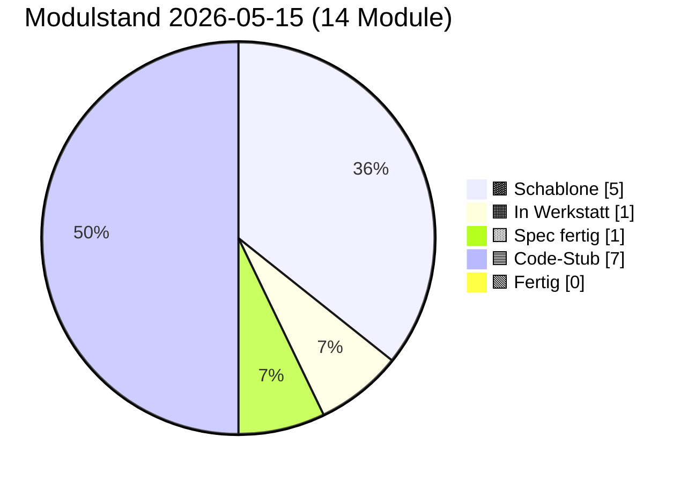

# PULS — lebender Status

**Format:** Jede Sitzung trägt unten einen Eintrag ein (neueste oben).
**Pflichtfelder pro Eintrag:** Datum · Sitzungs-Rolle · was getan · was offen · nächster sinnvoller Schritt.
**Begrenzung:** Diese Datei darf 400 Zeilen nicht überschreiten. Älteres ins
`docs/sessions/archiv/`-Verzeichnis als Übergabeprotokoll auslagern.

---

## Modulstand heute

<!-- Pie-Block ab hier wird automatisch aus status.json generiert.
     Nicht von Hand bearbeiten. Erzeugen mit:
     python3 scripts/update_puls_pie.py
     Aufruf-Pflicht: nach jeder status.json-Änderung. Siehe CLAUDE.md. -->

Farb-Mapping verbindlich in [INTERFACES.md §5](INTERFACES.md). Live-Bau-Puls
auf der [Sage-Page](../index.html) (Karte "Bau-Puls").

## Als nächstes ✨

Module mit Code-Stub, **Sichttest durch Klaus 2026-05-14 erledigt** —
ergab fünf reproduzierbare Cosinus-Messwerte (siehe Karte 04 Beleg-
Block), die in der Pflege-Sitzung 2026-05-14 zu `PROVIDER_MIN_MATCH`
0.55 → 0.80 geführt haben:

- 🟦 **[01 Storage](components/01_storage.md)** — geprüft 2026-05-14 (Klaus, im Browser); init/round-trip/Unknown-Store sauber, sechs Stores in DevTools sichtbar
- 🟦 **[02 Spore](components/02_spore.md)** — geprüft 2026-05-14 (Klaus, im Browser); Identität deterministisch, Spore sortiert, Sign+Verify valide, Manipulation erkannt
- 🟦 **[03 Embedding](components/03_embedding.md)** — geprüft 2026-05-14 (Klaus, im Browser); L2-Norm 1.0, gleicher Inhalt ≈0.95, Baseline für unverwandte Begriffe ungewöhnlich hoch
- 🟦 **[04 Match](components/04_match.md)** — geprüft 2026-05-14 (Klaus, im Browser); 3/5 Tests grün, 2 zeigten Schwellen-Drift → Pflege-Sitzung 2026-05-14 hat `PROVIDER_MIN_MATCH` und Test-Schwellen kalibriert

Code-Stub frisch aus den Bau-Sitzungen 2026-05-14, **Sichttest ausstehend bzw. teilweise erledigt:**

- 🟦 **[05 Anastomose](components/05_anastomose.md)** — Code geschrieben 2026-05-14 (Bau-Sitzung), Sichttest geprüft 2026-05-15 (Klaus, im Browser): 6 von 7 Tests grün im ersten Lauf (Setup, Test 1 passendes Match score=0.888, Test 3 Versions-Mismatch, Test 4 Signatur-Manipulation, Test 5 Re-Handshake, Test 6 forgetSibling, Test 7 listSiblings); **Test 2 (Domain-Mismatch / Tarantino-Vektor) Test-Bug** — score=0.854 statt erwartetem <0.80 (Tarantino-Filme spielen oft in Bars → zu nah am Mixarium-Cocktail-Vektor); Modul-Logik korrekt, `PROVIDER_MIN_MATCH=0.80` greift wie spezifiziert. **Pflege-Sitzung 2026-05-15** baut Panel 05 Test 2 auf **Vektor-Trias** um (Steuerrecht und Bilanzierung / Eisenbahnsignalanlagen / Quantenfeldtheorie), Pass-Check „mindestens einer der drei rejected mit score < 0.80"; Tarantino-Vergleichswert wird parallel als reiner Cosinus protokolliert; Karte 05 § Manueller Test Punkt 2 zieht mit. Klaus' zweiter Sichttest-Lauf nach Pflege folgt; falls alle drei Trias-Kandidaten über 0.80 liegen, eigene Folge-Pflege-Sitzung „Embedding-Baseline"
- 🟦 **[07 Apoptose](components/07_apoptose.md)** — Code geschrieben 2026-05-14 (Bau-Sitzung), Sichttest geprüft 2026-05-15 (Klaus, im Browser): 7 von 8 Tests grün im ersten Lauf (Setup + Tests 1/2/3/4/5/7 + Selbstcheck); **Test 6 (Self-Apoptose) deckte echten Modul-Bug auf**: nach Cleanup `getNodeId_wirft_NoIdentityError:false` trotz `stores_alle_leer:true` — Modul 02's In-Memory-`identityCache` wurde nicht durch externes `storage.clear` invalidiert (Modul 07 wusste nichts vom Modul-02-Cache). Folgeschaden: Tests 1/2/3/8 nach Test 6 mit „Keine Identität in sbkim_keys[main]". **Pflege-Sitzung 2026-05-15** ergänzt Modul 02 um öffentliche `resetIdentityCache() → void` (sync, idempotent, leert nur Closure-Cache, kein Storage-Eingriff) und Modul 07's Cleanup ruft sie als Schritt 6 nach den fünf `storage.clear`-Aufrufen — heilige Tafeln (INTERFACES.md §1 Modul 02 + §1 Modul 07 + §6 + Karten 02 + 07) ziehen mit. Re-Sichttest 2026-05-15 bestätigte den Cache-Fix: `getNodeId_wirft_NoIdentityError:true`. Modul 07 Sichttest 8/8 grün.
- 🟦 **[00 Doku-Fenster](components/00_doku_fenster.md)** — Code geschrieben 2026-05-14 (Bau-Sitzung), Sichttest geprüft 2026-05-15 (Klaus, im Browser): 5 von 6 Tests grün im ersten Lauf (Setup, Test 2 5-Klick-Simulation, Test 3 4-Klick + Timeout, Test 5 TTL-Sweep, Selbstcheck-Hinweis); **Test 4 Test-Bug** mit Mini-Werten 81/100 (freeBytes=19 Bytes ist trivial < 50 MiB → `warningLevel:"both"` statt erwartetem `"ratio"`) → **Pflege-Sitzung 2026-05-15** repariert mit GiB-Skalierung (`usage:8.1 GiB, quota:10 GiB` → freeBytes ≈ 1.9 GiB → `warningLevel:"ratio"` sauber); Modul-Vertrag und INTERFACES.md unangetastet

Spec frisch aus den Spec-Sitzungen 2026-05-14, **Bau ausstehend**:

- 🟨 **[09 Einbau-PWA](components/09_einbau_pwa.md)** — Karte vollständig 2026-05-14 (Spec-Sitzung; Anleitung, kein JS-Modul), **Pflege-Sitzung 2026-05-15 erweitert auf neun Schritte** (Schritt 9 neu: `SbkimApoptose.init()` + `SbkimDoku.init({searchIconSelector:...})` + optionaler TTL-Sweep nach Handshake); `<script>`-Reihenfolge in Schritt 2 zieht 07 + 00 nach (`01 → 02 → 03 → 04 → 05 → 07 → 00`); Sichtkontroll-Block jetzt vier Pflicht-Punkte (sieben Selbstcheck-Zeilen + sechs IndexedDB-Stores + zwei live-Endpunkte + 5-Klick-Geste am Such-Symbol); Datei-Pfad-Konvention (SW im Endknoten-Repo-Root, sieben JS-Module inline oder unter `sbkim/`); Spore-Endpunkt `/sbkim/spore.json` verbindlich; SW-Scope-Falle dokumentiert; `domainVector`-Pflicht-Frage **entschieden Variante A (Soft-Pflicht im Andock-Workflow, kein Hauptversions-Sprung)** — Modul 02 / §0 / §2 bleiben unverändert. **Bau-Sitzung 2026-05-15 vor Schritt 1 sauber abgebrochen** (Befund-Sitzung): beide Endknoten haben aktiven `app-sw.js` im Repo-Root (Mein-Mixarium Z. 12543, Mein-Rezeptbuch Z. 10453), Karte 09 antizipiert diesen Fall nicht; zusätzlich Karte 09 § Sichtkontrolle implizit auf Desktop-DevTools gemünzt — Klaus' Tablet (Galaxy Tab S6 + DeX) braucht Eruda-Pfad. **Vor erneuter Bau-Sitzung 09** zwei Karten-Lücken in einer Pflege-Sitzung Karte 09 zu schließen (Empfehlung Option α: Patch in bestehenden `app-sw.js`; plus Eruda-Pfad für Tablet-Sichtkontrolle). Details in [Übergabeprotokoll 2026-05-15 Bau-09-blockiert](sessions/archiv/2026-05-15_bau-09-blockiert-app-sw.md).

In Arbeit (fortsetzen, nicht neu starten):

- 🟧 **[08 UI-Demo](components/08_ui_demo.md)** — Werkstatt-Stub vorhanden, Spec füllen

Empfehlung Hauptsitzung: **Pflege-Sitzung Karte 09 — „App-SW-Koexistenz
+ Tablet-Sichtkontrolle"**. Bau-Sitzung 09 am 2026-05-15 ist vor
Schritt 1 sauber abgebrochen worden, weil Klaus' beide Endknoten
(`Mein-Rezeptbuch` Z. 10453 und `Mein-Mixarium` Z. 12543) einen
aktiven `register('./app-sw.js')`-App-Cache-SW im Repo-Root haben
und Karte 09 diesen Normalfall nicht antizipiert. Außerdem ist
Klaus' Setup (Samsung Galaxy Tab S6 + DeX, Android-Chrome) ohne
Desktop-DevTools — Karte 09 § Sichtkontrolle implizit auf
Desktop-DevTools gemünzt. **Vor erneuter Bau-Sitzung 09** muss
Karte 09 zwei Sub-Pfade verbindlich beschreiben: **Option α**
(SBKIM-Logik in bestehenden `app-sw.js` patchen statt zweiten
SW registrieren — Empfehlung) plus **Eruda-Pfad** als Tablet-
DevTools-Ersatz. Details und Optionen β/γ siehe
[Übergabeprotokoll 2026-05-15 Bau-09-blockiert](sessions/archiv/2026-05-15_bau-09-blockiert-app-sw.md).
Modul-Code (00/01/02/03/04/05/07) bleibt vollständig unberührt — die Lücke
sitzt in der Andock-Anleitung, nicht in den Modulen.

---

## Schnellüberblick

| Modul | Spec | Code | Manueller Sichttest | Anmerkung |
|---|---|---|---|---|
| 00 doku_fenster | Spec fertig (2026-05-14) | Code-Stub (2026-05-14) | geprüft 2026-05-15 (Klaus) — 5/6 Tests grün im ersten Lauf, Test 4 Test-Bug in Pflege-Sitzung 2026-05-15 mit GiB-Skalierung repariert | Sechs-Funktionen-API (`init/open/close/isOpen/getStatusSnapshot/recordSighttest`), reines Lese-/Trigger-Modul, alleiniger Schreiber `sbkim_doku_meta`, 5-Klick-Geste mit 3s-Zeitfenster, Modal mit Backdrop und MutationObserver-Mount, Quota-Doppel-Schwelle (80% / 50 MiB), Self-Apoptose bewusst NICHT in 00 |
| 01 storage | Spec fertig (2026-05-14) | Code-Stub (2026-05-14) | geprüft 2026-05-14 (Klaus) | IndexedDB-Wrapper |
| 02 spore | Spec fertig (2026-05-14) | Code-Stub (2026-05-14, Pflege Cache-Invalidate 2026-05-15) | geprüft 2026-05-14 (Klaus) + 2026-05-15 (Cache-Invalidate-Pflege via Sichttest 07) | Ed25519-Identität, Singleton, base64url-sha256-rawpub; +`resetIdentityCache()` aus Pflege-Sitzung 2026-05-15 (Pflicht-Hook für Apoptose-Cleanup) |
| 03 embedding | Spec fertig (2026-05-14) | Code-Stub (2026-05-14) | geprüft 2026-05-14 (Klaus) | semantischer Vektor |
| 04 match | Spec fertig (2026-05-14) | Code-Stub (2026-05-14) | geprüft 2026-05-14 (Klaus) | Vektorvergleich, modus-frei; Pflege-Sitzung 2026-05-14 PROVIDER_MIN_MATCH 0.55→0.80 |
| 05 anastomose | Spec fertig (2026-05-14) | Code-Stub (2026-05-14) | geprüft 2026-05-15 (Klaus) — 6/7 Tests grün im ersten Lauf, Test 2 Test-Bug (Tarantino-Vektor zu nah an Cocktails 0.854) in Pflege-Sitzung 2026-05-15 als Vektor-Trias repariert (3 Kandidaten parallel, Pass = ≥ 1 unter 0.80); Klaus' zweiter Lauf nach Pflege folgt | Handshake; Fünf-Funktionen-API, bidirektional, kanonisch signiert, Schwelle aus Modul 04; SW Variante A (Page-Hosted) |
| 06 heterokaryose | leere Schablone | — | — | Datenaustausch |
| 07 apoptose | Spec fertig (2026-05-14) | Code-Stub (2026-05-14, Pflege Cache-Invalidate 2026-05-15) | geprüft 2026-05-15 (Klaus) — **8/8 Tests grün** nach Pflege 02+07-Cache-Invalidate (Re-Sichttest 2026-05-15 bestätigte `getNodeId_wirft_NoIdentityError:true`); Test 6 (Self-Apoptose) hatte einen Modul-02-Cache-Bug aufgedeckt, der in Pflege 2026-05-15 mit `resetIdentityCache()` als Cleanup-Schritt 6 behoben wurde. | Selbstlöschung mit signiertem Vermächtnis; zweistufige Self-Apoptose (Token 60 s), Vermächtnis-Inbox, TTL-Vergessen explizit durch Andocker; kanonischer Sign/Verify-Pfad aus 02/05 dritter Pfad dupliziert; SW erweitert um `/sbkim/legacy` (gemeinsamer fetch-Listener mit `/sbkim/anastomosis`); Panel 07 mit zehn Knöpfen; Cleanup-Schritt 6 ruft `SbkimSpore.resetIdentityCache()` nach Pflege-Sitzung 2026-05-15 |
| 08 ui_demo | leere Schablone | — | — | Test-Oberfläche |
| 09 einbau_pwa | Spec fertig (2026-05-14, Pflege Schritt 9 + 07/00 2026-05-15) | — (Anleitung, kein JS-Modul) | — | Andock-Anleitung — **9 Schritte** (Schritt 9 neu aus Pflege-Sitzung 2026-05-15: SbkimApoptose.init + SbkimDoku.init + optionaler TTL-Sweep nach Handshake); `<script>`-Reihenfolge 01→02→03→04→05→07→00; Soft-Pflicht `domainVector` im Andock-Workflow (kein Hauptversions-Sprung); SW im Endknoten-Repo-Root, `/sbkim/spore.json` als Spore-Endpunkt |
| 10 reputation | Stub (Schutz-Backlog) | — | — | Knoten-Reputation, Priorität niedrig |
| 11 rate_limit | Stub (Schutz-Backlog) | — | — | Rate-Limit & TTL, Priorität niedrig |
| 12 blocklist | Stub (Schutz-Backlog) | — | — | manuelle Sperrliste, Priorität niedrig |
| 14 diffusion | Stub (Diffusion-Backlog) | — | — | konsensuell-empfehlende Spore-Diffusion via Handshake-Erweiterung (Pfad 2 verbindlich, Pfad 1 = Default-Status-quo, Pfad 3 verworfen wegen Empfangsmodus-Prinzip); Spec ausstehend bis Netz ≥ 10 Geschwister oder erfolgreicher Live-Andock + Wachstums-Bedürfnis; Priorität niedrig |

Statuscodes: `—` (nichts) · `Schablone` · `Stub` · `Entwurf` · `Review` · `stabil` · `eingebaut`

## Endknoten (externe Repos des Betreibers)

| App | URL | Domäne | SBKIM-Stand |
|---|---|---|---|
| Rezeptbuch | https://lausiklauskn-png.github.io/Mein-Rezeptbuch/ | Kochrezepte | nicht integriert (Bau-Sitzung 09 blockiert 2026-05-15, App-SW-Konflikt) |
| Mixarium | https://lausiklauskn-png.github.io/Mein-Mixarium/ | Cocktails / Drinks | nicht integriert (Bau-Sitzung 09 blockiert 2026-05-15, App-SW-Konflikt) |

## Offene Querschnitts-Fragen

- **Karten-Lücke Karte 09 / Tablet-Sichtkontrolle** (offen, eingetragen
  2026-05-15 nach abgebrochener Bau-Sitzung 09). Karte 09 § Sichtkontrolle
  setzt implizit Desktop-DevTools voraus (Konsolen-Selbstchecks +
  Anwendung→IndexedDB). Klaus arbeitet auf Samsung Galaxy Tab S6 + DeX —
  Android-Chrome ohne diese DevTools. Pragmatischer Ersatz: **Eruda**
  (in-Page-DevTools-Polyfill, touch-bedienbar, nur für Andock-
  Sichtkontrolle, danach wieder entfernen). Karte 09 muss in einer
  Pflege-Sitzung um diesen Pfad erweitert werden. Eintrag in
  Übergabeprotokoll
  [2026-05-15 Bau-09-blockiert](sessions/archiv/2026-05-15_bau-09-blockiert-app-sw.md)
  § Karten-Lücke 1.
- **Karten-Lücke Karte 09 / Andocken in PWA mit bestehendem
  Service-Worker** (offen, eingetragen 2026-05-15 nach abgebrochener
  Bau-Sitzung 09 — *gravierender*). Beide Endknoten haben
  `register('./app-sw.js')` im Repo-Root (Mein-Mixarium Z. 12543,
  Mein-Rezeptbuch Z. 10453) mit voller App-Update-Banner-Logik. Karte 09
  § Datei-Pfad-Konvention (Z. 192) verlangt SBKIM-SW im Repo-Root —
  ein Browser erlaubt aber nur **einen** SW pro Scope, der neue ersetzt
  den alten. Karte 09 § Risiken (Z. 837–842) dokumentiert die SW-Scope-
  Falle nur in eine Richtung; der häufige Normalfall „bestehender
  App-SW im Root blockiert SBKIM" ist **nicht antizipiert**. Drei
  Optionen für die Pflege-Sitzung Karte 09:
  - **α (Empfehlung) — Patch in bestehenden `app-sw.js`:**
    `addEventListener('fetch',...)` für `/sbkim/anastomosis` und
    `/sbkim/legacy` als zusätzliche Listener anhängen, MessageChannel-
    Brücke unverändert, App-Update-Banner bleibt unangetastet,
    SBKIM-Endpunkte **nicht cachen** (Spore-Drift).
  - **β — SBKIM-SW unter `/<repo>/sbkim/sbkim-sw.js`** (Scope-
    Einschränkung, in § Risiken schon als suboptimal markiert).
  - **γ — bestehenden App-SW deaktivieren** und durch einen einzigen
    vereinheitlichten SW ersetzen (sauberste Architektur, höchster
    Aufwand).
  Eintrag in Übergabeprotokoll
  [2026-05-15 Bau-09-blockiert](sessions/archiv/2026-05-15_bau-09-blockiert-app-sw.md)
  § Karten-Lücke 2.
- ~~Werden Domain-URLs der Endknoten-Apps in `docs/PULS.md` /
  `status.json` aufgenommen oder nur lokal in deren `index.html`?~~ —
  **teilweise gelöst 2026-05-15** in abgebrochener Bau-Sitzung 09:
  Pages-URLs in PULS-Tabelle „Endknoten" und `status.json`
  `endknoten[*].url` eingetragen (`integrated:false` bleibt — Andock
  nicht erfolgt). Eintrag in `docs/INTERFACES.md` weiterhin offen.
- Werden Domain-URLs der Endknoten-Apps in `docs/INTERFACES.md` aufgenommen
  oder nur lokal in deren `index.html`? → Entscheidung steht aus.
- Embedding-Modell: bleibt es bei Default `Xenova/multilingual-e5-small`?
  → ja, bis Gegenargument. Quelle: `sbkim_integration.md` §4.1.
- ~~Speicherort der Spore bei GitHub Pages: `/.well-known/sbkim/spore.json`
  oder Alias `/sbkim/spore.json`?~~ — **gelöst 2026-05-14 in Spec-Sitzung
  09:** verbindlicher Andock-Default ist `/sbkim/spore.json` (Alias aus
  §3 INTERFACES). Begründung in `docs/components/09_einbau_pwa.md`
  Schritt 7: GitHub-Pages-Project-Sites haben mit `.well-known/` die
  Jekyll-Dot-Ordner-Falle, `/sbkim/spore.json` bündelt zudem alle
  SBKIM-Pfade unter `/sbkim/` (semantisch sauber).
- **Wording-Diskrepanz**: `CLAUDE.md` führt SBKIM als
  "Semantisch-Biologisch Koordiniertes Inter-Knoten-Mycel" — das Paper
  (Kap. 1.2) führt es als "Semantisch-Empfangendes Bidirektionales
  KI-Matching". Das Observatorium (`index.html`, `status.json`) übernimmt
  die Paper-Variante. CLAUDE.md sollte in einer separaten Sitzung
  nachgezogen werden.
- ~~**A1–B3-Notations-Überlappung Sage ↔ Mixarium**~~ — **gelöst
  2026-05-14 in Spec+Bau-Sitzung Modul 04.** Die Synthese „Hops tragen
  die Funktionen" steht jetzt verbindlich in
  [`docs/components/04_match.md` § A1–B3-Synthese](components/04_match.md):
  Pfad A = Curator → Auditor → Devil's Advocate (Anbieter-Seite
  verfeinert die Antwort); Pfad B = Interviewer → Matcher → Critic
  (Anfrage-Seite verfeinert die Frage), mit Apoptose bei B4 im
  Negativ-Fall. Sage zeigt die *Geometrie* der Hop-Position, Mixarium
  zeigt die *Rolle* — beide Notationen bleiben gültig, sie beschreiben
  dieselbe Wanderung aus zwei Winkeln. Kein eigenes Mapping-Dokument
  nötig.
- **Spore-Persistenz-Strategie verteilt** (offen, eingetragen
  2026-05-14 nach Bau-Sitzung 07; **teilweise gelöst 2026-05-14
  durch Spec-Sitzung 00**). „Stille Löschung ohne Vermächtnis"
  (Karte 07 § Risiken) ist nicht in einem einzelnen Modul lösbar —
  vier Stellen müssen beim Bauen zusammenpassen:
  - **Modul 01 Storage:** `navigator.storage.persist()` beim `init()`
    + `navigator.storage.estimate()` für Quota-Frühwarnung —
    **offen**.
  - **Modul 02 Spore:** Backup-Export (passwort-verschlüsselt) als
    Recovery-Pfad für Browser-Wechsel und manuelles Löschen —
    **offen**.
  - **Modul 00 Doku-Fenster:** stille Frühwarnung bei < X% Speicher
    (X als gemeinsame Konstante in §0) — **gelöst 2026-05-14 durch
    Spec-Sitzung 00:** `DOKU_QUOTA_WARN_RATIO = 0.80` UND
    `DOKU_QUOTA_WARN_BYTES = 52428800` (50 MiB) verbindlich in §0
    eingetragen (Doppel-Schwelle; Warnzeile bei Überschreitung einer
    der beiden). Konsistenter Schwellwert-Anker für Modul 01 und
    Modul 02. Modul 00 ist der erste Andocker, der die §0-Konstanten
    konkret nutzt — `navigator.storage.estimate()` beim `open()`,
    Vergleich gegen beide Schwellen, passive Warnzeile im
    Statusfenster. Verbleibender Schritt für eine Folge-Pflege-
    Sitzung „Persistenz-Strategie verbinden": Modul 01 verankert
    `navigator.storage.persist()` als Persist-Mechanismus, Modul 02
    spezifiziert das Backup-Format (vermutlich neu in §2).
  - **Modul 07 Apoptose:** Risiko-Vermerk „stille Löschung" (steht
    jetzt in Karte 07 § Risiken).

  Beim Bauen darauf achten, dass die vier Stellen konsistent bleiben:
  **Quota-Schwellwert** (jetzt gelöst — zwei Zahlen in §0), **Backup-
  Format** (eine JSON-Struktur, vermutlich neu in §2 — offen),
  **Warntext** (deutsch, einmal formuliert — offen). Aufhänger für
  eine Pflege-Sitzung „Persistenz-Strategie verbinden", sobald
  02-Backup und 01-Quota spruchreif sind. Modul 00 hat seinen Teil
  verankert; die Frage bleibt offen, weil 01/02 noch nicht spruchreif
  sind.
- ~~**Spore-Diffusion: passiv (Pfad 1) vs. konsensuell-empfehlend
  (Pfad 2) vs. parasitär-mitreisend (Pfad 3)?**~~ — **gelöst
  2026-05-15 in Hauptsitzung 14-Diffusion-Stub durch Anlage
  [`docs/components/14_diffusion.md`](components/14_diffusion.md)**.
  Frage entstand in der abgebrochenen Bau-Sitzung Modul 09 vom
  2026-05-15 (siehe parallele Pflege-Sitzung Karte 09 „App-SW-
  Koexistenz" auf eigenem Branch). Verbindliche Auswahl: **Pfad 2
  (konsensuell-empfehlend)** über `recommendedPeers: SporeRef[]` als
  optionales Handshake-Antwort-Feld (max. 2 Einträge), Empfänger
  speichert als Lead mit TTL, opt-in pro Empfehlung — drehbuchkonform,
  weil jede Übergabe im Konsens. **Pfad 1 (passiv via
  `/sbkim/spore.json`)** bleibt Default-Mechanismus parallel.
  **Pfad 3 (parasitär-mitreisend)** explizit verworfen, weil er das
  Empfangsmodus-Prinzip aus `CLAUDE.md` und `sbkim_paper.pdf`
  („Kein Crawler, keine Pulsation, keine Eigenanfragen ins offene
  Netz") bricht. Modul 14 bleibt Stub bis Netz wächst (Schwelle siehe
  Diffusion-Backlog unten); Karte 05 wird in der Stub-Sitzung
  NICHT angefasst.
- **Sage-Page sichtbar machen für Modul 14** (offen, eingetragen
  2026-05-15 nach Hauptsitzung 14-Diffusion-Stub). `index.html`
  rendert aktuell `modules[]` und `schutzBacklog[]`; das neue
  `diffusionBacklog[]` wird nicht angezeigt. Modul 14 muss in der
  Bau-Puls-Karte und (analog zu 10/11/12 in Karte 13 Eigenschutz)
  ggf. in einer eigenen Karte „Wuchs-Mechanik" oder als Sub-
  Sektion neben dem Schutz-Backlog sichtbar werden. **Folge-Pflege-
  Sitzung „Sage-Page für Modul 14"** — diese Hauptsitzung berührt
  den Anker nur in `status.json` + Karte + PULS, nicht die
  Sage-Page selbst.

## Schutz-Backlog (aus Sage-Page Karte 13, 2026-05-10)

Drei strukturelle Lücken im Schutz-Modell sind beim Aufbau des
Observatoriums sichtbar geworden. Stubs sind angelegt; gezogen werden sie
ab spürbarem Wachstum:

- `docs/components/10_reputation.md` — Knoten-Reputation
- `docs/components/11_rate_limit.md` — Rate-Limit & TTL
- `docs/components/12_blocklist.md` — manuelle Blocklist

Eigenschutz-Karte der Sage-Page macht das Backlog für jeden Besucher
sichtbar und verlinkt direkt auf die Stubs.

### Diffusion-Backlog (aus Hauptsitzung 14-Diffusion-Stub, 2026-05-15)

Schutz und Diffusion sind zwei verschiedene Backlog-Kategorien. Der
Schutz-Backlog (10/11/12) ist **reaktiv** — er wehrt Schaden ab, wenn
das Netz groß genug ist, dass Apoptose und Match-Filter allein nicht
mehr reichen. Der Diffusion-Backlog ist **proaktiv** — er beschleunigt
das Wachstum durch konsensuelle Empfehlung beim Handshake, ohne das
Empfangsmodus-Prinzip zu brechen.

- `docs/components/14_diffusion.md` — konsensuell-empfehlende Spore-
  Diffusion via Handshake-Erweiterung (`recommendedPeers: SporeRef[]`
  als optionales Feld in der `HandshakeResponse`, max. 2 Einträge,
  Empfänger speichert als Lead mit TTL, opt-in pro Empfehlung)

Pfad-Auswahl verbindlich Pfad 2 (konsensuell-empfehlend);
Pfad 1 (passiv via `/sbkim/spore.json`) bleibt Default-Mechanismus
parallel; Pfad 3 (parasitär-mitreisend) verworfen wegen
Empfangsmodus-Prinzip aus `CLAUDE.md` + `sbkim_paper.pdf`.

Modul 14 wird gezogen, sobald **Netz ≥ 10 aktive Geschwister ODER
Bau-Sitzung Modul 09 erfolgreich abgeschlossen UND spürbares
Wachstums-Bedürfnis** — parallel zur 10/11/12-Logik.

`status.json` führt Modul 14 als eigenes Feld `diffusionBacklog[]`
parallel zu `schutzBacklog[]` (proaktiv vs. reaktiv); `scoreModel.
maxScoreNote` bleibt unangetastet (Backlog zählt nicht zum maxScore).
Das Pie-Skript `scripts/update_puls_pie.py` zählt beide Backlog-
Kategorien jetzt mit.

---

## Sitzungs-Einträge

### 2026-05-15 · Hauptsitzung · Modul 14 Diffusion — Backlog-Stub angelegt

**Getan:**

- **`docs/components/14_diffusion.md` angelegt** als reiner
  Backlog-Stub im Format der Schutz-Module 10/11/12. Status-Block
  🟫 Schablone · Diffusion-Backlog · Priorität niedrig · Spec
  ausstehend. **Kein Spec-Detail** (keine Funktions-Signaturen,
  keine Datenformate, keine Konfigurationswerte, keine Tests),
  **kein JS-Code** in `src/`. Reiner Anker mit drei dokumentierten
  Diffusionspfaden, verbindlicher Auswahl, Hook-Verweisen zu
  10/11/12 und Schwellwert für späteres Ziehen.
- **Drei Diffusionspfade** dokumentiert (entstanden in der
  abgebrochenen Bau-Sitzung Modul 09 vom 2026-05-15, siehe
  parallele Pflege-Sitzung Karte 09 „App-SW-Koexistenz" auf
  eigenem Branch):
  - **Pfad 1 — passiv (Status quo):** `/sbkim/spore.json` wird
    gefunden, langsam — bleibt **Default-Mechanismus** parallel.
  - **Pfad 2 — konsensuell-empfehlend** ✅ **verbindlich
    gewählt:** zwei Knoten tauschen beim Handshake (Karte 05) je
    1–2 Empfehlungs-Spores anderer Geschwister. Drehbuchkonform,
    weil jede Übergabe im Konsens.
  - **Pfad 3 — parasitär-mitreisend** ❌ **verworfen:** bricht
    das Empfangsmodus-Prinzip aus `CLAUDE.md` und
    `sbkim_paper.pdf` („Kein Crawler, keine Pulsation, keine
    Eigenanfragen ins offene Netz") — nicht weiterverfolgt, auch
    nicht als Option.
- **Was eine spätere Spec-Sitzung füllen müsste** (sechs Anker
  ohne Detail-Festlegung):
  - (a) Handshake-Erweiterung Karte 05: Feld
    `recommendedPeers: SporeRef[]` in der Anastomose-Antwort,
    max. zwei Einträge — **eigene Pflege-Sitzung Karte 05** wenn
    Modul 14 spec-spruchreif ist.
  - (b) Empfehlungs-Quelle aus eigenem `sbkim_siblings`-Bestand,
    gefiltert nach Vertrauenswert.
  - (c) Empfangsseite: **opt-in pro Empfehlung**, kein
    Auto-Anastomose, Empfänger speichert als Lead in einem neuen
    Store `sbkim_diffusion_leads` mit TTL.
  - (d) Trust-Hook auf Karte 10 Reputation
    (Empfehlungs-Quellen werden gewichtet).
  - (e) Rate-Limit-Hook auf Karte 11
    (Empfehlungs-Limit pro Handshake, Anti-Flood).
  - (f) Anti-Vergiftung: Empfehlungs-Spores haben weniger
    Vertrauen als selbst-gefundene Spores.
- **Schwellwert „Wann ziehen"** dokumentiert: Netz ≥ 10 aktive
  Geschwister **ODER** Bau-Sitzung Modul 09 erfolgreich
  abgeschlossen **UND** spürbares Wachstums-Bedürfnis (parallel
  zur 10/11/12-Logik).
- **Verbindungen zu anderen Karten** als reine Verweise (nicht
  implementiert): Karte 05 (Handshake-Erweiterung), Karte 06
  (Lead-Pool für Heterokaryose), Karte 10 (Trust-Gewicht), Karte 11
  (Anti-Flood-Quote), Karte 12 (Filter beidseits — geblockte
  Knoten dürfen weder empfehlen noch empfohlen werden).
- **Risiken** benannt: Echo-Kammer · Diffusion-Sybil · Trust-
  Inflation · Privacy-Leak (Empfehlung verrät dem Empfänger, dass
  der Empfehlende den Empfohlenen kennt).
- **`status.json` erweitert** um neues Feld `diffusionBacklog[]`
  parallel zu `schutzBacklog[]` (proaktiv vs. reaktiv — bewusste
  Architektur-Entscheidung). Eintrag Modul 14:
  `{"id":"14","name":"Diffusion","score":"schablone","siegel":
  "Stub (Backlog), Priorität niedrig","kurz":"…Pfad 2
  (drehbuchkonform)…"}`. `lastUpdated` auf `2026-05-15`. `scoreModel.
  maxScoreNote` **unangetastet** (Backlog zählt nicht zum maxScore,
  analog 10/11/12).
- **`scripts/update_puls_pie.py` erweitert** um Lesen von
  `diffusionBacklog` (zusätzlich zu `modules` + `schutzBacklog`),
  damit der Pie-Block Module 14 als Schablone mitzählt. Skript
  gelaufen: **13 → 14 Module, Schablonen 4 → 5**, andere
  Score-Verteilungen unverändert.
- **PULS.md erweitert:** (1) Schnellüberblicks-Tabelle um neue
  Zeile „14 diffusion" analog 10/11/12; (2) Offene
  Querschnitts-Fragen: Diffusion-Frage als gelöst markiert
  (durchgestrichen plus Verweis auf Karte 14) und neue offene
  Frage „Sage-Page sichtbar machen für Modul 14" angelegt; (3)
  neuer Sub-Abschnitt „Diffusion-Backlog" unter dem Schutz-
  Backlog mit Begründung „proaktiv vs. reaktiv" und Schwellwert-
  Verweis; (4) dieser Sitzungs-Eintrag oben.
- **INTERFACES.md §6** Änderungsprotokoll-Zeile am unteren Ende
  ergänzt (neueste unten, Konventions-Stil wie die anderen
  2026-05-15-Sitzungen). **§1 unangetastet** — Stub hat keine
  Schnittstelle; Schnittstellen-Spiegelung kommt erst in der
  späteren Spec-Sitzung.
- **Übergabeprotokoll** unter
  `docs/sessions/archiv/2026-05-15_haupt-14-diffusion-stub.md`
  angelegt (Format wie
  `2026-05-15_pflege-09-schritt-9-doku-ttl.md`).

**Was nicht geändert wurde (bewusst):**

- **Kein Spec-Detail für Modul 14.** Keine Funktions-Signaturen,
  keine Datenformate (`SporeRef`-Form bleibt offen), keine
  Konfigurationswerte (TTL-Wert bleibt offen), keine Tests, keine
  Manual-Check-Knöpfe. Das ist Spec-Sitzungs-Arbeit später, wenn
  die Schwelle erreicht ist.
- **Keine Änderung an Karte 05 Anastomose.** Die Handshake-
  Erweiterung um `recommendedPeers: SporeRef[]` gehört in eine
  eigene Pflege-Sitzung Karte 05, sobald Modul 14 spec-
  spruchreif ist. Karte 05 § Schnittstelle bleibt verbindlich
  fünf-funktional.
- **Keine Änderung an Karte 10/11/12.** Die Hook-Punkte werden
  in Karte 14 nur als Verweis dokumentiert, nicht implementiert.
  Stubs 10/11/12 bleiben unangetastet.
- **Kein JS-Code in `src/`.** `src/modules/14_diffusion.js`
  existiert nicht und entsteht erst nach Spec-Sitzung 14.
- **INTERFACES.md §1** unangetastet — Stub hat keine
  Schnittstelle, keine `kurz`-Zeile, keinen Bietet-Block. Nur §6
  bekommt eine Änderungsprotokoll-Zeile.
- **Sage-Page (`index.html`) und Observatorium nicht berührt.**
  Modul 14 ist in Bau-Puls-Karte und Eigenschutz-Karte 13 noch
  nicht sichtbar — `index.html` rendert aktuell `modules[]` und
  `schutzBacklog[]`, nicht `diffusionBacklog[]`. Als offene
  Querschnitts-Frage „Sage-Page sichtbar machen für Modul 14"
  in PULS notiert; Folge-Pflege-Sitzung zieht nach. Diese
  Hauptsitzung berührt nur den Anker.
- **Kein Anfassen der parallel offenen Pflege-Sitzung Karte 09
  „App-SW-Koexistenz"** — die läuft auf eigenem Branch und ist
  unabhängig. Befund-Kontext aus der dort entstandenen
  Diffusion-Frage wurde nur als Anker-Hinweis in Karte 14 und
  als Verweis in den Querschnitts-Fragen eingetragen.

**Frischer-Kopf-Befund: Backlog-Schema erweitert (proaktiv vs. reaktiv)**

Die Architektur-Entscheidung `diffusionBacklog[]` parallel zu
`schutzBacklog[]` (statt: einen Eintrag in `schutzBacklog`
ergänzen) ist die saubere Trennung: **Schutz ist reaktiv**, der
Stub wird gezogen, wenn das Netz angegriffen wird oder zu groß
für Apoptose-allein wird. **Diffusion ist proaktiv**, der Stub
wird gezogen, wenn das Netz zu klein bleibt und konsensuelles
Wachstum gewünscht ist. Beide haben dieselbe Eigenschaft
(„zählen nicht zum maxScore, weil zukunftsgewandt"), aber
unterschiedliche Auslöser. Konsequenz: das Pie-Skript zählt
beide Backlog-Kategorien mit, `scoreModel.maxScoreNote` bleibt
unangetastet, Sage-Page-Folge-Pflege-Sitzung wird nachziehen.

**Was offen blieb:**

- **Sage-Page (`index.html`) sichtbar machen für Modul 14** —
  Folge-Pflege-Sitzung „Sage-Page für Modul 14" zieht den
  Anker in der Bau-Puls-Karte und ggf. in der Eigenschutz-
  Karte 13 nach (siehe neue Querschnitts-Frage oben).
- **Modul 06 Heterokaryose Spec-Sitzung** kommt weiterhin
  erst nach dem ersten Live-Andock; Modul 14 ergibt eine
  semantisch nahe Schwester (Lead-Pool für Heterokaryose-
  Vorschläge), wartet aber genauso auf das Netz.
- **Bau-Sitzung Modul 09 Einbau-PWA mit Klaus am Live-Andock-
  Versuch** bleibt der nächste produktive Schritt im Haupt-
  Pfad (siehe Pflege-Sitzung Karte 09 Schritt 9-Eintrag unten).
- **Spec-Sitzung 14** wird gezogen, sobald die Schwelle
  erreicht ist (Netz ≥ 10 aktive Geschwister ODER Bau-Sitzung
  09 abgeschlossen + Wachstums-Bedürfnis). Aufhänger für eine
  Pflege-Sitzung Karte 05 sobald Modul 14 spec-spruchreif ist
  (`recommendedPeers: SporeRef[]` in `HandshakeResponse`
  einbauen, additiv).

**Nächster sinnvoller Schritt:**

1. **Bau-Sitzung Modul 09 Einbau-PWA mit Klaus am Live-Andock-
   Versuch** zwischen Rezeptbuch und Mixarium (Karte 09
   vollständig auf neun Schritten, Module 00/05/07 alle
   Code-Stub + sichtgeprüft). Nicht headless ausführbar.
2. **Folge-Pflege-Sitzung „Sage-Page für Modul 14"** —
   `index.html` (Bau-Puls + ggf. Eigenschutz-Karte 13) um
   `diffusionBacklog[]` erweitern, damit Modul 14 sichtbar wird.
   Klein, headless ausführbar, parallel zu Bau-Sitzung 09
   möglich.
3. Nach dem Live-Andock: **Spec-Sitzung Modul 06
   Heterokaryose** (Klaus weiß dann aus echtem Endknoten-
   Betrieb, welche Daten austauschenswert sind).
4. Spec-Sitzung Modul 14 erst bei Erreichen des Schwellwerts
   (Netz ≥ 10 oder erfolgreicher Live-Andock + Wachstums-
   Bedürfnis).

---

### 2026-05-15 · Bau-Sitzung Modul 09 — BLOCKIERT vor Schritt 1 (App-SW-Konflikt in beiden Endknoten)

**Sitzungs-Rolle:** Bau-Sitzung (Modul 09 Live-Andock, Branch
`claude/bau-09-live-andock-QF4Ry`), sauber abgebrochen als
**Befund-Sitzung**. Kein Modul-Code in `src/` angefasst, kein
Endknoten-Code in `Mein-Rezeptbuch` oder `Mein-Mixarium`
angefasst. Karte 09 selbst nicht ergänzt (Pflege-Arbeit, nicht
Bau-Arbeit — gehört in die nächste Sitzung).

**Getan:**

- **Vor-Klärung 1 — Tablet-Realität.** Klaus arbeitet auf Samsung
  Galaxy Tab S6 + DeX an Monitor. Trotz Desktop-Look ist der
  Browser Android-Chrome ohne Desktop-DevTools. Karte 09
  § Sichtkontrolle setzt implizit Desktop-DevTools voraus
  (Konsolen-Selbstchecks + Anwendung→IndexedDB). Pragmatischer
  Tablet-Pfad wäre **Eruda** (in-Page-DevTools-Polyfill,
  Floating-Button, touch-bedienbar) — nur für die Andock-
  Sichtkontrolle, nach Andock entfernen. Karte 09 antizipiert
  diesen Pfad nicht → **Karten-Lücke 1**.
- **Vor-Klärung 2 — Pages-URLs konkret.** Klaus hat in dieser
  Sitzung mitgeteilt: Rezeptbuch unter
  `https://lausiklauskn-png.github.io/Mein-Rezeptbuch/`,
  Mixarium unter
  `https://lausiklauskn-png.github.io/Mein-Mixarium/`. PULS-
  Tabelle „Endknoten" und `status.json` `endknoten[*].url`
  in dieser Sitzung nachgezogen (`integrated:false` bleibt
  unverändert — Andock nicht erfolgt).
- **Vor-Klärung 3 (Show-Stopper) — beide Endknoten haben aktiven
  App-Cache-SW im Repo-Root.** Stichprobe per github.dev-Suche
  `.register(` in `index.html`:
  - `Mein-Mixarium/index.html` Z. 12543:
    `navigator.serviceWorker.register('./app-sw.js').then(reg=>{`
    plus voller Update-Banner-Block (`updatefound`,
    `controllerchange`, Reload-Hook).
  - `Mein-Rezeptbuch/index.html` Z. 10453: identischer Block,
    identisches `register('./app-sw.js')`.
  Karte 09 § Datei-Pfad-Konvention (Z. 192) verlangt: „**SW
  immer im Repo-Root.**" SBKIM-SW (`sbkim-sw.js`) und
  bestehender `app-sw.js` würden im selben Scope `/<repo>/`
  konkurrieren — der Browser erlaubt nur **einen** SW pro Scope,
  der neue ersetzt den alten. Klaus' App-Update-Banner und
  Cache-Strategie würden stillschweigend abgeschaltet. Karte 09
  § Risiken (Z. 837–842) dokumentiert die SW-Scope-Falle nur in
  eine Richtung („SBKIM-SW falsch platziert"); der umgekehrte
  Fall ist **nicht antizipiert** → **Karten-Lücke 2 (gravierender)**.
- **Konsequenz:** Bau-Sitzung 09 sauber abgebrochen vor Schritt 1
  gemäß CLAUDE.md § „Wenn du blockiert bist: ende die Sitzung
  sauber, dokumentiere im PULS". Keine Modul-Code-Änderung,
  keine Endknoten-Code-Änderung, keine Karten-Pflege in dieser
  Bau-Sitzung. PULS-Eintrag, Übergabeprotokoll, `status.json`-
  URLs-Aktualisierung, Commit, Draft-PR (kein Merge — Befund
  statt Bau).

**Offen — Aufträge für die nächste Sitzung:**

1. **Pflege-Sitzung Karte 09 „App-SW-Koexistenz + Tablet-
   Sichtkontrolle"** (eine Phase, ein Karten-Anker, kein
   Modul-Eingriff):
   - **Karten-Lücke 1 schließen:** Karte 09 § Sichtkontrolle um
     Eruda-Pfad als gleichwertigen Tablet-DevTools-Ersatz
     ergänzen (Script-Snippet, drei Tab-Pfade Console/IndexedDB/
     Network, Hinweis „nach erfolgreichem Andock entfernen").
   - **Karten-Lücke 2 schließen:** Karte 09 § Datei-Pfad-
     Konvention + § Schritt 3 + § Risiken um drei dokumentierte
     Optionen erweitern:
     - **α (Empfehlung) — Patch in bestehenden `app-sw.js`:**
       `addEventListener('fetch',...)` für `/sbkim/anastomosis`
       + `/sbkim/legacy` als zusätzliche Listener anhängen,
       MessageChannel-Brücke unverändert. App-Update-Banner-
       Logik bleibt unangetastet. Pflichthinweis: SBKIM-
       Endpunkte **nicht cachen** (sonst Spore-Drift).
     - **β (Übergang) — SBKIM-SW unter `/<repo>/sbkim/sbkim-sw.js`**
       mit Scope `/<repo>/sbkim/`. Karte 09 § Risiken hat das
       schon als suboptimal markiert.
     - **γ (Architektur) — bestehenden App-SW deaktivieren** und
       durch einen einzigen, vereinheitlichten SW ersetzen.
       Höchster Bau-Aufwand, sauberste Architektur.
   - INTERFACES.md §6 Änderungsprotokoll-Zeile nachziehen.
   - `status.json` Modul 09 unverändert (additive Karten-
     Erweiterung, kein Score-Sprung).
2. **Bau-Sitzung 09 erneut** sobald Pflege durch ist. Briefing
   nimmt Option α als Default; Klaus' Endknoten-Stand
   (App-SW + Update-Banner) bleibt funktional erhalten.

**Nächster sinnvoller Schritt:** Pflege-Sitzung Karte 09 mit den
zwei Sub-Pfaden. Details und Code-Patch-Skizze siehe
[Übergabeprotokoll 2026-05-15 Bau-09-blockiert](sessions/archiv/2026-05-15_bau-09-blockiert-app-sw.md).

### 2026-05-15 · Pflege-Sitzung · Karte 09 Schritt 9 — Doku-Fenster + Apoptose im Andock-Pfad

**Getan:**

- **Karte 09 § Andock-Schritt-Pfad** von **acht** auf **neun**
  Schritte erweitert. Folge-Pflege aus zwei offenen Punkten der
  Spec-Sitzungen 07 und 00 (beide vom 2026-05-14):
  - Spec-Sitzung 07 hatte „Karte 09 Schritt 9: TTL-Sweep-Aufruf"
    als offen vermerkt (Andocker-Automatik nach jedem Handshake).
  - Spec-Sitzung 00 hatte „Karte 09 Folge-Pflege-Sitzung Modul 00
    im Andock-Pfad" als offen vermerkt (`SbkimDoku.init({
    searchIconSelector:...})` als Schritt 9).
  Beide Punkte sind jetzt verbindlich in Karte 09 verankert.
- **Schritt 2 (`` am Ende der
  Datei (nach 01/02/03/04/05). Inline-Script-Syntax über `node --check`
  validiert.
- **Test-Pragmatismus dokumentiert:** wie in Bau-Sitzung 05 hat das
  Panel nur EINE Identität pro Page — Test 1 (Lokaler Round-Trip)
  empfängt die selbst-gebaute Vermächtnis-Nachricht über
  `_invokeReceiveLegacyDirect`. Test 6 (Self-Apoptose) sendet an zwei
  Pseudo-Geschwister mit absichtlich unerreichbaren Endpoints (`http://
  127.0.0.1:1/…`) — beide landen in `recipientsFailed`. Der lokale
  Cleanup-Pfad wird geprüft (alle SBKIM-Stores leer, `getNodeId` wirft
  `NoIdentityError`). Der volle bidirektionale Pfad gehört in Modul 09
  mit zwei tatsächlichen Tabs.
- **Karte 07 Bauzustand-Tabelle** ergänzt: Zeile *Code geschrieben* mit
  Datum + Sitzungsnamen + ausführlicher Anmerkung; Zeile *Sichttest*
  mit „ungeprüft, weil Sitzung headless — Klaus klickt im Browser".
  Hero-Badge von 🟨 Spec fertig auf 🟦 Code-Stub.
- **`status.json` Modul 07** von `score:"spec"` / `siegel:"Spec fertig"`
  auf `score:"stub"` / `siegel:"Code-Stub"`; `kurz`-Feld aktualisiert.
  `python3 scripts/update_puls_pie.py` gelaufen, Pie regeneriert:
  Schablone 5→5, Werkstatt 1→1, Spec fertig 2→1, **Code-Stub 5→6**,
  Fertig 0→0. Genau wie das Briefing vorgibt. `SIBLING_MAX_AGE_MS` in
  `status.json.config` unverändert (2592000000 — Spec-Sitzung 07 hat
  den Wert dort schon gesetzt).
- **`node --check`** grün für `src/modules/07_apoptose.js` und
  `src/sbkim-sw.js`; alle sieben Inline-`<script>`-Blöcke in
  `tests/manual_check.html` syntaktisch validiert.

**Frischer-Kopf-Befund:**

- Spec aus Karte 07 + INTERFACES.md §1/§2 trägt sauber. Beim Lesen
  keine API-Korrektur an 01–05 nötig (Spec-Sitzung 07 hat das schon
  geprüft); auch die Bau-Sitzung-Lese-Runde sieht keine Lücke. Modul
  07 hängt im Bau-DAG nur an 01 und 02 — die kanonischen Pfade kommen
  aus Modul 02 / 05 als Vorlage.
- **Eine kleine Beobachtung zur Spec, keine Korrektur:** Karte 07 §
  Schnittstelle nennt `Promise<{outcome:"completed", recipientsNotified,
  recipientsFailed}>` als Rückgabe von `confirmSelfApoptose`. Im Code
  steht jetzt genau dieser Pfad (kein `"failed"`-Outcome); auch wenn alle
  Empfänger in `recipientsFailed` landen, ist der Outcome semantisch
  „abgeschlossen" — der LOKALE Cleanup ist gelungen, der Versand ist
  Best-Effort. Das deckt sich mit Karte 07 § Apoptose-Pfad Schritt 6
  („Folge-Aufrufe werfen").

**Was offen blieb:**

- **Sichttest Karte 07** durch Klaus — Panel 07 mit zehn Knöpfen
  (Setup + 8 Tests + Selbstcheck-Hinweis). Voraussetzung: WebCrypto
  Ed25519, Modul 01/02 laden mit. Erwartungen pro Knopf sind im
  Knopf-Text als Rückgabe-Feld dokumentiert.
- **Folge-Pflege-Sitzung „Karte 09 Schritt 9: TTL-Sweep-Aufruf"** —
  Karte 09 um den Schritt ergänzen, der den Andocker zum
  `forgetExpiredSiblings(SIBLING_MAX_AGE_MS)`-Aufruf anleitet. Aus der
  Spec-Sitzung 07 als offen vermerkt; Bau-Sitzung 07 implementiert den
  Sweep, aber Karte 09 verlangt ihn noch nicht explizit vom Andocker.
- **Folge-Pflege-Sitzung „Vermächtnis-Reaktivierung"** (anbietbar bei
  größerem Netz) — siehe Spec-Sitzung 07 Übergabeprotokoll.
- **Folge-Pflege-Sitzung „Transaktionaler Cleanup für 07"** —
  sequenzieller `clear`-Pfad in `confirmSelfApoptose` ist anfällig für
  inkonsistente Zwischen-Zustände bei Storage-Fehlern. IndexedDB-
  Transaktion wäre Modul-01-Aufgabe.
- **Folge-Pflege-Sitzung „Vermächtnis-Versand in Chunks"** — bei
  Klaus' Netz unkritisch, Aufhänger für größere Netze.
- **Folge-Pflege-Sitzung Modul 02/05/07 Krypto-Refactor** — drei
  identische `canonicalize`/`base64url`/`signEnvelope`/`verifyEnvelope`-
  Pfade existieren jetzt (Modul 02, 05, 07). Eine geteilte Helfer-
  Library wäre sauberer, aber ist Pflege-Sitzungs-Stoff (nicht Teil
  dieser Bau-Sitzung). Single-File-PWA-Stil bevorzugt aktuell Lokalität.
- **PULS.md Zeilen-Längen-Schwellwert.** CLAUDE.md sagt 400 Zeilen
  Maximum, jetzt deutlich darüber. Auslager-Sitzung für eine eigene
  Pflege-Phase — nicht Teil dieser Bau-Sitzung.

**Nächster sinnvoller Schritt:**

1. **Sichttest Karte 05 + Karte 07** durch Klaus — Panel 05 mit acht
   Knöpfen, Panel 07 mit zehn Knöpfen. Beide ohne Netz-Pfad (der gehört
   in Modul 09).
2. **Bau-Sitzung Modul 09 Einbau-PWA mit Klaus am Browser** — die acht
   Schritte aus Karte 09 *live* durchlaufen an Rezeptbuch und/oder
   Mixarium. Module 05 und 07 sind beide Code-Stub; der erste echte
   Andock-Klick kann mit-andocken.
3. Parallel anbietbar: **Spec-Sitzung Modul 00 (Doku-Fenster)** —
   dependenz-frei, 5-Klick-UI in der Endknoten-PWA, natürliche Anker-
   Stelle für die Vermächtnis-Inbox-Anzeige aus Modul 07 und den
   TTL-Sweep-Knopf (Folge-Pflege-Sitzung Karte 09 Schritt 9).

### 2026-05-14 · Spec-Sitzung · Modul 07 Apoptose (Spec fertig)

**Getan:**

- **`docs/components/07_apoptose.md` vollständig gefüllt** — Karte vom
  Schablonen-Stand (Quorum-Skizze von 2026-05-10) auf 🟨 Spec fertig
  gehoben (~480 Zeilen, Stil 02/04/05/09). Inhalt: Hero · Im Mycel-Bild
  (Apoptose als sauberer Zelltod mit chemischem Vermächtnis, bidirektional
  asymmetrisch: einmal versenden — einseitig empfangen + vergessen) ·
  Visualisierung (Mermaid-Sequenz mit zwei `alt`-Pfaden: Self-Apoptose
  und Fremd-Vermächtnis-Empfang) · Zweck (drei Funktions-Stränge:
  Self-Apoptose, Fremd-Vermächtnis empfangen, TTL-Vergessen) ·
  Verantwortlichkeiten (Macht/Macht nicht je 7+ Punkte) · Schnittstelle
  (Sechs-Funktionen-API) · Selbstcheck · Konfigurationswerte mit
  Variante-A-Begründung · Datenformate · Apoptose-Pfad in 11 Schritten
  (Sender 1–6, Empfänger 7–11) · TTL-Verhalten · Fehlertabelle (10 Lagen)
  · Manueller Test (9 Punkte) · Risiken (7 Punkte) · Bauzustand ·
  Querverweise.
- **Drei offene Pflichtfragen verbindlich entschieden:**
  - **Frage 1 · TTL-Ort: Variante A — `SIBLING_MAX_AGE_MS = 30 Tage`
    global in §0 INTERFACES.md.** Konsistenz mit `PROVIDER_MIN_MATCH` /
    `QUERY_TIMEOUT_MS` / `PROTOCOL_VERSION`; additive Änderung an §0,
    **kein Hauptversions-Sprung**. `status.json.config` zieht den Wert
    mit (`SIBLING_MAX_AGE_MS: 2592000000`). Querschnitts-Anschluss
    für Modul 06 / 11 — sie sollen denselben „aktiv"-Begriff teilen.
  - **Frage 2 · TTL-Trigger: Variante (c) — explizit durch den Andocker.**
    Kein `setInterval`, kein Selbst-Sweep im `init()`, keine Pulsation
    (folgt der Anti-Pulsations-Regel aus Modul 05). Empfehlung für Karte
    09: nach jedem erfolgreichen `handshake` oder auf einem versteckten
    Modul-00-Doku-Fenster-Knopf. **Folge-Pflege-Sitzung „Karte 09
    Schritt 9: TTL-Sweep-Aufruf"** als offen vermerkt.
  - **Frage 3 · Vermächtnis-Empfänger-Kreis: alle Geschwister parallel.**
    Best-Effort via `Promise.allSettled`, `AbortController(QUERY_TIMEOUT_MS)`
    pro Empfänger. Trennung `recipientsNotified` (Empfänger antwortete
    `outcome:"accepted"`) und `recipientsFailed` (Timeout/Netz/
    Sig-invalid/`rejected`). Kein Quote-System.
- **Self-Apoptose-Irreversibilität: zweistufiges Verfahren mit Token.**
  `prepareSelfApoptose(reason)` liefert einen einmal verwendbaren
  Confirmation-Token (16 zufällige Bytes, base64url) mit 60 s Gültigkeit
  (`APOPTOSE_TOKEN_TTL_MS = 60_000`, Modul-lokal). Erst
  `confirmSelfApoptose(token, reason)` führt die irreversible Operation
  aus. Beim `prepare`-Aufruf erscheint zusätzlich
  `console.warn("SELF-APOPTOSE VORBEREITET — irreversibel.")`.
  Begründung: ein versehentlicher einzelner API-Aufruf darf die
  Identität nicht löschen.
- **Sechs-Funktionen-API** (eine mehr als das Briefing skizziert, weil
  Self-Apoptose zweistufig wird): `init`, `prepareSelfApoptose`,
  `confirmSelfApoptose`, `receiveLegacy`, `listLegacy`,
  `forgetExpiredSiblings`. `receiveLegacy` wirft **niemals** (analog
  `verifyForeignSpore` und `receiveHandshake`).
- **Quorum / Misstrauensvoten aus der ursprünglichen Schablone (2026-05-10)
  bewusst gestrichen** — sie gehören in Modul 10 (Reputation,
  Schutz-Backlog). Apoptose 07 ist freiwilliger Selbsttod, nicht
  fremder Zwangstod.
- **`INTERFACES.md` §1 Modul 07 auf `entwurf`** mit voller Vertrag-Sektion
  (Bietet, Nutzt, Storage mit Schreib-/Lese-/Lösch-Rollen,
  Selbstcheck, Versionierungs-Vertrag, Fehlertabelle, TTL-Trigger-
  Entscheidung, `SIBLING_MAX_AGE_MS`-Ort-Entscheidung, Garantien für
  Modul 06 / 10 / 11). §2 „Vermächtnis (Legacy)" verbindlich
  ausgefüllt: `LegacyMessage` (7 Pflichtfelder), `LegacyResponse`
  (8 Pflichtfelder + `reason` optional bei `rejected`), kanonische
  Ed25519-Signatur identisch zu Spore / HandshakeRequest,
  Versionierungs-Regel auf §4 verwiesen, Verifikations-Pfad in
  sieben Schritten. §0 um `SIBLING_MAX_AGE_MS = 2592000000`
  ergänzt. §6 Änderungsprotokoll-Zeile am unteren Ende.
- **`sbkim_legacy_inbox`-Wert verbindlich:** `{fromNodeId, reason,
  signature, receivedAt}` — die `senderSpore` aus der LegacyMessage
  wird **nicht** im Storage aufbewahrt (sie wurde bei `receiveLegacy`
  einmal verifiziert; die Signatur reicht als Audit-Spur). Hält den
  Store schlank.
- **Cleanup-Reihenfolge sequenziell:** `sbkim_siblings` →
  `sbkim_anastomosis_log` → `sbkim_legacy_inbox` → `sbkim_spore` →
  `sbkim_keys` (Identität zuletzt). `sbkim_doku_meta` bleibt
  unangetastet. Inkonsistenter Zwischen-Zustand bei
  Storage-Cleanup-Fehler als Risiko dokumentiert.
- **`status.json` Modul 07** von `score:"schablone"` /
  `siegel:"noch nicht gebaut"` auf `score:"spec"` /
  `siegel:"Spec fertig"` mit erweitertem `kurz`-Feld; `config` um
  `SIBLING_MAX_AGE_MS: 2592000000` ergänzt.
- **`python3 scripts/update_puls_pie.py`** ausgeführt: Schablone 6→5,
  Spec fertig 1→2 (Code-Stub bleibt 5, Werkstatt bleibt 1).

**Frischer-Kopf-Befund:**

- **Keine API-Korrektur an 01–05 nötig.** Modul 07 braucht:
  `SbkimStorage.{init/get/put/del/all/clear}` (alle da),
  `SbkimSpore.{getOrCreateIdentity/getOwnSpore/getPublicKeyJwk/
  verifyForeignSpore/getNodeId}` (alle da), den kanonischen Sign-Pfad
  aus 02/05 (in 05 bewusst dupliziert — Modul 07 spiegelt das). Kein
  Modul-übergreifender „clear all sbkim_*"-Helfer; Modul 07 ruft
  `clear` fünfmal sequenziell. Lücke-Befund als Risiko-Punkt in der
  Karte 07 dokumentiert.
- **Sechste Funktion** (`confirmSelfApoptose` zusätzlich zu
  `prepareSelfApoptose`) ist die einzige Abweichung vom
  Briefing-Skizzen-API — sie ist explizit durch Pflichtpunkt (d) des
  Briefings gedeckt („Self-Apoptose als irreversible Operation klar
  kennzeichnen … zweistufiges Verfahren?").
- **Quorum-Streichung** (gegenüber 2026-05-10-Schablone) verdient die
  Notiz: die ursprüngliche `recordMistrustVote`/`QUORUM_MISTRUST_RATIO`-
  Skizze hat im Erst-Spec-Aufbau keinen Platz, weil sie Modul 10
  (Reputation, Schutz-Backlog) ist — Apoptose im engeren Sinn ist
  *freiwilliger Selbstmord*.

**Was offen blieb:**

- **Bau-Sitzung Modul 07 Apoptose** — `src/modules/07_apoptose.js` als
  IIFE schreiben (gleiche Bauart wie 01/02/04/05), kanonischen
  Sign/Verify-Pfad aus 02/05 spiegeln (oder via
  `window.SbkimSpore._canonicalize`-Export teilen — Bau-Sitzung
  entscheidet), Panel 07 in `tests/manual_check.html` mit acht
  Test-Knöpfen (gemäß Karte 07 § Manueller Test), Service-Worker-
  Erweiterung in `src/sbkim-sw.js` um den `/sbkim/legacy`-Pfad
  (analog `/sbkim/anastomosis`).
- **Folge-Pflege-Sitzung „Karte 09 Schritt 9: TTL-Sweep-Aufruf"** —
  Karte 09 um den Schritt ergänzen, der den Andocker zum
  `forgetExpiredSiblings(SIBLING_MAX_AGE_MS)`-Aufruf nach jedem
  erfolgreichen Handshake (oder auf einem versteckten Modul-00-Doku-
  Fenster-Knopf) anleitet. Ohne diesen Schritt bleibt
  `forgetExpiredSiblings` *bereit, aber ungenutzt* — bei Klaus' Netz
  unkritisch.
- **Spec-Sitzung Modul 00 (Doku-Fenster)** — bleibt anbietbar
  (dependenz-frei, ✨-Marker). Karte 07 markiert Modul 00 als
  natürliche Anker-Stelle für „Vermächtnis-Inbox anzeigen" und
  „Stille Geschwister vergessen"-Knopf.
- **Folge-Pflege-Sitzung „Vermächtnis-Reaktivierung"** (anbietbar bei
  größerem Netz) — wenn ein Knoten nach Vermächtnis-Empfang die gleiche
  `fromNodeId` wieder handshakt, soll der alte Inbox-Eintrag automatisch
  bereinigt werden. Erst bei größerem Netz nötig; bei Klaus' aktuellem
  Netz unkritisch.
- **PULS.md Zeilen-Längen-Schwellwert.** CLAUDE.md sagt 400 Zeilen
  Maximum, jetzt deutlich darüber. Auslager-Sitzung für eine eigene
  Pflege-Phase — nicht Teil dieser Spec-Sitzung. Die letzten sechs
  Sitzungen sind genauso vorgegangen.

**Nächster sinnvoller Schritt:**

1. **Bau-Sitzung Modul 07 Apoptose** — Code schreiben, Panel 07 füllen,
   Service-Worker um `/sbkim/legacy` erweitern. Modul 07 ist nach 05
   die *zweite* Komposition aus mehreren Modulen.
2. **Bau-Sitzung Modul 09 Einbau-PWA mit Klaus am Browser** — die acht
   Schritte aus Karte 09 *live* durchlaufen an Rezeptbuch und/oder
   Mixarium (erfordert Klaus' Werte-Sammlung und Sichttest Karte 05
   vorher).
3. Parallel anbietbar: **Spec-Sitzung Modul 00 (Doku-Fenster)** —
   dependenz-frei, 5-Klick-UI in der Endknoten-PWA, und natürliche
   Anker-Stelle für die Vermächtnis-Inbox-Anzeige aus Modul 07.

---

### 2026-05-14 · Spec-Sitzung · Modul 09 Einbau-PWA (Spec fertig)

**Getan:**

- **`docs/components/09_einbau_pwa.md` vollständig gefüllt** — Karte
  vom Schablonen-Stand auf 🟨 Spec fertig gehoben. Inhalt: Hero · Im
  Mycel-Bild (Andocken als Initiations-Phase, vier Pflichten:
  Singleton-Identität, Domain-Vektor, Spore publizieren, Empfangsmund) ·
  Visualisierung (Mermaid-Flowchart mit acht nummerierten Schritten) ·
  Zweck · Verantwortlichkeiten (Macht / Macht nicht je 6+ Punkte) ·
  Vor dem Einbau zu klärende Werte (Tabelle mit `<DOMAIN>`, `<ENDPOINT>`,
  `<DOMÄNEN-STICHWORTE>`, `<REPO-NAME>`, `<PEER-SPORE-URL>` für
  Rezeptbuch + Mixarium) · Datei-Pfad-Konvention im Endknoten · Andock-
  Schritt-Pfad in acht Schritten · Sichtkontrolle nach dem Andocken
  (drei Pflicht-Punkte) · Service-Worker-Hinweis (Pfad, Browser-
  Voraussetzungen, Lebenszyklus, Vertrag, Update-Verhalten) · Nach
  dem Einbau zu pflegen · Was nicht in den Endknoten gehört · Risiken
  & offene Punkte (sieben Punkte) · Bauzustand · Querverweise.
- **`domainVector`-Pflicht-Frage verbindlich entschieden — Variante A
  (Soft-Pflicht im Andock-Workflow).** Begründung in fünf Punkten
  in Karte 09 § Risiken & offene Punkte. Konsequenz: `domainVector`
  bleibt in §2 INTERFACES *optional*, Karte 09 macht ihn im Andock-
  Workflow zur **verbindlichen Pflicht** (Schritte 5–7 erzeugen und
  deployen den Vektor). Modul 02 `generateOwnSpore`/`verifyForeignSpore`
  ändern sich **nicht**. Modul 05 `receiveHandshake` lehnt unverändert
  mit `outcome:"rejected", reason:"kein domainVector verfügbar"` ab,
  wenn jemand trotzdem eine Spore ohne Vektor publiziert. **Kein
  Hauptversions-Sprung 0.1 → 1.0.** Begründungs-Kern: Klaus' Netz ist
  klein (3 Nutzer, 2 Endknoten desselben Betreibers); Karte 09 ist
  die *eine* Stelle, die der Andocker garantiert liest; Variante B
  (Schema-Pflicht) würde alle bestehenden Spores inkompatibel machen
  (auch die provisorischen aus Karte 10 Live-Generator) und kostet
  fünf Stellen Folgesitzungs-Arbeit. Variante B bleibt für eine
  spätere Pflege-Sitzung anbietbar, wenn das Netz wächst (drei+
  Betreiber, Cross-Betreiber-Anastomose).
- **Datei-Pfad-Konvention im Endknoten verbindlich:** Service-Worker
  `sbkim-sw.js` im Endknoten-Repo-Root (neben `index.html`); die fünf
  JS-Module 01/02/03/04/05 als Inline-`<script>`-Blöcke in `index.html`
  (Klaus' Single-File-Stil) — alternativ unter `<endknoten>/sbkim/` als
  externe Dateien. Reihenfolge verbindlich: 01 → 02 → 03 → 04 → 05.
- **Spore-Endpunkt-Konvention verbindlich:** `/sbkim/spore.json`
  (Alias aus §3 INTERFACES) als Andock-Default, weil GitHub-Pages-
  Project-Sites mit `.well-known/` Jekyll-Dot-Ordner-Falle haben können
  und das Alias zudem semantisch alle SBKIM-Pfade unter `/sbkim/`
  bündelt. Offene Querschnitts-Frage in PULS „Speicherort der Spore"
  damit gelöst.
- **Service-Worker-Registrierungs-Konvention verbindlich:** SW im
  Endknoten-Repo-Root, Registrierung mit
  `navigator.serviceWorker.register("sbkim-sw.js")` (relativer Pfad,
  automatischer Scope `/<repo>/`). Scope-Falle bei Ablage unter
  `<endknoten>/sbkim/sbkim-sw.js` (engerer Scope `/<repo>/sbkim/`
  blockiert spätere Schutz-Module 11/12) ausdrücklich dokumentiert.
- **`INTERFACES.md` §1 Modul 09** auf Status `entwurf` (mit Erläuterung,
  dass Status-Codes formal für JS-Module sind und 09 als Anleitung
  „entwurf" als Marker für „Spec fertig, Inhalt verbindlich" nutzt).
  Vertrag-Sektion mit Datei-, Spore-Endpunkt- und SW-Registrierungs-
  Konventionen + `domainVector`-Pflicht-Entscheidung. §6
  Änderungsprotokoll-Zeile am unteren Ende ergänzt.
- **`status.json` Modul 09** von `score:"schablone"`/`siegel:"noch nicht
  gebaut"` auf `score:"spec"`/`siegel:"Spec fertig"` mit aktualisiertem
  `kurz`-Feld. `python3 scripts/update_puls_pie.py` gelaufen, Pie
  regeneriert: Schablone 7→6, Spec fertig 0→1 (Code-Stub bleibt 5,
  Werkstatt bleibt 1).
- **Frischer-Kopf-Befund:** beim Durchgehen der Code-Module 01–05
  wurde **keine fehlende Helfer-Funktion** identifiziert, die einen
  Andocker blockieren würde. Alle benötigten Surface-Einträge sind
  exportiert (Storage/Spore/Embedding/Match/Anastomose, jeweils mit
  passender API für den Andock-Workflow). Hinweis in Karte 09 § Risiken
  & offene Punkte ans Ende geschrieben.

**Frischer-Kopf-Befund — drei Konventionen, eine Pflicht-Entscheidung,
keine API-Korrektur:** Die drei Konventionen (Datei-Pfad, Spore-Endpunkt,
SW-Registrierung) waren im Briefing als „Sitzung entscheidet"
gekennzeichnet — entschieden. Die `domainVector`-Pflicht-Frage war als
„verbindlich entscheiden, keine Verschiebung" gekennzeichnet — Variante
A gewählt mit Begründungs-Block, keine §0/§2/§4-Folgearbeit nötig. Keine
API-Korrektur an Modul 01–05 nötig — der Andock-Workflow funktioniert
mit der vorhandenen Surface.

**Was offen blieb:**

- **Live-Andock-Versuch durch Klaus.** Karte 09 beschreibt die acht
  Schritte verbindlich; der erste echte Andock-Klick an Rezeptbuch
  und/oder Mixarium ist die Bau-Phase dieser Anleitung. Sinnvoller
  Sitzungs-Typ: Bau-Sitzung Modul 09 mit Klaus' Mitarbeit am Browser.
  Voraussetzung: Klaus hat die Werte `<DOMAIN>`, `<ENDPOINT>`,
  `<DOMÄNEN-STICHWORTE>` etc. für beide Endknoten gesammelt (siehe
  Tabelle in Karte 09 § Vor dem Einbau zu klärende Werte).
- **Sichttest Karte 05 durch Klaus.** Panel 05 mit acht Knöpfen
  (Setup + sieben Test-Punkte) wartet auf einen kurzen Browser-Klick-
  Durchlauf. Sollte idealerweise *vor* dem Live-Andocken laufen — Modul
  05 wird im Andock-Workflow ausgeführt; wenn dort ein Fehler auftritt,
  ist der Sichttest die schnellere Diagnose-Ebene.
- **`forgetSibling`-UI-Pfad im Endknoten.** Karte 09 erwähnt, dass der
  Andocker dem Betreiber eine Möglichkeit anbieten sollte, ein
  Geschwister manuell zu vergessen (bis Modul 07 Apoptose den TTL-Pfad
  liefert). Konkrete UI-Empfehlung gehört in Bau-Sitzung 09 oder eine
  spätere Pflege-Sitzung — diese Spec-Sitzung markiert es nur als
  „offen".
- **Cross-Betreiber-CORS.** Rezeptbuch ↔ Mixarium funktionieren ohne
  CORS-Probleme (gleicher Origin `klaus.github.io`). Andocken an einen
  Endknoten anderen Betreibers braucht CORS-Header beim Empfänger —
  GitHub Pages liefert das nicht automatisch. Eine Folge-Pflege-Sitzung
  „CORS-Pfad für fremde Origins" ist anbietbar, sobald ein zweiter
  Betreiber andockt.
- **PULS.md Zeilen-Längen-Schwellwert.** CLAUDE.md sagt 400 Zeilen
  Maximum, jetzt deutlich darüber. Älteres in `docs/sessions/archiv/`
  umzuziehen ist Querschnitts-Aufräum-Arbeit für eine eigene Sitzung —
  nicht Teil dieser Spec-Sitzung. Die letzten fünf Sitzungen sind
  genauso vorgegangen.

**Nächster sinnvoller Schritt:**

1. **Bau-Sitzung Modul 09 Einbau-PWA mit Klaus am Browser** — die acht
   Schritte aus Karte 09 *live* durchlaufen an Rezeptbuch und/oder
   Mixarium. Liefert den ersten echten Handshake und füllt die
   Bauzustand-Tabelle Zeile *Erstmaliger Einbau Rezeptbuch* / *Mixarium*.
2. **Sichttest Karte 05 durch Klaus** — Panel 05 mit acht Knöpfen
   (idealerweise vor Punkt 1, weil Modul 05 im Andock-Workflow läuft).
3. **Spec-Sitzung Modul 07 Apoptose** — Vorbedingungen 01 + 02 erfüllt,
   signiertes Vermächtnis braucht den Ed25519-Schlüssel aus 02. Liefert
   den TTL-Pfad, der `forgetSibling` ergänzt.
4. Parallel anbietbar: **Spec-Sitzung Modul 00 (Doku-Fenster)** —
   dependenz-frei, 5-Klick-UI in der Endknoten-PWA.

---

### 2026-05-14 · Bau-Sitzung · Modul 05 Anastomose (Code-Stub)

**Getan:**

- **`src/modules/05_anastomose.js` geschrieben** (IIFE wie 01/02/04,
  `window.SbkimAnastomose`, synchroner Selbstcheck beim Skript-Laden,
  `node --check` grün). Fünf öffentliche Funktionen mit exakten
  Signaturen aus INTERFACES.md §1 Modul 05:
  `init / handshake / receiveHandshake / listSiblings / forgetSibling`.
  Sechs benannte Error-Klassen (deutschsprachig):
  `AnastomoseDependenciesError`, `InvalidPeerSporeError`,
  `ProtocolVersionMismatchError`, `HandshakeTimeoutError`,
  `HandshakeNetworkError`, `HandshakeSignatureInvalidError`.
- **Krypto-Pfad bewusst aus Modul 02 dupliziert** (canonicalize,
  base64url, Envelope-Sign/Verify) — Single-File-PWA-Stil, keine
  geteilte Library. Wer das stört, hebt eine Pflege-Sitzung. Der
  privateKey wird über `SbkimStorage.get("sbkim_keys", "main")`
  geladen und via `crypto.subtle.importKey("jwk", …, ["sign"])`
  re-importiert; Verify-Pfad nutzt `senderSpore.publicKey` bzw.
  `receiverSpore.publicKey`.
- **Match-Schwelle strikt über
  `SbkimMatch.isAboveProviderThreshold`** — keine `0.80`-Literale in
  Modul 05. Spore-Verify strikt über `SbkimSpore.verifyForeignSpore`.
  Persistenz strikt über `SbkimStorage` — kein einziger
  `indexedDB.open` in 05.
- **`receiveHandshake` wirft niemals** — alle Fehlpfade als
  `HandshakeResponse{outcome:"rejected", reason:"<deutsch>"}`. Bei
  totalem Empfänger-Ausfall (Storage tot, Spore fehlt) wird der
  Sicherheits-Pfad eine *unsignierte* Notbremse zurückgeben — die der
  Sender über `verifyEnvelope` korrekt ablehnt.
- **Reentry-Idempotenz:** `upsertSibling` prüft auf bestehenden
  Eintrag und gibt `true` zurück, wenn das Sibling schon existiert —
  `since` bleibt eingefroren, Log bekommt `outcome:"re-handshake"`.
  `forgetSibling` auf unbekannten nodeId wirft nicht (idempotent).
- **Log-Schlüssel-Eindeutigkeit:** Re-Handshakes in derselben
  Millisekunde haben sonst identische ISO-Timestamps und würden den
  vorigen Log-Eintrag überschreiben. Modul-interner Sub-Counter
  hängt `+N` an den Key (z.B. `2026-05-14T07:00:00.450Z+1`); das
  `ts`-Feld im Wert bleibt die reine ISO-Zeit. Sortierreihenfolge
  bleibt lexikographisch korrekt.
- **Service-Worker-Variante entschieden: A (Page-Hosted via
  MessageChannel)**. `src/sbkim-sw.js` ist dünn (keine Krypto, kein
  State, ~120 Zeilen): fängt POST `/sbkim/anastomosis` ab, prüft
  Methode (405) / Content-Type (415) / Body-Länge ≤ 64 KiB (413),
  parst JSON, schickt `SBKIM_ANASTOMOSIS_REQUEST` per
  `client.postMessage` an den vom Request ausgelösten Tab (Fallback:
  irgendein offener Tab), wartet maximal 4 s auf Antwort über
  `MessagePort`, 503 wenn keine Page-Instanz aktiv oder nicht
  rechtzeitig antwortet. Modul 05's `init()` registriert den
  korrespondierenden `navigator.serviceWorker.message`-Listener.
  Begründung: Modul 03 (`transformers.js`) ist im SW-Scope schwierig
  zu laden, ein Code-Pfad in der Page ist sauberer, "503 wenn Tab
  zu" deckt sich mit der Spec-Aussage „Wer nicht da ist, schweigt".
  Karte 05 § „Service-Worker-Hinweis" wurde mit der Entscheidung und
  vier Beweggründen fortgeschrieben.
- **`tests/manual_check.html` Panel 05** von „noch nicht gebaut" auf
  „Code-Stub" gestellt mit acht Knöpfen:
  1. *Setup* — einmalig Embedding init (~30 MB), zwei Knoten
     vorbereiten: Main in IndexedDB (Singleton aus Modul 02) +
     Alt rein im Speicher (eigenes Ed25519-Keypair, eigene
     Spore, kein IndexedDB-Eintrag — Singleton-Spec von 02 bleibt
     unangetastet);
  2. *Test 1 · Lokaler Zwei-Knoten-Handshake (passt)* — Alt → Main
     via `_invokeDirect`, Response-Signatur über
     `_verifyResponseSignature` geprüft, sibling-Liste durchgezählt;
  3. *Test 2 · Domain-Mismatch* — ein zweiter In-Memory-Alt-Knoten
     mit Filmkritik-Vektor (Tarantino), erwartet
     `outcome:"rejected", reason ~ /score/`;
  4. *Test 3 · Versions-Mismatch* — Alt-Spore mit
     `protocolVersion: "1.0"`; `verifyForeignSpore` lehnt mit
     `"Inkompatible Hauptversion: …"` ab, reason wird in Response
     durchgereicht;
  5. *Test 4 · Signatur manipuliert* — Request nach Signieren im
     `fromNodeId` verändert, erwartet `reason ~ /Signatur/`;
  6. *Test 5 · Re-Handshake* — zweimal nacheinander; `since`
     unverändert, sibling-Eintrag nur einmal, letzter Log-Eintrag
     `outcome:"re-handshake"`;
  7. *Test 6 · forgetSibling* — entfernt Eintrag, Log bleibt;
     `forgetSibling` auf unbekannte ID idempotent;
  8. *Test 7 · listSiblings* — nach zwei Handshakes beide Einträge
     mit `{nodeId, domain, since, pubKey}` sichtbar;
  9. *Selbstcheck Konsole prüfen* — Hinweisknopf ohne Aktion.

  Die acht Knöpfe sind in der Reihenfolge: Setup + Tests 1–7 +
  Selbstcheck = 9 Klicks. Die Spec-Vorgabe „acht Test-Punkte" ist
  abgedeckt (Setup ist kein Test-Punkt, Selbstcheck ist Punkt 8).
- **Inoffizielle Test-Brücken in `window.SbkimAnastomose`** (Präfix
  `_`, nur für Panel 05):
  `_invokeDirect(request)` = Alias auf `receiveHandshake`;
  `_buildSignedRequest(privKey, spore, vec, toNodeId?)` baut + signiert
  einen Request für In-Memory-Sender;
  `_verifyResponseSignature(response, jwk)` verifiziert eine
  Response gegen einen externen Public-Key;
  `_setOwnDomainVector(vec)` als Empfänger-Vektor-Override (Test);
  plus die Krypto-Primitive `_canonicalize / _base64urlEncode /
  _base64urlDecode / _signEnvelope / _verifyEnvelope` und
  `_meta`-Inspektion.
- **`status.json` Modul 05** von `score:"spec"` /
  `siegel:"Spec fertig"` auf `score:"stub"` / `siegel:"Code-Stub"`.
  `python3 scripts/update_puls_pie.py` lief, Pie regeneriert: Spec
  fertig 1 → 0, Code-Stub 4 → 5 (Schablone 7, Werkstatt 1, Fertig 0
  unverändert).
- **Karte 05 Hero-Badge** von 🟨 Spec fertig auf 🟦 Code-Stub.
  Bauzustand-Tabelle: Zeile *Code geschrieben* (Bau 05) + *Sichttest*
  („ungeprüft, weil Sitzung headless — Klaus klickt im Browser")
  eingefügt.
- **Karte 05 § „Service-Worker-Hinweis"** mit der getroffenen
  Variante-A-Entscheidung und vier Begründungen fortgeschrieben.

**Frischer-Kopf-Befund (keine Spec-Korrektur, aber zwei Designs):**

- **Kein Bedarf, Modul 02 zu erweitern.** Die Spec-Aussage „Krypto-
  Operationen über `SbkimSpore`" deutete auf einen Sign-Helfer in
  Modul 02 hin, den Modul 02 bisher nicht exportiert. Pragmatische
  Lesart: Modul 05 lädt den privateKey über
  `SbkimStorage.get("sbkim_keys", "main")` und importiert ihn via
  `crypto.subtle.importKey` selbst. `SbkimStorage` ist die offizielle
  Single Source, der Krypto-Pfad ist ohnehin aus Modul 02 dupliziert
  (gleicher canonicalize/base64url-Pfad). Eine Erweiterung der
  Modul-02-Oberfläche um `signBytes/verifyBytes` wäre die saubere
  Alternative gewesen — aber das wäre eine Querschnitts-Änderung
  (INTERFACES.md §1 Modul 02 + Karte 02 + Code), die diese Sitzung
  nicht trägt. Bei der Refactor-Sitzung 02⇄05 (oder beim
  Modul-06-Bau) kann das in einer eigenen Sitzung gehoben werden.
- **In-Memory-Pseudo-Knoten statt Multi-Identity.** Briefing schlug
  zwei Optionen: Identity-Switcher in Modul 02 erweitern oder
  In-Memory-Pseudo-Knoten. Letzteres gewählt, weil Multi-Identity in
  02 die Singleton-Spec brechen würde. Konsequenz: das Panel testet
  bidirektional nur die Empfänger-Seite (Main hat Alt in
  `sbkim_siblings`). Die zweite Hälfte (Alt hat Main in seiner
  „siblings"-Liste) ist im Panel nicht abgedeckt, weil Alt keine
  IndexedDB hat. Den vollen bidirektionalen Pfad muss Modul 09
  (Einbau-PWA) mit zwei tatsächlichen Tabs/Geräten testen.

**Offen:**

- **Sichttest Karte 05** durch Klaus — neun Knöpfe in Panel 05 (Setup
  + sieben Tests + Selbstcheck). Voraussetzung: WebCrypto Ed25519 +
  Modul 03 lädt einmalig ~30 MB. Erwartungen:
  - *Setup*: zwei Knoten mit verschiedenen Domain-Vektoren, Vorschau
    der ersten vier Float-Werte ungleich.
  - *Test 1*: `outcome:"established"`, `score > 0.80`,
    Response-Signatur ok, `sbkim_siblings` enthält Alt.
  - *Test 2*: `outcome:"rejected"`, `reason ~ /score/`, `score < 0.80`.
  - *Test 3*: `outcome:"rejected"`, `reason ~ /Hauptversion/`.
  - *Test 4*: `outcome:"rejected"`, `reason ~ /Signatur/`.
  - *Test 5*: `since` unverändert, sibling-Eintrag einmal, letzter
    Log `outcome:"re-handshake"`.
  - *Test 6*: Alt aus `sbkim_siblings` entfernt, Log unverändert.
  - *Test 7*: zwei Einträge mit korrekter Form.
  - *Selbstcheck*: Konsolen-Zeile vorhanden.
- **`domainVector` in der Spore — Pflicht oder optional?** Aus der
  Anastomose-Spec mitgenommen. Aufhänger für die Spec-Sitzung
  Modul 09 (Einbau-PWA): wenn der Andock-Workflow `domainVector`
  pflicht-macht, ist das ein Hauptversions-Sprung `0.1 → 1.0` in §2 + §4.
- **Echter Netz-Pfad (Service-Worker + fetch zwischen zwei Origins)**
  ist im Panel 05 bewusst nicht abgedeckt — gehört in Modul 09 mit
  zwei tatsächlichen Endknoten.
- **Modul 02 ⇄ 05 Krypto-Refactor** — in einer eigenen Pflege-
  Sitzung optional zusammenführbar (sign/verify-Helfer in 02
  exportieren, in 05 dann nutzen statt duplizieren).

**Nächster sinnvoller Schritt:**

- **Spec-Sitzung Modul 07 Apoptose** — Vorbedingungen 01 + 02 erfüllt,
  signiertes Vermächtnis braucht den Ed25519-Schlüssel aus 02.
  Parallel zur Anastomose lauffähig (Module unabhängig).
- **Spec-Sitzung Modul 09 Einbau-PWA** — mit der offenen
  `domainVector`-Pflicht-Frage aus der Anastomose-Spec. Anastomose
  ist jetzt Code-Stub; der nächste Schritt ist die Andock-Anleitung,
  über die Rezeptbuch/Mixarium tatsächlich einen `domainVector` in
  ihre Spore bekommen.
- Parallel anbietbar: **Spec-Sitzung Modul 00 (Doku-Fenster)** —
  dependenz-frei, 5-Klick-UI in der Endknoten-PWA.
- Sichttest Karte 05 in den nächsten Browser-Klick-Durchlauf packen
  (zusammen mit 01/02/03/04, die bereits geprüft sind — Panel 05
  selbst hat in Test 1–7 schon die anderen Module mit drin).

---

### 2026-05-14 · Spec-Sitzung · Modul 05 Anastomose (Spec fertig)

**Getan:**

- **Komponenten-Karte 05 (Anastomose) vollständig gefüllt** — die
  alte Schablone mit veralteter Schwelle `0.55` und gestrichenem
  `matchAgainstDomain` (siehe Pflege-Eintrag unten als offen markiert)
  wurde durchgängig ersetzt. Karte 05 ist 564 Zeilen — länger als
  02 (364) und 04 (357), weil Anastomose die erste *Komposition* aus
  vier Modulen ist und einen vollen Schritt-für-Schritt-Pfad braucht.
- **Fünf-Funktionen-API:** `init / handshake / receiveHandshake /
  listSiblings / forgetSibling`. `forgetSibling` ist gegenüber der
  ursprünglichen Schablonen-Skizze (`initiateAnastomosis / listSiblings`)
  neu — ohne sie hätte der Betreiber kein händisches Aufräumen, und
  TTL/Auto-Vergessen ist explizit Modul 07.
- **Bidirektionalität:** `sbkim_siblings` wird nur dann auf beiden
  Seiten gefüllt, wenn beide Match-Schwellen passieren. Einseitiger
  Match → kein Geschwister-Eintrag; `sbkim_anastomosis_log` bekommt
  beidseitig eine `"rejected"`-Zeile (anonymisiert: `{ts, peerId,
  outcome}`, kein domainVector / kein Inhalt).
- **Reentry-Idempotenz:** dieselbe peerNodeId zweimal → kein
  Überschreiben, `since` bleibt eingefroren, Log bekommt
  `outcome:"re-handshake"`.
- **Schwelle ohne Hartcode:** Modul 05 ruft
  `SbkimMatch.isAboveProviderThreshold(score)` — niemals `0.80`
  literal. Wer §0 ändert, ändert Modul 04 mit, Modul 05 spürt es
  automatisch. Bei Hauptversions-Mismatch sofortiger Abbruch
  (`ProtocolVersionMismatchError` ausgehend; eingehend Response
  `outcome:"rejected", reason:"Inkompatible Hauptversion: <x.y>"`).
- **Fehler-Disziplin:** semantische Ablehnung (Score zu niedrig, Peer
  schweigt) ist **Outcome**, nicht Throw. Protokoll- / Netz- / Krypto-
  Fehler werfen (`InvalidPeerSporeError`, `ProtocolVersionMismatchError`,
  `HandshakeTimeoutError`, `HandshakeNetworkError`,
  `HandshakeSignatureInvalidError`, `AnastomoseDependenciesError`).
  `receiveHandshake` wirft **niemals** — alles als
  `HandshakeResponse{outcome:"rejected", reason:"<deutsch>"}` analog
  `verifyForeignSpore` aus Modul 02.
- **A1–B3-Synthese fortgeschrieben:** Modul 04 (Match) sitzt an Hop
  B2/A2 (reine Zahl), **Modul 05 sitzt an Hop B3/A3** als
  Entscheidungs- und Verbindungs-Stelle — `isAboveProviderThreshold`
  ist der Schalter „verwerfen oder verbinden", Apoptose B4 bleibt
  Aufgabe von Modul 07.
- **INTERFACES.md §1 Modul 05 auf `entwurf`** mit voller Vertrag-
  Sektion: API-Signaturen, Modul-Nutzungen (01/02/04), Stores
  (`sbkim_siblings`, `sbkim_anastomosis_log`), Selbstcheck-Format,
  Service-Worker-Vertrag (Pfad, Body-Limit 64 KiB, 405/415/413,
  Page-Hosted vs. SW-Hosted offen), Fehlertabelle, Reentry-Regel,
  Garantien für Modul 06/07.
- **INTERFACES.md §2 „Anfrage (Query)" ausgefüllt:** HandshakeRequest
  (5 Pflicht + 2 optional) + HandshakeResponse (8 Pflicht + 2
  optional) mit kanonischer Signatur, Versionierungs-Regel auf §4
  verwiesen, Verifikations-Pfad in sieben Schritten. Pflichtfelder
  ab Status `entwurf` nur additiv (vgl. §4).
- **§6 Änderungsprotokoll** mit Spec-Sitzung-05-Zeile fortgeschrieben.
- **`status.json` Modul 05** von `score: "schablone"` /
  `siegel: "noch nicht gebaut"` auf `score: "spec"` /
  `siegel: "Spec fertig"`, `kurz` auf „Handshake zwischen Knoten —
  kanonisch signiert, bidirektional, Schwelle aus Modul 04".
- **`python3 scripts/update_puls_pie.py` lief**, Pie regeneriert:
  Schablone 8 → 7, Spec fertig 0 → 1 (Werkstatt 1, Stub 4, Fertig 0
  unverändert).
- **Frischer-Kopf-Befund (in Karte 05 Risiken-Block dokumentiert):**
  die im Briefing skizzierte API-Surface stand sauber, keine
  Korrektur nötig. Die `domainVector`-Optional-Stellung in der Spore
  (laut Karte 02 / §2 optional) ist eine schwache Stelle: ein Peer
  ohne `domainVector` kann nicht matchen → der Empfänger antwortet
  `outcome:"rejected", reason:"kein domainVector verfügbar"`. Anlass
  für eine Folge-Sitzung in Modul 09 (Einbau-PWA: domainVector im
  Andock-Workflow pflicht-machen, *bevor* die Spore deployt wird).

**Offen:**

- **Bau-Sitzung Modul 05** — Code `src/modules/05_anastomose.js`
  schreiben, Panel 05 in `tests/manual_check.html` verdrahten (acht
  Knöpfe, siehe Karte 05 Manueller-Test-Block), Service-Worker-Code
  (Variante A oder B entscheiden), JS-Syntax mit `node --check`
  grün, `status.json` Modul 05 auf `stub` + Pie regenerieren.
- **Modul 09 Einbau-PWA (Spec-Sitzung):** offene Frage aus der
  Anastomose-Spec — soll `domainVector` in der Spore Pflicht werden?
  Wenn ja, ist das ein Hauptversions-Sprung (`0.1 → 1.0`) und muss
  in §2 + §4 nachgezogen werden. Wenn nein, bleibt die schwache
  Stelle stehen und Modul 05 antwortet halt mit `"kein domainVector
  verfügbar"`.
- **Manueller Sichttest** Karte 05 — kein Panel-Refresh nötig
  (Panel 05 ist noch „noch nicht gebaut"). Der Sichttest gehört in
  die Bau-Sitzung 05.

**Nächster sinnvoller Schritt:**

- **Bau-Sitzung Modul 05 Anastomose** — Spec liegt vollständig vor
  (Karte 05 + INTERFACES.md §1 + §2). Die Sitzung schreibt
  `src/modules/05_anastomose.js` als IIFE mit `window.SbkimAnastomose`,
  Selbstcheck synchron beim Skript-Laden, Persistenz strikt über
  `SbkimStorage`, Match strikt über `SbkimMatch`, Spore-Verify strikt
  über `SbkimSpore`. Entscheidung Service-Worker-Variante (Page-
  Hosted vs. SW-Hosted) trifft die Bau-Sitzung.
- Alternativ: **Spec-Sitzung Modul 07 Apoptose** (Vorbedingungen
  01 + 02 erfüllt; signiertes Vermächtnis braucht den Ed25519-
  Schlüssel aus 02). Läuft parallel zur Bau-Sitzung 05.
- Parallel anbietbar: **Spec-Sitzung Modul 00 (Doku-Fenster)** oder
  **Modul 09 (Einbau-PWA)** — beide ohne Abhängigkeiten; Modul 09
  hat den zusätzlichen Aufhänger „domainVector-Pflicht-Frage" aus
  dieser Sitzung mitzunehmen.

---

### 2026-05-14 · Pflege-Sitzung · Match-Kalibrierung (PROVIDER_MIN_MATCH 0.55 → 0.80)

**Getan:**

- **Klaus' Sichttest 2026-05-14 nachgezogen** — die Zeilen „Sichttest"
  in den Bauzustand-Tabellen der Karten 01/02/03/04 auf „geprüft
  2026-05-14 (Klaus, im Browser)" gesetzt, mit kurzem Befund. Karte 01:
  init/round-trip/Unknown-Store sauber, DB `sbkim` mit sechs Stores
  sichtbar. Karte 02: Identität deterministisch, Spore vollständig +
  sortiert, Sign+Verify round-trip valid, Manipulation erkannt. Karte
  03: Modell lädt, L2-Norm exakt 1.0, Query/Passage gleicher Inhalt
  ≈0.95, Batch zwischen verschiedenen Themen 0.90 (überraschend hoch).
  Karte 04: 3 Tests grün, 2 zeigten Schwellen-Drift → Anlass dieser
  Pflege-Sitzung.
- **Fünf reproduzierbare Cosinus-Messwerte aus Klaus' Sichttest**
  protokolliert (Karte 04 Beleg-Block, INTERFACES.md §6
  Änderungsprotokoll):
  - gleicher Inhalt (Query vs. Passage, derselbe Text): ~0.95
  - sehr ähnlich (Käsekuchen/Käsetorte): 0.9507
  - weit auseinander (Käsekuchen/Auspuffrohr): 0.8967
  - Domäne + relevant (Hefeteig/Kochrezepte): 0.8312
  - Domäne + irrelevant (Tarantino/Kochrezepte): 0.7737
- **`PROVIDER_MIN_MATCH` 0.55 → 0.80** in
  `docs/INTERFACES.md` §0, in der Vertrag-Sektion Modul 04 (Schwelle,
  Selbstcheck-Format, Garantie-Block), in `docs/ARCHITEKTUR.md` §7,
  im `status.json`-Feld `config.PROVIDER_MIN_MATCH`, im Code-Konstanten-
  Eintrag in `src/modules/04_match.js` (Header-Kommentar + Literal +
  Selbstcheck-String) sowie in zwei hardgecodeten Sage-Page-Strings in
  `index.html` (Glossar-Eintrag Match, Wanderungs-Phase 2).
  Begründung: 0.80 trennt empirisch zwischen „relevant" (0.83) und
  „irrelevant" (0.77); die Paper-Erst-Schätzung 0.55 hätte beides
  durchgelassen — Apoptose B4 wäre nie ausgelöst worden.
- **Test-Schwellen in Karte 04 und Panel 04 angehoben:** „Ähnlich"
  von `> 0.70` auf `> 0.92` (passt 0.9507 mit Reserve), „Fern" von
  `< 0.40` auf **`< 0.90`** (passt 0.8967 mit knapper Reserve),
  Schwelle-Tests laufen auf `PROVIDER_MIN_MATCH = 0.80`. **Abweichung
  vom Sitzungs-Briefing:** dort war „Fern < 0.85" vorgeschlagen, das
  hätte den gemessenen Wert 0.8967 falsch klassifiziert; auf < 0.90
  korrigiert mit Begründung im Beleg-Block (e5-small-Baseline für
  unverwandte Einzelbegriffe sitzt ungewöhnlich hoch — eine relevante
  Modell-Eigenschaft, kein Toleranz-Spielraum).
- **Risiken-Block „Schwellwert-Tuning" zum Beleg-Block umgebaut:** vom
  spekulativen Risiko-Hinweis auf einen empirischen Befund mit
  Messwert-Tabelle und Begründung der 0.80-Wahl. „Modell-Drift"-Block
  enger an die neuen Schwellen angepasst (0.5 %-Drift bricht die Tests
  jetzt — beabsichtigt).
- **`tests/manual_check.html` Panel 04** Knopf-Labels und
  `pass`-Konstanten im JS angepasst, Selbstcheck-Hinweisknopf mit der
  neuen Schwelle (0.80) abgeglichen.
- **`src/modules/04_match.js`** Code-Konstante `PROVIDER_MIN_MATCH`
  0.55 → 0.80, Header-Kommentar und Selbstcheck-String mit-aktualisiert.
  JS-Syntax mit `node --check` validiert (grün).
- **`status.json`:** KEINE Modul-Score-Änderung (Pflege-Charakter —
  diese Sitzung befördert kein Modul auf „fertig"). Pie wurde **nicht**
  regeneriert, weil sich nichts an den Status-Counts ändert (4× stub /
  1× werkstatt / 8× schablone). Nur das Konfig-Feld
  `config.PROVIDER_MIN_MATCH` mit-aktualisiert.

**Offen:**

- **Modul 05 Anastomose** verwendet in seiner Schablone noch die alte
  Schwelle 0.55 (`docs/components/05_anastomose.md` Mermaid-Block und
  manueller Test). Wird in der nächsten Spec-Sitzung Modul 05
  ohnehin umgeschrieben (die Schablone ist die ganze Karte) — keine
  Pflege-Aktion dafür nötig.
- **Sage-Page (`index.html`)** zieht den Schwellwert aus zwei Stellen:
  status.json (Konfig, jetzt 0.80) und zwei hardgecodete Strings (jetzt
  beide 0.80). Wer künftig Werte aus §0 in den Page-Code zieht, sollte
  beide auf die Datenquelle zurückführen — kleiner Aufräum-Auftrag für
  eine UI-Sitzung.
- **`tests/manual_check.html`** kein Modul-05-Panel-Refresh nötig (das
  Panel ist noch „noch nicht gebaut").

**Nächster sinnvoller Schritt:**

- **Spec-Sitzung Modul 05 Anastomose** — alle vier Vorbedingungen
  (01, 02, 03, 04) stehen jetzt sichtgeprüft als Stub. Anastomose ist
  der Handshake zwischen zwei Knoten und braucht alle vier Bausteine:
  IDs aus 02, Embedding aus 03, Match aus 04 (mit kalibrierter
  Schwelle), Persistenz für Geschwisterliste aus 01.
- Alternativ: **Spec-Sitzung Modul 07 Apoptose** (Vorbedingungen
  01 + 02 erfüllt; signiertes Vermächtnis braucht den Ed25519-
  Schlüssel aus 02).
- Parallel anbietbar: **Spec-Sitzung Modul 00 (Doku-Fenster)** oder
  **Modul 09 (Einbau-PWA)** — beide ohne Abhängigkeiten.

---

### 2026-05-14 · Spec+Bau-Sitzung · Modul 02 Spore (Spec + Code-Stub)

**Getan:**

*Phase A — Spec:*
- **Komponenten-Karte 02 (Spore) vollständig gefüllt:** Singleton-
  Identität pro PWA verbindlich festgeschrieben (Schlüssel `"main"` in
  beiden Stores `sbkim_keys` und `sbkim_spore` — entspricht der
  Stores-Tabelle aus Karte 01). Sieben-Funktionen-API
  (`init/getOrCreateIdentity/getNodeId/getPublicKeyJwk/generateOwnSpore/getOwnSpore/verifyForeignSpore`).
  WebCrypto Ed25519 als einzige Krypto-Quelle, **kein Polyfill** —
  fehlt die Implementierung, scheitert das Modul laut mit
  `CryptoUnavailableError` (benannte Spec-Anforderung). Persistenz
  **strikt** über `window.SbkimStorage` — kein direkter
  `indexedDB.open` aus 02, sonst zerreißt der Vertrag aus 01.
- **`node_id`-Ableitung verbindlich dokumentiert:** SHA-256 über den
  rohen Public Key (`exportKey("raw", publicKey)`, 32 Bytes), Ergebnis
  als `base64url ohne Padding` (43 Zeichen). Andere Knoten können die
  ID aus dem mitgelieferten `publicKey` nachrechnen — kanonisches
  Verifikations-Prozedere mit vier Schritten in der Karte.
- **Spore-JSON-Schema final festgelegt** (siehe Phase A Punkt 3 unten):
  neun Pflichtfelder (`createdAt`, `domain`, `embeddingModel`,
  `endpoint`, `id`, `nodeType`, `protocolVersion`, `publicKey`,
  `signature`), fünf optionale (`nodeName`, `domainDescription`,
  `domainKeywords`, `domainVector`, `endpointPaths`). Kanonische
  Serialisierung mit alphabetisch sortierten Keys, Signatur über JSON
  ohne `signature`-Feld, `base64url ohne Padding`.
- **`INTERFACES.md` Modul 02 auf Status `entwurf`** mit voller
  Vertrag-Sektion: API-Signaturen, Storage-Schreib-Form, WebCrypto-
  Aufrufe, node_id-Pseudocode, kanonische Signatur-Regeln,
  Fehlertabelle, „Garantien für Modul 05/06/07".
- **`INTERFACES.md` §2 Spore-JSON ausgefüllt:** Pflicht-/Optional-
  Trennung, Versionierungs-Regel auf §4 verwiesen, Verifikations-Pfad
  in vier Schritten dokumentiert.
- **Karte-Größe vermerkt:** 364 Zeilen — über der konservativen
  150-Zeilen-Schwelle aus dem Briefing, aber im Bereich der bisherigen
  Karten 01 (295) und 04 (~340). Kein Abbruch nach Phase A
  ausgelöst, weil alle Entscheidungen sauber getroffen waren und der
  Code-Plan klar — Phase B konnte direkt anschließen.

*Phase B — Bau:*
- **`src/modules/02_spore.js` geschrieben:** IIFE wie 01/03/04,
  klassisches `<script>`-Tag, `window.SbkimSpore`. WebCrypto-Aufrufe
  (`generateKey({name:"Ed25519"}, true, ["sign","verify"])`,
  `exportKey("raw"|"jwk")`, `importKey("jwk", ...)`,
  `digest("SHA-256")`, `sign/verify({name:"Ed25519"})`). Zustand
  in einem Modul-internen `identityCache` — JWK aus Storage wird beim
  Laden re-importiert, weil `CryptoKey`-Instanzen nicht
  strukturklon-fähig sind (JWK schon).
- **Persistenz nur über `SbkimStorage`** — `put/get` auf
  `sbkim_keys["main"]` und `sbkim_spore["main"]`. Kein direkter
  IndexedDB-Aufruf.
- **Kanonische Serialisierung implementiert:** `canonicalize()`
  rekursiv, lexikographisch sortierte Keys, danach `JSON.stringify`.
  Sign + Verify nutzen denselben Pfad — Reihenfolge ist die einzige
  Garantie, dass dieselbe Spore zwischen Browsern dieselbe Signatur
  ergibt.
- **`base64url`-Helfer ohne Padding** als kleine eigene Helfer
  (`base64urlEncode/Decode`), keine externe Library.
- **Vier benannte Error-Typen:** `CryptoUnavailableError`,
  `StorageUnavailableError` (vom Modul 01 unverändert durchgereicht
  bzw. eigener Wurf bei fehlendem `SbkimStorage`), `NoIdentityError`,
  `InvalidSporeMetaError`. `verifyForeignSpore` wirft niemals —
  Verifikations-Probleme kommen als `{valid:false, reason:"<deutsch>"}`
  zurück, inklusive Fehler beim publicKey-Import.
- **Selbstcheck synchron beim Skript-Laden** (wie 01, anders als 03 —
  Identitäts-Erzeugung ist lazy, das Skript-Laden selbst ist
  zustandslos):
  `console.info("MODUL 02 SPORE bereit, Funktionen: init/getOrCreateIdentity/getNodeId/getPublicKeyJwk/generateOwnSpore/getOwnSpore/verifyForeignSpore")`.
- **`tests/manual_check.html` Panel 02 von „noch nicht gebaut" auf
  „Code-Stub"** gestellt. Fünf echte Knöpfe via `SbkimUI.addButton`:
  *Identität erzeugen oder laden* / *Eigene Spore generieren* /
  *Sign + Verify round-trip* / *Verify mit manipulierter Spore* /
  *Selbstcheck Konsole prüfen*. Demo-Meta („Rezeptbuch", Domain
  `rezeptbuch.example.org`) inline im Skript.
- **JS-Syntax mit `node --check src/modules/02_spore.js` validiert**
  (grün). Im Browser noch nicht geklickt — Sitzung headless,
  WebCrypto-Ed25519 braucht echten Browser.
- **`status.json` Modul 02 auf `score: "stub"`,** `siegel: "Code-Stub"`,
  `kurz` auf „Ed25519-Identität, Singleton, base64url(sha256(rawPub))".
  `python3 scripts/update_puls_pie.py` lief, Pie regeneriert
  (Schablone 8 / Werkstatt 1 / Spec 0 / Stub 4).
- **Karte 02 Bauzustand-Tabelle** mit Zeilen *Spec gefüllt* + *Code
  geschrieben* + *Sichttest (ungeprüft, weil Sitzung headless — Klaus
  klickt im Browser)* ergänzt. Hero-Badge auf 🟦 Code-Stub.
- **PULS-Schnellüberblick + „Als nächstes ✨"** aktualisiert: 02 in
  Code-Stub-Liste aufgenommen, Empfehlungs-Text auf „Klaus klickt
  01+02+03+04 im Browser durch, danach Spec-Sitzung Modul 05
  Anastomose oder Modul 07 Apoptose" umgestellt.
- **WEGWEISER-Stand-Block-Zeile** unten ergänzt (Wanderung — neueste
  unten).

**Offen:**
- **Sichttest im Browser** durch Klaus — fünf Knöpfe in Panel 02.
  Voraussetzung: WebCrypto Ed25519 (Chrome ≥ 113, Firefox ≥ 130,
  Safari ≥ 17). Erwartungen: erste *Identität*-Klick erzeugt das
  Schlüsselpaar, zweite Klick liefert dieselbe `nodeId`; *Spore
  generieren* zeigt vollständiges JSON mit alphabetisch sortierten
  Keys; *Sign + Verify round-trip* liefert `{valid:true}`; *Verify
  mit manipulierter Spore* liefert `{valid:false, reason:"Signatur
  ungültig"}`; Selbstcheck-Zeile beim Laden in der Konsole sichtbar.
  In DevTools → Application → IndexedDB → `sbkim` müssen
  `sbkim_keys["main"]` und `sbkim_spore["main"]` gefüllt sein.
- **Sichttests 01 + 03 + 04** weiterhin offen, kommen im selben
  Browser-Klick-Durchlauf mit.

**Nächster sinnvoller Schritt:**
- Klaus klickt 01, 02, 03 und 04 im Browser durch und trägt die
  Sichttest-Zeilen in den vier Karten nach.
- Danach: **Spec-Sitzung Modul 05 Anastomose** — alle vier
  Vorbedingungen (01, 02, 03, 04) stehen jetzt als Stub. Modul 05 ist
  der Handshake zwischen Knoten und braucht alle vier Bausteine
  zusammen.
- Alternativ: **Spec-Sitzung Modul 07 Apoptose** (Vorbedingungen 01 +
  02 erfüllt, signiertes Vermächtnis braucht den Ed25519-Schlüssel
  aus 02).
- Parallel anbietbar: Spec-Sitzung Modul 00 (Doku-Fenster) oder
  Modul 09 (Einbau-PWA) — beide ohne Abhängigkeiten.

---

### 2026-05-14 · Spec+Bau-Sitzung · Modul 04 Match (Spec + Code-Stub)

**Getan:**
- **Komponenten-Karte 04 (Match) vollständig gefüllt** (statt der alten
  Site-Echo-Skizze mit `matchAgainstDomain`/`getDomainVector`): API
  reduziert auf zwei öffentliche Funktionen + eine Konstante —
  `match(queryVec, passageVec) → number` (modus-frei, Skalarprodukt
  zweier L2-normalisierter Float32Array(384)) und
  `isAboveProviderThreshold(score) → boolean`. Konstante
  `PROVIDER_MIN_MATCH = 0.55` aus INTERFACES.md §0 wird nur
  weitergespiegelt, nicht neu definiert.
- **Domänen-Vektor-Verwaltung explizit gestrichen** — sie gehört in
  den Andock-Schritt (Modul 02 Spore / Modul 09 Einbau-PWA), nicht in
  Modul 04. Match nimmt zwei beliebige Vektoren entgegen und ist
  zustandslos.
- **A1–B3-Notations-Synthese in Karte 04 § A1–B3-Synthese gelöst:**
  „Die Hops tragen die Funktionen" — Pfad A = Curator → Auditor →
  Devil's Advocate (Anbieter-Seite verfeinert die Antwort), Pfad B =
  Interviewer → Matcher → Critic (Anfrage-Seite verfeinert die Frage),
  bei B4 Apoptose. Sage zeigt die *Geometrie* der Hop-Position,
  Mixarium zeigt die *Rolle*. Modul 04 sitzt an Position 2 in beiden
  Pfaden. Querschnitts-Frage in PULS oben als gelöst gestrichen
  (Strikethrough + Verweis), kein eigenes Mapping-Dokument nötig.
- **`src/modules/04_match.js` geschrieben:** IIFE wie 01, klassisches
  `<script>`-Tag, `window.SbkimMatch`. Selbstcheck synchron beim Skript-
  Laden (kein async Init):
  `console.info("MODUL 04 MATCH bereit, Funktionen: match/isAboveProviderThreshold, Schwelle: PROVIDER_MIN_MATCH=0.55")`.
  Zwei benannte Error-Typen: `InvalidVectorError` (kein
  `Float32Array`) und `ShapeMismatchError` (Länge ≠ 384 oder Längen-
  Differenz). Norm-Prüfung im Hot-Path bewusst weggelassen (Vertrauen
  auf Modul 03, jeder zusätzliche `Math.sqrt` würde in Schleifen
  bremsen).
- **`tests/manual_check.html` Panel 04 von „noch nicht gebaut" auf
  „Code-Stub"** gestellt. Sechs echte Knöpfe via `SbkimUI.addButton`:
  *Ähnlich Käsekuchen/Käsetorte (> 0.70)* · *Fern Käsekuchen/Auspuffrohr
  (< 0.40)* · *Schwelle positiv (Hefeteig vs. Kochrezepte)* · *Schwelle
  negativ (Tarantino vs. Kochrezepte)* · *Form-Fehler ShapeMismatchError*
  · *Selbstcheck Konsole prüfen*. Voraussetzung: Modul 03 wird beim
  ersten Klick mitgeladen.
- **`INTERFACES.md` Modul 04 auf Status `entwurf`** gesetzt, volle
  Vertrag-Sektion mit Signaturen, Fehlerverhalten und Garantien für
  Modul 05/07. Änderungsprotokoll fortgeschrieben.
- **`status.json`: Modul 04 auf `score: "stub"`.** Pie via
  `scripts/update_puls_pie.py` regeneriert
  (Schablone 9 / Werkstatt 1 / Spec 0 / Stub 3).
- **JS-Syntax mit `node --check` validiert** (grün). Im Browser noch
  nicht geklickt — Sitzung headless.
- **Karte 04 Bauzustand-Tabelle** mit Zeilen *Spec gefüllt* + *Code
  geschrieben* + *Sichttest (ungeprüft, weil Sitzung headless — Klaus
  klickt im Browser)* ergänzt. Hero-Badge auf 🟦 Code-Stub.

**Offen:**
- **Sichttest im Browser** durch Klaus: `tests/manual_check.html`
  öffnen, sechs Knöpfe in Panel 04 klicken. Erwartungen:
  Käsekuchen/Käsetorte > 0.70 (semantisch nah, vermutlich 0.80–0.90),
  Käsekuchen/Auspuffrohr < 0.40 (semantisch fern), positiver Schwelle-
  Test über 0.55, negativer unter 0.55, Form-Fehler liefert
  `ShapeMismatchError`. Konsolen-Selbstcheck beim Laden prüfen.
- **Sichttest 01 + 03** ebenfalls weiter offen (kommt im selben
  Browser-Klick-Durchlauf wie 04, weil 04-Panels Modul 03 mit-laden).

**Nächster sinnvoller Schritt:**
- Klaus klickt 01, 03 und 04 im Browser durch und trägt die Sichttest-
  Zeilen in den drei Karten nach.
- Danach: **Spec-Sitzung Modul 02 Spore** (blockiert sonst 05
  Anastomose und 07 Apoptose) oder **Spec-Sitzung Modul 05 Anastomose**
  (drei von vier Vorbedingungen — 01, 03, 04 — stehen als Stub; nur 02
  fehlt). Parallel anbietbar: Spec-Sitzung Modul 00 (Doku-Fenster) oder
  Modul 09 (Einbau-PWA) — beide ohne Abhängigkeiten.

---

### 2026-05-14 · Bau-Sitzung · Modul 03 Embedding (Code-Stub)

**Getan:**
- `src/modules/03_embedding.js` geschrieben: IIFE-Modul wie 01,
  klassisches `<script>`-Tag. Exportiert `window.SbkimEmbedding` mit
  den sechs Funktionen aus der Spec
  (`init/isReady/embedQuery/embedPassage/embedQueryBatch/embedPassageBatch`).
  **Kein** `mode`-Parameter — der e5-Rollen-Prefix
  (`"query: "` / `"passage: "`) wird intern angewandt.
- **Modell-Lade-Strategie:** dynamischer `await import(...)` aus dem
  CDN `https://cdn.jsdelivr.net/npm/@xenova/transformers@2.17.2`.
  Version explizit fixiert, damit das Verhalten reproduzierbar bleibt.
  `pipeline("feature-extraction", "Xenova/multilingual-e5-small")`
  läuft via WebAssembly im Browser. Erster Lauf braucht Internet
  (~30 MB), spätere Sitzungen laufen aus dem Browser-Cache.
- **L2-Norm-Garantie:** Pipeline mit
  `{ pooling: "mean", normalize: true }` aufgerufen — die zurückgegebenen
  Vektoren sind bereits L2-normalisiert. Modul 04 kann Cosinus als
  reines Skalarprodukt rechnen.
- **Lazy-Init:** wenn `embedQuery`/`embedPassage` vor `init()` aufgerufen
  wird, ruft das Modul intern `init()` auf.
- **Truncate-Erkennung:** `pipe.tokenizer(prefixedText)` wird vor jedem
  Embed-Call ausgewertet, `input_ids.dims[1] > 512` triggert
  `console.warn("MODUL 03 EMBEDDING: Eingabe > 512 Tokens, abgeschnitten")`
  einmalig pro Sitzung. Bei Tokenizer-Surface-Änderung in
  transformers.js-Updates fällt der Check still aus (best-effort,
  Trunkation bleibt durch die Pipeline garantiert).
- **Drei benannte Error-Typen** wie in der Spec:
  `ModelLoadError` / `EmbeddingError` / `EmptyInputError`. Bei
  `ModelLoadError` wird `pipePromise` zurückgesetzt, damit ein Retry
  möglich ist.
- **Selbstcheck nach `init()`:**
  `console.info("MODUL 03 EMBEDDING bereit, Funktionen: init/isReady/embedQuery/embedPassage/embedQueryBatch/embedPassageBatch, Modell: Xenova/multilingual-e5-small, Dim: 384")`.
  Nicht beim Skript-Laden (das wäre eine unehrliche Bereit-Meldung
  wegen des asynchronen Modell-Downloads).
- `tests/manual_check.html`: Panel 03 von „Spec fertig" auf „Code-Stub"
  gestellt. Fünf echte Knöpfe registriert:
  *Embedding init* / *Embedding round-trip* / *Vergleich Query vs.
  Passage* / *Batch (2 Inhalte)* / *Selbstcheck Konsole prüfen*.
  Vorbereitende Stub-Handler-Schleife entfernt (jetzt ohne Funktion,
  weil keine `data-stub`-Knöpfe mehr existieren).
- JS-Syntax mit `node --check` validiert (grün). Im Browser noch
  nicht geklickt — Sitzung headless, Modell-Download braucht
  Browser-Netz.
- Karte 03 Bauzustand-Zeilen *Code geschrieben* + *Sichttest
  (ungeprüft, weil ...)* ergänzt. Hero-Badge auf 🟦 Code-Stub.
- `INTERFACES.md` Modul 03 auf `Status: entwurf`. Änderungsprotokoll
  fortgeschrieben.
- `status.json`: 03 auf `score: "stub"`. Pie via
  `scripts/update_puls_pie.py` regeneriert
  (Schablone 10 / Werkstatt 1 / Spec 0 / Stub 2).

**Offen:**
- **Sichttest im Browser** durch Klaus: `tests/manual_check.html`
  öffnen, fünf Knöpfe in Panel 03 klicken (Modell-Download dauert
  beim ersten Mal). Konsolen-Selbstcheck nach `init` prüfen. Cosinus
  zwischen Query- und Passage-Variante desselben Texts sollte
  zwischen 0.85 und 0.95 liegen, zwischen „Käsekuchen" und
  „Auspuffrohr" deutlich darunter.
- **Bau-Sitzung Modul 01 Sichttest** ebenfalls offen — gleiche
  Sitzungs-Klick-Liste für Klaus.

**Nächster sinnvoller Schritt:**
- Klaus klickt 01 und 03 im Browser durch und trägt die Sichttest-
  Zeilen in den Karten nach.
- Danach: **Spec-Sitzung Modul 04 Match** starten (`match(queryVec,
  passageVec)`, A1–B3-Notations-Synthese als zweite Aufgabe der
  Sitzung — siehe Querschnitts-Fragen oben).
- Parallel anbietbar: Spec-Sitzung Modul 09 (Einbau-PWA).

---

### 2026-05-14 · Bau-Sitzung · Modul 01 Storage (Code-Stub)

**Getan:**
- `src/modules/01_storage.js` geschrieben: IIFE, klassisches Skript-Tag
  (kein ESM-Import — PWA-Single-File-Style). Exportiert
  `window.SbkimStorage` mit allen sieben Funktionen aus der Spec
  (`init/getStore/get/put/del/all/clear`). Promise-basiert. Selbstcheck
  `console.info("MODUL 01 STORAGE bereit, Funktionen: ...")` wird beim
  Skript-Laden emittiert (synchron, vor `init`).
- Fünf benannte Error-Typen implementiert wie in der Spec
  (`StorageUnavailableError`, `UnknownStoreError`, `QuotaExceededError`,
  `DataCloneError`, `StorageOpenError`) mit deutschsprachigen Messages.
- Versionsmigration `applyMigration(db, v)` additiv aufgebaut: für
  `v=1` werden alle sechs Stores angelegt, künftige Versionen ergänzen
  case-by-case. Niemals `deleteObjectStore` ohne Spec-Update.
- `tests/manual_check.html`: Panel 01 von „Spec fertig, Code ausstehend"
  auf „Code-Stub" gestellt, Stub-Knöpfe ersetzt durch echte
  `SbkimUI.addButton`-Aufrufe mit vier Knöpfen:
  *Storage init* / *Storage round-trip* / *Unknown Store (Fehler
  erwartet)* / *Selbstcheck Konsole prüfen*.
- JS-Syntax mit `node --check` validiert (grün). Im Browser noch nicht
  geklickt — Sitzung headless. Sichttest steht Klaus aus.
- Karte 01 Bauzustand-Zeilen *Code geschrieben* + *Sichttest
  (ungeprüft, weil ...)* ergänzt. Hero-Badge auf 🟦 Code-Stub.
- `INTERFACES.md` Modul 01 auf `Status: entwurf`. Änderungsprotokoll
  fortgeschrieben.
- `status.json`: 01 auf `score: "stub"`. Pie via
  `scripts/update_puls_pie.py` regeneriert
  (Schablone 10 / Werkstatt 1 / Spec 1 / Stub 1).

**Offen:**
- **Sichttest im Browser** durch Klaus: `tests/manual_check.html`
  öffnen, vier Knöpfe in Panel 01 klicken, DevTools → Application →
  IndexedDB prüfen (DB `sbkim` mit sechs Stores), Konsolen-Selbstcheck
  prüfen. Ergebnis in die Bauzustand-Tabelle der Karte 01 nachtragen.
- **Bau-Sitzung Modul 03** folgt direkt im Anschluss in derselben
  Klaus-Sitzung.

**Nächster sinnvoller Schritt:**
- Bau-Sitzung Modul 03 starten (jetzt in dieser Sitzung).
- Danach: Klaus klickt 01 und 03 im Browser durch, trägt die
  Sichttest-Zeilen in den Karten nach.

---

### 2026-05-14 · Spec-Sitzung · Modul 01 Storage + Modul 03 Embedding

**Getan:**
- **Komponenten-Karte 01 (Storage) gefüllt:** API mit sieben Funktionen
  (`init/getStore/get/put/del/all/clear`), verbindliche Stores-Tabelle
  (sechs Stores mit Schlüsseltyp + Wert-Form + Schreiber/Leser),
  Versionsmigrations-Regel (additiv, `DB_VERSION` hochziehen pro
  Spec-Änderung), Fehlertabelle mit fünf benannten Error-Typen,
  Selbstcheck-Format. Plan-offene Frage „Suchhistorie / Embedding-Cache"
  bewusst negativ entschieden (personenbezogen → CLAUDE.md-Verbot;
  `transformers.js` cached selbst).
- **Komponenten-Karte 03 (Embedding) gefüllt:** Vier Embed-Funktionen
  (`embedQuery`, `embedPassage`, `embedQueryBatch`, `embedPassageBatch`)
  + `init` + `isReady`, **kein** `mode`-Parameter (e5-Prefix-Drift per
  API-Design ausgeschlossen). L2-Norm-Garantie gegen Modul 04 dokumentiert
  (Cosinus = Skalarprodukt). Truncate-Strategie: still abschneiden auf
  512 Tokens mit einmaligem `console.warn` pro Sitzung. Selbstcheck nach
  erfolgreichem `init()` (nicht beim Skript-Laden).
- **INTERFACES.md — erstmals Vertrag-Sektionen gefüllt:** Modul 01 und
  Modul 03 stehen jetzt mit vollen Signaturen, Stores, Events,
  Selbstcheck und Fehlerverhalten dort. Änderungsprotokoll fortgeschrieben.
  Status beider Module auf `spec`.
- **status.json:** 01 und 03 auf `spec`. `lastUpdated` auf 2026-05-14.
  `python3 scripts/update_puls_pie.py` lief, Pie regeneriert
  (Schablone 10 / Werkstatt 1 / Spec 2).
- **`docs/WEGWEISER.md` neu angelegt** (aus Plan-Brief Punkt 8):
  Einstiegs-Anleitung mit neun nummerierten Checkbox-Schritten,
  Mini-Glossar in einfacher Sprache, Stand-Block am Ende. Erster Stand-
  Eintrag von dieser Sitzung.
- **`tests/manual_check.html` erweitert:** Stub-Knöpfe für Panel 01
  (init / round-trip / Selbstcheck) und Panel 03 (init / round-trip /
  Vergleich Query vs. Passage / Selbstcheck) mit minimalem Hinweis-
  Handler. Bau-Sitzung ersetzt die Handler durch echte Aufrufe.
- **PULS.md angepasst:** „Als nächstes ✨" auf Bau-Sitzungen für 01 + 03
  umgestellt, Schnellüberblicks-Tabelle für 01 und 03 auf „Spec fertig",
  neuer Sitzungs-Eintrag (dieser).

**Offen:**
- **Bau-Sitzung 01** und **Bau-Sitzung 03** stehen aus. Können parallel
  laufen (unabhängig, jede Sitzung kennt nur ihre Karte).
- **Spec-Sitzung Modul 09 (Einbau-PWA)** weiterhin als parallel
  anbietbare dritte Sitzung empfohlen — dependenz-frei.
- **A1–B3-Synthese** als Querschnitts-Frage bleibt ungeklärt, Auflösung
  in Spec-Sitzung Modul 04 (siehe Querschnitts-Fragen oben).
- **Glossar-Anker:** WEGWEISER hat ein Mini-Glossar in einfacher
  Sprache; das Voll-Glossar (`docs/GLOSSAR.md`) braucht laut Site-Echo-
  Sitzung noch Ergänzungen (Atemkreis, Werkstatt, Hop-TTL, Override).
  Reine Doku-Aufgabe, eigene Sitzung.

**Nächster sinnvoller Schritt:**
- **Bau-Sitzung Modul 01** starten (`src/modules/01_storage.js`,
  Knopf-Handler in `manual_check.html` ersetzen, Selbstcheck-`console.info`
  beim Skript-Laden, manueller Sichttest).
- Parallel **Bau-Sitzung Modul 03** (`src/modules/03_embedding.js`,
  Lazy-Init, L2-Norm, Selbstcheck-`console.info` nach `init`).
- Parallel anbietbar: **Spec-Sitzung Modul 09 Einbau-PWA**.

---

### 2026-05-14 · Plan-Sitzung · Spec-Brief 01 Storage + 03 Embedding

**Getan:**
- **Recherche A1–B3-Notation:** Sage-Landingpage Karte 11 „Wanderung"
  (`index.html` Z. 2741–2819) verwendet A1/A2/A3 + B1/B2/B3/B4 als
  Hop-Stationen in zwei Such-Pfaden. Mixarium-`SBKIM_AGENTS.md` benutzt
  dieselben Buchstaben für Agenten-Rollen (Curator/Auditor/Devil's
  Advocate · Interviewer/Matcher/Critic). Notation kongruent, Bedeutung
  unterschiedlich — Synthese als Querschnitts-Frage festgehalten,
  Lösung gehört in Spec-Sitzung Modul 04 Match.
- **Plan-File angelegt** unter `/root/.claude/plans/1-es-soll-sage-resilient-crane.md`
  (Claude-Code-Plan-Mode-File, außerhalb des Repos). Plan beschreibt
  Spec-Sitzung 01+03 als nächste Bausitzung mit 8 Liefer-Artefakten:
  Karten 01 + 03, INTERFACES.md, status.json, PULS, manual_check.html,
  Sitzungs-Archiv, **neue `docs/WEGWEISER.md`** (Einstiegs-Anleitung für
  neue Sitzungen mit Checkbox-Schritten + Stand-Block).
- **Entscheidung Modus-Drift (e5-Prefix):** Embedding-API wird in **vier**
  Funktionen aufgeteilt — `embedQuery` / `embedPassage` /
  `embedQueryBatch` / `embedPassageBatch`. Modul 04 Match bleibt
  modus-frei mit `match(queryVec, passageVec)`. Vergessen ist
  API-strukturell ausgeschlossen.
- **Entscheidung Selbstcheck:** beide Module emittieren beim ersten
  `init()`-Erfolg eine `console.info("MODUL XX … bereit, Funktionen: …")`-
  Meldung (Klaus-Notiz: Andocken-Verifikation in DevTools).
- **Empfehlung Modul 09 (Einbau-PWA)** als parallel anbietbare Spec-
  Sitzung mit aufgenommen — 5-Schritte-Andock-Workflow ist dependenz-
  frei und blockiert sonst die Bau-Sitzungen.

**Offen:**
- Spec-Sitzung 01+03 noch nicht ausgeführt — diese Plan-Sitzung erstellt
  nur den Auftrag, nicht die Spec selbst (CLAUDE.md: Plan ≠ Bausitzung).
- A1–B3-Synthese ist als Querschnitts-Frage in PULS notiert, wartet auf
  Spec-Sitzung Modul 04.

**Nächster sinnvoller Schritt:**
- Frische **Spec-Sitzung 01 + 03** starten. Briefing aus dem Plan-File
  (Pfad oben), Format aus `docs/sessions/BRIEFING_TEMPLATE.md` §B.
  Alternativ zwei parallele Sitzungen, je eine pro Modul (Token-
  Sparsamkeit, CLAUDE.md-empfohlen).
- Parallel anbietbar: Spec-Sitzung Modul 09 Einbau-PWA.

---

### 2026-05-10 · Hauptsitzung · Site-Echo + Bau-Puls + Brand-Icon

**Getan:**
- **Status-Farb-Mapping** als gemeinsame Quelle in `docs/INTERFACES.md` §5
  ergänzt: 5 Status (schablone/werkstatt/spec/stub/fertig) +
  Sonderzustand `nextup`. Reife-Gradient braun → orange → gelb → blau →
  grün; goldene Outline für `nextup`. Wird identisch in Markdown-Badges,
  Mermaid-`classDef`, PULS-Pie und Site-CSS-Variablen verwendet.
- **Alle 13 Komponenten-Karten** (`docs/components/00..12`) ans
  Site-Layout angeglichen: Hero-Block mit Status-Badge + Schicht +
  Site-Karten-Anker, Bio-Metapher-Block ("Im Mycel-Bild"),
  Visualisierung pro Modul (Mermaid für 00, 01, 03, 05, 06, 08, 09, 11,
  12 · Inline-SVG für 02, 04, 07, 10), Querverweise-Footer mit
  Abhängigkeiten/genutzt-von/Site-Karte/Glossar/Paper/Verwandt.
  Bestehender Inhalt bleibt erhalten, nur Strukturwechsel.
- **`docs/ARCHITEKTUR.md`** um neuen §0 Bau-DAG erweitert: Mermaid-
  Flowchart der Modul-Abhängigkeiten mit `classDef` pro Status, goldene
  Outline für `next-up`. Bestehende ASCII-Diagramme bleiben.
- **`docs/PULS.md`** um Pie-Chart "Modulstand heute" + "Als nächstes ✨"-
  Liste oben erweitert. Pie ist Mermaid-`pie showData`. Liste der
  next-up-Module (00, 01, 03, 09 + 08 in Werkstatt) verlinkt direkt auf
  die Komponenten-Karten.
- **Brand-Icon `assets/icon.svg`** angelegt: Steinpilz weiß auf
  hellgrün → dunkelgrün Verlauf, schwarzer Schlagschatten (Word-Style)
  via SVG-`feDropShadow` für 3D-Wirkung. Single-File, kein PNG-Fallback
  (Konverter fehlten in der Sitzung; SVG-Favicon wird von allen modernen
  Browsern unterstützt).
- **Sage-Page `index.html`** erweitert:
  1. Favicon-Links im `<head>` (SVG + Apple-Touch).
  2. Brand-Icon (36×36) in der Topbar neben "SAGE·OBSERVATORIUM".
  3. CSS-Variablen `--status-*` aus dem Mapping (gemeinsame Quelle).
  4. Neue Karte 14 "Bau-Puls" zwischen Eigenschutz und Pulse-Footer:
     Bento-Grid mit allen 13 Modulen, Status-Farbe als linker Balken,
     pulsierender Glow um next-up-Karten, Pie-Chart-Donut mit Legende,
     Klick öffnet jeweilige `docs/components/NN_*.md`.
  5. JS: `renderBauPuls(s)` + `isNextUp(m, byId)` + `STATUS_META` +
     `SLUG_MAP`. Eingehängt in den bestehenden `renderAll()`-Pfad,
     liest dieselbe `status.json` wie der Rest der Page.
- **Verifikation lokal:** Python-Server, `curl` auf `/`, `/status.json`,
  `/assets/icon.svg`, drei Markdown-Pfade → alle HTTP 200. JS-Syntax mit
  `node --check` grün. Alle 38 vom JS gesuchten DOM-IDs im HTML
  vorhanden. next-up-Logik in Python gegen `status.json` simuliert →
  liefert 00, 01, 03, 08, 09 wie erwartet.

**Offen:**
- **`favicon.ico`-Bitmap-Fallback** nicht erzeugt (kein ImageMagick /
  rsvg-convert / Inkscape im Sitzungs-Image). Moderne Browser nutzen
  ohnehin SVG-Favicon; ältere Browser zeigen ein Default-Icon. Bei
  Bedarf separat nachziehen via Online-Konverter oder einer Sitzung mit
  installiertem Konverter.
- **GLOSSAR.md** noch nicht alle neuen Begriffe enthält (z.B.
  "Atemkreis", "Werkstatt", "Hop-TTL", "Override"). Die Querverweis-
  Footer der Komponenten-Karten linken auf Glossar-Anker, die teilweise
  noch zu ergänzen sind. Reine Doku-Aufgabe für eine Spec-Sitzung.
- **PULS-Pie-Chart** muss bei Status-Wechseln manuell mit-aktualisiert
  werden — Mermaid kann `status.json` nicht lesen. Pflichtteil der
  Sitzung, die einen Status ändert (steht ohnehin im Pflicht-Workflow).

**Nächster sinnvoller Schritt:**
- Visuelle Sichtprüfung der Sage-Page durch Klaus im Browser:
  Favicon im Tab? Brand-Icon in der Topbar? Bau-Puls-Karte rendert?
  Goldenes Pulsieren auf 00/01/03/08/09? Klicks öffnen die richtigen
  Markdown-Dateien? Mobile-Layout passt?
- Spec-Sitzung **Modul 01 (Storage)** starten — die meiste Folge-
  Blockade. Parallel **Modul 03 (Embedding)** Spec-Sitzung — unabhängig.
- GLOSSAR.md in einer eigenen kleinen Sitzung um die fehlenden Anker
  vervollständigen.

---

### 2026-05-10 · Hauptsitzung · Sage·Observatorium (Landing Page)

**Getan:**
- `index.html` (Single-File, 14 Karten + 4 Detail-Screens) als Sage·
  Observatorium gebaut. Hybrid-Layout: Bento-Hauptscreen + Detail-Tour
  für Lebenszyklus, Modul-Detail, Datenquelle.
- Visuelles System: Glass-Cards, Drift-Orbs, Score-Ring mit Count-Up,
  Sonar-Pulses am Hub, Particle-Streams Indigo/Gold/Teal, Space Grotesk
  + Space Mono via Google Fonts. `prefers-reduced-motion` respektiert.
- 14 Karten: Hero · Demo-Anteil-Ring · Lebenszyklus · Module (10+3) ·
  Schichten-Bars · Endknoten · Datenquelle · Glossar · Schläfer-Modus ·
  Andocken (Live-Generator) · Wanderung (Mechanik) · Initialstart
  (Cold-Start) · Eigenschutz (Penicillin-Schicht) · Pulse-Footer.
- Andock-Karte 10 mit Live-Generator: Repo-URL/Domain/Knotentyp →
  generiert valide `spore.json` + GitHub-PR-Vorlinker (`quick_pull`-URL,
  vor-ausgefüllter Diff für `status.json`). 3-Klicks-Pfad, kein Backend.
- `status.json` erweitert um `nodeTypes`-Score-Mapping
  (schablone/werkstatt/spec/stub/fertig → 0/3/5/7/10), `scoreModel`,
  `schutzBacklog[]` für die drei Schutz-Module 10-12. `fullName` auf
  Paper-Variante korrigiert.
- `.nojekyll` angelegt (verhindert Jekyll-Build von GitHub Pages).
- Drei Schutz-Backlog-Stubs unter `docs/components/10_reputation.md`,
  `11_rate_limit.md`, `12_blocklist.md` mit Zweck, offenen Fragen,
  Abhängigkeiten und Anker zur Eigenschutz-Karte.
- PULS.md erweitert: drei neue Tabellenzeilen 10/11/12, Schutz-Backlog-
  Block im Querschnitts-Fragen-Bereich, Wording-Diskrepanz vermerkt.

**Offen:**
- CLAUDE.md Modul-Tabelle muss von 00-09 auf 00-12 erweitert werden
  (transparenter Eigen-Commit, "acht Module"-Widerspruch im Text fixen).
- Wording-Diskrepanz CLAUDE.md ↔ Paper bleibt offen (siehe oben).
- Modul 02 (Spore) muss später Krypto-Schema liefern, dann wandert die
  unsignierte Spore aus der Andock-Karte zur signierten Variante. Bis
  dahin: Disclaimer "provisorisch unsigniert" auf der Karte.
- Modul 05 (Anastomose) wird die manuelle PR-Mechanik in der Andock-
  Karte später ersetzen. Bis dahin: 3-Klicks-Pfad bleibt der Standard.

**Nächster sinnvoller Schritt:**
- Spec-Sitzung Modul 01 (Storage) starten — IndexedDB-Wrapper ist
  Voraussetzung für 02, 05, 07, 12.
- Parallel Spec-Sitzung Modul 03 (Embedding) — unabhängig.

**Nachzug 2026-05-10:**
- Eigenschutz-Karte 13 von 4 auf 6 Sektionen erweitert: zusätzlich
  **Vermächtnis-Markierung** (Paper Kap. 16, signiertes Vermächtnis +
  Quorum aus §17) und **Strukturelle Schutzschicht** (Paper §1.4 — kein
  Angreifer-Anreiz, "Mycel frisst nur totes Mycel").
- Stubs Modul 10 (Reputation) und Modul 12 (Blocklist) angepasst: der
  biologische Hauptmechanismus liegt in Modul 07 (Vermächtnis) +
  Heterokaryose-Quorum. Die Stubs sind nicht "der Mechanismus", sondern
  formal-quantitative bzw. manuelle Override-Ergänzungen. Lücken sind
  dadurch kleiner als zunächst angenommen.

---

### 2026-05-10 · Hauptsitzung · Skelett-Anlage

**Getan:**
- Repo-Skelett angelegt: `CLAUDE.md`, `docs/`, `src/`, `tests/`.
- Memory-Schicht aufgesetzt: `PULS.md`, `ARCHITEKTUR.md`, `INTERFACES.md`,
  `GLOSSAR.md`.
- Zehn Komponenten-Karten als leere Schablonen unter `docs/components/`
  angelegt (00 bis 09).
- `BRIEFING_TEMPLATE.md` für Bausitzungen erstellt.
- `tests/manual_check.html` als Stub angelegt.
- Festgelegt: Sage-Protokol ist Spezifikations-/Bau-Hub, nicht Endknoten.
  Endknoten sind Rezeptbuch und Mixarium.
- Festgelegt: Knotentyp aller Endknoten zunächst `hybrid`.
- Festgelegt: PULS.md wird von jeder Sitzung am Ende verpflichtend gepflegt.

**Offen:**
- Alle zehn Komponenten-Karten sind leer. Jede braucht eine Spec-Sitzung
  (kurz, ~20 Min) bevor eine Bau-Sitzung sie umsetzen kann.
- `INTERFACES.md` enthält nur Versionsfeld und Schablone, keine
  Modul-Verträge.

**Nächster sinnvoller Schritt:**
- Eine **Spec-Sitzung für Modul 01 (Storage)** und eine **Spec-Sitzung
  für Modul 03 (Embedding)** parallel starten — die beiden sind
  unabhängig voneinander. Briefing-Vorlage: `docs/sessions/BRIEFING_TEMPLATE.md`.
- Danach Spec-Sitzung Modul 02 (Spore), die auf Storage aufsetzt.
