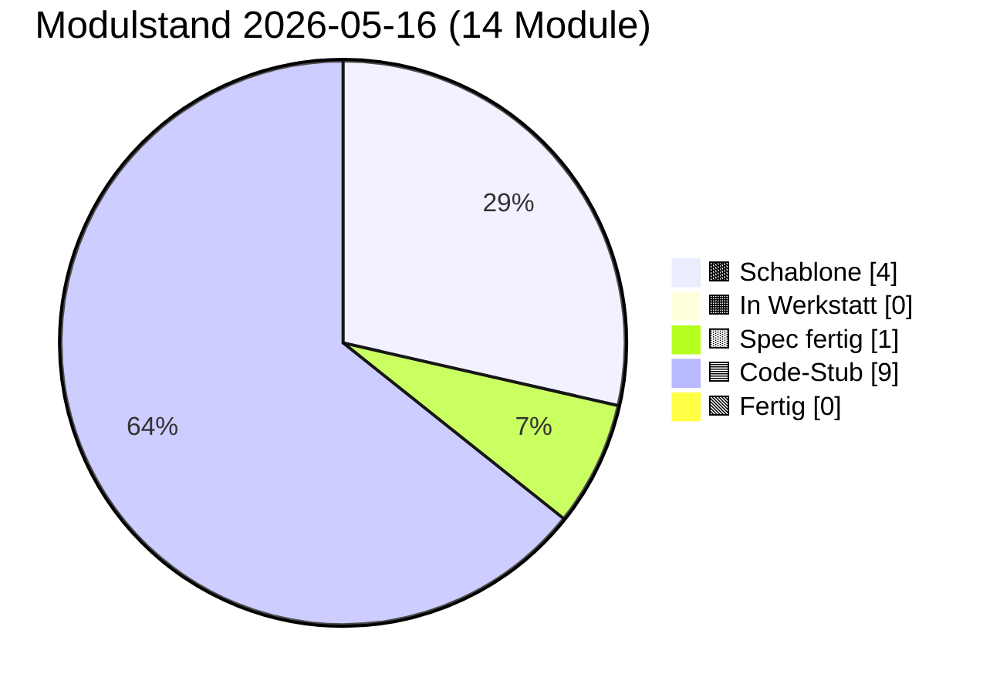

# PULS — lebender Status

**Format:** Jede Sitzung trägt unten einen Eintrag ein (neueste oben).
**Pflichtfelder pro Eintrag:** Datum · Sitzungs-Rolle · was getan · was offen · nächster sinnvoller Schritt.
**Begrenzung:** Diese Datei darf 400 Zeilen nicht überschreiten. Älteres ins
`docs/sessions/archiv/`-Verzeichnis als Übergabeprotokoll auslagern.

---

## Modulstand heute

<!-- Pie-Block ab hier wird automatisch aus status.json generiert.
     Nicht von Hand bearbeiten. Erzeugen mit:
     python3 scripts/update_puls_pie.py
     Aufruf-Pflicht: nach jeder status.json-Änderung. Siehe CLAUDE.md. -->

Farb-Mapping verbindlich in [INTERFACES.md §5](INTERFACES.md). Live-Bau-Puls
auf der [Sage-Page](../index.html) (Karte "Bau-Puls").

## Als nächstes ✨

Module mit Code-Stub, **Sichttest durch Klaus 2026-05-14 erledigt** —
ergab fünf reproduzierbare Cosinus-Messwerte (siehe Karte 04 Beleg-
Block), die in der Pflege-Sitzung 2026-05-14 zu `PROVIDER_MIN_MATCH`
0.55 → 0.80 geführt haben:

- 🟦 **[01 Storage](components/01_storage.md)** — geprüft 2026-05-14 (Klaus, im Browser); init/round-trip/Unknown-Store sauber, sechs Stores in DevTools sichtbar
- 🟦 **[02 Spore](components/02_spore.md)** — geprüft 2026-05-14 + 2026-05-16 (Klaus, im Browser); Identität deterministisch, Spore sortiert, Sign+Verify valide, Manipulation erkannt; **Bau 02.X Backup-Export Sichttest 2026-05-16 grün** — Knöpfe 6/7/7b alle drei Hauptpfade ohne Modul-Bug (Wrapper-Format `version:1` / `iterations:600000` / AES-GCM-256, `BackupOverwriteError`-Schutzpfad greift, force-Pfad funktioniert; siehe Karte 02 § Bauzustand-Zeile „Sichttest (Bau 02.X)"). Test-Panel-UX-Befund pendingBackup-Stash-Reset in Knopf 7 ist Folge-Mini-Pflege, kein Modul-Bug.
- 🟦 **[03 Embedding](components/03_embedding.md)** — geprüft 2026-05-14 (Klaus, im Browser); L2-Norm 1.0, gleicher Inhalt ≈0.95, Baseline für unverwandte Begriffe ungewöhnlich hoch
- 🟦 **[04 Match](components/04_match.md)** — geprüft 2026-05-14 (Klaus, im Browser); 3/5 Tests grün, 2 zeigten Schwellen-Drift → Pflege-Sitzung 2026-05-14 hat `PROVIDER_MIN_MATCH` und Test-Schwellen kalibriert
- 🟦 **[06 Heterokaryose](components/06_heterokaryose.md)** — Code geschrieben 2026-05-15 (Bau-Sitzung 06) + **Pflege Bau 06.1 Outbox-Lese-Pfad 2026-05-15** (`sbkim_hetero_outbox` als Anker-Quelle nach Spec-Sitzung 08, fail-soft Fallback bleibt); **Sichttest 2026-05-16 rasch grob durchgeklickt** (Klaus, Chrome auf Galaxy Tab S6 + DeX): Panel 06 mit 14 Knöpfen — alle Selbstchecks grün, Hauptpfade ohne Modul-Bug; voller Test-1–9-Lauf inkl. Test 9 `HETERO_MAX_ANCHORS`-Begrenzung folgt bei Bedarf. Fünf-Funktionen-API, kanonischer Sign/Verify-Pfad als **vierter Pfad bewusst dupliziert** (Single-File-PWA-Stil), neuer Store `sbkim_hetero_inbox` (DB-Version 1→2 additiv, Bau 06), Service-Worker dritter fetch-Listener-Pfad `/sbkim/heterokaryosis`; Anker-Quelle nach Pflege Bau 06.1 = `sbkim_hetero_outbox` fail-soft mit Spore-Single-Anker-Fallback. **Test 6 in Panel 07 muss in einem Folge-Sichttest neu durchgespielt werden** (Cleanup löscht jetzt sechs Stores statt fünf).

Code-Stub frisch aus den Bau-Sitzungen 2026-05-14/15, **Sichttest ausstehend bzw. teilweise erledigt:**

- 🟦 **[05 Anastomose](components/05_anastomose.md)** — Code geschrieben 2026-05-14 (Bau-Sitzung), Sichttest geprüft 2026-05-15 (Klaus, im Browser): 6 von 7 Tests grün im ersten Lauf (Setup, Test 1 passendes Match score=0.888, Test 3 Versions-Mismatch, Test 4 Signatur-Manipulation, Test 5 Re-Handshake, Test 6 forgetSibling, Test 7 listSiblings); **Test 2 (Domain-Mismatch / Tarantino-Vektor) Test-Bug** — score=0.854 statt erwartetem <0.80 (Tarantino-Filme spielen oft in Bars → zu nah am Mixarium-Cocktail-Vektor); Modul-Logik korrekt, `PROVIDER_MIN_MATCH=0.80` greift wie spezifiziert. **Pflege-Sitzung 2026-05-15** baut Panel 05 Test 2 auf **Vektor-Trias** um (Steuerrecht und Bilanzierung / Eisenbahnsignalanlagen / Quantenfeldtheorie), Pass-Check „mindestens einer der drei rejected mit score < 0.80"; Tarantino-Vergleichswert wird parallel als reiner Cosinus protokolliert; Karte 05 § Manueller Test Punkt 2 zieht mit. Klaus' zweiter Sichttest-Lauf nach Pflege folgt; falls alle drei Trias-Kandidaten über 0.80 liegen, eigene Folge-Pflege-Sitzung „Embedding-Baseline"
- 🟦 **[07 Apoptose](components/07_apoptose.md)** — Code geschrieben 2026-05-14 (Bau-Sitzung), Sichttest geprüft 2026-05-15 (Klaus, im Browser): 7 von 8 Tests grün im ersten Lauf (Setup + Tests 1/2/3/4/5/7 + Selbstcheck); **Test 6 (Self-Apoptose) deckte echten Modul-Bug auf**: nach Cleanup `getNodeId_wirft_NoIdentityError:false` trotz `stores_alle_leer:true` — Modul 02's In-Memory-`identityCache` wurde nicht durch externes `storage.clear` invalidiert (Modul 07 wusste nichts vom Modul-02-Cache). Folgeschaden: Tests 1/2/3/8 nach Test 6 mit „Keine Identität in sbkim_keys[main]". **Pflege-Sitzung 2026-05-15** ergänzt Modul 02 um öffentliche `resetIdentityCache() → void` (sync, idempotent, leert nur Closure-Cache, kein Storage-Eingriff) und Modul 07's Cleanup ruft sie als letzten Schritt nach den `storage.clear`-Aufrufen — heilige Tafeln (INTERFACES.md §1 Modul 02 + §1 Modul 07 + §6 + Karten 02 + 07) ziehen mit. Re-Sichttest 2026-05-15 bestätigte den Cache-Fix: `getNodeId_wirft_NoIdentityError:true`. Modul 07 Sichttest 8/8 grün. **Pflege Cleanup-Reihenfolge Bau 06 (2026-05-15)** erweitert `CLEANUP_ORDER` additiv um `sbkim_hetero_inbox` (Position 4 zwischen `sbkim_legacy_inbox` und `sbkim_spore`); Test 6 muss in einem Folge-Sichttest neu durchgespielt werden (jetzt 6 statt 5 Stores zu prüfen).
- 🟦 **[00 Doku-Fenster](components/00_doku_fenster.md)** — Code geschrieben 2026-05-14 (Bau-Sitzung), Sichttest geprüft 2026-05-15 (Klaus, im Browser): 5 von 6 Tests grün im ersten Lauf (Setup, Test 2 5-Klick-Simulation, Test 3 4-Klick + Timeout, Test 5 TTL-Sweep, Selbstcheck-Hinweis); **Test 4 Test-Bug** mit Mini-Werten 81/100 (freeBytes=19 Bytes ist trivial < 50 MiB → `warningLevel:"both"` statt erwartetem `"ratio"`) → **Pflege-Sitzung 2026-05-15** repariert mit GiB-Skalierung (`usage:8.1 GiB, quota:10 GiB` → freeBytes ≈ 1.9 GiB → `warningLevel:"ratio"` sauber); Modul-Vertrag und INTERFACES.md unangetastet

Spec frisch, **Bau ausstehend**:

- 🟨 **[09 Einbau-PWA](components/09_einbau_pwa.md)** — Karte vollständig 2026-05-14 (Spec-Sitzung; Anleitung, kein JS-Modul), **Pflege-Sitzung 2026-05-15 erweitert auf neun Schritte** (Schritt 9 neu: `SbkimApoptose.init()` + `SbkimDoku.init({searchIconSelector:...})` + optionaler TTL-Sweep nach Handshake); `<script>`-Reihenfolge in Schritt 2 zieht 07 + 00 nach (`01 → 02 → 03 → 04 → 05 → 07 → 00`); Sichtkontroll-Block jetzt vier Pflicht-Punkte (sieben Selbstcheck-Zeilen + sechs IndexedDB-Stores + zwei live-Endpunkte + 5-Klick-Geste am Such-Symbol); Datei-Pfad-Konvention (SW im Endknoten-Repo-Root, sieben JS-Module inline oder unter `sbkim/`); Spore-Endpunkt `/sbkim/spore.json` verbindlich; SW-Scope-Falle dokumentiert; `domainVector`-Pflicht-Frage **entschieden Variante A (Soft-Pflicht im Andock-Workflow, kein Hauptversions-Sprung)** — Modul 02 / §0 / §2 bleiben unverändert. **Bau-Sitzung 2026-05-15 vor Schritt 1 sauber abgebrochen** (Befund-Sitzung): beide Endknoten haben aktiven `app-sw.js` im Repo-Root (Mein-Mixarium Z. 12543, Mein-Rezeptbuch Z. 10453), Karte 09 antizipiert diesen Fall nicht; zusätzlich Karte 09 § Sichtkontrolle implizit auf Desktop-DevTools gemünzt — Klaus' Tablet (Galaxy Tab S6 + DeX) braucht Eruda-Pfad. **Vor erneuter Bau-Sitzung 09** zwei Karten-Lücken in einer Pflege-Sitzung Karte 09 zu schließen (Empfehlung Option α: Patch in bestehenden `app-sw.js`; plus Eruda-Pfad für Tablet-Sichtkontrolle). Details in [Übergabeprotokoll 2026-05-15 Bau-09-blockiert](sessions/archiv/2026-05-15_bau-09-blockiert-app-sw.md).

Letzter Bau frisch (Bau-Sitzung 2026-05-15), **Sichttest geprüft 2026-05-15:**

- 🟦 **[08 UI-Demo](components/08_ui_demo.md)** — Code geschrieben 2026-05-15 (Bau-Sitzung 08). Endknoten-Andocker-UI für die zwei Stellen, die Modul 06 (Heterokaryose) braucht, aber nicht selbst füllt: `sbkim_hetero_outbox` (Anker-Vorrat) und `sbkim_siblings[peerNodeId].heterokaryosisOptIn` (additives Opt-In-Flag pro Geschwister). Fünf-Funktionen-API (`init/listOutbox/addOutboxAnchor/removeOutboxAnchor/setSiblingHeteroOptIn`), sechs benannte Error-Klassen im Factory-Stil analog Modul 00, drei Test-Brücken (`_clearOutbox`, `_addPseudoSibling` ohne Opt-In-Flag, `_clearPseudoSiblings`), synchroner Selbstcheck. **Storage-only** (kein Netz, kein Embedding, keine Signatur — Vektor-Erzeugung ist Aufrufer-Pflicht). `addOutboxAnchor`-Check-Reihenfolge: (1) Label sync, (2) Vektor sync, (3) async-Voll-Check (`OutboxFullError` nur bei NEUEM Label); Überschreiben eines bekannten Labels bleibt erlaubt. `setSiblingHeteroOptIn` strikt boolean (`1`, `"true"` werfen `InvalidOptInArgError`); Co-Schreiber-Disziplin via `Object.assign`. Panel 08 in `tests/manual_check.html` mit acht Knöpfen (Setup + sechs Test-Punkte + Selbstcheck-Hinweis); Panel-Status von Werkstatt-Stub `idle` auf `ok "Code-Stub"`. **Self-Apoptose-Knopf bewusst NICHT in Panel 08** (Spec-Sitzung 08-Entscheidung respektiert). `node --check src/modules/08_ui_demo.js` grün, alle 10 Inline-`<script>`-Blöcke validiert. **Sichttest geprüft 2026-05-15 (Klaus, im Browser): 6/6 Test-Punkte grün** (Pflege-Sitzung Sichttest-Resultate 2026-05-15).

Empfehlung Hauptsitzung: **Klaus' Re-Andock beider Endknoten mit
PWA-Suffix**. Die Pflege-Sitzung 2026-05-16 „Karten 01 + 09 PWA-
Suffix" hat die Architektur-Erweiterung abgeschlossen (Modul 01 hat
jetzt `init({dbSuffix})`, Karten 01 + 09 und INTERFACES.md §1 Modul 01
sind nachgezogen, `PROTOCOL_VERSION` bleibt `"0.1"`, Modul 02 unangetastet).
Nächster Schritt liegt **in Klaus' Endknoten-Repos**:

1. In **beiden** Endknoten-Repos (`Mein-Mixarium`, `Mein-Rezeptbuch`)
   muss `sbkim/sbkim-init.js` erweitert werden: vor dem bestehenden
   `await SbkimAnastomose.init()` einen Aufruf
   `await SbkimStorage.init({ dbSuffix: "mixarium" })` (bzw.
   `"rezeptbuch"`) hinzufügen.
2. In beiden Tab-Sessions `__sbkimErzeugeSpore()` erneut triggern
   (Klaus in der jeweiligen Eruda-Konsole) → neue, getrennte nodeIds
   pro PWA.
3. Neue `spore.json` jeweils nach `~/<Endknoten>/sbkim/spore.json`
   verschieben + Commit + Push (überschreibt die alte Pages-Spore).
4. Erst nach Re-Andock kann eine Folge-Sitzung `status.json`
   `pingStatus` von `"blocked-origin-collision"` auf `"live"`
   wechseln (sobald Klaus den ersten Cross-Knoten-Handshake gefahren
   hat) und die `nodeId`-Werte in der Endknoten-Tabelle aktualisieren.

Andere offene Punkte (Mini-Pflege „Sushi-Kategorie sichtbar machen"
in Mein-Mixarium, INTERFACES.md §6 Tabellen-Bug) sind unverändert
offen. Details im [Übergabeprotokoll 2026-05-16 Pflege PWA-Suffix](sessions/archiv/2026-05-16_pflege-pwa-suffix-karten-01-09.md),
zur Andock-Hintergrund [Übergabeprotokoll 2026-05-16 Andock
Mein-Rezeptbuch](sessions/archiv/2026-05-16_andock-mein-rezeptbuch-iteration-3-live.md)
und der zugehörigen [Mixarium-Andock-Übergabe](sessions/archiv/2026-05-16_andock-mein-mixarium-iteration-3-live.md).

---

## Schnellüberblick

| Modul | Spec | Code | Manueller Sichttest | Anmerkung |
|---|---|---|---|---|
| 00 doku_fenster | Spec fertig (2026-05-14) | Code-Stub (2026-05-14, Pflege Persistenz-Strategie verbinden 2026-05-16) | geprüft 2026-05-15 (Klaus) — 5/6 Tests grün im ersten Lauf, Test 4 Test-Bug in Pflege-Sitzung 2026-05-15 mit GiB-Skalierung repariert; Sichttest Pflege Persistenz-Tipp-Zeile ungeprüft (headless, wartet auf Klaus) | Sechs-Funktionen-API (`init/open/close/isOpen/getStatusSnapshot/recordSighttest`), reines Lese-/Trigger-Modul, alleiniger Schreiber `sbkim_doku_meta`, 5-Klick-Geste mit 3s-Zeitfenster, Modal mit Backdrop und MutationObserver-Mount, Quota-Doppel-Schwelle (80% / 50 MiB), Self-Apoptose bewusst NICHT in 00. **Pflege Persistenz-Strategie verbinden 2026-05-16:** DokuStatus um `storagePersisted: boolean \| null` erweitert (liest `SbkimStorage._meta.storagePersisted` fail-soft); Modal-Render-Pfad zeigt blaue Backup-Tipp-Zeile (`DOKU_BACKUP_TIP_TEXT` modul-lokal), wenn `storagePersisted === false` ODER Quota-Frühwarnung greift — Hinweis-only, kein Modul-02-Aufruf. Schließt Stufe (3) und damit den gesamten Querschnitt „Identitäts-Persistenz". |
| 01 storage | Spec fertig (2026-05-14) | Code-Stub (2026-05-14, Pflege PWA-Suffix + Pflege Storage-Persist 2026-05-16) | geprüft 2026-05-14 + 2026-05-16 (Klaus) — fünfter Knopf „Persist-Status zeigen" liefert `_meta.storagePersisted: true` (Chrome auto-bei-PWA) | IndexedDB-Wrapper |
| 02 spore | Spec fertig (2026-05-14, Pflege Stamm/Gast-Felder 2026-05-15, Pflege Spec Backup-Export Stufe 2 2026-05-16) | Code-Stub (2026-05-14, Pflege Cache-Invalidate 2026-05-15, Pflege Stamm/Gast-Durchreichung 2026-05-15, Bau 02.X Backup-Export 2026-05-16) | geprüft 2026-05-14 (Klaus) + 2026-05-15 (Cache-Invalidate-Pflege via Sichttest 07) + 2026-05-16 (Klaus, Bau 02.X Backup-Export Knöpfe 6/7/7b alle drei grün; Test-Panel-UX-Befund Knopf 7 pendingBackup-Stash-Reset offen als Mini-Pflege) | Ed25519-Identität, Singleton, base64url-sha256-rawpub; +`resetIdentityCache()` aus Pflege-Sitzung 2026-05-15 (Pflicht-Hook für Apoptose-Cleanup). **Spore-JSON Optionale Felder additiv erweitert** 2026-05-15 (Spec-Sitzung Stamm/Gast): `stammCategories: string[]` + `guestCategories: string[]`, signaturpflichtig wenn vorhanden, Disjunktheit als Hosting-Pflicht (kein Verify-Abbruch). Sign-/Verify-Pfad unverändert. **`generateOwnSpore` Code-Allow-List nachgezogen** 2026-05-15 (Bau 02 Stamm/Gast): zwei Zeilen analog zu `domainKeywords` — ohne diese Pflege würden Stamm/Gast-Felder beim Andock still ignoriert. **Spec Backup-Export Stufe 2 2026-05-16** (Identitäts-Persistenz Stufe 2): zwei neue Funktionen `exportBackup(password) → Promise<SbkimBackupBlob>` + `importBackup(blob, password, options?)` (PBKDF2-SHA256 600 000 + AES-GCM-256, Klartext-Payload = Identität + Geschwister, defensiv per Default — `BackupOverwriteError`); drei §0-Konstanten verankert (`BACKUP_FORMAT_VERSION=1` / `BACKUP_KDF_ITERATIONS=600000` / `BACKUP_PASSWORD_MIN_LEN=8`); fünf neue Error-Klassen (`InvalidBackupPasswordError` / `BackupDecryptError` / `BackupVersionMismatchError` / `BackupSchemaError` / `BackupOverwriteError`). KEIN Spore-Feld dazu (Backup-Schicht separat, `PROTOCOL_VERSION` bleibt `"0.1"`). **Bau-Sitzung 02.X ausstehend**, KEIN Code in `src/modules/02_spore.js`. |
| 03 embedding | Spec fertig (2026-05-14) | Code-Stub (2026-05-14) | geprüft 2026-05-14 (Klaus) | semantischer Vektor |
| 04 match | Spec fertig (2026-05-14, Pflege Stamm/Gast-Hinweis 2026-05-15) | Code-Stub (2026-05-14) | geprüft 2026-05-14 (Klaus) | Vektorvergleich, modus-frei; Pflege-Sitzung 2026-05-14 PROVIDER_MIN_MATCH 0.55→0.80. **Karte 04 § Stamm/Gast-Hinweis 2026-05-15** (Spec-Sitzung Stamm/Gast): Match bleibt unverändert; Stamm/Gast ist Klassifikations-Schicht auf Daten-Ebene, kein Vektor-Math; explizit kein Dämpfungsfaktor, keine zweite Schwelle. |
| 05 anastomose | Spec fertig (2026-05-14) | Code-Stub (2026-05-14) | geprüft 2026-05-15 (Klaus) — 6/7 Tests grün im ersten Lauf, Test 2 Test-Bug (Tarantino-Vektor zu nah an Cocktails 0.854) in Pflege-Sitzung 2026-05-15 als Vektor-Trias repariert (3 Kandidaten parallel, Pass = ≥ 1 unter 0.80); Klaus' zweiter Lauf nach Pflege folgt | Handshake; Fünf-Funktionen-API, bidirektional, kanonisch signiert, Schwelle aus Modul 04; SW Variante A (Page-Hosted) |
| 06 heterokaryose | Spec fertig (2026-05-15) | Code-Stub (2026-05-15, Pflege Bau 06.1 Outbox-Lese-Pfad 2026-05-15) | rasch grob durchgeklickt 2026-05-16 (Klaus, Tab S6 + DeX) — Panel 06 14 Knöpfe Selbstchecks + Hauptpfade grün; voller Test-1–9-Lauf folgt bei Bedarf | Datenaustausch unter Geschwistern; Fünf-Funktionen-API (`init/requestHeterokaryosis/receiveHeterokaryosis/listHeterokaryosis/forgetHeterokaryosis`), Pull-Pattern, Opt-In beidseits (additiv auf `sbkim_siblings`), kanonisch wie 05/07 (vierter Sign-Pfad bewusst dupliziert), neuer Store `sbkim_hetero_inbox` (Komposit-Schlüssel `peerNodeId\|ts`, DB-Version 1→2 additiv), SW Variante A mit drittem fetch-Listener `/sbkim/heterokaryosis` (Message-Typ `SBKIM_HETEROKARYOSIS_REQUEST`); Modul 07 Cleanup-Reihenfolge nachgezogen (`sbkim_hetero_inbox` zwischen `sbkim_legacy_inbox` und `sbkim_spore`). **Anker-Quelle nach Pflege Bau 06.1 (2026-05-15): voller Outbox-Lese-Pfad implementiert** — `sbkim_hetero_outbox` (Spec-Sitzung 08, v=3-Store) wird fail-soft gelesen, max. `HETERO_MAX_ANCHORS=5` Anker absteigend nach `addedAt`; Fallback auf Spore-Single-Anker bei leerer/fehlender Outbox bestehen geblieben. `src/modules/01_storage.js` `DB_VERSION` 2 → 3 (additive Migration v=3, `STORES_V3=["sbkim_hetero_outbox"]`); Panel 06 mit 14 Knöpfen; Test 9 (`HETERO_MAX_ANCHORS`-Begrenzung) voll abgedeckt (sechs Outbox-Einträge → Response liefert genau fünf, neueste zuerst). Sichttest ausstehend (headless gebaut, wartet auf Klaus' Browser) |
| 07 apoptose | Spec fertig (2026-05-14) | Code-Stub (2026-05-14, Pflege Cache-Invalidate 2026-05-15) | geprüft 2026-05-15 (Klaus) — **8/8 Tests grün** nach Pflege 02+07-Cache-Invalidate (Re-Sichttest 2026-05-15 bestätigte `getNodeId_wirft_NoIdentityError:true`); Test 6 (Self-Apoptose) hatte einen Modul-02-Cache-Bug aufgedeckt, der in Pflege 2026-05-15 mit `resetIdentityCache()` als Cleanup-Schritt 6 behoben wurde. | Selbstlöschung mit signiertem Vermächtnis; zweistufige Self-Apoptose (Token 60 s), Vermächtnis-Inbox, TTL-Vergessen explizit durch Andocker; kanonischer Sign/Verify-Pfad aus 02/05 dritter Pfad dupliziert; SW erweitert um `/sbkim/legacy` (gemeinsamer fetch-Listener mit `/sbkim/anastomosis`); Panel 07 mit zehn Knöpfen; Cleanup-Schritt 6 ruft `SbkimSpore.resetIdentityCache()` nach Pflege-Sitzung 2026-05-15 |
| 08 ui_demo | Spec fertig (2026-05-15) | Code-Stub (2026-05-15) | geprüft 2026-05-15 (Klaus) — 6/6 Test-Punkte grün | Endknoten-Pflege-UI für `sbkim_hetero_outbox` und `sbkim_siblings.heterokaryosisOptIn`; Fünf-Funktionen-API (`init/listOutbox/addOutboxAnchor/removeOutboxAnchor/setSiblingHeteroOptIn`), sechs benannte Error-Klassen im Factory-Stil analog Modul 00 (`UiDemoDependenciesError` / `InvalidAnchorLabelError` / `InvalidAnchorVectorError` / `OutboxFullError` / `UnknownSiblingError` / `InvalidOptInArgError`), drei Test-Brücken (`_clearOutbox`, `_addPseudoSibling` ohne Opt-In-Flag, `_clearPseudoSiblings`). Modul 08 alleiniger Schreiber von `sbkim_hetero_outbox` (v=3-Store aus Pflege Bau 06.1, Schlüssel `label`, max. `HETERO_OUTBOX_MAX_ENTRIES`=5, absteigend nach `addedAt`, Überschreiben statt Verdrängen) und Co-Schreiber für `sbkim_siblings.heterokaryosisOptIn` (Modul 05 unangetastet, Karte-01-Vertragserweiterung). **Storage-only** (kein Netz, kein Embedding, keine Signatur — Vektor-Erzeugung ist Aufrufer-Pflicht). `addOutboxAnchor`-Check-Reihenfolge: (1) Label sync, (2) Vektor sync, (3) async-Voll-Check (`OutboxFullError` nur bei NEUEM Label); Überschreiben eines bekannten Labels bleibt erlaubt. `setSiblingHeteroOptIn` strikt boolean (`1`, `"true"` werfen `InvalidOptInArgError`); Co-Schreiber-Disziplin via `Object.assign({}, sibling, {heterokaryosisOptIn})`. Self-Apoptose-Knopf bewusst NICHT in Panel 08 (Spec-Sitzung 08-Entscheidung respektiert). Panel 08 in `tests/manual_check.html` mit acht Knöpfen (Setup + sechs Test-Punkte + Selbstcheck-Hinweis); Panel-Status von Werkstatt-Stub `idle` auf `ok "Code-Stub"`. **Sichttest geprüft 2026-05-15 (Klaus): 6/6 Test-Punkte grün im ersten Lauf** (Pflege-Sitzung Sichttest-Resultate 2026-05-15). |
| 09 einbau_pwa | Spec fertig (2026-05-14, Pflege Schritt 9 + 07/00 2026-05-15, Pflege App-SW-Koexistenz 2026-05-15) | — (Anleitung, kein JS-Modul) | — | Andock-Anleitung — **9 Schritte** (Schritt 9 neu aus Pflege-Sitzung 2026-05-15: SbkimApoptose.init + SbkimDoku.init + optionaler TTL-Sweep nach Handshake); `<script>`-Reihenfolge 01→02→03→04→05→07→00; Soft-Pflicht `domainVector` im Andock-Workflow (kein Hauptversions-Sprung); SW im Endknoten-Repo-Root, `/sbkim/spore.json` als Spore-Endpunkt — plus Pflege App-SW-Koexistenz (2026-05-15): Schritt 3 a/b-Verzweigung (Pre-Flight-Check → 3a `register('sbkim-sw.js')` für PWA ohne eigenen SW, 3b `importScripts('./sbkim-sw.js')` im bestehenden App-SW für PWA mit eigenem SW), achtes Risiko „App-SW-Überschreibung", `sbkim-sw.js` `SBKIM_SW_STANDALONE`-Flag rückwärtskompatibel (Default `true`, `false` für Variante 3b) |
| 10 reputation | Stub (Schutz-Backlog) | — | — | Knoten-Reputation, Priorität niedrig |
| 11 rate_limit | Stub (Schutz-Backlog) | — | — | Rate-Limit & TTL, Priorität niedrig |
| 12 blocklist | Stub (Schutz-Backlog) | — | — | manuelle Sperrliste, Priorität niedrig |
| 14 diffusion | Stub (Diffusion-Backlog) | — | — | konsensuell-empfehlende Spore-Diffusion via Handshake-Erweiterung (Pfad 2 verbindlich, Pfad 1 = Default-Status-quo, Pfad 3 verworfen wegen Empfangsmodus-Prinzip); Spec ausstehend bis Netz ≥ 10 Geschwister oder erfolgreicher Live-Andock + Wachstums-Bedürfnis; Priorität niedrig — **plus Sage-Page-Sichtbarmachung 2026-05-15** (Karten 4/13/14 ziehen `diffusionBacklog[]` parallel zu `schutzBacklog[]`) |

Statuscodes: `—` (nichts) · `Schablone` · `Stub` · `Entwurf` · `Review` · `stabil` · `eingebaut`

## Endknoten (externe Repos des Betreibers)

| App | URL | Domäne | SBKIM-Stand |
|---|---|---|---|
| Rezeptbuch | https://lausiklauskn-png.github.io/Mein-Rezeptbuch/ | Kochrezepte (Stamm 7) — Drinks + Snacks als Überraschungs-Plus (Gast 11) | **integriert 2026-05-16** (Bau-Sitzung 09 Iteration 3, mit Klaus am Termux) · Spore live unter `https://lausiklauskn-png.github.io/Mein-Rezeptbuch/sbkim/spore.json` mit `stammCategories[7]` + `guestCategories[11]` + `domainVector[384]` · App-SW Variante 3b · Eruda-Konsole zeigt alle sieben Modul-Selbstchecks plus drei `sbkim-init.js`-Init-Zeilen grün. **nodeId identisch zu Mein-Mixarium** (`1h5OPqqq3lPJPPxdXIyAjkzdHgYCfkuHx5ZEjZguOq0`) wegen **IndexedDB-Origin-Kollision** auf GitHub Pages Project-Sites (beide PWAs unter Origin `lausiklauskn-png.github.io` teilen `sbkim_keys["main"]`). Cross-Knoten-Handshake zwischen Mein-Rezeptbuch und Mein-Mixarium **technisch nicht möglich** (`pingStatus: "blocked-origin-collision"`). Architektur-Erweiterung in Karten 01 + 09 in Folge-Pflege-Sitzung notwendig. |
| Mixarium | https://lausiklauskn-png.github.io/Mein-Mixarium/ | Cocktails / Drinks (Stamm 8) — Knabbereien / Fingerfood (Gast 2) | **integriert 2026-05-16** (Bau-Sitzung 09 Iteration 3, mit Klaus am Termux) · nodeId `1h5OPqqq3lPJPPxdXIyAjkzdHgYCfkuHx5ZEjZguOq0` · Spore live unter https://lausiklauskn-png.github.io/Mein-Mixarium/sbkim/spore.json mit allen Pflicht- und optionalen Feldern inkl. `stammCategories[8]` + `guestCategories[2]` + `domainVector[384]` · App-SW Variante 3b (`importScripts('./sbkim-sw.js')` im bestehenden `app-sw.js`) · Eruda-Konsole zeigt alle sieben Modul-Selbstchecks plus drei `sbkim-init.js`-Init-Zeilen grün. **nodeId identisch zu Mein-Rezeptbuch** wegen IndexedDB-Origin-Kollision (siehe nächste Zeile). Cross-Knoten-Handshake gegen Mein-Rezeptbuch **technisch nicht möglich** (`pingStatus: "blocked-origin-collision"` von beiden Seiten). Architektur-Erweiterung in Karten 01 + 09 in Folge-Pflege-Sitzung notwendig. |

## Offene Querschnitts-Fragen

- **Sichtbarkeits-Lampen in der Endknoten-PWA** (eingetragen
  2026-05-16, Klaus-Vorschlag nach Pflege PWA-Suffix). Idee von
  Klaus: zwei kleine Lampen oben rechts in der PWA, eine zeigt
  „Knoten lebt" (Identität geladen, Storage offen, Module geladen),
  die zweite blinkt kurz bei jedem Anastomose- oder Heterokaryose-
  Verkehr („gerade kommuniziert"). Soll für Endknoten-Nutzer und im
  Observatorium **sichtbar** machen, dass das Netz lebt — viel
  zugänglicher als das 5-Klick-Doku-Fenster oder Eruda. Setzt
  Modul 00 (Doku-Fenster) als Datenquelle voraus und braucht zwei
  bis drei CustomEvents in Modul 05/06 (`sbkim:handshake-start`/
  `sbkim:handshake-end`/`sbkim:hetero-pull-start`/…). **Status:**
  Spec ausstehend; eigene kleine Karte (vermutlich Karte 15 oder
  ein additiver Block in Karte 00). Spec-Sitzung sinnvoll, **nach**
  dem ersten erfolgreichen Cross-Knoten-Handshake — dann ist klar,
  was die zweite Lampe tatsächlich anzeigen soll. Geschätzt ~60 Min
  headless für Spec, ähnlich für Bau-Stub.

- **Andock-Bundle (`sbkim-bundle.js`)** als künftiger Ein-Datei-
  Andock-Pfad (eingetragen 2026-05-16, Klaus-Vorschlag nach
  Pflege PWA-Suffix). Heutiger Karte-09-Pfad (9 Schritte mit awk,
  Termux, Eruda, Spore-mv) ist Pionier-Tanz — funktioniert für
  Klaus, aber kein Nicht-Programmierer würde das nachmachen. Vision:
  Endknoten-Betreiber kopiert **eine** Datei (`sbkim-bundle.js`) +
  fügt **einen** `<script>`-Tag ein. Das Bundle erzeugt beim ersten
  Laden Identität, Domain-Vektor, Spore, klinkt sich beim Service-
  Worker ein und macht den Status sichtbar (s. Lampen oben). **Setzt
  voraus:** drei oder mehr Endknoten im Netz, damit der Aufwand
  spürbar wird (heute mit zwei reicht der Direkt-Pfad mit Klaus).
  **Status:** Spec ausstehend; eigene Karte (vermutlich Karte 16 oder
  09.2). Ist eine echte Architektur-Frage (Bundling-Strategie,
  Versions-Update-Pfad, wie liefert der Bundle die Andock-Konfig),
  keine reine Pflege.

- ~~**Identitäts-Persistenz** (eingetragen 2026-05-16 als gebündelte
  Erinnerung)~~ — **alle drei Stufen 2026-05-16 final gelöst.**
  Klaus' Befürchtung „tiefes Browserspeicher-Löschen tötet die
  nodeId" war Anlass; die drei-stufige Architektur „Spur stirbt
  nicht" steht jetzt komplett:
  (1) ~~`navigator.storage.persist()` beim `Storage.init`~~ —
  **gelöst durch Pflege „Storage-Persist" 2026-05-16.** Modul 01
  ruft nach erfolgreichem DB-Open `navigator.storage.persist()`
  fail-soft an; `_meta.storagePersisted` zeigt `true`/`false`/`null`
  als Live-Zustand. Klaus' Sichttest (Knopf 5 Panel 01) liefert
  `true` auf Chrome auto-bei-PWA. Details im [Übergabeprotokoll
  2026-05-16 Pflege Storage-Persist](sessions/archiv/2026-05-16_pflege-01-storage-persist.md).
  (2) ~~Backup-Export passwort-verschlüsselt in Modul 02~~ —
  **gelöst durch Spec Backup-Export Stufe 2 + Bau 02.X
  Backup-Export 2026-05-16.** `exportBackup` / `importBackup`
  PBKDF2-SHA256 600 000 + AES-GCM-256; Klaus' Sichttest 2026-05-16
  Knöpfe 6/7/7b grün (Wrapper-Format korrekt, `BackupOverwriteError`-
  Schutzpfad greift, force-Pfad funktioniert). Details im
  [Übergabeprotokoll Spec](sessions/archiv/2026-05-16_spec-02-backup-export.md)
  und [Bau 02.X](sessions/archiv/2026-05-16_bau-02x-backup-export.md).
  (3) ~~Quota-Frühwarnung im Doku-Fenster + Backup-Tipp-Zeile~~ —
  **gelöst durch Pflege „Persistenz-Strategie verbinden"
  2026-05-16.** Modul 00 `DokuStatus` um `storagePersisted: boolean
  | null` erweitert (liest `SbkimStorage._meta.storagePersisted`
  fail-soft); Modal-Render-Pfad zeigt blaue „Backup empfohlen"-
  Hinweis-Zeile mit `DOKU_BACKUP_TIP_TEXT`, wenn `storagePersisted
  === false` ODER Quota-Frühwarnung greift. Hinweis-only — kein
  Knopf, kein Modul-02-Aufruf (Aufrufer-Pflicht-Trennung).
  Details im [Übergabeprotokoll 2026-05-16 Pflege Persistenz-
  Strategie verbinden](sessions/archiv/2026-05-16_pflege-persistenz-strategie-verbinden.md).

- ~~**IndexedDB-Origin-Kollision bei GitHub-Pages-Project-Sites**~~ —
  **gelöst 2026-05-16 durch Pflege-Sitzung „Karten 01 + 09 PWA-
  Suffix".** Variante (a) aus dem ursprünglichen Eintrag (PWA-Suffix
  in Storage-DB-Name) umgesetzt: Modul 01 akzeptiert jetzt optional
  `init({ dbSuffix: "<wert>" })` und öffnet die DB unter dem Namen
  `sbkim_<dbSuffix>` statt der Default-DB `sbkim`. Pattern für
  Suffix: `^[a-z0-9_-]+$` (sonst synchroner `InvalidDbSuffixError`).
  Modul 02 unangetastet (`IDENTITY_KEY = "main"` weiterhin Singleton-
  Schlüssel innerhalb der jeweiligen DB — Trennung passiert eine
  Schicht tiefer, auf DB-Namen-Ebene). Modul 05 unangetastet
  (`SbkimAnastomose.init()` weiterhin ohne Optionen; Idempotenz von
  `Storage.init` macht den zwei-Aufruf-Pfad sauber). Karten 01 + 09
  + INTERFACES.md §1 Modul 01 + §6 nachgezogen. `PROTOCOL_VERSION`
  bleibt `"0.1"`. Klaus' Re-Andock beider Endknoten (in beiden
  `sbkim-init.js` `SbkimStorage.init({dbSuffix})` vor
  `SbkimAnastomose.init()` einfügen + `__sbkimErzeugeSpore()`
  triggern + neue Spore deployen) steht aus — danach wechselt
  `status.json` `pingStatus` von `"blocked-origin-collision"` auf
  `"live"` für beide Endknoten in einer Folge-Sitzung. Variante
  (b) (eigene Subdomain mit Custom Domain) bleibt als langfristige
  Option dokumentiert. Details im
  [Übergabeprotokoll 2026-05-16 Pflege PWA-Suffix](sessions/archiv/2026-05-16_pflege-pwa-suffix-karten-01-09.md);
  Reproduktion der ursprünglichen Kollision im
  [Übergabeprotokoll 2026-05-16 Andock Mein-Rezeptbuch](sessions/archiv/2026-05-16_andock-mein-rezeptbuch-iteration-3-live.md).
- ~~**Karten-Lücke Karte 09 / Tablet-Sichtkontrolle**~~ — **gelöst
  2026-05-15 durch Pflege-Sitzung Karte 09 „App-SW-Koexistenz +
  Tablet-Sichtkontrolle" (diese Sitzung).** Karte 09 § Sichtkontrolle
  hat jetzt einen § Tablet-Variante-Sub-Block mit Eruda-Pfad
  (in-Page-DevTools-Polyfill, gepinnt auf `eruda@3`, jsdelivr-CDN,
  touch-bedienbar). Mapping der vier Pflicht-Punkte auf Eruda-Tabs
  (Console / Resources→IndexedDB / Network / 5-Klick-Geste).
  Verbindlicher Hinweis „nach Sichtkontrolle wieder entfernen —
  kein Produktiv-Einbau, kein SBKIM-Modul, kein Datenschutz-Stein".
  Details im Übergabeprotokoll
  [2026-05-15 Pflege Karte 09 App-SW + Tablet](sessions/archiv/2026-05-15_pflege-karte-09-app-sw-tablet.md).
- ~~**Karten-Lücke Karte 09 / Andocken in PWA mit bestehendem
  Service-Worker**~~ — **gelöst in zwei Pflege-Sitzungen 2026-05-15:**
  (a) Pflege App-SW-Koexistenz (PR #31, 2026-05-15) hat Schritt 3
  in 3a/3b verzweigt mit Pre-Flight-Check
  (`navigator.serviceWorker.getRegistration('./')`),
  Variante 3b = `importScripts('./sbkim-sw.js')` in bestehendem
  App-SW (= Option α), `SBKIM_SW_STANDALONE`-Flag in
  `src/sbkim-sw.js` (Default `true`, `false` für 3b), achtes
  Risiko „App-SW-Überschreibung" in § Risiken; (b) Pflege Karte 09
  „App-SW-Koexistenz + Tablet-Sichtkontrolle" (diese Sitzung,
  2026-05-15) hat zusätzlich **Variante 3c** als nachrangige
  Übergangslösung dokumentiert (SBKIM-SW unter `/sbkim/` mit Scope-
  Einschränkung = Option β; Option γ „App-SW ersetzen" entspricht
  der heutigen falschen Anwendung von Variante 3a auf eine PWA mit
  App-SW und ist als achtes Risiko bereits dokumentiert) plus eine
  Tabelle „Wann welche Variante?" als Andock-Entscheidungshilfe.
  Details im Übergabeprotokoll
  [2026-05-15 Pflege Karte 09 App-SW + Tablet](sessions/archiv/2026-05-15_pflege-karte-09-app-sw-tablet.md).
- ~~Werden Domain-URLs der Endknoten-Apps in `docs/PULS.md` /
  `status.json` aufgenommen oder nur lokal in deren `index.html`?~~ —
  **teilweise gelöst 2026-05-15** in abgebrochener Bau-Sitzung 09:
  Pages-URLs in PULS-Tabelle „Endknoten" und `status.json`
  `endknoten[*].url` eingetragen (`integrated:false` bleibt — Andock
  nicht erfolgt). Eintrag in `docs/INTERFACES.md` weiterhin offen.
- Werden Domain-URLs der Endknoten-Apps in `docs/INTERFACES.md` aufgenommen
  oder nur lokal in deren `index.html`? → Entscheidung steht aus.
- Embedding-Modell: bleibt es bei Default `Xenova/multilingual-e5-small`?
  → ja, bis Gegenargument. Quelle: `sbkim_integration.md` §4.1.
- ~~Speicherort der Spore bei GitHub Pages: `/.well-known/sbkim/spore.json`
  oder Alias `/sbkim/spore.json`?~~ — **gelöst 2026-05-14 in Spec-Sitzung
  09:** verbindlicher Andock-Default ist `/sbkim/spore.json` (Alias aus
  §3 INTERFACES). Begründung in `docs/components/09_einbau_pwa.md`
  Schritt 7: GitHub-Pages-Project-Sites haben mit `.well-known/` die
  Jekyll-Dot-Ordner-Falle, `/sbkim/spore.json` bündelt zudem alle
  SBKIM-Pfade unter `/sbkim/` (semantisch sauber).
- **Wording-Diskrepanz**: `CLAUDE.md` führt SBKIM als
  "Semantisch-Biologisch Koordiniertes Inter-Knoten-Mycel" — das Paper
  (Kap. 1.2) führt es als "Semantisch-Empfangendes Bidirektionales
  KI-Matching". Das Observatorium (`index.html`, `status.json`) übernimmt
  die Paper-Variante. CLAUDE.md sollte in einer separaten Sitzung
  nachgezogen werden.
- ~~**A1–B3-Notations-Überlappung Sage ↔ Mixarium**~~ — **gelöst
  2026-05-14 in Spec+Bau-Sitzung Modul 04.** Die Synthese „Hops tragen
  die Funktionen" steht jetzt verbindlich in
  [`docs/components/04_match.md` § A1–B3-Synthese](components/04_match.md):
  Pfad A = Curator → Auditor → Devil's Advocate (Anbieter-Seite
  verfeinert die Antwort); Pfad B = Interviewer → Matcher → Critic
  (Anfrage-Seite verfeinert die Frage), mit Apoptose bei B4 im
  Negativ-Fall. Sage zeigt die *Geometrie* der Hop-Position, Mixarium
  zeigt die *Rolle* — beide Notationen bleiben gültig, sie beschreiben
  dieselbe Wanderung aus zwei Winkeln. Kein eigenes Mapping-Dokument
  nötig.
- ~~**Spore-Persistenz-Strategie verteilt** (offen, eingetragen
  2026-05-14 nach Bau-Sitzung 07)~~ — **alle vier Stellen
  2026-05-16 final gelöst** durch die Pflege „Persistenz-Strategie
  verbinden" (selbiger Tag, schließt parallel den Querschnitt
  „Identitäts-Persistenz"). „Stille Löschung ohne Vermächtnis"
  (Karte 07 § Risiken) ist jetzt durchgängig adressiert:
  - ~~**Modul 01 Storage:** `navigator.storage.persist()` beim
    `init()` + `navigator.storage.estimate()` für Quota-Frühwarnung~~
    — Persist gelöst durch Pflege Storage-Persist 2026-05-16
    (`_meta.storagePersisted`-Getter fail-soft); estimate() greift
    in Modul 00 direkt seit Bau 00 (2026-05-14).
  - ~~**Modul 02 Spore:** Backup-Export (passwort-verschlüsselt)~~
    — Spec + Code fertig 2026-05-16 (Spec Backup-Export Stufe 2 +
    Bau 02.X). `exportBackup` / `importBackup` PBKDF2-SHA256 600 000
    + AES-GCM-256; Sichttest 2026-05-16 (Klaus, Chrome auf Galaxy
    Tab S6 + DeX) Knöpfe 6/7/7b grün.
  - ~~**Modul 00 Doku-Fenster:** Quota-Frühwarnung + Backup-Tipp-
    Zeile~~ — Quota-Schwellen seit Spec 00 (2026-05-14) in §0,
    Doppel-Schwelle Modal-Render-Pfad seit Bau 00 (2026-05-14);
    **Backup-Tipp-Zeile** ergänzt durch Pflege Persistenz-Strategie
    verbinden 2026-05-16 (`DOKU_BACKUP_TIP_TEXT` modul-lokal,
    `storagePersisted: boolean | null`-Feld im Snapshot, Trigger
    bei `false` ODER `quota.warningLevel !== "none"`).
  - **Modul 07 Apoptose:** Risiko-Vermerk „stille Löschung" steht
    in Karte 07 § Risiken (unverändert, war seit Bau 07 da).

  Damit sind alle drei verteilten Stellen konsistent: **Quota-
  Schwellwert** (§0 — Modul 00/01/02), **Backup-Format**
  (`SbkimBackupBlob` in §0 + Karte 02 § Datenformat), **Warntext**
  (`DOKU_BACKUP_TIP_TEXT` modul-lokal in Modul 00, einmal formuliert).
  Details im [Übergabeprotokoll 2026-05-16 Pflege Persistenz-
  Strategie verbinden](sessions/archiv/2026-05-16_pflege-persistenz-strategie-verbinden.md).
- ~~**Spore-Diffusion: passiv (Pfad 1) vs. konsensuell-empfehlend
  (Pfad 2) vs. parasitär-mitreisend (Pfad 3)?**~~ — **gelöst
  2026-05-15 in Hauptsitzung 14-Diffusion-Stub durch Anlage
  [`docs/components/14_diffusion.md`](components/14_diffusion.md)**.
  Frage entstand in der abgebrochenen Bau-Sitzung Modul 09 vom
  2026-05-15 (siehe parallele Pflege-Sitzung Karte 09 „App-SW-
  Koexistenz" auf eigenem Branch). Verbindliche Auswahl: **Pfad 2
  (konsensuell-empfehlend)** über `recommendedPeers: SporeRef[]` als
  optionales Handshake-Antwort-Feld (max. 2 Einträge), Empfänger
  speichert als Lead mit TTL, opt-in pro Empfehlung — drehbuchkonform,
  weil jede Übergabe im Konsens. **Pfad 1 (passiv via
  `/sbkim/spore.json`)** bleibt Default-Mechanismus parallel.
  **Pfad 3 (parasitär-mitreisend)** explizit verworfen, weil er das
  Empfangsmodus-Prinzip aus `CLAUDE.md` und `sbkim_paper.pdf`
  („Kein Crawler, keine Pulsation, keine Eigenanfragen ins offene
  Netz") bricht. Modul 14 bleibt Stub bis Netz wächst (Schwelle siehe
  Diffusion-Backlog unten); Karte 05 wird in der Stub-Sitzung
  NICHT angefasst.
- ~~**Sage-Page sichtbar machen für Modul 14**~~ — **gelöst
  2026-05-15 durch Pflege-Sitzung Sage-Page Modul 14.**
  `index.html` rendert jetzt `diffusionBacklog[]` parallel zu
  `schutzBacklog[]` in zwei datengetriebenen Karten (Karte 4
  Module-Bento, Karte 14 Bau-Puls jeweils mit parallelem Divider
  „Diffusion-Backlog · proaktiv · Priorität niedrig"), Pie zählt
  jetzt 14 Module mit 5 Schablonen. Zusätzlich bekommt Karte 13
  Eigenschutz einen zweiten parallelen `schutz-backlog`-Block
  „Diffusion-Backlog · proaktiv (Wuchs durch Empfehlung)"
  sprachlich klar abgegrenzt vom Schutz-Backlog-Block („reaktiv");
  `schutz-pilz`-Schlussspruch um die Diffusion-Zeile erweitert
  („wächst, indem er Notizen über Nachbarn weitergibt, nicht ins
  Leere pulst"). Schema-Beispiel in Karte 7 zeigt jetzt
  `diffusionBacklog: []` parallel zum `schutzBacklog: []`-Kommentar.
  `status.json` unverändert (PR #29 hatte die Daten schon geliefert).
  `update_puls_pie.py` NICHT erneut aufgerufen (keine Modul-Daten-
  Änderung). Details im Übergabeprotokoll
  [2026-05-15 Pflege Sage-Page Modul 14](sessions/archiv/2026-05-15_pflege-sage-page-modul-14.md).

## Schutz-Backlog (aus Sage-Page Karte 13, 2026-05-10)

Drei strukturelle Lücken im Schutz-Modell sind beim Aufbau des
Observatoriums sichtbar geworden. Stubs sind angelegt; gezogen werden sie
ab spürbarem Wachstum:

- `docs/components/10_reputation.md` — Knoten-Reputation
- `docs/components/11_rate_limit.md` — Rate-Limit & TTL
- `docs/components/12_blocklist.md` — manuelle Blocklist

Eigenschutz-Karte der Sage-Page macht das Backlog für jeden Besucher
sichtbar und verlinkt direkt auf die Stubs.

### Diffusion-Backlog (aus Hauptsitzung 14-Diffusion-Stub, 2026-05-15)

Schutz und Diffusion sind zwei verschiedene Backlog-Kategorien. Der
Schutz-Backlog (10/11/12) ist **reaktiv** — er wehrt Schaden ab, wenn
das Netz groß genug ist, dass Apoptose und Match-Filter allein nicht
mehr reichen. Der Diffusion-Backlog ist **proaktiv** — er beschleunigt
das Wachstum durch konsensuelle Empfehlung beim Handshake, ohne das
Empfangsmodus-Prinzip zu brechen.

- `docs/components/14_diffusion.md` — konsensuell-empfehlende Spore-
  Diffusion via Handshake-Erweiterung (`recommendedPeers: SporeRef[]`
  als optionales Feld in der `HandshakeResponse`, max. 2 Einträge,
  Empfänger speichert als Lead mit TTL, opt-in pro Empfehlung)

Pfad-Auswahl verbindlich Pfad 2 (konsensuell-empfehlend);
Pfad 1 (passiv via `/sbkim/spore.json`) bleibt Default-Mechanismus
parallel; Pfad 3 (parasitär-mitreisend) verworfen wegen
Empfangsmodus-Prinzip aus `CLAUDE.md` + `sbkim_paper.pdf`.

Modul 14 wird gezogen, sobald **Netz ≥ 10 aktive Geschwister ODER
Bau-Sitzung Modul 09 erfolgreich abgeschlossen UND spürbares
Wachstums-Bedürfnis** — parallel zur 10/11/12-Logik.

`status.json` führt Modul 14 als eigenes Feld `diffusionBacklog[]`
parallel zu `schutzBacklog[]` (proaktiv vs. reaktiv); `scoreModel.
maxScoreNote` bleibt unangetastet (Backlog zählt nicht zum maxScore).
Das Pie-Skript `scripts/update_puls_pie.py` zählt beide Backlog-
Kategorien jetzt mit.

---

## Sitzungs-Einträge

**Format:** Der jüngste Eintrag steht ausführlich oben. Alle älteren
Sitzungen sind in `docs/sessions/archiv/` abgelegt — der Index
darunter verlinkt jedes Übergabeprotokoll. Neue Sitzungen tragen
sich oben mit vollem Text ein und verschieben den dann jeweils
vorletzten in den Archiv-Index. Ziel: PULS.md bleibt unter 400
Zeilen (CLAUDE.md § Format).

### 2026-05-16 · Pflege-Sitzung — Persistenz-Strategie verbinden (zwei Phasen)

**Sitzungs-Rolle:** Pflege-Sitzung, headless, ZWEI Phasen in einer
Sitzung, ein PR. Branch `claude/pflege-persistenz-strategie-rb6pb`.
Folge-Pflege direkt zu Bau 02.X Backup-Export (PR #54 gemerged,
selbiger Tag); schließt Stufe (3) der drei-stufigen Identitäts-
Persistenz-Architektur und damit den **gesamten Querschnitt
„Identitäts-Persistenz" final ab** — alle drei Stufen jetzt gelöst.

**Auftrag:** zwei klar getrennte Phasen:

- **Phase 1** (~15 Min, Doku-only) — Sichttest-Resultate vom
  2026-05-16 (Klaus, Chrome auf Galaxy Tab S6 + DeX) in den heiligen
  Tafeln nachziehen.
- **Phase 2** (~30 Min, Code+Doku) — Modul 00 (Doku-Fenster) um
  textliche Brücke zu Modul 02 (Backup-Export) erweitern.

KEIN Eingriff in Modul-01–08-Code außer Modul 00; KEIN Test-Panel-
UX-Fix für Knopf-7-pendingBackup-Reset (eigene Folge-Mini-Pflege);
KEINE §0-Erweiterung; KEINE Hauptversions-Erhöhung.

**Getan — Phase 1 (Sichttest-Resultate dokumentieren):**

- **Karte 02** (`docs/components/02_spore.md`) § Bauzustand Zeile
  „Sichttest (Bau 02.X)" von „ungeprüft, weil headless gebaut" auf
  „geprüft 2026-05-16 (Klaus, Chrome auf Galaxy Tab S6 + DeX)"
  gesetzt: alle drei Knöpfe 6/7/7b grün — Knopf 6 liefert valides
  Wrapper-Format (`version:1`, `iterations:600000`, AES-GCM-256,
  `payload-schema-version:1`); Knopf 7 ohne force →
  `BackupOverwriteError` mit korrektem Schutz-Pfad (Warnzeile,
  Status-Chip „Bestehende Identität"); Knopf 7b force-Pfad
  funktioniert im normalen Pfad. **Test-Panel-UX-Befund** (kein
  Modul-Bug): `pendingBackup`-Stash wird in Knopf 7 beim zweiten
  Klick überschrieben (`pendingBackup = null` am Anfang des
  Handlers) — wenn Klaus zweimal auf Knopf 7 klickt ohne im
  File-Picker eine Datei zu wählen, geht der Stash verloren und
  Knopf 7b zeigt „Kein Backup zum Ersetzen vorgemerkt". Folge-Mini-
  Pflege offen (Knopf-7-Reset nach erfolgreicher Datei-Wahl statt
  am Anfang).
- **Karte 06** (`docs/components/06_heterokaryose.md`) § Bauzustand
  Sichttest-Zeile gesetzt: „geprüft 2026-05-16 (Klaus, Chrome auf
  Galaxy Tab S6 + DeX) — Panel 06 mit 14 Knöpfen rasch grob
  durchgeklickt zusammen mit Panels 01–05/07/08, alle Selbstchecks
  grün, Hauptpfade ohne Auffälligkeit. Voller Test-1–9-Lauf mit
  14-Knopf-Pass-Check (inkl. Test 9 HETERO_MAX_ANCHORS-Begrenzung
  sechs Outbox-Einträge → fünf Anker) folgt bei Bedarf." Ehrliche
  „rasch grob"-Variante (kein Fake-„geprüft" für nicht im Detail
  durchgespielte Pfade).
- **Karte 01** (`docs/components/01_storage.md`) § Bauzustand neue
  Zeile „Sichttest Knopf 5 Persist-Status (Pflege Storage-Persist)":
  „geprüft 2026-05-16 — fünfter Panel-01-Knopf „Persist-Status
  zeigen" liefert `_meta.storagePersisted: true` (Chrome auto-bei-
  PWA bestätigt; Stufe (1) der Identitäts-Persistenz wirkt
  plattformkonform)."
- **PULS** § Schnellüberblick-Tabelle Modul 02 / 06 / 01 Sichttest-
  Spalten mit „2026-05-16 (Klaus)"-Datum aktualisiert (Modul 02
  Code-Spalte um Bau-02.X-Vermerk schon vorhanden, jetzt
  Sichttest-Spalte um Bau-02.X-Sichttest-Befund erweitert; Modul 01
  Code-Spalte um „Pflege PWA-Suffix + Pflege Storage-Persist
  2026-05-16" erweitert).
- **PULS** § „Als nächstes ✨" obere geprüft-Liste Modul-02-Eintrag
  um Bau-02.X-Hinweis erweitert; Modul 06 aus der „Sichttest
  ausstehend bzw. teilweise erledigt"-Liste in die obere Liste
  verschoben (rasch grob durchgeklickt 2026-05-16).

KEIN Code in Phase 1, KEINE INTERFACES.md-Änderung, KEIN
`update_puls_pie.py` (kein Score-Wechsel).

**Getan — Phase 2 (Modul 00 Backup-Tipp-Zeile):**

- **`src/modules/00_doku_fenster.js`** additiv erweitert (kein
  Refactoring der bestehenden Funktionen):
  - Neue modul-lokale Konstante `DOKU_BACKUP_TIP_TEXT` am Kopf
    neben `DOKU_QUOTA_WARN_RATIO`/`…_BYTES` (Wortlaut: „Tipp:
    Speicher-Schutz für diesen Knoten ist nicht bestätigt. Lege ein
    Backup an (Panel 02 „Backup exportieren" — passwort-
    verschlüsselte .json-Datei), damit die Identität einen Browser-
    Wechsel oder ein Aufräumen des Browserspeichers überlebt.").
  - `getStatusSnapshot()` um neues Feld `storagePersisted: boolean
    | null` erweitert; liest `SbkimStorage._meta.storagePersisted`
    fail-soft (try/catch um den Getter; null/undefined/Wurf →
    `null` im Snapshot). `null` und `true` triggern **nicht**; nur
    explizites `false` triggert die Tipp-Zeile.
  - Zwei neue Render-Helfer: `shouldShowBackupTip(snapshot)` (true
    wenn `storagePersisted === false` ODER `quota.warningLevel !==
    "none"`) und `renderBackupTip()` (blaue Hinweis-Zeile, Klassen-
    Präfix `sbkim-doku-backup-tip`, ℹ-Glyph + Wortlaut).
  - Modal-Render-Pfad zeigt die Tipp-Zeile zwischen Quota-Warnung
    und Modulstand (unter der gelben Quota-Warn-Zeile, falls beide
    aktiv — damit die akute Schwelle sichtbar bleibt und der Tipp
    die nächste Handlung beschreibt).
  - `_meta` um `dokuBackupTipText` ergänzt (Test-Brücken können den
    Wortlaut prüfen).
  - **Hinweis-only** — KEIN Knopf, KEIN `SbkimSpore.exportBackup`-
    Aufruf (Aufrufer-Pflicht-Trennung; Karte 00 § Verantwortlich-
    keiten „Macht nicht"). Klaus liest den Tipp und klickt
    „Backup exportieren" in Panel 02 selbst.
- **Karte 00** (`docs/components/00_doku_fenster.md`):
  - § Datenformat `DokuStatus` um `storagePersisted: boolean | null`
    erweitert (zwischen `quota`-Block und `modules`-Block).
  - Neuer § Modal-Render-Pfad-Block mit elf Render-Sub-Sektionen
    und Sub-Block „Backup-Tipp-Zeile" (Trigger-Bedingung, voller
    Wortlaut, Hinweis-only-Erklärung).
  - § Konfigurationswerte (Modul-lokal) um `DOKU_BACKUP_TIP_TEXT`
    erweitert (NICHT in §0 — der Wortlaut ist Modul-00-Eigenheit,
    nicht querschnittsrelevant).
  - § Risiken neuer Punkt „Backup-Tipp ist textlich, keine
    Selbstheilung" — Klaus muss den Tipp lesen und Panel 02
    „Backup exportieren" aktiv anklicken.
  - § Manueller Test neuer Punkt 6 „Backup-Tipp-Zeile prüfen" mit
    Quota-Trigger und/oder `storagePersisted: false`-Mock; Punkt 7
    ist jetzt Selbstcheck-Hinweis.
  - § Bauzustand zwei neue Zeilen: „Pflege Persistenz-Strategie
    verbinden" (Code) + „Sichttest (Pflege Persistenz)" („ungeprüft,
    weil headless gebaut").
- **INTERFACES.md §1 Modul 00:**
  - Bietet-Block um DokuStatus-Rückgabe-Form (relevante Felder
    inkl. `storagePersisted: boolean | null`) ergänzt.
  - Nutzt-Block um `SbkimStorage._meta.storagePersisted` (Lesen,
    fail-soft) erweitert.
  - Geprüft-Zeile um 2026-05-16 (Pflege Persistenz-Strategie
    verbinden).
  - §6 Änderungsprotokoll neue Zeile am unteren Ende mit Code-
    Befund (neue Konstante, snapshot-Feld, Modal-Render-Zeile, zwei
    Render-Helfer).
- **PULS** § Offene Querschnitts-Fragen:
  - **„Identitäts-Persistenz"** alle drei Stufen `~~strikethrough~~`-
    gelöst; gesamter Block in den unteren Bereich der gelösten
    Querschnitts-Fragen einsortiert (zwischen IndexedDB-Origin-
    Kollision und Karten-Lücke 09).
  - **„Spore-Persistenz-Strategie verteilt"** ebenfalls
    `~~strikethrough~~`-gelöst (alle drei verteilten Stellen jetzt
    konsistent: Quota-Schwellwert in §0, Backup-Format in §0 +
    Karte 02, Warntext modul-lokal in Modul 00).
- **PULS** Schnellüberblick-Tabelle Modul 00 Code-Spalte um „Pflege
  Persistenz-Strategie verbinden 2026-05-16" erweitert.
- **PULS** § Sitzungs-Einträge rotiert: dieser Pflege-Eintrag oben,
  Bau 02.X bleibt im Archiv-Index (schon dort).
- **PULS** § Archiv-Index neue Zeile oben.
- **Übergabeprotokoll** `docs/sessions/archiv/2026-05-16_pflege-persistenz-strategie-verbinden.md`
  mit klar getrennten Phasen-Blöcken angelegt.

**Bewusst nicht angefasst:**

- **Modul 01 / 02 / 03 / 04 / 05 / 06 / 07 / 08 Code** unverändert.
  Modul 01 `_meta.storagePersisted` wird gelesen, nicht geändert.
  Modul 02 `exportBackup` wird im Tipp-Text genannt, nicht
  aufgerufen.
- **Test-Panel-UX-Fix für Knopf-7-pendingBackup-Reset** in dieser
  Sitzung NICHT gemacht — eigene Folge-Mini-Pflege (Test-Panel ist
  nicht Modul-Code, eigene Trennung). Karte 02 § Bauzustand
  dokumentiert nur den Befund, keine Lösung.
- **Spore-Feld-Erweiterung, §2/§3/§4/§5-Änderung** — keine.
- **`PROTOCOL_VERSION`** bleibt `"0.1"`, **`DB_VERSION`** bleibt
  `3`, **`BACKUP_FORMAT_VERSION`** bleibt `1`.
- **`update_puls_pie.py`** NICHT aufgerufen (kein Score-Wechsel).
- **neuer Store / DB_VERSION-Erhöhung** — keiner.
- **Sage-Page-(`index.html`)-Änderung** — keine.
- **Karten 14 / 10 / 11 / 12-Änderung** — keine.
- **Klaus-Sichttest-Erzwingung Phase 2** — entfällt, weil Code-Stub
  headless gebaut wurde und auf Klaus' Browser-Lauf wartet
  (dokumentiert in Karte 00 § Bauzustand-Zeile „Sichttest (Pflege
  Persistenz)" als „ungeprüft").

**Validierung:**

- `node --check src/modules/00_doku_fenster.js` grün.
- Cross-Reading Karte 00 ↔ INTERFACES.md §1 Modul 00 ↔ §6 ↔ PULS
  durchgezogen (Datenformat-Feld `storagePersisted` konsistent,
  Trigger-Bedingung konsistent, Wortlaut der Tipp-Zeile konsistent).
- PULS-Querschnitts-Fragen-Block: alle drei Stufen der Identitäts-
  Persistenz `~~strikethrough~~`-markiert; Spore-Persistenz-
  Strategie verteilt ebenfalls.

**Was offen blieb:**

- **Klaus' Sichttest Phase 2** (Backup-Tipp-Zeile im Browser): zwei
  Mini-Setups in Panel 00 — (a) Quota-Override auf knappe Werte
  setzen → Tipp-Zeile erscheint zusammen mit Quota-Warn; (b)
  Quota-Override aus, `storagePersisted: false` via Mock setzen →
  Tipp-Zeile erscheint allein ohne Quota-Warn; (c) beide auf grün
  → Tipp-Zeile fehlt.
- **Test-Panel-UX-Fix** für Knopf-7-pendingBackup-Reset (eigene
  Folge-Mini-Pflege, ≤ 15 Min headless).
- **Klaus' Re-Andock Mein-Mixarium + Mein-Rezeptbuch** mit
  PWA-Suffix aus Pflege 2026-05-16 (unverändert offen, wartet auf
  Klaus am Termux).
- **Cross-Knoten-Handshake** zwischen beiden Endknoten nach
  Re-Andock.
- **`status.json` `pingStatus`** für beide Endknoten von
  `"blocked-origin-collision"` auf `"live"` umstellen, sobald
  Cross-Handshake erfolgt.
- Übrige offene Punkte (Sushi-Kategorie, INTERFACES.md §6 Tabellen-
  Bug, Eruda-Rückbau, voller Panel-06-Test-1–9-Lauf bei Bedarf)
  unverändert offen.

**Vorgeschlagene nächste Schritte:**

1. **Klaus' Sichttest Panel 00 Backup-Tipp-Zeile** in seinem
   Browser (Phase 2 Folge-Sichttest) — bestätigt, dass die
   Trigger-Bedingung tatsächlich greift und die blaue Tipp-Zeile
   sauber zwischen Quota-Warn und Modulstand sitzt. **Nicht
   headless — wartet auf Klaus.** Bei grünem Lauf: Karte 00 §
   Bauzustand-Zeile „Sichttest (Pflege Persistenz)" auf
   „geprüft <Datum>" stellen.
2. **Klaus' Re-Andock Mein-Mixarium + Mein-Rezeptbuch** mit
   PWA-Suffix (unverändert offen, wartet auf Klaus am Termux —
   `await SbkimStorage.init({dbSuffix:"mixarium"})` bzw.
   `"rezeptbuch"` vor `SbkimAnastomose.init()` in beiden
   Endknoten-Repos einfügen, `__sbkimErzeugeSpore()` triggern,
   neue spore.json deployen). Setzt nicht PR #X-Merge voraus,
   blockiert aber Cross-Knoten-Handshake.
3. **Cross-Knoten-Handshake** zwischen Mein-Rezeptbuch und
   Mein-Mixarium nach Re-Andock — setzt Punkt 2 voraus.
4. **Mini-Pflege Test-Panel Knopf 7 pendingBackup-Reset**
   (`tests/manual_check.html` Panel 02 Knopf 7 — Reset nach
   erfolgreicher Datei-Wahl statt am Anfang). Headless möglich,
   ≤ 15 Min, kein Modul-Code-Eingriff. Niedrig priorisiert
   (Klaus' realer Sichttest-Pfad funktioniert, der Befund tritt
   nur beim doppelten Klick ohne File-Wahl auf).

---

---

## Archiv-Index (Sitzungen vor dieser Pflege)

Alle Sitzungen bis einschließlich Pflege PULS-Archivierung
(2026-05-15) sind ausgelagert. Neueste oben.

| Datum | Sitzung | Übergabeprotokoll |
|---|---|---|
| 2026-05-16 | Pflege · Persistenz-Strategie verbinden (zwei Phasen: Phase 1 Sichttest-Resultate Karten 02/06/01 dokumentiert · Phase 2 Modul 00 Backup-Tipp-Zeile via `storagePersisted`-Snapshot-Feld + `DOKU_BACKUP_TIP_TEXT`; Querschnitt „Identitäts-Persistenz" alle drei Stufen final gelöst, Querschnitt „Spore-Persistenz-Strategie verteilt" ebenfalls) | [→ Archiv](sessions/archiv/2026-05-16_pflege-persistenz-strategie-verbinden.md) |
| 2026-05-16 | Bau · Modul 02 Backup-Export Code-Stub (Bau 02.X — `exportBackup`/`importBackup` additiv in `src/modules/02_spore.js`, fünf Error-Klassen, drei Helper-Reuse-Entscheidungen, drei Panel-02-Knöpfe; Identitäts-Persistenz Stufe (2) damit gelöst) | [→ Archiv](sessions/archiv/2026-05-16_bau-02x-backup-export.md) |
| 2026-05-16 | Spec · Modul 02 Backup-Export (Identitäts-Persistenz Stufe 2 — `exportBackup`/`importBackup` passwort-verschlüsselt, PBKDF2 600 k + AES-GCM-256, drei §0-Konstanten, fünf neue Error-Klassen; Bau-Sitzung 02.X folgt) | [→ Archiv](sessions/archiv/2026-05-16_spec-02-backup-export.md) |
| 2026-05-16 | Pflege · Storage-Persist (Identitäts-Persistenz Stufe 1, `navigator.storage.persist()` fail-soft im Init-Pfad von Modul 01) | [→ Archiv](sessions/archiv/2026-05-16_pflege-01-storage-persist.md) |
| 2026-05-16 | Pflege · Karten 01 + 09 PWA-Suffix (IndexedDB-Origin-Kollision gelöst durch `SbkimStorage.init({dbSuffix})`) | [→ Archiv](sessions/archiv/2026-05-16_pflege-pwa-suffix-karten-01-09.md) |
| 2026-05-16 | Bau · 09 Iteration 3 — Mein-Rezeptbuch live angedockt + Architektur-Lücke entdeckt | [→ Archiv](sessions/archiv/2026-05-16_andock-mein-rezeptbuch-iteration-3-live.md) |
| 2026-05-16 | Bau · 09 Iteration 3 — Mein-Mixarium live angedockt (status.json + PULS) | [→ Archiv](sessions/archiv/2026-05-16_andock-mein-mixarium-iteration-3-live.md) |
| 2026-05-15 | Bau · Stamm/Gast-Durchreichung in `generateOwnSpore` (Folge-Bau, Modul 02) | [→ Archiv](sessions/archiv/2026-05-15_bau-02-stamm-gast-felder-durchreichung.md) |
| 2026-05-15 | Spec · Stamm/Gast-Felder in Spore-JSON (additiv, kein Hauptversions-Sprung) | [→ Archiv](sessions/archiv/2026-05-15_spec-stamm-gast-spore-felder.md) |
| 2026-05-15 | Bau · Live Andock Iteration 2 — Eruda in beiden Endknoten + Architektur-Konzept Stamm/Gast | [→ Archiv](sessions/archiv/2026-05-15_live-andock-eruda-stamm-gast.md) |
| 2026-05-15 | Pflege · Karte 09 App-SW-Koexistenz + Tablet-Sichtkontrolle (Variante 3c + Eruda-Block) | [→ Archiv](sessions/archiv/2026-05-15_pflege-karte-09-app-sw-tablet.md) |
| 2026-05-15 | Pflege · Sichttest-Resultate (Sage-Page mehrschichtig + Panel 08 — beide grün) | [→ Archiv](sessions/archiv/2026-05-15_pflege-sichttest-resultate.md) |
| 2026-05-15 | Pflege · PULS-Archivierung (4758 → 426 Zeilen, Sitzungs-Einträge in Archiv-Index, Konvention für Folgesitzungen) | [→ Archiv](sessions/archiv/2026-05-15_pflege-puls-archivierung.md) |
| 2026-05-15 | Pflege · Sage-Page Lebenszyklus mehrschichtig (Phase-4-Fix + Schicht „Knoten-Leben" + Klick-Lernpfad + reichere Animationen) | [→ Archiv](sessions/archiv/2026-05-15_pflege-sage-page-lebenszyklus-mehrschichtig.md) |
| 2026-05-15 | Bau 08 · Modul 08 UI-Demo (Endknoten-Pflege-UI für `sbkim_hetero_outbox` + `heterokaryosisOptIn`) | [→ Archiv](sessions/archiv/2026-05-15_bau-08-ui-demo.md) |
| 2026-05-15 | Pflege · Bau 06.1 Outbox-Lese-Pfad in Modul 06 + DB-Version 2 → 3 | [→ Archiv](sessions/archiv/2026-05-15_pflege-bau-06.1-outbox-lese-pfad.md) |
| 2026-05-15 | Pflege · Sage-Page Phasen-Animation + Wanderung-Erweiterung + Initialstart-Zentrierung | [→ Archiv](sessions/archiv/2026-05-15_pflege-sage-page-lebenszyklus-phasen.md) |
| 2026-05-15 | Pflege · Sage-Page Design-Fix (Modul-Bento-Wrap, Lebenszyklus-Hub-Bootstrap, Initialstart-viewBox) | [→ Archiv](sessions/archiv/2026-05-15_pflege-sage-page-design-fix.md) |
| 2026-05-15 | Spec · Modul 08 UI-Demo gefüllt | [→ Archiv](sessions/archiv/2026-05-15_spec-08-ui-demo.md) |
| 2026-05-15 | Bau · Modul 06 Heterokaryose Code-Stub | [→ Archiv](sessions/archiv/2026-05-15_bau-06-heterokaryose.md) |
| 2026-05-15 | Spec · Modul 06 Heterokaryose gefüllt | [→ Archiv](sessions/archiv/2026-05-15_spec-06-heterokaryose.md) |
| 2026-05-15 | Pflege · Sage-Page Modul 14 Sichtbarmachung (`diffusionBacklog[]` parallel zu `schutzBacklog[]`) | [→ Archiv](sessions/archiv/2026-05-15_pflege-sage-page-modul-14.md) |
| 2026-05-15 | Pflege · Karte 09 App-SW-Koexistenz (Variante 3b importScripts, `SBKIM_SW_STANDALONE`-Flag) | [→ Archiv](sessions/archiv/2026-05-15_pflege-09-app-sw-koexistenz.md) |
| 2026-05-15 | Hauptsitzung · Modul 14 Diffusion — Backlog-Stub angelegt (Pfad 2 verbindlich) | [→ Archiv](sessions/archiv/2026-05-15_haupt-14-diffusion-stub.md) |
| 2026-05-15 | Bau-Sitzung Modul 09 — BLOCKIERT vor Schritt 1 (App-SW-Konflikt in beiden Endknoten) | [→ Archiv](sessions/archiv/2026-05-15_bau-09-blockiert-app-sw.md) |
| 2026-05-15 | Pflege · Karte 09 Schritt 9 — `SbkimApoptose.init` + `SbkimDoku.init` + optionaler TTL-Sweep | [→ Archiv](sessions/archiv/2026-05-15_pflege-09-schritt-9-doku-ttl.md) |
| 2026-05-15 | Pflege · Modul 02 + Modul 07 Cache-Invalidate (`resetIdentityCache()` als Cleanup-Schritt 6) | [→ Archiv](sessions/archiv/2026-05-15_pflege-02-07-cache-invalidate.md) |
| 2026-05-15 | Pflege · Modul 07 Test 6 bestätigt (Re-Sichttest nach Cache-Invalidate) | [→ Archiv](sessions/archiv/2026-05-15_pflege-07-test6-bestaetigt.md) |
| 2026-05-15 | Pflege · Modul 05 Test 2 Vektor-Trias (Tarantino → Steuerrecht / Eisenbahn / Quantenfeld) | [→ Archiv](sessions/archiv/2026-05-15_pflege-05-test2-vektor-trias.md) |
| 2026-05-15 | Pflege · Modul 00 Test 4 Quota-Werte (GiB-Skalierung statt Mini-Bytes) | [→ Archiv](sessions/archiv/2026-05-15_pflege-00-test4-quota.md) |
| 2026-05-14 | Bau · Modul 00 Doku-Fenster (Code-Stub) | [→ Archiv](sessions/archiv/2026-05-14_bau-00-doku-fenster.md) |
| 2026-05-14 | Spec · Modul 00 Doku-Fenster (Spec fertig) | [→ Archiv](sessions/archiv/2026-05-14_spec-00-doku-fenster.md) |
| 2026-05-14 | Bau · Modul 07 Apoptose (Code-Stub) | [→ Archiv](sessions/archiv/2026-05-14_bau-07-apoptose.md) |
| 2026-05-14 | Spec · Modul 07 Apoptose (Spec fertig) | [→ Archiv](sessions/archiv/2026-05-14_spec-07-apoptose.md) |
| 2026-05-14 | Spec · Modul 09 Einbau-PWA (Spec fertig) | [→ Archiv](sessions/archiv/2026-05-14_spec-09-einbau-pwa.md) |
| 2026-05-14 | Bau · Modul 05 Anastomose (Code-Stub) | [→ Archiv](sessions/archiv/2026-05-14_bau-05-anastomose.md) |
| 2026-05-14 | Spec · Modul 05 Anastomose (Spec fertig) | [→ Archiv](sessions/archiv/2026-05-14_spec-05-anastomose.md) |
| 2026-05-14 | Pflege · Match-Kalibrierung (`PROVIDER_MIN_MATCH` 0.55 → 0.80) | [→ Archiv](sessions/archiv/2026-05-14_pflege-match-kalibrierung.md) |
| 2026-05-14 | Spec+Bau · Modul 02 Spore (Spec + Code-Stub) | [→ Archiv](sessions/archiv/2026-05-14_spec-bau-02-spore.md) |
| 2026-05-14 | Spec+Bau · Modul 04 Match (Spec + Code-Stub) | [→ Archiv](sessions/archiv/2026-05-14_spec-bau-04-match.md) |
| 2026-05-14 | Bau · Modul 03 Embedding (Code-Stub) | [→ Archiv](sessions/archiv/2026-05-14_bau-03-embedding.md) |
| 2026-05-14 | Bau · Modul 01 Storage (Code-Stub) | [→ Archiv](sessions/archiv/2026-05-14_bau-01-storage.md) |
| 2026-05-14 | Spec · Modul 01 Storage + Modul 03 Embedding | [→ Archiv](sessions/archiv/2026-05-14_spec-01-storage-und-03-embedding.md) |
| 2026-05-14 | Plan-Sitzung · Spec-Brief 01 Storage + 03 Embedding | [→ Archiv](sessions/archiv/2026-05-14_plan-spec-01-storage-und-03-embedding.md) |
| 2026-05-10 | Hauptsitzung · Site-Echo + Bau-Puls + Brand-Icon | [→ Archiv](sessions/archiv/2026-05-10_site_echo.md) |
| 2026-05-10 | Hauptsitzung · Sage·Observatorium (Landing Page) | [→ Archiv](sessions/archiv/2026-05-10_observatorium.md) |
| 2026-05-10 | Hauptsitzung · Skelett-Anlage (Repo-Initiale, zehn Karten-Schablonen, Memory-Schicht) | [→ Archiv](sessions/archiv/2026-05-10_skelett-anlage.md) |
