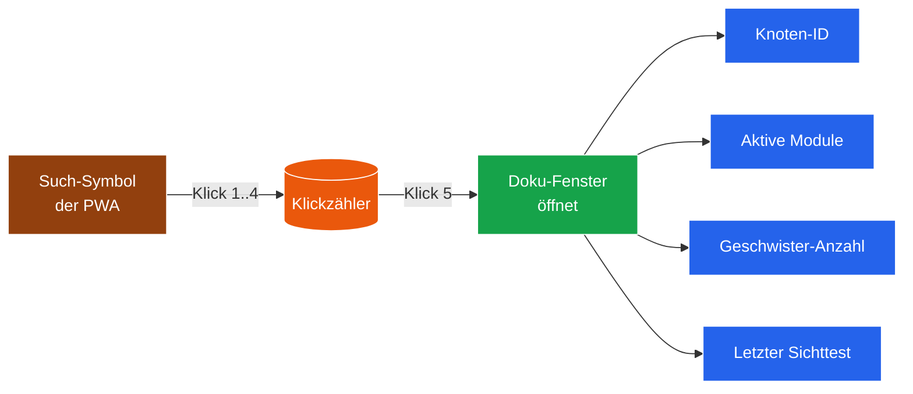

# Modul 00 — Doku-Fenster

> **Status:** 🟫 Schablone  ·  **Schicht:** UI  ·  **Anker:** Sage-Page → Karte 4 (Module-Bento), Eintrag 00
> **Datei (Code):** `src/modules/00_doku_fenster.js`
>
> _Versteckte 5-Klick-Geste am Such-Symbol enthüllt den Lauf-Zustand des
> Knotens — kein Datenexport, nur ein Atemkreis-Schnappschuss für den
> Eingeweihten._

---

## Im Mycel-Bild

Das Doku-Fenster ist die **Mycel-Lupe** — eine versteckte Klappe am
Knoten, die den eigenen Atemkreis sichtbar macht: wer sind meine
Geschwister, welche Module atmen, wann war der letzte Sichttest? Sie
zeigt den **Lauf-Puls** des laufenden Knotens, nicht den Bau-Puls des
Repos. Letzterer lebt auf der Sage-Page (Karte "Bau-Puls"), damit beide
Pulse getrennt bleiben und nicht durcheinander geraten.

---

## Visualisierung



---

## Zweck

In den Endknoten-PWAs (Rezeptbuch, Mixarium) liegt das SBKIM-System
zunächst unsichtbar im Hintergrund. Damit der Betreiber und vertraute
Mitnutzer den **Entwicklungsstand des Knotens** einsehen können, ohne
dass ein zufälliger Nutzer davon irritiert wird, gibt es eine versteckte
Enthüllungs-Geste: **fünf Klicks auf das Such-Symbol** der App öffnen
ein Statusfenster.

Das Fenster ist **kein Datenexport**. Es zeigt nur:

- Knoten-ID (Kurzform)
- Knotentyp und Domäne
- Welche Module aktiv sind und wie sie sich melden
- Letzte Anastomose-Versuche (anonymisiert: nur Zähler, kein Inhalt)
- Aktuelle Liste der Geschwisterknoten (nur Anzahl + Domänen)
- Letzter Sichttest pro Modul (Datum + ✓/✗)

---

## Verantwortlichkeiten

**Macht:**
- Klickzähler auf das vorhandene Such-Symbol/Icon (kein neues Element)
- Bei Erreichen der Schwelle (`DOKU_REVEAL_CLICKS`, default 5):
  modales Fenster mit Status öffnen
- Status zur Laufzeit aus den anderen Modulen ziehen (nur Lesen)
- Schließen-Knopf, Klickzähler reset bei Schließen

**Macht nicht:**
- Kein Daten-Export (nichts wird heruntergeladen, nichts gesendet)
- Keine Konfigurations-Änderungen
- Keine personenbezogenen Daten
- Kein Login, kein Schutz — die Geste *ist* der Schutz

---

## Schnittstelle

*(noch zu spezifizieren — Spec-Sitzung füllt aus)*

```
init(options: {
  searchIconSelector: string,        // CSS-Selektor des Such-Symbols
  revealClicks?: number,             // Default: 5
  windowTitle?: string,              // Default: "SBKIM-Knotenstand"
})

renderStatus() → HTMLElement
  // baut das Status-Fenster aus aktuellem Knotenzustand
```

### Konfigurationswerte (zentral)

```
DOKU_REVEAL_CLICKS = 5     // siehe ARCHITEKTUR.md §7
```

---

## Manueller Test

1. Test-PWA mit eingebautem Modul 00 öffnen.
2. Such-Symbol fünfmal anklicken.
3. Erwartung: Statusfenster erscheint, zeigt mindestens Knoten-ID und
   "Modul X aktiv / inaktiv"-Liste.
4. Schließen, viermal klicken: nichts. Fünftes Klick: erscheint wieder.
5. Erwartung: keine Konsolen-Fehler.

---

## Risiken & offene Punkte

- Such-Symbol existiert in jedem Endknoten unter anderem Selektor →
  `searchIconSelector` muss konfigurierbar bleiben.
- Mobile Touch: 5 schnelle Taps. Schwelle für "schnell genug" definieren?
- Versehentliches 5-faches Klicken durch Endnutzer → harmlos, keine
  Datenpreisgabe, nur unerwartetes Fenster. Akzeptabel.

---

## Bauzustand

| Schritt | Datum | Sitzung | Anmerkung |
|---|---|---|---|
| Karte angelegt | 2026-05-10 | Skelett | leere Schablone |
| Site-Echo | 2026-05-10 | Site-Echo | Hero, Bio-Metapher, Mermaid, Querverweise |
| Spec gefüllt | — | — | — |
| Code geschrieben | — | — | — |
| Sichttest | — | — | — |
| In Endknoten eingebaut | — | — | — |

---

**Querverweise**

- **Abhängigkeiten:** keine (kann jederzeit gebaut werden)
- **Wird genutzt von:** alle Module — liest nur Status, ändert nichts · Modul 12 (Blocklist) — mögliches UI-Ziel für Sperrlisten-Verwaltung
- **Site-Karte:** [Karte 4 · Module-Bento](../../index.html#screen-overview), Eintrag 00
- **Glossar:** [Atemkreis](../GLOSSAR.md), [Sichttest](../GLOSSAR.md)
- **Architektur:** [ARCHITEKTUR.md §7](../ARCHITEKTUR.md) (Konfigurationswerte)
- **Eigenleistung:** kein direkter Bezug zu `sbkim_integration.md` — Sage-Protokol-Eigenleistung
