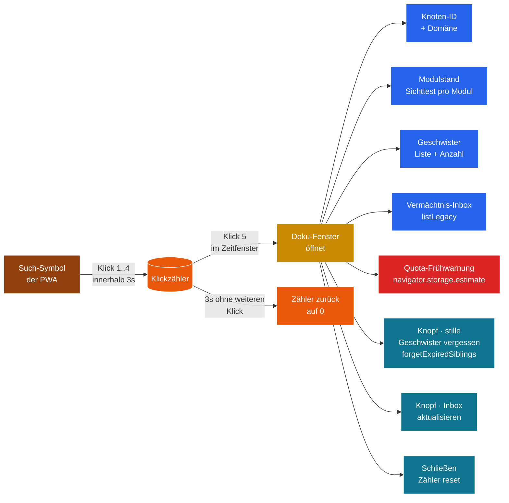

# Modul 00 — Doku-Fenster

> **Status:** 🟦 Code-Stub  ·  **Schicht:** UI  ·  **Anker:** Sage-Page → Karte 4 (Module-Bento), Eintrag 00
> **Datei (Code):** `src/modules/00_doku_fenster.js`
>
> _Versteckte 5-Klick-Geste am Such-Symbol enthüllt den Lauf-Zustand des
> Knotens — kein Datenexport, nur ein Atemkreis-Schnappschuss für den
> Eingeweihten. Reines Lese-/Trigger-Modul: einziger Schreiber von
> `sbkim_doku_meta`, Leser von Spore, Geschwistern, Inbox und Quota._

---

## Im Mycel-Bild

Das Doku-Fenster ist die **Mycel-Lupe** — eine versteckte Klappe am
Knoten, die den eigenen Atemkreis sichtbar macht: wer sind meine
Geschwister, welche Module atmen, wann war der letzte Sichttest, wie
voll ist mein Speicher? Sie zeigt den **Lauf-Puls** des laufenden
Knotens, nicht den Bau-Puls des Repos. Letzterer lebt auf der
Sage-Page (Karte „Bau-Puls"), damit beide Pulse getrennt bleiben und
nicht durcheinander geraten.

Versteckt heißt nicht geheim. Klaus klickt fünf Mal auf das
Such-Symbol seiner PWA, das Fenster geht auf, er sieht den Zustand,
schließt es. Beim nächsten Tab-Öffnen ist es wieder versteckt — der
Endnutzer sieht es nie zufällig, der Eingeweihte findet es jederzeit.
Die Geste *ist* der Schutz, kein Passwort.

Das Fenster bietet außerdem **zwei Trigger** für Pflege-Operationen,
die das Mycel sonst nicht von selbst auslöst:

- **„Stille Geschwister vergessen"** — ruft `SbkimApoptose.forgetExpiredSiblings`
  und entfernt Geschwister, die seit `SIBLING_MAX_AGE_MS` (30 Tage)
  nicht mehr erreichbar waren. Bewusst manuell, weil Modul 07 keine
  Pulsation hat.
- **„Vermächtnis-Inbox ansehen"** — listet die signierten Abschieds-
  Botschaften gestorbener Geschwister aus `sbkim_legacy_inbox`. Reine
  Anzeige, keine Detail-Ebene (gehört in eine Folge-Pflege-Sitzung).

Ein **Self-Apoptose-Knopf** ist im Doku-Fenster **bewusst nicht**
vorgesehen — siehe § Verantwortlichkeiten „Macht nicht".

---

## Visualisierung



---

## Zweck

In den Endknoten-PWAs (Rezeptbuch, Mixarium) liegt das SBKIM-System
zunächst unsichtbar im Hintergrund. Damit der Betreiber und vertraute
Mitnutzer den **Lauf-Zustand des Knotens** einsehen können, ohne dass
ein zufälliger Nutzer davon irritiert wird, gibt es eine versteckte
Enthüllungs-Geste: **fünf Klicks auf das Such-Symbol** der App,
innerhalb von `DOKU_REVEAL_WINDOW_MS` (3 Sekunden, aus §0), öffnen
ein Statusfenster.

Das Fenster ist **kein Datenexport**. Es zeigt nur:

- Knoten-ID (Kurzform, erste 12 Zeichen) + voller Wert ausklappbar
- Domäne, Knotentyp und Protokoll-Version aus der eigenen Spore
- Welche Module geladen sind und welcher Sichttest zuletzt grün war
- Geschwister-Liste (anonymisiert: nur `nodeId`-Kurzform, `domain`,
  `since`)
- Vermächtnis-Inbox (`fromNodeId`-Kurzform, `reason`, `receivedAt`)
- Quota: belegt / verfügbar / Verhältnis, plus Warnzeile bei
  überschrittener Schwelle
- Letzter Öffnungs-Zeitpunkt aus `sbkim_doku_meta["meta"]`

Drei verbindliche Pflichtfragen wurden in der Spec-Sitzung 00
entschieden — siehe Block weiter unten („Pflichtfragen-Entscheidungen
dieser Sitzung").

---

## Verantwortlichkeiten

**Macht:**

- **Klickzähler** auf das vorhandene Such-Symbol/Icon (kein neues
  DOM-Element, nur ein `click`-Listener auf den
  `searchIconSelector`).
- Bei `DOKU_REVEAL_CLICKS` Klicks **innerhalb** `DOKU_REVEAL_WINDOW_MS`:
  modales Fenster mit Status öffnen.
- **Status zur Laufzeit aus den anderen Modulen ziehen** — nur Lesen,
  fail-soft (wenn ein Modul fehlt, zeigt das Fenster „Modul nicht
  geladen", aber das Fenster bleibt benutzbar).
- **Schreibrecht ausschließlich für `sbkim_doku_meta`** — Schlüssel
  `"meta"` (Modul-Meta: `lastOpenedAt`, `schemaVersion`) und
  `"<modulId>"` (Sichttest-Spur pro Modul: `moduleId`,
  `lastSighttest`, `status`).
- **Quota-Frühwarnung** via `navigator.storage.estimate()` beim
  Öffnen — zeigt eine ruhige Warnzeile, wenn `usage / quota >
  DOKU_QUOTA_WARN_RATIO` (0.80) **oder** `quota - usage <
  DOKU_QUOTA_WARN_BYTES` (50 MiB). Beide Warnungen sind passive
  Anzeige, keine automatische Aktion.
- **Vermächtnis-Inbox anzeigen** über `SbkimApoptose.listLegacy()`
  (Karte 07 § Schnittstelle) — Spalten: Sender-Kurzform, `reason`,
  `receivedAt`. Keine Detail-Ansicht.
- **TTL-Sweep-Knopf** „Stille Geschwister vergessen" — ruft
  `SbkimApoptose.forgetExpiredSiblings(SIBLING_MAX_AGE_MS)` mit dem
  Wert aus §0. Zeigt das Rückgabe-Array (gelöschte Geschwister)
  ruhig an. Schließt damit den TTL-Trigger-Pfad aus Spec-Sitzung 07
  Variante (c) für den manuellen Fall.
- **Schließen-Knopf** und **`Esc`-Taste** — Fenster zu, Klickzähler
  zurück auf 0.
- **Sichttest-Schreiber** — Bau-Sitzungen und Test-Panel können
  `recordSighttest(moduleId, "ok" | "fail")` aufrufen, um den
  Sichttest-Stand pro Modul in `sbkim_doku_meta` zu hinterlegen.
  Modul 00 ist der einzige Schreiber dieses Stores.

**Macht nicht:**

- **Kein Daten-Export.** Nichts wird heruntergeladen, nichts gesendet.
  Die Anzeige ist nur DOM, kein Download-Button, kein Clipboard-Copy
  in der Spec (das gehört in eine Folge-Pflege-Sitzung, falls
  überhaupt jemals).
- **Kein Self-Apoptose-Knopf.** Karte 07 hat Self-Apoptose als
  zweistufig + irreversibel spezifiziert (`prepareSelfApoptose` →
  60 s Token → `confirmSelfApoptose`); ein einzelner Klick im
  versteckten Doku-Fenster wäre für die Endbenutzer-Sicht zu
  schwach und für die Spec inkonsistent. Self-Apoptose gehört in
  Modul 08 (UI-Demo, Werkstatt) oder in einen separaten
  Endknoten-Knopf außerhalb Modul 00.
- **Keine Konfigurations-Änderungen.** Das Fenster zeigt §0-Werte,
  schreibt sie nicht.
- **Keine personenbezogenen Daten.** Keine Nutzer-IDs, keine
  Klick-Spuren über die Selbstcheck-Zeit hinaus, keine Telemetrie.
- **Kein Login, kein Schutz.** Die 5-Klick-Geste *ist* der Schutz —
  versehentliches Auffinden durch einen Endnutzer ist akzeptabel
  und harmlos (keine Datenpreisgabe, nur ein unerwartetes Fenster).
- **Kein direkter `indexedDB.open`.** Persistenz strikt über
  `SbkimStorage.{init, get, put, del, all}`. Wer in Modul 00
  IndexedDB direkt anfasst, hat den Vertrag aus Modul 01 zerrissen.
- **Kein Netz-Aufruf.** Keine Pulsation, keine Eigenanfragen, kein
  Crawler, kein `fetch` ins offene Netz. Modul 00 liest nur lokal —
  `navigator.storage.estimate()` ist ein Browser-API-Aufruf, kein
  Netz-Aufruf.
- **Keine Sichtbarkeits-Persistenz zwischen Sessions.** Beim Tab-
  Schließen ist das Fenster weg. Beim nächsten Mal startet es
  versteckt. 5-Klick-Geste jedes Mal neu (Entscheidung Frage 3
  dieser Sitzung, Variante a).
- **Kein Auto-Refresh.** Das Fenster zeigt den Snapshot vom
  Öffnungs-Zeitpunkt. Wer aktualisieren will, drückt den
  „Inbox aktualisieren"-Knopf (für die Inbox-Spalte) bzw. schließt
  und öffnet das Fenster neu (für den vollen Snapshot).

---

## Pflichtfragen-Entscheidungen dieser Sitzung

Drei Fragen waren im Spec-Sitzungs-Briefing 2026-05-14 als
„verbindlich entscheiden, keine Verschiebung" gekennzeichnet. Hier
die Entscheidungen mit Begründung:

### Frage 1 · 5-Klick-Mechanik + Zeitfenster — **Variante (a)**

**Entscheidung:** **5 Klicks auf das Such-Symbol** innerhalb von
**3 Sekunden** (`DOKU_REVEAL_WINDOW_MS = 3000`, neue Konstante in §0).
Klick 1 startet das Zeitfenster; jeder weitere Klick im Fenster zählt.
Wenn vor dem 5. Klick `DOKU_REVEAL_WINDOW_MS` ohne neuen Klick
verstreicht, geht der Zähler zurück auf 0. Das Such-Symbol behält
seine Original-Funktion (kein `preventDefault` auf den ersten vier
Klicks).

**Begründung (vier Punkte):**

1. **Klassische versteckte Doku-Geste.** CLAUDE.md spricht von „5
   Klicks auf das Such-Symbol"; das Such-Symbol ist in jeder
   Endknoten-PWA vorhanden (anders als ein App-Logo, das in
   Rezeptbuch und Mixarium unterschiedlich gestaltet sein wird).
2. **3 Sekunden ist menschlich.** Schnell genug, damit zufällige
   Klicks über den Tag verteilt sich nicht aufsummieren; langsam
   genug, dass Klaus die Geste auch auf einem trägen Mobil-Touchpad
   schafft.
3. **Keine Tastatur-Geste** (Variante c). Klaus hat zwei mobile
   Nutzer; eine `Ctrl+Shift+D`-Geste verträgt sich schlecht mit
   PWA-on-Mobile.
4. **Such-Symbol behält Funktion.** Die ersten vier Klicks suchen
   ganz normal; der fünfte öffnet zusätzlich das Doku-Fenster. Das
   ist kein Konflikt: ein versehentlicher Endnutzer hat nach vier
   regulären Suchen schon längst aufgehört. Klaus weiß, dass er
   die Suche fünfmal *leer* anklicken muss.

### Frage 2 · Quota-Schwellwerte — **Variante (a) + (c) gemeinsam, in §0**

**Entscheidung:** **Doppel-Schwelle** in `INTERFACES.md §0`:

```
DOKU_QUOTA_WARN_RATIO  = 0.80              // 80%-Schwelle (Variante a)
DOKU_QUOTA_WARN_BYTES  = 50 * 1024 * 1024  // 50 MiB absolute Schwelle (Variante c)
```

Das Doku-Fenster zeigt die Warnzeile, wenn **eine der beiden Schwellen**
überschritten ist (`ratio > 0.80` ODER `(quota - usage) < 50 MiB`). Die
Warnung benennt explizit, welche Schwelle gefallen ist.

**Begründung (drei Punkte):**

1. **Konsistenz zur Querschnitts-Frage „Spore-Persistenz-Strategie
   verteilt"** (PULS.md). Modul 01 (Quota-Persist), Modul 02
   (Backup-Trigger) und Modul 00 (Frühwarnung) müssen denselben
   Schwellwert teilen — das funktioniert nur, wenn er in §0 liegt
   (eine Quelle). Variante A allein hätte gereicht; (a) + (c)
   gemeinsam ist eine kleine Erweiterung, die das Verhalten auf
   alten Geräten mit kleiner Quota (z.B. 200 MiB Total) sauber
   abdeckt — 80 % von 200 MiB sind 160 MiB, aber „nur 40 MiB
   frei" ist dort ein dringenderes Signal als „80 %".
2. **Additive §0-Erweiterung — kein Hauptversions-Sprung.** §0
   erlaubt additive Konstanten (siehe Spec-Sitzung 07 mit
   `SIBLING_MAX_AGE_MS`). `status.json.config` zieht die drei neuen
   Werte mit (`DOKU_REVEAL_WINDOW_MS`, `DOKU_QUOTA_WARN_RATIO`,
   `DOKU_QUOTA_WARN_BYTES`).
3. **Diese Spec konkretisiert die offene Querschnitts-Frage
   teilweise.** Modul 00 hat seinen Anteil verankert
   (Frühwarnung-Schwelle global). `navigator.storage.persist()`
   bleibt bei Modul 01 (siehe PULS.md), `Backup-Export`
   bleibt bei Modul 02. Die Querschnitts-Frage bleibt offen, bis
   01-Quota und 02-Backup spruchreif sind — aber die Schwellwerte,
   die alle drei teilen, stehen jetzt fest.

### Frage 3 · Sichtbarkeits-Persistenz — **Variante (a) · Session-only**

**Entscheidung:** Beim Tab-Schließen ist das Fenster weg. Beim
nächsten Mal startet es versteckt. **5-Klick-Geste jedes Mal neu.**
Es gibt **kein** `visible:true`-Feld in `sbkim_doku_meta`.

**Begründung (drei Punkte):**

1. **„Versteckte Doku" heißt: nicht für den Endnutzer.** Wer es
   einmal entdeckt hat, sieht es nicht für immer — sonst wäre es
   nicht mehr versteckt. Klaus klickt 5x, schaut nach, schließt;
   ein versehentlicher Endnutzer-Klick beim nächsten Tab-Öffnen
   öffnet nichts.
2. **Klaus' Komfort ist niedrig-asymmetrisch.** Klaus klickt sowieso
   nicht oft ins Doku-Fenster — alle paar Tage einmal. Variante (c)
   („persistent mit 7-Tage-Ablauf") wäre über-engineered für das
   aktuelle Netz; Variante (b) („persistent für immer") bricht das
   Versteck-Prinzip.
3. **Spec-Wille bleibt klar lesbar.** Eine Sicht-Persistenz wäre
   eine zweite Achse, an der das Modul später drehen müsste
   (Toggle, Ablauf-Zähler, Reset-Knopf). Heute ist es einfach:
   versteckt ist versteckt, sichtbar ist sichtbar bis zum nächsten
   Tab-Schließen.

`sbkim_doku_meta["meta"]` hält **nur** `lastOpenedAt` (für die
Anzeige „Zuletzt geöffnet vor X Minuten"), nicht `visible`.

---

## Schnittstelle

Modul 00 exportiert **sechs** öffentliche Funktionen. Alle
DB-Operationen laufen über `window.SbkimStorage`, alle Lese-Quellen
über `window.SbkimSpore` / `SbkimAnastomose` / `SbkimApoptose` — Modul
00 berechnet nichts, es spiegelt nur. `init()` ist die einzige
zustands-ändernde Initialisierung; alle anderen Aufrufe sind
idempotent.

```
init(options) → Promise<void>
  // options:
  //   searchIconSelector  : string         // Pflicht — CSS-Selektor des Such-Symbols der PWA
  //   revealClicks?       : number         // Default DOKU_REVEAL_CLICKS (5) aus §0
  //   revealWindowMs?     : number         // Default DOKU_REVEAL_WINDOW_MS (3000) aus §0
  //   windowTitle?        : string         // Default "SBKIM-Knotenstand"
  //   mountTarget?        : HTMLElement    // Default document.body
  //
  // Prüft Pflicht-Abhängigkeiten (SbkimStorage), ruft SbkimStorage.init().
  // Registriert click-Listener am searchIconSelector. Schreibt einmalig
  // sbkim_doku_meta["meta"], wenn noch nicht vorhanden ({lastOpenedAt:null,
  // schemaVersion:1, moduleId:"meta"}).
  // SbkimSpore/SbkimAnastomose/SbkimApoptose sind OPTIONAL — wenn sie auf
  // window fehlen, läuft init() trotzdem durch (das Fenster zeigt später
  // "Modul nicht geladen"). Pflicht-Abhängigkeit ist NUR SbkimStorage.
  // Wirft DokuDependenciesError bei fehlendem SbkimStorage.
  // Wirft InvalidDokuOptionsError, wenn searchIconSelector leer/fehlt.
  // Idempotent: zweimaliger Aufruf registriert keine zweiten Listener.
  // Wenn searchIconSelector aktuell keinen DOM-Treffer hat (PWA noch
  // beim Laden): console.warn + späteres Re-Mount beim ersten
  // DOMContentLoaded-Event. Wirft NICHT.

open() → Promise<void>
  // Öffnet das Fenster sofort (für Test-Brücken, externes Triggern,
  // oder den Bau-Sitzungs-Smoke-Test). Aktualisiert sbkim_doku_meta
  // ["meta"].lastOpenedAt = now(). Baut intern den Snapshot aus
  // getStatusSnapshot() und rendert das DOM. Wenn bereits offen:
  // idempotent, kein Re-Render, kein neuer Snapshot. Wirft NICHT bei
  // Lese-Fehlern aus Spore/Anastomose/Apoptose — die landen als
  // "Modul nicht geladen" oder "Fehler beim Lesen" im Fenster.

close() → void
  // Synchron. Entfernt das Fenster-DOM. Setzt den internen
  // Klickzähler zurück auf 0. Idempotent. Schreibt NICHTS in den
  // Store (lastOpenedAt bleibt beim Öffnungs-Zeitpunkt stehen).

isOpen() → boolean
  // Synchron. true, wenn das Fenster gerade im DOM hängt.

getStatusSnapshot() → Promise<DokuStatus>
  // Liest den vollständigen Lauf-Zustand und gibt ihn als reines
  // JSON-Objekt zurück (Form siehe § Datenformate). Fail-soft: jede
  // optionale Lese-Quelle, die fehlt oder wirft, landet als null bzw.
  // {present:false, reason:"<deutsch>"} im Snapshot, nicht als Throw.
  // SbkimStorage-Fehler (Pflicht-Quelle für sbkim_doku_meta) werden
  // unverändert durchgereicht.

recordSighttest(moduleId, result) → Promise<void>
  // moduleId : string   z.B. "01", "02", "04", ...
  // result   : "ok" | "fail"
  // Schreibt sbkim_doku_meta[moduleId] = {moduleId, lastSighttest:
  // now(), status: result}. Modul 00 ist der einzige Schreiber dieses
  // Stores. Wirft InvalidSighttestResultError, wenn result nicht
  // "ok"/"fail" ist.
```

### Selbstcheck

Beim **Skript-Laden** (synchron, vor jeglichem Aufruf — Muster wie
Modul 01 / 02 / 04 / 05 / 07):

```
console.info("MODUL 00 DOKU-FENSTER bereit, Funktionen: init/open/close/isOpen/getStatusSnapshot/recordSighttest");
```

Wie die anderen Module — die Meldung signalisiert „Modul geladen",
nicht „Fenster offen" oder „Listener registriert". `DOKU_REVEAL_CLICKS`,
`DOKU_REVEAL_WINDOW_MS` und die Quota-Schwellen werden in der
Selbstcheck-Zeile bewusst **nicht** wiederholt (stehen verbindlich in
§0).

### Konfigurationswerte

```
DOKU_REVEAL_CLICKS      = 5                          // aus §0, Schwellwert „verstecktes Fenster aufdecken"
DOKU_REVEAL_WINDOW_MS   = 3000                       // aus §0, Zeitfenster für alle 5 Klicks (Frage 1 dieser Sitzung)
DOKU_QUOTA_WARN_RATIO   = 0.80                       // aus §0, Frühwarnung relativ (Frage 2 dieser Sitzung)
DOKU_QUOTA_WARN_BYTES   = 50 * 1024 * 1024           // aus §0, Frühwarnung absolut (Frage 2 dieser Sitzung)
SIBLING_MAX_AGE_MS      = 2592000000                 // aus §0, an SbkimApoptose.forgetExpiredSiblings durchgereicht
```

**Modul-lokal** in Karte 00 (nicht in §0):

```
WINDOW_TITLE_DEFAULT    = "SBKIM-Knotenstand"        // optional via options.windowTitle übersteuerbar
NODE_ID_SHORT_LEN       = 12                         // Länge der Kurzform-Anzeige der nodeId
```

`NODE_ID_SHORT_LEN` ist eine reine UI-Anzeige-Konstante (Ellipsis-
Schnitt der `nodeId` in der Anzeige); volltextlicher Wert bleibt
ausklappbar. Nicht protokoll-relevant.

### Datenformate

**`sbkim_doku_meta["meta"]`** — Modul-Meta, einmalig in `init()`
angelegt (wenn nicht vorhanden), bei jedem `open()` aktualisiert:

```jsonc
{
  "moduleId":      "meta",
  "schemaVersion": 1,
  "lastOpenedAt":  "2026-05-14T07:00:00.000Z"        // ISO-8601 UTC, null vor erstem open()
}
```

**`sbkim_doku_meta["<modulId>"]`** — Sichttest-Spur pro Modul,
geschrieben durch `recordSighttest`:

```jsonc
{
  "moduleId":      "01",                              // "01" | "02" | "03" | "04" | "05" | "07" | …
  "lastSighttest": "2026-05-14T07:00:00.000Z",
  "status":        "ok"                               // "ok" | "fail"
}
```

`moduleId` ist `string`, nicht numerisch — passt zu den
zwei-stelligen Karten-Namen. Unbekannte/neue `moduleId`-Werte werden
**nicht** abgewiesen (additiv), siehe § Fehlertabelle.

**`DokuStatus`** — Rückgabe von `getStatusSnapshot()`. Reines JSON,
keine Methoden, alphabetisch sortierbar:

```jsonc
{
  "nodeId":           "<base64url-sha256-rawpub>" | null,
  "nodeIdShort":      "abcdef012345…" | null,         // erste NODE_ID_SHORT_LEN Zeichen, mit Ellipsis
  "ownSporePresent":  true,
  "domain":           "rezeptbuch.example.org" | null,
  "nodeType":         "hybrid" | "provider" | "seeker" | null,
  "protocolVersion":  "0.1",                          // aus §0, gespiegelt
  "siblings": [
    { "nodeId": "...", "nodeIdShort": "...", "domain": "...", "since": "ISO-8601" },
    …
  ],
  "siblingCount":     3,
  "legacy": [
    { "fromNodeId": "...", "fromNodeIdShort": "...", "reason": "Domain stillgelegt", "receivedAt": "ISO-8601" },
    …
  ],
  "legacyCount":      2,
  "modules": {
    "01": { "moduleId": "01", "lastSighttest": "ISO-8601", "status": "ok" },
    "02": { "moduleId": "02", "lastSighttest": "ISO-8601", "status": "ok" },
    …
  },
  "quota": {
    "usage":          12345678,                       // Bytes; null wenn Browser estimate() nicht unterstützt
    "quota":          1234567890,
    "ratio":          0.01,
    "freeBytes":      1222222212,
    "warnRatio":      false,                          // ratio > DOKU_QUOTA_WARN_RATIO (0.80)
    "warnBytes":      false,                          // freeBytes < DOKU_QUOTA_WARN_BYTES (50 MiB)
    "warningLevel":   "none"                          // "none" | "ratio" | "bytes" | "both"
  } | null,
  "openedAt":         "2026-05-14T07:00:00.000Z",
  "lastOpenedAt":     "2026-05-13T19:42:11.123Z" | null,
  "errors": [                                          // fail-soft-Liste; leer bei Vollständigkeit
    { "source": "SbkimAnastomose.listSiblings", "reason": "Modul nicht geladen" },
    …
  ]
}
```

`signature` aus `sbkim_legacy_inbox` wird im Snapshot **bewusst
weggelassen** (analog Karte 07 § `listLegacy` — reiner Lese-Helfer
für die UI). Anzeige zeigt nur Sender-Kurzform, Grund, Empfangszeit.

---

## 5-Klick-Pfad (Schritt-für-Schritt)

1. PWA lädt; Modul 00 ist als `<script>`-Tag eingebunden (Reihenfolge
   im Endknoten: 01 → 02 → 03 → 04 → 05 → 07 → **00**, weil 00 die
   anderen Module liest und ihre Existenz zur init-Zeit prüft).
2. Endknoten ruft beim PWA-Start: `await SbkimDoku.init({
   searchIconSelector: "#search-icon" })`.
3. `init()` prüft `SbkimStorage` (Pflicht). Optional vorhanden:
   `SbkimSpore`, `SbkimAnastomose`, `SbkimApoptose`. Registriert
   `click`-Listener am Such-Symbol-Element. Schreibt einmalig
   `sbkim_doku_meta["meta"]`.
4. Klaus klickt das Such-Symbol an. Klick 1 → interner Zähler = 1,
   Timer `setTimeout(reset, DOKU_REVEAL_WINDOW_MS)` startet. Such-
   Funktion der PWA läuft normal.
5. Klicks 2 / 3 / 4 in den nächsten 3 Sekunden — Zähler hoch, Timer
   wird **nicht** neu gestartet (das Zeitfenster gilt insgesamt für
   alle fünf Klicks, vom ersten an).
6. Klick 5 vor Timer-Ablauf → `open()`. Zähler zurück auf 0, Timer
   gestoppt. Fenster baut sich auf, zeigt `getStatusSnapshot()`-
   Ergebnis.
7. Klaus klickt „Schließen" oder drückt `Esc`. Fenster weg, Zähler
   bleibt 0, Timer ist schon abgelaufen.
8. Tab schließen / Browser zu / Reload — Modul 00 verliert seinen
   in-memory-Zustand. Beim nächsten Start ist alles wieder versteckt
   (Frage 3 dieser Sitzung, Variante a).

**Alternative-Pfade:**

- Klicks 1–4, dann 3 Sekunden Pause → Zähler auf 0 → Klaus muss
  neu anfangen.
- Klick 1, dann ein anderer Klick auf etwas anderes (z.B. Logo) →
  Zähler bleibt unverändert. Modul 00 zählt **nur** Klicks auf den
  `searchIconSelector`.
- `SbkimApoptose` fehlt (nicht eingebaut) → das Fenster zeigt
  „Vermächtnis-Inbox: Modul nicht geladen" und der TTL-Sweep-Knopf
  ist deaktiviert (mit Tooltip „SbkimApoptose nicht geladen").
- `navigator.storage.estimate()` nicht verfügbar (alter Browser) →
  `quota: null` im Snapshot, Anzeige „Quota: nicht verfügbar".
  Kein Fehler.

---

## Sichtbarkeits-Verhalten (zwischen Sessions)

**Entscheidung Frage 3 dieser Sitzung: Variante (a) Session-only.**

- Beim Tab-Schließen verliert Modul 00 seinen in-memory-Zustand
  (Fenster-DOM-Referenz, Klickzähler, Reveal-Timer).
- Beim nächsten PWA-Start ruft der Endknoten erneut
  `SbkimDoku.init(...)`. Das Fenster ist versteckt (kein automatisches
  Öffnen).
- `sbkim_doku_meta["meta"].lastOpenedAt` bleibt persistent — aber als
  reine **Anzeige** im Fenster („Zuletzt geöffnet am …"), nicht als
  Sichtbarkeits-Flag.
- Es gibt **kein** `visible:true`-Feld im Store; entsprechend gibt es
  auch keine Sichtbarkeits-Migration und keinen Toggle in der API.
- Wenn eine Folge-Pflege-Sitzung später Variante (b) oder (c)
  einführen will (persistente Sichtbarkeit mit / ohne Ablauf), ist
  das eine additive Feld-Erweiterung in `sbkim_doku_meta["meta"]`
  und eine neue Konstante in §0 — kein Hauptversions-Sprung. Diese
  Spec-Sitzung schließt das *nicht* aus; sie wählt die einfachste
  Variante für das aktuelle Netz.

---

## Fehlertabelle

| Aufrufer | Bedingung | Verhalten |
|---|---|---|
| `init()` | `options.searchIconSelector` fehlt / leerer String | `InvalidDokuOptionsError` (sync throw vor jeglicher DB-Operation) |
| `init()` | `SbkimStorage` nicht auf `window` | `DokuDependenciesError` (analog `ApoptoseDependenciesError`) |
| `init()` | `SbkimStorage.init()` wirft (z.B. `StorageUnavailableError`) | unverändert durchgereicht |
| `init()` | `searchIconSelector` matcht aktuell kein Element | `console.warn`, kein Throw — Re-Mount beim `DOMContentLoaded`, sonst beim ersten `open()`-Versuch erneut prüfen |
| `init()` | zweimaliger Aufruf | idempotent — keine zweiten Listener, keine zweite Meta-Anlage |
| `open()` | Fenster bereits offen | idempotent, kein Re-Render |
| `open()` | `SbkimSpore.getNodeId()` wirft `NoIdentityError` | fail-soft: `nodeId: null`, `ownSporePresent: false` im Snapshot, kein Throw |
| `open()` | `SbkimAnastomose.listSiblings()` wirft / `SbkimAnastomose` fehlt | fail-soft: `siblings: []`, `siblingCount: 0`, `errors[]`-Eintrag, kein Throw |
| `open()` | `SbkimApoptose.listLegacy()` wirft / `SbkimApoptose` fehlt | fail-soft: `legacy: []`, `legacyCount: 0`, `errors[]`-Eintrag, kein Throw |
| `open()` | `navigator.storage.estimate()` nicht verfügbar | `quota: null` im Snapshot, kein Throw |
| `open()` | `SbkimStorage.put("sbkim_doku_meta","meta",…)` wirft (Quota voll) | wirft `StorageQuotaError` (durchgereicht) — Fenster öffnet sich nicht, weil `lastOpenedAt` nicht aktualisierbar; Konsolen-Fehler |
| `close()` | Fenster nicht offen | idempotent, kein Fehler |
| `getStatusSnapshot()` | optionale Lese-Quelle fehlt/wirft | fail-soft, landet in `errors[]` |
| `getStatusSnapshot()` | `SbkimStorage`-Lesefehler für `sbkim_doku_meta` | durchgereicht (Pflicht-Quelle) |
| `recordSighttest()` | `result` nicht `"ok"` / `"fail"` | `InvalidSighttestResultError` (sync throw) |
| `recordSighttest()` | `moduleId` unbekannt / neu | additiv geschrieben, kein Fehler |
| TTL-Sweep-Knopf | `SbkimApoptose.forgetExpiredSiblings` wirft `InvalidTtlError` | sollte nicht passieren (Modul 00 übergibt `SIBLING_MAX_AGE_MS` aus §0); falls doch, landet die Fehlermeldung als Inline-Notiz im Fenster, kein modaler Crash |

**Vier benannte Error-Klassen** (analog 02/04/05/07, exportiert auf
`window.SbkimDoku.<Error>` für `instanceof`-Checks):

```
InvalidDokuOptionsError       — options.searchIconSelector fehlt/leer
DokuDependenciesError          — SbkimStorage nicht auf window
InvalidSighttestResultError    — recordSighttest mit unbekanntem result
StorageQuotaError              — Storage-Schreib-Fehler beim open()-Meta-Update
                                  (Sammel-Klasse; Original-Error in .cause)
```

Versions-Mismatch zwischen Modul 00 und §0-Konstanten: **es gibt
keinen** — Modul 00 spiegelt §0, ist nicht protokoll-aktiv. Wer §0
ändert, ändert Modul 00 ohne Code-Eingriff nach (Konstanten beim
Skript-Laden gelesen).

---

## Manueller Test

Test-Plan für Panel 00 in `tests/manual_check.html` (Bau-Sitzung 00
implementiert das; diese Spec-Sitzung skizziert nur den Pfad). Sechs
Knöpfe:

1. **Setup** — `SbkimStorage.init()` + `SbkimDoku.init({
   searchIconSelector: "#panel-00-fake-search" })`. Erwartung:
   `console.info("MODUL 00 DOKU-FENSTER bereit, …")`-Zeile vorhanden,
   `sbkim_doku_meta["meta"]` in DevTools → Application → IndexedDB
   sichtbar mit `lastOpenedAt: null`.
2. **5 Klicks im Zeitfenster simulieren** — fünfmal das fake
   Such-Symbol klicken (Panel-Knopf erzeugt fünf
   `MouseEvent("click")`-Dispatches binnen 300 ms). Erwartung:
   Fenster öffnet sich, zeigt mindestens `nodeIdShort`, `domain`,
   `siblingCount`, `legacyCount`, `quota`.
3. **4 Klicks + Timeout** — vier Klicks dispatchen, dann 4 Sekunden
   warten, dann einen fünften Klick. Erwartung: Fenster öffnet sich
   **nicht** (Zähler war zurückgesetzt). Test-Brücke
   `SbkimDoku._advanceRevealClock(4000)` kann die 4 s überspringen.
4. **Quota-Warnzeile** — Test-Brücke `_setQuotaForTest({usage: ~8.1
   GiB, quota: 10 GiB})` setzt GiB-skalierte Pseudo-Werte (Pflege-
   Sitzung 2026-05-15); Fenster neu öffnen. Erwartung:
   `warnRatio: true`, `warnBytes: false` (freeBytes ≈ 1.9 GiB,
   deutlich über 50 MiB), `warningLevel: "ratio"`, Warnzeile sichtbar
   im Fenster, Text enthält „Speicher knapp · 80%-Schwelle". —
   *Bau-Sitzung 00 nutzte ursprünglich Mini-Werte 81/100; bei denen
   ist freeBytes=19 Bytes automatisch < 50 MiB und `warningLevel`
   wird `"both"` statt `"ratio"` — Test 4 ist seit Pflege-Sitzung
   2026-05-15 auf realistische GiB-Werte umgestellt, damit die
   beiden Schwellen sauber getrennt prüfbar sind.*
5. **TTL-Sweep-Knopf** — Test-Knopf legt zwei Geschwister-Einträge
   **direkt in `sbkim_siblings`** an (`SbkimStorage.put` mit
   `since` > 30 Tage in der Vergangenheit), weil
   `SbkimApoptose.forgetExpiredSiblings` aus dem realen Store liest
   — `_addPseudoSibling` ist ein Versand-Pfad-Override für
   `prepareSelfApoptose.listSiblingsForBroadcast()`, nicht für
   den TTL-Sweep. Test-Knopf drückt anschließend
   `SbkimApoptose.forgetExpiredSiblings(SIBLING_MAX_AGE_MS)`.
   Erwartung: Rückgabe-Array zeigt beide gelöschte Geschwister;
   `siblingCount` im erneut geöffneten Fenster ist 0.
   (Korrektur vermerkt in Bau-Sitzung 00, 2026-05-14.)
6. **Selbstcheck-Hinweis** — Hinweis-Knopf zeigt in der Konsole
   die erwartete Selbstcheck-Zeile (analog Panel 01 / 02 / 04 / 05 / 07).

Zusätzlich **Esc-Test** (im Browser von Hand): Fenster öffnen, `Esc`
drücken — Fenster schließt sich. **Re-Open-Test:** Fenster
schließen, fünf neue Klicks → Fenster öffnet sich erneut.
**Persistenz-Test:** Reload nach `open()` → Fenster nicht offen,
`sbkim_doku_meta["meta"].lastOpenedAt` zeigt den vorigen
Zeitpunkt.

Test-Brücken (Unterstrich-Präfix, exportiert für `manual_check.html`,
analog Modul 05 / 07):

```
_dispatchClick()                — synthetisiert einen Such-Symbol-Klick
_resetClickCounter()
_advanceRevealClock(ms)         — verschiebt den Reveal-Timer ohne realen Zeit-Verlauf
_setQuotaForTest({usage,quota}) — überschreibt navigator.storage.estimate() temporär
_clearQuotaForTest()
```

**Achtung Self-Apoptose:** Modul 00 ist **kein** Auslöser für
Self-Apoptose. Panel 00 hat keinen Knopf für `prepareSelfApoptose` /
`confirmSelfApoptose` — Self-Apoptose-Test gehört in Panel 07 (Test
6 aus Karte 07 § Manueller Test, schon implementiert).

---

## Risiken & offene Punkte

- **`searchIconSelector` muss konfigurierbar bleiben.** Such-Symbol-
  Selektor in Rezeptbuch und Mixarium wird verschieden sein. Modul 00
  bekommt ihn als Pflicht-Option (`options.searchIconSelector`); der
  Andocker setzt ihn im Endknoten-`<script>`-Block (Karte 09
  Folge-Pflege-Sitzung muss Modul 00 in den Andock-Pfad als Schritt 9
  ergänzen — siehe „Querverweise").
- **Doppelklick / Touch-Burst.** Mobile Touch-Geräte feuern manchmal
  zwei `click`-Events aus einem schnellen Tap. Das ist kein Risiko —
  Modul 00 zählt jeden `click`, fünf Taps mit jeweils einem `click`
  reichen. Wer auf Touch zehn schnelle Taps macht, öffnet das Fenster
  beim fünften und schließt es nicht; Klick 6–10 ändern nichts.
- **Versehentliches 5-faches Klicken durch Endnutzer.** Harmlos: keine
  Datenpreisgabe, nur ein unerwartetes Fenster. Klaus kann mit
  „Schließen" reagieren. Der Endnutzer sieht eine ruhige Statusliste
  ohne Bedienungsfehler-Risiko.
- **Quota-Frühwarnung bei alten Browsern.** `navigator.storage.estimate()`
  ist in Chrome ≥ 61, Firefox ≥ 51, Safari ≥ 11.1 verfügbar. Auf
  älteren Browsern fällt der Quota-Block auf `null` zurück — kein
  Crash. Der zugrunde liegende Persist-Mechanismus (Modul 01,
  `navigator.storage.persist()`) ist davon getrennt; siehe
  Querschnitts-Frage „Spore-Persistenz-Strategie verteilt" in PULS.md.
- **`SbkimApoptose.forgetExpiredSiblings` ist ein Knopf, kein
  Automatismus.** Wer das Fenster nie öffnet, bekommt nie einen
  TTL-Sweep aus Modul 00. Karte 09 Folge-Pflege-Sitzung muss
  unabhängig den TTL-Sweep nach jedem Handshake aus dem Andocker
  ergänzen (Spec-Sitzung 07 hat das als offen vermerkt). Modul 00
  schließt die Lücke **zur Hälfte** — manueller Trigger ja,
  automatischer nein.
- **Self-Apoptose-Knopf bewusst nicht hier.** Ein versehentlicher
  Doppel-Klick im Doku-Fenster wäre zu schwach für eine irreversible
  Operation. Self-Apoptose-Tests gehören in Panel 07 (mit
  Pseudo-Geschwistern, In-Memory-Identitätsneuaufbau); ein
  produktiver Self-Apoptose-Knopf gehört in Modul 08 (UI-Demo,
  Werkstatt) oder in einen Endknoten-PWA-eigenen Service-Punkt
  außerhalb des Doku-Fensters.
- **Kein Detail-View der Vermächtnisse.** Die Inbox-Anzeige ist
  flach (Sender · Grund · Zeit). Wer eine einzelne Vermächtnis-
  Nachricht im Detail sehen will (z.B. die `signature` zum Prüfen
  bei Modul 11 Replay-Schutz später), bekommt das nicht in Modul 00.
  Folge-Pflege-Sitzung „Vermächtnis-Detail-View" anbietbar, sobald
  Modul 11 spruchreif ist.
- **Kein Snapshot-Refresh im offenen Fenster.** Wenn während der
  Anzeige ein neues Vermächtnis eintrifft, sieht Klaus es erst nach
  Schließen + Wieder-Öffnen (oder per „Inbox aktualisieren"-Knopf,
  der nur die Inbox-Spalte neu lädt). Das ist Spec-Wille — ein
  Auto-Refresh wäre Modul 00 nahe an einer Pulsation, und die ist
  verboten.
- **Lücke-Befund:** beim Durchgehen der Karten 01/02/05/07 ist keine
  fehlende Helfer-Funktion aufgefallen, die Modul 00 in der
  Bau-Phase blockieren würde. `SbkimSpore.{getNodeId, getOwnSpore,
  getPublicKeyJwk}`, `SbkimAnastomose.listSiblings`,
  `SbkimApoptose.{listLegacy, forgetExpiredSiblings}`,
  `SbkimStorage.{init, get, put, all}` sind alle vorhanden.
  `navigator.storage.estimate()` ist Browser-Standard. **Keine
  API-Korrektur an 01/02/05/07 nötig.**

---

## Bauzustand

| Schritt | Datum | Sitzung | Anmerkung |
|---|---|---|---|
| Karte angelegt | 2026-05-10 | Skelett | leere Schablone |
| Site-Echo | 2026-05-10 | Site-Echo | Hero, Bio-Metapher, Mermaid, Querverweise |
| Spec gefüllt | 2026-05-14 | Spec 00 | Sechs-Funktionen-API (`init/open/close/isOpen/getStatusSnapshot/recordSighttest`); drei verbindliche Pflichtfragen entschieden — Frage 1 Variante (a) 5 Klicks auf Such-Symbol + Zeitfenster 3 s (`DOKU_REVEAL_WINDOW_MS = 3000`), Frage 2 Doppel-Schwelle (`DOKU_QUOTA_WARN_RATIO = 0.80` UND `DOKU_QUOTA_WARN_BYTES = 50 MiB`) in §0, Frage 3 Variante (a) Session-only-Sichtbarkeit (kein `visible`-Feld); drei §0-Konstanten neu (additiv, kein Hauptversions-Sprung); `sbkim_doku_meta` als alleiniger Schreib-Store von 00 (Schlüssel `"meta"` für Modul-Meta + `"<modulId>"` für Sichttest-Spur); Lese-Quellen `SbkimSpore`, `SbkimAnastomose.listSiblings`, `SbkimApoptose.listLegacy`, `navigator.storage.estimate()` — alle fail-soft, optionale Pflicht nur für `SbkimStorage`; TTL-Sweep-Knopf nutzt `SbkimApoptose.forgetExpiredSiblings(SIBLING_MAX_AGE_MS)` ohne API-Erweiterung; Self-Apoptose bewusst NICHT in Modul 00 (Karte 07 Begründung). INTERFACES.md §0 + §1 Modul 00 + §6, `status.json` Modul 00 von `schablone` auf `spec`, Pie regeneriert (Schablone 5→4, Spec fertig 1→2). |
| Code geschrieben | 2026-05-14 | Bau 00 | `src/modules/00_doku_fenster.js` als IIFE mit `window.SbkimDoku`, sechs öffentliche Funktionen, vier benannte Error-Klassen (`InvalidDokuOptionsError`, `DokuDependenciesError`, `InvalidSighttestResultError`, `StorageQuotaError` — letztere als Sammel-Klasse mit `.cause`), fünf Test-Brücken (`_dispatchClick`, `_resetClickCounter`, `_advanceRevealClock`, `_setQuotaForTest`, `_clearQuotaForTest`); drei Bau-Pflichtfragen entschieden — **Frage 1 Variante (a)** Modal mit halb-transparentem Backdrop (`position:fixed;inset:0;background:rgba(0,0,0,0.55)`), Klassenpräfix `sbkim-doku-*`, Klick-auf-Backdrop schließt; **Frage 2 Variante (a)** späte DOM-Mount-Strategie via `MutationObserver` auf `document.body` mit Auto-Disconnect bei Match und 10-s-Safety-Timeout (`console.warn` + Selbst-Disconnect, kein Throw); **Frage 3 Variante (a)** Panel-00-Fake-Such-Symbol als eigenes `<button id="panel-00-fake-search">` im Markup, `_dispatchClick()` synthetisiert für Test 2 / 3 reale `MouseEvent("click")`-Dispatches auf das Element; 5-Klick-Geste: Klick 1 startet `setTimeout(reset, revealWindowMs)` und merkt sich `revealStartedAt`, Klicks 2–4 zählen ohne Timer-Reset, Klick 5 cancelt Timer und ruft `open()` async; `close()` synchron, idempotent, setzt Klickzähler auf 0; Esc-Listener global registriert, feuert nur bei offenem Fenster; Modul-Closure-State `clickCount` / `revealTimer` / `windowEl` / `searchEl` / `options` / `mountObserver` / `quotaOverride`; `_advanceRevealClock(ms)` cancelt + Reset wenn `elapsed >= revealWindowMs`, sonst Timer mit Restzeit neu setzen; `getStatusSnapshot()` sammelt fail-soft via einzelne try/catch (jeder Lese-Quellen-Fehler landet in `errors[]`, kein Throw); `recordSighttest(moduleId, "ok"|"fail")` schreibt `sbkim_doku_meta[moduleId]`; Persistenz **strikt über `SbkimStorage`** (kein `indexedDB.open` in 00); Modul 00 als alleiniger Schreiber von `sbkim_doku_meta`; synchroner Selbstcheck beim Skript-Laden (`MODUL 00 DOKU-FENSTER bereit, Funktionen: …`). Panel 00 in `tests/manual_check.html` von „noch nicht gebaut" auf 🟦 Code-Stub mit sechs Knöpfen (Setup, Test 2 5-Klick-Simulation, Test 3 4-Klick + `_advanceRevealClock(4000)`, Test 4 Quota-Warnzeile via `_setQuotaForTest({usage:81,quota:100})`, Test 5 TTL-Sweep via direkten `SbkimStorage.put` auf `sbkim_siblings` mit `since > 30 Tage`, Selbstcheck-Hinweis) plus sichtbarem Fake-Such-Symbol-Element (Klaus kann es auch von Hand klicken); `node --check` für `00_doku_fenster.js` und alle Inline-`<script>`-Blöcke grün; INTERFACES.md §1 Modul 00 bleibt `entwurf` (Spec-Vertrag unverändert), §6 Änderungsprotokoll-Zeile für Bau-Sitzung 00 ergänzt; `status.json` Modul 00 von `score:"spec"` auf `score:"stub"` mit `siegel:"Code-Stub"`, Pie regeneriert (Spec fertig 2→1, Code-Stub 6→7). Spec-Korrektur-Befund: Karte 00 § Manueller Test Punkt 5 erwähnte `SbkimApoptose._addPseudoSibling` als TTL-Sweep-Setup, das ist aber der Versand-Pfad-Override — `forgetExpiredSiblings` liest ausschließlich aus `sbkim_siblings` im Storage. Panel 00 Test 5 nutzt deshalb direkten `SbkimStorage.put`; Karte 00 § Manueller Test Punkt 5 entsprechend leicht angepasst. |
| Sichttest | 2026-05-15 | Klaus + Pflege 00-Test-4 | geprüft 2026-05-15 (Klaus, im Browser): fünf von sechs Tests grün im ersten Lauf — Setup OK · Test 2 öffnet Modal sauber (`nodeIdShort:"3DT6lS0QT9Zp…"`, `domain:"rezeptbuch.example.org"`, `siblingCount:1`, `errors:0`) · Test 3 hält das Fenster zu nach `_advanceRevealClock(4000)` · Test 5 entfernt beide alten Geschwister (`entfernt_anzahl:2`, Re-Open-Snapshot listet sie nicht mehr) · Modal-Rendering vollständig (Knoten-Sektion, Geschwister-Liste, Vermächtnis-Inbox „Keine", Speicher 6.4% von 10.69 GiB, drei Aktion-Knöpfe sichtbar) · Selbstcheck-Zeile in DevTools-Konsole gefunden. **Test 4 zeigte Test-Bug** — Mini-Werte `_setQuotaForTest({usage:81, quota:100})` produzierten `warningLevel:"both"` (freeBytes=19 Bytes ist trivial < 50 MiB), Panel-Erwartung war aber `warningLevel:"ratio"` hartcodiert → „Test 4 fehlgeschlagen". Modul-Logik war korrekt (Doppel-Schwelle aus §0 greift wie spezifiziert). **Pflege-Sitzung 2026-05-15** repariert Test 4 mit GiB-skalierten Werten (`usage:8.1 GiB, quota:10 GiB` → freeBytes ≈ 1.9 GiB → `warningLevel:"ratio"` sauber); Karte 00 Punkt 4 zieht mit. Kein Eingriff in Modul-Vertrag oder INTERFACES.md. |
| In Endknoten eingebaut | — | — | — |

---

**Querverweise**

- **Abhängigkeiten (Pflicht):** Modul 01 (Storage).
- **Abhängigkeiten (optional, fail-soft):** Modul 02 (Spore), Modul 05
  (Anastomose), Modul 07 (Apoptose).
- **Wird genutzt von:** alle Module — Modul 00 liest deren Status,
  schreibt nichts in deren Stores. · Bau-Sitzungen können
  `SbkimDoku.recordSighttest(moduleId, result)` aufrufen, um den
  Sichttest-Stand zu hinterlegen. · Modul 12 (Blocklist) — mögliches
  UI-Ziel für Sperrlisten-Verwaltung in einer Folge-Pflege-Sitzung.
- **Folge-Pflege-Sitzung Karte 09:** „Schritt 9 — Modul 00 im
  Andock-Pfad". Karte 09 muss Modul 00 als zusätzlichen, optionalen
  Schritt aufnehmen (Endknoten ruft `SbkimDoku.init({
  searchIconSelector: "#..." })` nach `SbkimAnastomose.init()`).
  Spec-Sitzung 00 stellt dafür die API bereit; die Andock-Anleitung
  zieht sie in einer eigenen Folge-Pflege-Sitzung nach.
- **Folge-Pflege-Sitzung Querschnitt:** „Spore-Persistenz-Strategie
  verbinden" (PULS.md). Modul 00 hat seinen Teil verankert
  (Quota-Frühwarnung-Schwellen in §0); Modul 01 (`navigator.storage.
  persist()`) und Modul 02 (Backup-Export) folgen.
- **Site-Karte:** [Karte 4 · Module-Bento](../../index.html#screen-overview),
  Eintrag 00.
- **Glossar:** [Atemkreis](../GLOSSAR.md), [Sichttest](../GLOSSAR.md),
  [Singleton-Identität](../GLOSSAR.md).
- **Architektur:** [ARCHITEKTUR.md §7](../ARCHITEKTUR.md)
  (Konfigurationswerte).
- **INTERFACES.md:**
  [§0 Globale Konstanten](../INTERFACES.md#0-globale-konstanten)
  (`DOKU_REVEAL_CLICKS`, `DOKU_REVEAL_WINDOW_MS`,
  `DOKU_QUOTA_WARN_RATIO`, `DOKU_QUOTA_WARN_BYTES`,
  `SIBLING_MAX_AGE_MS`) ·
  [§1 Modul 00](../INTERFACES.md#modul-00_doku_fenster) (voller
  Vertrag) ·
  [§5 Status-Farb-Mapping](../INTERFACES.md#5-status-farb-mapping-gemeinsame-referenz)
  (Modul 00 zeigt die Status-Farben in der Modulstand-Liste).
- **Eigenleistung:** kein direkter Bezug zu `sbkim_integration.md` —
  Sage-Protokol-Eigenleistung (die „versteckte 5-Klick-Doku" ist eine
  Klaus-PWA-Konvention).
