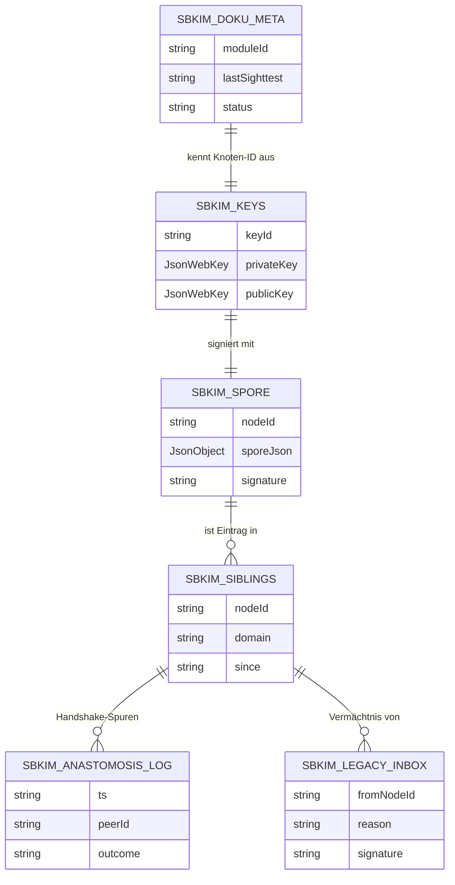

# Modul 01 — Storage

> **Status:** 🟦 Code-Stub  ·  **Schicht:** Kern  ·  **Anker:** Sage-Page → Karte 4, Eintrag 01
> **Datei (Code):** `src/modules/01_storage.js`
>
> _IndexedDB-Wrapper für alle SBKIM-Stores — die Erde, in der das Mycel
> wurzelt. Strikt getrennt vom Endknoten-App-Storage._

---

## Im Mycel-Bild

Storage ist der **Boden**, in dem das Mycel verankert ist. Schlüssel,
Spore, Geschwisterliste, Vermächtnisse — alles, was zwischen zwei Atem-
Zyklen erhalten bleiben muss, liegt hier. Der Boden ist sortenrein
(`sbkim_*`-Präfix): nichts vermischt sich mit den Inhaltsdaten der
Endknoten-PWA, keine Rezepte versickern in Geschwisterlisten und keine
Schlüssel in die Suchhistorie.

---

## Visualisierung



---

## Zweck

Einheitlicher Zugriff auf IndexedDB für alle SBKIM-Module. Vermeidet,
dass jedes Modul eigene Open/Upgrade-Logik hat. Stellt sicher, dass die
SBKIM-Daten **getrennt** vom Endknoten-Anwendungs-Storage liegen
(Store-Präfix `sbkim_*`).

---

## Verantwortlichkeiten

**Macht:**
- Datenbank `sbkim` öffnen, Versionen verwalten
- Stores anlegen (Liste unten verbindlich)
- get/put/del/all/clear auf Stores
- Promise-basiertes API (kein Callback-IDB)
- Selbstcheck-Meldung in der DevTools-Konsole beim Skript-Laden

**Macht nicht:**
- Keine Anwendungslogik (welche Werte geschrieben werden, entscheidet
  das jeweilige Modul)
- Keine Verschlüsselung der Werte (Schlüsselablage ist Sache von Modul 02)
- Keine Migration aus dem Endknoten-Anwendungs-Storage (strikte Trennung)
- Keine Suchhistorie, kein Telemetrie-Store (CLAUDE.md: keine
  personenbezogenen Daten)

---

## Schnittstelle

Modul 01 exportiert **sieben** öffentliche Funktionen. Alle DB-Operationen
liefern ein `Promise`. Es gibt **keine** Callback-Variante.

```
init() → Promise<void>
  // Öffnet die DB sbkim, führt ggf. Versionsmigration aus, legt fehlende
  // Stores an. Idempotent: mehrfacher Aufruf ist erlaubt und kostet
  // nichts (gibt dieselbe interne IDBDatabase wieder zurück).

getStore(storeName: string) → StoreHandle
  // Interner Helfer für Module, die mehrere Operationen in einer
  // Transaktion bündeln wollen. StoreHandle ist ein opakes Objekt mit
  // den Methoden get/put/del/all/clear (gleiche Semantik wie unten,
  // aber an einen Store gebunden).
  // Wirft synchron UnknownStoreError, falls storeName nicht in der
  // Stores-Tabelle steht.

get(storeName: string, key: string) → Promise<any | undefined>
  // Liest einen Wert. undefined, wenn key nicht existiert.

put(storeName: string, key: string, value: any) → Promise<void>
  // Schreibt oder überschreibt. Wert muss strukturiert klonbar sein
  // (IndexedDB-structured-clone, also kein Function, kein DOM-Node).

del(storeName: string, key: string) → Promise<void>
  // Löscht einen Eintrag. Kein Fehler, wenn key nicht existierte.

all(storeName: string) → Promise<Array<{key: string, value: any}>>
  // Liest den gesamten Store als Array von {key, value}-Paaren.
  // Reihenfolge: Einfügereihenfolge der IDB-Engine (nicht garantiert
  // stabil über Browser hinweg; wer Reihenfolge braucht, sortiert selbst).

clear(storeName: string) → Promise<void>
  // Leert den Store komplett. Vorsicht: keine Bestätigungslogik im
  // Modul — Aufrufer ist verantwortlich.
```

### Selbstcheck

Beim **Skript-Laden** (synchron, direkt nach Modul-Import, vor dem
ersten `init()`-Aufruf) emittiert das Modul:

```
console.info("MODUL 01 STORAGE bereit, Funktionen: init/getStore/get/put/del/all/clear");
```

Sinn: Klaus öffnet beim Andocken in einer Endknoten-PWA die DevTools-
Konsole, sieht alle SBKIM-Module mit ihren Funktionslisten als
zusammenhängenden Block und weiß sofort, ob alle Module gezogen haben.
Format ist über alle Module einheitlich (`MODUL XX <NAME> bereit,
Funktionen: ...`).

Hinweis: Selbstcheck signalisiert **Modul geladen**, nicht **DB offen**.
Erst `await init()` öffnet die IndexedDB.

### Stores (verbindliche Liste)

| Store | Schlüsseltyp | Wert-Form (Skizze) | Schreiber | Leser |
|---|---|---|---|---|
| `sbkim_keys` | `"main"` (fest) | `{ keyId, privateKey, publicKey }` | 02 | 02, 07 |
| `sbkim_spore` | `"main"` (fest) | `{ nodeId, sporeJson, signature }` | 02 | 02, 05 |
| `sbkim_siblings` | `nodeId` | `{ nodeId, domain, endpoint, pubKey, since, heterokaryosisOptIn? }` | 05 (Haupt), 08 (Co, nur Feld `heterokaryosisOptIn`) | 04, 05, 06, 07, 08 |
| `sbkim_anastomosis_log` | `ts` (ISO-String) | `{ ts, peerId, outcome }` | 05, 06 | 05, 07 |
| `sbkim_legacy_inbox` | `fromNodeId` | `{ fromNodeId, reason, signature, receivedAt }` | 07 | 07 |
| `sbkim_hetero_inbox` | `<peerNodeId>\|<ts>` (Komposit) | `{ peerNodeId, ts, anchors, signature, receivedAt }` | 06 | 06, 00, 08 |
| `sbkim_hetero_outbox` | `label` (string ≤ 64 Zeichen) | `{ label, vector, addedAt }` | 08 | 06, 08 |
| `sbkim_doku_meta` | `moduleId` | `{ moduleId, lastSighttest, status }` | 00 | 00 |

Alle Store-Namen beginnen mit `sbkim_` (Konstante `SBKIM_STORE_PREFIX`).
Keine anderen Stores werden von Modul 01 angelegt. Wenn ein späteres
Modul einen neuen Store braucht, geht das nur über eine Spec-Sitzung,
die die Tabelle hier ergänzt **und** die DB-Version hochzieht (siehe
Versionsmigration).

Schema-Hinweise:

- `sbkim_siblings.heterokaryosisOptIn` ist **additiv und optional** (aus
  Spec-Sitzung 06). Modul 05 setzt das Feld NICHT. Klaus setzt es pro
  Geschwister im Endknoten-UI über Modul 08 (Spec-Sitzung 08).
  **Co-Schreiber-Konvention seit Spec-Sitzung 08:** Modul 08 darf
  AUSSCHLIESSLICH dieses eine Feld setzen, wenn der Eintrag bereits
  existiert (`SbkimUiDemo.setSiblingHeteroOptIn(peerNodeId, optIn)` —
  liest den Eintrag, ändert nur das eine Feld, schreibt zurück; sonst
  `UnknownSiblingError`). Haupt-Schreiber des Stores (alle anderen
  Felder) bleibt Modul 05. Modul 06 liest fail-soft (fehlend → default
  `false`).
- `sbkim_hetero_inbox` nutzt einen **Komposit-Schlüssel** `<peerNodeId>|<ts>`
  (Pipe-getrennt). Damit akkumulieren mehrere Pulls über die Zeit als
  Drift-Spur, ohne ältere Einträge zu überschreiben. Schreiber 06; Leser
  06 (`listHeterokaryosis`/`forgetHeterokaryosis`), 00 (Doku-Fenster
  Inbox-Anzeige als Folge-Pflege), 08 (UI-Demo, Spec-Sitzung 08).
- `sbkim_hetero_outbox` (Spec-Sitzung 08) nutzt `label` als Schlüssel
  (string ≤ 64 Zeichen, eindeutig pro Knoten — siehe Anker-Form aus
  Karte 06). Doppelte `addOutboxAnchor`-Aufrufe mit gleichem Label
  überschreiben den Eintrag und aktualisieren `addedAt`. Max.
  `HETERO_OUTBOX_MAX_ENTRIES` Einträge (= 5, §0); ein sechster Anker
  mit neuem Label wirft `OutboxFullError` (kein automatisches
  Verdrängen — Klaus muss manuell `removeOutboxAnchor` rufen).
  Reihenfolge in `listOutbox`: **absteigend nach `addedAt`** (neueste
  zuerst), damit die UI das gerade Gepflegte oben zeigt und Modul 06
  beim Pull die frischesten Anker liefert. Modul 06 ist Leser
  (fail-soft: Store leer / nicht vorhanden → Fallback auf Spore-
  Single-Anker mit Label `"(domain)"`). Der Outbox-Lese-Pfad in
  `src/modules/06_heterokaryose.js` folgt in einer Folge-Pflege Bau
  06.1 nach Spec-Sitzung 08.
- `sbkim_anastomosis_log` hat ab Spec-Sitzung 06 **zwei Schreiber**
  (05 für Anastomose-Outcomes, 06 für `hetero-*`-Outcomes); das outcome-
  Vokabular ist additiv erweitert. Modul 07's TTL-Sweep bleibt
  unverändert — er liest nur `"established"`/`"re-handshake"`.

**Bewusst nicht aufgenommen:**
- `sbkim_search_history` — personenbezogen, in CLAUDE.md verboten.
- `sbkim_embedding_cache` — `transformers.js` cached das Modell selbst;
  einzelne Vektoren werden nicht persistiert. Bei späterem Bedarf
  (Performance-Messung in Modul 04) kann ein optionaler Cache-Store
  ergänzt werden, aber nicht in dieser Spec.

### Versionsmigration

```
DB_NAME    = "sbkim"
DB_VERSION = 3        // Stand 2026-05-15, Spec-Sitzung 08 (additive Migration v=3)
```

Migrations-Logik in `onupgradeneeded`:

```
oldVersion = event.oldVersion;
newVersion = event.newVersion;
for (v = oldVersion + 1; v <= newVersion; v++) {
  applyMigration(db, v);
}
```

`applyMigration(db, v)` legt für jede neue Version nur die in dieser
Version hinzukommenden Stores an (`createObjectStore`). Vorhandene
Stores werden **nie** überschrieben oder gelöscht.

| Version | Hinzukommende Stores | Sitzung |
|---|---|---|
| `v=1` | `sbkim_keys`, `sbkim_spore`, `sbkim_siblings`, `sbkim_anastomosis_log`, `sbkim_legacy_inbox`, `sbkim_doku_meta` | Spec+Bau 01 (2026-05-14) |
| `v=2` | `sbkim_hetero_inbox` | Bau 06 (2026-05-15) |
| `v=3` | `sbkim_hetero_outbox` | Spec 08 (2026-05-15) |

Künftige Migrationen erhöhen `DB_VERSION` um genau 1 pro Spec-Sitzung,
die etwas an der Tabelle ändert. Migrations-Schritte sind additiv;
Drop-Operationen brauchen einen eigenen Spec-Eintrag mit dokumentiertem
Datenverlust-Pfad. Bestehende Klaus-PWAs mit DB-Version 1 oder 2
bekommen den jeweils fehlenden Store beim nächsten Lade durch den
`onupgradeneeded`-Pfad — kein Datenverlust, additive Erweiterung. Eine
PWA mit `v=1` läuft beim nächsten Lade durch `applyMigration(db, 2)`
*und* `applyMigration(db, 3)` (Loop `for v = oldVersion+1 … newVersion`).

### Konfigurationswerte

```
SBKIM_STORE_PREFIX = "sbkim_"   // INTERFACES.md §0
DB_NAME            = "sbkim"
DB_VERSION         = 3
```

---

## Fehlerverhalten

| Lage | Reaktion |
|---|---|
| Privatmodus / inkognito (IDB blockiert) | `init()` rejects mit `StorageUnavailableError` — verständliche Meldung; Hauptanwendung darf weiterlaufen, SBKIM-Funktionen sind dann deaktiviert. |
| Unbekannter Store-Name | rejects mit `UnknownStoreError`; bei `getStore()` synchron geworfen. |
| Quota überschritten beim `put()` | rejects mit `QuotaExceededError`, kein Silent-Fail. Aufrufer entscheidet (Aufräumen / Nutzer-Hinweis). |
| Strukturell-nicht-klonbarer Wert | rejects mit `DataCloneError` (vom Browser durchgereicht). |
| DB-Open scheitert (Schema-Drift, Corruption) | rejects mit `StorageOpenError`; Modul versucht **keine** automatische Reparatur. |

Alle Fehler sind `Error`-Instanzen mit sprechendem `name` (siehe Tabelle)
und einem deutschsprachigen `message`-Feld für Logs.

---

## Manueller Test

In `tests/manual_check.html`, Panel **01 Storage**, vier Knöpfe
(seit Bau-Sitzung 2026-05-14 mit echten Aufrufen verdrahtet):

1. **Storage init** — ruft `init()` auf, erwartet erfolgreich.
   Sichtprüfung: DevTools → Application → IndexedDB → `sbkim` muss
   vorhanden sein, alle sechs Stores aus der Tabelle angelegt.
2. **Storage round-trip** — `put("sbkim_doku_meta", "01", {moduleId:"01", lastSighttest:"<now>", status:"ok"})`
   → `get(...)` → `del(...)` → `get(...)`. Erwartung: kein Fehler,
   letzter `get` liefert `undefined`.
3. **Unknown Store (Fehler erwartet)** — versucht
   `get("sbkim_nicht_existent", "x")` und erwartet einen
   `UnknownStoreError`. Erfolgsfall = Fehler kam wie erwartet.
4. **Selbstcheck Konsole prüfen** — Hinweisknopf ohne Aktion: weist
   den Tester an, DevTools → Konsole zu öffnen und die `console.info`-
   Zeile `MODUL 01 STORAGE bereit, Funktionen: ...` zu suchen.

Bewertung manuell durch den Tester. Ergebnis kommt in den Bauzustand-
Block dieser Karte (Zeile „Sichttest").

---

## Risiken & offene Punkte

- **Privatmodus:** in einigen Browsern (z.B. Safari im privaten Modus,
  Firefox-Container) ist IndexedDB nicht verfügbar oder volumen-begrenzt.
  `init()` muss sauber scheitern (siehe Fehlertabelle), darf die
  Endknoten-PWA nicht abstürzen lassen.
- **Versionsupgrade:** spätere Spec-Sitzungen, die einen Store hinzufügen,
  müssen `DB_VERSION` hochziehen **und** den Migrations-Block ergänzen.
  Niemals `clearObjectStore` oder `deleteObjectStore` ohne expliziten
  Spec-Vermerk mit Datenverlust-Beschreibung.
- **Quotaüberschreitung:** beim `put()` bewusst weiterreichen. Apoptose
  (Modul 07) ist der Ort, an dem strukturell aufgeräumt wird, nicht
  Storage.
- **Strukturierte Klone:** das IDB-Klon-Verfahren akzeptiert keine
  Funktionen, keine Klassen-Instanzen mit Methoden, keine DOM-Nodes.
  Module müssen vor dem Schreiben in einfache JSON-kompatible Objekte
  konvertieren.
- **Service-Worker-Sichtbarkeit (Modul 05):** IndexedDB ist im
  Service-Worker-Scope zugänglich. Storage muss dort genauso funktionieren
  wie im Fenster-Scope — die Spec macht keine Annahme über den Aufrufer-
  Kontext.

---

## Bauzustand

| Schritt | Datum | Sitzung | Anmerkung |
|---|---|---|---|
| Karte angelegt | 2026-05-10 | Skelett | leere Schablone |
| Site-Echo | 2026-05-10 | Site-Echo | Hero, Bio-Metapher, ER-Diagramm, Querverweise |
| Spec gefüllt | 2026-05-14 | Spec 01+03 | API, Stores-Liste, Migrations-Regel, Selbstcheck-Format |
| Code geschrieben | 2026-05-14 | Bau 01 | `src/modules/01_storage.js`, IIFE mit `window.SbkimStorage`, vier Knöpfe in `manual_check.html`, JS-Syntax via `node --check` grün |
| Sichttest | 2026-05-14 | Bau 01 | geprüft 2026-05-14 (Klaus, im Browser): init/round-trip/Unknown-Store sauber. DB `sbkim` mit sechs Stores in DevTools sichtbar. |
| Pflege Bau 06 Store-Anmeldung | 2026-05-15 | Bau 06 + Cleanup-Pflege 07 | `DB_VERSION` 1 → 2 (additive Migration); `STORE_NAMES`/`KNOWN_STORES` um `sbkim_hetero_inbox` erweitert (Schlüssel-Komposit `<peerNodeId>\|<ts>`, Schreiber 06, Leser 06/00/08); `onupgradeneeded`-Pfad um `v=2`-Block ergänzt — bestehende PWAs mit DB-Version 1 bekommen den neuen Store beim nächsten Lade additiv, kein Datenverlust. `sbkim_siblings`-Wert-Form-Zeile um optionales `heterokaryosisOptIn`-Feld ergänzt (Schreiber bleibt 05, Modul 05 setzt das Feld NICHT, Modul 06 liest fail-soft); `sbkim_anastomosis_log`-Schreiber-Zeile um Modul 06 erweitert (additive `hetero-*`-outcome-Werte). `node --check src/modules/01_storage.js` grün. |
| Pflege Spec 08 Outbox-Anmeldung | 2026-05-15 | Spec 08 | `DB_VERSION` 2 → 3 (additive Migration v=3) in § Konfigurationswerte und Versionsmigrations-Tabelle nachgezogen. § Stores um neuen Store `sbkim_hetero_outbox` erweitert (Schlüssel `label` string ≤ 64 Zeichen, Wert `{label, vector, addedAt}`, Schreiber 08, Leser 06/08). `sbkim_siblings`-Schreiber-Spalte um Co-Schreiber-Hinweis „08 (Co, nur Feld `heterokaryosisOptIn`)" erweitert; Leser-Spalte um 08 ergänzt. Schema-Hinweis-Block um Co-Schreiber-Konvention (Modul 08 darf AUSSCHLIESSLICH das eine additive Feld setzen, wenn der Eintrag bereits existiert — sonst `UnknownSiblingError`; Haupt-Schreiber bleibt 05, Karte 05 unangetastet) und um `sbkim_hetero_outbox`-Verhalten (Reihenfolge absteigend nach `addedAt` in `listOutbox`, Überschreib-Verhalten bei doppeltem Label, `OutboxFullError` ohne automatisches Verdrängen, fail-soft-Lese-Recht für Modul 06; Outbox-Lese-Pfad in `src/modules/06_heterokaryose.js` als Folge-Pflege Bau 06.1 notiert) erweitert. **Keine JS-Code-Änderung** in `src/modules/01_storage.js` (`DB_VERSION` und `STORES_V3` zieht Bau-Sitzung 08 nach — Spec-Sitzung 08 spezifiziert nur den Vertrag). |
| Pflege Bau 06.1 Code-DB-Version 2 → 3 | 2026-05-15 | Pflege Bau 06.1 | `src/modules/01_storage.js` `DB_VERSION` 2 → 3 (additive Migration v=3); neuer `STORES_V3 = ["sbkim_hetero_outbox"]`-Block in `applyMigration(db, 3)`; `KNOWN_STORES` um den Outbox-Store erweitert. Bestehende PWAs mit DB-Version 1 oder 2 bekommen den Store beim nächsten Lade additiv (`for v = oldVersion+1 … newVersion`-Loop zieht beide Migrations-Schritte v=2 + v=3 nach), kein Datenverlust. Code-Anmeldung des Stores, den Spec-Sitzung 08 schon im Vertrag spezifiziert hatte — Karte 01 § Konfigurationswerte und § Versionsmigration sind seit Spec-Sitzung 08 auf `v=3` und werden hier nur im Code nachgezogen. **Keine Vertragsänderung** in Karte 01 oder INTERFACES.md §1 Modul 01 (Spec 08 hatte den Vertrag schon gespiegelt; Pflege Bau 06.1 hebt den Code-Status nach). `node --check src/modules/01_storage.js` grün. |
| In Endknoten eingebaut | — | — | — |

---

**Querverweise**

- **Abhängigkeiten:** keine (Wurzel der Mycel-Erde)
- **Wird genutzt von:** Modul 02 (Spore) · Modul 05 (Anastomose) · Modul 06 (Heterokaryose) · Modul 07 (Apoptose) · Modul 00 (Doku-Meta) · später Modul 12 (Blocklist)
- **Site-Karte:** [Karte 4 · Module-Bento](../../index.html#screen-overview), Eintrag 01
- **Glossar:** [IndexedDB-Speicher](../GLOSSAR.md)
- **Integration:** `sbkim_integration.md` §4.2 (Schlüsselablage), §9 (keine Vermischung mit Hauptanwendungs-Storage)
- **Interfaces:** [`INTERFACES.md` §1 → Modul 01_storage](../INTERFACES.md)
