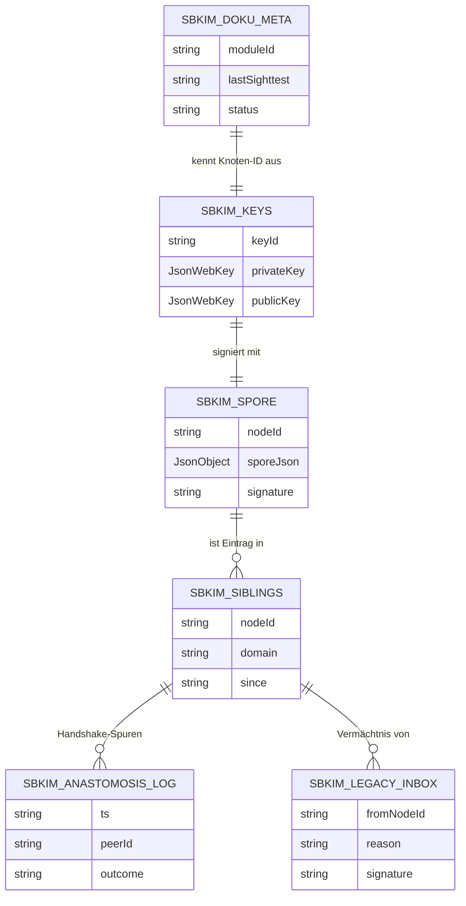

# Modul 01 — Storage

> **Status:** 🟫 Schablone  ·  **Schicht:** Kern  ·  **Anker:** Sage-Page → Karte 4, Eintrag 01
> **Datei (Code):** `src/modules/01_storage.js`
>
> _IndexedDB-Wrapper für alle SBKIM-Stores — die Erde, in der das Mycel
> wurzelt. Strikt getrennt vom Endknoten-App-Storage._

---

## Im Mycel-Bild

Storage ist der **Boden**, in dem das Mycel verankert ist. Schlüssel,
Spore, Geschwisterliste, Vermächtnisse — alles, was zwischen zwei Atem-
Zyklen erhalten bleiben muss, liegt hier. Der Boden ist sortenrein
(`sbkim_*`-Präfix): nichts vermischt sich mit den Inhaltsdaten der
Endknoten-PWA, keine Rezepte versickern in Geschwisterlisten und keine
Schlüssel in die Suchhistorie.

---

## Visualisierung



---

## Zweck

Einheitlicher Zugriff auf IndexedDB für alle SBKIM-Module. Vermeidet,
dass jedes Modul eigene Open/Upgrade-Logik hat. Stellt sicher, dass die
SBKIM-Daten **getrennt** vom Endknoten-Anwendungs-Storage liegen
(Store-Präfix `sbkim_*`).

---

## Verantwortlichkeiten

**Macht:**
- Datenbank `sbkim` öffnen, Versionen verwalten
- Stores anlegen (Liste in Spec)
- get/put/delete/getAll auf Stores
- Promise-basiertes API (kein Callback-IDB)

**Macht nicht:**
- Keine Anwendungslogik (welche Werte geschrieben werden, entscheidet
  das jeweilige Modul)
- Keine Verschlüsselung der Werte (Schlüsselablage ist Sache von Modul 02)
- Keine Migration aus dem Endknoten-Anwendungs-Storage (strikte Trennung)

---

## Schnittstelle

*(noch zu spezifizieren — Spec-Sitzung füllt aus)*

Vorgeschlagene Skizze:

```
init() → Promise<void>
  // öffnet/migriert die DB

getStore(storeName: string) → StoreHandle
get(storeName, key) → Promise<any | undefined>
put(storeName, key, value) → Promise<void>
del(storeName, key) → Promise<void>
all(storeName) → Promise<Array<{key, value}>>
clear(storeName) → Promise<void>
```

Stores (vorläufige Liste, in Spec zu finalisieren):

| Store | Zweck | Modul |
|---|---|---|
| `sbkim_keys` | privater/öffentlicher Ed25519-Schlüssel | 02 |
| `sbkim_spore` | eigene Spore | 02 |
| `sbkim_siblings` | Geschwisterknoten | 05 |
| `sbkim_anastomosis_log` | Handshake-Historie | 05 |
| `sbkim_legacy_inbox` | empfangene Vermächtnisse | 07 |
| `sbkim_doku_meta` | Letzter Sichttest pro Modul | 00 |

### Konfigurationswerte

```
SBKIM_STORE_PREFIX = "sbkim_"
```

---

## Manueller Test

1. `tests/manual_check.html` öffnen, Knopf "Storage init".
2. DevTools → Application → IndexedDB → `sbkim` muss vorhanden sein,
   alle erwarteten Stores angelegt.
3. Knopf "Storage round-trip": put → get → del. Erwartung: alle drei
   ohne Fehler, Wert nach del weg.

---

## Risiken & offene Punkte

- Privatmodus / inkognito: IDB kann unzugänglich sein → init muss sauber
  scheitern (return rejected Promise mit verständlicher Meldung), darf
  Hauptanwendung nicht abstürzen lassen.
- Versionsupgrade: bei künftigen Schema-Änderungen müssen alte Stores
  migriert werden, nicht überschrieben.
- Quotaüberschreitung: bei put → bewusst weiterreichen (kein Silent-Fail).

---

## Bauzustand

| Schritt | Datum | Sitzung | Anmerkung |
|---|---|---|---|
| Karte angelegt | 2026-05-10 | Skelett | leere Schablone |
| Site-Echo | 2026-05-10 | Site-Echo | Hero, Bio-Metapher, ER-Diagramm, Querverweise |
| Spec gefüllt | — | — | — |
| Code geschrieben | — | — | — |
| Sichttest | — | — | — |
| In Endknoten eingebaut | — | — | — |

---

**Querverweise**

- **Abhängigkeiten:** keine (Wurzel der Mycel-Erde)
- **Wird genutzt von:** Modul 02 (Spore) · Modul 05 (Anastomose) · Modul 07 (Apoptose) · Modul 12 (Blocklist) · Modul 00 (Doku-Meta)
- **Site-Karte:** [Karte 4 · Module-Bento](../../index.html#screen-overview), Eintrag 01
- **Glossar:** [IndexedDB-Speicher](../GLOSSAR.md)
- **Integration:** `sbkim_integration.md` §4.2 (Schlüsselablage), §9 (keine Vermischung mit Hauptanwendungs-Storage)
