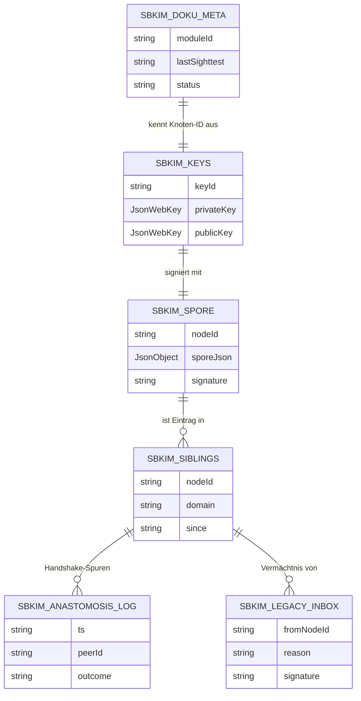

# Modul 01 — Storage

> **Status:** 🟦 Code-Stub  ·  **Schicht:** Kern  ·  **Anker:** Sage-Page → Karte 4, Eintrag 01
> **Datei (Code):** `src/modules/01_storage.js`
>
> _IndexedDB-Wrapper für alle SBKIM-Stores — die Erde, in der das Mycel
> wurzelt. Strikt getrennt vom Endknoten-App-Storage._

---

## Im Mycel-Bild

Storage ist der **Boden**, in dem das Mycel verankert ist. Schlüssel,
Spore, Geschwisterliste, Vermächtnisse — alles, was zwischen zwei Atem-
Zyklen erhalten bleiben muss, liegt hier. Der Boden ist sortenrein
(`sbkim_*`-Präfix): nichts vermischt sich mit den Inhaltsdaten der
Endknoten-PWA, keine Rezepte versickern in Geschwisterlisten und keine
Schlüssel in die Suchhistorie.

---

## Visualisierung



---

## Zweck

Einheitlicher Zugriff auf IndexedDB für alle SBKIM-Module. Vermeidet,
dass jedes Modul eigene Open/Upgrade-Logik hat. Stellt sicher, dass die
SBKIM-Daten **getrennt** vom Endknoten-Anwendungs-Storage liegen
(Store-Präfix `sbkim_*`).

---

## Verantwortlichkeiten

**Macht:**
- Datenbank `sbkim` öffnen, Versionen verwalten
- Stores anlegen (Liste unten verbindlich)
- get/put/del/all/clear auf Stores
- Promise-basiertes API (kein Callback-IDB)
- Selbstcheck-Meldung in der DevTools-Konsole beim Skript-Laden

**Macht nicht:**
- Keine Anwendungslogik (welche Werte geschrieben werden, entscheidet
  das jeweilige Modul)
- Keine Verschlüsselung der Werte (Schlüsselablage ist Sache von Modul 02)
- Keine Migration aus dem Endknoten-Anwendungs-Storage (strikte Trennung)
- Keine Suchhistorie, kein Telemetrie-Store (CLAUDE.md: keine
  personenbezogenen Daten)

---

## Schnittstelle

Modul 01 exportiert **acht** öffentliche Funktionen (sieben bestehende
plus `ensureStore` aus Bau 01.Y 2026-05-19). Alle DB-Operationen
liefern ein `Promise`. Es gibt **keine** Callback-Variante.

```
init(options?) → Promise<void>
  // Öffnet die DB (Default `sbkim`, oder `sbkim_<dbSuffix>` bei Bedarf —
  // siehe § DB-Namen-Konvention), führt ggf. Versionsmigration aus, legt
  // fehlende Stores an. Idempotent: mehrfacher Aufruf ist erlaubt und
  // kostet nichts (gibt dieselbe interne IDBDatabase wieder zurück).
  //
  // options-Form: { dbSuffix?: string }
  //   dbSuffix muss dem Pattern ^[a-z0-9_-]+$ entsprechen (Kleinbuchstaben,
  //   Ziffern, '_' und '-'). Verstösse werfen InvalidDbSuffixError SYNCHRON
  //   vor jedem Promise-Aufbau. Ohne dbSuffix bleibt der Default `sbkim`
  //   aktiv — bestehende Sage-Werkstatt und Klaus-PWAs ohne Suffix-Konfig
  //   funktionieren unverändert weiter (rückwärtskompatibel).
  //
  // Wer im Endknoten einen Suffix setzen will, muss init({dbSuffix:…}) ZUERST
  // rufen, vor irgendeinem Modul, das Storage.init() intern selbst nachzieht
  // (Modul 05, 06, 07, 00). Ein abweichender dbSuffix bei einem späteren
  // init-Aufruf wirft InvalidDbSuffixError (kein stilles Ignorieren).
  //
  // Pflege Storage-Persist (2026-05-16): nach erfolgreichem DB-Open
  // (onsuccess) fordert Modul 01 navigator.storage.persist() an
  // (fail-soft). Bei Erfolg gibt _meta.storagePersisted true|false zurück;
  // wenn die API fehlt oder das Promise rejectet, bleibt der Wert null.
  // Persist-Verweigerung ist KEIN SBKIM-Bruchgrund — der Knoten läuft
  // weiter (Chrome auto-bei-PWA, Firefox prompt, Safari restriktiv).
  //
  // Pflege „init() versions-fail-soft" (2026-05-19): DB_VERSION ist
  // Mindest-Schema-Version, nicht Ziel-Version. init() respektiert
  // existing DB-Versionen > DB_VERSION (entstanden durch ensureStore-
  // Bumps in früheren Sitzungen) und übernimmt sie ohne VersionError
  // zu werfen. Bei fehlendem Pflicht-Store in existing DB:
  // StorageOpenError mit Liste der fehlenden Stores. Details siehe
  // § Versionsmigration § Versions-Fail-Soft-Pfad und INTERFACES.md
  // § 1 Modul 01 Bietet-Block (init-Garantien).

getStore(storeName: string) → StoreHandle
  // Interner Helfer für Module, die mehrere Operationen in einer
  // Transaktion bündeln wollen. StoreHandle ist ein opakes Objekt mit
  // den Methoden get/put/del/all/clear (gleiche Semantik wie unten,
  // aber an einen Store gebunden).
  // Wirft synchron UnknownStoreError, falls storeName nicht in der
  // Stores-Tabelle steht.

get(storeName: string, key: string) → Promise<any | undefined>
  // Liest einen Wert. undefined, wenn key nicht existiert.

put(storeName: string, key: string, value: any) → Promise<void>
  // Schreibt oder überschreibt. Wert muss strukturiert klonbar sein
  // (IndexedDB-structured-clone, also kein Function, kein DOM-Node).

del(storeName: string, key: string) → Promise<void>
  // Löscht einen Eintrag. Kein Fehler, wenn key nicht existierte.

all(storeName: string) → Promise<Array<{key: string, value: any}>>
  // Liest den gesamten Store als Array von {key, value}-Paaren.
  // Reihenfolge: Einfügereihenfolge der IDB-Engine (nicht garantiert
  // stabil über Browser hinweg; wer Reihenfolge braucht, sortiert selbst).

clear(storeName: string) → Promise<void>
  // Leert den Store komplett. Vorsicht: keine Bestätigungslogik im
  // Modul — Aufrufer ist verantwortlich.

ensureStore(storeName: string) → Promise<void>
  // Bau 01.Y (2026-05-19): additive Anlage dynamischer Stores ab
  // DB-Version 4 — Option A aus INTERFACES.md § 9.5 Migrations-
  // Strategie. Idempotent: ist der Store bereits in der DB vorhanden,
  // resolved die Promise sofort als no-op (kein Versions-Bump, keine
  // Resource-Leakage).
  //
  // Pattern-Check SYNCHRON: storeName muss dem Modul-01-Pattern
  // ^sbkim_[a-z0-9_]+$ entsprechen (Konstante STORE_NAME_PATTERN,
  // modul-lokal). Verstoss wirft InvalidStoreNameError SYNCHRON vor
  // jedem Promise-Aufbau. Das Pattern ist STRENGER als das dbSuffix-
  // Pattern ^[a-z0-9_-]+$: Store-Namen tragen den 'sbkim_'-Präfix und
  // dürfen kein '-' enthalten (Trenner-Konvention bleibt '_').
  //
  // Versions-Bump-Choreografie (verbindlich): bei Bedarf schließt
  // Modul 01 die aktuelle DB-Verbindung, ruft indexedDB.open mit
  // db.version + 1 (linearer Inkrement entkoppelt von DB_VERSION,
  // damit zwei parallele ensureStore-Aufrufe sich nicht in die
  // Versionssequenz schreiben) und legt im onupgradeneeded-Handler
  // genau den neuen Store an (createObjectStore ohne keyPath, wie
  // alle anderen sbkim_*-Stores — externe Keys). Andere Tabs
  // bekommen das onversionchange-Event und müssen ihre eigene
  // Verbindung fail-soft schließen, damit der Bump durchgeht.
  //
  // Aufrufer trägt die Identitäts-Konvention. Modul 01 kennt
  // Identität NICHT; Bau 02.Y wird ensureStore mit dem
  // identitäts-spezifischen Suffix (z.B.
  // "sbkim_siblings_<key>") rufen. KEINE Datenmigration alter
  // Stores, KEINE neuen Indices auf bestehenden Stores — strikt
  // additiv.
  //
  // Bei Erfolg ist der Store ab sofort in
  // getStore/get/put/del/all/clear regulär nutzbar (KNOWN_STORES
  // wird zur Laufzeit erweitert).
  //
  // Bei Fehler in der IDBOpenDBRequest-Choreografie (onerror,
  // onblocked, anderer Tab verweigert onversionchange) rejected die
  // Promise mit EnsureStoreError; die cause-Property trägt die
  // ursprüngliche IDBOpenDBRequest-Error-Reason.
```

### Selbstcheck

Beim **Skript-Laden** (synchron, direkt nach Modul-Import, vor dem
ersten `init()`-Aufruf) emittiert das Modul:

```
console.info("MODUL 01 STORAGE bereit, Funktionen: init/getStore/get/put/del/all/clear/ensureStore");
```

Sinn: Klaus öffnet beim Andocken in einer Endknoten-PWA die DevTools-
Konsole, sieht alle SBKIM-Module mit ihren Funktionslisten als
zusammenhängenden Block und weiß sofort, ob alle Module gezogen haben.
Format ist über alle Module einheitlich (`MODUL XX <NAME> bereit,
Funktionen: ...`).

Hinweis: Selbstcheck signalisiert **Modul geladen**, nicht **DB offen**.
Erst `await init()` öffnet die IndexedDB.

### DB-Namen-Konvention (PWA-Suffix)

Standardname der IndexedDB ist `sbkim`. Wer mehrere SBKIM-Endknoten unter
demselben Browser-**Origin** betreibt (häufiger Fall: GitHub-Pages-
Project-Sites, alle PWAs unter `https://<benutzer>.github.io/`), teilt
sich pro Origin **eine** IndexedDB. Modul 02 schreibt die Identität unter
`sbkim_keys["main"]` — zwei Endknoten unter derselben Origin würden sich
also denselben Ed25519-Schlüssel und damit dieselbe `nodeId` teilen
(beobachtet 2026-05-16 bei `Mein-Mixarium` + `Mein-Rezeptbuch` unter
`lausiklauskn-png.github.io`).

Für solche Fälle nimmt `init({ dbSuffix: "<wert>" })` einen PWA-Suffix
entgegen und öffnet stattdessen die DB unter dem Namen `sbkim_<wert>`.
Jede so eröffnete DB bekommt ihre eigenen `sbkim_keys`, `sbkim_spore`,
`sbkim_siblings`-Stores — also pro PWA eine eigene Identität.

| Aufruf | Effektiver DB-Name | Wann |
|---|---|---|
| `init()` | `sbkim` | Default; ein Endknoten pro Origin, lokale Sage-Werkstatt |
| `init({ dbSuffix: "mixarium" })` | `sbkim_mixarium` | Mein-Mixarium auf `lausiklauskn-png.github.io` |
| `init({ dbSuffix: "rezeptbuch" })` | `sbkim_rezeptbuch` | Mein-Rezeptbuch auf `lausiklauskn-png.github.io` |

Konvention:

- `dbSuffix` ist eine **Aufrufer-Pflicht** im Andocker. Modul 01 inferiert
  ihn nicht aus `location.pathname` oder ähnlichem — der Andocker weiss am
  besten, welche PWA-Identität er gerade aufbaut (vgl. Karte 09 § Vor dem
  Einbau zu klärende Werte).
- Pattern `^[a-z0-9_-]+$`: Kleinbuchstaben, Ziffern, `_` und `-`. Verstösse
  werfen `InvalidDbSuffixError` **synchron** beim `init`-Aufruf (vor jeder
  Promise-Auswertung).
- Suffix muss beim **ersten** `init`-Aufruf gesetzt werden. Modul 05, 06,
  07, 00 rufen `Storage.init()` intern selbst nach — wer Suffix setzen
  will, muss `SbkimStorage.init({dbSuffix:…})` ZUERST aufrufen. Ein
  späterer init-Aufruf mit abweichendem Suffix wirft
  `InvalidDbSuffixError` (kein stilles Ignorieren).
- Modul 02 (`02_spore.js`) bleibt unverändert: `IDENTITY_KEY = "main"`
  ist weiter der Singleton-Schlüssel innerhalb der jeweiligen DB. Die
  Trennung passiert eine Schicht tiefer, auf DB-Namen-Ebene.

### Stores (verbindliche Liste)

| Store | Schlüsseltyp | Wert-Form (Skizze) | Schreiber | Leser |
|---|---|---|---|---|
| `sbkim_keys` | `"main"` (fest) | `{ keyId, privateKey, publicKey }` | 02 | 02, 07 |
| `sbkim_spore` | `"main"` (fest) | `{ nodeId, sporeJson, signature }` | 02 | 02, 05 |
| `sbkim_siblings` | `nodeId` | `{ nodeId, domain, endpoint, pubKey, since, heterokaryosisOptIn? }` | 05 (Haupt), 08 (Co, nur Feld `heterokaryosisOptIn`) | 04, 05, 06, 07, 08 |
| `sbkim_anastomosis_log` | `ts` (ISO-String) | `{ ts, peerId, outcome }` | 05, 06 | 05, 07 |
| `sbkim_legacy_inbox` | `fromNodeId` | `{ fromNodeId, reason, signature, receivedAt }` | 07 | 07 |
| `sbkim_hetero_inbox` | `<peerNodeId>\|<ts>` (Komposit) | `{ peerNodeId, ts, anchors, signature, receivedAt }` | 06 | 06, 00, 08 |
| `sbkim_hetero_outbox` | `label` (string ≤ 64 Zeichen) | `{ label, vector, addedAt }` | 08 | 06, 08 |
| `sbkim_doku_meta` | `moduleId` | `{ moduleId, lastSighttest, status }` | 00 | 00 |

Alle Store-Namen beginnen mit `sbkim_` (Konstante `SBKIM_STORE_PREFIX`).
Keine anderen Stores werden von Modul 01 angelegt. Wenn ein späteres
Modul einen neuen Store braucht, geht das nur über eine Spec-Sitzung,
die die Tabelle hier ergänzt **und** die DB-Version hochzieht (siehe
Versionsmigration).

Schema-Hinweise:

- `sbkim_siblings.heterokaryosisOptIn` ist **additiv und optional** (aus
  Spec-Sitzung 06). Modul 05 setzt das Feld NICHT. Klaus setzt es pro
  Geschwister im Endknoten-UI über Modul 08 (Spec-Sitzung 08).
  **Co-Schreiber-Konvention seit Spec-Sitzung 08:** Modul 08 darf
  AUSSCHLIESSLICH dieses eine Feld setzen, wenn der Eintrag bereits
  existiert (`SbkimUiDemo.setSiblingHeteroOptIn(peerNodeId, optIn)` —
  liest den Eintrag, ändert nur das eine Feld, schreibt zurück; sonst
  `UnknownSiblingError`). Haupt-Schreiber des Stores (alle anderen
  Felder) bleibt Modul 05. Modul 06 liest fail-soft (fehlend → default
  `false`).
- `sbkim_hetero_inbox` nutzt einen **Komposit-Schlüssel** `<peerNodeId>|<ts>`
  (Pipe-getrennt). Damit akkumulieren mehrere Pulls über die Zeit als
  Drift-Spur, ohne ältere Einträge zu überschreiben. Schreiber 06; Leser
  06 (`listHeterokaryosis`/`forgetHeterokaryosis`), 00 (Doku-Fenster
  Inbox-Anzeige als Folge-Pflege), 08 (UI-Demo, Spec-Sitzung 08).
- `sbkim_hetero_outbox` (Spec-Sitzung 08) nutzt `label` als Schlüssel
  (string ≤ 64 Zeichen, eindeutig pro Knoten — siehe Anker-Form aus
  Karte 06). Doppelte `addOutboxAnchor`-Aufrufe mit gleichem Label
  überschreiben den Eintrag und aktualisieren `addedAt`. Max.
  `HETERO_OUTBOX_MAX_ENTRIES` Einträge (= 5, §0); ein sechster Anker
  mit neuem Label wirft `OutboxFullError` (kein automatisches
  Verdrängen — Klaus muss manuell `removeOutboxAnchor` rufen).
  Reihenfolge in `listOutbox`: **absteigend nach `addedAt`** (neueste
  zuerst), damit die UI das gerade Gepflegte oben zeigt und Modul 06
  beim Pull die frischesten Anker liefert. Modul 06 ist Leser
  (fail-soft: Store leer / nicht vorhanden → Fallback auf Spore-
  Single-Anker mit Label `"(domain)"`). Der Outbox-Lese-Pfad in
  `src/modules/06_heterokaryose.js` folgt in einer Folge-Pflege Bau
  06.1 nach Spec-Sitzung 08.
- `sbkim_anastomosis_log` hat ab Spec-Sitzung 06 **zwei Schreiber**
  (05 für Anastomose-Outcomes, 06 für `hetero-*`-Outcomes); das outcome-
  Vokabular ist additiv erweitert. Modul 07's TTL-Sweep bleibt
  unverändert — er liest nur `"established"`/`"re-handshake"`.

**Bewusst nicht aufgenommen:**
- `sbkim_search_history` — personenbezogen, in CLAUDE.md verboten.
- `sbkim_embedding_cache` — `transformers.js` cached das Modell selbst;
  einzelne Vektoren werden nicht persistiert. Bei späterem Bedarf
  (Performance-Messung in Modul 04) kann ein optionaler Cache-Store
  ergänzt werden, aber nicht in dieser Spec.

### Dynamische Stores ab v=4

Mit Bau 01.Y (2026-05-19) öffnet Modul 01 den dynamischen Store-Pfad
für die Multi-Identitäts-Erweiterung aus INTERFACES.md § 9. Die acht
Stores oben (STORES_V1/V2/V3) bleiben der **initiale Pflicht-Migrations-
Pfad** und werden bei `init()` automatisch angelegt. Zusätzlich
existiert ab DB-Version 4 der Pfad `ensureStore(name)`:

- **Aufrufer-Konvention:** Modul 02 (Bau-Folge-Sitzung 02.Y) ruft
  `ensureStore("sbkim_siblings_<key>")` etc. für jeden identitäts-
  spezifischen Store, bevor er beschrieben wird. Modul 01 kennt
  Identität nicht — der `_<key>`-Suffix ist Aufrufer-Pflicht.
- **Pattern:** `^sbkim_[a-z0-9_]+$` (Konstante `STORE_NAME_PATTERN`,
  modul-lokal). Strenger als das `dbSuffix`-Pattern aus
  `init({dbSuffix})` — Store-Namen tragen den `sbkim_`-Präfix und
  dürfen kein `-` enthalten (Trenner-Konvention bleibt `_`).
- **Idempotenz:** existierender Store → no-op-Promise. `ensureStore`
  zweimal mit demselben Namen bumpt die DB-Version **nicht** — Modul 01
  prüft `db.objectStoreNames.contains(name)` vor dem Versions-Bump.
- **Pflicht-Stores bleiben unangetastet:** `ensureStore` legt nur den
  einen neuen Store an, migriert oder ändert keine bestehenden Stores
  oder Indices. Spec sagt strict additiv.

### Versionsmigration

```
DB_NAME    = "sbkim"
DB_VERSION = 4        // Stand 2026-05-19, Bau 01.Y (additive Erweiterung — Übergang zu dynamischen Stores via ensureStore)
```

Migrations-Logik in `onupgradeneeded`:

```
oldVersion = event.oldVersion;
newVersion = event.newVersion;
for (v = oldVersion + 1; v <= newVersion; v++) {
  applyMigration(db, v);
}
```

`applyMigration(db, v)` legt für jede neue Version nur die in dieser
Version hinzukommenden Stores an (`createObjectStore`). Vorhandene
Stores werden **nie** überschrieben oder gelöscht.

| Version | Hinzukommende Stores | Sitzung |
|---|---|---|
| `v=1` | `sbkim_keys`, `sbkim_spore`, `sbkim_siblings`, `sbkim_anastomosis_log`, `sbkim_legacy_inbox`, `sbkim_doku_meta` | Spec+Bau 01 (2026-05-14) |
| `v=2` | `sbkim_hetero_inbox` | Bau 06 (2026-05-15) |
| `v=3` | `sbkim_hetero_outbox` | Spec 08 (2026-05-15) |
| `v=4` | _(keine Pflicht-Stores — `STORES_V4 = []`)_ | Bau 01.Y `ensureStore` (2026-05-19) |

Künftige Migrationen erhöhen `DB_VERSION` um genau 1 pro Spec-Sitzung,
die etwas an der Tabelle ändert. Migrations-Schritte sind additiv;
Drop-Operationen brauchen einen eigenen Spec-Eintrag mit dokumentiertem
Datenverlust-Pfad. Bestehende Klaus-PWAs mit DB-Version 1 oder 2
bekommen den jeweils fehlenden Store beim nächsten Lade durch den
`onupgradeneeded`-Pfad — kein Datenverlust, additive Erweiterung. Eine
PWA mit `v=1` läuft beim nächsten Lade durch `applyMigration(db, 2)`,
`applyMigration(db, 3)` *und* `applyMigration(db, 4)` (Loop
`for v = oldVersion+1 … newVersion`).

**Sonderfall `v=4` (Bau 01.Y):** `STORES_V4` ist eine leere Liste —
DB-Version 4 markiert den Übergang zu „dynamischen Stores ab v=4 via
`ensureStore`" (siehe § Dynamische Stores ab v=4 sowie INTERFACES.md
§ 9.5 Option A). Bestehende v=3-PWAs werden zur Lade-Zeit auf v=4
hochgezogen, **ohne** dass ein neuer Pflicht-Store angelegt wird; die
identitäts-spezifischen Stores entstehen erst durch
`ensureStore`-Aufrufe aus den späteren Bau-Sitzungen (02.Y / 05.Y /
06.Y / 07.Y). Jeder dieser späteren Aufrufe bumpt die DB-Version
linear weiter (`newVersion = db.version + 1`), entkoppelt von der
Build-Konstante `DB_VERSION`.

#### Versions-Fail-Soft-Pfad (Pflege 2026-05-19)

Mit der Pflege „init() versions-fail-soft" (2026-05-19) ist
`DB_VERSION = 4` **Mindest-Schema-Version**, nicht „immer-anstreben-
Version". `init()` öffnet die DB jetzt in zwei Phasen:

| Phase | Aktion | Erwartung |
|---|---|---|
| 1 — Probe | `openProbe(name)`: `indexedDB.open(name)` ohne Version-Parameter | Liefert `{db, wasCreated}`. `wasCreated` flag wird über den `onupgradeneeded`-Trigger gesetzt — wenn er feuert, hat IndexedDB die DB GERADE angelegt (oldVersion=0 → 1). |
| 2 — Entscheidung | Drei Fälle: | siehe unten |

- **Fall A — `wasCreated === true`** (DB existierte nicht; openProbe hat sie versehentlich mit Version 1 + ohne Stores angelegt): probedDb schließen, `deleteDatabase(name)`, dann regulärer Initial-Pfad mit `indexedDB.open(name, DB_VERSION)` + `onupgradeneeded`-Loop (`oldVersion=0 → newVersion=4`, alle Pflicht-Stores aus `STORES_V1/V2/V3/V4` werden angelegt).
- **Fall B — `existingVersion < DB_VERSION`** (DB existiert mit altem Schema): probedDb schließen, regulärer Initial-Pfad mit `indexedDB.open(name, DB_VERSION)` + `onupgradeneeded`-Loop für nur die fehlenden Migrations (Bau-01.Y-Verhalten unverändert).
- **Fall C — `existingVersion >= DB_VERSION`** (DB existiert mit Mindest-Schema oder höher, häufig durch `ensureStore`-Bumps aus früheren Sitzungen): Pflicht-Stores aus `STORES_V1/V2/V3/V4` sync prüfen (`db.objectStoreNames.contains`); bei vollständigem Schema die existing Version übernehmen via `openExact(name, existingVersion)` ohne `onupgradeneeded`. Bei fehlendem Pflicht-Store: `StorageOpenError` mit Liste der fehlenden Stores (Modul 01 repariert manuell zerstörte DBs NICHT).

`KNOWN_STORES` wird im Fall C zusätzlich um alle existing object-stores erweitert, damit Bau-01.Y-konform dynamisch angelegte Stores (z.B. `sbkim_siblings_<key>` aus Bau-02.Y oder Test-Stores aus früheren Sichttests) auch nach Tab-Reload für `get/put/del/all/clear` zur Verfügung stehen.

**Klaus-Effekt:** Test-Stores aus früheren Sichttests (`sbkim_test_*` aus Bau-01.Y, identitäts-spezifische Stores aus Bau-02.Y) blockieren den nächsten `init()` nicht mehr. Klaus' Cleanup-Workaround „Browserdaten löschen + Storage init klicken" entfällt. **Bekannte Limitierung:** Multi-Tab-Race zwischen Probe-Open und Re-Open (siehe § Risiken).

### Konfigurationswerte

```
SBKIM_STORE_PREFIX = "sbkim_"             // INTERFACES.md §0
DB_NAME_DEFAULT    = "sbkim"
DB_SUFFIX_PATTERN  = /^[a-z0-9_-]+$/
STORE_NAME_PATTERN = /^sbkim_[a-z0-9_]+$/ // Bau 01.Y (2026-05-19), modul-lokal — Pattern für ensureStore-Namen
DB_VERSION         = 4
```

`DB_NAME_DEFAULT` ist der DB-Name ohne Suffix. Wird beim `init`-Aufruf
ein gültiger `dbSuffix` mitgegeben, ist der effektive DB-Name
`SBKIM_STORE_PREFIX + dbSuffix` (also `sbkim_<dbSuffix>`).

`STORE_NAME_PATTERN` ist seit Bau 01.Y (2026-05-19) **modul-lokal**:
es gilt ausschließlich für `ensureStore(name)` (dynamische Stores ab
v=4) und wird NICHT in INTERFACES.md §0 als globale Konstante geführt
— der Pattern-Vertrag steht im INTERFACES.md § 1 Modul 01 Bietet-Block
direkt bei der Funktion. Strenger als `DB_SUFFIX_PATTERN`
(`^[a-z0-9_-]+$`): Store-Namen tragen den `sbkim_`-Präfix und dürfen
kein `-` enthalten.

---

## Fehlerverhalten

| Lage | Reaktion |
|---|---|
| `init({dbSuffix})` mit ungültigem Suffix | **synchroner** Wurf von `InvalidDbSuffixError` (vor jedem Promise-Aufbau). Pattern: `^[a-z0-9_-]+$`. |
| `init({dbSuffix})` nach erstem `init` mit abweichendem Suffix | rejects mit `InvalidDbSuffixError`; Modul 01 ignoriert den Folge-Suffix nicht stillschweigend. |
| Privatmodus / inkognito (IDB blockiert) | `init()` rejects mit `StorageUnavailableError` — verständliche Meldung; Hauptanwendung darf weiterlaufen, SBKIM-Funktionen sind dann deaktiviert. |
| Unbekannter Store-Name | rejects mit `UnknownStoreError`; bei `getStore()` synchron geworfen. |
| Quota überschritten beim `put()` | rejects mit `QuotaExceededError`, kein Silent-Fail. Aufrufer entscheidet (Aufräumen / Nutzer-Hinweis). |
| Strukturell-nicht-klonbarer Wert | rejects mit `DataCloneError` (vom Browser durchgereicht). |
| DB-Open scheitert (Schema-Drift, Corruption) | rejects mit `StorageOpenError`; Modul versucht **keine** automatische Reparatur. |
| `ensureStore(name)` mit Pattern-Verstoß | **synchroner** Wurf von `InvalidStoreNameError` (vor jedem Promise-Aufbau). Modul-01-Pattern `^sbkim_[a-z0-9_]+$`. |
| `ensureStore(name)` Versions-Bump-Choreografie scheitert (`onerror`, `onblocked`, anderer Tab verweigert `onversionchange`) | rejects mit `EnsureStoreError`; `cause`-Property trägt die ursprüngliche `IDBOpenDBRequest`-Error-Reason. Bau 01.Y. |

Alle Fehler sind `Error`-Instanzen mit sprechendem `name` (siehe Tabelle)
und einem deutschsprachigen `message`-Feld für Logs.

---

## Manueller Test

In `tests/manual_check.html`, Panel **01 Storage**, acht Knöpfe
(vier seit Bau-Sitzung 2026-05-14, Knopf 5 aus Pflege Storage-Persist
2026-05-16, Knöpfe 6/7/8 aus Bau 01.Y 2026-05-19):

1. **Storage init** — ruft `init()` auf, erwartet erfolgreich.
   Sichtprüfung: DevTools → Application → IndexedDB → `sbkim` muss
   vorhanden sein, alle acht Stores aus der Tabelle angelegt.
2. **Storage round-trip** — `put("sbkim_doku_meta", "01", {moduleId:"01", lastSighttest:"<now>", status:"ok"})`
   → `get(...)` → `del(...)` → `get(...)`. Erwartung: kein Fehler,
   letzter `get` liefert `undefined`.
3. **Unknown Store (Fehler erwartet)** — versucht
   `get("sbkim_nicht_existent", "x")` und erwartet einen
   `UnknownStoreError`. Erfolgsfall = Fehler kam wie erwartet.
4. **Selbstcheck Konsole prüfen** — Hinweisknopf ohne Aktion: weist
   den Tester an, DevTools → Konsole zu öffnen und die `console.info`-
   Zeile `MODUL 01 STORAGE bereit, Funktionen: ...` zu suchen.
5. **Persist-Status zeigen** (Pflege Storage-Persist 2026-05-16) —
   reine Lese-Operation; liest `_meta.storagePersisted` nach
   `init()`. Erwartung in Chrome auf installierter PWA: `true`.
6. **ensureStore('sbkim_test_foo')** (Bau 01.Y 2026-05-19, happy-path)
   — legt einen Test-Store dynamisch an. Log: `db.version` vor und
   nach dem Aufruf (zweiter Wert ist um 1 höher), `objectStoreNames`
   enthält den neuen Store. Sichtprüfung: DevTools → Application →
   IndexedDB → `sbkim` (oder `sbkim_<dbSuffix>`) muss
   `sbkim_test_foo` als zusätzlichen Store zeigen.
7. **ensureStore('sbkim_test_foo') zweimal** (Bau 01.Y 2026-05-19,
   Idempotenz-Test) — zweiter Aufruf erzeugt keinen Versions-Bump.
   Log: `db.version` darf zwischen den zwei Aufrufen NICHT steigen
   (zweiter ist no-op, Idempotenz-Garantie aus § Schnittstelle).
8. **ensureStore('invalid-name')** (Bau 01.Y 2026-05-19, Pattern-
   Verstoß) — Bindestrich verstößt gegen Modul-01-Pattern
   `^sbkim_[a-z0-9_]+$`. Erwartung: `InvalidStoreNameError`
   **synchron** geworfen (kein Promise-Aufbau). Log: `name`-Property
   und `message`.

9. **init() versions-fail-soft probe** (Pflege 2026-05-19) — beweist,
   dass `init()` nach einem `ensureStore`-Bump und Tab-Reload ohne
   `VersionError` durchgeht. Sequenz: (i) `init()` aufrufen
   (Pflicht-Stores existieren), (ii) `ensureStore('sbkim_test_failsoft_dummy')`
   ruft (bumpt `db.version` um 1, auf z.B. `existing + 1`), (iii)
   `_meta.dbVersion` lesen — sollte > `DB_VERSION` sein. Log gibt
   Hinweis, dass der eigentliche Beweis nach Tab-Reload + erneutem
   Knopf 1 sichtbar wird (init muss grün durchgehen statt früher
   `VersionError`). Cleanup-Hinweis: Test-Store
   `sbkim_test_failsoft_dummy` bleibt in der DB; manueller Cleanup
   über DevTools oder site-spezifisches Daten-Löschen.

**Cleanup-Hinweis:** die Test-Stores `sbkim_test_*` aus Knöpfen 6/7/9
bleiben in der DB. Klaus kann sie über DevTools → Application →
IndexedDB → `sbkim` (rechte Maustaste auf Store-Name → „Delete") manuell
entfernen. Modul 01 bietet keinen `dropStore`-Pfad — Drop-Operationen
brauchen einen eigenen Spec-Eintrag (siehe § Versionsmigration).
**Bonus seit Pflege „init() versions-fail-soft" (2026-05-19):** die
Test-Stores blockieren `init()` nicht mehr — Klaus muss die DB nicht
mehr vor jedem Sichttest löschen.

Bewertung manuell durch den Tester. Ergebnis kommt in den Bauzustand-
Block dieser Karte (Zeile „Sichttest").

---

## Risiken & offene Punkte

- **Privatmodus:** in einigen Browsern (z.B. Safari im privaten Modus,
  Firefox-Container) ist IndexedDB nicht verfügbar oder volumen-begrenzt.
  `init()` muss sauber scheitern (siehe Fehlertabelle), darf die
  Endknoten-PWA nicht abstürzen lassen.
- **Versionsupgrade:** spätere Spec-Sitzungen, die einen Store hinzufügen,
  müssen `DB_VERSION` hochziehen **und** den Migrations-Block ergänzen.
  Niemals `clearObjectStore` oder `deleteObjectStore` ohne expliziten
  Spec-Vermerk mit Datenverlust-Beschreibung.
- **Quotaüberschreitung:** beim `put()` bewusst weiterreichen. Apoptose
  (Modul 07) ist der Ort, an dem strukturell aufgeräumt wird, nicht
  Storage.
- **Strukturierte Klone:** das IDB-Klon-Verfahren akzeptiert keine
  Funktionen, keine Klassen-Instanzen mit Methoden, keine DOM-Nodes.
  Module müssen vor dem Schreiben in einfache JSON-kompatible Objekte
  konvertieren.
- **Service-Worker-Sichtbarkeit (Modul 05):** IndexedDB ist im
  Service-Worker-Scope zugänglich. Storage muss dort genauso funktionieren
  wie im Fenster-Scope — die Spec macht keine Annahme über den Aufrufer-
  Kontext.
- **Persist-Verweigerung:** `navigator.storage.persist()` ist eine Bitte
  an den Browser, IndexedDB beim normalen Aufräumen nicht zu löschen —
  keine Garantie. Chrome gewährt es bei installierten PWAs automatisch
  (per [Web-Plattform-Heuristik](https://developer.mozilla.org/en-US/docs/Web/API/Storage_API#storage_quotas_and_eviction_criteria)),
  Firefox fragt den Nutzer (Prompt), Safari ist restriktiv und sagt
  meist `false`. Modul 01 reagiert fail-soft: bei `false` oder `null`
  läuft der Endknoten unverändert weiter, Klaus bekommt aber im Doku-
  Fenster bzw. in der Konsole sichtbar, dass tiefes Browserspeicher-
  Löschen die nodeId töten kann. Stufe (2) Backup-Export (Modul 02) und
  Stufe (3) Quota-Frühwarnung (Modul 00, schon spec) decken die übrigen
  Verlust-Pfade ab — siehe PULS § Offene Querschnitts-Fragen
  „Identitäts-Persistenz".
- **Versions-Bump-Choreografie auf mehreren Tabs (Bau 01.Y, 2026-05-19):**
  `ensureStore(name)` bumpt die IndexedDB-Version per
  `indexedDB.open(dbName, db.version + 1)` und löst damit auf jeder
  anderen offenen Verbindung derselben DB ein `onversionchange`-Event
  aus. Modul 01 setzt seinen eigenen `onversionchange`-Handler auf
  fail-soft schließen (damit ein Folge-Bump im selben Tab durchgeht).
  Wenn ein **anderer Tab** seine Verbindung NICHT schließt (z.B. weil
  Klaus die Endknoten-PWA in zwei DeX-/Tablet-Chrome-Instanzen offen
  hat und nur einer das aktuelle Modul-01 fährt), bleibt der Bump in
  `IDBOpenDBRequest.onblocked` hängen. Modul 01 wirft dann
  `EnsureStoreError` mit `cause`-Property. Empfehlung beim Andocken:
  vor dem ersten `ensureStore`-Lauf alle Tabs derselben Origin
  schließen — Klaus' Single-Instance-Disziplin (siehe PULS § Offene
  Querschnitts-Fragen „DeX-Chrome vs. Tablet-Chrome") schützt
  zusätzlich.
- **Manuell zerstörte DB (Pflege „init() versions-fail-soft", 2026-05-19):**
  Wenn ein Pflicht-Store aus `STORES_V1/V2/V3/V4` in einer existing DB
  mit `version >= DB_VERSION` fehlt (z.B. wenn jemand die DB manuell
  via DevTools manipuliert hat), wirft `init()` `StorageOpenError`
  mit Liste der fehlenden Stores. Modul 01 repariert manuell
  zerstörte DBs **NICHT** — Klaus' Verantwortung (Browser-Daten
  löschen + Re-Init, oder Site-spezifischen Storage-Reset).
  Begründung: ein automatischer Reparatur-Pfad würde stille
  Daten-Migration erlauben, was gegen die strikte additive
  Versionsmigrations-Disziplin (siehe § Versionsmigration) verstößt.
- **Multi-Tab-Race zwischen Probe und Re-Open (Pflege „init() versions-
  fail-soft", 2026-05-19):** im Fail-Soft-Pfad (existing >= DB_VERSION)
  passiert zwischen `openProbe(name)` und `openExact(name, existingVersion)`
  ein kleines Zeitfenster, in dem ein anderer Tab einen
  `ensureStore`-Bump auf `existingVersion + 1` machen könnte. Das
  Re-Open mit `existingVersion` würde dann `VersionError` werfen. In
  Klaus' Single-Tab-Standard-Setup praktisch selten; Workaround:
  `init()` erneut rufen (die DB ist jetzt auf der höheren Version, der
  nächste Probe liest die neue Version und der Pfad geht durch).
  Modul 01 macht keinen automatischen Retry — Aufrufer (oder Klaus
  manuell) entscheidet.

---

## Bauzustand

| Schritt | Datum | Sitzung | Anmerkung |
|---|---|---|---|
| Karte angelegt | 2026-05-10 | Skelett | leere Schablone |
| Site-Echo | 2026-05-10 | Site-Echo | Hero, Bio-Metapher, ER-Diagramm, Querverweise |
| Spec gefüllt | 2026-05-14 | Spec 01+03 | API, Stores-Liste, Migrations-Regel, Selbstcheck-Format |
| Code geschrieben | 2026-05-14 | Bau 01 | `src/modules/01_storage.js`, IIFE mit `window.SbkimStorage`, vier Knöpfe in `manual_check.html`, JS-Syntax via `node --check` grün |
| Sichttest | 2026-05-14 | Bau 01 | geprüft 2026-05-14 (Klaus, im Browser): init/round-trip/Unknown-Store sauber. DB `sbkim` mit sechs Stores in DevTools sichtbar. |
| Pflege Bau 06 Store-Anmeldung | 2026-05-15 | Bau 06 + Cleanup-Pflege 07 | `DB_VERSION` 1 → 2 (additive Migration); `STORE_NAMES`/`KNOWN_STORES` um `sbkim_hetero_inbox` erweitert (Schlüssel-Komposit `<peerNodeId>\|<ts>`, Schreiber 06, Leser 06/00/08); `onupgradeneeded`-Pfad um `v=2`-Block ergänzt — bestehende PWAs mit DB-Version 1 bekommen den neuen Store beim nächsten Lade additiv, kein Datenverlust. `sbkim_siblings`-Wert-Form-Zeile um optionales `heterokaryosisOptIn`-Feld ergänzt (Schreiber bleibt 05, Modul 05 setzt das Feld NICHT, Modul 06 liest fail-soft); `sbkim_anastomosis_log`-Schreiber-Zeile um Modul 06 erweitert (additive `hetero-*`-outcome-Werte). `node --check src/modules/01_storage.js` grün. |
| Pflege Spec 08 Outbox-Anmeldung | 2026-05-15 | Spec 08 | `DB_VERSION` 2 → 3 (additive Migration v=3) in § Konfigurationswerte und Versionsmigrations-Tabelle nachgezogen. § Stores um neuen Store `sbkim_hetero_outbox` erweitert (Schlüssel `label` string ≤ 64 Zeichen, Wert `{label, vector, addedAt}`, Schreiber 08, Leser 06/08). `sbkim_siblings`-Schreiber-Spalte um Co-Schreiber-Hinweis „08 (Co, nur Feld `heterokaryosisOptIn`)" erweitert; Leser-Spalte um 08 ergänzt. Schema-Hinweis-Block um Co-Schreiber-Konvention (Modul 08 darf AUSSCHLIESSLICH das eine additive Feld setzen, wenn der Eintrag bereits existiert — sonst `UnknownSiblingError`; Haupt-Schreiber bleibt 05, Karte 05 unangetastet) und um `sbkim_hetero_outbox`-Verhalten (Reihenfolge absteigend nach `addedAt` in `listOutbox`, Überschreib-Verhalten bei doppeltem Label, `OutboxFullError` ohne automatisches Verdrängen, fail-soft-Lese-Recht für Modul 06; Outbox-Lese-Pfad in `src/modules/06_heterokaryose.js` als Folge-Pflege Bau 06.1 notiert) erweitert. **Keine JS-Code-Änderung** in `src/modules/01_storage.js` (`DB_VERSION` und `STORES_V3` zieht Bau-Sitzung 08 nach — Spec-Sitzung 08 spezifiziert nur den Vertrag). |
| Pflege Bau 06.1 Code-DB-Version 2 → 3 | 2026-05-15 | Pflege Bau 06.1 | `src/modules/01_storage.js` `DB_VERSION` 2 → 3 (additive Migration v=3); neuer `STORES_V3 = ["sbkim_hetero_outbox"]`-Block in `applyMigration(db, 3)`; `KNOWN_STORES` um den Outbox-Store erweitert. Bestehende PWAs mit DB-Version 1 oder 2 bekommen den Store beim nächsten Lade additiv (`for v = oldVersion+1 … newVersion`-Loop zieht beide Migrations-Schritte v=2 + v=3 nach), kein Datenverlust. Code-Anmeldung des Stores, den Spec-Sitzung 08 schon im Vertrag spezifiziert hatte — Karte 01 § Konfigurationswerte und § Versionsmigration sind seit Spec-Sitzung 08 auf `v=3` und werden hier nur im Code nachgezogen. **Keine Vertragsänderung** in Karte 01 oder INTERFACES.md §1 Modul 01 (Spec 08 hatte den Vertrag schon gespiegelt; Pflege Bau 06.1 hebt den Code-Status nach). `node --check src/modules/01_storage.js` grün. |
| Pflege PWA-Suffix | 2026-05-16 | Pflege PWA-Suffix Karten 01+09 | Folge-Pflege nach Live-Andock-Sitzung 2026-05-16 (Mein-Mixarium + Mein-Rezeptbuch live SBKIM-integriert, aber identische `nodeId` wegen IndexedDB-Origin-Kollision auf GitHub-Pages-Project-Sites — siehe Übergabeprotokoll 2026-05-16 Andock Mein-Rezeptbuch). § Schnittstelle `init()` → `init(options?)` mit optionalem `dbSuffix: string` (Pattern `^[a-z0-9_-]+$`, sonst synchroner `InvalidDbSuffixError`); ohne Suffix bleibt der Default-DB-Name `sbkim` aktiv (rückwärtskompatibel, keine Klaus-PWA und keine Sage-Werkstatt muss umgestellt werden). § Stores: neuer Unter-Block „DB-Namen-Konvention (PWA-Suffix)" als ZWEITER Block in § Schnittstelle (vor § Stores) — drei-Zeilen-Tabelle (`init()` → `sbkim`, `init({dbSuffix:"mixarium"})` → `sbkim_mixarium`, `init({dbSuffix:"rezeptbuch"})` → `sbkim_rezeptbuch`) plus vier Konventions-Punkte (Andocker-Pflicht; Pattern-Validierung sync; Suffix beim ERSTEN init-Aufruf; Modul 02 bleibt unangetastet, IDENTITY_KEY weiterhin `"main"` innerhalb der jeweiligen DB). § Konfigurationswerte `DB_NAME` → `DB_NAME_DEFAULT` + neue Konstante `DB_SUFFIX_PATTERN`. § Fehlerverhalten zwei Zeilen ergänzt (`InvalidDbSuffixError` synchron bei ungültigem Suffix, async bei zweitem init mit abweichendem Suffix). **Code:** `src/modules/01_storage.js` `init(options)` Allow-List + Validierung + `dbNameInUse`-State (idempotent: zweiter init mit gleichem Suffix → gleiches dbPromise; abweichender Suffix → `InvalidDbSuffixError`); `_meta.dbName` als Getter (zeigt Live-Zustand statt Build-Konstante). **Modul 02 bleibt unangetastet** (`IDENTITY_KEY = "main"`; Identität ist DB-lokal, Pfade brechen nicht). **Keine Hauptversions-Erhöhung** (`PROTOCOL_VERSION` bleibt `"0.1"`, `DB_VERSION` bleibt `3`). `node --check src/modules/01_storage.js` grün. |
| Pflege Storage-Persist | 2026-05-16 | Pflege Storage-Persist | Stufe (1) der drei-stufigen Identitäts-Persistenz-Architektur (PULS § Offene Querschnitts-Fragen „Identitäts-Persistenz"). § Schnittstelle `init(options?)`-Doc-Block um Hinweis erweitert: nach erfolgreichem DB-Open ruft Modul 01 `navigator.storage.persist()` an (fail-soft); bei Erfolg setzt es `_meta.storagePersisted = true \| false` und gibt `console.info("Storage persist-Status: …")` aus, bei fehlender API oder Promise-Rejection bleibt der Wert `null` (kein Throw, kein Reject — Knoten bleibt lauffähig). § Risiken neuer Punkt „Persist-Verweigerung" (Chrome auto-bei-PWA, Firefox prompt, Safari restriktiv; Verlust-Pfade Stufe 2 Backup-Export Modul 02 + Stufe 3 Quota-Frühwarnung Modul 00 decken die übrigen Fälle ab). **Code:** `src/modules/01_storage.js` `requestStoragePersist()`-Hilfsfunktion zwischen Migrations- und init-Block; Aufruf im `req.onsuccess` vor dem `resolve(db)`; neuer Modul-Closure-State `storagePersisted` (null \| true \| false); `_meta.storagePersisted` als Getter (Live-Zustand statt Build-Konstante; Default `null` vor `init()`). Idempotenz beim Re-Init: dbPromise-Cache deckt das ab — persist() wird automatisch nur einmal pro Tab-Session gerufen. Smoke-Test mit Node + stub-`navigator.storage.persist` (vier Fälle: resolved true, resolved false, API fehlt, persist rejected — alle grün; Resultate als Tabelle im Übergabeprotokoll). **Keine Vertrags-Erweiterung** in INTERFACES.md §0 (keine neue Konstante; persist ist Browser-API ohne Schwelle). **Modul 02 / 05 / 06 / 07 / 08 / 00 unangetastet** (persist greift transparent unter ihren `Storage.init()`-Pfaden). **Modul 00 Quota-Frühwarnung** (`DOKU_QUOTA_WARN_RATIO` / `DOKU_QUOTA_WARN_BYTES` aus §0) bleibt eigene Stufe und wird hier zitiert, nicht aufgebrochen. **Keine Hauptversions-Erhöhung** (`PROTOCOL_VERSION` bleibt `"0.1"`, `DB_VERSION` bleibt `3`). `node --check src/modules/01_storage.js` grün. |
| Sichttest Knopf 5 Persist-Status (Pflege Storage-Persist) | 2026-05-16 | Klaus + Bau 02.X-Folge | geprüft 2026-05-16 (Klaus, Chrome auf Galaxy Tab S6 + DeX): fünfter Panel-01-Knopf „Persist-Status zeigen" liefert `_meta.storagePersisted: true` (Chrome auto-bei-PWA bestätigt — Stufe (1) der Identitäts-Persistenz wirkt plattformkonform). Klaus' Sichttest-Lauf war Teil des kombinierten Panel-01–08-Durchgangs am selben Tag (Bau-02.X-Sichttest-Sitzung) und kam grün heraus. |
| Bau 01.Y `ensureStore` | 2026-05-19 | Bau 01.Y | Erste Bau-Sitzung der Bau-Sitzungs-Brief-Pipeline aus Brief 99 (Klaus' Wahl 2026-05-19: Infrastruktur zuerst). Option A aus INTERFACES.md § 9.5 umgesetzt: neue öffentliche Funktion `ensureStore(storeName) → Promise<void>` (acht-Funktionen-API jetzt: `init/getStore/get/put/del/all/clear/ensureStore`); modul-lokale Konstante `STORE_NAME_PATTERN = /^sbkim_[a-z0-9_]+$/`; neue Error-Klassen `InvalidStoreNameError` (sync, Pattern-Verstoß) und `EnsureStoreError` (async, `cause` aus IDBOpenDBRequest); `DB_VERSION` 3 → 4 (additive Schema-Erweiterung — `STORES_V4 = []`, weil v=4 keinen festen Pflicht-Store anlegt; markiert den Übergang zu dynamischen Stores via `ensureStore`); Versions-Bump-Choreografie linear via `newVersion = db.version + 1` (entkoppelt von der Build-Konstante `DB_VERSION` — zwei parallele `ensureStore`-Aufrufe können sich nicht in die Versionssequenz schreiben); `onversionchange`-Handler auf der NEUEN Verbindung fail-soft schließen (damit ein Folge-Bump im selben Tab durchgeht); Idempotenz-Check per `db.objectStoreNames.contains(name)` vor jedem Bump; `KNOWN_STORES` wird zur Laufzeit pro erfolgreichem `ensureStore` erweitert; `_meta.dbVersion` ist jetzt Getter (Live-Zustand, kann nun > 3 sein); `_meta.ensureStorePattern` als Read-Anker für Tests. **`PROTOCOL_VERSION` bleibt `"0.1"`** (lokales Storage-Schema, kein Spore-Feld). **`BACKUP_FORMAT_VERSION` bleibt `1`** (Bump 1→2 erst in Bau 02.Y). Drei neue Panel-01-Knöpfe in `tests/manual_check.html`: Knopf 6 `ensureStore('sbkim_test_foo')` happy-path, Knopf 7 `ensureStore('sbkim_test_foo')` zweimal (Idempotenz), Knopf 8 `ensureStore('invalid-name')` Pattern-Verstoß. INTERFACES.md § 1 Modul 01 nachgezogen (Bietet + Storage + Selbstcheck + Fehlerverhalten + Geprüft-Zeile); § 9.5 um Stand-Hinweis auf Bau 01.Y ergänzt (KEIN inhaltlicher Spec-Eingriff — Spec ist gesetzt). KEINE Modul-02/05/06/07-Änderung (transparenter Slot-Pfad kommt in 02.Y / 05.Y / 06.Y / 07.Y nach); KEINE identitäts-spezifischen Stores angelegt (Aufrufer-Pflicht, Modul 01 kennt Identität nicht); KEINE Sage-Page-Änderung; KEINE CLAUDE.md-/Karte-09-/`status.json`-Änderung; `update_puls_pie.py` NICHT aufgerufen (Modul 01 ist bereits `score:"fertig"`). `node --check src/modules/01_storage.js` grün. |
| Sichttest Knöpfe 6/7/8 `ensureStore` (Bau 01.Y) | 2026-05-19 | Klaus | **geprüft 2026-05-19 (Klaus, DeX-Chrome auf Galaxy Tab S6, Termux-`python3 -m http.server 8000`-Setup): 3/3 grün.** Drei-Stufen-Probe komplett bestanden: (i) Knopf 6 happy-path → `db_version_vor: 4`, `db_version_nach: 5`, `objectStoreNames_enthaelt_neuen: true`, `sbkim_test_foo` in `known_stores`; (ii) Knopf 7 zweimal → `db_version_vor_erstem: 5`, `db_version_nach_erstem: 5`, `db_version_nach_zweitem: 5`, `idempotent: true` (zweiter Aufruf hat `db.version` NICHT erhöht — Idempotenz-Garantie wirkt); (iii) Knopf 8 Pattern-Verstoß → `InvalidStoreNameError` synchron geworfen, `synchron_geworfen: true`, sprechende Message „Ungueltiger Store-Name: 'invalid-name'. Erlaubt sind nur Kleinbuchstaben, Ziffern und '_' nach dem 'sbkim_'-Praefix (Pattern ^sbkim_[a-z0-9_]+$)". Klaus' Re-Init-Lauf nach den ensureStore-Aufrufen zeigt `version: 5` mit `sbkim_test_foo` im Pflicht-Stores-Snapshot — `_meta.dbVersion`-Getter (Live-Zustand statt Build-Konstante) und `KNOWN_STORES`-Laufzeit-Erweiterung greifen sauber. Versions-Bump-Choreografie auf Single-Instance-DeX-Chrome problemlos durchgelaufen (kein `EnsureStoreError`-`cause`-`onblocked`-Befund). |
| Pflege „init() versions-fail-soft" | 2026-05-19 | Pflege Modul 01 init versions-fail-soft | Folge-Pflege auf Klaus' Bau-02.Y-Sichttest 2026-05-19 (PR #104 gemerged, `main` `63e8fd1`) und Meta-Pflege Tafel-Evolutions-Klausel (PR #105 gemerged, `main` `60ea3f6`). Brief BAU_PFLEGE_01_INIT_FAIL_SOFT (PR #106 gemerged, `main` `42a04e0`) als Spec-Vorlage. **Tafel-Evolutions-konform** (CLAUDE.md § Heilige Tafeln § Tafel-Evolutions-Klausel): die Brief-02.Y-Tafel „KEIN Modul-01-Eingriff" war scope-disziplin für die Bau-Sitzung 02.Y, diese Pflege ist die explizite Folge-Sitzung mit eigenem Brief + eigenem PR. **`DB_VERSION` bleibt `4`** als Mindest-Schema-Version (Bedeutung-Wandel: nicht mehr „immer-anstreben"). **Code in `src/modules/01_storage.js` additiv** (kein Refactoring der bestehenden 8 Funktionen): drei neue Closure-Helpers `openProbe(name)` (öffnet ohne Version, liefert `{db, wasCreated}` via `onupgradeneeded`-Trigger als Marker), `checkRequiredStores(db)` (sync-Check auf STORES_V1/V2/V3/V4), `openExact(name, version)` (Re-Open ohne onupgradeneeded), `deleteDb(name)` (Helper für „openProbe hat versehentlich angelegt"-Fall). `init(options)` umgebaut auf zweiphasigen Pfad: Phase 1 openProbe, Phase 2 Entscheidung — `wasCreated` → deleteDb + regulärer Initial-Pfad; `existing < DB_VERSION` → regulärer Initial-Pfad mit onupgradeneeded; `existing >= DB_VERSION` → fail-soft mit checkRequiredStores + KNOWN_STORES-Erweiterung um dynamische Stores + openExact. `_meta.dbVersionPolicy = "fail-soft-min-schema"` als neuer Read-Anker. § Schnittstelle init-Doku-Block + § Versionsmigration neuer Sub-Block „Versions-Fail-Soft-Pfad" + § Risiken zwei neue Punkte (manuell zerstörte DB / Multi-Tab-Race) + § Manueller Test neuer Knopf 9. **Headless-Smoke-Test** `tests/smoke_pflege_01_init_fail_soft.mjs` (Node 22 + fake-indexeddb): drei Proben, 8/8 grün — frische DB (alle Pflicht-Stores), existing v=10 mit dynamischem Store (db.version übernommen, KNOWN_STORES erweitert), existing v=10 mit fehlendem sbkim_keys (StorageOpenError mit Liste). Bau-02.Y-Regression-Smoke-Test 33/33 weiterhin grün. **KEINE Modul-02/05/06/07-Änderung**, **KEIN `ensureStore`-Verhalten-Bruch** (Bau-01.Y-Pfad unverändert), **KEIN DB-Schema-Eingriff**, **keine Sage-Page-Änderung**, **keine CLAUDE.md-/Karte-09-/`status.json`-Änderung**. **`PROTOCOL_VERSION` bleibt `"0.1"`, `DB_VERSION` bleibt `4`, `BACKUP_FORMAT_VERSION` bleibt `2`**. **`status.json` unverändert** (Modul 01 bleibt `score:"fertig"`; `update_puls_pie.py` NICHT aufgerufen). |
| Sichttest Knopf 9 (Pflege „init() versions-fail-soft") | 2026-05-19 | Klaus + Pflege 01-init | **grün geprüft 2026-05-19 (Klaus, DeX-Chrome auf Galaxy Tab S6, Termux-`python3 -m http.server 8000`-Setup):** Pflege Modul 01 `init()` versions-fail-soft live bewiesen. Drei-Probe + Bonus: (i) **Knopf 9 grün** — `db_version_vor: 16` (akkumuliert aus früheren Bau-01.Y- + Bau-02.Y-Sichttests), `db_version_nach_bump: 17`, `dbVersionPolicy: "fail-soft-min-schema"`. (ii) **Tab-Reload** (kein Browserdaten-Cleanup nötig). (iii) **Bonus-Probe direkt mit Panel 02 Knöpfen 8/9/10 weitergemacht — alle grün** ohne `VersionError`: Knopf 8 „Identitäts-Wechsel OK" (main `4W-MgkDhvm0…` ≠ test `00fhU4rp…`, listIdentities `[main, test]`, active-identity: test); Knopf 9 „Persona-Apoptose OK" (`removed: true`, `active_after: main`, Idempotenz greift); Knopf 10 „Multi-ID-Backup OK" (wrapper `version: 2`, `payload-schema-version: 2`, `identities.length: 2`, Download-Link 4766 Bytes). **Genau das Klaus-freundliche Ergebnis aus dem Brief:** ein einmaliges Cleanup am Anfang, danach Sichttests beliebig oft ohne erneutes Löschen. Bau-01.Y-`ensureStore`-Choreografie (Bump via `db.version + 1`) unverändert verfügbar. `init()` respektiert existing v=17 > `DB_VERSION=4` ohne `VersionError`. Klaus' Befund aus Bau-02.Y-Sichttest („zweiter Lauf gelang erst nach Panel-01-Storage-init-Klick") ist damit auflöst. |
| In Endknoten eingebaut | — | — | — |

---

**Querverweise**

- **Abhängigkeiten:** keine (Wurzel der Mycel-Erde)
- **Wird genutzt von:** Modul 02 (Spore) · Modul 05 (Anastomose) · Modul 06 (Heterokaryose) · Modul 07 (Apoptose) · Modul 00 (Doku-Meta) · später Modul 12 (Blocklist)
- **Site-Karte:** [Karte 4 · Module-Bento](../../index.html#screen-overview), Eintrag 01
- **Glossar:** [IndexedDB-Speicher](../GLOSSAR.md)
- **Integration:** `sbkim_integration.md` §4.2 (Schlüsselablage), §9 (keine Vermischung mit Hauptanwendungs-Storage)
- **Interfaces:** [`INTERFACES.md` §1 → Modul 01_storage](../INTERFACES.md)
