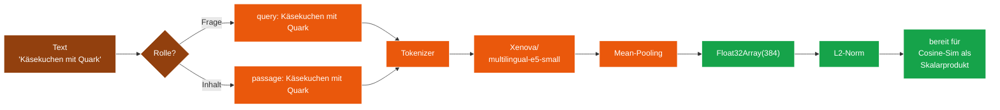

# Modul 03 — Embedding

> **Status:** 🟦 Code-Stub  ·  **Schicht:** Kern  ·  **Anker:** Sage-Page → Karte 4, Eintrag 03
> **Datei (Code):** `src/modules/03_embedding.js`
>
> _Text → 384-dimensionaler Vektor via `Xenova/multilingual-e5-small`.
> Die Übersetzung von Bedeutung in Geometrie._

---

## Im Mycel-Bild

Embedding ist die **Bedeutungs-Übersetzung**: Text wird in einen
384-dim-Vektor verwandelt, der die semantische Position im Mycel-Raum
markiert. Zwei ähnliche Sätze landen geometrisch nahe beieinander —
"Käsekuchen mit Quark" und "Käsetorte" zeigen in fast dieselbe Richtung,
"Auspuffrohr" weit weg. Das ist die Grundlage, auf der das Mycel
**inhaltlich** statt adressbasiert findet.

Das e5-Modell verlangt eine **Rollen-Markierung** für jeden Text:
„query: ..." für die Frage, „passage: ..." für den durchsuchten Inhalt.
Diese Rolle ist nicht dekorativ — sie verschiebt den Vektor messbar.
SBKIM macht das Markieren API-strukturell unvermeidlich: es gibt keine
generische `embedText()`-Funktion, sondern getrennte Funktionen pro Rolle.

---

## Visualisierung



---

## Zweck

Wandelt Texte in 384-dimensionale, L2-normalisierte Vektoren
(Float32Array). Ähnlich bedeutende Texte erzeugen ähnliche Vektoren —
die Grundlage des semantischen Matchings (Modul 04).

Modell: `Xenova/multilingual-e5-small` (mehrsprachig, kompakt,
~30 MB Download, läuft im Browser via transformers.js / WebAssembly).
Mehrsprachig deckt deutsch + englisch in einem Vektorraum ab — wichtig
für die Endknoten-Domänen (Kochrezepte / Cocktails).

---

## Verantwortlichkeiten

**Macht:**
- Lazy-Init des Modells beim ersten `embedQuery`/`embedPassage`-Aufruf
  (oder explizit via `init()`)
- Tokenisierung + Mean-Pooling (e5-Konvention)
- Rollen-Prefix `"query: "` bzw. `"passage: "` intern voranstellen
- L2-Norm anwenden, damit Modul 04 Cosinus als simples Skalarprodukt
  rechnen kann
- Truncate auf 512 Token (e5-small-Limit), still abschneiden +
  einmaliger `console.warn` pro Sitzung
- Selbstcheck-Meldung in der DevTools-Konsole nach erfolgreichem `init()`

**Macht nicht:**
- Kein eigenes Storage (`transformers.js` verwaltet seinen Modell-Cache
  im Browser-Cache selbst)
- Keine Sprachenerkennung (Modell ist mehrsprachig — Eingabe in jeder
  Sprache erlaubt)
- Keine Klassifikation (nur Encoding)
- Keine Ähnlichkeitsberechnung (das ist Modul 04)
- Keine Modus-Verwechslung möglich: es gibt keinen `mode`-Parameter
  (API-Design statt Laufzeit-Check, siehe „Im Mycel-Bild" oben)

---

## Schnittstelle

Modul 03 exportiert **sieben** öffentliche Funktionen (sechs Embed-
Funktionen + `isReady`). Jede Embed-Funktion liefert ein `Promise` auf eine
bereits L2-normalisierte `Float32Array(384)` (bzw. `embedContentVector` ein
`{ vector, count, source }`-Objekt).

```
init() → Promise<void>
  // Lädt das Modell ggf. herunter (erster Lauf, ~30 MB), setzt
  // den Modell-Status auf "ready" und emittiert den Selbstcheck.
  // Idempotent: mehrfacher Aufruf gibt sofort zurück.

isReady() → boolean
  // true, sobald init() erfolgreich war. False vorher.
  // Synchron, kein Promise.

embedQuery(text: string) → Promise<Float32Array>     // Länge 384, L2-normalisiert
  // Wandelt einen Anfrage-Text in den Suche-Vektor.
  // Intern: "query: " + text.
  // Aufruf vor init() löst Lazy-Init aus.

embedPassage(text: string) → Promise<Float32Array>   // Länge 384, L2-normalisiert
  // Wandelt einen Inhalts-Text (Rezeptbeschreibung, Domänen-Stichwort,
  // Spore-Selbstbeschreibung) in den Inhalts-Vektor.
  // Intern: "passage: " + text.

embedQueryBatch(texts: string[]) → Promise<Float32Array[]>
  // Mehrere Anfragen in einem Modell-Pass. Reihenfolge bleibt erhalten.
  // Leeres Array → Promise<[]>, kein Fehler.

embedPassageBatch(texts: string[]) → Promise<Float32Array[]>
  // Mehrere Inhalte in einem Modell-Pass. Reihenfolge bleibt erhalten.

embedContentVector(samples, opts?) → Promise<{ vector: Float32Array(384), count: number, source: "content" }>
  // Inhalts-treuer Domänen-Vektor (2026-06-28). Baut EINEN repräsentativen,
  // L2-normalisierten Passage-Vektor aus vielen echten Inhalts-Schnipseln:
  // jeden Schnipsel einbetten (gedeckelt), den Schwerpunkt (Mittelwert)
  // bilden, wieder normalisieren. samples = Array aus Strings ODER
  // { label, text }-Objekten (Label+Text werden verkettet). opts.max
  // (Default 32 = CONTENT_SAMPLE_MAX) deckelt die Anzahl. Leere Einträge
  // werden fail-soft übersprungen; sind ALLE leer → EmptyInputError;
  // Nicht-Array → EmbeddingError. Das ist der „beschreibe den Knoten durch
  // seinen INHALT statt durch seine Hülle"-Pfad (Modul 18 Sub f/g, Modul 02
  // regenerateOwnSpore). Modul-Grenze: Verketten/Mitteln von EINGABE-Texten
  // zu einem Bedeutungs-Punkt ist KEINE Ähnlichkeits-Rechnung — die bleibt
  // Modul 04.
```

### Modul-Grenze: warum embedContentVector hier liegt (2026-06-28)

Modul 03 „macht nicht: Keine Ähnlichkeitsberechnung". Das bleibt wahr:
`embedContentVector` rechnet **keinen Cosinus und keinen Match** — es
kombiniert mehrere Eingabe-Texte zu **einem** L2-normalisierten Bedeutungs-
Punkt (Schwerpunkt auf der Einheits-Kugel), exakt das, was `embedPassage`
für einen einzelnen Text tut, nur über einen kleinen Korpus. Das Kombinieren
liegt **vor** der Bewertung; das Bewerten (Schwelle, Schicht-Scores) bleibt
ausschließlich Modul 04. Diese Grenze ist verbindlich.

### Warum vier Funktionen statt eines `mode`-Parameters

Die e5-Familie verlangt den Rollen-Prefix. Ein gemeinsames `embedText
(text, mode)` würde drei Probleme erzeugen:

1. Modul 04 (Match) müsste prüfen, ob Query- und Passage-Vektor
   tatsächlich mit unterschiedlichen Modi erzeugt wurden — Laufzeit-
   Annahme, schwer zu testen.
2. Bauender könnte den `mode`-Parameter vergessen oder vertauschen.
   Vektoren wären leicht abdriftend (cosinus ~0.95 statt 1.0 für
   identische Sätze), Match-Schwellen würden schleichend ungenau.
3. Code-Review-Last: jedes Embedding-Aufrufstelle müsste den Modus
   explizit zeigen.

Lösung: API-Design erzwingt die richtige Rolle. Modul 04 signiert
`match(queryVec, passageVec)` — die Parameter-Namen geben die
Reihenfolge vor, kein Mode-Flag mehr durchzureichen.

### Selbstcheck

Nach erfolgreichem `init()` (Modell tatsächlich geladen, Tokenizer
bereit) emittiert Modul 03 **einmalig**:

```
console.info("MODUL 03 EMBEDDING bereit, Funktionen: init/isReady/embedQuery/embedPassage/embedQueryBatch/embedPassageBatch, Modell: Xenova/multilingual-e5-small, Dim: 384");
```

Wichtig: Embedding meldet sich **nicht** beim Skript-Laden (anders als
Modul 01), weil der asynchrone Modell-Download das „bereit" verfälschen
würde. Erst wenn das Modell aufrufbar ist, ist die Konsolen-Meldung
ehrlich.

### Konfigurationswerte

```
EMBEDDING_MODEL      = "Xenova/multilingual-e5-small"   // INTERFACES.md §0
EMBEDDING_DIM        = 384
EMBEDDING_MAX_TOKENS = 512                              // e5-small Hard-Limit
EMBEDDING_QUERY_PREFIX   = "query: "
EMBEDDING_PASSAGE_PREFIX = "passage: "
```

---

## Fehlerverhalten

| Lage | Reaktion |
|---|---|
| Modell-Download scheitert (Offline beim ersten Lauf, Netz-Fehler) | rejects mit `ModelLoadError`, deutschsprachige Message; Aufrufer entscheidet (Retry / Nutzer-Hinweis „bitte einmal online sein"). |
| Modell läuft, aber Tokenizer wirft (sehr seltene Glyph-Probleme) | rejects mit `EmbeddingError`, Original-Error in `.cause`. |
| Leerer Text oder reine Whitespaces | rejects mit `EmptyInputError`. Das ist absichtlich streng — Modul 04 darf nie einen Null-Vektor sehen. |
| Text > 512 Tokens nach Prefix | **kein Fehler.** Text wird still abgeschnitten. Beim ersten Truncate pro Sitzung loggt das Modul `console.warn("MODUL 03 EMBEDDING: Eingabe > 512 Tokens, abgeschnitten")`, danach Schweige-Modus (kein Log-Spam in Batch-Pipelines). |
| Batch-Funktion mit leerem Array | `Promise<[]>`, kein Fehler. |

---

## Manueller Test

In `tests/manual_check.html`, Panel **03 Embedding**, fünf Knöpfe
(seit Bau-Sitzung 2026-05-14 mit echten Aufrufen verdrahtet):

1. **Embedding init** — `await init()`. Erwartung: erster Lauf braucht
   Netz und ~5–15 s, zweite Sitzung lädt aus dem Browser-Cache (<1 s).
2. **Embedding round-trip** — `await embedQuery("Käsekuchen mit Quark")`,
   prüfe Länge 384 und L2-Norm ≈ 1.0 (Toleranz ±0.001).
3. **Vergleich Query vs. Passage** — beide Funktionen auf identischen
   Text anwenden, Skalarprodukt anzeigen. Erwartung: zwischen 0.85 und
   0.95 (gleicher Inhalt, unterschiedliche Rolle → ähnlich, aber nicht
   identisch). Bewertung: zeigt, dass die Prefix-Trennung im Vektorraum
   sichtbar ist.
4. **Batch (2 Inhalte)** — `await embedPassageBatch(["Käsekuchen mit Quark", "Auspuffrohr aus Edelstahl"])`,
   prüft Reihenfolgeerhalt (zwei Vektoren der Länge 384) und zeigt den
   inter-Cosinus der beiden Themen. Erwartung: deutlich unter 0.5 —
   weit unterschiedliche Domänen ergeben kleinen Skalarprodukt-Wert.
5. **Selbstcheck Konsole prüfen** — Hinweisknopf ohne Aktion: weist den
   Tester an, DevTools → Konsole zu öffnen und die Zeile
   `MODUL 03 EMBEDDING bereit, Funktionen: ..., Modell: ..., Dim: 384`
   zu suchen (erscheint **nach** dem ersten init).

Sinn-Vergleiche („Käsekuchen" vs. „Käsetorte" vs. „Auspuffrohr") gehören
in den manuellen Test von Modul 04 — nicht hierher, weil sie eine
Cosinus-Funktion brauchen. Der Batch-Test (Punkt 4) macht den
inter-Cosinus zwischen zwei stark unterschiedlichen Texten zwar als
Plausibilitäts-Anker hier sichtbar, ist aber kein Match-Test.

---

## Risiken & offene Punkte

- **Erster Lauf braucht Internet** zum Modell-Download (~30 MB). Offline-
  Andocken eines neuen Endknotens ist beim allerersten Aufruf nicht
  möglich. Nach dem ersten Lauf cached der Browser; spätere Sitzungen
  laufen offline.
- **Speicherbedarf:** ~30 MB im Browser-Cache + ~80 MB RAM für die
  Inference. Auf alten Mobil-Browsern (iOS Safari < 14) eventuell zu
  schwer; Endknoten-PWA muss eine Fallback-Erklärung anzeigen, wenn
  `ModelLoadError`.
- **e5-Prefix-Drift:** durch API-Design strukturell ausgeschlossen
  (vier Funktionen, kein `mode`-Parameter). Diese Spec-Entscheidung
  ist verbindlich; ein späteres Zusammenfassen zu `embedText(text, mode)`
  müsste die Plan-Sitzung 2026-05-14 explizit widerrufen.
- **Truncate-Strategie:** still abschneiden mit einmaliger `console.warn`-
  Warnung pro Sitzung. Diskutiert wurde „abbrechen mit Fehler", aber
  Suche darf nicht an einer langen Antwort scheitern. Wer harte
  Längenkontrolle braucht, kürzt vor dem Aufruf selbst.
- **L2-Norm:** das Modul liefert **immer** normalisiert. Modul 04 darf
  sich darauf verlassen und Cosinus als Skalarprodukt rechnen.

---

## Bauzustand

| Schritt | Datum | Sitzung | Anmerkung |
|---|---|---|---|
| Karte angelegt | 2026-05-10 | Skelett | leere Schablone |
| Site-Echo | 2026-05-10 | Site-Echo | Hero, Bio-Metapher, Mermaid-Flow, Querverweise |
| Spec gefüllt | 2026-05-14 | Spec 01+03 | 4-Funktionen-API, L2-Norm-Garantie, Selbstcheck-Format, Truncate-Regel |
| Code geschrieben | 2026-05-14 | Bau 03 | `src/modules/03_embedding.js`, IIFE mit `window.SbkimEmbedding`, dynamischer Import von transformers.js@2.17.2 vom CDN, fünf Knöpfe in `manual_check.html`, JS-Syntax via `node --check` grün |
| Sichttest | 2026-05-14 | Bau 03 | geprüft 2026-05-14 (Klaus, im Browser): Modell lädt, L2-Norm exakt 1.0, Query/Passage gleicher Inhalt ≈0.95, Batch zwischen verschiedenen Themen 0.90 (überraschend hoch — Anlass für Match-Kalibrierung). |
| In Endknoten eingebaut | — | — | — |

---

**Querverweise**

- **Abhängigkeiten:** keine (lädt eigenes Modell beim init von HuggingFace)
- **Wird genutzt von:** Modul 04 (Match) · Modul 05 (Anastomose, indirekt über 04)
- **Site-Karte:** [Karte 4 · Module-Bento](../../index.html#screen-overview), Eintrag 03
- **Glossar:** [Embedding](../GLOSSAR.md), [Vektor](../GLOSSAR.md), [multilingual-e5-small](../GLOSSAR.md)
- **Integration:** `sbkim_integration.md` §4.1 (Default-Modell)
- **Extern:** [transformers.js Dokumentation](https://huggingface.co/docs/transformers.js)
- **Interfaces:** [`INTERFACES.md` §1 → Modul 03_embedding](../INTERFACES.md)
