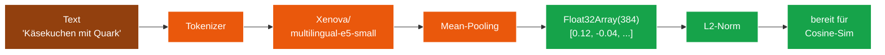

# Modul 03 — Embedding

> **Status:** 🟫 Schablone  ·  **Schicht:** Kern  ·  **Anker:** Sage-Page → Karte 4, Eintrag 03
> **Datei (Code):** `src/modules/03_embedding.js`
>
> _Text → 384-dimensionaler Vektor via `Xenova/multilingual-e5-small`.
> Die Übersetzung von Bedeutung in Geometrie._

---

## Im Mycel-Bild

Embedding ist die **Bedeutungs-Übersetzung**: Text wird in einen
384-dim-Vektor verwandelt, der die semantische Position im Mycel-Raum
markiert. Zwei ähnliche Sätze landen geometrisch nahe beieinander —
"Käsekuchen mit Quark" und "Käsetorte" zeigen in fast dieselbe Richtung,
"Auspuffrohr" weit weg. Das ist die Grundlage, auf der das Mycel
**inhaltlich** statt adressbasiert findet.

---

## Visualisierung



---

## Zweck

Wandelt Texte in 384-dimensionale Vektoren (Float32Array). Ähnlich
bedeutende Texte erzeugen ähnliche Vektoren — die Grundlage des
semantischen Matchings.

Modell: `Xenova/multilingual-e5-small` (mehrsprachig, kompakt,
~30 MB Download, läuft im Browser via transformers.js / WebAssembly).

---

## Verantwortlichkeiten

**Macht:**
- Lazy-Init des Modells beim ersten `embedText()`-Aufruf
- Tokenisierung + Mean-Pooling (nach Konvention von e5-small)
- Float32Array(384) zurückgeben
- Modell-Cache nutzen, damit zweite Sitzung nicht neu lädt

**Macht nicht:**
- Kein eigenes Storage (das Modell-Cache verwaltet transformers.js selbst)
- Keine Sprachenerkennung (das Modell ist mehrsprachig)
- Keine Klassifikation (nur Encoding)

---

## Schnittstelle

*(noch zu spezifizieren)* — Skizze:

```
init() → Promise<void>
  // lädt das Modell ggf. herunter, setzt isReady=true

isReady() → boolean

embedText(text: string) → Promise<Float32Array>  // Länge 384
embedBatch(texts: string[]) → Promise<Float32Array[]>
```

### Konfigurationswerte

```
EMBEDDING_MODEL = "Xenova/multilingual-e5-small"
EMBEDDING_DIM   = 384
```

---

## Manueller Test

1. `tests/manual_check.html`: Knopf "Embedding init".
   Erwartung: nach erstem Lauf "Modell geladen" + Cache-Hinweis.
2. Knopf "Embedding round-trip": Text "Käsekuchen mit Quark" → Array
   der Länge 384, alle Werte Float32.
3. Knopf "Cosine zwischen 'Käsekuchen' und 'Käsetorte'": > 0.7.
4. Knopf "Cosine zwischen 'Käsekuchen' und 'Auspuffrohr'": < 0.4.

(Schritt 3+4 nutzt Modul 04 — gehört in dessen manuellen Test, sobald
04 existiert.)

---

## Risiken & offene Punkte

- Erster Lauf benötigt Internet zum Modelldownload. Offline danach OK.
- Speicherbedarf des Modells: ~30 MB im Browser-Cache.
- Sehr lange Texte: bei e5-small Input-Limit ca. 512 Tokens. Längere
  Texte abschneiden (Spec entscheidet, ob warnen oder still abschneiden).
- Vektor-Norm: e5-Modelle benötigen Prefix `"query: "` bzw. `"passage: "`
  für besten Match. → Spec klärt, ob wir das anwenden.

---

## Bauzustand

| Schritt | Datum | Sitzung | Anmerkung |
|---|---|---|---|
| Karte angelegt | 2026-05-10 | Skelett | leere Schablone |
| Site-Echo | 2026-05-10 | Site-Echo | Hero, Bio-Metapher, Mermaid-Flow, Querverweise |
| Spec gefüllt | — | — | — |
| Code geschrieben | — | — | — |
| Sichttest | — | — | — |
| In Endknoten eingebaut | — | — | — |

---

**Querverweise**

- **Abhängigkeiten:** keine (lädt eigenes Modell beim init von HuggingFace)
- **Wird genutzt von:** Modul 04 (Match) · Modul 05 (Anastomose, indirekt über 04)
- **Site-Karte:** [Karte 4 · Module-Bento](../../index.html#screen-overview), Eintrag 03
- **Glossar:** [Embedding](../GLOSSAR.md), [Vektor](../GLOSSAR.md), [multilingual-e5-small](../GLOSSAR.md)
- **Integration:** `sbkim_integration.md` §4.1 (Default-Modell)
- **Extern:** [transformers.js Dokumentation](https://huggingface.co/docs/transformers.js)
