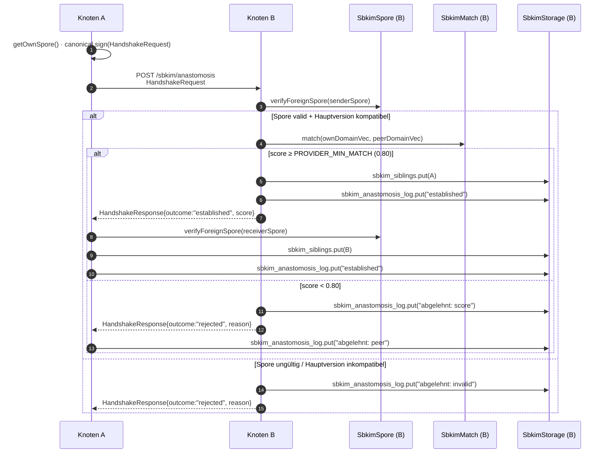

# Modul 05 — Anastomose

> **Status:** 🟦 Code-Stub  ·  **Schicht:** Netzwerk  ·  **Anker:** Sage-Page → Karte 4, Eintrag 05
> **Datei (Code):** `src/modules/05_anastomose.js`
>
> _Handshake zwischen zwei Knoten — Hyphenfusion. Die erste Sitzung,
> die alle vier Vorbedingungen (01 Storage, 02 Spore, 03 Embedding,
> 04 Match) zu einem Protokoll-Schritt zusammensetzt._

---

## Im Mycel-Bild

Anastomose ist die **Hyphenfusion** des Mycels: zwei Pilzfäden, die
einander berühren und passen, verschmelzen zu einem gemeinsamen Strom.
Im SBKIM-Protokoll ist das der Moment, in dem aus zwei einzeln tickenden
PWAs ein verbundenes Paar wird: A schickt seine signierte Spore an B,
B prüft Identität (Modul 02), misst semantische Nähe der beiden Domänen
(Modul 04 gegen `PROVIDER_MIN_MATCH = 0.80`), und entscheidet — passt
oder schweigt. **Schweigen ist Routing.** Wer nicht passt, kriegt
nichts, nicht einmal eine Höflichkeits-Floskel.

Die Fusion ist **bidirektional**: erst wenn *beide* Seiten den Match
überschritten haben, landen beide gegenseitig in `sbkim_siblings`.
Eine einseitige Anziehung ist im Pilz-Modell keine Fusion — ein Pilz
fasst nicht alleine zwei Hyphen zusammen.

---

## Visualisierung



---

## Zweck

Realisiert den **Knoten-zu-Knoten-Handshake** als einzelnen Protokoll-
Schritt — die erste Stelle im SBKIM-Code, an der die vier Kern-Module
in einer Reihe zusammenspielen:

- **Modul 02 Spore** liefert die signierte Visitenkarte und prüft die
  fremde Spore (Signatur, `nodeId`-Konsistenz, Hauptversion).
- **Modul 04 Match** liefert die Cosinus-Zahl zwischen den beiden
  Domänen-Vektoren und den Schwelle-Helfer
  `isAboveProviderThreshold`.
- **Modul 01 Storage** persistiert beidseitig in `sbkim_siblings` und
  schreibt jede Begegnung in `sbkim_anastomosis_log`, auch die
  abgelehnten.
- **Modul 03 Embedding** taucht in 05 nicht direkt auf — der
  `domainVector` ist beim Andocken (Modul 02 / Modul 09) **schon**
  berechnet und in der Spore mitgeliefert. Modul 05 nimmt fertige
  Vektoren entgegen, embedded nicht.

Anastomose ist **explizit ausgelöst** — der Aufrufer (Modul 09 Einbau-
PWA oder Modul 08 UI-Demo) entscheidet, wann ein Handshake passiert.
Es gibt **keinen** automatischen Handshake beim Spore-Empfang, **keine**
Pulsation, **keine** Eigenanfragen ins offene Netz.

---

## Verantwortlichkeiten

**Macht:**
- Ausgehenden Handshake initiieren (`handshake(targetSpore, ownDomainVector)`)
- Eingehenden Handshake annehmen oder ablehnen (`receiveHandshake(incomingRequest)`)
- HandshakeRequest **kanonisch** serialisieren und mit dem eigenen
  Ed25519-Schlüssel signieren (über Modul 02)
- HandshakeRequest/Response gegen den `publicKey` aus der mitgelieferten
  Spore verifizieren
- Match-Schwelle prüfen — über `SbkimMatch.isAboveProviderThreshold`,
  niemals den Wert hartcodieren
- Geschwister bidirektional in `sbkim_siblings` aufnehmen, **nur** wenn
  beide Seiten den Match überschritten haben
- Jede Begegnung anonymisiert in `sbkim_anastomosis_log` mitschreiben:
  established, abgelehnt-score, abgelehnt-invalid, abgelehnt-version,
  timeout, re-handshake
- Geschwister auf Wunsch des Aufrufers vergessen
  (`forgetSibling(nodeId)` — entfernt nur den `sbkim_siblings`-Eintrag,
  Log bleibt)

**Macht nicht:**
- **Kein eigenes Match.** Modul 05 ruft `SbkimMatch.match(...)` und
  `SbkimMatch.isAboveProviderThreshold(...)` auf; rechnet nicht selbst.
- **Keine eigene Spore-Verifikation.** Signatur, `nodeId`-Konsistenz,
  Hauptversion prüft `SbkimSpore.verifyForeignSpore`. Modul 05 schaut
  nur auf das `{valid, reason}`-Ergebnis.
- **Kein direkter IndexedDB-Zugriff.** Persistenz strikt über
  `SbkimStorage.get/put/del/all`. Wer in Modul 05 `indexedDB.open`
  schreibt, hat den Vertrag aus Modul 01 zerrissen.
- **Kein Embedding.** Der `domainVector` ist beim Andocken (Modul 02
  Spore / Modul 09 Einbau-PWA) schon berechnet und Teil der Spore.
- **Kein Crawler, kein Discovery.** `handshake` wird nur mit einer
  Spore aufgerufen, die der Aufrufer **explizit** geliefert hat
  (typisch: Betreiber hat sie aus einer URL geladen).
- **Keine Pulsation, keine periodischen Eigenanfragen.**
- **Kein automatisches Vergessen.** TTL und Apoptose sind Aufgabe von
  Modul 07 — Modul 05 vergisst Geschwister *nicht* von selbst.
- **Keine Anfrage-Inhalte.** Modul 05 trägt nur den Handshake; der
  Austausch konkreter Antworten (Pointer-Listen) ist Modul 06
  (Heterokaryose).

---

## Schnittstelle

Modul 05 exportiert **fünf** öffentliche Funktionen. Alle DB-Operationen
laufen über `window.SbkimStorage`, alle Krypto-Operationen über
`window.SbkimSpore`, alle Cosinus-Vergleiche über `window.SbkimMatch` —
Modul 05 ist die *Komposition*, nicht die *Mechanik*.

```
init() → Promise<void>
  // Prüft Verfügbarkeit von SbkimStorage, SbkimSpore, SbkimMatch und
  // ruft sie der Reihe nach mit init() auf. Stellt sicher, dass eine
  // eigene Identität existiert (über SbkimSpore.getOrCreateIdentity).
  // Wirft AnastomoseDependenciesError, wenn ein Modul fehlt.
  // Idempotent.

handshake(targetSpore, ownDomainVector, options?) → Promise<HandshakeResult>
  // Initiiert einen ausgehenden Handshake an targetSpore.endpoint +
  // ENDPOINT.anastomosis.
  //
  // options.transport (Spec-Sitzung BroadcastChannel-Bridge 2026-05-17,
  // additiv; ohne options unverändert zum Bestehenden):
  //   "auto"    (Default) — HTTP zuerst, bei klaren Signalen einmaliger
  //             Fallback auf BroadcastChannel(SBKIM). Cross-domain bleibt
  //             unverändert HTTP-only.
  //   "http"    nur HTTP-Pfad (bestehendes Verhalten, kein Fallback).
  //   "channel" nur BroadcastChannel-Pfad (für same-origin-Test-Setups,
  //             in denen HTTP-Bridge konzeptuell nicht trägt — vgl.
  //             Pflege Scope-Fix 2026-05-17).
  //
  // 1. verifyForeignSpore(targetSpore) → bei {valid:false} sofortiger
  //    Abbruch mit InvalidPeerSporeError.
  // 2. Hauptversions-Check (targetSpore.protocolVersion gegen lokale
  //    PROTOCOL_VERSION) → bei Mismatch sofortiger Abbruch mit
  //    ProtocolVersionMismatchError.
  // 3. Optionaler Vor-Check: wenn targetSpore.domainVector vorhanden,
  //    score = SbkimMatch.match(ownDomainVector, targetSpore.domainVector).
  //    Wenn !isAboveProviderThreshold(score) → kein Netz-Aufruf, Log-
  //    Zeile "abgelehnt: lokal", return {outcome:"rejected-local", score}.
  // 4. Bau HandshakeRequest (siehe Datenformat), kanonisch signiert
  //    mit eigenem Ed25519-Schlüssel.
  // 5. transport != "channel": POST an targetSpore.endpoint +
  //    "/sbkim/anastomosis", Timeout QUERY_TIMEOUT_MS (4000 ms).
  //    Bei Timeout wirft HandshakeTimeoutError. Bei Netz-Fehler
  //    HandshakeNetworkError. Bei transport === "auto" UND
  //    Auto-Fallback-Bedingung erfüllt (HTTP 4xx/5xx, non-JSON-Antwort,
  //    JSON ohne HandshakeResponse-Pflichtfelder, outcome ∉ {"established",
  //    "rejected"}) → HTTP-Fehler als cause merken, weiter zu (5b).
  //    Sonst: gewonnenes HandshakeResponse zu (6).
  // 5b. transport ∈ {"auto" (Fallback ausgelöst), "channel"}: Reply-Channel
  //    `BroadcastChannel("sbkim:reply:" + request.nonce)` öffnen, Envelope
  //    auf `BroadcastChannel("sbkim")` posten, Timeout QUERY_TIMEOUT_MS
  //    auf Reply lauschen, in finally Reply-Channel schließen.
  //    Bei Timeout → HandshakeTimeoutError (Log "timeout-channel"; bei
  //    Auto-Fallback HTTP-Fehler als cause). Bei `nonceEcho` ≠
  //    `request.nonce` → HandshakeSignatureInvalidError.
  // 6. Antwort parsen, receiverSpore via verifyForeignSpore prüfen,
  //    Response-Signatur gegen receiverSpore.publicKey verifizieren.
  // 7. Bei outcome=="established": put sibling, Log "established",
  //    return {outcome:"established", peerNodeId, peerDomain, score}.
  // 8. Bei outcome=="rejected": Log "abgelehnt: peer", return
  //    {outcome:"rejected", reason, score?}.
  // Wirft niemals bei rein semantischer Ablehnung — das ist outcome,
  // kein Error. Wirft nur bei Protokoll-, Netz-, Channel- oder Krypto-
  // Fehlern.

receiveHandshake(incomingRequest) → Promise<HandshakeResponse>
  // Wird vom Service-Worker (oder vom Backend, bei provider-Knoten mit
  // Server-Code) aufgerufen, sobald ein /sbkim/anastomosis POST
  // eingegangen ist. incomingRequest ist das geparste JSON-Body-Objekt.
  // 1. Form-Check (Pflichtfelder), sonst Response outcome:"rejected",
  //    reason:"Form ungültig".
  // 2. verifyForeignSpore(senderSpore) → {valid:false} ⇒
  //    Response outcome:"rejected", reason:<deutsch>.
  // 3. Hauptversions-Check → Mismatch ⇒ Response outcome:"rejected",
  //    reason:"Inkompatible Hauptversion: <x.y>".
  // 4. Request-Signatur gegen senderSpore.publicKey verifizieren ⇒
  //    bei Fehler Response outcome:"rejected",
  //    reason:"Request-Signatur ungültig".
  // 5. score = SbkimMatch.match(ownDomainVector, request.domainVector).
  //    Wenn !isAboveProviderThreshold(score) → Log "abgelehnt: score",
  //    Response outcome:"rejected", reason:"score unterhalb Schwelle",
  //    score mit-gemeldet.
  // 6. Sonst: sbkim_siblings_<hit-key>.put(peer), Log "established",
  //    Response outcome:"established", score, ownSpore mit-geliefert,
  //    Response-Signatur über kanonische Form (ohne signature) gesetzt.
  //    Multi-Identitäts-Hinweis (Brief 04): <hit-key> ist die Persona,
  //    deren nodeId der Sender via request.toNodeId angesprochen hat —
  //    Receiver-Map nodeId→key wird beim init() einmal gebaut. Ohne
  //    request.toNodeId fällt der Receiver auf die aktive Identität
  //    zurück (Pre-Brief-04-Verhalten als Default).
  // Wirft niemals — alle Fehlpfade werden als
  // HandshakeResponse{outcome:"rejected", reason} zurückgegeben.

listSiblings() → Promise<Array<{nodeId, domain, since, pubKey}>>
  // Lädt alle Einträge aus sbkim_siblings_<key>, wobei <key> die aktive
  // Identität ist (Brief 04). Reihenfolge ist die Storage-natürliche
  // (Schlüssel-Reihenfolge nach nodeId). Wer Persona-übergreifende
  // Sicht braucht, iteriert SbkimSpore.listIdentities() und addiert
  // pro Slot aufrufer-seitig — INTERFACES.md § 9.2 Persona-Isolation.

forgetSibling(nodeId) → Promise<void>
  // Entfernt den nodeId-Eintrag aus sbkim_siblings_<key> (aktive
  // Identität; Brief 04). Der Log-Eintrag bleibt (Audit-Spur).
  // Idempotent: forgetSibling auf unbekannten nodeId wirft nicht.
```

### Selbstcheck

Beim **Skript-Laden** (synchron, vor jeglichem Aufruf):

```
console.info("MODUL 05 ANASTOMOSE bereit, Funktionen: init/handshake/receiveHandshake/listSiblings/forgetSibling");
```

Wie Modul 01, 02 und 04 — die Meldung signalisiert „Modul geladen",
nicht „Identität existiert" oder „Geschwister da". Die Schwelle, der
Endpunkt-Pfad und die Versions-Konstante werden in der Selbstcheck-
Zeile bewusst **nicht** wiederholt — sie stehen verbindlich in §0 /
§3 und im jeweils zuständigen Modul (04 / dieses).

### Konfigurationswerte

```
PROTOCOL_VERSION       = "0.1"     // aus INTERFACES.md §0, Vor-Check Hauptversion
PROVIDER_MIN_MATCH     = 0.80      // aus INTERFACES.md §0, gespiegelt in Modul 04
QUERY_TIMEOUT_MS       = 4000      // aus INTERFACES.md §0, Timeout für outgoing POST
ENDPOINT.anastomosis   = "/sbkim/anastomosis"   // aus INTERFACES.md §3
```

`PROVIDER_MIN_MATCH` wird **nicht in Modul 05 neu definiert**.
Anastomose ruft `SbkimMatch.isAboveProviderThreshold(score)` — wer den
Wert ändern will, ändert ihn in §0, Modul 04 zieht nach, Modul 05
spürt es automatisch.

### Datenformate

**HandshakeRequest** (kanonisches JSON; alphabetisch sortierte Keys,
Signatur über die Form **ohne** `signature`-Feld):

```jsonc
{
  "domainVector":     [/* 384 floats, L2-normalisiert */],   // optional bei kleinem Verkehr
  "fromNodeId":       "<base64url-sha256-rawpub des Senders>",
  "nonce":            "<base64url, 16 zufällige Bytes>",
  "protocolVersion":  "0.1",
  "senderSpore":      { /* SporeJson, vom Sender signiert (Modul 02) */ },
  "signature":        "<base64url-ed25519-sig über kanonisches JSON ohne signature>",
  "timestamp":        "2026-05-14T07:00:00.000Z",            // ISO-8601 UTC
  "toNodeId":         "<base64url-sha256-rawpub des Empfängers, falls bekannt>"  // optional
}
```

**HandshakeResponse** (kanonisches JSON; alphabetisch sortiert):

```jsonc
{
  "fromNodeId":       "<Empfänger-nodeId>",
  "nonceEcho":        "<gleiches nonce wie im Request>",
  "outcome":          "established",   // oder "rejected"
  "protocolVersion":  "0.1",
  "reason":           "<deutscher Fehlertext, nur bei rejected>",
  "receiverSpore":    { /* SporeJson, vom Empfänger signiert */ },
  "score":            0.8312,           // optional, nur wenn Match gelaufen ist
  "signature":        "<base64url-ed25519-sig über kanonisches JSON ohne signature>",
  "timestamp":        "2026-05-14T07:00:00.450Z",
  "toNodeId":         "<Sender-nodeId>"
}
```

**`sbkim_siblings_<key>["<peerNodeId>"]`** (Storage-Wert pro Geschwister
in der Persona `<key>`; `<key>` = aktive Identität, Default `"main"`):

```jsonc
{
  "nodeId":   "<base64url-sha256-rawpub>",
  "domain":   "rezeptbuch.example.org",
  "endpoint": "https://klaus.github.io/rezeptbuch/",
  "pubKey":   { "kty": "OKP", "crv": "Ed25519", "x": "<base64url>" },
  "since":    "2026-05-14T07:00:00.000Z"
}
```

**`sbkim_anastomosis_log_<key>["<timestamp>"]`** (Storage-Wert pro
Begegnung in der Persona `<key>`):

```jsonc
{
  "ts":        "2026-05-14T07:00:00.450Z",
  "peerId":    "<base64url-sha256-rawpub>",
  "outcome":   "established"           // oder "rejected" oder "re-handshake" oder "timeout"
  // KEIN domainVector, kein Score-Profil, kein Inhalt — anonymisiert.
}
```

**Multi-Identität (Brief 04 der V1-Sammelspec-Kaskade, 2026-05-19):**
Die Store-Namen folgen ab Brief 04 dem Pattern
`sbkim_siblings_<key>` / `sbkim_anastomosis_log_<key>` — `<key>` ist
die aktive Identität aus `SbkimSpore.getActiveIdentityKey()` (Default
`"main"`). Pre-Brief-04-Aufrufer, die mit fester Singleton-Identität
gearbeitet haben, treffen unverändert auf `sbkim_siblings_main` /
`sbkim_anastomosis_log_main`. Receiver-Pfad: `request.toNodeId` wird
gegen alle eigenen Identitäten geprüft (Map nodeId→key beim
`init()`), und der `sbkim_siblings_<hit-key>`-Slot der getroffenen
Persona wird gefüllt. Persona-Isolation: ein Peer, der mit Persona A
einen established-Handshake hatte, ist NICHT automatisch Geschwister
von Persona B. Vollständige Identitäts-Map-Spec siehe INTERFACES.md §
9.

Versionierungs-Regel: HandshakeRequest und HandshakeResponse folgen
[INTERFACES.md §4](../INTERFACES.md). Pflichtfelder dürfen ab Status
`entwurf` nur additiv erweitert werden; das Hinzufügen eines Pflicht-
felds erfordert den Schritt von `protocolVersion: "0.x"` auf `"1.0"`.

---

## A1–B3-Synthese: Anastomose ist Hop B3 / A3

Karte 04 hält fest, dass *die Hops die Funktionen tragen*. Modul 04
sitzt an Hop B2 / A2 als reine *Match-Zahl* — eine numerische Frage,
kein Routing, kein Verwerfen.

**Modul 05 ist die Entscheidungs- und Verbindungs-Stelle an Hop B3 /
A3.** `isAboveProviderThreshold` (in Modul 04 als Helfer angeboten)
wird hier zum *Verwerfen-oder-Verbinden*-Schalter:

- **Pfad A · A3 · Devil's Advocate ✓:** der Anbieter prüft die fremde
  Spore + den Anfrage-Vektor, akzeptiert die Verbindung, schreibt den
  Geschwister-Eintrag und sendet die Bestätigung zurück. Das Mycel
  bildet eine neue Hyphenfusion.
- **Pfad B · B3 · Critic:** wenn `match()` aus B2 unter `PROVIDER_MIN_MATCH`
  bleibt, lehnt B3 ab — Modul 05 schreibt eine *abgelehnt*-Zeile in
  `sbkim_anastomosis_log`, antwortet mit `outcome:"rejected"`, und der
  Strang stirbt ohne Geschwister-Eintrag. Apoptose B4 ist dann Sache
  von Modul 07, sobald der Anfrage-Pfad endgültig endet.

Konsequenz für die Implementierung in diesem Repo: Modul 05 trifft
keine Match-Zahl-Berechnungen selbst, hat aber **die Entscheidungs-
Hoheit** über die Verbindung. Wer die Schwelle ändert, ändert Modul
04 (das gespiegelt §0 liest); Modul 05 zieht nach, ohne dass eine
Zeile in `05_anastomose.js` angefasst werden muss.

---

## Anastomose-Pfad (Schritt-für-Schritt, JSON-Ebene)

Schritte 1–6 sind Knoten A (Initiator), 7–11 sind Knoten B (Empfänger),
12–14 sind wieder A (Verarbeitung der Response).

```
 1. A.init()                                                                                            // SbkimStorage + Spore + Match
 2. A.getOrCreateIdentity()      → {nodeId, publicKeyJwk}
 3. A.getOwnSpore()              → SporeJson(A)
 4. lokaler Vor-Check (optional):
      if targetSpore.domainVector: score = match(A.domainVec, targetSpore.domainVector)
      if score < 0.80: log "abgelehnt: lokal", return rejected-local
 5. baue HandshakeRequest:
      { protocolVersion, fromNodeId, toNodeId?, senderSpore: SporeJson(A),
        domainVector?, nonce, timestamp, signature }
      Signatur kanonisch über Form ohne signature.
 6. fetch POST targetSpore.endpoint + "/sbkim/anastomosis", AbortController(QUERY_TIMEOUT_MS)

 7. B.receiveHandshake(body):
      verifyForeignSpore(senderSpore) → invalid? Response rejected.
 8. Hauptversion-Check → Mismatch? Response rejected.
 9. Request-Signatur prüfen → ungültig? Response rejected.
10. score = match(B.domainVec, request.domainVector)
      if !isAboveProviderThreshold(score): Log "abgelehnt: score", Response rejected mit score.
      else: sbkim_siblings.put({nodeId: A, domain, endpoint, pubKey, since: now()}), Log "established".
11. baue HandshakeResponse + Signatur kanonisch, Response 200 JSON.

12. A: Response parsen, verifyForeignSpore(receiverSpore) → invalid? Log "abgelehnt: invalid-peer", werfen.
13. Response-Signatur gegen receiverSpore.publicKey prüfen → ungültig? Log + werfen.
14. outcome=="established"? sbkim_siblings.put({nodeId: B, domain, endpoint, pubKey, since: now()}),
    Log "established", return HandshakeResult{outcome:"established", peerNodeId: B.id, ...}.
    sonst: Log "abgelehnt: peer", return HandshakeResult{outcome:"rejected", reason, score?}.
```

Reentry: wenn die *gleiche* `peerId` mit derselben Spore-`id`
zweimal anklopft, wird der bestehende `sbkim_siblings`-Eintrag **nicht**
überschrieben — `since` bleibt der erste Anklopf-Zeitpunkt. Der
Log bekommt eine `outcome:"re-handshake"`-Zeile. Das Verhalten ist
idempotent.

---

## Service-Worker-Hinweis für statisch gehostete PWAs

Endknoten (Rezeptbuch / Mixarium) laufen auf GitHub Pages ohne Backend.
Eingehende `/sbkim/anastomosis`-POSTs müssen daher im Browser
abgefangen werden — über einen **Service-Worker**. Die Skizze gehört
in Modul 09 als Andock-Anleitung; die Bau-Sitzung Modul 05 schreibt
den SW-Code. Diese Karte legt nur den Vertrag fest:

- **Pfad:** `GET/POST /sbkim/anastomosis` (relativ zum PWA-Scope).
  Andere Methoden → 405. POST mit anderem `Content-Type` als
  `application/json` → 415.
- **Request-Body:** JSON, Form gemäß `HandshakeRequest` oben.
  Body-Größe > 64 KiB → 413 (Schutz gegen aufgepumpte Spores).
- **Vom SW an die Page:** der SW liest den JSON-Body, ruft
  `SbkimAnastomose.receiveHandshake(body)` auf der aktiven
  PWA-Instanz auf (`postMessage` an `clients.matchAll()` mit einem
  `MessageChannel`-Port; die Page antwortet asynchron mit dem
  `HandshakeResponse`-JSON).
- **Vom SW zurück:** `Response(JSON.stringify(handshakeResponse),
  { status: 200, headers: {"Content-Type":"application/json"} })`.
- **Fallback:** wenn keine PWA-Instanz aktiv ist (Tab geschlossen),
  antwortet der SW mit `503 Service Unavailable` und einem stillen
  Log-Eintrag — *kein* Auto-Start, keine Wake-Lock. Wer nicht da ist,
  schweigt.

Die Bau-Sitzung Modul 05 entscheidet die zwei offenen Punkte:
- **Variante A (Page-Hosted):** SW leitet via `MessageChannel` an die
  Page weiter (oben skizziert). Vorteil: ein Code-Pfad in der Page.
- **Variante B (SW-Hosted):** SW lädt `05_anastomose.js` selbst und
  ruft `receiveHandshake` im Worker-Scope auf. Vorteil: Tab kann
  geschlossen sein. Nachteil: zwei Code-Kopien (Page + SW).

Modul 05 selbst (also `src/modules/05_anastomose.js`) bleibt in beiden
Varianten *gleich* — es exportiert `receiveHandshake`, und wer es
aufruft (Page oder SW) ist Sache der Bau-Sitzung.

**Entscheidung Bau-Sitzung 05 (2026-05-14): Variante A (Page-Hosted).**
`src/sbkim-sw.js` ist dünn (keine Krypto, kein State), die ganze
Anastomose-Logik bleibt in der Page. Beweggründe:

- Modul 03 (`transformers.js`) ist im SW-Scope nicht ohne erheblichen
  Mehraufwand ladbar (kein DOM, anderes Import-Modell). SW-Hosted
  bräuchte für jeden Handshake einen Embedding-Vergleich oder eine
  Out-of-Band-Spore mit fertigem `domainVector` — Komplexität, die
  hier nicht abgegolten werden muss.
- Single-File-PWA-Stil bedeutet: ein Code-Pfad, ein State, eine
  IndexedDB-Verbindung. Variante B würde zwei Kopien des Codes
  pflegen (Page + SW) und zwei Schichten Cache-Invalidierung.
- "503, wenn keine Page aktiv ist" steht so in der Spec
  (Variante A führt direkt dort hin — Variante B müsste den
  Wake-Lock explizit ablehnen).
- Modul 11 (Rate-Limit, Schutz-Backlog) kann später dünn auf den
  SW gelegt werden, ohne dass die Page-Logik mitwächst.

Page-seitige Brücke: Modul 05's `init()` registriert einen
`navigator.serviceWorker.message`-Listener, der eingehende
`SBKIM_ANASTOMOSIS_REQUEST`-Messages an `receiveHandshake` weiterleitet
und das Ergebnis über `MessagePort` zurückschickt.

**Architektur-Grenze (Pflege Scope-Fix 2026-05-17, PR #72/#73):**
Same-origin cross-PWA Handshake via SW-Bridge ist konzeptuell unmöglich.
Subresource-Fetches gehen durch den SW des **Senders**, nicht den des
Empfängers — der Receiver-SW kommt nie zu Wort, wenn beide PWAs auf
derselben Origin liegen. Distinguishing-Test bestätigt das beidseitig:
`POST /Mein-Mixarium/sbkim/anastomosis` aus dem Mein-Rezeptbuch-Tab
liefert HTTP 405/404 direkt von GitHub Pages (siehe Übergabeprotokoll
[2026-05-17 Pflege Scope-Fix](../sessions/archiv/2026-05-17_pflege-sw-isPathSuffix-scope-fix.md)).
Cross-domain (verschiedene Origins) bleibt über den HTTP/SW-Bridge-Pfad
unverändert funktionsfähig. Für same-origin braucht es einen anderen
Transport — siehe nächste Sektion.

---

## BroadcastChannel-Bridge (same-origin Fallback)

> **Status:** Spec, additiver Fallback-Transport ·  **Schicht:** Netzwerk-
> Ersatz für same-origin ·  **Spec-Sitzung:** 2026-05-17
>
> _Wenn der SW-Bridge-Pfad strukturell nicht trägt (zwei PWAs auf
> derselben Origin), nimmt Modul 05 einen anderen Übertragungsweg:
> einen Browser-internen Broadcast-Channel. Schema unverändert,
> Transport-Schicht ausgetauscht._

### Motivation

Klaus' Test-Setup hat beide Endknoten-PWAs (`Mein-Mixarium` und
`Mein-Rezeptbuch`) auf `lausiklauskn-png.github.io`. Same-origin
heißt: der Sender-SW interceptet jeden Fetch zuerst, der Receiver-SW
sieht ihn nie. Der HTTP-Pfad fällt im aktuellen Stand (PR #72/#73,
`isOwnEndpoint`) sauber durch zu HTTP 404 — und damit kann der
Handshake nie `outcome:"established"` erreichen. Der bislang einzige
Pfad zu einem etablierten Handshake war Klaus' localStorage-Bypass
(direkter `receiveHandshake`-Aufruf), der für regulären Betrieb nicht
tragbar ist.

**Lösung:** `BroadcastChannel` als alternativer Transport. Sender postet
einen Wrapper-Envelope auf `BroadcastChannel('sbkim')`, alle same-origin
Tabs sehen die Nachricht. Der gemeinte Receiver (`payload.toNodeId`
matcht eigene `nodeId`) ruft `receiveHandshake` auf und postet die
Antwort auf einem dedizierten Reply-Channel zurück. Der Sender lauscht
parallel auf dem Reply-Channel, mit Timeout.

`BroadcastChannel` ist Browser-Standard (alle Major Browser seit
2018), Same-Origin-only (Browser-eigene Sicherheitsgrenze), nicht
sichtbar im Netzwerk-Panel — und vor allem: **nicht durch den SW
abgefangen.** Der Pfad geht direkt vom Sender-Tab in den
Receiver-Tab.

### Vertrag

**Channel-Name (verbindlich):** `BroadcastChannel('sbkim')`. Ein
gemeinsamer Channel für alle SBKIM-Knoten in der Origin — der
Receiver filtert über `payload.toNodeId`. Versionierung läuft NICHT
über den Channel-Namen, sondern über `payload.protocolVersion`
(= `request.protocolVersion`) — konsistent zum HTTP-Pfad.

**Envelope-Schemas** (NICHT signiert — signiert wird nur das
**innere** HandshakeRequest/HandshakeResponse, exakt wie im
HTTP-Pfad; der Envelope ist reines Transport-Routing):

```jsonc
// Sender postet auf BroadcastChannel('sbkim'):
{
  "type":             "SBKIM_ANASTOMOSE_REQUEST",
  "payload":          { /* HandshakeRequest, kanonisch + signiert wie bisher */ },
  "replyChannelName": "sbkim:reply:<base64url-nonce>"   // = "sbkim:reply:" + payload.nonce
}

// Receiver öffnet kurz BroadcastChannel(replyChannelName), postet:
{
  "type":     "SBKIM_ANASTOMOSE_RESPONSE",
  "payload":  { /* HandshakeResponse, kanonisch + signiert wie bisher */ }
}
```

Das HandshakeRequest/Response-Schema bleibt **unverändert** (siehe
§ Datenformate oben). Der Envelope ist eine Transport-Schicht ohne
Vertragsänderung am inneren Format.

**Receiver-Pflicht:** `init()` öffnet `BroadcastChannel('sbkim')`
**eager** und registriert einen message-Listener. Eingehende
Nachrichten werden gefiltert:

1. `event.data.type === "SBKIM_ANASTOMOSE_REQUEST"`?
2. `event.data.payload.toNodeId === own.nodeId`? (Pflichtfeld im
   Channel-Pfad — siehe „Pflichtfeld-Schärfung" unten)
3. `event.data.payload.fromNodeId !== own.nodeId`? (Self-Hit-Schutz —
   Sender im selben Tab darf sich nicht selbst antworten)

Wenn alle drei erfüllt: `receiveHandshake(payload)` aufrufen, einen
**dediziert** geöffneten `BroadcastChannel(event.data.replyChannelName)`
nutzen, Response-Envelope posten, Reply-Channel sofort schließen.
Andernfalls: Nachricht ignorieren (kein Reply, kein Log-Spam).

**Sender-Pfad:**

1. `replyChannelName = "sbkim:reply:" + request.nonce` ableiten.
2. `replyChan = new BroadcastChannel(replyChannelName)` **vor** dem
   Posten öffnen (sonst Race: Receiver-Reply ankommen, ohne dass
   jemand lauscht).
3. `mainChan = new BroadcastChannel('sbkim')`, Envelope posten,
   `mainChan.close()` (Sender braucht den Main-Channel nur kurz).
4. Auf `replyChan.message` mit Timeout `QUERY_TIMEOUT_MS` (4000 ms,
   wie HTTP-Pfad) hören.
5. Bei Reply: `response.nonceEcho === request.nonce` als
   Doppelt-Bindung gegen Cross-Talk prüfen (replayChannelName allein
   reicht — aber die Echo-Bindung war schon im HTTP-Pfad spezifiziert,
   wir nutzen sie hier mit). Bei Mismatch → `HandshakeSignatureInvalidError`.
6. `finally`: `replyChan.close()`.

**Pflichtfeld-Schärfung:** `toNodeId` ist im Channel-Pfad **Pflicht**
(im HTTP-Pfad bleibt sie optional — siehe INTERFACES.md § 2
HandshakeRequest). Ohne `toNodeId` wäre kein Receiver-Filter möglich,
und JEDER same-origin Knoten würde auf den Request reagieren. Sender,
der ohne `toNodeId` Channel-Transport nutzt, wirft synchron
`MissingToNodeIdError` vor dem Posten.

**Self-Hit-Schutz:** Receiver-Filter `fromNodeId !== own.nodeId`
verhindert, dass Sender im selben Tab sich selbst antwortet. (Im
HTTP-Pfad ist das nicht relevant, weil dort der Tab nicht beide Rollen
gleichzeitig spielt.) **Replay-Schutz** bleibt nonce-basiert und ist
in dieser Spec **nicht aktiv** (siehe § Risiken — Schutz-Backlog Modul
11). Sender, der denselben signierten Envelope zweimal postet, löst
zweimal denselben Pfad aus — das `re-handshake`-Verhalten greift wie
gehabt.

**Cleanup:**

- **Main-Channel beim Receiver** (`BroadcastChannel('sbkim')`) lebt
  über die Tab-Lebensdauer. Browser räumt bei Tab-Close auf — kein
  expliziter `close()` nötig.
- **Reply-Channels** werden pro Handshake erzeugt und in `finally`
  geschlossen — sowohl auf Sender- als auch Receiver-Seite. Ein
  vergessener Reply-Channel bleibt sonst als Listener stehen und
  schluckt evtl. spätere Nachrichten.
- **`forgetSibling`** und **Apoptose-Cleanup (Modul 07)** sind von
  diesem Pfad NICHT betroffen — der Channel ist transient, kein Storage.

**Wer-nicht-da-ist-schweigt:** Wenn kein Tab same-origin den
Main-Channel abonniert hat (Receiver-PWA-Tab geschlossen), kommt keine
Reply → Sender-Timeout nach 4 s → `HandshakeTimeoutError` (Log-Zeile
„timeout-channel"). Kein Wake-Lock, kein Auto-Start, kein Browser-
Notification-Pfad — konsistent zur SW-Pfad-Linie „503, wenn keine Page
aktiv" und zum Empfangsmodus-Prinzip aus dem SBKIM-Paper.

### Auto-Fallback-Logik (transport: "auto")

Default für `handshake(...)` ist `options.transport = "auto"`. Pfad:

1. HTTP-POST gegen `targetSpore.endpoint + "/sbkim/anastomosis"`
   versuchen (bestehender Pfad).
2. Auto-Fallback **wird** ausgelöst, wenn:
   - HTTP-Status 4xx oder 5xx (z.B. 404 vom statischen Pages-Hoster,
     405 von nginx)
   - HTTP-Antwort hat `Content-Type` ≠ `application/json`
   - HTTP-Antwort ist JSON, aber ohne HandshakeResponse-Pflichtfelder
     (`outcome` / `fromNodeId` / `protocolVersion` / `receiverSpore` /
     `signature` / `timestamp` / `toNodeId` / `nonceEcho`)
   - HTTP-Antwort hat `outcome` außerhalb { "established", "rejected" }
3. Auto-Fallback **wird NICHT** ausgelöst, wenn:
   - HTTP liefert ein valides HandshakeResponse (auch mit
     `outcome:"rejected"` — semantische Ablehnung ist ein gültiges
     Ergebnis, kein Transport-Fehler)
   - HTTP-Status 2xx mit valider Form
   - DNS/CORS/Netz-weg-Fehler (keine Antwort ist nicht dasselbe wie
     „falsche Antwort"; Channel-Fallback hilft nur, wenn der Receiver
     same-origin lauscht — bei DNS-Fehler ist das nicht zu erwarten)
4. Bei Auto-Fallback wird der HTTP-Fehler als `cause` durch den
   Channel-Pfad mitgeführt. Wenn auch der Channel-Pfad scheitert
   (Timeout, Signatur-Mismatch, etc.), wirft der finale Error eine
   Reasons-Kette: `<channel-error>` mit `cause: <http-error>`.

Cross-domain (verschiedene Origins) bleibt unverändert HTTP-only —
BroadcastChannel funktioniert browser-intrinsisch nur same-origin. Bei
echten Cross-Domain-Knoten würde der Channel-Fallback ohnehin im
Timeout enden (kein Receiver auf der anderen Origin), was die
Diagnose unnötig verkompliziert. Auto-Fallback ist deshalb für die
same-origin-Konstellation gemacht.

### Sieben Entscheidungen E1–E7

Spec-Sitzung 2026-05-17 hat die folgenden Entscheidungen verbindlich
festgelegt. Jede Bau-Sitzung verwendet sie ohne erneute Beratung; nur
mit ausdrücklicher Pflege-Sitzung änderbar.

| # | Frage | Entscheidung | Begründung |
|---|---|---|---|
| **E1** | Channel-Name | `BroadcastChannel('sbkim')` (Variante a) | Ein gemeinsamer Channel pro Origin; Filtern via `toNodeId`. Versionierung läuft über das innere `protocolVersion`-Feld (additive Schema-Erweiterungen brauchen keinen neuen Channel-Namen — analog HTTP-Pfad, der seinen Pfad bei Schema-Bumps auch nicht ändert). Variante b (`sbkim:` + ownNodeId) würde den Sender zwingen, den Channel-Namen aus der peerSpore abzuleiten — fragil, weil ein typo den Receiver still verfehlt. Variante c (`sbkim:anastomose:v1`) verschiebt Versionierung in die Transport-Schicht — Vermischung der Versions-Schichten. |
| **E2** | Auto-Fallback oder explizit? | α (Auto-Fallback) als Default, mit optionaler `options.transport`-Override für Test/Diagnose | α erfüllt Klaus' Praxisfall direkt (zwei same-origin PWAs, ein `handshake()`-Aufruf liefert `outcome:"established"` ohne Aufrufer-Code-Eingriff). Override (`"http"` / `"channel"`) bleibt verfügbar für Bau-Sitzung-Tests und für gezielte Diagnose. γ (nur Channel) bricht cross-domain — verworfen. |
| **E3** | Receiver-Init | Eager in `init()`. | Konsistent zur SW-Bridge-Init in `init()` (Karte 09 Andock-Pflicht). Lazy beim ersten `handshake()` würde die Empfänger-Tab-Pflicht erst zur Laufzeit aktivieren — das ist zu spät, weil ein eingehender Request den Receiver schon braucht, bevor er selbst je `handshake` ausgerufen hat. Wenn Receiver-Tab nicht offen: kein Listener, Sender-Timeout (siehe E4). |
| **E4** | Timeout & Failure | Timeout-Wert: `QUERY_TIMEOUT_MS` (4000 ms). Failure-Antwort: `HandshakeTimeoutError` (Throw), Log-Zeile `"timeout-channel"`. | Konsistent zum HTTP-Pfad — Transport-Timeout ist Error, keine semantische Ablehnung. Keine neue Konstante (Bau-Sitzung darf nicht improvisieren). Bei Auto-Fallback nach beiden Pfaden: Error trägt `cause` mit HTTP-Fehler-Kette. |
| **E5** | Message-Format | Wrapper-Envelope mit `replyChannelName` aus nonce; inneres Schema unverändert. | `BroadcastChannel` unterstützt kein `MessagePort`-Transfer (anders als `postMessage` an SW-Bridge). Reply MUSS per dediziertem Channel. nonce-basierter Reply-Channel-Name vermeidet Kollisionen zwischen parallelen Handshakes. Inneres Schema unverändert → keine zweite Sign-Konvention, kein Drift-Risiko. |
| **E6** | Cleanup | Main-Channel über Tab-Lebensdauer; Reply-Channels pro Handshake, Close in `finally`. | Browser räumt Main-Channel beim Tab-Close auf — explizites `close()` wäre Lebenszeit-Mismatch. Reply-Channels müssen aktiv geschlossen werden, sonst akkumulieren sie als Listener (Memory-Leak, ggf. fängt einer eine Reply zum „falschen" Handshake ab). |
| **E7** | Replay/Self-Hit | `toNodeId` Pflicht im Channel-Pfad; Receiver filtert. Zusätzlich `fromNodeId !== own.nodeId`-Filter (Self-Hit). Replay-Schutz bleibt nonce-basiert und in Schutz-Backlog Modul 11 (kein aktiver Cache). | Im Channel-Pfad sind alle Tabs same-origin „im selben Raum" — ohne `toNodeId`-Filter würde JEDER PWA-Tab antworten. Self-Hit-Filter ist Pflicht, weil Sender + Receiver im gleichen Tab leben können (Klaus' Workaround-Setup). Aktiver Replay-Schutz (nonce-Cache mit TTL) gehört in Modul 11 — gleiches Argument wie für HTTP-Pfad. |

### Was diese Spec NICHT regelt

- **Bau-Code:** `src/modules/05_anastomose.js` wird in einer
  separaten **Bau-Sitzung Modul 05** um Sender/Receiver-Channel-Pfad
  und die `options.transport`-Logik erweitert. Diese Spec ändert die
  Karte und INTERFACES.md; kein JS.
- **Karte 09 Andock-Hinweis:** Die Bau-Sitzung erweitert Karte 09
  („Beide Tabs offen halten für same-origin Channel-Empfang") — nicht
  diese Spec. Begründung: Die Andock-Anleitung soll nicht zwei
  Halbschritte beschreiben (Spec ohne Code → Verwirrung beim
  Andocker).
- **Schema-Erweiterung:** HandshakeRequest/Response bleiben
  **unverändert**. `PROTOCOL_VERSION` bleibt `"0.1"`.
- **SW-Pfad-Eingriff:** `src/sbkim-sw.js` ist nach PR #72/#73 sauber
  abgeschlossen (`isOwnEndpoint` scope-bewusst). Diese Spec fasst
  den SW nicht an.

---

## Fehlerverhalten

| Lage | Reaktion |
|---|---|
| `init()`: ein Abhängigkeits-Modul fehlt (`SbkimStorage` / `SbkimSpore` / `SbkimMatch` nicht auf `window`) | wirft `AnastomoseDependenciesError` mit Liste der fehlenden Module. |
| `handshake()`: `verifyForeignSpore(targetSpore)` liefert `{valid:false, reason}` | wirft `InvalidPeerSporeError` mit reason als `cause`. Kein Netz-Aufruf. |
| `handshake()`: `targetSpore.protocolVersion` ist Hauptversion-inkompatibel (siehe §4) | wirft `ProtocolVersionMismatchError` mit beiden Versionen im Message-Text. Kein Netz-Aufruf. |
| `handshake()`: lokaler Vor-Check liefert score unter Schwelle (nur wenn `targetSpore.domainVector` mitgeliefert) | **kein** Throw. Log-Zeile `"abgelehnt: lokal"`, return `{outcome:"rejected-local", score}`. |
| `handshake()`: `fetch` bricht über `QUERY_TIMEOUT_MS` ab | wirft `HandshakeTimeoutError`. Log-Zeile `"timeout"`. |
| `handshake()`: Netz-/CORS-/DNS-Fehler | wirft `HandshakeNetworkError` mit Original-Error in `cause`. |
| `handshake()`: Channel-Reply bleibt > `QUERY_TIMEOUT_MS` aus (Spec-Sitzung BroadcastChannel-Bridge 2026-05-17) | wirft `HandshakeTimeoutError`. Log-Zeile `"timeout-channel"`. Bei Auto-Fallback (`transport:"auto"`) trägt der Error den vorherigen HTTP-Fehler als `cause`. |
| `handshake()`: Channel-Reply `nonceEcho` ≠ `request.nonce` | wirft `HandshakeSignatureInvalidError` (Doppelt-Bindung verletzt). |
| `handshake({transport:"channel"})`: `request.toNodeId` fehlt | wirft synchron `MissingToNodeIdError` vor dem Posten (Channel-Pfad kann ohne `toNodeId` nicht filtern). |
| `handshake()`: Response-Signatur gegen `receiverSpore.publicKey` ungültig | wirft `HandshakeSignatureInvalidError`. Log-Zeile `"abgelehnt: invalid-peer"`. |
| `handshake()`: Antwort kommt mit `outcome:"rejected"` zurück | **kein** Throw. Log-Zeile `"abgelehnt: peer"`, return `{outcome:"rejected", reason, score?}`. |
| `receiveHandshake()`: jegliche Verifikations- / Form-/ Signatur-/ Versions-/ Schwellen-Verletzung | **wirft niemals**. Alles als `HandshakeResponse{outcome:"rejected", reason:"<deutsch>"}` zurück (analog `verifyForeignSpore`). |
| `listSiblings()` / `forgetSibling()`: Storage-Fehler aus Modul 01 | wird **unverändert durchgereicht** (z.B. `StorageUnavailableError`). |

Alle SBKIM-Fehler sind `Error`-Instanzen mit sprechendem `name` und
deutschsprachigem `message`. **Wichtig:** semantische Ablehnung
(Score zu niedrig, Peer schweigt) ist **kein** Throw — sie ist
*Outcome*. Das hält den Aufruferpfad sauber: `try/catch` für Netz-
und Protokoll-Pannen, `if (result.outcome === "rejected")` für
Bedeutungs-Routing.

---

## Manueller Test

Skizze für ein späteres Panel 05 in `tests/manual_check.html`. Die
Knöpfe entstehen in der Bau-Sitzung Modul 05 — diese Spec-Sitzung
benennt nur, was geprüft werden soll:

1. **Zwei lokale Pseudo-Knoten in einer Page** — beide Identitäten in
   derselben PWA, mit unterschiedlichen `domainVector`-Werten
   (Rezeptbuch-Vektor vs. Mixarium-Vektor, beide via `embedPassage`
   einmalig erzeugt). `handshake` direkt mit dem fremden
   `getOwnSpore()` aufrufen, ohne Netz-Aufruf (Modul 05 bietet einen
   Test-Helfer, der `receiveHandshake` direkt callt statt zu fetchen
   — siehe Bau-Sitzung). Erwartung: passt (Score > 0.80), beide stehen
   in `sbkim_siblings`.
2. **Domain-Mismatch lokal (Vektor-Trias, Pflege-Sitzung
   2026-05-15)** — derselbe Test, aber mit **drei semantisch klar
   fremden Domänen-Vektoren parallel** statt eines einzelnen
   Vektors. Aktuelle Kandidaten in Panel 05 Test 2: „Steuerrecht
   und Bilanzierung" / „Eisenbahnsignalanlagen" / „Quantenfeldtheorie".
   Erwartung: **mindestens einer** der drei liefert `outcome:"rejected"`,
   Score < `PROVIDER_MIN_MATCH = 0.80`. Pass-Check ist „≥ 1 von 3
   rejected". — *Der frühere Tarantino-Vektor lag in Klaus' Sichttest
   2026-05-15 bei 0.854 (über Schwelle) — Tarantino-Filme handeln
   semantisch oft in Bars und liegen damit zu nah am Mixarium-
   Cocktail-Vektor. Karte 04 Match-Kalibrierungs-Beleg zeigt
   bereits, dass die Embedding-Baseline beim
   `Xenova/multilingual-e5-small`-Modell für unverwandte Begriffe
   ungewöhnlich hoch ist (Käsekuchen/Auspuffrohr = 0.8967). Die
   Trias liefert deshalb drei Stichproben parallel; der niedrigste
   Score ist der verteidigbare Domain-Mismatch-Vektor. Wenn alle
   drei über 0.80 liegen, ist das selbst ein Befund für eine
   Folge-Pflege-Sitzung „Embedding-Baseline" (PROVIDER_MIN_MATCH-
   Anhebung oder Wechsel der Vektor-Familie).* Der Test-Knopf
   protokolliert zusätzlich den Tarantino-Vergleichswert als
   reinen Cosinus, damit Klaus die Drift im Output direkt sieht.
3. **Versions-Mismatch** — fremde Spore mit `protocolVersion: "1.0"`
   füttern. Erwartung: `ProtocolVersionMismatchError` (kein Netz-
   Aufruf), Log-Zeile.
4. **Signatur-Manipulation** — Request mit einem geänderten Feld
   nach dem Signieren. Erwartung: `receiveHandshake` antwortet
   `outcome:"rejected", reason:"Request-Signatur ungültig"`.
5. **Re-Handshake** — denselben Handshake zweimal hintereinander
   auslösen. Erwartung: `sbkim_siblings`-Eintrag nur einmal, `since`
   unverändert, zweite Log-Zeile mit `outcome:"re-handshake"`.
6. **`forgetSibling`** — nach erfolgreichem Handshake einen
   Geschwister-Eintrag wieder entfernen. Erwartung: `listSiblings()`
   liefert ihn nicht mehr, Log-Zeile vom ersten Handshake bleibt
   stehen.
7. **`listSiblings`** — leere Storage, dann nach zwei Handshakes
   prüfen, dass beide Einträge mit `{nodeId, domain, since, pubKey}`
   erscheinen.
8. **Selbstcheck Konsole prüfen** — Hinweisknopf ohne Aktion:
   `MODUL 05 ANASTOMOSE bereit, Funktionen: init/handshake/receiveHandshake/listSiblings/forgetSibling`
   muss beim Laden in der Konsole stehen.
9. **BroadcastChannel-Pfad (Spec-Sitzung BroadcastChannel-Bridge
   2026-05-17, Test-Knopf entsteht in der Bau-Sitzung)** — derselbe
   Zwei-Pseudo-Knoten-Aufbau wie Test 1, aber mit Aufruf
   `handshake(peerSpore, ownVec, {transport: "channel"})`. Im selben
   Tab existieren Sender und Receiver: Receiver-Listener wurde von
   `init()` registriert, Sender postet Envelope auf
   `BroadcastChannel('sbkim')`. Erwartung: `outcome:"established"`,
   `peerNodeId` gesetzt, `score` ≥ 0.80, `sbkim_anastomosis_log` zeigt
   `"established"`-Zeile. Zusätzlich Sub-Test 9a: Aufruf mit
   absichtlich falscher `toNodeId` (nicht eigene) — Erwartung Sender
   bekommt Timeout (`HandshakeTimeoutError`, Log
   `"timeout-channel"`), weil kein Receiver filtert-und-antwortet. Sub-Test
   9b: Aufruf ohne `toNodeId` (synthetischer Request) mit
   `transport:"channel"` — Erwartung `MissingToNodeIdError` synchron.
   Sub-Test 9c (Auto-Fallback-Beweis): `transport:"auto"` gegen einen
   peerSpore-`endpoint`, der HTTP 404 liefert (gleiche Origin,
   beliebiger Sub-Pfad ohne SBKIM-Endpoint) — Erwartung: HTTP scheitert,
   Channel-Fallback greift, `outcome:"established"`. **Voraussetzung
   für den Live-Sichttest:** Zwei Tabs derselben Origin offen (z.B.
   Mein-Mixarium und Mein-Rezeptbuch im aktuellen Klaus-Setup). Wenn
   nur ein Tab offen ist, fällt 9 auf das Pseudo-Knoten-Schema von
   Test 1 zurück (Sender + Receiver im selben Tab via
   `BroadcastChannel('sbkim')`, das funktioniert intra-tab auch).

Voraussetzungen für das spätere Panel: Modul 01, 02, 03, 04 müssen
geladen sein (Skript-Tag-Reihenfolge). Der Netz-Pfad
(Service-Worker + fetch) ist im manuellen Test bewusst **nicht**
abgedeckt — Klaus testet zwei Knoten in einem Tab, der echte Netz-
Test gehört in den Einbau in Rezeptbuch + Mixarium (Modul 09).

---

## Risiken & offene Punkte

- **CORS bei Browser-zu-Browser-POST.** GitHub Pages liefert
  standardmäßig keine offenen CORS-Header. Der eingehende POST
  läuft über den Service-Worker des Empfängers — der hat denselben
  Origin wie die Seite. CORS-Probleme treten erst beim ausgehenden
  Aufruf auf, wenn der Empfänger eine Domain ohne SW betreibt.
  Konsequenz: Endknoten brauchen den SW; ohne SW kein eingehender
  Handshake. Modul 09 dokumentiert das.
- **Replay-Schutz.** Das `nonce`-Feld in `HandshakeRequest` ist im
  Schema vorgesehen, aber Modul 05 prüft in der ersten Spec
  *nicht* auf Wiederholungen — wer denselben (signierten) Request
  zweimal sendet, löst zweimal denselben Pfad aus. Das ist okay,
  weil der zweite Lauf das `re-handshake`-Verhalten nutzt
  (idempotent). Ein echter Replay-Schutz mit nonce-Cache gehört in
  Modul 11 (Rate-Limit, Schutz-Backlog), nicht in Modul 05.
- **Timing-Side-Channel.** Die Schritte-Reihenfolge (zuerst Spore-
  Verify, dann Versions-Check, dann Request-Signatur, dann Match)
  ist nicht in konstanter Zeit. Ein Angreifer kann an der
  Antwort-Latenz erkennen, *welcher* Check ausgelöst hat. In der
  ersten Spec ist das ein bewusster Trade-off — Lesbarkeit schlägt
  Constant-Time. Wer ein anderes Bedrohungsmodell braucht, hebt
  das in Modul 11 / 12.
- **Score-Stabilität bei Schwellenrand.** `PROVIDER_MIN_MATCH = 0.80`
  trennt empirisch (Pflege-Sitzung 2026-05-14) zwischen 0.83
  „relevant" und 0.77 „irrelevant". Modul-Drift in `e5-small`
  könnte diese Trennung verschieben — Modul 05 reagiert
  automatisch (kein Hartcode), aber die Anastomose-Statistik wird
  driften. Eine erneute Kalibrierungs-Sitzung 04 ist dann fällig,
  Modul 05 ist davon Konsumer.
- **TTL und Vergessen sind Modul 07.** Modul 05 vergisst Geschwister
  **nicht** automatisch. Wer eine Apoptose-Schicht braucht (Sibling
  inaktiv seit X Tagen → vergessen), baut Modul 07 — Modul 05 stellt
  nur `forgetSibling` als manuelle Operation bereit.
- **Frischer-Kopf-Korrekturen aus dem Sitzungs-Briefing:** keine
  vorgegebene API-Surface widersprach beim Lesen den Vorbedingungen.
  Die im Briefing skizzierten fünf Funktionen
  (`init/handshake/receiveHandshake/listSiblings/forgetSibling`)
  bleiben in dieser Spec stehen — `forgetSibling` ist die einzige
  „kritische Operation", die in der ursprünglichen Schablonen-API
  (`initiateAnastomosis/listSiblings`) fehlte und ohne die der
  Betreiber kein händisches Aufräumen hätte. Bidirektionalität
  führt nicht zu Deadlock, weil der Empfänger seinen Eintrag
  *vor* der Response setzt und der Sender *nach* der Response —
  fällt die Response aus (Timeout, Netz), bleibt einseitig der
  Eintrag bei B stehen (im Log mit `"established"`, beim Sender
  mit `"timeout"`). Beim nächsten erfolgreichen Handshake heilt
  sich das selbst (`re-handshake`).
- **Receiver-Tab-Pflicht im Channel-Pfad** (Spec-Sitzung
  BroadcastChannel-Bridge 2026-05-17). `BroadcastChannel('sbkim')`
  ist nur aktiv, solange der Receiver-Tab offen ist und `init()`
  gelaufen ist. Geschlossener Tab → kein Listener → Sender-Timeout
  nach 4 s. Karte 09 wird in der Bau-Sitzung Modul 05 um einen
  Andock-Hinweis erweitert („Beide Tabs offen halten für same-origin
  Channel"). Kein Wake-Lock, kein Auto-Start — bewusst konsistent zur
  SW-Pfad-Linie „503, wenn keine Page aktiv" und zum
  Empfangsmodus-Prinzip aus dem SBKIM-Paper. Wer das umgehen will,
  baut Modul 11/12 — nicht Modul 05.
- **`domainVector` in der Spore — Pflicht oder optional?** Aktuelle
  Entscheidung (Karte 02 + §2): **optional**. Modul 05 ohne
  Spore-`domainVector` müsste den Empfänger-Vektor aus
  `domainKeywords` oder `domainDescription` *live embedden* —
  einen Embedding-Pfad in Modul 05 will diese Spec nicht öffnen.
  Konsequenz: ein Knoten ohne `domainVector` in der Spore kann den
  Handshake **nicht** matchen — der Empfänger antwortet
  `outcome:"rejected", reason:"kein domainVector verfügbar"`. Das
  ist eine schwache Stelle und Anlass für eine Folge-Sitzung 09
  (Einbau-PWA: domainVector pflicht-machen *im Andock-Workflow*,
  bevor die Spore deployt wird).

---

## Bauzustand

| Schritt | Datum | Sitzung | Anmerkung |
|---|---|---|---|
| Karte angelegt | 2026-05-10 | Skelett | leere Schablone |
| Site-Echo | 2026-05-10 | Site-Echo | Hero, Bio-Metapher, Sequence-Diagramm (alte Schwelle 0.55), Querverweise |
| Spec gefüllt | 2026-05-14 | Spec 05 | Fünf-Funktionen-API (`init/handshake/receiveHandshake/listSiblings/forgetSibling`), HandshakeRequest/Response-Schema mit kanonischer Signatur, Anastomose-Pfad in 14 Schritten, Service-Worker-Vertrag, A1–B3-Synthese auf Hop B3/A3 fortgeschrieben, bidirektionale Eintragung, Reentry-Idempotenz, Schwelle aus Modul 04 / §0 ohne Hartcode |
| Code geschrieben | 2026-05-14 | Bau 05 | `src/modules/05_anastomose.js` als IIFE mit `window.SbkimAnastomose`, fünf öffentliche Funktionen, sechs benannte Error-Klassen (`AnastomoseDependenciesError`, `InvalidPeerSporeError`, `ProtocolVersionMismatchError`, `HandshakeTimeoutError`, `HandshakeNetworkError`, `HandshakeSignatureInvalidError`), kanonischer Sign/Verify-Pfad (Envelope-Form ohne signature, Ed25519, base64url ohne Padding) bewusst aus Modul 02 dupliziert; Service-Worker-Variante **A (Page-Hosted via MessageChannel)** in `src/sbkim-sw.js`; Test-Brücken `_invokeDirect`/`_buildSignedRequest`/`_verifyResponseSignature`/`_setOwnDomainVector` für den lokalen Zwei-Knoten-Test ohne Netz; `node --check` grün |
| Spec BroadcastChannel-Bridge | 2026-05-17 | Spec BC-Bridge | additive Hauptsektion „BroadcastChannel-Bridge (same-origin Fallback)" eingeführt; § Schnittstelle `handshake`-Signatur um optionalen dritten Parameter `options?: {transport?: "auto"\|"http"\|"channel"}` erweitert (Default `"auto"`); § Datenformate um Envelope-Schema (Request-/Response-Wrapper, NICHT signiert — inneres HandshakeRequest/Response bleibt unverändert kanonisch signiert); § Manueller Test um Punkt 9 (Channel-Pfad, drei Sub-Tests 9a/9b/9c inkl. Auto-Fallback-Beweis); § Risiken um Receiver-Tab-Pflicht; § Fehlerverhalten um drei Zeilen (`HandshakeTimeoutError` mit Log `"timeout-channel"` + Auto-Fallback-`cause`, `HandshakeSignatureInvalidError` bei `nonceEcho`-Mismatch, synchrones `MissingToNodeIdError` im Channel-Pfad ohne `toNodeId`). E1–E7-Entscheidungstabelle (Channel-Name `'sbkim'`, Auto-Fallback als Default, Eager Init, `QUERY_TIMEOUT_MS`-Timeout, Wrapper-Envelope mit `replyChannelName` aus nonce, Reply-Channel-Cleanup in finally, `toNodeId` Pflicht + `fromNodeId`-Self-Hit-Filter). Architektur-Grenze-Hinweis in § SW-Worker-Hinweis verlinkt PR #72/#73. **Kein Code** in `src/modules/05_anastomose.js`. **Kein Eingriff** in Karte 09 (Andock-Hinweis folgt in Bau-Sitzung). `PROTOCOL_VERSION` bleibt `"0.1"`. INTERFACES.md §1 Modul 05 + §3 Endpunkt-Pfade + §6 Änderungsprotokoll nachgezogen. |
| Code BroadcastChannel-Bridge | 2026-05-17 | Bau BC-Bridge | additive Erweiterung in `src/modules/05_anastomose.js` ohne Refactoring der bestehenden Pfade. Neu: zwei Error-Klassen `InvalidTransportError` + `MissingToNodeIdError` (Factory-Stil, analog zu den sechs bestehenden); drei Konstanten `ALLOWED_TRANSPORTS = ["auto","http","channel"]` + `BROADCAST_CHANNEL_NAME = "sbkim"` + `REPLY_CHANNEL_PREFIX = "sbkim:reply:"`; `RESPONSE_REQUIRED_FIELDS`-Liste für Auto-Fallback-Schema-Check; Closure-Helfer `setupBroadcastChannelBridge()` (eager in `init()` direkt nach `setupServiceWorkerBridge()` aufgerufen, Self-Hit-Schutz `fromNodeId !== ownId`, Filter `toNodeId === ownId`, `replyChannelName.startsWith("sbkim:reply:")`-Plausibilität, Reply-Channel-Cleanup in finally); `postChannelEnvelope(request)` (Sender-roher Channel-Transport, prüft synchron `toNodeId`-Pflicht und `nonce`-Pflicht, öffnet Reply-Channel VOR dem Posten, Timeout `QUERY_TIMEOUT_MS`, `nonceEcho`-Doppelt-Bindung, finally-Cleanup); `sendViaChannel(targetSpore, request, preScore, httpCause)` (postet + loggt `"timeout-channel"` bei Timeout + hängt HTTP-`cause` bei Auto-Fallback + konsumiert via `consumeResponse`); `parseTransport(options)` mit Allow-List-Check + `transportDefault`-Closure; `shouldAutoFallback(httpResponse, parsedJson)` (HTTP 4xx/5xx, non-JSON, Schema-Pflichtfelder-Lücke, outcome außerhalb `{"established","rejected"}` → Fallback; Netz-/DNS-/Abort-Fehler ohne HTTP-Status → KEIN Fallback). `handshake()`-Signatur um dritten Parameter `options?` erweitert; HTTP-Pfad wird bei Fetch-Erfolg/Defekt nicht mehr direkt geworfen, sondern an Auto-Fallback-Entscheidung weitergereicht; transport `"channel"` überspringt den HTTP-Pfad komplett. Drei neue Test-Brücken `_setTransport(t)`, `_clearChannelState()`, `_postChannelEnvelope(request)` plus neue `_meta`-Felder (`responseRequiredFields`, `allowedTransports`, `broadcastChannelName`, `replyChannelPrefix`). `node --check src/modules/05_anastomose.js` grün. Smoke-Test im Node-VM-Kontext (round-trip echo, timeout-after-4s, nonce-mismatch, `_setTransport('foobar')` → `InvalidTransportError`, fehlendes `toNodeId` → `MissingToNodeIdError`) alle fünf grün. Panel 05 in `tests/manual_check.html` um vier Knöpfe 9 / 9a / 9b / 9c erweitert (Test 9 alt→main intra-tab; Test 9a Timeout via fremde `toNodeId`; Test 9b `MissingToNodeIdError` synchron; Test 9c Auto-Fallback-Beweis mit Pseudo-Peer-Echo + 404-Endpoint). Karte 09 § Schritt 4 um Andock-Hinweis-Block „Beide Tabs offen halten für same-origin Channel" erweitert; § Sichtkontrolle 5- auf 6-Punkt-Block (Punkt 6: BroadcastChannel-Bridge-Sichttest). **`receiveHandshake` unverändert.** **HandshakeRequest/Response-Schema unverändert.** **`src/sbkim-sw.js` nicht angetastet** (PR #72 `isOwnEndpoint`-Scope-Fix bleibt). `PROTOCOL_VERSION` bleibt `"0.1"`. status.json nicht geändert. |
| Sichttest | 2026-05-15 | Klaus + Pflege 05-Test-2 | geprüft 2026-05-15 (Klaus, im Browser): sechs von sieben Tests grün im ersten Lauf — Setup (Main + Alt + Embedding) OK · Test 1 (passendes Match) `response_score:0.888, outcome:established` · Test 3 (Versions-Mismatch 1.0) `reason:"Inkompatible Hauptversion: 1.0 (wir: 0.1)"` · Test 4 (Signatur manipuliert) `reason:"Request-Signatur ungültig"` · Test 5 (Re-Handshake) `since unverändert, sibling einmal gespeichert, letzter Log outcome:"re-handshake"` · Test 6 (forgetSibling) `alt entfernt, Log unverändert, forget_unbekannt_wirft_nicht:true` · Test 7 (listSiblings) `beide alt-Knoten in Liste, Form korrekt`. **Test 2 (Domain-Mismatch / Tarantino-Vektor) Test-Bug** — Erwartung war `outcome:rejected, score<0.80`, tatsächlich `outcome:established, score:0.854`. Tarantino-Filme handeln semantisch oft in Bars → zu nah am Mixarium-Cocktail-Vektor. Modul-Logik korrekt (`PROVIDER_MIN_MATCH=0.80` greift wie spezifiziert), nur der Test-Vektor war schlecht gewählt. **Pflege-Sitzung 2026-05-15** baut Test 2 auf Vektor-Trias um (drei semantisch klar fremde Kandidaten: Steuerrecht und Bilanzierung / Eisenbahnsignalanlagen / Quantenfeldtheorie); Pass-Check „mindestens einer der drei rejected mit score < 0.80"; Tarantino-Vergleichswert wird parallel als reiner Cosinus protokolliert (Drift-Sicht). Karte 05 § Manueller Test Punkt 2 zieht mit. Kein Eingriff in Modul-Vertrag oder INTERFACES.md. Klaus' zweiter Sichttest-Lauf nach Pflege folgt im Browser; falls auch alle drei Trias-Kandidaten über 0.80 liegen, eigene Folge-Pflege-Sitzung „Embedding-Baseline" (PROVIDER_MIN_MATCH-Anhebung oder andere Vektor-Familie). |
| Sichttest BC-Bridge | 2026-05-17 | Klaus + Mini-Pflege Bau-Sichttest-grün | **geprüft 2026-05-17 (Klaus, im Browser, Termux-`python3 -m http.server 8000` auf Galaxy Tab S6 + DeX): vier von vier Tests grün im ersten Lauf** — Setup (Main + Alt + Embedding via lokalem `python3 -m http.server`; Modell vom CDN-Fallback `cdn.jsdelivr.net` gezogen) OK · **Test 9 (Channel-Pfad established alt→main intra-tab)** `response_outcome:"established", response_score:0.8881, response_signatur_ok:true, alt_als_sibling_eingetragen:true` · **Test 9a (toNodeId-Mismatch-Timeout)** `fehler_name:"HandshakeTimeoutError", timeout_ms:4005` — saubere `QUERY_TIMEOUT_MS`-Grenze · **Test 9b (MissingToNodeIdError synchron)** `request_hat_toNodeId:false, fehler_name:"MissingToNodeIdError"` · **Test 9c (Auto-Fallback HTTP-404 → Channel etabliert)** `target_endpoint:"http://localhost:8000/nicht-vorhanden-fuer-test-9c/", ergebnis.outcome:"established", ergebnis.peerNodeId:"25IUGiGscRhvgYd_O4EqBttkm6XME8KXST1iX2MEbI4", ergebnis.score:0.8881`. **Score-Stabilität bestätigt:** Test 9 und Test 9c liefern identischen Score 0.8881, weil Sender- und Receiver-Vektor in beiden Fällen die Pseudo-Knoten-Vektoren sind — Auto-Fallback funktioniert nicht nur transportiert, sondern liefert dasselbe semantische Ergebnis wie der reine Channel-Pfad (wie spezifiziert). **Bau BroadcastChannel-Bridge ist headless + Browser-Sichttest abgeschlossen.** Nächste Stufe: Endknoten-Pflege (`src/modules/05_anastomose.js` in `Mein-Mixarium/sbkim/` + `Mein-Rezeptbuch/sbkim/` kopieren) + Live-Cross-Knoten-Handshake. |
| Spec Multi-Identität (Brief 04) | 2026-05-19 | Spec Multi-Identität | Strang 3 der V1-Sammelspec-Kaskade (Brief 04; Brief 03-PR #98 als gemerged vorausgesetzt). Karte 05 erweitert: § Schnittstelle Hinweise auf `sbkim_siblings_<key>`-Pattern in `handshake` (Punkt 6 receiver-seitig) + `listSiblings` + `forgetSibling` (`<key>` = aktive Identität, Default `"main"`); § Datenformate `sbkim_siblings`/`sbkim_anastomosis_log` auf identitäts-spezifische Pattern-Namen umgestellt + neuer Hinweis-Block „Multi-Identität (Brief 04)" mit Receiver-Pfad (Map nodeId→key beim init()) und Persona-Isolation-Klausel. **§ Schnittstelle der Funktions-Signaturen unverändert** — der Slot-Pfad ist transparent über `SbkimSpore.getActiveIdentityKey()`, Aufrufer-API bleibt gleich. INTERFACES.md §1 Modul 05 (Storage-Block-Pattern + Identitäts-Cache-Konvention + Garantien-Erweiterung) + § 9 Identitäts-Map (verbindliche Spec-Klausel) nachgezogen. **PROTOCOL_VERSION bleibt `"0.1"`** — additive Storage-Schema-Erweiterung, kein Spore-Schema-Eingriff, HandshakeRequest/Response-Schema unverändert. **`status.json` unverändert** — Modul 05 bleibt `score:"fertig"` (additive Spec-Erweiterung am Karten-Vertrag, kein Code-Bau, kein Score-Wechsel; `update_puls_pie.py` NICHT aufgerufen). **Kein Code** in `src/modules/05_anastomose.js` — Bau-Folge-Sitzung 05.Y folgt als eigene Phase (transparenter Slot-Pfad über `getActiveIdentityKey()`). |
| Bau 05.Y transparenter Slot-Pfad | 2026-05-20 | Bau 05.Y | **Code in `src/modules/05_anastomose.js` additiv-mit-internem-Refactoring** (keine äußere Signatur-Änderung). Modul 05 schreibt jetzt slot-spezifisch in `sbkim_siblings_<key>` + `sbkim_anastomosis_log_<key>` pro aktiver Identität; Receiver-Pfad nutzt eine `nodeId → key`-Map (Bau 05.Y in `init()` einmal aus `SbkimSpore.listIdentities()` × `SbkimSpore.getOrCreateIdentity(slot)` aufgebaut). **Sender-Pfad:** `handshake(targetSpore, ownDomainVector, options)` cached `opSlot = activeSlotKey` zur Operations-Zeit (gegen Mid-Operation-Wechsel — Karte 02 § Risiken), schreibt in `siblingsStoreName(opSlot)`, signiert mit `loadOwnPrivateKey(opSlot)`. **Receiver-Pfad:** `receiveHandshake(request)` macht `targetSlot = receiverMap.get(request.toNodeId)`-Lookup; toNodeId angegeben + nicht in Map → `outcome:"rejected", reason:"toNodeId stimmt nicht zum Empfänger"`, KEIN Storage-Eingriff; toNodeId in Map → targetSlot als Persona für die Operation (storage + Sign mit GETROFFENER Persona); toNodeId fehlt/leer → Pre-Brief-04-Rückwärts-Kompat (legacy single-identity, `activeSlotKey` als Default). **`setActiveIdentity` wird NICHT gerufen** — globale aktive Identität bleibt unangetastet, der Receiver nutzt die Persona NUR für diese eine Operation. Drei neue Closure-Helper: `siblingsStoreName(slot)` (sync), `anastomosisLogStoreName(slot)` (sync), `ensureSlotStores(slot)` (async, idempotent via Bau-01.Y `ensureStore`). Modul-State um `activeSlotKey` + `receiverMap` (`Map<nodeId, slotKey>`) + `ownPrivateKeyCacheBySlot` (`Map<slotKey, CryptoKey>`) erweitert. `init()` ruft (1) bestehende Storage/Spore-init-Pfade + (2) `activeSlotKey = await getActiveIdentityKey()` + (3) `ensureSlotStores(activeSlotKey)` + (4) Receiver-Map-Bau über alle Slots. `listSiblings()` / `forgetSibling()` lesen/schreiben gegen `siblingsStoreName(activeSlotKey)` — Persona-übergreifende Sicht ist Aufrufer-Pflicht (über `listIdentities()` iterieren + `setActiveIdentity` + Modul-Re-Init via Tab-Reload). Selbstcheck-Zeile UNVERÄNDERT. `_meta` um `siblingsStoreBase` + `logStoreBase` + Getter `activeSlotKey` + Getter `receiverMapSize` erweitert. **Migrations-Hinweis:** Wer alte `sbkim_siblings`-Daten (vor Bau 05.Y) hat, lädt sie via `SbkimSpore.importBackup` (Bau 02.Y) in den `main`-Slot — Modul 05 ignoriert den alten nicht-suffixed Store. **Bekannte Limitierung bis Bau 06.Y:** Modul 06's `forgetExpiredSiblings`-Pfad liest noch den nicht-suffixed `sbkim_anastomosis_log` — der TTL-Sweep ist fail-soft (Modul 06 wirft nicht, findet nur leere Einträge) bis Bau 06.Y Modul 06 ebenfalls slot-suffixed liest. Panel 05 in `tests/manual_check.html` um Knopf 10 „Sekundär-Persona-Test" erweitert (Vorbereitung: `getOrCreateIdentity('test_05y')` + `setActiveIdentity('test_05y')`; Klaus reloaded Tab + klickt Test 1 erneut → Sibling-Eintrag in `sbkim_siblings_test_05y`). Headless-Smoke-Test `tests/smoke_bau05y_transparent_slot_pfad.mjs` mit fake-indexeddb (Node 22): vier Proben (Default-Slot „main" / Sekundär-Slot „beruflich" via Modul-Re-Load / Receiver-Pfad mit toNodeId-Map / unbekannte toNodeId → rejected). Regression-Smoke alle weiterhin grün. `node --check src/modules/05_anastomose.js` grün. **PROTOCOL_VERSION bleibt `"0.1"`, DB_VERSION bleibt `4`, BACKUP_FORMAT_VERSION bleibt `2`**. KEIN Modul-01/02/03/04/06/07/08-Eingriff, KEINE Sage-Page-Änderung, KEINE CLAUDE.md-/Karte-09-/`status.json`-Änderung. `status.json` unverändert (Modul 05 bleibt `score:"fertig"`). |
| In Endknoten eingebaut | 2026-05-17 | Klaus + Mini-Pflege Live-Channel-Handshake | **Modul-05-v2 mit BroadcastChannel-Bridge in beiden Endknoten live** (`Mein-Rezeptbuch/sbkim/05_anastomose-v2.js` Commit `a1b9ded` + `Mein-Mixarium/sbkim/05_anastomose-v2.js` Commit `9d2f127`, File-Rename als Cache-Bust); beide Endknoten in DeX-Chrome neu angedockt (alte 2026-05-16-Identitäten waren durch IndexedDB-Verlust nicht mehr da) mit neuen nodeIds `BSWxXmXvxF8FUR_MOx97a3l4gj1Q-JpcAJyp4BBRHyY` (Mein-Rezeptbuch, Spore-Commit `3bcc453`) + `JOlHK31XEiylHOlOfe6E0_Vade6VcM0Q6Z_ADuxxdDY` (Mein-Mixarium, Spore-Commit `e9d0a45`). **Erster regulärer Cross-Knoten-Handshake ohne localStorage-Bypass:** `SbkimAnastomose.handshake(peerSpore, ownVec)` zwischen den beiden DeX-Chrome-Tabs derselben Origin, Default `transport:"auto"` → HTTP-Pfad scheitert mit Pages-405 → Auto-Fallback greift → Channel-Bridge routet via `BroadcastChannel('sbkim')` → Receiver in Tab B filtert via `toNodeId === own.nodeId`, ruft `receiveHandshake`, signiert kanonische Response, postet auf Reply-Channel. **Resultat bidirektional grün:** `outcome:"established"`, score **0.9544261159927087** in beide Richtungen (cosine ist symmetrisch), `sbkim_siblings` in beiden IndexedDBs gegenseitig gefüllt. Score-Stabilität ist auch eine Score-Beobachtung — Kochrezepte- und Cocktail-Domain liegen semantisch deutlich enger als das Schwellen-`PROVIDER_MIN_MATCH=0.80` verlangt. **Pflege-Kette PR #65 → #70 → #71 → #72 → #73 → #74 → #75 → #76 → diese Mini-Pflege vollständig geschlossen.** Details in [PULS-Eintrag „Live-Channel-Handshake + Browser-Observatorium"](../PULS.md) + [Übergabeprotokoll 2026-05-17 Live-Channel-Handshake](../sessions/archiv/2026-05-17_live-channel-handshake.md). |

---

**Querverweise**

- **Abhängigkeiten:** Modul 01 (Storage) · Modul 02 (Spore) · Modul 04 (Match) · indirekt Modul 03 (Embedding, durch den `domainVector` in der Spore)
- **Wird genutzt von:** Modul 06 (Heterokaryose) — fließt nur durch bestehende `sbkim_siblings`; Modul 07 (Apoptose) — vergisst Geschwister und schreibt das Vermächtnis an `sbkim_siblings` aus; Modul 08 (UI-Demo) — Sichttest-Panel; Modul 09 (Einbau-PWA) — beschreibt SW-Registrierung; Modul 11 (Rate-Limit) — Schutz-Backlog, Querschnitt
- **Site-Karte:** [Karte 4 · Module-Bento](../../index.html#screen-overview), Eintrag 05 · [Karte 10 · Andocken](../../index.html#screen-overview) (provisorischer Live-Generator, den Modul 05 später ersetzt) · [Karte 11 · Wanderung](../../index.html#screen-overview) (A1–B3-Pfade)
- **Glossar:** [Anastomose](../GLOSSAR.md), [Geschwister](../GLOSSAR.md), [Schweigen als Routing](../GLOSSAR.md), [Hyphenfusion](../GLOSSAR.md)
- **Integration:** `sbkim_integration.md` §6 (eingehende Anfragen, Service-Worker-Pattern)
- **Paper:** Kapitel 14 (Handshake), Kapitel 15 (Schweigen als Routing)
- **Interfaces:** [`INTERFACES.md` §1 → Modul 05_anastomose](../INTERFACES.md), [`§2 Anfrage (Query)`](../INTERFACES.md), [`§3 Endpunkt-Pfade`](../INTERFACES.md), [`§4 Versionierungs-Regeln`](../INTERFACES.md)
