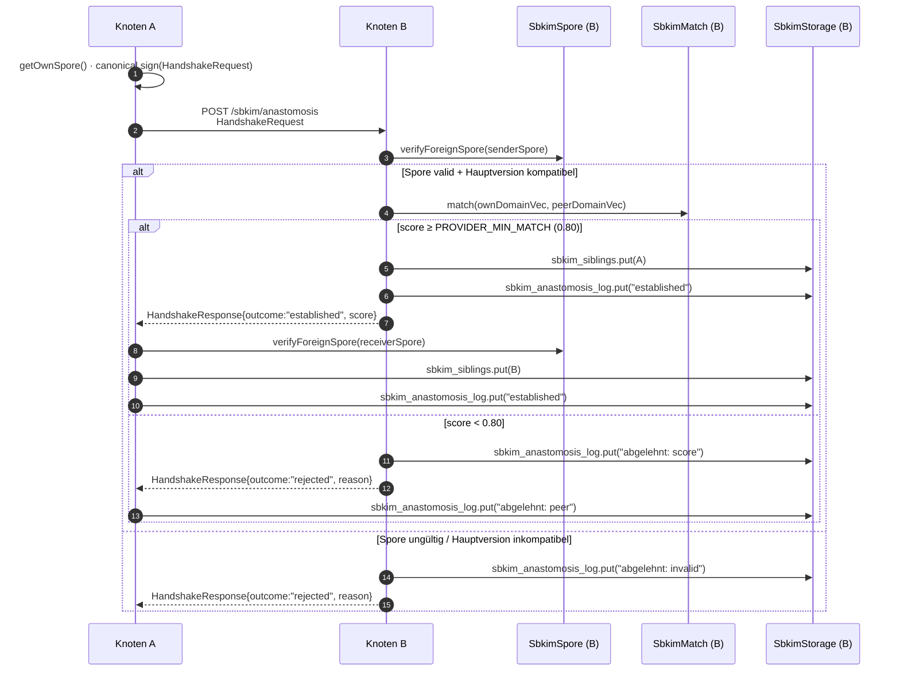

# Modul 05 — Anastomose

> **Status:** 🟦 Code-Stub  ·  **Schicht:** Netzwerk  ·  **Anker:** Sage-Page → Karte 4, Eintrag 05
> **Datei (Code):** `src/modules/05_anastomose.js`
>
> _Handshake zwischen zwei Knoten — Hyphenfusion. Die erste Sitzung,
> die alle vier Vorbedingungen (01 Storage, 02 Spore, 03 Embedding,
> 04 Match) zu einem Protokoll-Schritt zusammensetzt._

---

## Im Mycel-Bild

Anastomose ist die **Hyphenfusion** des Mycels: zwei Pilzfäden, die
einander berühren und passen, verschmelzen zu einem gemeinsamen Strom.
Im SBKIM-Protokoll ist das der Moment, in dem aus zwei einzeln tickenden
PWAs ein verbundenes Paar wird: A schickt seine signierte Spore an B,
B prüft Identität (Modul 02), misst semantische Nähe der beiden Domänen
(Modul 04 gegen `PROVIDER_MIN_MATCH = 0.80`), und entscheidet — passt
oder schweigt. **Schweigen ist Routing.** Wer nicht passt, kriegt
nichts, nicht einmal eine Höflichkeits-Floskel.

Die Fusion ist **bidirektional**: erst wenn *beide* Seiten den Match
überschritten haben, landen beide gegenseitig in `sbkim_siblings`.
Eine einseitige Anziehung ist im Pilz-Modell keine Fusion — ein Pilz
fasst nicht alleine zwei Hyphen zusammen.

---

## Visualisierung



---

## Zweck

Realisiert den **Knoten-zu-Knoten-Handshake** als einzelnen Protokoll-
Schritt — die erste Stelle im SBKIM-Code, an der die vier Kern-Module
in einer Reihe zusammenspielen:

- **Modul 02 Spore** liefert die signierte Visitenkarte und prüft die
  fremde Spore (Signatur, `nodeId`-Konsistenz, Hauptversion).
- **Modul 04 Match** liefert die Cosinus-Zahl zwischen den beiden
  Domänen-Vektoren und den Schwelle-Helfer
  `isAboveProviderThreshold`.
- **Modul 01 Storage** persistiert beidseitig in `sbkim_siblings` und
  schreibt jede Begegnung in `sbkim_anastomosis_log`, auch die
  abgelehnten.
- **Modul 03 Embedding** taucht in 05 nicht direkt auf — der
  `domainVector` ist beim Andocken (Modul 02 / Modul 09) **schon**
  berechnet und in der Spore mitgeliefert. Modul 05 nimmt fertige
  Vektoren entgegen, embedded nicht.

Anastomose ist **explizit ausgelöst** — der Aufrufer (Modul 09 Einbau-
PWA oder Modul 08 UI-Demo) entscheidet, wann ein Handshake passiert.
Es gibt **keinen** automatischen Handshake beim Spore-Empfang, **keine**
Pulsation, **keine** Eigenanfragen ins offene Netz.

---

## Verantwortlichkeiten

**Macht:**
- Ausgehenden Handshake initiieren (`handshake(targetSpore, ownDomainVector)`)
- Eingehenden Handshake annehmen oder ablehnen (`receiveHandshake(incomingRequest)`)
- HandshakeRequest **kanonisch** serialisieren und mit dem eigenen
  Ed25519-Schlüssel signieren (über Modul 02)
- HandshakeRequest/Response gegen den `publicKey` aus der mitgelieferten
  Spore verifizieren
- Match-Schwelle prüfen — über `SbkimMatch.isAboveProviderThreshold`,
  niemals den Wert hartcodieren
- Geschwister bidirektional in `sbkim_siblings` aufnehmen, **nur** wenn
  beide Seiten den Match überschritten haben
- Jede Begegnung anonymisiert in `sbkim_anastomosis_log` mitschreiben:
  established, abgelehnt-score, abgelehnt-invalid, abgelehnt-version,
  timeout, re-handshake
- Geschwister auf Wunsch des Aufrufers vergessen
  (`forgetSibling(nodeId)` — entfernt nur den `sbkim_siblings`-Eintrag,
  Log bleibt)

**Macht nicht:**
- **Kein eigenes Match.** Modul 05 ruft `SbkimMatch.match(...)` und
  `SbkimMatch.isAboveProviderThreshold(...)` auf; rechnet nicht selbst.
- **Keine eigene Spore-Verifikation.** Signatur, `nodeId`-Konsistenz,
  Hauptversion prüft `SbkimSpore.verifyForeignSpore`. Modul 05 schaut
  nur auf das `{valid, reason}`-Ergebnis.
- **Kein direkter IndexedDB-Zugriff.** Persistenz strikt über
  `SbkimStorage.get/put/del/all`. Wer in Modul 05 `indexedDB.open`
  schreibt, hat den Vertrag aus Modul 01 zerrissen.
- **Kein Embedding.** Der `domainVector` ist beim Andocken (Modul 02
  Spore / Modul 09 Einbau-PWA) schon berechnet und Teil der Spore.
- **Kein Crawler, kein Discovery.** `handshake` wird nur mit einer
  Spore aufgerufen, die der Aufrufer **explizit** geliefert hat
  (typisch: Betreiber hat sie aus einer URL geladen).
- **Keine Pulsation, keine periodischen Eigenanfragen.**
- **Kein automatisches Vergessen.** TTL und Apoptose sind Aufgabe von
  Modul 07 — Modul 05 vergisst Geschwister *nicht* von selbst.
- **Keine Anfrage-Inhalte.** Modul 05 trägt nur den Handshake; der
  Austausch konkreter Antworten (Pointer-Listen) ist Modul 06
  (Heterokaryose).

---

## Schnittstelle

Modul 05 exportiert **fünf** öffentliche Funktionen. Alle DB-Operationen
laufen über `window.SbkimStorage`, alle Krypto-Operationen über
`window.SbkimSpore`, alle Cosinus-Vergleiche über `window.SbkimMatch` —
Modul 05 ist die *Komposition*, nicht die *Mechanik*.

```
init() → Promise<void>
  // Prüft Verfügbarkeit von SbkimStorage, SbkimSpore, SbkimMatch und
  // ruft sie der Reihe nach mit init() auf. Stellt sicher, dass eine
  // eigene Identität existiert (über SbkimSpore.getOrCreateIdentity).
  // Wirft AnastomoseDependenciesError, wenn ein Modul fehlt.
  // Idempotent.

handshake(targetSpore, ownDomainVector) → Promise<HandshakeResult>
  // Initiiert einen ausgehenden Handshake an targetSpore.endpoint +
  // ENDPOINT.anastomosis.
  // 1. verifyForeignSpore(targetSpore) → bei {valid:false} sofortiger
  //    Abbruch mit InvalidPeerSporeError.
  // 2. Hauptversions-Check (targetSpore.protocolVersion gegen lokale
  //    PROTOCOL_VERSION) → bei Mismatch sofortiger Abbruch mit
  //    ProtocolVersionMismatchError.
  // 3. Optionaler Vor-Check: wenn targetSpore.domainVector vorhanden,
  //    score = SbkimMatch.match(ownDomainVector, targetSpore.domainVector).
  //    Wenn !isAboveProviderThreshold(score) → kein Netz-Aufruf, Log-
  //    Zeile "abgelehnt: lokal", return {outcome:"rejected-local", score}.
  // 4. Bau HandshakeRequest (siehe Datenformat), kanonisch signiert
  //    mit eigenem Ed25519-Schlüssel.
  // 5. POST an targetSpore.endpoint + "/sbkim/anastomosis", Timeout
  //    QUERY_TIMEOUT_MS (4000 ms). Bei Timeout wirft
  //    HandshakeTimeoutError. Bei Netz-Fehler HandshakeNetworkError.
  // 6. Antwort parsen, receiverSpore via verifyForeignSpore prüfen,
  //    Response-Signatur gegen receiverSpore.publicKey verifizieren.
  // 7. Bei outcome=="established": put sibling, Log "established",
  //    return {outcome:"established", peerNodeId, peerDomain, score}.
  // 8. Bei outcome=="rejected": Log "abgelehnt: peer", return
  //    {outcome:"rejected", reason, score?}.
  // Wirft niemals bei rein semantischer Ablehnung — das ist outcome,
  // kein Error. Wirft nur bei Protokoll-, Netz- oder Krypto-Fehlern.

receiveHandshake(incomingRequest) → Promise<HandshakeResponse>
  // Wird vom Service-Worker (oder vom Backend, bei provider-Knoten mit
  // Server-Code) aufgerufen, sobald ein /sbkim/anastomosis POST
  // eingegangen ist. incomingRequest ist das geparste JSON-Body-Objekt.
  // 1. Form-Check (Pflichtfelder), sonst Response outcome:"rejected",
  //    reason:"Form ungültig".
  // 2. verifyForeignSpore(senderSpore) → {valid:false} ⇒
  //    Response outcome:"rejected", reason:<deutsch>.
  // 3. Hauptversions-Check → Mismatch ⇒ Response outcome:"rejected",
  //    reason:"Inkompatible Hauptversion: <x.y>".
  // 4. Request-Signatur gegen senderSpore.publicKey verifizieren ⇒
  //    bei Fehler Response outcome:"rejected",
  //    reason:"Request-Signatur ungültig".
  // 5. score = SbkimMatch.match(ownDomainVector, request.domainVector).
  //    Wenn !isAboveProviderThreshold(score) → Log "abgelehnt: score",
  //    Response outcome:"rejected", reason:"score unterhalb Schwelle",
  //    score mit-gemeldet.
  // 6. Sonst: sbkim_siblings.put(peer), Log "established",
  //    Response outcome:"established", score, ownSpore mit-geliefert,
  //    Response-Signatur über kanonische Form (ohne signature) gesetzt.
  // Wirft niemals — alle Fehlpfade werden als
  // HandshakeResponse{outcome:"rejected", reason} zurückgegeben.

listSiblings() → Promise<Array<{nodeId, domain, since, pubKey}>>
  // Lädt alle Einträge aus sbkim_siblings. Reihenfolge ist die
  // Storage-natürliche (Schlüssel-Reihenfolge nach nodeId).

forgetSibling(nodeId) → Promise<void>
  // Entfernt den nodeId-Eintrag aus sbkim_siblings. Der Log-Eintrag
  // bleibt (Audit-Spur). Idempotent: forgetSibling auf unbekannten
  // nodeId wirft nicht.
```

### Selbstcheck

Beim **Skript-Laden** (synchron, vor jeglichem Aufruf):

```
console.info("MODUL 05 ANASTOMOSE bereit, Funktionen: init/handshake/receiveHandshake/listSiblings/forgetSibling");
```

Wie Modul 01, 02 und 04 — die Meldung signalisiert „Modul geladen",
nicht „Identität existiert" oder „Geschwister da". Die Schwelle, der
Endpunkt-Pfad und die Versions-Konstante werden in der Selbstcheck-
Zeile bewusst **nicht** wiederholt — sie stehen verbindlich in §0 /
§3 und im jeweils zuständigen Modul (04 / dieses).

### Konfigurationswerte

```
PROTOCOL_VERSION       = "0.1"     // aus INTERFACES.md §0, Vor-Check Hauptversion
PROVIDER_MIN_MATCH     = 0.80      // aus INTERFACES.md §0, gespiegelt in Modul 04
QUERY_TIMEOUT_MS       = 4000      // aus INTERFACES.md §0, Timeout für outgoing POST
ENDPOINT.anastomosis   = "/sbkim/anastomosis"   // aus INTERFACES.md §3
```

`PROVIDER_MIN_MATCH` wird **nicht in Modul 05 neu definiert**.
Anastomose ruft `SbkimMatch.isAboveProviderThreshold(score)` — wer den
Wert ändern will, ändert ihn in §0, Modul 04 zieht nach, Modul 05
spürt es automatisch.

### Datenformate

**HandshakeRequest** (kanonisches JSON; alphabetisch sortierte Keys,
Signatur über die Form **ohne** `signature`-Feld):

```jsonc
{
  "domainVector":     [/* 384 floats, L2-normalisiert */],   // optional bei kleinem Verkehr
  "fromNodeId":       "<base64url-sha256-rawpub des Senders>",
  "nonce":            "<base64url, 16 zufällige Bytes>",
  "protocolVersion":  "0.1",
  "senderSpore":      { /* SporeJson, vom Sender signiert (Modul 02) */ },
  "signature":        "<base64url-ed25519-sig über kanonisches JSON ohne signature>",
  "timestamp":        "2026-05-14T07:00:00.000Z",            // ISO-8601 UTC
  "toNodeId":         "<base64url-sha256-rawpub des Empfängers, falls bekannt>"  // optional
}
```

**HandshakeResponse** (kanonisches JSON; alphabetisch sortiert):

```jsonc
{
  "fromNodeId":       "<Empfänger-nodeId>",
  "nonceEcho":        "<gleiches nonce wie im Request>",
  "outcome":          "established",   // oder "rejected"
  "protocolVersion":  "0.1",
  "reason":           "<deutscher Fehlertext, nur bei rejected>",
  "receiverSpore":    { /* SporeJson, vom Empfänger signiert */ },
  "score":            0.8312,           // optional, nur wenn Match gelaufen ist
  "signature":        "<base64url-ed25519-sig über kanonisches JSON ohne signature>",
  "timestamp":        "2026-05-14T07:00:00.450Z",
  "toNodeId":         "<Sender-nodeId>"
}
```

**`sbkim_siblings["<peerNodeId>"]`** (Storage-Wert pro Geschwister):

```jsonc
{
  "nodeId":   "<base64url-sha256-rawpub>",
  "domain":   "rezeptbuch.example.org",
  "endpoint": "https://klaus.github.io/rezeptbuch/",
  "pubKey":   { "kty": "OKP", "crv": "Ed25519", "x": "<base64url>" },
  "since":    "2026-05-14T07:00:00.000Z"
}
```

**`sbkim_anastomosis_log["<timestamp>"]`** (Storage-Wert pro Begegnung):

```jsonc
{
  "ts":        "2026-05-14T07:00:00.450Z",
  "peerId":    "<base64url-sha256-rawpub>",
  "outcome":   "established"           // oder "rejected" oder "re-handshake" oder "timeout"
  // KEIN domainVector, kein Score-Profil, kein Inhalt — anonymisiert.
}
```

Versionierungs-Regel: HandshakeRequest und HandshakeResponse folgen
[INTERFACES.md §4](../INTERFACES.md). Pflichtfelder dürfen ab Status
`entwurf` nur additiv erweitert werden; das Hinzufügen eines Pflicht-
felds erfordert den Schritt von `protocolVersion: "0.x"` auf `"1.0"`.

---

## A1–B3-Synthese: Anastomose ist Hop B3 / A3

Karte 04 hält fest, dass *die Hops die Funktionen tragen*. Modul 04
sitzt an Hop B2 / A2 als reine *Match-Zahl* — eine numerische Frage,
kein Routing, kein Verwerfen.

**Modul 05 ist die Entscheidungs- und Verbindungs-Stelle an Hop B3 /
A3.** `isAboveProviderThreshold` (in Modul 04 als Helfer angeboten)
wird hier zum *Verwerfen-oder-Verbinden*-Schalter:

- **Pfad A · A3 · Devil's Advocate ✓:** der Anbieter prüft die fremde
  Spore + den Anfrage-Vektor, akzeptiert die Verbindung, schreibt den
  Geschwister-Eintrag und sendet die Bestätigung zurück. Das Mycel
  bildet eine neue Hyphenfusion.
- **Pfad B · B3 · Critic:** wenn `match()` aus B2 unter `PROVIDER_MIN_MATCH`
  bleibt, lehnt B3 ab — Modul 05 schreibt eine *abgelehnt*-Zeile in
  `sbkim_anastomosis_log`, antwortet mit `outcome:"rejected"`, und der
  Strang stirbt ohne Geschwister-Eintrag. Apoptose B4 ist dann Sache
  von Modul 07, sobald der Anfrage-Pfad endgültig endet.

Konsequenz für die Implementierung in diesem Repo: Modul 05 trifft
keine Match-Zahl-Berechnungen selbst, hat aber **die Entscheidungs-
Hoheit** über die Verbindung. Wer die Schwelle ändert, ändert Modul
04 (das gespiegelt §0 liest); Modul 05 zieht nach, ohne dass eine
Zeile in `05_anastomose.js` angefasst werden muss.

---

## Anastomose-Pfad (Schritt-für-Schritt, JSON-Ebene)

Schritte 1–6 sind Knoten A (Initiator), 7–11 sind Knoten B (Empfänger),
12–14 sind wieder A (Verarbeitung der Response).

```
 1. A.init()                                                                                            // SbkimStorage + Spore + Match
 2. A.getOrCreateIdentity()      → {nodeId, publicKeyJwk}
 3. A.getOwnSpore()              → SporeJson(A)
 4. lokaler Vor-Check (optional):
      if targetSpore.domainVector: score = match(A.domainVec, targetSpore.domainVector)
      if score < 0.80: log "abgelehnt: lokal", return rejected-local
 5. baue HandshakeRequest:
      { protocolVersion, fromNodeId, toNodeId?, senderSpore: SporeJson(A),
        domainVector?, nonce, timestamp, signature }
      Signatur kanonisch über Form ohne signature.
 6. fetch POST targetSpore.endpoint + "/sbkim/anastomosis", AbortController(QUERY_TIMEOUT_MS)

 7. B.receiveHandshake(body):
      verifyForeignSpore(senderSpore) → invalid? Response rejected.
 8. Hauptversion-Check → Mismatch? Response rejected.
 9. Request-Signatur prüfen → ungültig? Response rejected.
10. score = match(B.domainVec, request.domainVector)
      if !isAboveProviderThreshold(score): Log "abgelehnt: score", Response rejected mit score.
      else: sbkim_siblings.put({nodeId: A, domain, endpoint, pubKey, since: now()}), Log "established".
11. baue HandshakeResponse + Signatur kanonisch, Response 200 JSON.

12. A: Response parsen, verifyForeignSpore(receiverSpore) → invalid? Log "abgelehnt: invalid-peer", werfen.
13. Response-Signatur gegen receiverSpore.publicKey prüfen → ungültig? Log + werfen.
14. outcome=="established"? sbkim_siblings.put({nodeId: B, domain, endpoint, pubKey, since: now()}),
    Log "established", return HandshakeResult{outcome:"established", peerNodeId: B.id, ...}.
    sonst: Log "abgelehnt: peer", return HandshakeResult{outcome:"rejected", reason, score?}.
```

Reentry: wenn die *gleiche* `peerId` mit derselben Spore-`id`
zweimal anklopft, wird der bestehende `sbkim_siblings`-Eintrag **nicht**
überschrieben — `since` bleibt der erste Anklopf-Zeitpunkt. Der
Log bekommt eine `outcome:"re-handshake"`-Zeile. Das Verhalten ist
idempotent.

---

## Service-Worker-Hinweis für statisch gehostete PWAs

Endknoten (Rezeptbuch / Mixarium) laufen auf GitHub Pages ohne Backend.
Eingehende `/sbkim/anastomosis`-POSTs müssen daher im Browser
abgefangen werden — über einen **Service-Worker**. Die Skizze gehört
in Modul 09 als Andock-Anleitung; die Bau-Sitzung Modul 05 schreibt
den SW-Code. Diese Karte legt nur den Vertrag fest:

- **Pfad:** `GET/POST /sbkim/anastomosis` (relativ zum PWA-Scope).
  Andere Methoden → 405. POST mit anderem `Content-Type` als
  `application/json` → 415.
- **Request-Body:** JSON, Form gemäß `HandshakeRequest` oben.
  Body-Größe > 64 KiB → 413 (Schutz gegen aufgepumpte Spores).
- **Vom SW an die Page:** der SW liest den JSON-Body, ruft
  `SbkimAnastomose.receiveHandshake(body)` auf der aktiven
  PWA-Instanz auf (`postMessage` an `clients.matchAll()` mit einem
  `MessageChannel`-Port; die Page antwortet asynchron mit dem
  `HandshakeResponse`-JSON).
- **Vom SW zurück:** `Response(JSON.stringify(handshakeResponse),
  { status: 200, headers: {"Content-Type":"application/json"} })`.
- **Fallback:** wenn keine PWA-Instanz aktiv ist (Tab geschlossen),
  antwortet der SW mit `503 Service Unavailable` und einem stillen
  Log-Eintrag — *kein* Auto-Start, keine Wake-Lock. Wer nicht da ist,
  schweigt.

Die Bau-Sitzung Modul 05 entscheidet die zwei offenen Punkte:
- **Variante A (Page-Hosted):** SW leitet via `MessageChannel` an die
  Page weiter (oben skizziert). Vorteil: ein Code-Pfad in der Page.
- **Variante B (SW-Hosted):** SW lädt `05_anastomose.js` selbst und
  ruft `receiveHandshake` im Worker-Scope auf. Vorteil: Tab kann
  geschlossen sein. Nachteil: zwei Code-Kopien (Page + SW).

Modul 05 selbst (also `src/modules/05_anastomose.js`) bleibt in beiden
Varianten *gleich* — es exportiert `receiveHandshake`, und wer es
aufruft (Page oder SW) ist Sache der Bau-Sitzung.

**Entscheidung Bau-Sitzung 05 (2026-05-14): Variante A (Page-Hosted).**
`src/sbkim-sw.js` ist dünn (keine Krypto, kein State), die ganze
Anastomose-Logik bleibt in der Page. Beweggründe:

- Modul 03 (`transformers.js`) ist im SW-Scope nicht ohne erheblichen
  Mehraufwand ladbar (kein DOM, anderes Import-Modell). SW-Hosted
  bräuchte für jeden Handshake einen Embedding-Vergleich oder eine
  Out-of-Band-Spore mit fertigem `domainVector` — Komplexität, die
  hier nicht abgegolten werden muss.
- Single-File-PWA-Stil bedeutet: ein Code-Pfad, ein State, eine
  IndexedDB-Verbindung. Variante B würde zwei Kopien des Codes
  pflegen (Page + SW) und zwei Schichten Cache-Invalidierung.
- "503, wenn keine Page aktiv ist" steht so in der Spec
  (Variante A führt direkt dort hin — Variante B müsste den
  Wake-Lock explizit ablehnen).
- Modul 11 (Rate-Limit, Schutz-Backlog) kann später dünn auf den
  SW gelegt werden, ohne dass die Page-Logik mitwächst.

Page-seitige Brücke: Modul 05's `init()` registriert einen
`navigator.serviceWorker.message`-Listener, der eingehende
`SBKIM_ANASTOMOSIS_REQUEST`-Messages an `receiveHandshake` weiterleitet
und das Ergebnis über `MessagePort` zurückschickt.

---

## Fehlerverhalten

| Lage | Reaktion |
|---|---|
| `init()`: ein Abhängigkeits-Modul fehlt (`SbkimStorage` / `SbkimSpore` / `SbkimMatch` nicht auf `window`) | wirft `AnastomoseDependenciesError` mit Liste der fehlenden Module. |
| `handshake()`: `verifyForeignSpore(targetSpore)` liefert `{valid:false, reason}` | wirft `InvalidPeerSporeError` mit reason als `cause`. Kein Netz-Aufruf. |
| `handshake()`: `targetSpore.protocolVersion` ist Hauptversion-inkompatibel (siehe §4) | wirft `ProtocolVersionMismatchError` mit beiden Versionen im Message-Text. Kein Netz-Aufruf. |
| `handshake()`: lokaler Vor-Check liefert score unter Schwelle (nur wenn `targetSpore.domainVector` mitgeliefert) | **kein** Throw. Log-Zeile `"abgelehnt: lokal"`, return `{outcome:"rejected-local", score}`. |
| `handshake()`: `fetch` bricht über `QUERY_TIMEOUT_MS` ab | wirft `HandshakeTimeoutError`. Log-Zeile `"timeout"`. |
| `handshake()`: Netz-/CORS-/DNS-Fehler | wirft `HandshakeNetworkError` mit Original-Error in `cause`. |
| `handshake()`: Response-Signatur gegen `receiverSpore.publicKey` ungültig | wirft `HandshakeSignatureInvalidError`. Log-Zeile `"abgelehnt: invalid-peer"`. |
| `handshake()`: Antwort kommt mit `outcome:"rejected"` zurück | **kein** Throw. Log-Zeile `"abgelehnt: peer"`, return `{outcome:"rejected", reason, score?}`. |
| `receiveHandshake()`: jegliche Verifikations- / Form-/ Signatur-/ Versions-/ Schwellen-Verletzung | **wirft niemals**. Alles als `HandshakeResponse{outcome:"rejected", reason:"<deutsch>"}` zurück (analog `verifyForeignSpore`). |
| `listSiblings()` / `forgetSibling()`: Storage-Fehler aus Modul 01 | wird **unverändert durchgereicht** (z.B. `StorageUnavailableError`). |

Alle SBKIM-Fehler sind `Error`-Instanzen mit sprechendem `name` und
deutschsprachigem `message`. **Wichtig:** semantische Ablehnung
(Score zu niedrig, Peer schweigt) ist **kein** Throw — sie ist
*Outcome*. Das hält den Aufruferpfad sauber: `try/catch` für Netz-
und Protokoll-Pannen, `if (result.outcome === "rejected")` für
Bedeutungs-Routing.

---

## Manueller Test

Skizze für ein späteres Panel 05 in `tests/manual_check.html`. Die
Knöpfe entstehen in der Bau-Sitzung Modul 05 — diese Spec-Sitzung
benennt nur, was geprüft werden soll:

1. **Zwei lokale Pseudo-Knoten in einer Page** — beide Identitäten in
   derselben PWA, mit unterschiedlichen `domainVector`-Werten
   (Rezeptbuch-Vektor vs. Mixarium-Vektor, beide via `embedPassage`
   einmalig erzeugt). `handshake` direkt mit dem fremden
   `getOwnSpore()` aufrufen, ohne Netz-Aufruf (Modul 05 bietet einen
   Test-Helfer, der `receiveHandshake` direkt callt statt zu fetchen
   — siehe Bau-Sitzung). Erwartung: passt (Score > 0.80), beide stehen
   in `sbkim_siblings`.
2. **Domain-Mismatch lokal (Vektor-Trias, Pflege-Sitzung
   2026-05-15)** — derselbe Test, aber mit **drei semantisch klar
   fremden Domänen-Vektoren parallel** statt eines einzelnen
   Vektors. Aktuelle Kandidaten in Panel 05 Test 2: „Steuerrecht
   und Bilanzierung" / „Eisenbahnsignalanlagen" / „Quantenfeldtheorie".
   Erwartung: **mindestens einer** der drei liefert `outcome:"rejected"`,
   Score < `PROVIDER_MIN_MATCH = 0.80`. Pass-Check ist „≥ 1 von 3
   rejected". — *Der frühere Tarantino-Vektor lag in Klaus' Sichttest
   2026-05-15 bei 0.854 (über Schwelle) — Tarantino-Filme handeln
   semantisch oft in Bars und liegen damit zu nah am Mixarium-
   Cocktail-Vektor. Karte 04 Match-Kalibrierungs-Beleg zeigt
   bereits, dass die Embedding-Baseline beim
   `Xenova/multilingual-e5-small`-Modell für unverwandte Begriffe
   ungewöhnlich hoch ist (Käsekuchen/Auspuffrohr = 0.8967). Die
   Trias liefert deshalb drei Stichproben parallel; der niedrigste
   Score ist der verteidigbare Domain-Mismatch-Vektor. Wenn alle
   drei über 0.80 liegen, ist das selbst ein Befund für eine
   Folge-Pflege-Sitzung „Embedding-Baseline" (PROVIDER_MIN_MATCH-
   Anhebung oder Wechsel der Vektor-Familie).* Der Test-Knopf
   protokolliert zusätzlich den Tarantino-Vergleichswert als
   reinen Cosinus, damit Klaus die Drift im Output direkt sieht.
3. **Versions-Mismatch** — fremde Spore mit `protocolVersion: "1.0"`
   füttern. Erwartung: `ProtocolVersionMismatchError` (kein Netz-
   Aufruf), Log-Zeile.
4. **Signatur-Manipulation** — Request mit einem geänderten Feld
   nach dem Signieren. Erwartung: `receiveHandshake` antwortet
   `outcome:"rejected", reason:"Request-Signatur ungültig"`.
5. **Re-Handshake** — denselben Handshake zweimal hintereinander
   auslösen. Erwartung: `sbkim_siblings`-Eintrag nur einmal, `since`
   unverändert, zweite Log-Zeile mit `outcome:"re-handshake"`.
6. **`forgetSibling`** — nach erfolgreichem Handshake einen
   Geschwister-Eintrag wieder entfernen. Erwartung: `listSiblings()`
   liefert ihn nicht mehr, Log-Zeile vom ersten Handshake bleibt
   stehen.
7. **`listSiblings`** — leere Storage, dann nach zwei Handshakes
   prüfen, dass beide Einträge mit `{nodeId, domain, since, pubKey}`
   erscheinen.
8. **Selbstcheck Konsole prüfen** — Hinweisknopf ohne Aktion:
   `MODUL 05 ANASTOMOSE bereit, Funktionen: init/handshake/receiveHandshake/listSiblings/forgetSibling`
   muss beim Laden in der Konsole stehen.

Voraussetzungen für das spätere Panel: Modul 01, 02, 03, 04 müssen
geladen sein (Skript-Tag-Reihenfolge). Der Netz-Pfad
(Service-Worker + fetch) ist im manuellen Test bewusst **nicht**
abgedeckt — Klaus testet zwei Knoten in einem Tab, der echte Netz-
Test gehört in den Einbau in Rezeptbuch + Mixarium (Modul 09).

---

## Risiken & offene Punkte

- **CORS bei Browser-zu-Browser-POST.** GitHub Pages liefert
  standardmäßig keine offenen CORS-Header. Der eingehende POST
  läuft über den Service-Worker des Empfängers — der hat denselben
  Origin wie die Seite. CORS-Probleme treten erst beim ausgehenden
  Aufruf auf, wenn der Empfänger eine Domain ohne SW betreibt.
  Konsequenz: Endknoten brauchen den SW; ohne SW kein eingehender
  Handshake. Modul 09 dokumentiert das.
- **Replay-Schutz.** Das `nonce`-Feld in `HandshakeRequest` ist im
  Schema vorgesehen, aber Modul 05 prüft in der ersten Spec
  *nicht* auf Wiederholungen — wer denselben (signierten) Request
  zweimal sendet, löst zweimal denselben Pfad aus. Das ist okay,
  weil der zweite Lauf das `re-handshake`-Verhalten nutzt
  (idempotent). Ein echter Replay-Schutz mit nonce-Cache gehört in
  Modul 11 (Rate-Limit, Schutz-Backlog), nicht in Modul 05.
- **Timing-Side-Channel.** Die Schritte-Reihenfolge (zuerst Spore-
  Verify, dann Versions-Check, dann Request-Signatur, dann Match)
  ist nicht in konstanter Zeit. Ein Angreifer kann an der
  Antwort-Latenz erkennen, *welcher* Check ausgelöst hat. In der
  ersten Spec ist das ein bewusster Trade-off — Lesbarkeit schlägt
  Constant-Time. Wer ein anderes Bedrohungsmodell braucht, hebt
  das in Modul 11 / 12.
- **Score-Stabilität bei Schwellenrand.** `PROVIDER_MIN_MATCH = 0.80`
  trennt empirisch (Pflege-Sitzung 2026-05-14) zwischen 0.83
  „relevant" und 0.77 „irrelevant". Modul-Drift in `e5-small`
  könnte diese Trennung verschieben — Modul 05 reagiert
  automatisch (kein Hartcode), aber die Anastomose-Statistik wird
  driften. Eine erneute Kalibrierungs-Sitzung 04 ist dann fällig,
  Modul 05 ist davon Konsumer.
- **TTL und Vergessen sind Modul 07.** Modul 05 vergisst Geschwister
  **nicht** automatisch. Wer eine Apoptose-Schicht braucht (Sibling
  inaktiv seit X Tagen → vergessen), baut Modul 07 — Modul 05 stellt
  nur `forgetSibling` als manuelle Operation bereit.
- **Frischer-Kopf-Korrekturen aus dem Sitzungs-Briefing:** keine
  vorgegebene API-Surface widersprach beim Lesen den Vorbedingungen.
  Die im Briefing skizzierten fünf Funktionen
  (`init/handshake/receiveHandshake/listSiblings/forgetSibling`)
  bleiben in dieser Spec stehen — `forgetSibling` ist die einzige
  „kritische Operation", die in der ursprünglichen Schablonen-API
  (`initiateAnastomosis/listSiblings`) fehlte und ohne die der
  Betreiber kein händisches Aufräumen hätte. Bidirektionalität
  führt nicht zu Deadlock, weil der Empfänger seinen Eintrag
  *vor* der Response setzt und der Sender *nach* der Response —
  fällt die Response aus (Timeout, Netz), bleibt einseitig der
  Eintrag bei B stehen (im Log mit `"established"`, beim Sender
  mit `"timeout"`). Beim nächsten erfolgreichen Handshake heilt
  sich das selbst (`re-handshake`).
- **`domainVector` in der Spore — Pflicht oder optional?** Aktuelle
  Entscheidung (Karte 02 + §2): **optional**. Modul 05 ohne
  Spore-`domainVector` müsste den Empfänger-Vektor aus
  `domainKeywords` oder `domainDescription` *live embedden* —
  einen Embedding-Pfad in Modul 05 will diese Spec nicht öffnen.
  Konsequenz: ein Knoten ohne `domainVector` in der Spore kann den
  Handshake **nicht** matchen — der Empfänger antwortet
  `outcome:"rejected", reason:"kein domainVector verfügbar"`. Das
  ist eine schwache Stelle und Anlass für eine Folge-Sitzung 09
  (Einbau-PWA: domainVector pflicht-machen *im Andock-Workflow*,
  bevor die Spore deployt wird).

---

## Bauzustand

| Schritt | Datum | Sitzung | Anmerkung |
|---|---|---|---|
| Karte angelegt | 2026-05-10 | Skelett | leere Schablone |
| Site-Echo | 2026-05-10 | Site-Echo | Hero, Bio-Metapher, Sequence-Diagramm (alte Schwelle 0.55), Querverweise |
| Spec gefüllt | 2026-05-14 | Spec 05 | Fünf-Funktionen-API (`init/handshake/receiveHandshake/listSiblings/forgetSibling`), HandshakeRequest/Response-Schema mit kanonischer Signatur, Anastomose-Pfad in 14 Schritten, Service-Worker-Vertrag, A1–B3-Synthese auf Hop B3/A3 fortgeschrieben, bidirektionale Eintragung, Reentry-Idempotenz, Schwelle aus Modul 04 / §0 ohne Hartcode |
| Code geschrieben | 2026-05-14 | Bau 05 | `src/modules/05_anastomose.js` als IIFE mit `window.SbkimAnastomose`, fünf öffentliche Funktionen, sechs benannte Error-Klassen (`AnastomoseDependenciesError`, `InvalidPeerSporeError`, `ProtocolVersionMismatchError`, `HandshakeTimeoutError`, `HandshakeNetworkError`, `HandshakeSignatureInvalidError`), kanonischer Sign/Verify-Pfad (Envelope-Form ohne signature, Ed25519, base64url ohne Padding) bewusst aus Modul 02 dupliziert; Service-Worker-Variante **A (Page-Hosted via MessageChannel)** in `src/sbkim-sw.js`; Test-Brücken `_invokeDirect`/`_buildSignedRequest`/`_verifyResponseSignature`/`_setOwnDomainVector` für den lokalen Zwei-Knoten-Test ohne Netz; `node --check` grün |
| Sichttest | 2026-05-15 | Klaus + Pflege 05-Test-2 | geprüft 2026-05-15 (Klaus, im Browser): sechs von sieben Tests grün im ersten Lauf — Setup (Main + Alt + Embedding) OK · Test 1 (passendes Match) `response_score:0.888, outcome:established` · Test 3 (Versions-Mismatch 1.0) `reason:"Inkompatible Hauptversion: 1.0 (wir: 0.1)"` · Test 4 (Signatur manipuliert) `reason:"Request-Signatur ungültig"` · Test 5 (Re-Handshake) `since unverändert, sibling einmal gespeichert, letzter Log outcome:"re-handshake"` · Test 6 (forgetSibling) `alt entfernt, Log unverändert, forget_unbekannt_wirft_nicht:true` · Test 7 (listSiblings) `beide alt-Knoten in Liste, Form korrekt`. **Test 2 (Domain-Mismatch / Tarantino-Vektor) Test-Bug** — Erwartung war `outcome:rejected, score<0.80`, tatsächlich `outcome:established, score:0.854`. Tarantino-Filme handeln semantisch oft in Bars → zu nah am Mixarium-Cocktail-Vektor. Modul-Logik korrekt (`PROVIDER_MIN_MATCH=0.80` greift wie spezifiziert), nur der Test-Vektor war schlecht gewählt. **Pflege-Sitzung 2026-05-15** baut Test 2 auf Vektor-Trias um (drei semantisch klar fremde Kandidaten: Steuerrecht und Bilanzierung / Eisenbahnsignalanlagen / Quantenfeldtheorie); Pass-Check „mindestens einer der drei rejected mit score < 0.80"; Tarantino-Vergleichswert wird parallel als reiner Cosinus protokolliert (Drift-Sicht). Karte 05 § Manueller Test Punkt 2 zieht mit. Kein Eingriff in Modul-Vertrag oder INTERFACES.md. Klaus' zweiter Sichttest-Lauf nach Pflege folgt im Browser; falls auch alle drei Trias-Kandidaten über 0.80 liegen, eigene Folge-Pflege-Sitzung „Embedding-Baseline" (PROVIDER_MIN_MATCH-Anhebung oder andere Vektor-Familie). |
| In Endknoten eingebaut | — | — | — |

---

**Querverweise**

- **Abhängigkeiten:** Modul 01 (Storage) · Modul 02 (Spore) · Modul 04 (Match) · indirekt Modul 03 (Embedding, durch den `domainVector` in der Spore)
- **Wird genutzt von:** Modul 06 (Heterokaryose) — fließt nur durch bestehende `sbkim_siblings`; Modul 07 (Apoptose) — vergisst Geschwister und schreibt das Vermächtnis an `sbkim_siblings` aus; Modul 08 (UI-Demo) — Sichttest-Panel; Modul 09 (Einbau-PWA) — beschreibt SW-Registrierung; Modul 11 (Rate-Limit) — Schutz-Backlog, Querschnitt
- **Site-Karte:** [Karte 4 · Module-Bento](../../index.html#screen-overview), Eintrag 05 · [Karte 10 · Andocken](../../index.html#screen-overview) (provisorischer Live-Generator, den Modul 05 später ersetzt) · [Karte 11 · Wanderung](../../index.html#screen-overview) (A1–B3-Pfade)
- **Glossar:** [Anastomose](../GLOSSAR.md), [Geschwister](../GLOSSAR.md), [Schweigen als Routing](../GLOSSAR.md), [Hyphenfusion](../GLOSSAR.md)
- **Integration:** `sbkim_integration.md` §6 (eingehende Anfragen, Service-Worker-Pattern)
- **Paper:** Kapitel 14 (Handshake), Kapitel 15 (Schweigen als Routing)
- **Interfaces:** [`INTERFACES.md` §1 → Modul 05_anastomose](../INTERFACES.md), [`§2 Anfrage (Query)`](../INTERFACES.md), [`§3 Endpunkt-Pfade`](../INTERFACES.md), [`§4 Versionierungs-Regeln`](../INTERFACES.md)
