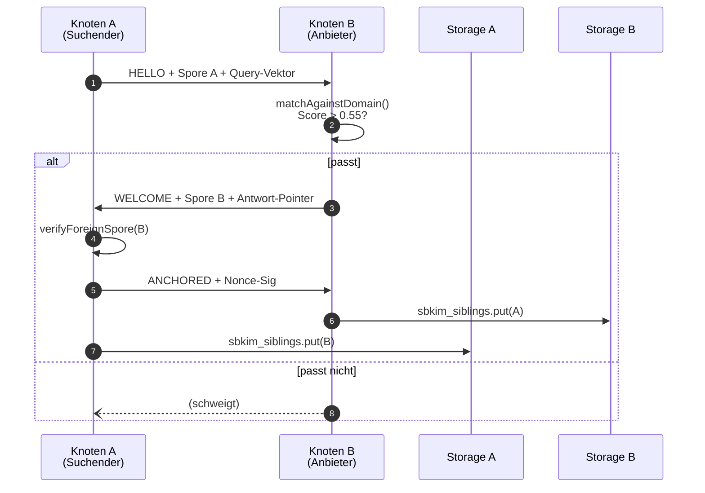

# Modul 05 — Anastomose

> **Status:** 🟫 Schablone  ·  **Schicht:** Netzwerk  ·  **Anker:** Sage-Page → Karte 4, Eintrag 05
> **Datei (Code):** `src/modules/05_anastomose.js`
>
> _Handshake zwischen Knoten — die Hyphenfusion: zwei passende Knoten
> erkennen einander semantisch und verschmelzen zu Geschwistern._

---

## Im Mycel-Bild

Anastomose ist die **Hyphenfusion** des Mycels: zwei Pilzfäden, die
einander berühren und passen, verschmelzen zu einem gemeinsamen Strom.
Im Sage-Protokoll: zwei Knoten, deren Domänen-Vektoren sich nahe genug
sind, führen einen Handshake durch und nehmen einander in die
Geschwister-Liste auf. Die Verbindung ist **bedeutungs-basiert**, nicht
adress-basiert: ein Knoten antwortet **nur**, wenn die Anfrage
semantisch zu seiner Domäne passt — sonst Schweigen. Schweigen ist
Routing.

---

## Visualisierung



---

## Zweck

Realisiert den eigentlichen Knoten-zu-Knoten-Kontakt:

- **Anfrage senden** an einen anderen Knoten (Suchender / Hybrid)
- **Anfragen empfangen** und beantworten (Anbieter / Hybrid)
- **Handshake** durchführen, sobald ein Match festgestellt wurde
- **Geschwister-Liste** pflegen

Dies ist das Modul, in dem die "Bedeutungs-statt-Adress"-Routinglogik
sichtbar wird: ein Knoten antwortet **nur**, wenn die Anfrage zu seiner
Domäne passt — sonst Schweigen.

---

## Verantwortlichkeiten

**Macht:**
- HTTP-POST an `/sbkim/query` eines Zielknotens
- HTTP-POST an `/sbkim/anastomosis` für den Handshake
- Eingehende Anfragen empfangen (über Service-Worker bei statischem Hosting)
- Match-Schwelle prüfen, Antwort formulieren oder schweigen
- Geschwister in `sbkim_siblings` aufnehmen
- Handshake-Historie in `sbkim_anastomosis_log` mitschreiben (anonymisiert)

**Macht nicht:**
- Kein Crawler. Kein Discovery. Anfragen gehen nur an Adressen, die der
  Betreiber oder ein anderer verbundener Knoten **explizit** geliefert hat.
- Keine Pulsation, keine periodischen Eigenanfragen.
- Keine Datenkörper außer dem, was Modul 06 (Heterokaryose) explizit
  freigibt.

---

## Schnittstelle

*(noch zu spezifizieren)* — Skizze:

```
init({ ownSpore: SporeJson }) → Promise<void>

query(targetSporeUrl: string, queryText: string, options?: {
  timeout?: number,        // default QUERY_TIMEOUT_MS
  minMatchScore?: number,  // default PROVIDER_MIN_MATCH
}) → Promise<{
  match: boolean,
  score?: number,
  responsePointers?: Array<{ url, summary?: string }>,
  responder?: { nodeId, domain }
}>

onIncomingQuery(handler: async (q: IncomingQuery) => Response | null)
  // null = schweigen

formatResponse(candidates: any[], score: number) → ResponsePayload

initiateAnastomosis(siblingSpore: SporeJson) → Promise<HandshakeResult>
listSiblings() → Promise<Array<{nodeId, domain, since}>>
```

### Datenformate (in INTERFACES.md spiegeln, sobald spezifiziert)

- IncomingQuery: { embedding, queryText?, fromNodeId, fromSpore? ... }
- ResponsePayload: { score, pointers, responderNodeId, signature }
- HandshakeResult: { peerNodeId, peerDomain, established: bool }

---

## Manueller Test

1. Zwei Browser-Tabs, beide mit eingebautem SBKIM (zwei Knoten
   "Rezeptbuch-Test" und "Mixarium-Test"), beide auf `localhost`
   verschiedener Ports.
2. Tab A: `Sbkim.query("http://localhost:8081/.well-known/sbkim/spore.json",
   "Cocktail mit Tequila")`. Erwartung: match=true, score>0.55.
3. Tab A: dieselbe Anfrage an Tab B (Rezeptbuch). Erwartung: match=false
   (Domäne passt nicht).
4. Anastomose-Knopf: nach erfolgreichem Match Handshake auslösen.
   Beide Tabs zeigen einander in `listSiblings()`.

---

## Risiken & offene Punkte

- CORS: Browser-zu-Browser-POST geht nur, wenn der Zielserver CORS-
  Header setzt oder ein Service-Worker dazwischen liegt. → Spec klärt
  Strategie für GitHub Pages.
- Wiederholungen: ein Knoten darf eine Anfrage nicht zweimal beantworten
  (Replay-Schutz via Nonce + Signatur).
- Timeouts: Antwort > QUERY_TIMEOUT_MS → als "kein Match" werten.
- Spam: ein Knoten, der zu viele unsinnige Anfragen sendet, sollte vom
  Empfänger temporär ignoriert werden (Reputation, später).

---

## Bauzustand

| Schritt | Datum | Sitzung | Anmerkung |
|---|---|---|---|
| Karte angelegt | 2026-05-10 | Skelett | leere Schablone |
| Site-Echo | 2026-05-10 | Site-Echo | Hero, Bio-Metapher, Sequence-Diagramm, Querverweise |
| Spec gefüllt | — | — | — |
| Code geschrieben | — | — | — |
| Sichttest | — | — | — |
| In Endknoten eingebaut | — | — | — |

---

**Querverweise**

- **Abhängigkeiten:** Modul 02 (Spore) · Modul 04 (Match) · Modul 01 (Storage)
- **Wird genutzt von:** Modul 06 (Heterokaryose) · Modul 07 (Apoptose) für Vermächtnis-Verteilung · Modul 11 (Rate-Limit) als Querschnitt
- **Site-Karte:** [Karte 4 · Module-Bento](../../index.html#screen-overview), Eintrag 05 · [Karte 11 · Wanderung](../../index.html#screen-overview)
- **Glossar:** [Anastomose](../GLOSSAR.md), [Geschwister](../GLOSSAR.md), [Schweigen als Routing](../GLOSSAR.md)
- **Integration:** `sbkim_integration.md` §6 (eingehende Anfragen)
- **Paper:** Kapitel 14 (Handshake)
