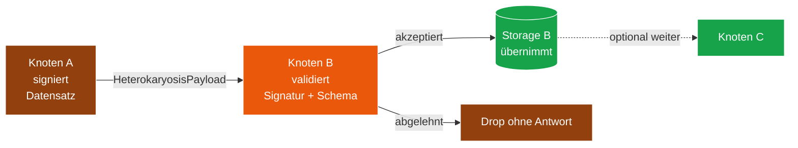

# Modul 06 — Heterokaryose

> **Status:** 🟫 Schablone (späte Phase)  ·  **Schicht:** Netzwerk  ·  **Anker:** Sage-Page → Karte 4, Eintrag 06
> **Datei (Code):** `src/modules/06_heterokaryose.js`
>
> _Datenaustausch zwischen verbundenen Geschwistern — Opt-In,
> kontrolliert, ohne personenbezogene Daten. Nährstoff-Tausch im Mycel._

---

## Im Mycel-Bild

Heterokaryose ist im Pilz die **Phase nach der Anastomose**: zwei
verschmolzene Hyphen tauschen Nährstoffe und Erfahrung — Wissen über
gute Erden, gefährliche Stellen, knappe Ressourcen. Im Sage-Protokoll
sind es kleine, signierte Datensätze: aktualisierte Domänen-Stichworte,
anonymisierte Anfrage-Statistik, Vermächtnisse Dritter. Strikt
**Opt-In**: Heterokaryose passiert nur, wenn der Betreiber sie aktiviert.
Default: **aus**.

---

## Visualisierung



---

## Zweck

Erlaubt verbundenen Geschwisterknoten, kontrolliert Erfahrungswerte
auszutauschen — etwa neu hinzugekommene Domänen-Stichworte oder
anonymisierte Anfrage-Statistik. Biologische Analogie: Nährstoffaustausch
zwischen verschmolzenen Pilzfäden.

---

## Verantwortlichkeiten

**Macht:**
- Aktiv angefragten Datensatz an einen Geschwisterknoten senden
- Eingehenden Heterokaryose-Datensatz validieren (Signatur, Schema)
- Inhalte in lokalem Speicher übernehmen, **nur** wenn der Betreiber
  das in der Konfiguration freigegeben hat (Default: aus)
- Datensätze sind klein, signiert, ohne personenbezogene Daten

**Macht nicht:**
- Keine automatische Übernahme ohne Freigabe
- Kein Sync-Protokoll, keine Konsistenzgarantien
- Keine Inhaltsdaten der Endknoten-App (keine Rezepte, keine Cocktails)

---

## Schnittstelle

*(noch zu spezifizieren)*

```
init({ enabled: boolean }) → Promise<void>

shareWith(siblingNodeId: string, payload: HeterokaryosisPayload)
  → Promise<{ accepted: boolean }>

onIncoming(handler: (payload: HeterokaryosisPayload) → "accept"|"reject")
```

### Datenformat: HeterokaryosisPayload

*(noch zu spezifizieren)* — Skizze:

```jsonc
{
  "fromNodeId": "...",
  "type":       "domainKeywordsUpdate" | "anonStats" | "...",
  "data":       { /* type-spezifisch */ },
  "createdAt":  "...",
  "signature":  "..."
}
```

### Konfiguration

Default: **aus**. Heterokaryose ist Opt-In durch den Betreiber.

```
HETEROKARYOSIS_ENABLED = false
```

---

## Manueller Test

*(später, sobald 05 steht)*

---

## Risiken & offene Punkte

- Vergiftung: ein bösartiger Knoten könnte falsche Stichworte streuen
  → Quorum-Mechanik (Modul 07 / Apoptose) als Gegengewicht.
- Datenschutz: anonymisierte Anfrage-Statistik darf keine
  Re-Identifikation erlauben (k-Anonymität, in Spec festlegen).

---

## Bauzustand

| Schritt | Datum | Sitzung | Anmerkung |
|---|---|---|---|
| Karte angelegt | 2026-05-10 | Skelett | leere Schablone |
| Site-Echo | 2026-05-10 | Site-Echo | Hero, Bio-Metapher, Mermaid-Flow, Querverweise |
| Spec gefüllt | — | — | — |
| Code geschrieben | — | — | — |
| Sichttest | — | — | — |
| In Endknoten eingebaut | — | — | — |

---

**Querverweise**

- **Abhängigkeiten:** Modul 05 (Anastomose) · Modul 02 (Spore)
- **Wird genutzt von:** Modul 07 (Apoptose) für Vermächtnis-Verbreitung · Modul 10 (Reputation) für Score-Gossip · Modul 12 (Blocklist) optional für Sync zwischen Geschwister-Endknoten
- **Site-Karte:** [Karte 4 · Module-Bento](../../index.html#screen-overview), Eintrag 06
- **Glossar:** [Heterokaryose](../GLOSSAR.md), [Vermächtnis](../GLOSSAR.md), [Quorum](../GLOSSAR.md)
- **Integration:** `sbkim_integration.md` §9 (keine personenbezogenen Daten)
- **Paper:** Kapitel 15 (Datenaustausch)
