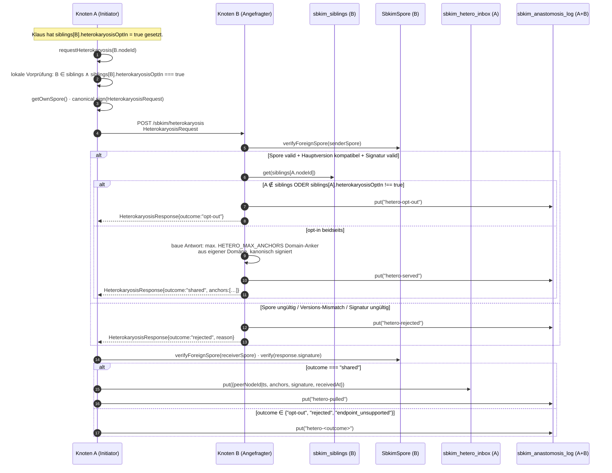

# Modul 06 — Heterokaryose

> **Status:** 🟦 Code-Stub  ·  **Schicht:** Netzwerk  ·  **Anker:** Sage-Page → Karte 4, Eintrag 06
> **Datei (Code):** `src/modules/06_heterokaryose.js`
>
> _Datenaustausch zwischen bereits-verheirateten Geschwistern — der
> semantische Schritt nach der Anastomose. Pull-basiert, Opt-In auf
> beiden Seiten, signiert, kanonisch. Heterokaryose tauscht **Domain-
> Anker** (signierte Stichwort-Vektor-Paare aus der eigenen Domäne) —
> sie reichern den anderen Knoten mit semantisch reicheren Daten an als
> die einzelne Domain-Vektor-Spore aus Modul 02. Nährstoff-Tausch im
> Mycel._

---

## Im Mycel-Bild

Heterokaryose ist im Pilz die **Phase nach der Anastomose**: zwei
verschmolzene Hyphen tauschen Nährstoffe und Erfahrung — Wissen über
gute Erden, gefährliche Stellen, knappe Ressourcen. Im Sage-Protokol
sind das kleine, signierte Datensätze, die der eine Knoten dem anderen
mitteilt: „so klingt meine Domäne im Detail, das hier sind typische
Stichworte mit ihren Embedding-Vektoren — du kannst sie nutzen, um
meine Domäne genauer einzuschätzen als nur den einen Domain-Vektor aus
meiner Spore."

Strikt **Opt-In auf beiden Seiten**: Heterokaryose passiert nur, wenn
der Betreiber bei seinem Geschwister-Eintrag das `heterokaryosisOptIn`-
Flag gesetzt hat (sowohl der Initiator als auch der Angefragte). Der
Default ist **aus** — ein frisch angelegter Geschwister-Eintrag aus
Modul 05 hat `heterokaryosisOptIn` *nicht* gesetzt; das Feld wird in
einer Folge-Sitzung im Endknoten-UI (Modul 00 Doku-Fenster oder Modul
08 UI-Demo) gesetzt, wenn Klaus dem Geschwister explizit „erweiterter
Datenaustausch ok" gibt.

Strikt **Pull-basiert**: der Initiator fragt, der Angefragte
antwortet. Es gibt **kein** Push, **keine** Pulsation, **keine**
Eigenanfrage ins offene Netz — Heterokaryose ist Empfangsmodus mit
Antwortrecht, wie das ganze SBKIM-Drehbuch. Wer nicht passt, schweigt.

---

## Visualisierung



---

## Zweck

Erlaubt verbundenen Geschwister-Knoten, kontrolliert **semantisch
reichere Daten** auszutauschen als die einzelne Spore es kann. Die
Spore aus Modul 02 trägt nur **einen** Domain-Vektor (`domainVector` —
384 floats) plus optional eine Stichwort-Liste (`domainKeywords`); der
Empfänger kann damit nur einen einzigen Cosinus berechnen.

Heterokaryose ergänzt das um eine kleine Anzahl **signierter Domain-
Anker**: pro Anker ein **Label** (deutscher Stichwort-Text) und der
zugehörige **Embedding-Vektor** (384 floats). Der Empfänger kann
damit:

- die Domäne des Senders **feinkörniger** einschätzen (statt einem
  einzigen Vektor stehen drei bis fünf zur Verfügung),
- bei Sub-Domain-Lookups (z.B. „erkennen ob eine eingehende Frage zu
  ‚Hefeteig'-Stichwort eines Rezeptbuch-Knotens passt") den passenden
  Anker direkt vergleichen, ohne neu zu embedden,
- Domain-Drift in Geschwistern erkennen (Anker-Sätze verändern sich
  über die Zeit; ein erneuter Pull zeigt den aktuellen Stand).

**Wichtig**: Heterokaryose teilt **keine** Inhaltsdaten (Rezepte,
Cocktails), **keine** Anfrage-Statistik, **keine** personenbezogenen
Daten. Nur abstrakte Domain-Anker, deren Inhalt der Sender bewusst zum
Teilen freigegeben hat.

Heterokaryose ist die *Komposition* — Modul 06 rechnet nicht selbst,
sondern ruft `SbkimSpore.verifyForeignSpore`, `SbkimStorage`,
WebCrypto-Sign-/Verify-Pfade (analog 02/05/07) und liest
`sbkim_siblings` aus Modul 05. Es ruft Modul 04 (Match) **nicht** —
der Empfänger entscheidet allein, was er aus den Ankern macht.

---

## Verantwortlichkeiten

**Macht:**

- Heterokaryose-Pull initiieren (`requestHeterokaryosis(peerNodeId)`),
  ausschließlich gegen Geschwister aus `sbkim_siblings` mit
  `heterokaryosisOptIn === true`.
- Eingehenden Heterokaryose-Pull annehmen oder ablehnen
  (`receiveHeterokaryosis(incomingRequest)`) — analog Modul 05's
  `receiveHandshake`.
- HeterokaryosisRequest/Response **kanonisch** serialisieren und mit
  dem eigenen Ed25519-Schlüssel signieren (gleicher Pfad wie Modul 02
  / 05 / 07).
- HeterokaryosisResponse beim Empfänger gegen den `publicKey` aus der
  mitgelieferten Spore verifizieren.
- Bei `outcome === "shared"`: empfangene Domain-Anker in
  `sbkim_hetero_inbox` ablegen (pro Pull ein Eintrag, Schlüssel
  `peerNodeId|ts`).
- Jede Begegnung in `sbkim_anastomosis_log` mitschreiben:
  `hetero-pulled`, `hetero-served`, `hetero-opt-out`, `hetero-
  rejected`, `hetero-timeout`, `hetero-endpoint-unsupported`. Log
  bleibt anonymisiert (kein Anker-Inhalt).
- Inbox-Liste lesen (`listHeterokaryosis()` für UI / Doku-Fenster).
- Inbox-Eintrag manuell vergessen (`forgetHeterokaryosis(peerNodeId,
  ts)`) — Andocker-Trigger.

**Macht nicht:**

- **Kein Match.** Modul 06 berührt `SbkimMatch` nicht. Der Empfänger
  entscheidet später selbst, was er aus den Ankern rechnet (z.B. in
  Modul 04-basierten Lookups). Modul 06 transportiert nur.
- **Kein Embedding.** Kein `SbkimEmbedding`-Aufruf in 06. Die Anker-
  Vektoren werden beim Andocken (Modul 02 Spore-Generierung / Modul 09
  Einbau-PWA) schon berechnet und in einem späteren Schritt in die
  Anker-Quelle des Knotens eingespeist (Spec-Sitzung 08 oder Folge-
  Pflege Modul 02 entscheidet das später; Modul 06 *liest* sie nur).
- **Kein Handshake.** Modul 06 ruft `SbkimAnastomose.handshake`
  **nicht** auf. Heterokaryose setzt einen erfolgreichen Handshake
  voraus — sie schickt keine Spore-Verifikation auf neue Geschwister,
  sondern arbeitet ausschließlich gegen bekannte Geschwister.
- **Kein direkter `indexedDB.open`.** Persistenz strikt über
  `SbkimStorage.{init, get, put, del, all}`. Wer in Modul 06
  IndexedDB direkt anfasst, hat den Vertrag aus Modul 01 zerrissen.
- **Keine Pulsation, keine periodischen Eigenanfragen.** Pulls
  laufen ausschließlich auf expliziten Andocker-Trigger
  (Klaus-Klick im UI, oder ein Endknoten-internes Skript) — niemals
  via `setInterval`, niemals automatisch bei `init()`.
- **Kein Push.** Modul 06 schickt **nie** unaufgefordert Anker an
  Geschwister. Wer Anker bekommen will, fragt sie aktiv ab.
- **Kein automatisches Vergessen.** TTL für Inbox-Einträge ist
  Aufgabe von Modul 07 (eigene Folge-Pflege zieht
  `sbkim_hetero_inbox` in den Cleanup-Reigen). Modul 06 stellt nur
  `forgetHeterokaryosis(peerNodeId, ts)` als manuelle Operation
  bereit.
- **Kein Anker-Weiterleiten.** Wenn A Anker von B bekommt, schickt A
  sie **nicht** an seine anderen Geschwister weiter. Anker sind
  direkte Eins-zu-eins-Daten zwischen den beiden Geschwistern.
- **Kein Schreibrecht auf `sbkim_siblings`.** Schreiber bleibt Modul
  05 (Karte 01 Vertrag); Modul 06 liest nur, mit fail-soft-Lese-Recht
  auf das optional-additive Feld `heterokaryosisOptIn` (default
  `false`, wenn das Feld fehlt).
- **Keine Modifikation des `heterokaryosisOptIn`-Flags.** Das setzt
  Klaus über das Endknoten-UI (Modul 00 Doku-Fenster oder Modul 08
  UI-Demo). Modul 06 *liest* nur.
- **Kein Quorum, keine Misstrauensvoten.** Trust-basierte Filterung
  von Anker-Quellen gehört in Modul 10 (Reputation, Schutz-Backlog).

---

## Schnittstelle

Modul 06 exportiert **fünf** öffentliche Funktionen. Alle DB-
Operationen laufen über `window.SbkimStorage`, alle Krypto-
Operationen über `window.SbkimSpore` / WebCrypto-Pfad (analog Modul 02
/ 05 / 07) — Modul 06 ist die *Komposition*, nicht die *Mechanik*.

```
init() → Promise<void>
  // Prüft Verfügbarkeit von SbkimStorage und SbkimSpore und ruft sie
  // der Reihe nach mit init() auf. Registriert den `message`-Listener
  // für eingehende SBKIM_HETEROKARYOSIS_REQUEST-Nachrichten vom
  // Service-Worker (analog Modul 05 / 07 Page-Hosted-Variante).
  // Wirft HeterokaryoseDependenciesError, wenn ein Modul fehlt.
  // Idempotent.

requestHeterokaryosis(peerNodeId) → Promise<HeterokaryoseResult>
  // Initiiert einen ausgehenden Heterokaryose-Pull gegen den
  // Geschwister peerNodeId.
  // 1. sibling = SbkimStorage.get(sbkim_siblings_<key>, peerNodeId).
  //    <key> = aktive Identität aus SbkimSpore.getActiveIdentityKey()
  //    (Default "main"; Brief 04 der V1-Sammelspec-Kaskade). Wenn nicht
  //    vorhanden → wirft UnknownSiblingError. Kein Netz.
  // 2. Lokale Vorprüfung: sibling.heterokaryosisOptIn === true?
  //    Sonst → KEIN Throw. Log-Zeile "hetero-opt-out-local",
  //    return {outcome:"opt-out-local"}.
  // 3. Hauptversions-Check (sibling.pubKey- und sibling.endpoint-
  //    Anker reichen — die ursprüngliche Spore aus Modul 05 ist nicht
  //    mehr im Storage, aber der Sender hat denselben Hauptversions-
  //    Kontext gehabt). Versions-Drift fängt der Empfänger ab; Modul
  //    06 schickt mit lokaler PROTOCOL_VERSION.
  // 4. Bau HeterokaryosisRequest (siehe Datenformat), kanonisch
  //    signiert mit eigenem Ed25519-Schlüssel.
  // 5. POST an sibling.endpoint + "/sbkim/heterokaryosis", Timeout
  //    QUERY_TIMEOUT_MS (4000 ms aus §0). Bei Timeout wirft
  //    HeterokaryoseTimeoutError, Log "hetero-timeout".
  //    Bei Netz-Fehler HeterokaryoseNetworkError.
  //    Bei HTTP 404 (Geschwister hat den Endpunkt nicht) → KEIN
  //    Throw, Log "hetero-endpoint-unsupported", return
  //    {outcome:"endpoint_unsupported"}.
  // 6. Antwort parsen, receiverSpore via verifyForeignSpore prüfen,
  //    Response-Signatur gegen receiverSpore.publicKey verifizieren.
  //    Signatur-Fehler → wirft HeterokaryoseSignatureInvalidError,
  //    Log "hetero-rejected".
  // 7. outcome-Verzweigung:
  //    "shared"   → sbkim_hetero_inbox_<key>.put({peerNodeId|ts, anchors,
  //                  signature, receivedAt}), Log "hetero-pulled",
  //                  return {outcome:"shared", anchorCount,
  //                          peerNodeId, ts}.
  //    "opt-out"  → KEIN Inbox-Eintrag, Log "hetero-opt-out",
  //                  return {outcome:"opt-out"}.
  //    "rejected" → KEIN Inbox-Eintrag, Log "hetero-rejected",
  //                  return {outcome:"rejected", reason}.
  // Wirft niemals bei rein semantischer Ablehnung — das ist Outcome,
  // kein Error. Wirft nur bei Protokoll-, Netz- oder Krypto-Fehlern
  // (und bei unbekanntem Sibling als sofortiger Vorprüfungs-Fehler).

receiveHeterokaryosis(incomingRequest) → Promise<HeterokaryosisResponse>
  // Wird vom Service-Worker (Page-Hosted-Variante via MessageChannel)
  // aufgerufen, sobald ein /sbkim/heterokaryosis POST eingegangen
  // ist. incomingRequest ist das geparste JSON-Body-Objekt.
  //   1. Form-Check (Pflichtfelder), sonst Response
  //      outcome:"rejected", reason:"Form ungültig".
  //   2. verifyForeignSpore(senderSpore) → {valid:false} ⇒
  //      Response outcome:"rejected", reason:<deutsch>.
  //   3. Hauptversions-Check → Mismatch ⇒ Response
  //      outcome:"rejected",
  //      reason:"Inkompatible Hauptversion: <x.y>".
  //   4. Request-Signatur gegen senderSpore.publicKey verifizieren ⇒
  //      bei Fehler Response outcome:"rejected",
  //      reason:"Request-Signatur ungültig".
  //   4b. Receiver-Map nodeId→key (Brief 04): request.toNodeId wird
  //       gegen alle eigenen Identitäten geprüft (Map beim init()
  //       gebaut). Treffer → <hit-key> ist die getroffene Persona für
  //       diese Operation. Kein Treffer → Response outcome:"rejected",
  //       reason:"toNodeId stimmt nicht zum Empfänger".
  //   5. Filter: ist senderSpore.id in sbkim_siblings_<hit-key>?
  //      Sonst Response outcome:"rejected",
  //      reason:"Sender ist kein Geschwister". (Modul 06 antwortet
  //      ausschließlich auf bekannte Geschwister der getroffenen
  //      Persona — Spore-Signatur allein reicht NICHT, und ein
  //      Geschwister einer ANDEREN Persona zählt nicht.)
  //   6. Filter: sbkim_siblings_<hit-key>[senderId].heterokaryosisOptIn
  //      === true? Sonst Response outcome:"opt-out", Log
  //      "hetero-opt-out". (KEIN reason-Detail beim opt-out — das
  //      hält die Antwort minimal.)
  //   7. Sonst: Anker-Quelle lesen (siehe § Anker-Quelle unten),
  //      max. HETERO_MAX_ANCHORS Einträge, baue Response
  //      outcome:"shared" mit anchors[] und receiverSpore. Signatur
  //      kanonisch über die Form ohne signature. Log "hetero-served".
  //   Wirft NIEMALS — alle Fehlpfade werden als
  //   HeterokaryosisResponse{outcome:"rejected"|"opt-out", reason?}
  //   zurückgegeben (analog Modul 02 verifyForeignSpore und Modul 05
  //   receiveHandshake und Modul 07 receiveLegacy).

listHeterokaryosis() → Promise<Array<{peerNodeId, ts, anchorCount, receivedAt}>>
  // Lädt alle Einträge aus sbkim_hetero_inbox_<key> (aktive Identität;
  // Brief 04). Reihenfolge: Storage-natürlich (nach Schlüssel =
  // peerNodeId|ts). Anker-Inhalte (label, vector) werden bewusst
  // weggelassen — Lese-Helfer für UI / Modul 00 / Modul 08; eine
  // echte Detail-View (mit Ankern) gehört in Modul 08 und nutzt
  // SbkimStorage direkt. Persona-übergreifende Sicht: Aufrufer
  // iteriert listIdentities() (INTERFACES.md § 9.2).

forgetHeterokaryosis(peerNodeId, ts) → Promise<void>
  // Entfernt den Inbox-Eintrag mit Schlüssel `peerNodeId|ts` aus
  // sbkim_hetero_inbox_<key> (aktive Identität; Brief 04). Der
  // sbkim_anastomosis_log_<key>-Eintrag bleibt (Audit-Spur).
  // Idempotent: unbekannter Schlüssel wirft NICHT.
```

### Selbstcheck

Beim **Skript-Laden** (synchron, vor jeglichem Aufruf):

```
console.info("MODUL 06 HETEROKARYOSE bereit, Funktionen: init/requestHeterokaryosis/receiveHeterokaryosis/listHeterokaryosis/forgetHeterokaryosis");
```

Wie Modul 01 / 02 / 04 / 05 / 07 — die Meldung signalisiert „Modul
geladen", nicht „Anker da" oder „Geschwister opt-in". Endpunkt und
Versions-Konstante werden in der Selbstcheck-Zeile bewusst **nicht**
wiederholt (stehen verbindlich in §0 / §3).

### Konfigurationswerte

```
PROTOCOL_VERSION         = "0.1"                          // aus INTERFACES.md §0, Hauptversions-Check
QUERY_TIMEOUT_MS         = 4000                           // aus INTERFACES.md §0, Timeout für outgoing POST
HETERO_MAX_ANCHORS       = 5                              // aus INTERFACES.md §0 (additiv neu), max. Anker-Anzahl pro Response
ENDPOINT.heterokaryosis  = "/sbkim/heterokaryosis"        // aus INTERFACES.md §3
```

`HETERO_MAX_ANCHORS` ist die einzige neue Konstante dieser Spec —
additiv in §0 (analog `SIBLING_MAX_AGE_MS` aus Spec-Sitzung 07,
`DOKU_REVEAL_WINDOW_MS` aus Spec-Sitzung 00). **Kein Hauptversions-
Sprung.** `status.json.config` zieht den Wert mit. Begründung in vier
Punkten (analog Karte 07 § `SIBLING_MAX_AGE_MS`-Ort-Entscheidung):

1. **Konsistenz** mit `PROVIDER_MIN_MATCH`, `QUERY_TIMEOUT_MS`,
   `SIBLING_MAX_AGE_MS`. §0 ist die *eine Quelle* aller protokoll-
   relevanten Konstanten.
2. **Querschnitts-Anschluss für Modul 11.** Ein zukünftiges Rate-
   Limit-Modul kann `HETERO_MAX_ANCHORS` als Pro-Pull-Bandbreiten-
   Anker nutzen, ohne dass Modul 06 angefasst wird.
3. **Additive Änderung — kein Hauptversions-Sprung.** §0 erlaubt
   additive Erweiterung um Konstanten.
4. **`status.json.config` zieht nach.** Die Sage-Page liest §0 aus
   `status.json.config`; additive Konstanten landen dort automatisch
   mit.

### Anker-Quelle (Spec-Wille — was der Sender liest)

Modul 06 produziert Anker für die ausgehende Response. **Wo kommen die
Anker her?** Diese Spec entscheidet:

- **Default-Anker-Quelle:** der Sender liest seine eigene
  `SporeJson` aus Modul 02 (`getOwnSpore()`). Wenn die Spore das
  optionale Feld `domainKeywords: string[]` (max. 10 Einträge, siehe
  §2 Spore) und das optionale Feld `domainVector: number[384]` hat,
  baut Modul 06 *einen* Anker mit `label: "(domain)"` und dem
  `domainVector`. Das ist der **minimale, immer verfügbare** Anker.
- **Erweiterte Anker-Quelle (späte Phase):** ein neuer Storage-Store
  `sbkim_hetero_outbox` mit Schreib-Recht durch Modul 08 (UI-Demo)
  oder Klaus' Endknoten-UI. Klaus kann pro Anker ein Label + den
  durch Modul 03 (Embedding) berechneten Vektor reinlegen. Modul 06
  liest aus dem Outbox-Store, sortiert (z.B. nach `addedAt`), und
  liefert die ersten `HETERO_MAX_ANCHORS` Einträge.
- **Spec-Wille:** Modul 06 prüft beim Bau der Response zuerst
  `sbkim_hetero_outbox` — wenn der Store existiert und nicht leer ist,
  nutzt 06 ihn. Sonst Fallback auf den Spore-Single-Anker. **Wer den
  Outbox-Store füllt, ist NICHT Aufgabe von Modul 06.** Modul 08
  (UI-Demo) oder eine spätere Spec-Sitzung 08 spezifiziert das. Bis
  dahin liefert jeder Knoten genau **einen** Anker (den Domain-
  Vektor aus seiner Spore) und Heterokaryose ist primär ein
  **Domain-Drift-Erkenner** — beim erneuten Pull sieht der Empfänger,
  ob der Domain-Vektor sich geändert hat.

Diese Schicht-Trennung hält Modul 06 frei von Embedding und UI: 06
liest fertige Anker, signiert die Antwort, sendet zurück.

**Pflege Bau 06.1 (2026-05-15) — voller Outbox-Lese-Pfad implementiert.**
Spec-Sitzung 08 hat `sbkim_hetero_outbox` als v=3-Store spezifiziert
(Schlüssel `label`, Wert `{label, vector, addedAt}`, Schreiber Modul
08, Reihenfolge absteigend nach `addedAt`); Pflege Bau 06.1 zieht den
Code in `src/modules/06_heterokaryose.js` nach. Der Lese-Pfad ist
fail-soft: `SbkimStorage.all("sbkim_hetero_outbox")` in try/catch; wenn
leer, fehlend oder werfend → Fallback auf den Spore-Single-Anker.
Wenn Einträge da sind, sortiert Modul 06 absteigend nach `addedAt` und
mappt die ersten `HETERO_MAX_ANCHORS` (= 5, §0) auf die Anker-Form
`{label, vector}` (das outbox-interne `addedAt` gehört nicht in die
Anker-Form, siehe § Anker-Form unten). Die Erst-Bau-Iteration 06
(2026-05-15) hatte ausschließlich den Spore-Single-Anker-Fallback
(Degraded-Modus) implementiert; Pflege Bau 06.1 schließt den
Lese-Pfad, der Fallback bleibt für leere/fehlende Outbox bestehen.

### Brücken-Vorschlag-Eintrags-Typ (M04-Erweiterung, Brief 03)

Spec-Sitzung M04-Erweiterung (Brief 03 der V1-Sammelspec-Kaskade,
2026-05-19) spezifiziert einen **neuen Eintrags-Typ** für
`sbkim_hetero_outbox`: den **Brücken-Vorschlag**. Brief 03 ist eine
reine Spec-Sitzung — **kein Code-Eingriff** in `src/modules/06_heterokaryose.js`
oder `src/modules/08_ui_demo.js`; die Bau-Implementierung folgt als
eigene Phase (typisch in der Bau-Folge-Sitzung 08.2 oder einer
dedizierten Bau-Sitzung Brücken-Vorschlag-Outbox).

**Erweiterung der Outbox-Eintrags-Form** (additiv — heutiger
`{label, vector, addedAt}`-Eintrag bleibt unverändert gültig):

```jsonc
// Bisheriger Anker-Eintrag (Spec-Sitzung 08, Schreiber Modul 08):
{
  "label":    "Hefeteig",
  "vector":   [/* 384 floats, L2-normalisiert */],
  "addedAt":  "2026-05-15T07:00:00.000Z"
}

// NEU additiv (Brief 03) — Brücken-Vorschlag-Eintrag:
{
  "entryType":      "bridge-suggestion",       // NEU: unterscheidet den Typ
                                                //   Bisherige Einträge tragen das Feld
                                                //   NICHT — fail-soft: fehlend ⇒ "anchor".
  "label":          "Wein-Empfehlungs-Brücke", // weiterhin Pflicht (≤64 Zeichen)
  "vector":         null,                       // Brücken-Einträge tragen keinen Vektor —
                                                //   sie sind Klartext-Empfehlungen, kein
                                                //   Domain-Anker. Modul 06's Lese-Pfad
                                                //   überspringt sie (siehe Filter-Logik unten).
  "addedAt":        "2026-05-19T07:00:00.000Z",
  "bridgeProposal": {                           // BridgeProposal-Form aus INTERFACES.md §1
                                                //   Modul 04 § Brücken-Feld-Spec
    "needed":         "Knoten mit Wein-Verkostungs-Notizen",
    "lookingFor":     "Hauptgang-Empfehlungen, die zu Wein passen",
    "candidateScope": "lokal"                   // Werte: "lokal" | "mailbox" | "netz"
                                                //   (siehe Anti-Missbrauch-Verweis unten)
  }
}
```

**Filter-Logik in Modul 06's `readOwnAnchors`** (Spec, kein Code):

1. **`entryType === "bridge-suggestion"`-Einträge werden vom Anker-
   Lese-Pfad in `readOwnAnchors` AUSGESCHLOSSEN.** Brücken-Vorschläge
   sind keine Domain-Anker und dürfen nicht versehentlich in einer
   `HeterokaryosisResponse.anchors`-Liste landen — sie wären dort
   ohne `vector` strukturell falsch.

2. **`entryType === "bridge-suggestion" && candidateScope === "lokal"`** —
   Eintrag bleibt im Outbox-Store und kann von Endknoten-UI (Modul 00
   Doku-Fenster, Modul 08 UI-Demo) lokal gerendert werden. Kein
   Netz-Schritt, kein Modul-06-Berühren.

3. **`entryType === "bridge-suggestion" && candidateScope === "mailbox"`** —
   wartet auf Modul 13 (Königin-Relay, Vision-Anker 4 in PULS). Vor
   Modul 13 spec-offen; Brief 03 spezifiziert NICHT, wie der Eintrag
   in die Königin-Mailbox wandert (das ist Spec-Sitzung Modul 13).
   Modul 06 lässt solche Einträge im Outbox liegen — kein Versand.

4. **`entryType === "bridge-suggestion" && candidateScope === "netz"`** —
   **wird NICHT versendet**, solange Anker 10-12 (Reputation /
   Rate-Limit / Blocklist, alle Schutz-Backlog) nicht gebaut sind.
   Siehe **Anti-Missbrauch-Klausel** in INTERFACES.md §8.
   Modul 06's `readOwnAnchors` filtert solche Einträge zusätzlich
   defensiv heraus (selbst wenn `entryType` versehentlich nicht
   gesetzt sein sollte und der Eintrag als Anker durchrutschen
   würde — `candidateScope:"netz"` allein triggert den Filter).
   Diese Filter-Regel ist verbindlich auch für Folge-Spec-Sitzungen,
   die mit Brücken-Vorschlag-Einträgen umgehen, bis Anker 10-12
   implementiert sind.

**Schreiber-Konvention.** Wer einen Brücken-Vorschlag-Eintrag in die
Outbox schreibt, ist nicht Modul 06's Sache. Spec-erwartete Schreiber:

- **Modul 08 UI-Demo** als Co-Schreiber (analog zum bestehenden
  Anker-Eintrags-Pfad — Modul 08 ist alleiniger Schreiber von
  `sbkim_hetero_outbox`). Eine spätere Spec-Sitzung 08.2 muss die
  neue Eintrags-Form spezifizieren (vermutlich ein zweiter Knopf
  „Brücken-Vorschlag hinzufügen" mit Klartext-Feldern statt
  Vektor-Eingabe).
- **Modul 04 `explainMatchLLM`** als Aufrufer könnte einen
  Brücken-Vorschlag direkt in die Outbox legen — Brief 03 lässt
  diese Frage offen, weil Modul 04 heute zustandslos ist und keinen
  Storage-Zugriff hat. Folge-Spec-Sitzungen entscheiden, ob Modul 04
  diesen Weg geht oder ob der Aufrufer (Modul 06 / 08 / 00) den
  Brücken-Vorschlag aus dem `ExplainResult` in die Outbox schreibt.

**Anti-Missbrauch-Klausel (verbindlich, INTERFACES.md §8).** Brücken-
Vorschlag-Outbox-Einträge mit `candidateScope:"netz"` werden NICHT
versendet, solange Anker 10-12 nicht gebaut sind. Modul 06's
Lese-/Filter-Pfad ist die letzte verlässliche Verteidigungslinie —
wer einen `"netz"`-Eintrag in die Outbox schreibt (versehentlich
oder absichtlich), bekommt ihn nicht ins Netz übertragen. Diese
Regel gilt heilig auch dann, wenn eine spätere Spec-Sitzung den
`entryType`-Wert oder die `BridgeProposal`-Form weiterentwickelt —
nur eine ausdrückliche Folge-Spec-Sitzung, die Anker 10-12 als
gebaut und freigegeben referenziert, darf den Filter lockern.

### Datenformate

**HeterokaryosisRequest** (kanonisches JSON; alphabetisch sortierte
Keys, Signatur über die Form **ohne** `signature`-Feld):

```jsonc
{
  "fromNodeId":      "<base64url-sha256-rawpub des Senders>",
  "nonce":           "<base64url, 16 zufällige Bytes>",
  "protocolVersion": "0.1",
  "senderSpore":     { /* SporeJson, vom Sender signiert (Modul 02) */ },
  "signature":       "<base64url-ed25519-sig über kanonisches JSON ohne signature>",
  "timestamp":       "2026-05-15T07:00:00.000Z",          // ISO-8601 UTC, Sender beim Bauen
  "toNodeId":        "<base64url-sha256-rawpub des Empfängers>"
}
```

`toNodeId` ist hier **Pflicht** (anders als bei `HandshakeRequest` aus
Modul 05, wo es optional ist). Begründung: Heterokaryose richtet sich
explizit an einen bekannten Geschwister; ohne `toNodeId` kann der
Empfänger die `sbkim_siblings`-Vorprüfung nicht durchführen. Wenn
`toNodeId` nicht zur eigenen `nodeId` passt → Response
`outcome:"rejected", reason:"toNodeId stimmt nicht zum Empfänger"`.

**HeterokaryosisResponse** (kanonisches JSON; alphabetisch sortiert):

```jsonc
{
  "anchors":         [ /* Anker-Array, Pflicht bei outcome="shared", sonst weggelassen.
                          Max. HETERO_MAX_ANCHORS Einträge.
                          Jeder Anker: {label: string, vector: number[384]} —
                          Reihenfolge bedeutsam (Sender ordnet sinnvoll). */ ],
  "fromNodeId":      "<Empfänger-nodeId>",
  "nonceEcho":       "<gleiches nonce wie im Request>",
  "outcome":         "shared",        // oder "opt-out" oder "rejected"
  "protocolVersion": "0.1",
  "reason":          "<deutscher Klartext, Pflicht bei rejected, sonst weggelassen>",
  "receiverSpore":   { /* SporeJson, vom Empfänger signiert */ },
  "signature":       "<base64url-ed25519-sig über kanonisches JSON ohne signature>",
  "timestamp":       "2026-05-15T07:00:00.450Z",
  "toNodeId":        "<Sender-nodeId>"
}
```

**Anker-Form** (innerhalb des `anchors`-Arrays):

```jsonc
{
  "label":   "Hefeteig",                                  // deutscher Stichwort-Text, ≤ 64 Zeichen
  "vector":  [/* 384 floats, L2-normalisiert */]          // Embedding aus Modul 03
}
```

Die Anker tragen **keine eigene Signatur** — die `signature` des
`HeterokaryosisResponse` deckt das ganze JSON inklusive `anchors`.
Versionierung der Anker-Form folgt §4.

**`sbkim_hetero_inbox["<peerNodeId>|<ts>"]`** (Storage-Wert pro
empfangenem Pull — Schreiber 06, Form aus Karte 01 zu spiegeln):

```jsonc
{
  "peerNodeId":  "<base64url-sha256-rawpub des Senders der Anker>",
  "ts":          "2026-05-15T07:00:00.450Z",             // ISO-8601 UTC, Empfänger beim Schreiben
  "anchors":     [ /* wie oben, max. HETERO_MAX_ANCHORS */ ],
  "signature":   "<base64url-ed25519-sig der ursprünglichen Response>",
  "receivedAt":  "2026-05-15T07:00:00.460Z"              // ISO-8601 UTC, dieselbe wie ts
}
```

Schlüssel-Format `peerNodeId|ts` (Pipe-getrennt) ist ein komposit-
Schlüssel — pro Geschwister können mehrere Pulls über die Zeit als
Drift-Spur akkumulieren. `receivedAt` und `ts` sind in der Erst-Spec
identisch; eine spätere Spec könnte sie trennen, wenn z.B. Versand-/
Empfangs-Zeitstempel divergieren sollen.

`senderSpore` wird im Storage **nicht** aufbewahrt — sie wurde bei
`requestHeterokaryosis` einmal verifiziert; die Signatur reicht als
Audit-Spur, weil sie über das Anker-JSON inklusive `peerNodeId`
legitimiert ist (analog Modul 07's `sbkim_legacy_inbox` Schema).

**`sbkim_siblings[peerNodeId]` — additives Feld**:

```jsonc
{
  "nodeId":               "<base64url-sha256-rawpub>",
  "domain":               "rezeptbuch.example.org",
  "endpoint":             "https://klaus.github.io/rezeptbuch/",
  "pubKey":               { "kty": "OKP", "crv": "Ed25519", "x": "<base64url>" },
  "since":                "2026-05-14T07:00:00.000Z",
  "heterokaryosisOptIn":  true                            // OPTIONAL, additiv aus Spec-Sitzung 06
  //  Modul 05 setzt das Feld NICHT (additive Schema-Erweiterung).
  //  Modul 06 liest fail-soft: fehlendes Feld → default false.
  //  Klaus setzt das Feld pro Geschwister im Endknoten-UI
  //  (Modul 00 Doku-Fenster oder Modul 08 UI-Demo, eigene Folge-
  //  Pflege).
}
```

**`sbkim_anastomosis_log["<timestamp>"]`** — Erweitertes outcome-
Vokabular (additiv aus Spec-Sitzung 06):

```jsonc
{
  "ts":      "2026-05-15T07:00:00.450Z",
  "peerId":  "<base64url-sha256-rawpub>",
  "outcome": "hetero-pulled"
  //  Neue outcome-Werte (additiv):
  //    "hetero-pulled"              — A hat erfolgreich Anker empfangen
  //    "hetero-served"              — B hat erfolgreich Anker ausgeliefert
  //    "hetero-opt-out"             — B hat opt-out-Antwort gegeben
  //    "hetero-opt-out-local"       — A hat lokale Vorprüfung gestoppt (kein Netz)
  //    "hetero-rejected"            — Spore-/Versions-/Signatur-Fehler
  //    "hetero-timeout"             — fetch-Timeout
  //    "hetero-endpoint-unsupported" — HTTP 404 (Peer hat den Endpunkt nicht)
  //  Modul 07's TTL-Sweep bleibt unverändert (es liest nur
  //  "established"/"re-handshake"-Einträge für die lastActivity-
  //  Berechnung — siehe Karte 07 § TTL-Verhalten).
}
```

**Kein neuer Log-Store**: Modul 06 nutzt `sbkim_anastomosis_log`
weiter — Heterokaryose-Begegnungen sind semantisch parallel zu
Anastomose-Begegnungen (Geschwister-Kontakt mit Outcome). Ein
zweiter Log-Store wäre Verdopplung ohne Mehrwert. Schreiber bleiben
Modul 05 (Anastomose-Outcomes) und Modul 06 (Hetero-Outcomes); Modul
07 ist Leser für TTL und löscht den Store beim Self-Apoptose-Cleanup.

Versionierungs-Regel: HeterokaryosisRequest und HeterokaryosisResponse
folgen [INTERFACES.md §4](../INTERFACES.md). Pflichtfelder dürfen ab
Status `entwurf` nur additiv erweitert werden; das Hinzufügen eines
Pflichtfelds erfordert den Schritt von `protocolVersion: "0.x"` auf
`"1.0"`.

---

## Heterokaryose-Pfad (Schritt-für-Schritt, JSON-Ebene)

Schritte 1–6 sind Knoten A (Initiator), 7–11 sind Knoten B
(Angefragter), 12–14 sind wieder A (Verarbeitung der Response).

```
 1. A.init()                                                                                            // SbkimStorage + Spore
 2. A.requestHeterokaryosis(B.nodeId):
      - sibling = SbkimStorage.get(sbkim_siblings, B.nodeId)
      - sibling vorhanden? sonst UnknownSiblingError.
      - sibling.heterokaryosisOptIn === true? sonst Log "hetero-opt-out-local",
        return {outcome:"opt-out-local"}.
 3. A.getOrCreateIdentity() → {nodeId, publicKeyJwk}
    A.getOwnSpore()         → SporeJson(A)
 4. baue HeterokaryosisRequest:
      { fromNodeId, nonce, protocolVersion, senderSpore: SporeJson(A),
        timestamp, toNodeId: B.nodeId, signature }
      Signatur kanonisch über Form ohne signature, Ed25519 mit eigenem privateKey.
 5. fetch POST sibling.endpoint + "/sbkim/heterokaryosis", AbortController(QUERY_TIMEOUT_MS)
      - HTTP 404? Log "hetero-endpoint-unsupported", return {outcome:"endpoint_unsupported"}.
      - Timeout?  HeterokaryoseTimeoutError, Log "hetero-timeout".
      - Netz-Fehler? HeterokaryoseNetworkError.
 6. Response parsen, weiter ab Schritt 12.

 7. B.receiveHeterokaryosis(body):
      Form-Check (Pflichtfelder), sonst Response rejected.
 8. verifyForeignSpore(senderSpore) → invalid? Response rejected, reason aus verifyForeignSpore.
 9. Hauptversion-Check (body.protocolVersion gegen lokale PROTOCOL_VERSION)
      → Mismatch? Response rejected, reason: "Inkompatible Hauptversion: <x.y>".
10. Request-Signatur prüfen — kanonische Form ohne signature gegen body.senderSpore.publicKey
      → ungültig? Response rejected, reason: "Request-Signatur ungültig".
11. body.toNodeId === eigene getNodeId()? sonst Response rejected,
      reason: "toNodeId stimmt nicht zum Empfänger".
    senderId = body.senderSpore.id; siblingEntry = SbkimStorage.get(sbkim_siblings, senderId).
      siblingEntry vorhanden? sonst Response rejected, reason: "Sender ist kein Geschwister".
    siblingEntry.heterokaryosisOptIn === true? sonst Response {outcome:"opt-out"} (KEIN reason).
      Log "hetero-opt-out".
    Sonst: anchors = read_anker_quelle(max HETERO_MAX_ANCHORS).
      Baue Response {outcome:"shared", anchors, receiverSpore, timestamp, signature,
                     fromNodeId, nonceEcho, protocolVersion, toNodeId}.
      Signatur kanonisch. Log "hetero-served". Response 200 JSON.

12. A: verifyForeignSpore(response.receiverSpore) → invalid? HeterokaryoseSignatureInvalidError, Log "hetero-rejected".
13. Response-Signatur gegen receiverSpore.publicKey prüfen → ungültig? HeterokaryoseSignatureInvalidError, Log "hetero-rejected".
14. outcome-Verzweigung:
      "shared":    SbkimStorage.put(sbkim_hetero_inbox, peerNodeId|ts,
                     {peerNodeId, ts, anchors, signature, receivedAt: now()}).
                   Log "hetero-pulled". return {outcome:"shared", anchorCount, peerNodeId, ts}.
      "opt-out":   Log "hetero-opt-out". return {outcome:"opt-out"}.
      "rejected":  Log "hetero-rejected". return {outcome:"rejected", reason}.
```

Reihenfolge **verbindlich**: Spore vor Hauptversion vor Signatur vor
`toNodeId`-Check vor Sibling-Filter vor Opt-In-Filter. Wer Spore- oder
Versions-Mismatch hat, soll keinen Sibling-Lookup auslösen.

---

## Service-Worker-Hinweis für statisch gehostete PWAs

Endknoten (Rezeptbuch / Mixarium) laufen auf GitHub Pages ohne
Backend. Eingehende `/sbkim/heterokaryosis`-POSTs müssen daher im
Browser abgefangen werden — über den **gemeinsamen Service-Worker**
aus `src/sbkim-sw.js` (existiert seit Bau-Sitzung 05 mit fetch-
Listener für `/sbkim/anastomosis`, erweitert um `/sbkim/legacy` in
Bau-Sitzung 07). Die Bau-Sitzung Modul 06 erweitert den `fetch`-
Listener um den dritten Pfad analog zu den ersten beiden:

- **Pfad:** `POST /sbkim/heterokaryosis` (relativ zum PWA-Scope).
  Andere Methode → 405. POST mit `Content-Type` anders als
  `application/json` → 415. Body > 64 KiB → 413 (analog 05/07).
- **Request-Body:** JSON, Form gemäß `HeterokaryosisRequest` oben.
- **Vom SW an die Page:** der SW liest den JSON-Body, ruft
  `SbkimHeterokaryose.receiveHeterokaryosis(body)` auf der aktiven
  PWA-Instanz auf (`postMessage` an `clients.matchAll()` mit einem
  `MessageChannel`-Port und Message-Typ `SBKIM_HETEROKARYOSIS_REQUEST`;
  die Page antwortet asynchron mit dem `HeterokaryosisResponse`-JSON).
- **Vom SW zurück:** `Response(JSON.stringify(heterokaryosisResponse),
  { status: 200, headers: {"Content-Type":"application/json"} })`.
- **Fallback:** wenn keine PWA-Instanz aktiv ist (Tab geschlossen),
  antwortet der SW mit `503 Service Unavailable` (analog 05/07) —
  *kein* Auto-Start, keine Wake-Lock.

**Variante A (Page-Hosted)** ist verbindlich, analog zur Entscheidung
aus Bau-Sitzung 05 — Modul 06 lebt in der Page, der SW ist nur
fetch-Brücke. Begründung wie bei 05/07: ein Code-Pfad in der Page,
keine Krypto im Worker-Scope, keine Doppel-Pflege.

**Service-Worker-Konsolen-Zeile beim Andocken (Schritt 9 Karte 09 +
spätere Pflege):** beim ersten `init()`-Aufruf von Modul 06 darf eine
Zeile wie `SBKIM-Heterokaryose grün — Pull-Empfang aktiv.` erscheinen
(analog `SBKIM-Apoptose grün — Vermächtnis-Empfang aktiv.` aus Modul
07). Die exakte Wort-Wahl entscheidet die Bau-Sitzung 06.

---

## Fehlerverhalten

| Lage | Reaktion |
|---|---|
| `init()`: ein Abhängigkeits-Modul fehlt (`SbkimStorage` / `SbkimSpore` nicht auf `window`) | wirft `HeterokaryoseDependenciesError` mit Liste der fehlenden Module. |
| `requestHeterokaryosis()`: `peerNodeId` nicht in `sbkim_siblings` | wirft `UnknownSiblingError`. Kein Netz-Aufruf. |
| `requestHeterokaryosis()`: `sibling.heterokaryosisOptIn !== true` | **kein** Throw. Log-Zeile `"hetero-opt-out-local"`, return `{outcome:"opt-out-local"}`. Kein Netz-Aufruf. |
| `requestHeterokaryosis()`: `fetch` bricht über `QUERY_TIMEOUT_MS` ab | wirft `HeterokaryoseTimeoutError`. Log-Zeile `"hetero-timeout"`. |
| `requestHeterokaryosis()`: HTTP 404 (Peer hat den Endpunkt nicht) | **kein** Throw. Log-Zeile `"hetero-endpoint-unsupported"`, return `{outcome:"endpoint_unsupported"}`. (Peer mit älterem Protokoll-Stand, der `/sbkim/heterokaryosis` nicht serviert.) |
| `requestHeterokaryosis()`: Netz-/CORS-/DNS-Fehler | wirft `HeterokaryoseNetworkError` mit Original-Error in `cause`. |
| `requestHeterokaryosis()`: Response-Signatur gegen `receiverSpore.publicKey` ungültig | wirft `HeterokaryoseSignatureInvalidError`. Log-Zeile `"hetero-rejected"`. |
| `requestHeterokaryosis()`: Antwort kommt mit `outcome:"opt-out"` zurück | **kein** Throw. Log-Zeile `"hetero-opt-out"`, return `{outcome:"opt-out"}`. |
| `requestHeterokaryosis()`: Antwort kommt mit `outcome:"rejected"` zurück | **kein** Throw. Log-Zeile `"hetero-rejected"`, return `{outcome:"rejected", reason}`. |
| `receiveHeterokaryosis()`: jegliche Form-/ Signatur-/ Versions-/ Spore-/ `toNodeId`- / Sibling-Filter- / Opt-In-Verletzung | **wirft niemals**. Alles als `HeterokaryosisResponse{outcome:"rejected"|"opt-out", reason?}` zurück (analog `verifyForeignSpore`, `receiveHandshake`, `receiveLegacy`). |
| `receiveHeterokaryosis()`: Storage-Fehler beim Lesen `sbkim_siblings` oder Schreiben Log | **wirft niemals nach außen**. Response `outcome:"rejected", reason:"interner Speicherfehler"`; der Original-Storage-Fehler landet in `console.error` für Debugging. |
| `listHeterokaryosis()` / `forgetHeterokaryosis()`: Storage-Fehler aus Modul 01 | unverändert durchgereicht (z.B. `StorageUnavailableError`). |

Alle SBKIM-Fehler sind `Error`-Instanzen mit sprechendem `name` und
deutschsprachigem `message`. **Wichtig:** semantische Ablehnung
(opt-out, opt-out-local, endpoint_unsupported) ist **kein** Throw —
sie ist *Outcome*. Das hält den Pfad parallel zu `receiveHandshake`
(Modul 05) und `receiveLegacy` (Modul 07).

---

## Manueller Test

Skizze für ein späteres Panel 06 in `tests/manual_check.html`. Die
Knöpfe entstehen in der Bau-Sitzung Modul 06 — diese Spec-Sitzung
benennt nur, was geprüft werden soll:

1. **Lokaler Pull-Round-Trip ohne Netz** — zwei In-Memory-Identitäten
   in derselben PWA (analog zur Setup-Logik in Panel 05 / 07), beide
   als Geschwister in den jeweils anderen `sbkim_siblings` einsetzen
   (Test-Brücke `_addPseudoSibling` analog Bau-Sitzung 07), beide mit
   `heterokaryosisOptIn: true` markiert. A baut einen
   HeterokaryosisRequest, B führt `_invokeReceiveHeterokaryosisDirect`
   aus (Test-Brücke der Bau-Sitzung, analog `_invokeDirect` in Modul
   05). Erwartung: `outcome:"shared"`, A hat einen Inbox-Eintrag mit
   `anchorCount >= 1`, beide haben einen Log-Eintrag mit
   `"hetero-pulled"` bzw. `"hetero-served"`.
2. **Opt-Out (Empfänger-Seite)** — gleicher Setup, aber bei B den
   Geschwister-Eintrag mit `heterokaryosisOptIn: false` (oder Feld
   fehlend, fail-soft). Erwartung: `outcome:"opt-out"`, **kein**
   Inbox-Eintrag, Log-Zeile `"hetero-opt-out"`.
3. **Opt-Out (Sender-Seite — lokale Vorprüfung)** — bei A den
   Geschwister-Eintrag mit `heterokaryosisOptIn: false`. Erwartung:
   `requestHeterokaryosis` returns `{outcome:"opt-out-local"}` **ohne
   Netz-Aufruf** (Test-Brücke prüft, dass `_invokeReceiveHetero...`
   nicht gerufen wurde), Log-Zeile `"hetero-opt-out-local"`.
4. **Unbekannter Sibling (Sender-Seite)** — `requestHeterokaryosis`
   mit einer `peerNodeId`, die nicht in `sbkim_siblings` steht.
   Erwartung: `UnknownSiblingError` (synchroner Throw, kein Netz).
5. **Sender ist kein Geschwister (Empfänger-Seite)** — B's
   `sbkim_siblings` ist leer; A baut trotzdem einen valide signierten
   Request (Test-Brücke). Erwartung: `outcome:"rejected", reason:
   "Sender ist kein Geschwister"`, **kein** Inbox-Eintrag bei A.
6. **`toNodeId`-Mismatch** — Request mit einem `toNodeId`, der nicht
   zu B's eigener `nodeId` passt (z.B. einen dritten Pseudo-Knoten
   einsetzen). Erwartung: `outcome:"rejected", reason:"toNodeId
   stimmt nicht zum Empfänger"`.
7. **Versions-Mismatch** — Request mit `protocolVersion: "1.0"`
   füttern. Erwartung: `outcome:"rejected", reason:"Inkompatible
   Hauptversion: 1.0"`. Kein Inbox-Eintrag.
8. **Signatur-Manipulation** — Request nach dem Signieren ein Feld
   ändern (z.B. `nonce` neu setzen). Erwartung: `receiveHetero...`
   antwortet `outcome:"rejected", reason:"Request-Signatur ungültig"`,
   `sbkim_hetero_inbox` bleibt unverändert.
9. **`HETERO_MAX_ANCHORS`-Begrenzung (Sender-Seite) — voll abgedeckt
   nach Pflege Bau 06.1 (2026-05-15).** Setup-Schritt schreibt sechs
   Einträge in `sbkim_hetero_outbox` direkt via `SbkimStorage.put`
   (Schlüssel `label`, Wert `{label, vector, addedAt}`; sechs sinnvoll
   gestaffelte `addedAt`-Werte über eine Minute pro Eintrag, kein
   `SbkimUiDemo`-Aufruf — Modul 08 ist eigene Bau-Sitzung,
   Test-Konvention seit Panel 06 ist direkter Storage-Zugriff analog
   `_addPseudoSibling`). Lokaler Pull-Round-Trip mit dem Pseudo-
   Empfänger (eigene Identität als Opt-In-Geschwister) liefert eine
   Response; Erwartung: `response.anchors.length === 5` (die sechste
   älteste Eintragung wird aussortiert), `anchors[0].label` ist das
   zuletzt eingetragene Label (Reihenfolge absteigend nach `addedAt`),
   jeder Anker hält das Schema `{label, vector[384]}` ein. Nach dem
   Test räumt Panel 06 die sechs Outbox-Einträge wieder weg, damit
   andere Test-Knöpfe (z.B. Test 1) wieder den Spore-Single-Anker-
   Fallback sehen.
10. **`listHeterokaryosis`** — nach drei Pulls von zwei verschiedenen
    Geschwistern prüfen, dass alle drei Einträge mit
    `{peerNodeId, ts, anchorCount, receivedAt}` erscheinen und die
    `anchors`-Inhalte (label, vector) in der Lese-Antwort *nicht*
    auftauchen.
11. **`forgetHeterokaryosis`** — Inbox-Eintrag manuell löschen
    (`forgetHeterokaryosis(peerNodeId, ts)`). Erwartung:
    `listHeterokaryosis()` liefert ihn nicht mehr; Log-Zeile vom
    ursprünglichen Pull bleibt stehen (Audit-Spur). Idempotenz: ein
    zweiter `forgetHeterokaryosis`-Aufruf wirft nicht.
12. **`endpoint_unsupported`** — Test-Brücke `_setReceiverHttpStatus
    (404)` simuliert einen Empfänger ohne Endpunkt. Erwartung:
    `requestHeterokaryosis` returns `{outcome:"endpoint_unsupported"}`,
    Log-Zeile `"hetero-endpoint-unsupported"`, **kein** Throw.
13. **Selbstcheck Konsole prüfen** — Hinweisknopf ohne Aktion:
    `MODUL 06 HETEROKARYOSE bereit, Funktionen: init/requestHeterokaryosis/receiveHeterokaryosis/listHeterokaryosis/forgetHeterokaryosis`
    muss beim Laden in der Konsole stehen.

Voraussetzungen für das spätere Panel: Modul 01, 02 müssen geladen
sein (Skript-Tag-Reihenfolge). Modul 05 wird **nicht** gebraucht —
Heterokaryose setzt Geschwister voraus, lädt aber Modul 05 nicht;
`sbkim_siblings` wird per Test-Brücke direkt befüllt. Der Netz-Pfad
(Service-Worker + fetch) ist im manuellen Test bewusst **nicht**
abgedeckt — der echte Netz-Test gehört in den Einbau in Rezeptbuch +
Mixarium (Bau-Sitzung 09 zweite Iteration mit aktivem Modul-06-
Endpunkt im SW).

---

## Hinweis für Karte 07 (Apoptose-Cleanup, eigene Folge-Pflege)

Karte 07 § Self-Apoptose-Cleanup-Reihenfolge listet aktuell **fünf**
Stores als sequentielles `clear` (sbkim_siblings →
sbkim_anastomosis_log → sbkim_legacy_inbox → sbkim_spore → sbkim_keys,
plus `SbkimSpore.resetIdentityCache()`). Mit Modul 06 kommt ein
sechster Store hinzu:

- **`sbkim_hetero_inbox`** — empfangene Heterokaryose-Anker.

Die saubere Cleanup-Reihenfolge wäre:

```
1. sbkim_siblings
2. sbkim_anastomosis_log
3. sbkim_legacy_inbox
4. sbkim_hetero_inbox          ← neu, vor sbkim_spore (Identitäts-Schicht)
5. sbkim_spore
6. sbkim_keys
7. SbkimSpore.resetIdentityCache()
```

**Wichtig: Diese Spec-Sitzung 06 ändert Karte 07 NICHT.** Die
Cleanup-Erweiterung gehört in eine eigene Folge-Pflege-Sitzung Karte
07 (oder in die Bau-Sitzung 06, sobald Modul 06 implementiert ist und
ein Re-Sichttest 07 fällig wird). Bis dahin bleibt
`sbkim_hetero_inbox` nach einer Self-Apoptose im IndexedDB stehen —
das ist tolerabel (keine Identität mehr, keine Geschwister, der Store
ist ohne diese Kontextdaten leer-funktional).

---

## Risiken & offene Punkte

- **Anker-Vergiftung.** Ein bösartiger Geschwister könnte Anker mit
  irreführenden Labels und manipulierten Vektoren ausliefern (z.B.
  Label „Hefeteig" mit einem Tarantino-Filme-Vektor). Mitigation:
  Empfänger entscheidet selbst, was er aus den Ankern macht — Modul
  06 transportiert nur, **Modul 04 (Match)** oder eine spätere Spec-
  Sitzung Modul 06.2 entscheidet, ob/wie Anker in lokale Lookups
  einfließen. Trust-Gewichtung gehört in **Modul 10 (Reputation,
  Schutz-Backlog)**. Bis Modul 10 da ist: Anker landen ungewichtet
  in der Inbox, der Endknoten-Code kann sie filtern oder ignorieren.
- **Privacy-Leak via Anker-Quelle.** Wenn ein Knoten seinen
  Outbox-Store mit sehr spezifischen Ankern füllt (z.B. „seltene
  Drinks für die Galanacht 12.7.2026"), verrät er Klaus'
  Inhaltsfokus an Geschwister. Mitigation: der Outbox-Store ist
  **opt-in beim Sender** — Klaus entscheidet, was reingeht. Modul
  06 hat keinen Auto-Befüller. Spec-Sitzung 08 (UI-Demo) muss diesen
  Aspekt aufgreifen, wenn sie das Outbox-UI entwirft.
- **Replay-Schutz.** Das `nonce`-Feld in `HeterokaryosisRequest` ist
  im Schema, aber Modul 06 prüft in der ersten Spec *nicht* auf
  Wiederholungen — wer denselben (signierten) Request zweimal
  sendet, löst zweimal denselben Pfad aus. Idempotenz hilft: zweiter
  Pull legt einen zweiten Inbox-Eintrag an (anderer `ts`-Anker,
  anderer Schlüssel `peerNodeId|ts`). Das ist okay als Drift-Spur,
  aber kein echter Replay-Schutz — gehört in **Modul 11 (Rate-Limit,
  Schutz-Backlog)** mit nonce-Cache pro Sender (analog Modul 05/07
  Risiken-Block).
- **Rate-Limit / Anti-Flood — Modul 11 (Schutz-Backlog).** Ein
  bösartiger Geschwister könnte einen Knoten mit Pulls überfluten.
  Mitigation: maximal N Heterokaryose-Pulls pro Geschwister pro Tag
  als Limit in **Modul 11**. Bis Modul 11 da ist: jede valide
  Pull-Anfrage wird beantwortet (was lokal nur Outbox-Lese-Last
  bedeutet, kein Identitätsschaden).
- **Blocklist — Modul 12 (Schutz-Backlog).** Geblockte Geschwister
  dürfen weder pullen noch gepullt werden. Spec hier ist
  vorbereitet: Modul 06's Sibling-Filter (Schritt 11 §
  Heterokaryose-Pfad) prüft `sbkim_siblings` — wenn Modul 12 später
  geblockte Knoten aus `sbkim_siblings` entfernt oder mit einer
  Markierung versieht, hat Modul 06 automatisch den Schutz. **Keine
  Implementierung** in dieser Spec.
- **Domain-Drift-Erkennung als Feature, nicht als Bug.** Wenn ein
  Geschwister seine Domäne wesentlich verändert (z.B. Mixarium
  erweitert sich von Cocktails auf Mocktails und Mocktails-Trends),
  liefert ein zweiter Heterokaryose-Pull andere Anker — der Empfänger
  hat eine Drift-Spur in der Inbox (`peerNodeId|ts`-Schlüssel
  akkumuliert). Das ist gewollt; eine spätere Spec-Sitzung könnte
  hier eine Differenz-Visualisierung in Modul 08 (UI-Demo) bauen.
- **`heterokaryosisOptIn` als sibling-Schema-Erweiterung.** Modul 05
  bleibt unangetastet (Spec-Disziplin); Modul 06 liest das Feld
  fail-soft (fehlend → false). Das ist **additive Schema-
  Erweiterung** im Storage-Vertrag, kein Hauptversions-Sprung und
  keine §0-Konstante. Wenn eine spätere Spec-Sitzung 12 (Blocklist)
  ein zweites optionales Sibling-Feld einführt (z.B. `blocked:
  boolean`), läuft das genauso.
- **Anker-Quelle in der Erst-Spec minimal.** Default ist *ein* Anker
  aus der Spore (`domainVector` mit Label `"(domain)"`). Der
  Outbox-Store-Pfad ist spec-mäßig vorbereitet, aber implementations-
  technisch erst Spec-Sitzung 08 oder eine eigene Pflege-Sitzung
  Modul 02. Konsequenz für Klaus' aktuelles Netz: Heterokaryose
  liefert in der Erst-Bau-Iteration genau einen Anker pro Pull —
  primärer Nutzen ist Drift-Erkennung beim Domain-Vektor.
- **Self-Apoptose-Cleanup-Reihenfolge** muss in Karte 07 nachgezogen
  werden (siehe § „Hinweis für Karte 07" oben). Eigene Folge-Pflege.
- **Wartet auf Live-Andock.** Modul 06 ist primär dann nützlich,
  wenn Modul 09 (Einbau-PWA) erfolgreich war und Rezeptbuch +
  Mixarium als Geschwister leben. In der Bau-Sitzung 06 muss
  Heterokaryose lokal getestet werden (Panel 06 mit Pseudo-
  Geschwistern, analog Bau-Sitzung 05/07); der echte Live-Test
  gehört in Bau-Sitzung 09 zweite Iteration oder eine eigene
  Einbau-Sitzung-06.

---

## Bauzustand

| Schritt | Datum | Sitzung | Anmerkung |
|---|---|---|---|
| Karte angelegt | 2026-05-10 | Skelett | leere Schablone |
| Site-Echo | 2026-05-10 | Site-Echo | Hero, Bio-Metapher, Mermaid-Flow (alte Skizze ohne Pull-Pattern), Querverweise |
| Spec gefüllt | 2026-05-15 | Spec 06 | Fünf-Funktionen-API (`init/requestHeterokaryosis/receiveHeterokaryosis/listHeterokaryosis/forgetHeterokaryosis`); Pull-Pattern verbindlich (kein Push); beidseitiger Opt-In via additivem `heterokaryosisOptIn`-Feld auf `sbkim_siblings`-Einträgen (fail-soft, default `false`); HeterokaryosisRequest/Response-Schema mit kanonischer Ed25519-Signatur (Pfad gespiegelt aus Modul 02/05/07); Anker-Form `{label, vector[384]}` ohne Eigen-Signatur (Response-Signatur deckt das ganze JSON); Anker-Quelle Spec-Wille: Default-Pfad Spore-Single-Anker, erweiterte Quelle `sbkim_hetero_outbox` für Spec-Sitzung 08 oder Folge-Pflege; neuer Store `sbkim_hetero_inbox` (Schlüssel `peerNodeId|ts`, Drift-Spur über Zeit); `sbkim_anastomosis_log` outcome-Vokabular additiv erweitert (`hetero-pulled`/`-served`/`-opt-out`/`-opt-out-local`/`-rejected`/`-timeout`/`-endpoint-unsupported`) — kein neuer Log-Store; Heterokaryose-Pfad in 14 Schritten (Sender 1–6, Empfänger 7–11, Sender 12–14); Service-Worker-Vertrag (POST `/sbkim/heterokaryosis`, JSON, ≤ 64 KiB, 405/415/413/503, 404 → `endpoint_unsupported`); Variante A (Page-Hosted) verbindlich; **§0 um `HETERO_MAX_ANCHORS = 5` ergänzt** (additiv, kein Hauptversions-Sprung); Fehlertabelle mit zwölf Lagen (Outcome vs. Throw klar getrennt); Manueller Test mit dreizehn Punkten; Risiken-Block mit acht Punkten (Anker-Vergiftung → Modul 10, Privacy-Leak via Outbox, Replay → Modul 11, Rate-Limit → Modul 11, Blocklist → Modul 12, Drift als Feature, Sibling-Schema-Erweiterung additiv, Anker-Quelle minimal in Erst-Spec); Hinweis an Karte 07 für Cleanup-Erweiterung (eigene Folge-Pflege, nicht in dieser Spec-Sitzung) |
| Code geschrieben | 2026-05-15 | Bau 06 | `src/modules/06_heterokaryose.js` als IIFE mit `window.SbkimHeterokaryose`, fünf öffentliche Funktionen (`init/requestHeterokaryosis/receiveHeterokaryosis/listHeterokaryosis/forgetHeterokaryosis`); fünf benannte Error-Klassen (`HeterokaryoseDependenciesError`, `UnknownSiblingError`, `HeterokaryoseTimeoutError`, `HeterokaryoseNetworkError`, `HeterokaryoseSignatureInvalidError`); `NoIdentityError` aus Modul 02 unverändert durchgereicht. **Bau-Pflicht-Entscheidung 1:** kanonischer Sign/Verify-Pfad (canonicalize/base64url/signEnvelope/verifyEnvelope) **bewusst aus Modul 02/05/07 vierter Pfad dupliziert** — Single-File-PWA-Stil, kein Eingriff in 02/05/07 (Konvention seit Bau-Sitzung 07). **Bau-Pflicht-Entscheidung 2:** Test-Brücken-Surface = `_invokeReceiveHeterokaryosisDirect`, `_buildSignedHeterokaryosisRequest`, `_verifyResponseSignature`, `_addPseudoSibling` (mit `heterokaryosisOptIn`-Flag-Argument — schreibt direkt in `sbkim_siblings`, weil Modul 06 Storage-basiert liest; nicht in-memory wie Modul 07), `_clearPseudoSiblings`, `_setReceiverHttpStatus(status|null)` (fetch-Override für 404-Test ohne Netz), plus `_canonicalize`/`_base64urlEncode`/`_base64urlDecode`/`_signEnvelope`/`_verifyEnvelope`. **Bau-Pflicht-Entscheidung 3:** Service-Worker-Pfad in `src/sbkim-sw.js` als dritter fetch-Listener-Pfad parallel zu `/sbkim/anastomosis` + `/sbkim/legacy`; gleicher Body-Schutz (405/415/413/503); Message-Typ `SBKIM_HETEROKARYOSIS_REQUEST`; `SBKIM_SW_STANDALONE`-Schalter aus Pflege App-SW-Koexistenz unangetastet. **Bau-Pflicht-Entscheidung 4:** `src/modules/01_storage.js` `DB_VERSION` 1 → 2 (additive Migration); `STORES_V2 = ["sbkim_hetero_inbox"]` neuer Block in `applyMigration`; bestehende PWAs mit Version 1 bekommen den Store beim nächsten Lade additiv, kein Datenverlust. **Bau-Pflicht-Entscheidung 5:** `src/modules/07_apoptose.js` `CLEANUP_ORDER` um `HETERO_INBOX_STORE` zwischen `INBOX_STORE` und `SPORE_STORE` erweitert (zwischen Schritt 3 und 4 der Spec-Reihenfolge). `confirmSelfApoptose` löscht jetzt sechs Stores statt fünf, vor `resetIdentityCache()`. **Bau-Pflicht-Entscheidung 6:** Synchroner Selbstcheck-Konsolen-Hinweis beim Skript-Laden (`MODUL 06 HETEROKARYOSE bereit, Funktionen: init/requestHeterokaryosis/receiveHeterokaryosis/listHeterokaryosis/forgetHeterokaryosis`). **Bau-Pflicht-Entscheidung 7 (Anker-Quelle):** in dieser Bau-Iteration ausschließlich der **Spore-Single-Anker-Fallback** — `getOwnSpore()` lesen, wenn `domainVector` vorhanden (Array mit Länge 384) → `anchors:[{label:"(domain)", vector: domainVector}]`; sonst `anchors:[]` mit `outcome:"shared"` (**Degraded-Modus**, weil Sibling-/Opt-In-Filter passiert wurde — der Empfänger bekommt eine signierte Antwort ohne Ankerdaten). **Kein** `sbkim_hetero_outbox`-Lese-Code, **kein** Stub-Anlegen, **kein** Store-Register; das ist Spec-Sitzung 08-Arbeit. Folgen für Panel 06 Test 9 (HETERO_MAX_ANCHORS-Begrenzung): nur teil-abgedeckt — die Anzahl-Begrenzung selbst (5) lässt sich erst mit Outbox-Befüllung testen; Panel 06 prüft Schema-Konformität (`{label, vector[384]}`, `length ≤ 5`) und Single-Anker-Output. **Bau-Pflicht-Entscheidung 8:** Panel 06 in `tests/manual_check.html` mit 14 Knöpfen (Setup + 12 Test-Punkte aus § Manueller Test + Selbstcheck-Hinweis); Knopf-Stil exakt wie Panel 07 (`SbkimUI.addButton`-Pattern, `output.textContent =`-via `JSON.stringify`, Pass-Check-Markierung über `SbkimUI.setStatus`). `node --check src/modules/06_heterokaryose.js` und `node --check src/sbkim-sw.js` grün; alle Inline-`<script>`-Blöcke in `tests/manual_check.html` syntaktisch validiert (9 Blöcke). `status.json` Modul 06 auf `score:"stub"` / `siegel:"Code-Stub"`, Pie regeneriert (Spec fertig 2 → 1, Code-Stub 7 → 8). |
| Pflege Bau 06.1 Outbox-Lese-Pfad | 2026-05-15 | Pflege Bau 06.1 | `src/modules/06_heterokaryose.js` § Anker-Quelle voll implementiert: neuer `OUTBOX_STORE = "sbkim_hetero_outbox"`-Konstante; `readOwnAnchors()` ruft zuerst `readOutboxAnchors()` (try/catch um `SbkimStorage.all("sbkim_hetero_outbox")`; bei Wurf, leerem oder fehlendem Store → `null` als Fallback-Signal mit `console.info`-Hinweis), sortiert nicht-leere Einträge absteigend nach `addedAt`, mappt die ersten `HETERO_MAX_ANCHORS` (= 5) auf Anker-Form `{label, vector}` (outbox-internes `addedAt` bleibt im Store); bei `null` Fallback auf `readSporeFallbackAnchors()` (= bisheriger Spore-Single-Anker-Fallback). **Fail-soft auf Store-Fehler** ist Spec-Wille: ältere Klaus-PWAs mit DB-Version 1/2 ohne v=3-Store werfen `UnknownStoreError` aus Modul 01, Modul 06 fällt sauber zurück. `src/modules/01_storage.js`: `DB_VERSION` 2 → 3 (additiv), neuer `STORES_V3 = ["sbkim_hetero_outbox"]`-Block in `applyMigration(db, 3)`; bestehende PWAs bekommen den Store beim nächsten Lade additiv ohne Datenverlust (Loop `for v = oldVersion+1 … newVersion` zieht die fehlenden Migrations-Schritte nach). Panel 06 Test 9 in `tests/manual_check.html` von „teil-abgedeckt" auf **vollen Begrenzungs-Test (5 von 6)** gehoben: Setup-Schritt schreibt sechs Outbox-Einträge direkt via `SbkimStorage.put` (Schlüssel `label`, Wert `{label, vector[384], addedAt}`; sechs `addedAt`-Werte über je eine Minute gestaffelt; **kein** `SbkimUiDemo`-Aufruf — Bau-Sitzung 08 ist eigene Phase, Test-Konvention seit Bau 06 ist direkter Storage-Zugriff analog `_addPseudoSibling`); Pass-Check `response.anchors.length === 5`, `anchors[0].label === "Nachtisch"` (neuestes Label, Reihenfolge-Check), `"Hefeteig"` (ältestes Label) aussortiert, jeder Anker hält Schema `{label, vector[384]}` ein. Nach dem Test räumt Panel 06 die sechs Outbox-Einträge wieder weg, damit andere Test-Knöpfe (z.B. Test 1) wieder den Spore-Single-Anker-Fallback sehen. Panel-06-Hinweis (`<pre class="log">`) entsprechend nachgezogen (zwei Anker-Quellen, Test 9 voller Begrenzungs-Test). **Keine §1-Modul-06-Vertrags-Änderung** in INTERFACES.md (das fail-soft-Lese-Recht steht seit Spec-Sitzung 06; Pflege Bau 06.1 zieht nur die Implementation nach). **Keine `src/modules/08_ui_demo.js`-Datei angelegt** (Bau-Sitzung 08 ist eigene Phase). `node --check src/modules/01_storage.js` und `node --check src/modules/06_heterokaryose.js` grün; alle 9 Inline-`<script>`-Blöcke in `tests/manual_check.html` syntaktisch validiert. **`status.json` unverändert** — Modul 06 bleibt `score:"stub"` (Code-Stub), die Pflege ist additiv im Code, kein Score-Wechsel; Pie nicht regeneriert. Karte 06 § Anker-Quelle (Pflege-Hinweis-Block), § Manueller Test Punkt 9 (von „teil-abgedeckt" auf „voll abgedeckt") und § Bauzustand-Zeile + Karte 01 § Bauzustand-Zeile + INTERFACES.md §6 nachgezogen. |
| Sichttest | 2026-05-16 | Klaus + Bau 02.X-Folge | geprüft 2026-05-16 (Klaus, Chrome auf Galaxy Tab S6 + DeX) — Panel 06 mit 14 Knöpfen rasch grob durchgeklickt zusammen mit Panels 01–05/07/08, alle Selbstchecks grün, Hauptpfade ohne Auffälligkeit. Voller Test-1–9-Lauf mit 14-Knopf-Pass-Check (inkl. Setup, Test 1 passendes Match, Tests 2/3/4 Reject-Pfade, Tests 5/6 Re-Handshake + forgetHeterokaryosis, Tests 7/8 listHeterokaryosis, **Test 9 HETERO_MAX_ANCHORS-Begrenzung mit sechs Outbox-Einträgen → fünf Anker, neueste zuerst**, Selbstcheck) folgt bei Bedarf. Anker-Pfad fail-soft Fallback und Outbox-Lese-Pfad aus Pflege Bau 06.1 noch nicht im Detail re-verifiziert; bisheriger Eindruck: kein Modul-Bug aufgefallen. |
| Spec M04-Erweiterung Brücken-Vorschlag (Brief 03) | 2026-05-19 | Spec M04-Erweiterung | Strang 2 der V1-Sammelspec-Kaskade (Brief 03; Brief 01-PR #96 + Brief 02-PR #97 als gemerged vorausgesetzt). Karte 06 additiv erweitert: neuer Sub-Block „Brücken-Vorschlag-Eintrags-Typ (M04-Erweiterung, Brief 03)" direkt nach § Anker-Quelle. Dokumentiert die additive Outbox-Eintrags-Form `{entryType:"bridge-suggestion", label, vector:null, addedAt, bridgeProposal:{needed, lookingFor, candidateScope}}`, vier-stufige Filter-Logik im `readOwnAnchors`-Lese-Pfad (Anker-Pfad schließt bridge-suggestion-Einträge AUS; lokal-Einträge bleiben im Outbox, mailbox-Einträge warten auf Modul 13, netz-Einträge werden NICHT versendet bis Anker 10-12 gebaut), Schreiber-Konvention (Modul 08 als Co-Schreiber, Modul 04 spec-offen), Anti-Missbrauch-Klausel-Verweis auf INTERFACES.md §8 als verbindliche heilige Tafel. **Kein Code-Eingriff** in `src/modules/06_heterokaryose.js` oder `src/modules/08_ui_demo.js` — Bau-Implementierung folgt als eigene Phase (Spec-Sitzung 08.2 oder dedizierte Bau-Sitzung Brücken-Vorschlag-Outbox). **Keine §1-Modul-06-Vertrags-Änderung** in INTERFACES.md (der Lese-Pfad ist additiv und fail-soft — bestehende Anker-Einträge funktionieren weiter, der `entryType`-Filter ist eine zusätzliche Schicht). **PROTOCOL_VERSION bleibt `"0.1"`** — der neue Eintrags-Typ ist in `sbkim_hetero_outbox` (Storage-Schema, additiv), kein Spore-Feld, kein Hauptversions-Sprung. **`status.json` unverändert** — Modul 06 bleibt `score:"stub"` (Spec-Erweiterung am Karten-Vertrag, kein Code-Bau, kein Score-Wechsel). |
| Spec Multi-Identität (Brief 04) | 2026-05-19 | Spec Multi-Identität | Strang 3 der V1-Sammelspec-Kaskade (Brief 04; Brief 03-PR #98 als gemerged vorausgesetzt). Karte 06 erweitert: § Schnittstelle Hinweise auf `sbkim_siblings_<key>` (Punkt 1 `requestHeterokaryosis`) + `sbkim_hetero_inbox_<key>` (Punkt 7 receive + listHeterokaryosis + forgetHeterokaryosis); neuer Receiver-Pfad-Block in `receiveHeterokaryosis` Schritt 4b: `request.toNodeId` wird gegen alle eigenen Identitäten geprüft (Map nodeId→key beim init()), getroffene Persona für die eine Operation als aktive Identität. Sibling-Filter (Schritt 5) und Opt-In-Filter (Schritt 6) lesen aus `sbkim_siblings_<hit-key>` der getroffenen Persona — ein Geschwister einer anderen Persona zählt nicht. **§ Schnittstelle der Funktions-Signaturen unverändert** — der Slot-Pfad ist transparent über `SbkimSpore.getActiveIdentityKey()` + Receiver-Map. INTERFACES.md §1 Modul 06 (Bietet-Block-Header + Nutzt + Storage-Pattern-Erweiterung + Identitäts-Cache-Konvention + Receiver-Pfad-Hinweis + Persona-Isolation-Klausel in Garantien) + § 9 Identitäts-Map (verbindliche Spec-Klausel) nachgezogen. **PROTOCOL_VERSION bleibt `"0.1"`** — additive Storage-Schema-Erweiterung, kein Spore-Schema-Eingriff, HeterokaryosisRequest/Response-Schema unverändert. **`status.json` unverändert** — Modul 06 bleibt `score:"stub"` (additive Spec-Erweiterung am Karten-Vertrag, kein Code-Bau, kein Score-Wechsel; `update_puls_pie.py` NICHT aufgerufen). **Kein Code** in `src/modules/06_heterokaryose.js` — Bau-Folge-Sitzung 06.Y folgt als eigene Phase (transparenter Slot-Pfad über `getActiveIdentityKey()` + Receiver-Map). |
| Bau 06.Y transparenter Slot-Pfad | 2026-05-20 | Bau 06.Y | **Code in `src/modules/06_heterokaryose.js` additiv-mit-internem-Refactoring** (keine äußere Signatur-Änderung). Modul 06 schreibt jetzt slot-spezifisch in `sbkim_hetero_inbox_<key>` und `sbkim_anastomosis_log_<key>`; liest aus `sbkim_hetero_outbox_<key>` (Schreiber Modul 08 nach Bau 08.Y) und `sbkim_siblings_<key>` (Schreiber Modul 05 nach Bau 05.Y). Receiver-Pfad nutzt `nodeId → slotKey`-Map (Bau 06.Y in `init()` einmal aus `SbkimSpore.listIdentities()` × `SbkimSpore.getOrCreateIdentity(slot)` aufgebaut). **Sender-Pfad:** `requestHeterokaryosis(peerNodeId)` cached `opSlot = activeSlotKey` zur Operations-Zeit (gegen Mid-Operation-Wechsel — Karte 02 § Risiken); liest Sibling aus `siblingsStoreName(opSlot)`; schreibt Inbox-Eintrag (consumeResponse) in `heteroInboxStoreName(opSlot)`; signiert mit `loadOwnPrivateKey(opSlot)`. **Receiver-Pfad:** `receiveHeterokaryosis(request)` macht `targetSlot = receiverMap.get(request.toNodeId)`-Lookup: Treffer → targetSlot als Persona für die Operation (storage + Sign mit GETROFFENER Persona); Map-Miss → `outcome:"rejected", reason:"toNodeId stimmt nicht zum Empfänger"`, KEIN Storage-Eingriff. Ab da `ensureSlotStores(targetSlot)` defensiv + alle storage-Aufrufe gegen slot-suffixed Stores. **`setActiveIdentity` wird NICHT gerufen** — globale aktive Identität bleibt unangetastet. Fünf neue Closure-Helper: `siblingsStoreName(slot)` / `anastomosisLogStoreName(slot)` / `heteroInboxStoreName(slot)` / `heteroOutboxStoreName(slot)` / `ensureSlotStores(slot)` (idempotent via Bau-01.Y `ensureStore`; Modul 06 ist Schreiber für Inbox + Log, Lese-Stores Outbox + Siblings sind Schreib-Pflicht von Modul 05 / 08). Modul-State um `activeSlotKey` + `receiverMap` + `ownPrivateKeyCacheBySlot` erweitert. `init()` ruft (1) bestehende Storage/Spore-init-Pfade + (2) `getOrCreateIdentity()` (Identität sicherstellen) + (3) `activeSlotKey = await getActiveIdentityKey()` + (4) `ensureSlotStores(activeSlotKey)` + (5) Receiver-Map-Bau über alle Slots. `listHeterokaryosis()` / `forgetHeterokaryosis(peerNodeId, ts)` lesen/schreiben gegen `heteroInboxStoreName(activeSlotKey)` — Persona-übergreifende Sicht ist Aufrufer-Pflicht. `loadOwnPrivateKey(slotKey?)` lädt pro Slot aus `sbkim_keys[<slot>]`, cached pro Slot in `Map<slotKey, CryptoKey>` (statt globalem Cache). Selbstcheck-Zeile UNVERÄNDERT. `_meta` um `inboxStoreBase` / `outboxStoreBase` / `siblingsStoreBase` / `logStoreBase` + Getter `activeSlotKey` + Getter `receiverMapSize` erweitert. Test-Brücken `_buildSignedHeterokaryosisRequest` (signiert mit aktiver Identität) + `_addPseudoSibling` / `_clearPseudoSiblings` (schreiben in `siblingsStoreName(activeSlotKey)` mit defensivem ensureStore) angepasst. **Bekannte Limitierung aus Bau-05.Y aufgelöst:** Modul 06's Log-Schreib-Pfad nutzt jetzt `sbkim_anastomosis_log_<key>` (slot-suffixed), passt zum Bau-05.Y-Schreib-Pfad. **Bekannte Limitierung aus Bau-06.Y-Brief aufgelöst:** Modul 06 liest aus `sbkim_hetero_outbox_<key>` — Modul 08 nach Bau 08.Y schreibt dorthin. Migrations-Hinweis: alte `sbkim_hetero_inbox`-Daten (vor Bau 06.Y) via `SbkimSpore.importBackup` (Bau 02.Y) nach `sbkim_hetero_inbox_main` bringen — Modul 06 ignoriert den alten nicht-suffixed Store. Panel 06 in `tests/manual_check.html` Setup-Knopf-Output zeigt aktiven Slot + slot-suffixed Store-Namen. Headless-Smoke-Test `tests/smoke_bau06y_transparent_slot_pfad.mjs` mit fake-indexeddb (Node 22): vier Proben (Default-Slot / Sekundär-Slot via Modul-Re-Load / Receiver nutzt getroffene Persona / unbekannte toNodeId → rejected). 25 Sub-Proben, 25 grün. Regression-Smoke alle weiterhin grün. `node --check src/modules/06_heterokaryose.js` grün. **PROTOCOL_VERSION bleibt `"0.1"`, DB_VERSION bleibt `4`, BACKUP_FORMAT_VERSION bleibt `2`**. KEIN Modul-01/02/03/04/05/07/08-Eingriff, KEINE Sage-Page-Änderung, KEINE CLAUDE.md-/Karte-09-/`status.json`-Änderung. `status.json` unverändert (Modul 06 bleibt `score:"fertig"`). |
| In Endknoten eingebaut | — | — | — |

---

**Querverweise**

- **Abhängigkeiten:** Modul 01 (Storage — `sbkim_hetero_inbox`, `sbkim_siblings` lesen, `sbkim_anastomosis_log` schreiben) · Modul 02 (Spore — kanonischer Signatur-Pfad, Identitäts-Singleton, `verifyForeignSpore`) · Modul 05 (Anastomose — `sbkim_siblings` als Pflicht-Quelle für „verbundene Geschwister"; Modul 06 ruft `SbkimAnastomose` **nicht** auf, nutzt nur den Storage-Vertrag)
- **Wird genutzt von:** Modul 00 (Doku-Fenster — eigene Folge-Pflege: Inbox-Anzeige + Opt-In-Schalter pro Geschwister) · Modul 08 (UI-Demo — Panel 06 + Outbox-Befüller, Spec-Sitzung 08) · Modul 09 (Einbau-PWA — zweite Iteration mit aktivem Hetero-Endpunkt im SW) · Modul 10 (Reputation, Schutz-Backlog — Trust-Gewicht für Anker-Quellen) · Modul 11 (Rate-Limit, Schutz-Backlog — Pull-Quote pro Geschwister) · Modul 12 (Blocklist, Schutz-Backlog — Filter beidseits) · Modul 14 (Diffusion-Backlog — Modul 06 ist Lead-Pool-Konsument „ein Geschwister-Hop weiter")
- **Site-Karte:** [Karte 4 · Module-Bento](../../index.html#screen-overview), Eintrag 06
- **Glossar:** [Heterokaryose](../GLOSSAR.md), [Geschwister](../GLOSSAR.md), [Schweigen als Routing](../GLOSSAR.md), [Vermächtnis](../GLOSSAR.md) (konzeptuelle Nachbarschaft zu Modul 07)
- **Integration:** `sbkim_integration.md` §9 (keine personenbezogenen Daten; Modul 06 transportiert nur abstrakte Domain-Anker)
- **Paper:** Kapitel 15 (Datenaustausch im Mycel) · Kapitel 14 (Empfangsmodus mit Antwortrecht — Pull-Pattern bricht das nicht)
- **Interfaces:** [`INTERFACES.md` §0 (`HETERO_MAX_ANCHORS`)](../INTERFACES.md) · [`§1 → Modul 06_heterokaryose`](../INTERFACES.md) · [`§2 Heterokaryose (Pull)`](../INTERFACES.md) · [`§3 Endpunkt-Pfade (heterokaryosis: /sbkim/heterokaryosis)`](../INTERFACES.md) · [`§4 Versionierungs-Regeln`](../INTERFACES.md)
