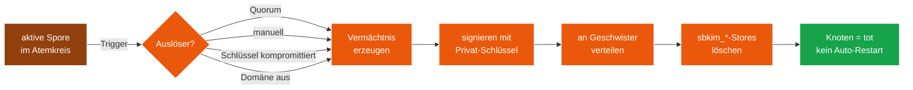

# Modul 07 — Apoptose

> **Status:** 🟫 Schablone  ·  **Schicht:** Kern  ·  **Anker:** Sage-Page → Karte 13 (Eigenschutz)
> **Datei (Code):** `src/modules/07_apoptose.js`
>
> _Selbstlöschung des Knotens mit signiertem Vermächtnis — der saubere
> Tod, der das Mycel warnt, statt es zu vergiften._

---

## Im Mycel-Bild

Apoptose ist im Pilz der **gerichtete, saubere Zelltod**. Wenn eine
Fusionszelle erkennt, dass etwas nicht stimmt — fremdes Material in der
Anastomose, ein kompromittierter Schlüssel — stirbt sie, **bevor** sich
der Schaden ausbreitet. Beim Sterben hinterlässt sie ein **Vermächtnis**:
einen signierten letzten Atemzug, der durch das Mycel weiterwandert. Die
Geschwister erfahren so vom Vorfall und entfernen den Knoten aus ihren
Listen. Das Mycel reinigt sich selbst, ohne Polizei.

---

## Visualisierung



---

## Zweck

Ein Knoten kann sich selbst auflösen. Nach der Auflösung hinterlässt er
ein **signiertes Vermächtnis**, das die letzten verbundenen Geschwister
warnt. Auslöser:

- Quorum-Konsens (zu viele Misstrauensvoten)
- Manuelle Auslösung durch den Betreiber
- Markierung des privaten Schlüssels als kompromittiert
- Domänen-Stilllegung

Nach Apoptose startet der Knoten **nicht** automatisch neu.

---

## Verantwortlichkeiten

**Macht:**
- Auslöser registrieren (vier Wege siehe oben)
- Vermächtnis-Nachricht erzeugen, signieren
- Vermächtnis an alle Geschwister verteilen (best effort)
- IndexedDB-Stores `sbkim_*` löschen (außer optional `sbkim_legacy_outbox`
  für eine konfigurierbare Aufbewahrungsfrist)
- Knoten-Status auf "tot" setzen, Hauptanwendung darüber informieren

**Macht nicht:**
- Keine Reaktivierung, kein Auto-Restart
- Kein Löschen von Endknoten-Anwendungs-Daten (Rezepte bleiben unberührt)
- Keine Vermächtnis-Weiterleitung an Dritte (nur direkte Geschwister)

---

## Schnittstelle

*(noch zu spezifizieren)*

```
init({
  enableLegacyMessage?: boolean,    // default: true
  legacyRetentionDays?: number,     // default: 30
}) → Promise<void>

triggerManual(reason: string) → Promise<void>
markKeyCompromised() → Promise<void>
recordMistrustVote(fromNodeId: string, reason?: string) → Promise<void>

isAlive() → boolean
getLegacyMessage() → LegacyMessage | null
```

### Datenformat: LegacyMessage

*(noch zu spezifizieren)* — Skizze:

```jsonc
{
  "nodeId":      "...",
  "domain":      "...",
  "reason":      "manual" | "quorum" | "keyCompromised" | "domainShutdown",
  "details":     "<freier Text>",
  "siblings":    ["nodeId-1", "nodeId-2", ...],
  "createdAt":   "...",
  "signature":   "..."
}
```

### Konfiguration

```
APOPTOSIS = {
  enableLegacyMessage: true,
  legacyEndpoint: "/sbkim/legacy",
  legacyRetentionDays: 30,
}
QUORUM_MISTRUST_RATIO = 0.5     // 50% der Geschwister → Apoptose (Default, Spec klärt)
```

---

## Manueller Test

1. `tests/manual_check.html`: "Apoptose simuliert manuell auslösen".
   Erwartung: Vermächtnis im Fenster sichtbar, Stores `sbkim_*` leer
   (außer `sbkim_legacy_outbox`), `isAlive()` = false.
2. Knopf "Vermächtnis prüfen": Signatur valid.
3. Mit zweitem Knoten Anastomose, dann Apoptose des ersten: zweiter
   Knoten erhält Vermächtnis und entfernt den ersten aus seiner
   Geschwisterliste.

---

## Risiken & offene Punkte

- Versehentliche Auslösung durch Betreiber → manuelle Auslösung mit
  Doppel-Bestätigung absichern (UI in Modul 08).
- Quorum-Manipulation: ein Angreifer könnte mehrere Fake-Knoten bauen
  und Misstrauen säen → Spec muss klären, wie Quorum-Stimmen gewichtet
  werden (z.B. nur Geschwister mit Mindestalter, signierte Begründung).
- Vermächtnis darf nicht auf eine personenbezogene Identität verweisen.

---

## Bauzustand

| Schritt | Datum | Sitzung | Anmerkung |
|---|---|---|---|
| Karte angelegt | 2026-05-10 | Skelett | leere Schablone |
| Site-Echo | 2026-05-10 | Site-Echo | Hero, Bio-Metapher, Mermaid, Querverweise |
| Spec gefüllt | — | — | — |
| Code geschrieben | — | — | — |
| Sichttest | — | — | — |
| In Endknoten eingebaut | — | — | — |

---

**Querverweise**

- **Abhängigkeiten:** Modul 02 (Spore) · Modul 01 (Storage) · Modul 05 (Anastomose)
- **Wird genutzt von:** Modul 06 (Heterokaryose) — beim Trennen von Geschwistern · Modul 10 (Reputation) — Vermächtnis fließt in Reputations-Decay ein · Modul 12 (Blocklist) — Vermächtnis kann manuelle Sperrung anstoßen
- **Site-Karte:** [Eigenschutz · Karte 13](../../index.html#screen-overview) (Penicillin-Schicht, Vermächtnis-Markierung)
- **Glossar:** [Apoptose](../GLOSSAR.md), [Vermächtnis](../GLOSSAR.md), [Quorum](../GLOSSAR.md)
- **Paper:** Kapitel 16 (Vermächtnis) · Kapitel 17 (Quorum)
- **Integration:** `sbkim_integration.md` §8
