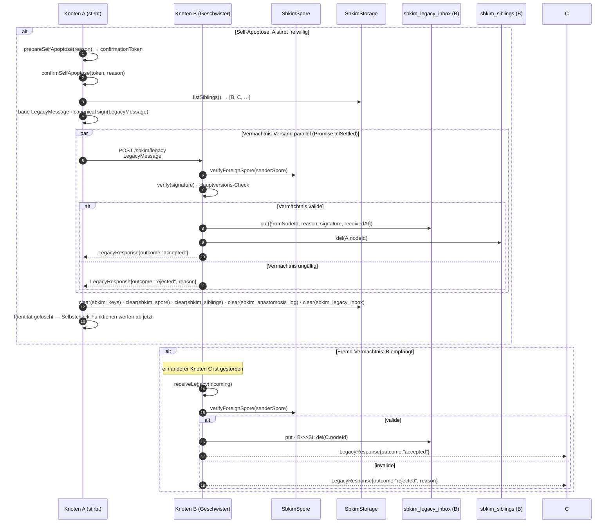

# Modul 07 — Apoptose

> **Status:** 🟦 Code-Stub  ·  **Schicht:** Kern  ·  **Anker:** Sage-Page → Karte 4, Eintrag 07 · Karte 13 (Eigenschutz)
> **Datei (Code):** `src/modules/07_apoptose.js`
>
> _Sauberer Knotentod mit signiertem Vermächtnis. Der scheidende Knoten
> warnt seine Geschwister, vergisst seine eigene Identität, legt fremde
> Vermächtnisse in `sbkim_legacy_inbox` ab, und vergisst stille
> Geschwister nach TTL. Zweite Komposition aus mehreren Modulen — nach
> Modul 05._

---

## Im Mycel-Bild

Apoptose ist im Pilz der **gerichtete, saubere Zelltod**. Kein Hyphenfaden
wächst ewig. Wenn ein Pilzteil stirbt, hinterlässt er **chemische
Zerfallsprodukte**, die seine Nachbarn als Signal aufnehmen — „dort ist
Platz, dort wuchs jemand". Das Mycel reinigt sich selbst, ohne Polizei
und ohne Glocke.

Im SBKIM-Protokoll ist Apoptose der **freiwillige Rückzug** eines
Knotens: der Betreiber schaltet seinen Endknoten ab (Domänen-Wechsel,
Server-Abschaltung, Hörensagen vom Tod des Betreibers, kompromittierter
Schlüssel). Statt einfach zu verschwinden — was die Geschwister rätselraten
ließe — sendet der scheidende Knoten eine **signierte Vermächtnis-
Nachricht** an alle bekannten Geschwister:

> „Ich bin gegangen, hier ist der Grund, hier ist meine Signatur,
> vergiss mich aus deiner Liste."

Bidirektional **asymmetrisch**: der sterbende Knoten sendet einmal an
alle Geschwister; jeder Empfänger speichert das Vermächtnis einseitig in
`sbkim_legacy_inbox` und vergisst den Sender aus `sbkim_siblings`. Es
gibt **kein Gegen-Vermächtnis**, **keine Bestätigung**, **kein
Weiterleiten an Dritte**. Wer das Vermächtnis erhalten hat, weiß
Bescheid; wer es verpasst hat (Tab zu, offline), wird beim nächsten
TTL-Sweep das Schweigen des Verstorbenen als Ablauf erkennen.

Das **TTL-Vergessen** ist die stille Schwester der Apoptose: Geschwister,
die zu lange schweigen — keine erfolgreiche Anastomose seit `SIBLING_MAX_AGE_MS`
— werden vergessen, **ohne** Vermächtnis. Sie sind nicht offiziell
verstorben, sie schweigen nur. Der Pilz vergisst, der Faden trocknet aus,
das Mycel macht weiter.

---

## Visualisierung



---

## Zweck

Apoptose ist die **zweite Komposition** im SBKIM-Code — nach Modul 05
(Anastomose). Sie verbindet Modul 01 (Storage), Modul 02 (Spore) und
indirekt Modul 05 (über `sbkim_siblings` als Lese-Quelle) zu **drei
Funktions-Strängen**:

### a) Self-Apoptose — der eigene Knoten stirbt freiwillig

Der Betreiber löst die Apoptose explizit aus (Domänen-Wechsel, Server-
Abschaltung, kompromittierter Schlüssel). Modul 07 schickt eine
**signierte Vermächtnis-Nachricht** an alle bekannten Geschwister, sammelt
deren Antworten (Best-Effort, parallel via `Promise.allSettled`,
`QUERY_TIMEOUT_MS` pro Empfänger), und löscht anschließend **alle**
lokalen SBKIM-Stores. Nach Self-Apoptose hat der Knoten **keine
Identität** mehr — `getNodeId()` und `getOwnSpore()` werfen
`NoIdentityError`. Es gibt **kein Undo**.

Schutz gegen versehentliches Auslösen: Self-Apoptose ist **zweistufig**.
`prepareSelfApoptose(reason)` liefert einen einmal verwendbaren
`confirmationToken` mit 60 Sekunden Gültigkeit; erst
`confirmSelfApoptose(token, reason)` führt die irreversible Operation
aus. Beim `prepare`-Aufruf erscheint zusätzlich ein
`console.warn("SELF-APOPTOSE VORBEREITET — irreversibel.")`.

### b) Fremd-Vermächtnis empfangen

Ein anderer Knoten ist gestorben und schickt sein Vermächtnis an diesen
Knoten. `receiveLegacy(incoming)` verifiziert die Sender-Spore (via
`SbkimSpore.verifyForeignSpore`), prüft die Hauptversion (analog Modul
05), verifiziert die kanonische Signatur und legt — bei Gültigkeit —
einen Eintrag in `sbkim_legacy_inbox` ab; gleichzeitig wird der Sender
aus `sbkim_siblings` entfernt. `receiveLegacy` **wirft niemals** —
alle Fehlpfade werden als `LegacyResponse{outcome:"rejected", reason}`
zurückgegeben (analog `verifyForeignSpore` aus Modul 02 und
`receiveHandshake` aus Modul 05).

### c) TTL-Vergessen — stille Geschwister vergessen

Geschwister, die zu lange schweigen (keine erfolgreiche Anastomose seit
`SIBLING_MAX_AGE_MS`, Default 30 Tage aus §0), werden automatisch aus
`sbkim_siblings` entfernt — **ohne** Vermächtnis. Sie sind nicht
verstorben, sie schweigen nur. Quelle für „letzte Aktivität" ist
`sbkim_anastomosis_log` (höchstes `ts` mit `outcome ∈ {"established",
"re-handshake"}` pro `peerId`); ohne Log-Eintrag fällt der Vergleich auf
den `since`-Wert aus `sbkim_siblings` zurück.

`forgetExpiredSiblings(maxAgeMs)` ist **explizit** auszulösen — siehe
§ TTL-Verhalten. Modul 07 hat **keinen** `setInterval`, **keine**
Pulsation und **keinen** Selbst-Sweep beim `init()`.

Apoptose ist die *Komposition* — Modul 07 rechnet nicht selbst und
matched nicht, sondern ruft `SbkimSpore`, `SbkimStorage` und die
WebCrypto-Sign-/Verify-Pfade auf, mit denen Modul 02 und 05 schon
arbeiten.

---

## Verantwortlichkeiten

**Macht:**

- Self-Apoptose in **zwei Schritten** auslösen (`prepareSelfApoptose` →
  `confirmSelfApoptose`); irreversibel.
- **Vermächtnis-Nachricht** kanonisch serialisieren und mit dem eigenen
  Ed25519-Schlüssel signieren (über `sbkim_keys["main"]`, kanonischer
  Pfad wie Modul 02 / 05).
- **Versand an alle Geschwister** aus `sbkim_siblings` parallel mit
  `Promise.allSettled` und `AbortController(QUERY_TIMEOUT_MS)` pro
  Empfänger.
- **Eingehendes Vermächtnis** entgegennehmen: Sender-Spore verifizieren,
  Hauptversion prüfen, Signatur prüfen, in `sbkim_legacy_inbox` ablegen,
  Sender aus `sbkim_siblings` entfernen, signierte Response zurückgeben.
- **Lokaler Cleanup** bei Self-Apoptose: `sbkim_keys`, `sbkim_spore`,
  `sbkim_siblings`, `sbkim_anastomosis_log`, `sbkim_legacy_inbox`
  vollständig geleert (alle SBKIM-Stores). `sbkim_doku_meta` bleibt — es
  hängt nicht an der Identität.
- **TTL-Vergessen** auf expliziten Aufruf: `sbkim_siblings`-Einträge mit
  letzter Aktivität älter als `maxAgeMs` löschen. Quelle der „letzten
  Aktivität": `sbkim_anastomosis_log` mit `outcome ∈ {"established",
  "re-handshake"}` pro `peerId`; Fallback auf `sbkim_siblings.since`.
- **`listLegacy()`** als Lese-Helfer für UI / Doku-Fenster (Modul 00 /
  Modul 08): liefert Sender-ID, Grund, Empfangszeit pro Eintrag.

**Macht nicht:**

- **Kein Match.** Modul 07 berührt `SbkimMatch` nicht. Vermächtnis ist
  Identitäts-Operation, keine Bedeutungs-Operation.
- **Kein Embedding.** Kein `SbkimEmbedding`-Aufruf in 07.
- **Kein Handshake.** Modul 07 ruft `SbkimAnastomose.handshake` **nicht**
  auf. Der Vermächtnis-Versand ist ein eigener HTTP-POST gegen
  `/sbkim/legacy` (aus §3), kein Anastomose-Schritt.
- **Kein direkter `indexedDB.open`.** Persistenz strikt über
  `SbkimStorage.{init, get, put, del, all, clear}`. Wer in Modul 07
  IndexedDB direkt anfasst, hat den Vertrag aus Modul 01 zerrissen.
- **Keine Pulsation, keine periodischen Eigenanfragen.** `setInterval`
  ist verboten. TTL-Sweeps werden **explizit** vom Andocker aufgerufen
  — siehe § TTL-Verhalten.
- **Kein Selbst-Sweep im `init()`.** `init()` registriert nur den
  Empfangs-Listener und prüft Abhängigkeiten — TTL läuft **nicht**
  automatisch beim Skript-Laden oder PWA-Start.
- **Keine Multi-Identität.** `confirmSelfApoptose` vergisst *exakt eine*
  Identität: `sbkim_keys["main"]` und `sbkim_spore["main"]`. Es gibt
  keine zweite.
- **Keine Schlüssel-Wiederherstellung.** Nach Self-Apoptose ist der
  private Schlüssel weg. Wer wieder andocken will, durchläuft den
  vollen Andock-Workflow aus Modul 09 — eine **neue** Identität.
- **Kein Vermächtnis-Weiterleiten.** Wenn B ein Vermächtnis von C
  erhält, schickt B es **nicht** an seine eigenen Geschwister weiter.
  Das Vermächtnis ist eine direkte Eins-zu-eins-Nachricht des
  Verstorbenen an seine bekannten Geschwister.
- **Kein Quorum, keine Misstrauensvoten.** Apoptose ist freiwillig
  (Betreiber-Auslöser); ein Quorum-Verfahren — das Vermächtnis von
  *außen* erzwingt — gehört in Modul 10 (Reputation, Schutz-Backlog).

---

## Schnittstelle

Modul 07 exportiert **sechs** öffentliche Funktionen. Alle DB-Operationen
laufen über `window.SbkimStorage`, alle Krypto-Operationen über
`window.SbkimSpore` / WebCrypto-Pfad (analog Modul 02 / 05) — Modul 07
ist die *Komposition*, nicht die *Mechanik*.

```
init() → Promise<void>
  // Prüft Verfügbarkeit von SbkimStorage und SbkimSpore und ruft sie
  // der Reihe nach mit init() auf. Registriert den `message`-Listener
  // für eingehende SBKIM_LEGACY_REQUEST-Nachrichten vom Service-Worker
  // (analog Modul 05).
  // Wirft ApoptoseDependenciesError, wenn ein Modul fehlt.
  // RUFT KEIN forgetExpiredSiblings auf — TTL ist explizit (siehe unten).
  // Idempotent.

prepareSelfApoptose(reason) → Promise<{confirmationToken, expiresAt, recipientCount}>
  // Erster Schritt der irreversiblen Operation (global, Brief 04 der
  // V1-Sammelspec-Kaskade: confirmSelfApoptose wirkt über ALLE
  // Identitäten). Erzeugt einen Ein-Mal-Token (16 zufällige Bytes,
  // base64url ohne Padding) mit 60 Sekunden Gültigkeit. Iteriert
  // SbkimSpore.listIdentities() und liest pro Persona
  // sbkim_siblings_<key>; recipientCount ist die Summe aller
  // Geschwister über alle Identitäten. Stösst einen
  // console.warn("SELF-APOPTOSE VORBEREITET — irreversibel, ALLE
  // Identitäten, Token gültig 60s") an. Verbraucht den Token NICHT —
  // der Aufrufer muss explizit confirmSelfApoptose aufrufen.
  // reason: deutschsprachiger Klartext, z.B. "Domain stillgelegt".
  // Für Single-Identitäts-Apoptose siehe SbkimSpore.removeIdentity(key,
  // {force:true}) — Modul 02 ist Owner, ruft Modul 07's internen
  // Hook _sendLegacyForIdentity für den Vermächtnis-Versand pro
  // Persona.

confirmSelfApoptose(token, reason) → Promise<{outcome, recipientsNotified, recipientsFailed}>
  // Zweiter Schritt — irreversibel + global (Brief 04). Prüft Token-
  // Gültigkeit (vorhanden, nicht abgelaufen, identisches reason).
  // Bei Erfolg:
  //   1. Pro Persona <key> aus listIdentities():
  //      1a. baue LegacyMessage mit der Identität <key> (kanonisch
  //          signiert mit dem zugehörigen Ed25519-Schlüssel aus
  //          sbkim_keys[<key>]).
  //      1b. Lese sbkim_siblings_<key> → versende an alle dieser
  //          Persona parallel via Promise.allSettled mit
  //          AbortController(QUERY_TIMEOUT_MS) pro Empfänger.
  //          Empfänger, die outcome:"accepted" antworten, landen
  //          in recipientsNotified; Timeout/Netz/invalide Signatur/
  //          outcome:"rejected" → recipientsFailed. Empfänger einer
  //          Persona, die in mehreren Personae als Geschwister
  //          vorkommen, erhalten pro Persona ein eigenes Vermächtnis
  //          und tauchen entsprechend mehrfach in der Liste auf.
  //   2. Lokaler Cleanup, sequenziell — pro Persona <key>:
  //        clear(sbkim_siblings_<key>) →
  //        clear(sbkim_anastomosis_log_<key>) →
  //        clear(sbkim_legacy_inbox_<key>) →
  //        clear(sbkim_hetero_inbox_<key>) →
  //        clear(sbkim_hetero_outbox_<key>).
  //      Dann einmal (außerhalb der Persona-Schleife):
  //        clear(sbkim_spore) (alle Slots) →
  //        clear(sbkim_keys) (alle Slots) →
  //        del(sbkim_meta["active-identity"]) →
  //        SbkimSpore.resetIdentityCache().
  //      Identität ist die letzte Bastion; resetIdentityCache leert
  //      Modul 02's In-Memory-identityCache, ohne den der Cache die
  //      alte nodeId weiter ausliefern würde (Pflege-Sitzung
  //      2026-05-15). sbkim_doku_meta bleibt unangetastet.
  //   3. return {outcome:"completed", recipientsNotified,
  //      recipientsFailed}. Nach diesem Return gibt es keine
  //      Identität mehr — Folge-Aufrufe von Spore/Apoptose werfen
  //      NoIdentityError bzw. ApoptoseAlreadyExecutedError;
  //      listIdentities() liefert [].
  // Wirft InvalidApoptoseTokenError bei ungültigem/abgelaufenem
  // Token. Wirft ApoptoseAlreadyExecutedError, wenn keine Identität
  // mehr existiert (listIdentities().length === 0). Versand-Fehler
  // einzelner Empfänger werfen NICHT — sie landen in
  // recipientsFailed. Storage-Fehler beim Cleanup werden unverändert
  // durchgereicht (Knoten ist dann in einem inkonsistenten Zustand —
  // siehe § Risiken).

receiveLegacy(incomingLegacy) → Promise<LegacyResponse>
  // Wird vom Service-Worker aufgerufen, sobald ein /sbkim/legacy
  // POST eingegangen ist. incomingLegacy ist das geparste JSON-
  // Body-Objekt.
  //   1. Form-Check (Pflichtfelder), sonst Response
  //      outcome:"rejected", reason:"Form ungültig".
  //   2. verifyForeignSpore(senderSpore) → {valid:false} ⇒
  //      Response outcome:"rejected", reason:<deutsch>.
  //   3. Hauptversions-Check → Mismatch ⇒ Response
  //      outcome:"rejected",
  //      reason:"Inkompatible Hauptversion: <x.y>".
  //   4. Signatur gegen senderSpore.publicKey verifizieren ⇒ bei
  //      Fehler Response outcome:"rejected",
  //      reason:"Signatur ungültig".
  //   4b. Receiver-Map nodeId→key (Brief 04 der V1-Sammelspec-Kaskade):
  //       incomingLegacy.toNodeId wird gegen alle eigenen Identitäten
  //       geprüft (Map beim init() gebaut). Treffer → <hit-key> ist
  //       die getroffene Persona für diese Operation. Kein Treffer →
  //       Response outcome:"rejected", reason:"toNodeId stimmt nicht
  //       zum Empfänger".
  //   5. sbkim_legacy_inbox_<hit-key>.put({fromNodeId, reason,
  //      signature, receivedAt}), sbkim_siblings_<hit-key>.del(fromNodeId).
  //      Andere Identitäten bleiben unangetastet.
  //   6. Response outcome:"accepted", receiverSpore der getroffenen
  //      Persona + Signatur kanonisch.
  // Wirft NIEMALS — alle Fehlpfade werden als
  // LegacyResponse{outcome:"rejected", reason} zurückgegeben
  // (analog Modul 02 verifyForeignSpore und Modul 05
  // receiveHandshake).

listLegacy(key?: string) → Promise<Array<{fromNodeId, reason, receivedAt}>>
  // Default-Parameter key=SbkimSpore.getActiveIdentityKey() (Brief 04).
  // Lädt alle Einträge aus sbkim_legacy_inbox_<key>. Reihenfolge:
  // Storage-natürlich (nach Schlüssel = fromNodeId). signature wird
  // bewusst weggelassen (Lese-Helfer für UI / Modul 00 / Modul 08).
  // Persona-übergreifende Sicht: Aufrufer iteriert listIdentities()
  // (INTERFACES.md § 9.2).

forgetExpiredSiblings(maxAgeMs, key?: string) → Promise<Array<{nodeId, lastSeen}>>
  // Default-Parameter key=SbkimSpore.getActiveIdentityKey() (Brief 04).
  // TTL-Sweep pro Persona. Lädt sbkim_siblings_<key> +
  // sbkim_anastomosis_log_<key>, berechnet pro Geschwister die
  // letzte erfolgreiche Anastomose (höchstes ts mit outcome ∈
  // {"established", "re-handshake"} und peerId == sibling.nodeId);
  // Fallback sibling.since. Geschwister mit (now - lastActivity) >
  // maxAgeMs werden via SbkimStorage.del(sbkim_siblings_<key>, nodeId)
  // gelöscht — KEIN Vermächtnis. Rückgabe: Array der gelöschten
  // Geschwister mit ihrer letzten Aktivitäts-Zeit.
  // maxAgeMs: Pflicht-Parameter (kein Default in der Signatur);
  // der Aufrufer übergibt SIBLING_MAX_AGE_MS aus §0 — siehe
  // § Konfigurationswerte.
  // Idempotent: zweimaliger Aufruf in Folge liefert beim zweiten
  // Mal das leere Array. Wer einen Knoten-weiten Sweep braucht,
  // iteriert listIdentities() und ruft die Funktion pro Slot.
```

### Selbstcheck

Beim **Skript-Laden** (synchron, vor jeglichem Aufruf):

```
console.info("MODUL 07 APOPTOSE bereit, Funktionen: init/prepareSelfApoptose/confirmSelfApoptose/receiveLegacy/listLegacy/forgetExpiredSiblings");
```

Wie Modul 01 / 02 / 04 / 05 — die Meldung signalisiert „Modul geladen",
nicht „Identität existiert" oder „Geschwister da". `SIBLING_MAX_AGE_MS`,
`ENDPOINT.legacy` und die Versions-Konstante werden in der Selbstcheck-
Zeile bewusst **nicht** wiederholt (stehen verbindlich in §0 / §3).

Die irreversible Natur von `confirmSelfApoptose` wird **nicht** im
Skript-Lade-Selbstcheck angekündigt — sie erscheint erst beim Aufruf von
`prepareSelfApoptose` als `console.warn`, damit der Skript-Lade-Selbstcheck
ruhig bleibt (Klaus-Konvention: ein Modul, eine Zeile).

### Konfigurationswerte

```
PROTOCOL_VERSION       = "0.1"                          // aus INTERFACES.md §0, Hauptversions-Check
QUERY_TIMEOUT_MS       = 4000                           // aus INTERFACES.md §0, Timeout pro Empfänger beim Vermächtnis-Versand
SIBLING_MAX_AGE_MS     = 30 * 24 * 60 * 60 * 1000       // aus INTERFACES.md §0, Default 30 Tage (Spec-Sitzung 07)
ENDPOINT.legacy        = "/sbkim/legacy"                // aus INTERFACES.md §3
APOPTOSE_TOKEN_TTL_MS  = 60_000                         // 60 Sekunden, Modul-lokal — kurz genug für Bestätigungs-UI, lang genug für menschliche Reaktion
```

**Entscheidung Spec-Sitzung 07 — `SIBLING_MAX_AGE_MS` in §0 (Variante A):**
Die Konstante steht **global in §0 INTERFACES.md**, nicht modul-lokal in
Karte 07. Begründung in vier Punkten:

1. **Konsistenz mit `PROVIDER_MIN_MATCH`, `QUERY_TIMEOUT_MS` und
   `PROTOCOL_VERSION`.** §0 ist die *eine Quelle* aller protokoll-
   relevanten Konstanten; ein Modul-lokaler Wert würde diese Konvention
   brechen.
2. **Querschnitts-Anschluss für Modul 06 / Modul 11.** Modul 06
   (Heterokaryose) und Modul 11 (Rate-Limit, Schutz-Backlog) lesen
   ebenfalls `sbkim_siblings` — sie sollen denselben „aktiv"-Begriff
   teilen. Wer die TTL ändert, ändert sie an *einer* Stelle.
3. **Additive Änderung — kein Hauptversions-Sprung.** §0 erlaubt
   additive Erweiterung um Konstanten; das ist *nicht* dasselbe wie ein
   Pflichtfeld-Hinzufügen an einem Datenformat.
4. **`status.json.config` zieht nach.** Die Sage-Page liest §0 aus
   `status.json.config`; Variante A liefert den Wert dort automatisch
   mit, ohne dass die Site eine Sonderbehandlung für Modul-lokale
   Konstanten braucht.

`APOPTOSE_TOKEN_TTL_MS` bleibt **Modul-lokal** in Karte 07 — es ist eine
UI-Detail-Konstante (Bestätigungs-Fenster zwischen `prepare` und
`confirm`), nicht protokoll-relevant.

### Datenformate

**LegacyMessage** (kanonisches JSON; alphabetisch sortierte Keys,
Signatur über die Form **ohne** `signature`-Feld):

```jsonc
{
  "fromNodeId":      "<base64url-sha256-rawpub des Senders>",
  "nonce":           "<base64url, 16 zufällige Bytes>",
  "protocolVersion": "0.1",
  "reason":          "<deutscher Klartext, z.B. 'Domain stillgelegt'>",
  "senderSpore":     { /* SporeJson, vom Sender signiert (Modul 02) */ },
  "signature":       "<base64url-ed25519-sig über kanonisches JSON ohne signature>",
  "timestamp":       "2026-05-14T07:00:00.000Z"           // ISO-8601 UTC, Sender beim Bauen
}
```

**LegacyResponse** (kanonisches JSON; alphabetisch sortiert):

```jsonc
{
  "fromNodeId":      "<Empfänger-nodeId>",
  "nonceEcho":       "<gleiches nonce wie in der Vermächtnis-Nachricht>",
  "outcome":         "accepted",       // oder "rejected"
  "protocolVersion": "0.1",
  "reason":          "<deutscher Fehlertext, nur bei rejected>",
  "receiverSpore":   { /* SporeJson, vom Empfänger signiert */ },
  "signature":       "<base64url-ed25519-sig über kanonisches JSON ohne signature>",
  "timestamp":       "2026-05-14T07:00:00.450Z",
  "toNodeId":        "<Sender-nodeId>"
}
```

**`sbkim_legacy_inbox["<fromNodeId>"]`** (Storage-Wert pro empfangenem
Vermächtnis — Schreiber 07, Form aus Karte 01):

```jsonc
{
  "fromNodeId":      "<base64url-sha256-rawpub>",
  "reason":          "<deutscher Klartext aus LegacyMessage.reason>",
  "signature":       "<base64url-ed25519-sig vom Sender>",
  "receivedAt":      "2026-05-14T07:00:00.450Z"          // ISO-8601 UTC, Empfänger beim Schreiben
}
```

`senderSpore` wird im Storage **nicht** aufbewahrt — sie wurde bei
`receiveLegacy` einmal verifiziert; die Signatur reicht als Audit-Spur,
weil sie über das Vermächtnis-JSON inklusive `fromNodeId` legitimiert
ist. Das hält den Store schlank (eine 384-float `domainVector` plus
JSON-Wrapper pro Geschwister-Tod wäre Verschwendung).

Versionierungs-Regel: LegacyMessage und LegacyResponse folgen
[INTERFACES.md §4](../INTERFACES.md). Pflichtfelder dürfen ab Status
`entwurf` nur additiv erweitert werden; das Hinzufügen eines Pflichtfelds
erfordert den Schritt von `protocolVersion: "0.x"` auf `"1.0"`.

---

## Apoptose-Pfad (Schritt-für-Schritt, JSON-Ebene)

### Sender-Seite — Self-Apoptose (A stirbt freiwillig)

```
 1. A: prepareSelfApoptose(reason)
      - generate confirmationToken (16 zufällige Bytes, base64url)
      - speichere {token, reason, expiresAt} im Modul-internen State
      - console.warn("SELF-APOPTOSE VORBEREITET — irreversibel, Token gültig 60s")
      - return {confirmationToken, expiresAt, recipientCount: listSiblings().length}

 2. A: confirmSelfApoptose(token, reason)
      - token vorhanden? nicht abgelaufen? reason identisch? sonst InvalidApoptoseTokenError.
      - getOwnSpore() → SporeJson(A); getOrCreateIdentity() für privateKey-Zugriff.
      - siblings = await SbkimStorage.all("sbkim_siblings").

 3. A: baue LegacyMessage:
      { fromNodeId, nonce, protocolVersion, reason, senderSpore: SporeJson(A),
        timestamp, signature }
      Signatur kanonisch über Form ohne signature, Ed25519 mit eigenem privateKey.

 4. A: parallel via Promise.allSettled:
      for sibling in siblings:
        AbortController(QUERY_TIMEOUT_MS)
        fetch POST sibling.endpoint + "/sbkim/legacy", body: LegacyMessage (JSON)
        - parse Response
        - verifyForeignSpore(response.receiverSpore) → valid?
        - response.signature gegen receiverSpore.publicKey prüfen
        - response.outcome === "accepted"? → recipientsNotified.push(sibling.nodeId)
        - sonst (Timeout, Netz, Sig invalid, outcome rejected) → recipientsFailed.push({nodeId, reason})

 5. A: lokaler Cleanup (sequenziell, in dieser Reihenfolge):
      - SbkimStorage.clear("sbkim_siblings")
      - SbkimStorage.clear("sbkim_anastomosis_log")
      - SbkimStorage.clear("sbkim_legacy_inbox")
      - SbkimStorage.clear("sbkim_hetero_inbox")          // neu zwischen Schritt 3 und Schritt 4 — Bau-Sitzung 06 + Cleanup-Pflege 07 (2026-05-15)
      - SbkimStorage.clear("sbkim_spore")
      - SbkimStorage.clear("sbkim_keys")                  // zuletzt — Identität ist die letzte Bastion
      - SbkimSpore.resetIdentityCache()                   // Cache-Invalidate; Pflicht ab Pflege-Sitzung 2026-05-15.
                                                          // Ohne diesen Aufruf liefert SbkimSpore.getNodeId
                                                          // weiter die alte nodeId aus Modul 02's In-Memory-
                                                          // identityCache, trotz leerem Storage.
      sbkim_doku_meta bleibt unangetastet.

 6. A: return {outcome:"completed", recipientsNotified, recipientsFailed}.
    Ab jetzt: jeder Aufruf von Spore-/Apoptose-Funktionen wirft.
```

### Empfänger-Seite — Fremd-Vermächtnis (B empfängt von C)

```
 7. B: receiveLegacy(body):
      verifyForeignSpore(body.senderSpore) → invalid? Response rejected, reason aus verifyForeignSpore.

 8. B: Hauptversion-Check (body.protocolVersion gegen lokale PROTOCOL_VERSION)
      → Mismatch? Response rejected, reason: "Inkompatible Hauptversion: <x.y>".

 9. B: Signatur prüfen — kanonische Form ohne signature gegen body.senderSpore.publicKey
      → ungültig? Response rejected, reason: "Signatur ungültig".

10. B: sbkim_legacy_inbox.put(body.fromNodeId, {fromNodeId, reason, signature, receivedAt: now()}).
    B: sbkim_siblings.del(body.fromNodeId) — Sender vergessen, ohne Vermächtnis-Weiterleitung.

11. B: baue LegacyResponse + Signatur kanonisch, Response 200 JSON.
```

Reihenfolge **verbindlich**: Spore vor Hauptversion vor Signatur vor
Storage-Schreib. Wer Spore- oder Versions-Mismatch hat, soll keinen
inbox-Eintrag erzeugen.

---

## TTL-Verhalten

`forgetExpiredSiblings(maxAgeMs)` ist **explizit auszulösen** — Modul 07
hat **keinen** `setInterval`, **keinen** Selbst-Sweep im `init()` und
**keine** Pulsation. Das ist die direkte Folge der Anti-Pulsations-Regel
aus Modul 05 und der CLAUDE.md-Konvention „kein Crawler, keine
Pulsation, keine Eigenanfragen ins offene Netz".

**Entscheidung Spec-Sitzung 07 — Variante (c): Trigger explizit durch
den Andocker.** Der Andocker (Endknoten-PWA: Rezeptbuch, Mixarium)
ruft `await SbkimApoptose.forgetExpiredSiblings(SIBLING_MAX_AGE_MS)`
selbst auf. Empfohlen:

- **Nach jedem erfolgreichen `SbkimAnastomose.handshake`** — der Andocker
  hat gerade einen aktiven Netz-Schritt ausgeführt, ein TTL-Sweep ist
  semantisch zusammenhängend („Mycel atmet, also reinige es jetzt").
- **Auf einem versteckten Modul-00-Doku-Fenster-Knopf** („Stille
  Geschwister vergessen") — sichtbar nur nach den 5 Klicks; Klaus kann
  den Sweep manuell auslösen, ohne dass er für den Endnutzer sichtbar ist.

Begründung der Wahl gegen Variante (a) „beim PWA-Start im `init()`":
TTL-Verhalten würde sich versteckt zwischen Skript-Laden und erstem
Anastomose-Versuch einschieben — ein Andocker, der den Code liest, sähe
es nicht, weil `init()`-Verhalten konventionell nur „Abhängigkeiten
prüfen, Listener registrieren" bedeutet. Variante (b) „periodisch via
`setInterval`" ist explizit ausgeschlossen (siehe oben). Variante (c)
macht das Verhalten **lesbar**: der Andocker entscheidet, wann ein
Sweep passt.

**Konsequenz für Karte 09 (Einbau-PWA):** Karte 09 muss in einer
Folge-Pflege-Sitzung um einen **Schritt 9** ergänzt werden — „TTL-Sweep
nach Handshake oder auf Doku-Fenster-Knopf". Bis dahin bleibt
`forgetExpiredSiblings` *bereit, aber ungenutzt*. Das ist okay: ohne
TTL-Sweep wächst `sbkim_siblings` nur, wenn neue Geschwister dazukommen
— bei Klaus' aktuellem Netz (drei Nutzer, zwei Endknoten) ist das
unkritisch. Vermerk in „Was offen blieb" am Sitzungs-Ende.

**Berechnungs-Regel für `lastActivity`:**

```
für jedes sibling in sbkim_siblings:
  logEntries = sbkim_anastomosis_log entries mit peerId == sibling.nodeId
                AND outcome ∈ {"established", "re-handshake"}
  if logEntries leer:
    lastActivity = sibling.since
  else:
    lastActivity = max(logEntries[*].ts)
  if (now - lastActivity) > maxAgeMs:
    sbkim_siblings.del(sibling.nodeId)
    result.push({nodeId, lastSeen: lastActivity})
```

Der `since`-Fallback fängt den Edge-Case ab, dass ein Geschwister sofort
nach dem Erst-Handshake stumm wird (z.B. weil A das Sibling per
`forgetSibling` selbst entfernt hat — dann fehlt der Log-Eintrag nicht,
aber die Logik bleibt sauber).

---

## Multi-Identität (Brief 04)

Spec-Sitzung Multi-Identität (Brief 04 der V1-Sammelspec-Kaskade,
2026-05-19) trennt Modul 07 in zwei klar getrennte Pfade:

### Globale Self-Apoptose (Knoten stirbt — alle Personae)

`confirmSelfApoptose(token, reason)` wirkt **global**: alle Personae
des Knotens sterben gemeinsam. Pro Persona wird ein eigenes
Vermächtnis signiert (mit dem zugehörigen Schlüssel aus
`sbkim_keys[<key>]`) und an die Geschwister aus `sbkim_siblings_<key>`
verschickt. Cleanup iteriert über alle Slots (siehe § Schnittstelle ›
`confirmSelfApoptose` Schritt 2). Nach Abschluss ist
`SbkimSpore.listIdentities()` leer; `sbkim_meta["active-identity"]`
ist gelöscht.

Empfänger, die in mehreren Personae als Geschwister auftauchen,
erhalten pro Persona ein eigenes Vermächtnis und tauchen entsprechend
mehrfach in `recipientsNotified`/`recipientsFailed` auf.

### Single-Identitäts-Apoptose (eine Persona stirbt — andere leben weiter)

`SbkimSpore.removeIdentity(key, {force:true})` ist der per-Persona-
Pfad. Modul 02 ist Owner; Modul 07 wird nur für den Vermächtnis-
Versand pro Persona gerufen — interner Hook
`_sendLegacyForIdentity(key, reason)`. Cleanup-Reihenfolge in Modul
02 (siehe INTERFACES.md § 1 Modul 07 § Cleanup-Reihenfolge — Per-
Persona-Pfad):

```
1. _sendLegacyForIdentity(key, reason)  ← Vermächtnis pro Persona
2. clear(sbkim_siblings_<key>)
3. clear(sbkim_anastomosis_log_<key>)
4. clear(sbkim_legacy_inbox_<key>)
5. clear(sbkim_hetero_inbox_<key>)
6. clear(sbkim_hetero_outbox_<key>)  ← best-effort
7. sbkim_spore.del(<key>)
8. sbkim_keys.del(<key>)
9. ggf. neue active-identity setzen (siehe Modul 02 § removeIdentity)
10. SbkimSpore.resetIdentityCache()
```

Bei `removeIdentity(<inactive>, {force:false})` (Default) wird der
Slot **nicht** als aktive Identität markiert; trotzdem wird KEIN
Vermächtnis verschickt — eine inaktive Persona wird nur lokal
vergessen, sie ist nicht „gestorben". Die Aufrufer-Disziplin: für
Vermächtnis-Versand muss `force:true` gesetzt UND die Persona als
aktiv markiert sein (oder per `setActiveIdentity` vorher gewechselt
werden). Modul 02 implementiert die Logik; Modul 07 liefert nur den
Hook.

### Receiver-Pfad (eingehende Vermächtnisse)

`receiveLegacy(incomingLegacy)` baut beim `init()` eine Map nodeId→key
aus allen eigenen Identitäten (`SbkimSpore.listIdentities()` ×
`getOrCreateIdentity`). Pro eingehendem Vermächtnis wird
`incomingLegacy.toNodeId` gegen die Map geprüft (siehe § Schnittstelle
› `receiveLegacy` Schritt 4b). Treffer → das Vermächtnis landet in
`sbkim_legacy_inbox_<hit-key>` und der entsprechende
`sbkim_siblings_<hit-key>[fromNodeId]` wird gelöscht. Andere Personae
bleiben unangetastet.

### TTL-Sweep und `listLegacy` pro Persona

`forgetExpiredSiblings(maxAgeMs, key?)` und `listLegacy(key?)` haben
ab Brief 04 einen optionalen `key`-Parameter (Default: aktive
Identität). Wer einen Knoten-weiten Sweep / Lese-Pfad braucht,
iteriert `listIdentities()` und ruft die Funktion pro Slot.

### Bezugs-Verweise

- **INTERFACES.md § 1 Modul 07** — vollständige Vertrags-Form mit
  Cleanup-Reihenfolge globally und per-Persona.
- **INTERFACES.md § 9 Identitäts-Map** — verbindliche Spec-Klausel
  mit Slot-Schema, Persona-Isolation, Receiver-Pfad.
- **Karte 02 § Multi-Identität (Brief 04)** — `removeIdentity` als
  Aufruf-Owner; Hook-Vertrag zu Modul 07.
- **PULS § Vision-Anker 6** (Multi-Identität — Haupt-Anker).

---

## Fehlerverhalten

| Lage | Reaktion |
|---|---|
| `init()`: ein Abhängigkeits-Modul fehlt (`SbkimStorage` / `SbkimSpore` nicht auf `window`) | wirft `ApoptoseDependenciesError` mit Liste der fehlenden Module. |
| `prepareSelfApoptose()`: keine Identität (`getNodeId` wirft `NoIdentityError`) | unverändert durchgereicht. Kein Token erzeugt. |
| `confirmSelfApoptose()`: Token unbekannt / abgelaufen / `reason` weicht ab | wirft `InvalidApoptoseTokenError`. Kein Versand, kein Cleanup. |
| `confirmSelfApoptose()`: Identität fehlt (Self-Apoptose schon ausgeführt) | wirft `ApoptoseAlreadyExecutedError`. |
| `confirmSelfApoptose()`: einzelner Empfänger antwortet mit Timeout / Netz-Fehler / ungültiger Signatur / `outcome:"rejected"` | **kein** Throw. Empfänger landet in `recipientsFailed`. Versand an andere Empfänger läuft weiter (Promise.allSettled). |
| `confirmSelfApoptose()`: Storage-Fehler beim Cleanup (z.B. `QuotaExceededError` aus `clear`) | unverändert durchgereicht. Knoten ist in inkonsistentem Zustand: Vermächtnis bereits versendet, aber lokale Stores nicht vollständig geleert. Siehe § Risiken. |
| `receiveLegacy()`: jegliche Form-/ Signatur-/ Versions-/ Spore-Verletzung | **wirft niemals**. Alles als `LegacyResponse{outcome:"rejected", reason:"<deutsch>"}` zurück (analog `verifyForeignSpore` und `receiveHandshake`). |
| `receiveLegacy()`: Storage-Fehler beim `sbkim_legacy_inbox.put` oder `sbkim_siblings.del` | **wirft niemals nach außen**. Response `outcome:"rejected", reason:"interner Speicherfehler"`; der Original-Storage-Fehler landet in `console.error` für Debugging. |
| `listLegacy()` / `forgetExpiredSiblings()`: Storage-Fehler aus Modul 01 | unverändert durchgereicht (z.B. `StorageUnavailableError`). |
| `forgetExpiredSiblings()`: `maxAgeMs` fehlt / ist ≤ 0 | wirft `InvalidTtlError`. Kein Sweep. (Spec-Wille: der Aufrufer muss den Wert bewusst aus §0 mitgeben.) |
| `receiveLegacy()`: `toNodeId` stimmt mit keiner eigenen Identität überein (Receiver-Map nach Brief 04) | **wirft niemals**. Response `outcome:"rejected", reason:"toNodeId stimmt nicht zum Empfänger"`. Kein Storage-Eingriff. |
| `_sendLegacyForIdentity(key, reason)` (interner Hook für Modul 02 `removeIdentity`-Pfad): Aufruf für unbekannte Identität | wirft `UnknownIdentityError` — Modul 02 prüft das vor dem Hook-Aufruf, der Hook ist defensiv abgesichert. |

Alle SBKIM-Fehler sind `Error`-Instanzen mit sprechendem `name` und
deutschsprachigem `message`. **Wichtig:** semantische Ablehnung (Spore
ungültig, Signatur falsch, Hauptversion inkompatibel) ist **kein**
Throw bei `receiveLegacy` — sie ist *Outcome*. Das hält den Pfad
parallel zu `verifyForeignSpore` und `receiveHandshake`.

---

## Manueller Test

Skizze für ein späteres Panel 07 in `tests/manual_check.html`. Die
Knöpfe entstehen in der Bau-Sitzung Modul 07 — diese Spec-Sitzung
benennt nur, was geprüft werden soll:

1. **Lokaler Vermächtnis-Round-Trip ohne Netz** — zwei In-Memory-
   Identitäten in derselben PWA (analog zur Setup-Logik in Panel 05).
   A baut eine LegacyMessage, B führt `_invokeReceiveLegacyDirect`
   aus (Test-Brücke der Bau-Sitzung, analog `_invokeDirect` in Modul
   05). Erwartung: `outcome:"accepted"`, B hat einen Eintrag in
   `sbkim_legacy_inbox`, B hat den A-Eintrag aus `sbkim_siblings`
   entfernt.
2. **Signatur-Manipulation** — LegacyMessage nachträglich ein Feld
   ändern (z.B. `reason`-String anhängen). Erwartung: `receiveLegacy`
   antwortet `outcome:"rejected", reason:"Signatur ungültig"`,
   `sbkim_legacy_inbox` bleibt unverändert.
3. **Versions-Mismatch** — LegacyMessage mit `protocolVersion: "1.0"`
   füttern. Erwartung: `outcome:"rejected", reason:"Inkompatible
   Hauptversion: 1.0"`. Kein Inbox-Eintrag.
4. **TTL-Cleanup** — Setup mit zwei Geschwistern, eines mit
   `since`-Wert in der Vergangenheit (z.B. 31 Tage), eines frisch.
   `forgetExpiredSiblings(30*24*60*60*1000)` aufrufen. Erwartung:
   das alte Geschwister ist weg, das frische bleibt, Rückgabe-Array
   enthält genau einen Eintrag.
5. **`listLegacy`** — nach drei Vermächtnis-Empfängen prüfen, dass
   alle drei Einträge mit `{fromNodeId, reason, receivedAt}` erscheinen
   und die `signature` aus der Storage-Wert-Form *nicht* in der UI-
   Antwort auftaucht.
6. **Self-Apoptose mit zwei in-memory Geschwistern** — Setup mit zwei
   Pseudo-Geschwistern (über `_setOwnDomainVector`-Bridge analog
   Modul 05), `prepareSelfApoptose("Test")` → Token, dann
   `confirmSelfApoptose(token, "Test")`. Beide Geschwister müssen
   eine LegacyMessage empfangen haben (Test-Bridge ruft
   `receiveLegacy` direkt auf jedem Pseudo-Knoten auf, ohne Netz).
   Erwartung: `outcome:"completed"`, `recipientsNotified.length === 2`,
   `sbkim_keys` / `sbkim_spore` / `sbkim_siblings` /
   `sbkim_anastomosis_log` / `sbkim_legacy_inbox` lokal leer. Folge-
   Aufruf `SbkimSpore.getNodeId()` wirft `NoIdentityError`.
7. **Token-Ablauf** — `prepareSelfApoptose("X")`, 61 Sekunden warten
   (oder Test-Bridge zur Zeit-Manipulation), dann
   `confirmSelfApoptose(token, "X")`. Erwartung:
   `InvalidApoptoseTokenError`. Identität bleibt.
8. **`receiveLegacy` mit unbekanntem Sender** — LegacyMessage von
   einem Knoten, der **nicht** in `sbkim_siblings` steht. Erwartung:
   `outcome:"accepted"`, Inbox-Eintrag wird angelegt, `sbkim_siblings.del`
   bleibt idempotent (kein Fehler, kein Eintrag). Damit Apoptose nicht
   darauf angewiesen ist, dass Sender und Empfänger sich vorher
   handshaked haben.
9. **Selbstcheck Konsole prüfen** — Hinweisknopf ohne Aktion:
   `MODUL 07 APOPTOSE bereit, Funktionen: init/prepareSelfApoptose/confirmSelfApoptose/receiveLegacy/listLegacy/forgetExpiredSiblings`
   muss beim Laden in der Konsole stehen.

Voraussetzungen für das spätere Panel: Modul 01, 02 müssen geladen
sein (Skript-Tag-Reihenfolge). Modul 03/04/05 werden nicht gebraucht,
weil Apoptose nicht matched und nicht handshakt. Der Netz-Pfad
(Service-Worker + fetch) ist im manuellen Test bewusst **nicht**
abgedeckt — der echte Netz-Test gehört in den Einbau in Rezeptbuch +
Mixarium (Bau-Sitzung 09 mit aktivem Apoptose-Knopf in der UI-Demo).

---

## Risiken & offene Punkte

- **Self-Apoptose-Irreversibilität.** Nach `confirmSelfApoptose` ist
  der private Ed25519-Schlüssel weg. Wer wieder andocken will, muss den
  vollen Andock-Workflow aus Modul 09 durchlaufen und bekommt eine
  **neue** `nodeId`. Die Geschwister, die das Vermächtnis erhalten
  haben, müssen erneut handshaken (mit der neuen Identität). Das ist
  *gewollt* — Apoptose ist Tod, nicht Schlaf. Schutz: zweistufiges
  Verfahren mit Token (60s) plus `console.warn`. Eine UI-seitige
  Doppel-Bestätigung (Modul 08 / Modul 09) ergänzt das, ersetzt es
  aber nicht.
- **Vermächtnis-Spam — Modul 11 (Schutz-Backlog).** Ein bösartiger
  Knoten könnte mass-LegacyMessages an alle Knoten schicken, die er
  je gesehen hat. Modul 07 hat keinen Replay-Schutz und kein Rate-Limit
  — `nonce` ist im Schema, aber die Erst-Spec prüft Wiederholungen
  **nicht** aktiv (analog Modul 05 `nonce`). Aktiver Replay-Schutz
  mit nonce-Cache und ein Pro-Peer-Rate-Limit gehören in **Modul 11
  (Rate-Limit, Schutz-Backlog)**, nicht in Modul 07. Bis Modul 11 da
  ist: bei einem Andocker, der unter Beschuss gerät, schickt der
  Empfänger trotzdem `outcome:"accepted"` für jedes valid signierte
  Vermächtnis — was lokal nur Inbox-Wachstum bedeutet, kein
  Identitätsschaden.
- **TTL-Drift — was wenn ein Knoten 30 Tage offline war, aber wieder
  kommt?** Genau das Re-Handshake-Verhalten aus Modul 05 heilt das:
  der wiederkehrende Knoten klopft mit der gleichen Spore an, der
  Empfänger trägt ihn (falls schon vergessen) als *frischen* Geschwister
  wieder ein (mit neuem `since`). Das alte Vermächtnis-Inbox-Eintrag,
  falls vorhanden, bleibt stehen — beide Welten koexistieren ruhig.
  Bei Klaus' Netz unkritisch; für ein größeres Netz ist das ein
  Aufhänger für eine spätere Spec-Sitzung „Vermächtnis-Reaktivierung"
  (Vermächtnis-Eintrag löschen, wenn der gleiche `fromNodeId` wieder
  handshakt). Diese Sitzung schiebt es auf.
- **Signatur-Stabilität bei kanonischer Serialisierung.** LegacyMessage
  und LegacyResponse nutzen denselben kanonischen Signatur-Pfad wie
  Modul 02 Spore und Modul 05 HandshakeRequest/Response — alphabetisch
  sortierte Keys (rekursiv), Form ohne `signature`-Feld, UTF-8 →
  Uint8Array → Ed25519. Wer eine andere JSON-Library benutzt, die nicht
  sortiert serialisiert, bricht die Signatur. Verbindlicher Hinweis
  in der Bau-Sitzung 07: gleicher Sign/Verify-Pfad wie 02/05, **nicht**
  re-erfinden. Idealerweise wird der `canonicalize`-Helfer aus
  `src/modules/02_spore.js` (oder `src/modules/05_anastomose.js`)
  geteilt — entweder per `window.SbkimSpore._canonicalize`-Export oder
  per dupliziertem Code-Pfad analog Bau-Sitzung 05.
- **Inkonsistenter Zustand bei Cleanup-Fehler.** Wenn
  `confirmSelfApoptose` die Vermächtnisse erfolgreich versendet, aber
  der lokale `clear`-Aufruf an einem Store fehlschlägt (z.B.
  `QuotaExceededError` mitten im Lauf), bleibt der Knoten in einem
  Zwitter-Zustand: Geschwister haben ihn als „verstorben" markiert,
  lokal hat er aber noch Identität. Modul 07 wirft den Storage-Fehler
  unverändert weiter — der Aufrufer (UI in Modul 08 / Modul 09) muss
  das als „bitte erneut aufrufen" anzeigen. Eine *transaktionale*
  Cleanup-Sequenz (alle clears in einer IndexedDB-Transaktion) wäre
  sauberer, ist aber Modul-01-Aufgabe und nicht Teil dieser Spec.
  Aufhänger für eine spätere Pflege-Sitzung Modul 01 oder Modul 07.
- **Versand-Latenz vs. Cleanup-Zeitpunkt.** Versand und Cleanup laufen
  sequenziell — *erst* `Promise.allSettled` (alle Empfänger antworten
  oder timeout-en), *dann* Cleanup. Mit `QUERY_TIMEOUT_MS = 4000` und N
  Geschwistern dauert das maximal `4000 ms` (parallel). Bei Klaus'
  Netz (2-5 Geschwister) unkritisch; ein Andocker mit hunderten von
  Geschwistern könnte die UI hängen sehen — Aufhänger für eine spätere
  Pflege-Sitzung „Vermächtnis-Versand in Chunks".
- **Lücke-Befund: keine fehlende Helfer-Funktion in 01–05.** Modul 07
  braucht: `SbkimStorage.{init, get, put, del, all, clear}` (alle da),
  `SbkimSpore.{getOrCreateIdentity, getOwnSpore, getPublicKeyJwk,
  verifyForeignSpore, getNodeId}` (alle da), den kanonischen Sign-Pfad
  aus 02/05 (in 05 bewusst dupliziert — Modul 07 spiegelt das). Keine
  API-Korrektur an 01–05 nötig. **Aber:** ein
  `SbkimStorage.clear`-Aufruf an *einem* Store löscht alle Einträge in
  *diesem* Store; einen Modul-übergreifenden „clear all sbkim_*"-
  Helfer gibt es nicht. Modul 07 ruft `clear` fünfmal sequenziell —
  bewusst kein neuer Helfer in 01, weil Modul 07 die *einzige* Stelle
  ist, die das braucht. Wenn eine spätere Sitzung (Pflege „Reset")
  denselben Bedarf hat, kann der Helfer dort gehoben werden.
- **Stille Löschung ohne Vermächtnis.** Wenn der Nutzer im Browser
  „Site-Daten löschen" wählt oder der Browser bei Speicherdruck die
  IndexedDB ungefragt räumt, läuft die Apoptose-Routine **nicht** —
  sie braucht einen aktiven Knoten, um das signierte Vermächtnis zu
  schreiben und an Geschwister zu senden. Der Knoten verschwindet
  still. Geschwister merken es erst am ablaufenden TTL (Modul 11)
  oder am ausbleibenden Anastomose-Atemkreis. **Gegenmaßnahmen
  (außerhalb von Modul 07):**
  - **Modul 01 Storage:** `navigator.storage.persist()` beim `init()`
    — schützt vor ungefragter Quota-Eviction.
  - **Modul 02 Spore:** Backup-Export (passwort-verschlüsselt) —
    schützt vor manuellem Löschen und Browser-Wechsel.
  - **Modul 00 Doku-Fenster:** stille Frühwarnung bei knapper Quota.

  Diese drei Maßnahmen senken das Risiko, lösen es aber nicht
  vollständig. Das Paper akzeptiert die stille Löschung als
  realistische Schwäche — das Mycel hat keine Hooks gegen einen
  bewusst löschenden Nutzer. **Querschnitts-Anmerkung:** Drei Module
  plus das Doku-Fenster tragen das Persistenz-Thema gemeinsam; die
  vier Stellen müssen beim Bauen konsistent bleiben (Quota-
  Schwellwert, Backup-Format, Warntext). Siehe PULS-Eintrag
  „Querschnitts-Fragen — Spore-Persistenz-Strategie verteilt".

---

## Bauzustand

| Schritt | Datum | Sitzung | Anmerkung |
|---|---|---|---|
| Karte angelegt | 2026-05-10 | Skelett | leere Schablone |
| Site-Echo | 2026-05-10 | Site-Echo | Hero, Bio-Metapher, Mermaid (Quorum-Skizze, in dieser Sitzung ersetzt), Querverweise |
| Spec gefüllt | 2026-05-14 | Spec 07 | Sechs-Funktionen-API (`init/prepareSelfApoptose/confirmSelfApoptose/receiveLegacy/listLegacy/forgetExpiredSiblings`); zweistufiges Self-Apoptose-Verfahren mit 60s-Token gegen versehentliches Auslösen; LegacyMessage/LegacyResponse-Schema mit kanonischer Ed25519-Signatur (Pfad gespiegelt aus Modul 02/05); `sbkim_legacy_inbox`-Wert verbindlich gemäß Karte 01; Apoptose-Pfad in 11 Schritten (Sender 1–6, Empfänger 7–11); TTL-Trigger explizit durch Andocker (Variante c) — kein `setInterval`, kein Selbst-Sweep im `init()`; `SIBLING_MAX_AGE_MS = 30 * 24 * 60 * 60 * 1000` als globale Konstante in §0 (Variante A) — additiv, kein Hauptversions-Sprung; Vermächtnis-Empfänger-Kreis: alle Geschwister parallel via `Promise.allSettled`, `recipientsNotified` / `recipientsFailed` getrennt; `receiveLegacy` wirft niemals (analog `verifyForeignSpore`); Fehlertabelle mit zehn Lagen; Manueller Test mit neun Punkten; Risiken-Block mit sieben Punkten (Irreversibilität, Spam → Modul 11, TTL-Drift, Signatur-Stabilität, inkonsistenter Cleanup, Versand-Latenz, Lücke-Befund); offene Folge-Pflege-Sitzung: Karte 09 um Schritt 9 (TTL-Sweep-Aufruf) ergänzen |
| Code geschrieben | 2026-05-14 | Bau 07 | `src/modules/07_apoptose.js` als IIFE mit `window.SbkimApoptose`, sechs öffentliche Funktionen (`init/prepareSelfApoptose/confirmSelfApoptose/receiveLegacy/listLegacy/forgetExpiredSiblings`); fünf benannte Error-Klassen (`ApoptoseDependenciesError`, `InvalidApoptoseTokenError`, `ApoptoseAlreadyExecutedError`, `InvalidTtlError`, `LegacyTimeoutError`/`LegacyNetworkError` für einzelne Versand-Versuche — landen in `recipientsFailed`, werden nicht nach außen geworfen); `NoIdentityError` aus Modul 02 unverändert durchgereicht. Frage 1 entschieden: kanonischer Sign/Verify-Pfad (canonicalize/base64url/signEnvelope/verifyEnvelope) **bewusst aus Modul 02 + 05 dritter Pfad dupliziert** — Single-File-PWA-Stil, kein Eingriff in 02/05. Frage 2 entschieden: Test-Brücken-Surface = `_invokeReceiveLegacyDirect`, `_buildSignedLegacyMessage`, `_addPseudoSibling`, `_clearPseudoSiblings`, `_advanceTokenClock` (Token-Ablauf-Test ohne 61s Wartezeit) plus `_canonicalize`/`_base64urlEncode`/`_base64urlDecode`/`_signEnvelope`/`_verifyEnvelope`. Frage 3 entschieden: **ein gemeinsamer `fetch`-Listener** in `src/sbkim-sw.js` für `/sbkim/anastomosis` und `/sbkim/legacy` (Variante a, leichter erweiterbar für Modul 06/11). Self-Apoptose-Token im Modul-Closure (16 Bytes via `crypto.getRandomValues`, base64url ohne Padding, 60s TTL, `console.warn` beim `prepare`-Aufruf); Cleanup sequenziell siblings → log → inbox → spore → keys (`sbkim_doku_meta` bleibt). `receiveLegacy` wirft niemals (Form-/Spore-/Versions-/Signatur-/Storage-Fehler werden als `outcome:"rejected"` zurückgegeben). Service-Worker erweitert: Body-Schutz (405/415/413/503) für beiden Pfade, Page-Brücke via MessageChannel mit Message-Typ `SBKIM_LEGACY_REQUEST`. `tests/manual_check.html` Panel 07 mit 10 Knöpfen gefüllt (Setup + 8 Test-Punkte aus Karte 07 § Manueller Test + Selbstcheck-Hinweis). `node --check src/modules/07_apoptose.js` und `node --check src/sbkim-sw.js` grün; alle Inline-Script-Blöcke in `tests/manual_check.html` syntaktisch validiert. |
| Sichttest | 2026-05-15 | Klaus + Pflege 02+07-Cache-Invalidate + Re-Sichttest | geprüft 2026-05-15 (Klaus, im Browser): Setup OK · Test 1 (Vermächtnis-Round-Trip) `outcome:accepted, inbox_hat_eintrag:true, sender_aus_siblings_entfernt:true` · Test 2 (Signatur-Manipulation) `outcome:rejected, reason:"Signatur ungültig"` · Test 3 (Versions-Mismatch) `reason:"Inkompatible Hauptversion: 1.0"` · Test 4 (TTL-Cleanup) entfernt altOld, behält altYoung · Test 5 (listLegacy) signature weggelassen, Form korrekt · Test 7 (Token-Ablauf) `InvalidApoptoseTokenError, Identität bleibt` · Selbstcheck-Zeile in DevTools-Konsole. **Test 6 (Self-Apoptose) zeigte echten Modul-Bug** — `outcome:completed, stores_alle_leer:true`, ABER `getNodeId_wirft_NoIdentityError:false`. Modul 02's In-Memory-`identityCache` wurde nicht durch externes `storage.clear` invalidiert; Modul 07 löschte alle SBKIM-Stores sequenziell, wusste aber nichts von Modul 02's Cache. **Folgeschaden:** Tests 1/2/3/8 nach Test 6 schlugen fehl mit „Keine Identität in sbkim_keys[main]". **Pflege-Sitzung 2026-05-15** ergänzt Modul 02 um öffentliche Funktion `resetIdentityCache() → void` (sync, idempotent, leert nur den Closure-Cache, kein Storage-Eingriff); Modul 07's confirmSelfApoptose-Cleanup ruft sie als Schritt 6 nach den fünf `storage.clear`-Aufrufen. Karte 02 + Karte 07 § Schnittstelle + INTERFACES.md §1 Modul 02 + §1 Modul 07 + §6 ziehen mit. **Sauberere Lösung von vier Optionen** (saubere Vertrag-Trennung: Modul 02 kennt keine Apoptose, bietet aber den Hook; performance-neutral; additiv; Spec-disziplinär — kein Trick). **8/8 Tests grün** nach Pflege 02+07-Cache-Invalidate. Klaus' Re-Sichttest 2026-05-15 lieferte für Test 6: `getNodeId_wirft_NoIdentityError:true` (vorher: `false` — Cache-Bug behoben), `outcome:completed, stores_alle_leer:true, recipientsFailed.length:2, recipientsNotified.length:0` — Pass-Check erfüllt. |
| Pflege Cache-Invalidate | 2026-05-15 | Pflege 02+07-Cache-Invalidate | Karte 07 § Schnittstelle (`confirmSelfApoptose`-Schritt-3-Block) + § Apoptose-Pfad (Schritt 5 Cleanup-Reihenfolge) um zusätzlichen Cleanup-Schritt `SbkimSpore.resetIdentityCache()` ergänzt — Pflicht ab dieser Pflege-Sitzung. Modul 07 Code: nach den fünf `storage.clear`-Aufrufen + den eigenen Cache-Invalidations (`ownPrivateKeyCache = null; pseudoSiblings = null;`) wird `getSpore().resetIdentityCache()` als Schritt 6 gerufen (mit `typeof`-Guard für Rückwärts-Lauffähigkeit, falls Modul 02 noch alte Version geladen ist). `node --check src/modules/07_apoptose.js` grün. status.json unverändert (kein Score-Wechsel). |
| Pflege Cleanup-Reihenfolge Bau 06 | 2026-05-15 | Bau 06 + Cleanup-Pflege 07 | Karte 07 § Schnittstelle (`confirmSelfApoptose`-Schritt-3-Block) + § Apoptose-Pfad Sender-Seite Schritt 5 um zusätzlichen `sbkim_hetero_inbox`-Cleanup-Schritt zwischen `sbkim_legacy_inbox` und `sbkim_spore` erweitert (additive Position vor der Identitäts-Schicht). Modul 07 Code: `HETERO_INBOX_STORE`-Konstante neu, `CLEANUP_ORDER` von fünf auf sechs Einträge erweitert (Position 4 zwischen `INBOX_STORE` und `SPORE_STORE`); `confirmSelfApoptose` löscht jetzt sechs Stores sequenziell, gefolgt von `resetIdentityCache()`. INTERFACES.md §1 Modul 07 § Storage Cleanup-Reihenfolge zieht mit (sechs Schritte plus `resetIdentityCache`). `node --check src/modules/07_apoptose.js` grün. **Test 6 in Panel 07** muss in einem Folge-Sichttest neu durchgespielt werden — die Anzahl der zu prüfenden leeren Stores ist um eins (`sbkim_hetero_inbox`) gestiegen; die bestehende `keys+spore+siblings+log+inbox`-Pass-Check-Zeile in Panel 07 ist additiv erweiterbar. status.json unverändert (kein Score-Wechsel für Modul 07; der Score-Wechsel betrifft Modul 06). |
| Spec Multi-Identität (Brief 04) | 2026-05-19 | Spec Multi-Identität | Strang 3 der V1-Sammelspec-Kaskade (Brief 04; Brief 03-PR #98 als gemerged vorausgesetzt). Karte 07 erweitert: § Schnittstelle (`prepareSelfApoptose` summiert Empfänger über alle Personae; `confirmSelfApoptose` wirkt **global**, Versand pro Persona mit eigenem Schlüssel + Cleanup-Schleife über alle Slots; `receiveLegacy` Schritt 4b Receiver-Map nodeId→key + Schritt 5 auf `sbkim_legacy_inbox_<hit-key>` / `sbkim_siblings_<hit-key>`; `listLegacy(key?)` und `forgetExpiredSiblings(maxAgeMs, key?)` um optionalen key-Parameter erweitert); neuer Top-Level-§ „Multi-Identität (Brief 04)" mit Globale Self-Apoptose-Pfad + Single-Identitäts-Apoptose-Pfad (interner Hook `_sendLegacyForIdentity` für Modul 02 `removeIdentity`-Aufrufe) + Receiver-Pfad + TTL-/listLegacy-pro-Persona + Bezugs-Verweise; § Fehlerverhalten um zwei neue Zeilen erweitert (`toNodeId`-Mismatch in `receiveLegacy` als Outcome, nicht Throw; `_sendLegacyForIdentity`-Hook `UnknownIdentityError`). **§ Konfigurationswerte, § Datenformate, § Apoptose-Pfad-Schritte 1-4 / Empfänger-Seite, § TTL-Verhalten unverändert** (Spec-Wille bleibt; die Multi-Identitäts-Schicht ist transparente Aufrufer-Iteration). INTERFACES.md §1 Modul 07 (Bietet-Block + Nutzt-Block + Storage-Pattern + Cleanup-Reihenfolge global + Per-Persona-Cleanup + Selbstcheck-Hinweis + Garantien-Erweiterung) + § 9 Identitäts-Map nachgezogen. **PROTOCOL_VERSION bleibt `"0.1"`** — additive Storage-Schema-Erweiterung, kein Spore-Schema-Eingriff, LegacyMessage/LegacyResponse-Schema unverändert (toNodeId ist bereits Pflichtfeld in der bestehenden Spec). **`status.json` unverändert** — Modul 07 bleibt `score:"stub"` (additive Spec-Erweiterung am Karten-Vertrag, kein Code-Bau, kein Score-Wechsel; `update_puls_pie.py` NICHT aufgerufen). **Kein Code** in `src/modules/07_apoptose.js` — Bau-Folge-Sitzung 07.Y folgt als eigene Phase (Cleanup-Schleife + Per-Persona-Hook + Receiver-Map). |
| In Endknoten eingebaut | — | — | — |

---

**Querverweise**

- **Abhängigkeiten:** Modul 01 (Storage) · Modul 02 (Spore — kanonischer Signatur-Pfad, Identitäts-Singleton, `verifyForeignSpore`) · indirekt Modul 05 (`sbkim_siblings` als Lese-Quelle für Vermächtnis-Empfänger und für TTL-Sweep; Modul 07 ruft `SbkimAnastomose` **nicht** auf)
- **Wird genutzt von:** Modul 06 (Heterokaryose — darf voraussetzen, dass abgelaufene Geschwister verschwinden, sobald Andocker `forgetExpiredSiblings` regelmäßig ruft) · Modul 00 (Doku-Fenster — UI-Anker „Stille Geschwister vergessen" + Inbox-Anzeige) · Modul 08 (UI-Demo — Panel 07) · Modul 09 (Einbau-PWA — TTL-Sweep-Aufruf nach Handshake) · Modul 10 (Reputation, Schutz-Backlog — Vermächtnis-Flagge fließt in Decay) · Modul 11 (Rate-Limit, Schutz-Backlog — aktiver Replay-Schutz für Vermächtnis-Spam) · Modul 12 (Blocklist, Schutz-Backlog — Vermächtnis kann manuelle Sperrung anstoßen)
- **Site-Karte:** [Karte 4 · Module-Bento](../../index.html#screen-overview), Eintrag 07 · [Karte 13 · Eigenschutz](../../index.html#screen-overview) (Vermächtnis-Markierung, TTL-Pfad)
- **Glossar:** [Apoptose](../GLOSSAR.md), [Vermächtnis](../GLOSSAR.md), [Geschwister](../GLOSSAR.md), [Schweigen als Routing](../GLOSSAR.md)
- **Integration:** `sbkim_integration.md` §8 (Vermächtnis-Pattern)
- **Paper:** Kapitel 16 (Vermächtnis) · Kapitel 17 (Quorum — bewusst aus dieser Spec ausgeschlossen, gehört in Modul 10)
- **Interfaces:** [`INTERFACES.md` §0 (`SIBLING_MAX_AGE_MS`)](../INTERFACES.md) · [`§1 → Modul 07_apoptose`](../INTERFACES.md) · [`§2 Vermächtnis (Legacy)`](../INTERFACES.md) · [`§3 Endpunkt-Pfade (legacy: /sbkim/legacy)`](../INTERFACES.md) · [`§4 Versionierungs-Regeln`](../INTERFACES.md)
