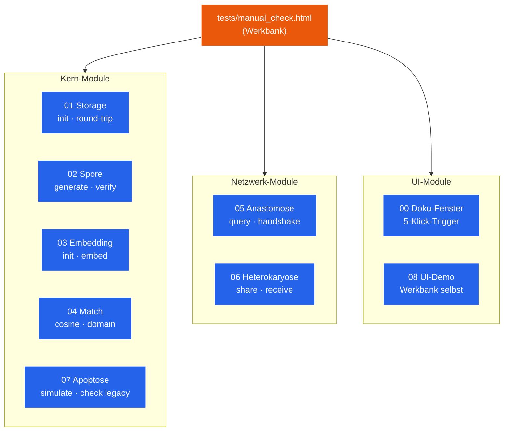

# Modul 08 — UI-Demo

> **Status:** 🟧 In Werkstatt  ·  **Schicht:** UI  ·  **Anker:** Sage-Page → Karte 4, Eintrag 08
> **Datei (Code):** `src/modules/08_ui_demo.js` + `tests/manual_check.html`
>
> _Manuelle Sichtprüfungs-Werkstatt — pro Modul ein Knopf, ein
> Ausgabe-Fenster, ein Sichttest. Kein Framework, keine Magie._

---

## Im Mycel-Bild

UI-Demo ist die **Werkstatt-Bank**: ein einziger Tisch, auf dem jedes
Modul einmal angeschaltet, ausgelöst und visuell beurteilt werden kann.
Hier wird nicht produktiv gerödelt — hier wird **gesehen**, ob etwas
funktioniert. Die Datei `tests/manual_check.html` ist der Tisch, Modul 08
ist die Werkbank-Logik dahinter: Knopfreihen, Ausgabe-Bereiche,
Status-Lampen.

---

## Visualisierung



---

## Zweck

`tests/manual_check.html` ist die zentrale **Sichtprüfungs-Seite** dieses
Repos. Modul 08 liefert die Knöpfe und Status-Anzeigen, mit denen jedes
einzelne Modul angetriggert und das Ergebnis sichtbar gemacht wird.

Diese Seite **ist** der Smoke-Test. Sie ist kein automatisches Test-
Framework — der Mensch klickt, der Mensch bewertet.

---

## Verantwortlichkeiten

**Macht:**
- Pro Modul mindestens einen Knopf, der dessen Hauptfunktion ausführt
- Ein Ausgabefenster (`<pre>` oder `<div>`), in das jedes Modul sein
  Ergebnis schreibt
- Eine Statuszeile pro Modul (geladen / nicht geladen / fehler)
- Keine Frameworks (kein React, kein Vue) — reines HTML+JS, eine Datei

**Macht nicht:**
- Keine produktive UI für Endknoten-Apps (das machen Rezeptbuch und
  Mixarium selbst)
- Kein Styling über das nötigste hinaus (das hier ist Werkstatt)

---

## Schnittstelle

*(noch zu spezifizieren — minimal)*

```
addPanel(moduleName: string, controls: Array<{
  label: string,
  action: () => Promise<any>,
}>)
log(moduleName: string, line: string)
setStatus(moduleName: string, status: "ok"|"warn"|"err", text: string)
```

---

## Manueller Test

Die Datei `tests/manual_check.html` *ist* der manuelle Test. Sie öffnet
sich im Browser ohne Server (`file://`) oder über einen lokalen Server
(`python3 -m http.server`).

---

## Risiken & offene Punkte

- Service-Worker (für Modul 05) braucht HTTPS oder `localhost` — unter
  `file://` nicht testbar. Hinweis prominent in der Seite.
- Embedding-Modell (Modul 03) braucht beim ersten Lauf Internet.

---

## Bauzustand

| Schritt | Datum | Sitzung | Anmerkung |
|---|---|---|---|
| Karte angelegt | 2026-05-10 | Skelett | leere Schablone |
| Stub `tests/manual_check.html` angelegt | 2026-05-10 | Skelett | nur Gerüst |
| Site-Echo | 2026-05-10 | Site-Echo | Hero, Bio-Metapher, Mermaid-Werkbank, Querverweise |
| Spec gefüllt | — | — | — |
| Code geschrieben | — | — | — |
| Sichttest | — | — | — |

---

**Querverweise**

- **Abhängigkeiten:** alle anderen Module (locker, Knopf-pro-Modul)
- **Wird genutzt von:** alle Spec/Bau-Sitzungen als Sichtprüfungs-Tisch
- **Site-Karte:** [Karte 4 · Module-Bento](../../index.html#screen-overview), Eintrag 08
- **Glossar:** [Sichttest](../GLOSSAR.md), [Werkstatt](../GLOSSAR.md)
- **Andere Karten:** jede Komponenten-Karte hat einen "Manueller Test"-Abschnitt, der zu einem Knopf in dieser Seite wird
