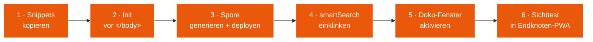

# Modul 09 — Einbau in bestehende PWA

> **Status:** 🟫 Schablone  ·  **Schicht:** Anleitung (kein JS-Modul)  ·  **Anker:** Sage-Page → Karte 4, Eintrag 09 · Karte 10 (Andocken)
> **Datei:** diese Karte *ist* die Anleitung
>
> _Wie ein in Sage-Protokol entwickeltes Modul oder die Gesamtschicht
> in eine bestehende PWA einzubauen ist. Adressaten: Rezeptbuch,
> Mixarium und alle künftigen Endknoten._

---

## Im Mycel-Bild

Modul 09 ist die **Andock-Anleitung**: wie aus einer schon laufenden
PWA ein Mycel-Knoten wird, ohne dass die App ihre eigene Funktion
verliert. Die SBKIM-Schicht legt sich **um** die bestehende Suche
herum, nicht durch sie hindurch — die App weiß weiterhin, was sie tut,
und SBKIM atmet daneben. Der Endknoten bleibt souverän, das Mycel ist
optional.

---

## Visualisierung

---

## Zweck

Diese Karte beschreibt, wie ein in Sage-Protokol entwickeltes Modul
oder die Gesamtschicht in eine bestehende PWA eingebaut wird. Adressaten
sind die Endknoten-Apps des Betreibers:

- **Rezeptbuch** (Domäne: Kochrezepte)
- **Mixarium** (Domäne: Cocktails / Drinks)

Die Anleitung orientiert sich an `sbkim_integration.md`, ist aber auf
den Reife- und Bauzustand dieses Repos abgestimmt.

---

## Vor dem Einbau zu klärende Werte (pro Endknoten)

| Wert | Rezeptbuch | Mixarium |
|---|---|---|
| `<DOMAIN>` | (TBD) | (TBD) |
| `<KNOTENNAME>` | "Rezeptbuch Klaus" | "Mixarium Klaus" |
| `<KNOTENTYP>` | hybrid | hybrid |
| `<DOMÄNEN-BESCHREIBUNG>` | TBD (1–3 Sätze) | TBD (1–3 Sätze) |
| `<DOMÄNEN-STICHWORTE>` | TBD (5–15 Begriffe) | TBD (5–15 Begriffe) |
| `<INDEX-DATEI>` | `index.html` | `index.html` |
| `<SUCH-SYMBOL-SELEKTOR>` (für Modul 00) | TBD | TBD |
| `<LOKALE-SUCHFUNKTION>` (Name in der App) | TBD | TBD |

---

## Einbau-Schritte (Skizze, Spec füllt aus)

1. **Modul-Snippets aus `src/modules/` kopieren** in die Endknoten-PWA
   (eingebettet in den `<script>`-Block oder als externe `.js`-Dateien).
2. **Initialisierungs-Block** vor `</body>` einfügen
   (`Sbkim.init({...})`-Aufruf mit obigen Werten).
3. **Spore generieren** (einmalig) und unter
   `/.well-known/sbkim/spore.json` ablegen (oder Alias für GitHub Pages).
4. **Suchfunktion einklinken** — `smartSearch()`-Wrapper um die
   bestehende lokale Suche.
5. **Doku-Fenster aktivieren** — Modul 00 mit dem Such-Symbol-Selektor.
6. **Sichttest in Endknoten-PWA** — 5-Klick-Doku öffnet sich, Spore
   abrufbar, eine Test-Anfrage von außen wird korrekt beantwortet
   oder ignoriert.

---

## Nach dem Einbau zu pflegen

- `docs/PULS.md` in Sage-Protokol: Endknoten-Tabelle aktualisieren
  ("integriert: ja, Stand 2026-MM-DD").
- `status.json` `endknoten[].integrated` → `true` setzen, `url` füllen.
- Bei Domain- oder Domänenwechsel: Spore neu generieren und neu
  deployen.
- Bei Protokoll-Versions-Update in Sage-Protokol: Endknoten nachziehen.

---

## Was nicht in den Endknoten gehört

- Keine Test-Knöpfe aus `tests/manual_check.html` in die
  Produktiv-App übernehmen.
- Keine Konsolen-Logs auf `info`-Level für jeden Match (nur Fehler).
- Kein Auto-Reveal der Doku — die 5-Klick-Geste ist Pflicht.

---

## Bauzustand

| Schritt | Datum | Sitzung | Anmerkung |
|---|---|---|---|
| Karte angelegt | 2026-05-10 | Skelett | leere Schablone |
| Site-Echo | 2026-05-10 | Site-Echo | Hero, Bio-Metapher, Schritt-Flow, Querverweise |
| Spec gefüllt | — | — | — |
| Werte für Rezeptbuch eingetragen | — | — | — |
| Werte für Mixarium eingetragen | — | — | — |
| Erstmaliger Einbau Rezeptbuch | — | — | — |
| Erstmaliger Einbau Mixarium | — | — | — |

---

**Querverweise**

- **Abhängigkeiten:** alle Module, sobald sie eine erste stabile Version haben
- **Wird genutzt von:** Endknoten-Repos (Rezeptbuch, Mixarium) — nicht intern
- **Site-Karte:** [Karte 4 · Module-Bento](../../index.html#screen-overview), Eintrag 09 · [Karte 10 · Andocken](../../index.html#screen-overview) (Live-Generator)
- **Glossar:** [Endknoten](../GLOSSAR.md), [Hub](../GLOSSAR.md), [smartSearch](../GLOSSAR.md)
- **Integration:** `sbkim_integration.md` (Originalleitfaden)
- **Schnittstellen:** [INTERFACES.md](../INTERFACES.md) (Modul-Verträge)
