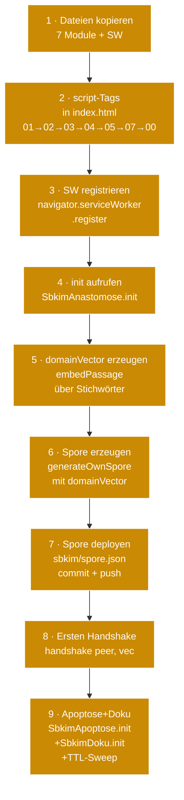

# Modul 09 — Einbau in bestehende PWA

> **Status:** 🟨 Spec fertig  ·  **Schicht:** Anleitung (kein JS-Modul)  ·  **Anker:** Sage-Page → Karte 4, Eintrag 09 · Karte 10 (Andocken)
> **Datei:** diese Karte *ist* die Anleitung — kein JS unter `src/`
>
> _Wie aus dem Sage-Protokoll-Hub (Spec + Code-Stubs) ein produktiv
> andockendes Rezeptbuch oder Mixarium wird. Module kopieren, Spore mit
> `domainVector` erzeugen, Service-Worker registrieren, ersten
> Handshake auslösen._

---

## Im Mycel-Bild

Andocken ist die **Initiations-Phase** im Pilz-Modell: ein neuer Pilz
schiebt seine erste Hyphen ins Substrat. Vier Dinge passieren in dieser
einen Bewegung — alle vier müssen gelingen, sonst ist der Pilz nicht da:

1. **Singleton-Identität** anlegen (Modul 02 erzeugt ein Ed25519-
   Schlüsselpaar in der Browser-IndexedDB; die `nodeId` ist deterministisch
   aus dem Public Key abgeleitet).
2. **Domänen-Vektor erzeugen** (Modul 03 läuft einmalig, `embedPassage`
   über die Domänen-Stichwörter ergibt 384 Floats, L2-normalisiert).
3. **Spore publizieren** (Modul 02 baut die signierte Visitenkarte, der
   Andocker kopiert sie nach `<endknoten>/sbkim/spore.json` und deployt).
4. **Empfangsmund öffnen** (Modul 05 + `sbkim-sw.js` registriert: der
   Service-Worker fängt POSTs auf `/sbkim/anastomosis` ab, reicht sie an
   die Page, die Page antwortet signiert).

Erst wenn alle vier stehen, ist der Endknoten **andockbar**. Wer
einen Schritt überspringt, hat einen Pilz ohne Mund, ohne Visitenkarte
oder ohne Identität — und das Mycel zieht vorbei.

**Wichtig:** die Singleton-Identität ist an den **Origin** gebunden.
Eine PWA unter `https://klaus.github.io/rezeptbuch/` und eine unter
`https://klaus.github.io/mixarium/` sind aus Sicht des Browsers zwei
verschiedene Origins mit zwei verschiedenen IndexedDBs — sie erhalten
zwei verschiedene `nodeId`-Werte, zwei verschiedene Spores, zwei
verschiedene Schlüsselpaare. Das ist Spec-Wille, kein Bug.

---

## Visualisierung



Die neun Schritte sind **linear** und einmalig pro Endknoten. Schritte
1–4 sind Einbau (Code), Schritte 5–7 sind Identitäts- und Spore-Aufbau
(Daten), Schritt 8 ist der erste Live-Test gegen ein Geschwister,
**Schritt 9 schaltet Vermächtnis-Empfang (Apoptose) und das versteckte
5-Klick-Doku-Fenster scharf** (Pflege-Sitzung 2026-05-15, jetzt
verbindlich im Andock-Pfad).

---

## Zweck

Diese Karte beschreibt, wie ein in Sage-Protokol entwickeltes Modul
oder die Gesamtschicht in eine bestehende PWA eingebaut wird. Adressaten
sind die Endknoten-Apps des Betreibers:

- **Rezeptbuch** (Domäne: Kochrezepte)
- **Mixarium** (Domäne: Cocktails / Drinks)

Anders gesagt: hier steht, wie aus dem Sage-Protokoll-Hub (Spec +
Code-Stubs) eine produktiv andockende Endknoten-PWA wird. Die Anleitung
orientiert sich an `sbkim_integration.md`, ist aber auf den Reife- und
Bauzustand dieses Repos abgestimmt — die Code-Module 01/02/03/04/05
sind als Stubs verfügbar, der Service-Worker liegt als `src/sbkim-sw.js`
bereit, die Anastomose ist als Variante A · Page-Hosted gebaut.

**Was diese Karte nicht macht:** den Bau der Module selbst beschreiben
— das steht in den jeweiligen Karten 01–05. Karte 09 ist die
*Bündel-Anleitung* für den Andocker, nicht die Modul-Doku.

---

## Verantwortlichkeiten

**Macht:**
- Module 01/02/03/04/05/07/00 als `<script>`-Tags in den Endknoten
  einbauen (Reihenfolge verbindlich; Modul 00 zuletzt, weil es die
  anderen fail-soft als optionale Lese-Quellen prüft).
- Service-Worker `sbkim-sw.js` im Endknoten-Root deployen und mit
  korrektem Scope registrieren.
- Domänen-Stichwörter sammeln, `domainVector` einmalig mit
  `SbkimEmbedding.embedPassage` erzeugen.
- Spore mit `domainVector` über `SbkimSpore.generateOwnSpore` bauen und
  unter `sbkim/spore.json` statisch deployen.
- Ersten Handshake gegen ein bekanntes Geschwister auslösen und das
  Ergebnis sichtprüfen.
- Bei Domain- oder Domänenwechsel: Spore neu generieren und neu
  deployen (Identität bleibt, nur Meta-Felder ändern sich).

**Macht nicht:**
- **Keine Modul-Änderungen.** Karte 09 baut nur ein, modifiziert nicht.
  Wer einen Bug in Modul 01–05 findet, hebt eine Bau-Sitzung im
  Sage-Protokoll-Repo, nicht im Endknoten-Repo.
- **Kein Singleton-Bruch.** Eine PWA = eine Identität. Wer eine zweite
  Identität braucht, legt eine zweite PWA an (anderer Origin).
- **Keine Eigenanfragen ins offene Netz.** Der erste Handshake (Schritt
  8) wird vom Andocker **explizit** mit einer bekannten Peer-URL
  ausgelöst — kein Crawler, keine Discovery, keine Pulsation.
- **Kein Auto-Update der Spore.** Wenn die Domäne sich ändert, deployt
  der Andocker eine neue Spore manuell — kein automatisches
  Re-Publishing.
- **Keine Test-Knöpfe in der Produktiv-App.** `tests/manual_check.html`
  bleibt im Sage-Protokoll-Repo.
- **Keine `info`-Logs für Match-Treffer.** Nur Fehler. Selbstcheck-
  Zeilen beim Modul-Laden sind okay (passieren einmalig).
- **Kein Auto-Reveal der Doku.** Die 5-Klick-Geste aus Modul 00 ist
  Pflicht (sobald Modul 00 spezifiziert ist).

---

## Vor dem Einbau zu klärende Werte (pro Endknoten)

| Wert | Rezeptbuch | Mixarium |
|---|---|---|
| `<DOMAIN>` (Spore-Feld `domain`) | (TBD — z.B. `rezeptbuch.example.org`) | (TBD — z.B. `mixarium.example.org`) |
| `<ENDPOINT>` (Spore-Feld `endpoint`, **mit trailing slash**) | (TBD — z.B. `https://klaus.github.io/rezeptbuch/`) | (TBD — z.B. `https://klaus.github.io/mixarium/`) |
| `<KNOTENNAME>` (optional, Spore-Feld `nodeName`) | `Rezeptbuch Klaus` | `Mixarium Klaus` |
| `<KNOTENTYP>` (Spore-Feld `nodeType`) | `hybrid` | `hybrid` |
| `<DOMÄNEN-BESCHREIBUNG>` (Spore-Feld `domainDescription`, 1–3 Sätze) | (TBD) | (TBD) |
| `<DOMÄNEN-STICHWORTE>` (Spore-Feld `domainKeywords`, 5–15 Begriffe) | (TBD — z.B. `["Backen", "Saucen", "Hauptgang", "Hefeteig", "Kuchen", …]`) | (TBD — z.B. `["Gin", "Whisky", "Shaker", "Sour", "Tonic", …]`) |
| `<INDEX-DATEI>` | `index.html` | `index.html` |
| `<REPO-NAME>` (Project-Site-Pfad) | `rezeptbuch` | `mixarium` |
| `<PEER-SPORE-URL>` (Geschwister beim ersten Handshake) | URL der Mixarium-Spore | URL der Rezeptbuch-Spore |

Die Werte sammelt der Betreiber **vor** Schritt 5 (Spore-Erzeugung).
Ohne sie schlägt `generateOwnSpore` mit `InvalidSporeMetaError` fehl.

---

## Datei-Pfad-Konvention im Endknoten

Klaus' Endknoten sind **Single-File-PWAs** (`index.html` auf GitHub
Pages, kein Build-Schritt). Die Konvention ist:

```
<endknoten-repo>/
├── index.html                ← bestehende PWA, sieben SBKIM-Module als <script>-Blöcke eingebettet
├── sbkim-sw.js               ← Service-Worker (Variante A · Page-Hosted), separate Datei (technisch nötig)
└── sbkim/
    └── spore.json            ← deployt, eine statische Datei mit dem Spore-JSON
```

**Warum so:**

- **`sbkim-sw.js` muss eine separate Datei sein.** Browser registrieren
  Service-Worker nur über eine URL; inline-Registrierung gibt es nicht.
- **`sbkim-sw.js` liegt im Endknoten-Root** (neben `index.html`), damit
  der Default-Scope `/<repo>/` ist. Dann fängt der SW alle eingehenden
  POSTs unter `/<repo>/sbkim/anastomosis` ab. Liegt der SW unter
  `/<repo>/sbkim/sbkim-sw.js`, ist der Scope nur `/<repo>/sbkim/` — das
  funktioniert für Anastomose, blockiert aber spätere Schutz-Module
  (11/12), die unterhalb des Repo-Roots ohne `/sbkim/`-Präfix
  abfangen wollen.
- **Die sieben JS-Module werden als Inline-`<script>`-Blöcke in
  `index.html` eingebaut**, weil Klaus' Stil Single-File-PWA ist.
  Wenn ein Endknoten später aus mehreren Dateien wächst und Inline-
  Einbettung unübersichtlich wird, ist eine alternative Layout
  zulässig: `<endknoten>/sbkim/01_storage.js`, `02_spore.js`, … —
  in `index.html` dann als `<script src="sbkim/01_storage.js"></script>`
  eingebunden. Reihenfolge bleibt verbindlich (01 → 02 → 03 → 04 → 05).
- **`sbkim/spore.json` ist eine statische Repo-Datei**, die der Andocker
  einmalig aus dem laufenden Browser kopiert (Schritt 7). GitHub Pages
  liefert sie ohne Konfiguration aus.

**Service-Worker-Scope-Falle:** GitHub-Pages-Project-Sites laufen unter
`https://klaus.github.io/<repo>/`. Wer den SW unter
`/<repo>/sbkim-sw.js` registriert (Empfehlung), bekommt automatisch
Scope `/<repo>/`. Wer fälschlich `/<repo>/sbkim/sbkim-sw.js`
registriert, bekommt Scope `/<repo>/sbkim/` — Anastomose funktioniert,
spätere Erweiterungen leiden. Wer noch enger registriert, fängt nichts
mehr ab. **Verbindliche Konvention: SW immer im Repo-Root.**

---

## Andock-Schritt-Pfad (neun Schritte)

Die Schritte sind nummeriert. Klaus geht sie in dieser Reihenfolge
durch. Jeder Schritt nennt **was zu tun ist**, **was im DevTools-
oder Repo-Zustand sichtbar werden muss** und **welcher Fehler
typischerweise auftritt**.

### Schritt 1 — Dateien kopieren

Aus dem Sage-Protokoll-Repo in den Endknoten-Repo:

```
sage-protokol/src/modules/01_storage.js       → <endknoten>/sbkim/01_storage.js  (oder inline, siehe Schritt 2)
sage-protokol/src/modules/02_spore.js         → <endknoten>/sbkim/02_spore.js
sage-protokol/src/modules/03_embedding.js     → <endknoten>/sbkim/03_embedding.js
sage-protokol/src/modules/04_match.js         → <endknoten>/sbkim/04_match.js
sage-protokol/src/modules/05_anastomose.js    → <endknoten>/sbkim/05_anastomose.js
sage-protokol/src/sbkim-sw.js                 → <endknoten>/sbkim-sw.js  (Repo-Root, NICHT in sbkim/)
```

**Sichtkontrolle:** sechs Dateien im Endknoten-Repo. Größen-Plausibilität:
`05_anastomose.js` ist die größte (~30 KB), `04_match.js` die kleinste
(~5 KB), `sbkim-sw.js` ~5 KB.

**Häufiger Fehler:** `sbkim-sw.js` versehentlich im `sbkim/`-Ordner
ablegen. Folge: Scope-Falle, eingehende POSTs werden nicht abgefangen.
Datei in den Repo-Root verschieben.

### Schritt 2 — `<script>`-Tags in `index.html`

In der bestehenden `index.html` vor `</body>` einfügen. Reihenfolge
**verbindlich** — jedes Modul erwartet seine Vorgänger auf `window`:

```html
<script src="sbkim/01_storage.js"></script>
<script src="sbkim/02_spore.js"></script>
<script src="sbkim/03_embedding.js"></script>
<script src="sbkim/04_match.js"></script>
<script src="sbkim/05_anastomose.js"></script>
<script src="sbkim/07_apoptose.js"></script>     <!-- Vermächtnis-Empfang + TTL-Sweep -->
<script src="sbkim/00_doku_fenster.js"></script> <!-- 5-Klick-Statusfenster -->
```

Alternativ (Inline-Single-File-Stil, Klaus-Default für kleine
Endknoten): den Inhalt der sieben JS-Dateien direkt in sieben
`<script>`-Blöcke kopieren — keine `src`-Attribute, in derselben
Reihenfolge.

**Reihenfolge-Begründung:** Modul 07 nutzt 01/02/05 (Storage,
Spore-Identität, Geschwister-Liste); Modul 00 nutzt 01 (Pflicht)
und liest 02/05/07 fail-soft. **Modul 00 zuletzt**, weil es die
anderen Module beim `init()` und `getStatusSnapshot()` als
optionale Lese-Quellen prüft — fehlen sie auf `window`, zeigt das
Doku-Fenster „Modul nicht geladen" und bleibt benutzbar.

**Sichtkontrolle:** Beim ersten Laden der App in DevTools → Konsole
müssen sieben Zeilen erscheinen (eine pro Modul, beim Skript-Laden;
03 erst nach dem `init()`-Aufruf in Schritt 5):

```
MODUL 01 STORAGE bereit, Funktionen: init/getStore/get/put/del/all/clear
MODUL 02 SPORE bereit, Funktionen: init/getOrCreateIdentity/getNodeId/getPublicKeyJwk/generateOwnSpore/getOwnSpore/verifyForeignSpore/resetIdentityCache
MODUL 04 MATCH bereit, Funktionen: match/isAboveProviderThreshold, Schwelle: PROVIDER_MIN_MATCH=0.80
MODUL 05 ANASTOMOSE bereit, Funktionen: init/handshake/receiveHandshake/listSiblings/forgetSibling
MODUL 07 APOPTOSE bereit, Funktionen: init/prepareSelfApoptose/confirmSelfApoptose/receiveLegacy/listLegacy/forgetExpiredSiblings
MODUL 00 DOKU-FENSTER bereit, Funktionen: init/open/close/isOpen/getStatusSnapshot/recordSighttest
```

Modul 03 (Embedding) meldet sich **nach** `init()` (Schritt 5), nicht
beim Skript-Laden — der asynchrone Modell-Download würde die "bereit"-
Meldung verfälschen.

**Häufiger Fehler:** Reihenfolge vertauscht (z.B. 05 vor 02, oder 00
vor 07). Folge: `AnastomoseDependenciesError` beim `init()`-Aufruf
in Schritt 4 bzw. „SbkimApoptose nicht geladen"-Tooltip am
TTL-Sweep-Knopf im Doku-Fenster aus Schritt 9. Tags in korrekte
Reihenfolge bringen.

### Schritt 3 — Service-Worker registrieren

In einem `<script>`-Block in `index.html`, **vor** dem `init()`-Aufruf
aus Schritt 4:

```html
<script>
  if ("serviceWorker" in navigator) {
    navigator.serviceWorker.register("sbkim-sw.js").then(function (reg) {
      console.info("SBKIM-SW registriert, Scope:", reg.scope);
    }).catch(function (err) {
      console.error("SBKIM-SW Registrierung fehlgeschlagen:", err);
    });
  } else {
    console.warn("Browser ohne Service-Worker — eingehender Handshake nicht möglich.");
  }
</script>
```

**Sichtkontrolle:** Konsolen-Zeile `SBKIM-SW registriert, Scope:
https://klaus.github.io/<repo>/`. Der Scope-String **muss** mit dem
Repo-Pfad enden, sonst ist die Scope-Falle aktiv.

**Sichtprüfung in DevTools:** Application → Service Workers → Status
"activated and is running", Scope = `/<repo>/`.

**Häufiger Fehler:** SW unter `file://` oder `http://` getestet. Browser
verweigern die Registrierung dann. Lösung: lokal mit `python3 -m
http.server` oder über GitHub Pages testen (HTTPS oder `localhost` sind
die einzigen zulässigen Origins für Service-Worker).

### Schritt 4 — `SbkimAnastomose.init()`

Im selben Script-Block oder direkt danach:

```html
<script>
  (async function () {
    await SbkimAnastomose.init();
    console.info("SBKIM-Init grün — Storage, Spore, Match bereit.");
  })();
</script>
```

`init()` ruft intern `SbkimStorage.init()`, `SbkimSpore.init()`,
prüft `SbkimMatch` auf `window`, stellt via
`SbkimSpore.getOrCreateIdentity()` die Singleton-Identität sicher und
registriert den `navigator.serviceWorker.addEventListener("message",
…)`-Listener für die Page-Brücke des Service-Workers.

**Sichtkontrolle:** Konsolen-Zeile `SBKIM-Init grün — Storage, Spore,
Match bereit.` Außerdem in DevTools → Application → IndexedDB → `sbkim`
muss der Store `sbkim_keys` existieren mit Eintrag `"main"` (das
Singleton-Keypair).

**Häufiger Fehler:** `AnastomoseDependenciesError` mit Liste fehlender
Module → Reihenfolge der `<script>`-Tags in Schritt 2 korrigieren.
`CryptoUnavailableError` → Browser zu alt für WebCrypto Ed25519
(Chrome < 113, Firefox < 130, Safari < 17). Endknoten-PWA bleibt
lauffähig, aber SBKIM-Funktionen sind dann deaktiviert.

### Schritt 5 — `domainVector` erzeugen

**Erst hier wird Modul 03 (Embedding) initialisiert** — der Download
des transformers.js-Modells ist ~30 MB, das passiert einmalig pro
Browser-Profil und wird vom Browser gecacht. Eine UX-Vorwarnung
("Erste Andock-Initialisierung kann eine Minute dauern") ist sinnvoll
für den Andocker.

```html
<script>
  (async function () {
    // Modul 03 einmalig laden — ~30 MB Modell-Download (gecacht ab dann)
    await SbkimEmbedding.init();

    var domainKeywords = ["Backen", "Saucen", "Hauptgang", "Hefeteig",
                          "Kuchen", "Suppen", "Hauptgericht", "Beilage"];
    var domainText = domainKeywords.join(", ");

    // 384-dim L2-normalisierter Vektor — passage-Modus, weil das die
    // andockende Seite ist (Anbieter der Domäne)
    var vec = await SbkimEmbedding.embedPassage(domainText);
    console.info("Domain-Vektor erzeugt: " + vec.length + " Floats, Norm ~1.0");

    // Vektor wird in Schritt 6 in die Spore eingebaut. Hier bereits
    // im Speicher halten, damit Schritt 6 ihn direkt benutzen kann.
    window.__sbkimDomainVector = vec;
  })();
</script>
```

**Sichtkontrolle:** Konsolen-Zeile `MODUL 03 EMBEDDING bereit,
Funktionen: …, Modell: Xenova/multilingual-e5-small, Dim: 384` (kommt
nach `init()` von Modul 03). Danach `Domain-Vektor erzeugt: 384 Floats,
Norm ~1.0`.

**Häufiger Fehler:** `ModelLoadError` → Netzwerk-Block, Browser-
Cache-Quote überschritten, oder die transformers.js-CDN ist nicht
erreichbar. Im DevTools → Network nach dem `multilingual-e5-small`-
Asset suchen; bei Statuscode 4xx Netz-Setup prüfen.

**`embedPassage` vs. `embedQuery`:** beim Andocken ist der Endknoten
der *Anbieter* der Domäne, also `embedPassage`. Der `domainVector` in
der Spore ist ein Passage-Vektor; Modul 04 vergleicht später
`match(queryVec, passageVec)` — modus-frei, aber die Parameternamen
sind Lese-Hilfe.

### Schritt 6 — `generateOwnSpore` mit `domainVector`

**Soft-Pflicht des Andock-Workflows:** der `domainVector` ist im
Spore-Schema (§2 INTERFACES) *optional*, aber im Andock-Workflow von
Karte 09 **verbindliche Pflicht**. Ohne ihn kann der Empfänger nicht
matchen und antwortet `outcome:"rejected", reason:"kein domainVector
verfügbar"`. Wer die Anleitung befolgt, hat den Vektor.

```html
<script>
  (async function () {
    var vec = window.__sbkimDomainVector;
    if (!vec) {
      throw new Error("Domain-Vektor fehlt — Schritt 5 nicht erfolgreich.");
    }

    var spore = await SbkimSpore.generateOwnSpore({
      domain: "rezeptbuch.example.org",
      endpoint: "https://klaus.github.io/rezeptbuch/",  // mit trailing slash
      nodeType: "hybrid",
      nodeName: "Rezeptbuch Klaus",                     // optional
      domainDescription:
        "Hausgemachte Kochrezepte, vom Hefeteig bis zur Sauce.",
      domainKeywords: ["Backen", "Saucen", "Hauptgang", "Hefeteig",
                       "Kuchen", "Suppen", "Hauptgericht", "Beilage"],
      domainVector: Array.from(vec),                    // 384 floats als plain array
    });

    console.info("Spore erzeugt, nodeId =", spore.id);
    console.info("Spore signiert, Signatur-Länge =", spore.signature.length);
  })();
</script>
```

**Sichtkontrolle:** Konsolen-Zeile `Spore erzeugt, nodeId =
<43-Zeichen-base64url>` und `Spore signiert, Signatur-Länge = 86`
(Ed25519-Signaturen sind 64 Bytes → 86 base64url-Zeichen ohne Padding).
In DevTools → Application → IndexedDB → `sbkim` → `sbkim_spore` ist
jetzt ein Eintrag mit Schlüssel `"main"` und einem vollständigen
Spore-Objekt sichtbar.

**Häufiger Fehler:** `InvalidSporeMetaError: Pflichtfeld fehlt:
endpoint` → die Pflichtfelder `domain`, `nodeType`, `endpoint`
vollständig setzen. `domainVector`-Länge ≠ 384 → Schritt 5 nicht
korrekt durchgelaufen (kein L2-normalisierter 384-dim Vektor).

### Schritt 7 — Spore deployen unter `sbkim/spore.json`

Die Spore ist jetzt in IndexedDB. Sie muss als **statische Datei** im
Endknoten-Repo unter `sbkim/spore.json` deployt werden, damit andere
Knoten sie per `fetch` abrufen können. GitHub Pages liefert sie dann
ohne weitere Konfiguration aus.

**Pragmatischer Weg:**

```js
// In der DevTools-Konsole der laufenden Endknoten-PWA:
copy(JSON.stringify(await SbkimSpore.getOwnSpore(), null, 2));
```

`copy()` ist eine DevTools-Builtin und legt das JSON in die
Zwischenablage. Im Endknoten-Repo eine Datei `sbkim/spore.json` anlegen
(falls noch nicht vorhanden, Ordner `sbkim/` mit anlegen), den
Zwischenablage-Inhalt einfügen, committen, pushen. GitHub Pages
deployt die neue Spore nach 1–2 Minuten.

**Verbindlicher Endpunkt:** `/sbkim/spore.json`. Das ist der Alias
aus [`INTERFACES.md` §3](../INTERFACES.md). Der Default
`/.well-known/sbkim/spore.json` ist für GitHub-Pages-Project-Sites
**nicht** verbindlich — Jekyll (GitHub Pages' Default-Build) ignoriert
Ordner, die mit `.` beginnen, es sei denn, eine `.nojekyll`-Datei oder
eine explizite `_config.yml` mit `include: [".well-known"]` liegt im
Repo. Der Alias `/sbkim/spore.json` umgeht das Risiko und bündelt
außerdem alle SBKIM-Pfade unter `/sbkim/` (semantisch sauber).

**Sichtkontrolle:** Im Browser
`https://klaus.github.io/<repo>/sbkim/spore.json` öffnen — das JSON
muss als Klartext erscheinen, mit `id`, `domain`, `signature`,
`domainVector` (384 Zahlen), `protocolVersion: "0.1"` usw. Falls 404:
GitHub-Pages-Build läuft noch, oder die Datei wurde nicht ins Repo
gepusht.

**Häufiger Fehler:** Spore ohne `domainVector` deployt (z.B. weil
Schritt 5 übersprungen wurde). Andere Knoten lehnen den Handshake mit
`reason:"kein domainVector verfügbar"` ab. Lösung: Schritt 5 + 6 + 7
neu durchlaufen.

### Schritt 8 — Ersten Handshake auslösen

Jetzt ist der Endknoten andockbar. Erster Live-Test gegen ein bekanntes
Geschwister (typisch: Klaus betreibt Rezeptbuch + Mixarium parallel und
docken sie aneinander an):

```html
<script>
  async function ersterHandshake() {
    var vec = window.__sbkimDomainVector;
    if (!vec) {
      throw new Error("Schritte 1–7 nicht durchgelaufen.");
    }

    // Spore des Geschwisters laden (Rezeptbuch holt Mixarium-Spore,
    // oder umgekehrt — beide müssen Schritt 7 abgeschlossen haben).
    var peer = await fetch(
      "https://klaus.github.io/mixarium/sbkim/spore.json"
    ).then(function (r) { return r.json(); });

    console.info("Peer-Spore geladen, nodeId =", peer.id);

    // Handshake auslösen — bidirektional, beide Seiten landen in
    // sbkim_siblings, wenn beide Domain-Vektoren über die Schwelle 0.80
    // hinweg matchen.
    var result = await SbkimAnastomose.handshake(peer, vec);
    console.info("Handshake-Ergebnis:", result);

    // Liste der Geschwister anzeigen
    var siblings = await SbkimAnastomose.listSiblings();
    console.info("Verbundene Geschwister:", siblings);
  }

  // Knopf in der Doku-Konsole oder DevTools direkt:
  // ersterHandshake();
</script>
```

**Sichtkontrolle:** Konsolen-Zeile `Handshake-Ergebnis:
{outcome: "established", peerNodeId: "<43-Zeichen>", peerDomain:
"mixarium.example.org", score: 0.8x}`. Danach in DevTools → Application
→ IndexedDB → `sbkim` → `sbkim_siblings` ein Eintrag mit Schlüssel =
peer-nodeId und Wert `{nodeId, domain, endpoint, pubKey, since}`. In
`sbkim_anastomosis_log` ein neuer Eintrag mit `outcome: "established"`.

**Häufige Fehler:**

- `HandshakeNetworkError`: das Peer-Geschwister ist nicht erreichbar
  (4xx/5xx) oder CORS-Block. GitHub Pages liefert keine offenen
  CORS-Header für `fetch`-POSTs — der eingehende POST läuft über den
  Service-Worker des **Empfängers**, der hat den selben Origin wie
  die abgerufene Spore. Der ausgehende POST geht aber direkt vom
  Browser an `https://klaus.github.io/<peer>/sbkim/anastomosis`. Bei
  Cross-Repo-Zugriff (Rezeptbuch → Mixarium beide unter
  `klaus.github.io`) ist der Origin gleich — kein CORS-Problem.
  Bei wirklich fremden Origins muss der Empfänger CORS-Header
  liefern; das ist Sache eines späteren Pflege-Schritts.
- `outcome: "rejected", reason: "kein domainVector verfügbar"`:
  Peer-Spore hat keinen `domainVector` (Schritt 5 dort übersprungen).
  Lösung: Peer-Andocker fragen, Schritt 5–7 dort nachzuholen.
- `outcome: "rejected", reason: "score unterhalb Schwelle"`: die
  Domänen passen semantisch nicht (Score < 0.80). Das ist
  **erfolgreiches Funktionieren** — das Mycel verbindet nur nahe
  Themen. Kein Bug.
- `HandshakeTimeoutError`: Peer hat keinen aktiven Tab offen. Service-
  Worker antwortet mit 503, Modul 05 wirft Timeout. Lösung: Peer-
  Endknoten im Browser öffnen, dann erneut handshaken.

### Schritt 9 — Apoptose + Doku-Fenster scharf schalten

Nach dem ersten erfolgreichen Handshake aus Schritt 8 ist der
Endknoten **andockbar**, aber zwei sichtbare Pflege-Funktionen
fehlen noch: **Vermächtnis-Empfang** (eingehende
„Domain stillgelegt"-Botschaften gestorbener Geschwister) und das
**versteckte 5-Klick-Doku-Fenster** für Klaus' Sichtkontrolle.

```html
<script>
  (async function () {
    // 9a. Apoptose-Modul scharf schalten — Vermächtnis-Empfang.
    // Modul 07 setzt einen MessageChannel-Listener auf den
    // Service-Worker, damit eingehende /sbkim/legacy-POSTs in
    // sbkim_legacy_inbox landen. Ohne init() kommen Vermächtnisse
    // nicht in der Inbox an.
    await SbkimApoptose.init();
    console.info("SBKIM-Apoptose grün — Vermächtnis-Empfang aktiv.");

    // 9b. Doku-Fenster anschalten — versteckte 5-Klick-Geste am
    // Such-Symbol der PWA. Klaus klickt das Such-Symbol fünfmal
    // binnen 3 Sekunden, das modale Statusfenster geht auf.
    // searchIconSelector ist der CSS-Selektor des Such-Symbols
    // im Endknoten — pro PWA verschieden.
    await SbkimDoku.init({
      searchIconSelector: "#search-icon",   // Rezeptbuch: anpassen
      // Optional: revealClicks (Default 5), revealWindowMs (Default 3000),
      // windowTitle (Default "SBKIM-Knotenstand"), mountTarget (Default body).
    });
    console.info("SBKIM-Doku grün — 5-Klick-Geste am Such-Symbol aktiv.");

    // 9c (optional, empfohlen). TTL-Sweep nach jedem Handshake.
    // Modul 07 macht keinen Selbst-Sweep (kein setInterval, keine
    // Pulsation). Der Andocker ruft forgetExpiredSiblings explizit —
    // entweder hier nach jedem ersterHandshake() oder als manueller
    // Klick im Doku-Fenster (Modul 00 hat den Knopf eingebaut).
    // Empfehlung für statische Endknoten: nach jedem Handshake.
    var SIBLING_MAX_AGE_MS = 30 * 24 * 60 * 60 * 1000;  // §0
    var removed = await SbkimApoptose.forgetExpiredSiblings(SIBLING_MAX_AGE_MS);
    if (removed.length > 0) {
      console.info("TTL-Sweep: stille Geschwister vergessen:", removed);
    }
  })();
</script>
```

**Sichtkontrolle:**

- Konsolen-Zeilen `SBKIM-Apoptose grün — Vermächtnis-Empfang aktiv.`
  und `SBKIM-Doku grün — 5-Klick-Geste am Such-Symbol aktiv.`.
- In DevTools → Application → IndexedDB → `sbkim` → `sbkim_doku_meta`
  ein Eintrag mit Schlüssel `"meta"`, Wert
  `{moduleId:"meta", schemaVersion:1, lastOpenedAt:null}`.
- Klaus klickt das Such-Symbol fünfmal binnen 3 s — das modale
  Doku-Fenster (Backdrop + zentrierter Window-Box) geht auf,
  zeigt Knoten-ID, Domäne, Geschwister-Liste, Vermächtnis-Inbox,
  Speicher-Stand, drei Aktion-Knöpfe (Stille Geschwister vergessen
  / Inbox aktualisieren / Schließen). Klick auf den Backdrop oder
  Esc-Taste schließt.
- Nach `lastOpenedAt`-Update (beim ersten Öffnen des Fensters) hat
  `sbkim_doku_meta["meta"].lastOpenedAt` einen ISO-8601-String,
  nicht mehr `null`.

**Häufiger Fehler:** `searchIconSelector` matcht kein DOM-Element
(z.B. weil das Such-Symbol erst dynamisch nachgeladen wird oder
einen anderen Selektor hat). Modul 00 macht `console.warn` und
versucht via `MutationObserver` einen Re-Mount, gibt nach 10 s
auf. Fix: korrekten Selektor in `init()`-Aufruf setzen, Tab neu
laden.

**Häufiger Fehler 2:** TTL-Sweep wird nie gerufen, weil der
Andocker Schritt 9c überspringt **und** Klaus das Doku-Fenster
nie öffnet. Folge: stille Geschwister bleiben monatelang in
`sbkim_siblings`, deren Domain ist längst tot, ihre Antworten
laufen in `HandshakeTimeoutError`. Fix: entweder 9c einbauen oder
sich angewöhnen, das Doku-Fenster regelmäßig zu öffnen + den
TTL-Sweep-Knopf zu klicken.

**Was Schritt 9 NICHT macht:**

- **Kein Self-Apoptose-Knopf.** Self-Apoptose (`prepareSelfApoptose`
  / `confirmSelfApoptose`) ist irreversibel und gehört in einen
  separaten Service-Pfad (z.B. eine versteckte Service-Seite), nicht
  in den Standard-Andock-Pfad und auch nicht ins Doku-Fenster.
  Karte 07 § Schnittstelle dokumentiert die Zwei-Stufen-API; Klaus
  ruft sie bei tatsächlicher Domain-Stilllegung händisch in der
  DevTools-Konsole.
- **Keine `SbkimAnastomose.handshake`-Automatik.** Schritt 8
  bleibt ein expliziter Klaus-Trigger (oder ein Endknoten-eigener
  „Andocken"-Knopf). Modul 09 macht keinen Background-Handshake.
- **Kein Heterokaryose-Pfad** (Modul 06 ist späte Phase, Schablone).

---

## Sichtkontrolle nach dem Andocken (Pflicht)

Drei Dinge müssen sichtbar werden, sonst ist der Endknoten **nicht**
fertig andockend:

1. **In DevTools → Konsole** beim Laden der PWA sieben Selbstcheck-
   Zeilen `MODUL XX … bereit, Funktionen: …` (01, 02, 04, 05, 07, 00
   beim Skript-Laden; 03 nach `init()`). Außerdem `SBKIM-SW
   registriert, Scope: …`, `SBKIM-Init grün — …`,
   `SBKIM-Apoptose grün — Vermächtnis-Empfang aktiv.` und
   `SBKIM-Doku grün — 5-Klick-Geste am Such-Symbol aktiv.`.

2. **In DevTools → Application → IndexedDB → `sbkim`** sechs Stores:
   `sbkim_keys` (Schlüssel `"main"` mit Keypair), `sbkim_spore`
   (Schlüssel `"main"` mit der signierten Spore inkl. `domainVector`),
   `sbkim_siblings` (anfangs leer, nach Schritt 8 mit dem ersten Peer
   gefüllt), `sbkim_anastomosis_log` (nach Schritt 8 mit `established`-
   Eintrag), `sbkim_legacy_inbox` (leer; nach eingehendem Vermächtnis
   eine Zeile pro gestorbenem Geschwister), `sbkim_doku_meta`
   (Schlüssel `"meta"` aus Schritt 9; nach erstem Doku-Fenster-Öffnen
   ist `lastOpenedAt` ein ISO-8601-String statt `null`).

3. **Im Browser** Klartext-Spore unter
   `https://klaus.github.io/<repo>/sbkim/spore.json` — `id`, `domain`,
   `endpoint`, `domainVector` (384 Zahlen), `signature`. Wer
   `https://klaus.github.io/<repo>/sbkim/anastomosis` per GET aufruft,
   bekommt 405 (Method Not Allowed) — bestätigt, dass der Service-
   Worker den Pfad abfängt. **`https://klaus.github.io/<repo>/sbkim/legacy`**
   per GET liefert ebenfalls 405 (gemeinsamer Service-Worker-`fetch`-
   Listener mit `/sbkim/anastomosis` seit Bau-Sitzung 07).

4. **Klaus klickt das Such-Symbol fünfmal binnen 3 Sekunden** —
   das modale Doku-Fenster (Backdrop + zentrierter Window-Box,
   `position:fixed;inset:0;background:rgba(0,0,0,0.55)`) geht auf,
   zeigt Knoten-ID-Kurzform, Domäne, Knotentyp, Geschwister-Liste
   (nach Schritt 8 mindestens ein Eintrag), Vermächtnis-Inbox,
   Speicher-Stand mit Quota-Warnzeile bei > 80% oder < 50 MiB frei,
   drei Aktion-Knöpfe (Stille Geschwister vergessen / Inbox
   aktualisieren / Schließen). Esc oder Klick auf den Backdrop
   schließt.

---

## Service-Worker-Hinweis

**Pfad-Konvention:**
`<endknoten>/sbkim-sw.js` im Repo-Root, neben `index.html`.
Registrierung mit relativem Pfad
`navigator.serviceWorker.register("sbkim-sw.js")` ergibt automatisch
den korrekten Scope `/<repo>/` (bei GitHub-Pages-Project-Sites).

**Browser-Voraussetzungen:**
- HTTPS oder `localhost` — Service-Worker funktionieren **nicht** unter
  `file://`. Wer lokal testen will, nutzt `python3 -m http.server` und
  öffnet `http://localhost:8000/<endknoten>/index.html`.
- Browser mit WebCrypto Ed25519 (Chrome ≥ 113, Firefox ≥ 130, Safari
  ≥ 17). Ältere Browser scheitern in Schritt 4 mit
  `CryptoUnavailableError`.

**Lebenszyklus:**
- `install`: `self.skipWaiting()` — neue SW-Version übernimmt sofort,
  keine Wartephase.
- `activate`: `self.clients.claim()` — bereits offene Tabs kommen
  sofort unter SW-Kontrolle (sonst erst beim nächsten Reload).
- `fetch`: nur Pfade, die auf `/sbkim/anastomosis` enden, werden
  abgefangen. Andere Anfragen (App-Assets, Bilder, JS) gehen
  unverändert ans Netz — der SW ist **kein Cache-Layer**.

**Vertrag (siehe Karte 05 § Service-Worker-Hinweis + INTERFACES.md §3):**
- POST + `Content-Type: application/json` + Body ≤ 64 KiB.
- Andere Methode → 405 (mit `Allow: POST`-Header).
- Falscher Content-Type → 415.
- Body zu groß → 413.
- Kein gültiges JSON → 400.
- Kein aktiver Tab → 503 (Spec: "Wer nicht da ist, schweigt").
- Page antwortet nicht binnen 4 s (`QUERY_TIMEOUT_MS`) → 503.

**Was der SW nicht macht:**
- Keine Krypto, kein State, keine eigene IndexedDB.
- Kein App-Asset-Caching (Offline-Modus ist Sache einer eigenen
  Pflege-Sitzung — die wirft sich nicht mit dem SW von Modul 05).
- Kein Auto-Tab-Öffnen, kein Wake-Lock.
- Kein Replay-Cache (gehört in Modul 11, Schutz-Backlog).

**Update-Verhalten:** Wenn eine neue Version von `sbkim-sw.js`
deployt wird (z.B. nach einem Pflege-Update von Modul 05), übernimmt
sie beim nächsten Reload sofort dank `skipWaiting()`. Klaus kann beim
ersten Reload nach dem Update einen kurzen 503-Spike sehen, wenn ein
fremder Handshake genau in die Übergangs-Sekunde fällt — das ist okay,
der Sender bekommt einen `HandshakeTimeoutError` und re-handshakt
beim nächsten Klick automatisch idempotent.

---

## Nach dem Einbau zu pflegen

- **`docs/PULS.md` im Sage-Protokoll-Repo:** Endknoten-Tabelle
  aktualisieren ("integriert: ja, Stand 2026-MM-DD").
- **`status.json` im Sage-Protokoll-Repo:** `endknoten[].integrated →
  true`, `url` füllen.
- **Bei Domain- oder Domänenwechsel:** Spore neu generieren (Schritt
  5–6 wiederholen mit neuen Werten) und neu deployen (Schritt 7).
  Identität (`nodeId`, `publicKey`) bleibt — nur die Meta-Felder ändern
  sich.
- **Bei Protokoll-Versions-Update im Sage-Protokoll-Repo:** Endknoten
  nachziehen, indem die fünf Modul-Dateien + `sbkim-sw.js` erneut
  kopiert werden. Wenn der Sprung von Nebenversion (z.B. `0.1 → 0.2`)
  bleibt, ist das kompatibel — Spore muss nicht neu deployt werden.
  Bei Hauptversionssprung (`0.x → 1.0`) ist die alte Spore inkompatibel;
  Schritte 5–7 neu durchlaufen.
- **Bei Schlüsselverlust:** der private Key liegt in der Browser-
  IndexedDB des Andockers. Wird die geleert (manuell, durch
  Browser-Cleanup, Inkognito), ist die Identität tot. Eine
  Neuerzeugung mit Schritten 4–7 ergibt eine **neue** Identität —
  andere Knoten sehen den Endknoten als anderen Knoten. Backup gibt
  es nicht (Modul 02 Spec, bewusst). Wer das nicht will, betreibt
  Hardware-Schlüssel-Backup außerhalb des Browsers — nicht Teil
  dieses Protokolls.

---

## Was nicht in den Endknoten gehört

- **Keine Test-Knöpfe** aus `tests/manual_check.html` in die
  Produktiv-App übernehmen — die gehören ins Sage-Protokoll-Repo.
- **Keine `console.info`-Logs** für jeden Match-Treffer im Betrieb.
  Selbstcheck-Zeilen beim Modul-Laden sind okay (einmalig pro
  PWA-Start), `info`-Logs für jede Anastomose nicht. Nur Fehler
  loggen.
- **Kein Auto-Reveal der Doku** — die 5-Klick-Geste aus Modul 00 ist
  Pflicht (sobald Modul 00 spezifiziert ist).
- **Kein periodischer Hintergrund-Ping** — keine Pulsation, keine
  Heartbeat-Anastomosen, keine Eigenanfragen ins offene Netz. Der
  Endknoten ist im Empfangsmodus mit Antwortrecht.
- **Kein Crawler** über `sbkim_siblings`-Liste fremder Knoten — Modul
  05 listet nur **eigene** Geschwister, nicht die der Peers.
- **Kein Singleton-Bruch** — Modul 02 unterstützt keine Multi-
  Identität (`"main"` ist Pflicht-Schlüssel). Wer eine zweite
  Identität braucht, legt eine zweite PWA an.

---

## Risiken & offene Punkte

### `domainVector`-Pflicht-Frage — Entscheidung dieser Sitzung

Die Spec-Sitzung 05 (2026-05-14) hatte die Frage offen gelassen:
`domainVector` in der Spore — **optional** (aktueller Stand §2) oder
**Pflicht** mit Hauptversions-Sprung `0.1 → 1.0`?

**Entscheidung dieser Sitzung: Variante A · Soft-Pflicht im Andock-
Workflow.** `domainVector` bleibt im Spore-Schema (§2 INTERFACES)
*optional* — kein Hauptversions-Sprung. Karte 09 macht es im Andock-
Workflow zur **verbindlichen Pflicht**: Schritt 5–7 erzeugen,
einbauen und deployen den Vektor. Wer die Anleitung befolgt, hat ihn.

**Begründung:**

1. **Klaus' Netz ist klein** (drei Nutzer, zwei Endknoten, beide vom
   selben Betreiber). Ein Hauptversions-Sprung `0.1 → 1.0` zieht §0,
   §2, §4, Modul 02 (`generateOwnSpore`/`validateSporeMeta`), Karte 02
   und `status.json.config.PROTOCOL_VERSION` nach — fünf Stellen,
   eine Folge-Pflege-Sitzung. Das ist *asymmetrisch teuer* für ein
   Risiko, das in der Praxis kein zweiter Andocker noch verursacht
   hat. Karte 09 ist neu und die *eine* Stelle, die der Andocker
   garantiert liest — Soft-Pflicht hier ist 100% wirksam, sofern die
   Anleitung befolgt wird.
2. **Modul 05 lehnt schon korrekt ab.** Wer trotzdem eine Spore ohne
   `domainVector` deployt, bekommt vom Empfänger
   `outcome:"rejected", reason:"kein domainVector verfügbar"` —
   Spec-konform, Schaden bleibt am Verursacher. Das ist nicht
   stillschweigender Fehler-Modus, sondern lautes "fehlt".
3. **`protocolVersion: "0.x"` bedeutet "Erprobungs-Modus"** (§4
   INTERFACES). Der natürliche Anlass für einen Sprung auf `1.0` ist
   nicht jetzt, sondern wenn ein **zweiter Betreiber** andockt oder
   ein nicht-aktualisierter Endknoten dauerhaft im Netz hängt —
   beides aktuell nicht. Bis dahin sind alle Spores im Netz von Klaus,
   und Klaus folgt der Anleitung.
4. **Variante B macht alle bestehenden Spores inkompatibel** — auch
   die provisorischen aus Karte 10 (Live-Generator der Sage-Page,
   die `domainVector` noch nicht setzt). Variante A bricht nichts.
5. **Folgesitzung möglich.** Wenn das Netz wächst (drei+ Betreiber,
   Endknoten, die nicht von Klaus stammen), kann die Pflicht-Hebung
   später noch in einer eigenen Pflege-Sitzung „Hauptversions-Sprung
   0.1 → 1.0" sauber durchgezogen werden — mit Migrations-Plan,
   `verifyForeignSpore`-Update, Karte-02-Nachzieher und der
   `domainVector`-Pflicht im Schema. Diese Sitzung schließt diese
   Folgesitzung als Option *nicht* aus; sie schiebt sie nur auf, bis
   das Netz die Investition rechtfertigt.

**Konsequenz für die Implementierung:** Karte 09 Schritte 5–7 sind
**verbindliche Pflicht**. Modul 02 (`generateOwnSpore`) ändert sich
**nicht** (validateSporeMeta-Pfad bleibt wie er ist). Modul 05
(`receiveHandshake`) lehnt weiterhin korrekt ab — auch das bleibt
unverändert.

### Weitere Risiken

- **CORS bei fremden-Origin-fetch.** Bei Cross-Repo-Zugriff zwischen
  Endknoten desselben Betreibers (z.B. Rezeptbuch ↔ Mixarium beide
  unter `klaus.github.io`) ist der Origin gleich — kein CORS-Problem.
  Bei echten fremden Origins (anderer GitHub-Account, eigene Domain)
  muss der Empfänger CORS-Header liefern; GitHub Pages tut das nicht
  automatisch. Konsequenz: erst-Spec-konformes Andocken funktioniert
  **innerhalb eines Betreibers**; cross-Betreiber-Anastomose braucht
  eine Folge-Pflege-Sitzung mit CORS-Pfad (oder ein Proxy).

- **Service-Worker-Scope-Falle.** Wer den SW unter
  `<endknoten>/sbkim/sbkim-sw.js` deployt statt im Repo-Root,
  bekommt Scope `/<repo>/sbkim/` — Anastomose funktioniert dort noch,
  aber spätere Schutz-Module (11 Rate-Limit, 12 Blocklist) können
  Pfade unterhalb von `/<repo>/` ohne `/sbkim/`-Präfix nicht
  abfangen. **Konvention dieser Karte: SW immer im Repo-Root.**
  Wer es trotzdem anders macht, hat ein latentes Blocker-Risiko bei
  späterem Modul-Einbau.

- **Embedding-Modell-Lade-Zeit beim ersten Andock.** Modul 03 lädt
  `Xenova/multilingual-e5-small` einmalig pro Browser-Profil
  (~30 MB, transformers.js-CDN). Das dauert je nach Verbindung
  10–60 Sekunden. **UX-Hinweis im Andocker-Workflow:** vor Schritt 5
  einen sichtbaren "lade Embedding-Modell, einmalig …"-Status zeigen.
  Spätere Aufrufe der PWA nutzen den Browser-Cache und sind
  sub-Sekunde.

- **Spore-Drift bei Domänen-Wandel.** Wenn die Endknoten-Domäne sich
  ändert (Klaus erweitert Rezeptbuch um vegane Rezepte, der bisherige
  Domain-Vektor passt nicht mehr), muss Schritt 5–7 wiederholt werden:
  neue Stichwörter → neuer `domainVector` → neue Spore generieren →
  neu deployen. **Identität bleibt** (gleicher private Key, gleiche
  `nodeId`, gleicher Public Key) — andere Knoten erkennen weiterhin
  „derselbe Knoten, neue Domäne". Bestehende Geschwister-Einträge
  bleiben gültig, aber bei der nächsten erfolgreichen Anastomose wird
  der `since`-Wert nicht überschrieben (Reentry-Idempotenz). Wer
  völlig neu starten will, muss IndexedDB leeren — neuer Knoten,
  alte Geschwister vergessen.

- **Eingebauter `domainVector` ist nicht aktualisierbar ohne Re-Deploy.**
  Modul 05 liest den `domainVector` ausschließlich aus der **statisch
  deployten** Spore (`/sbkim/spore.json`) oder aus der `senderSpore` im
  HandshakeRequest. Eine Live-Modifikation des Vektors im Endknoten-
  IndexedDB ohne Re-Deploy hat keinen Effekt auf eingehende
  Handshakes — der Service-Worker liefert die deployte Spore-Datei aus.
  Konsequenz: jeder Schritt-5-Re-Run zieht einen Schritt-7-Re-Deploy
  nach.

- **`endpointPaths`-Override im Spore-Schema.** §2 INTERFACES erlaubt
  ein optionales Feld `endpointPaths`, mit dem ein Endknoten von den
  §3-Default-Pfaden abweichen kann (z.B. wenn der Hoster `/sbkim/`
  blockiert). Diese Anleitung nutzt das **nicht** — beide Endknoten
  von Klaus folgen den Standard-Pfaden. Wer das Override braucht,
  ist ein Sonderfall für eine eigene Pflege-Sitzung.

- **Lücke 01–05 ohne Andock-Blocker:** beim Durchgehen der Code-
  Module wurde **keine fehlende Helfer-Funktion** identifiziert, die
  einen Andocker blockieren würde. Alle benötigten Surface-Einträge
  sind exportiert: `SbkimStorage.{init, get, put, del, all}`,
  `SbkimSpore.{init, getOrCreateIdentity, getNodeId, getPublicKeyJwk,
  generateOwnSpore, getOwnSpore, verifyForeignSpore}`,
  `SbkimEmbedding.{init, isReady, embedQuery, embedPassage}`,
  `SbkimMatch.{match, isAboveProviderThreshold, PROVIDER_MIN_MATCH}`,
  `SbkimAnastomose.{init, handshake, receiveHandshake, listSiblings,
  forgetSibling}`. Die in Modul 05 als inoffiziell markierten
  Test-Brücken (`_invokeDirect`, `_buildSignedRequest`,
  `_verifyResponseSignature`, `_setOwnDomainVector`) **gehören
  nicht** in den Produktiv-Andock-Workflow — sie sind für `tests/
  manual_check.html` Panel 05 und dürfen im Endknoten ignoriert
  werden.

- **`forgetSibling` als manuelle Operation.** Wenn ein Geschwister
  dauerhaft inaktiv wird (Tab dauerhaft zu, App stillgelegt), bleibt
  es bis zu einem manuellen `await SbkimAnastomose.forgetSibling(
  nodeId)` in `sbkim_siblings`. Modul 05 vergisst von selbst nicht
  (TTL ist Aufgabe von **Modul 07 Apoptose**, sobald spezifiziert).
  Der Andocker sollte dem Betreiber einen UI-Pfad anbieten, um
  forgetSibling auszulösen — oder bewusst auf Modul 07 warten. Bis
  dahin: manuelle DevTools-Konsolen-Operation.

---

## Bauzustand

| Schritt | Datum | Sitzung | Anmerkung |
|---|---|---|---|
| Karte angelegt | 2026-05-10 | Skelett | leere Schablone |
| Site-Echo | 2026-05-10 | Site-Echo | Hero, Bio-Metapher, Schritt-Flow, Querverweise |
| Spec gefüllt | 2026-05-14 | Spec 09 | Acht-Schritt-Andock-Pfad mit konkreten Konsolen-Befehlen, Datei-Pfad-Konvention (SW im Repo-Root, JS-Module inline oder `sbkim/`), Spore-Endpunkt `/sbkim/spore.json` (Alias verbindlich), SW-Scope-Falle dokumentiert, Sichtkontrolle (3 Pflicht-Punkte: Konsolen-Selbstchecks · IndexedDB-Stores · live-Spore-URL), Service-Worker-Hinweis mit Lebenszyklus, Risiken-Block (CORS · Scope-Falle · 30 MB Modell · Spore-Drift · domainVector-Live-Update · Lücke-Befund · forgetSibling), `domainVector`-Pflicht-Frage **entschieden Variante A (Soft-Pflicht im Andock-Workflow, kein Hauptversions-Sprung)** mit fünf Begründungen |
| Pflege Schritt 9 + 07/00 | 2026-05-15 | Pflege 09-Schritt-9-Doku-TTL | Karte 09 § Andock-Schritt-Pfad von **acht** auf **neun** Schritte erweitert. Schritt 2 (`<script>`-Tags) zieht Modul 07 (Apoptose) und Modul 00 (Doku-Fenster) in der verbindlichen Reihenfolge nach (`01 → 02 → 03 → 04 → 05 → 07 → 00`); Sichtkontroll-Block in Schritt 2 zeigt jetzt sechs Selbstcheck-Zeilen statt vier (03 weiterhin nach `init()`). **Neuer Schritt 9 „Apoptose + Doku-Fenster scharf schalten"** mit drei Sub-Punkten: 9a `await SbkimApoptose.init()` (Vermächtnis-Empfang über MessageChannel-Listener auf Service-Worker), 9b `await SbkimDoku.init({searchIconSelector:"#search-icon"})` (5-Klick-Geste am PWA-Such-Symbol; per Endknoten anpassen), 9c (optional, empfohlen) `await SbkimApoptose.forgetExpiredSiblings(SIBLING_MAX_AGE_MS)` als Andocker-Automatik nach jedem Handshake — schließt offene Frage aus Spec-Sitzung 07 (Karte 09 Schritt 9 TTL-Sweep-Aufruf). Sichtkontroll-Block § Sichtkontrolle nachgezogen: jetzt vier Pflicht-Punkte (statt drei) — sieben Selbstcheck-Zeilen in DevTools-Konsole + sechs IndexedDB-Stores (mit `sbkim_doku_meta["meta"]` schon nach Schritt 9 gefüllt) + zwei live-Endpunkte (`/sbkim/spore.json` GET 200 + `/sbkim/anastomosis` und neu `/sbkim/legacy` GET 405) + 5-Klick-Geste am Such-Symbol öffnet das Modal. Zwei „Häufiger Fehler"-Diagnosen in Schritt 9 (searchIconSelector matcht nichts → MutationObserver-Re-Mount mit 10s-Safety; TTL-Sweep nie gerufen → stille Geschwister bleiben in `sbkim_siblings`). Visualisierungs-Mermaid-Flowchart von acht auf neun Knoten erweitert (A1–A9). Karte 09 § Datei-Pfad-Konvention von „fünf JS-Module" auf „sieben JS-Module" nachgezogen. Karte 09 § Verantwortlichkeiten Macht-Block ergänzt um Modul 07 + 00 mit Hinweis „Modul 00 zuletzt, fail-soft als optionale Lese-Quellen". Self-Apoptose-Knopf bewusst NICHT in Schritt 9 — Karte 07 hat ihn als zweistufig+irreversibel spezifiziert, gehört in einen separaten Service-Pfad. Modul 06 Heterokaryose ebenfalls bewusst NICHT in Schritt 9 (Karte 06 ist Schablone, Spec späte Phase). INTERFACES.md §6 Änderungsprotokoll-Zeile (neueste unten); Karte 09 status.json unverändert (bleibt `score:"spec"` / `siegel:"Spec fertig"` — die Erweiterung ist additiv im Andock-Pfad, kein Modul-Bau). |
| Werte für Rezeptbuch eingetragen | — | — | TBD — Klaus trägt nach |
| Werte für Mixarium eingetragen | — | — | TBD — Klaus trägt nach |
| Erstmaliger Einbau Rezeptbuch | — | — | — |
| Erstmaliger Einbau Mixarium | — | — | — |

---

**Querverweise**

- **Abhängigkeiten (Bau-DAG):** keine — Karte 09 hängt formal an gar
  nichts und ist auch von gar nichts abhängig. Inhaltlich ist sie die
  Bündel-Anleitung für 01/02/03/04/05 + den Service-Worker.
- **Wird genutzt von:** Endknoten-Repos (Rezeptbuch, Mixarium) — nicht
  intern im Sage-Protokoll-Repo. Auch von Modul 07 (Apoptose),
  sobald spezifiziert — Vermächtnis-Deploy folgt einem ähnlichen
  Schritt-Pfad wie Spore-Deploy.
- **Setzt voraus (inhaltlich):**
  [Modul 01 Storage](01_storage.md) ·
  [Modul 02 Spore](02_spore.md) ·
  [Modul 03 Embedding](03_embedding.md) ·
  [Modul 04 Match](04_match.md) ·
  [Modul 05 Anastomose](05_anastomose.md) ·
  Service-Worker `src/sbkim-sw.js`
- **Verwandt:** [Modul 00 Doku-Fenster](00_doku_fenster.md) — wird im
  Endknoten als 5-Klick-Status-Anzeige eingebaut, sobald spezifiziert ·
  [Modul 07 Apoptose](07_apoptose.md) — Selbstlöschung und Vermächtnis-
  Deploy als spätere Erweiterung des Andock-Workflows
- **Site-Karte:** [Karte 4 · Module-Bento](../../index.html#screen-overview),
  Eintrag 09 · [Karte 10 · Andocken](../../index.html#screen-overview)
  (Live-Generator, provisorisch ohne `domainVector`)
- **Glossar:** [Endknoten](../GLOSSAR.md), [Hub](../GLOSSAR.md),
  [Andocken](../GLOSSAR.md), [smartSearch](../GLOSSAR.md),
  [Singleton-Identität](../GLOSSAR.md)
- **Integration:** `sbkim_integration.md` (Originalleitfaden — diese
  Karte ist sein lebender Nachfolger, abgestimmt auf den Reifezustand
  des Repos)
- **Schnittstellen:** [`INTERFACES.md` §0 Konstanten](../INTERFACES.md),
  [`§1 Modul 02_spore / 03_embedding / 05_anastomose`](../INTERFACES.md),
  [`§2 Spore-JSON`](../INTERFACES.md),
  [`§3 Endpunkt-Pfade`](../INTERFACES.md),
  [`§4 Versionierungs-Regeln`](../INTERFACES.md)
