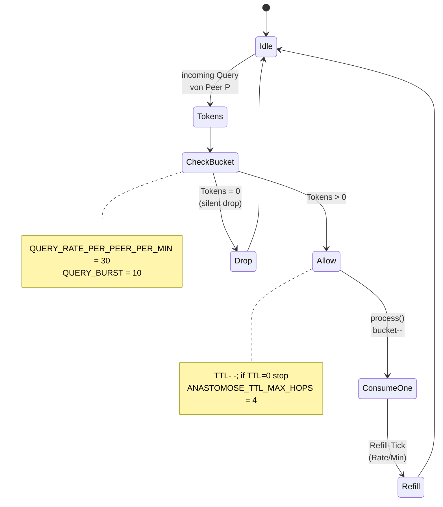

# Modul 11 — Rate-Limit & TTL

> **Status:** 🟫 Schablone · Schutz-Backlog · Priorität niedrig  ·  **Schicht:** Querschnitt (wirkt auf 05, 06)  ·  **Anker:** Sage-Page → Karte 13 (Eigenschutz)
> **Datei (Code):** `src/modules/11_rate_limit.js` (existiert noch nicht)
>
> _Pro-Peer Rate-Limit + Hop-TTL gegen Flooding und endlose
> Anastomose-Ketten. Querschnitts-Mechanik._

---

## Im Mycel-Bild

Rate-Limit ist die **Atemfrequenz-Bremse** des Knotens: niemand darf
schneller anfragen als der Atemkreis es zulässt. TTL ist die
**Hop-Ermüdung** einer Anfrage: nach vier Mycel-Schritten erlischt sie
von selbst, statt endlos im Geflecht zu kreisen. Beides zusammen schützt
das Mycel vor Erschöpfung — vor einem einzelnen lauten Peer und vor
Schleifen, die sich selbst verstärken. Querschnitts-Modul: greift in
Anastomose und Heterokaryose, sitzt aber als eigene Logik daneben.

---

## Visualisierung



---

## Zweck

Querschnitts-Mechanik gegen Flooding und endlose Anastomose-Ketten. Pro-Peer
Rate-Limit auf eingehende Anfragen, globaler TTL/Hop-Limit auf weitergereichte
Suchen. Verhindert, dass:

- ein einzelner Peer durch hohe Anfragefrequenz Ressourcen frisst,
- eine Anfrage endlos im Mycel kreist (Anastomose-Loop),
- ein Angreifer das Netz mit teuren Embedding-Berechnungen lähmt.

---

## Verantwortlichkeiten (Skizze)

**Macht (geplant):**
- Pro-Peer-Counter in IndexedDB führen (Sliding-Window oder Token-Bucket)
- Beim Eingang einer Query: prüfen, ob Peer im Limit, sonst Drop
- Beim Weiterreichen einer Query: TTL inkrementieren / dekrementieren,
  bei TTL=0 Stop
- Pro-Knoten-Gesamtlast überwachen (CPU/Memory grob)

**Macht nicht (geplant):**
- Kein Reputations-Update (das ist Modul 10)
- Keine harten Sperren (das ist Modul 12)
- Kein User-Rate-Limit innerhalb des Endknotens (das ist Sache der
  Endknoten-PWA selbst, nicht des SBKIM-Moduls)

---

## Bekannte offene Fragen

1. **Algorithmus.** Token-Bucket pro Peer (Rate + Burst) oder einfacher
   Sliding-Window-Counter? Token-Bucket ist standardisiert, aber
   speicheraufwendiger; Sliding-Window ist einfach, aber gröber.
2. **TTL-Modell.** Feste Zahl Hops (z.B. 4) oder adaptive Funktion der
   bekannten Mycel-Größe? Adaptiv ist eleganter, braucht aber zuverlässige
   Größenschätzung — die SBKIM bewusst nicht hat.
3. **Persistenz.** Wie verhält sich der Counter beim Page-Reload? IndexedDB-
   persistent (Modul 01) hält länger durch, ist aber schwer zu testen.
   Session-flüchtig ist trivial, aber öffnet Tür für Reload-Bypass.
4. **Verteiltes Flooding.** Erkennt der Empfänger, wenn ein Sender
   systematisch unterhalb der Schwelle bleibt, aber von vielen Identitäten
   gleichzeitig anfragt? Das ist Sybil-Erkennung und überlappt mit Modul 10
   (Reputation).
5. **Backpressure-Signale.** Wenn ein Knoten überlastet ist, soll er
   stilles Drop oder explizites Throttling-Signal zurückgeben? Stilles
   Drop ist sicherer (verrät keine Last-Info), Signal ist netter
   (Sender weiß Bescheid).

---

## Beispiel-Default (vorläufig, kann sich ändern)

```
QUERY_RATE_PER_PEER_PER_MIN = 30
QUERY_BURST                  = 10
HETEROKARYOSE_RATE_PER_DAY   = 4
ANASTOMOSE_TTL_MAX_HOPS      = 4
LOCAL_CPU_THRESHOLD_PERCENT  = 80   # ab hier Drop ohne Antwort
```

---

## Manueller Test

*(später, sobald Modul 05 + 06 stehen)*

---

## Bauzustand

| Schritt | Datum | Sitzung | Anmerkung |
|---|---|---|---|
| Stub angelegt | 2026-05-10 | Observatorium | Schutz-Backlog, Anker zu Karte 13 |
| Site-Echo | 2026-05-10 | Site-Echo | Hero, Bio-Metapher, Stateflow, Querverweise |
| Spec gefüllt | — | — | — |
| Code geschrieben | — | — | — |
| Sichttest | — | — | — |
| In Endknoten eingebaut | — | — | — |

---

**Querverweise**

- **Abhängigkeiten:** Querschnitt — wirkt auf Modul 05 (Anastomose) und Modul 06 (Heterokaryose) · nutzt Modul 01 (Storage) für persistente Counter
- **Wird genutzt von:** alle Module, die externe Anfragen entgegennehmen
- **Site-Karte:** [Karte 13 · Eigenschutz](../../index.html#screen-overview) (Penicillin-Schicht)
- **Glossar:** [Token-Bucket](../GLOSSAR.md), [Hop-TTL](../GLOSSAR.md), [Atemkreis](../GLOSSAR.md)
- **Paper:** Kap. 22 (Sicherheitsmodell, Skalierungsanalyse)
- **Schnittstellen:** [INTERFACES.md §0](../INTERFACES.md) (`QUERY_TIMEOUT_MS`)
- **Verwandt:** [Modul 05](05_anastomose.md) · [Modul 10](10_reputation.md) (überlappt bei Sybil-Erkennung)
