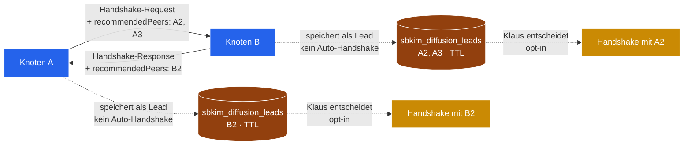

# Modul 14 — Diffusion

> **Status:** 🟫 Schablone · Diffusion-Backlog · Priorität niedrig  ·  **Schicht:** Netzwerk (Erweiterung von Karte 05 Anastomose)  ·  **Anker:** Sage-Page → noch nicht sichtbar (Folge-Pflege)
> **Datei (Code):** `src/modules/14_diffusion.js` (existiert noch nicht — Spec ausstehend)
>
> _Konsensuell-empfehlende Spore-Diffusion: zwei Knoten tauschen beim
> Handshake nicht nur eigene Spores, sondern auch ein bis zwei
> Empfehlungs-Spores anderer Geschwister, die der Empfänger noch nicht
> kennt. Drehbuchkonform, weil jede Übergabe im Konsens passiert. Stub,
> kein Spec-Detail — wartet auf das Wachstums-Bedürfnis._

---

## Im Mycel-Bild

Pilz-Hyphen tauschen beim Berühren nicht nur eigene Sporen, sondern
auch **Notizen über andere Pilze in der Nachbarschaft**. Wenn Hyphe A
mit Hyphe B Anastomose macht, gibt A ein, zwei Tipps mit:
„Diese andere Hyphe da drüben — kennst du noch nicht — gibt's auch."
Das ist **Wuchs durch Empfehlung**, nicht durch Senden. B hört zu,
ohne dass A irgendwen anders aktiv aufsuchen müsste. Niemand pulst
ins Leere, niemand crawlt — das Geflecht wächst durch geteilte
Erinnerung an gemeinsame Berührungen.

Im SBKIM-Drehbuch ist das die **proaktive Schwester** des passiven
`/sbkim/spore.json`-Mechanismus: dort findet man einander, weil eine
URL bekannt ist; hier findet man einander, weil ein bereits-bekannter
Knoten empfohlen hat. Beide Pfade bleiben Empfangsmodus — der
empfangene Tipp ist eine Notiz, kein Befehl, keine Anfrage ins offene
Netz.

---

## Visualisierung



Lesart: Empfehlungs-Spores reisen **im** Handshake (kein Extra-
Aufruf), landen beim Empfänger als **Lead** (nicht als
Geschwister), bekommen eine TTL, und brauchen einen **opt-in** des
Empfängers bevor sie zu einem echten Handshake werden.

---

## Zweck

Das Mycel wächst beim aktuellen Status quo (Pfad 1, passiv) nur dann,
wenn ein neuer Knoten die Spore-URL eines bereits-bekannten Knotens
selbst findet — über Karte 09 § Andock-Anleitung oder über die
Live-Generator-Karte der Sage-Page. Das ist **langsam** und skaliert
schlecht über den Kreis des Betreibers hinaus.

Modul 14 schließt die Lücke zwischen „totaler Empfangsmodus" und
„aktivem Crawlen" mit einem **konsensuellen Erweiterungs-Pfad**:
Empfehlung **während** eines Handshakes, der ohnehin im Konsens
stattfindet. Niemand wird unaufgefordert kontaktiert; nur Empfehlungen
fließen mit.

**Wichtig:** Modul 14 ist keine Pulsation und kein Crawler. Es legt
nur Notizen in den Inboxen — die Anfrage-Initiative bleibt bei dem
Knoten, der die Notiz empfangen hat, und bei seinem Betreiber.

---

## Drei Diffusionspfade (Auswahl verbindlich Pfad 2)

In der abgebrochenen Bau-Sitzung Modul 09 (2026-05-15) hat der
Betreiber drei Diffusionspfade nebeneinandergelegt. Die Auswahl ist
verbindlich:

### Pfad 1 — passiv (Status quo, Default-Mechanismus)

`/sbkim/spore.json` wird gefunden, weil eine Domain-URL irgendwo
auftaucht (manuelle Eintragung, Sage-Page-Live-Generator, Karte 09
Andock-Workflow). **Langsam, aber drehbuchkonform.** Bleibt
Default — wird durch Modul 14 nicht ersetzt, sondern ergänzt.

### Pfad 2 — konsensuell-empfehlend ✅ **verbindlich gewählt**

Zwei Knoten tauschen beim Handshake (Karte 05 Anastomose) **zusätzlich
zu eigenen Spores** je ein bis zwei Empfehlungs-Spores anderer
Geschwister, die der Empfänger noch nicht kennt. Drehbuchkonform, weil
jede Übergabe im Konsens passiert: der Empfehlende kennt den
Empfohlenen aus einem eigenen Handshake, der Empfänger entscheidet
selbst, ob er die Empfehlung in einen eigenen Handshake umsetzt.
**Kein Auto-Anastomose**, kein „Eigenanfrage ins offene Netz".

Diese Wahl ist die **Spec-Vorgabe** für eine spätere Spec-Sitzung 14.

### Pfad 3 — parasitär-mitreisend ❌ **verworfen**

Empfehlungs-Spores reisen ohne expliziten Konsens mit, z.B. als
Header in einem Query-Response oder als Pulsations-Broadcast.
**Bricht das Empfangsmodus-Prinzip** aus `CLAUDE.md` („Kein Crawler,
keine Pulsation, keine Eigenanfragen ins offene Netz") und aus
`sbkim_paper.pdf` (Empfangsmodus mit Antwortrecht). Wird in dieser
Spec-Linie **nicht weiterverfolgt** — auch nicht als Option.

**Begründung der Verwerfung:** Pfad 3 hat keinen Konsens-Anker —
der Empfehlende sendet, der Empfohlene weiß nicht, dass er empfohlen
wird, der Empfänger empfängt ohne Anfrage. Das ist genau das
Verhaltensmuster, das das SBKIM-Drehbuch ausschließt. Auch wenn er
schneller wäre, gehört er nicht zum Mycel-Bild.

---

## Was eine spätere Spec-Sitzung füllen müsste

Stub bewusst leer gehalten — die folgenden Punkte sind **nicht
spezifiziert**, sondern Anker für eine spätere Spec-Sitzung 14.
Eine Bau-Sitzung darf hier **nichts** ableiten; wer baut, ruft erst
eine Spec-Sitzung 14.

### a) Handshake-Erweiterung Karte 05

Anastomose-Antwort (`HandshakeResponse`) und ggf. -Anfrage
(`HandshakeRequest`) bekommen ein neues optionales Feld:

```
recommendedPeers: SporeRef[]  // max. 2 Einträge
```

Das Feld ist **additiv**, kein Hauptversions-Sprung. `SporeRef` ist
eine Minimal-Form (vermutlich `{nodeId, endpoint, publicKey}`) — die
genaue Form entscheidet die Spec-Sitzung 14 zusammen mit einer
Pflege-Sitzung Karte 05. **Karte 05 wird in dieser Stub-Sitzung
NICHT angefasst.**

### b) Empfehlungs-Quelle

Aus eigenem `sbkim_siblings`-Bestand, gefiltert nach **Vertrauenswert**
(Trust-Hook auf Karte 10, siehe (d)). Auswahl-Logik offen — z.B.
zufällige Stichprobe, oder neueste, oder höchster-Score. Spec
entscheidet das.

### c) Empfangsseite

**Opt-in pro Empfehlung.** Kein Auto-Anastomose mit empfohlenen
Knoten — der Empfänger speichert eine Empfehlung höchstens als
**Lead** in einem neuen Store:

```
sbkim_diffusion_leads
  Schlüssel: peerNodeId
  Wert:      {peerNodeId, endpoint, publicKey, fromNodeId,
              recommendedAt, ttl}
```

TTL pflicht — Empfehlungen verfallen, sonst füllt sich der Store
unkontrolliert. Spec-Sitzung 14 setzt den TTL-Wert (Vorschlag:
analog `SIBLING_MAX_AGE_MS = 30 Tage`, evtl. kürzer).

Wer den Lead in einen echten Handshake umsetzt, ist **Klaus oder ein
Endknoten-eigenes UI** — nicht Modul 14 selbst. Möglicher Aufhänger
für ein späteres Modul 00 Doku-Fenster-Sektions: „Empfehlungen ·
[Handshake versuchen]"-Knöpfe pro Lead.

### d) Trust-Hook auf Karte 10 Reputation

Empfehlungs-Quellen werden gewichtet: ein Geschwister mit niedrigem
Reputations-Wert darf weniger empfehlen, ein Geschwister mit hohem
Wert mehr. **Wirkt erst, wenn Karte 10 spec-spruchreif ist** — bis
dahin gilt eine flache Gewichtung. Bis Modul 10 da ist, könnte Modul
14 z.B. mit „nur Geschwister mit `since > X Tagen` dürfen
empfehlen" arbeiten — Spec-Sitzung 14 entscheidet.

### e) Rate-Limit-Hook auf Karte 11

Empfehlungs-Limit pro Handshake (Anti-Flood). Wenn ein Knoten in
jedem Handshake zwei Empfehlungen reinpackt, kann er das Netz
mit Leads fluten. **Wirkt erst, wenn Karte 11 spec-spruchreif ist.**
Bis dahin gilt das harte Limit aus (a) (max. 2 pro Handshake).

### f) Anti-Vergiftung

Empfehlungs-Spores haben **weniger Vertrauen** als selbst-gefundene
Spores. Konkret: ein Lead, der per Modul 14 reinkommt, ist nicht
gleichwertig zu einem Geschwister, das man selbst über Karte 05
gefunden hat. Anker-Idee: ein neuer Trust-Tier (etwa
`trustLevel ∈ {"self-discovered","recommended"}` auf
`sbkim_siblings`-Einträgen, abgeleitet beim Übergang Lead → Sibling).
Spec entscheidet die genaue Form.

---

## Wann ziehen (Schwellwert)

Modul 14 wird gebaut, wenn **eine** der folgenden Bedingungen
erfüllt ist (parallel zur 10/11/12-Logik):

- **Netz-Größe:** ≥ 10 aktive Geschwister (Modul 14 lohnt sich erst,
  wenn das Empfehlen einen Sprung statt einem Trippelschritt
  erzeugt).
- **Bau-Sitzung Modul 09 erfolgreich abgeschlossen** (Rezeptbuch +
  Mixarium leben als Endknoten-Paar) **UND** spürbares
  Wachstums-Bedürfnis (z.B. dritter Endknoten-Betreiber meldet sich,
  oder Klaus möchte ohne Karte 09 ausweiten).

Bis dahin: Stub-Status, kein Spec, kein Code. Wer früher anfängt,
spekuliert über ein Netz, das es noch nicht gibt — gilt analog zu
10/11/12.

---

## Verbindung zu anderen Karten

- **[Modul 05 Anastomose](05_anastomose.md):** Schnittstellen-
  Erweiterung im Handshake (`recommendedPeers: SporeRef[]` in
  `HandshakeResponse` und ggf. `HandshakeRequest`). Eigene Pflege-
  Sitzung Karte 05 — diese Stub-Sitzung lässt Karte 05 unverändert.
- **[Modul 06 Heterokaryose](06_heterokaryose.md):** Diffusion
  liefert Lead-Pool für Heterokaryose-Vorschläge — ein bekannter
  Geschwister-Hop weiter.
- **[Modul 10 Reputation](10_reputation.md):** Vertrauenswert für
  Empfehlungs-Quellen (Trust-Hook).
- **[Modul 11 Rate-Limit](11_rate_limit.md):** Empfehlungs-Limit
  pro Handshake (Anti-Flood-Hook).
- **[Modul 12 Blocklist](12_blocklist.md):** geblockte Knoten dürfen
  **weder empfehlen noch empfohlen werden** — Filter in beide
  Richtungen.

---

## Risiken

- **Echo-Kammer.** Zwei Knoten empfehlen sich gegenseitig immer
  wieder denselben Dritten. Mitigation: TTL auf Leads, plus
  De-Duplikation per `peerNodeId` im `sbkim_diffusion_leads`-Store.
- **Diffusion-Sybil.** Ein böser Knoten erfindet viele Spores und
  empfiehlt sie alle. Mitigation: Trust-Hook (d) auf Karte 10 +
  Block-Hook auf Karte 12. Solange 10/11/12 nicht stehen, ist
  Modul 14 strukturell anfällig.
- **Trust-Inflation.** Eine Empfehlung erzeugt allein keinen Trust
  — der Empfänger lernt den Empfohlenen erst kennen, wenn ein
  eigener Handshake stattfindet. Anker (f) hält empfohlene
  Geschwister auf niedrigerem Trust-Tier als selbst-gefundene.
- **Privacy-Leak.** Eine Empfehlung verrät dem Empfänger, dass der
  Empfehlende den Empfohlenen kennt. Im SBKIM-Drehbuch ist die
  Geschwister-Liste schon halb-öffentlich (jeder Geschwister kennt
  alle Andocker), aber Modul 14 propagiert das aktiv. Spec-Sitzung
  14 muss entscheiden, ob jede Empfehlung opt-in beim **Empfehlenden**
  ist (z.B. eine Markierung pro `sbkim_siblings`-Eintrag „darf
  weiterempfohlen werden: ja/nein").

---

## Bekannte offene Fragen (für die spätere Spec-Sitzung)

1. **`SporeRef` vs. volle `Spore`.** Reicht eine Minimal-Referenz
   (`nodeId`, `endpoint`, `publicKey`), oder muss die volle Spore
   mitreisen damit der Empfänger sie sofort als `verifyForeignSpore`
   prüfen kann? Minimal-Referenz spart Bandbreite, volle Spore spart
   einen späteren Netz-Aufruf.
2. **Auswahl-Heuristik.** Welche 1–2 Geschwister werden empfohlen?
   Zufall, neueste, vertrauteste, semantisch nächste am Anfrage-
   Domain-Vektor? Letzteres wäre dem A1–B3-Pfad nahe, ist aber teuer
   zu rechnen.
3. **TTL auf Leads.** 30 Tage analog zu `SIBLING_MAX_AGE_MS`, oder
   kürzer (7 Tage)? Leads ohne Handshake-Versuch sollen nicht
   ewig in `sbkim_diffusion_leads` bleiben.
4. **Lead-Anzeige.** Wo sieht Klaus seine Leads? Modul 00 Doku-Fenster
   bekommt eine neue Sektion, oder ein separater Endknoten-Pfad?
5. **Opt-in beim Empfehlenden.** Ist jeder Geschwister-Eintrag
   automatisch empfehlbar, oder gibt es ein „darf weiterempfohlen
   werden: ja/nein"-Flag (siehe Privacy-Leak-Risiko)?
6. **Trust-Tier-Übergang.** Wie wird ein Lead → Sibling? Ein
   erfolgreicher Handshake reicht — oder muss eine eigene Schwelle
   überschritten werden (z.B. `since > N Tagen` + ≥ M erfolgreiche
   Queries)?

---

## Manueller Test

*(später, sobald Modul 05 + 10 stehen und Klaus Modul 14 freigegeben
hat. Spec-Sitzung 14 fügt einen Test-Block analog Karte 05 ein.)*

---

## Bauzustand

| Schritt | Datum | Sitzung | Anmerkung |
|---|---|---|---|
| Stub angelegt | 2026-05-15 | Hauptsitzung 14-Diffusion-Stub | Diffusion-Backlog (proaktiv, parallel zum Schutz-Backlog), Pfad-2-Auswahl verbindlich, drei Pfade dokumentiert; Anker zur abgebrochenen Bau-Sitzung Modul 09 (2026-05-15) wo die Diffusion-Frage entstand |
| Spec gefüllt | — | — | — |
| Code geschrieben | — | — | — |
| Sichttest | — | — | — |
| In Endknoten eingebaut | — | — | — |

---

**Querverweise**

- **Abhängigkeiten (für spätere Spec):** Modul 05 (Anastomose, Handshake-Erweiterung) · Modul 02 (Spore, `SporeRef`-Form) · Modul 01 (Storage, `sbkim_diffusion_leads`)
- **Wird genutzt von:** Modul 06 (Heterokaryose) als Lead-Pool · Endknoten-UI (z.B. Modul 00 Doku-Fenster „Empfehlungen"-Sektion)
- **Hook-Punkte (nur Verweis, nicht implementiert):** Modul 10 (Reputation) Trust-Gewicht · Modul 11 (Rate-Limit) Empfehlungs-Quote · Modul 12 (Blocklist) Filter beidseits
- **Site-Karte:** Sage-Page noch nicht erweitert — Folge-Pflege-Sitzung „Sage-Page für Modul 14" (offen, siehe PULS)
- **Paper:** `sbkim_paper.pdf` Kap. 1.4 (Empfangsmodus-Prinzip) · Kap. 6.3 (Heterokaryose, verwandter Geschwister-Hop)
- **Verwandt:** [Modul 05](05_anastomose.md) (Handshake-Träger) · [Modul 06](06_heterokaryose.md) (semantischer Nachfolger) · [Modul 10](10_reputation.md) · [Modul 11](11_rate_limit.md) · [Modul 12](12_blocklist.md)
