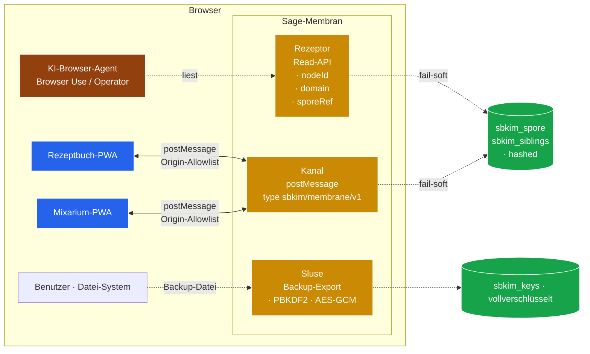

# Modul 15 — Membran

> **Status:** 🟫 Schablone · Membran-Backlog · **Priorität hoch** (2026-05-24, Auslöser Gemini 3.5 Flash)  ·  **Schicht:** Außenhülle (Brücke zwischen Knoten und seiner Browser-Umgebung)  ·  **Anker:** Sage-Page → Karte 4 / 13 / 14 als zweiter Backlog parallel zu Diffusion, plus **Navleisten-Lampe** (Sub (e))
> **Datei (Code):** `src/modules/15_membran.js` (existiert noch nicht — Spec ausstehend)
>
> _Außenschicht des Knotens. Regelt, was zwischen der PWA-Zelle und ihrer
> Browser-Umgebung passiert: lesender Zugriff für KI-Browser-Agenten
> (Anthropic Browser Use, OpenAI Operator, Comet, Dia, Arc-Nachfolger,
> **Gemini 3.5 Flash** als neues Default-Modell in Gemini-App + Google-
> Suche seit I/O 2026) und App-zu-App-Brücken zwischen Endknoten
> desselben Browsers, ohne Server-Hop. Stub, kein Spec-Detail —
> Spec-Sitzung 15 nun **vorgemerkt** durch Gemini-3.5-Flash-Ankündigung
> (Klaus-Eintrag 2026-05-24)._

---

## Hochstufungs-Notiz 2026-05-24 (Auslöser Gemini 3.5 Flash)

Google hat auf der I/O 2026 (19./20. Mai) **Gemini 3.5 Flash** als
neues **Default-Modell** in der Gemini-App und in der Google-Suche
(AI Mode) ausgerollt — global, „built to act, not just answer"
(agentisch, Coding- und Tool-Use-Schwerpunkt). Damit ist die
Vorbedingung „KI-Browser real verfügbar" aus § Wann ziehen
(Schwellwert) **defacto** erfüllt: ein agentisches Default-Modell
sitzt ab sofort auf jedem Android-Tablet, das Klaus' Endknoten
besucht — heute noch über Gemini-App / Suche, morgen vermutlich
über Browser-Integration.

**Karte 15 Priorität niedrig → hoch.** Neue Sub (e) ergänzt
(Fremdzugriff-Detektor + Lampe, siehe unten). Spec-Sitzung 15
ist als Folge-Sitzung in der Brief-99-Pipeline vorgemerkt; Brief
liegt unter `docs/sessions/BRIEF_SPEC_15_MEMBRAN.md`.

**Was sich NICHT ändert:** das Empfangsmodus-Prinzip aus
`CLAUDE.md` (keine Eigen-Anfragen, keine Pulsation, keine Crawler)
bleibt unangetastet. Membran ist und bleibt passiv — der
Fremdzugriff-Detektor **beobachtet**, er filtert nicht; die
Lampe **zeigt**, sie blockiert nicht. Block-Verhalten gehört in
Karte 12 (Blocklist), nicht in 15.

---

## Im Mycel-Bild

Eine Pilz-Hyphe hat eine **Membran** als Außenhülle. Sie ist nicht
das Geflecht selbst, aber alles, was zwischen Geflecht und Umwelt
passiert, geht durch sie hindurch. Membran-Rezeptoren erkennen, was
draußen ist; Membran-Kanäle lassen kleine Moleküle durch, halten
große draußen. Andere Zellen, die mit dieser Hyphe in Kontakt
kommen — Insekten-Verdauungs-Symbionten, Pflanzenwurzeln, Wasser-
Tropfen mit darin schwimmenden Mikroben — sprechen alle zuerst mit
der Membran, nie direkt mit dem Inneren.

Im SBKIM-Drehbuch ist die **Sage-Membran** die Schicht zwischen einer
PWA-Zelle und allem, was im Browser sonst noch lebt: Browser-Agenten,
Schwester-Apps anderer Domänen, der Benutzer selbst mit seinem
Datei-System. Eine Membran ist **passiv** — sie initiiert nichts, sie
hat Rezeptoren und Kanäle, aber kein Bewusstsein für die Außenwelt.
Das deckt sich exakt mit dem Empfangsmodus-Prinzip aus `CLAUDE.md`
und `sbkim_paper.pdf`: nie Eigeninitiative, nur Antwortrecht.

---

## Visualisierung



Lesart: drei Membran-Strukturen mit unterschiedlicher Berechtigung —
Rezeptor (nur lesen, keine Keys, keine Auslöser), Kanal (bidirektional,
strenge Origin-Allowlist), Sluse (manueller Export durch Benutzer,
vollverschlüsselt). Niemand der Außenstehenden bekommt rohen Zugriff
auf `sbkim_keys` — der private Schlüssel verlässt die Zelle nie
unverschlüsselt.

---

## Zweck

Das Mycel-Protokoll endet heute scharf am Browser-Tab. Eine Sage-PWA
spricht mit fremden Knoten **nur** über `POST /sbkim/anastomosis`
(Modul 05) oder `BroadcastChannel('sbkim')` für same-origin-Fallback
(Bau-Sitzung 2026-05-17). Was im selben Browser nebenan noch lebt —
eine Schwester-App auf anderem Origin, ein KI-Browser-Agent, ein
Benutzer mit Backup-Wunsch — sieht die Sage-Zelle nicht, oder nur,
wenn er die UI wie ein Mensch bedient. Das **war richtig**, solange
es nur ein Endknoten gab und keine Browser-Agenten.

Drei neue Realitäten machen Modul 15 zur sinnvollen Vorbereitung:

1. **KI-Browser werden Markt-reif** (Anthropic Browser Use SDK ab
   Ende 2025; OpenAI Operator; Perplexity Comet; Arc-Browser-
   Nachfolger Dia). Ein Agent, der eine Sage-PWA bedient, kann heute
   nur „klicken", nicht abfragen. Eine Read-API spart Klicks und
   gibt dem Agenten verlässliche Antwort-Felder statt DOM-Heuristik.
2. **Zwei Endknoten leben seit 2026-05-16** auf demselben Browser
   (Mein-Rezeptbuch + Mein-Mixarium), aber auf unterschiedlichen
   Origins. Sie können sich heute nur über das öffentliche Netz
   sprechen — ein Server-Hop für eine reine Browser-Konversation.
   Eine `postMessage`-Brücke löst das.
3. **Backup-Export existiert** (Modul 02 Bau 02.X, PBKDF2-SHA256
   600 000 + AES-GCM-256) und ist heute der bewährte App-zu-App-
   Transport-Weg per Datei. Verdient als Membran-Sluse einen
   formalen Anker, damit kein Endknoten ihn übersieht.

**Modul 15 = die Außenhülle, die diese drei Realitäten ordnet —
strikt reaktiv, niemals initiativ.**

---

## Vier Sub-Bereiche der Membran (Auswahl-Block)

Die Membran-Karte fasst vier verwandte, aber strukturell getrennte
Themen zusammen. **Reihenfolge ist verbindlich**, nicht parallel —
eine spätere Spec-Sitzung 15 zieht sie nacheinander.

### Sub (a) — Read-API für KI-Browser-Agenten ✅ **Pflicht (Stufe 1)**

Eine globale Lese-Oberfläche auf der Andocker-PWA, die ein in-Browser
laufender Agent (Browser-Use-Worker, Extension, Bookmarklet, Operator-
Toolkit) ohne UI-Klicken abrufen kann.

**Anker-Form** (Spec-Sitzung 15 entscheidet die finale Signatur):

```js
window.SbkimMembrane = {
  read: async () => ({
    protocolVersion: "0.1",
    nodeId,                 // base64url-sha256-Hash, identisch zur Spore
    domain,                 // String aus Spore (z.B. "Kochrezepte")
    sporeUrl,               // Pfad zur eigenen /sbkim/spore.json
    siblings: [             // Geschwister-Liste, ANONYMISIERT
      { nodeIdHash, since, status }
    ],
    storage: {              // Doku-Fenster-Snapshot, gespiegelt
      quotaWarningLevel,    // "none" | "ratio" | "bytes" | "both"
      storagePersisted      // boolean | null
    }
  })
};
```

**Strikte Tabus für Sub (a):**

- **Niemals** `sbkim_keys` lesen — auch nicht gehasht; der Agent
  darf nicht beweisen können, dass er den Schlüssel kennt.
- **Niemals** `nodeId` der Geschwister im Klartext liefern; nur
  `nodeIdHash = base64url-sha256(nodeId)` — Empfehlungs-Pfad nicht
  durch Membran exponieren.
- **Niemals** schreiben, signieren, Handshake auslösen. `read()`
  ist async-pur, kein Seiteneffekt.

### Sub (b) — App-zu-App-Brücke via `postMessage` ✅ **Pflicht (Stufe 2)**

Zwei Endknoten auf unterschiedlichen Origins (z.B. Rezeptbuch und
Mixarium auf GitHub-Pages-Subpfaden) sprechen miteinander, ohne den
HTTP-Weg über das öffentliche Netz zu nehmen. Brücke via
`window.postMessage` mit **strikter Origin-Allowlist**.

**Anker-Form** (Spec entscheidet):

```js
// Sender:
peerWindow.postMessage({
  type: "sbkim/membrane/v1",
  op: "sporeRef" | "query" | "hint",
  fromOrigin: window.location.origin,
  nonce: <random>,
  payload: { ... }            // op-spezifisch
}, peerOrigin /* aus Allowlist */);

// Empfänger:
window.addEventListener("message", (e) => {
  if (!MEMBRANE_ALLOWLIST.has(e.origin)) return;     // hart abweisen
  if (e.data?.type !== "sbkim/membrane/v1") return;
  // ... bedienen
});
```

**Op-Tabelle (Vorschlag, Spec entscheidet final):**

| `op` | Semantik | Schreibt? |
|---|---|---|
| `sporeRef` | „Ich bin Knoten X auf Origin Y" — Anker für späteren Handshake | nein |
| `query` | semantische Anfrage analog `/sbkim/query` | nein |
| `hint` | Empfehlungs-Lead analog Modul 14 Diffusion | nein direkt, schreibt in `sbkim_diffusion_leads` falls 14 vorhanden |

**Strikte Tabus für Sub (b):**

- Kein Handshake (Modul 05) über die Brücke — `op:"handshake"`
  bewusst ausgeschlossen. Wer Anastomose will, geht durch HTTP oder
  BroadcastChannel (same-origin), nicht durch postMessage.
- Origin-Allowlist ist **statisch im Andocker konfiguriert**, nicht
  über die Membran selbst änderbar. Sonst eskaliert ein bösartiger
  Empfänger seine eigenen Rechte.
- Nonce-Pflicht gegen Replay; jede Antwort referenziert den Nonce
  der Anfrage.

### Sub (c) — Capability-Handshake (Membran-Token) ⏳ **Später (Stufe 3)**

Vorstufe für „ein Agent darf Spuren setzen, nicht nur lesen". Ein
**signiertes Capability-Token**, ausgestellt durch die eigene Spore
(Modul 02-Signatur), das ein Agent vorweisen kann.

**Anker-Form** (rein Schablone):

```js
MembraneCapability = {
  audience: "agent-id" | "origin-pattern",
  scope: "read" | "hint",      // "write" NICHT in Stufe 3
  expiresAt: <timestamp>,
  nonce: <random>,
  signature: Ed25519(...)      // durch eigene Spore signiert
}
```

Spec-Sitzung entscheidet: ist `scope:"hint"` schon ein Schreib-Recht
(Lead-Eintrag in `sbkim_diffusion_leads` bei Modul 14), oder bleibt
es ein Lesen-Plus? Das ist offen. Sub (c) wird **nicht** vor Sub (a)
+ (b) gebaut.

### Sub (d) — Backup-Datei als manueller App-Transport 📄 **Nur dokumentiert**

Existiert bereits (Modul 02 Bau 02.X: `exportBackup(password)` /
`importBackup(blob, password, options?)`, PBKDF2-SHA256 600 000 +
AES-GCM-256). Membran-Karte verweist nur, baut nichts dazu.

Anwendung: Benutzer exportiert Spore + Geschwister-Liste aus
Rezeptbuch, importiert in Mixarium. Heute der einzige sichere App-
zu-App-Transport-Weg, solange Sub (b) noch Stub ist. Verdient als
Sluse einen formalen Anker, damit Modul 09 und Modul 00 ihn
einheitlich erwähnen können.

### Sub (e) — Fremdzugriff-Detektor + Navleisten-Lampe ✅ **Pflicht (Stufe 1, neu 2026-05-24)**

Sichtbare Membran-Rezeption: jeder Zugriff von außen — sei es ein
KI-Browser-Agent (Gemini 3.5 Flash, Anthropic Browser Use, OpenAI
Operator, Comet, Dia), eine fremde `postMessage`-Quelle, oder
irgendeine Cross-Origin-Probe an einem Sage-Endpunkt — schlägt sich
in einer **roten Lampe** in der Navleiste der Sage-Page nieder. Klick
auf die Lampe öffnet ein **Fremdzugriff-Fenster** mit Live-Liste der
letzten N Zugriffe.

**Anker-Form** (Spec-Sitzung 15 entscheidet die finale Signatur):

```js
window.SbkimMembrane.fremdzugriff = {
  list: () => FremdzugriffEntry[],   // ringbuffer, max N (Vorschlag 50)
  subscribe: (cb) => unsubscribeFn,   // für die Lampen-Animation
  clear: () => void                    // manuelles Aufräumen
};

// FremdzugriffEntry (Schablone)
{
  at: <timestamp>,
  kind: "membrane-read" | "membrane-postmessage" | "endpoint-probe",
  origin: <string | null>,            // event.origin oder Referer-Origin
  agentHint: <string | null>,         // User-Agent-Marker, fail-soft
  endpoint: <string | null>,          // z.B. "/sbkim/spore.json"
  decision: "accepted" | "ignored" | "rejected-allowlist",
  details: { ... }                    // op-spezifisch
}
```

**Lampe in der Navleiste:**

- Position: dritte Lampe rechts neben `#lamp-alive` („lebt", grün) und
  `#lamp-traffic` („verkehr", gold-Puls). Vorschlag-ID `#lamp-fremd`,
  Label `"fremd"`.
- Default-Zustand: dunkel/aus (kein Fremdzugriff in der aktuellen
  Sitzung registriert).
- Aktiv-Zustand: **rot leuchtend** (Vorschlag CSS-Variable
  `--lamp-alert: #DC2626` oder ähnlich), kurzer Puls beim ersten
  Eintrag analog `lamp-pulse` für `lamp-traffic`.
- Klick: öffnet Fremdzugriff-Fenster (Modal analog Doku-Fenster
  Modul 00, oder eigene Card-Slide aus der rechten Seite — Spec
  entscheidet). Inhalt: Tabelle der `FremdzugriffEntry` mit
  Zeitstempel, Origin, Endpoint, Decision.

**Strikte Tabus für Sub (e):**

- **Lampe blockiert nicht.** Sub (e) ist Beobachtung + Anzeige —
  Filter-Verhalten gehört in Karte 12 (Blocklist), Rate-Limit in
  Karte 11. Die Lampe darf nicht „blinken weil ich abgewiesen
  habe", sondern „blinken weil Fremdzugriff stattgefunden hat".
- **Niemals PII in `FremdzugriffEntry`.** `origin` ist OK (öffentlich,
  Browser-bekannt); IP-Adresse, Cookies, User-Identität von
  Drittseiten **nie**. `agentHint` ist freier String, aber gehasht
  wenn länger als N Zeichen — Spec entscheidet.
- **Ringbuffer, kein Persistent-Log.** Sub (e) hält die letzten N
  Einträge im RAM (oder optional `sessionStorage`, nicht IndexedDB).
  Klaus' Fremdzugriff-Übersicht ist eine **lebende Schau**, kein
  Audit-Archiv. Wer Audit will, baut Modul 12 (Blocklist) + dort
  einen Append-Log.
- **Same-Origin-Zugriffe zählen NICHT als Fremdzugriff.** Die eigene
  Sage-Page-PWA, die ihre eigene `status.json` fetched, ist kein
  Fremd-Vorgang — sonst pulst die Lampe ohne Anlass. Definition
  „fremd" = `event.origin !== window.location.origin` für
  postMessage + Referer-Check für HTTP-Endpoint-Probes.

**Architektur-Trennung:** Sub (e) hat zwei Schichten —
**Detektion** (Hook in Sub (a) Read-API + Sub (b) postMessage-
Listener + Service-Worker-Fetch-Listener für Endpoint-Probes) und
**Anzeige** (Navleisten-Lampe + Modal). Spec entscheidet, ob die
Anzeige-Schicht in Modul 00 (Doku-Fenster) eingehängt wird oder
eigenständig in der Sage-Page als reines UI-Stück lebt.

**Warum jetzt (Hochstufungs-Begründung):** Gemini 3.5 Flash auf
jedem Android-Tablet ab Mai 2026 macht „liest mit, ohne dass Klaus
es sieht" zur realistischen Sorge. Die Lampe ist die **kleinste
sinnvolle Antwort** vor Sub (a) Capability-Token-Bau (Stufe 3) —
sie macht das Phänomen sichtbar, ohne neue Angriffsfläche zu
eröffnen.

---

## Was eine spätere Spec-Sitzung füllen müsste

Stub bewusst leer gehalten — die folgenden Punkte sind **nicht
spezifiziert**, sondern Anker für eine spätere Spec-Sitzung 15.
Eine Bau-Sitzung darf hier **nichts** ableiten; wer baut, ruft erst
eine Spec-Sitzung 15.

### Für Sub (a) — Read-API

- Exakte Feld-Liste in `read()`-Antwort (z.B. ob `domainKeywords` /
  `stammCategories` / `guestCategories` aus Spore mitgegeben werden).
- Globaler Name (`window.SbkimMembrane`?) und ob ein eigener
  `script`-Block oder Modul-File angelegt wird.
- Anonymisierung der Geschwister: `nodeIdHash` per
  `base64url-sha256(nodeId)`, oder härtere Anonymisierung (Hash
  mit Salt pro Sitzung, sodass derselbe Geschwister-Knoten zwei
  Read-Calls hindurch nicht korrelierbar ist)?
- Quota-Verhalten: blockiert eine Quota-Warnung den `read()`-Pfad
  (analog Doku-Fenster), oder ist `read()` immer verfügbar?

### Für Sub (b) — postMessage-Brücke

- Allowlist-Format: Strings (`"https://lausiklauskn-png.github.io"`)
  oder Patterns (`"https://*.github.io"`)? Spec entscheidet — wahr-
  scheinlich strikt String, kein Wildcard.
- Wo wird die Allowlist konfiguriert: im Andocker-`sbkim/sbkim-init.js`
  (pro PWA setzbar) oder zentral in `15_membran.js` (Hardcode pro
  Release)?
- Wer öffnet die Verbindung: Sender via `window.open()` /
  `iframe.contentWindow` / `BroadcastChannel`-Fallback? Spec-Sitzung
  schaut sich Chrome- + Firefox-Verhalten an (BroadcastChannel
  endet am Origin, postMessage nicht).
- Verhalten bei nicht-erlaubtem Origin: stille Verwerfung (keine
  Antwort) oder protokolliert in `sbkim_membrane_log` (neuer Store)?
- Rate-Limit für eingehende `postMessage`-Calls (Hook auf Karte 11).

### Für Sub (c) — Capability-Token

- Token-Bezugsquelle: vom eigenen Knoten ausgestellt (Self-Issued)
  oder von einer Authorisierungsschicht (z.B. Browser-Extension)?
- TTL-Wert (Vorschlag: 5 Minuten, kürzer als
  `SIBLING_MAX_AGE_MS`).
- `scope:"hint"` Detail: schreibt Lead direkt in
  `sbkim_diffusion_leads`, oder nur als Vorschlag in einer
  Inbox, die Klaus manuell bestätigt?

### Für Sub (d) — Backup-Datei

- Querverweis-Pflege: Karten 02 + 09 verweisen auf Membran-Sluse,
  Membran-Karte verweist zurück. Wer baut die Verweise — Spec-Sitzung
  15 oder eigene Mini-Pflege?

### Für Sub (e) — Fremdzugriff-Detektor + Lampe

- Ringbuffer-Größe N (Vorschlag 50 — zu klein verliert frühe Spuren,
  zu groß bläht RAM auf).
- Persistenz: nur RAM, oder `sessionStorage` (übersteht Tab-Reload,
  nicht Tab-Close), oder doch ein eigener IndexedDB-Store
  `sbkim_membrane_log` mit fixer TTL-Eviction (z.B. 24 h)?
- Modal-Form: Wiederverwendung Modul-00-Doku-Fenster-Modal (eine
  zweite Sektion in der bestehenden Doku) ODER eigenes Modal in der
  Sage-Page ODER eigenständige Slide-Card aus dem rechten Rand?
  Spec-Sitzung wägt ab.
- Lampen-Pulse-Verhalten: jeder Fremdzugriff pulst (sichtbar laut,
  könnte nervig wirken) oder nur „Lampe leuchtet rot, solange in
  den letzten X Minuten ≥1 Eintrag"? Spec wählt eine Variante.
- Endpoint-Probe-Erkennung: Service-Worker-Fetch-Listener prüft
  `Origin` / `Referer`-Header für Cross-Origin — was tun bei
  Same-Origin-Subpfad-Requests aus einem iframe oder einer
  Schwester-App im selben Browser? Definition „fremd" muss
  formalisiert werden.
- Was passiert bei `decision: "rejected-allowlist"` (Sub (b) lehnt
  unbekannten postMessage-Origin ab)? Lampe trotzdem rot? Vorschlag
  ja — Klaus soll Abweisungen sehen, weil sie auf Phishing-Versuche
  hindeuten können.

---

## Wann ziehen (Schwellwert)

> **Aktualisierung 2026-05-24:** Die ursprüngliche Schwelle „mindestens
> zwei der drei Bedingungen" ist faktisch erfüllt, **wenn man Sub (e)
> separat zieht**. Sub (a)+(b)+(c) bleiben an ihrer ursprünglichen
> Schwelle hängen (KI-Browser-SDK + App-zu-App-Wunsch); Sub (e)
> **Fremdzugriff-Detektor + Lampe** wird sofort gezogen, weil Gemini
> 3.5 Flash als Default-Modell jetzt ausgerollt ist und Klaus die
> Beobachtungs-Schicht haben will, **bevor** die KI-Agenten anfangen,
> seine Endknoten zu probieren.

**Reihenfolge nach Hochstufung 2026-05-24:**

1. **Sub (e) Fremdzugriff-Lampe — sofort** (Spec-Sitzung 15 mit
   Brief `BRIEF_SPEC_15_MEMBRAN.md`).
2. **Sub (a) Read-API + Sub (b) postMessage-Brücke** — weiter wie
   gehabt, ziehen wenn mindestens zwei der ursprünglichen drei
   Bedingungen erfüllt sind.
3. **Sub (c) Capability-Token** — Stufe 3, frühestens nach Sub (a)+(b).
4. **Sub (d) Backup-Datei** — schon vorhanden (Modul 02 Bau 02.X),
   nur Querverweis-Pflege offen.

**Ursprüngliche Schwelle (für Sub (a)+(b)+(c)):**

- **KI-Browser real:** Anthropic Browser Use oder OpenAI Operator
  öffentlich verfügbar, mit dokumentiertem JS-Bridge-Mechanismus.
  Solange das nur Roadmap ist, nicht ziehen.
- **App-zu-App-Wunsch konkret:** Ein Endknoten-Betreiber (Klaus
  selbst oder ein Drittnutzer) äußert konkretes Bedürfnis nach
  Cross-Origin-Konversation im Browser ohne Server.
- **Bau-Sitzung Modul 09 erfolgreich abgeschlossen** und zweiter
  Endknoten lebt produktiv (Status quo seit 2026-05-16) **UND**
  ein dritter Endknoten will sich andocken, der nicht auf
  `github.io` liegt.

Für Sub (a)+(b)+(c) gilt weiterhin: Stub-Status, kein Spec, kein Code,
bis Schwelle erfüllt. Wer früher anfängt, spekuliert über einen
Browser-Markt, der noch nicht stabilisiert ist — Browser-Use-SDKs
ändern sich monatlich, eine zu frühe Spec wird veraltet sein, bevor
sie gebraucht wird.

---

## Verbindung zu anderen Karten

- **[Modul 02 Spore](02_spore.md):** liefert Identität (`nodeId`,
  Signatur für Capability-Token in Sub (c)). Membran liest nur,
  niemals `sbkim_keys`.
- **[Modul 05 Anastomose](05_anastomose.md):** Membran ersetzt
  Handshake **nicht** — `postMessage`-Brücke (Sub (b)) hat bewusst
  keinen `op:"handshake"`-Eintrag.
- **[Modul 06 Heterokaryose](06_heterokaryose.md):** könnte später
  Membran-Sluse für manuellen Anker-Tausch nutzen (Sub (d)).
- **[Modul 09 Einbau-PWA](09_einbau_pwa.md):** Andock-Anleitung
  erhält in einer Folge-Pflege einen zehnten optionalen Schritt:
  „Membran-Allowlist setzen falls App-zu-App-Brücke gewünscht".
- **[Modul 13 Eigenschutz-Karte (Sage-Page)]:** Membran erscheint als
  zweiter Backlog-Block parallel zu Diffusion (proaktiv-Außen statt
  proaktiv-Innen).
- **[Modul 14 Diffusion](14_diffusion.md):** spiegelbildlich — 14
  arbeitet **nach innen** (Empfehlung im Handshake), 15 arbeitet
  **nach außen** (Browser-Agenten, App-zu-App). Zusammen die zwei
  Wachstums-Strategien des Mycels: durch Empfehlung und durch
  Membran-Kontakt.

---

## Risiken

- **Origin-Spoofing.** Ein bösartiger Tab gibt sich als Schwester-
  App aus, indem er `event.origin` fälscht. Mitigation: postMessage
  setzt `event.origin` **browser-seitig** nicht-fälschbar; Allowlist-
  Check ist die einzige Schutz-Linie. Falsche Liste = offenes Tor.
- **Datenexfiltration.** KI-Browser-Agent liest `read()`-Snapshot
  und schickt ihn an einen LLM-Anbieter zur Auswertung. Mitigation:
  `nodeIdHash` statt `nodeId` für Geschwister; `sbkim_keys` nie
  exponiert; Klartext-Domain ist akzeptabel (steht ohnehin in der
  öffentlichen Spore).
- **Agent-Replay.** Ein abgefangenes Capability-Token (Sub (c))
  wird wiederverwendet. Mitigation: `nonce` + kurze `expiresAt`;
  Empfänger merkt sich konsumierte Nonces für `expiresAt`-Dauer.
- **Konsens-Bruch.** Ein Browser-Agent ruft Membran-`hint`, bekommt
  einen Lead, und der menschliche Betreiber weiß nichts davon.
  Mitigation: jedes `hint` schreibt ins Doku-Fenster (Modul 00)-
  sichtbare Inbox, **kein Auto-Handshake**.
- **Allowlist-Drift.** PWA-Update vergisst, die Allowlist mitzuziehen,
  und sperrt legitime Schwester aus. Mitigation: Allowlist in
  Andocker-Init explizit als Konfigurations-Pflicht in Modul 09 § 10
  (Folge-Pflege) verankern.
- **Sluse-Phishing (Sub (d)).** Ein Benutzer importiert ein als
  Backup getarntes bösartiges Blob in seine App. Mitigation: schon
  vorhanden — `BackupOverwriteError` (Modul 02 Bau 02.X) verlangt
  explizites `force:true`, PBKDF2-Verify schlägt bei manipuliertem
  Blob fehl.
- **PWA-Suffix-Verwechslung.** Auf Origin-Ebene gehören Rezeptbuch +
  Mixarium zu derselben `github.io`-Origin, sind aber via
  `dbSuffix` getrennte Knoten. Sub (b) muss in einer Pflege-Sitzung
  klären, wie Origin-Allowlist + dbSuffix zusammenspielen — postMessage
  geht auf Origin-Ebene, sieht Suffix nicht.

---

## Bekannte offene Fragen (für die spätere Spec-Sitzung)

1. **Globaler Name.** `window.SbkimMembrane` oder `window.SBKIM_PUBLIC`
   oder im Modul 00 Doku-Fenster eingehängt (`window.SbkimDoku.read()`)?
2. **Anonymisierung-Tiefe.** Reicht `nodeIdHash`, oder braucht es
   einen Per-Session-Salt, sodass derselbe Geschwister zwei Read-Calls
   nicht korrelierbar bleibt?
3. **postMessage vs. BroadcastChannel vs. SharedWorker.** Welcher
   Mechanismus für Sub (b)? postMessage funktioniert cross-origin,
   BroadcastChannel nur same-origin, SharedWorker hängt am Browser-
   Support (Safari hat noch immer Lücken).
4. **Allowlist-Konfigurationspfad.** Hartkodiert im Andocker
   (`sbkim/sbkim-init.js`) oder über Doku-Fenster-UI (Karte 00) editierbar?
5. **Lead-vs-Hint-Trennung.** Sub (b) `op:"hint"` schreibt direkt
   in `sbkim_diffusion_leads` (Modul 14, falls vorhanden), oder in
   einen neuen Store `sbkim_membrane_inbox` (analog `sbkim_legacy_inbox`)?
6. **Capability-Token-Bezug.** Self-Issued reicht für Sub (c)?
   Oder braucht es eine Browser-Extension, die als Token-Aussteller
   fungiert?
7. **Sluse-Verweis-Pflege (Sub (d)).** Welche Karten verweisen wie?

---

## Manueller Test

*(später, sobald Modul 15 spec-spruchreif ist. Spec-Sitzung 15 fügt
einen Test-Block analog Karte 05 ein. Erste plausible Tests:
`SbkimMembrane.read()` liefert Snapshot ohne `sbkim_keys`-Felder;
`postMessage` mit erlaubtem Origin wird beantwortet, mit fremdem
Origin still verworfen; Capability-Token mit abgelaufenem
`expiresAt` wird abgewiesen.)*

---

## Bauzustand

| Schritt | Datum | Sitzung | Anmerkung |
|---|---|---|---|
| Stub angelegt | 2026-05-18 | Hauptsitzung 15-Membran-Stub | Membran-Backlog (proaktiv, **Außen**-Pendant zum Diffusion-Backlog 14). Vier Sub-Bereiche (a Read-API ✅ Pflicht / b postMessage-Brücke ✅ Pflicht / c Capability-Token ⏳ später / d Backup-Sluse 📄 nur verweisend). Klaus' Auslöser: aufkommende KI-Browser (Anthropic Browser Use, OpenAI Operator, Comet, Dia) + Wunsch nach App-zu-App-Kommunikation Rezeptbuch ↔ Mixarium ohne Server. Vokabular „Cells" als Mycel-Anker (Zellmembran). |
| Hochstufung + Sub (e) | 2026-05-24 | Pflege-Hauptsitzung Gemini-3.5-Flash-Anlass | Priorität niedrig → **hoch**. Auslöser: Google I/O 2026 — Gemini 3.5 Flash als Default-Modell in Gemini-App + Google-Suche (AI Mode), agentisch („act, not just answer"). Neue Sub (e) ergänzt — Fremdzugriff-Detektor + rote Navleisten-Lampe in der Sage-Page (rechts neben `#lamp-alive` + `#lamp-traffic`), Klick öffnet Fremdzugriff-Fenster mit Ringbuffer der letzten N Einträge. Sub (e) zieht **sofort** (eigene Spec-Sitzung 15 in Brief-99-Pipeline); Sub (a)+(b)+(c) bleiben an ursprünglicher Schwelle. Brief: `docs/sessions/BRIEF_SPEC_15_MEMBRAN.md`. |
| Spec gefüllt | — | — | — |
| Code geschrieben | — | — | — |
| Sichttest | — | — | — |
| In Endknoten eingebaut | — | — | — |

---

**Querverweise**

- **Abhängigkeiten (für spätere Spec):** Modul 02 (Spore-Signatur für Capability-Token) · Modul 01 (Lese-Recht auf `sbkim_spore`, `sbkim_siblings` — kein Schreiben) · Modul 00 (Spiegelung Quota/Persist-Felder im Read-Snapshot) · keine neuen Stores in Stufe 1
- **Wird genutzt von:** KI-Browser-Agenten (Anthropic Browser Use, OpenAI Operator, Comet, Dia, **Gemini 3.5 Flash** als Default in Gemini-App + Google-Suche seit I/O 2026) · Endknoten-Schwester-Apps auf anderen Origins · Benutzer mit Backup-Datei-Wunsch · **Klaus selbst über Navleisten-Lampe** (Sub (e), Live-Schau der eingehenden Fremdzugriffe)
- **Hook-Punkte (nur Verweis, nicht implementiert):** Modul 10 (Reputation) auf Capability-Token-Aussteller · Modul 11 (Rate-Limit) auf eingehende postMessage-Calls pro Origin · Modul 12 (Blocklist) auf Origin-Ebene
- **Site-Karte:** Sage-Page Karten 4 / 13 / 14 ziehen `membranBacklog[]` parallel zu `schutzBacklog[]` und `diffusionBacklog[]` — Pflege-Sitzung 2026-05-18 (diese Sitzung)
- **Paper:** `sbkim_paper.pdf` Kap. 1.4 (Empfangsmodus-Prinzip) · Kap. 6 (Geflecht-Außenkontakt)
- **Verwandt:** [Modul 14](14_diffusion.md) (proaktiv nach innen) · [Modul 02](02_spore.md) (Backup-Sluse Sub (d)) · [Modul 09](09_einbau_pwa.md) (Allowlist-Konfiguration in Andock-Schritt 10) · [Modul 00](00_doku_fenster.md) (Membran-Inbox als Doku-Sektion)
