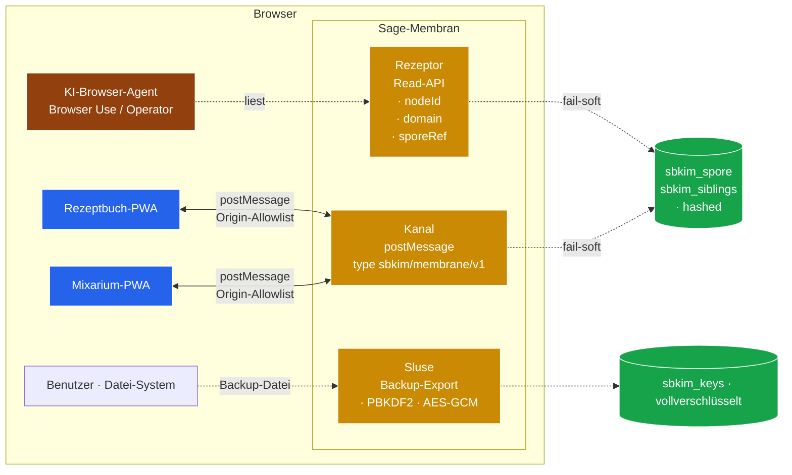

# Modul 15 — Membran

> **Status:** 🟨 Spec fertig (Sub (e) 2026-05-24) · Sub (a)+(b) Spec-Anker grob, finale Spec ausstehend · Membran-Backlog · **Priorität hoch** (Auslöser Gemini 3.5 Flash)  ·  **Schicht:** Außenhülle (Brücke zwischen Knoten und seiner Browser-Umgebung)  ·  **Anker:** Sage-Page → Karte 4 / 13 / 14 als zweiter Backlog parallel zu Diffusion, plus **Navleisten-Lampe** (Sub (e))
> **Datei (Code):** `src/modules/15_membran.js` (existiert noch nicht — Bau-Sitzung 15 nach Spec-Sitzung 15 vom 2026-05-24 fällig)
>
> _Außenschicht des Knotens. Regelt, was zwischen der PWA-Zelle und ihrer
> Browser-Umgebung passiert: lesender Zugriff für KI-Browser-Agenten
> (Anthropic Browser Use, OpenAI Operator, Comet, Dia, Arc-Nachfolger,
> **Gemini 3.5 Flash** als neues Default-Modell in Gemini-App + Google-
> Suche seit I/O 2026) und App-zu-App-Brücken zwischen Endknoten
> desselben Browsers, ohne Server-Hop. Stub, kein Spec-Detail —
> Spec-Sitzung 15 nun **vorgemerkt** durch Gemini-3.5-Flash-Ankündigung
> (Klaus-Eintrag 2026-05-24)._

---

## Hochstufungs-Notiz 2026-05-24 (Auslöser Gemini 3.5 Flash)

Google hat auf der I/O 2026 (19./20. Mai) **Gemini 3.5 Flash** als
neues **Default-Modell** in der Gemini-App und in der Google-Suche
(AI Mode) ausgerollt — global, „built to act, not just answer"
(agentisch, Coding- und Tool-Use-Schwerpunkt). Damit ist die
Vorbedingung „KI-Browser real verfügbar" aus § Wann ziehen
(Schwellwert) **defacto** erfüllt: ein agentisches Default-Modell
sitzt ab sofort auf jedem Android-Tablet, das Klaus' Endknoten
besucht — heute noch über Gemini-App / Suche, morgen vermutlich
über Browser-Integration.

**Karte 15 Priorität niedrig → hoch.** Neue Sub (e) ergänzt
(Fremdzugriff-Detektor + Lampe, siehe unten). Spec-Sitzung 15
ist als Folge-Sitzung in der Brief-99-Pipeline vorgemerkt; Brief
liegt unter `docs/sessions/BRIEF_SPEC_15_MEMBRAN.md`.

**Was sich NICHT ändert:** das Empfangsmodus-Prinzip aus
`CLAUDE.md` (keine Eigen-Anfragen, keine Pulsation, keine Crawler)
bleibt unangetastet. Membran ist und bleibt passiv — der
Fremdzugriff-Detektor **beobachtet**, er filtert nicht; die
Lampe **zeigt**, sie blockiert nicht. Block-Verhalten gehört in
Karte 12 (Blocklist), nicht in 15.

---

## Im Mycel-Bild

Eine Pilz-Hyphe hat eine **Membran** als Außenhülle. Sie ist nicht
das Geflecht selbst, aber alles, was zwischen Geflecht und Umwelt
passiert, geht durch sie hindurch. Membran-Rezeptoren erkennen, was
draußen ist; Membran-Kanäle lassen kleine Moleküle durch, halten
große draußen. Andere Zellen, die mit dieser Hyphe in Kontakt
kommen — Insekten-Verdauungs-Symbionten, Pflanzenwurzeln, Wasser-
Tropfen mit darin schwimmenden Mikroben — sprechen alle zuerst mit
der Membran, nie direkt mit dem Inneren.

Im SBKIM-Drehbuch ist die **Sage-Membran** die Schicht zwischen einer
PWA-Zelle und allem, was im Browser sonst noch lebt: Browser-Agenten,
Schwester-Apps anderer Domänen, der Benutzer selbst mit seinem
Datei-System. Eine Membran ist **passiv** — sie initiiert nichts, sie
hat Rezeptoren und Kanäle, aber kein Bewusstsein für die Außenwelt.
Das deckt sich exakt mit dem Empfangsmodus-Prinzip aus `CLAUDE.md`
und `sbkim_paper.pdf`: nie Eigeninitiative, nur Antwortrecht.

---

## Visualisierung



Lesart: drei Membran-Strukturen mit unterschiedlicher Berechtigung —
Rezeptor (nur lesen, keine Keys, keine Auslöser), Kanal (bidirektional,
strenge Origin-Allowlist), Sluse (manueller Export durch Benutzer,
vollverschlüsselt). Niemand der Außenstehenden bekommt rohen Zugriff
auf `sbkim_keys` — der private Schlüssel verlässt die Zelle nie
unverschlüsselt.

---

## Zweck

Das Mycel-Protokoll endet heute scharf am Browser-Tab. Eine Sage-PWA
spricht mit fremden Knoten **nur** über `POST /sbkim/anastomosis`
(Modul 05) oder `BroadcastChannel('sbkim')` für same-origin-Fallback
(Bau-Sitzung 2026-05-17). Was im selben Browser nebenan noch lebt —
eine Schwester-App auf anderem Origin, ein KI-Browser-Agent, ein
Benutzer mit Backup-Wunsch — sieht die Sage-Zelle nicht, oder nur,
wenn er die UI wie ein Mensch bedient. Das **war richtig**, solange
es nur ein Endknoten gab und keine Browser-Agenten.

Drei neue Realitäten machen Modul 15 zur sinnvollen Vorbereitung:

1. **KI-Browser werden Markt-reif** (Anthropic Browser Use SDK ab
   Ende 2025; OpenAI Operator; Perplexity Comet; Arc-Browser-
   Nachfolger Dia). Ein Agent, der eine Sage-PWA bedient, kann heute
   nur „klicken", nicht abfragen. Eine Read-API spart Klicks und
   gibt dem Agenten verlässliche Antwort-Felder statt DOM-Heuristik.
2. **Zwei Endknoten leben seit 2026-05-16** auf demselben Browser
   (Mein-Rezeptbuch + Mein-Mixarium), aber auf unterschiedlichen
   Origins. Sie können sich heute nur über das öffentliche Netz
   sprechen — ein Server-Hop für eine reine Browser-Konversation.
   Eine `postMessage`-Brücke löst das.
3. **Backup-Export existiert** (Modul 02 Bau 02.X, PBKDF2-SHA256
   600 000 + AES-GCM-256) und ist heute der bewährte App-zu-App-
   Transport-Weg per Datei. Verdient als Membran-Sluse einen
   formalen Anker, damit kein Endknoten ihn übersieht.

**Modul 15 = die Außenhülle, die diese drei Realitäten ordnet —
strikt reaktiv, niemals initiativ.**

---

## Vier Sub-Bereiche der Membran (Auswahl-Block)

Die Membran-Karte fasst vier verwandte, aber strukturell getrennte
Themen zusammen. **Reihenfolge ist verbindlich**, nicht parallel —
eine spätere Spec-Sitzung 15 zieht sie nacheinander.

### Sub (a) — Read-API für KI-Browser-Agenten ✅ **Pflicht (Stufe 1, Grob-Spec 2026-05-24, finale Spec ausstehend)**

Eine globale Lese-Oberfläche auf der Andocker-PWA, die ein in-Browser
laufender Agent (Browser-Use-Worker, Extension, Bookmarklet, Operator-
Toolkit) ohne UI-Klicken abrufen kann.

**Anker-Form** (Spec-Sitzung 15.B füllt die finale Feld-Liste; diese
Spec-Sitzung 15 vom 2026-05-24 fixiert nur den globalen Namen + Hook
für Sub (e)):

```js
window.SbkimMembrane = {
  read: async () => ({
    protocolVersion: "0.1",
    nodeId,                 // base64url-sha256-Hash, identisch zur Spore
    domain,                 // String aus Spore (z.B. "Kochrezepte")
    sporeUrl,               // Pfad zur eigenen /sbkim/spore.json
    siblings: [             // Geschwister-Liste, ANONYMISIERT
      { nodeIdHash, since, status }
    ],
    storage: {              // Doku-Fenster-Snapshot, gespiegelt
      quotaWarningLevel,    // "none" | "ratio" | "bytes" | "both"
      storagePersisted      // boolean | null
    }
  })
};
```

**Globaler Name fixiert:** `window.SbkimMembrane` (nicht
`SBKIM_PUBLIC`, nicht in `SbkimDoku` eingehängt). Begründung: gleiche
Konvention wie alle anderen Module (`SbkimStorage` / `SbkimSpore` /
`SbkimDoku` / `SbkimUiDemo`). Sub (e) `fremdzugriff`-Namespace ist
ein Unter-Objekt davon (`window.SbkimMembrane.fremdzugriff.*`).

**Hook für Sub (e) (verbindlich):** jedes `read()` triggert intern
einen Eintrag in den Sub-(e)-Ringbuffer mit
`kind:"membrane-read"`, `decision:"accepted"`, `origin:null`,
`agentHint: navigator.userAgent.slice(0,64)`.

**Strikte Tabus für Sub (a):**

- **Niemals** `sbkim_keys` lesen — auch nicht gehasht; der Agent
  darf nicht beweisen können, dass er den Schlüssel kennt.
- **Niemals** `nodeId` der Geschwister im Klartext liefern; nur
  `nodeIdHash = base64url-sha256(nodeId)` — Empfehlungs-Pfad nicht
  durch Membran exponieren.
- **Niemals** schreiben, signieren, Handshake auslösen. `read()`
  ist async-pur, kein Seiteneffekt **außer** dem Sub-(e)-Buffer-
  Eintrag (siehe oben — der ist Beobachtungs-Schicht, kein
  Protokoll-Seiteneffekt).

**Offen für Spec-Sitzung 15.B (Sub (a) finale Spec):** exakte
Feld-Liste (`domainKeywords` / `stammCategories` / `guestCategories`
mit oder ohne), Anonymisierungs-Tiefe (`nodeIdHash` reicht oder
Per-Session-Salt), Quota-Verhalten (blockiert eine Quota-Warnung den
`read()`-Pfad).

### Sub (b) — App-zu-App-Brücke via `postMessage` ✅ **Pflicht (Stufe 2, Grob-Spec 2026-05-24, finale Spec ausstehend)**

Zwei Endknoten auf unterschiedlichen Origins (z.B. Rezeptbuch und
Mixarium auf GitHub-Pages-Subpfaden) sprechen miteinander, ohne den
HTTP-Weg über das öffentliche Netz zu nehmen. Brücke via
`window.postMessage` mit **strikter Origin-Allowlist**.

**Anker-Form** (Spec entscheidet):

```js
// Sender:
peerWindow.postMessage({
  type: "sbkim/membrane/v1",
  op: "sporeRef" | "query" | "hint",
  fromOrigin: window.location.origin,
  nonce: <random>,
  payload: { ... }            // op-spezifisch
}, peerOrigin /* aus Allowlist */);

// Empfänger:
window.addEventListener("message", (e) => {
  if (!MEMBRANE_ALLOWLIST.has(e.origin)) return;     // hart abweisen
  if (e.data?.type !== "sbkim/membrane/v1") return;
  // ... bedienen
});
```

**Op-Tabelle (Vorschlag, Spec entscheidet final):**

| `op` | Semantik | Schreibt? |
|---|---|---|
| `sporeRef` | „Ich bin Knoten X auf Origin Y" — Anker für späteren Handshake | nein |
| `query` | semantische Anfrage analog `/sbkim/query` | nein |
| `hint` | Empfehlungs-Lead analog Modul 14 Diffusion | nein direkt, schreibt in `sbkim_diffusion_leads` falls 14 vorhanden |

**Strikte Tabus für Sub (b):**

- Kein Handshake (Modul 05) über die Brücke — `op:"handshake"`
  bewusst ausgeschlossen. Wer Anastomose will, geht durch HTTP oder
  BroadcastChannel (same-origin), nicht durch postMessage.
- Origin-Allowlist ist **statisch im Andocker konfiguriert**, nicht
  über die Membran selbst änderbar. Sonst eskaliert ein bösartiger
  Empfänger seine eigenen Rechte.
- Nonce-Pflicht gegen Replay; jede Antwort referenziert den Nonce
  der Anfrage.

**Konfigurations-Pfad fixiert (Grob-Spec 2026-05-24):** die
Origin-Allowlist wird **im Andocker** (`sbkim/sbkim-init.js` der
Endknoten-PWA) per `SbkimMembrane.init({ allowedOrigins: [...] })`
übergeben. **Keine Hardcode in `15_membran.js`** — jeder Knoten
bestimmt seine eigenen Geschwister-Origins selbst. Format strict
String (`"https://lausiklauskn-png.github.io"`), kein Wildcard, kein
Pattern — explizite Liste. Spec-Sitzung 15.B prüft, ob ein Sonder-
Wert `"*self*"` für same-origin sinnvoll ist (Default: same-origin
braucht keinen Eintrag, wird ohnehin nicht als Fremd-Origin gewertet).

**Hook für Sub (e) (verbindlich):** jede eingehende `message` triggert
einen Eintrag in den Sub-(e)-Ringbuffer mit
`kind:"membrane-postmessage"`, `decision: "accepted"` (Allowlist-OK
+ bedient) / `"ignored"` (Allowlist-OK, aber `type` ≠ `sbkim/membrane/v1`)
/ `"rejected-allowlist"` (Origin ausserhalb Allowlist) — siehe
Sub (e) `decision`-Definition. `origin: event.origin`, `agentHint:
navigator.userAgent.slice(0,64)`, `details: { op, nonce }`.

**Offen für Spec-Sitzung 15.B (Sub (b) finale Spec):** Allowlist-
Pattern (strict String oder doch begrenztes Wildcard), Sender-
Mechanismus (`window.open()` / `iframe.contentWindow` /
BroadcastChannel-Fallback), Verhalten bei nicht-erlaubtem Origin
(stille Verwerfung oder optionaler `sbkim_membrane_log`-Store),
Rate-Limit-Hook auf Karte 11.

### Sub (c) — Capability-Handshake (Membran-Token) ⏳ **Später (Stufe 3)**

Vorstufe für „ein Agent darf Spuren setzen, nicht nur lesen". Ein
**signiertes Capability-Token**, ausgestellt durch die eigene Spore
(Modul 02-Signatur), das ein Agent vorweisen kann.

**Anker-Form** (rein Schablone):

```js
MembraneCapability = {
  audience: "agent-id" | "origin-pattern",
  scope: "read" | "hint",      // "write" NICHT in Stufe 3
  expiresAt: <timestamp>,
  nonce: <random>,
  signature: Ed25519(...)      // durch eigene Spore signiert
}
```

Spec-Sitzung entscheidet: ist `scope:"hint"` schon ein Schreib-Recht
(Lead-Eintrag in `sbkim_diffusion_leads` bei Modul 14), oder bleibt
es ein Lesen-Plus? Das ist offen. Sub (c) wird **nicht** vor Sub (a)
+ (b) gebaut.

### Sub (d) — Backup-Datei als manueller App-Transport 📄 **Nur dokumentiert**

Existiert bereits (Modul 02 Bau 02.X: `exportBackup(password)` /
`importBackup(blob, password, options?)`, PBKDF2-SHA256 600 000 +
AES-GCM-256). Membran-Karte verweist nur, baut nichts dazu.

Anwendung: Benutzer exportiert Spore + Geschwister-Liste aus
Rezeptbuch, importiert in Mixarium. Heute der einzige sichere App-
zu-App-Transport-Weg, solange Sub (b) noch Stub ist. Verdient als
Sluse einen formalen Anker, damit Modul 09 und Modul 00 ihn
einheitlich erwähnen können.

### Sub (e) — Fremdzugriff-Detektor + Navleisten-Lampe ✅ **Pflicht (Stufe 1, gefüllt Spec-Sitzung 15 vom 2026-05-24)**

Sichtbare Membran-Rezeption: jeder Zugriff von außen — sei es ein
KI-Browser-Agent (Gemini 3.5 Flash, Anthropic Browser Use, OpenAI
Operator, Comet, Dia), eine fremde `postMessage`-Quelle, oder
irgendeine Cross-Origin-Probe an einem Sage-Endpunkt — schlägt sich
in einer **roten Lampe** in der Navleiste der Sage-Page nieder. Klick
auf die Lampe öffnet ein **Fremdzugriff-Fenster** mit Live-Liste der
letzten N Zugriffe.

#### Schnittstelle (verbindlich)

```js
// Globaler Anker (gespiegelt in INTERFACES.md § 1 Modul 15)
window.SbkimMembrane = {
  read: async () => MembraneSnapshot,     // Sub (a), grob spezifiziert
  fremdzugriff: {
    list:        () => FremdzugriffEntry[],         // Snapshot des Ringbuffers
    subscribe:   (cb) => unsubscribeFn,             // Live-Hook
    clear:       () => void,                         // Buffer leeren + Lampe aus
    _recordForTest: (entry) => void                  // Test-Brücke (Bau-Sitzung)
  }
};
```

**`list()` → `FremdzugriffEntry[]`**
  Liefert ein **neues Array** (defensive Kopie) der aktuell im Ringbuffer
  gehaltenen Einträge, **älteste zuerst**. Mutationen am zurückgegebenen
  Array berühren den Buffer nicht. Synchron, keine Promise. Leer-Fall:
  `[]`.

**`subscribe(cb)` → `unsubscribeFn`**
  Registriert `cb` als Listener. Bei JEDEM neu eingetragenen
  `FremdzugriffEntry` wird `cb(entry)` synchron nach dem Eintrag
  aufgerufen. Wirft `cb` (Listener-Fehler), wird der Throw **gefangen
  und still verworfen** (Listener dürfen sich nicht gegenseitig blocken
  — Pattern wie DOM-Event-Listener). Rückgabe ist eine Funktion ohne
  Argumente; Aufruf entfernt den Listener (idempotent — zweiter Aufruf
  ist no-op).

**`clear()` → `void`**
  Leert den Ringbuffer (Länge auf 0). Triggert die Lampen-Aus-Logik
  (siehe „Lampe in der Navleiste"). Listener werden NICHT entfernt
  und NICHT mit einem Pseudo-„Clear"-Event aufgerufen — `clear()` ist
  reines Reset, keine Mitteilung.

**`_recordForTest(entry)` → `void`** (Test-Brücke)
  Schiebt einen synthetisch konstruierten `FremdzugriffEntry` in den
  Ringbuffer — wie ein echter Zugriff: Verdrängung des ältesten
  Eintrags, falls Buffer voll; alle Listener feuern. Pattern analog
  Modul 08 Test-Brücken `_clearOutbox` / `_addPseudoSibling`
  (Unterstrich-Präfix als Konvention „nicht für Endknoten-Produktivcode").
  Bau-Sitzung 15 verdrahtet damit Panel 15 in `tests/manual_check.html`.

#### `FremdzugriffEntry` (verbindliches Schema)

```js
{
  at:        "2026-05-24T18:42:09.123Z",   // ISO-8601 UTC mit ms
  kind:      "membrane-read" | "membrane-postmessage" | "endpoint-probe",
  origin:    "https://gemini.google.com" | null,
  agentHint: "Mozilla/5.0 … Chrome/…" | null,
  endpoint:  "/sbkim/spore.json" | null,
  decision:  "accepted" | "ignored" | "rejected-allowlist",
  details:   { ... }                        // kind-spezifisch, Pflicht-Form unten
}
```

Feld-Konventionen:

- **`at`**: Zeitstempel der Erfassung, gesetzt durch das Modul (nicht
  durch den Aufrufer); `new Date().toISOString()`-Ergebnis.
- **`kind`**: drei feste Werte, kein weiterer hinzufügbar ohne
  Spec-Bump. `"membrane-read"` = Aufruf von `SbkimMembrane.read()`;
  `"membrane-postmessage"` = eingehende `message`-Event auf der
  Membran-Brücke (Sub (b)); `"endpoint-probe"` = HTTP-Fetch auf einen
  Sage-Endpunkt (`/sbkim/spore.json`, `/sbkim/anastomosis`,
  `/sbkim/heterokaryosis`, `/sbkim/legacy`, `/sbkim/query`), signalisiert
  durch den Service-Worker.
- **`origin`**: Cross-Origin-Quelle als Schema+Host+Port (`event.origin`-
  Form). Bei `kind:"membrane-read"` ist `origin` typisch `null`, weil
  kein Event-Kontext da ist (der Aufruf erfolgt im aktuellen Page-
  Kontext durch den Agent). Bei `kind:"endpoint-probe"` aus dem
  `Referer`-Header (kann fehlen → `null`).
- **`agentHint`**: `navigator.userAgent`-Schnipsel, **bei `>64` Zeichen
  abgeschnitten** (nicht gehasht — Klaus soll lesen können, dass es
  „Chrome/130" oder „Gemini-…" war). Nie weitere `navigator.*`-Felder
  (kein Plugin-Fingerprint).
- **`endpoint`**: relativer Pfad ohne Scheme/Host, beginnend mit `/`;
  nur für `kind:"endpoint-probe"` gefüllt, sonst `null`.
- **`decision`**: drei Werte. `"accepted"` = Membran hat den Zugriff
  bedient (z.B. `read()` lieferte Snapshot); `"ignored"` = Membran hat
  den Zugriff bemerkt aber nicht bedient (z.B. postMessage mit
  unbekanntem `type` aber bekanntem Origin); `"rejected-allowlist"` =
  postMessage von Origin ausserhalb der Allowlist (Sub (b) Tabu).
- **`details`**: kind-spezifischer kleiner Objekt-Block, **nie PII**.
  Pflicht-Form pro `kind`:
  - `kind:"membrane-read"` → `{ fieldsRequested: string[] | null }`
    (in Sub (a) Stufe 1: immer `null`, weil `read()` alles liefert —
    Feld-Selektion ist Folge-Spec). Optional zusätzlich
    `{ snapshotByteLen: number }`.
  - `kind:"membrane-postmessage"` → `{ op: string | null, nonce: string | null }`
    (übernommen aus dem postMessage-Payload, falls vorhanden). Nie der
    volle `payload` (das wäre potentiell PII).
  - `kind:"endpoint-probe"` → `{ method: "GET"|"POST"|<other>,
    secFetchSite: "cross-site"|"same-site"|"same-origin"|"none"|null }`.

#### Persistenz-Entscheidung — RAM-only

**Wahl: RAM-only** (Modul-lokales `let buffer = []` als Closure-State im
`15_membran.js`). Begründung in drei Sätzen: Klaus' Karte 15 § Strikte
Tabus formuliert „lebende Schau, kein Audit-Archiv" — Persistenz
würde die Trennung von Beobachtung (15) und Audit (12 Blocklist)
aufweichen. `sessionStorage` würde den Buffer über Tab-Reload retten
(wenig Wert für eine Live-Schau) und gleichzeitig einen weiteren
Storage-Pfad öffnen, dem PII-Disziplin-Reviews zugutekommen müssten.
IndexedDB-Store mit TTL wäre ein neuer Storage-Schreiber + Migrations-
Pflicht (Modul 01 `DB_VERSION`-Bump) für eine reine Anzeige-Schicht —
unverhältnismäßig.

**Konsequenz:** Buffer überlebt einen Tab-Reload nicht. Lampe ist beim
Page-Load IMMER aus. Wer eine längere Spur will, baut Modul 12 (Append-
Log mit Blocklist-Hintergrund).

#### Ringbuffer-Verhalten

- **Größe**: `MEMBRANE_FREMDZUGRIFF_BUFFER_MAX` aus §0 INTERFACES.md
  (Default `50`).
- **Verdrängung**: FIFO. Bei vollem Buffer wird der älteste Eintrag
  entfernt, der neue hinten angefügt. Kein Throw bei Voll-Zustand.
- **Reihenfolge in `list()`**: älteste zuerst — Klaus liest die
  Spur chronologisch.
- **Lampen-Lebenszyklus**: solange `buffer.length > 0`, leuchtet
  `#lamp-fremd` rot. `clear()` setzt sie aus. Jeder neue Eintrag
  triggert zusätzlich einen kurzen **Puls** (analog `lamp-pulse` für
  `#lamp-traffic`); die Dauer-Rot-Anzeige bleibt unabhängig davon, bis
  `clear()` gerufen wird.

#### „Fremd"-Definition (verbindlich)

**Für `kind:"membrane-postmessage"`:**

- `event.origin !== window.location.origin` → **Fremdzugriff**, Eintrag
  in Buffer.
- `event.origin === window.location.origin` → kein Eintrag, kein
  Lampen-Puls (interner postMessage zwischen Iframes oder Worker im
  selben Origin gilt nicht als Fremd).

**Für `kind:"endpoint-probe"` (Service-Worker-Fetch-Listener):**

- Bewertungs-Reihenfolge im SW-Hook:
  1. `request.url`-Origin ungleich `self.location.origin` → **Fremd**.
  2. `request.headers.get('Sec-Fetch-Site')` ∈ `{"cross-site", "same-site"}` → **Fremd**.
  3. `request.headers.get('Sec-Fetch-Site') === "same-origin"` oder fehlend → **same-origin** (kein Eintrag).
  4. Fallback: `Referer`-Header-Origin parsen; wenn != `self.location.origin` → **Fremd**.
- Bewertung erfolgt im SW; das Ergebnis wird via `BroadcastChannel('sbkim-membrane')`
  an die Membran-Schicht in der Page geschickt (Message-Form
  `{ type:"SBKIM_MEMBRANE_PROBE", entry: FremdzugriffEntry }`). Die
  Page-Schicht legt den Eintrag dann in den Ringbuffer.

**Für `kind:"membrane-read"`:**

- **Jeder** Aufruf von `SbkimMembrane.read()` zählt als Fremdzugriff —
  die `read()`-API ist per Definition die Agent-Schicht (kein
  Page-eigener Code ruft sie). `decision: "accepted"`, `origin: null`,
  `agentHint: navigator.userAgent`-Schnipsel.

#### Lampe in der Navleiste

- **Position**: dritte Lampe direkt nach `#lamp-traffic`, mit dem Label
  `<span class="lamp-label">fremd</span>` rechts daneben.
- **DOM-Form** (Vorlage für Bau-Sitzung 15, nicht hier gebaut):
  ```html
  <span class="lamp" id="lamp-fremd"
        title="Fremdzugriff — rot bei Zugriff von außen (Klick öffnet Liste)"></span>
  <span class="lamp-label">fremd</span>
  ```
- **CSS-Variable** (zu `:root` ergänzen): `--lamp-alert: #DC2626;`
- **CSS-Klassen**:
  - `.lamp.fremd-alert` — Dauer-Rot mit Glow, analog `.lamp.alive`
    aber mit `--lamp-alert` statt `--accent`. Bau-Sitzung 15 ergänzt
    auch eine Atmungs-Animation analog `lamp-breath` (oder lässt sie
    weg — UX-Entscheidung in der Bau-Sitzung).
  - `.lamp.fremd-pulse` — kurzer Pulse-Effekt beim Eintreffen eines
    neuen Eintrags, analog `.lamp.traffic-pulse` mit
    `--lamp-pulse-ms`. Wird per JS für `--lamp-pulse-ms` Dauer gesetzt,
    dann entfernt; `.fremd-alert` bleibt parallel an.
- **Default-Zustand**: dunkel (keine `.fremd-alert`-Klasse, Buffer
  leer beim Page-Load).
- **Aktiv-Zustand**: `.fremd-alert`-Klasse gesetzt, sobald
  `buffer.length > 0`; entfernt durch `clear()`.
- **Click-Handler** (Bau-Sitzung 15 verdrahtet): öffnet das
  Fremdzugriff-Fenster (siehe nächster Abschnitt).

#### Fremdzugriff-Fenster (Modal)

**Wahl: eigenes Modal in der Sage-Page** (NICHT Wiederverwendung von
Modul 00, NICHT Slide-Card). Drei-Sätze-Begründung:

- **Modul 00 verworfen**, weil Modul 00 in Endknoten-PWAs lebt
  (Rezeptbuch, Mixarium), nicht in der Sage-Page selbst. Die Sage-Page
  hat aktuell keinen `SbkimDoku.init()`-Aufruf in der Sammelspec-V1-
  Architektur (Sage-Page-Refactor, Brief 01) — eine Modul-00-Abhängigkeit
  würde Karte 15 künstlich an Modul 00 koppeln, obwohl Sub (e) auf
  jeder PWA mit Lampe (Sage-Page UND später Endknoten) eigenständig
  laufen soll.
- **Slide-Card verworfen**, weil die Sage-Page heute kein etabliertes
  Slide-Card-Pattern hat; ein Modal hingegen ist trivial konsistent
  mit künftigen Sub-(a)+(b)-Modalen, falls die kommen.
- **Eigenes Modal in `15_membran.js` mit eigenem DOM-Mount-Pfad**: das
  Modul liefert eine `mountFremdzugriffModal(parentElement?)`-interne
  Funktion (default-Mount: `document.body`), die das Modal beim ersten
  Lampen-Klick anlegt und versteckt; Re-Klick / Esc / Backdrop-Klick
  schließt es. Lifecycle analog Modul-00-Modal (Karte 00 § Modal-
  Verhalten als Vorbild — aber **eigene Implementierung**, keine
  Modul-00-Code-Wiederverwendung).

**Modal-Inhalt** (verbindliche Mindest-Struktur):

```
┌──────────────────────────────────────────────────────────────┐
│  Fremdzugriff-Fenster                                 [ ✕ ]  │
├──────────────────────────────────────────────────────────────┤
│  N Einträge im Ringbuffer (max 50)        [ Aufräumen ]      │
├──────────────────────────────────────────────────────────────┤
│  Zeit         │ kind                  │ origin             │ endpoint            │ decision       │
│  ──────────── │ ──────────────────── │ ─────────────────── │ ─────────────────── │ ─────────────  │
│  18:42:09     │ membrane-postmessage │ https://example.com │ —                   │ accepted       │
│  18:42:11     │ endpoint-probe       │ https://other.com   │ /sbkim/spore.json   │ accepted       │
│  18:42:14     │ membrane-read        │ (lokal)             │ —                   │ accepted       │
│  ...                                                                                              │
├──────────────────────────────────────────────────────────────┤
│  Tipp: leere Tabelle = Lampe geht aus.                       │
└──────────────────────────────────────────────────────────────┘
```

- Tabelle rendert `list()`-Snapshot zum Öffnungs-Zeitpunkt + live-
  Updates über `subscribe()` (neue Einträge oben einfügen oder unten —
  Bau-Sitzung wählt, die Spec lässt das offen; empfohlene Variante:
  **unten anfügen + Auto-Scroll**, weil chronologisch lesbarer).
- `[ Aufräumen ]`-Knopf ruft `SbkimMembrane.fremdzugriff.clear()` →
  Tabelle leert sich, Lampe geht aus.
- `[ ✕ ]` schließt das Modal (Esc, Backdrop-Klick und ✕ alle drei
  äquivalent).
- **Keine Filter-/Sortier-Steuerung in Stufe 1.** Wer das will,
  exportiert via `JSON.stringify(SbkimMembrane.fremdzugriff.list(), null, 2)`
  in der Browser-Konsole (Bau-Sitzung darf einen kleinen
  „Roh-JSON kopieren"-Knopf als Bonus mitnehmen).

#### Architektur-Trennung

Sub (e) hat zwei Schichten:

1. **Detektions-Schicht**: drei Eintrags-Pfade.
   - `read()`-Hook in Sub (a) Read-API → Eintrag bei jedem `read()`.
   - postMessage-Listener auf `window` mit Sub-(b)-Filter (Allowlist) →
     Eintrag bei JEDEM Message-Event von fremdem Origin, **auch wenn
     decision: "rejected-allowlist"**.
   - Service-Worker-Fetch-Listener (Erweiterung von `src/sbkim-sw.js`,
     Bau-Sitzung 15 oder eigene SW-Bau-Sitzung 15.SW) → SW
     evaluiert Sec-Fetch-Site / Referer und broadcastet via
     `BroadcastChannel('sbkim-membrane')` einen `SBKIM_MEMBRANE_PROBE`-
     Eintrag an die Page-Schicht.

2. **Anzeige-Schicht**: Lampe + Modal. Eigenständig in der Sage-Page
   (kein Modul-00-Eingriff).

#### Strikte Tabus für Sub (e)

- **Lampe blockiert nicht.** Sub (e) ist Beobachtung + Anzeige —
  Filter-Verhalten gehört in Karte 12 (Blocklist), Rate-Limit in
  Karte 11. Die Lampe darf nicht „blinken weil ich abgewiesen
  habe", sondern „blinken weil Fremdzugriff stattgefunden hat".
- **Niemals PII in `FremdzugriffEntry`.** `origin` ist OK (öffentlich,
  Browser-bekannt); IP-Adresse, Cookies, User-Identität von
  Drittseiten **nie**. `agentHint` ist `navigator.userAgent`-Schnipsel,
  **bei >64 Zeichen abgeschnitten** (Klartext, nicht gehasht — Klaus
  soll lesen können); keine weiteren `navigator.*`-Felder. `details`
  trägt niemals den vollen postMessage-`payload` — nur `op` + `nonce`.
- **Ringbuffer, kein Persistent-Log.** RAM-only (siehe § Persistenz-
  Entscheidung). Klaus' Fremdzugriff-Übersicht ist eine **lebende
  Schau**, kein Audit-Archiv. Wer Audit will, baut Modul 12 + dort
  einen Append-Log.
- **Same-Origin-Zugriffe zählen NICHT als Fremdzugriff** (siehe
  § „Fremd"-Definition).
- **Lampe pulst bei JEDER decision** (accepted/ignored/rejected-
  allowlist) — auch bei Abweisungen, weil Klaus die Abweisungen
  sehen soll (Phishing-Hinweis aus Karte 15 § Risiken „Allowlist-
  Drift"). Das ist Spec-Wille, nicht UX-Compromise.

#### Bau-Sitzung-Hinweise (nicht-bindend, nur Vorausschau)

- `MEMBRANE_FREMDZUGRIFF_BUFFER_MAX` aus §0 INTERFACES.md (Default 50)
  ist der einzige neue Querschnitts-Konstante; modul-lokale Konstanten
  (z.B. `AGENT_HINT_MAX_LEN = 64`) stehen im Modul-File analog
  `OUTBOX_LABEL_MAX_LEN` in Modul 08.
- Keine neuen IndexedDB-Stores (Persistenz-Entscheidung RAM-only).
- Kein `DB_VERSION`-Bump in Modul 01.
- Keine neuen `PROTOCOL_VERSION`-Felder (Sub (e) ist nicht protokoll-
  aktiv — kein Netz, kein Embedding, keine Signatur, kein Handshake).
- **Keine** benannten Error-Klassen für Sub (e). Sub (e) ist rein
  beobachtend; `_recordForTest()` mit fehlerhafter Form wird
  fail-soft als ungültiger Eintrag behandelt (mit `console.warn` ins
  Log, KEIN throw). Sub (a)+(b) bringen ihre eigenen Error-Klassen
  mit (siehe dortige Spec).
- `index.html`-Eingriff: `:root --lamp-alert: #DC2626;` ergänzen,
  zwei neue CSS-Regeln (`.lamp.fremd-alert`, `.lamp.fremd-pulse`),
  `<span class="lamp" id="lamp-fremd">` + Label direkt nach
  `#lamp-traffic` einfügen.
- Panel 15 in `tests/manual_check.html` mit Knöpfen für:
  Setup (`SbkimMembrane.init()` + Sichtcheck), `_recordForTest`-
  Probe (drei Test-Einträge mit verschiedenen `kind`-Werten), `list()`-
  Snapshot, `subscribe()`-Listener (einmal anhängen, Counter zeigt
  Anzahl Events), `clear()` (Buffer + Lampe), Lampen-Sichtcheck
  (Klick auf `#lamp-fremd` öffnet Modal — nur sichtbar wenn Bau-
  Sitzung die Lampe in `index.html` eingebaut hat; Panel 15 läuft
  in `tests/manual_check.html`, das selbst keine Lampe hat, also
  über Bonus-Sektion „Sage-Page-Sichttest" mit Hinweis).

#### Warum jetzt (Hochstufungs-Begründung)

Gemini 3.5 Flash auf jedem Android-Tablet ab Mai 2026 macht „liest
mit, ohne dass Klaus es sieht" zur realistischen Sorge. Die Lampe
ist die **kleinste sinnvolle Antwort** vor Sub (c) Capability-Token-
Bau (Stufe 3) — sie macht das Phänomen sichtbar, ohne neue
Angriffsfläche zu eröffnen.

---

## Was eine spätere Spec-Sitzung füllen müsste

Stub bewusst leer gehalten — die folgenden Punkte sind **nicht
spezifiziert**, sondern Anker für eine spätere Spec-Sitzung 15.
Eine Bau-Sitzung darf hier **nichts** ableiten; wer baut, ruft erst
eine Spec-Sitzung 15.

### Für Sub (a) — Read-API

- Exakte Feld-Liste in `read()`-Antwort (z.B. ob `domainKeywords` /
  `stammCategories` / `guestCategories` aus Spore mitgegeben werden).
- Globaler Name (`window.SbkimMembrane`?) und ob ein eigener
  `script`-Block oder Modul-File angelegt wird.
- Anonymisierung der Geschwister: `nodeIdHash` per
  `base64url-sha256(nodeId)`, oder härtere Anonymisierung (Hash
  mit Salt pro Sitzung, sodass derselbe Geschwister-Knoten zwei
  Read-Calls hindurch nicht korrelierbar ist)?
- Quota-Verhalten: blockiert eine Quota-Warnung den `read()`-Pfad
  (analog Doku-Fenster), oder ist `read()` immer verfügbar?

### Für Sub (b) — postMessage-Brücke

- Allowlist-Format: Strings (`"https://lausiklauskn-png.github.io"`)
  oder Patterns (`"https://*.github.io"`)? Spec entscheidet — wahr-
  scheinlich strikt String, kein Wildcard.
- Wo wird die Allowlist konfiguriert: im Andocker-`sbkim/sbkim-init.js`
  (pro PWA setzbar) oder zentral in `15_membran.js` (Hardcode pro
  Release)?
- Wer öffnet die Verbindung: Sender via `window.open()` /
  `iframe.contentWindow` / `BroadcastChannel`-Fallback? Spec-Sitzung
  schaut sich Chrome- + Firefox-Verhalten an (BroadcastChannel
  endet am Origin, postMessage nicht).
- Verhalten bei nicht-erlaubtem Origin: stille Verwerfung (keine
  Antwort) oder protokolliert in `sbkim_membrane_log` (neuer Store)?
- Rate-Limit für eingehende `postMessage`-Calls (Hook auf Karte 11).

### Für Sub (c) — Capability-Token

- Token-Bezugsquelle: vom eigenen Knoten ausgestellt (Self-Issued)
  oder von einer Authorisierungsschicht (z.B. Browser-Extension)?
- TTL-Wert (Vorschlag: 5 Minuten, kürzer als
  `SIBLING_MAX_AGE_MS`).
- `scope:"hint"` Detail: schreibt Lead direkt in
  `sbkim_diffusion_leads`, oder nur als Vorschlag in einer
  Inbox, die Klaus manuell bestätigt?

### Für Sub (d) — Backup-Datei

- Querverweis-Pflege: Karten 02 + 09 verweisen auf Membran-Sluse,
  Membran-Karte verweist zurück. Wer baut die Verweise — Spec-Sitzung
  15 oder eigene Mini-Pflege?

### Für Sub (e) — Fremdzugriff-Detektor + Lampe (gefüllt 2026-05-24)

Alle sechs Sub-(e)-Fragen sind in der Spec-Sitzung 15 vom 2026-05-24
entschieden — Verweis auf den verbindlichen Vertrag im Sub-(e)-Block
oben:

- **Ringbuffer-Größe** → `MEMBRANE_FREMDZUGRIFF_BUFFER_MAX = 50`
  (§0 INTERFACES.md).
- **Persistenz** → RAM-only (Modul-lokales Closure-`let buffer`).
  `sessionStorage` und IndexedDB-Store verworfen — siehe Sub-(e)-
  Block § Persistenz-Entscheidung.
- **Modal-Form** → eigenes Modal in der Sage-Page (kein Modul-00-
  Reuse, keine Slide-Card). Begründung im Sub-(e)-Block.
- **Lampen-Pulse-Verhalten** → Kombination: Dauer-Rot solange
  `buffer.length > 0`, zusätzlich kurzer Puls pro Eintrag.
  `clear()` setzt aus.
- **Endpoint-Probe-Definition „fremd"** → SW-Hook prüft
  `request.url`-Origin, `Sec-Fetch-Site`-Header und `Referer`-Header
  (Reihenfolge im Sub-(e)-Block § „Fremd"-Definition).
  Same-Origin-Subpfade aus iframes/Schwester-Apps des **gleichen**
  Origin zählen NICHT als Fremdzugriff. Cross-Origin und
  Cross-Site zählen.
- **`decision:"rejected-allowlist"`** → Lampe pulst trotzdem (ja).
  Klaus soll Abweisungen sehen (Phishing-Hinweis).

Offene Sub-(e)-Folgepunkte für Bau-Sitzung 15 (nicht Spec-Frage,
sondern Bau-Detail): Auto-Scroll-Richtung in der Modal-Tabelle
(unten anfügen empfohlen); ob `.lamp.fremd-alert` zusätzlich eine
Atmungs-Animation analog `lamp-breath` bekommt (UX-Entscheidung in
der Bau-Sitzung); ob ein „Roh-JSON kopieren"-Bonus-Knopf im Modal
mitläuft.

---

## Wann ziehen (Schwellwert)

> **Aktualisierung 2026-05-24:** Die ursprüngliche Schwelle „mindestens
> zwei der drei Bedingungen" ist faktisch erfüllt, **wenn man Sub (e)
> separat zieht**. Sub (a)+(b)+(c) bleiben an ihrer ursprünglichen
> Schwelle hängen (KI-Browser-SDK + App-zu-App-Wunsch); Sub (e)
> **Fremdzugriff-Detektor + Lampe** wird sofort gezogen, weil Gemini
> 3.5 Flash als Default-Modell jetzt ausgerollt ist und Klaus die
> Beobachtungs-Schicht haben will, **bevor** die KI-Agenten anfangen,
> seine Endknoten zu probieren.

**Reihenfolge nach Hochstufung 2026-05-24:**

1. **Sub (e) Fremdzugriff-Lampe — sofort** (Spec-Sitzung 15 mit
   Brief `BRIEF_SPEC_15_MEMBRAN.md`).
2. **Sub (a) Read-API + Sub (b) postMessage-Brücke** — weiter wie
   gehabt, ziehen wenn mindestens zwei der ursprünglichen drei
   Bedingungen erfüllt sind.
3. **Sub (c) Capability-Token** — Stufe 3, frühestens nach Sub (a)+(b).
4. **Sub (d) Backup-Datei** — schon vorhanden (Modul 02 Bau 02.X),
   nur Querverweis-Pflege offen.

**Ursprüngliche Schwelle (für Sub (a)+(b)+(c)):**

- **KI-Browser real:** Anthropic Browser Use oder OpenAI Operator
  öffentlich verfügbar, mit dokumentiertem JS-Bridge-Mechanismus.
  Solange das nur Roadmap ist, nicht ziehen.
- **App-zu-App-Wunsch konkret:** Ein Endknoten-Betreiber (Klaus
  selbst oder ein Drittnutzer) äußert konkretes Bedürfnis nach
  Cross-Origin-Konversation im Browser ohne Server.
- **Bau-Sitzung Modul 09 erfolgreich abgeschlossen** und zweiter
  Endknoten lebt produktiv (Status quo seit 2026-05-16) **UND**
  ein dritter Endknoten will sich andocken, der nicht auf
  `github.io` liegt.

Für Sub (a)+(b)+(c) gilt weiterhin: Stub-Status, kein Spec, kein Code,
bis Schwelle erfüllt. Wer früher anfängt, spekuliert über einen
Browser-Markt, der noch nicht stabilisiert ist — Browser-Use-SDKs
ändern sich monatlich, eine zu frühe Spec wird veraltet sein, bevor
sie gebraucht wird.

---

## Verbindung zu anderen Karten

- **[Modul 02 Spore](02_spore.md):** liefert Identität (`nodeId`,
  Signatur für Capability-Token in Sub (c)). Membran liest nur,
  niemals `sbkim_keys`.
- **[Modul 05 Anastomose](05_anastomose.md):** Membran ersetzt
  Handshake **nicht** — `postMessage`-Brücke (Sub (b)) hat bewusst
  keinen `op:"handshake"`-Eintrag.
- **[Modul 06 Heterokaryose](06_heterokaryose.md):** könnte später
  Membran-Sluse für manuellen Anker-Tausch nutzen (Sub (d)).
- **[Modul 09 Einbau-PWA](09_einbau_pwa.md):** Andock-Anleitung
  erhält in einer Folge-Pflege einen zehnten optionalen Schritt:
  „Membran-Allowlist setzen falls App-zu-App-Brücke gewünscht".
- **[Modul 13 Eigenschutz-Karte (Sage-Page)]:** Membran erscheint als
  zweiter Backlog-Block parallel zu Diffusion (proaktiv-Außen statt
  proaktiv-Innen).
- **[Modul 14 Diffusion](14_diffusion.md):** spiegelbildlich — 14
  arbeitet **nach innen** (Empfehlung im Handshake), 15 arbeitet
  **nach außen** (Browser-Agenten, App-zu-App). Zusammen die zwei
  Wachstums-Strategien des Mycels: durch Empfehlung und durch
  Membran-Kontakt.

---

## Risiken

- **Origin-Spoofing.** Ein bösartiger Tab gibt sich als Schwester-
  App aus, indem er `event.origin` fälscht. Mitigation: postMessage
  setzt `event.origin` **browser-seitig** nicht-fälschbar; Allowlist-
  Check ist die einzige Schutz-Linie. Falsche Liste = offenes Tor.
- **Datenexfiltration.** KI-Browser-Agent liest `read()`-Snapshot
  und schickt ihn an einen LLM-Anbieter zur Auswertung. Mitigation:
  `nodeIdHash` statt `nodeId` für Geschwister; `sbkim_keys` nie
  exponiert; Klartext-Domain ist akzeptabel (steht ohnehin in der
  öffentlichen Spore).
- **Agent-Replay.** Ein abgefangenes Capability-Token (Sub (c))
  wird wiederverwendet. Mitigation: `nonce` + kurze `expiresAt`;
  Empfänger merkt sich konsumierte Nonces für `expiresAt`-Dauer.
- **Konsens-Bruch.** Ein Browser-Agent ruft Membran-`hint`, bekommt
  einen Lead, und der menschliche Betreiber weiß nichts davon.
  Mitigation: jedes `hint` schreibt ins Doku-Fenster (Modul 00)-
  sichtbare Inbox, **kein Auto-Handshake**.
- **Allowlist-Drift.** PWA-Update vergisst, die Allowlist mitzuziehen,
  und sperrt legitime Schwester aus. Mitigation: Allowlist in
  Andocker-Init explizit als Konfigurations-Pflicht in Modul 09 § 10
  (Folge-Pflege) verankern.
- **Sluse-Phishing (Sub (d)).** Ein Benutzer importiert ein als
  Backup getarntes bösartiges Blob in seine App. Mitigation: schon
  vorhanden — `BackupOverwriteError` (Modul 02 Bau 02.X) verlangt
  explizites `force:true`, PBKDF2-Verify schlägt bei manipuliertem
  Blob fehl.
- **PWA-Suffix-Verwechslung.** Auf Origin-Ebene gehören Rezeptbuch +
  Mixarium zu derselben `github.io`-Origin, sind aber via
  `dbSuffix` getrennte Knoten. Sub (b) muss in einer Pflege-Sitzung
  klären, wie Origin-Allowlist + dbSuffix zusammenspielen — postMessage
  geht auf Origin-Ebene, sieht Suffix nicht.

---

## Bekannte offene Fragen (für die spätere Spec-Sitzung)

1. **Globaler Name.** `window.SbkimMembrane` oder `window.SBKIM_PUBLIC`
   oder im Modul 00 Doku-Fenster eingehängt (`window.SbkimDoku.read()`)?
2. **Anonymisierung-Tiefe.** Reicht `nodeIdHash`, oder braucht es
   einen Per-Session-Salt, sodass derselbe Geschwister zwei Read-Calls
   nicht korrelierbar bleibt?
3. **postMessage vs. BroadcastChannel vs. SharedWorker.** Welcher
   Mechanismus für Sub (b)? postMessage funktioniert cross-origin,
   BroadcastChannel nur same-origin, SharedWorker hängt am Browser-
   Support (Safari hat noch immer Lücken).
4. **Allowlist-Konfigurationspfad.** Hartkodiert im Andocker
   (`sbkim/sbkim-init.js`) oder über Doku-Fenster-UI (Karte 00) editierbar?
5. **Lead-vs-Hint-Trennung.** Sub (b) `op:"hint"` schreibt direkt
   in `sbkim_diffusion_leads` (Modul 14, falls vorhanden), oder in
   einen neuen Store `sbkim_membrane_inbox` (analog `sbkim_legacy_inbox`)?
6. **Capability-Token-Bezug.** Self-Issued reicht für Sub (c)?
   Oder braucht es eine Browser-Extension, die als Token-Aussteller
   fungiert?
7. **Sluse-Verweis-Pflege (Sub (d)).** Welche Karten verweisen wie?

---

## Manueller Test

*(später, sobald Modul 15 spec-spruchreif ist. Spec-Sitzung 15 fügt
einen Test-Block analog Karte 05 ein. Erste plausible Tests:
`SbkimMembrane.read()` liefert Snapshot ohne `sbkim_keys`-Felder;
`postMessage` mit erlaubtem Origin wird beantwortet, mit fremdem
Origin still verworfen; Capability-Token mit abgelaufenem
`expiresAt` wird abgewiesen.)*

---

## Bauzustand

| Schritt | Datum | Sitzung | Anmerkung |
|---|---|---|---|
| Stub angelegt | 2026-05-18 | Hauptsitzung 15-Membran-Stub | Membran-Backlog (proaktiv, **Außen**-Pendant zum Diffusion-Backlog 14). Vier Sub-Bereiche (a Read-API ✅ Pflicht / b postMessage-Brücke ✅ Pflicht / c Capability-Token ⏳ später / d Backup-Sluse 📄 nur verweisend). Klaus' Auslöser: aufkommende KI-Browser (Anthropic Browser Use, OpenAI Operator, Comet, Dia) + Wunsch nach App-zu-App-Kommunikation Rezeptbuch ↔ Mixarium ohne Server. Vokabular „Cells" als Mycel-Anker (Zellmembran). |
| Hochstufung + Sub (e) | 2026-05-24 | Pflege-Hauptsitzung Gemini-3.5-Flash-Anlass | Priorität niedrig → **hoch**. Auslöser: Google I/O 2026 — Gemini 3.5 Flash als Default-Modell in Gemini-App + Google-Suche (AI Mode), agentisch („act, not just answer"). Neue Sub (e) ergänzt — Fremdzugriff-Detektor + rote Navleisten-Lampe in der Sage-Page (rechts neben `#lamp-alive` + `#lamp-traffic`), Klick öffnet Fremdzugriff-Fenster mit Ringbuffer der letzten N Einträge. Sub (e) zieht **sofort** (eigene Spec-Sitzung 15 in Brief-99-Pipeline); Sub (a)+(b)+(c) bleiben an ursprünglicher Schwelle. Brief: `docs/sessions/BRIEF_SPEC_15_MEMBRAN.md`. |
| Spec gefüllt | 2026-05-24 | Spec-Sitzung 15 (Sub (e) voll, Sub (a)+(b) grob) | **Sub (e) Fremdzugriff-Detektor + Lampe vollständig spezifiziert** — Schnittstelle `window.SbkimMembrane.fremdzugriff.{list,subscribe,clear,_recordForTest}`, `FremdzugriffEntry`-Schema mit drei `kind` × drei `decision`-Werten, Persistenz **RAM-only** (Modul-lokales Closure-`buffer`), Ringbuffer-Größe `MEMBRANE_FREMDZUGRIFF_BUFFER_MAX = 50` (§0), Modal **eigenständig in der Sage-Page** (kein Modul-00-Reuse), „Fremd"-Definition formal (postMessage `event.origin !== window.location.origin`; endpoint-probe via SW-Fetch-Listener prüft Origin + Sec-Fetch-Site + Referer), Lampe **Dauer-Rot solange Buffer nicht leer + zusätzlicher Puls pro Eintrag**, `clear()` setzt aus. Sub (a)+(b) bekommen Grob-Spec-Entscheidungen (globaler Name `window.SbkimMembrane`; Allowlist im Andocker per `init({allowedOrigins})`; Sub-(e)-Hooks verbindlich) — finale Spec ausstehend (Spec-Sitzung 15.B). Sub (c)+(d) unangetastet. INTERFACES.md §0 + §1-Modul-15-Block nachgezogen. **Kein Modul-Code, kein index.html-Eingriff** — Bau-Sitzung 15 nächster Schritt. Brief: `docs/sessions/BRIEF_BAU_15_MEMBRAN_FREMDZUGRIFF.md`. |
| Code geschrieben | — | — | — |
| Sichttest | — | — | — |
| In Endknoten eingebaut | — | — | — |

---

**Querverweise**

- **Abhängigkeiten (für spätere Spec):** Modul 02 (Spore-Signatur für Capability-Token) · Modul 01 (Lese-Recht auf `sbkim_spore`, `sbkim_siblings` — kein Schreiben) · Modul 00 (Spiegelung Quota/Persist-Felder im Read-Snapshot) · keine neuen Stores in Stufe 1
- **Wird genutzt von:** KI-Browser-Agenten (Anthropic Browser Use, OpenAI Operator, Comet, Dia, **Gemini 3.5 Flash** als Default in Gemini-App + Google-Suche seit I/O 2026) · Endknoten-Schwester-Apps auf anderen Origins · Benutzer mit Backup-Datei-Wunsch · **Klaus selbst über Navleisten-Lampe** (Sub (e), Live-Schau der eingehenden Fremdzugriffe)
- **Hook-Punkte (nur Verweis, nicht implementiert):** Modul 10 (Reputation) auf Capability-Token-Aussteller · Modul 11 (Rate-Limit) auf eingehende postMessage-Calls pro Origin · Modul 12 (Blocklist) auf Origin-Ebene
- **Site-Karte:** Sage-Page Karten 4 / 13 / 14 ziehen `membranBacklog[]` parallel zu `schutzBacklog[]` und `diffusionBacklog[]` — Pflege-Sitzung 2026-05-18 (diese Sitzung)
- **Paper:** `sbkim_paper.pdf` Kap. 1.4 (Empfangsmodus-Prinzip) · Kap. 6 (Geflecht-Außenkontakt)
- **Verwandt:** [Modul 14](14_diffusion.md) (proaktiv nach innen) · [Modul 02](02_spore.md) (Backup-Sluse Sub (d)) · [Modul 09](09_einbau_pwa.md) (Allowlist-Konfiguration in Andock-Schritt 10) · [Modul 00](00_doku_fenster.md) (Membran-Inbox als Doku-Sektion)
