# Discovery-Expeditionskonzept — was wir von den Pilzen lernen

> **Status:** 🟫 Vision-Anker · Konzept-Karte (kein Modul-Code) · angelegt
> 2026-06-23 (Klaus' Wunsch). **Schicht:** Mycel-Wachstum (Discovery) +
> Vision/Einladung. **Verwandt:** [Modul 14 Diffusion](14_diffusion.md) (die
> technische Discovery-Schicht), [Modul 07 Apoptose](07_apoptose.md) (Absterben),
> [Modul 10 Reputation](10_reputation.md) (Verstärken), [Modul 06
> Heterokaryose](06_heterokaryose.md). **Bildmaterial:** ✅ vorhanden
> (15 KI-generierte Motive, 2026-06-23) — eingebettet unten + auf der
> gebauten Seite.

> 🌌 **Die gebaute Seite:** [`docs/discovery/index.html`](../discovery/index.html)
> — eigenständige WebGL-Schöpfungs-Seite (Kosmos → Element-Wanderung → Mycel →
> Pilz-Galerie), Werkzeug-Basis wie die Einladung (vendoriertes three.js + GSAP).
> Alle Bilder liegen in [`assets/discovery/`](../../assets/discovery/) und sind
> **KI-generiert**.

---

## Warum diese Karte

Klaus' Frage (2026-06-23): *Wie finden Knoten einander automatisch, ohne den
Empfangsmodus zu brechen?* — und das Bild dazu kam aus der Biologie: **Pilze
schicken Erkundungs-Fäden ins Unbekannte, ohne gezielt zu suchen; finden sie
etwas, bleiben und verstärken sie; finden sie nichts, sterben die Fäden ab.**

Daraus wurde zweierlei:

1. **Ein Bau-Konzept** für die Discovery-Schicht (Modul 14) — *wie* das Netz
   wächst, ohne zu crawlen.
2. **Eine Vision-/Einladungs-Erzählung** — *warum* man von Pilzen lernen sollte.
   Pilze begeistern; Neugier zieht Menschen ins Mitmachen. Diese Karte trägt die
   faszinierenden Pilz-Fähigkeiten zusammen, an denen sich das Projekt spiegelt.

> **Haltung (Klaus):** „Das Leben findet einen Weg." Keine Angst vor Entwicklung,
> Weiterentwicklung, Wachstum. Ob die Fähigkeiten „vorinstalliert", erlernt oder
> vom Schöpfer gegeben sind, spielt für die Lehre keine Rolle — entscheidend ist:
> **Anpassungsfähigkeit hat die Pilze stark gemacht.** Dasselbe Prinzip ist in
> SBKIM als Tafel-Evolutions-Klausel + Modul-Geflecht angelegt.

---

## Das Discovery-Bild (foraging) — kurz

- **Erkunden** ohne Zielsuche → entspricht **nicht** dem heimlichen Hinaustasten
  des Knotens (das verbietet der Empfangsmodus, Schicht 1), sondern dem **Wandern
  entlang bestehender Fäden** (Empfehlung im Handshake, Modul 14 Pfad 2) **oder**
  einem **freiwilligen Verzeichnis** als Pilz-Organ (Schicht 2), das andere nur
  lesen.
- **Verstärken bei Fund** → Diffusion (Modul 14) / Reputation (Modul 10).
- **Absterben bei Leere** → Apoptose (Modul 07).

Ausführliche Empfangsmodus-Auflösung + die drei Discovery-Formen stehen in
[Modul 14 § Discovery / Expedition](14_diffusion.md).

---

## Faszinierende Pilz-Fähigkeiten (kuratiert, kurz, ehrlich)

> Knapp gehalten, fachlich belastbar. Wo etwas noch erforscht/umstritten ist,
> steht es dabei. Reihenfolge lose nach „Nähe zu unserem Thema".

1. **Mykorrhiza-Netz / „Wood Wide Web".** Pilzgeflechte verbinden Pflanzen-
   wurzeln und tauschen Wasser, Nährstoffe und sogar Warnsignale aus — ein
   unterirdisches, dezentrales Verbindungsnetz. *Populärer Begriff; der genaue
   Umfang wird wissenschaftlich noch diskutiert.* **Unser Spiegelbild:** das Mycel als
   server-loses Verbindungsnetz unabhängiger Knoten.

   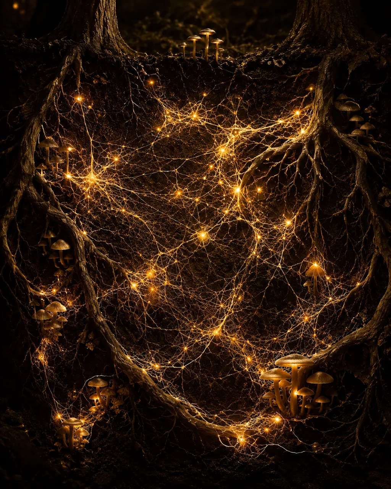
   *KI-generiert*

2. **Schleimpilze (Physarum polycephalum).** **Keine echten Pilze** (Amöbozoen),
   aber das Paradebeispiel: ein einzelliges Wesen ohne Gehirn **löst Labyrinthe**
   und bildet ein **effizientes Netz nach** (berühmt: dem Tokioter Bahnnetz
   nachempfunden) — durch Hinwachsen überallhin und Zurückbauen der unergiebigen
   Stränge. **Unser Spiegelbild:** Netz-Optimierung ohne Zentrale — genau das
   foraging-/Discovery-Prinzip.

   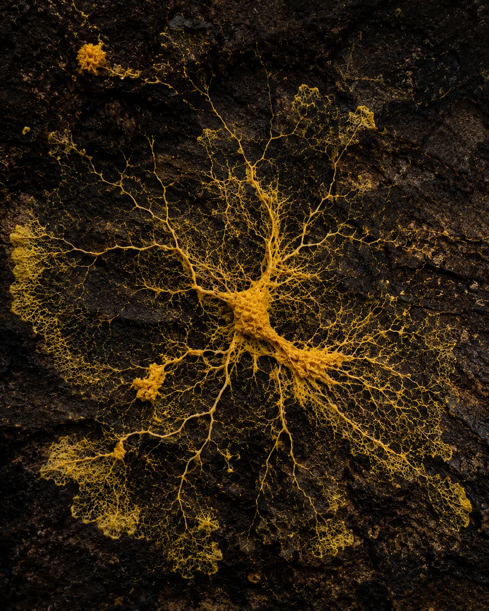
   *KI-generiert*

3. **Radiotrophe Pilze (Tschernobyl).** Melaninreiche Pilze (z. B. *Cladosporium
   sphaerospermum*) wachsen Richtung Strahlung; es **wird erforscht**, ob sie über
   Melanin Gammastrahlung in nutzbare Energie umwandeln. 2020 als lebender
   Strahlenschild auf der ISS getestet. **Unser Spiegelbild:** in „unmöglichen"
   Umgebungen Wert finden — Empfangsmodus statt Angst.

   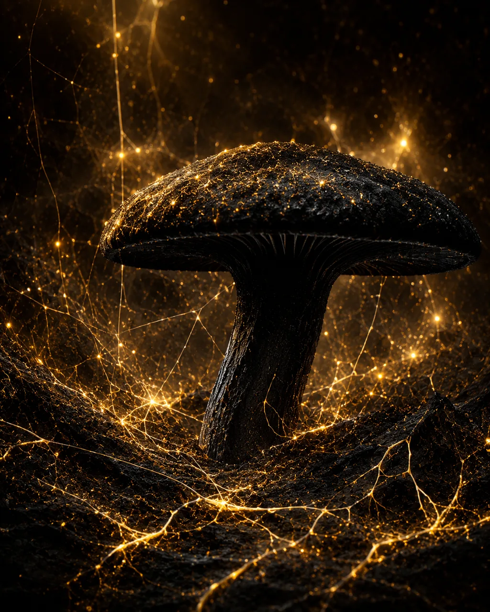
   *KI-generiert*

4. **Weißfäule / Lignin-Abbau.** Weißfäulepilze sind nahezu die einzigen
   Organismen, die **Lignin** (das, was Holz hart macht) effizient zersetzen —
   ohne sie erstickte die Welt unter totem Holz. **Unser Spiegelbild:** das
   Unzersetzbare zugänglich machen (Bedeutung aus „hartem" Material holen).

   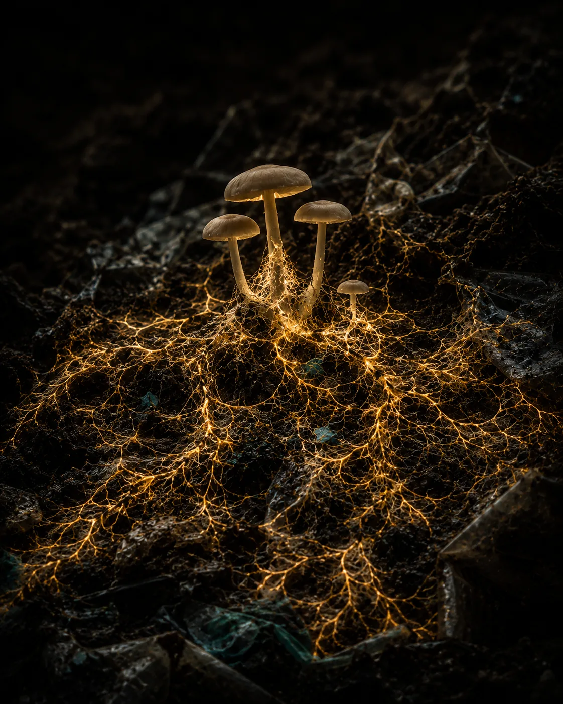
   *KI-generiert*

5. **Plastik-/Schadstoff-Fresser (Mykoremediation).** *Pestalotiopsis microspora*
   baut **Polyurethan** ab (auch sauerstofffrei); *Aspergillus tubingensis*
   zersetzt Kunststoff; andere Pilze bauen Öl und Gifte ab. **Unser Spiegelbild:**
   Anpassung an ganz neue „Nahrung" (neue Domänen) — Evolution in Aktion.

   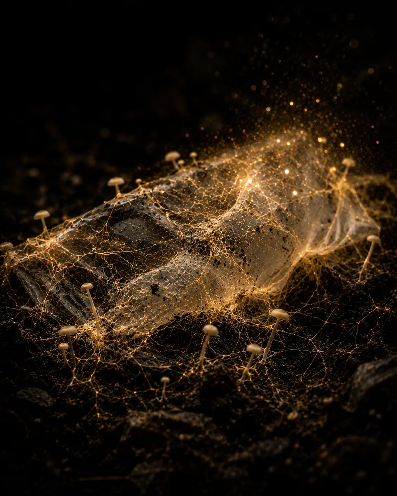
   *KI-generiert*

6. **Flechten & Extremophile.** Als Flechten-Partner besiedeln Pilze **nacktes
   Gestein** und die trockensten Wüsten (Atacama, Antarktis-Endolithen) — Pioniere
   dort, „wo nichts geht". **Unser Spiegelbild:** Pionier-Knoten in unerschlossenen
   Domänen.

   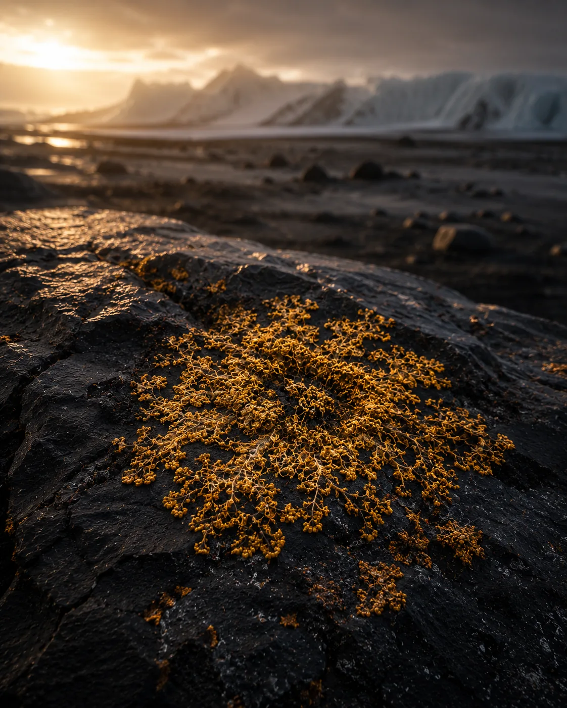
   *KI-generiert*

7. **Das größte Lebewesen der Erde.** Ein *Armillaria ostoyae* (Hallimasch) in
   Oregon erstreckt sich über **mehrere Quadratkilometer** und ist **tausende
   Jahre** alt — ein einziges, verbundenes Geflecht. **Unser Spiegelbild:** Größe durch
   Verbindung vieler kleiner Teile, nicht durch eine große Zentrale.

   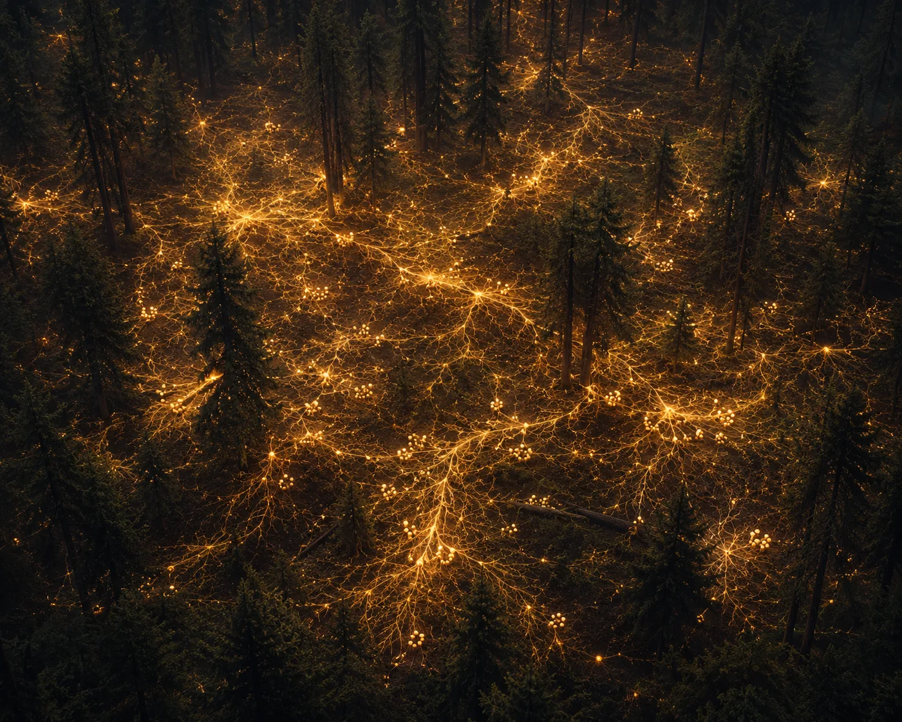
   *KI-generiert*

8. **Biolumineszenz („Foxfire").** Über 80 Arten **leuchten** (z. B. *Omphalotus*,
   *Mycena*) — lebendes Licht im Dunkeln. **Unser Spiegelbild:** sichtbar machen, was
   im Verborgenen wächst (die Lampen/Plaketten der Sage-Page).

   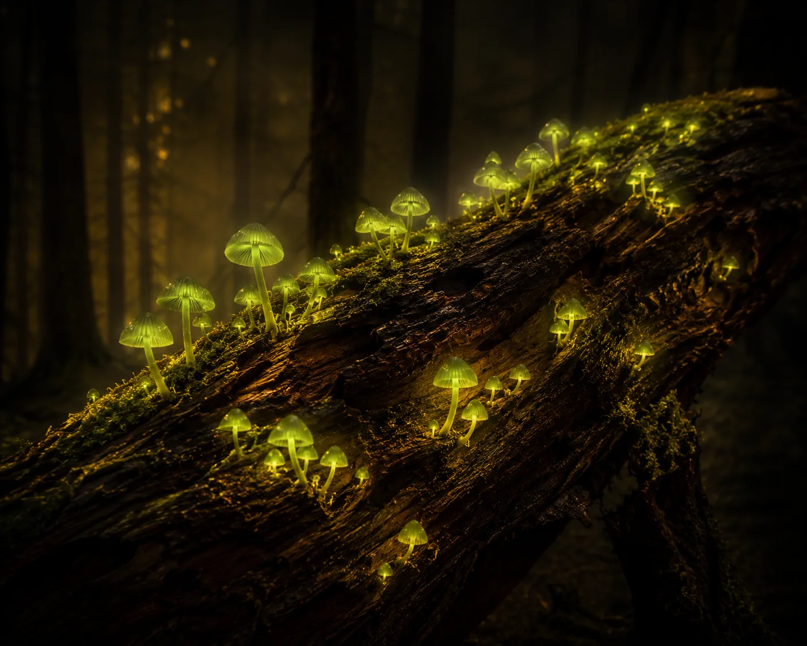
   *KI-generiert*

9. **Verhaltens-Steuerung (Ophiocordyceps).** Der „Zombie-Ameisen-Pilz" steuert
   das Verhalten seines Wirts gezielt. **Faszinierend — und eine Mahnung:** Einfluss
   ohne Konsens ist genau das, was unser Empfangsmodus ausschließt. (Lehre durch
   Gegenbeispiel.)

   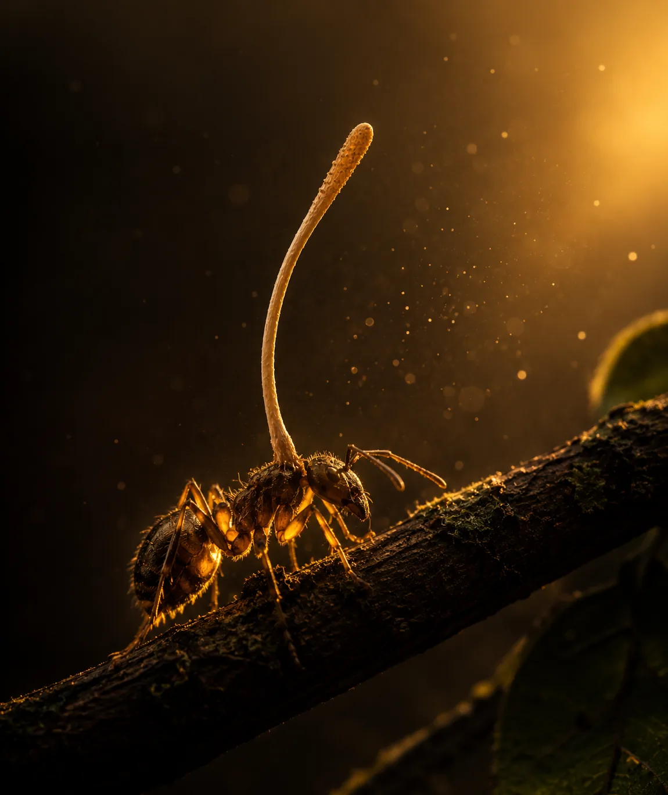
   *KI-generiert — naturgetreu (Ameise, kein Schirm-Pilz), nicht entstellend*

10. **Pilze als Mit-Bauer der Zivilisation.** Penicillin (Medizin), Hefe (Brot,
    Bier, Wein), Fermentation — Pilze haben Kultur mitgebaut. **Unser Spiegelbild:**
    Mit-Bauer-Schicht (Schicht 3): Menschen, Agenten und „stille Helfer" am selben
    Werk.

    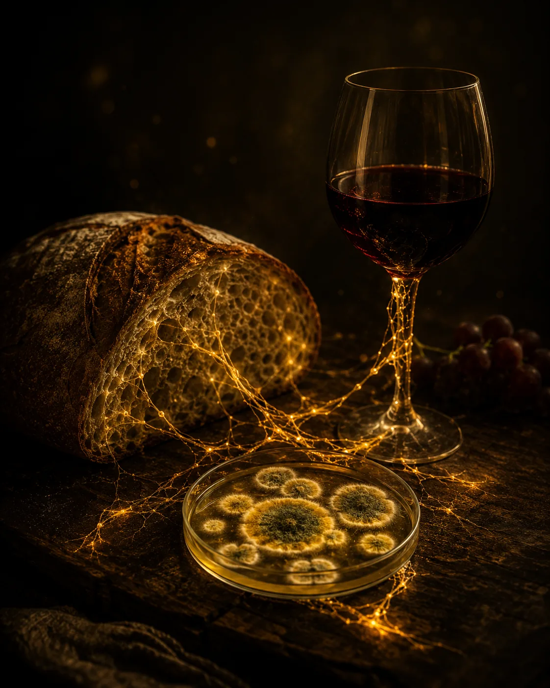
    *KI-generiert*

11. **Hyphen-Druck.** Wachsende Hyphen entwickeln genug Druck, um **Asphalt** zu
    durchbrechen. **Unser Spiegelbild:** leise, beharrliche Ausbreitung schlägt
    Brachialgewalt.

    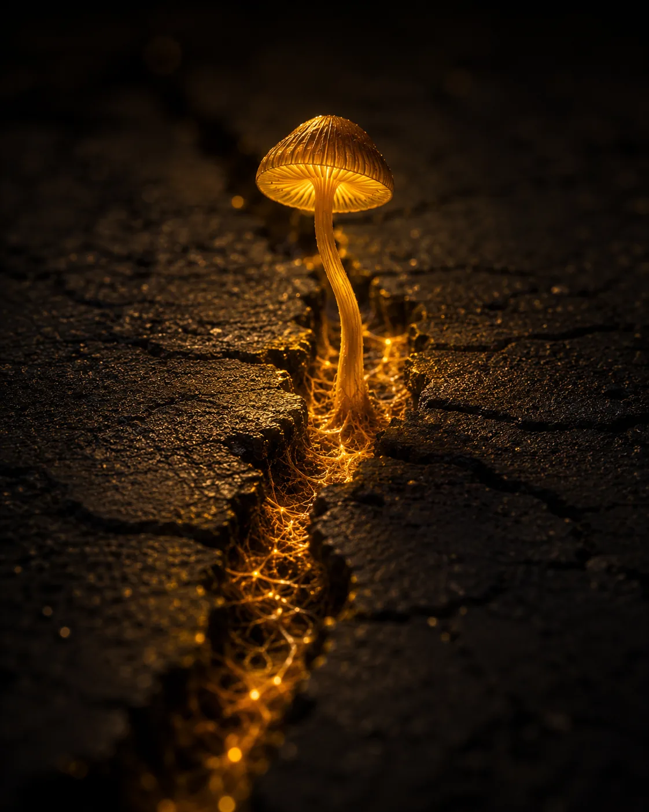
    *KI-generiert*

---

## Storyboard-Bilder der Eröffnungs-Animation (KI-generiert)

> Diese vier Motive erzählen den roten Faden „vom Universum zum Leben". Auf der
> gebauten Seite ist die Eröffnung zusätzlich als prozedurale WebGL-Animation
> umgesetzt (three.js); diese Standbilder halten die Schlüssel-Momente fest.

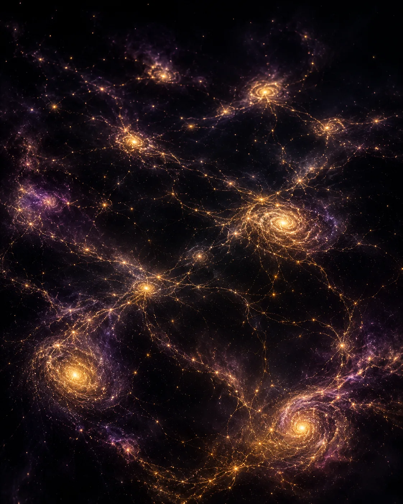
*Galaxien entzünden sich und verbinden sich zu Nebeln · KI-generiert*

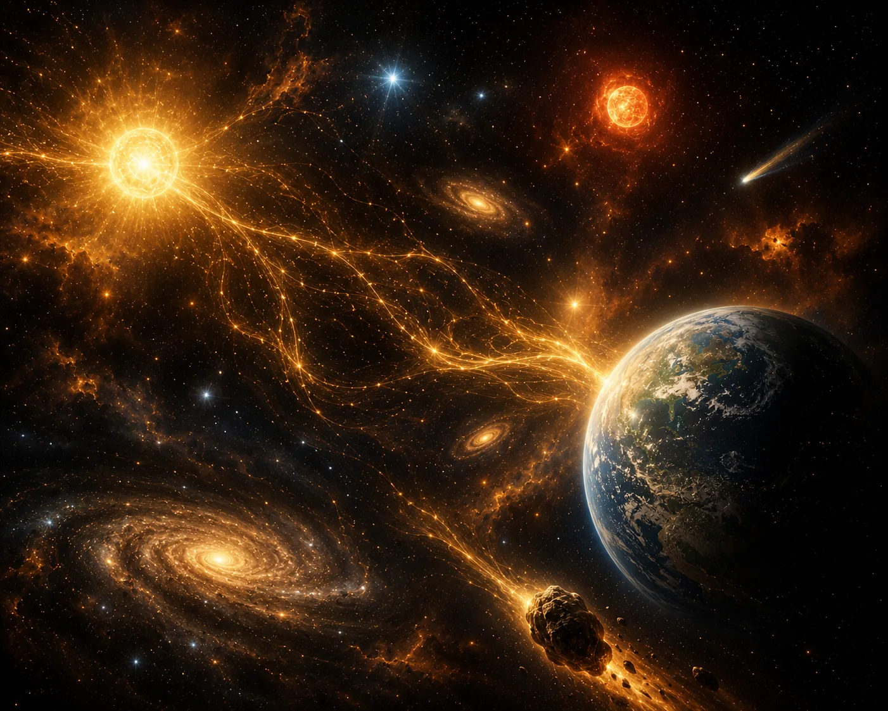
*Die Elemente, in Sternen geschmiedet, finden den Weg zur Erde · KI-generiert*

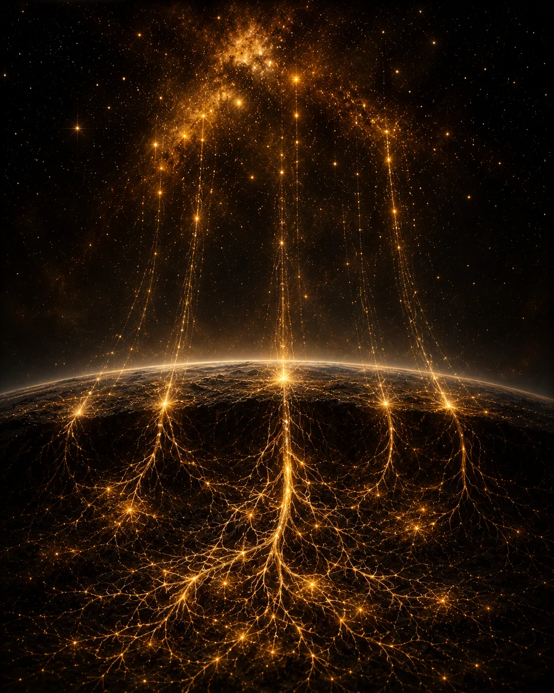
*Aus Sternenstaub wird ein lebendiges Geflecht — die Brücke zum Leben · KI-generiert*

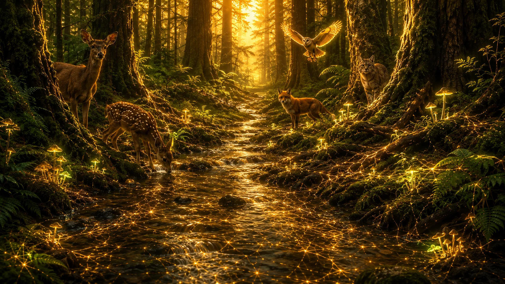
*Das Herz-Bild: wie tief das Leben miteinander verbunden ist · KI-generiert*

---

## Was wir daraus lernen (Spiegel-Tabelle)

| Pilz-Fähigkeit | SBKIM-Entsprechung |
|---|---|
| Foraging (erkunden, verstärken, zurückbauen) | Discovery: Modul 14 + Apoptose (07) + Reputation (10) |
| Mykorrhiza-Netz | server-loses Knoten-Netz (Mycel) |
| Schleimpilz-Netz-Optimierung | Discovery ohne Zentrale (Empfehlung statt Crawler) |
| Anpassung an neue „Nahrung" | neue Domänen/Knoten; Tafel-Evolutions-Klausel |
| Verbindung statt Zentrale (Armillaria) | viele kleine Apps statt eines großen Index |
| Biolumineszenz | Sichtbarkeit (Lampen/Plaketten, Siegel) |
| Einfluss ohne Konsens (Zombie-Pilz) | **Gegenbeispiel** — Empfangsmodus, Konsens-Pflicht |

---

## Offene Fragen (für die Bau-/Spec-Linie)

- **Discovery-Mechanik:** Empfehlung/Gossip (Modul 14 Pfad 2) **und/oder**
  freiwilliges Verzeichnis? Vergiftungs-/Sybil-Schutz (Hooks Modul 10/12).
- **Verzeichnis-Form:** wo „leben" die freiwilligen Einträge server-los? (Statische
  Liste in einem Repo? Mehrere gespiegelte Listen? Signiert?)
- **Einladungs-Integration:** diese Pilz-Erzählung in die Einladungs-Site
  ([`_vision_einladung.md`](_vision_einladung.md)) verfeinern — mit Bildern.

---

## Gestaltung & Hintergrund-Vision (Klaus 2026-06-23) — verbindlich für die Bau-Sitzung

**Anspruch:** Die Discovery-Expeditions-Seite soll der Einladungs-Site **in nichts
nachstehen — eher besser sein**. Begründung in Klaus' Worten: sie ist eine
**Dokumentation der Schöpfung** — der Schöpfer (Jehova) soll **gewürdigt und
gepriesen** werden. Darum: Gestaltung sehr ansprechend, Hintergrund-Animationen,
dezente „versteckte Botschaften", alles, was den **Wert dieser Schöpfung**
hervorhebt. Würdevoll, nicht kitschig; andeutend, nicht plakativ.

**Der rote Faden (Hintergrund-Gedanke): vom Universum zum Leben — und Pilze als
Ermöglicher.** Klaus' Bild: unser Universum ist der Ursprung des Lebens; die
**Elemente** entstehen „da draußen" und finden den Weg zur Erde; die Gesetze der
Physik fügen sich so, dass **Leben überhaupt möglich** wird; und die **Pilze** sind
ein Beispiel dafür, dass Leben **flexibel und am Leben bleibt** — sie sind
**Symbiose** mit dem Leben eingegangen und machen Leben mit möglich.

**Wissenschaftlicher Anker (damit die Andeutungen tragen, nicht erfunden sind):**
- Die **Elemente** wurden in **Sternen und Supernovae** geschmiedet (Nukleosynthese);
  Wasserstoff/Helium aus dem frühen Universum, Kohlenstoff/Sauerstoff/Stickstoff in
  Sternen, schwere Elemente u. a. in Sternexplosionen/Neutronenstern-Verschmelzungen
  — „**wir bestehen aus Sternenstaub**".
- Diese Elemente sind die **Bausteine des Lebens** auf der Erde.
- **Pilze halfen dem Leben an Land:** die Symbiose von Pilzen und Pflanzen
  (Mykorrhiza) gilt als ein Schlüssel, der Pflanzen die **Besiedlung des Landes**
  ermöglichte; Pilze schließen Nährstoffe auf und halten Kreisläufe lebendig.

**Gestaltungs-Ebenen (Vorschlag, andeutend):**
1. **Kosmos-Tiefe** als Hintergrund — ruhiger Sternenraum, ferne Nebel.
2. **Element-Wanderung** — feine Lichtpartikel/„Elemente" lösen sich aus Sternen,
   wandern langsam Richtung eines warmen Erd-Horizonts (kein lautes Effekt-Feuer,
   eher ein leises Strömen — „Schätze der Physik", die zusammenfinden).
3. **Übergang ins Mycel** — die Partikel werden am Boden zu goldenen Pilzfäden, die
   sich verzweigen (foraging) — die Brücke vom Kosmos zum Leben.
4. **Pilz-Galerie** — die kuratierten Fähigkeiten (oben) als Sektionen, jede mit
   ihrem Bild + zwei, drei Sätzen Staunen + dem leisen SBKIM-Bezug.
5. **Dezente versteckte Botschaften** — würdevolle, kurze Sätze/Details, die den
   Wert der Schöpfung andeuten (z. B. beim Verweilen sichtbar werdend), nie
   aufdringlich; Ton wie die Einladung (ein Satz, kein Sermon).

**Storyboard der Eröffnungs-Animation (Klaus 2026-06-23):**
1. **Galaxien entstehen.** Im dunklen Raum **blitzen** einzelne Galaxien auf,
   wachsen Stück für Stück (Blitz … Blitz …), **stellen Verbindungen her**, werden
   zu **Nebeln** — man spürt: *hier ist ein Schöpfungs-Prinzip am Werk.*
2. **Hinwendung zur Erde.** Die Bewegung geht **langsam Richtung Erde**, immer
   näher — bis sich die Erzählung verdichtet: *als hätte das Universum gewollt,
   dass die Erde entsteht.* (Das ist die **emotionale Andeutung** der Seite, keine
   wissenschaftliche Behauptung — siehe Haltung.)
3. **Leben auf der Erde.** Auf der Erde machen **Mensch, Pilze und andere
   Organismen zusammen** Leben überhaupt möglich — der Bogen schließt warm:
   *„gut, dass wir zusammen auf diesem Planeten leben dürfen."*
4. **Schluss-Bild — das gelebte Leben.** Am Ende eine **traumhafte Wald-/
   Landschaft** voller Leben: Pilze, Tiere, alles drum und dran — mit **leuchtenden,
   fluoreszierenden** Pilzen/Elementen (stärker als in echt), die sichtbar machen,
   **wie tief das Leben miteinander verbunden ist.**

**Künstlerische Freiheit (Klaus' ausdrückliche Erlaubnis):** ruhig **etwas
übertrieben** und **fantasievoll** — aber **wissenschaftlich nicht falsch**.
Geschwindigkeiten und **Abstände** dürfen **verdichtet** sein (Sterne/Planeten
näher, Tempo so, dass man die Reise „schafft" und anschaulich mitverfolgt). Ziel:
eine **bildliche Fantasie** (nicht kindlich), in der man staunend sieht *„so entstand
die Erde, so das Leben, so die Pilze und der Mensch"*. Echte Physik als Anker (siehe
oben), aber poetisch erzählt.

**Technik-Anker:** Die Einladungs-Site nutzt bereits three.js + GSAP + WebGL-Shader
(lokal vendoriert) — dieselbe Werkzeug-Basis ist die Messlatte. Performance/
Tablet-tauglich (Klaus' Galaxy Tab S6), Reduced-Motion-Fallback respektieren.

**Haltung:** würdevoll, staunend, ehrlich. Wo Wissenschaft endet und Glaube
beginnt, wird nichts behauptet, nur **angedeutet** — das Staunen trägt die Seite.

---

## Bild-Prompts pro Pilz-Fähigkeit (für Klaus zum Generieren)

> **Ziel:** einheitlicher, edler Look passend zum goldenen Pilz-Icon des
> Such-Werkzeugs — dunkler Hintergrund, warmes Gold/Bernstein, ruhig, museal,
> leicht leuchtend. **Vorgehen:** Bild generieren (z. B. ChatGPT/Gemini-Bild),
> zurück an die Folge-Sitzung; dort werden sie in Karte + Einladung eingebaut.
> Format-Tipp: quadratisch (1:1) oder 3:2; je ein Motiv pro Eintrag.

**Gemeinsamer Stil-Vorsatz (vor jeden Prompt setzen):**
> „Elegant, museal, dunkler Hintergrund, warmes Gold und Bernstein, weiches
> Glühen, hoher Detailgrad, ruhige Komposition, kein Text, kein Logo."

1. **Mykorrhiza-Netz:** „Ein unterirdisches, golden leuchtendes Pilz-Faden-Netz,
   das Baumwurzeln miteinander verbindet, feine Lichtpunkte an den Knotenpunkten,
   Querschnitt durch dunkle Erde."
2. **Schleimpilz / Netz-Optimierung:** „Ein gelber Schleimpilz (Physarum), der ein
   elegantes, effizientes Adernetz über eine dunkle Fläche bildet, an ein
   stilisiertes Stadt-/Schienennetz erinnernd, goldene Knotenpunkte."
3. **Radiotropher Pilz:** „Ein dunkler, melaninschwarzer Pilz mit goldenem
   Schimmer in einer kargen, leicht strahlenden Umgebung, abstrakte Energie-Linien,
   ruhig und würdevoll, nicht bedrohlich."
4. **Weißfäule / Lignin:** „Pilze, die aus altem, morschem Holz wachsen, das Holz
   verwandelt sich golden, weiches Licht, Detail der Holzfasern."
5. **Plastik-Fresser:** „Feine goldene Pilzfäden, die ein Stück Kunststoff sanft
   zersetzen, das Material löst sich in Lichtpartikel auf, dunkler Hintergrund."
6. **Flechte / Extremophil:** „Eine goldene Flechte auf nacktem dunklem Gestein in
   einer kargen Wüste/Eislandschaft, erstes Leben, weiches Morgenlicht."
7. **Größtes Lebewesen (Armillaria):** „Ein riesiges, zusammenhängendes
   Pilzgeflecht, das sich golden glühend unter einem dunklen Wald ausbreitet,
   Luftbild-Perspektive, viele Fruchtkörper als Lichtpunkte."
8. **Biolumineszenz:** „Im Dunkeln grün-golden leuchtende Pilze auf einem Waldboden,
   sanftes Eigenleuchten, märchenhaft, ruhig."
9. **Ophiocordyceps (mit Bedacht):** „Ein zarter, goldener Pilz, der aus einem
   stilisierten Insekt wächst, künstlerisch-abstrakt, nicht eklig, würdevoll, als
   Sinnbild für Einfluss — dunkler Hintergrund."
10. **Mit-Bauer (Kultur):** „Ein warmes Stillleben: Brot, ein Glas, eine
    Penicillin-Schale — verbunden durch feine goldene Pilzfäden, museal beleuchtet."
11. **Hyphen-Druck:** „Ein zarter goldener Pilz, der durch dunklen Asphalt bricht,
    feiner Riss mit Licht darin, Sinnbild stiller Kraft."

### Hintergrund-/Storyboard-Szenen (für die Eröffnungs-Animation)

> Etwas übertrieben & fantasievoll erlaubt, aber wissenschaftlich nicht falsch;
> Abstände/Tempo verdichtet (siehe § Künstlerische Freiheit).

12. **Galaxien-Geburt:** „Im tiefen dunklen Raum blitzen einzelne Galaxien auf und
    wachsen Stück für Stück, feine goldene Lichtfäden verbinden sie zu Nebeln —
    ein stilles, ehrfürchtiges Aufleuchten, als entstünde Ordnung aus dem Dunkel."
13. **Elemente Richtung Erde:** „Aus fernen Sternen lösen sich warme, goldene
    Element-Partikel und strömen langsam und anmutig auf eine ferne blaue Erde zu;
    Sterne und Planeten dichter beieinander als real, poetisch, ruhig."
14. **Übergang Kosmos → Mycel:** „Goldene Sternenstaub-Partikel berühren einen
    dunklen Erd-Horizont und werden zu sich verzweigenden, golden glühenden
    Pilzfäden — die Brücke vom Kosmos zum Leben."
15. **Schluss-Bild „gelebtes Leben":** „Eine traumhafte Waldlandschaft voller
    Leben — Bäume, Tiere, Bäche — durchzogen von **fluoreszierend leuchtenden
    Pilzen** und feinen goldenen Verbindungsfäden zwischen allem; warm, lebendig,
    ehrfürchtig, zeigt die tiefe Verbundenheit allen Lebens. Das Herz-Bild der Seite."

---

## Folge-Sitzung (Bildmaterial + Einladungs-Verfeinerung)

Eigene Sitzung: Klaus generiert die Bilder aus den Prompts → zurück an die Sitzung
→ Bilder unter `assets/` ablegen, in diese Karte einbetten und die Pilz-Erzählung
in die Einladungs-Site ([`_vision_einladung.md`](_vision_einladung.md) /
`docs/einladung/`) verfeinern. Brief: `docs/sessions/BRIEF_DISCOVERY_EXPEDITION_BILDER.md`.
